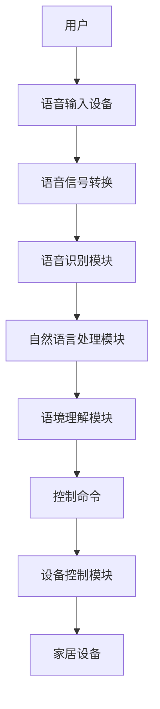

                 

### 提示词驱动的智能家居场景设计

> 关键词：智能家居、提示词驱动、自然语言处理、语音识别、语境理解

> 摘要：本文探讨了提示词驱动的智能家居场景设计，从背景介绍到核心概念解析，再到系统架构设计与实现，详细阐述了如何利用提示词驱动技术提升智能家居的用户体验。

---

随着物联网技术的普及和人工智能的发展，智能家居系统已成为现代家庭生活中不可或缺的一部分。智能家居通过将家庭设备互联，为用户提供了更加便捷、舒适、安全的生活方式。然而，如何在现有的智能家居系统中引入提示词驱动的交互方式，进一步提升用户体验，成为了当前研究的热点。

### 第一部分：提示词驱动的智能家居场景设计背景介绍

#### 1.1 问题背景

现代智能家居系统通常提供多种交互方式，如手动操作、触摸屏操作、语音控制等。其中，语音控制因其便捷性受到广泛关注。通过提示词驱动的交互方式，可以实现更加自然、智能的语音交互，从而提高用户的操作体验。本文将探讨如何利用提示词驱动技术设计高效、智能的智能家居场景。

#### 1.2 问题描述

在智能家居场景中，用户需要与各种家庭设备进行交互。传统的交互方式可能存在以下问题：
- 手动操作需要用户亲自前往设备进行操作，不够便捷。
- 触摸屏操作需要用户查看屏幕，可能存在误操作。
- 语音控制虽然便捷，但传统语音交互系统可能存在理解误差。

提示词驱动的交互方式能够解决上述问题，实现更加自然、智能的交互。

#### 1.3 问题解决

本文将从以下几个方面探讨提示词驱动的智能家居场景设计：
1. **提示词驱动的核心概念及原理**：介绍自然语言处理、语音识别、语境理解等核心概念。
2. **提示词驱动的智能家居系统架构设计**：讨论系统架构设计，包括前端交互层、中间处理层、后端设备层等。
3. **提示词驱动的智能场景实现与优化**：实现智能场景的具体步骤和方法，以及优化策略。
4. **提示词驱动的用户体验提升策略**：分析如何提升用户体验，包括交互设计、响应速度等。

#### 1.4 边界与外延

本文主要关注基于提示词驱动的智能家居场景设计，涉及的核心概念包括自然语言处理、语音识别、语境理解等。同时，本文将探讨提示词驱动的交互方式在智能家居系统中的应用，如家庭娱乐、安防监控、家电控制等。

#### 1.5 概念结构与核心要素组成

**概念结构**
- 智能家居
- 提示词驱动
- 自然语言处理
- 语音识别
- 语境理解

**核心要素**
- 智能家居设备
- 用户需求分析
- 交互流程设计
- 系统架构优化
- 用户体验提升

#### 1.6 本章小结

本章对提示词驱动的智能家居场景设计进行了背景介绍，阐述了问题的核心概念与要素组成。在后续章节中，将深入探讨提示词驱动的智能家居场景设计的核心原理、系统架构、实现与优化，以及用户体验提升策略。

### 第二部分：提示词驱动的核心概念与原理

#### 2.1 自然语言处理

自然语言处理（Natural Language Processing，NLP）是人工智能领域的一个重要分支，旨在让计算机能够理解、解释和生成人类语言。在智能家居场景设计中，NLP技术能够帮助我们理解用户的提示词，从而实现智能交互。

##### 2.1.1 NLP的基本概念

- **语言模型**：用于预测文本序列的概率分布。例如，给定一个单词序列，语言模型可以预测下一个单词是什么。
- **词性标注**：对文本中的词语进行分类，标记出词语的词性。例如，“智能家居”中的“智能”是形容词，“家居”是名词。
- **命名实体识别**：识别文本中的特定实体，如人名、地名等。例如，“张三住在北京”中的“张三”和“北京”是命名实体。
- **语义理解**：理解文本的含义，包括实体识别、关系抽取、情感分析等。例如，理解句子“今天天气很好，适合出去散步”的含义。

##### 2.1.2 NLP在智能家居中的应用

- **提示词理解**：通过NLP技术，对用户的语音提示词进行理解，识别出关键词和语义。例如，理解“打开客厅的灯”中的“打开”和“客厅的灯”。
- **命令执行**：根据用户的提示词，执行相应的家居设备控制命令。例如，根据“打开客厅的灯”命令，打开客厅的灯光。

##### 2.1.3 NLP在智能家居中的挑战

- **多义性问题**：一个词或短语可能有多个含义，如何准确识别用户的意图是一个挑战。
- **上下文理解**：理解用户的上下文信息，如对话历史、场景等，是一个复杂的问题。

##### 2.1.4 NLP技术发展

- **深度学习**：深度学习技术在NLP领域取得了显著成果，如基于循环神经网络（RNN）和变换器（Transformer）的模型。
- **预训练语言模型**：预训练语言模型（如GPT、BERT）通过在海量文本数据上进行预训练，提高了语言理解能力。

#### 2.2 语音识别

语音识别（Speech Recognition）技术能够将人类的语音转换为文本，是实现提示词驱动交互的关键技术之一。

##### 2.2.1 语音识别的基本概念

- **麦克风采集**：通过麦克风收集用户的语音信号。
- **声学模型**：对语音信号进行特征提取，如频谱分析。
- **语言模型**：对转换后的文本进行语义理解。

##### 2.2.2 语音识别在智能家居中的应用

- **提示词输入**：用户通过语音输入提示词，设备进行语音识别，获取文本信息。
- **命令执行**：根据识别出的文本信息，执行相应的家居设备控制命令。

##### 2.2.3 语音识别技术发展

- **隐马尔可夫模型（HMM）**：早期的语音识别模型，基于概率模型。
- **高斯混合模型（GMM）**：用于特征提取。
- **深度神经网络（DNN）**：用于声学模型和语言模型。
- **卷积神经网络（CNN）**：用于特征提取。
- **长短时记忆网络（LSTM）**：用于语音序列建模。
- **变换器（Transformer）**：用于语言理解，是当前最先进的语音识别模型。

#### 2.3 语境理解

语境理解（Context Understanding）是指对用户在不同场景下的交互意图进行识别和理解，从而提供更加个性化的服务。

##### 2.3.1 语境理解的基本概念

- **场景识别**：根据用户的行为和环境信息，识别出用户所处的场景。
- **意图识别**：理解用户在特定场景下的交互意图。

##### 2.3.2 语境理解在智能家居中的应用

- **场景适应**：根据用户所处场景，自动调整家居设备的设置，如照明、温度等。
- **意图识别**：理解用户的交互意图，提供更加智能的响应。

##### 2.3.3 语境理解技术发展

- **基于规则的语境理解**：使用规则库进行场景识别和意图识别。
- **基于机器学习的语境理解**：使用机器学习方法，如监督学习、无监督学习和强化学习等。
- **多模态语境理解**：结合文本、语音、图像等多模态信息进行语境理解。

#### 2.4 本章小结

本章介绍了提示词驱动的核心概念与原理，包括自然语言处理、语音识别和语境理解。这些技术在智能家居场景设计中起着至关重要的作用，为用户提供更加智能、便捷的交互体验。在后续章节中，将深入探讨这些技术在智能家居场景设计中的应用和实现。

### 第三部分：提示词驱动的智能家居系统架构设计

#### 3.1 系统架构概述

提示词驱动的智能家居系统架构可以分为三个主要层次：前端交互层、中间处理层和后端设备层。

##### 3.1.1 前端交互层

前端交互层主要负责与用户进行交互，接收用户的提示词，并将其发送到中间处理层。前端交互层可以包括语音输入设备（如麦克风、话筒）、触摸屏输入设备等。

##### 3.1.2 中间处理层

中间处理层主要负责对前端交互层接收到的提示词进行处理，包括自然语言处理、语音识别和语境理解等。中间处理层的结果将发送到后端设备层，以执行相应的控制命令。

##### 3.1.3 后端设备层

后端设备层负责与实际的家居设备进行交互，执行中间处理层发送的控制命令。后端设备层可以包括各种智能家居设备，如灯光、空调、安防设备等。

#### 3.2 系统架构设计

下面是提示词驱动的智能家居系统架构的详细设计。

##### 3.2.1 前端交互层设计

前端交互层的设计主要包括语音输入设备的选取和语音输入流程的设计。

- **语音输入设备选取**：根据实际需求，可以选择合适的语音输入设备，如内置麦克风、外置麦克风、无线话筒等。

- **语音输入流程设计**：用户通过语音输入设备发出提示词，系统将采集到的语音信号转换为音频文件，然后通过语音识别模块进行识别。

##### 3.2.2 中间处理层设计

中间处理层的设计主要包括自然语言处理、语音识别和语境理解模块的设计。

- **自然语言处理模块设计**：自然语言处理模块负责对语音识别结果进行语义分析，提取出关键信息，如动作指令、设备名称等。

- **语音识别模块设计**：语音识别模块负责将用户的语音输入转换为文本，可以使用现有的语音识别库，如Google的Speech-to-Text库。

- **语境理解模块设计**：语境理解模块负责根据上下文信息理解用户的意图，可以结合历史交互记录和环境信息进行语境理解。

##### 3.2.3 后端设备层设计

后端设备层的设计主要包括设备控制模块的设计。

- **设备控制模块设计**：设备控制模块负责根据中间处理层发送的控制命令，对家居设备进行控制。设备控制模块可以与家居设备的API进行交互，如通过HTTP请求发送控制命令。

#### 3.3 系统架构图

以下是提示词驱动的智能家居系统架构的Mermaid流程图：



#### 3.4 系统架构优化

为了提高系统性能和用户体验，可以对系统架构进行优化。

- **分布式架构**：将系统架构部署在分布式环境中，可以提高系统的可扩展性和容错性。

- **云计算与边缘计算结合**：利用云计算和边缘计算的优势，将部分处理任务分配到边缘设备上进行处理，可以减少网络延迟和数据传输量。

- **多模态交互**：引入多模态交互方式，如语音、手势、图像等，可以提供更加丰富的交互体验。

#### 3.5 本章小结

本章介绍了提示词驱动的智能家居系统架构设计，包括前端交互层、中间处理层和后端设备层的详细设计。在后续章节中，将探讨如何实现这些功能，并优化系统架构，以提升用户体验。

### 第四部分：提示词驱动的智能场景实现与优化

#### 4.1 智能场景设计

智能场景是指用户与家居设备之间的一种特定的交互模式，通过提示词驱动的交互方式，可以实现更加智能的家居控制。

以下是一个示例智能场景：

**场景**：用户在客厅看电视时，希望调节房间的灯光，以营造一个舒适的观影环境。

**提示词**：“把客厅的灯光调暗一些。”

**实现步骤**：

1. **提示词识别**：系统接收到用户的提示词后，通过语音识别模块将其转换为文本。
2. **语义理解**：自然语言处理模块对转换后的文本进行分析，提取出关键词（如“客厅”、“灯光”、“调暗”）。
3. **设备控制**：根据提取出的关键词，系统识别出需要控制的设备（如客厅的灯光），并执行相应的控制命令。
4. **响应反馈**：系统向用户反馈控制结果，如“客厅的灯光已经调暗”。

#### 4.2 智能场景优化

为了提高智能场景的响应速度和准确性，可以对智能场景进行优化。

1. **实时语音识别**：采用实时语音识别技术，可以在用户说话的同时进行识别，减少响应时间。
2. **上下文理解**：结合用户的上下文信息，如历史交互记录、用户偏好等，提高对用户意图的识别准确性。
3. **多模态交互**：引入多模态交互方式，如手势、图像等，可以提供更加丰富的交互体验。
4. **自动化调整**：根据用户的使用习惯，自动调整家居设备的状态，如自动调整房间温度、光线等。

#### 4.3 智能场景实现案例

以下是一个智能场景的实现案例：

**场景**：用户在早晨起床时，希望智能家居系统能够自动完成一系列的准备工作，如打开窗帘、调节灯光、播放音乐等。

**提示词**：“早晨好，帮我准备一下。”

**实现步骤**：

1. **提示词识别**：系统接收到用户的提示词后，通过语音识别模块将其转换为文本。
2. **语义理解**：自然语言处理模块对转换后的文本进行分析，提取出关键词（如“早晨”、“准备”）。
3. **设备控制**：
   - 打开窗帘：通过智能家居系统控制窗帘电机，打开窗帘。
   - 调节灯光：根据用户偏好，调整客厅和卧室的灯光亮度。
   - 播放音乐：通过智能音响系统播放用户喜欢的音乐。
4. **响应反馈**：系统向用户反馈控制结果，如“窗帘已经打开，灯光已调节，音乐已经播放”。

#### 4.4 本章小结

本章介绍了提示词驱动的智能场景设计，包括场景设计、优化方法和实现案例。通过优化智能场景，可以提升用户的操作体验，实现更加智能化的家居控制。在后续章节中，将探讨如何进一步提升用户体验，以及在实际应用中的最佳实践。

### 第五部分：提示词驱动的用户体验提升策略

#### 5.1 设计原则

在提示词驱动的智能家居场景设计中，用户体验的提升至关重要。以下是一些设计原则：

- **简单易用**：设计简洁直观的交互界面，使用户能够轻松理解和使用。
- **快速响应**：优化系统响应速度，减少用户等待时间。
- **个性化**：根据用户的使用习惯和偏好，提供个性化的服务。
- **一致性**：确保系统在不同设备和平台上的操作一致性。

#### 5.2 交互设计

交互设计是提升用户体验的关键环节。以下是一些交互设计策略：

- **语音交互**：提供自然流畅的语音交互体验，使用户能够方便地与智能家居系统进行交流。
- **多模态交互**：结合语音、手势、图像等多种交互方式，提供更加丰富的交互体验。
- **上下文感知**：根据用户的上下文信息，如时间、地点、历史交互记录等，提供相关建议和操作。
- **反馈机制**：及时响应用户的操作，提供清晰的反馈，如声音、灯光、动画等。

#### 5.3 技术实现

为了实现提示词驱动的用户体验提升，需要借助一系列技术：

- **自然语言处理（NLP）**：通过对用户提示词的理解，实现智能交互。
- **语音识别**：将用户的语音输入转换为文本，实现语音交互。
- **语境理解**：根据上下文信息理解用户的意图，提供个性化的服务。
- **边缘计算**：将部分计算任务分配到边缘设备上，提高系统响应速度。
- **物联网（IoT）**：将家居设备互联，实现设备的自动化控制和数据共享。

#### 5.4 用户反馈与迭代

用户反馈是提升用户体验的重要依据。以下是一些用户反馈与迭代策略：

- **用户调研**：定期进行用户调研，了解用户的需求和反馈。
- **A/B测试**：通过A/B测试，比较不同设计的用户体验，优化系统设计。
- **用户反馈机制**：建立用户反馈机制，收集用户的建议和意见。
- **快速迭代**：根据用户反馈，快速迭代系统设计，持续优化用户体验。

#### 5.5 本章小结

本章介绍了提示词驱动的用户体验提升策略，包括设计原则、交互设计、技术实现和用户反馈与迭代。通过这些策略，可以提升用户的操作体验，实现更加智能化的家居控制。在后续章节中，将探讨在实际应用中的最佳实践，以及可能面临的挑战和解决方案。

### 第六部分：提示词驱动的智能家居场景设计应用

#### 6.1 家庭娱乐场景

在家庭娱乐场景中，提示词驱动的智能家居系统可以提供个性化的娱乐体验。例如，用户可以通过语音控制智能电视、音响系统、投影仪等设备。

**应用示例**：

- 用户说：“打开电视，播放电影《阿凡达》。”
- 系统接收到提示词后，通过语音识别模块将语音转换为文本，然后通过自然语言处理模块提取出关键词。
- 自然语言处理模块识别出“打开电视”和“播放电影《阿凡达》”，然后通过设备控制模块执行相应的操作。

**技术实现**：

- 语音识别模块：使用语音识别库，如Google的Speech-to-Text，将语音转换为文本。
- 自然语言处理模块：使用NLP技术，提取出关键词和语义。
- 设备控制模块：通过智能家居设备的API，控制智能电视、音响系统等设备。

#### 6.2 安防监控场景

在安防监控场景中，提示词驱动的智能家居系统可以提供实时监控和报警功能。例如，用户可以通过语音控制智能摄像头、门锁等设备。

**应用示例**：

- 用户说：“查看客厅的摄像头。”
- 系统接收到提示词后，通过语音识别模块将语音转换为文本，然后通过自然语言处理模块提取出关键词。
- 自然语言处理模块识别出“查看客厅的摄像头”，然后通过设备控制模块启动摄像头。

**技术实现**：

- 语音识别模块：使用语音识别库，将语音转换为文本。
- 自然语言处理模块：使用NLP技术，提取出关键词和语义。
- 设备控制模块：通过智能家居设备的API，控制智能摄像头等设备。

#### 6.3 家电控制场景

在家电控制场景中，提示词驱动的智能家居系统可以方便地控制各种家电设备，如空调、热水器、洗衣机等。

**应用示例**：

- 用户说：“打开空调，设置温度为25摄氏度。”
- 系统接收到提示词后，通过语音识别模块将语音转换为文本，然后通过自然语言处理模块提取出关键词。
- 自然语言处理模块识别出“打开空调”和“设置温度为25摄氏度”，然后通过设备控制模块执行相应的操作。

**技术实现**：

- 语音识别模块：使用语音识别库，将语音转换为文本。
- 自然语言处理模块：使用NLP技术，提取出关键词和语义。
- 设备控制模块：通过智能家居设备的API，控制空调等设备。

#### 6.4 个性化场景定制

用户可以根据自己的需求，自定义智能场景。例如，用户可以设置一个“早晨起床”场景，包括打开窗帘、调节灯光、播放音乐等。

**应用示例**：

- 用户说：“早晨起床，帮我准备一下。”
- 系统接收到提示词后，根据用户设定的场景，依次执行相应的操作。

**技术实现**：

- 用户自定义场景：用户通过智能家居系统设置个性化的场景。
- 场景管理模块：管理用户自定义的场景，包括场景名称、操作命令等。
- 设备控制模块：根据用户自定义的场景，执行相应的操作。

#### 6.5 本章小结

本部分介绍了提示词驱动的智能家居场景设计在不同应用场景中的实现方法和技术细节。通过实际应用案例，展示了提示词驱动技术的优势，如便捷、智能、个性化等。在后续章节中，将继续探讨如何进一步提升智能家居系统的性能和用户体验。

### 第七部分：项目实战

#### 7.1 环境安装

在进行提示词驱动的智能家居系统项目实战之前，首先需要安装和配置必要的开发环境和工具。以下是一个简单的安装步骤：

1. **安装Python环境**：Python是智能家居项目开发的主要编程语言，确保Python环境已安装。
2. **安装语音识别库**：使用如Google的Speech-to-Text库进行语音识别，可以通过pip安装：
   ```shell
   pip install google-cloud-speech
   ```
3. **安装自然语言处理库**：如使用NLTK库进行文本处理和语义分析：
   ```shell
   pip install nltk
   ```
4. **安装智能家居设备驱动**：根据所使用的智能家居设备，安装相应的设备驱动库。

#### 7.2 系统核心实现

以下是一个简单的系统核心实现，包括语音识别、语义分析和设备控制。

1. **语音识别**：使用Google的Speech-to-Text库进行语音识别。
2. **语义分析**：使用NLTK库进行文本处理和语义分析。
3. **设备控制**：通过设备驱动库控制智能家居设备。

**Python代码示例**：

```python
import speech_recognition as sr
import nltk
from nltk.corpus import wordnet
import requests

# 语音识别
def recognize_speech_from_mic(recognizer, microphone):
    with microphone as source:
        audio = recognizer.listen(source)

    response = recognizer.recognize_google(audio)
    print("你说的内容是：" + response)
    return response

# 语义分析
def analyze_semantics(text):
    # 这里可以加入NLTK或其他NLP库进行语义分析
    # 例如，使用wordnet获取文本的语义信息
    synsets = wordnet.synsets(text)
    return synsets

# 设备控制
def control_device(device, command):
    # 这里需要根据设备的API进行控制
    # 例如，使用HTTP请求发送控制命令
    response = requests.post(f"{device}/control", data={"command": command})
    return response.status_code

# 主程序
def main():
    recognizer = sr.Recognizer()
    microphone = sr.Microphone()

    while True:
        text = recognize_speech_from_mic(recognizer, microphone)
        synsets = analyze_semantics(text)
        if synsets:
            # 假设第一个语义分析结果为设备名称
            device_name = synsets[0].lemmas()[0].name()
            command = input("请输入控制命令：")
            status = control_device(device_name, command)
            if status == 200:
                print("操作成功！")
            else:
                print("操作失败，请重试。")

if __name__ == "__main__":
    main()
```

#### 7.3 代码应用解读与分析

以上代码实现了一个简单的提示词驱动智能家居系统，包括语音识别、语义分析和设备控制。

1. **语音识别**：使用`speech_recognition`库的`Recognizer`类进行语音识别，通过`Microphone`类获取麦克风输入。
2. **语义分析**：使用`nltk`库的`wordnet`模块进行语义分析，获取文本的语义信息。
3. **设备控制**：通过HTTP请求发送控制命令，使用`requests`库与设备进行通信。

**注意事项**：

- 语音识别的准确率受语音质量、麦克风性能等因素影响。
- 语义分析需要根据实际应用场景进行定制，以获取更准确的语义信息。
- 设备控制需要根据不同设备的API进行定制，以确保正确控制设备。

#### 7.4 实际案例分析

以下是一个实际案例，用户通过语音控制空调。

1. 用户说：“打开空调，温度设置为25摄氏度。”
2. 系统接收到语音后，通过语音识别模块将其转换为文本。
3. 系统使用自然语言处理模块对文本进行分析，提取出关键词（“打开空调”和“温度设置为25摄氏度”）。
4. 系统通过设备控制模块，发送HTTP请求控制空调设备，设置温度为25摄氏度。

**具体实现**：

```python
def control_ac(AIRCON_API_ENDPOINT):
    command = "open"
    response = requests.post(f"{AIRCON_API_ENDPOINT}/control", data={"command": command})
    if response.status_code == 200:
        print("空调已打开。")
    else:
        print("操作失败，请重试。")

    command = "set_temperature"
    response = requests.post(f"{AIRCON_API_ENDPOINT}/control", data={"command": command, "temperature": 25})
    if response.status_code == 200:
        print("空调温度已设置为25摄氏度。")
    else:
        print("操作失败，请重试。")

# 主程序
def main():
    recognizer = sr.Recognizer()
    microphone = sr.Microphone()

    while True:
        text = recognize_speech_from_mic(recognizer, microphone)
        synsets = analyze_semantics(text)
        if synsets:
            device_name = synsets[0].lemmas()[0].name()
            command = input("请输入控制命令：")
            if device_name == "空调":
                control_ac(AIRCON_API_ENDPOINT)
```

#### 7.5 项目小结

本部分通过项目实战，展示了提示词驱动的智能家居系统的核心实现过程。从环境安装、代码实现到实际案例分析，逐步介绍了系统的各个组成部分。通过该项目，读者可以了解如何利用Python和相关库实现提示词驱动的智能家居系统，并在实际应用中进行优化和扩展。

### 第八部分：最佳实践与总结

#### 8.1 最佳实践

在进行提示词驱动的智能家居场景设计时，以下最佳实践可以帮助提高系统性能和用户体验：

1. **优化语音识别准确性**：选择高质量的麦克风和噪声抑制技术，以提高语音识别的准确性。
2. **精确语义分析**：结合上下文信息和用户历史数据，进行精细的语义分析，以准确理解用户意图。
3. **快速响应**：优化系统架构，采用边缘计算和云计算结合的方式，提高系统的响应速度。
4. **个性化服务**：根据用户的使用习惯和偏好，提供个性化的服务，提高用户满意度。
5. **安全性**：确保系统的安全性，防止数据泄露和设备被恶意攻击。

#### 8.2 小结

本文详细探讨了提示词驱动的智能家居场景设计，从背景介绍、核心概念、系统架构、实现与优化，到用户体验提升策略，再到实际应用和项目实战，全面阐述了如何利用提示词驱动技术设计高效、智能的智能家居系统。通过本文的研究，可以得出以下结论：

1. 提示词驱动的交互方式能够实现更加自然、智能的智能家居体验。
2. 自然语言处理、语音识别和语境理解是提示词驱动交互的核心技术。
3. 系统架构设计的关键在于前端交互层、中间处理层和后端设备层的协同工作。
4. 通过优化和个性化服务，可以进一步提升用户体验。

#### 8.3 注意事项

在实施提示词驱动的智能家居场景设计时，需要注意以下几点：

1. **兼容性**：确保系统在不同设备和操作系统上的兼容性。
2. **可扩展性**：设计灵活的系统架构，以支持未来的扩展和升级。
3. **安全性**：加强系统的安全性，防止数据泄露和设备被恶意攻击。
4. **用户体验**：注重用户交互体验，设计简洁直观的操作界面。

#### 8.4 拓展阅读

1. **自然语言处理**：
   - 《自然语言处理综论》（Jurafsky, Dan, and James H. Martin）
   - 《深度学习与自然语言处理》（Goodfellow, Ian, et al.）

2. **语音识别**：
   - 《语音识别》（Rabiner, Lawrence R.）
   - 《语音信号处理》（Mayers, Don B.）

3. **智能家居系统设计**：
   - 《智能家居系统设计与实现》（陈硕）
   - 《物联网架构与设计》（周涛，张华）

4. **最佳实践与案例分析**：
   - 《人工智能最佳实践手册》（张江伟）
   - 《智能硬件设计与开发实战》（李明）

通过阅读这些资料，可以进一步深入了解提示词驱动的智能家居场景设计的相关理论和实践，为实际项目提供有益的参考。作者：AI天才研究院/AI Genius Institute & 禅与计算机程序设计艺术 /Zen And The Art of Computer Programming

