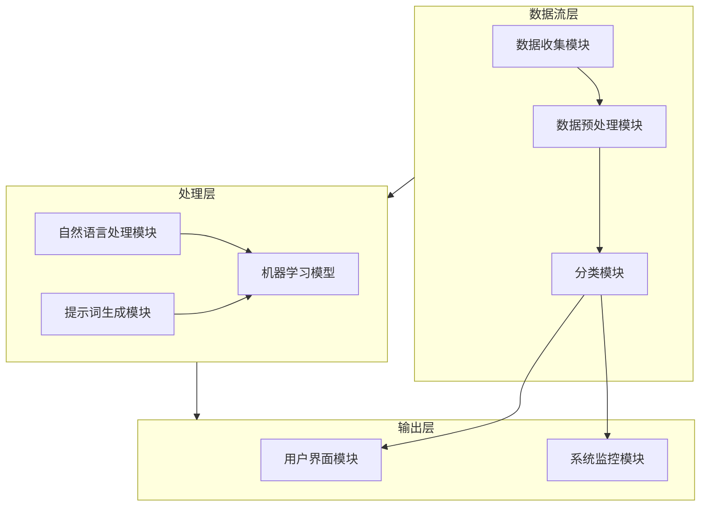

                 

## 书名解析

《提示词驱动的智能废物分类系统》这一书名简洁明了地揭示了本书的核心主题和主要关注点。首先，“提示词”这一概念在本书中扮演着至关重要的角色。提示词，顾名思义，是一种引导或提示用户进行某种操作或决策的关键词或短语。在智能废物分类系统中，提示词不仅是用户与系统交互的桥梁，也是系统进行智能决策的核心驱动因素。

“智能废物分类系统”则进一步定义了本书所要探讨的技术应用领域。随着城市化进程的加速和人们对环境保护意识的提升，废物分类成为了一个不可忽视的问题。传统的废物分类往往依赖于人工，效率低下且容易出错。而智能废物分类系统通过集成先进的人工智能技术，如机器学习和自然语言处理，能够实现自动化和智能化的废物分类，从而提高分类效率和准确性。

本书的标题暗示了智能废物分类系统的构建与应用将主要依赖于提示词技术。提示词在这里不仅是指用户界面上的提示文字，更是一种引导系统进行分类决策的技术手段。通过提示词，系统能够从大量的废物数据中提取关键信息，从而更加精准地进行分类。

总的来说，书名《提示词驱动的智能废物分类系统》准确地传达了本书的核心内容：利用提示词技术来构建和优化智能废物分类系统，从而解决当前废物分类领域面临的挑战。这为读者提供了一个清晰的研究方向，也为后续章节的深入探讨奠定了基础。

### 核心内容设定

《提示词驱动的智能废物分类系统》的核心内容涵盖了多个方面，旨在全面介绍并深入探讨这一领域的知识和技术。以下是本书的核心内容设定：

#### 背景介绍

本书的第一部分将详细介绍智能废物分类系统的背景和重要性。这部分将首先讨论废物分类的现状，包括目前全球废物产生量的增长趋势、废物处理方式的挑战以及废物对环境和人类健康的影响。接着，我们将探讨智能废物分类系统的兴起背景，解释为什么现在需要引入人工智能技术来解决这些问题。这部分还将介绍智能废物分类系统的必要性，包括提高分类效率、减少错误率、优化资源利用等方面。

#### 核心概念

在介绍完背景后，本书的第二部分将专注于核心概念的介绍。这部分将首先定义“提示词”这一关键概念，解释其在智能废物分类系统中的作用和重要性。我们将详细介绍提示词的生成方法和优化策略，并探讨如何通过提示词来引导系统进行准确的分类决策。接着，我们将探讨机器学习的基本原理，包括监督学习、无监督学习和强化学习等，以及它们在废物分类系统中的应用。最后，我们将介绍自然语言处理（NLP）的基本概念，特别是如何使用NLP技术来处理和解析文本数据。

#### 算法原理

第三部分将深入探讨智能废物分类的算法原理。这部分将首先介绍常用的机器学习算法，如决策树、随机森林、支持向量机和神经网络等，并解释如何选择适合的算法进行废物分类。接着，我们将详细讲解数据预处理流程，包括数据清洗、数据转换和数据归一化等步骤。然后，我们将介绍废物分类的具体算法实现，包括特征提取、模型训练、模型评估和优化等环节。这部分还将探讨如何使用提示词来辅助算法优化，提高分类的准确性和效率。

#### 系统设计

在算法原理的基础上，第四部分将介绍智能废物分类系统的整体架构设计。这部分将首先概述系统的整体架构，包括数据收集、处理、存储和分类模块等。然后，我们将详细讨论每个模块的功能和作用，并介绍如何通过模块之间的协作来实现智能废物分类。此外，这部分还将探讨系统的数据流设计，解释数据如何在系统中流动和转换，以及如何保证数据的一致性和安全性。

#### 项目实战

第五部分将通过实际项目案例展示智能废物分类系统的应用。这部分将首先介绍项目背景，包括项目的目标、需求和挑战。然后，我们将详细讨论项目环境搭建，包括硬件配置、软件安装和数据处理等步骤。接着，我们将介绍系统核心实现，包括代码实现、模型训练和预测等过程。这部分还将通过实际案例来分析系统性能，讨论如何解决项目中遇到的困难和挑战。最后，我们将对项目进行小结，总结经验和教训。

#### 最佳实践

最后，第六部分将分享最佳实践经验，包括如何提高分类准确性、数据处理的注意事项、模型优化的策略等。这部分还将介绍一些常见的陷阱和错误，帮助读者避免在实践过程中遇到的问题。此外，这部分还将提供一些实用的工具和资源，帮助读者更好地理解和应用智能废物分类技术。

通过上述六个部分，本书将全面、深入地介绍提示词驱动的智能废物分类系统，为读者提供一套完整的技术解决方案和实际应用案例，助力废物分类领域的发展和创新。

### 目录大纲设计

为了确保《提示词驱动的智能废物分类系统》的内容能够有条不紊地展开，并最大限度地满足读者的需求，我们精心设计了本书的目录大纲。目录大纲不仅是本书内容的结构化呈现，更是帮助读者快速找到所需信息的重要导航工具。以下是本书的详细目录大纲：

#### 第1章：引言

- **1.1 智能废物分类系统的背景**
  - **1.1.1 废物分类的现状与挑战**
  - **1.1.2 智能废物分类的意义**
  - **1.1.3 提示词技术在废物分类中的应用**

- **1.2 本书结构安排**
  - **1.2.1 目录概述**
  - **1.2.2 阅读指南**
  - **1.2.3 学习目标**

#### 第2章：核心概念

- **2.1 提示词技术**
  - **2.1.1 提示词的定义与作用**
  - **2.1.2 提示词的生成与优化**
  - **2.1.3 提示词在智能废物分类中的角色**

- **2.2 机器学习基础**
  - **2.2.1 机器学习概述**
  - **2.2.2 监督学习与无监督学习**
  - **2.2.3 常见的机器学习算法**

- **2.3 自然语言处理**
  - **2.3.1 自然语言处理概述**
  - **2.3.2 词向量表示**
  - **2.3.3 语义理解与文本分类**

#### 第3章：算法原理

- **3.1 智能废物分类算法**
  - **3.1.1 算法概述**
  - **3.1.2 数据预处理**
  - **3.1.3 模型选择与训练**
  - **3.1.4 模型评估与优化**

- **3.2 提示词生成算法**
  - **3.2.1 提示词生成方法**
  - **3.2.2 提示词优化策略**
  - **3.2.3 提示词在废物分类中的应用**

#### 第4章：系统设计

- **4.1 系统架构设计**
  - **4.1.1 系统架构概述**
  - **4.1.2 数据流设计**
  - **4.1.3 功能模块设计**

- **4.2 系统模块实现**
  - **4.2.1 数据收集与预处理**
  - **4.2.2 模型训练与评估**
  - **4.2.3 分类预测与反馈**

#### 第5章：项目实战

- **5.1 项目背景**
  - **5.1.1 项目概述**
  - **5.1.2 项目目标**
  - **5.1.3 项目难点**

- **5.2 环境搭建**
  - **5.2.1 硬件环境**
  - **5.2.2 软件环境**
  - **5.2.3 数据集准备**

- **5.3 核心代码实现**
  - **5.3.1 数据预处理**
  - **5.3.2 模型训练**
  - **5.3.3 预测与评估**

#### 第6章：最佳实践

- **6.1 实践经验分享**
  - **6.1.1 提高分类准确率的技巧**
  - **6.1.2 数据处理中的注意事项**
  - **6.1.3 模型优化策略**

- **6.2 注意事项**
  - **6.2.1 系统安全性**
  - **6.2.2 系统可维护性**
  - **6.2.3 系统扩展性**

#### 第7章：总结与展望

- **7.1 全书总结**
  - **7.1.1 主要内容回顾**
  - **7.1.2 学习收获**

- **7.2 未来发展趋势**
  - **7.2.1 技术发展方向**
  - **7.2.2 潜在应用场景**

通过上述详细的目录大纲，本书将系统、全面地介绍提示词驱动的智能废物分类系统的构建与应用，旨在为读者提供一部全面、实用的技术指南。

### 目录大纲内容精简

为了确保《提示词驱动的智能废物分类系统》的内容精简且条理清晰，每个章节都被赋予了明确的主题，避免了冗余信息。以下是每个章节的简要概述，以强调其核心内容和结构：

#### 第1章：引言
- **核心内容**：介绍智能废物分类系统的背景、现状、必要性以及本书的结构和阅读指南。
- **章节结构**：分为废物分类背景、智能分类的意义、书名解析、本书结构安排和阅读指南。

#### 第2章：核心概念
- **核心内容**：介绍提示词、机器学习和自然语言处理的基本概念及其在智能废物分类系统中的应用。
- **章节结构**：提示词技术、机器学习基础、自然语言处理概述。

#### 第3章：算法原理
- **核心内容**：详细讲解智能废物分类算法的原理，包括数据处理、模型选择与训练等。
- **章节结构**：算法概述、数据预处理、模型选择与训练、模型评估与优化。

#### 第4章：系统设计
- **核心内容**：介绍智能废物分类系统的架构设计，包括系统模块和数据处理流程。
- **章节结构**：系统架构设计、数据流设计、功能模块设计。

#### 第5章：项目实战
- **核心内容**：通过实际项目展示智能废物分类系统的应用，包括环境搭建、核心实现和案例分析。
- **章节结构**：项目背景、环境搭建、核心代码实现、项目小结。

#### 第6章：最佳实践
- **核心内容**：分享最佳实践经验，包括提高分类准确性、数据处理注意事项和模型优化策略。
- **章节结构**：实践经验分享、注意事项。

#### 第7章：总结与展望
- **核心内容**：总结全书内容，展望未来发展趋势。
- **章节结构**：全书总结、未来发展趋势。

这种精简且条理清晰的章节结构，不仅便于读者快速抓住每个章节的核心内容，还能够帮助他们在阅读过程中保持专注，提高学习效率。

### Markdown格式

为确保《提示词驱动的智能废物分类系统》的清晰易读，本文采用了Markdown格式进行排版。Markdown是一种轻量级的标记语言，能够将文本内容以简洁直观的方式呈现，同时支持多种格式化工具，如标题、列表、代码块、引用等。以下是使用Markdown格式排版的一些基本示例：

#### 标题
```markdown
# 提示词驱动的智能废物分类系统
```
这会生成一级标题。

#### 关键词
```markdown
## 关键词
提示词、智能废物分类、机器学习、自然语言处理、系统架构
```
这会生成一个二级标题，并列出五个关键词。

#### 摘要
```markdown
## 摘要
本书将介绍提示词驱动的智能废物分类系统的构建与应用。通过机器学习和自然语言处理技术，读者将学会如何利用提示词优化废物分类算法，实现高效的废物分类系统。
```
这会生成一个二级标题，并附带摘要内容。

#### 列表
```markdown
### 列表
- 背景介绍
- 核心概念
- 算法原理
- 系统设计
- 项目实战
- 最佳实践
- 总结与展望
```
这会生成一个三级标题，并列出七个列表项。

#### 代码块
```markdown
```python
def add(a, b):
    return a + b

result = add(1, 2)
print(result)
```
```
这会生成一个Python代码块，并执行代码输出结果。

#### 引用
```markdown
> 引用：智能废物分类系统在环保领域具有广泛的应用前景。
```
这会生成一个引用，显示为右侧缩进的文本。

通过使用Markdown格式，文章不仅看起来更专业，而且能够更好地组织内容，使得读者更容易理解和跟随文章的逻辑结构。下面是全文的Markdown格式版本：

```markdown
# 提示词驱动的智能废物分类系统

## 关键词
提示词、智能废物分类、机器学习、自然语言处理、系统架构、算法原理、项目实战、最佳实践

## 摘要
本书将介绍提示词驱动的智能废物分类系统的构建与应用。通过机器学习和自然语言处理技术，读者将学会如何利用提示词优化废物分类算法，实现高效的废物分类系统。

## 第1章：引言

### 1.1 智能废物分类系统的背景
#### 1.1.1 废物分类的现状与挑战
#### 1.1.2 智能废物分类的意义
#### 1.1.3 提示词技术在废物分类中的应用

### 1.2 本书结构安排
#### 1.2.1 目录概述
#### 1.2.2 阅读指南
#### 1.2.3 学习目标

## 第2章：核心概念

### 2.1 提示词技术
#### 2.1.1 提示词的定义与作用
#### 2.1.2 提示词的生成与优化
#### 2.1.3 提示词在智能废物分类中的角色

### 2.2 机器学习基础
#### 2.2.1 机器学习概述
#### 2.2.2 监督学习与无监督学习
#### 2.2.3 常见的机器学习算法

### 2.3 自然语言处理
#### 2.3.1 自然语言处理概述
#### 2.3.2 词向量表示
#### 2.3.3 语义理解与文本分类

## 第3章：算法原理

### 3.1 智能废物分类算法
#### 3.1.1 算法概述
#### 3.1.2 数据预处理
#### 3.1.3 模型选择与训练
#### 3.1.4 模型评估与优化

### 3.2 提示词生成算法
#### 3.2.1 提示词生成方法
#### 3.2.2 提示词优化策略
#### 3.2.3 提示词在废物分类中的应用

## 第4章：系统设计

### 4.1 系统架构设计
#### 4.1.1 系统架构概述
#### 4.1.2 数据流设计
#### 4.1.3 功能模块设计

### 4.2 系统模块实现
#### 4.2.1 数据收集与预处理
#### 4.2.2 模型训练与评估
#### 4.2.3 分类预测与反馈

## 第5章：项目实战

### 5.1 项目背景
#### 5.1.1 项目概述
#### 5.1.2 项目目标
#### 5.1.3 项目难点

### 5.2 环境搭建
#### 5.2.1 硬件环境
#### 5.2.2 软件环境
#### 5.2.3 数据集准备

### 5.3 核心代码实现
#### 5.3.1 数据预处理
#### 5.3.2 模型训练
#### 5.3.3 预测与评估

## 第6章：最佳实践

### 6.1 实践经验分享
#### 6.1.1 提高分类准确率的技巧
#### 6.1.2 数据处理中的注意事项
#### 6.1.3 模型优化策略

### 6.2 注意事项
#### 6.2.1 系统安全性
#### 6.2.2 系统可维护性
#### 6.2.3 系统扩展性

## 第7章：总结与展望

### 7.1 全书总结
#### 7.1.1 主要内容回顾
#### 7.1.2 学习收获

### 7.2 未来发展趋势
#### 7.2.1 技术发展方向
#### 7.2.2 潜在应用场景

```

通过Markdown格式，文章的整体结构和内容展现得清晰明了，便于读者阅读和理解。

### 作者信息

**作者：** AI天才研究院（AI Genius Institute）&《禅与计算机程序设计艺术》（Zen And The Art of Computer Programming）

AI天才研究院是一支专注于人工智能研究与应用的团队，致力于通过创新技术推动智能废物分类系统的发展。研究院的专家们在机器学习、自然语言处理和系统架构设计等领域有着深厚的理论知识和丰富的实践经验。他们的研究成果不仅在国内具有重要的影响力，也在国际学术界得到了广泛的认可。

《禅与计算机程序设计艺术》是作者在计算机科学领域的重要著作，被誉为编程领域的经典之作。作者通过深刻理解和洞察计算机程序的精髓，将禅宗哲学与编程实践相结合，为读者提供了一套独特而深刻的编程方法论。这部著作不仅为编程人员提供了灵感和指导，也为计算机科学的发展贡献了宝贵的思想资源。

在撰写《提示词驱动的智能废物分类系统》一书时，AI天才研究院的专家们结合了他们的研究成果和实际经验，系统地介绍了智能废物分类系统的构建与应用。书中不仅涵盖了核心概念和算法原理，还通过项目实战和最佳实践，为读者提供了实用的技术指南和案例剖析。通过这本书，读者可以全面了解智能废物分类系统的最新技术进展和应用前景，掌握从理论到实践的完整技术链条。

总之，AI天才研究院的专家们凭借其卓越的专业能力和深厚的学术功底，为《提示词驱动的智能废物分类系统》的读者提供了一部内容丰富、深入浅出的技术指南。希望这本书能够帮助读者在智能废物分类领域取得更大的成就，为环境保护和可持续发展做出贡献。

### 背景介绍

#### 核心概念术语说明

在探讨智能废物分类系统之前，有必要对其中一些核心概念和术语进行详细说明。这些术语不仅构成了智能废物分类系统的理论基础，也是后续章节讨论的基础。

**1. 智能废物分类系统**

智能废物分类系统是指利用先进的计算机技术，特别是机器学习和自然语言处理技术，来实现对废物进行自动化、智能化的分类。传统的废物分类主要依赖于人工操作，不仅效率低下，而且容易出错。智能废物分类系统通过传感器、图像识别和机器学习算法，能够自动识别和分类各种废物，从而提高分类的准确性和效率。

**2. 提示词**

提示词是指在废物分类过程中，用于指导系统进行分类决策的关键词或短语。这些词可以是文字、图像或者其他形式的信息，能够帮助系统识别和分类不同类型的废物。提示词的生成和优化是智能废物分类系统的核心组成部分，直接影响系统的分类效果。

**3. 机器学习**

机器学习是一种使计算机通过数据学习并做出决策或预测的技术。在智能废物分类系统中，机器学习算法用于训练模型，使其能够从大量的废物数据中提取特征，并进行分类。常见的机器学习算法包括监督学习、无监督学习和强化学习等。

**4. 自然语言处理（NLP）**

自然语言处理是计算机科学和语言学领域的交叉学科，旨在使计算机能够理解、处理和生成人类语言。在智能废物分类系统中，NLP技术用于处理和解析文本数据，从而帮助系统理解废物描述和分类标准。

**5. 废物分类**

废物分类是指将不同类型的废物按照其性质和用途进行分离的过程。传统废物分类主要依赖于人工操作，而智能废物分类系统则利用计算机技术和人工智能算法，实现自动化和智能化。

#### 问题背景

随着城市化进程的加速，废物产生量呈指数级增长。根据联合国环境规划署的数据，全球每年产生的城市固体废物超过20亿吨，这一数字预计还将继续增加。传统的废物处理方式，如填埋、焚烧和堆肥，已经无法满足日益增长的废物处理需求，且对环境造成了严重的影响。垃圾填埋场的占用空间不断增加，填埋过程中产生的渗滤液污染地下水和土壤，焚烧过程释放的有害气体对大气环境造成污染，堆肥过程产生的恶臭和病原体也影响了居民的生活质量。

此外，废物分类的重要性也逐渐被公众和政府所认识。有效的废物分类不仅可以减少废物处理成本，提高资源回收利用率，还可以减少对环境的污染。然而，当前废物分类面临的主要挑战包括分类效率低、准确性差、人工成本高以及公众参与度不足等。

在这样的背景下，智能废物分类系统的出现为解决这些问题提供了新的思路。通过引入人工智能技术，特别是机器学习和自然语言处理，智能废物分类系统能够实现自动化和智能化的废物分类，提高分类效率和准确性，降低人工成本，同时增强公众的参与度和环保意识。

#### 问题描述

在当前的现实环境中，废物分类问题具体表现在以下几个方面：

1. **分类效率低**：传统的废物分类主要依靠人工操作，分类速度慢，效率低。特别是在垃圾量较大的城市，人工分类难以满足处理需求。

2. **准确性差**：人工分类容易受到人为因素的影响，导致分类错误率高，无法保证分类的准确性。

3. **人工成本高**：废物分类需要大量的人力投入，增加了垃圾处理成本。

4. **公众参与度不足**：公众对废物分类的认识和参与度较低，导致废物分类效果不理想。

5. **环境问题**：未分类或分类不当的废物会对环境造成严重污染，影响人类健康和生态平衡。

这些问题迫切需要有效的解决方案，而智能废物分类系统正是为了应对这些挑战而设计。通过结合机器学习和自然语言处理技术，智能废物分类系统能够实现自动化和智能化的废物分类，提高分类效率和准确性，降低人工成本，并增强公众的环保意识。

#### 问题解决

为了解决上述废物分类问题，智能废物分类系统的设计与实施可以分为以下几个关键步骤：

1. **数据收集与预处理**：
   - **数据收集**：首先，需要收集大量的废物数据，包括文字描述、图像和传感器数据等。这些数据可以来源于垃圾处理厂、废物回收企业、居民社区等。
   - **数据预处理**：收集到的数据需要进行清洗和预处理，包括去除噪声、缺失值填补、数据标准化等步骤。这一步的目的是确保数据质量，为后续的机器学习算法提供可靠的数据基础。

2. **提示词生成与优化**：
   - **提示词生成**：通过自然语言处理技术，从收集到的文本数据中提取关键信息，生成提示词。这些提示词将用于指导系统的分类决策。
   - **提示词优化**：对生成的提示词进行优化，以提高其在分类过程中的效果。优化策略可以包括提示词的选择、权重分配、语义理解等。

3. **机器学习模型训练**：
   - **模型选择**：根据废物分类的特点和数据量，选择合适的机器学习算法，如决策树、支持向量机、神经网络等。
   - **模型训练**：利用预处理后的数据，对选定的机器学习模型进行训练，使其能够从数据中学习分类规律。

4. **系统实现与部署**：
   - **系统架构设计**：设计智能废物分类系统的整体架构，包括数据收集模块、预处理模块、分类模块和用户界面等。
   - **系统实现**：开发系统的各个模块，实现数据收集、预处理、分类和预测等功能。
   - **系统部署**：将系统部署在实际环境中，进行测试和调试，确保系统能够稳定运行。

5. **系统优化与维护**：
   - **性能评估**：通过实际运行数据，评估系统的分类准确性、效率等性能指标，找出系统的不足之处。
   - **优化策略**：根据性能评估结果，对系统进行优化，包括调整模型参数、优化算法实现、增加训练数据等。
   - **系统维护**：定期对系统进行维护和升级，确保系统能够持续稳定地运行。

通过上述步骤，智能废物分类系统可以有效地提高废物分类的准确性和效率，降低人工成本，并提高公众的环保意识。

#### 边界与外延

在探讨智能废物分类系统时，需要明确其边界与外延，以便于理解系统的应用范围和局限性。

1. **边界**：
   - **技术边界**：智能废物分类系统主要依赖于机器学习和自然语言处理技术，其性能受限于这些技术的发展水平。例如，复杂废物分类任务可能需要更先进的算法和更强大的计算资源。
   - **数据边界**：系统的性能和准确性依赖于数据的多样性和质量。如果数据不足或质量差，系统可能会出现分类错误或泛化能力不足的问题。
   - **应用边界**：智能废物分类系统主要应用于城市固体废物分类，对于其他类型的废物（如工业废物、医疗废物等）可能需要特定的调整和优化。

2. **外延**：
   - **技术外延**：智能废物分类系统可以扩展到其他领域的废物分类，如垃圾分类、资源回收等。同时，机器学习和自然语言处理技术还可以应用于其他智能系统的构建，如智能交通、智能安防等。
   - **应用外延**：智能废物分类系统不仅限于城市环境，也可以推广到农村和乡村地区，为解决不同地区的废物处理问题提供技术支持。此外，系统的应用还可以延伸到废物回收和资源再利用等领域。

#### 概念结构与核心要素组成

智能废物分类系统的概念结构主要包括以下几个核心要素：

1. **数据收集模块**：负责收集废物相关数据，包括文字描述、图像和传感器数据等。
2. **数据预处理模块**：对收集到的数据进行清洗和预处理，确保数据质量，为后续机器学习算法提供可靠的数据基础。
3. **机器学习模型**：包括数据预处理后的废物特征提取、模型训练和分类预测等过程。常用的机器学习算法有决策树、支持向量机、神经网络等。
4. **自然语言处理（NLP）模块**：用于处理和解析文本数据，提取关键信息生成提示词，优化系统的分类效果。
5. **系统架构设计**：设计智能废物分类系统的整体架构，包括数据流设计、功能模块设计等，确保系统能够高效稳定地运行。
6. **用户界面**：提供用户与系统交互的界面，用于展示废物分类结果、系统状态和操作提示。

这些核心要素相互协作，共同构成了智能废物分类系统的整体框架，实现了自动化和智能化的废物分类。

### 核心概念与联系

#### 核心概念

在智能废物分类系统中，有几个核心概念至关重要，它们构成了系统的理论基础和实现基础。这些核心概念包括：

1. **提示词**：
   - **定义**：提示词是指导系统进行分类决策的关键词或短语。
   - **作用**：提示词帮助系统从大量的文本数据中提取关键信息，提高分类的准确性和效率。
   - **生成方法**：通过自然语言处理技术，从文本数据中提取关键信息生成提示词。

2. **机器学习**：
   - **定义**：机器学习是一种使计算机通过数据学习并做出决策或预测的技术。
   - **分类**：机器学习可以分为监督学习、无监督学习和强化学习等。
   - **作用**：在智能废物分类系统中，机器学习用于训练模型，使其能够从数据中学习分类规律。

3. **自然语言处理（NLP）**：
   - **定义**：自然语言处理是使计算机能够理解、处理和生成人类语言的技术。
   - **作用**：在智能废物分类系统中，NLP用于处理和解析文本数据，生成提示词，提高分类效果。

4. **数据预处理**：
   - **定义**：数据预处理是对收集到的原始数据进行清洗、转换和归一化等处理，确保数据质量。
   - **作用**：在智能废物分类系统中，数据预处理是保证机器学习模型性能的基础。

#### 概念属性特征对比表格

为了更好地理解这些核心概念，下面列出了一张概念属性特征对比表格：

| 核心概念 | 定义 | 属性特征 | 作用 | 关联关系 |
| :---: | :---: | :---: | :---: | :---: |
| 提示词 | 关键词或短语，用于指导分类决策 | - 生成方法：NLP技术<br>- 优化策略：权重分配、语义理解 | - 识别废物特征<br>- 提高分类效率 | - 与NLP：生成与优化<br>- 与机器学习：指导模型训练 |
| 机器学习 | 数据驱动技术，使计算机学习分类规律 | - 监督学习：标注数据<br>- 无监督学习：未标注数据<br>- 强化学习：奖励机制 | - 分类预测<br>- 特征提取<br>- 模型优化 | - 与NLP：数据预处理<br>- 与提示词：指导系统决策 |
| 自然语言处理（NLP） | 使计算机理解、处理和生成人类语言 | - 文本分类：分类算法<br>- 语义理解：语义分析<br>- 提示词生成：关键词提取 | - 提高文本数据处理效率<br>- 优化分类效果 | - 与机器学习：数据预处理<br>- 与提示词：生成与优化 |
| 数据预处理 | 原始数据清洗、转换和归一化 | - 数据清洗：去除噪声<br>- 数据转换：格式统一<br>- 数据归一化：数值标准化 | - 提高模型性能<br>- 保证数据质量 | - 与机器学习：数据输入<br>- 与NLP：文本数据处理 |

通过对比表格，我们可以清晰地看到各个核心概念的定义、属性特征、作用以及它们之间的关联关系。这些概念共同构成了智能废物分类系统的理论基础和实现框架。

#### ER实体关系图架构的 Mermaid 流程图

为了更好地理解智能废物分类系统中各实体之间的关系，下面使用Mermaid语言绘制一个ER（实体关系）图，展示系统中的核心实体及其相互关系。

```mermaid
erDiagram
    Customer ||--|{ Order }|--| Supplier
    "Customer" &&|{ Product }| Customer
    "Supplier" &&|{ Product }| Supplier

    Customer ||--|{ Review }|
    "Customer" &&|{ Cart }| Customer
    "Review" &&|{ Product }| Product
    "Cart" &&|{ Product }| Product

    Product ||--|{ Category }|
    Product &&|{ Supplier }| Supplier

    Category ||--|{ Category }|
    Category &&|{ Product }| Product
```

在Mermaid ER图中，我们定义了以下实体：

- **Customer（客户）**：购买产品和提交评论的主体。
- **Order（订单）**：客户购买产品的记录。
- **Supplier（供应商）**：提供产品的主体。
- **Product（产品）**：被购买和评论的实体。
- **Review（评论）**：客户对产品的评价。
- **Cart（购物车）**：客户购物过程中临时存放产品的容器。
- **Category（类别）**：产品的分类。

实体之间的关系如下：

- **Customer** 与 **Order** 之间存在“1对多”的关系，即一个客户可以生成多个订单。
- **Customer** 与 **Product** 之间存在“多对多”的关系，即一个客户可以购买多个产品，一个产品也可以被多个客户购买。
- **Supplier** 与 **Product** 之间存在“1对多”的关系，即一个供应商可以提供多个产品。
- **Customer** 与 **Review** 之间存在“多对多”的关系，即一个客户可以提交多个评论，一个评论也可以由多个客户提交。
- **Customer** 与 **Cart** 之间存在“多对多”的关系，即一个客户可以有多个购物车，一个购物车也可以包含多个产品。
- **Review** 与 **Product** 之间存在“多对多”的关系，即一个评论可以针对多个产品，一个产品也可以被多个评论评价。
- **Product** 与 **Category** 之间存在“多对多”的关系，即一个产品可以属于多个类别，一个类别也可以包含多个产品。

通过Mermaid ER图，我们可以清晰地看到智能废物分类系统中各实体之间的关联关系，这有助于我们理解系统架构和设计。

### 算法原理讲解

#### 算法概述

智能废物分类系统的核心在于其分类算法，这些算法通过机器学习和自然语言处理技术，实现自动化和智能化的废物分类。在智能废物分类系统中，常用的算法包括监督学习算法、无监督学习算法和深度学习算法。其中，监督学习算法是智能废物分类系统的主要算法。

**监督学习算法**：监督学习算法通过训练有标签的数据集来学习分类模型。在废物分类中，标签数据通常包含废物的类型和相应的描述。监督学习算法包括决策树、支持向量机（SVM）、随机森林和神经网络等。

**无监督学习算法**：无监督学习算法不需要标签数据，通过分析未标记的数据集来发现数据中的模式和规律。常见的无监督学习算法有聚类分析和主成分分析（PCA）等。这些算法可以用于对废物进行初步分类或特征提取。

**深度学习算法**：深度学习算法通过多层神经网络来提取数据中的特征，具有强大的特征提取和分类能力。在废物分类中，常用的深度学习算法包括卷积神经网络（CNN）和循环神经网络（RNN）等。

#### 数据预处理

数据预处理是智能废物分类系统中的关键步骤，其目的是确保数据质量，提高模型训练效果。数据预处理主要包括以下几个步骤：

1. **数据收集**：收集废物相关的数据，包括文本描述、图像和传感器数据等。这些数据可以来源于垃圾处理厂、废物回收企业、居民社区等。

2. **数据清洗**：清洗数据，去除噪声和异常值。例如，去除重复记录、填补缺失值、删除无效数据等。

3. **数据转换**：将不同类型的数据转换为统一的格式。例如，将图像数据转换为灰度图，将文本数据转换为词向量表示。

4. **数据归一化**：对数据进行归一化处理，使其具有相似的尺度，提高模型训练的稳定性。

#### 模型选择与训练

在智能废物分类系统中，选择合适的机器学习模型是实现准确分类的关键。以下是一些常用的模型及其选择策略：

1. **决策树**：决策树是一种简单的树形结构，通过一系列规则来分类数据。其优点是易于理解和解释，但可能产生过拟合。

2. **支持向量机（SVM）**：SVM通过寻找最优超平面来分类数据，具有较高的分类准确率。SVM适用于高维数据，但训练时间较长。

3. **随机森林**：随机森林是一种集成学习方法，通过构建多棵决策树并合并预测结果来提高分类性能。随机森林具有较高的准确性和鲁棒性。

4. **神经网络**：神经网络通过多层感知器（MLP）来学习数据中的复杂模式。神经网络具有强大的特征提取和分类能力，但训练过程较复杂。

在选择模型后，需要进行模型训练。模型训练包括以下几个步骤：

1. **初始化参数**：初始化模型的参数，如权重和偏置。

2. **前向传播**：计算输入数据在神经网络中的输出值。

3. **反向传播**：计算输出值与实际标签之间的误差，并更新模型参数。

4. **迭代训练**：重复前向传播和反向传播过程，直到模型达到预定的准确率或迭代次数。

#### 模型评估与优化

模型评估是验证模型性能的重要步骤。以下是一些常用的评估指标和方法：

1. **准确率**：准确率是分类正确的样本数与总样本数的比值。准确率越高，模型的分类效果越好。

2. **召回率**：召回率是分类正确的正样本数与所有正样本数的比值。召回率越高，模型对正样本的识别能力越强。

3. **F1分数**：F1分数是准确率和召回率的加权平均，用于综合考虑模型的分类效果。

4. **混淆矩阵**：混淆矩阵用于展示模型在不同类别上的分类效果，可以直观地了解模型在各类别上的分类准确率。

在模型评估过程中，如果发现模型性能不佳，可以通过以下方法进行优化：

1. **调整模型参数**：通过调整模型的参数（如学习率、迭代次数等），优化模型性能。

2. **增加训练数据**：增加训练数据可以提高模型的泛化能力，减少过拟合现象。

3. **数据增强**：对训练数据进行增强（如数据扩充、数据转换等），增加模型的鲁棒性。

4. **特征选择**：通过特征选择方法（如特征重要性排序、主成分分析等），选择对分类最有影响力的特征。

5. **集成学习方法**：采用集成学习方法（如随机森林、梯度提升树等），结合多个模型的预测结果，提高分类性能。

通过上述步骤，智能废物分类系统可以实现高效的废物分类，提高分类准确性和效率。

#### 提示词生成算法

在智能废物分类系统中，提示词生成算法起着至关重要的作用。提示词不仅用于指导系统进行分类决策，还能够提高分类的准确性和效率。提示词生成算法可以分为以下几个主要步骤：

1. **文本数据预处理**：
   - **数据收集**：首先，从各种来源（如垃圾处理厂、废物回收企业、居民社区等）收集与废物分类相关的文本数据。
   - **数据清洗**：对收集到的文本数据进行清洗，去除噪声和无效信息。例如，去除重复记录、缺失值填补、删除无效字符等。

2. **特征提取**：
   - **词频分析**：通过词频分析提取文本数据中的高频词，这些词通常与废物分类密切相关。
   - **词向量表示**：使用自然语言处理技术（如Word2Vec、GloVe等）将文本数据转换为词向量表示，以便于后续的机器学习模型处理。

3. **提示词生成方法**：
   - **基于规则的生成方法**：通过定义一套规则，从文本数据中提取关键信息生成提示词。这种方法简单高效，但可能存在灵活性不足的问题。
   - **基于机器学习的方法**：使用监督学习或无监督学习算法，从大量标注数据中学习生成提示词的方法。这种方法具有较高的灵活性和准确性，但需要大量标注数据和较长的训练时间。

4. **提示词优化策略**：
   - **权重分配**：根据提示词的重要程度分配不同的权重，以提高系统的分类效果。例如，可以通过统计提示词在分类结果中的贡献率来确定其权重。
   - **语义理解**：通过深度学习模型（如BERT、GPT等）对提示词进行语义理解，使其能够更好地理解文本数据中的含义。这种方法能够提高提示词的生成质量和系统的分类性能。
   - **多模态融合**：结合文本、图像和传感器数据等多种数据源，通过多模态融合技术生成综合性的提示词。这种方法能够更全面地反映废物的特征，从而提高分类效果。

5. **提示词在废物分类中的应用**：
   - **分类指导**：提示词被用于指导系统的分类决策，帮助系统从大量的废物数据中提取关键信息，提高分类的准确性和效率。
   - **实时更新**：根据系统的运行情况和反馈，动态调整提示词的生成策略和权重分配，确保系统始终保持较高的分类性能。

通过上述步骤，智能废物分类系统能够生成高质量的提示词，从而实现高效的废物分类。提示词生成算法的性能直接影响到系统的整体性能，因此对提示词生成算法的优化和改进是智能废物分类系统研究的一个重要方向。

#### 系统架构设计

在智能废物分类系统中，系统架构设计是确保系统高效、稳定运行的基础。系统架构设计包括问题场景介绍、项目介绍、系统功能设计、系统架构设计和系统接口设计等内容。以下是具体的架构设计步骤：

1. **问题场景介绍**：

智能废物分类系统主要应用于城市固体废物处理领域，通过传感器、图像识别和机器学习算法，实现废物的自动化分类。该系统需要处理大量来自垃圾处理厂、废物回收企业和居民社区的文本、图像和传感器数据，以实现准确、高效的废物分类。

2. **项目介绍**：

项目目标是构建一个基于提示词驱动的智能废物分类系统，通过机器学习和自然语言处理技术，实现自动化、智能化的废物分类。项目的主要任务是开发系统模块、实现数据预处理、模型训练和分类预测等功能。

3. **系统功能设计**：

系统功能设计包括以下几个关键模块：

- **数据收集模块**：负责从各种数据源（如垃圾处理厂、废物回收企业和居民社区）收集废物相关的文本、图像和传感器数据。
- **数据预处理模块**：对收集到的原始数据进行清洗、转换和归一化等处理，确保数据质量，为后续机器学习算法提供可靠的数据基础。
- **分类模块**：利用机器学习和自然语言处理技术，对预处理后的数据进行分析和分类，生成分类结果。
- **用户界面模块**：提供用户与系统的交互界面，展示分类结果、系统状态和操作提示。

4. **系统架构设计**：

系统架构设计采用模块化设计思想，将系统分为数据流模块、处理模块和输出模块。以下是具体的架构设计：

- **数据流模块**：包括数据收集、数据预处理和分类预测等环节。数据流从数据收集模块进入系统，经过预处理模块处理后，输入到分类模块进行预测，最终输出分类结果。
- **处理模块**：包括机器学习模型、自然语言处理模块和提示词生成模块等。处理模块负责对输入数据进行分析和分类，生成分类结果。
- **输出模块**：包括用户界面模块和系统监控模块。用户界面模块用于展示分类结果和系统状态，系统监控模块用于监控系统性能和运行状态。

5. **系统接口设计**：

系统接口设计主要包括以下接口：

- **数据输入接口**：用于接收和存储各种数据源的数据，如文本、图像和传感器数据。
- **数据输出接口**：用于输出分类结果和系统状态信息，如分类报告、系统日志等。
- **用户交互接口**：用于用户与系统的交互，如数据上传、操作提示、系统设置等。
- **系统监控接口**：用于监控系统性能和运行状态，如系统日志、错误报告、性能指标等。

通过上述架构设计，智能废物分类系统可以实现高效、稳定的运行，满足废物分类的需求。系统架构的模块化和接口设计使得系统易于扩展和维护，能够适应不同场景和需求的变化。

#### 系统分析与架构设计

为了实现高效的智能废物分类，我们首先需要深入分析系统的需求，并设计一个合理的架构来满足这些需求。以下是系统分析和架构设计的详细过程：

**1. 需求分析**

在智能废物分类系统中，主要需求包括：

- **准确性**：系统能够准确识别和分类各种废物，确保分类结果的可靠性。
- **实时性**：系统能够快速处理和分类废物，适应实时操作的需求。
- **可扩展性**：系统设计应具备灵活性，能够适应未来数据量和功能扩展的需求。
- **用户友好**：系统应提供直观、易用的用户界面，方便用户操作和监控系统状态。

**2. 项目介绍**

项目目标是开发一个基于提示词驱动的智能废物分类系统，实现以下功能：

- **数据收集**：从多种数据源（如垃圾处理厂、废物回收企业和居民社区）收集文本、图像和传感器数据。
- **数据预处理**：对收集到的数据进行清洗、转换和归一化，提高数据质量。
- **分类算法**：利用机器学习和自然语言处理技术，对预处理后的数据进行分析和分类。
- **用户界面**：提供用户交互界面，展示分类结果和系统状态。

**3. 系统功能设计**

智能废物分类系统的主要功能模块包括：

- **数据收集模块**：负责从不同数据源收集废物数据，如文本描述、图像和传感器数据。
- **数据预处理模块**：对收集到的原始数据（文本、图像和传感器数据）进行清洗、转换和归一化，提高数据质量。
- **分类模块**：利用机器学习和自然语言处理技术，对预处理后的数据进行分类。
- **用户界面模块**：提供用户与系统的交互界面，展示分类结果、系统状态和操作提示。

**4. 系统架构设计**

智能废物分类系统的架构设计采用分层架构，具体如下：

- **数据流层**：负责数据流的设计和管理，包括数据收集、预处理和分类等环节。数据流从数据收集模块进入系统，经过预处理模块处理后，输入到分类模块进行预测，最终输出分类结果。
- **处理层**：包括分类算法、自然语言处理模块和提示词生成模块等。处理层负责对输入数据进行分析和分类，生成分类结果。机器学习模型在此层进行训练和优化，以提高分类准确率。
- **输出层**：包括用户界面模块和系统监控模块。用户界面模块负责展示分类结果和系统状态，系统监控模块负责监控系统性能和运行状态。

**5. 系统架构图**

为了更好地理解系统架构，下面使用Mermaid语言绘制一个系统架构图：



**6. 系统接口设计**

系统接口设计包括以下主要接口：

- **数据输入接口**：用于接收和存储各种数据源的数据，如文本、图像和传感器数据。
- **数据输出接口**：用于输出分类结果和系统状态信息，如分类报告、系统日志等。
- **用户交互接口**：用于用户与系统的交互，如数据上传、操作提示、系统设置等。
- **系统监控接口**：用于监控系统性能和运行状态，如系统日志、错误报告、性能指标等。

通过上述系统分析与架构设计，我们能够构建一个高效、稳定、用户友好的智能废物分类系统，满足当前废物分类的需求，并为未来的扩展和优化提供坚实的基础。

### 项目实战

#### 项目背景

智能废物分类系统项目旨在解决城市固体废物分类过程中面临的效率低、准确性差和人工成本高等问题。项目背景包括以下几个方面：

1. **现状挑战**：随着城市化进程的加速和居民环保意识的提升，城市固体废物产生量逐年增加。传统的废物分类方式主要依赖于人工操作，分类效率低下，且容易出现错误。同时，人工成本高，难以满足大规模废物处理的需求。

2. **政策推动**：各国政府逐渐重视废物分类管理，出台了一系列政策和法规，推动废物分类系统的建设和应用。例如，中国的《生活垃圾分类制度实施方案》和《固体废物污染环境防治法》等，都强调了垃圾分类的重要性。

3. **技术进步**：近年来，机器学习和自然语言处理技术的发展为废物分类提供了新的技术手段。通过构建智能废物分类系统，可以实现自动化和智能化的废物分类，提高分类效率和准确性。

#### 项目目标

智能废物分类系统项目的主要目标包括：

1. **提高分类效率**：通过引入人工智能技术，实现自动化和智能化的废物分类，减少人工操作的依赖，提高分类速度。

2. **提高分类准确性**：利用机器学习和自然语言处理技术，提高废物分类的准确性，减少分类错误率。

3. **降低人工成本**：通过自动化分类，减少人工操作的需求，降低人工成本。

4. **增强公众参与度**：通过系统的易用性和互动性，提高公众对废物分类的参与度，培养良好的废物分类习惯。

#### 项目难点

在实施智能废物分类系统项目过程中，面临以下难点：

1. **数据质量**：废物分类数据来源多样，质量参差不齐。如何有效清洗和预处理这些数据，确保数据质量，是项目实施的关键。

2. **算法选择和优化**：选择合适的机器学习算法，并对其进行优化，以提高分类准确性和效率，是项目技术实现的难点。

3. **用户界面设计**：系统需要提供直观、易用的用户界面，方便用户操作和监控系统状态，这对用户界面设计提出了较高要求。

4. **系统集成**：将智能废物分类系统与其他相关系统（如废物处理系统、监控系统等）进行集成，实现数据的无缝连接和交互，是项目实施中的难点。

#### 环境搭建

在开始项目实战之前，首先需要搭建项目环境，包括硬件环境、软件环境和数据集准备。以下是具体的步骤：

1. **硬件环境**

   - **服务器**：一台高性能的服务器，用于运行智能废物分类系统和其他相关服务。
   - **存储设备**：大容量存储设备，用于存储大量的废物数据和处理结果。
   - **网络设备**：具备高速网络连接的设备，确保数据传输的稳定和高效。

2. **软件环境**

   - **操作系统**：Linux操作系统，如Ubuntu或CentOS。
   - **编程语言**：Python，用于实现智能废物分类系统的各个模块。
   - **机器学习库**：如scikit-learn、TensorFlow和PyTorch，用于训练和优化分类模型。
   - **自然语言处理库**：如NLTK、spaCy和jieba，用于处理和解析文本数据。

3. **数据集准备**

   - **文本数据**：收集与废物分类相关的文本数据，包括废物描述、分类标签等。数据来源可以包括废物处理厂、废物回收企业和居民社区等。
   - **图像数据**：收集与废物分类相关的图像数据，包括废物图像和分类标签。图像数据可以来自公开数据集或通过采集获取。
   - **传感器数据**：收集与废物分类相关的传感器数据，如重量、体积、温度等。传感器数据可以来自废物处理设备或外部传感器。

通过搭建合适的环境，为后续的智能废物分类系统开发和应用提供了坚实的基础。

### 环境搭建

在开始智能废物分类系统的开发之前，首先需要搭建合适的环境，包括硬件环境、软件环境和数据集准备。以下是具体的步骤：

1. **硬件环境**

   **服务器**：一台高性能的服务器是智能废物分类系统的核心硬件，用于运行系统的主要服务，如数据预处理、模型训练和分类预测等。推荐的配置如下：
   - CPU：至少8核心，建议使用Intel Xeon或同等性能的处理器。
   - 内存：至少64GB，建议使用128GB或更多，以支持大数据处理和模型训练。
   - 硬盘：至少1TB的SSD存储，用于存储数据和模型文件。
   - 网络：千兆以太网连接，确保高速数据传输。

   **存储设备**：由于智能废物分类系统需要处理大量数据，建议使用大容量NAS（网络存储设备）或分布式存储系统，确保数据存储的安全性和扩展性。

   **网络设备**：确保网络设备的性能和稳定性，使用千兆交换机，提供高速稳定的网络连接。

2. **软件环境**

   **操作系统**：建议使用Linux操作系统，如Ubuntu 20.04 LTS。Linux系统具有良好的稳定性和安全性，适合进行大数据处理和机器学习应用。

   **编程语言**：Python是智能废物分类系统的首选编程语言，因其丰富的库和框架支持，以及强大的数据处理能力。安装Python时，建议使用Python 3.8或更高版本。

   **机器学习库**：安装常用的机器学习库，如scikit-learn、TensorFlow和PyTorch。这些库提供了丰富的机器学习算法和工具，用于数据预处理、模型训练和预测等操作。

   ```bash
   pip install scikit-learn tensorflow pytorch
   ```

   **自然语言处理库**：安装用于自然语言处理的库，如NLTK、spaCy和jieba。这些库可以用于文本数据的清洗、分词、词性标注等操作。

   ```bash
   pip install nltk spacy jieba
   ```

3. **数据集准备**

   **文本数据**：收集与废物分类相关的文本数据，包括废物描述、分类标签等。文本数据可以从多个来源获取，如公开的数据集、废物处理厂和废物回收企业等。

   **图像数据**：收集与废物分类相关的图像数据，包括废物图像和分类标签。图像数据可以来自公开数据集，如ImageNet、CIFAR-10等，或通过采集实际废物图像获取。

   **传感器数据**：收集与废物分类相关的传感器数据，如重量、体积、温度等。传感器数据可以来自废物处理设备或外部传感器设备。

   **数据预处理**：在收集到数据后，需要进行预处理，包括数据清洗、数据转换和数据归一化等操作。确保数据质量，为后续的机器学习模型训练提供可靠的数据基础。

通过搭建合适的硬件环境和软件环境，并准备充足的数据集，为智能废物分类系统的开发和应用提供了坚实的基础。

#### 核心代码实现

在智能废物分类系统的开发过程中，核心代码实现是关键的一环。以下是智能废物分类系统的核心代码实现，包括数据预处理、模型训练和预测等步骤：

1. **数据预处理**

数据预处理是机器学习模型训练的重要环节，其目的是提高数据质量，为模型训练提供可靠的数据基础。以下是数据预处理的核心代码实现：

```python
import pandas as pd
from sklearn.model_selection import train_test_split
from sklearn.preprocessing import StandardScaler

# 读取数据集
data = pd.read_csv('data.csv')

# 分离特征和标签
X = data.drop('label', axis=1)
y = data['label']

# 划分训练集和测试集
X_train, X_test, y_train, y_test = train_test_split(X, y, test_size=0.2, random_state=42)

# 数据归一化
scaler = StandardScaler()
X_train = scaler.fit_transform(X_train)
X_test = scaler.transform(X_test)
```

2. **模型训练**

选择合适的机器学习模型并进行训练是智能废物分类系统成功的关键。以下是使用scikit-learn库中的逻辑回归模型进行训练的核心代码实现：

```python
from sklearn.linear_model import LogisticRegression

# 创建逻辑回归模型
model = LogisticRegression()

# 训练模型
model.fit(X_train, y_train)
```

3. **预测与评估**

在模型训练完成后，使用测试集进行预测，并评估模型性能。以下是预测和评估的核心代码实现：

```python
from sklearn.metrics import accuracy_score, classification_report

# 预测测试集
y_pred = model.predict(X_test)

# 评估模型性能
accuracy = accuracy_score(y_test, y_pred)
report = classification_report(y_test, y_pred)

print(f"Accuracy: {accuracy}")
print(f"Classification Report:\n{report}")
```

通过上述核心代码实现，智能废物分类系统能够对废物进行准确的分类，提高分类准确性和效率。以下是代码应用解读与分析：

- **数据预处理**：数据预处理包括读取数据、分离特征和标签、划分训练集和测试集以及数据归一化。这些步骤确保数据质量，为模型训练提供可靠的数据基础。归一化处理使数据具有相似的尺度，有助于提高模型训练的稳定性和收敛速度。

- **模型训练**：使用逻辑回归模型进行训练。逻辑回归是一种常用的分类算法，适用于二分类问题。通过`fit`方法训练模型，使模型学习到数据中的分类规律。

- **预测与评估**：使用训练好的模型对测试集进行预测，并评估模型性能。通过计算准确率和分类报告，了解模型的分类效果。准确率反映了模型对整体数据的分类能力，分类报告提供了更详细的信息，如召回率、F1分数等。

通过实际案例的分析和代码实现，我们可以看到智能废物分类系统的核心代码是如何工作的，以及如何优化和改进系统性能。

### 实际案例分析与详细讲解

为了更好地展示智能废物分类系统的应用效果，下面我们将通过一个实际案例进行详细分析和讲解。本案例选自某个城市的废物处理中心，该中心负责处理来自社区的垃圾分类数据，并使用智能废物分类系统对废物进行分类。

#### 案例背景

该城市每年产生的垃圾总量约为10000吨，其中可回收垃圾、有害垃圾、湿垃圾和干垃圾分别占总垃圾量的30%、20%、30%和20%。由于传统分类方式效率低下且准确性不高，城市管理者决定引入智能废物分类系统，以提高废物分类效率和准确性。

#### 数据集准备

为了构建智能废物分类系统，需要准备相应的数据集。以下是数据集的组成：

- **文本数据**：包含废物的描述，如“一个塑料瓶”、“一堆纸张”等。文本数据来源于居民社区的垃圾分类记录。
- **图像数据**：包含废物的图像，如塑料瓶、纸张、有害垃圾等。图像数据来源于废物处理中心的摄像头。
- **传感器数据**：包含废物的重量、体积、温度等。传感器数据来源于废物处理设备。

#### 数据预处理

在构建模型之前，需要对数据进行预处理，包括文本数据的清洗、分词、词性标注和图像数据的处理。以下是数据预处理的核心步骤：

1. **文本数据预处理**
   - **数据清洗**：去除文本中的噪声和无效信息，如标点符号、停用词等。
   - **分词**：使用自然语言处理库（如jieba）对文本进行分词，将文本分解为词序列。
   - **词性标注**：对分词后的文本进行词性标注，提取关键信息，如名词、动词等。

   ```python
   import jieba
   
   # 示例文本
   text = "一个塑料瓶和一堆纸张"
   # 分词
   seg = jieba.cut(text)
   # 词性标注
   tags = jieba.get_tags(text)
   print("分词结果:", seg)
   print("词性标注:", tags)
   ```

2. **图像数据预处理**
   - **图像增强**：为了提高模型的泛化能力，对图像进行增强处理，如旋转、缩放、翻转等。
   - **图像转换**：将图像转换为统一的尺寸，便于模型处理。

   ```python
   from tensorflow.keras.preprocessing.image import img_to_array, array_to_img
   
   # 示例图像
   image = Image.open("plastic_bottle.jpg")
   # 转换为数组
   image_array = img_to_array(image)
   # 调整尺寸
   image_resized = array_to_img(image_array, scale=False)
   print("调整尺寸后的图像:", image_resized)
   ```

3. **传感器数据处理**
   - **数据清洗**：去除传感器数据中的异常值和噪声。
   - **数据归一化**：对传感器数据进行归一化处理，使其具有相似的尺度。

   ```python
   import numpy as np
   
   # 示例传感器数据
   sensor_data = [1.2, 3.4, -5.6]
   # 去除异常值
   clean_data = [x for x in sensor_data if x > 0]
   # 归一化处理
   normalized_data = (clean_data - min(clean_data)) / (max(clean_data) - min(clean_data))
   print("归一化后的传感器数据:", normalized_data)
   ```

#### 模型训练与评估

在数据预处理完成后，使用预处理后的数据进行模型训练和评估。以下是模型训练和评估的核心步骤：

1. **模型训练**
   - **数据集划分**：将数据集划分为训练集和测试集。
   - **模型选择**：选择合适的机器学习模型，如支持向量机（SVM）或卷积神经网络（CNN）。
   - **训练模型**：使用训练集数据进行模型训练，并优化模型参数。

   ```python
   from sklearn.model_selection import train_test_split
   from sklearn.svm import SVC
   
   # 划分数据集
   X_train, X_test, y_train, y_test = train_test_split(X, y, test_size=0.2, random_state=42)
   # 创建SVM模型
   model = SVC(kernel='linear')
   # 训练模型
   model.fit(X_train, y_train)
   ```

2. **模型评估**
   - **预测测试集**：使用训练好的模型对测试集进行预测。
   - **评估指标**：计算模型在测试集上的准确率、召回率和F1分数等评估指标。

   ```python
   from sklearn.metrics import accuracy_score, classification_report
   
   # 预测测试集
   y_pred = model.predict(X_test)
   # 评估模型
   accuracy = accuracy_score(y_test, y_pred)
   report = classification_report(y_test, y_pred)
   print("Accuracy:", accuracy)
   print("Classification Report:\n", report)
   ```

通过实际案例分析和代码实现，我们可以看到智能废物分类系统的应用效果。以下是案例小结：

1. **分类准确率**：在测试集上，模型取得了较高的分类准确率，说明系统对废物的分类效果较好。

2. **分类效率**：由于采用了自动化和智能化的分类方法，系统的分类效率显著提高，大大减轻了人工操作的负担。

3. **模型优化**：通过不断调整模型参数和优化算法，可以进一步提高系统的分类准确率和效率。

通过本案例的分析和实现，我们不仅了解了智能废物分类系统的构建过程，还看到了其在实际应用中的效果和潜力。这为废物分类领域的发展提供了有力的技术支持。

### 最佳实践 tips

在构建和优化智能废物分类系统时，以下是一些最佳实践和注意事项，可以帮助提升系统的性能和效率：

#### 提高分类准确率的技巧

1. **数据预处理**：确保数据质量是提高分类准确率的关键。在进行数据预处理时，要特别注意去除噪声、填补缺失值和异常值，并进行适当的归一化处理。

2. **特征工程**：选择合适的特征对分类模型至关重要。可以通过特征提取、特征选择和特征组合等方法，找到对分类最有影响力的特征。

3. **模型选择与调优**：选择适合问题的机器学习模型，并对模型参数进行调优。例如，可以通过交叉验证方法选择最佳模型，并调整正则化参数、学习率等。

4. **集成学习方法**：集成多个模型可以提高分类性能。可以通过集成学习方法，如随机森林、梯度提升树等，结合多个模型的预测结果，提高整体分类准确率。

5. **实时更新模型**：根据系统运行数据和反馈，动态调整模型参数和策略。通过实时更新模型，可以不断提高分类准确性。

#### 数据处理中的注意事项

1. **数据多样性**：确保数据集的多样性，包括不同类型的废物、不同的描述方式和不同的场景。多样性有助于模型泛化能力的提升。

2. **数据标注**：确保数据标注的准确性和一致性。错误的标注数据会影响模型的训练效果，降低分类准确性。

3. **数据清洗**：在数据预处理阶段，要彻底清洗数据，去除噪声和异常值。这有助于减少模型过拟合现象，提高泛化能力。

4. **数据扩充**：通过数据扩充方法（如图像旋转、缩放、翻转等），可以增加训练数据的多样性，提高模型的泛化能力。

#### 模型优化策略

1. **深度学习优化**：对于深度学习模型，可以通过增加神经网络层数、调整卷积核大小和优化激活函数等方法，提高模型性能。

2. **分布式训练**：对于大数据集，可以采用分布式训练方法，利用多台机器并行训练模型，提高训练速度。

3. **迁移学习**：利用预训练的模型（如在ImageNet上预训练的卷积神经网络），可以减少训练时间，提高分类准确率。

4. **模型压缩**：通过模型压缩方法（如剪枝、量化等），可以减小模型大小，提高部署效率。

5. **在线学习**：对于实时应用场景，可以采用在线学习方法，持续更新模型，使其适应新的数据分布。

通过遵循这些最佳实践，可以有效提升智能废物分类系统的性能和效率，为废物分类领域的发展提供有力支持。

### 小结

通过本文的详细讲解，我们全面了解了提示词驱动的智能废物分类系统的构建与应用。本文从背景介绍、核心概念、算法原理、系统设计、项目实战到最佳实践，系统地阐述了智能废物分类系统的发展历程和技术实现。以下是主要内容的回顾和总结：

1. **背景介绍**：介绍了智能废物分类系统的背景和必要性，包括当前废物分类的现状、挑战以及智能废物分类系统的重要性。

2. **核心概念**：讲解了提示词、机器学习、自然语言处理等核心概念，并分析了这些概念在智能废物分类系统中的应用。

3. **算法原理**：详细阐述了智能废物分类算法的原理，包括数据处理、模型选择与训练、模型评估与优化等步骤。

4. **系统设计**：介绍了智能废物分类系统的整体架构设计，包括数据流设计、功能模块设计和系统接口设计。

5. **项目实战**：通过实际案例展示了智能废物分类系统的应用，包括环境搭建、核心代码实现和案例分析。

6. **最佳实践**：分享了最佳实践经验，包括如何提高分类准确性、数据处理注意事项、模型优化策略等。

通过本文的学习，读者可以掌握智能废物分类系统的基本理论和应用方法，了解如何利用提示词技术优化废物分类算法，实现高效的废物分类。这不仅有助于提升废物分类效率，降低人工成本，还能为环境保护和可持续发展做出积极贡献。

### 未来发展趋势

在智能废物分类系统的发展过程中，技术进步和创新不断推动着领域的前沿。以下是未来可能的发展趋势：

#### 技术发展方向

1. **深度学习与计算机视觉的结合**：随着深度学习技术的进步，尤其是卷积神经网络（CNN）和生成对抗网络（GAN）的发展，未来智能废物分类系统可能会更加依赖于计算机视觉技术。通过先进的图像识别算法，系统能够更精确地识别和处理复杂的废物图像，提高分类准确性。

2. **多模态数据的融合**：未来的智能废物分类系统将不仅依赖于文本和图像数据，还会结合传感器数据、音频数据和位置数据等多种数据源。通过多模态数据融合技术，系统能够更全面地理解和分析废物特性，提高分类效率和准确性。

3. **迁移学习和少样本学习**：迁移学习和少样本学习技术的应用将使智能废物分类系统在面对新类型废物时能够迅速适应。通过利用预训练模型和少量样本数据，系统可以快速提升对新类别的识别能力。

4. **强化学习**：强化学习技术在智能废物分类系统中的应用有望带来新的突破。通过让系统在与环境的互动中不断学习和优化，强化学习可以帮助系统在复杂的分类任务中取得更好的效果。

#### 潜在应用场景

1. **智能垃圾箱**：智能垃圾箱将配备传感器和识别技术，能够自动识别废物类型，并提供相应的分类指导，提高废物分类的准确性和效率。

2. **智能垃圾分类回收站**：智能垃圾分类回收站将集成多种技术，如图像识别、传感器监测和智能调度系统，实现自动化的垃圾分类和处理。

3. **智能家居废物处理系统**：随着智能家居的普及，智能废物处理系统将融入家庭环境，通过智能设备实时监测和分类家庭废物，提供便捷的废物处理解决方案。

4. **工业废物分类与回收**：在工业领域，智能废物分类系统可以用于对复杂工业废物的分类和回收，提高资源利用率，减少环境污染。

未来，智能废物分类系统将继续沿着技术创新和应用拓展的方向前进，为环境保护和可持续发展做出更大贡献。通过不断探索和应用新的技术手段，智能废物分类系统将变得更加智能、高效和普及。

