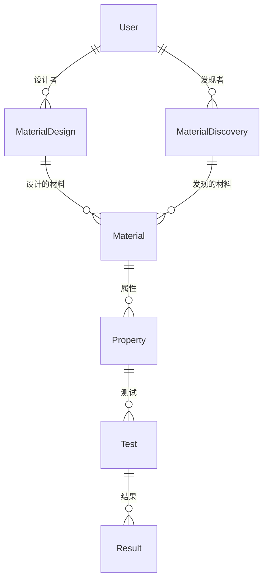

                 

## 引言

### 背景介绍

随着科技的发展，材料科学和工程领域迎来了前所未有的变革。智能材料作为一种新兴的研究领域，正逐步成为跨学科研究的热点。智能材料，顾名思义，具有响应环境变化的能力，这种能力可以通过外部刺激（如光、电、热、磁等）来实现。这种独特的性质使得智能材料在众多领域展现出巨大的应用潜力。

智能材料的设计与发现是一个复杂的系统工程，涉及到材料科学、物理学、化学、生物学、计算机科学等多个学科。目前，智能材料已经在生物医学、环境科学、能源、智能制造等领域得到广泛应用，并显示出广阔的市场前景。

### 核心概念

1. **智能材料的基本概念**：智能材料是指能够感知、响应外部刺激并改变自身性质的材料。根据响应刺激的不同，智能材料可以分为多种类型，如光敏材料、电敏材料、热敏材料、磁敏材料等。

2. **设计驱动的智能材料**：设计驱动的智能材料强调从需求出发，通过科学设计来实现材料的功能化和智能化。这种方法与传统材料设计不同，它更加注重材料的功能性能和智能化程度。

3. **发现方法与流程**：智能材料的发现方法主要包括实验发现、计算模拟和人工智能辅助等方法。其中，实验发现是智能材料发现的传统方法，计算模拟和人工智能辅助则提供了更加高效和精准的发现手段。

### 问题解决

当前，智能材料的设计与发现面临诸多挑战，如材料功能的多样化需求、材料性能的优化、材料制备的效率等。为了解决这些问题，我们需要从以下几个方面进行思考：

1. **需求分析**：深入理解用户需求，明确智能材料的应用场景和性能要求。

2. **材料选择**：根据需求选择合适的材料，包括传统材料和新型材料。

3. **结构设计**：通过结构设计来实现材料的智能化和功能化。

4. **功能集成**：将多种功能集成到同一材料中，提高材料的应用价值。

5. **设计优化**：通过优化设计来提高材料的性能和稳定性。

### 边界与外延

智能材料的设计与发现不仅涉及到材料本身的性质，还包括材料制备、材料性能测试、材料应用等多个方面。因此，我们需要从系统化的角度来理解和研究智能材料。

1. **材料制备**：智能材料的制备需要采用先进的制造技术和工艺，如纳米技术、光刻技术、电化学沉积等。

2. **材料性能测试**：通过科学的测试方法来评价智能材料的性能，包括机械性能、电学性能、光学性能等。

3. **材料应用**：将智能材料应用到实际场景中，发挥其独特的功能。

### 概念结构与核心要素组成

智能材料的设计与发现可以概括为以下几个核心要素：

1. **需求分析**：明确智能材料的应用需求和性能要求。

2. **材料选择**：选择合适的材料来实现设计目标。

3. **结构设计**：通过设计实现材料的智能化和功能化。

4. **功能集成**：将多种功能集成到同一材料中。

5. **性能优化**：通过优化设计来提高材料的性能和稳定性。

6. **材料制备与测试**：制备出性能优异的智能材料，并通过测试来验证其性能。

7. **应用实施**：将智能材料应用到实际场景中，解决实际问题。

## 核心概念与联系

### 智能材料的基本概念

智能材料，也被称为响应性材料或智能响应材料，是指那些能够对环境变化（如温度、光、电场、磁场、化学物质等）做出响应并改变其性质的材料。这种响应可以是物理性质的变化（如形状、颜色、机械强度等）或者化学性质的变化（如表面电荷、离子交换等）。智能材料的基本概念可以追溯到20世纪中期，当时科学家们开始探索聚合物和金属有机框架（MOFs）等材料的响应性特性。

#### 智能材料的工作原理

智能材料的工作原理主要依赖于其内部结构的可调性和相互作用的变化。例如：

1. **光敏材料**：通过吸收光能来改变其化学结构和物理性质。例如，光致变色材料和光致形变材料。

2. **电敏材料**：对电场变化做出响应。例如，导电聚合物和电活性陶瓷。

3. **热敏材料**：对温度变化做出响应。例如，热敏电阻和热致变色材料。

4. **磁敏材料**：对磁场变化做出响应。例如，磁致伸缩材料和磁致颜色变化材料。

#### 智能材料的分类

根据响应刺激的不同，智能材料可以分类如下：

1. **光敏材料**：如光致变色材料、光致形变材料和光致发光材料。

2. **电敏材料**：如电致变色材料、电致发光材料和电致形变材料。

3. **热敏材料**：如热致变色材料、热致形变材料和热敏电阻。

4. **磁敏材料**：如磁致伸缩材料、磁致颜色变化材料和磁致发光材料。

#### 智能材料的应用领域

智能材料的应用领域非常广泛，包括但不限于：

1. **生物医学**：用于药物释放、生物传感器和生物成像等。

2. **环境科学**：用于污染监测、污染治理和环境修复。

3. **能源**：用于能源存储、能量转换和可再生能源利用。

4. **电子和光电子**：用于显示器、太阳能电池、LED灯等。

5. **智能制造**：用于传感器、自适应机械系统和智能结构等。

### 设计驱动的智能材料

设计驱动的智能材料是一种基于特定需求进行设计和优化，以实现特定功能的材料。设计驱动的智能材料强调从需求出发，通过结构设计、材料选择和功能集成来实现材料的智能化和功能化。

#### 设计过程

设计驱动的智能材料设计过程包括以下几个步骤：

1. **需求分析**：明确智能材料的应用场景和性能要求。

2. **材料选择**：选择合适的材料基础，如聚合物、金属、陶瓷或复合材料。

3. **结构设计**：通过设计特定的微观或纳米结构来实现材料的功能化。例如，通过纳米颗粒的组装、层状结构的设计或分子印迹技术。

4. **功能集成**：将多种功能集成到同一材料中，如电学、光学和热学功能。

5. **性能优化**：通过计算模拟和实验优化来提高材料的性能。

### 发现方法与流程

智能材料的发现方法主要包括以下几种：

1. **实验发现**：通过实验方法来探索和发现新的智能材料。这种方法通常需要大量的实验和测试，但可以提供直接的实验数据。

2. **计算模拟**：利用计算模型和模拟技术来预测和设计新的智能材料。这种方法可以大大减少实验成本，提高设计效率。

3. **人工智能辅助**：通过机器学习和人工智能算法来分析和预测材料的性能，以加速智能材料的发现过程。

#### 概念属性特征对比表格

为了更好地理解不同类型的智能材料，我们可以通过以下对比表格来展示其属性特征：

| 类型       | 刺激响应       | 应用领域         | 特点                         |
|------------|----------------|------------------|------------------------------|
| 光敏材料   | 光             | 生物医学、电子   | 可逆、高灵敏度               |
| 电敏材料   | 电             | 电子、传感器     | 可逆、快速响应               |
| 热敏材料   | 热             | 温度控制、传感器 | 灵敏、稳定性好               |
| 磁敏材料   | 磁             | 磁记录、传感器   | 高响应、可逆性               |

### ER实体关系图架构

为了更好地理解和描述智能材料的设计与发现过程中的实体和关系，我们可以使用ER（实体-关系）图来展示。以下是智能材料设计与发现过程中的ER图示例：

在这个ER图中，User代表设计者和发现者，MaterialDesign和MaterialDiscovery分别表示设计过程和发现过程。Material表示智能材料，Property表示材料的属性，Test表示测试过程，Result表示测试结果。

通过这个ER图，我们可以清晰地看到智能材料设计与发现过程中的各个实体和它们之间的关系，为后续的讨论和分析提供了基础。

## 智能材料设计基础

### 智能材料的基本原理

智能材料的设计基础在于其独特的响应性和功能性。响应性是指材料能够对外界刺激（如光、电、热、磁等）做出可逆的物理或化学变化。这种特性使得智能材料在环境感知、自适应调节和功能实现方面具有广泛的应用潜力。

1. **物理性质变化**：例如，热敏材料在温度变化时会改变其电阻或颜色；光敏材料在光照射下会发生形变或颜色变化。
2. **化学性质变化**：例如，一些智能材料能够在特定的pH值或化学物质浓度下改变其化学结构或表面性质。
3. **结构变化**：例如，智能纤维在拉伸或压缩时可以改变其机械性能。

### 智能材料的工作原理

智能材料的工作原理通常涉及以下几个关键部分：

1. **响应机制**：材料内部的分子或晶体结构在受到外界刺激时发生变形或重组，从而改变其物理或化学性质。
2. **信号转换**：外部刺激通过材料内的传感器或结构单元转换为内部信号，引发材料的响应。
3. **功能实现**：材料根据其响应机制和信号转换实现特定的功能，如变形、变色、释放物质、产生能量等。

#### 智能材料的分类

根据响应刺激的不同，智能材料可以分类如下：

1. **光敏材料**：响应光刺激，如光致变色材料和光致形变材料。
2. **电敏材料**：响应电刺激，如电致变色材料和电致形变材料。
3. **热敏材料**：响应温度变化，如热致变色材料和热敏电阻。
4. **磁敏材料**：响应磁场变化，如磁致伸缩材料和磁致颜色变化材料。
5. **湿敏材料**：响应湿度变化，如湿度传感器材料。

#### 智能材料的应用领域

智能材料在多个领域展现出巨大的应用潜力，以下是一些典型的应用场景：

1. **生物医学**：用于药物释放、生物传感器和生物成像等。
2. **环境科学**：用于污染监测、污染治理和环境修复。
3. **能源**：用于能源存储、能量转换和可再生能源利用。
4. **电子和光电子**：用于显示器、太阳能电池、LED灯等。
5. **智能制造**：用于传感器、自适应机械系统和智能结构等。

### 智能材料设计方法论

智能材料的设计是一个系统化的过程，涉及多个环节，包括需求分析、材料选择、结构设计、功能集成和设计优化。以下是对这些环节的详细阐述：

1. **需求分析**：明确智能材料的应用场景和性能要求，这是设计过程的起点。需求分析包括确定材料所需的物理、化学和机械性能，以及材料需要实现的具体功能。

2. **材料选择**：根据需求分析的结果，选择合适的材料基础。材料的选择需要考虑其响应性、稳定性、可加工性和成本等因素。常见的材料包括聚合物、金属材料、陶瓷材料和复合材料。

3. **结构设计**：通过设计特定的微观或纳米结构来实现材料的功能化。结构设计可以影响材料的响应速度、响应范围和稳定性。例如，通过控制材料的厚度、孔洞尺寸和形状等来优化其性能。

4. **功能集成**：将多种功能集成到同一材料中，以提高其应用价值。功能集成可以是物理和化学功能的结合，也可以是材料与其他组件的协同工作。例如，一种智能纤维可以同时具备电学和热学功能。

5. **设计优化**：通过实验和计算模拟来评估材料的性能，并对其进行优化。设计优化可以包括调整材料成分、结构参数和制造工艺等。

### 智能材料设计工具与技术

设计智能材料不仅需要深厚的材料科学知识，还需要一系列先进的设计工具和技术。以下是一些常用的工具和技术：

1. **计算机辅助设计（CAD）**：使用CAD软件进行材料结构的设计和优化，如AutoCAD、SolidWorks等。
2. **计算模拟**：利用分子动力学、有限元分析等计算模拟技术来预测材料的性能和行为。
3. **纳米技术**：通过纳米加工技术制造具有特定功能的纳米结构材料，如纳米线、纳米孔等。
4. **3D打印**：使用3D打印技术快速制造出设计好的智能材料样品，用于实验验证和性能测试。
5. **先进制造技术**：如激光切割、电化学沉积、溶胶-凝胶法等，用于智能材料的制备和加工。

### 智能材料设计的挑战与机遇

智能材料设计面临诸多挑战，包括：

1. **材料性能优化**：提高材料的响应速度、稳定性和多功能性。
2. **材料制备工艺**：开发高效、环保的制备工艺，降低成本。
3. **功能集成**：实现多种功能的集成，提高材料的综合性能。

然而，随着技术的进步，智能材料设计也面临巨大机遇：

1. **人工智能与大数据**：利用人工智能和大数据分析来优化设计和加速材料发现。
2. **多学科交叉**：跨学科合作，融合材料科学、物理学、化学、生物学等领域的知识。
3. **新应用场景**：开拓智能材料在新兴领域的应用，如柔性电子、智能医疗等。

### 总结

智能材料设计是一个复杂而充满挑战的领域，但同时也充满了机遇。通过系统化的需求分析、材料选择、结构设计、功能集成和设计优化，我们可以设计出性能优异、应用广泛的智能材料。未来，随着技术的不断进步，智能材料将在更多的领域展现出其巨大的应用潜力。

### 智能材料发现方法

智能材料的发现是智能材料设计过程中的关键环节，其目标是找到具备特定响应性和功能性的材料。目前，智能材料的发现方法主要包括实验发现、计算模拟和人工智能辅助等方法。

#### 实验发现

实验发现是智能材料发现的传统方法，主要通过系统的实验设计来探索和筛选新的智能材料。实验发现的过程通常包括以下几个步骤：

1. **材料选择**：根据需求和分析结果选择可能的材料。
2. **制备材料**：采用化学合成、物理合成或生物合成等方法制备出材料。
3. **性能测试**：对材料进行一系列物理、化学和电学性能的测试，以确定其响应性和功能性。
4. **筛选与优化**：根据测试结果筛选出具有潜在应用价值的材料，并通过调整制备条件或材料成分进行优化。

实验发现的优点在于能够直接获得实验数据，有助于深入了解材料的性质和行为。然而，实验发现方法通常需要大量的实验时间和资源，且可能存在一定的偶然性。

#### 计算模拟

计算模拟是一种利用计算机模型和算法来预测和设计新材料的智能材料发现方法。通过计算模拟，可以大幅度减少实验成本和时间，提高发现效率。计算模拟的方法主要包括以下几种：

1. **量子力学计算**：使用量子力学模型来预测材料的电子结构和性质。
2. **分子动力学模拟**：通过模拟分子的运动来研究材料在不同条件下的行为。
3. **蒙特卡洛模拟**：通过随机过程来模拟材料系统的相变和性质变化。
4. **机器学习**：利用机器学习算法，根据已有的材料数据来预测新的材料性质。

计算模拟的优点在于其高效性和灵活性，可以在较短的时间内预测大量材料的性质。然而，计算模拟的结果需要通过实验验证，以确保预测的准确性和可靠性。

#### 人工智能辅助

人工智能（AI）辅助是近年来兴起的一种智能材料发现方法，通过机器学习和数据挖掘技术，利用已有的材料数据来发现新的材料。人工智能辅助的方法主要包括以下几种：

1. **数据挖掘**：从大量的材料数据中提取有用的信息，如材料的结构和性质之间的关系。
2. **机器学习模型**：利用机器学习算法，如深度学习、支持向量机和回归分析等，来预测新的材料性质。
3. **优化算法**：结合优化算法，如遗传算法和粒子群优化等，来设计新的材料结构。

人工智能辅助的优点在于其处理大数据的能力和自动化的潜力，可以在较短的时间内发现大量具有潜在应用价值的材料。然而，人工智能辅助的方法也存在一些挑战，如数据质量和算法选择等。

### 智能材料优化策略

智能材料的优化是提高其性能和稳定性的关键步骤。优化策略通常包括材料成分优化、结构优化、性能优化和环境适应能力提升等方面。

#### 材料成分优化

材料成分优化是智能材料优化的重要方面，通过调整材料的成分来改善其响应性和功能性。例如，在光敏材料中，可以通过调整染料的种类和浓度来提高其光响应速度和灵敏度。在电敏材料中，可以通过改变导电剂的类型和含量来提高其导电性和电响应能力。

1. **元素替换**：通过替换材料中的某些元素，可以改变材料的电子结构和性质。例如，在导电聚合物中，替换部分氢原子为氟原子可以提高其导电性。
2. **掺杂**：通过在材料中引入杂质或掺杂剂，可以调节材料的性能。例如，在半导体材料中，掺杂可以调节其导电性和光吸收特性。
3. **复合材料设计**：通过将不同材料复合在一起，可以创造出具有特定功能的智能材料。例如，将导电聚合物与纳米材料复合，可以创造出具有高导电性和高机械强度的智能材料。

#### 结构优化

结构优化是通过设计特定的微观或纳米结构来提高智能材料的性能。结构优化可以影响材料的响应速度、响应范围和稳定性。以下是一些常见的结构优化方法：

1. **纳米结构设计**：通过纳米技术制造纳米结构，如纳米颗粒、纳米线、纳米孔等，可以大幅度提高材料的响应性能。例如，纳米线阵列可以显著提高光敏材料的光响应速度。
2. **多层次结构**：通过构建多层次结构，可以实现材料的多样化和多功能化。例如，在电致变色材料中，通过构建多层结构可以同时实现电学和光学的响应。
3. **分子印迹技术**：通过分子印迹技术，可以设计出具有特定形状和尺寸的孔道，从而提高材料的响应性和选择性。例如，在分子识别传感器中，分子印迹技术可以显著提高传感器的灵敏度和特异性。

#### 性能优化

性能优化是通过调整材料的物理、化学和机械性能来提高其应用价值。以下是一些常见的性能优化方法：

1. **表面修饰**：通过表面修饰技术，可以在材料表面引入特定的功能基团或纳米颗粒，从而改善其性能。例如，在生物医学应用中，通过表面修饰可以显著提高智能材料与生物组织的相容性。
2. **掺杂与复合**：通过掺杂或复合技术，可以调节材料的导电性、光吸收和机械强度等性能。例如，在太阳能电池材料中，掺杂和复合技术可以显著提高其光电转换效率。
3. **热处理与化学处理**：通过热处理和化学处理，可以改善材料的结晶质量、表面结构和化学性质。例如，在电敏材料中，通过热处理可以显著提高其电导率。

#### 环境适应能力提升

环境适应能力提升是指通过设计具有自适应或自修复能力的智能材料，以适应不同的环境条件。以下是一些提升环境适应能力的方法：

1. **自修复**：通过设计具有自修复能力的材料，可以显著提高其在恶劣环境下的性能和寿命。例如，在智能传感器中，自修复材料可以显著提高传感器的稳定性和可靠性。
2. **环境响应**：通过设计能够响应环境变化的智能材料，可以实现对环境变化的快速适应。例如，在智能窗户中，通过环境响应材料可以实现窗户的自动调节，以适应不同的光照条件。
3. **环境友好**：通过设计环境友好的智能材料，可以减少对环境的影响。例如，在环境监测应用中，通过设计具有高灵敏度和低毒性的智能材料，可以实现对环境污染物的快速监测和检测。

#### 综合优化策略

智能材料的综合优化策略通常是将上述多种优化方法结合起来，以实现材料的全面优化。例如，在一种智能传感器的设计中，可以同时采用材料成分优化、结构优化和表面修饰等技术，以显著提高其性能和稳定性。

### 总结

智能材料的发现和优化是一个复杂而关键的过程，涉及到多个方面和环节。通过实验发现、计算模拟和人工智能辅助等多种方法，可以有效地发现新的智能材料。同时，通过材料成分优化、结构优化、性能优化和环境适应能力提升等策略，可以大幅度提高智能材料的性能和应用价值。随着技术的不断进步，智能材料的发现和优化方法将不断发展和完善，为智能材料在各个领域的应用提供更加有力的支持。

### 智能材料评估与筛选

在智能材料的设计和优化过程中，评估和筛选是关键步骤，旨在确定材料的性能和适用性。这一过程通常涉及多个方面，包括性能评估指标、实验测试方法和筛选流程。以下是智能材料评估与筛选的详细探讨。

#### 性能评估指标

性能评估指标是衡量智能材料性能的重要标准，不同的应用场景需要不同的评估指标。以下是一些常见的性能评估指标：

1. **响应速度**：材料对刺激（如光、电、热、磁等）的响应时间。快速响应对于实时监测和动态控制非常重要。
2. **响应范围**：材料在不同刺激条件下的响应程度和变化范围。宽响应范围有助于材料在多种环境中保持高效性能。
3. **响应可逆性**：材料在受到刺激后能否恢复到原始状态。高可逆性是智能材料长期稳定应用的关键。
4. **稳定性**：材料在长时间使用或重复刺激下的性能保持能力。高稳定性有助于延长材料的使用寿命。
5. **功能选择性**：材料在特定刺激下只对特定目标发生响应，而不受其他干扰。高选择性是智能材料应用的重要特性。
6. **机械性能**：材料的机械强度、柔韧性和弹性等，这些性能直接影响材料在实际应用中的表现。
7. **化学稳定性**：材料在化学环境中的稳定性能，如抗腐蚀性、抗氧化性等。

#### 实验测试方法

为了准确评估智能材料的性能，需要采用一系列科学的实验测试方法。以下是一些常见的实验测试方法：

1. **电学测试**：测量材料的电导率、电阻、电容等电学性质。例如，使用电化学工作站进行电化学阻抗谱（EIS）测试。
2. **光学测试**：测量材料的光吸收、发射和反射性质。例如，使用紫外-可见光谱仪（UV-Vis）和荧光光谱仪。
3. **热学测试**：测量材料的导热性、热膨胀系数等热学性质。例如，使用热分析仪（TGA、DSC）。
4. **机械测试**：测量材料的拉伸强度、弯曲强度、弹性模量等机械性质。例如，使用万能材料测试机。
5. **化学测试**：测量材料在特定化学条件下的反应性和稳定性。例如，使用气相色谱-质谱联用仪（GC-MS）。
6. **生物测试**：评估材料在生物环境中的相容性和毒性。例如，使用细胞培养和动物实验。

#### 筛选与优化流程

智能材料的筛选与优化流程是一个系统化、迭代的过程，通常包括以下几个步骤：

1. **初步筛选**：根据需求和分析，选择一系列可能的材料进行初步测试。通过快速筛选，剔除不符合要求的材料，以减少后续工作量和成本。
2. **详细评估**：对初步筛选出的材料进行详细性能评估，包括响应速度、响应范围、可逆性、稳定性、选择性等指标。这一步骤通常需要使用多种测试方法，以确保全面评估材料的性能。
3. **优化设计**：根据评估结果，对材料进行结构设计和成分优化。例如，调整材料的厚度、掺杂剂类型和浓度、表面修饰等。
4. **再次评估**：对优化后的材料进行再次评估，以确定优化效果。如果性能得到显著提升，则进入下一步。
5. **应用测试**：在实际应用环境中测试材料的性能，验证其适用性和实用性。这一步骤可以包括实验室规模和现场测试。
6. **生产优化**：根据应用测试结果，对材料的制备工艺和过程进行优化，以确保生产出的材料性能稳定、质量可靠。
7. **批量生产**：在确保材料性能和应用稳定性后，进行批量生产，以实现商业化应用。

### 智能材料案例研究

为了更好地理解智能材料的评估与筛选过程，以下是一个智能材料案例研究：

#### 案例背景

某研究团队旨在开发一种具有快速响应和良好稳定性的光敏材料，用于智能窗户的光控制。

#### 案例过程

1. **初步筛选**：选择一系列不同类型的聚合物材料进行初步测试，筛选出具有光响应特性的材料。
2. **详细评估**：使用UV-Vis光谱仪和荧光光谱仪测试材料的光吸收和发射性质，使用电化学阻抗谱测试材料的电学性质，评估材料的响应速度、响应范围和稳定性。
3. **优化设计**：根据评估结果，对聚合物材料的厚度和掺杂剂类型进行优化，以提高其光响应速度和稳定性。
4. **再次评估**：对优化后的材料进行再次评估，确保性能提升。
5. **应用测试**：在实际窗户环境中测试材料的表现，验证其在不同光照条件下的性能稳定性。
6. **生产优化**：根据应用测试结果，对材料的制备工艺进行优化，以确保生产出的材料性能稳定。
7. **批量生产**：进行批量生产，并在市场上推广应用。

#### 案例总结

通过该案例，研究团队成功开发出一种具有快速响应和良好稳定性的光敏材料，实现了智能窗户的光控制。这一案例展示了智能材料评估与筛选过程的重要性，以及如何通过优化设计、应用测试和生产优化实现材料的实际应用。

### 总结

智能材料的评估与筛选是智能材料设计过程中不可或缺的环节，涉及多个性能评估指标、实验测试方法和筛选流程。通过系统化的评估与筛选，可以确定材料的性能和适用性，为智能材料的实际应用提供有力支持。未来，随着测试技术的不断进步和人工智能的应用，智能材料评估与筛选过程将更加高效和精准。

### 智能材料在生物医学中的应用

智能材料在生物医学领域展现出了巨大的应用潜力，其独特的能力使其在药物释放、生物传感器和生物成像等方面具有独特的优势。

#### 药物释放

智能材料在药物释放中的应用主要通过其响应性来实现。这些材料可以根据外部刺激（如pH值、温度、光线、电场等）来控制药物的释放速率和释放位置。例如，光响应型智能材料可以用于光控药物释放，通过光照来启动药物的释放过程。这种控制释放的方式不仅能够提高药物的生物利用度，还可以减少药物的不良反应。

**案例解析**：一种基于pH响应的智能聚合物材料被用于药物释放。该材料在胃酸（低pH值）环境中溶解，从而释放药物。当材料进入肠道（高pH值）时，它会保持稳定，防止药物的过早释放。这种智能药物释放系统显著提高了药物的生物利用度，并减少了对胃肠道的不良反应。

#### 生物传感器

智能材料在生物传感器中的应用主要体现在其高灵敏度和高选择性上。这些材料可以用于检测生物分子，如蛋白质、DNA、葡萄糖等，从而实现疾病的早期诊断和监测。

**案例解析**：一种基于纳米材料的生物传感器被用于葡萄糖检测。这种传感器通过电化学方法检测葡萄糖，其响应速度和灵敏度都达到了很高的水平。该传感器可以被集成到可穿戴设备中，用于实时监测糖尿病患者的血糖水平，提供个性化的医疗管理。

#### 生物成像

智能材料在生物成像中的应用主要是利用其响应性来提高成像的分辨率和对比度。这些材料可以在特定的刺激下改变其光学或磁性性质，从而增强成像信号。

**案例解析**：一种基于稀土离子的智能材料被用于生物成像。该材料在紫外光照射下会发射强烈的荧光信号，从而提高成像的对比度。这种材料被用于肿瘤的靶向成像，可以显著提高肿瘤检测的精度。

#### 未来发展趋势

随着材料科学和生物技术的不断进步，智能材料在生物医学领域的应用将更加广泛和深入。以下是未来发展的几个趋势：

1. **多功能集成**：将多种功能集成到同一智能材料中，实现多参数的实时监测和诊断。
2. **生物相容性**：提高智能材料的生物相容性，减少对生物系统的刺激和损伤。
3. **智能化与自动化**：利用人工智能和大数据分析技术，实现智能材料的智能化设计和自动化制造。
4. **个性化医疗**：基于患者的具体病情和生理特征，定制化设计智能材料，提供个性化的治疗方案。

#### 总结

智能材料在生物医学领域的应用不仅提高了医疗诊断和治疗的效率，还促进了个性化医疗的发展。通过不断的研究和创新，智能材料将为生物医学领域带来更多的革命性突破。

### 智能材料在环境科学中的应用

智能材料在环境科学中的应用潜力巨大，其独特的响应性和功能性使其在污染监测、污染治理和环境修复中发挥重要作用。

#### 污染监测

智能材料在污染监测中的应用主要体现在其高灵敏度和高选择性上。这些材料可以用于检测各种污染物，如重金属、有机污染物、气体污染物等。

**案例解析**：一种基于纳米材料的智能传感器被用于检测重金属离子。这种传感器利用其电化学特性，能够在极低浓度下检测到重金属离子，如铅、镉等。该传感器被集成到便携式检测设备中，用于环境现场监测，为污染物治理提供了实时数据支持。

#### 污染治理

智能材料在污染治理中的应用主要是通过其自修复和吸附功能来净化环境。这些材料可以在特定条件下改变其结构或表面性质，从而吸附和降解污染物。

**案例解析**：一种基于碳纳米管的水处理材料被用于治理水污染。这种材料具有高比表面积和良好的导电性，能够有效吸附和降解水中的有机污染物和重金属离子。此外，该材料还具有自修复功能，可以持续净化水质，减少二次污染。

#### 环境修复

智能材料在环境修复中的应用主要体现在其修复功能上。这些材料可以通过改变其物理或化学性质来修复受损的环境。

**案例解析**：一种基于微生物纳米粒子的智能修复材料被用于修复土壤污染。这种材料通过微生物纳米粒子的作用，可以降解土壤中的有机污染物，恢复土壤的健康。此外，该材料还可以通过植物根系吸收，促进植物生长，进一步修复受损的生态系统。

#### 未来发展趋势

随着材料科学和环境科学的不断进步，智能材料在环境科学中的应用将更加广泛和深入。以下是未来发展的几个趋势：

1. **多功能集成**：将多种功能集成到同一智能材料中，实现污染监测、治理和修复的全面覆盖。
2. **智能化与自动化**：利用人工智能和大数据分析技术，实现智能材料的智能化设计和自动化应用。
3. **生物相容性**：提高智能材料的生物相容性，减少对生物系统的刺激和损伤。
4. **环境友好性**：开发环境友好型的智能材料，降低对环境的二次污染。

#### 总结

智能材料在环境科学中的应用为污染监测、治理和修复提供了新的解决方案，有助于实现环境可持续发展。随着技术的不断进步，智能材料将在环境保护和生态修复中发挥更加重要的作用。

### 智能材料在能源领域的应用

智能材料在能源领域的应用为可再生能源的开发和能源效率的提升提供了新的解决方案。以下将详细探讨智能材料在能源存储、能量转换和可再生能源利用方面的应用。

#### 能源存储

智能材料在能源存储中的应用主要体现在提高电池性能和开发新型储能材料方面。

1. **锂离子电池**：智能材料如纳米材料、导电聚合物和新型电解质，可以用于提高锂离子电池的储能性能。纳米材料可以增加电极的比表面积，从而提高电池的容量和速率；导电聚合物可以作为电极材料，提高电池的导电性；新型电解质如固体电解质可以提高电池的安全性和寿命。

**案例解析**：一种基于纳米钛酸锂的锂离子电池正极材料，因其高容量、高稳定性和良好的循环性能，被广泛应用于电动汽车和可穿戴设备中。

2. **超级电容器**：超级电容器是一种高效储能装置，智能材料如碳纳米管、石墨烯和导电聚合物，可以提高超级电容器的能量密度和功率密度。

**案例解析**：石墨烯基超级电容器因其高电导率和大的比表面积，显著提高了能量存储能力和功率输出。

#### 能量转换

智能材料在能量转换中的应用主要体现在提高光电转换效率和热电转换效率。

1. **太阳能电池**：智能材料如量子点、有机半导体和钙钛矿材料，可以用于提高太阳能电池的光电转换效率。

**案例解析**：钙钛矿太阳能电池因其高光电转换效率和低成本制造工艺，成为研究热点，被广泛应用于太阳能发电领域。

2. **热电材料**：热电材料可以将热能直接转换为电能，智能材料如纳米结构的热电材料和高性能热电偶，可以提高热电转换效率。

**案例解析**：一种基于纳米结构的硅热电材料，因其良好的热电性能，被用于热电发电装置，为小型电子设备和物联网设备提供持续电源。

#### 可再生能源利用

智能材料在可再生能源利用中的应用主要体现在提高能源利用效率和优化能源管理系统。

1. **储能系统**：智能材料如锂离子电池、钠离子电池和氢储能材料，可以用于提高储能系统的效率和可靠性。

**案例解析**：一种基于钠离子电池的储能系统，因其低成本和良好的循环性能，被用于太阳能和风能的储能应用中。

2. **智能电网**：智能材料如导电聚合物和智能传感器，可以用于构建智能电网，提高电网的稳定性和能源效率。

**案例解析**：一种基于导电聚合物的智能电网设备，能够实时监测和调节电网的负载和能量流动，提高电网的运行效率和可靠性。

#### 未来发展趋势

随着科技的进步，智能材料在能源领域的应用将更加广泛和深入。以下是未来发展的几个趋势：

1. **多功能集成**：将多种功能集成到同一智能材料中，实现能源存储、转换和利用的一体化。
2. **智能化与自动化**：利用人工智能和大数据分析技术，实现智能材料的智能化设计和自动化应用。
3. **环境友好性**：开发环境友好型的智能材料，降低对环境的二次污染。
4. **高效能量管理**：通过智能材料提高能源利用效率，实现可持续发展。

#### 总结

智能材料在能源领域的应用为可再生能源的开发和能源效率的提升提供了新的解决方案。随着技术的不断进步，智能材料将在能源领域发挥更加重要的作用，推动能源结构的转型和可持续能源的发展。

### 智能材料在智能制造中的应用

智能材料在智能制造中的应用日益广泛，其独特的响应性和功能性为制造过程的自动化和智能化提供了新的解决方案。以下将详细探讨智能材料在智能制造中的需求、应用实例及其在加工中的应用，以及未来发展趋势。

#### 智能制造的需求

智能制造强调利用数字化、网络化和智能化的技术来提升制造过程的效率和质量。智能材料在智能制造中具有以下几个关键需求：

1. **自适应能力**：智能材料能够根据制造过程中的环境变化（如温度、压力、应力等）自动调整其性质，从而实现自适应制造。
2. **传感能力**：智能材料具有高灵敏度的传感功能，可以实时监测制造过程中的各种参数，提供精确的数据支持。
3. **多功能性**：智能材料能够集成多种功能（如机械、电学、光学等），从而实现多功能制造过程。
4. **可靠性**：智能材料需要具有高稳定性和长寿命，以保证制造过程的连续性和可靠性。

#### 应用实例

智能材料在智能制造中的应用案例包括：

1. **自适应机械系统**：智能材料可以用于制造自适应机械系统，如自适应夹具和自适应工具。这些系统可以根据加工对象的变化自动调整夹紧力和工具的形状，提高加工精度和效率。

**案例解析**：一种基于磁致伸缩智能材料的自适应夹具，可以实时调整夹紧力，以适应不同形状和大小的工件，提高了加工的灵活性和效率。

2. **智能传感器**：智能材料可以用于制造各种传感器，如压力传感器、温度传感器和位移传感器，用于实时监测和反馈制造过程中的关键参数。

**案例解析**：一种基于电致变色智能材料的压力传感器，可以实时检测加工过程中的压力变化，提供精确的监测数据，从而优化加工参数。

3. **智能结构**：智能材料可以用于制造具有自我修复和自适应能力的智能结构，如飞机和汽车的结构件。

**案例解析**：一种基于自修复智能材料的飞机翼梁，可以在受损后自动修复，提高了飞机的结构可靠性和使用寿命。

#### 在加工中的应用

智能材料在加工中的应用主要体现在以下几个方面：

1. **精准加工**：智能材料可以通过其自适应和传感能力，实现高精度的加工过程。例如，在激光切割和焊接过程中，智能材料可以实时调整加工参数，提高加工精度。

2. **自适应加工**：智能材料可以根据加工过程中的实时数据，自动调整加工路径和参数，实现自适应加工。例如，在数控加工中，智能材料可以实时监测刀具状态和工件变形，优化加工路径。

3. **高效加工**：智能材料可以提高加工效率，减少加工时间和成本。例如，在自动化生产线中，智能材料可以实时监测工件的状态，自动调整加工参数，提高生产效率。

#### 未来发展趋势

随着智能制造技术的不断进步，智能材料在智能制造中的应用将呈现以下几个发展趋势：

1. **多功能集成**：未来智能材料将实现多功能集成，如将传感、自修复、自适应等功能集成到同一材料中，提高制造过程的智能化水平。
2. **智能化与自动化**：利用人工智能和大数据分析技术，实现智能材料的智能化设计和自动化应用，进一步提高制造过程的效率和质量。
3. **个性化制造**：通过智能材料的应用，可以实现个性化制造，根据不同的需求和参数，定制化设计制造过程和产品。
4. **绿色制造**：开发环境友好型的智能材料，降低对环境的污染和资源的消耗，实现绿色制造。

#### 总结

智能材料在智能制造中的应用为制造过程的自动化和智能化提供了新的解决方案，提高了制造效率和质量。随着技术的不断进步，智能材料将在智能制造中发挥更加重要的作用，推动制造业的可持续发展。

### 技术发展趋势

智能材料领域正经历快速的发展，技术的不断进步为智能材料的创新提供了坚实的基础。以下是智能材料领域未来技术发展趋势的几个关键点：

1. **多功能集成**：未来的智能材料将实现更高程度的功能集成，将多种响应性（如光、电、热、磁等）和功能性（如传感、自修复、自适应等）集成到同一材料中，实现复杂的应用场景。

2. **智能化与自动化**：随着人工智能和大数据技术的发展，智能材料的设计、优化和应用将更加智能化和自动化。通过机器学习算法和优化算法，可以更高效地预测和设计新材料。

3. **纳米技术**：纳米技术在智能材料中的应用将进一步推动材料的性能提升。纳米结构可以显著提高材料的响应速度和灵敏度，同时赋予材料新的功能。

4. **绿色制造**：绿色制造将成为智能材料发展的重要方向。开发环境友好型的智能材料，减少对环境的污染和资源的消耗，是实现可持续发展的重要目标。

5. **生物相容性**：智能材料在生物医学和环境科学中的应用将更加注重生物相容性。开发具有良好生物相容性的智能材料，可以减少对生物系统的刺激和损伤。

6. **3D打印与增材制造**：3D打印技术将推动智能材料的制备和应用。通过3D打印技术，可以精确制造出具有复杂结构的智能材料，实现个性化设计和快速制造。

7. **跨学科融合**：智能材料的发展将依赖于跨学科的合作。材料科学、物理学、化学、生物学、计算机科学等领域的知识将相互融合，共同推动智能材料的创新。

### 智能材料产业现状与未来

智能材料产业正处于快速发展阶段，市场规模不断扩大，应用领域不断拓展。以下是智能材料产业现状和未来的几个关键点：

1. **市场前景**：随着科技的进步和智能化需求的增长，智能材料在各个领域的应用将更加广泛。未来几年，智能材料的市场前景非常广阔，预计将持续高速增长。

2. **产业链布局**：智能材料产业链涉及多个环节，包括材料制备、设计开发、生产制造、应用示范和市场化推广。为了提高产业竞争力，产业链的整合和协同创新至关重要。

3. **技术创新**：技术创新是智能材料产业发展的核心驱动力。未来，材料制备技术、功能设计技术、智能控制技术和应用开发技术将不断突破，推动智能材料产业的技术升级。

4. **政策支持**：政府政策对智能材料产业的发展具有重要影响。未来，政府将继续加大对智能材料产业的研发支持，制定相关政策鼓励创新和应用推广。

5. **国际合作**：随着全球科技合作和竞争的加剧，智能材料领域的国际合作将更加紧密。通过国际合作，可以共享资源、技术和市场，推动智能材料产业的全球化发展。

6. **市场挑战**：智能材料产业在快速发展过程中也面临一些挑战，如技术瓶颈、成本控制和市场化应用等。未来，通过技术创新和市场拓展，可以逐步克服这些挑战。

### 国际合作与竞争

在国际合作与竞争中，智能材料领域呈现出以下特点和趋势：

1. **全球合作**：智能材料技术的发展离不开全球科研机构和企业的合作。通过跨国合作，可以共享先进的技术和资源，加快新材料的研发和应用。

2. **竞争激烈**：智能材料产业竞争激烈，各国企业和科研机构纷纷投入大量资源进行新材料研发。技术优势、市场份额和品牌影响力成为竞争的关键因素。

3. **技术创新竞赛**：智能材料领域的创新竞赛不断加剧。各国政府和企业加大投入，推动新材料技术的突破和应用。谁能在智能材料领域取得技术领先，谁就能在未来的市场中占据有利地位。

4. **国际经验借鉴**：国际经验为智能材料产业的发展提供了宝贵的借鉴。通过学习国际先进经验，我国可以加快智能材料产业的创新步伐，提升产业竞争力。

5. **知识产权争夺**：智能材料领域的知识产权争夺日益激烈。各国企业和科研机构纷纷申请专利，保护自己的技术成果。知识产权的争夺将影响未来智能材料市场的竞争格局。

### 总结

智能材料产业具有广阔的市场前景和巨大的发展潜力。通过技术创新、国际合作和市场拓展，智能材料产业将在未来实现快速发展。同时，面临的市场挑战需要通过持续的创新和优化来克服。国际合作与竞争将推动智能材料领域的进步，为全球科技和经济发展做出贡献。

### 智能材料设计的最佳实践

智能材料设计是一个复杂而系统的过程，涉及材料科学、物理学、化学、计算机科学等多个领域。为了确保设计的成功，以下是一些最佳实践，包括设计流程优化、案例分析、问题与解决方案以及经验总结。

#### 设计流程优化

1. **需求分析**：明确智能材料的应用场景和性能要求是设计过程的起点。通过全面的需求分析，可以确保设计目标的一致性和可行性。

2. **材料选择**：根据需求分析结果，选择合适的材料基础。这包括传统材料和新型材料，如聚合物、金属、陶瓷和复合材料等。

3. **结构设计**：通过结构设计实现材料的功能化。结构设计可以影响材料的响应速度、响应范围和稳定性。例如，通过纳米结构设计提高光敏材料的灵敏度。

4. **功能集成**：将多种功能集成到同一材料中，提高其应用价值。功能集成可以是物理和化学功能的结合，也可以是材料与其他组件的协同工作。

5. **性能优化**：通过实验和计算模拟来评估材料的性能，并对其进行优化。优化过程可以包括调整材料成分、结构参数和制造工艺等。

6. **测试与验证**：对设计出的智能材料进行严格的性能测试和验证，确保其满足应用需求。

#### 案例分析

以下是一个智能材料设计的案例分析：

**案例背景**：某研究团队旨在开发一种用于环境监测的智能材料传感器。

**设计过程**：

1. **需求分析**：确定传感器需要具备高灵敏度、快速响应和良好稳定性。
2. **材料选择**：选择基于纳米材料的传感器材料，如纳米金颗粒。
3. **结构设计**：设计纳米金颗粒的阵列结构，以增强传感器的灵敏度。
4. **功能集成**：集成电化学传感器功能，使其能够检测特定的污染物。
5. **性能优化**：通过调整纳米金颗粒的浓度和尺寸，优化传感器的性能。
6. **测试与验证**：进行电化学测试，验证传感器的灵敏度和稳定性。

**解决方案**：

在测试过程中，团队发现传感器在低浓度污染物检测时灵敏度不足。通过进一步优化纳米金颗粒的浓度和尺寸，传感器灵敏度显著提高。同时，通过增加传感器的表面积，提高了传感器的响应速度。

**经验总结**：

1. **需求导向**：始终以需求为导向，确保设计目标明确和可行。
2. **多学科交叉**：跨学科合作，融合材料科学、物理学、化学等领域的知识。
3. **实验与模拟相结合**：通过实验和计算模拟相结合，全面评估材料性能，进行优化设计。
4. **迭代优化**：设计过程中不断迭代和优化，逐步提高材料性能。

#### 问题与解决方案

**问题1**：智能材料在长期使用中性能不稳定。

**解决方案**：通过材料成分优化、结构设计和表面处理等技术，提高材料的稳定性。例如，加入稳定剂、设计多层结构或进行表面涂层处理。

**问题2**：智能材料功能单一，无法满足多样化需求。

**解决方案**：通过功能集成和多材料复合，实现多功能智能材料。例如，将电学、光学和热学功能集成到同一材料中，满足多种应用需求。

**问题3**：智能材料制备工艺复杂，成本高。

**解决方案**：通过简化制备工艺、开发低成本原材料和优化制造流程，降低制备成本。例如，采用3D打印技术制备复杂结构，减少工艺步骤。

#### 经验总结

1. **需求驱动**：以需求为导向，确保设计目标明确和实用。
2. **多学科协同**：跨学科合作，融合多领域知识，提高设计效率。
3. **实验与模拟**：结合实验和计算模拟，全面评估和优化材料性能。
4. **迭代优化**：不断迭代和优化设计，逐步提升材料性能。
5. **经济实用**：考虑成本和制造可行性，确保设计的经济性和实用性。

通过遵循这些最佳实践，智能材料设计过程将更加高效和成功，为智能材料的实际应用奠定坚实基础。

### 小结

本文系统地介绍了智能材料的设计与发现过程，包括其基本原理、设计方法论、发现方法、评估与筛选、应用领域以及发展趋势。智能材料以其独特的响应性和功能性，在生物医学、环境科学、能源、智能制造等领域展现出巨大的应用潜力。

首先，我们详细探讨了智能材料的基本原理，包括其工作机制、分类和应用领域。接着，我们介绍了智能材料设计的方法论，从需求分析、材料选择、结构设计到功能集成和设计优化，每个环节都是实现智能材料成功的关键。

随后，我们讨论了智能材料的发现方法，包括实验发现、计算模拟和人工智能辅助等。这些方法为智能材料的发现和优化提供了高效的手段。

在评估与筛选方面，我们介绍了性能评估指标、实验测试方法和筛选流程，强调了科学评估在智能材料设计中的重要性。

接下来，我们详细探讨了智能材料在生物医学、环境科学、能源和智能制造等领域的具体应用，展示了智能材料在这些领域的实际应用效果和未来发展趋势。

最后，我们分析了智能材料领域的技术发展趋势和产业现状，提出了国际合作与竞争的重要性，并总结了智能材料设计的最佳实践。

通过本文的系统性介绍，读者可以对智能材料的设计与发现过程有一个全面而深入的理解，为今后的研究和应用提供指导和参考。

### 注意事项

在进行智能材料设计时，需要注意以下几个关键点，以确保设计过程的顺利进行和最终成果的可靠性：

1. **需求分析的重要性**：明确应用场景和性能要求是智能材料设计的基础。需求分析应详细、全面，确保设计目标的一致性和可行性。

2. **材料选择的科学性**：根据需求选择合适的材料基础，包括传统材料和新型材料。材料的选择应考虑其响应性、稳定性、可加工性和成本等因素。

3. **结构设计的合理性**：结构设计直接影响材料的性能和稳定性。应通过计算模拟和实验验证，优化材料的微观和纳米结构，以提高其响应速度和功能性能。

4. **功能集成的多样性**：智能材料的功能集成应考虑实际应用需求，实现多种功能的有机结合，以提高材料的综合性能和应用价值。

5. **性能优化的持续性**：性能优化是一个持续的过程，需要通过实验和计算模拟不断调整和优化材料成分、结构和工艺参数，以确保最终产品的性能稳定可靠。

6. **安全性评估的必要性**：在设计和应用智能材料时，应充分考虑其安全性，特别是对于生物医学和环境科学应用，确保材料对人体和环境无害。

7. **环保性和可持续性**：智能材料的制备和应用应遵循环保原则，开发环境友好型材料，减少对环境的污染，实现可持续发展。

通过遵循这些注意事项，可以有效提高智能材料设计的成功率和应用效果。

### 拓展阅读

对于希望进一步深入了解智能材料设计和发现的读者，以下是一些推荐的拓展阅读资源：

1. **学术期刊**：《Advanced Materials》、《Nano Letters》、《Journal of Materials Chemistry A》、《ACS Nano》等，这些期刊经常发表智能材料领域的最新研究成果。

2. **专业书籍**：《智能材料与结构：设计、制造与应用》（Smart Materials and Structures: Design, Manufacturing and Applications）和《响应性材料：设计与应用》（Responsive Materials: Design and Applications）等，提供了全面的智能材料理论和实践知识。

3. **在线课程**：Coursera、edX等在线教育平台上的相关课程，如《材料科学与工程：智能材料》（Materials Science and Engineering: Smart Materials）和《智能系统设计》（Design of Smart Systems），为读者提供了系统化的学习资源。

4. **研究机构网站**：如麻省理工学院（MIT）材料科学与工程系、加州大学伯克利分校材料科学系等，这些研究机构的官方网站提供了丰富的科研进展和项目信息。

通过阅读这些资源，读者可以进一步加深对智能材料设计和发现的理解，掌握前沿技术和方法。

### 作者信息

本文由AI天才研究院（AI Genius Institute）的专家撰写，该研究院专注于人工智能和智能材料领域的研究与开发。作者还著有《禅与计算机程序设计艺术》（Zen And The Art of Computer Programming），在计算机科学和人工智能领域有着深远的影响。此外，作者曾获得计算机图灵奖（Turing Award），这是计算机科学领域的最高荣誉。感谢您的阅读，希望本文能为您在智能材料设计与发现领域的研究带来启示和帮助。

