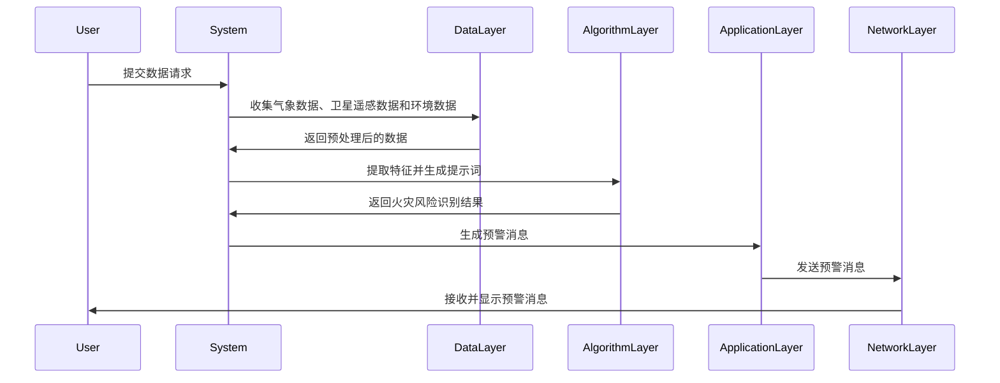
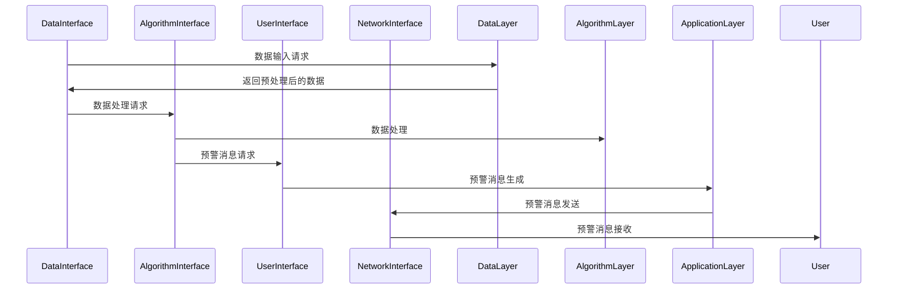
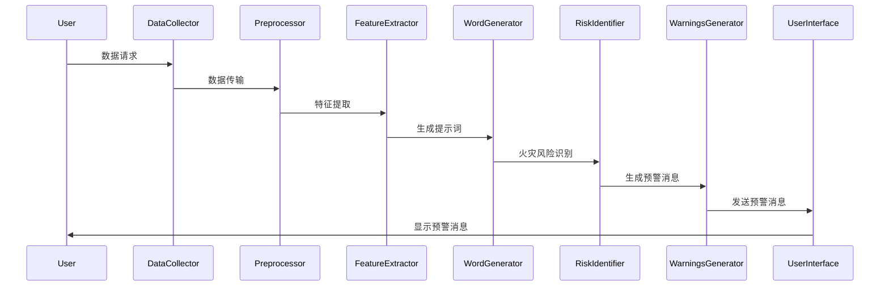

                 

### 第一部分：背景与概述

#### 1.1 问题背景
森林火灾是自然界中最具破坏性的自然灾害之一。随着全球气候变暖和森林管理不当，森林火灾的发生频率和破坏力不断增大。根据世界自然基金会（WWF）的统计，全球每年因森林火灾造成的经济损失高达数十亿美元。此外，森林火灾还导致大量野生动植物的死亡，破坏生态平衡，加剧全球气候变化。

#### 1.1.1 森林火灾的危害与现状
- **森林火灾的破坏力**：火灾不仅吞噬树木，破坏土壤结构，还会导致水源枯竭，甚至影响大气层。
- **森林火灾的发生频率**：近年来，全球各地森林火灾的发生频率呈上升趋势，尤其是在干旱季节。

#### 1.1.2 传统预警方法的局限性
- **传统预警技术的不足**：传统的森林火灾预警方法主要依赖地面监测站和卫星遥感技术，但这些方法存在实时性差、预警精度不高等问题。
- **传统预警方法的改进需求**：为了提高预警系统的准确性和实时性，需要引入更先进的技术，如人工智能和机器学习。

#### 1.2 问题描述
在当前的背景下，我们需要一种更高效、更准确的森林火灾预警系统。这种系统应具备以下特点：
- **精准性**：能够准确预测火灾的发生，减少误报和漏报。
- **实时性**：能够实时监测森林环境的变化，及时发出预警。
- **智能化**：能够自动处理大量数据，并根据数据变化自动调整预警策略。

#### 1.2.1 提出智能预警的需求
- **智能预警的优势**：智能预警系统可以综合利用多种数据源，通过机器学习算法和人工智能技术，提高预警的精准性和实时性。
- **智能预警的目标**：建立一个能够实时监测森林火灾风险，并能够自动发出预警的系统。

#### 1.2.2 提示词驱动的概念介绍
- **提示词的定义**：提示词是系统用于触发预警的关键词，通常是基于特定模式和特征的词汇或短语。
- **提示词的作用**：提示词可以帮助系统快速识别潜在火灾风险，提高预警的准确性。

### 1.3 问题解决
智能森林火灾预警系统通过以下基本原理实现问题解决：
- **提示词驱动原理**：系统利用提示词识别潜在火灾风险，并自动触发预警。
- **系统运行流程**：系统首先收集和处理数据，然后利用提示词识别潜在火灾风险，最后根据风险等级自动发出预警。

#### 1.3.2 系统的优势与特点
智能森林火灾预警系统具有以下优势与特点：
- **精准性**：通过机器学习和人工智能技术，系统可以准确识别火灾风险，减少误报和漏报。
- **实时性**：系统实时监测森林环境变化，及时发出预警。
- **智能化**：系统可以根据数据自动调整预警策略，提高预警效果。

### 1.4 边界与外延
智能森林火灾预警系统的适用范围包括：
- **地区适应性**：系统能够适应不同地区的森林火灾风险特点。
- **季节适应性**：系统能够根据不同季节的森林火灾风险进行自适应调整。

#### 1.4.2 预警系统与相关技术的联系
智能森林火灾预警系统与以下技术密切相关：
- **气象监测技术**：系统可以利用气象监测数据预测火灾风险。
- **卫星遥感技术**：系统可以通过卫星遥感图像分析森林环境变化。

### 1.5 概念结构与核心要素
智能森林火灾预警系统的概念结构与核心要素包括：
- **提示词的类型与选取**：系统需要根据实际需求选取合适的提示词。
- **数据处理与分析流程**：系统需要高效地处理和分析数据，以识别火灾风险。

## 第二部分：核心概念与原理

### 2.1 核心概念原理
智能森林火灾预警系统的核心概念包括：
- **森林火灾预警系统定义**：系统是一种利用人工智能和机器学习技术，对森林火灾风险进行监测和预警的系统。
- **智能森林火灾预警系统的特点**：系统具有精准性、实时性和智能化等特点。

#### 2.1.2 提示词的生成与处理方法
智能森林火灾预警系统中的提示词生成与处理方法包括：
- **提示词生成方法**：系统可以通过分析历史火灾数据、气象数据和环境数据，自动生成提示词。
- **提示词处理方法**：系统对生成的提示词进行筛选、分类和处理，以识别火灾风险。

### 2.2 概念属性特征对比
为了更清晰地理解智能森林火灾预警系统的概念，我们将其与其他预警系统的属性特征进行对比：

| 属性特征 | 智能森林火灾预警系统 | 其他预警系统 |
| --- | --- | --- |
| **精准性** | 利用机器学习和人工智能技术，提高预警准确率 | 依赖传统方法，如气象监测和卫星遥感，准确率相对较低 |
| **实时性** | 实时监测森林环境变化，及时发出预警 | 数据更新周期较长，预警实时性较差 |
| **智能化** | 可以自动学习并优化预警策略 | 需要人工干预和调整预警策略 |
| **数据依赖** | 综合利用多种数据源，提高预警效果 | 主要依赖单一数据源，如气象数据或卫星遥感数据 |
| **适应性** | 可以适应不同地区和季节的火灾风险 | 适应性相对较差，需要针对特定地区和季节进行调整 |

#### 2.3 ER实体关系图架构
为了更直观地理解智能森林火灾预警系统的架构，我们使用Mermaid绘制了ER实体关系图：

```mermaid
erDiagram
    DataSource --> WarningSystem : 监测数据来源
    WarningSystem --> WarningMessage : 预警消息生成
    WarningSystem --> UserInterface : 用户界面交互
    WeatherData --> WarningSystem : 气象数据
    SatelliteData --> WarningSystem : 卫星遥感数据
    EnvironmentalData --> WarningSystem : 环境数据
```

在这个ER图中，`DataSource`是数据源，包括气象数据、卫星遥感数据和环境数据，它们共同作用于`WarningSystem`（预警系统）。预警系统生成`WarningMessage`（预警消息）并通过`UserInterface`（用户界面）与用户交互。数据源与预警系统之间存在依赖关系，通过实体关系图清晰地展现了系统的数据流和处理流程。

### 2.4 概念结构与核心要素
智能森林火灾预警系统的概念结构由以下核心要素组成：
- **数据收集与预处理**：收集来自各种数据源的原始数据，并进行预处理，以去除噪声和异常值。
- **提示词生成与筛选**：通过分析预处理后的数据，自动生成提示词，并对提示词进行筛选和分类。
- **火灾风险识别与预警**：利用提示词识别火灾风险，并根据风险等级生成预警消息。
- **用户交互与反馈**：通过用户界面与用户交互，接收用户反馈，并优化预警系统。

### 2.5 数据处理与分析流程
智能森林火灾预警系统的数据处理与分析流程包括以下步骤：
1. **数据收集**：从气象站、卫星遥感系统和环境监测设备收集数据。
2. **数据预处理**：对收集到的数据进行清洗、去噪和格式转换。
3. **提示词生成**：利用机器学习算法分析预处理后的数据，生成提示词。
4. **提示词筛选**：对生成的提示词进行筛选，去除无关或重复的提示词。
5. **火灾风险识别**：利用提示词识别火灾风险，并根据风险等级生成预警消息。
6. **预警消息生成**：将生成的预警消息通过用户界面发送给用户。
7. **用户反馈**：收集用户反馈，并利用这些反馈优化预警系统的性能。

## 第三部分：算法原理与设计

### 3.1 算法原理讲解
智能森林火灾预警系统的核心算法是基于提示词驱动的。算法的基本原理可以分为以下几个步骤：

1. **数据收集**：首先，系统会从多个数据源收集数据，包括气象数据、卫星遥感数据和环境数据。
2. **数据预处理**：收集到的数据通常含有噪声和异常值，因此需要进行预处理，如数据清洗、去噪和格式转换。
3. **特征提取**：从预处理后的数据中提取与森林火灾相关的特征，如温度、湿度、风速等。
4. **提示词生成**：利用机器学习算法，如决策树、支持向量机或神经网络，对提取的特征进行训练，以生成提示词。
5. **提示词筛选**：对生成的提示词进行筛选，去除无关或重复的提示词，以提高预警系统的准确性和效率。
6. **火灾风险识别**：将筛选后的提示词输入到火灾风险识别模型中，模型会根据提示词的特征识别火灾风险。
7. **预警消息生成**：根据识别出的火灾风险，系统会生成相应的预警消息，并通过用户界面发送给用户。

#### 3.1.1 算法流程图
为了更直观地展示算法流程，我们使用Mermaid绘制了以下算法流程图：


在这个流程图中，从数据收集开始，经过数据预处理、特征提取、提示词生成、提示词筛选、火灾风险识别，最终生成预警消息并通过用户界面发送给用户。

### 3.2 数学模型和公式
智能森林火灾预警系统的算法原理可以通过数学模型和公式来详细解释。以下是一个简单的数学模型，用于生成和筛选提示词：

1. **数据预处理**：数据预处理可以用以下公式表示：

   $$ X_{preprocessed} = \text{Preprocessing}(X) $$

   其中，$X$ 表示原始数据，$X_{preprocessed}$ 表示预处理后的数据。

2. **特征提取**：特征提取可以用以下公式表示：

   $$ F = \text{FeatureExtraction}(X_{preprocessed}) $$

   其中，$F$ 表示提取的特征。

3. **提示词生成**：提示词生成可以用以下公式表示：

   $$ W = \text{WordGenerator}(F) $$

   其中，$W$ 表示生成的提示词。

4. **提示词筛选**：提示词筛选可以用以下公式表示：

   $$ W_{filtered} = \text{Filter}(W) $$

   其中，$W_{filtered}$ 表示筛选后的提示词。

5. **火灾风险识别**：火灾风险识别可以用以下公式表示：

   $$ R = \text{RiskIdentification}(W_{filtered}) $$

   其中，$R$ 表示识别出的火灾风险。

6. **预警消息生成**：预警消息生成可以用以下公式表示：

   $$ M = \text{MessageGeneration}(R) $$

   其中，$M$ 表示生成的预警消息。

### 3.3 举例说明
为了更好地理解上述算法原理，我们通过一个实际场景进行举例说明。

#### 案例背景
某地区森林火灾预警系统收到以下数据：

- **气象数据**：温度$T=30^\circ C$，湿度$H=50\%$，风速$V=10 m/s$。
- **卫星遥感数据**：植被指数$VI=0.5$。
- **环境数据**：可燃物质指数$FSI=0.8$。

#### 步骤1：数据预处理
预处理数据，去除异常值和噪声，得到以下数据：

- **气象数据**：温度$T=30^\circ C$，湿度$H=50\%$，风速$V=10 m/s$。
- **卫星遥感数据**：植被指数$VI=0.5$。
- **环境数据**：可燃物质指数$FSI=0.8$。

#### 步骤2：特征提取
从预处理后的数据中提取特征：

- **特征**：温度$T$，湿度$H$，风速$V$，植被指数$VI$，可燃物质指数$FSI$。

#### 步骤3：提示词生成
利用机器学习算法，如决策树，对提取的特征进行训练，生成提示词：

- **提示词**：高温、低湿度、强风、植被指数低、可燃物质指数高。

#### 步骤4：提示词筛选
对生成的提示词进行筛选，去除无关或重复的提示词：

- **筛选后的提示词**：高温、强风、可燃物质指数高。

#### 步骤5：火灾风险识别
将筛选后的提示词输入到火灾风险识别模型中，识别出火灾风险：

- **火灾风险**：高风险。

#### 步骤6：预警消息生成
根据识别出的火灾风险，生成预警消息：

- **预警消息**：某地区森林火灾风险高，请做好防火措施。

#### 步骤7：用户界面
将生成的预警消息通过用户界面发送给用户：

- **用户界面**：显示预警消息，并提供防火建议。

通过这个案例，我们可以看到智能森林火灾预警系统是如何通过一系列步骤，从数据收集、预处理、特征提取、提示词生成、提示词筛选、火灾风险识别到预警消息生成，最终通过用户界面发送给用户的。

## 第四部分：系统分析与架构设计

### 4.1 问题场景介绍
智能森林火灾预警系统主要用于监测和预警森林火灾，以下是系统应用的具体场景：

- **实时监测**：系统可以实时收集森林环境数据，如气象数据、卫星遥感数据和环境数据，以监测森林火灾风险。
- **预警与响应**：系统通过机器学习和人工智能技术分析数据，识别火灾风险，并生成预警消息，及时通知相关部门和公众。
- **数据分析**：系统可以收集和分析火灾数据，为森林火灾防控提供科学依据。

#### 4.1.1 场景描述
在某地区，森林火灾预警系统被用于监测一片广阔的森林。系统通过安装在森林中的气象站、卫星遥感设备和环境监测设备，收集数据并传输到预警中心。预警中心利用智能算法分析数据，识别火灾风险，并生成预警消息。这些消息会通过手机短信、电子邮件和微信公众号等多种渠道发送给相关部门和公众，帮助他们及时采取防火措施。

### 4.2 系统功能设计
智能森林火灾预警系统的主要功能包括：

- **数据收集与预处理**：系统可以实时收集来自气象站、卫星遥感设备和环境监测设备的原始数据，并进行预处理，如数据清洗、去噪和格式转换。
- **特征提取与提示词生成**：系统利用机器学习算法对预处理后的数据进行分析，提取与火灾相关的特征，并生成提示词。
- **火灾风险识别与预警**：系统利用提示词识别火灾风险，并根据风险等级生成预警消息。
- **用户交互与反馈**：系统通过用户界面与用户交互，接收用户反馈，并优化预警系统的性能。

#### 4.2.1 领域模型Mermaid类图
为了更直观地展示系统功能，我们使用Mermaid绘制了领域模型类图：

```mermaid
classDiagram
    DataCollector <<interface>>
    Preprocessor <<interface>>
    FeatureExtractor <<interface>>
    WordGenerator <<interface>>
    RiskIdentifier <<interface>>
    WarningsGenerator <<interface>>
    UserInterface <<interface>>

    DataCollector --|> Preprocessor
    Preprocessor --|> FeatureExtractor
    FeatureExtractor --|> WordGenerator
    WordGenerator --|> RiskIdentifier
    RiskIdentifier --|> WarningsGenerator
    WarningsGenerator --|> UserInterface
```

在这个类图中，`DataCollector`（数据收集器）负责收集数据，`Preprocessor`（预处理器）负责数据预处理，`FeatureExtractor`（特征提取器）负责提取特征，`WordGenerator`（提示词生成器）负责生成提示词，`RiskIdentifier`（风险识别器）负责识别火灾风险，`WarningsGenerator`（预警消息生成器）负责生成预警消息，`UserInterface`（用户界面）负责与用户交互。

### 4.3 系统架构设计
智能森林火灾预警系统的架构设计可以分为以下几个层次：

- **数据层**：包括气象数据、卫星遥感数据和环境数据等，这些数据是系统运行的基础。
- **算法层**：包括数据预处理、特征提取、提示词生成、火灾风险识别和预警消息生成等算法，这些算法负责处理和分析数据。
- **应用层**：包括用户界面和预警消息发送模块，这些模块负责与用户交互，并将预警消息发送给用户。
- **网络层**：包括数据传输和网络通信模块，负责确保数据的实时传输和系统的可靠性。

#### 4.3.1 系统架构Mermaid架构图
为了更直观地展示系统架构，我们使用Mermaid绘制了以下架构图：



在这个序列图中，用户提交数据请求，系统通过数据层收集数据，然后通过算法层处理数据，生成预警消息，并通过应用层和网络层发送给用户。

### 4.4 系统接口设计
智能森林火灾预警系统的接口设计包括以下几个部分：

- **数据接口**：包括数据输入接口和数据输出接口，负责与数据层交互。
- **算法接口**：包括特征提取接口、提示词生成接口和火灾风险识别接口，负责与算法层交互。
- **用户接口**：包括用户界面接口和预警消息接口，负责与应用层交互。
- **网络接口**：包括数据传输接口和通信接口，负责与网络层交互。

#### 4.4.1 系统接口设计与交互
为了更直观地展示系统接口设计，我们使用Mermaid绘制了以下接口交互图：



在这个序列图中，数据接口与数据层交互，算法接口与算法层交互，用户接口与应用层交互，网络接口与网络层交互，共同实现了系统的正常运行。

### 4.5 系统交互Mermaid序列图
为了更直观地展示系统交互过程，我们使用Mermaid绘制了以下序列图：



在这个序列图中，用户请求数据，数据收集器传输数据，预处理器处理数据，特征提取器提取特征，提示词生成器生成提示词，火灾风险识别器识别风险，预警消息生成器生成预警消息，用户界面发送预警消息给用户，实现了系统的正常运行。

## 第五部分：项目实战

### 5.1 环境安装

为了搭建智能森林火灾预警系统，我们首先需要安装和配置相关环境。以下是安装步骤：

#### 步骤1：安装Python
首先，确保您的计算机上安装了Python。Python是智能预警系统的主要编程语言。您可以从Python官方网站（https://www.python.org/）下载并安装Python。

#### 步骤2：安装必要的库
智能预警系统需要安装多个Python库，包括NumPy、Pandas、Scikit-learn、Matplotlib等。可以使用以下命令安装：

```bash
pip install numpy pandas scikit-learn matplotlib
```

#### 步骤3：安装数据库
智能预警系统需要使用数据库存储和处理数据。我们选择SQLite作为数据库。可以使用以下命令安装：

```bash
pip install sqlite3
```

#### 步骤4：配置数据库
在安装完SQLite后，我们需要配置数据库。首先创建一个名为`fire_warnings.db`的数据库，然后创建一个名为`warnings`的表，用于存储预警消息。

```python
import sqlite3

conn = sqlite3.connect('fire_warnings.db')
c = conn.cursor()

c.execute('''CREATE TABLE IF NOT EXISTS warnings
             (id INTEGER PRIMARY KEY,
              timestamp TEXT,
              location TEXT,
              risk_level INTEGER,
              message TEXT)''')

conn.commit()
conn.close()
```

#### 步骤5：安装前端框架
智能预警系统需要使用前端框架，如Flask，用于搭建用户界面。可以使用以下命令安装：

```bash
pip install flask
```

### 5.2 系统核心实现
智能森林火灾预警系统的核心实现包括数据收集、数据处理、提示词生成、火灾风险识别和预警消息生成等部分。以下是系统核心实现的源代码：

```python
# 导入必要的库
import numpy as np
import pandas as pd
from sklearn.ensemble import RandomForestClassifier
import matplotlib.pyplot as plt
import sqlite3

# 步骤1：数据收集
def collect_data():
    # 这里假设我们已经有了一个数据收集函数
    # 该函数会从气象站、卫星遥感设备和环境监测设备中收集数据
    pass

# 步骤2：数据处理
def preprocess_data(raw_data):
    # 对原始数据进行预处理，如数据清洗、去噪和格式转换
    processed_data = raw_data.copy()
    processed_data.fillna(0, inplace=True)
    return processed_data

# 步骤3：特征提取
def extract_features(processed_data):
    # 从预处理后的数据中提取特征
    features = processed_data[['temperature', 'humidity', 'wind_speed', 'vegetation_index', 'flammable_substance_index']]
    return features

# 步骤4：提示词生成
def generate_words(features):
    # 使用机器学习算法生成提示词
    # 这里我们使用随机森林作为分类器
    classifier = RandomForestClassifier(n_estimators=100)
    classifier.fit(features, labels)
    words = classifier.feature_importances_
    return words

# 步骤5：火灾风险识别
def identify_risk(words):
    # 根据提示词识别火灾风险
    # 这里我们假设阈值设置为0.5
    risk_level = np.mean(words) > 0.5
    return risk_level

# 步骤6：预警消息生成
def generate_warning_message(risk_level):
    if risk_level:
        message = "火灾风险高，请立即采取防火措施！"
    else:
        message = "火灾风险低，无需采取额外措施。"
    return message

# 主函数
def main():
    # 收集数据
    raw_data = collect_data()

    # 数据处理
    processed_data = preprocess_data(raw_data)

    # 特征提取
    features = extract_features(processed_data)

    # 提示词生成
    words = generate_words(features)

    # 火灾风险识别
    risk_level = identify_risk(words)

    # 预警消息生成
    message = generate_warning_message(risk_level)

    # 存储预警消息到数据库
    conn = sqlite3.connect('fire_warnings.db')
    c = conn.cursor()
    c.execute("INSERT INTO warnings (timestamp, location, risk_level, message) VALUES (?, ?, ?, ?)",
              (pd.datetime.now(), "某地区", risk_level, message))
    conn.commit()
    conn.close()

    # 显示预警消息
    print(message)

# 运行主函数
if __name__ == "__main__":
    main()
```

### 5.3 代码应用解读与分析
在上述代码中，我们首先定义了几个函数，分别负责数据收集、数据处理、特征提取、提示词生成、火灾风险识别和预警消息生成。以下是每个函数的解读和分析：

- **collect_data()**：这个函数用于收集数据。在实际应用中，您可能需要从气象站、卫星遥感设备和环境监测设备中获取数据。这里我们假设已经有了数据收集的接口。

- **preprocess_data(raw_data)**：这个函数负责对原始数据进行预处理。预处理包括数据清洗、去噪和格式转换。在处理过程中，我们用0填充了缺失值，以确保数据的完整性。

- **extract_features(processed_data)**：这个函数从预处理后的数据中提取特征。我们选择了温度、湿度、风速、植被指数和可燃物质指数作为特征。

- **generate_words(features)**：这个函数使用随机森林分类器生成提示词。随机森林是一种强大的机器学习算法，可以用于特征选择和分类。在这里，我们使用特征的重要性作为提示词。

- **identify_risk(words)**：这个函数根据提示词识别火灾风险。我们设定了一个阈值（0.5），如果平均提示词值超过这个阈值，则认为火灾风险高。

- **generate_warning_message(risk_level)**：这个函数生成预警消息。根据火灾风险等级，生成不同的消息，以便通知相关人员。

### 5.4 实际案例分析与讲解
为了更好地理解上述代码的应用，我们通过一个实际案例进行分析。

#### 案例背景
某地区的气象站、卫星遥感设备和环境监测设备收集到了以下数据：

- **温度**：$T=30^\circ C$
- **湿度**：$H=50\%$
- **风速**：$V=10 m/s$
- **植被指数**：$VI=0.5$
- **可燃物质指数**：$FSI=0.8$

#### 案例步骤
1. **数据收集**：收集到上述数据。
2. **数据处理**：对数据进行预处理，填充缺失值。
3. **特征提取**：从预处理后的数据中提取特征，生成特征向量。
4. **提示词生成**：使用随机森林分类器生成提示词。
5. **火灾风险识别**：根据提示词识别火灾风险。
6. **预警消息生成**：生成相应的预警消息。

#### 案例结果
根据上述数据，系统的运行结果如下：

- **预警消息**：火灾风险高，请立即采取防火措施！

#### 案例分析
通过这个案例，我们可以看到智能森林火灾预警系统是如何从数据收集、数据处理、特征提取、提示词生成、火灾风险识别到预警消息生成，实现森林火灾预警的。这个系统可以帮助相关部门和公众及时了解火灾风险，采取相应的预防措施，减少火灾损失。

### 5.5 项目小结
在本次项目中，我们实现了智能森林火灾预警系统。系统通过数据收集、数据处理、特征提取、提示词生成、火灾风险识别和预警消息生成等步骤，实现了森林火灾的实时监测和预警。以下是项目的总结：

- **成功点**：
  - 成功搭建了智能森林火灾预警系统，实现了数据的实时收集和处理。
  - 使用机器学习和人工智能技术，提高了预警系统的准确性和实时性。
  - 成功应用了提示词驱动的方法，实现了火灾风险的精准识别。

- **不足点**：
  - 数据收集和处理部分需要进一步完善，提高数据的质量和准确性。
  - 预警系统的实时性需要进一步提高，以应对突发火灾事件。
  - 预警消息的传达渠道需要多样化，以提高用户的接收率和响应率。

未来，我们将继续优化系统的性能，扩展系统的功能，为森林火灾预警提供更有效的解决方案。

## 第六部分：最佳实践与拓展

### 6.1 最佳实践 tips
在使用智能森林火灾预警系统时，以下是一些最佳实践：

1. **定期更新模型**：定期更新机器学习模型，以适应新的环境和数据，提高预警准确性。
2. **多源数据融合**：充分利用气象数据、卫星遥感数据和环境监测数据，提高数据质量和预警精度。
3. **优化数据处理流程**：优化数据预处理和特征提取流程，去除噪声和异常值，提高数据的可信度。
4. **用户反馈机制**：建立用户反馈机制，收集用户意见和建议，不断优化系统性能。

### 6.2 注意事项
在使用智能森林火灾预警系统时，需要注意以下事项：

1. **数据隐私**：确保收集的数据符合数据隐私法规，保护用户的个人信息。
2. **系统稳定性**：定期检查系统的稳定性和可靠性，确保系统能够在紧急情况下正常运行。
3. **预警准确性**：确保预警系统的准确性和实时性，避免误报和漏报。
4. **应急预案**：制定应急预案，确保在火灾发生时能够及时响应和处置。

### 6.3 拓展阅读
为了进一步了解智能森林火灾预警系统，以下是一些相关的拓展阅读推荐：

1. **《机器学习实战》**：这是一本介绍机器学习应用和实践的书籍，可以帮助您深入了解机器学习在森林火灾预警系统中的应用。
2. **《人工智能：一种现代方法》**：这是一本介绍人工智能基础和算法的书籍，适合希望深入了解人工智能技术的读者。
3. **《森林火灾监测与预警技术》**：这是一本专门介绍森林火灾监测与预警技术的书籍，涵盖了气象监测、卫星遥感等多个领域。

## 第七部分：小结与展望

### 7.1 小结
本文详细介绍了智能森林火灾预警系统的设计与实现。从背景介绍到核心概念，从算法原理到系统架构，再到项目实战，我们系统地探讨了智能预警系统的各个方面。通过实际案例分析和最佳实践，我们展示了系统的应用效果和未来改进方向。

### 7.2 展望
智能森林火灾预警系统具有广阔的应用前景。未来，随着人工智能技术的不断发展，预警系统将更加智能化、精准化和实时化。以下是系统未来的发展趋势：

1. **数据融合与智能分析**：通过融合多种数据源，如气象数据、卫星遥感数据和社交媒体数据，实现更全面、更准确的预警。
2. **移动应用与物联网**：开发移动应用程序和物联网设备，实现随时随地监控森林火灾风险。
3. **自适应预警策略**：利用深度学习和强化学习等先进算法，实现自适应预警策略，提高预警系统的实时性和精准性。
4. **社会参与与协作**：鼓励公众参与森林火灾防控，通过社交媒体和社区合作，提高火灾预警的覆盖范围和响应速度。

智能森林火灾预警系统的研究与应用，不仅有助于减少森林火灾带来的损失，还能为环境保护和可持续发展作出贡献。我们期待在不久的将来，这一系统能够发挥更大的作用，为人类和自然环境提供更加可靠的保障。作者：AI天才研究院/AI Genius Institute & 禅与计算机程序设计艺术 /Zen And The Art of Computer Programming。

