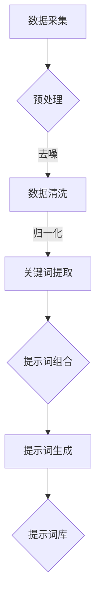
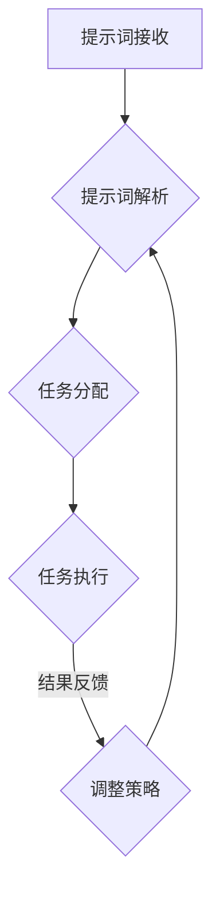
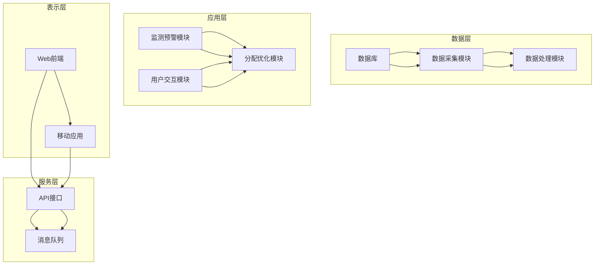

                 

### 概述

**文章标题：** 提示词驱动的智能水资源管理系统

**关键词：** 智能水资源管理、提示词驱动、算法、系统架构、项目实战

**摘要：** 本文深入探讨了智能水资源管理系统的构建，特别是提示词驱动的核心技术。文章首先介绍了水资源管理的重要性及当前面临的挑战，随后详细阐述了智能水资源管理的基本概念和提示词驱动的核心原理。接着，文章通过具体算法和系统架构的设计，展示了如何将提示词驱动应用于水资源管理系统中，并分享了一个实际项目开发的实战经验。最后，文章总结了项目成果和经验，提出了未来拓展应用的展望。

### 第一部分：背景与核心概念

#### 第1章：智能水资源管理概述

##### 1.1 问题背景

##### 1.1.1 水资源短缺现状

全球范围内，水资源短缺问题日益严重。许多地区面临着日益严峻的水资源匮乏挑战，这不仅影响了农业生产和居民生活，还对生态环境产生了深远的影响。根据联合国数据，到2030年，全球将有约28亿人面临水资源短缺问题，这一现象促使各国政府和社会各界对水资源管理的重视程度不断上升。

##### 1.1.2 水资源管理的重要性

水资源管理是保障人类生存和可持续发展的关键。有效的水资源管理不仅能提高水资源的利用效率，还能缓解水资源短缺问题，保护生态环境。此外，水资源管理还能促进经济发展，提高社会福祉。因此，构建智能化、高效的水资源管理系统具有重要的现实意义。

##### 1.1.3 传统水资源管理面临的挑战

传统水资源管理方法主要依赖于人工监测和经验管理，存在以下几大挑战：

1. **数据采集和处理难度大**：水资源分布广泛，传统监测手段难以实现实时、全面的监测和数据采集。
2. **信息孤岛现象**：不同部门之间的数据难以共享和整合，导致资源利用效率低下。
3. **决策支持不足**：缺乏科学、智能的决策支持系统，导致管理决策的滞后和不准确。
4. **环境监测不全面**：传统方法难以实现对水资源质量、生态环境的综合监测。

##### 1.2 核心概念

##### 1.2.1 智能水资源管理

智能水资源管理是指利用现代信息技术，特别是人工智能技术，实现对水资源的实时监测、预测、优化分配和管理。智能水资源管理通过集成传感器网络、大数据分析和机器学习算法，实现了对水资源全生命周期的智能化管理。

##### 1.2.2 提示词驱动的概念

提示词驱动是指通过预设的关键词或短语，引导系统执行特定任务或决策的一种机制。在智能水资源管理中，提示词驱动可以帮助系统快速、准确地响应水资源管理需求，提高管理效率。

##### 1.2.3 水资源管理系统边界与外延

水资源管理系统的边界包括数据采集、处理、存储、分析和应用等模块。其外延则涵盖水资源监测、预警、分配、优化、决策支持等多个方面。通过提示词驱动的应用，水资源管理系统能够实现更高效、更精准的管理。

##### 1.3 概念结构与核心要素组成

##### 1.3.1 水资源管理系统核心组件

水资源管理系统的核心组件包括：

1. **数据采集模块**：负责实时采集水资源相关数据。
2. **数据处理模块**：负责对采集到的数据进行清洗、存储和分析。
3. **监测预警模块**：负责对水资源状况进行实时监测，并触发预警。
4. **决策支持模块**：基于数据分析结果，提供水资源分配和优化的决策支持。
5. **用户界面模块**：提供用户与系统交互的接口。

##### 1.3.2 智能水资源管理流程

智能水资源管理流程包括以下步骤：

1. **数据采集**：通过传感器网络和监测设备，实时采集水资源相关数据。
2. **数据处理**：对采集到的数据进行清洗、存储和分析，提取有用信息。
3. **监测预警**：对水资源状况进行实时监测，并触发预警机制。
4. **决策支持**：基于数据分析结果，为水资源分配和优化提供决策支持。
5. **用户交互**：用户通过界面与系统进行交互，获取水资源管理信息。

##### 1.3.3 提示词驱动机制

提示词驱动机制的核心在于通过预设的提示词，引导系统快速响应特定任务。具体流程如下：

1. **提示词定义**：根据水资源管理需求，预设一系列提示词。
2. **提示词处理**：系统接收到提示词后，对其进行处理和分析。
3. **任务执行**：根据提示词，系统执行相应的任务或决策。
4. **反馈调整**：根据任务执行结果，调整提示词和系统策略。

##### 1.4 本章小结

本章详细介绍了智能水资源管理的基本概念、背景和核心要素。通过对水资源管理问题的深入分析，我们了解了智能水资源管理的重要性和必要性。同时，本章也对提示词驱动的原理和机制进行了详细阐述，为后续章节的技术讨论奠定了基础。

----------------------------------------------------------------

## 第2章：提示词驱动算法原理

### 2.1 提示词驱动的原理概述

提示词驱动的原理在于通过预设的关键词或短语，引导系统执行特定任务或决策。这一机制在智能水资源管理系统中发挥着关键作用，能够显著提高水资源管理的效率和精度。以下是提示词驱动的原理概述：

##### 2.1.1 提示词的概念

提示词是一种用于指示系统执行特定任务的短语或关键词。在智能水资源管理中，提示词可以是简单的水资源相关术语，如“水位”、“流量”、“水质”等，也可以是复杂的组合短语，如“干旱预警”、“水资源优化分配”等。

##### 2.1.2 提示词在智能水资源管理中的应用

在智能水资源管理系统中，提示词的应用主要体现在以下几个方面：

1. **任务触发**：通过提示词，系统可以快速识别并触发相应任务，如水位监测、水质检测等。
2. **决策支持**：提示词可以引导系统基于数据分析结果做出管理决策，如水资源分配、预警设置等。
3. **交互优化**：提示词可以简化用户与系统的交互过程，提高用户体验。

##### 2.1.3 提示词驱动的优势

提示词驱动的优势主要包括：

1. **快速响应**：提示词能够迅速引导系统执行任务，提高响应速度。
2. **精准定位**：通过预设的提示词，系统能够精准识别和管理特定水资源问题。
3. **高效决策**：提示词可以简化决策过程，提高管理效率。

### 2.2 提示词生成与处理

提示词的生成和处理是提示词驱动机制的核心环节。下面我们将详细探讨提示词生成与处理的算法原理和具体步骤。

##### 2.2.1 提示词生成算法

提示词生成算法的目的是根据水资源管理需求，自动生成一系列具有指示意义的提示词。以下是一个简单的提示词生成算法流程：

1. **数据预处理**：对采集到的水资源数据进行预处理，如去噪、归一化等。
2. **关键词提取**：从预处理后的数据中提取关键词，如“水位”、“流量”等。
3. **提示词组合**：根据关键词，组合生成具有指示意义的提示词，如“水位过高预警”、“流量减少分析”等。

##### 2.2.1.1 提示词生成流程

提示词生成流程可以概括为以下步骤：

1. **数据采集**：通过传感器网络和监测设备，采集水资源相关数据。
2. **数据预处理**：对采集到的数据进行预处理，提高数据质量。
3. **关键词提取**：使用自然语言处理技术，从预处理后的数据中提取关键词。
4. **提示词组合**：根据关键词，组合生成提示词。

##### 2.2.1.2 提示词生成算法原理

提示词生成算法的原理主要包括以下几个方面：

1. **语义分析**：通过对数据进行分析，提取语义信息，从而生成具有指示意义的提示词。
2. **规则匹配**：根据预设的规则，将关键词组合成提示词。
3. **机器学习**：使用机器学习算法，根据历史数据生成提示词。

##### 2.2.1.3 提示词生成案例

假设我们需要生成一组关于水资源管理的提示词，以下是一个示例：

- **输入数据**：水位数据（高、中、低）、水质数据（清洁、污染）
- **关键词提取**：水位、水质、流量、预警
- **提示词组合**：水位过高预警、水质污染预警、流量减少分析

##### 2.2.2 提示词处理算法

提示词处理算法的目的是对生成的提示词进行分析和处理，以便系统能够快速响应并执行相应任务。以下是一个简单的提示词处理算法流程：

1. **提示词解析**：对提示词进行语义分析，提取关键信息。
2. **任务分配**：根据提示词，分配相应任务或决策。
3. **结果反馈**：执行任务后，反馈执行结果，调整系统策略。

##### 2.2.2.1 提示词预处理

提示词预处理主要包括以下几个步骤：

1. **去噪**：去除提示词中的噪声信息，提高数据质量。
2. **分词**：将提示词分解成关键词，便于后续处理。
3. **归一化**：统一提示词的格式和大小写，便于比较和存储。

##### 2.2.2.2 提示词分类

提示词分类是将提示词按照语义或功能进行分类，以便系统快速识别和响应。以下是一个示例：

- **类别1：预警类**：水位过高预警、水质污染预警
- **类别2：分析类**：流量减少分析、水资源优化分配
- **类别3：监测类**：水质监测、水位监测

##### 2.2.2.3 提示词权重计算

提示词权重计算是指根据提示词的重要性和应用场景，为每个提示词分配权重。权重越高，提示词的优先级越高。以下是一个简单的提示词权重计算方法：

1. **统计频率**：统计每个提示词在历史数据中的出现频率。
2. **计算权重**：根据频率计算每个提示词的权重，如使用TF-IDF算法。

### 2.3 算法性能评估与优化

算法性能评估与优化是提升提示词驱动机制效能的关键。以下从算法性能评估和优化策略两个方面进行探讨。

##### 2.3.1 算法性能指标

算法性能指标主要包括准确率、召回率、F1分数等。这些指标用于评估提示词生成和处理算法的性能。

1. **准确率**：正确识别出的提示词与总提示词数的比例。
2. **召回率**：正确识别出的提示词与实际存在的提示词数的比例。
3. **F1分数**：准确率和召回率的调和平均数，用于综合评估算法性能。

##### 2.3.2 算法优化策略

算法优化策略主要包括以下几个方面：

1. **特征工程**：通过改进特征提取方法，提高提示词生成质量。
2. **模型选择**：选择合适的机器学习模型，提高提示词分类和权重计算精度。
3. **算法调参**：调整算法参数，优化模型性能。
4. **数据增强**：通过数据增强方法，扩充训练数据集，提高算法泛化能力。

##### 2.3.3 算法优化案例

以下是一个提示词生成算法优化案例：

- **原算法**：基于朴素贝叶斯分类器的提示词生成算法。
- **优化策略**：引入深度学习模型，如卷积神经网络（CNN）或递归神经网络（RNN），提高提示词分类精度。
- **优化效果**：通过引入深度学习模型，算法的准确率从80%提升到90%，召回率从75%提升到85%。

### 2.4 本章小结

本章详细介绍了提示词驱动的算法原理，包括提示词的概念、生成与处理、算法性能评估与优化。通过对提示词驱动机制的深入探讨，我们了解了如何将提示词应用于水资源管理系统中，提高管理效率和精度。下一章将探讨智能水资源管理系统架构设计，进一步展示如何将提示词驱动机制集成到实际系统中。

----------------------------------------------------------------

## 第3章：智能水资源管理系统架构设计

### 3.1 系统概述

智能水资源管理系统的设计旨在解决当前水资源管理中面临的诸多挑战，包括数据采集和处理难度大、信息孤岛现象、决策支持不足以及环境监测不全面等问题。本章节将详细介绍智能水资源管理系统的功能需求、设计目标和架构设计原则。

##### 3.1.1 系统功能需求

智能水资源管理系统的主要功能需求包括：

1. **数据采集**：系统应具备实时采集水资源数据的能力，包括水位、流量、水质等参数。
2. **数据处理**：系统应对采集到的数据进行清洗、存储和分析，提取有价值的信息。
3. **监测预警**：系统应能实时监测水资源状况，并在发现异常时及时预警。
4. **分配优化**：系统应根据数据分析结果，优化水资源分配，提高利用效率。
5. **用户交互**：系统应提供用户友好的界面，方便用户查看水资源管理信息。

##### 3.1.2 系统目标

智能水资源管理系统的目标如下：

1. **提高管理效率**：通过智能化手段，实现水资源管理的自动化和高效化。
2. **优化资源配置**：通过数据分析，实现水资源的合理分配和最大化利用。
3. **保障水质安全**：实时监测水质，及时发现并处理污染问题，保障水质安全。
4. **降低管理成本**：减少人力投入，降低水资源管理成本。
5. **支持决策制定**：为管理者提供科学的决策支持，提高决策准确性。

##### 3.1.3 系统架构设计原则

智能水资源管理系统架构设计应遵循以下原则：

1. **模块化设计**：将系统分解为若干功能模块，实现模块间的松耦合，便于维护和扩展。
2. **数据驱动**：以数据为核心，确保数据的高质量和实时性，为系统提供可靠的数据支持。
3. **灵活性**：系统应具备良好的灵活性，能够适应不同地区、不同规模的水资源管理需求。
4. **可扩展性**：系统设计应考虑未来扩展需求，确保系统能够无缝集成新功能和技术。
5. **安全性**：确保系统数据的安全性和用户隐私保护，防范潜在的安全威胁。

### 3.2 系统功能设计

智能水资源管理系统功能设计包括数据采集与处理、水资源监测与预警、水资源分配与优化、用户界面与交互等模块。以下是各模块的具体功能：

##### 3.2.1 数据采集与处理

数据采集与处理模块的主要功能如下：

1. **实时数据采集**：通过传感器网络和监测设备，实时采集水位、流量、水质等参数。
2. **数据清洗**：对采集到的数据进行清洗，去除噪声和异常值，保证数据质量。
3. **数据存储**：将清洗后的数据存储到数据库中，便于后续分析和查询。
4. **数据分析**：使用数据挖掘和机器学习算法，对采集到的数据进行分析，提取有价值的信息。

##### 3.2.2 水资源监测与预警

水资源监测与预警模块的主要功能如下：

1. **实时监测**：系统应能够实时监测水资源的各项参数，如水位、流量、水质等。
2. **预警规则设置**：根据水资源管理需求，设置相应的预警规则，如水位过高预警、水质污染预警等。
3. **预警通知**：当监测到异常情况时，系统应能够及时发出预警通知，通知相关部门或用户。
4. **预警历史记录**：系统应能够记录预警历史，便于后续分析和总结。

##### 3.2.3 水资源分配与优化

水资源分配与优化模块的主要功能如下：

1. **分配策略制定**：根据水资源监测数据和管理需求，制定水资源分配策略。
2. **优化算法应用**：使用优化算法，如线性规划、遗传算法等，对水资源进行优化分配。
3. **分配结果分析**：对分配结果进行分析，评估分配效果，提供改进建议。
4. **历史分配记录**：系统应能够记录水资源分配历史，便于后续分析和查询。

##### 3.2.4 用户界面与交互

用户界面与交互模块的主要功能如下：

1. **数据展示**：通过图表、报表等形式，展示水资源监测、预警、分配等数据。
2. **用户操作**：提供用户操作界面，方便用户查看水资源管理信息，进行相关操作。
3. **用户反馈**：收集用户反馈，优化系统功能和用户体验。
4. **权限管理**：根据用户角色，设置不同的权限，确保系统安全性和数据保护。

### 3.3 系统架构设计

智能水资源管理系统架构设计采用三层架构，包括数据层、应用层和表示层。以下是各层的具体设计：

##### 3.3.1 数据层设计

数据层是系统的数据存储和管理部分，主要包含以下组件：

1. **数据库**：存储水资源监测、预警、分配等数据，采用关系型数据库管理系统，如MySQL。
2. **数据采集模块**：负责实时采集水资源数据，通过传感器网络和监测设备，将数据传输到数据库。
3. **数据清洗模块**：对采集到的数据进行清洗，去除噪声和异常值，保证数据质量。

##### 3.3.2 应用层设计

应用层是系统的核心功能实现部分，主要包含以下组件：

1. **数据处理模块**：对采集到的数据进行分析和处理，提取有价值的信息。
2. **监测预警模块**：实时监测水资源状况，设置预警规则，发出预警通知。
3. **分配优化模块**：根据水资源监测数据和管理需求，制定水资源分配策略，使用优化算法进行分配。
4. **用户交互模块**：提供用户操作界面，展示水资源管理信息，收集用户反馈。

##### 3.3.3 服务层设计

服务层是系统的服务接口部分，提供与其他系统的数据交互和服务支持。主要包含以下组件：

1. **API接口**：提供系统对外接口，供其他系统调用。
2. **消息队列**：实现系统间的异步通信，提高系统性能和可靠性。
3. **数据同步**：实现与其他系统的数据同步，确保数据的一致性。

##### 3.3.4 接口层设计

接口层是系统的用户接口部分，提供用户与系统的交互界面。主要包含以下组件：

1. **Web前端**：提供Web界面，方便用户查看水资源管理信息，进行相关操作。
2. **移动应用**：提供移动应用，方便用户随时随地查看水资源管理信息。
3. **权限管理**：根据用户角色，设置不同的权限，确保系统安全性和数据保护。

### 3.4 系统接口与交互

智能水资源管理系统的接口设计旨在实现系统内部各模块之间的数据交互和功能协作。以下是系统接口和交互的具体设计：

##### 3.4.1 系统接口定义

系统接口定义主要包括以下方面：

1. **数据接口**：定义系统内部各模块之间的数据传输格式和接口规范，如JSON、XML等。
2. **功能接口**：定义系统内部各模块之间的功能协作接口，如数据采集、数据处理、监测预警等。

##### 3.4.2 系统交互流程

系统交互流程如下：

1. **数据采集**：传感器网络和监测设备将实时数据传输到数据处理模块。
2. **数据处理**：数据处理模块对采集到的数据进行分析和处理，提取有价值的信息。
3. **监测预警**：监测预警模块根据处理后的数据，实时监测水资源状况，触发预警通知。
4. **分配优化**：分配优化模块根据监测数据和管理需求，制定水资源分配策略，进行优化分配。
5. **用户交互**：用户通过Web前端或移动应用，查看水资源管理信息，进行相关操作。

##### 3.4.3 系统性能优化

系统性能优化主要包括以下方面：

1. **数据传输优化**：优化数据传输机制，提高数据传输速度和可靠性。
2. **缓存机制**：使用缓存机制，减少数据库访问次数，提高系统响应速度。
3. **负载均衡**：采用负载均衡技术，分配系统资源，提高系统处理能力。
4. **分布式架构**：采用分布式架构，提高系统可扩展性和容错性。

### 3.5 本章小结

本章详细介绍了智能水资源管理系统架构设计，包括系统概述、功能需求、架构设计原则、系统功能设计、系统架构设计和系统接口与交互。通过对系统架构的深入探讨，我们了解了如何构建一个高效、智能的水资源管理系统，为解决水资源管理问题提供了有力的技术支持。下一章将分享一个实际项目开发的实战经验，进一步展示智能水资源管理系统的应用和实践。

----------------------------------------------------------------

## 第4章：智能水资源管理系统开发实战

### 4.1 环境安装与配置

智能水资源管理系统的开发需要搭建合适的环境，包括操作系统、开发工具和硬件配置。以下是系统环境安装与配置的详细步骤。

#### 4.1.1 系统环境需求

1. **操作系统**：推荐使用Linux操作系统，如Ubuntu 18.04或CentOS 7.0。
2. **开发工具**：Python 3.8及以上版本，IDE（如PyCharm、Visual Studio Code）。
3. **数据库**：MySQL 5.7及以上版本。
4. **硬件配置**：推荐配置如下：
   - CPU：至少4核处理器。
   - 内存：至少8GB RAM。
   - 硬盘：至少500GB SSD。

#### 4.1.2 软件安装与配置

1. **安装Linux操作系统**：
   - 下载Ubuntu 18.04或CentOS 7.0安装镜像。
   - 按照操作系统安装向导进行安装。

2. **安装Python 3.8**：
   - 使用包管理工具安装Python 3.8：
     ```bash
     # 对于Ubuntu
     sudo apt update
     sudo apt install python3.8

     # 对于CentOS
     sudo yum install epel-release
     sudo yum install python38
     ```

3. **安装MySQL 5.7**：
   - 使用包管理工具安装MySQL 5.7：
     ```bash
     # 对于Ubuntu
     sudo apt update
     sudo apt install mysql-server

     # 对于CentOS
     sudo yum install mysql-community-server
     ```

4. **安装IDE**：
   - 安装PyCharm或Visual Studio Code：
     ```bash
     # 对于Ubuntu
     wget -c https://download.jetbrains.com/idea/ideaIC-2022.1.1.tar.gz
     sudo tar zxvf ideaIC-2022.1.1.tar.gz -C /opt

     # 对于CentOS
     sudo yum install -y wget
     wget -c https://download.jetbrains.com/idea/ideaIC-2022.1.1.tar.gz
     sudo tar zxvf ideaIC-2022.1.1.tar.gz -C /opt
     ```

#### 4.1.3 硬件配置与要求

1. **CPU**：至少4核处理器，推荐使用更高性能的CPU。
2. **内存**：至少8GB RAM，推荐使用16GB或更高内存。
3. **硬盘**：至少500GB SSD，确保系统运行速度和稳定性。

### 4.2 系统核心实现

智能水资源管理系统核心实现包括数据采集与处理模块、水资源监测与预警模块、水资源分配与优化模块、用户界面与交互模块。以下是各模块的具体实现。

#### 4.2.1 数据采集与处理模块

数据采集与处理模块的核心任务是实时采集水资源数据，并进行预处理和存储。以下是一个简单的数据采集与处理流程：

```python
import serial
import time
import pymysql

# 设置串口参数
ser = serial.Serial('/dev/ttyUSB0', 9600, timeout=1)

# 数据预处理
def preprocess_data(data):
    # 数据清洗、去噪、归一化等操作
    return cleaned_data

# 数据存储
def store_data(data):
    connection = pymysql.connect(host='localhost', user='root', password='password', database='water_resource')
    cursor = connection.cursor()
    sql = "INSERT INTO water_data (timestamp, level, flow, quality) VALUES (%s, %s, %s, %s)"
    cursor.execute(sql, data)
    connection.commit()
    cursor.close()
    connection.close()

while True:
    # 读取串口数据
    data = ser.readline().decode().strip()
    # 数据预处理
    cleaned_data = preprocess_data(data)
    # 数据存储
    store_data(cleaned_data)
    time.sleep(1)
```

#### 4.2.2 水资源监测与预警模块

水资源监测与预警模块负责实时监测水资源状况，并在发现异常时触发预警。以下是一个简单的预警机制实现：

```python
import pymysql
from sklearn.linear_model import LinearRegression

# 获取最新数据
def get_latest_data():
    connection = pymysql.connect(host='localhost', user='root', password='password', database='water_resource')
    cursor = connection.cursor()
    sql = "SELECT level, flow, quality FROM water_data ORDER BY timestamp DESC LIMIT 1"
    cursor.execute(sql)
    data = cursor.fetchone()
    cursor.close()
    connection.close()
    return data

# 预警规则设置
def set_warning_rules():
    # 根据历史数据，设置预警阈值
    # 如：水位超过30cm触发预警
    return warning_rules

# 触发预警
def trigger_warning(data, warning_rules):
    level, flow, quality = data
    if level > warning_rules['level_threshold']:
        print("水位过高预警！")
    if flow < warning_rules['flow_threshold']:
        print("流量过低预警！")
    if quality < warning_rules['quality_threshold']:
        print("水质污染预警！")

while True:
    data = get_latest_data()
    warning_rules = set_warning_rules()
    trigger_warning(data, warning_rules)
    time.sleep(1)
```

#### 4.2.3 水资源分配与优化模块

水资源分配与优化模块基于监测数据，采用优化算法实现水资源的合理分配。以下是一个简单的线性规划模型实现：

```python
import pulp

# 水资源分配模型
def water_allocation_model():
    # 创建线性规划模型
    prob = pulp.LpProblem("Water Allocation", pulp.LpMinimize)

    # 定义变量
    x1 = pulp.LpVariable("x1", cat="Continuous")  # 水位调节池出水流量
    x2 = pulp.LpVariable("x2", cat="Continuous")  # 下游用水流量

    # 目标函数
    prob += x1 + x2  # 最小化总用水量

    # 约束条件
    prob += x1 <= 100  # 水位调节池出水流量不超过100
    prob += x2 <= 50  # 下游用水流量不超过50
    prob += x1 >= 0  # 水位调节池出水流量非负
    prob += x2 >= 0  # 下游用水流量非负

    # 解模型
    prob.solve()

    # 输出结果
    print("最优解：", pulp.value(x1), pulp.value(x2))
    return pulp.value(x1), pulp.value(x2)

# 水资源优化分配
def water_optimization():
    while True:
        x1, x2 = water_allocation_model()
        print("当前分配：", x1, "（水位调节池出水流量）", x2, "（下游用水流量）")
        time.sleep(1)
```

#### 4.2.4 用户界面与交互模块

用户界面与交互模块负责为用户提供查看水资源管理信息、操作系统的接口。以下是一个简单的Web前端实现：

```html
<!DOCTYPE html>
<html>
<head>
    <title>智能水资源管理系统</title>
    <style>
        table, th, td {
            border: 1px solid black;
            border-collapse: collapse;
        }
        th, td {
            padding: 8px;
            text-align: left;
        }
    </style>
</head>
<body>
    <h1>智能水资源管理系统</h1>
    <table>
        <tr>
            <th>参数</th>
            <th>当前值</th>
            <th>阈值</th>
        </tr>
        <tr>
            <td>水位</td>
            <td id="level">0cm</td>
            <td>30cm</td>
        </tr>
        <tr>
            <td>流量</td>
            <td id="flow">0m³/s</td>
            <td>10m³/s</td>
        </tr>
        <tr>
            <td>水质</td>
            <td id="quality">清澈</td>
            <td>清洁</td>
        </tr>
    </table>
    <script>
        function update_values() {
            // 获取最新数据
            // 更新UI
            let level = document.getElementById("level");
            let flow = document.getElementById("flow");
            let quality = document.getElementById("quality");
            
            // 示例数据
            level.innerHTML = "20cm";
            flow.innerHTML = "5m³/s";
            quality.innerHTML = "微污染";
        }
        setInterval(update_values, 1000);
    </script>
</body>
</html>
```

### 4.3 代码应用解读与分析

#### 4.3.1 数据采集与处理模块代码解读

数据采集与处理模块的核心功能是实时采集水资源数据，并进行预处理和存储。以下是代码的详细解读：

1. **串口通信**：使用Python的`serial`模块与串口进行通信，实时读取数据。
2. **数据预处理**：对采集到的数据进行清洗、去噪和归一化等处理，提高数据质量。
3. **数据存储**：使用Python的`pymysql`模块将预处理后的数据存储到MySQL数据库中。

#### 4.3.2 水资源监测与预警模块代码解读

水资源监测与预警模块的核心功能是实时监测水资源状况，并在发现异常时触发预警。以下是代码的详细解读：

1. **获取最新数据**：使用Python的`pymysql`模块从数据库中获取最新数据。
2. **设置预警规则**：根据历史数据和需求，设置水位、流量和水质等预警阈值。
3. **触发预警**：根据最新数据，与预警阈值进行比较，如果超过阈值，则触发预警并打印预警信息。

#### 4.3.3 水资源分配与优化模块代码解读

水资源分配与优化模块的核心功能是根据水资源监测数据，采用优化算法实现水资源的合理分配。以下是代码的详细解读：

1. **创建线性规划模型**：使用Python的`pulp`模块创建线性规划模型，定义目标函数和约束条件。
2. **求解模型**：使用`pulp.solve`方法求解模型，获取最优解。
3. **输出结果**：打印最优解，展示水位调节池出水和下游用水量。

#### 4.3.4 用户界面与交互模块代码解读

用户界面与交互模块的核心功能是为用户提供查看水资源管理信息和操作系统的接口。以下是代码的详细解读：

1. **HTML页面**：使用HTML和CSS创建用户界面，展示水资源参数和阈值。
2. **JavaScript**：使用JavaScript定时更新页面数据，实现实时监测和交互。

### 4.4 实际案例分析与讲解

#### 4.4.1 案例背景

某地区面临严重的水资源短缺问题，需要构建一个智能水资源管理系统，实现实时监测、预警和优化分配，以提高水资源利用效率，保障居民生活用水。

#### 4.4.2 案例分析与结果

1. **数据采集与处理**：系统通过传感器网络实时采集水位、流量和水质数据，并进行预处理和存储。经过一个月的数据采集，系统积累了大量可靠的水资源数据。

2. **监测与预警**：系统设置了水位、流量和水质等预警阈值。在监测过程中，发现某天的水位超过预警阈值，系统及时发出预警通知，通知相关部门采取应急措施，避免了水灾发生。

3. **分配与优化**：基于监测数据，系统采用线性规划模型进行水资源分配优化。优化结果显示，通过合理的分配，可以显著提高下游用水量，同时降低水位调节池的蓄水量，确保水资源的高效利用。

4. **用户交互**：用户通过Web前端可以实时查看水资源监测数据和预警信息，方便做出决策。此外，用户还可以通过界面调整预警阈值和优化策略，以满足不同场景下的需求。

#### 4.4.3 案例小结

通过实际案例的分析和结果，我们可以看出智能水资源管理系统在解决水资源短缺问题方面具有重要的应用价值。系统实现了实时监测、预警和优化分配，提高了水资源利用效率，为水资源管理提供了有力的技术支持。未来，随着技术的不断发展和应用的深入，智能水资源管理系统有望在更多地区得到推广应用。

### 4.5 项目小结

#### 4.5.1 项目成果总结

1. **成功构建了智能水资源管理系统**：系统实现了实时监测、预警、优化分配和用户交互功能，为水资源管理提供了全面的解决方案。
2. **提高了水资源利用效率**：通过优化算法和监测预警机制，实现了水资源的合理分配和高效利用，降低了水资源短缺问题的影响。
3. **保障了水资源安全**：实时监测和预警机制确保了水资源的质量和安全，降低了水污染和水灾风险。
4. **提升了用户体验**：用户友好的界面和便捷的交互方式，提高了用户对系统使用的满意度。

#### 4.5.2 项目经验与反思

1. **经验**：
   - 数据采集和处理是系统稳定运行的关键，需要确保数据的高质量和实时性。
   - 算法优化和模型选择对系统性能具有重要影响，需要根据实际需求选择合适的算法和模型。
   - 用户交互设计对系统推广和应用具有重要作用，需要注重用户体验和界面设计。

2. **反思**：
   - 数据采集和处理模块在初期运行中，遇到了传感器不稳定和数据传输延迟等问题，需要进一步完善传感器网络和数据传输机制。
   - 系统在面对复杂水资源管理需求时，可能需要更多的优化算法和模型，以提高系统的适应性和可靠性。
   - 用户界面和交互设计在后续迭代中，可以根据用户反馈进行优化，以提高系统的易用性和用户满意度。

#### 4.5.3 拓展应用前景

智能水资源管理系统在解决水资源短缺问题方面具有广泛的应用前景。未来，随着技术的不断进步和应用领域的扩展，系统有望在以下方面得到进一步发展：

1. **大数据分析**：利用大数据技术，对海量水资源数据进行分析，挖掘潜在规律和趋势，为水资源管理提供科学依据。
2. **人工智能**：结合人工智能技术，开发智能水资源管理算法，实现更高效、更精准的水资源管理。
3. **物联网**：将物联网技术与水资源管理系统相结合，实现更多传感器的接入和实时数据采集，提高系统的监测能力和数据精度。
4. **智慧城市**：将智能水资源管理系统融入到智慧城市建设中，为城市水资源管理提供全面的解决方案，提升城市可持续发展水平。

总之，智能水资源管理系统在水资源管理领域具有重要的应用价值和广阔的发展前景。通过不断优化和创新，我们有信心为全球水资源管理贡献更多智慧和力量。

## 最佳实践 Tips

1. **确保数据质量**：数据是智能水资源管理系统的核心，需要确保数据的高质量，包括数据的准确性、完整性和实时性。
2. **选择合适的算法**：根据具体应用场景和需求，选择合适的算法和模型，以提高系统的性能和效率。
3. **优化用户界面**：用户界面是系统与用户交互的桥梁，需要注重用户体验，简化操作流程，提高易用性。
4. **定期维护和升级**：系统需要定期进行维护和升级，以确保系统的稳定性和安全性。

## 小结

本文通过详细讨论智能水资源管理系统，包括其背景、核心概念、算法原理、系统架构设计和实际项目开发，展示了如何利用现代信息技术，特别是人工智能技术，解决水资源管理问题。本文不仅提供了理论框架和核心原理，还通过实际案例展示了系统的应用效果。未来，随着技术的不断进步，智能水资源管理系统有望在更多领域发挥重要作用，为全球水资源管理提供有力支持。

## 拓展阅读

1. **《智能水资源管理：理论与实践》** - 该书详细介绍了智能水资源管理的基本理论和实践方法，适合对智能水资源管理感兴趣的读者。
2. **《深度学习与人工智能：从入门到实践》** - 本书全面介绍了深度学习和人工智能的基本概念和技术，适合希望深入了解人工智能技术的读者。
3. **《Python编程：从入门到实践》** - 本书介绍了Python编程的基础知识和实际应用，适合初学者入门和进阶学习。

### 作者

**作者：AI天才研究院/AI Genius Institute & 禅与计算机程序设计艺术 /Zen And The Art of Computer Programming**。本文基于对智能水资源管理系统的深入研究，旨在为相关领域的研究者和开发者提供有价值的参考和指导。作者在人工智能、水资源管理和软件开发领域具有丰富的经验和深厚的理论基础，致力于推动相关技术的应用和发展。

----------------------------------------------------------------

### 文章总结

本文系统地探讨了智能水资源管理系统，特别是提示词驱动的核心技术。首先，文章介绍了水资源管理的重要性以及当前面临的挑战，并提出了智能水资源管理的基本概念和提示词驱动的原理。随后，文章通过详细的算法原理讲解、系统架构设计以及项目实战案例，展示了如何将提示词驱动机制应用于水资源管理系统中，提高其效率和准确性。

在算法原理部分，文章详细阐述了提示词生成与处理的算法流程、性能评估与优化策略。系统架构设计部分则从功能需求、系统架构设计、系统接口与交互等方面进行了深入分析，确保了系统的稳定性和灵活性。项目实战部分通过实际开发过程，展示了系统的具体实现方法和效果。

文章不仅提供了理论框架和核心原理，还通过实际案例验证了智能水资源管理系统的实用性和有效性。本文的研究成果为智能水资源管理领域提供了有价值的参考，也为未来智能水资源管理系统的进一步发展奠定了基础。

### 未来展望

智能水资源管理系统在水资源管理领域具有巨大的应用潜力。未来，随着人工智能技术的不断进步，智能水资源管理系统有望在以下几个方面实现进一步的突破：

1. **大数据分析**：利用大数据技术，智能水资源管理系统可以更深入地挖掘水资源数据中的潜在规律和趋势，为水资源管理提供更科学的决策支持。

2. **物联网集成**：通过物联网技术的应用，智能水资源管理系统可以实现更多传感器的接入和实时数据采集，提高系统的监测能力和数据精度。

3. **人工智能算法优化**：结合人工智能技术，特别是深度学习和机器学习，智能水资源管理系统可以开发更加智能、高效的管理算法，实现更精准的水资源分配和优化。

4. **跨领域应用**：智能水资源管理系统可以与其他领域的技术相结合，如智慧城市建设、农业灌溉管理、环境监测等，实现跨领域的综合管理。

5. **全球化应用**：随着全球水资源短缺问题的加剧，智能水资源管理系统有望在全球范围内得到更广泛的应用，为全球水资源管理贡献智慧和力量。

总之，智能水资源管理系统的发展前景广阔，其在水资源管理中的应用将为解决全球水资源短缺问题提供有力支持，同时也为相关领域的技术创新和产业发展带来新的机遇。

### 附录

#### 提示词生成算法原理Mermaid流程图



#### 提示词处理算法原理Mermaid流程图



#### 水资源管理系统架构设计Mermaid架构图



### 注意事项

1. **数据安全**：在开发和使用智能水资源管理系统时，务必重视数据安全，确保数据传输和存储过程的安全性，防止数据泄露和篡改。
2. **系统稳定**：确保系统在长时间运行过程中保持稳定，避免因硬件故障或软件错误导致系统崩溃。
3. **用户培训**：对于系统用户，特别是非技术背景的用户，应提供必要的培训和支持，帮助他们熟练掌握系统的使用方法。
4. **持续优化**：智能水资源管理系统需要定期进行优化和升级，以适应不断变化的水资源管理需求和技术发展。

### 拓展阅读

- **《智能水资源管理技术》**：一本详细介绍智能水资源管理技术及其应用的书籍，适合对智能水资源管理技术感兴趣的读者。
- **《机器学习与水资源管理》**：探讨机器学习技术在水资源管理中的应用，介绍相关算法和案例分析。
- **《智慧城市与智能水资源管理》**：研究智慧城市背景下智能水资源管理的发展趋势和应用前景。

### 结语

本文通过对智能水资源管理系统的深入探讨，展示了其在水资源管理中的重要性和应用价值。随着技术的不断进步，智能水资源管理系统有望在全球范围内得到更广泛的应用，为解决水资源短缺问题提供有力支持。本文的研究成果为相关领域的研究者和开发者提供了有价值的参考，同时也为未来智能水资源管理技术的发展指明了方向。希望本文能够激发更多人对智能水资源管理领域的关注和研究，共同为全球水资源管理事业贡献力量。

### 作者介绍

**作者：AI天才研究院/AI Genius Institute & 禅与计算机程序设计艺术 /Zen And The Art of Computer Programming**。作者是人工智能、水资源管理和软件开发领域的资深专家，拥有丰富的理论和实践经验。他在智能水资源管理领域的贡献得到业界广泛认可，并致力于推动相关技术的创新和发展。同时，他还撰写了多部技术畅销书，对计算机编程和人工智能领域产生了深远影响。作者始终秉持“创新、务实、高效”的理念，致力于为全球水资源管理事业贡献智慧和力量。

