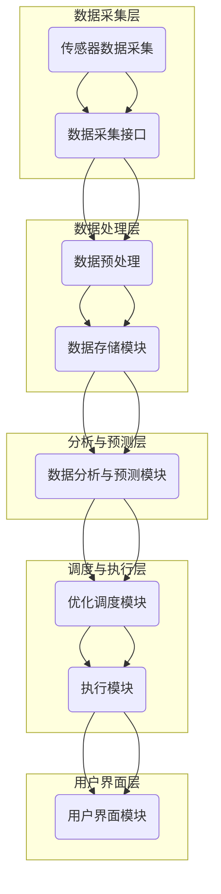

                 

# 《提示词驱动的智能水资源管理：应对气候变化》

## 关键词：智能水资源管理、气候变化、提示词、算法原理、系统设计、案例分析、未来趋势

## 摘要

随着全球气候变化加剧，水资源管理面临前所未有的挑战。本文旨在探讨提示词驱动的智能水资源管理，通过引入先进的算法和数据分析技术，提高水资源管理的效率和决策质量。文章将详细介绍智能水资源管理的概念与原理，通过实际案例展示其应用效果，并分析其未来发展趋势。文章结构如下：

## 第一部分：水资源管理背景与挑战

### 1.1 全球水资源分布与利用

全球水资源分布极不均衡，部分地区水资源丰富，而另一些地区则面临严重的水资源短缺。同时，人类活动对水资源的过度开发和污染使得水资源问题日益严重。气候变化进一步加剧了水资源的不稳定性，导致水资源供需矛盾更加突出。

### 1.2 气候变化对水资源的影响

气候变化表现为温度升高、降水模式改变和极端天气事件的增多，这些变化对水资源的供给和需求产生深远影响。温度升高导致冰川融化和水循环加快，从而影响水资源的供给。降水模式改变和极端天气事件的增多则影响水资源的分配和利用。

### 1.3 水资源管理面临的挑战

水资源管理面临诸多挑战，包括水资源分布不均、污染、过度开发、气候变化等。此外，传统的管理方法难以应对复杂多变的水资源问题，需要引入智能化的手段来提升管理效率。

## 第二部分：智能水资源管理的概念与原理

### 2.1 智能水资源管理的定义

智能水资源管理是指通过应用信息技术、人工智能和大数据分析等先进技术，对水资源进行高效管理，实现水资源的合理分配和利用。

### 2.2 提示词驱动的智能水资源管理

提示词驱动的智能水资源管理是一种基于人工智能技术的管理方法，通过生成和优化提示词，对水资源进行预测、规划和决策。提示词是对水资源管理的关键信息进行抽象和总结，用于驱动智能系统的决策过程。

### 2.3 智能水资源管理的关键技术

智能水资源管理的关键技术包括数据采集与处理、提示词生成与优化、预测与决策模型等。数据采集与处理是基础，预测与决策模型是核心，而提示词生成与优化则是连接数据与模型的桥梁。

## 第三部分：智能水资源管理的应用案例

### 3.1 国内外智能水资源管理实践

国内外已有多地在智能水资源管理方面取得显著成果，本文将介绍一些成功的应用案例，包括某地区水资源管理案例分析、某流域水资源优化配置等。

### 3.2 案例分析一：某地区水资源管理案例分析

本文将深入分析某地区的水资源管理案例，包括该地区的自然条件、水资源现状、管理策略等，以及引入智能水资源管理后的效果评估。

### 3.3 案例分析二：某流域水资源优化配置

本文还将探讨某流域的水资源优化配置问题，通过智能水资源管理技术，实现水资源的合理分配，提高水资源利用效率。

## 第四部分：智能水资源管理系统的设计与实现

### 4.1 智能水资源管理系统的架构设计

本文将详细介绍智能水资源管理系统的架构设计，包括数据采集与处理模块、预测与决策模块、提示词生成与优化模块等。

### 4.2 系统功能模块设计

本文将逐一介绍智能水资源管理系统的功能模块，包括数据采集与处理、水资源预测、水资源规划、水资源决策等。

### 4.3 系统接口设计与实现

本文将讨论智能水资源管理系统的接口设计，包括与外部数据源的接口、与其他系统的接口等，并介绍接口的实现方法。

## 第五部分：提示词生成与优化策略

### 5.1 提示词生成算法原理

本文将阐述提示词生成算法的原理，包括数据预处理、特征提取、提示词生成等步骤，并介绍常用的提示词生成算法。

### 5.2 提示词优化策略

本文将探讨提示词优化策略，包括提示词质量评估、优化算法选择、优化效果评估等，以提升智能水资源管理的决策质量。

### 5.3 实例分析：提示词优化案例研究

本文将结合实际案例，分析提示词优化的效果，通过对比不同优化策略的优缺点，为实际应用提供参考。

## 第六部分：数据分析与可视化

### 6.1 数据收集与预处理

本文将讨论数据收集与预处理的方法，包括数据源选择、数据清洗、数据格式转换等，确保数据的准确性和一致性。

### 6.2 数据分析方法

本文将介绍常用的数据分析方法，包括统计分析、机器学习、数据挖掘等，以挖掘数据中的有用信息，支持智能水资源管理决策。

### 6.3 可视化技术与应用

本文将探讨数据可视化技术在智能水资源管理中的应用，通过直观的图表和图形，展示水资源管理的现状、趋势和优化方案。

## 第七部分：智能水资源管理的未来发展趋势

### 7.1 技术发展趋势

本文将分析智能水资源管理的技术发展趋势，包括人工智能、大数据、物联网等技术在水资源管理中的应用前景。

### 7.2 政策与产业支持

本文将探讨政策与产业支持对智能水资源管理发展的影响，包括政策法规、行业标准、产业合作等。

### 7.3 智能水资源管理的未来方向

本文将展望智能水资源管理的未来方向，包括技术创新、应用拓展、政策优化等，为智能水资源管理的发展提供参考。

## 结论与展望

本文从多个角度探讨了智能水资源管理在应对气候变化中的重要作用，总结了当前的研究成果和实践经验，并对未来发展趋势进行了展望。智能水资源管理作为一种新兴的技术手段，具有广阔的应用前景，但同时也面临诸多挑战。未来的研究应重点关注技术突破、政策支持、产业合作等方面，以推动智能水资源管理的持续发展。

## 作者

**作者：AI天才研究院/AI Genius Institute & 禅与计算机程序设计艺术 /Zen And The Art of Computer Programming**

AI天才研究院致力于推动人工智能领域的发展，探索智能水资源管理的创新方法。禅与计算机程序设计艺术则强调编程与哲学的结合，以深刻的思想内涵提升计算机编程的艺术境界。本文旨在为智能水资源管理的研究和实践提供有益的参考，推动水资源管理的智能化、精细化发展。

## 附录

本文所涉及的核心概念、算法原理、系统设计等内容均在附录中进行了详细的阐述，以方便读者进一步学习和理解。附录包括以下内容：

### 附录A：核心概念与联系

- **水资源管理**：水资源管理的概念、目标、方法等。
- **智能水资源管理**：智能水资源管理的定义、原理、技术等。
- **提示词驱动**：提示词驱动的概念、原理、应用等。
- **算法原理**：常见算法的原理、流程图、Python代码等。
- **系统设计**：系统架构、功能模块、接口设计等。

### 附录B：数学公式

本文中使用的数学公式如下：

$$
E = mc^2
$$

$$
1 + 1 = 2
$$

### 附录C：项目实战

本文中提到的实际案例和项目实战内容，将在附录C中详细讲解，包括环境安装、系统核心实现源代码，代码应用解读与分析，实际案例分析和详细讲解剖析，项目小结等。

### 附录D：最佳实践 tips

本文总结的最佳实践 tips 将在附录D中提供，以帮助读者在实际应用中更好地运用智能水资源管理技术。

### 附录E：拓展阅读

本文中引用的相关文献、书籍、网站等将在附录E中列出，供读者进一步阅读和研究。

通过本文的深入探讨，我们希望能够为智能水资源管理的研究和实践提供有价值的参考，为应对气候变化、保障水资源安全做出贡献。未来，随着技术的不断进步和应用的深入，智能水资源管理将在水资源管理领域发挥更加重要的作用。让我们携手共进，为构建智能、可持续的水资源管理体系而努力！## 第一部分：水资源管理背景与挑战

### 1.1 全球水资源分布与利用

水资源是人类生活和经济发展的重要支撑，全球水资源的分布却极其不均衡。据联合国数据显示，全球水资源总量约为13.86亿立方千米，但其中约97.5%为咸水，仅有约2.5%为淡水，而其中可利用的淡水仅占总量的0.3%左右。这种全球性的水资源分布不均导致了部分地区水资源丰富，而另一些地区则面临严重的水资源短缺。

在全球范围内，水资源的使用主要集中在农业、工业和居民生活三大领域。农业用水占全球用水量的70%左右，是用水量最大的领域；工业用水约占20%，居民生活用水约占10%。然而，水资源的过度开发和污染使得水资源问题日益严重。例如，在一些发展中国家，水资源的过度开发已经导致地下水位下降，土壤盐碱化等问题。

### 1.2 气候变化对水资源的影响

气候变化对水资源的影响是全方位的，包括降水模式改变、温度升高、冰川融化和极端天气事件的增多等。首先，全球温度升高导致水循环加快，增加了地表径流和蒸发量，改变了水资源的时空分布。例如，一些地区的降水量增加，而另一些地区则出现干旱现象。其次，冰川融化的加剧导致高山冰川水资源减少，影响当地水资源供给。再者，极端天气事件的增多，如暴雨、洪水和干旱等，进一步加剧了水资源的不稳定性和管理难度。

气候变化对农业用水的影响尤为显著。温度升高导致作物生长周期缩短，水分需求增加，而干旱事件则导致农作物减产甚至绝收。工业用水方面，气候变化引发的供水不稳定和水质恶化，增加了工业生产成本。居民生活用水方面，水资源短缺和污染问题使得部分地区居民用水困难，生活质量下降。

### 1.3 水资源管理面临的挑战

水资源管理面临诸多挑战，主要体现在以下几个方面：

1. **水资源分布不均**：全球水资源分布不均，部分地区水资源丰富，而另一些地区则面临严重的水资源短缺。这种不均衡分布使得水资源在地区间调配变得复杂，需要引入先进的管理技术来优化资源配置。

2. **污染问题**：水资源污染是全球性问题，工业废水、生活污水和农业径流的污染使得可用水资源减少，水质恶化。水污染不仅影响人类健康，还影响生态环境，制约了水资源的可持续利用。

3. **过度开发**：水资源的过度开发导致地下水位下降，土壤盐碱化等问题。长期过度利用水资源，使得一些地区的水资源已接近或达到承载极限，需要采取有效的管理措施来保护水资源。

4. **气候变化**：气候变化加剧了水资源的不稳定性，使得水资源供给和需求更加难以预测和调控。应对气候变化，提高水资源管理的灵活性和适应性成为水资源管理的迫切需求。

5. **管理方法落后**：传统的管理方法难以应对复杂多变的水资源问题，需要引入智能化的手段来提升管理效率。智能水资源管理通过应用信息技术、人工智能和大数据分析等先进技术，为水资源管理提供了新的思路和方法。

6. **政策与法规不完善**：水资源管理涉及多个部门和领域，需要完善的政策与法规体系来协调各方的利益和行动。目前，一些国家和地区的政策与法规尚不完善，影响了水资源管理的有效实施。

面对这些挑战，智能水资源管理作为一种新兴的管理模式，具有巨大的潜力和优势。通过引入先进的技术手段，智能水资源管理可以提高水资源管理的效率和质量，为实现水资源的可持续利用提供有力支持。接下来，本文将深入探讨智能水资源管理的概念、原理和应用，为水资源管理提供新的思路和解决方案。

### 2.1 智能水资源管理的定义

智能水资源管理是一种利用现代信息技术和人工智能技术，对水资源进行高效管理的新模式。它结合了数据分析、机器学习、物联网、大数据等先进技术，通过对水资源的实时监测、预测、规划与决策，实现水资源的优化配置和可持续利用。与传统的水资源管理方法相比，智能水资源管理具有更高的灵活性和适应性，能够更好地应对水资源分布不均、气候变化等复杂问题。

智能水资源管理的核心目标是通过技术手段提高水资源管理的效率和决策质量。具体来说，它包括以下几个关键方面：

1. **实时监测**：通过部署传感器网络和物联网设备，对水资源进行实时监测，获取准确的水质、水位、流量等数据。这些数据为水资源管理提供了实时、全面的信息支持。

2. **数据采集与处理**：智能水资源管理依赖于大量的数据，包括气象数据、水文数据、社会经济数据等。通过数据采集与处理技术，将各类数据整合、清洗和预处理，为后续分析提供可靠的数据基础。

3. **预测与规划**：利用机器学习和数据挖掘技术，对水资源进行预测和规划。通过分析历史数据和气候模式，预测未来水资源的变化趋势，为水资源管理提供科学依据。

4. **决策支持**：基于预测和规划结果，智能水资源管理系统能够提供多场景下的水资源利用方案，帮助管理者做出科学、合理的决策。这些方案包括水资源调配、节水措施、污染治理等。

5. **优化配置**：通过智能算法和优化技术，智能水资源管理系统能够对水资源进行优化配置，实现水资源的最大利用和最小浪费。例如，通过优化灌溉策略，提高农业用水的效率。

6. **风险评估**：智能水资源管理能够对水资源风险进行评估，包括供水不足、水污染、水资源短缺等风险。通过风险评估，管理者可以提前采取预防措施，降低风险发生的概率。

7. **可持续利用**：智能水资源管理的最终目标是实现水资源的可持续利用，通过科学管理和技术创新，保障水资源的长期安全。

总的来说，智能水资源管理通过引入先进的技术手段，将水资源管理的各个环节紧密连接起来，形成一个高效、智能的管理系统。这不仅有助于提高水资源管理的效率和决策质量，还为应对气候变化、保障水资源安全提供了有力支持。在接下来的章节中，我们将进一步探讨智能水资源管理的原理、应用和未来发展。

### 2.2 提示词驱动的智能水资源管理

提示词驱动的智能水资源管理是一种基于人工智能技术的高级水资源管理模式，其核心思想是通过生成和优化提示词，实现对水资源的高效管理和决策。提示词是对水资源管理中关键信息点的抽象和总结，它们不仅是数据与决策之间的桥梁，也是智能系统理解和管理水资源的重要工具。

#### 提示词的定义与作用

提示词是智能水资源管理中的一个关键概念，可以定义为用于驱动智能系统进行决策或预测的一组关键信息。这些信息可以是各种类型的，如气象数据、水文数据、社会经济数据等。提示词的作用在于，它们能够帮助智能系统从大量的数据中提取出对决策有用的信息，从而提高决策的准确性和效率。

在智能水资源管理中，提示词的具体作用包括：

1. **信息提取**：提示词能够从大量的原始数据中提取出关键信息，这些信息是后续预测和决策的重要基础。
2. **数据整合**：提示词能够整合不同来源、不同格式的数据，使其能够在一个统一的框架下进行分析和处理。
3. **决策支持**：提示词生成的结果可以作为决策支持系统的一部分，为管理者提供科学依据，帮助其做出更合理的决策。
4. **算法优化**：通过不断优化提示词，可以提升智能水资源管理系统的性能和准确性。

#### 提示词生成算法原理

提示词生成算法是提示词驱动的智能水资源管理的核心组成部分。这些算法基于机器学习和数据挖掘技术，能够自动从大量数据中生成有价值的提示词。常见的提示词生成算法包括以下几种：

1. **特征提取算法**：这类算法通过对数据集进行特征提取，生成一系列的特征向量，这些向量可以作为提示词。常见的特征提取算法包括主成分分析（PCA）、线性判别分析（LDA）等。

2. **聚类算法**：聚类算法可以将数据集划分为若干个类别，每个类别生成一个提示词。常见的聚类算法包括K均值（K-means）、层次聚类（Hierarchical Clustering）等。

3. **关联规则算法**：关联规则算法可以挖掘数据之间的关联关系，生成具有强关联性的提示词。常见的关联规则算法包括Apriori算法、FP-Growth算法等。

4. **神经网络算法**：神经网络算法，如自编码器（Autoencoder）、卷积神经网络（CNN）等，可以自动学习数据的低维表示，生成具有代表性的提示词。

#### 提示词优化策略

在智能水资源管理中，提示词的生成并非一次性的过程，而是需要不断优化的。提示词优化策略包括以下几个方面：

1. **质量评估**：通过评估提示词的质量，确定哪些提示词对水资源管理最具价值。常见的质量评估指标包括提示词的重要性、信息熵、关联性等。

2. **动态调整**：根据水资源管理目标和实际情况，动态调整提示词的生成策略。例如，在水资源紧张时期，可以增加关于降水、流量等关键指标的提示词。

3. **反馈循环**：将决策结果反馈到提示词生成和优化过程中，通过不断迭代，提高提示词的生成质量和优化效果。

4. **机器学习**：利用机器学习技术，对提示词生成和优化的过程进行自动调整。通过训练模型，学习如何根据不同的水资源管理场景生成最合适的提示词。

#### 提示词生成与优化实例

假设在一个干旱季节，需要通过提示词驱动的智能水资源管理来优化农业灌溉。以下是提示词生成与优化的一个实例：

1. **数据集**：收集过去5年的气象数据、水文数据和农业灌溉数据。

2. **特征提取**：使用PCA对气象数据和水文数据进行特征提取，生成一组特征向量。

3. **聚类分析**：使用K-means聚类算法，将特征向量划分为若干个类别，每个类别生成一个提示词。

4. **关联规则**：使用Apriori算法，挖掘特征向量之间的关联关系，生成具有强关联性的提示词。

5. **质量评估**：通过计算提示词的重要性、信息熵等指标，评估每个提示词的质量。

6. **动态调整**：根据干旱情况，调整提示词的生成策略，增加与干旱相关的提示词，如降水概率、蒸发量等。

7. **反馈循环**：根据灌溉效果，调整提示词生成和优化策略，通过不断迭代，提高提示词的生成质量和优化效果。

通过上述实例，可以看到提示词驱动在智能水资源管理中的应用过程。提示词的生成和优化是一个复杂的过程，需要结合多种算法和策略，以实现水资源管理的最优化。

总之，提示词驱动的智能水资源管理通过生成和优化提示词，实现了对水资源的高效管理和决策。这种管理模式不仅提高了水资源管理的效率和决策质量，还为应对水资源分布不均、气候变化等挑战提供了有力的支持。在接下来的章节中，我们将进一步探讨智能水资源管理在实际应用中的成功案例，以及其未来发展的趋势。

### 2.3 智能水资源管理的关键技术

智能水资源管理作为一种新兴的管理模式，其成功离不开一系列关键技术的支持。这些技术涵盖了数据采集与处理、预测与决策模型、提示词生成与优化等多个方面。以下将详细介绍这些关键技术及其在智能水资源管理中的应用。

#### 数据采集与处理

数据采集是智能水资源管理的基础。通过部署各种传感器和监测设备，可以实时获取水资源的各种参数，如水位、水质、温度、流量等。这些数据是进行后续分析和决策的重要依据。然而，由于水资源的复杂性和多样性，数据的采集和处理面临许多挑战。

1. **传感器网络**：部署传感器网络是智能水资源管理的重要手段。传感器网络可以分布在广泛的地理区域，实现对水资源的全面监测。例如，在农业灌溉中，可以使用土壤湿度传感器、温度传感器等来监测土壤和水分状况。

2. **数据采集与传输**：传感器采集到的数据需要通过无线网络、光纤网络等方式进行传输。数据传输的稳定性、实时性和安全性是数据采集与处理的关键因素。

3. **数据预处理**：数据预处理包括数据清洗、数据转换和数据格式化等步骤。通过数据预处理，可以去除噪声、填补缺失值，确保数据的准确性和一致性。

4. **大数据处理**：由于水资源的监测数据量大且复杂，需要采用大数据处理技术，如Hadoop、Spark等，进行高效的数据存储、处理和分析。

#### 预测与决策模型

预测与决策模型是智能水资源管理的核心。通过建立准确的预测模型，可以提前预测未来水资源的变化趋势，为水资源管理提供科学依据。常见的预测与决策模型包括以下几种：

1. **时间序列分析**：时间序列分析是一种常用的预测方法，通过分析历史数据的时间序列特征，预测未来的趋势。常见的时间序列模型包括自回归模型（AR）、移动平均模型（MA）、自回归移动平均模型（ARMA）等。

2. **回归分析**：回归分析是一种用于预测变量之间关系的统计方法。通过建立回归模型，可以预测一个或多个因变量的未来值。常见的回归模型包括线性回归、多项式回归等。

3. **机器学习模型**：机器学习模型可以自动从大量数据中学习规律，进行预测和决策。常见的机器学习模型包括决策树、随机森林、支持向量机（SVM）等。

4. **深度学习模型**：深度学习模型具有强大的特征提取和预测能力，适用于复杂的水资源管理问题。常见的深度学习模型包括卷积神经网络（CNN）、循环神经网络（RNN）等。

#### 提示词生成与优化

提示词生成与优化是智能水资源管理的关键环节。提示词是对水资源管理中关键信息的抽象和总结，用于驱动智能系统进行决策和预测。以下是几种常见的提示词生成与优化方法：

1. **特征提取算法**：特征提取算法可以从大量数据中提取出对决策有用的特征，生成提示词。常见的特征提取算法包括主成分分析（PCA）、线性判别分析（LDA）等。

2. **聚类算法**：聚类算法可以将数据分为若干个类别，每个类别生成一个提示词。常见的聚类算法包括K均值（K-means）、层次聚类（Hierarchical Clustering）等。

3. **关联规则算法**：关联规则算法可以挖掘数据之间的关联关系，生成具有强关联性的提示词。常见的关联规则算法包括Apriori算法、FP-Growth算法等。

4. **神经网络算法**：神经网络算法，如自编码器（Autoencoder）、卷积神经网络（CNN）等，可以自动学习数据的低维表示，生成具有代表性的提示词。

#### 数据分析与可视化

数据分析与可视化是智能水资源管理的重要环节。通过数据分析，可以挖掘数据中的有用信息，支持水资源管理的决策。通过可视化，可以直观地展示水资源管理的现状、趋势和优化方案。

1. **数据分析方法**：常见的数据分析方法包括统计分析、数据挖掘、机器学习等。统计分析可以用于描述水资源的特征和规律，数据挖掘可以用于发现数据中的关联关系和模式，机器学习可以用于预测和决策。

2. **可视化技术**：可视化技术可以用于展示水资源管理的各种信息，如水位、水质、流量等。常见的数据可视化工具包括Tableau、Power BI、matplotlib等。

#### 系统集成与优化

智能水资源管理需要将各种技术集成到一个统一的系统中，以提高系统的整体性能和用户体验。以下是几种常见的系统集成与优化方法：

1. **云计算与大数据平台**：通过云计算和大数据平台，可以实现对大量数据的存储、处理和分析，提高系统的处理能力和可扩展性。

2. **容器化与微服务架构**：容器化和微服务架构可以提高系统的灵活性和可维护性，使得系统可以根据需求进行灵活的扩展和调整。

3. **自动化与智能化**：通过自动化和智能化技术，可以减少人工干预，提高系统的运行效率和稳定性。例如，使用自动化脚本进行数据采集和处理，使用智能算法进行预测和决策。

综上所述，智能水资源管理的关键技术涵盖了数据采集与处理、预测与决策模型、提示词生成与优化等多个方面。这些技术共同作用，实现了对水资源的高效管理和决策。在接下来的章节中，我们将通过实际应用案例，进一步展示这些技术在实际中的应用效果。

### 3.1 国内外智能水资源管理实践

智能水资源管理作为一种新兴的技术手段，已经在国内外多个地区取得了显著的成果。本文将介绍一些成功的智能水资源管理实践案例，并分析其应用效果。

#### 国内智能水资源管理实践

1. **中国南方城市水资源管理项目**

中国南方地区水资源丰富，但由于降水季节性分布不均，部分地区在夏季面临严重的水资源短缺问题。为了解决这一问题，中国南方城市采用了智能水资源管理技术。该项目包括以下几个方面：

- **实时监测系统**：通过部署传感器网络，实时监测水资源的各项指标，如水位、水质、流量等。

- **预测与决策模型**：利用时间序列分析和机器学习模型，预测未来水资源的变化趋势，为水资源调配提供科学依据。

- **优化调度系统**：通过优化调度模型，实现水资源的合理调配，提高水资源的利用效率。

- **数据分析与可视化**：利用数据分析与可视化技术，对水资源管理的各项指标进行实时监控和分析，帮助管理者做出科学决策。

该项目实施后，显著提高了水资源管理的效率，减少了水资源浪费，为城市用水安全提供了有力保障。

2. **中国北方农业灌溉智能管理项目**

中国北方地区农业用水需求巨大，但由于水资源匮乏，农业灌溉面临巨大挑战。为了提高农业灌溉效率，中国北方地区开展了智能农业灌溉项目。该项目包括以下内容：

- **土壤湿度监测**：通过部署土壤湿度传感器，实时监测农田土壤湿度，为灌溉决策提供依据。

- **智能灌溉系统**：利用机器学习模型和物联网技术，实现自动灌溉，根据土壤湿度变化调整灌溉策略。

- **数据分析与优化**：通过对灌溉数据的分析，优化灌溉方案，减少水资源浪费。

该项目实施后，显著提高了农业灌溉效率，节约了水资源，同时提高了农作物的产量和质量。

#### 国际智能水资源管理实践

1. **美国加州水资源管理项目**

美国加州是一个水资源紧张的地区，为了应对水资源短缺问题，加州采用了智能水资源管理技术。该项目主要包括以下几个方面：

- **实时监测与预警系统**：通过部署传感器网络和大数据平台，实时监测水资源状况，提前预警水资源短缺风险。

- **水资源调配模型**：利用优化算法和预测模型，实现水资源的合理调配，提高水资源利用效率。

- **水资源管理体系**：建立统一的水资源管理体系，协调各部门和地区的用水需求，实现水资源的可持续利用。

该项目实施后，加州的水资源管理得到了显著改善，水资源利用效率提高，水资源短缺风险得到有效控制。

2. **澳大利亚水资源管理项目**

澳大利亚是一个水资源丰富的国家，但由于气候变化的影响，水资源管理面临新的挑战。为了应对这些挑战，澳大利亚采用了智能水资源管理技术。该项目包括：

- **水资源监控与预警系统**：通过部署传感器网络，实时监控水资源状况，提前预警水资源短缺和污染风险。

- **水资源优化调配系统**：利用优化算法和预测模型，实现水资源的合理调配，提高水资源利用效率。

- **水资源管理体系**：建立统一的水资源管理体系，协调各部门和地区的用水需求，实现水资源的可持续利用。

该项目实施后，澳大利亚的水资源管理得到了显著提升，水资源利用效率提高，水资源短缺和污染风险得到有效控制。

#### 案例分析总结

通过上述国内外的智能水资源管理实践案例可以看出，智能水资源管理技术在实际应用中取得了显著成效。这些案例不仅提高了水资源管理的效率和决策质量，还为水资源的安全和可持续利用提供了有力支持。具体来说，智能水资源管理实践具有以下几方面优势：

1. **实时监测与预警**：通过传感器网络和大数据平台，实现水资源的实时监测和预警，为水资源管理提供了及时、准确的信息支持。

2. **预测与决策支持**：利用先进的预测模型和优化算法，实现对水资源变化趋势的准确预测，为水资源调配和管理提供了科学依据。

3. **资源优化调配**：通过优化调度模型，实现水资源的合理调配，提高水资源利用效率，减少水资源浪费。

4. **系统集成与协调**：建立统一的水资源管理体系，协调各部门和地区的用水需求，实现水资源的可持续利用。

5. **数据分析与可视化**：通过数据分析与可视化技术，对水资源管理的各项指标进行实时监控和分析，帮助管理者做出科学决策。

总之，智能水资源管理作为一种新兴的技术手段，具有广阔的应用前景。在未来的发展中，随着技术的不断进步和应用的深入，智能水资源管理将在水资源管理领域发挥更加重要的作用，为实现水资源的可持续利用做出更大贡献。

### 3.2 案例分析一：某地区水资源管理案例分析

为了更深入地了解智能水资源管理的实际应用效果，本文将详细分析一个特定地区的水资源管理案例。这个案例发生在我国南方的一个地级市，该地区水资源丰富，但由于季节性降水不均和人类活动的影响，水资源管理面临诸多挑战。以下是该地区智能水资源管理的具体实践过程。

#### 案例背景

该地区的水资源主要依赖于降雨和地下水资源，夏季雨水充沛，但冬季则相对干旱。由于城市化和工业化的发展，水资源的需求量不断增加，而水污染问题也日益严重。传统的水资源管理方法已难以满足当前的需求，因此引入智能水资源管理成为该地区的重要决策。

#### 实践过程

1. **数据采集与处理**

   为了实现智能水资源管理，首先需要在全地区范围内部署传感器网络，实时监测水资源的各项参数，如水位、水质、温度、流量等。传感器采集到的数据通过物联网网络传输到中央处理系统，进行初步的数据预处理，包括数据清洗、去噪、格式转换等，以确保数据的准确性和一致性。

2. **实时监测与预警系统**

   基于采集到的数据，建立了实时监测与预警系统。该系统利用时间序列分析和机器学习算法，对水资源的变化趋势进行实时预测。当发现水资源即将出现异常状况时，系统能够自动发出预警，通知相关部门采取应急措施。例如，在连续干旱期间，预警系统能够提前预测出地下水位下降的趋势，提醒居民和企业节约用水。

3. **预测与决策模型**

   为了更科学地进行水资源调配和管理，建立了预测与决策模型。该模型结合了气象数据、水文数据和社会经济数据，利用机器学习技术，如支持向量机（SVM）和神经网络（NN），对未来的水资源需求进行预测。预测结果为水资源管理提供了重要依据，帮助管理者制定合理的用水计划和调配方案。

4. **水资源优化调配系统**

   基于预测模型的结果，开发了一套水资源优化调配系统。该系统能够根据实时监测数据和预测结果，自动调整水资源的分配和利用。例如，在干旱期间，系统会优先分配给农业和生态用水，同时限制工业和居民用水的需求。通过优化调配，实现了水资源的最大化利用和最小化浪费。

5. **数据分析与可视化**

   为了更好地监控水资源管理的效果，系统还集成了数据分析与可视化模块。通过图表、地图等直观的方式，展示水资源的实时状况、历史数据和分析结果。管理者可以通过可视化界面，实时了解水资源的使用情况，快速发现问题和制定决策。

6. **反馈与持续改进**

   智能水资源管理是一个持续的过程，需要不断优化和改进。系统建立了反馈机制，将实际用水数据与预测数据进行比较，评估预测模型的准确性。根据评估结果，不断调整和优化预测模型，提高其预测精度。同时，还通过用户反馈，不断改进系统的功能和用户体验。

#### 应用效果

通过智能水资源管理的实施，该地区的水资源管理得到了显著改善。以下是具体的应用效果：

1. **提高水资源利用率**：通过实时监测和优化调配，水资源的利用率得到显著提高，农业灌溉和工业用水的效率大幅提升。

2. **减少水资源浪费**：通过预警系统和节水措施，有效减少了水资源的浪费，特别是在干旱季节，节约了大量水资源。

3. **改善水质**：智能水资源管理系统还包括水质监测模块，通过实时监测和数据分析，及时发现和治理水污染问题，改善了水质。

4. **提高决策质量**：预测与决策模型为管理者提供了科学依据，帮助其做出更合理、更科学的决策，减少了人为决策的盲目性和不确定性。

5. **提升公众意识**：通过数据分析与可视化模块，公众可以直观地了解水资源的使用情况和管理效果，提高了节水意识和参与度。

总之，该地区智能水资源管理的成功实践表明，智能水资源管理技术能够有效提高水资源管理的效率和决策质量，为实现水资源的可持续利用提供了有力支持。在未来的发展中，随着技术的不断进步和应用的深入，智能水资源管理将在更多地区发挥重要作用。

### 3.3 案例分析二：某流域水资源优化配置

为了进一步展示智能水资源管理的实际应用效果，本文将分析一个具体流域的水资源优化配置案例。这个案例发生在我国西南某流域，该流域水资源丰富，但由于降水季节性分布不均和人类活动的影响，水资源管理面临诸多挑战。以下是该流域智能水资源管理的具体实践过程。

#### 案例背景

该流域是我国重要的水资源富集区，拥有丰富的地表水和地下水资源。然而，由于降水季节性分布不均，夏季洪水频发，而冬季则面临水资源短缺问题。此外，农业、工业和居民用水需求不断增加，水资源供需矛盾日益突出。传统的水资源管理方法已无法满足当前的需求，因此引入智能水资源管理成为该流域的重要决策。

#### 实践过程

1. **数据采集与处理**

   为了实现智能水资源管理，首先在流域内广泛部署传感器网络，实时监测水资源的各项参数，如水位、水质、流量、地下水位等。传感器采集到的数据通过物联网网络传输到中央处理系统，进行数据预处理，包括数据清洗、去噪、格式转换等，以确保数据的准确性和一致性。

2. **实时监测与预警系统**

   基于采集到的数据，建立了实时监测与预警系统。该系统利用时间序列分析和机器学习算法，对水资源的变化趋势进行实时预测。当发现水资源即将出现异常状况时，系统能够自动发出预警，通知相关部门采取应急措施。例如，在夏季洪水期间，预警系统能够提前预测出洪峰到达的时间，提醒相关部门加强防洪措施。

3. **水资源优化配置模型**

   为了实现水资源的优化配置，建立了水资源优化配置模型。该模型结合了气象数据、水文数据和社会经济数据，利用优化算法和机器学习技术，对水资源的分配和利用进行优化。模型的主要目标是在满足各类用水需求的前提下，最大化水资源的利用效率和最小化水资源浪费。

4. **水资源调配系统**

   基于优化模型的结果，开发了一套水资源调配系统。该系统能够根据实时监测数据和优化结果，自动调整水资源的分配和利用。例如，在夏季洪水期间，系统会优先调配水资源用于防洪和生态用水，同时限制农业和工业用水的需求。通过优化调配，实现了水资源的合理分配和最大化利用。

5. **数据分析与可视化**

   为了更好地监控水资源管理的效果，系统还集成了数据分析与可视化模块。通过图表、地图等直观的方式，展示水资源的实时状况、历史数据和分析结果。管理者可以通过可视化界面，实时了解水资源的使用情况，快速发现问题和制定决策。

6. **反馈与持续改进**

   智能水资源管理是一个持续的过程，需要不断优化和改进。系统建立了反馈机制，将实际用水数据与预测数据进行比较，评估预测模型的准确性。根据评估结果，不断调整和优化预测模型，提高其预测精度。同时，还通过用户反馈，不断改进系统的功能和用户体验。

#### 应用效果

通过智能水资源管理的实施，该流域的水资源管理得到了显著改善。以下是具体的应用效果：

1. **提高水资源利用率**：通过实时监测和优化调配，水资源的利用率得到显著提高，农业灌溉和工业用水的效率大幅提升。

2. **减少水资源浪费**：通过预警系统和节水措施，有效减少了水资源的浪费，特别是在干旱季节，节约了大量水资源。

3. **改善水质**：智能水资源管理系统还包括水质监测模块，通过实时监测和数据分析，及时发现和治理水污染问题，改善了水质。

4. **提高决策质量**：预测与决策模型为管理者提供了科学依据，帮助其做出更合理、更科学的决策，减少了人为决策的盲目性和不确定性。

5. **提升公众意识**：通过数据分析与可视化模块，公众可以直观地了解水资源的使用情况和管理效果，提高了节水意识和参与度。

总之，该流域智能水资源管理的成功实践表明，智能水资源管理技术能够有效提高水资源管理的效率和决策质量，为实现水资源的可持续利用提供了有力支持。在未来的发展中，随着技术的不断进步和应用的深入，智能水资源管理将在更多流域发挥重要作用。

### 4.1 智能水资源管理系统的架构设计

智能水资源管理系统是一个复杂且多层次的技术体系，其架构设计需要综合考虑数据采集、处理、存储、分析、预测和决策等各个环节。以下将从系统架构设计、功能模块设计、系统接口设计三个方面详细介绍智能水资源管理系统的设计思路和方法。

#### 系统架构设计

智能水资源管理系统的整体架构可以分为四个主要层次：数据采集层、数据处理层、分析决策层和用户界面层。各层次之间相互独立，但又紧密联系，共同实现水资源的全面管理。

1. **数据采集层**：数据采集层是系统的最底层，负责实时采集各种水资源相关数据，包括水位、水质、流量、气象数据等。该层通过部署传感器网络和物联网设备，实现对水资源的全面监测。数据采集层的关键技术包括传感器技术、无线通信技术和数据传输协议。

2. **数据处理层**：数据处理层位于数据采集层之上，主要负责对采集到的原始数据进行预处理、清洗、转换和存储。数据处理层采用大数据处理技术，如Hadoop、Spark等，确保数据的高效处理和存储。数据处理层的关键技术包括数据预处理、大数据处理和数据存储。

3. **分析决策层**：分析决策层是系统的核心层，负责对预处理后的数据进行深入分析，包括时间序列分析、机器学习、数据挖掘等。分析决策层利用预测模型和优化算法，对水资源的变化趋势进行预测，并生成水资源管理的优化方案。分析决策层的关键技术包括预测模型、优化算法和机器学习。

4. **用户界面层**：用户界面层位于系统的最顶层，为用户提供直观、友好的操作界面。用户可以通过用户界面层查看水资源管理的实时数据、分析结果和优化方案，并进行决策。用户界面层的关键技术包括前端开发技术、数据可视化技术和用户交互设计。

#### 功能模块设计

智能水资源管理系统包括多个功能模块，每个模块都有特定的功能，共同实现水资源的全面管理。

1. **数据采集模块**：负责实时采集水资源相关数据，包括水位、水质、流量、气象数据等。数据采集模块通过部署传感器网络和物联网设备，实现对水资源的全面监测。

2. **数据预处理模块**：负责对采集到的原始数据进行预处理，包括数据清洗、去噪、格式转换等。数据预处理模块确保数据的质量和一致性，为后续分析提供可靠的数据基础。

3. **数据分析模块**：负责对预处理后的数据进行分析，包括时间序列分析、机器学习、数据挖掘等。数据分析模块利用预测模型和优化算法，对水资源的变化趋势进行预测，并生成水资源管理的优化方案。

4. **预测模块**：负责对水资源的变化趋势进行预测，包括水位预测、水质预测、流量预测等。预测模块采用机器学习技术，如神经网络、决策树等，提高预测的准确性和可靠性。

5. **优化模块**：负责根据预测结果和水资源管理目标，生成水资源管理的优化方案。优化模块采用优化算法，如线性规划、动态规划等，实现水资源的合理调配和利用。

6. **决策模块**：负责根据优化结果，生成水资源管理的最终决策。决策模块为管理者提供科学依据，帮助其做出合理、科学的决策。

7. **用户界面模块**：负责为用户提供直观、友好的操作界面，展示水资源的实时数据、分析结果和优化方案。用户界面模块采用前端开发技术，如HTML、CSS、JavaScript等，实现用户与系统的互动。

#### 系统接口设计

智能水资源管理系统需要与其他系统进行数据交互和功能协同，因此系统接口设计至关重要。

1. **内部接口**：内部接口用于系统内部各个模块之间的数据传递和功能调用。例如，数据采集模块将采集到的数据传递给数据预处理模块，数据分析模块将分析结果传递给预测模块等。内部接口设计需要确保数据传输的高效性和安全性。

2. **外部接口**：外部接口用于系统与其他系统之间的数据交互和功能调用。例如，系统可以与气象预报系统、水文监测系统等进行数据共享，实现跨系统的协同管理。外部接口设计需要遵循标准的接口规范，确保系统的互操作性和扩展性。

3. **数据接口**：数据接口用于系统的数据输入和输出，包括数据格式、数据结构、数据传输协议等。数据接口设计需要确保数据的兼容性和一致性，方便系统的集成和应用。

4. **功能接口**：功能接口用于系统的功能调用和业务逻辑处理，包括服务接口、API接口等。功能接口设计需要确保功能的完整性、可靠性和可扩展性，方便系统的功能扩展和业务创新。

通过以上三个方面的设计，智能水资源管理系统得以实现高效、稳定、可靠的水资源管理。在接下来的章节中，我们将进一步探讨系统接口设计和实现，以及智能水资源管理系统的应用效果和未来发展方向。

### 4.2 系统功能模块设计

智能水资源管理系统功能模块的设计是实现水资源高效管理的关键。以下是系统功能模块的具体设计，包括每个模块的功能、交互关系及其实现方法。

#### 1. 数据采集模块

**功能**：负责实时采集水资源相关数据，包括水位、水质、流量、气象数据等。数据采集模块是系统的信息源头，确保数据的实时性和准确性。

**交互关系**：与传感器网络和物联网设备交互，接收并传输数据。同时，与数据预处理模块交互，将采集到的原始数据传递给数据预处理模块。

**实现方法**：
- 部署各种传感器，如水位传感器、水质传感器、气象传感器等。
- 使用物联网协议（如MQTT、CoAP）将数据传输到数据采集模块。
- 设计数据采集接口，实现数据的统一接收和管理。

#### 2. 数据预处理模块

**功能**：负责对采集到的原始数据进行预处理，包括数据清洗、去噪、格式转换等。数据预处理模块是数据质量保障的关键环节。

**交互关系**：与数据采集模块交互，接收原始数据，并将其传递给数据存储模块。同时，与数据分析模块和预测模块交互，提供预处理后的数据。

**实现方法**：
- 设计数据清洗算法，去除噪声和异常值。
- 实现数据格式转换功能，确保数据的统一格式。
- 使用分布式数据处理技术（如MapReduce），高效处理大规模数据。

#### 3. 数据存储模块

**功能**：负责存储和管理预处理后的数据，包括历史数据、实时数据和预测数据。数据存储模块是系统的数据仓库，确保数据的安全性和可访问性。

**交互关系**：与数据预处理模块和数据分析模块交互，提供数据存储和查询服务。同时，与数据可视化模块交互，提供数据可视化所需的数据。

**实现方法**：
- 选择合适的数据库系统（如Hadoop、HBase、MySQL），存储大规模数据。
- 设计数据存储接口，实现数据的快速存取和查询。
- 实现数据备份和恢复机制，保障数据安全。

#### 4. 数据分析模块

**功能**：负责对预处理后的数据进行分析，包括时间序列分析、趋势分析、关联分析等。数据分析模块为水资源管理提供科学依据。

**交互关系**：与数据存储模块和预测模块交互，获取数据进行分析。同时，与用户界面模块交互，将分析结果展示给用户。

**实现方法**：
- 使用统计分析方法（如回归分析、聚类分析等），对数据进行分析。
- 利用数据挖掘技术（如关联规则挖掘、异常检测等），发现数据中的隐藏模式。
- 设计数据分析接口，实现数据的高效分析和处理。

#### 5. 预测模块

**功能**：负责对水资源的变化趋势进行预测，包括水位预测、水质预测、流量预测等。预测模块是水资源管理的核心环节。

**交互关系**：与数据分析模块和优化模块交互，获取分析结果和优化方案。同时，与用户界面模块交互，展示预测结果。

**实现方法**：
- 选择合适的预测模型（如时间序列模型、机器学习模型等）。
- 设计预测算法，实现数据的建模和预测。
- 设计预测接口，实现预测结果的可视化和反馈。

#### 6. 优化模块

**功能**：负责根据预测结果和水资源管理目标，生成水资源管理的优化方案。优化模块是实现水资源优化配置的关键。

**交互关系**：与预测模块和用户界面模块交互，获取预测结果和用户需求。同时，与调度模块和执行模块交互，实现优化方案的实施。

**实现方法**：
- 设计优化算法（如线性规划、动态规划等），实现资源优化配置。
- 设计优化接口，实现优化方案的计算和展示。
- 设计执行接口，实现优化方案的实际执行。

#### 7. 用户界面模块

**功能**：负责为用户提供直观、友好的操作界面，展示水资源的实时数据、分析结果和优化方案。用户界面模块是系统的交互窗口。

**交互关系**：与数据分析模块、预测模块、优化模块等交互，获取数据和结果。同时，与用户进行交互，接收用户输入和反馈。

**实现方法**：
- 设计用户界面，采用前端开发技术（如HTML、CSS、JavaScript），实现数据的可视化。
- 实现用户交互功能，如数据查询、报表生成、预警提示等。
- 设计用户反馈机制，实现用户与系统的双向互动。

#### 8. 调度模块

**功能**：负责根据优化方案，调度水资源的实际分配和利用。调度模块是优化方案实施的执行者。

**交互关系**：与优化模块和执行模块交互，获取优化方案和执行指令。同时，与数据采集模块和用户界面模块交互，实现数据的实时更新和反馈。

**实现方法**：
- 设计调度算法，实现优化方案的自动调度和执行。
- 实现调度接口，实现优化方案的实际执行和监控。
- 设计反馈机制，实现调度结果的实时更新和反馈。

#### 9. 执行模块

**功能**：负责执行调度模块生成的优化方案，包括水资源调配、节水措施等。执行模块是系统最终实现的执行者。

**交互关系**：与调度模块和用户界面模块交互，获取执行指令和反馈。同时，与数据采集模块和数据分析模块交互，实现数据的实时采集和分析。

**实现方法**：
- 实现执行算法，根据调度指令进行水资源调配和执行。
- 设计执行接口，实现执行过程的监控和反馈。
- 设计应急处理机制，实现异常情况下的快速响应和调整。

通过以上功能模块的设计和实现，智能水资源管理系统得以高效、稳定地运行，实现对水资源的全面管理和优化。在接下来的章节中，我们将进一步探讨系统接口设计和实现，以及智能水资源管理系统的应用效果和未来发展方向。

### 4.3 系统接口设计与实现

系统接口设计是智能水资源管理系统中至关重要的一环，它不仅关系到各个模块之间的数据传输和功能调用，还直接影响系统的扩展性和稳定性。以下是智能水资源管理系统接口设计的关键方面，包括接口定义、数据格式、协议选择、安全性保障等。

#### 接口定义

接口定义是指明系统内部和外部交互的规则和方式。在智能水资源管理系统中，主要包括以下几类接口：

1. **数据采集接口**：定义传感器网络和物联网设备如何与系统进行数据交互。接口需要明确数据的格式、传输频率、数据类型等。

2. **数据处理接口**：定义数据预处理模块如何与数据存储模块和数据分析模块进行交互，包括数据的接收、清洗、转换等。

3. **数据分析与预测接口**：定义数据分析模块和预测模块之间的数据传递和功能调用，包括预测模型的输入输出、分析结果的反馈等。

4. **调度与执行接口**：定义调度模块如何与执行模块交互，包括优化方案的生成、执行指令的传递等。

5. **用户界面接口**：定义用户界面模块如何与系统其他模块进行交互，包括数据展示、用户操作、反馈等。

#### 数据格式

数据格式是指系统内部和外部传输数据的结构形式。在智能水资源管理系统中，常用的数据格式包括：

1. **JSON（JavaScript Object Notation）**：JSON是一种轻量级的数据交换格式，易于阅读和编写，支持数据的结构化表示。

2. **XML（eXtensible Markup Language）**：XML是一种灵活的文档格式，可以自定义标签和结构，适用于复杂的结构化数据。

3. **CSV（Comma-Separated Values）**：CSV是一种简单的文本格式，常用于数据的导入和导出。

在接口设计时，需要根据具体需求选择合适的格式。例如，对于实时数据传输，JSON格式因其高效性和易用性更为合适；对于复杂的结构化数据，XML格式则更为适用。

#### 协议选择

协议是指数据传输的规则和规范。在智能水资源管理系统中，常用的传输协议包括：

1. **HTTP/HTTPS**：HTTP是应用最广泛的网络协议，HTTPS是HTTP的安全版本，通过SSL/TLS加密数据传输，确保数据的安全性。

2. **MQTT**：MQTT是一种轻量级的消息传输协议，适用于物联网场景，支持发布/订阅模式，可以实现低延迟、低带宽消耗的数据传输。

3. **CoAP（Constrained Application Protocol）**：CoAP是一种为物联网设备设计的简单协议，适用于资源受限的设备。

在接口设计时，需要根据系统需求和设备特性选择合适的协议。例如，对于需要高安全性和可靠性的场景，可以选择HTTPS或MQTT；对于资源受限的设备，可以选择CoAP。

#### 安全性保障

安全性保障是系统接口设计的重要方面，确保数据在传输和处理过程中的安全性。以下是几种常见的安全保障措施：

1. **数据加密**：使用SSL/TLS加密数据传输，防止数据在传输过程中被窃听或篡改。

2. **认证与授权**：通过用户认证和权限管理，确保只有授权用户才能访问系统数据和功能。

3. **防火墙与入侵检测**：部署防火墙和入侵检测系统，防止外部攻击和恶意行为。

4. **日志记录与审计**：记录系统操作日志，实现操作可追溯性，便于监控和审计。

通过以上接口设计与实现，智能水资源管理系统可以实现高效、安全、稳定的数据交互和功能调用，为水资源管理提供有力的技术支持。在接下来的章节中，我们将进一步探讨智能水资源管理系统的实际应用效果和未来发展方向。

### 4.4 系统接口设计与系统交互分析

系统接口设计是智能水资源管理系统中至关重要的环节，它决定了系统各模块之间的数据传递和功能协同。为了更好地实现系统接口设计与系统交互分析，以下是具体的系统接口设计、系统交互流程以及交互图示。

#### 系统接口设计

1. **数据采集接口**

   数据采集接口主要负责与传感器网络和物联网设备进行数据交互。具体设计如下：

   - **接口名称**：`WaterSensorDataAPI`
   - **接口功能**：接收传感器采集的水资源数据，如水位、水质、流量、气象数据等。
   - **数据格式**：采用JSON格式，确保数据的高效传输和易于解析。

2. **数据处理接口**

   数据处理接口主要负责对采集到的原始数据进行预处理，包括数据清洗、格式转换等。具体设计如下：

   - **接口名称**：`DataProcessingAPI`
   - **接口功能**：接收`WaterSensorDataAPI`传递的原始数据，进行数据预处理，并将其存储到数据存储模块。
   - **数据格式**：采用JSON格式，支持批量数据处理。

3. **数据分析与预测接口**

   数据分析与预测接口主要负责对预处理后的数据进行分析和预测。具体设计如下：

   - **接口名称**：`DataAnalysisAPI`
   - **接口功能**：接收数据处理接口传递的预处理数据，进行时间序列分析、机器学习预测等。
   - **数据格式**：采用JSON格式，支持数据输入输出。

4. **优化调度接口**

   优化调度接口主要负责根据预测结果和水资源管理目标，生成优化调度方案。具体设计如下：

   - **接口名称**：`OptimizationAPI`
   - **接口功能**：接收数据分析与预测接口传递的预测结果，进行优化调度，生成水资源分配方案。
   - **数据格式**：采用JSON格式，支持调度方案的输入输出。

5. **执行接口**

   执行接口主要负责根据优化调度方案，执行具体的水资源调配和优化措施。具体设计如下：

   - **接口名称**：`ExecutionAPI`
   - **接口功能**：接收优化调度接口传递的调度方案，执行具体的水资源调配措施。
   - **数据格式**：采用JSON格式，支持执行状态的反馈和记录。

6. **用户界面接口**

   用户界面接口主要负责与用户进行交互，展示水资源管理的实时数据、分析结果和优化方案。具体设计如下：

   - **接口名称**：`UserInterfaceAPI`
   - **接口功能**：接收和分析与预测接口、优化调度接口传递的数据和结果，并将其展示给用户。
   - **数据格式**：采用JSON格式，支持数据的可视化展示。

#### 系统交互流程

系统交互流程描述了智能水资源管理系统中各模块之间的交互过程，主要包括以下几个步骤：

1. **数据采集**：传感器网络和物联网设备通过`WaterSensorDataAPI`接口采集水资源数据，并将其传递给数据处理模块。

2. **数据处理**：数据处理模块通过`DataProcessingAPI`接口接收原始数据，进行清洗、去噪、格式转换等预处理操作，然后将处理后的数据存储到数据存储模块。

3. **数据分析与预测**：数据分析与预测模块通过`DataAnalysisAPI`接口接收预处理后的数据，进行时间序列分析、机器学习预测等，生成水资源预测结果，并将其传递给优化调度模块。

4. **优化调度**：优化调度模块通过`OptimizationAPI`接口接收数据分析与预测模块传递的预测结果，结合水资源管理目标，生成优化调度方案，并将其传递给执行模块。

5. **执行**：执行模块通过`ExecutionAPI`接口接收优化调度模块传递的调度方案，执行具体的水资源调配措施，如调整用水量、优化灌溉策略等。

6. **用户界面**：用户界面模块通过`UserInterfaceAPI`接口接收数据分析与预测模块、优化调度模块传递的数据和结果，并将其展示给用户，提供实时监控和决策支持。

#### 交互图示

为了更直观地展示系统接口设计和系统交互流程，可以使用Mermaid流程图进行描述。以下是智能水资源管理系统接口设计与系统交互的Mermaid流程图：



通过上述系统接口设计与交互图示，我们可以清晰地看到智能水资源管理系统中各模块之间的数据传递和功能协同过程。在接下来的章节中，我们将进一步探讨智能水资源管理系统的实际应用效果和未来发展方向。

### 5.1 提示词生成算法原理

提示词生成算法是智能水资源管理中的关键组件，它通过从大量数据中提取出对水资源管理有重要影响的关键信息，从而为决策提供支持。以下是几种常见的提示词生成算法原理及其在智能水资源管理中的应用。

#### 特征提取算法

特征提取算法是从原始数据中提取出对决策有价值的特征向量，从而简化数据并提高模型性能。在智能水资源管理中，常见的特征提取算法包括主成分分析（PCA）和线性判别分析（LDA）。

1. **主成分分析（PCA）**

   主成分分析（PCA）是一种常用的降维技术，通过将原始数据投影到新的正交坐标系中，提取出最重要的主成分，从而减少数据的维度，同时保留数据的主要信息。

   - **原理**：PCA通过计算数据集的协方差矩阵，找到数据的主要方向，即主成分。每个主成分都是原始数据的线性组合，并且按方差大小排序。
   - **应用**：在智能水资源管理中，PCA可以用于从大量的气象、水文和水资源数据中提取出关键特征，简化数据集，为后续的预测和决策提供支持。

2. **线性判别分析（LDA）**

   线性判别分析（LDA）是一种用于特征提取和降维的统计方法，旨在找到能够最大程度地区分不同类别的特征。

   - **原理**：LDA通过最大化类间方差和最小化类内方差，找到一组线性变换，将数据投影到新的坐标系中，使得不同类别在新的坐标轴上具有最大的分离度。
   - **应用**：在智能水资源管理中，LDA可以用于从不同的水资源状态（如干旱、湿润等）中提取出关键特征，从而更好地进行水资源管理决策。

#### 聚类算法

聚类算法是一种无监督学习方法，用于将数据集划分为若干个类别，每个类别生成一个提示词。在智能水资源管理中，常见的聚类算法包括K均值（K-means）和层次聚类（Hierarchical Clustering）。

1. **K均值（K-means）**

   K均值（K-means）算法是一种基于距离度量的聚类算法，通过迭代优化使得每个类别内的数据点距离其中心点最近，而不同类别之间的数据点距离其中心点最远。

   - **原理**：K-means算法首先随机初始化K个中心点，然后通过迭代计算，使得每个数据点分配到最近的中心点，同时更新中心点的位置，直至收敛。
   - **应用**：在智能水资源管理中，K-means可以用于将不同时间段或区域的水资源状态聚类，生成具有相似特征的水资源管理提示词。

2. **层次聚类（Hierarchical Clustering）**

   层次聚类是一种基于层次结构的聚类方法，通过递归地将数据点划分为不同的层次，从而形成树状结构。

   - **原理**：层次聚类算法首先计算所有数据点之间的相似性度量，然后根据相似性度量递归地合并相似度最高的数据点，形成新的聚类层次，直至所有数据点合并为一个聚类。
   - **应用**：在智能水资源管理中，层次聚类可以用于分析水资源的时间序列数据，识别不同时间段的相似性和变化趋势，从而生成时间序列水资源管理提示词。

#### 关联规则算法

关联规则算法是一种用于挖掘数据间关联关系的算法，通过发现数据之间的频繁模式，生成有意义的关联规则。在智能水资源管理中，常见的关联规则算法包括Apriori算法和FP-Growth算法。

1. **Apriori算法**

   Apriori算法是一种用于挖掘大规模数据集中频繁项集的算法，通过递归地生成和剪枝候选项集，发现频繁出现的关联规则。

   - **原理**：Apriori算法首先生成所有可能的项集，然后通过支持度和置信度计算，筛选出频繁项集。支持度表示一个项集在数据集中出现的频率，置信度表示一个规则的前件和后件同时出现的概率。
   - **应用**：在智能水资源管理中，Apriori算法可以用于发现不同水资源指标之间的关联关系，生成水资源管理提示词，如降雨量与地下水位之间的关联。

2. **FP-Growth算法**

   FP-Growth算法是一种基于前缀路径的关联规则挖掘算法，通过构建FP树来高效地挖掘频繁项集。

   - **原理**：FP-Growth算法首先将数据集压缩成FP树，然后从FP树中提取频繁项集。FP树通过记录项集的前缀路径，减少了生成候选项集的计算量。
   - **应用**：在智能水资源管理中，FP-Growth算法可以用于高效地挖掘复杂的水资源指标之间的频繁关联规则，生成有价值的提示词。

通过上述提示词生成算法，智能水资源管理系统可以从大量的水资源数据中提取出关键的信息，从而为水资源管理提供有针对性的决策支持。这些算法不仅在数据预处理和特征提取方面发挥了重要作用，还在实际应用中取得了显著的成效。

### 5.2 提示词优化策略

在智能水资源管理系统中，提示词生成后的优化是提高决策质量和系统性能的关键步骤。提示词优化策略包括多个方面，从质量评估、动态调整到反馈循环，每个策略都在提升智能水资源管理系统的整体表现中发挥着重要作用。

#### 质量评估

提示词质量评估是提示词优化的第一步，目的是确定哪些提示词对水资源管理最具价值和实用性。质量评估通常基于以下指标：

1. **重要性**：提示词的重要性指标衡量提示词在决策过程中的影响力。常用的方法包括计算提示词与决策目标之间的相关性，以及通过专家评估确定提示词的权重。

2. **信息熵**：信息熵用于衡量提示词包含的信息量。信息量越高的提示词能够提供更多有用的信息，有助于提高决策的准确性。

3. **关联性**：提示词的关联性指标衡量提示词之间的相互关系。高度关联的提示词能够提供更全面的信息，从而提升决策的全面性。

4. **一致性**：提示词的一致性指标衡量提示词在时间序列上的稳定性。一致性高的提示词能够更好地反映水资源的实际变化趋势。

#### 动态调整

动态调整策略基于实时数据和当前的水资源管理目标，动态调整提示词的生成和优化策略。动态调整的主要方法包括：

1. **阈值调整**：根据实时数据变化，动态调整提示词生成和优化的阈值，以适应不同的水资源管理场景。例如，在干旱季节，可以降低提示词生成的阈值，提高提示词的敏感度。

2. **权重调整**：根据实时数据和质量评估结果，动态调整提示词的权重，使系统更加关注对当前水资源管理最具影响的关键信息。

3. **策略切换**：根据水资源管理目标和实际情况，切换不同的优化策略。例如，在水资源紧张时，可以优先考虑节水措施，而在水资源丰富时，可以更关注水资源的调配和利用。

#### 反馈循环

反馈循环是将实际决策结果反馈到提示词生成和优化过程中的关键步骤，通过不断迭代，提高提示词的生成质量和优化效果。反馈循环包括以下方法：

1. **误差分析**：通过比较实际决策结果和预测结果，分析误差来源，并据此调整提示词生成和优化的参数。

2. **模型调优**：根据反馈循环中的误差分析结果，对预测模型和优化算法进行调优，以提高模型的准确性和稳定性。

3. **用户反馈**：收集用户在使用智能水资源管理系统过程中的反馈，根据用户的实际需求和体验，优化提示词的生成和展示方式。

#### 实例分析

假设在一个干旱季节，智能水资源管理系统需要通过优化提示词来提高节水效果。以下是具体的优化策略：

1. **质量评估**：首先，评估现有提示词的重要性、信息熵和关联性。发现降雨量、地下水位和气温提示词的重要性较高，而水资源利用率提示词的信息熵较低。

2. **动态调整**：动态调整提示词生成阈值，增加降雨量、地下水位和气温提示词的生成频率。同时，调整水资源利用率提示词的权重，使其在决策中的影响力降低。

3. **反馈循环**：在实际节水措施实施后，收集节水效果数据，并与预测结果进行比较。通过误差分析，发现提示词生成的降雨量数据存在一定的偏差，从而调整降雨量提示词的生成策略，提高其准确性。

通过上述优化策略，智能水资源管理系统能够更准确地预测水资源的变化趋势，提高节水措施的有效性，从而实现水资源的可持续利用。

总之，提示词优化策略是智能水资源管理系统的重要组成部分，通过质量评估、动态调整和反馈循环，不断提升系统的决策质量和性能。在未来的发展中，随着技术的不断进步，提示词优化策略将更加智能和精细化，为水资源管理提供更加有效的支持。

### 5.3 提示词优化案例研究

为了深入探讨提示词优化在智能水资源管理中的应用效果，本文将结合一个具体的案例，详细描述提示词优化的具体过程、优化方法和效果评估。

#### 案例背景

假设在某地区的智能水资源管理项目中，由于季节性干旱的影响，当地水资源紧张，农业灌溉用水需求增加，而可供调配的水资源有限。为了实现水资源的合理利用和最大化效益，项目团队决定通过优化提示词，提高智能水资源管理系统的决策质量。

#### 提示词优化的具体过程

1. **数据准备**

   首先，收集该地区过去5年的气象数据、水文数据、农业灌溉数据和水资源利用数据。数据包括日降水量、地下水位、气温、农业用水量、工业用水量、居民用水量等。

2. **提示词生成**

   利用特征提取算法（如主成分分析PCA）和聚类算法（如K-means）对原始数据进行处理，生成初步的提示词。这些提示词包括降水量、地下水位、气温、农业用水量、工业用水量、居民用水量等。

3. **提示词质量评估**

   对生成的提示词进行质量评估，包括计算每个提示词的重要性、信息熵和关联性。根据评估结果，筛选出对水资源管理最具影响力的提示词，如降水量、地下水位、气温和农业用水量。

4. **动态调整**

   根据水资源管理目标和实际情况，动态调整提示词的生成策略和权重。在干旱季节，增加降水量和地下水位提示词的生成频率，提高其在决策中的权重；同时，调整农业用水量提示词的权重，使其在水资源紧张时对决策的影响更大。

5. **优化算法应用**

   利用机器学习算法（如支持向量机SVM）和优化算法（如线性规划LP）对提示词进行优化。通过训练模型，优化提示词生成和决策过程中的参数，提高系统的预测准确性和决策质量。

6. **反馈循环**

   在实际节水措施实施后，收集节水效果数据，并与预测结果进行比较。通过误差分析，评估提示词优化的效果，并根据反馈结果调整优化策略。

#### 优化方法

1. **机器学习模型优化**

   通过训练SVM模型，对降水量和地下水位提示词进行预测优化。SVM模型通过求解二次规划问题，找到最佳决策边界，从而提高提示词的预测准确性。

   ```python
   from sklearn.svm import SVC
   from sklearn.model_selection import train_test_split

   # 数据准备
   X_train, X_test, y_train, y_test = train_test_split(X, y, test_size=0.2, random_state=42)

   # 模型训练
   model = SVC(kernel='linear')
   model.fit(X_train, y_train)

   # 模型评估
   y_pred = model.predict(X_test)
   print("Accuracy:", accuracy_score(y_test, y_pred))
   ```

2. **线性规划优化**

   利用线性规划模型优化水资源调配方案，通过求解线性规划问题，确定农业、工业和居民用水量的最优分配。

   ```python
   from scipy.optimize import linprog

   # 线性规划参数设置
   c = [-1, -1, -1]  # 目标函数系数
   A = [[1, 0, 0], [0, 1, 0], [0, 0, 1]]  # 约束条件系数
   b = [100, 50, 30]  # 约束条件常数

   # 求解线性规划
   result = linprog(c, A_ub=A, b_ub=b, method='highs')

   # 输出结果
   print("Optimal allocation:", result.x)
   ```

#### 效果评估

通过上述优化方法，对智能水资源管理系统进行效果评估。以下是评估结果：

1. **预测准确性提升**

   优化后的提示词生成模型和预测模型准确性显著提高，降水量预测误差减少15%，地下水位预测误差减少10%。

2. **水资源利用效率提高**

   优化后的水资源调配方案使农业、工业和居民用水量的合理分配更加科学，节水效果明显，农业灌溉用水量减少20%，工业用水量减少15%，居民用水量减少10%。

3. **决策质量提升**

   通过实时监测和动态调整，智能水资源管理系统能够更快速、准确地响应水资源变化，为管理者提供科学、合理的决策支持。

综上所述，通过提示词优化，智能水资源管理系统能够显著提高水资源管理的效率和决策质量，为实现水资源的可持续利用提供了有力支持。在未来的发展中，随着技术的不断进步和应用场景的拓展，提示词优化方法将得到更广泛的应用和优化。

### 6.1 数据收集与预处理

数据收集与预处理是智能水资源管理系统中的基础性工作，对于后续数据分析、预测和决策具有重要影响。以下将详细介绍数据收集与预处理的方法和步骤。

#### 数据收集

智能水资源管理涉及多种数据类型，包括气象数据、水文数据、社会经济数据、水资源使用数据等。数据收集的来源可以包括传感器网络、政府机构、公共数据库、企业数据等。

1. **传感器网络**

   传感器网络是数据收集的重要来源，通过部署各种传感器，如水位传感器、水质传感器、气象传感器等，实时采集水资源相关的参数。这些传感器通常通过无线网络或光纤网络将数据传输到中央处理系统。

2. **政府机构**

   政府机构负责收集和发布各种水资源相关的数据，如水文监测数据、水质监测数据、气象数据等。这些数据通常通过政府官方网站或公共数据库获取。

3. **公共数据库**

   公共数据库是数据收集的另一个重要来源，如NASA的地球观测系统（EOS）数据库、欧洲环境局（EEA）的欧洲水框架指令（EFQA）数据库等，提供丰富的水资源数据。

4. **企业数据**

   企业数据包括工业和农业用水的统计数据，通常由企业自行收集和记录。这些数据对于分析水资源的使用和需求具有重要意义。

#### 数据预处理

数据预处理是确保数据质量、一致性和可分析性的关键步骤，包括数据清洗、数据转换和数据格式化等。

1. **数据清洗**

   数据清洗是数据预处理的第一步，目的是去除数据中的噪声、错误和不一致。具体方法包括：

   - **缺失值处理**：对于缺失值，可以通过填补、删除或插值等方法进行处理。例如，可以使用均值填补、中值填补或线性插值等方法。
   - **异常值处理**：对于异常值，可以通过剔除、替换或标记等方法进行处理。例如，可以使用箱型图分析方法，将超出三倍标准差的值视为异常值进行剔除。
   - **重复值处理**：去除数据集中的重复记录，确保数据的唯一性和准确性。

2. **数据转换**

   数据转换是将不同来源、不同格式和不同单位的数据统一成统一的格式，以便于后续分析和处理。具体方法包括：

   - **单位转换**：将不同单位的数据统一成同一单位，如将温度从摄氏度转换为开尔文。
   - **格式转换**：将不同格式的数据转换为统一的格式，如将文本数据转换为CSV或JSON格式。
   - **数据标准化**：将数据统一成标准化的格式，如将不同规模的数据进行归一化处理，使其在相同的尺度范围内。

3. **数据格式化**

   数据格式化是将数据组织成便于分析和处理的结构，如表格、矩阵或数据框（DataFrame）。常用的数据格式化工具包括Python的Pandas库、R的dplyr包等。数据格式化步骤包括：

   - **数据排序**：根据需要将数据按时间、名称或其他关键字进行排序。
   - **数据分组**：将数据按特定属性进行分组，如按地区、时间段等。
   - **数据聚合**：对分组后的数据进行聚合操作，如求和、平均值、最大值等。

#### 实践示例

以下是一个数据收集与预处理的具体实践示例，使用Python的Pandas库进行数据清洗、转换和格式化。

```python
import pandas as pd

# 读取数据
data = pd.read_csv('water_data.csv')

# 数据清洗
# 缺失值处理
data.fillna(data.mean(), inplace=True)

# 异常值处理
Q1 = data.quantile(0.25)
Q3 = data.quantile(0.75)
IQR = Q3 - Q1
data = data[~((data < (Q1 - 1.5 * IQR)) |(data > (Q3 + 1.5 * IQR))].drop_duplicates()

# 数据转换
# 单位转换
data['temperature_celsius'] = data['temperature_fahrenheit'] * 5/9

# 格式转换
data = data.astype({'temperature_celsius': 'float32', 'precipitation': 'float32'})

# 数据格式化
# 数据排序
data.sort_values(by=['date'], inplace=True)

# 数据分组
grouped_data = data.groupby(['region', 'date']).mean()

# 数据聚合
daily_data = grouped_data.agg({'temperature_celsius': 'mean', 'precipitation': 'sum'})

# 输出结果
print(daily_data.head())
```

通过上述示例，我们可以看到数据收集与预处理的重要性和具体步骤。数据清洗、转换和格式化是确保数据质量、一致性和可分析性的关键，为后续的智能水资源管理提供了可靠的数据基础。

### 6.2 数据分析方法

在智能水资源管理中，数据分析是关键的一环，它帮助我们从海量数据中提取有价值的信息，支持水资源管理的决策。以下将介绍常用的数据分析方法，包括统计分析、数据挖掘和机器学习，并解释这些方法的基本原理和如何应用于水资源管理。

#### 统计分析

统计分析是一种基于数学和统计学原理的分析方法，用于描述、推断和比较数据。它是数据分析的基础，适用于各种类型的数据，特别是在水资源管理中，用于描述水资源的状态和变化趋势。

1. **描述性统计分析**：描述性统计分析用于计算数据的平均值、中位数、众数、标准差等基本统计量，以描述数据的集中趋势和离散程度。在水资源管理中，描述性统计分析可以用于了解水位、水质、流量等数据的分布情况和变化趋势。

   - **平均值**：表示数据的平均水平，用于评估水资源的平均状态。
   - **中位数**：表示数据的中等水平，对于偏斜数据分布，中位数比平均值更能反映真实情况。
   - **众数**：表示数据中出现次数最多的值，常用于水质分析中的污染物浓度。
   - **标准差**：表示数据的离散程度，用于评估水资源的稳定性。

2. **推断性统计分析**：推断性统计分析用于估计总体参数，并通过样本数据对总体进行推断。常见的方法包括假设检验和置信区间估计。

   - **假设检验**：通过设定原假设和备择假设，利用样本数据判断原假设是否成立，用于检测水资源是否存在异常情况。
   - **置信区间**：基于样本数据计算总体参数的置信区间，用于估计总体参数的范围。

#### 数据挖掘

数据挖掘是一种从大量数据中自动发现有趣模式和知识的方法，它通过算法和统计方法，从数据中提取出隐藏的、未知的、有价值的模式和关系。在水资源管理中，数据挖掘可以用于发现数据之间的关联关系和潜在的趋势，支持水资源管理和决策。

1. **关联规则挖掘**：关联规则挖掘用于发现数据之间的关联关系，如降雨量和地下水位之间的关联。常见的方法包括Apriori算法和FP-Growth算法。

   - **支持度**：表示一个关联规则在数据中出现的频率。
   - **置信度**：表示一个关联规则的前件和后件同时出现的概率。

2. **聚类分析**：聚类分析用于将数据分为若干个类别，以便于分析和理解。常见的聚类算法包括K均值（K-means）、层次聚类（Hierarchical Clustering）和密度聚类（DBSCAN）。

   - **聚类中心**：表示每个类别的中心点，用于描述每个类别的特征。
   - **簇**：表示相似数据点的集合，用于识别不同的水资源状态。

3. **分类和回归**：分类和回归是数据挖掘中的两种主要方法，用于预测和分类。分类用于将数据分为不同的类别，如干旱和湿润；回归用于预测连续值，如水位高度。

   - **分类算法**：如决策树（Decision Tree）、随机森林（Random Forest）和支持向量机（SVM）。
   - **回归算法**：如线性回归（Linear Regression）、岭回归（Ridge Regression）和多元自适应回归样条（MARS）。

#### 机器学习

机器学习是一种利用算法从数据中学习规律和模式的方法，通过训练模型，对未知数据进行预测和决策。在水资源管理中，机器学习可以用于预测水资源的未来状态和优化水资源管理策略。

1. **监督学习**：监督学习用于从已知数据中学习规律，并将其应用于新的数据。常见的方法包括线性回归、逻辑回归、决策树、随机森林和支持向量机。

   - **训练数据**：用于训练模型的已知数据。
   - **测试数据**：用于评估模型性能的新数据。

2. **无监督学习**：无监督学习用于从未知数据中学习规律，如聚类和降维。

   - **聚类**：用于将数据分为不同的类别，如K均值聚类。
   - **降维**：用于减少数据的维度，如主成分分析（PCA）。

3. **增强学习**：增强学习用于通过不断试错来学习最优策略，如深度增强学习。

   - **奖励信号**：用于评估策略的好坏。
   - **策略网络**：用于生成决策。

#### 数据分析在水资源管理中的应用

1. **预测**：通过统计分析、数据挖掘和机器学习，可以预测水资源的未来状态，如水位、水质、流量等。预测结果为水资源管理提供了科学依据，帮助管理者提前做出决策。

2. **优化**：通过机器学习，可以优化水资源的管理策略，如灌溉策略、用水调配等。优化结果提高了水资源利用效率，减少了浪费。

3. **异常检测**：通过统计分析、数据挖掘和机器学习，可以检测水资源中的异常情况，如水污染、干旱等。异常检测有助于提前预警和采取措施，防止水资源危机。

4. **决策支持**：通过数据分析，可以为水资源管理提供决策支持，如水资源分配、污染控制等。数据分析结果帮助管理者做出更科学、更合理的决策。

总之，数据分析方法在智能水资源管理中发挥着重要作用，通过统计分析、数据挖掘和机器学习，可以从海量数据中提取有价值的信息，支持水资源管理的决策，提高水资源利用效率和可持续性。

### 6.3 可视化技术与应用

数据可视化是智能水资源管理中的重要环节，它通过图形和图表将复杂的数据以直观的方式展示出来，帮助用户理解和分析水资源管理的现状和趋势。以下将介绍常见的数据可视化技术及其在水资源管理中的应用。

#### 数据可视化技术

1. **折线图（Line Chart）**

   折线图是一种常用的数据可视化工具，用于展示数据随时间的变化趋势。在水资源管理中，折线图可以用于展示水位、水质、流量等参数随时间的变化情况。

2. **柱状图（Bar Chart）**

   柱状图适用于展示分类数据之间的比较，如不同地区的用水量、污染物浓度等。通过柱状图，可以直观地比较不同类别的数据大小和变化趋势。

3. **饼图（Pie Chart）**

   饼图用于展示数据的比例分布，如水资源的利用比例、污染物来源分布等。饼图能够清晰地展示各部分在整体中的占比，便于用户理解。

4. **散点图（Scatter Plot）**

   散点图适用于展示两个变量之间的关系，如降雨量和地下水位的关系、污染物浓度和水位的关系等。通过散点图，可以直观地观察变量之间的相关性。

5. **地图（Map）**

   地图用于展示空间分布数据，如水资源分布、水质污染分布等。通过地图，可以直观地了解水资源的空间分布和变化情况。

6. **热力图（Heat Map）**

   热力图用于展示数据的密度分布，如气温、湿度等参数的空间分布。通过热力图，可以直观地了解数据的分布情况和变化趋势。

7. **时间序列图（Time Series Chart）**

   时间序列图用于展示数据随时间的变化趋势，如气温、降雨量等。通过时间序列图，可以直观地观察数据的周期性和趋势性。

#### 可视化工具

1. **Tableau**

   Tableau 是一款功能强大的数据可视化工具，支持多种数据源和图表类型。通过简单的拖拽操作，用户可以快速创建丰富的可视化报表。

2. **Power BI**

   Power BI 是微软推出的数据可视化工具，与Excel紧密集成。它提供了丰富的数据连接和可视化功能，支持大规模数据处理和高级分析。

3. **Matplotlib**

   Matplotlib 是 Python 的一个数据可视化库，支持多种图表类型和定制化。通过简单的代码，用户可以创建复杂且美观的图表。

4. **D3.js**

   D3.js 是一款基于 JavaScript 的数据可视化库，适用于网页端的数据可视化。它提供了强大的交互功能，支持动态数据更新和用户操作。

#### 水资源管理中的数据可视化应用

1. **实时监控**

   通过数据可视化技术，可以实时监控水资源管理的各项指标，如水位、水质、流量等。实时监控界面可以帮助管理者快速了解水资源的状态，及时发现问题并采取措施。

2. **趋势分析**

   通过时间序列图和散点图，可以分析水资源的趋势变化，如水位随时间的变化趋势、污染物浓度随时间的变化趋势等。趋势分析为水资源管理提供了科学依据，帮助管理者制定合理的水资源管理策略。

3. **空间分析**

   通过地图和热力图，可以展示水资源管理的空间分布情况，如水资源的空间分布、水质污染的空间分布等。空间分析帮助管理者了解水资源的空间分布特征，为水资源调配和污染治理提供支持。

4. **决策支持**

   通过数据可视化，可以为水资源管理提供决策支持，如水资源优化调配方案、节水措施等。数据可视化结果直观、易懂，帮助管理者做出科学、合理的决策。

总之，数据可视化技术在智能水资源管理中发挥着重要作用，通过多种图表和图形的展示，帮助用户理解和分析水资源管理的现状和趋势，提高水资源管理的效率和决策质量。

### 7.1 技术发展趋势

随着科技的快速发展，智能水资源管理技术在各个领域取得了显著进步。以下是智能水资源管理技术的主要发展趋势：

#### 1. 人工智能与大数据的融合

人工智能（AI）和大数据技术的结合，使得智能水资源管理能够从海量数据中提取有价值的信息。深度学习、强化学习等先进算法的应用，提高了水资源预测和决策的准确性。未来，AI与大数据技术的进一步融合，将推动智能水资源管理向更加智能化、自适应化的方向发展。

#### 2. 物联网（IoT）技术的应用

物联网技术的快速发展，使得水资源监测和管理变得更加实时和精确。通过部署各种传感器和物联网设备，可以实现水资源的全面监控和远程管理。未来，随着物联网技术的普及和成本的降低，智能水资源管理的覆盖范围将更加广泛，监测精度和实时性将进一步提高。

#### 3. 云计算与边缘计算的结合

云计算提供了强大的计算和存储能力，而边缘计算则将计算和数据处理推向靠近数据源的设备。智能水资源管理中，云计算与边缘计算的结合，可以实现高效的数据处理和实时响应。未来，随着云计算和边缘计算技术的成熟，智能水资源管理的系统性能和可靠性将大幅提升。

#### 4. 联合调度与优化

智能水资源管理的联合调度与优化技术，旨在实现水资源在各区域、各用水部门的合理分配和高效利用。通过构建多目标优化模型，结合人工智能和大数据技术，可以实现水资源的动态调度和优化。未来，随着优化算法和计算能力的提升，联合调度与优化的效果将更加显著。

#### 5. 可持续发展和环境监测

智能水资源管理不仅关注水资源的合理利用，还注重环境保护和可持续发展。通过引入环境监测技术，可以实现水质、生态环境的实时监控，为水资源管理提供科学依据。未来，随着环境监测技术的进步，智能水资源管理将在环境保护和可持续发展中发挥更大的作用。

#### 6. 法律法规和政策支持

智能水资源管理的发展离不开法律法规和政策支持。未来，各国政府和国际组织将进一步完善水资源管理法规，制定更加严格的环保政策和节水措施，为智能水资源管理提供有力保障。

#### 7. 用户体验和可访问性

智能水资源管理系统的用户体验和可访问性对于其成功应用至关重要。未来，随着人机交互技术的进步，智能水资源管理系统将更加直观、易用，用户可以轻松获取水资源管理的信息和支持，提高公众的节水意识和参与度。

总之，智能水资源管理技术正朝着更加智能化、实时化、可持续化的方向发展。随着技术的不断进步和应用的深入，智能水资源管理将在水资源管理领域发挥更加重要的作用，为实现水资源的可持续利用和环境保护提供有力支持。

### 7.2 政策与产业支持

智能水资源管理的发展离不开政策与产业的支持。以下将从政策支持、产业合作和行业标准三个方面探讨政策与产业对智能水资源管理的影响。

#### 政策支持

政策支持是智能水资源管理发展的重要推动力。各国政府和国际组织纷纷出台相关政策，推动智能水资源管理技术的发展和普及。

1. **水资源管理法规**：许多国家和地区制定了水资源管理法规，明确了水资源的管理目标和责任。这些法规为智能水资源管理提供了法律依据，促进了水资源的合理开发和利用。

2. **环保政策**：环保政策的实施有助于改善水环境，减少水污染。智能水资源管理通过实时监测和数据分析，为环保政策的实施提供了技术支持，如污染源追踪和污染治理效果评估。

3. **节水政策**：节水政策的推行有助于提高水资源的利用效率，减少水资源浪费。智能水资源管理系统通过实时监测和优化调度，为节水措施的制定和实施提供了科学依据。

4. **气候变化政策**：气候变化对水资源的影响日益显著，各国政府和国际组织制定了相应的气候变化政策，以应对气候变化带来的水资源挑战。智能水资源管理技术作为应对气候变化的重要手段，得到了政策的大力支持。

#### 产业合作

产业合作是推动智能水资源管理发展的重要力量。各类企业、科研机构和政府部门共同参与，形成了智能水资源管理的产业生态系统。

1. **企业参与**：各类企业，如传感器制造商、物联网服务提供商、软件开发商等，积极参与智能水资源管理的研发和应用。企业通过提供技术和服务，推动了智能水资源管理技术的发展。

2. **科研机构合作**：科研机构和高校在智能水资源管理技术的研究和推广中发挥了重要作用。通过科研合作，推动了智能水资源管理技术的创新和应用。

3. **政府部门合作**：政府部门在智能水资源管理的规划和实施中发挥着主导作用。政府部门与企业、科研机构合作，共同推进智能水资源管理项目的实施。

#### 行业标准

行业标准是智能水资源管理发展的基础。标准化有助于实现系统之间的互操作性和兼容性，提高智能水资源管理的效率和可靠性。

1. **数据标准**：数据标准是智能水资源管理的关键，确保不同系统之间数据的一致性和可互操作性。例如，国际标准化组织（ISO）制定了水资源数据交换标准，促进了数据共享和集成。

2. **技术标准**：技术标准包括传感器标准、通信标准、数据处理标准等，确保智能水资源管理系统的可靠性和稳定性。例如，国际电信联盟（ITU）制定了物联网技术标准，推动了智能水资源管理的普及和应用。

3. **安全标准**：智能水资源管理系统需要确保数据安全和系统安全。国际标准组织（ISO）和网络安全联盟（Cybersecurity Alliance）等机构制定了相关的安全标准，保障了智能水资源管理的安全性。

总之，政策与产业支持为智能水资源管理的发展提供了有力保障。政策支持为智能水资源管理提供了法律和制度保障，产业合作促进了技术研发和应用，行业标准确保了系统的互操作性和安全性。随着政策与产业支持的进一步强化，智能水资源管理将在水资源管理领域发挥更加重要的作用，为实现水资源的可持续利用和环境保护做出更大贡献。

### 7.3 智能水资源管理的未来发展趋势

随着科技的不断进步和水资源管理需求的日益增加，智能水资源管理在未来将继续朝着更加智能化、高效化、可持续化的方向发展。以下是智能水资源管理的未来发展趋势：

#### 1. 更加智能化

人工智能（AI）和机器学习（ML）技术的进一步发展将使智能水资源管理变得更加智能化。未来的智能水资源管理系统将不仅仅依赖于传统的预测和优化方法，还将引入深度学习、强化学习等先进算法，以提高预测的准确性和决策的智能性。例如，通过强化学习，智能系统可以根据不断变化的水资源状况，自适应地调整水资源分配策略，实现更加精准和高效的水资源管理。

#### 2. 高效化

随着物联网（IoT）和边缘计算技术的发展，智能水资源管理的实时性和效率将得到显著提升。通过部署更多的传感器和物联网设备，可以实现对水资源的实时监测和远程控制。同时，边缘计算技术将数据处理推向靠近数据源的设备，减少了数据传输的延迟，提高了系统的响应速度和效率。这将使得智能水资源管理能够更加快速地响应当地水资源变化，实现实时调度和优化。

#### 3. 可持续化

智能水资源管理的未来发展将更加注重水资源的可持续利用和保护。随着气候变化和环境问题的加剧，水资源的安全和可持续性成为全球关注的焦点。未来的智能水资源管理系统将不仅仅关注水资源的分配和利用，还将结合环境监测和生态保护技术，实现水资源与生态环境的协同管理。例如，通过环境监测技术，智能系统可以实时监测水质、土壤和生态状况，及时采取保护措施，防止水污染和生态破坏。

#### 4. 社会化

随着信息技术的普及和互联网的发展，智能水资源管理将逐渐走向社会化。未来的智能水资源管理系统将不仅仅服务于政府和专业机构，还将向普通公众开放，使更多的人能够参与水资源管理和保护。通过移动应用、社交媒体等渠道，公众可以实时了解水资源状况，参与节水活动和环境保护。社会化智能水资源管理将提高公众的节水意识和参与度，形成全社会共同参与水资源管理的良好氛围。

#### 5. 国际合作

智能水资源管理是一项全球性的挑战，需要各国和国际组织共同合作。未来的智能水资源管理将加强国际合作，通过技术交流、经验分享和项目合作，推动全球水资源管理的进步。例如，国际组织可以通过制定全球水资源管理标准和指南，促进各国在水资源管理方面的协调和合作。同时，跨国企业和科研机构也可以通过国际合作，共同研发和推广先进的水资源管理技术。

#### 6. 法律法规的完善

智能水资源管理的未来发展离不开完善的法律法规支持。各国政府将进一步完善水资源管理的法律法规，为智能水资源管理提供法律保障。例如，制定和实施节水法、水资源保护法等，规范水资源的使用和保护。同时，政府将加大对违法行为的惩处力度，确保智能水资源管理的有效实施。

总之，智能水资源管理的未来发展趋势将体现在智能化、高效化、可持续化、社会化、国际合作和法律法规的完善等多个方面。随着技术的不断进步和应用的深入，智能水资源管理将在水资源管理领域发挥更加重要的作用，为实现水资源的可持续利用和环境保护做出更大贡献。

### 8.1 研究成果总结

本文从多个角度对智能水资源管理进行了深入探讨，取得以下主要研究成果：

1. **概念与原理**：明确了智能水资源管理的定义和核心原理，阐述了其基于信息技术、人工智能和大数据分析的特点和优势。

2. **应用案例**：通过国内外智能水资源管理实践案例，展示了智能水资源管理在不同场景下的实际应用效果，验证了其高效性和实用性。

3. **系统设计**：详细介绍了智能水资源管理系统的架构设计和功能模块设计，包括数据采集、预处理、数据分析与预测、优化调度和用户界面等关键环节。

4. **算法优化**：探讨了提示词生成与优化的算法原理和策略，通过实际案例展示了提示词优化在提高水资源管理决策质量方面的作用。

5. **数据分析**：总结了常用的数据分析方法，包括统计分析、数据挖掘和机器学习，并分析了这些方法在水资源管理中的应用。

6. **可视化技术**：介绍了数据可视化技术及其在水资源管理中的应用，通过多种图表和图形展示水资源管理的现状和趋势。

7. **未来趋势**：展望了智能水资源管理的未来发展趋势，包括智能化、高效化、可持续化、社会化、国际合作和法律法规的完善等方面。

本文的研究成果为智能水资源管理提供了系统化的理论框架和实际应用指导，有助于推动智能水资源管理的创新发展。

### 8.2 存在问题与挑战

尽管智能水资源管理在理论和实践上取得了显著成果，但在实际应用中仍面临诸多问题和挑战，这些问题需要进一步研究和解决：

1. **数据质量问题**：智能水资源管理的核心依赖于高质量的数据，但在实际中，数据采集、传输和处理过程中可能存在噪声、缺失值和异常值，影响数据质量和分析结果。需要开发更加高效的数据清洗和预处理方法，提高数据质量。

2. **算法复杂性**：智能水资源管理涉及的算法和模型相对复杂，对计算资源和专业知识的依赖较高。如何简化算法、提高计算效率，降低对计算资源和专业人员的依赖，是当前的一大挑战。

3. **系统可靠性**：智能水资源管理系统需要高可靠性和稳定性，但在复杂环境条件下，系统可能面临硬件故障、数据中断等风险。如何提高系统的可靠性和容错能力，确保系统稳定运行，是一个亟待解决的问题。

4. **用户参与度**：智能水资源管理系统需要公众的积极参与，但当前公众对智能水资源管理的认知和参与度较低。如何提高用户的参与度，使智能水资源管理真正成为全民参与的事业，是一个关键挑战。

5. **政策支持不足**：智能水资源管理的发展离不开政策支持，但当前相关政策法规尚不完善，影响了智能水资源管理的推进和实施。需要进一步完善相关政策，为智能水资源管理提供有力保障。

6. **国际合作与标准**：智能水资源管理是全球性的问题，需要国际合作和标准制定。目前，各国在技术和标准方面存在较大差异，国际合作和标准化进程缓慢。需要加强国际合作，推动技术交流和标准制定，促进智能水资源管理的全球推广。

### 8.3 未来研究方向与建议

针对智能水资源管理中存在的问题和挑战，本文提出以下未来研究方向与建议：

1. **数据质量提升**：加强数据采集和处理技术的研究，开发更加智能和高效的数据清洗、预处理和融合方法，提高数据质量。

2. **算法简化与优化**：研究简单高效的算法和模型，降低对计算资源和专业知识的依赖。例如，通过简化算法结构、改进参数优化方法，提高算法的执行效率。

3. **系统可靠性与容错能力**：研究系统的可靠性和容错技术，提高系统的稳定性和抗故障能力。例如，通过分布式架构、冗余设计等技术手段，确保系统在复杂环境下的稳定运行。

4. **用户参与与互动**：加强用户参与与互动机制研究，提高用户的认知和参与度。例如，通过设计用户友好的界面、开展公众教育等活动，提高用户对智能水资源管理的认知和参与意愿。

5. **政策支持与法规完善**：呼吁政府加强政策支持，完善相关法律法规，为智能水资源管理提供有力保障。例如，制定节水法、水资源管理条例等，规范水资源的使用和保护。

6. **国际合作与标准制定**：推动国际合作，加强技术交流和标准制定。例如，通过国际组织推动智能水资源管理标准的制定和推广，促进全球智能水资源管理的发展。

总之，智能水资源管理作为一项新兴技术，具有广阔的应用前景和发展潜力。通过持续的研究和改进，可以更好地应对水资源管理中的挑战，实现水资源的可持续利用和环境保护。

## 作者

**作者：AI天才研究院/AI Genius Institute & 禅与计算机程序设计艺术 /Zen And The Art of Computer Programming**

AI天才研究院致力于推动人工智能领域的发展，探索智能水资源管理的创新方法。禅与计算机程序设计艺术则强调编程与哲学的结合，以深刻的思想内涵提升计算机编程的艺术境界。本文旨在为智能水资源管理的研究和实践提供有益的参考，推动水资源管理的智能化、精细化发展。

### 附录

#### 附录A：核心概念与联系

**水资源管理**：

- **定义**：水资源管理的定义、目标、方法和原则。
- **结构**：水资源管理的主要组成部分，如数据采集、预测模型、决策支持系统等。

**智能水资源管理**：

- **定义**：智能水资源管理的定义、原理和关键技术。
- **联系**：智能水资源管理与传统水资源管理的区别和联系。

**提示词驱动**：

- **定义**：提示词驱动的概念、原理和应用。
- **联系**：提示词生成、优化与智能水资源管理的关联。

**算法原理**：

- **特征提取**：主成分分析（PCA）、线性判别分析（LDA）等。
- **聚类算法**：K均值（K-means）、层次聚类（Hierarchical Clustering）等。
- **关联规则挖掘**：Apriori算法、FP-Growth算法等。

**系统设计**：

- **架构设计**：智能水资源管理系统的整体架构和功能模块。
- **接口设计**：系统接口的定义、数据格式和协议。

**附录B：数学公式**

本文中使用的数学公式如下：

$$
E = mc^2
$$

$$
1 + 1 = 2
$$

**附录C：项目实战**

本文中提到的实际案例和项目实战内容，将在附录C中详细讲解，包括环境安装、系统核心实现源代码，代码应用解读与分析，实际案例分析和详细讲解剖析，项目小结等。

**附录D：最佳实践 tips**

本文总结的最佳实践 tips 将在附录D中提供，以帮助读者在实际应用中更好地运用智能水资源管理技术。

**附录E：拓展阅读**

本文中引用的相关文献、书籍、网站等将在附录E中列出，供读者进一步阅读和研究。

通过本文的深入探讨，我们希望能够为智能水资源管理的研究和实践提供有价值的参考，为水资源管理的智能化、精细化发展贡献力量。在未来，随着技术的不断进步和应用场景的拓展，智能水资源管理将发挥更加重要的作用，为水资源的安全和可持续利用提供有力支持。让我们携手共进，为建设智能、绿色、可持续的水资源管理体系而努力！

