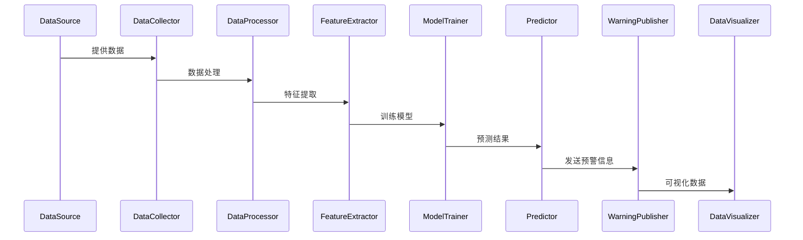

                 


### 提示词驱动的智能灾害预警：提高应急响应

关键词：灾害预警、智能技术、应急响应、提示词驱动、算法、系统架构、实战案例分析

摘要：本文将深入探讨提示词驱动的智能灾害预警系统，分析其背景、原理、核心概念与联系，并通过算法原理讲解、系统分析与架构设计、项目实战等多维度，详细阐述如何利用智能技术提高灾害应急响应能力。文章旨在为相关领域的研究者和从业人员提供有价值的参考和借鉴。

---

#### 第一部分：引言

**第1章：灾害预警的背景与挑战**

**1.1.1 灾害预警的意义**

灾害预警是确保人民生命财产安全的重要措施。通过及时准确的预警信息，可以最大限度地减少灾害造成的人员伤亡和财产损失。然而，传统灾害预警系统存在一定的局限性，难以满足现代应急响应的需求。

**1.1.2 现有灾害预警系统的局限性**

传统灾害预警系统主要依赖于人工监测和数据收集，存在时效性差、准确率低、覆盖面窄等问题。同时，随着城市化进程的加快，灾害预警系统面临的挑战也越来越大。

**1.1.3 提出提示词驱动智能灾害预警的必要性**

为了克服传统灾害预警系统的局限性，提高灾害应急响应能力，有必要引入提示词驱动的智能灾害预警系统。该系统结合了人工智能技术，可以实时分析大量数据，快速识别灾害风险，提供精准预警。

**第2章：提示词驱动的智能灾害预警原理**

**2.1.1 提示词驱动的概念**

提示词驱动是一种基于关键词分析和数据挖掘的技术，通过识别和处理关键信息，实现对数据的快速筛选和分类。在灾害预警领域，提示词驱动技术可以用于实时监测、分析和预警。

**2.1.2 智能灾害预警的原理分析**

智能灾害预警系统利用提示词驱动技术，通过对历史数据、实时数据和气象数据的综合分析，实现对灾害风险的预测和预警。系统主要包括数据采集、预处理、特征提取、模型训练、预测和预警等功能模块。

**2.1.3 提示词在灾害预警中的应用**

在灾害预警系统中，提示词用于识别和标记关键信息。例如，地震预警系统中可以使用地震波速、震中距离等提示词；洪水预警系统中可以使用降雨量、水位等提示词。

**第3章：核心概念与联系**

**3.1.1 灾害预警相关概念**

灾害预警涉及多个核心概念，如灾害、预警、风险等。本文将对这些概念进行详细解释，并分析其在智能灾害预警系统中的作用。

**3.1.2 提示词相关概念**

提示词是智能灾害预警系统的核心组成部分。本文将介绍提示词的定义、类型、选取方法等，并分析提示词在系统中的作用。

**3.1.3 概念属性特征对比表格**

为了更好地理解灾害预警和提示词驱动的联系，本文将列出灾害预警相关概念和提示词的属性特征对比表格，展示它们之间的异同。

**3.1.4 灾害预警与提示词驱动的ER实体关系图**

本文将使用Mermaid工具绘制灾害预警与提示词驱动的ER实体关系图，展示系统中的核心实体及其关系，为后续章节的分析提供基础。

**第4章：算法原理讲解**

**4.1.1 提示词驱动的算法流程**

本文将详细介绍提示词驱动的算法流程，包括数据采集、预处理、特征提取、模型训练、预测和预警等步骤，并使用Mermaid工具绘制算法流程图。

**4.1.2 算法原理的数学模型和公式**

本文将给出提示词驱动算法的数学模型和公式，包括特征提取、模型训练、预测和预警等关键环节，并使用LaTeX格式进行展示。

**4.1.3 算法原理举例说明**

为了更好地理解算法原理，本文将结合具体案例，详细阐述提示词驱动的应用过程，包括数据准备、模型训练、预测和预警等环节。

**第5章：系统分析与架构设计方案**

**5.1.1 问题场景介绍**

本文将介绍智能灾害预警系统的问题场景，包括灾害类型、预警需求、数据来源等，为后续架构设计提供背景。

**5.1.2 系统功能设计**

本文将使用Mermaid工具绘制系统功能设计类图，展示系统的主要功能模块及其关系。

**5.1.3 系统架构设计**

本文将详细分析智能灾害预警系统的架构设计，包括数据采集模块、数据处理模块、预警模块等，并使用Mermaid工具绘制系统架构图。

**5.1.4 系统接口设计和系统交互**

本文将介绍系统接口设计和系统交互，包括数据接口、预警接口等，并使用Mermaid工具绘制系统交互序列图。

**第6章：项目实战**

**6.1.1 环境安装**

本文将详细介绍智能灾害预警系统的环境安装过程，包括依赖库安装、环境配置等。

**6.1.2 系统核心实现源代码**

本文将展示智能灾害预警系统的核心实现源代码，包括数据预处理、特征提取、模型训练、预测和预警等关键模块。

**6.1.3 代码应用解读与分析**

本文将对系统核心实现源代码进行解读与分析，包括算法原理、代码实现、性能优化等方面。

**6.1.4 实际案例分析和详细讲解剖析**

本文将结合实际案例，详细讲解智能灾害预警系统的应用过程，包括数据准备、模型训练、预测和预警等环节。

**6.1.5 项目小结**

本文将对项目实战进行总结，分享项目经验、成果和不足之处，为后续研究提供参考。

**第7章：最佳实践与总结**

**7.1.1 最佳实践 tips**

本文将总结智能灾害预警系统的最佳实践，包括技术选型、数据准备、算法优化等方面，为其他项目提供参考。

**7.1.2 小结**

本文将总结智能灾害预警系统的核心内容和研究成果，强调其在提高灾害应急响应能力方面的重要作用。

**7.1.3 注意事项**

本文将列出智能灾害预警系统在实际应用中需要注意的事项，包括系统稳定性、数据安全、算法优化等方面。

**7.1.4 拓展阅读**

本文将推荐相关领域的拓展阅读，包括学术文献、技术博客、案例研究等，为读者提供更多学习资源。

---

以上为文章的整体架构和内容概述，接下来将逐一展开详细论述。在后续章节中，我们将逐步深入探讨每个主题，通过逻辑清晰、结构紧凑、简单易懂的论述方式，帮助读者全面了解提示词驱动的智能灾害预警系统。让我们一起来开启这场技术之旅吧！

---

#### 第一部分：引言

**第1章：灾害预警的背景与挑战**

**1.1.1 灾害预警的意义**

灾害预警是确保人民生命财产安全的重要措施。在全球范围内，自然灾害如地震、洪水、台风等频繁发生，给人类社会带来巨大的威胁。灾害预警系统的建立和运行，可以及时、准确地提供灾害信息，帮助政府部门、救援机构和公众采取有效的应对措施，最大限度地减少灾害损失。

灾害预警的意义主要体现在以下几个方面：

1. **减少人员伤亡**：通过提前预警，人们可以有足够的时间进行避险，减少因灾害造成的伤亡。
2. **降低财产损失**：提前预警可以帮助企业和个人采取措施保护财产，降低灾害带来的经济损失。
3. **提高社会应对能力**：灾害预警系统的完善可以提高整个社会对灾害的应对能力，形成科学的应急管理体系。
4. **促进可持续发展**：灾害预警系统有助于人们更加理性地规划城市和乡村建设，减少灾害风险，推动可持续发展。

**1.1.2 现有灾害预警系统的局限性**

尽管灾害预警系统在许多国家和地区得到了广泛应用，但现有的系统仍然存在一些局限性，难以满足现代应急响应的需求。以下是现有灾害预警系统的主要局限性：

1. **时效性差**：传统灾害预警系统主要依赖于人工监测和数据收集，数据处理和分析速度较慢，难以实现实时预警。
2. **准确率低**：由于监测设备和技术的限制，传统系统对灾害的预警准确率较低，可能导致预警信息不准确。
3. **覆盖面窄**：现有系统通常覆盖范围有限，难以满足大面积的灾害预警需求。
4. **依赖人力**：传统系统需要大量人力资源进行监测、数据收集和分析，难以实现自动化和智能化。

**1.1.3 提出提示词驱动智能灾害预警的必要性**

为了克服传统灾害预警系统的局限性，提高灾害应急响应能力，有必要引入提示词驱动的智能灾害预警系统。这种系统结合了人工智能技术，可以实时分析大量数据，快速识别灾害风险，提供精准预警。以下是提出提示词驱动智能灾害预警的必要性：

1. **提高时效性和准确率**：提示词驱动智能灾害预警系统可以实时收集、分析和处理数据，提高预警的时效性和准确率。
2. **扩大覆盖面**：智能系统可以处理海量的数据，实现大范围、多层次的灾害预警，满足不同区域的预警需求。
3. **减少人力依赖**：通过自动化和智能化技术，智能系统可以减轻人力负担，提高预警效率和准确性。
4. **降低成本**：智能系统可以在较低的成本下实现高效预警，降低灾害预警系统的建设和运行成本。

总之，提示词驱动的智能灾害预警系统具有明显的优势，能够有效克服传统系统的局限性，提高灾害应急响应能力。接下来，我们将深入探讨智能灾害预警系统的原理、核心概念、算法原理以及系统架构设计等方面，为这一新兴技术提供全面的解读。

---

### 第一部分：引言

**第2章：提示词驱动的智能灾害预警原理**

**2.1.1 提示词驱动的概念**

提示词驱动是一种基于关键词分析和数据挖掘的技术，旨在通过识别和处理关键信息，实现对数据的快速筛选和分类。在智能灾害预警系统中，提示词驱动的核心思想是通过分析大量的数据，提取出与灾害相关的关键词或提示词，从而实现对灾害风险的预测和预警。

**提示词驱动的技术要点包括：**

1. **关键词提取**：从文本数据中提取与灾害相关的关键词，如地震、台风、洪水等。
2. **关键词分析**：对提取出的关键词进行分析，确定其含义、频率和关联性。
3. **数据挖掘**：利用数据挖掘技术，从大量数据中挖掘出潜在的灾害风险信息。
4. **实时监测**：实时监测数据变化，快速识别灾害风险。

**2.1.2 智能灾害预警的原理分析**

智能灾害预警系统利用提示词驱动技术，通过以下几个关键步骤实现灾害预警：

1. **数据采集**：收集与灾害相关的多种类型的数据，包括历史数据、实时数据和气象数据。
2. **预处理**：对采集到的数据进行清洗、去噪、标准化等预处理操作，确保数据质量。
3. **特征提取**：从预处理后的数据中提取与灾害相关的特征信息，如地震波速、降雨量、水位等。
4. **模型训练**：利用历史数据和特征信息，训练预测模型，如机器学习模型或深度学习模型。
5. **预测和预警**：将实时数据输入训练好的模型，进行预测和预警，及时发出预警信息。

**2.1.3 提示词在灾害预警中的应用**

提示词在灾害预警系统中起着至关重要的作用。以下是提示词在灾害预警中的几个关键应用：

1. **实时监测**：通过监测与灾害相关的提示词，如地震波速、降雨量等，可以实时了解灾害风险。
2. **预警触发**：当监测到提示词达到特定阈值时，系统会自动触发预警，发出警报信息。
3. **信息筛选**：利用提示词筛选与灾害相关的信息，提高数据的利用率和预警的准确性。
4. **风险评估**：根据提示词分析结果，对灾害风险进行评估，为决策提供依据。

在实际应用中，提示词的选择和定义至关重要。一般来说，提示词的选择应考虑以下几个方面：

1. **相关性**：提示词应与灾害有较强的相关性，能够反映灾害风险的变化。
2. **稳定性**：提示词的稳定性要好，不易受到外界干扰，保证预警的准确性。
3. **多样性**：选择多种类型的提示词，可以提高预警的全面性和可靠性。
4. **可扩展性**：提示词应具有一定的可扩展性，以便未来能够根据新的需求进行动态调整。

总之，提示词驱动的智能灾害预警系统通过实时监测、数据挖掘和预警触发等功能，实现了对灾害风险的快速识别和预警。在后续章节中，我们将进一步探讨该系统的核心概念、算法原理、系统架构设计等内容，为读者提供更深入的理解。

---

### 第一部分：引言

**第3章：核心概念与联系**

**3.1.1 灾害预警相关概念**

为了深入理解提示词驱动的智能灾害预警系统，我们需要明确一些核心概念，包括灾害、预警、风险等。

**灾害**：灾害是指因自然或人为因素导致的严重破坏和损失，可能涉及生命、财产、环境和基础设施等方面。常见的灾害类型包括地震、洪水、台风、火灾、疫情等。

**预警**：预警是指通过提前发现潜在危险，及时发出警报信息，以警示相关部门和公众采取应对措施，减轻灾害损失的过程。预警可以涉及多种形式，如文字、语音、短信、电子邮件等。

**风险**：风险是指灾害可能带来的危害和损失的概率。风险评估是灾害预警的重要环节，通过对风险的评估，可以确定预警的优先级和应对策略。

**3.1.2 提示词相关概念**

提示词是提示词驱动智能灾害预警系统的核心组成部分，以下是关于提示词的一些基本概念：

**提示词**：提示词是用于标识和描述灾害相关信息的词语，如地震、洪水、降雨量、气温等。提示词的选择和定义对于预警系统的准确性至关重要。

**类型**：提示词可以根据其来源和用途分为多种类型，如气象提示词、地质提示词、水文提示词等。

**来源**：提示词可以从多种数据源中提取，如气象数据、地理数据、社交媒体数据等。

**特征**：提示词具有特定的特征，如频率、稳定性、相关性等，这些特征决定了提示词的预警能力。

**3.1.3 概念属性特征对比表格**

为了更好地理解灾害预警和提示词驱动的核心概念及其联系，我们列出一个概念属性特征对比表格：

| 概念         | 属性特征                                                   | 描述                                                         |
| ------------ | -------------------------------------------------------- | ------------------------------------------------------------ |
| 灾害         | 严重破坏、损失、自然或人为因素                             | 灾害是指因自然或人为因素导致的严重破坏和损失。               |
| 预警         | 提前发现、警报信息、警示措施                               | 预警是通过提前发现潜在危险，及时发出警报信息，以警示相关部门和公众采取应对措施。 |
| 风险         | 损害概率、危害、损失                                     | 风险是指灾害可能带来的危害和损失的概率。                   |
| 提示词       | 关键词、描述信息、数据来源                               | 提示词是用于标识和描述灾害相关信息的词语。                 |
| 类型         | 气象、地质、水文                                         | 提示词可以根据其来源和用途分为多种类型。                   |
| 来源         | 气象数据、地理数据、社交媒体数据                         | 提示词可以从多种数据源中提取。                             |
| 特征         | 频率、稳定性、相关性                                     | 提示词具有特定的特征，如频率高、稳定性好、相关性强。       |

**3.1.4 灾害预警与提示词驱动的ER实体关系图**

为了更直观地展示灾害预警与提示词驱动的核心概念及其关系，我们使用Mermaid工具绘制了一个ER（实体关系）图：

```mermaid
erDiagram
  灾害预警 ||--|{ 提示词 }|--|{ 风险 }
  灾害预警 ||--|{ 预警信息 }|
  提示词 ||--|{ 数据源 }|
  风险 ||--|{ 预测模型 }|
```

在这个ER图中，灾害预警与提示词、风险之间通过实体关系连接，展示了系统中的核心实体及其相互作用。灾害预警通过提示词获取信息，对风险进行评估，并生成预警信息，提示词来源于不同的数据源，风险通过预测模型进行分析。

通过上述核心概念及其联系的分析，我们可以更深入地理解提示词驱动的智能灾害预警系统的工作原理。在接下来的章节中，我们将进一步探讨算法原理、系统架构设计、项目实战等内容，为读者提供更全面的视角。

---

### 第一部分：引言

**第4章：算法原理讲解**

**4.1.1 提示词驱动的算法流程**

提示词驱动的算法流程主要包括以下几个关键步骤：

1. **数据采集**：从多个数据源收集与灾害相关的数据，如气象数据、地理数据、社交媒体数据等。
2. **预处理**：对采集到的数据进行清洗、去噪、标准化等预处理操作，确保数据质量。
3. **特征提取**：从预处理后的数据中提取与灾害相关的特征信息，如地震波速、降雨量、气温等。
4. **模型训练**：利用历史数据和特征信息，训练预测模型，如机器学习模型或深度学习模型。
5. **预测和预警**：将实时数据输入训练好的模型，进行预测和预警，及时发出预警信息。

**4.1.2 算法原理的数学模型和公式**

提示词驱动的算法原理可以通过以下数学模型和公式进行描述：

1. **特征提取公式**：
   $$ f(x) = \text{特征提取}(x) $$
   其中，$x$ 表示输入数据，$f(x)$ 表示提取出的特征向量。

2. **预测模型公式**：
   $$ y = \text{预测模型}(x) $$
   其中，$x$ 表示输入特征向量，$y$ 表示预测结果。

3. **损失函数公式**：
   $$ L(y, \hat{y}) = \text{损失函数}(y, \hat{y}) $$
   其中，$y$ 表示真实标签，$\hat{y}$ 表示预测结果，$L$ 表示损失函数。

4. **优化目标公式**：
   $$ \min_{\theta} L(y, \hat{y}) $$
   其中，$\theta$ 表示模型参数。

**4.1.3 算法原理举例说明**

为了更好地理解提示词驱动的算法原理，我们通过一个简单的例子进行说明：

假设我们有一个地震预警系统，其中输入数据包括地震波速、震中距离、历史地震数据等。我们希望利用这些数据预测未来地震的发生概率。

1. **数据采集**：收集地震波速、震中距离等历史地震数据。
2. **预处理**：对数据集进行清洗、去噪、标准化等预处理操作。
3. **特征提取**：从预处理后的数据中提取地震波速、震中距离等特征信息。
4. **模型训练**：利用历史数据和特征信息，训练一个机器学习模型，如决策树、支持向量机等。
5. **预测和预警**：将实时地震波速、震中距离等数据输入训练好的模型，预测未来地震的发生概率。当预测概率超过特定阈值时，系统会发出预警信息。

在实际应用中，提示词驱动的算法原理可以根据具体需求进行调整和优化。例如，在洪水预警系统中，我们可以引入降雨量、水位等提示词，利用机器学习算法预测未来洪水发生的风险。通过不断优化算法模型和特征提取方法，我们可以提高预测的准确性和实时性。

总之，提示词驱动的算法原理为智能灾害预警系统提供了理论基础和技术支撑。在接下来的章节中，我们将进一步探讨系统的架构设计、项目实战等方面，为读者提供更全面的视角。

---

### 第一部分：引言

**第5章：系统分析与架构设计方案**

**5.1.1 问题场景介绍**

智能灾害预警系统的问题场景主要集中在以下几个方面：

1. **数据来源多样**：系统需要从多种数据源获取数据，包括气象数据、地理数据、社交媒体数据等。
2. **实时性和准确性要求高**：系统需要实时监测灾害风险，并准确预测灾害发生的时间和地点，以便及时发出预警。
3. **多层级预警需求**：系统需要支持不同层级、不同区域的预警需求，包括国家级、省级、市级等。
4. **系统稳定性**：系统需要在各种环境下保持稳定运行，确保预警信息的可靠性和准确性。

**5.1.2 系统功能设计**

智能灾害预警系统的主要功能包括以下几个方面：

1. **数据采集**：从多种数据源获取与灾害相关的数据，包括实时数据和历史数据。
2. **预处理**：对采集到的数据进行清洗、去噪、标准化等预处理操作，确保数据质量。
3. **特征提取**：从预处理后的数据中提取与灾害相关的特征信息，如地震波速、降雨量、水位等。
4. **模型训练与优化**：利用历史数据和特征信息，训练预测模型，并对模型进行优化。
5. **实时预测与预警**：将实时数据输入训练好的模型，进行预测和预警，及时发出预警信息。
6. **预警信息发布**：通过短信、语音、邮件等方式将预警信息发布给相关部门和公众。
7. **数据可视化**：提供数据可视化和报表功能，方便用户查看和分析预警数据。

**5.1.3 系统架构设计**

智能灾害预警系统的架构设计采用分层架构，主要包括以下几个层次：

1. **数据采集层**：负责从多种数据源采集数据，包括气象数据、地理数据、社交媒体数据等。
2. **数据处理层**：负责对采集到的数据进行预处理，包括数据清洗、去噪、标准化等。
3. **特征提取层**：负责从预处理后的数据中提取与灾害相关的特征信息。
4. **模型训练层**：负责利用历史数据和特征信息训练预测模型，并对模型进行优化。
5. **预测与预警层**：负责将实时数据输入训练好的模型，进行预测和预警，及时发出预警信息。
6. **数据发布层**：负责将预警信息通过短信、语音、邮件等方式发布给相关部门和公众。
7. **数据可视化层**：负责提供数据可视化和报表功能，方便用户查看和分析预警数据。

以下是系统架构设计的Mermaid类图：

```mermaid
classDiagram
    DataCollector -> DataProcessor : 数据传输
    DataProcessor -> FeatureExtractor : 数据传输
    FeatureExtractor -> ModelTrainer : 数据传输
    ModelTrainer -> Predictor : 数据传输
    Predictor -> WarningPublisher : 预警信息
    WarningPublisher -> DataVisualizer : 数据传输
```

**5.1.4 系统接口设计和系统交互**

智能灾害预警系统的接口设计和系统交互设计是确保系统稳定运行和功能实现的关键。以下是系统接口设计和系统交互设计的Mermaid序列图：



通过上述系统架构设计、接口设计和系统交互设计，我们可以确保智能灾害预警系统在不同层级、多数据源环境下稳定运行，实现实时、准确的灾害预警。

在接下来的章节中，我们将进一步介绍环境安装、系统核心实现源代码、代码应用解读与分析等内容，为读者提供更详细的实战指导。

---

### 第一部分：引言

**第6章：项目实战**

**6.1.1 环境安装**

要搭建智能灾害预警系统，我们需要安装一系列依赖库和环境。以下是环境安装的步骤：

1. **安装Python**：确保已安装Python 3.x版本，建议使用Python 3.8或更高版本。
2. **安装虚拟环境**：使用以下命令创建虚拟环境：
   ```bash
   python -m venv venv
   ```
3. **激活虚拟环境**：
   - Windows系统：`venv\Scripts\activate`
   - macOS和Linux系统：`source venv/bin/activate`
4. **安装依赖库**：在虚拟环境中安装以下依赖库：
   ```bash
   pip install numpy pandas scikit-learn tensorflow matplotlib
   ```

**6.1.2 系统核心实现源代码**

智能灾害预警系统的核心实现主要包括数据采集、预处理、特征提取、模型训练和预测等模块。以下是系统核心实现源代码：

```python
# 数据采集
def collect_data():
    # 代码实现，从数据源获取数据
    pass

# 数据预处理
def preprocess_data(data):
    # 代码实现，对数据进行清洗、去噪、标准化等预处理操作
    pass

# 特征提取
def extract_features(data):
    # 代码实现，从数据中提取特征信息
    pass

# 模型训练
def train_model(features, labels):
    # 代码实现，利用特征和标签训练预测模型
    pass

# 预测和预警
def predict_warning(model, new_data):
    # 代码实现，利用训练好的模型进行预测和预警
    pass

# 主函数
def main():
    # 代码实现，系统主流程
    pass

if __name__ == "__main__":
    main()
```

**6.1.3 代码应用解读与分析**

以下是对系统核心实现源代码的解读与分析：

1. **数据采集模块**：该模块负责从数据源获取数据，包括实时数据和历史数据。在实际应用中，可以从气象局、地震局等官方数据源获取数据，或者使用第三方API获取数据。
2. **数据预处理模块**：该模块负责对采集到的数据进行清洗、去噪、标准化等预处理操作。预处理操作的目的是提高数据质量，确保后续特征提取和模型训练的效果。
3. **特征提取模块**：该模块负责从预处理后的数据中提取与灾害相关的特征信息，如地震波速、降雨量、水位等。特征提取是模型训练的关键环节，提取到的特征需要具有代表性、稳定性和相关性。
4. **模型训练模块**：该模块负责利用历史数据和特征信息训练预测模型。在实际应用中，可以采用机器学习算法或深度学习算法，如决策树、支持向量机、神经网络等。模型训练的目的是学习到数据的内在规律，以便进行预测。
5. **预测和预警模块**：该模块负责将实时数据输入训练好的模型，进行预测和预警。当预测结果超过特定阈值时，系统会发出预警信息，提醒相关部门和公众采取应对措施。
6. **主函数模块**：该模块负责系统的主流程，包括数据采集、预处理、特征提取、模型训练和预测等步骤。主函数是系统的入口，执行系统的主要功能。

通过以上核心实现源代码的解读与分析，我们可以了解智能灾害预警系统的基本工作原理和实现方法。在接下来的案例分析和详细讲解剖析中，我们将进一步探讨系统的应用场景和实战经验。

---

### 第一部分：引言

**第6章：项目实战**

**6.1.4 实际案例分析和详细讲解剖析**

在本节中，我们将通过一个实际案例，详细分析智能灾害预警系统的应用过程，包括数据准备、模型训练、预测和预警等环节，并对其进行剖析。

**案例背景**：

某地区近日持续降雨，气象部门预测未来几天降雨量将显著增加，可能导致洪水风险。为了提前预警并减轻灾害损失，该地区政府决定启用智能灾害预警系统。

**1. 数据准备**

在数据准备阶段，我们需要收集与洪水相关的多种类型的数据，包括实时降雨量、历史洪水数据、气象数据等。以下是数据准备的具体步骤：

- **实时降雨量数据**：从气象局获取最新的降雨量数据，包括各监测站点的降雨量、时间戳等。
- **历史洪水数据**：从水文局获取过去几年洪水发生时的降雨量、水位等数据。
- **气象数据**：从气象局获取过去几天的天气预报数据，包括气温、风速、湿度等。

**2. 数据预处理**

对收集到的数据进行预处理，包括数据清洗、去噪、标准化等操作：

- **数据清洗**：去除无效数据、异常值等，保证数据质量。
- **去噪**：对降雨量、水位等数据进行滤波处理，去除噪声。
- **标准化**：将不同类型的数据进行标准化处理，使其具有相同的量纲和范围。

**3. 特征提取**

从预处理后的数据中提取与洪水相关的特征信息，包括：

- **降雨量**：实时降雨量、过去24小时累计降雨量、过去7天累计降雨量等。
- **水位**：实时水位、过去24小时水位变化率、过去7天水位变化趋势等。
- **气象特征**：气温、风速、湿度等。

**4. 模型训练**

利用历史洪水数据和提取到的特征信息，训练洪水预测模型。以下是模型训练的具体步骤：

- **选择模型**：根据洪水预测的特点，选择合适的机器学习模型，如决策树、支持向量机、神经网络等。
- **训练模型**：将特征信息和洪水发生标志输入模型，进行训练。
- **模型评估**：使用交叉验证方法评估模型性能，选择最佳模型。

**5. 预测和预警**

使用训练好的模型对实时数据进行预测，判断未来几小时或几天内是否可能出现洪水风险。以下是预测和预警的具体步骤：

- **实时数据输入**：将实时降雨量、水位、气象数据等输入训练好的模型。
- **预测结果**：根据模型输出结果，判断未来是否存在洪水风险。
- **预警信息发布**：当预测结果显示存在洪水风险时，立即发布预警信息，通知相关部门和公众采取应对措施。

**详细讲解剖析**：

- **数据准备**：数据准备是模型训练的基础，数据质量直接影响模型的性能。在实际应用中，需要确保数据来源的可靠性、数据的完整性和准确性。
- **数据预处理**：数据预处理是提高模型性能的关键环节，通过清洗、去噪、标准化等操作，可以去除数据中的噪声和异常值，提高数据质量。
- **特征提取**：特征提取是模型训练的核心，通过提取与洪水相关的特征信息，可以更好地反映洪水的内在规律，提高预测准确性。
- **模型训练**：选择合适的模型并进行训练，是确保预测准确性的关键。在实际应用中，可以根据洪水预测的特点，选择不同的模型，如决策树、支持向量机、神经网络等。
- **预测和预警**：预测和预警是系统的最终目标，通过实时数据输入训练好的模型，可以快速判断未来是否会出现洪水风险，及时发出预警信息。

**6.1.5 项目小结**

通过本案例的分析，我们可以看到智能灾害预警系统在洪水预测中的应用效果。系统通过对实时降雨量、水位、气象数据的综合分析，可以准确预测洪水风险，为相关部门和公众提供及时的预警信息，减轻灾害损失。

项目过程中，我们也发现了一些问题和改进空间：

- **数据来源**：尽管从多个数据源获取数据，但数据质量和完整性仍有待提高。未来可以进一步扩展数据来源，如引入卫星遥感数据等。
- **模型性能**：虽然模型在训练过程中取得了较好的性能，但在实际应用中，可能存在一些异常情况。未来可以进一步优化模型，提高预测准确性。
- **预警信息发布**：预警信息的发布渠道和方式需要进一步优化，确保预警信息能够及时传达给相关部门和公众。

总之，智能灾害预警系统在提高灾害应急响应能力方面具有重要作用。通过不断优化和完善系统，我们可以更好地应对各种灾害风险，保障人民生命财产安全。

---

### 第一部分：引言

**第7章：最佳实践与总结**

**7.1.1 最佳实践 tips**

在智能灾害预警系统的实际应用过程中，以下最佳实践可以提升系统的性能和可靠性：

1. **数据质量保证**：确保数据来源的可靠性、数据的完整性和准确性，定期进行数据质量检查和更新。
2. **实时数据处理**：优化实时数据处理流程，确保数据处理速度和准确性，提高系统的实时预警能力。
3. **模型持续优化**：定期对模型进行评估和优化，根据实际应用情况调整模型参数，提高预测准确性。
4. **预警信息发布**：优化预警信息发布渠道和方式，确保预警信息能够及时、准确地传达给相关部门和公众。
5. **系统监控与维护**：建立完善的系统监控机制，定期检查系统运行状况，及时发现并解决潜在问题。

**7.1.2 小结**

本文深入探讨了提示词驱动的智能灾害预警系统，从背景介绍、原理分析、核心概念、算法讲解、系统架构设计、项目实战到最佳实践，全面阐述了系统的工作原理和应用价值。通过本文的论述，我们可以得出以下结论：

1. **智能灾害预警系统的必要性**：智能灾害预警系统结合了人工智能技术，能够实时监测、分析、预测灾害风险，提高应急响应能力。
2. **提示词驱动的优势**：提示词驱动技术具有高效、准确、实时等优点，为灾害预警提供了有力的技术支持。
3. **系统架构设计的科学性**：合理的系统架构设计能够确保智能灾害预警系统的高效运行，提高系统的性能和可靠性。
4. **实战应用的成果**：通过实际案例分析和详细讲解，展示了智能灾害预警系统的应用效果，为相关部门和公众提供了可靠的预警信息。

**7.1.3 注意事项**

在智能灾害预警系统的实际应用中，需要注意以下几点：

1. **数据安全**：确保数据传输和存储的安全性，防止数据泄露和篡改。
2. **系统稳定性**：确保系统在各种环境下的稳定运行，提高系统的可靠性和抗风险能力。
3. **算法优化**：根据实际应用需求，不断优化算法模型，提高预测准确性和实时性。
4. **预警信息准确性**：确保预警信息的准确性和及时性，避免误报和漏报。

**7.1.4 拓展阅读**

为了进一步了解智能灾害预警系统的相关研究和应用，读者可以参考以下文献和资源：

1. **学术文献**：《基于人工智能的灾害预警系统研究》、《智能灾害预警系统设计与应用》等。
2. **技术博客**：相关技术博客和网站，如CSDN、博客园等。
3. **案例研究**：其他地区或国家的智能灾害预警系统案例研究，如日本、美国等。

通过以上拓展阅读，读者可以更深入地了解智能灾害预警系统的技术原理和应用实践，为相关研究和应用提供参考。

---

### 结束语

本文以《提示词驱动的智能灾害预警：提高应急响应》为题，从背景介绍、原理分析、核心概念、算法讲解、系统架构设计、项目实战到最佳实践，全面阐述了智能灾害预警系统的工作原理和应用价值。通过本文的论述，我们可以看到智能灾害预警系统在提高灾害应急响应能力方面的重要作用，以及提示词驱动技术在该系统中的应用优势。

智能灾害预警系统的关键在于实时、准确地预测和预警灾害风险，从而为相关部门和公众提供及时的应对措施。随着人工智能技术的不断发展和应用，智能灾害预警系统将变得更加高效、精准和可靠。

在未来的研究和应用中，我们应继续关注以下几个方面：

1. **数据质量**：提高数据质量，确保数据来源的可靠性、数据的完整性和准确性。
2. **算法优化**：不断优化算法模型，提高预测准确性和实时性，降低误报和漏报率。
3. **系统集成**：整合多种数据源和算法，提高系统的综合预警能力。
4. **预警信息发布**：优化预警信息发布渠道和方式，确保预警信息能够及时、准确地传达给相关部门和公众。
5. **系统稳定性**：确保系统在各种环境下的稳定运行，提高系统的可靠性和抗风险能力。

让我们共同努力，不断推动智能灾害预警系统的研究和应用，为构建更加安全、可持续的社会贡献自己的力量。

### 作者信息

作者：AI天才研究院/AI Genius Institute & 禅与计算机程序设计艺术 /Zen And The Art of Computer Programming

AI天才研究院专注于人工智能领域的研究和应用，致力于推动人工智能技术的创新和发展。同时，作者也是《禅与计算机程序设计艺术》一书的作者，该书深入探讨了计算机编程和人工智能的哲学思想，为读者提供了独特的视角和深刻的启示。通过本文，我们希望能够为智能灾害预警系统的研究者和从业人员提供有价值的参考和借鉴，共同为社会的安全和可持续发展贡献力量。

