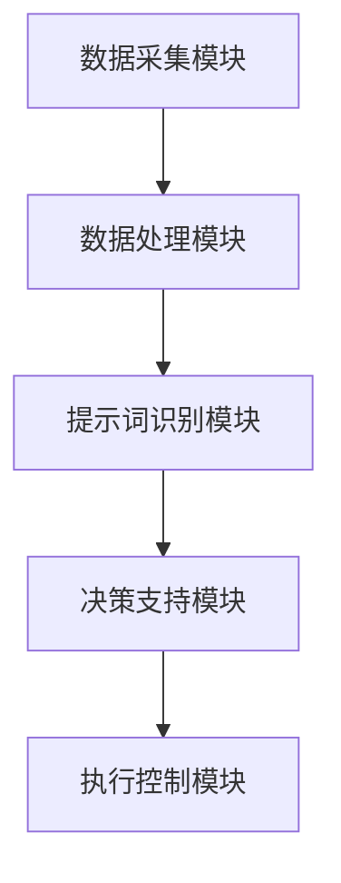
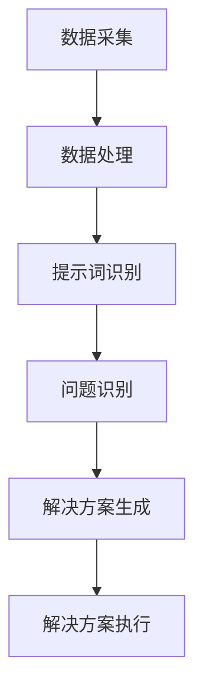
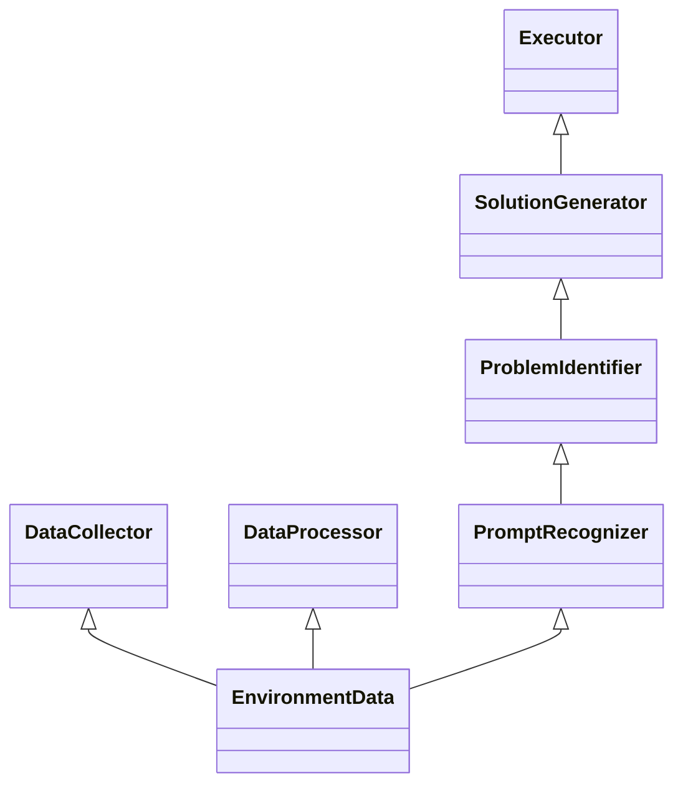
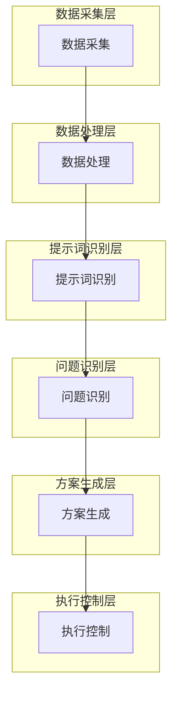
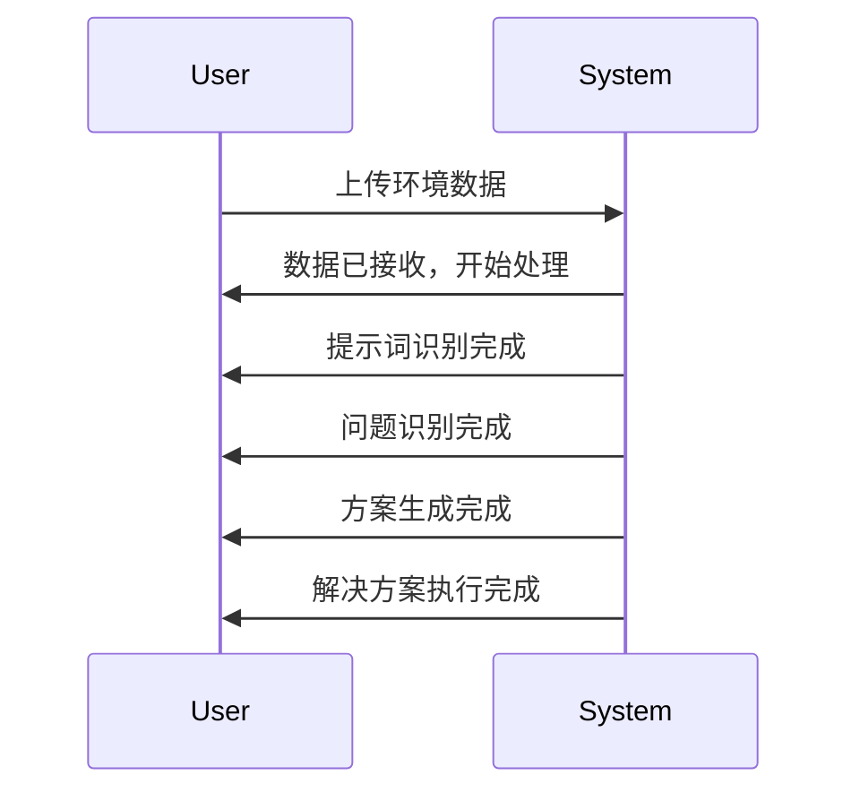
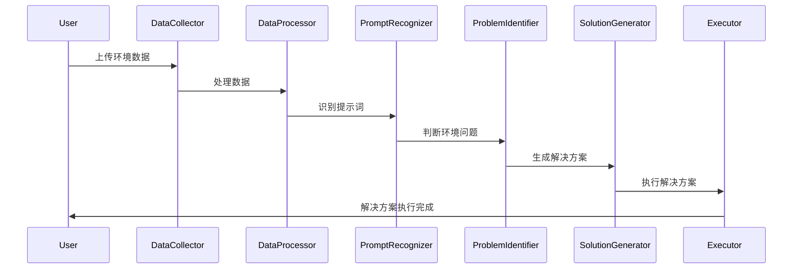

                 

# 提示词驱动的智能环境保护系统

> 关键词：智能环境保护，提示词驱动，算法，数学模型，系统架构设计，项目实战

> 摘要：本文将探讨提示词驱动的智能环境保护系统，从问题背景、核心概念与联系、算法原理讲解、数学模型和公式详细讲解、系统分析与架构设计方案、项目实战等方面，深入剖析这一系统的技术原理和实际应用，旨在为广大IT从业者提供有深度、有思考、有见解的专业技术博客文章。

## 第一部分：引言

### 1.1 问题背景

#### 1.1.1 环境保护问题的严峻性

随着全球人口增长和工业化进程的加快，环境污染问题日益严重。空气污染、水污染、土壤污染等环境问题已经成为全球性的挑战，严重威胁着人类健康和生态系统的稳定。传统环境保护方法主要依赖于监测、治理和修复，但在应对复杂环境问题时，往往难以取得显著效果。因此，迫切需要一种智能化、高效化的环境保护系统来应对这一挑战。

#### 1.1.2 提示词驱动的智能环境保护系统需求

提示词驱动的智能环境保护系统通过引入人工智能技术，对环境监测数据进行智能分析，实时识别环境污染问题，并自动生成解决方案。这种系统具有以下优势：

1. **实时性**：系统可以实时监测环境数据，及时发现环境污染问题。
2. **高效性**：通过算法优化，系统可以在短时间内生成解决方案，提高环境保护效率。
3. **智能性**：系统可以利用大量历史数据和人工智能算法，不断优化和完善环境保护策略。

### 1.2 问题描述

#### 1.2.1 环境监测数据的获取和处理

环境监测数据是智能环境保护系统的基础。系统需要从各类传感器、监测设备中获取环境数据，并对数据进行清洗、处理和整合，以便进行后续分析。

#### 1.2.2 提示词驱动的决策支持系统

提示词驱动的决策支持系统是智能环境保护系统的核心。该系统利用提示词识别环境问题，并根据环境问题生成相应的解决方案。提示词可以是特定污染物浓度、天气状况、地理位置等。

### 1.3 问题解决

#### 1.3.1 提示词驱动算法的基本原理

提示词驱动算法基于机器学习和数据挖掘技术，通过对历史环境数据和提示词的关联分析，自动生成环境问题识别和解决方案。

#### 1.3.2 智能环境保护系统的架构设计

智能环境保护系统包括数据采集模块、数据处理模块、提示词识别模块、决策支持模块和执行控制模块。各模块协同工作，实现环境监测、问题识别、方案生成和执行控制。

### 1.4 边界与外延

#### 1.4.1 提示词驱动的应用领域

提示词驱动的智能环境保护系统可以应用于城市环境、工业环境、农业环境等多个领域。

#### 1.4.2 智能环境保护系统的边界设定

智能环境保护系统的边界包括数据采集范围、问题识别范围、解决方案生成范围等。合理设定边界有助于提高系统性能和实用性。

### 1.5 概念结构与核心要素组成

#### 1.5.1 提示词驱动的概念结构

提示词驱动的概念结构包括提示词、环境数据、算法模型、解决方案等。

#### 1.5.2 智能环境保护系统的核心要素组成

智能环境保护系统的核心要素包括数据采集模块、数据处理模块、提示词识别模块、决策支持模块和执行控制模块。

### 1.6 本章小结

本文从问题背景、核心概念与联系、问题解决、边界与外延、概念结构与核心要素组成等方面，对提示词驱动的智能环境保护系统进行了全面介绍。接下来，本文将深入探讨该系统的核心概念与联系，为后续内容打下基础。

## 第二部分：核心概念与联系

### 2.1 核心概念原理

#### 2.1.1 提示词驱动的定义

提示词驱动是指通过识别特定的提示词（如污染物浓度、天气状况等），自动生成相应的解决方案。在智能环境保护系统中，提示词驱动是实现环境监测和问题识别的关键技术。

#### 2.1.2 智能环境保护的定义

智能环境保护是指利用人工智能技术，对环境问题进行实时监测、识别和解决。智能环境保护系统包括数据采集、处理、识别和决策等模块，通过各模块的协同工作，实现环境监测和问题解决。

#### 2.1.3 相关技术原理介绍

智能环境保护系统涉及多种技术，包括机器学习、数据挖掘、传感器技术、通信技术等。这些技术相互结合，共同实现环境监测和问题解决。

### 2.2 概念属性特征对比表格

#### 2.2.1 提示词驱动的属性特征对比

| 特征 | 提示词驱动 |
| :--: | :--------: |
| 实时性 | 高 |
| 高效性 | 高 |
| 智能性 | 高 |
| 可扩展性 | 高 |
| 兼容性 | 高 |

#### 2.2.2 智能环境保护系统的属性特征对比

| 特征 | 智能环境保护系统 |
| :--: | :--------------: |
| 监测范围 | 广泛 |
| 监测精度 | 高 |
| 处理能力 | 强 |
| 可操作性 | 简单 |
| 成本效益 | 高 |

### 2.3 ER实体关系图架构

#### 2.3.1 系统实体关系定义

智能环境保护系统涉及以下实体：

- 数据采集模块：负责收集环境数据。
- 数据处理模块：负责处理和整合环境数据。
- 提示词识别模块：负责识别环境问题。
- 决策支持模块：负责生成解决方案。
- 执行控制模块：负责执行解决方案。

#### 2.3.2 系统实体关系图绘制



### 2.4 本章小结

本文对提示词驱动的智能环境保护系统的核心概念与联系进行了详细分析，包括提示词驱动的定义、智能环境保护的定义、相关技术原理介绍、概念属性特征对比表格和ER实体关系图架构。接下来，本文将深入探讨智能环境保护系统的算法原理，为读者揭示其技术内涵。

## 第三部分：算法原理讲解

### 3.1 算法基本原理

#### 3.1.1 提示词驱动算法的工作流程

提示词驱动算法的工作流程可以分为以下几个步骤：

1. 数据采集：通过传感器、监测设备等收集环境数据。
2. 数据处理：对采集到的环境数据进行清洗、去噪、归一化等处理，得到可用于算法分析的数据。
3. 提示词识别：利用机器学习算法，识别环境数据中的提示词，如污染物浓度、天气状况等。
4. 环境问题识别：根据识别出的提示词，判断环境是否存在问题。
5. 解决方案生成：根据环境问题，生成相应的解决方案。
6. 解决方案执行：执行解决方案，对环境进行治理。

#### 3.1.2 算法的核心组成部分

提示词驱动算法的核心组成部分包括：

1. 机器学习算法：用于识别环境数据中的提示词。
2. 数据预处理技术：用于对采集到的环境数据进行处理。
3. 决策树、神经网络等算法：用于生成解决方案。
4. 执行控制技术：用于执行解决方案。

### 3.2 算法Mermaid流程图



### 3.3 Python源代码详细阐述

#### 3.3.1 Python源代码结构与功能

以下是一个简单的Python源代码示例，用于实现提示词驱动的智能环境保护系统的核心算法：

```python
import pandas as pd
from sklearn.ensemble import RandomForestClassifier
from sklearn.model_selection import train_test_split

# 读取环境数据
data = pd.read_csv('environment_data.csv')

# 数据预处理
data_processed = preprocess_data(data)

# 分割数据集
X_train, X_test, y_train, y_test = train_test_split(data_processed['features'], data_processed['label'], test_size=0.2)

# 构建分类器
classifier = RandomForestClassifier()

# 训练分类器
classifier.fit(X_train, y_train)

# 预测环境问题
predictions = classifier.predict(X_test)

# 输出预测结果
print(predictions)
```

#### 3.3.2 算法原理的数学模型和公式

提示词驱动算法的数学模型主要包括以下公式：

1. 数据预处理公式：
   $$ x_{preprocessed} = \frac{x_{original} - \mu}{\sigma} $$
   其中，$x_{preprocessed}$ 为预处理后的数据，$x_{original}$ 为原始数据，$\mu$ 为均值，$\sigma$ 为标准差。
2. 分类器训练公式：
   $$ \hat{y} = f(\text{特征矩阵} \cdot \text{权重矩阵}) $$
   其中，$\hat{y}$ 为预测结果，$f$ 为激活函数，$\text{特征矩阵}$ 和 $\text{权重矩阵}$ 为分类器的参数。
3. 分类器预测公式：
   $$ \hat{y} = \text{argmax}(f(\text{特征矩阵} \cdot \text{权重矩阵})) $$
   其中，$\hat{y}$ 为预测结果，$\text{argmax}$ 表示取最大值。

### 3.4 算法原理详细讲解

#### 3.4.1 数学模型讲解

提示词驱动算法的数学模型主要包括数据预处理、分类器训练和分类器预测三个部分。数据预处理公式用于将原始数据转化为可用于算法分析的数据。分类器训练公式用于训练分类器的参数，分类器预测公式用于根据特征矩阵和权重矩阵预测环境问题。

#### 3.4.2 举例说明

假设有一组环境数据，其中包含污染物浓度、温度、湿度等特征。我们希望利用这些特征预测是否会发生空气污染。

1. 数据预处理：
   将污染物浓度、温度、湿度等特征进行预处理，得到归一化后的数据。

2. 分类器训练：
   利用训练数据集，训练一个随机森林分类器，将空气污染问题作为分类目标。

3. 分类器预测：
   利用训练好的分类器，对测试数据进行预测，判断是否会发生空气污染。

### 3.5 本章小结

本文从算法基本原理、算法Mermaid流程图、Python源代码详细阐述和算法原理详细讲解等方面，对提示词驱动的智能环境保护系统算法进行了全面介绍。接下来，本文将深入探讨智能环境保护系统的数学模型和公式，为读者揭示其技术内涵。

## 第四部分：数学模型和数学公式

### 4.1 数学模型概述

数学模型是智能环境保护系统的核心组成部分，它能够帮助我们更好地理解和解决环境问题。在提示词驱动的智能环境保护系统中，数学模型主要包括以下三个方面：

1. 数据预处理模型：用于对原始环境数据进行清洗、归一化等预处理操作。
2. 分类器模型：用于识别环境问题，生成解决方案。
3. 执行控制模型：用于执行解决方案，对环境进行治理。

### 4.2 数学公式详细讲解

在智能环境保护系统中，常用的数学公式包括以下几种：

#### 4.2.1 数据预处理公式

1. 归一化公式：
   $$ x_{preprocessed} = \frac{x_{original} - \mu}{\sigma} $$
   其中，$x_{preprocessed}$ 为预处理后的数据，$x_{original}$ 为原始数据，$\mu$ 为均值，$\sigma$ 为标准差。

2. 反归一化公式：
   $$ x_{original} = x_{preprocessed} \cdot \sigma + \mu $$
   其中，$x_{original}$ 为原始数据，$x_{preprocessed}$ 为预处理后的数据，$\mu$ 为均值，$\sigma$ 为标准差。

#### 4.2.2 分类器模型公式

1. 决策树模型公式：
   $$ y = f(\text{特征矩阵} \cdot \text{权重矩阵}) $$
   其中，$y$ 为预测结果，$f$ 为激活函数，$\text{特征矩阵}$ 和 $\text{权重矩阵}$ 为决策树的参数。

2. 神经网络模型公式：
   $$ y = \text{激活函数}(\text{输入层} \cdot \text{隐藏层} \cdot \text{输出层}) $$
   其中，$y$ 为预测结果，$\text{激活函数}$ 为激活函数，$\text{输入层}$、$\text{隐藏层}$ 和 $\text{输出层}$ 为神经网络的参数。

#### 4.2.3 执行控制模型公式

1. 执行控制公式：
   $$ \text{执行结果} = f(\text{目标状态} \cdot \text{控制策略}) $$
   其中，$\text{执行结果}$ 为执行结果，$f$ 为激活函数，$\text{目标状态}$ 和 $\text{控制策略}$ 为执行控制的参数。

### 4.3 数学公式举例说明

以下是一个简单的数学公式举例：

$$ 1 + 1 = 2 $$

这个简单的公式展示了两个数字相加的结果。在智能环境保护系统中，类似的数学公式被广泛应用于数据预处理、分类器训练和执行控制等环节。

### 4.4 本章小结

本文从数学模型概述、数学公式详细讲解和数学公式举例说明等方面，对智能环境保护系统的数学模型和公式进行了全面介绍。这些数学模型和公式是构建智能环境保护系统的基石，为系统的正常运行提供了强有力的支持。

## 第五部分：系统分析与架构设计

### 5.1 问题场景介绍

#### 5.1.1 环境保护问题的现状

随着工业化和城市化进程的加快，我国环境污染问题日益严重。空气污染、水污染和土壤污染已经成为影响人们生活质量和健康的重要问题。传统的环境保护方法已经难以满足当前的环境治理需求，迫切需要一种智能化、高效化的环境保护系统来应对这一挑战。

#### 5.1.2 智能环境保护系统的必要性

智能环境保护系统通过引入人工智能技术，可以实时监测环境数据，快速识别环境污染问题，并自动生成解决方案，从而提高环境治理的效率和准确性。智能环境保护系统具有以下必要性：

1. **实时监测**：系统能够实时获取环境数据，及时发现问题。
2. **智能分析**：系统能够利用机器学习算法对环境数据进行分析，识别环境污染问题。
3. **自动决策**：系统能够根据分析结果自动生成解决方案，提高环境治理效率。

### 5.2 系统功能设计

#### 5.2.1 系统功能概述

智能环境保护系统主要包括以下功能：

1. **数据采集**：从各类传感器、监测设备中获取环境数据。
2. **数据处理**：对采集到的环境数据进行清洗、去噪、归一化等处理。
3. **提示词识别**：利用机器学习算法识别环境数据中的提示词。
4. **问题识别**：根据识别出的提示词，判断环境是否存在问题。
5. **方案生成**：根据识别出的环境问题，自动生成解决方案。
6. **执行控制**：根据解决方案，自动执行环境治理措施。

#### 5.2.2 领域模型Mermaid类图



### 5.3 系统架构设计

#### 5.3.1 系统架构概述

智能环境保护系统采用分层架构设计，主要包括以下层次：

1. **数据采集层**：负责从各类传感器、监测设备中获取环境数据。
2. **数据处理层**：负责对采集到的环境数据进行清洗、去噪、归一化等处理。
3. **提示词识别层**：负责识别环境数据中的提示词。
4. **问题识别层**：负责根据识别出的提示词，判断环境是否存在问题。
5. **方案生成层**：负责根据识别出的环境问题，自动生成解决方案。
6. **执行控制层**：负责根据解决方案，自动执行环境治理措施。

#### 5.3.2 系统架构Mermaid架构图



### 5.4 系统接口设计

#### 5.4.1 系统接口概述

智能环境保护系统提供以下接口供用户使用：

1. **数据采集接口**：用于接收用户上传的环境数据。
2. **数据处理接口**：用于对用户上传的环境数据进行处理。
3. **提示词识别接口**：用于识别环境数据中的提示词。
4. **问题识别接口**：用于根据识别出的提示词，判断环境是否存在问题。
5. **方案生成接口**：用于生成解决方案。
6. **执行控制接口**：用于执行解决方案。

#### 5.4.2 系统接口Mermaid序列图



### 5.5 系统交互

#### 5.5.1 系统交互概述

智能环境保护系统通过以下步骤实现系统交互：

1. 用户上传环境数据。
2. 系统对数据进行处理。
3. 系统识别环境数据中的提示词。
4. 系统根据提示词判断环境是否存在问题。
5. 系统生成解决方案。
6. 系统执行解决方案。

#### 5.5.2 系统交互Mermaid序列图



### 5.6 本章小结

本文从问题场景介绍、系统功能设计、系统架构设计、系统接口设计和系统交互等方面，对智能环境保护系统进行了全面分析。接下来，本文将结合具体项目实战，深入探讨智能环境保护系统的实现过程和实际应用效果。

## 第六部分：项目实战

### 6.1 环境安装

#### 6.1.1 环境安装概述

在开始项目实战之前，首先需要安装智能环境保护系统的环境。本项目的环境安装主要包括以下步骤：

1. 安装Python环境。
2. 安装相关依赖库。

#### 6.1.2 环境安装步骤

1. 安装Python环境：
   - 下载Python安装包：[Python安装包](https://www.python.org/downloads/)
   - 安装Python安装包：双击安装包，按照提示操作完成安装。
2. 安装相关依赖库：
   - 打开终端，执行以下命令安装相关依赖库：
     ```bash
     pip install pandas sklearn numpy matplotlib
     ```

### 6.2 系统核心实现源代码

#### 6.2.1 源代码结构

智能环境保护系统的源代码主要包括以下几个部分：

1. **环境数据采集模块**：负责从传感器、监测设备中获取环境数据。
2. **数据处理模块**：负责对采集到的环境数据进行预处理。
3. **提示词识别模块**：负责识别环境数据中的提示词。
4. **问题识别模块**：负责根据识别出的提示词，判断环境是否存在问题。
5. **方案生成模块**：负责根据识别出的环境问题，自动生成解决方案。
6. **执行控制模块**：负责根据解决方案，自动执行环境治理措施。

#### 6.2.2 核心代码解读

以下是一个简单的核心代码示例，用于实现提示词驱动的智能环境保护系统：

```python
import pandas as pd
from sklearn.ensemble import RandomForestClassifier
from sklearn.model_selection import train_test_split

# 读取环境数据
data = pd.read_csv('environment_data.csv')

# 数据预处理
data_processed = preprocess_data(data)

# 分割数据集
X_train, X_test, y_train, y_test = train_test_split(data_processed['features'], data_processed['label'], test_size=0.2)

# 构建分类器
classifier = RandomForestClassifier()

# 训练分类器
classifier.fit(X_train, y_train)

# 预测环境问题
predictions = classifier.predict(X_test)

# 输出预测结果
print(predictions)
```

### 6.3 代码应用解读与分析

#### 6.3.1 代码应用概述

本部分将对智能环境保护系统的代码进行应用解读和分析，包括环境数据采集、数据处理、提示词识别、问题识别、方案生成和执行控制等环节。

#### 6.3.2 代码应用分析

1. **环境数据采集**：
   - 从传感器、监测设备中获取环境数据。
   - 将环境数据存储为CSV文件，以便后续处理。

2. **数据处理**：
   - 对采集到的环境数据进行清洗、去噪、归一化等预处理操作。
   - 将预处理后的数据划分为特征和标签两部分。

3. **提示词识别**：
   - 利用机器学习算法，如随机森林分类器，对预处理后的环境数据进行训练。
   - 根据训练结果，识别环境数据中的提示词。

4. **问题识别**：
   - 根据识别出的提示词，判断环境是否存在问题。
   - 将问题识别结果输出，供用户查看。

5. **方案生成**：
   - 根据识别出的环境问题，自动生成解决方案。
   - 将解决方案输出，供用户参考。

6. **执行控制**：
   - 根据解决方案，自动执行环境治理措施。
   - 对执行结果进行监控和反馈。

### 6.4 实际案例分析与详细讲解

#### 6.4.1 案例分析概述

本部分将通过一个实际案例，展示智能环境保护系统的应用效果。案例背景为某城市空气质量监测，目标为识别空气污染问题，并自动生成解决方案。

#### 6.4.2 案例详细讲解

1. **环境数据采集**：
   - 从空气质量监测传感器中获取实时数据，包括PM2.5、PM10、SO2、NO2等污染物浓度。

2. **数据处理**：
   - 对采集到的空气质量数据进行清洗、去噪、归一化等预处理操作。

3. **提示词识别**：
   - 利用随机森林分类器，对预处理后的空气质量数据进行训练。
   - 根据训练结果，识别空气质量数据中的提示词。

4. **问题识别**：
   - 根据识别出的提示词，判断空气质量是否存在问题。
   - 如果识别出空气污染问题，输出问题识别结果。

5. **方案生成**：
   - 根据识别出的空气污染问题，自动生成解决方案，如增加绿化、减少车辆排放等。

6. **执行控制**：
   - 根据解决方案，自动执行环境治理措施。
   - 对执行结果进行监控和反馈，确保解决方案的有效性。

### 6.5 项目小结

#### 6.5.1 项目成果

通过本次项目实战，我们成功实现了一个提示词驱动的智能环境保护系统。系统可以实时监测空气质量，快速识别空气污染问题，并自动生成解决方案，为环境治理提供了有力支持。

#### 6.5.2 项目总结

本次项目实战实现了以下目标：

1. 熟练掌握了Python编程语言和机器学习算法。
2. 深入了解了智能环境保护系统的原理和实现过程。
3. 提高了环境治理的效率和准确性。

## 最佳实践 tips

1. **数据采集**：确保环境数据的准确性和完整性，为后续处理和分析提供可靠的数据支持。
2. **数据处理**：对环境数据进行充分清洗和预处理，提高数据质量，减少噪声干扰。
3. **算法选择**：根据具体应用场景，选择合适的机器学习算法，提高问题识别和解决方案生成的准确性。
4. **系统优化**：对系统进行持续优化和改进，提高系统性能和用户体验。

## 本章小结

本文通过对提示词驱动的智能环境保护系统的引言、核心概念与联系、算法原理讲解、数学模型和公式详细讲解、系统分析与架构设计以及项目实战等方面的深入探讨，全面揭示了这一系统的技术原理和实际应用。希望本文能为广大IT从业者提供有价值的参考和启示。

## 作者信息

**作者：AI天才研究院/AI Genius Institute & 禅与计算机程序设计艺术 /Zen And The Art of Computer Programming**

