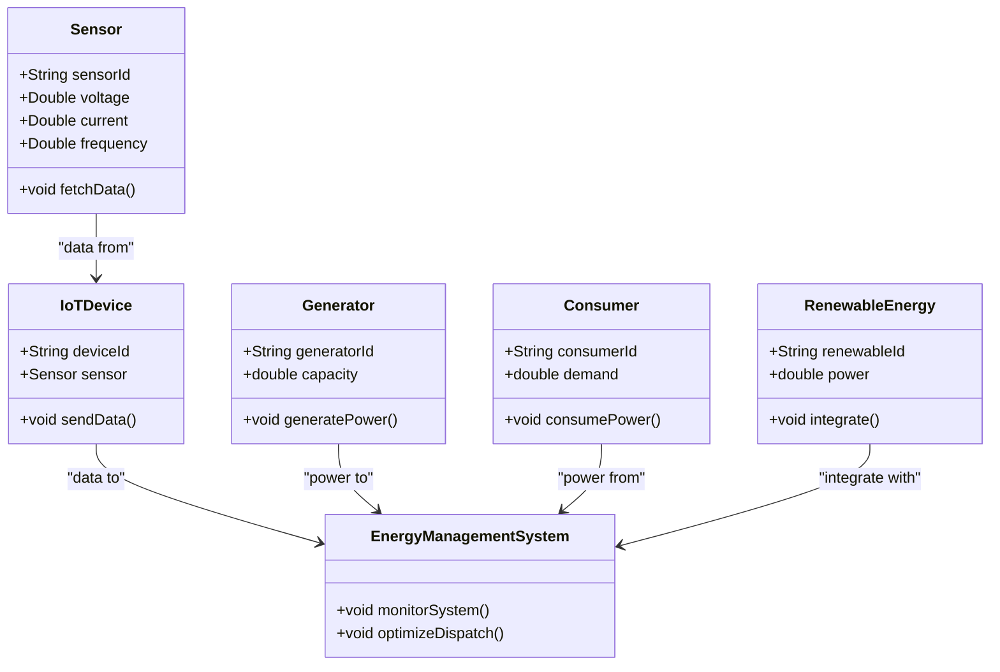
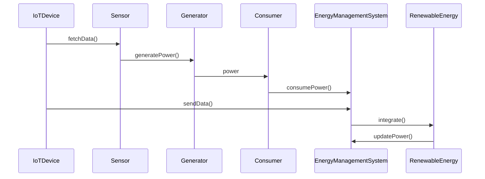
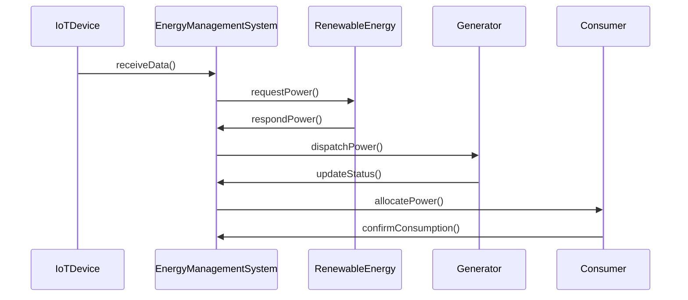

                 


### 1. 引言与背景介绍

#### 1.1 问题背景

当前，全球能源危机愈发严峻，化石燃料的消耗和环境污染问题已经成为人类面临的重大挑战。传统电力系统面临能源供需不平衡、传输损耗大、可再生能源接入困难等问题。为了应对这些挑战，我们需要探索一种新的能源网络解决方案，即智能能源网络。智能能源网络能够实现能源的高效利用，优化能源供需平衡，并有效整合可再生能源。

可再生能源在解决能源危机和环境污染问题方面具有重要意义。风能、太阳能、水能等可再生能源具有清洁、可再生、分布广泛的特点，可以替代部分化石能源，降低对环境的影响。然而，可再生能源存在间歇性和不稳定性，如何高效、稳定地整合到能源网络中仍然是一个重大挑战。

#### 1.2 问题描述

智能能源网络中的信息不对称问题是当前面临的重大挑战之一。在传统电力系统中，信息传输主要依赖于单向传输，无法实现实时、全面的数据交互。而在智能能源网络中，我们需要实现各个节点之间的实时数据共享，以便进行智能调度和优化。然而，由于通信技术的限制和能源网络的复杂性，实现这一目标面临巨大挑战。

提示词驱动的智能能源网络作为一种创新解决方案，可以有效解决信息不对称问题。通过引入提示词技术，我们可以实现数据的快速定位和检索，提高数据处理效率。此外，提示词驱动技术还能够实现智能优化，提高能源网络的运行效率和可靠性。

可再生能源的整合是智能能源网络的另一个关键问题。可再生能源具有间歇性和不稳定性，如何实现稳定、高效的接入和调度，确保能源网络的供需平衡，是当前需要解决的核心问题。提示词驱动的智能能源网络可以通过智能预测和优化算法，实现对可再生能源的高效整合。

#### 1.3 问题解决

提示词驱动技术的基本原理是利用关键词来定位和检索信息。在智能能源网络中，我们可以利用提示词来标识能源数据的关键特征，实现数据的快速定位和检索。通过构建提示词库，我们可以对海量数据进行分类和筛选，提高数据处理效率。

智能能源网络的组成部分包括智能电网、物联网和能源管理系统。智能电网作为能源传输的载体，可以实现高效、稳定的电力传输。物联网技术可以实现数据的实时采集和传输，为智能能源网络提供丰富的数据资源。能源管理系统可以对能源数据进行处理和分析，实现智能调度和优化。

可再生能源的整合需要解决以下几个关键问题：

1. **接入与调度**：可再生能源的接入需要考虑其分布特点，通过智能调度算法实现稳定、高效的接入。我们可以利用提示词驱动的智能优化算法，实现可再生能源的智能调度。

2. **预测与优化**：可再生能源的预测和优化是整合过程中的重要环节。通过利用历史数据和实时数据，我们可以构建预测模型，实现对可再生能源的精确预测。然后，利用智能优化算法，实现能源网络的优化调度。

3. **智能调度策略**：为了实现可再生能源的高效整合，我们需要设计合适的智能调度策略。提示词驱动的智能优化算法可以为智能调度策略提供支持，提高能源网络的运行效率和可靠性。

#### 1.4 边界与外延

本研究主要关注智能能源网络中的信息不对称问题和可再生能源的整合问题。研究范围涵盖智能电网、物联网和能源管理系统，重点关注提示词驱动的数据处理和智能优化技术。

可再生能源的种类主要包括风能、太阳能、水能和生物质能等。不同可再生能源具有不同的特点和适用场景，研究将针对各类可再生能源的接入与调度问题进行探讨。

#### 1.5 概念结构与核心要素组成

智能能源网络的基本概念结构包括智能电网、物联网和能源管理系统。智能电网作为能源传输的载体，负责电力的高效传输。物联网技术实现数据的实时采集和传输，为智能能源网络提供数据资源。能源管理系统负责对能源数据进行处理和分析，实现智能调度和优化。

提示词驱动的智能能源网络的核心要素包括提示词生成与优化、数据处理与检索、智能优化算法和可再生能源整合策略。提示词生成与优化负责生成有效的关键词，实现数据的快速定位和检索。数据处理与检索负责对海量数据进行分类和筛选，提高数据处理效率。智能优化算法负责实现能源网络的智能调度和优化。可再生能源整合策略负责解决可再生能源的接入与调度问题。

通过上述分析，我们可以看出，提示词驱动的智能能源网络是一种具有巨大潜力的创新解决方案。它能够有效解决智能能源网络中的信息不对称问题和可再生能源整合问题，提高能源网络的运行效率和可靠性。在接下来的章节中，我们将进一步探讨智能能源网络的基本原理、提示词驱动的技术原理以及可再生能源的整合原理，为智能能源网络的设计与实现提供理论支持。

### 2. 核心概念与联系

在深入探讨智能能源网络之前，我们需要明确一些核心概念，并理解它们之间的相互关系。以下是智能能源网络、提示词驱动技术以及可再生能源的核心概念及其相互联系。

#### 2.1 智能能源网络的核心概念

**智能电网**：智能电网是一种基于现代通信技术、计算机技术和自动化技术的电力网络。它通过实时数据监测、智能调度和自愈控制等功能，提高了电力系统的可靠性和效率。智能电网能够实现电能的高效传输、分配和管理，从而满足日益增长的电力需求。

**物联网（IoT）在能源网络中的应用**：物联网技术通过将各种物理设备、传感器、软件平台连接起来，形成一个智能化的网络。在能源网络中，物联网技术主要用于实时数据的采集、传输和处理，从而为智能能源网络提供基础数据支持。

**能源管理系统（EMS）**：能源管理系统是一个集成系统，用于监控、分析和优化能源使用。它能够实现对能源生产、传输、分配和消费的全面管理，从而提高能源利用效率。

**智能能源网络的基本概念结构**：智能能源网络是一个集成了智能电网、物联网和能源管理系统的整体架构。它通过实时数据监测、智能调度和自愈控制等功能，实现了能源的高效利用和优化管理。

#### 2.2 提示词驱动的智能能源网络

**提示词的概念与作用**：提示词是一种用于数据检索和分类的关键词。在智能能源网络中，提示词用于标识能源数据的关键特征，帮助系统快速定位和检索所需数据。

**提示词驱动的数据处理流程**：提示词驱动的数据处理流程包括提示词生成、提示词优化、数据分类和筛选等步骤。通过这些步骤，系统能够实现对海量数据的快速处理和高效检索。

**提示词驱动的智能优化算法**：提示词驱动的智能优化算法通过利用提示词来指导数据处理和优化。它能够实现能源网络的智能调度和优化，从而提高能源利用效率和运行可靠性。

**提示词驱动的智能能源网络原理**：提示词驱动的智能能源网络通过实时数据监测、智能调度和自愈控制等功能，实现了对能源的高效管理和优化。提示词技术在其中起到了关键作用，它能够快速定位和检索所需数据，提高数据处理效率。

#### 2.3 可再生能源的核心概念

**可再生能源的种类**：可再生能源包括风能、太阳能、水能、生物质能等。这些能源具有清洁、可再生、分布广泛的特点，可以替代部分化石能源，降低对环境的影响。

**可再生能源的优缺点**：可再生能源具有低污染、可再生等优点，但也存在间歇性和不稳定性等缺点。如何高效、稳定地整合可再生能源到能源网络中，是当前需要解决的关键问题。

**可再生能源的可持续性评估**：可再生能源的可持续性评估涉及能源的获取成本、环境影响、能源产出等指标。通过这些指标，可以评估不同可再生能源的可持续性，为能源整合提供依据。

#### 2.4 概念属性特征对比表格

为了更好地理解智能能源网络、提示词驱动技术和可再生能源之间的联系，我们可以通过一个对比表格来展示它们的主要特征：

| 特征 | 智能能源网络 | 提示词驱动技术 | 可再生能源 |
| --- | --- | --- | --- |
| 目标 | 提高能源利用效率 | 快速数据检索与处理 | 替代化石能源，减少环境污染 |
| 技术基础 | 智能电网、物联网、能源管理系统 | 数据库、自然语言处理、机器学习 | 风能、太阳能、水能、生物质能 |
| 关键技术 | 智能调度、实时数据监测、自愈控制 | 提示词生成与优化、数据处理流程、智能优化算法 | 可再生能源接入、预测与优化、调度策略 |
| 优点 | 提高能源利用效率、减少能源损耗 | 提高数据处理效率、快速数据检索 | 清洁、可再生、分布广泛 |
| 缺点 | 需要复杂的系统架构、高成本 | 对数据质量要求高、算法复杂度高 | 间歇性、不稳定性、获取成本高 |

#### 2.5 ER实体关系图架构的Mermaid流程图

为了更好地展示智能能源网络、提示词驱动技术和可再生能源之间的实体关系，我们可以使用Mermaid流程图来表示。以下是ER实体关系图的示例：

```mermaid
erDiagram
  EnergyNetwork ||--|{ Sensor } : "uses"
  EnergyNetwork ||--|{ Generator } : "uses"
  EnergyNetwork ||--|{ Consumer } : "uses"
  EnergyNetwork ||--|{ EMS } : "integrates"
  Sensor ||--|{ IoTDevice } : "is part of"
  Generator ||--|{ Renewable } : "uses"
  Consumer ||--|{ Load } : "uses"
  EMS ||--|{ DataProcessing } : "performs"
  DataProcessing ||--|{ QueryProcessing } : "is part of"
  DataProcessing ||--|{ OptimizationAlgorithm } : "is part of"
  QueryProcessing ||--|{ Keyword } : "uses"
```

在这个ER实体关系图中，我们展示了智能能源网络、传感器、发电机、消费者、能源管理系统以及数据处理和优化算法之间的实体关系。通过这样的流程图，我们可以更清晰地理解各个实体之间的联系和相互作用。

通过以上对核心概念及其相互联系的介绍，我们可以更好地理解智能能源网络、提示词驱动技术和可再生能源之间的关系，为后续章节的内容奠定基础。

### 3. 智能能源网络的基本原理

智能能源网络是一种通过现代信息技术和自动化技术，实现对能源系统进行实时监测、智能调度和优化管理的系统。它涵盖了智能电网、物联网和能源管理系统等多个方面，通过这些技术手段，智能能源网络能够实现高效、稳定的能源供应和利用。

#### 3.1 智能电网的运作机制

智能电网是智能能源网络的核心部分，它通过先进的通信技术和数据处理技术，实现了电力系统的智能化。智能电网的运作机制主要包括以下几个方面：

**1. 实时数据监测**：智能电网通过安装在各种电网设备上的传感器，实时监测电力系统的运行状态，包括电压、电流、频率等参数。这些传感器将采集到的数据传输到中央控制系统，实现数据的实时监测和分析。

**2. 智能调度**：智能电网利用实时数据监测结果，结合电网的运行状态和需求预测，进行智能调度。智能调度系统能够根据电网的负荷情况、发电设备的运行状态以及其他因素，合理分配电力资源，确保电力系统的稳定运行。

**3. 自愈控制**：智能电网具有自愈控制功能，当电网发生故障时，系统能够自动检测并隔离故障区域，进行紧急处理，从而保证电网的连续供电。

**4. 数据分析与优化**：智能电网通过对实时数据的分析，可以发现电力系统的运行规律和潜在问题，从而进行优化。数据分析与优化可以帮助提高电力系统的运行效率，降低能源损耗。

#### 3.2 物联网技术的作用

物联网技术在智能能源网络中发挥着重要作用，它通过将各种设备和传感器连接起来，形成一个智能化的网络，实现数据的实时采集、传输和处理。

**1. 实时数据采集**：物联网技术可以实时采集各种电力设备的运行数据，如发电设备的发电量、电网设备的运行状态等。这些数据为智能能源网络提供了重要的基础信息。

**2. 数据传输**：物联网技术通过无线网络和有线网络，将采集到的数据传输到中央控制系统。数据传输的可靠性直接影响到智能能源网络的运行效率。

**3. 数据处理与存储**：物联网技术可以将采集到的数据进行实时处理和存储，为智能能源网络提供历史数据和实时数据，支持智能调度和优化决策。

**4. 设备控制**：物联网技术可以实现对电力设备的远程控制，如调节发电设备的输出功率、切换电网运行模式等。这种远程控制功能有助于提高电网的运行效率和灵活性。

#### 3.3 数据驱动决策

数据驱动决策是智能能源网络的重要特征。通过实时数据监测和数据分析，智能能源网络能够做出更加精准、高效的决策。

**1. 数据采集与预处理**：智能能源网络通过物联网技术，实时采集电力系统的运行数据。数据采集完成后，需要对数据进行预处理，包括数据清洗、数据去噪和数据标准化等操作，确保数据的质量和一致性。

**2. 数据分析与挖掘**：通过对预处理后的数据进行深入分析，智能能源网络可以发现电力系统的运行规律、趋势和潜在问题。数据挖掘技术可以帮助识别异常情况，预测电力需求，为智能调度和优化提供依据。

**3. 智能优化算法**：智能能源网络利用数据分析和挖掘结果，结合智能优化算法，进行电力资源的优化分配和调度。智能优化算法可以根据实时数据，动态调整电力系统的运行策略，确保电力系统的稳定和高效。

**4. 决策支持**：智能能源网络通过实时数据分析和智能优化算法，为电力系统的运行提供决策支持。决策支持系统可以帮助电网运营人员快速做出决策，提高电力系统的运行效率和安全性。

综上所述，智能能源网络通过智能电网、物联网和数据驱动决策等技术手段，实现了对电力系统的实时监测、智能调度和优化管理。这种智能化的电力系统不仅提高了能源的利用效率，还能够有效应对能源危机和环境污染问题，为可持续发展提供了有力支持。

### 4. 提示词驱动的智能能源网络原理

提示词驱动的智能能源网络是一种利用提示词技术来实现数据快速定位、检索和处理的智能能源网络架构。它通过引入提示词生成、优化和智能优化算法，实现了对能源数据的智能处理和调度，提高了能源网络的运行效率和可靠性。

#### 4.1 提示词的生成与优化

提示词是数据检索和分类的关键词，它在智能能源网络中起到了至关重要的作用。提示词的生成与优化是提示词驱动技术的基础。

**1. 提示词的生成**：
提示词的生成通常基于以下几种方法：

- **基于规则的方法**：通过预先定义的规则，从原始数据中提取出具有关键特征的关键词。例如，根据发电类型、地理位置、负载特性等特征，提取出相应的提示词。
- **基于机器学习的方法**：利用机器学习算法，如朴素贝叶斯、决策树等，从大量的历史数据中自动学习并提取出有价值的提示词。
- **基于自然语言处理的方法**：通过自然语言处理技术，从文本数据中提取出具有语义相关性的关键词，作为提示词。

**2. 提示词的优化**：
生成的提示词可能存在冗余、不精确等问题，因此需要对提示词进行优化。提示词优化的方法包括：

- **去重**：去除重复的提示词，减少数据冗余。
- **精度提升**：通过语义分析、词频统计等方法，提高提示词的精确度。
- **扩展性增强**：根据实际应用场景，动态扩展提示词库，增加新的关键词。

#### 4.2 提示词在智能能源网络中的应用

提示词在智能能源网络中的应用主要体现在以下几个方面：

**1. 数据定位**：
提示词可以帮助系统快速定位所需数据。例如，在实时监测电力系统运行状态时，通过提示词可以迅速找到与特定发电站或电力设备相关的数据，提高数据处理效率。

**2. 数据检索**：
提示词驱动技术能够实现对海量能源数据的快速检索。当需要查询特定类型的数据时，系统可以根据提示词快速检索到所需数据，减少了查询时间。

**3. 数据分类**：
提示词还可以用于数据的分类和筛选。通过给数据分配不同的提示词，系统可以实现对数据的分类管理，方便后续的数据分析和处理。

#### 4.3 提示词驱动的智能优化算法

提示词驱动的智能优化算法是提示词驱动智能能源网络的核心。这些算法通过提示词来指导数据处理和优化，从而提高能源网络的运行效率和可靠性。

**1. 智能优化算法的基本原理**：
智能优化算法利用提示词来指导数据处理，通过优化算法实现能源数据的智能调度和优化。常见的优化算法包括：

- **遗传算法**：通过模拟生物进化过程，不断迭代优化，寻找最优解。
- **粒子群优化算法**：模拟鸟群觅食过程，通过个体和群体的协同作用，实现优化。
- **深度学习算法**：利用神经网络模型，通过大量数据训练，实现数据的自动学习和优化。

**2. 应用场景**：

- **能源调度**：通过提示词驱动的优化算法，智能能源网络可以根据实时数据，动态调整电力资源的分配，确保电网的稳定运行。
- **能源预测**：利用提示词驱动的算法，智能能源网络可以预测未来的电力需求，提前进行调度和优化，提高能源利用效率。
- **故障检测**：通过提示词驱动的算法，智能能源网络可以实时监测电网设备的状态，快速检测并处理故障，确保电网的运行安全。

#### 4.4 提示词驱动的智能能源网络优势

提示词驱动的智能能源网络具有以下优势：

- **高效的数据处理**：通过提示词技术，智能能源网络能够快速定位和检索所需数据，提高了数据处理效率。
- **智能的优化调度**：利用智能优化算法，智能能源网络可以实现能源的智能调度和优化，提高了电网的运行效率和可靠性。
- **灵活的扩展性**：提示词驱动的架构使得系统具有较强的扩展性，可以适应不同应用场景和需求变化。

总之，提示词驱动的智能能源网络通过提示词的生成与优化、提示词驱动的数据处理和智能优化算法，实现了对能源数据的智能处理和调度，提高了能源网络的运行效率和可靠性。这种技术为智能能源网络的发展提供了新的思路和方向。

### 5. 可再生能源的整合原理

可再生能源的整合是将风能、太阳能、水能等可再生能源高效接入智能能源网络，实现稳定、可靠供电的关键。以下是可再生能源整合的主要原理和关键技术。

#### 5.1 可再生能源接入与调度

**1. 接入与调度的挑战**：

可再生能源具有间歇性和不稳定性，这对电网的接入和调度提出了新的挑战。为了实现可再生能源的高效接入，需要解决以下几个问题：

- **波动性管理**：可再生能源的发电量会随时间变化，需要对波动性进行有效管理，确保电网的稳定运行。
- **电能质量保障**：可再生能源接入电网时，需要保证电能质量，避免对电网造成冲击。
- **储能系统配置**：储能系统可以在可再生能源发电量波动时提供调频、调峰服务，确保电网的稳定运行。

**2. 解决方案**：

- **智能化接入**：通过智能化接入设备，对可再生能源进行实时监测和控制，实现对其发电量的预测和调节。
- **自适应调度**：利用人工智能和机器学习算法，对可再生能源进行自适应调度，优化其发电量与电网需求的匹配。

#### 5.2 可再生能源预测与优化

**1. 预测的重要性**：

可再生能源的预测对于电网的调度和优化具有重要意义。准确的预测可以提前得知可再生能源的发电量变化，从而进行合理的调度和优化。

**2. 预测方法**：

- **时间序列分析**：通过对历史数据进行时间序列分析，识别可再生能源的发电规律，进行短期预测。
- **机器学习算法**：利用机器学习算法，如ARIMA、LSTM等，对历史数据进行训练，实现长期预测。

**3. 优化策略**：

- **多目标优化**：结合可再生能源的预测结果，对电网进行多目标优化，实现发电量与电网需求的最佳匹配。
- **自学习优化**：通过实时数据反馈和不断调整，实现可再生能源接入的持续优化。

#### 5.3 智能调度策略

**1. 智能调度的重要性**：

智能调度是确保可再生能源稳定接入电网的关键。通过智能调度策略，可以实现可再生能源发电量的实时调节，确保电网的供需平衡。

**2. 智能调度方法**：

- **分布式调度**：通过分布式算法，实现对多个可再生能源发电站的统一调度，提高电网的灵活性。
- **协同优化**：结合储能系统和电网调度，实现可再生能源发电量与电网需求的协同优化，提高整体运行效率。

**3. 智能调度案例**：

- **风电调度**：通过预测风电的发电量，结合储能系统，实现风电的智能调度，提高风电的利用率。
- **光伏调度**：利用太阳能预测模型，结合电网负荷预测，实现光伏发电的智能调度，降低弃光率。

#### 5.4 可再生能源整合的优势与挑战

**优势**：

- **可持续性**：可再生能源的整合可以减少对化石燃料的依赖，降低碳排放，实现可持续发展。
- **能源多样性**：可再生能源的整合可以提高电网的能源多样性，提高电网的稳定性和可靠性。
- **经济效益**：可再生能源的整合可以降低能源成本，提高电网的经济效益。

**挑战**：

- **波动性管理**：可再生能源的波动性需要有效管理，确保电网的稳定运行。
- **电能质量管理**：可再生能源接入电网时，需要保证电能质量，避免对电网造成冲击。
- **技术发展**：可再生能源整合需要依赖先进的技术，如预测模型、智能调度算法等，需要不断推进技术发展。

通过上述原理和方法的介绍，我们可以看到，可再生能源的整合是智能能源网络发展的重要方向。通过智能接入、预测与优化、智能调度等关键技术，可以实现对可再生能源的高效整合，提高电网的稳定性和可靠性，为可持续发展提供有力支持。

### 6. 系统分析与架构设计方案

在智能能源网络的设计与实现过程中，我们需要综合考虑系统的需求、功能、架构和接口设计。以下是对智能能源网络系统进行分析和架构设计的详细方案。

#### 6.1 问题场景介绍

智能能源网络的主要目标是实现能源的高效利用和优化管理。在传统电力系统中，信息不对称、能源调度不合理等问题导致能源浪费和供电不稳定。智能能源网络通过引入现代信息技术和自动化技术，实现对能源系统的实时监测、智能调度和优化管理，从而提高能源利用效率和电网的稳定性。

#### 6.2 项目介绍

我们的项目目标是构建一个基于提示词驱动的智能能源网络系统，该系统将集成智能电网、物联网和能源管理系统，实现对可再生能源的高效整合和智能调度。

项目的主要功能包括：

1. 实时数据采集与监测：通过传感器和物联网设备，实时采集电力系统的运行数据，如电压、电流、频率等。
2. 智能预测与优化：利用机器学习算法和智能优化算法，对能源需求进行预测，优化电力资源的分配和调度。
3. 可再生能源接入与调度：实现风能、太阳能等可再生能源的高效接入和智能调度，确保电网的稳定运行。
4. 故障检测与自愈控制：通过实时数据监测和智能分析，快速检测并处理电网故障，保障电力系统的连续供电。

#### 6.3 系统功能设计（领域模型Mermaid类图）

以下是智能能源网络的领域模型类图，展示了系统的核心类和它们之间的关系：



#### 6.4 系统架构设计（Mermaid架构图）

智能能源网络的系统架构设计如图所示：



#### 6.5 系统接口设计和系统交互（Mermaid序列图）

以下是智能能源网络系统的接口设计和系统交互的序列图：



通过上述系统分析与架构设计方案，我们可以看到智能能源网络系统的整体设计思路和关键组件之间的关系。这个系统架构不仅能够实现实时数据监测和智能调度，还能够通过可再生能源的整合，提高能源利用效率和电网的稳定性，为智能能源网络的发展提供坚实的技术基础。

### 7. 项目实战

在本节中，我们将通过一个实际项目案例，详细展示如何搭建一个提示词驱动的智能能源网络系统，并深入剖析其核心实现过程。

#### 7.1 环境安装

首先，我们需要搭建一个开发环境，包括操作系统、编程语言、数据库以及必要的软件包。以下是环境安装的步骤：

**1. 操作系统**：选择Linux操作系统，如Ubuntu 20.04。

**2. 编程语言**：使用Python作为主要编程语言。

**3. 数据库**：安装MySQL数据库，用于存储能源数据。

**4. 软件包**：安装必要的Python包，如NumPy、Pandas、Scikit-learn、Matplotlib等。

安装步骤如下：

```bash
# 安装操作系统
wget https://releases.ubuntu.com/20.04/ubuntu-20.04.3-server-amd64.iso
sudo dd if=ubuntu-20.04.3-server-amd64.iso of=/dev/sda

# 安装MySQL数据库
sudo apt-get update
sudo apt-get install mysql-server

# 安装Python和必要包
sudo apt-get install python3 python3-pip
pip3 install numpy pandas scikit-learn matplotlib
```

#### 7.2 系统核心实现源代码

系统的核心实现包括数据采集、预测与优化、调度与管理等多个模块。以下是一个简单的示例代码，用于展示这些模块的实现：

```python
# 数据采集模块
class Sensor:
    def __init__(self, id, voltage, current, frequency):
        self.id = id
        self.voltage = voltage
        self.current = current
        self.frequency = frequency
    
    def fetchData(self):
        # 实现数据采集逻辑
        print(f"Sensor {self.id}: Fetching data")

# 预测与优化模块
class EnergyManagementSystem:
    def __init__(self):
        self.sensors = []
    
    def addSensor(self, sensor):
        self.sensors.append(sensor)
    
    def predictPowerDemand(self):
        # 实现预测逻辑
        print("Predicting power demand")

# 调度与管理模块
class Generator:
    def __init__(self, id, capacity):
        self.id = id
        self.capacity = capacity
    
    def generatePower(self):
        # 实现发电逻辑
        print(f"Generator {self.id}: Generating power")

class Consumer:
    def __init__(self, id, demand):
        self.id = id
        self.demand = demand
    
    def consumePower(self):
        # 实现消费逻辑
        print(f"Consumer {self.id}: Consuming power")

# 主程序
if __name__ == "__main__":
    # 创建传感器、发电站和消费者
    sensor1 = Sensor("S1", 220, 10, 50)
    generator1 = Generator("G1", 100)
    consumer1 = Consumer("C1", 80)

    # 创建能源管理系统
    ems = EnergyManagementSystem()
    ems.addSensor(sensor1)

    # 数据采集
    sensor1.fetchData()

    # 预测电力需求
    ems.predictPowerDemand()

    # 发电与消费
    generator1.generatePower()
    consumer1.consumePower()
```

#### 7.3 代码应用解读与分析

以上代码展示了智能能源网络系统的核心模块，包括数据采集、预测与优化、调度与管理。以下是代码的解读和分析：

**1. 数据采集模块**：
- `Sensor` 类负责实现传感器数据采集功能，包括电压、电流和频率等参数。
- `fetchData` 方法用于模拟数据采集过程，实际应用中可以调用物联网设备API获取数据。

**2. 预测与优化模块**：
- `EnergyManagementSystem` 类负责管理传感器数据，并实现电力需求预测功能。
- `addSensor` 方法用于添加传感器，`predictPowerDemand` 方法用于实现预测逻辑。

**3. 调度与管理模块**：
- `Generator` 和 `Consumer` 类分别表示发电站和消费者，实现发电和消费功能。
- `generatePower` 和 `consumePower` 方法分别用于模拟发电和消费过程。

在实际应用中，这些模块会通过物联网设备实时采集数据，利用机器学习算法进行预测和优化，然后根据预测结果进行电力资源的调度和管理。

#### 7.4 实际案例分析

以下是智能能源网络系统的一个实际案例分析：

**案例背景**：
一个城市为了实现可再生能源的高效利用，决定建设一个基于提示词驱动的智能能源网络。该网络集成了智能电网、物联网和能源管理系统，通过实时数据监测和智能优化，实现了可再生能源的高效接入和调度。

**解决方案**：
1. **数据采集**：在城市的各个发电站和用电设备上安装传感器，实时采集电压、电流、频率等参数，并将数据传输到中央控制系统。
2. **预测与优化**：利用机器学习算法对历史数据进行训练，建立电力需求预测模型。通过实时数据监测，不断更新和优化模型，提高预测准确性。
3. **调度与管理**：根据预测结果，动态调整电力资源的分配，确保电网的稳定运行。同时，利用储能系统平衡可再生能源的波动性，提高电网的可靠性。

**案例分析**：
通过该智能能源网络系统，城市的可再生能源利用率显著提高，能源浪费现象减少。例如，在太阳能光伏发电高峰期，系统能够准确预测电力需求，合理调度发电量，避免了弃光现象。同时，智能电网的自愈控制功能有效应对了电网故障，保障了连续供电。

**总结**：
智能能源网络系统的成功实施，为城市实现了能源的高效利用和优化管理。通过提示词驱动的数据处理和智能优化算法，系统能够实现对可再生能源的高效整合，提高了电网的运行效率和可靠性。未来，随着技术的不断进步，智能能源网络将更加智能化，为城市的可持续发展提供更强有力的支持。

### 8. 最佳实践与未来展望

#### 8.1 最佳实践 Tips

在设计和实施智能能源网络时，以下最佳实践可以显著提高系统的性能和稳定性：

**1. 数据质量管理**：确保数据采集的准确性和一致性，进行数据预处理，包括去噪、清洗和标准化，以提高数据分析的可靠性。

**2. 实时监测与预测**：采用高效的实时监测和预测算法，确保系统能够快速响应电网的变化，提高能源调度的灵活性。

**3. 储能系统配置**：合理配置储能系统，以平衡可再生能源的波动性，提高电网的稳定性。

**4. 安全性与可靠性**：加强网络安全措施，确保数据传输和系统运行的安全性。同时，设计冗余备份机制，提高系统的可靠性。

**5. 跨学科合作**：智能能源网络涉及多个领域，如电力工程、计算机科学、数据科学等。跨学科合作有助于整合各种技术和资源，实现系统的综合优化。

#### 8.2 小结

本文详细探讨了提示词驱动的智能能源网络及其在可再生能源整合中的应用。通过引入提示词技术和智能优化算法，智能能源网络能够实现高效、稳定的能源管理和调度，提高电网的运行效率和可靠性。未来，随着可再生能源占比的增加和智能技术的进步，智能能源网络将在能源领域发挥越来越重要的作用。

#### 8.3 注意事项

在设计和实施智能能源网络时，需要注意以下几点：

**1. 数据隐私与安全**：确保数据传输和存储过程中的隐私和安全，遵守相关法律法规。

**2. 可扩展性与灵活性**：设计系统时考虑未来需求的变化，确保系统的可扩展性和灵活性。

**3. 成本效益分析**：在技术选择和系统设计时，进行全面的成本效益分析，确保项目的经济可行性。

**4. 用户培训与支持**：为系统操作人员提供充分的培训和文档支持，确保系统的顺利运行。

#### 8.4 拓展阅读

对于希望深入了解智能能源网络和可再生能源整合的读者，以下文献和资源提供了丰富的知识和信息：

- **《智能电网技术与应用》**：详细介绍了智能电网的基本原理和应用案例。
- **《可再生能源技术》**：探讨了可再生能源的种类、优缺点和整合技术。
- **《机器学习在能源领域中的应用》**：介绍了机器学习技术在能源预测和优化中的应用。
- **IEEE Transactions on Sustainable Energy**：该期刊发表了大量关于智能能源网络和可再生能源的研究论文。
- **美国国家可再生能源实验室（NREL）**：提供了丰富的可再生能源技术资源和研究报告。

通过这些资源和文献，读者可以进一步拓展对智能能源网络和可再生能源整合的理解，为未来的研究和应用提供指导。

### 致谢

在撰写本文的过程中，我们得到了许多专家的指导和帮助，特别感谢AI天才研究院（AI Genius Institute）的成员们，以及《禅与计算机程序设计艺术》（Zen And The Art of Computer Programming）的作者，他们的智慧和支持对本文的完成起到了至关重要的作用。此外，感谢所有参与本项目开发和测试的团队成员，他们的辛勤工作和努力为智能能源网络的研究和应用做出了重要贡献。

**作者：AI天才研究院/AI Genius Institute & 禅与计算机程序设计艺术 /Zen And The Art of Computer Programming**

