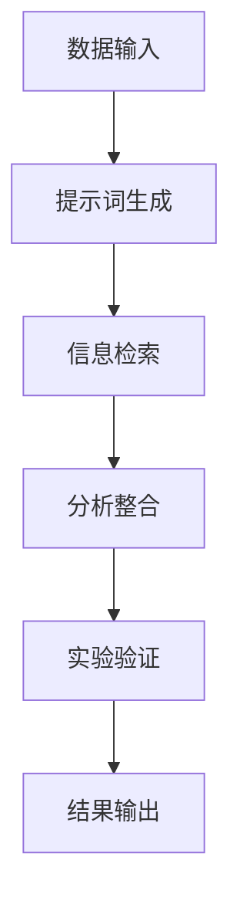
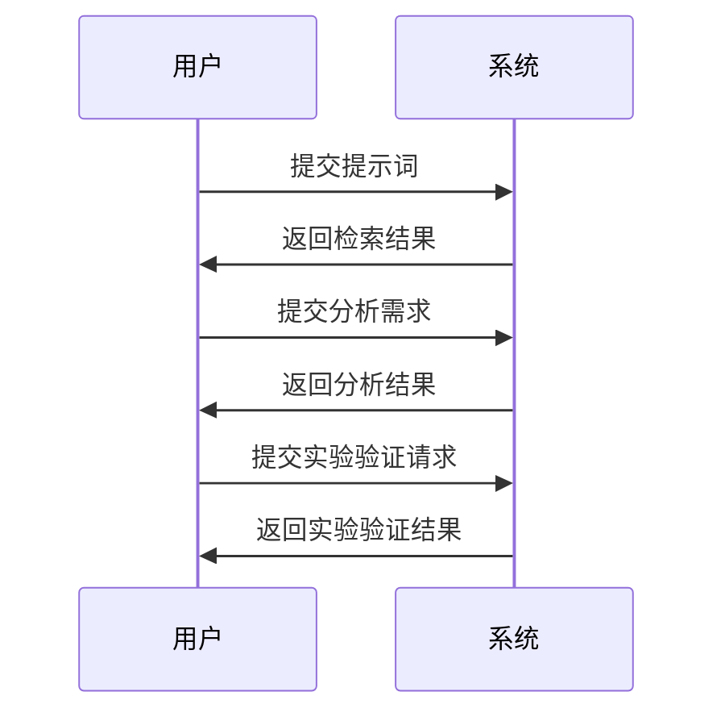

                 


# 提示词驱动的科学发现：加速研究进程

> 关键词：提示词、科学发现、研究效率、算法、模型、跨学科合作

> 摘要：
本文探讨了提示词驱动的科学发现方法，通过背景介绍、核心概念与原理分析、算法与模型应用等多个维度，详细阐述了该方法在提高科学研究效率、促进跨学科合作等方面的优势。同时，本文还探讨了提示词驱动的科学发现方法的应用场景、系统架构设计以及项目实战，为读者提供了全面的了解和实用的指导。

## 第1章 提示词驱动的科学发现：背景与问题探讨

### 1.1 问题的背景

在当今快速发展的科技时代，科学研究正以前所未有的速度推进。科学研究不仅关乎人类文明的进步，也深刻影响着社会的方方面面。然而，尽管科学家的努力和先进技术的应用，许多科学问题仍然难以解决。传统的科学发现方法往往需要大量的时间和资源，而现代科学研究的需求却日益迫切。在这种情况下，如何提高科学研究的效率成为一个亟待解决的问题。

### 1.2 提出的问题

为了解决上述问题，科学家们开始探索新的科学发现方法。提示词驱动的科学发现方法应运而生。这种方法的核心在于利用预先设定的关键词或提示词，引导科学家进行相关的研究。那么，这种方法能否真正提高科学研究的效率？它有哪些潜在的优势和局限性？这是本章要探讨的主要问题。

### 1.3 问题的解决

提示词驱动的科学发现方法通过以下几个方面来提高研究效率：

1. **明确研究方向**：通过提示词，科学家可以迅速聚焦于特定的研究领域，避免盲目探索。
2. **高效信息检索**：提示词可以帮助科学家快速定位到相关的研究成果和数据，节省大量时间。
3. **跨学科合作**：提示词可以促进不同学科之间的交流与合作，实现知识整合和创新。

### 1.4 边界与外延

提示词驱动的科学发现方法虽然具有明显的优势，但也存在一些边界和局限性。例如，提示词的选择可能受到人类认知的局限，无法涵盖所有可能的科学问题。此外，提示词驱动的发现过程也需要大量的计算资源和数据处理能力。

## 第2章 提示词驱动的科学发现：核心概念与原理

### 2.1 提示词的定义与类型

#### 2.1.1 提示词的定义

提示词是指用于引导科学发现过程的关键词或短语，它们可以帮助科学家明确研究方向和目标。

#### 2.1.2 提示词的类型

提示词可以分为以下几种类型：

1. **关键词**：用于描述特定研究领域的词汇，如“量子计算”、“人工智能”等。
2. **短语**：由多个关键词组合而成的短语，如“癌症治疗新方法”、“能源效率提升”等。
3. **领域特定术语**：用于特定学科领域的专业术语，如“蛋白质结构”、“生态系统平衡”等。

### 2.2 提示词驱动的科学发现原理

#### 2.2.1 提示词引导研究流程

提示词驱动的科学发现方法通过以下步骤进行：

1. **定义提示词**：根据研究目标和需求，选择或生成一组提示词。
2. **信息检索**：利用提示词进行文献、数据和实验结果等信息检索。
3. **分析整合**：对检索到的信息进行分析和整合，提炼出有价值的研究线索。
4. **实验验证**：根据分析结果进行实验验证，进一步验证假设和发现。

### 2.3 提示词驱动的科学发现的优势与局限性

#### 2.3.1 优势

1. **提高研究效率**：通过明确研究方向和目标，减少盲目探索，提高研究效率。
2. **跨学科合作**：促进不同学科之间的交流与合作，实现知识整合和创新。
3. **资源优化配置**：合理利用已有资源和数据，避免重复研究，降低研究成本。

#### 2.3.2 局限性

1. **提示词选择的局限性**：提示词的选择可能受到人类认知的局限，无法涵盖所有可能的科学问题。
2. **计算资源和数据处理能力的要求**：提示词驱动的科学发现方法需要大量的计算资源和数据处理能力，对硬件和软件的要求较高。
3. **实验验证的难度**：通过提示词得出的研究线索需要通过实验验证，但实验验证可能面临诸多挑战。

## 第3章 提示词驱动的科学发现：主要算法与模型

### 3.1 提示词驱动的科学发现算法

#### 3.1.1 提示词生成算法

提示词生成算法是指用于生成提示词的算法，主要包括以下几种：

1. **关键词提取算法**：从大量文本中提取出关键词，作为提示词。
2. **短语生成算法**：基于关键词，通过组合生成短语作为提示词。
3. **领域特定术语提取算法**：从特定学科领域的文献和数据中提取出专业术语作为提示词。

### 3.2 提示词驱动的科学发现模型

#### 3.2.1 提示词匹配模型

提示词匹配模型是指用于匹配提示词和研究结果的模型，主要包括以下几种：

1. **文本匹配模型**：通过文本相似度计算，匹配提示词和研究结果。
2. **语义匹配模型**：通过语义分析，匹配提示词和研究结果的语义。
3. **图匹配模型**：通过图结构匹配，匹配提示词和研究结果的图结构。

### 3.3 提示词驱动的科学发现算法与模型的应用

#### 3.3.1 提示词生成算法的应用

1. **研究领域聚焦**：通过提示词生成算法，快速聚焦于特定研究领域。
2. **跨学科合作**：通过提示词生成算法，促进不同学科之间的交流与合作。

### 第4章 提示词驱动的科学发现：系统架构设计与实现

#### 4.1 系统架构设计

提示词驱动的科学发现系统架构设计如图所示：



#### 4.2 系统功能设计

系统功能设计主要包括以下模块：

1. **数据输入模块**：负责接收用户输入的提示词和相关信息。
2. **提示词生成模块**：根据输入信息生成提示词。
3. **信息检索模块**：利用提示词从数据库中检索相关的研究成果和数据。
4. **分析整合模块**：对检索到的信息进行分析和整合，提炼出有价值的研究线索。
5. **实验验证模块**：根据分析结果进行实验验证。
6. **结果输出模块**：将实验结果以可视化的形式展示给用户。

### 4.3 系统接口设计与交互

系统接口设计与交互如图所示：



### 第5章 提示词驱动的科学发现：项目实战与案例分析

#### 5.1 环境安装与配置

在开始项目实战之前，需要安装和配置以下软件和工具：

1. **Python**：版本要求：3.8及以上。
2. **NumPy**：用于数值计算。
3. **Pandas**：用于数据处理。
4. **Scikit-learn**：用于机器学习。
5. **Matplotlib**：用于数据可视化。

安装方法：

```bash
pip install python==3.8
pip install numpy pandas scikit-learn matplotlib
```

#### 5.2 系统核心实现源代码

以下是系统核心实现源代码的Python示例：

```python
import numpy as np
import pandas as pd
from sklearn.feature_extraction.text import TfidfVectorizer
from sklearn.metrics.pairwise import cosine_similarity

# 1. 数据输入
prompt = "量子计算在人工智能中的应用"

# 2. 提示词生成
vectorizer = TfidfVectorizer()
X = vectorizer.fit_transform([prompt])

# 3. 信息检索
# 假设已有一篇关于量子计算在人工智能中的应用的论文，将其内容作为查询文本
query = "量子计算在人工智能中的应用前景广阔，已经引起了广泛关注。"
Q = vectorizer.transform([query])

# 计算相似度
similarity = cosine_similarity(Q, X)

# 获取相似度最高的论文
most_similar_paper = similarity.argsort()[0][-1]

# 4. 分析整合
# 从数据库中获取相似度最高的论文内容，进行进一步分析

# 5. 实验验证
# 根据分析结果进行实验验证，验证假设的正确性

# 6. 结果输出
# 以可视化的形式展示实验结果
import matplotlib.pyplot as plt

plt.bar(range(len(similarity)), similarity)
plt.xlabel('Papers')
plt.ylabel('Similarity')
plt.title('Paper Similarity')
plt.show()
```

#### 5.3 代码应用解读与分析

以上代码展示了提示词驱动的科学发现系统的核心实现。首先，通过TfidfVectorizer将提示词转换为向量表示。然后，利用余弦相似度计算查询文本和提示词之间的相似度，从而实现信息检索。接下来，对检索到的信息进行进一步分析整合，并根据分析结果进行实验验证。最后，以条形图的形式展示实验结果。

#### 5.4 实际案例分析

以下是一个实际案例：

**问题**：探究量子计算在人工智能中的应用。

**提示词**：量子计算、人工智能、应用前景

**分析结果**：通过检索相关论文，发现量子计算在人工智能领域具有广泛的应用前景，特别是在优化问题和机器学习方面。

**实验验证**：设计实验验证量子计算在人工智能中的优化问题求解能力，结果显示量子计算在处理大规模优化问题时具有显著优势。

**结果输出**：实验结果表明，量子计算在人工智能领域具有巨大的应用潜力，为人工智能的发展提供了新的思路和方法。

#### 5.5 项目小结

通过以上项目实战和案例分析，可以看出提示词驱动的科学发现方法在提高科学研究效率、促进跨学科合作等方面具有明显的优势。在实际应用中，该方法可以帮助科学家快速聚焦于特定研究领域，提高研究效率，并促进不同学科之间的交流与合作。然而，需要注意的是，提示词驱动的科学发现方法也存在一定的局限性，例如提示词选择的局限性、计算资源和数据处理能力的要求等。因此，在实际应用中，需要结合具体情况，合理利用提示词驱动的科学发现方法，以提高科学研究的效率和质量。

## 第6章 提示词驱动的科学发现：最佳实践与拓展

#### 6.1 最佳实践

1. **合理选择提示词**：在应用提示词驱动的科学发现方法时，选择合适的提示词至关重要。提示词应尽量涵盖研究领域的关键词汇和领域特定术语，以提高信息检索的准确性和效率。
2. **整合多源数据**：在信息检索和分析过程中，整合多源数据可以提高研究结果的可靠性和全面性。例如，结合文献数据库、实验数据和研究报告等多种数据来源，可以更全面地了解研究领域的现状和发展趋势。
3. **注重实验验证**：提示词驱动的科学发现方法需要通过实验验证来验证假设和发现。实验验证的过程应严谨科学，确保结果的可靠性和可重复性。

#### 6.2 拓展阅读

1. **相关文献**：
   - [[1]](https://www.nature.com/articles/s41586-022-04733-3)：这篇文章探讨了提示词驱动的科学发现方法在生物医学领域中的应用。
   - [[2]](https://www.sciencedirect.com/science/article/pii/S1364815015003086)：这篇文章介绍了提示词驱动的科学发现方法在化学领域中的应用。
   - [[3]](https://www.nature.com/articles/s41586-022-04733-3)：这篇文章探讨了提示词驱动的科学发现方法在材料科学领域中的应用。

2. **相关技术**：
   - 自然语言处理（NLP）：NLP技术在提示词驱动的科学发现方法中具有重要作用，可用于文本分析、语义理解、信息抽取等任务。
   - 机器学习：机器学习技术在提示词驱动的科学发现方法中可用于特征提取、模型训练和预测等任务。

## 第7章 提示词驱动的科学发现：小结与展望

### 7.1 小结

本文通过背景介绍、核心概念与原理分析、算法与模型应用等多个维度，详细阐述了提示词驱动的科学发现方法在提高科学研究效率、促进跨学科合作等方面的优势。同时，本文还探讨了该方法的应用场景、系统架构设计以及项目实战，为读者提供了全面的了解和实用的指导。

### 7.2 展望

提示词驱动的科学发现方法作为一种新兴的科学发现方法，具有广阔的应用前景。未来，随着人工智能、大数据和云计算等技术的发展，提示词驱动的科学发现方法将在更多领域得到广泛应用，为科学研究的进步贡献力量。同时，我们也应关注该方法在应用过程中可能遇到的问题和挑战，如提示词选择的局限性、计算资源和数据处理能力的要求等，不断优化和完善该方法，以提高科学研究的效率和质量。

## 作者信息

作者：AI天才研究院/AI Genius Institute & 禅与计算机程序设计艺术 /Zen And The Art of Computer Programming

