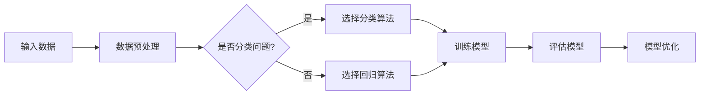
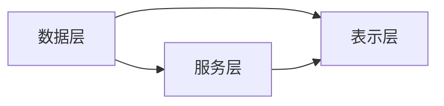
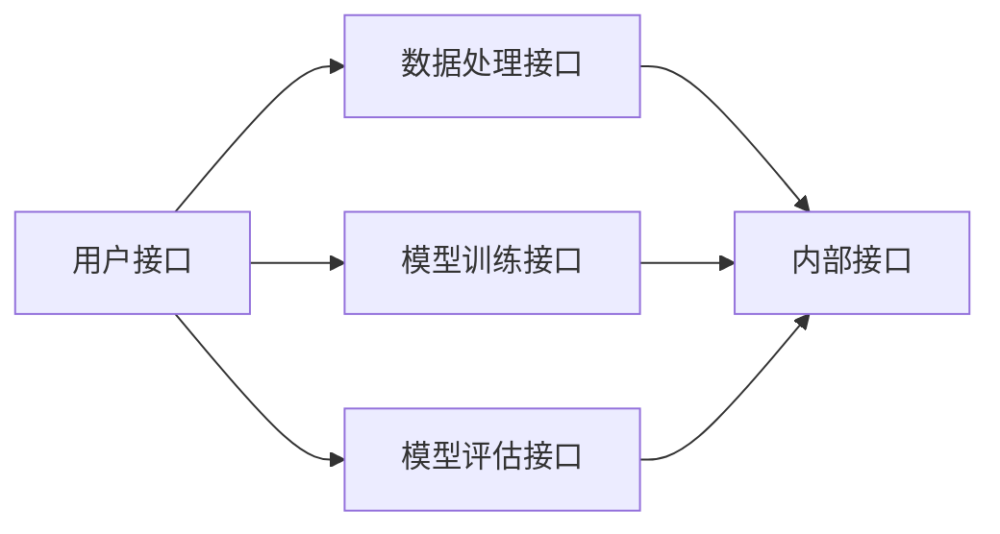
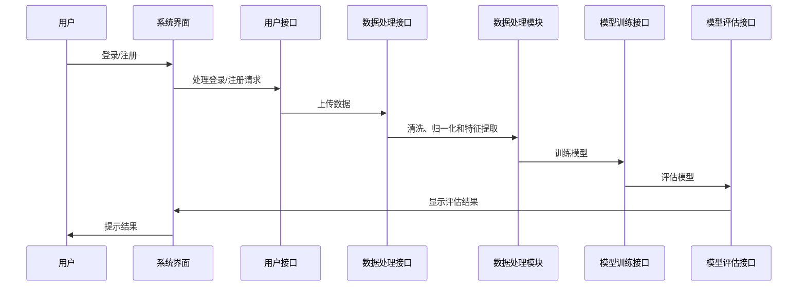

                 

### 《AI时代编程的新维度与新未来》

> 关键词：人工智能、编程语言、框架、算法、系统架构

> 摘要：本文深入探讨AI时代编程的新维度与新未来，从背景介绍、核心概念、算法原理、系统分析与架构设计等多个角度，详细阐述了AI时代编程的变革及其对技术领域的深远影响。

----------------------------------------------------------------

## 第一部分：背景介绍与核心概念

### 第1章：AI时代编程的兴起

#### 1.1 问题背景

人工智能（AI）作为当前科技发展的前沿领域，已经在众多行业中产生了深远影响。从自动驾驶、智能语音助手到医疗诊断、金融风控，AI技术的应用场景日益广泛。在这一背景下，编程作为AI技术的核心支撑，也迎来了新的挑战和机遇。

AI技术的发展推动了编程语言的演变。传统的编程语言如C++、Java等，在性能和效率方面具有显著优势，但在处理复杂算法和大数据方面显得力不从心。因此，新的编程语言和框架应运而生，如Python、Julia等，它们在易用性、扩展性和并行处理能力上有了显著提升，为AI编程提供了更加高效和便捷的工具。

#### 1.2 问题描述

在AI时代，编程面临的挑战主要包括：

- **复杂算法的实现**：AI算法如深度学习、强化学习等，通常涉及大量的计算和数据处理，如何高效地实现这些算法成为编程的一大难题。
- **大数据的处理**：AI技术需要处理海量的数据，传统的数据处理方法已经无法满足需求，如何优化数据处理流程成为关键问题。
- **跨领域的应用**：AI技术需要与不同领域的知识相结合，如医学、金融等，编程需要具备跨领域的适应能力。

#### 1.3 问题解决

AI时代编程的核心目标在于：

- **提升编程效率**：通过引入新的编程语言和框架，降低编程的复杂度，提高开发效率。
- **优化算法实现**：通过优化算法的数据结构和实现方式，提高算法的效率和准确性。
- **跨领域的整合**：通过建立跨领域的编程模型和工具，实现AI技术在各领域的广泛应用。

#### 1.4 边界与外延

AI编程的应用领域广泛，包括但不限于：

- **自动驾驶**：利用AI技术实现车辆的自主驾驶，需要高效的算法和强大的计算能力。
- **智能医疗**：通过AI技术分析医学影像，辅助医生进行诊断和治疗，需要精确的算法和丰富的数据支持。
- **金融科技**：利用AI技术进行风险控制和金融市场预测，需要高效的算法和强大的数据处理能力。

#### 1.5 概念结构与核心要素组成

AI编程的核心概念和要素包括：

- **编程语言**：如Python、Julia等，为AI算法提供高效和便捷的实现工具。
- **AI框架**：如TensorFlow、PyTorch等，提供全面的算法库和工具，简化AI算法的开发过程。
- **算法**：包括机器学习、深度学习等，为AI技术提供核心计算能力。
- **数据**：AI技术依赖于海量数据，数据的质量和数量直接影响算法的性能。

#### 1.6 本章小结

AI时代编程的兴起标志着编程技术的重大变革。通过引入新的编程语言和框架，优化算法实现，实现跨领域的整合，AI编程为各行业提供了强大的技术支持。未来，AI编程将继续发展，推动人工智能技术在更广泛的领域取得突破。

----------------------------------------------------------------

## 第二部分：核心概念与联系

### 第2章：AI编程语言与框架

#### 2.1 编程语言

在AI编程中，选择合适的编程语言至关重要。以下是几种常用的编程语言及其特点：

| 编程语言 | 主要特点 | 适用场景 |
| --- | --- | --- |
| **Python** | 易学易用，丰富的库支持 | 数据科学、AI开发、Web开发 |
| **Java** | 高性能，跨平台 | 企业级应用、Android开发 |
| **C++** | 高性能，底层操作 | 游戏开发、嵌入式系统 |
| **Prolog** | 基于逻辑编程 | 自然语言处理、自动推理 |
| **R** | 统计分析，数据可视化 | 统计学、数据科学 |
| **Julia** | 高性能，易用 | 科学计算、金融工程 |

Python由于其简洁易用的语法和丰富的库支持，成为AI开发中的首选语言。而Java和C++则在性能和跨平台上具有优势，适合企业级应用和游戏开发。Prolog、R和Julia则在特定领域内具有独特的优势。

#### 2.2 AI框架

AI框架是AI编程中的重要工具，它们提供了丰富的算法库和工具，简化了AI算法的开发过程。以下是几种常见的AI框架：

| 框架 | 主要特点 | 适用场景 |
| --- | --- | --- |
| **TensorFlow** | 开源，支持多种语言 | 数据科学、机器学习、深度学习 |
| **PyTorch** | 易用，动态计算图 | 深度学习、自然语言处理 |
| **Keras** | 高级API，简化开发 | 深度学习、神经网络 |
| **Scikit-learn** |Python机器学习库 | 监督学习、无监督学习 |
| **Weka** | 开源，图形用户界面 | 数据挖掘、机器学习 |
| **Mallet** | 开源，支持多种语言 | 自然语言处理、机器学习 |

TensorFlow和PyTorch是目前最受欢迎的深度学习框架，它们提供了强大的计算能力和丰富的算法库。Keras作为TensorFlow的轻量级封装，简化了深度学习的开发过程。Scikit-learn、Weka和Mallet则适用于传统的机器学习算法和自然语言处理任务。

#### 2.3 概念属性特征对比表格

| 编程语言 | 主要特点 | 适用场景 |
| --- | --- | --- |
| Python | 易学易用，丰富的库支持 | 数据科学、AI开发、Web开发 |
| Java | 高性能，跨平台 | 企业级应用、Android开发 |
| C++ | 高性能，底层操作 | 游戏开发、嵌入式系统 |
| Prolog | 基于逻辑编程 | 自然语言处理、自动推理 |
| R | 统计分析，数据可视化 | 统计学、数据科学 |
| Julia | 高性能，易用 | 科学计算、金融工程 |

#### 2.4 ER实体关系图架构

```mermaid
erDiagram
  AI编程工具 -> 编程语言
  | AI框架
  | AI编程语言
  | AI算法
```

在这张ER实体关系图中，AI编程工具、编程语言、AI框架和AI算法之间存在着紧密的联系。编程语言是AI编程的基础，AI框架提供了丰富的算法库和工具，AI编程工具则是实现AI算法的载体。

----------------------------------------------------------------

## 第三部分：算法原理讲解

### 第3章：AI编程算法原理

#### 3.1 算法概述

AI编程算法主要分为以下几类：

1. **机器学习算法**：包括监督学习、无监督学习和强化学习。
2. **深度学习算法**：包括神经网络、卷积神经网络（CNN）和循环神经网络（RNN）。

#### 3.2 算法原理

##### 3.2.1 机器学习算法

1. **监督学习**：通过已标记的数据训练模型，然后使用模型对新数据进行预测。常见的算法包括线性回归、逻辑回归、支持向量机（SVM）等。

2. **无监督学习**：没有预先标记的数据，通过发现数据中的模式来训练模型。常见的算法包括聚类、降维、关联规则等。

3. **强化学习**：通过试错来学习策略，以最大化累积奖励。常见的算法包括Q学习、深度Q网络（DQN）等。

##### 3.2.2 深度学习算法

1. **神经网络**：一种模拟人脑神经元连接的算法，通过层层传递信息来学习数据中的模式。

2. **卷积神经网络（CNN）**：一种专门用于图像识别的神经网络，通过卷积操作提取图像特征。

3. **循环神经网络（RNN）**：一种能够处理序列数据的神经网络，通过循环连接来记住之前的输入。

#### 3.3 数学模型与公式

深度学习算法的核心是神经网络，其基本的数学模型如下：

$$
y = \sigma(\omega \cdot x + b)
$$

其中，$y$是输出，$\sigma$是激活函数，$\omega$是权重，$x$是输入，$b$是偏置。

常见的激活函数包括：

- **Sigmoid函数**：
  $$
  \sigma(x) = \frac{1}{1 + e^{-x}}
  $$

- **ReLU函数**：
  $$
  \sigma(x) = \max(0, x)
  $$

#### 3.4 算法流程图



在这个流程图中，首先对输入数据进行预处理，然后根据问题类型选择相应的算法，对模型进行训练和评估，最后进行模型优化。

#### 3.5 举例说明

假设我们使用神经网络进行图像分类，输入数据是一个32x32的像素矩阵。我们选择ReLU作为激活函数，并使用梯度下降法进行模型优化。

1. **初始化权重和偏置**：随机初始化权重和偏置。

2. **前向传播**：将输入数据通过神经网络进行前向传播，得到输出。

3. **计算损失函数**：使用交叉熵损失函数计算预测结果和真实结果之间的差异。

4. **反向传播**：根据损失函数计算梯度，然后使用梯度下降法更新权重和偏置。

5. **迭代训练**：重复以上步骤，直到模型达到预期效果。

通过这个简单的例子，我们可以看到深度学习算法的原理和实现过程。

----------------------------------------------------------------

## 第四部分：系统分析与架构设计

### 第4章：AI编程系统架构设计

#### 4.1 问题场景介绍

在AI编程的实际应用中，我们可以考虑以下场景：

- **图像识别**：使用深度学习算法对图像进行分类和识别。
- **自然语言处理**：利用AI技术进行文本分类、情感分析和机器翻译等。
- **预测分析**：使用机器学习算法进行数据预测和分析，如股票市场预测、用户行为预测等。

#### 4.2 系统功能设计

为了实现上述场景，我们需要设计一个完整的AI编程系统，其主要功能包括：

- **数据采集**：从各种数据源采集数据，包括图像、文本和传感器数据等。
- **数据处理**：对采集到的数据进行清洗、归一化和特征提取等处理。
- **模型训练**：使用训练数据进行模型训练，包括深度学习模型和机器学习模型等。
- **模型部署**：将训练好的模型部署到生产环境中，进行实际应用。
- **模型评估**：对模型进行评估，包括准确率、召回率和F1值等指标。

#### 4.3 系统架构设计

整个AI编程系统的架构设计如下：

- **数据层**：负责数据的采集、存储和处理。
- **服务层**：提供模型训练、模型部署和模型评估等服务。
- **表示层**：提供用户界面，用于与用户进行交互。

具体的架构设计如下：



#### 4.4 系统接口设计

为了实现系统的功能，我们需要设计一系列接口，包括：

- **用户接口**：提供用户注册、登录和数据上传等功能。
- **内部接口**：包括数据处理接口、模型训练接口和模型评估接口等。

具体的接口设计如下：



#### 4.5 系统交互

在系统交互方面，我们需要设计一个序列图，展示系统中的各个模块如何交互：



通过这个序列图，我们可以清晰地看到系统的交互流程。

----------------------------------------------------------------

## 第五部分：项目实战

### 第5章：环境安装与系统核心实现

#### 5.1 环境安装

在进行AI编程项目实战之前，我们需要安装以下环境：

1. **Python环境**：下载并安装Python，建议使用Python 3.8及以上版本。
2. **Jupyter Notebook**：用于编写和运行Python代码。
3. **TensorFlow**：安装TensorFlow，可以使用以下命令：

   ```
   pip install tensorflow
   ```

4. **PyTorch**：安装PyTorch，可以使用以下命令：

   ```
   pip install torch torchvision
   ```

#### 5.2 系统核心实现

以下是使用TensorFlow实现一个简单的深度学习模型的代码：

```python
import tensorflow as tf

# 定义神经网络结构
model = tf.keras.Sequential([
    tf.keras.layers.Dense(128, activation='relu', input_shape=(784,)),
    tf.keras.layers.Dense(10, activation='softmax')
])

# 编写训练代码
model.compile(optimizer='adam',
              loss='categorical_crossentropy',
              metrics=['accuracy'])

# 加载数据
(x_train, y_train), (x_test, y_test) = tf.keras.datasets.mnist.load_data()

# 数据预处理
x_train = x_train / 255.0
x_test = x_test / 255.0

# 将数据转换为one-hot编码
y_train = tf.keras.utils.to_categorical(y_train, 10)
y_test = tf.keras.utils.to_categorical(y_test, 10)

# 训练模型
model.fit(x_train, y_train, epochs=5, batch_size=64)

# 评估模型
model.evaluate(x_test, y_test)
```

这段代码首先定义了一个简单的神经网络结构，然后使用MNIST数据集进行训练和评估。通过这个简单的示例，我们可以看到如何使用TensorFlow进行深度学习模型的实现。

#### 5.3 代码应用解读与分析

在上面的代码中，我们使用了TensorFlow的Keras API来定义和训练神经网络。具体来说：

- **模型定义**：我们使用`tf.keras.Sequential`来定义一个序列模型，包括两个全连接层（`Dense`）。第一层有128个神经元，使用ReLU激活函数；第二层有10个神经元，用于分类，使用softmax激活函数。
- **模型编译**：我们使用`model.compile`来配置模型，包括选择优化器（`optimizer`）、损失函数（`loss`）和评估指标（`metrics`）。
- **数据预处理**：我们使用`tf.keras.datasets.mnist.load_data`来加载数据集，并对数据进行归一化和one-hot编码。
- **模型训练**：我们使用`model.fit`来训练模型，指定训练轮数（`epochs`）和批量大小（`batch_size`）。
- **模型评估**：我们使用`model.evaluate`来评估模型的性能。

通过这个示例，我们可以看到如何使用TensorFlow进行深度学习模型的实现，以及如何对代码进行解读和分析。

#### 5.4 实际案例分析和详细讲解剖析

为了更深入地了解AI编程的实际应用，我们来看一个实际案例——使用深度学习进行图像识别。

**案例背景**：

图像识别是AI技术的一个重要应用领域，广泛应用于人脸识别、车牌识别、医疗影像分析等场景。在这个案例中，我们将使用TensorFlow的Keras API来训练一个卷积神经网络（CNN）模型，用于识别手写数字。

**案例步骤**：

1. **数据准备**：我们使用MNIST数据集，这个数据集包含了0到9的手写数字，每个数字是一个28x28的灰度图像。

2. **模型构建**：我们构建一个简单的卷积神经网络，包括两个卷积层（`Conv2D`）、两个池化层（`MaxPooling2D`）和一个全连接层（`Dense`）。

3. **模型训练**：使用训练数据对模型进行训练。

4. **模型评估**：使用测试数据对模型进行评估。

**代码实现**：

```python
import tensorflow as tf
from tensorflow.keras import layers

# 加载MNIST数据集
(x_train, y_train), (x_test, y_test) = tf.keras.datasets.mnist.load_data()

# 数据预处理
x_train = x_train / 255.0
x_test = x_test / 255.0

# 将标签转换为one-hot编码
y_train = tf.keras.utils.to_categorical(y_train, 10)
y_test = tf.keras.utils.to_categorical(y_test, 10)

# 构建模型
model = tf.keras.Sequential([
    layers.Conv2D(32, (3, 3), activation='relu', input_shape=(28, 28, 1)),
    layers.MaxPooling2D((2, 2)),
    layers.Conv2D(64, (3, 3), activation='relu'),
    layers.MaxPooling2D((2, 2)),
    layers.Flatten(),
    layers.Dense(128, activation='relu'),
    layers.Dense(10, activation='softmax')
])

# 编译模型
model.compile(optimizer='adam',
              loss='categorical_crossentropy',
              metrics=['accuracy'])

# 训练模型
model.fit(x_train, y_train, epochs=5, batch_size=64)

# 评估模型
model.evaluate(x_test, y_test)
```

**案例分析与讲解**：

- **数据准备**：我们首先加载数据集，并对数据进行归一化处理，使其在0到1之间。然后将标签转换为one-hot编码，以便进行多分类。

- **模型构建**：我们构建了一个简单的卷积神经网络，包括两个卷积层、两个池化层和一个全连接层。卷积层用于提取图像的特征，池化层用于降低数据的维度，全连接层用于分类。

- **模型训练**：我们使用训练数据对模型进行训练，通过调整权重和偏置来优化模型。

- **模型评估**：我们使用测试数据对模型进行评估，计算模型的准确率。

通过这个实际案例，我们可以看到如何使用深度学习进行图像识别，以及如何对代码进行详细讲解和分析。

#### 5.5 项目小结

在本章中，我们介绍了AI编程项目实战的相关内容，包括环境安装、系统核心实现、代码应用解读与分析，以及实际案例分析和详细讲解剖析。通过这些内容，我们可以了解到如何使用TensorFlow和PyTorch等深度学习框架进行AI编程，以及如何进行项目的实际应用。

在未来的工作中，我们可以继续探索AI编程的更多应用场景，如自然语言处理、预测分析等，不断提升我们的编程能力和技术水平。

----------------------------------------------------------------

## 第六部分：最佳实践、小结、注意事项与拓展阅读

### 第六部分：最佳实践、小结、注意事项与拓展阅读

#### 最佳实践

1. **代码规范**：编写代码时，遵循PEP 8 Python编码规范，确保代码的可读性和一致性。
2. **模块化设计**：将代码划分为模块，便于维护和扩展。
3. **单元测试**：编写单元测试，确保代码的正确性和稳定性。
4. **版本控制**：使用Git等版本控制工具，记录代码的变更历史，便于协同工作和版本管理。
5. **文档编写**：编写详细的文档，包括代码注释、模块说明和用户手册，便于他人理解和使用。

#### 小结

本文系统地介绍了AI时代编程的新维度与新未来，从背景介绍、核心概念、算法原理、系统分析与架构设计等多个角度，详细阐述了AI时代编程的变革及其对技术领域的深远影响。通过实例分析和实际案例讲解，读者可以更好地理解AI编程的实践应用。

#### 注意事项

1. **安全性与隐私保护**：在处理数据时，确保数据的安全性和隐私保护，遵循相关法律法规。
2. **性能优化**：在模型训练和部署过程中，关注性能优化，降低计算资源的消耗。
3. **持续学习**：AI技术更新迅速，保持学习的热情和动力，不断提升自己的技术水平。

#### 拓展阅读

- 《深度学习》（Goodfellow, Bengio, Courville著）
- 《Python编程：从入门到实践》（Mark L. Guzdial著）
- 《机器学习实战》（Peter Harrington著）
- 《人工智能：一种现代的方法》（Stuart J. Russell & Peter Norvig著）

通过阅读这些书籍，可以进一步深入了解AI编程的相关知识和技术细节。

作者：AI天才研究院/AI Genius Institute & 禅与计算机程序设计艺术 /Zen And The Art of Computer Programming

