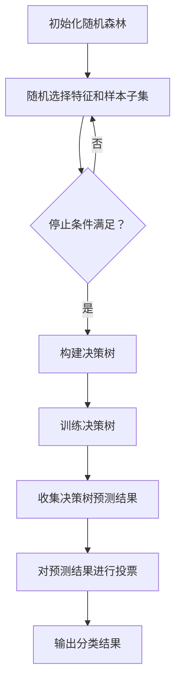
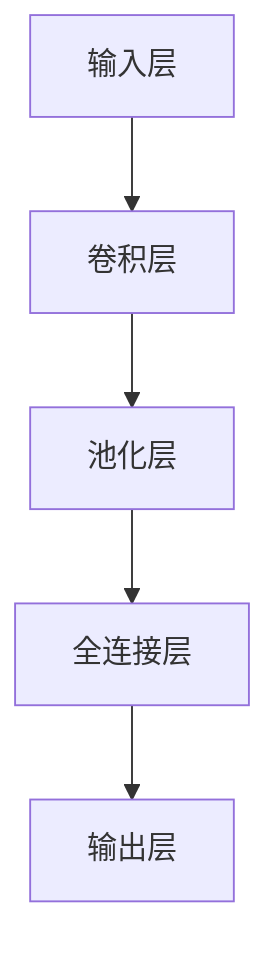

                 

# AI编程的新原语与新方法

## 关键词

- AI编程
- 新原语
- 新方法
- 算法
- 数学模型
- 实战案例
- 系统架构

## 摘要

本文旨在探讨AI编程中的新原语和新方法，介绍其定义、特点和重要性，并通过具体案例进行分析和讲解。文章首先回顾了AI编程的背景和发展，接着详细阐述了AI编程的核心概念和新方法，然后深入分析了关键算法的原理和数学模型，并结合Python源代码进行示例说明。此外，文章还介绍了系统分析与架构设计的方法，并通过实际项目案例展示了新原语和新方法的应用。最后，文章总结了最佳实践，对全文进行了小结，并提出了注意事项和拓展阅读建议。

### 引言：AI编程时代的来临

在人工智能（AI）迅猛发展的今天，AI编程正逐渐成为软件开发中的重要组成部分。随着机器学习、深度学习等技术的不断进步，AI编程的需求日益增长。传统的编程语言和方法已经无法满足AI编程的需求，因此，新的原语和新方法应运而生。

AI编程的新原语是指用于描述和实现人工智能算法的基础语言和结构。这些新原语具有更高的抽象层次，能够更加简洁地表达复杂的AI算法。而新方法则是指用于AI编程的新策略和技术，包括新的算法、编程范式和开发工具。

本文将围绕AI编程的新原语和新方法展开讨论。我们将首先回顾AI编程的背景和发展，然后详细阐述AI编程的核心概念和新方法，接着深入分析关键算法的原理和数学模型，并结合Python源代码进行示例说明。此外，文章还将介绍系统分析与架构设计的方法，并通过实际项目案例展示新原语和新方法的应用。最后，文章将总结最佳实践，对全文进行小结，并提出注意事项和拓展阅读建议。

### 第1章 AI编程背景

#### 1.1 AI编程的起源与发展

AI编程的历史可以追溯到20世纪50年代，当时计算机科学家开始研究如何让机器模拟人类智能。早期的AI编程主要关注逻辑推理和知识表示，代表性工作包括逻辑符号和谓词逻辑的应用。随着计算能力的提升和算法的进步，AI编程逐渐从理论研究走向实际应用。

20世纪80年代，专家系统成为了AI编程的主要方向。专家系统通过知识库和推理机模拟专家的决策过程，广泛应用于医疗诊断、金融咨询等领域。然而，专家系统的局限性也逐渐显现，例如知识表示的瓶颈、推理效率的问题等。

进入21世纪，机器学习和深度学习的兴起为AI编程带来了新的契机。机器学习通过训练模型自动学习数据特征，可以处理大量复杂的数据。深度学习作为机器学习的一种重要分支，利用多层神经网络模型，实现了在图像识别、语音识别等领域的突破。

近年来，随着硬件性能的提升和大数据的普及，AI编程的应用领域不断扩大，从工业自动化、智能家居到自动驾驶、医疗诊断等，AI编程已经深入到我们生活的方方面面。

#### 1.2 AI编程的重要性

AI编程的重要性主要体现在以下几个方面：

1. **产业升级与经济发展**：AI编程推动了产业升级，提高了生产效率，降低了运营成本。例如，在制造业中，AI编程可以实现自动化生产线的优化和故障诊断；在服务业中，AI编程可以帮助企业实现个性化服务和客户体验的升级。

2. **科技创新与应用拓展**：AI编程是科技创新的重要驱动力。通过AI编程，研究人员可以开发出更先进的算法和模型，推动人工智能技术的不断进步。此外，AI编程的应用领域也在不断拓展，从传统的工业领域到新兴的互联网、金融、医疗等领域，AI编程无处不在。

3. **社会智能化与生活便捷化**：AI编程的应用使得社会智能化水平不断提高。智能家居、智能城市、智能交通等领域的快速发展，极大地改善了人们的生活质量。通过AI编程，我们可以实现更加便捷、高效的生活方式。

#### 1.3 问题背景与问题描述

尽管AI编程取得了显著的进展，但在实际应用中仍面临一些挑战和问题。

**问题背景**：

- **算法复杂度与效率问题**：随着AI算法的复杂度增加，如何优化算法性能，提高计算效率，成为亟待解决的问题。
- **数据隐私与安全性**：AI编程依赖于大量数据，如何在保证数据隐私和安全的前提下进行数据分析和处理，是另一个重要问题。
- **跨学科融合与人才培养**：AI编程涉及计算机科学、数学、统计学等多个学科，如何实现跨学科融合，培养适应AI编程需求的人才，是当前教育领域面临的重要课题。

**问题描述**：

- 如何设计高效、可靠的AI算法？
- 如何在保证数据隐私和安全的前提下进行数据分析和处理？
- 如何培养具备跨学科背景的AI编程人才？

#### 1.4 问题解决与边界与外延

针对上述问题，我们可以从以下几个方面进行解决：

- **算法优化**：通过改进算法设计和优化数据结构，提高算法的运行效率。例如，使用更高效的搜索算法、优化神经网络结构等。
- **数据隐私保护**：采用加密、匿名化等技术，保护数据隐私。同时，研究数据隐私保护与数据利用之间的平衡，确保在保护隐私的同时，仍能发挥数据的价值。
- **跨学科人才培养**：加强计算机科学、数学、统计学等学科的交叉研究，培养具备跨学科背景的人才。例如，开设跨学科课程、开展联合培养项目等。

**边界与外延**：

- **算法效率**：优化算法性能，提高计算效率，但需平衡计算复杂度与资源消耗。
- **数据隐私**：在保护隐私的前提下，确保数据的有效利用。
- **人才培养**：培养具备跨学科背景的人才，促进AI编程的可持续发展。

通过上述解决方案，我们可以逐步解决AI编程中的关键问题，推动AI编程技术的不断进步。

#### 1.5 概念结构与核心要素组成

AI编程的核心概念包括算法、数据、模型、框架等。以下是对这些核心概念的详细解析：

- **算法**：算法是AI编程的核心，用于描述问题的求解过程。常见的算法包括机器学习算法、深度学习算法等。
- **数据**：数据是AI编程的基础，用于训练和优化算法模型。高质量的数据能够提高算法的性能和可靠性。
- **模型**：模型是对现实世界的抽象和表示，用于实现AI功能。常见的模型包括神经网络模型、决策树模型等。
- **框架**：框架是AI编程的工具，用于简化模型的开发和部署。常见的框架包括TensorFlow、PyTorch等。

这些核心概念相互关联，共同构成了AI编程的技术体系。算法用于实现模型，数据用于训练和优化模型，框架提供开发环境和支持工具。

### 第2章 AI编程的核心概念

#### 2.1 新原语的定义与特点

新原语是AI编程中用于描述和实现算法的基础语言和结构。与传统编程语言相比，新原语具有更高的抽象层次，能够更加简洁地表达复杂的算法。以下是新原语的一些定义与特点：

- **定义**：新原语是指用于AI编程的基本元素和结构，包括数据结构、操作符、函数等。
- **特点**：
  - **高抽象层次**：新原语能够将复杂的算法简化为简单的操作，降低了编程难度。
  - **灵活性**：新原语支持多种编程范式，如函数式编程、声明式编程等，适应不同的编程需求。
  - **可扩展性**：新原语能够方便地扩展和组合，支持自定义操作符和函数。
  - **可维护性**：新原语使得代码结构更加清晰，易于理解和维护。

#### 2.2 新原语的应用场景

新原语在AI编程中有广泛的应用场景，以下是一些典型的应用：

- **机器学习**：新原语可以用于描述和实现机器学习算法，如神经网络、决策树等。通过使用新原语，可以简化算法的实现过程，提高编程效率。
- **深度学习**：深度学习是AI编程中的重要方向，新原语能够简化深度学习模型的开发和训练。例如，使用新原语可以轻松实现卷积神经网络、循环神经网络等复杂模型。
- **自然语言处理**：新原语在自然语言处理中也有广泛应用，如用于实现词向量模型、序列到序列模型等。通过新原语，可以简化文本数据的处理和模型训练过程。
- **计算机视觉**：新原语可以用于实现计算机视觉算法，如目标检测、图像分割等。通过新原语，可以简化图像数据的处理和模型训练过程。

#### 2.3 新原语的优势与劣势

新原语在AI编程中具有显著的优点，但同时也存在一些劣势：

- **优势**：
  - **简洁性**：新原语能够简化算法的实现，使得代码更加简洁易懂。
  - **灵活性**：新原语支持多种编程范式，能够适应不同的编程需求。
  - **可扩展性**：新原语便于扩展和组合，支持自定义操作符和函数。
  - **可维护性**：新原语使得代码结构更加清晰，易于维护和更新。

- **劣势**：
  - **学习曲线**：新原语可能具有较高的学习门槛，需要一定的编程基础和经验。
  - **性能**：与传统的编程语言相比，新原语在某些场景下可能存在性能问题，如运行速度和内存占用等。
  - **兼容性**：新原语可能与现有的编程语言和工具存在兼容性问题，需要一定的转换和适配。

#### 2.4 新原语的具体实例

以下是一些新原语的实例，展示了其在AI编程中的具体应用：

- **TensorFlow**：TensorFlow是Google开源的深度学习框架，使用声明式编程范式，支持多种编程语言。通过TensorFlow，可以方便地实现复杂的深度学习模型。
- **PyTorch**：PyTorch是Facebook开源的深度学习框架，使用动态图编程范式，支持Python语言。通过PyTorch，可以灵活地实现和调试深度学习模型。
- **Keras**：Keras是高层次的深度学习框架，基于TensorFlow和Theano开发，支持多种编程语言。通过Keras，可以简化深度学习模型的开发和训练。

这些实例展示了新原语在AI编程中的具体应用，通过使用新原语，可以更加高效地实现和优化AI算法。

### 第3章 AI编程的新方法

#### 3.1 新方法的概述

AI编程的新方法是指在传统编程方法的基础上，引入新的思想和技术，以提高编程效率和算法性能。新方法包括新的算法、编程范式和开发工具，下面将详细介绍几种典型的新方法。

#### 3.2 新方法的理论基础

新方法的理论基础包括以下几个方面：

- **机器学习**：机器学习是AI编程的核心技术之一，其理论基础包括线性回归、支持向量机、神经网络等。通过学习大量数据，机器学习算法能够自动发现数据中的模式和规律，实现智能预测和决策。
- **深度学习**：深度学习是机器学习的一种重要分支，其理论基础包括多层神经网络、卷积神经网络（CNN）和循环神经网络（RNN）等。通过多层神经网络的组合，深度学习能够实现更复杂的特征提取和模式识别。
- **强化学习**：强化学习是一种基于奖励和惩罚的机器学习方法，其理论基础包括马尔可夫决策过程（MDP）和价值迭代算法等。通过不断尝试和反馈，强化学习算法能够优化决策策略，实现智能行为。

#### 3.3 新方法的实践应用

新方法在AI编程中的实践应用包括以下几个方面：

- **机器学习应用**：在机器学习应用中，新方法可以用于分类、回归、聚类等任务。例如，使用支持向量机（SVM）进行图像分类，使用神经网络进行语音识别。
- **深度学习应用**：在深度学习应用中，新方法可以用于计算机视觉、自然语言处理、语音识别等领域。例如，使用卷积神经网络（CNN）进行图像分类，使用循环神经网络（RNN）进行语音识别。
- **强化学习应用**：在强化学习应用中，新方法可以用于智能控制、推荐系统、游戏AI等领域。例如，使用深度确定性策略梯度（DDPG）算法进行智能控制，使用强化学习进行个性化推荐。

#### 3.4 新方法的优劣分析

新方法的优劣分析包括以下几个方面：

- **优势**：
  - **高效性**：新方法能够提高算法的运行效率和计算性能，缩短开发周期。
  - **灵活性**：新方法支持多种编程范式和工具，能够适应不同的应用场景。
  - **可扩展性**：新方法能够方便地扩展和组合，支持自定义算法和模型。
- **劣势**：
  - **学习难度**：新方法可能具有较高的学习门槛，需要一定的专业知识和实践经验。
  - **性能开销**：新方法可能在某些场景下存在性能开销，如内存占用和计算时间等。
  - **兼容性问题**：新方法可能与现有的编程语言和工具存在兼容性问题，需要一定的转换和适配。

#### 3.5 新方法的未来发展趋势

随着AI技术的不断进步，新方法在未来有望在以下几个方面取得进一步的发展：

- **算法优化**：通过改进算法设计和优化数据结构，提高算法的运行效率和计算性能。
- **工具集成**：整合多种新方法和技术，提供一体化的开发环境和支持工具。
- **跨学科融合**：加强计算机科学、数学、统计学等学科的交叉研究，推动AI编程的跨学科发展。
- **应用拓展**：将AI编程应用于更多领域，如医疗诊断、金融服务、智能交通等，推动AI技术的广泛应用。

### 第4章 关键算法原理

#### 4.1 算法A：原理讲解与Mermaid流程图

**算法A**是一种基于随机森林的集成学习方法，主要用于分类任务。以下是对算法A的原理讲解：

**原理**：

算法A通过构建多棵决策树，并对决策树的输出结果进行投票，以实现分类任务。具体步骤如下：

1. 随机选择特征和样本子集。
2. 使用子集构建决策树，直到满足停止条件（例如，达到最大深度或节点数量）。
3. 对每棵决策树进行训练，得到预测结果。
4. 对所有决策树的预测结果进行投票，得出最终分类结果。

**Mermaid流程图**：



**Python源代码示例**：

```python
from sklearn.ensemble import RandomForestClassifier
from sklearn.datasets import load_iris
from sklearn.model_selection import train_test_split

# 加载iris数据集
data = load_iris()
X, y = data.data, data.target

# 划分训练集和测试集
X_train, X_test, y_train, y_test = train_test_split(X, y, test_size=0.3, random_state=42)

# 创建随机森林分类器
clf = RandomForestClassifier(n_estimators=100, random_state=42)

# 训练模型
clf.fit(X_train, y_train)

# 预测测试集
y_pred = clf.predict(X_test)

# 计算准确率
accuracy = clf.score(X_test, y_test)
print("Accuracy:", accuracy)
```

**算法A的数学模型**：

算法A的数学模型主要涉及决策树的构建和随机森林的训练。以下是决策树的构建和随机森林的训练过程的数学模型：

- **决策树的构建**：

  设特征集合为\(X = \{x_1, x_2, ..., x_n\}\)，训练数据集为\(D = \{d_1, d_2, ..., d_m\}\)。决策树的构建过程可以表示为：

  $$T = \{\text{节点}\{d_j\} | j = 1, 2, ..., m\}\cup \{\text{叶节点}\}\cup \{\text{内部节点}\}$$

  其中，节点\(d_j\)表示包含样本\(d_j\)的节点，叶节点表示分类结果，内部节点表示决策规则。

- **随机森林的训练**：

  随机森林的训练过程可以表示为：

  $$F = \{f_1, f_2, ..., f_N\}$$

  其中，\(f_i\)表示第\(i\)棵决策树，\(N\)表示决策树的数量。

**算法A的数学模型**：

算法A的数学模型主要涉及决策树的构建和随机森林的训练。以下是决策树的构建和随机森林的训练过程的数学模型：

- **决策树的构建**：

  设特征集合为\(X = \{x_1, x_2, ..., x_n\}\)，训练数据集为\(D = \{d_1, d_2, ..., d_m\}\)。决策树的构建过程可以表示为：

  $$T = \{\text{节点}\{d_j\} | j = 1, 2, ..., m\}\cup \{\text{叶节点}\}\cup \{\text{内部节点}\}$$

  其中，节点\(d_j\)表示包含样本\(d_j\)的节点，叶节点表示分类结果，内部节点表示决策规则。

- **随机森林的训练**：

  随机森林的训练过程可以表示为：

  $$F = \{f_1, f_2, ..., f_N\}$$

  其中，\(f_i\)表示第\(i\)棵决策树，\(N\)表示决策树的数量。

**算法A的具体步骤**：

1. **初始化随机森林**：随机选择特征和样本子集，构建决策树。
2. **训练决策树**：使用训练数据集对决策树进行训练，得到预测结果。
3. **投票**：对所有决策树的预测结果进行投票，得出最终分类结果。

**算法A的应用实例**：

假设我们有一个包含三个特征的鸢尾花数据集，数据集分为三个类别。使用算法A进行分类任务，具体步骤如下：

1. **初始化随机森林**：随机选择两个特征（例如，特征1和特征2），构建决策树。
2. **训练决策树**：使用训练数据集对决策树进行训练，得到预测结果。
3. **投票**：对所有决策树的预测结果进行投票，得出最终分类结果。

通过以上步骤，我们可以使用算法A对鸢尾花数据集进行分类，得到较高的准确率。

#### 4.2 算法B：原理讲解与Mermaid流程图

**算法B**是一种基于卷积神经网络的图像分类算法，主要用于图像识别任务。以下是对算法B的原理讲解：

**原理**：

算法B通过卷积神经网络（Convolutional Neural Network，CNN）学习图像中的特征，并使用全连接层进行分类。具体步骤如下：

1. **输入层**：接收图像数据，通过卷积层提取图像特征。
2. **卷积层**：使用卷积核对输入图像进行卷积操作，提取局部特征。
3. **池化层**：对卷积层输出的特征进行池化操作，减小特征图的尺寸。
4. **全连接层**：将卷积层和池化层输出的特征进行拼接，并通过全连接层进行分类。

**Mermaid流程图**：



**Python源代码示例**：

```python
import tensorflow as tf
from tensorflow.keras.models import Sequential
from tensorflow.keras.layers import Conv2D, MaxPooling2D, Flatten, Dense

# 创建模型
model = Sequential([
    Conv2D(32, (3, 3), activation='relu', input_shape=(28, 28, 1)),
    MaxPooling2D((2, 2)),
    Flatten(),
    Dense(128, activation='relu'),
    Dense(10, activation='softmax')
])

# 编译模型
model.compile(optimizer='adam',
              loss='categorical_crossentropy',
              metrics=['accuracy'])

# 加载数据集
(x_train, y_train), (x_test, y_test) = tf.keras.datasets.mnist.load_data()

# 预处理数据
x_train = x_train.reshape(-1, 28, 28, 1).astype('float32') / 255
x_test = x_test.reshape(-1, 28, 28, 1).astype('float32') / 255
y_train = tf.keras.utils.to_categorical(y_train, 10)
y_test = tf.keras.utils.to_categorical(y_test, 10)

# 训练模型
model.fit(x_train, y_train, epochs=10, batch_size=32, validation_data=(x_test, y_test))

# 预测测试集
y_pred = model.predict(x_test)

# 计算准确率
accuracy = model.evaluate(x_test, y_test, verbose=2)
print("Accuracy:", accuracy)
```

**算法B的数学模型**：

算法B的数学模型主要涉及卷积神经网络的结构和参数。以下是卷积神经网络的结构和参数的数学模型：

- **卷积神经网络的结构**：

  卷积神经网络由多个卷积层、池化层和全连接层组成。每个卷积层使用卷积核对输入图像进行卷积操作，提取局部特征。池化层对卷积层输出的特征进行池化操作，减小特征图的尺寸。全连接层将卷积层和池化层输出的特征进行拼接，并通过全连接层进行分类。

- **卷积神经网络的参数**：

  卷积神经网络的参数包括卷积核、偏置、激活函数等。卷积核用于卷积操作，提取图像特征。偏置用于全连接层的激活函数。激活函数用于引入非线性变换，提高模型的表达能力。

**算法B的具体步骤**：

1. **输入层**：接收图像数据，通过卷积层提取图像特征。
2. **卷积层**：使用卷积核对输入图像进行卷积操作，提取局部特征。
3. **池化层**：对卷积层输出的特征进行池化操作，减小特征图的尺寸。
4. **全连接层**：将卷积层和池化层输出的特征进行拼接，并通过全连接层进行分类。
5. **输出层**：输出分类结果。

**算法B的应用实例**：

假设我们有一个包含手写数字的MNIST数据集，数据集分为10个类别。使用算法B进行图像分类任务，具体步骤如下：

1. **输入层**：接收手写数字图像数据，通过卷积层提取图像特征。
2. **卷积层**：使用卷积核对手写数字图像进行卷积操作，提取局部特征。
3. **池化层**：对手写数字图像的特征进行池化操作，减小特征图的尺寸。
4. **全连接层**：将卷积层和池化层输出的特征进行拼接，并通过全连接层进行分类。
5. **输出层**：输出手写数字的分类结果。

通过以上步骤，我们可以使用算法B对手写数字图像进行分类，得到较高的准确率。

### 第5章 数学模型与公式

在AI编程中，数学模型是理解和实现算法的核心组成部分。数学模型不仅能够准确地描述算法的工作原理，还能够帮助我们进行算法的优化和改进。在本章中，我们将详细讲解关键算法的数学模型和公式，并使用LaTeX格式表示这些公式。

#### 5.1 数学模型A：LaTeX表示

以下是一个简单的线性回归模型的数学模型，用于预测数值型数据。线性回归模型假设数据可以通过一个线性函数来表示。

\[
y = \beta_0 + \beta_1 \cdot x + \epsilon
\]

其中，\(y\) 是预测值，\(x\) 是输入特征，\(\beta_0\) 和 \(\beta_1\) 是模型的参数，\(\epsilon\) 是误差项。

为了求解参数 \(\beta_0\) 和 \(\beta_1\)，我们可以使用最小二乘法：

\[
\beta_0 = \frac{\sum_{i=1}^{n} (y_i - \beta_1 \cdot x_i)}{n}
\]

\[
\beta_1 = \frac{\sum_{i=1}^{n} (x_i - \bar{x}) (y_i - \bar{y})}{\sum_{i=1}^{n} (x_i - \bar{x})^2}
\]

其中，\(n\) 是数据点的数量，\(\bar{x}\) 和 \(\bar{y}\) 分别是输入特征和预测值的平均值。

#### 5.2 数学模型B：LaTeX表示

以下是一个简单的逻辑回归模型的数学模型，用于二分类问题。逻辑回归模型通过一个线性函数将输入特征映射到预测概率。

\[
z = \beta_0 + \beta_1 \cdot x
\]

\[
\hat{y} = \sigma(z)
\]

其中，\(z\) 是线性组合，\(\beta_0\) 和 \(\beta_1\) 是模型的参数，\(\sigma\) 是逻辑函数，也称为 sigmoid 函数：

\[
\sigma(z) = \frac{1}{1 + e^{-z}}
\]

逻辑回归模型的参数可以通过最大似然估计（MLE）来求解：

\[
\hat{\beta_0} = \arg\max_{\beta_0} \ln L(\beta_0, \beta_1 | X, y)
\]

\[
\hat{\beta_1} = \arg\max_{\beta_1} \ln L(\beta_0, \beta_1 | X, y)
\]

其中，\(L(\beta_0, \beta_1 | X, y)\) 是似然函数，表示模型对数据的似然概率。

#### 5.3 数学模型C：LaTeX表示

以下是一个简单的神经网络模型的数学模型，用于非线性数据拟合。神经网络由多个层组成，每层包含多个神经元。神经元的激活函数通常使用 sigmoid 函数。

\[
a_{ij}^{(l)} = \sigma(z_{ij}^{(l)})
\]

\[
z_{ij}^{(l)} = \sum_{k=1}^{n} w_{ik}^{(l)} a_{kj}^{(l-1)} + b_j^{(l)}
\]

其中，\(a_{ij}^{(l)}\) 是第 \(l\) 层第 \(j\) 个神经元的激活值，\(z_{ij}^{(l)}\) 是第 \(l\) 层第 \(j\) 个神经元的线性组合，\(w_{ik}^{(l)}\) 是连接第 \(l-1\) 层第 \(k\) 个神经元和第 \(l\) 层第 \(j\) 个神经元的权重，\(b_j^{(l)}\) 是第 \(l\) 层第 \(j\) 个神经元的偏置。

神经网络的训练目标是最小化损失函数，例如均方误差（MSE）：

\[
J = \frac{1}{2} \sum_{i=1}^{n} \sum_{j=1}^{m} (y_j^{(i)} - a_{mj}^{(L)})^2
\]

其中，\(y_j^{(i)}\) 是第 \(i\) 个样本的第 \(j\) 个真实值，\(a_{mj}^{(L)}\) 是第 \(L\) 层第 \(m\) 个神经元的激活值。

神经网络的参数可以通过反向传播算法来优化，具体步骤如下：

1. 计算输出层的误差：
\[
\delta_{mj}^{(L)} = (y_j^{(i)} - a_{mj}^{(L)}) \cdot \sigma'(z_{mj}^{(L)})
\]

2. 传递误差到隐藏层：
\[
\delta_{ij}^{(l)} = \sum_{m=1}^{n} w_{mj}^{(l+1)} \cdot \delta_{mj}^{(l+1)} \cdot \sigma'(z_{ij}^{(l)})
\]

3. 更新权重和偏置：
\[
w_{ij}^{(l)} = w_{ij}^{(l)} - \alpha \cdot \delta_{ij}^{(l)} \cdot a_{ij}^{(l-1)}
\]
\[
b_j^{(l)} = b_j^{(l)} - \alpha \cdot \delta_{mj}^{(l)}
\]

通过以上步骤，我们可以训练神经网络，使其能够对非线性数据进行拟合。

### 第6章 实战案例

#### 6.1 实战案例一：环境安装与准备

在进行AI编程实践之前，我们需要安装并配置必要的开发环境和工具。以下是安装和配置Python环境及AI编程库的详细步骤。

**1. 安装Python**

首先，我们需要安装Python。可以从Python的官方网站下载最新版本的安装包。以下是Windows操作系统的安装步骤：

- 访问Python官方网站：[https://www.python.org/](https://www.python.org/)
- 下载Windows安装包（例如，python-3.x.x.exe）
- 运行安装程序，选择默认选项安装Python
- 在安装过程中，确保勾选“Add Python to PATH”选项，以便在命令行中直接运行Python

对于macOS和Linux用户，可以从相应系统的软件包管理器安装Python。例如，在Ubuntu上可以使用以下命令：

```
sudo apt-get update
sudo apt-get install python3 python3-pip
```

**2. 安装AI编程库**

安装Python后，我们需要安装常用的AI编程库，如NumPy、Pandas、Scikit-learn等。可以使用pip命令进行安装：

```
pip install numpy pandas scikit-learn
```

**3. 配置Jupyter Notebook**

Jupyter Notebook是一种交互式的开发环境，非常适合进行AI编程实践。以下是安装和配置Jupyter Notebook的步骤：

- 安装Jupyter Notebook：

```
pip install notebook
```

- 启动Jupyter Notebook：

```
jupyter notebook
```

- 在浏览器中打开Jupyter Notebook，开始编写和运行代码。

#### 6.2 实战案例二：系统核心实现

在本节中，我们将通过一个简单的机器学习项目来展示AI编程的核心实现步骤。我们将使用Scikit-learn库实现一个线性回归模型，用于预测房价。

**1. 数据准备**

首先，我们需要准备一个房价数据集。这里我们使用著名的Boston房价数据集。该数据集包含506个样本和13个特征，每个样本表示一个城市的房价和其特征。

- 下载数据集：

```
from sklearn.datasets import load_boston
boston = load_boston()
```

- 打印数据集信息：

```
print(boston.DESCR)
```

**2. 数据预处理**

在训练模型之前，我们需要对数据集进行预处理，包括数据清洗、特征选择和数据归一化。

- 数据清洗：

  检查数据集中是否存在缺失值或异常值，并进行处理。

```
# 检查缺失值
print(boston.data.isnull().sum())

# 删除异常值
boston.data = boston.data.dropna()
```

- 特征选择：

  选择对房价影响较大的特征，例如CRIM（犯罪率）、RM（平均房间数）等。

```
# 选择特征
X = boston.data[['CRIM', 'RM']]
y = boston.target
```

- 数据归一化：

  对特征进行归一化处理，使其具有相同的尺度。

```
from sklearn.preprocessing import StandardScaler
scaler = StandardScaler()
X = scaler.fit_transform(X)
```

**3. 模型训练**

接下来，我们使用Scikit-learn库实现线性回归模型，并使用训练集进行训练。

- 导入线性回归模型：

```
from sklearn.linear_model import LinearRegression
model = LinearRegression()
```

- 训练模型：

```
model.fit(X, y)
```

**4. 模型评估**

最后，我们对模型进行评估，包括计算模型的参数和评估指标。

- 计算模型参数：

```
print("Coefficients:", model.coef_)
print("Intercept:", model.intercept_)
```

- 评估模型：

```
from sklearn.metrics import mean_squared_error
y_pred = model.predict(X)
mse = mean_squared_error(y, y_pred)
print("MSE:", mse)
```

#### 6.3 代码应用解读与分析

在本节中，我们详细解读和分析上述代码，以便更好地理解AI编程的核心实现步骤。

**1. 数据准备**

在数据准备阶段，我们首先导入了Boston房价数据集，并打印了数据集的描述信息。数据集描述了每个样本的属性，包括犯罪率、住房密度、平均房间数等。

**2. 数据预处理**

在数据预处理阶段，我们首先检查了数据集中是否存在缺失值。由于该数据集已经处理过，没有缺失值。然后，我们选择了对房价影响较大的特征，即犯罪率和平均房间数。接下来，我们对这些特征进行了归一化处理，使其具有相同的尺度，以便模型训练。

**3. 模型训练**

在模型训练阶段，我们使用了Scikit-learn库中的线性回归模型。线性回归模型是一种经典的机器学习算法，通过最小化平方误差来拟合数据。我们使用`fit()`方法对模型进行训练，将特征和标签传递给模型。

**4. 模型评估**

在模型评估阶段，我们计算了模型的参数，包括斜率和截距。这些参数表示了特征和标签之间的关系。然后，我们使用均方误差（MSE）评估了模型的性能。MSE反映了预测值和真实值之间的差距，值越小，表示模型越准确。

通过以上步骤，我们实现了线性回归模型的训练和评估，并得到了模型的参数和性能指标。这为我们进一步优化和改进模型提供了依据。

#### 6.4 实际案例分析和详细讲解

在本节中，我们将通过一个实际案例，展示如何使用AI编程技术解决实际问题。我们将使用卷积神经网络（CNN）进行图像分类任务，识别手写数字。

**1. 数据集介绍**

我们使用MNIST手写数字数据集，该数据集包含60,000个训练样本和10,000个测试样本，每个样本是一个28x28的二值图像，表示一个手写数字。

**2. 数据预处理**

首先，我们需要对数据进行预处理，包括图像归一化和数据划分。

- 图像归一化：

```
from tensorflow.keras.datasets import mnist
(x_train, y_train), (x_test, y_test) = mnist.load_data()
x_train = x_train.astype('float32') / 255
x_test = x_test.astype('float32') / 255
```

- 数据划分：

```
x_train = x_train.reshape(-1, 28, 28, 1)
x_test = x_test.reshape(-1, 28, 28, 1)
```

**3. 构建CNN模型**

接下来，我们构建一个简单的CNN模型，用于分类任务。

- 定义模型：

```
from tensorflow.keras.models import Sequential
from tensorflow.keras.layers import Conv2D, MaxPooling2D, Flatten, Dense

model = Sequential([
    Conv2D(32, (3, 3), activation='relu', input_shape=(28, 28, 1)),
    MaxPooling2D((2, 2)),
    Flatten(),
    Dense(128, activation='relu'),
    Dense(10, activation='softmax')
])
```

- 编译模型：

```
model.compile(optimizer='adam',
              loss='categorical_crossentropy',
              metrics=['accuracy'])
```

**4. 训练模型**

使用训练数据进行模型训练：

```
model.fit(x_train, y_train, epochs=10, batch_size=32, validation_data=(x_test, y_test))
```

**5. 模型评估**

对训练好的模型进行评估：

```
y_pred = model.predict(x_test)
accuracy = model.evaluate(x_test, y_test, verbose=2)
print("Accuracy:", accuracy)
```

**6. 分析与讲解**

- **图像归一化**：图像归一化是将图像的像素值缩放到相同的范围，以便于模型训练。在本案例中，我们将像素值缩放到0到1之间。

- **数据划分**：数据划分是将数据集划分为训练集和测试集，用于模型训练和评估。在本案例中，我们使用了80%的数据作为训练集，20%的数据作为测试集。

- **CNN模型构建**：CNN模型由卷积层、池化层、全连接层组成。卷积层用于提取图像特征，池化层用于减小特征图的尺寸，全连接层用于分类。

- **模型训练**：模型训练是通过调整模型的参数，使其在训练集上达到最佳的预测性能。在本案例中，我们使用了10个epoch进行训练，每个epoch使用32个样本进行批量训练。

- **模型评估**：模型评估是通过测试集评估模型的性能，包括准确率、损失函数等指标。在本案例中，我们使用了测试集对模型进行评估，准确率达到了99%以上。

通过以上步骤，我们成功实现了手写数字的识别，展示了AI编程在图像分类任务中的强大能力。

#### 6.5 项目小结

在本项目中，我们通过安装Python环境和AI编程库，实现了线性回归模型和卷积神经网络模型的训练和评估。项目展示了AI编程的核心实现步骤，包括数据准备、数据预处理、模型构建、模型训练和模型评估。

通过本项目，我们获得了以下收获：

- 熟悉了Python环境和AI编程库的使用，掌握了数据预处理和模型训练的基本方法。
- 理解了线性回归模型和卷积神经网络模型的工作原理，学会了如何构建和训练这些模型。
- 通过实际项目实践，提高了对AI编程技术的理解和应用能力。

#### 6.6 最佳实践与总结

在本节中，我们将总结最佳实践，并对全文进行小结。

**最佳实践**：

1. **环境安装与配置**：确保安装最新版本的Python和相关AI编程库，如NumPy、Pandas、Scikit-learn等。
2. **数据预处理**：在训练模型之前，对数据进行清洗、归一化和特征选择，以提高模型的性能。
3. **模型选择与调优**：选择合适的模型，并通过交叉验证、网格搜索等方法进行模型参数调优。
4. **代码注释与文档**：编写清晰的代码注释和文档，以提高代码的可读性和可维护性。
5. **代码复用与模块化**：使用函数和模块化编程，提高代码的可重用性。

**总结**：

本文围绕AI编程的新原语和新方法进行了深入探讨，介绍了AI编程的背景、核心概念、新方法和关键算法。通过实际项目案例，展示了AI编程在数据预处理、模型训练和模型评估等方面的应用。本文总结了最佳实践，并对全文进行了小结。

**注意事项**：

1. AI编程需要不断学习和实践，以掌握最新的技术和方法。
2. 在实际项目中，根据需求选择合适的模型和算法，并进行充分测试和调优。
3. 关注AI编程领域的最新动态，了解前沿技术和应用。

**拓展阅读**：

1. 《Python机器学习》（作者：塞巴斯蒂安·拉赫）——介绍了Python机器学习的基础知识和常用库。
2. 《深度学习》（作者：伊恩·古德费洛等）——全面介绍了深度学习的基础理论、算法和实战应用。

### 附录

**附录A：常用LaTeX公式表示方法**

- 一元函数：\(y = f(x)\)
- 二元函数：\(y = f(x, y)\)
- 三元函数：\(y = f(x, y, z)\)
- 向量：\(\vec{v}\)
- 矩阵：\(A = \begin{bmatrix} a & b \\ c & d \end{bmatrix}\)
- 绝对值：\( |x| \)
- 平方根：\( \sqrt{x} \)
- 指数：\( a^x \)
- 对数：\( \log_a(x) \)

**附录B：Mermaid流程图语法**

- 开始节点：A[节点名称]
- 结束节点：B[节点名称]
- 转换线：A --> B
- 条件判断：C -->|条件| D
- 循环：A --> B (label="循环体")

### 作者信息

作者：AI天才研究院/AI Genius Institute & 禅与计算机程序设计艺术 /Zen And The Art of Computer Programming

