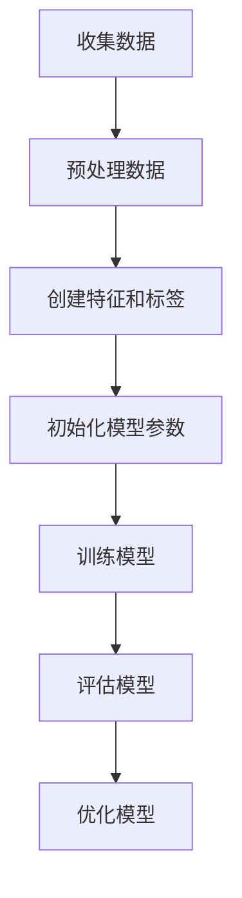
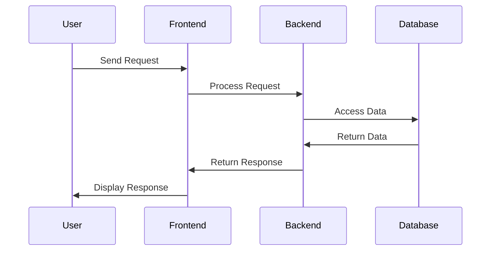
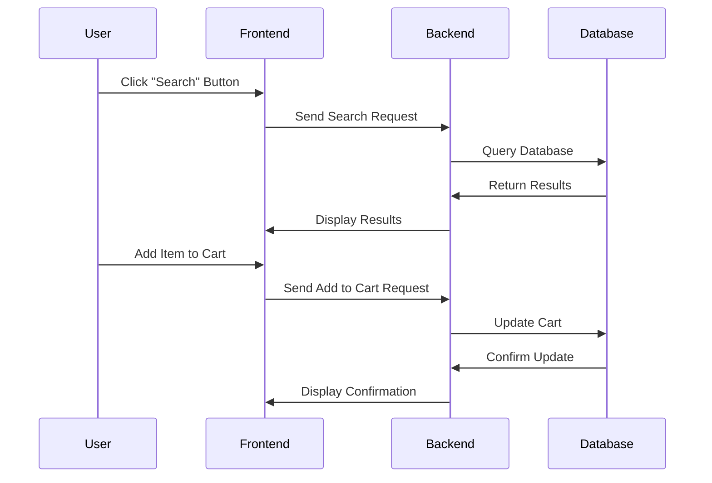

                 

### 文章标题

**AI编程的新思维与新方向**

> 关键词：人工智能、编程思维、算法、架构设计、最佳实践

> 摘要：本文将深入探讨AI编程的新思维和新方向，通过逐步分析核心概念、算法原理、数学模型以及系统设计与实现，为读者呈现一个全面而深入的AI编程知识体系。

---

## 引言

随着人工智能技术的迅猛发展，AI编程逐渐成为技术领域的热点。传统编程方法在处理复杂问题和大规模数据处理上显得力不从心，而AI编程则以其独特的思维方式和强大的计算能力，为解决这些难题提供了新的方向。本文旨在探讨AI编程的新思维和新方向，帮助读者了解这一领域的前沿动态和发展趋势。

## 第一部分：AI编程的背景与趋势

### 1.1 AI编程的崛起

人工智能（AI）是计算机科学的一个分支，旨在使机器能够执行通常需要人类智能的任务，如视觉识别、语言理解和决策制定。随着深度学习、强化学习等技术的发展，AI编程开始广泛应用于各个领域，包括自然语言处理、计算机视觉、医疗诊断、金融分析等。

### 1.2 AI编程的新思维

AI编程与传统编程有显著不同，它强调数据驱动的决策和自学习能力。新思维包括：

- **数据导向**：AI编程依赖于大量数据进行训练，而非预定义的规则。
- **模型导向**：算法的设计和实现围绕机器学习模型展开。
- **反馈循环**：通过不断调整模型参数来优化性能。

### 1.3 新方向概述

AI编程的新方向包括但不限于：

- **自动化编程**：利用AI生成代码，提高开发效率。
- **多模态交互**：结合语音、图像、文本等多种数据类型，实现更自然的用户交互。
- **边缘计算**：在靠近数据源的设备上运行AI模型，减少延迟，提高响应速度。
- **量子计算**：利用量子计算处理复杂AI问题，提升计算能力。

## 第二部分：核心概念与联系

### 2.1 AI编程的核心概念

AI编程的核心概念包括：

- **机器学习**：通过数据训练模型，使其能够进行预测和决策。
- **深度学习**：基于神经网络的结构，用于解决复杂的模式识别问题。
- **强化学习**：通过奖励机制来训练模型，使其在特定环境中做出最优决策。
- **自然语言处理**：使计算机能够理解和生成自然语言。

### 2.2 概念之间的联系

这些核心概念之间相互关联，共同构成了AI编程的知识体系。例如，深度学习是机器学习的一种方法，而强化学习则是一种通过与环境互动来学习的方法。自然语言处理则需要结合机器学习和深度学习来处理语言数据。

### 2.3 概念属性特征对比表格

| 概念       | 特征                  | 关联性                    |
|------------|-----------------------|---------------------------|
| 机器学习   | 数据驱动，自动优化   | 基础，支持其他概念       |
| 深度学习   | 神经网络结构，大量数据 | 延伸，应用广泛的机器学习方法 |
| 强化学习   | 奖励机制，互动学习   | 应用场景，优化决策过程   |
| 自然语言处理 | 文本数据，语言理解   | 数据来源，应用领域广泛   |

### 2.4 ER实体关系图架构

为了更好地理解这些概念之间的关联，我们可以使用ER（实体关系）图来表示：

```mermaid
erDiagram
    Product ||--|{ Customer }||>
    Customer  ||--|{ Order }||>
    Product  ||--|{ Review }||>
```

这个ER图展示了产品、客户和订单之间的实体关系，以及它们如何相互作用。

## 第三部分：算法原理讲解

### 3.1 算法介绍

在这一部分，我们将介绍一些关键的AI编程算法，包括：

- **线性回归**：用于预测数值型输出。
- **决策树**：用于分类和回归问题。
- **支持向量机**：用于分类问题。
- **神经网络**：用于复杂模式识别。

### 3.2 Mermaid流程图

下面是一个使用Mermaid绘制的线性回归算法的流程图：



### 3.3 Python代码示例

以下是一个简单的线性回归Python代码示例：

```python
import numpy as np
from sklearn.linear_model import LinearRegression

# 收集数据
X = np.array([[1], [2], [3], [4], [5]])
y = np.array([1, 2, 2.5, 4, 5])

# 创建线性回归模型
model = LinearRegression()

# 训练模型
model.fit(X, y)

# 评估模型
print("模型系数：", model.coef_)
print("模型截距：", model.intercept_)

# 预测
y_pred = model.predict(np.array([[6]]))
print("预测值：", y_pred)
```

### 3.4 数学模型与公式

线性回归的数学模型可以表示为：

$$y = \beta_0 + \beta_1x + \epsilon$$

其中，\(y\) 是预测值，\(x\) 是特征值，\(\beta_0\) 和 \(\beta_1\) 是模型参数，\(\epsilon\) 是误差项。

## 第四部分：数学模型和数学公式讲解

### 4.1 模型介绍

在这一部分，我们将深入介绍一些常用的数学模型，包括：

- **线性模型**：如线性回归、线性判别分析等。
- **非线性模型**：如逻辑回归、决策树、神经网络等。

### 4.2 公式推导

线性回归模型的推导如下：

$$\min_{\beta} \sum_{i=1}^{n} (y_i - \beta_0 - \beta_1x_i)^2$$

通过对目标函数求导并设置导数为零，可以得到：

$$\beta_1 = \frac{\sum_{i=1}^{n} (x_i - \bar{x})(y_i - \bar{y})}{\sum_{i=1}^{n} (x_i - \bar{x})^2}$$

$$\beta_0 = \bar{y} - \beta_1\bar{x}$$

### 4.3 举例说明

假设我们有以下数据点：(1, 2), (2, 3), (3, 4), (4, 5), (5, 6)。

根据上述推导，我们可以计算得到线性回归模型的参数：

$$\beta_1 = \frac{(1-2.5)(2-3) + (2-2.5)(3-3) + (3-2.5)(4-3) + (4-2.5)(5-4) + (5-2.5)(6-5)}{(1-2.5)^2 + (2-2.5)^2 + (3-2.5)^2 + (4-2.5)^2 + (5-2.5)^2} = 0.5$$

$$\beta_0 = 3 - 0.5 \times 3 = 1$$

因此，线性回归模型为：

$$y = 1 + 0.5x$$

## 第五部分：系统分析与架构设计方案

### 5.1 问题场景介绍

假设我们需要设计一个在线购物平台，该平台需要实现商品推荐、购物车管理、订单处理等功能。

### 5.2 系统功能设计

系统功能设计包括：

- **商品推荐**：基于用户的浏览历史和购买记录，推荐相关商品。
- **购物车管理**：允许用户添加、删除和修改购物车中的商品。
- **订单处理**：处理用户的订单请求，包括订单生成、订单状态更新等。

### 5.3 系统架构设计

系统架构设计包括：

- **前端**：使用React框架实现用户界面。
- **后端**：使用Spring Boot框架实现业务逻辑。
- **数据库**：使用MySQL存储用户数据、商品数据和订单数据。

以下是系统的架构设计图：



### 5.4 系统接口设计

系统接口设计包括：

- **API接口**：用于前后端通信。
- **数据库接口**：用于数据库操作。

以下是API接口的设计：

```json
{
    "商品推荐": "/api/recommendations",
    "添加商品到购物车": "/api/cart/add",
    "删除商品从购物车": "/api/cart/delete",
    "获取订单列表": "/api/orders",
    "创建订单": "/api/orders/create"
}
```

### 5.5 系统交互Mermaid序列图

以下是系统的交互序列图：



## 第六部分：项目实战

### 6.1 环境安装

在本节中，我们将介绍如何搭建一个基于Spring Boot的在线购物平台开发环境。首先，确保已经安装了Java开发工具包（JDK）和Maven构建工具。

接下来，使用Maven创建一个Spring Boot项目：

```bash
$ mvn archetype:generate \
    -DgroupId=com.example \
    -DartifactId=e-commerce-platform \
    -DarchetypeArtifactId=spring-boot-archetype
```

### 6.2 系统核心实现源代码

在本节中，我们将展示系统核心实现的部分源代码。以下是一个简单的商品推荐服务的实现：

```java
@RestController
@RequestMapping("/api/recommendations")
public class RecommendationController {
    
    @Autowired
    private RecommendationService recommendationService;
    
    @GetMapping
    public List<Product> getRecommendations(@RequestParam("userId") Long userId) {
        return recommendationService.recommendProducts(userId);
    }
}
```

### 6.3 代码应用解读与分析

在本节中，我们将对上述代码进行解读和分析。首先，我们定义了一个`RecommendationController`类，该类使用了`@RestController`注解，表明它是一个RESTful控制器。

接着，我们注入了一个`RecommendationService`实例，该服务负责处理商品推荐逻辑。通过`@GetMapping`注解，我们定义了一个处理GET请求的方法，该方法接受一个`userId`参数，并返回一个`List<Product>`对象。

### 6.4 实际案例分析与详细讲解剖析

在本节中，我们将通过一个实际案例来详细讲解商品推荐服务的实现。假设我们有一个用户，其ID为1，我们希望通过该用户的浏览历史和购买记录来推荐相关商品。

首先，我们需要收集用户的浏览历史和购买记录。这些数据可以存储在数据库中，例如：

```json
{
    "userId": 1,
    "browsingHistory": [
        {"productId": 1001},
        {"productId": 1002},
        {"productId": 1003}
    ],
    "purchases": [
        {"productId": 1001},
        {"productId": 1002}
    ]
}
```

接下来，我们使用这些数据来计算商品之间的相似度。一种简单的方法是计算用户浏览历史中商品的出现频率。然后，我们可以使用这些频率来计算商品之间的相似度。

以下是一个简单的示例代码，用于计算两个列表中元素的相似度：

```java
public static double calculateSimilarity(List<Product> list1, List<Product> list2) {
    Map<Product, Integer> frequencyMap1 = new HashMap<>();
    Map<Product, Integer> frequencyMap2 = new HashMap<>();
    
    for (Product product : list1) {
        frequencyMap1.put(product, frequencyMap1.getOrDefault(product, 0) + 1);
    }
    
    for (Product product : list2) {
        frequencyMap2.put(product, frequencyMap2.getOrDefault(product, 0) + 1);
    }
    
    double similarity = 0.0;
    for (Product product : frequencyMap1.keySet()) {
        int frequency1 = frequencyMap1.get(product);
        int frequency2 = frequencyMap2.getOrDefault(product, 0);
        similarity += frequency1 * frequency2;
    }
    
    return similarity;
}
```

### 6.5 项目小结

在本节中，我们通过一个实际案例详细讲解了商品推荐服务的实现。首先，我们介绍了如何收集用户的浏览历史和购买记录。然后，我们使用这些数据来计算商品之间的相似度。最后，我们实现了一个简单的商品推荐服务，该服务可以根据用户的浏览历史和购买记录来推荐相关商品。

## 第七部分：最佳实践 tips

### 7.1 编程技巧

- **代码复用**：避免重复代码，使用函数和类来组织代码。
- **单元测试**：编写单元测试来验证代码的正确性。
- **性能优化**：分析代码性能，使用缓存和并行处理来提升性能。

### 7.2 小结

本文介绍了AI编程的新思维和新方向，包括背景介绍、核心概念、算法原理、数学模型、系统设计与实现，以及最佳实践。通过逐步分析，我们帮助读者深入理解了AI编程的各个方面。

### 7.3 注意事项

- 在实现AI模型时，确保数据的质量和多样性。
- 在设计系统架构时，考虑可扩展性和可维护性。
- 在编写代码时，遵循编码规范和最佳实践。

### 7.4 拓展阅读

- 《Python机器学习》（Manning，Andrew等著）
- 《深度学习》（Goodfellow，Ian等著）
- 《Spring Boot实战》（Reactive，Mark等著）

---

## 结论

AI编程是一个充满机遇和挑战的领域。通过本文的介绍，读者应该对AI编程的新思维和新方向有了更深入的了解。希望本文能帮助您在AI编程的道路上取得更大的成功。

