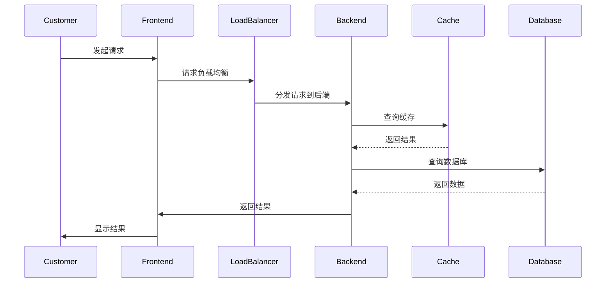
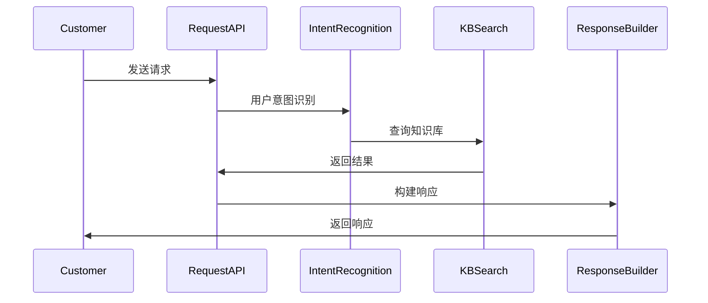

                 


### 引言：AI编程的新思路

在信息技术飞速发展的今天，人工智能（AI）已经成为推动科技进步的重要力量。AI编程作为AI领域的关键技术之一，不仅影响了各个行业的发展，也为编程本身带来了深刻的变革。传统的AI编程方法虽然在许多领域取得了显著成果，但同时也暴露出了一些局限性和不足。为了应对这些挑战，探索AI编程的新思路变得尤为重要。

本文旨在介绍AI编程的新思路，通过逐步分析，帮助读者理解并掌握这些新方法。我们将从背景与基础出发，逐步深入到新范式的探讨，最终总结出最佳实践。以下是文章的目录结构：

**第一部分: AI编程的背景与基础**

1. AI编程概述
   - AI编程的背景
   - AI编程的重要性
   - AI编程的挑战

2. AI编程的基本概念
   - 人工智能的定义
   - AI编程的核心概念
     - 机器学习
     - 深度学习
     - 自然语言处理

3. AI编程的语言与工具
   - 常用的AI编程语言
   - AI编程工具

**第二部分: AI编程新思路**

4. AI编程的新范式
   - 传统AI编程的局限
   - AI编程的新思路
     - 自动编程
     - 交互式编程
     - 增强现实编程

5. 基于AI的编程工具
   - AI代码生成工具
   - AI编程辅助工具

### 文章标题：AI编程的新思路

> 关键词：AI编程、新范式、自动编程、交互式编程、增强现实编程

> 摘要：本文全面介绍了AI编程的背景与基础，探讨了传统AI编程的局限，并提出了AI编程的新思路，包括自动编程、交互式编程和增强现实编程。通过具体案例和最佳实践，帮助读者深入理解和掌握AI编程的新方法。

现在，我们开始构建文章的详细内容，逐步填充每个章节，确保逻辑清晰、内容完整，同时保持简洁易懂的专业性。让我们一步一步思考，深入探讨AI编程的新思路。

## 第1章: AI编程概述

### 1.1 AI编程的背景

#### 1.1.1 AI技术发展历程

人工智能（AI）作为计算机科学的一个重要分支，自20世纪50年代诞生以来，经历了多个发展阶段。早期的人工智能研究主要集中在逻辑推理、知识表示和搜索算法上。这一时期的代表性成果包括逻辑推理机、专家系统和基于规则的系统。

随着计算能力的提升和大数据技术的发展，20世纪80年代和90年代，机器学习开始兴起，这一阶段以统计方法和神经网络为代表，使得AI在图像识别、语音识别等领域取得了突破性进展。进入21世纪，深度学习技术的崛起，进一步推动了AI的快速发展。深度学习通过构建多层神经网络，能够自动提取特征，实现复杂的模式识别和预测任务。

#### 1.1.2 AI编程的重要性

AI编程作为实现人工智能的核心技术，其重要性体现在多个方面：

1. **创新驱动**：AI编程为各行各业带来了创新动力，推动了智能制造、智慧医疗、智能交通等新兴领域的快速发展。
2. **效率提升**：通过自动化和智能化，AI编程显著提高了生产和管理效率，降低了人力成本。
3. **决策支持**：AI编程能够基于大数据分析，提供更准确、更科学的决策支持，帮助企业和政府做出更明智的决策。
4. **生活改善**：从智能家居到智能助手，AI编程的应用正在改变人们的生活方式，提供更加便捷、个性化的服务。

#### 1.1.3 AI编程的挑战

尽管AI编程带来了诸多机遇，但也面临着一些挑战：

1. **技术复杂性**：AI编程涉及到复杂的算法和数学模型，对编程者的技术能力提出了更高要求。
2. **数据质量**：AI算法的性能高度依赖于数据质量，数据的获取、清洗和预处理是AI编程的重要环节。
3. **伦理和隐私**：AI编程的应用引发了伦理和隐私问题，如算法偏见、数据滥用等，需要制定相应的规范和标准。
4. **系统稳定性**：AI系统在实际应用中需要具备高稳定性和可靠性，避免出现错误和故障。

### 1.2 AI编程的基本概念

#### 1.2.1 人工智能的定义

人工智能是指使计算机系统具备类似人类智能的能力，能够感知环境、理解语言、学习知识、做出决策和执行任务。人工智能的范畴包括机器学习、深度学习、自然语言处理、计算机视觉等多个子领域。

#### 1.2.2 AI编程的核心概念

- **机器学习**：通过算法从数据中学习，自动改进性能，实现预测和分类任务。
- **深度学习**：基于多层神经网络的结构，通过大规模数据训练，实现图像识别、语音识别等复杂任务。
- **自然语言处理**：使计算机能够理解、生成和处理人类语言，实现文本分析、语音合成等应用。

### 1.3 AI编程的语言与工具

#### 1.3.1 常用的AI编程语言

- **Python**：因其丰富的库和框架，成为AI编程的主要语言之一。
- **R**：在统计分析和数据可视化方面有很强的优势，适用于数据密集型AI应用。
- **Java**：在工业级应用中较为普遍，支持跨平台开发。

#### 1.3.2 AI编程工具

- **数据预处理工具**：如Pandas、NumPy，用于数据处理和特征提取。
- **模型训练工具**：如TensorFlow、PyTorch，用于构建和训练神经网络模型。
- **模型评估工具**：如Scikit-learn，用于评估模型性能和调整模型参数。

## 第2章: AI编程的基本概念

### 2.1 人工智能的定义

人工智能（AI）是指使计算机系统具备类似人类智能的能力，能够感知环境、理解语言、学习知识、做出决策和执行任务。人工智能的范畴包括机器学习、深度学习、自然语言处理、计算机视觉等多个子领域。

#### 2.1.1 人工智能的范畴

- **机器学习**：通过算法从数据中学习，自动改进性能，实现预测和分类任务。
- **深度学习**：基于多层神经网络的结构，通过大规模数据训练，实现图像识别、语音识别等复杂任务。
- **自然语言处理**：使计算机能够理解、生成和处理人类语言，实现文本分析、语音合成等应用。
- **计算机视觉**：使计算机能够理解和处理视觉信息，实现图像识别、目标检测等任务。
- **机器人学**：研究如何使机器人具备自主移动、感知环境和执行任务的能力。

#### 2.1.2 人工智能的核心要素

人工智能的核心要素包括数据、算法、计算资源和应用场景。其中：

- **数据**：是AI算法训练的基础，数据的质量和多样性直接影响算法的性能。
- **算法**：是实现AI功能的核心，包括机器学习算法、深度学习算法等。
- **计算资源**：是AI算法训练和运行的基础，包括CPU、GPU、FPGA等。
- **应用场景**：是AI算法发挥实际作用的关键，不同的应用场景对AI算法的性能和效率有不同要求。

### 2.2 AI编程的核心概念

#### 2.2.1 机器学习

机器学习（Machine Learning）是人工智能的一个重要分支，通过算法从数据中学习，自动改进性能，实现预测和分类任务。机器学习的基本流程包括数据收集、数据预处理、模型训练、模型评估和应用部署。

- **数据收集**：通过传感器、网络爬虫等方式获取数据。
- **数据预处理**：清洗数据、处理缺失值、特征工程等。
- **模型训练**：使用训练数据训练模型，包括监督学习、无监督学习和强化学习。
- **模型评估**：使用测试数据评估模型性能，包括准确率、召回率、F1值等。
- **应用部署**：将训练好的模型部署到生产环境中，实现预测和分类任务。

#### 2.2.2 深度学习

深度学习（Deep Learning）是机器学习的一个子领域，基于多层神经网络的结构，通过大规模数据训练，实现图像识别、语音识别等复杂任务。深度学习的基本流程包括数据预处理、模型设计、模型训练和模型评估。

- **数据预处理**：与机器学习相同，包括数据收集、数据预处理、模型训练和模型评估。
- **模型设计**：设计神经网络结构，包括输入层、隐藏层和输出层。
- **模型训练**：使用训练数据训练模型，通过反向传播算法更新网络参数。
- **模型评估**：使用测试数据评估模型性能，调整模型参数以优化性能。

#### 2.2.3 自然语言处理

自然语言处理（Natural Language Processing，NLP）是人工智能的另一个重要分支，使计算机能够理解、生成和处理人类语言，实现文本分析、语音合成等应用。NLP的基本流程包括文本预处理、词向量表示、语言模型训练和文本生成。

- **文本预处理**：包括分词、去停用词、词性标注等，为后续处理做准备。
- **词向量表示**：将文本转换为向量表示，为模型训练提供输入。
- **语言模型训练**：训练语言模型，用于预测下一个词或句子。
- **文本生成**：根据语言模型生成文本，实现自动写作、对话生成等应用。

### 2.3 AI编程的挑战与机遇

#### 2.3.1 挑战

- **数据质量问题**：数据质量直接影响AI算法的性能，需要进行数据清洗、处理和特征工程。
- **算法复杂度**：AI算法涉及复杂的数学模型和计算过程，需要具备较高的编程技能。
- **计算资源**：大规模数据训练需要大量的计算资源，如GPU、TPU等。
- **模型解释性**：深度学习模型往往缺乏解释性，难以理解其决策过程。

#### 2.3.2 机遇

- **广泛应用场景**：AI编程在各个领域的应用场景越来越广泛，为开发者和企业提供了丰富的机会。
- **技术创新**：新的算法、框架和工具不断涌现，提高了AI编程的效率和效果。
- **社会需求**：随着数字化转型的推进，社会对AI编程的需求不断增加。

## 第3章: AI编程的语言与工具

### 3.1 常用的AI编程语言

在AI编程领域，选择合适的编程语言对于实现高效、可扩展的解决方案至关重要。以下是一些常用的AI编程语言及其特点：

#### 3.1.1 Python

Python因其简洁易读的语法、丰富的库和框架支持，成为AI编程的首选语言之一。Python的主要优点包括：

- **易学易用**：Python具有清晰的语法和强大的库支持，适合初学者快速上手。
- **生态丰富**：Python拥有庞大的开发者社区，提供了大量高质量的AI库，如NumPy、Pandas、Scikit-learn、TensorFlow和PyTorch等。
- **跨平台支持**：Python支持多种操作系统，包括Windows、Linux和macOS，便于在不同的平台上部署AI应用。

#### 3.1.2 R

R是一种专门用于统计分析和数据可视化的编程语言，特别适合处理复杂数据集和进行高级统计建模。R的主要优点包括：

- **统计功能强大**：R拥有丰富的统计建模和数据分析功能，支持多种统计方法，如线性回归、广义线性模型、生存分析等。
- **数据可视化**：R提供了多种数据可视化工具和库，如ggplot2、Lattice等，有助于生成高质量的统计图表。
- **包管理**：R的包管理系统使得开发者可以轻松地安装、更新和管理各种统计和数据分析包。

#### 3.1.3 Java

Java是一种广泛使用的编程语言，在大型企业和工业级应用中具有很高的声誉。Java在AI编程领域的主要优点包括：

- **跨平台**：Java是跨平台的，一次编写，到处运行，便于在不同的操作系统和硬件平台上部署AI应用。
- **稳定性**：Java具有高稳定性和可靠性，适合构建大型、复杂的AI系统。
- **内存管理**：Java的垃圾回收机制简化了内存管理，减少了内存泄漏和内存溢出的风险。

### 3.2 AI编程工具

AI编程工具为开发人员提供了强大的功能，用于数据预处理、模型训练、模型评估和应用部署。以下是一些常用的AI编程工具：

#### 3.2.1 数据预处理工具

- **Pandas**：Pandas是一个Python库，提供了高效、灵活的数据结构和数据分析工具，用于数据处理、清洗和特征提取。
- **NumPy**：NumPy是Python的核心科学计算库，提供了多维数组对象和高效的数学运算功能，是数据预处理和计算的核心工具。
- **OpenCV**：OpenCV是一个开源计算机视觉库，提供了丰富的图像处理和计算机视觉算法，用于图像识别、目标检测和跟踪等任务。

#### 3.2.2 模型训练工具

- **TensorFlow**：TensorFlow是Google开发的开源深度学习框架，支持多种神经网络架构和算法，适用于各种规模的AI应用。
- **PyTorch**：PyTorch是Facebook开发的开源深度学习框架，具有灵活的动态计算图和高效的模型训练功能，受到广泛使用。
- **Scikit-learn**：Scikit-learn是一个基于Python的开源机器学习库，提供了多种监督学习和无监督学习算法，适用于中小规模的AI应用。

#### 3.2.3 模型评估工具

- **Matplotlib**：Matplotlib是Python的一个绘图库，提供了丰富的绘图功能，用于可视化模型性能和结果。
- **Seaborn**：Seaborn是Matplotlib的一个扩展库，提供了更高级的绘图功能，用于生成美观的统计图表和可视化分析。
- **Scikit-learn**：Scikit-learn不仅提供了丰富的机器学习算法，还包括模型评估和性能指标计算功能，便于评估模型效果。

## 第4章: AI编程的新范式

### 4.1 传统AI编程的局限

#### 4.1.1 传统编程方法的挑战

传统的AI编程方法主要基于手动设计和调优，虽然在一些领域取得了显著成果，但也面临着以下挑战：

1. **代码复杂度**：传统的AI编程依赖于大量的手动编码和调优，导致代码复杂度高，难以维护和扩展。
2. **算法局限性**：传统的AI算法往往针对特定问题设计，缺乏通用性，难以应对复杂、多变的应用场景。
3. **数据依赖性**：传统的AI编程高度依赖高质量的数据，数据获取、清洗和预处理过程繁琐，影响算法的性能和效果。
4. **计算资源消耗**：传统的AI算法往往需要大量计算资源，特别是深度学习模型，训练和推理过程耗时较长。

#### 4.1.2 传统编程方法的不足

传统的AI编程方法存在以下不足：

1. **开发效率低**：手动编写和调试代码需要大量时间和精力，降低开发效率。
2. **模型解释性差**：传统的AI模型如决策树、支持向量机等，往往缺乏解释性，难以理解其决策过程。
3. **应用范围有限**：传统的AI编程方法在处理复杂、动态问题时效果有限，难以应对多样化的应用场景。

### 4.2 AI编程的新思路

为了克服传统AI编程的局限，探索AI编程的新思路变得尤为重要。以下是一些具有代表性的新思路：

#### 4.2.1 自动编程

自动编程（Automated Programming）是指通过自动化工具和算法生成代码，实现编程任务。自动编程的主要优势包括：

1. **提高开发效率**：自动编程可以减少手动编码的工作量，提高开发效率。
2. **代码一致性**：自动编程工具能够生成符合规范和标准的代码，提高代码的一致性和可维护性。
3. **代码优化**：自动编程工具可以根据算法性能和运行时间，自动优化代码，提高程序的性能。

自动编程的实现方法包括：

- **代码生成器**：使用模板和代码生成器生成代码，如Java的Javabean生成器、Python的PyCodeGen等。
- **代码重构工具**：使用代码重构工具对现有代码进行优化和重构，如Visual Studio的Refactor工具、IntelliJ IDEA的Code Formatter等。
- **智能编程助手**：结合自然语言处理和机器学习技术，开发智能编程助手，如GitHub的Copilot，能够根据代码注释和上下文自动生成代码。

#### 4.2.2 交互式编程

交互式编程（Interactive Programming）是一种基于实时反馈和交互的编程方法，开发人员可以即时看到代码执行的结果，并进行调整。交互式编程的主要优势包括：

1. **快速迭代**：交互式编程支持快速开发和迭代，提高开发效率。
2. **学习与探索**：交互式编程可以帮助开发者更好地理解代码和算法，通过实时反馈和调试，提高编程技能。
3. **实验性开发**：交互式编程适合进行实验性开发和原型设计，快速验证和调整算法和模型。

交互式编程的实现方法包括：

- **交互式开发环境**：如Jupyter Notebook、Google Colab等，提供代码编辑、执行和可视化功能，方便开发人员实时测试和调试代码。
- **交互式解释器**：如Python的IPython、R的REPL，提供实时反馈和调试功能，便于开发者快速验证和测试代码。
- **可视化编程工具**：如Tableau、Power BI等，提供图形化的编程界面，通过拖放操作实现数据分析、可视化等任务。

#### 4.2.3 增强现实编程

增强现实编程（Augmented Reality Programming）是指利用增强现实（AR）技术，将虚拟信息和交互元素叠加到真实环境中，实现新颖的编程体验。增强现实编程的主要优势包括：

1. **沉浸式体验**：增强现实技术提供了沉浸式的编程体验，使开发者能够更直观地理解和操作代码。
2. **交互多样性**：增强现实编程支持多种交互方式，如手势、声音等，提高编程的灵活性和互动性。
3. **可视化表达**：增强现实技术可以将代码、算法和模型以三维图形的形式呈现，提高开发者的理解和认知。

增强现实编程的实现方法包括：

- **增强现实开发平台**：如Unity、Unreal Engine等，提供AR开发工具和资源，支持虚拟场景和交互元素的设计和实现。
- **增强现实编程工具**：如React AR、ARKit、Vuforia等，提供AR编程框架和API，便于开发人员构建AR应用。
- **增强现实编程课程**：如MIT的AR编程课程、斯坦福大学的AR编程课程等，提供系统性的AR编程教学和实验项目。

### 4.3 AI编程新范式的应用场景

AI编程的新范式在多个领域具有广泛的应用前景，以下是一些典型的应用场景：

- **智能助理**：利用自动编程和交互式编程技术，开发智能助理，实现自然语言交互和任务自动化。
- **数据分析**：利用交互式编程和增强现实技术，实现高效的数据分析和可视化，辅助数据科学家和分析师进行数据探索和模型优化。
- **教育领域**：利用增强现实编程技术，开发互动式编程教育应用，提高学生的学习兴趣和编程技能。
- **工业自动化**：利用自动编程技术，实现工业自动化系统的快速开发和优化，提高生产效率和产品质量。
- **医疗健康**：利用交互式编程和增强现实技术，开发个性化医疗辅助系统，辅助医生进行诊断和治疗。

### 4.4 AI编程新范式的挑战与机遇

#### 4.4.1 挑战

AI编程的新范式在带来机遇的同时，也面临着一些挑战：

1. **技术成熟度**：自动编程、交互式编程和增强现实编程等技术尚在不断发展中，技术成熟度有待提高。
2. **开发成本**：开发新范式编程工具和应用系统需要大量投入，包括人力、物力和财力。
3. **人才短缺**：新范式编程技术需要具备多学科知识背景的复合型人才，人才短缺成为推广应用的制约因素。
4. **用户体验**：新范式编程工具和应用的用户体验尚需优化，提高用户接受度和使用率。

#### 4.4.2 机遇

AI编程的新范式也带来了许多机遇：

1. **技术创新**：新范式编程技术的不断发展，将推动AI技术的创新和应用，为各行各业带来新的发展机遇。
2. **市场潜力**：随着AI技术的广泛应用，新范式编程工具和应用市场潜力巨大，有助于企业提升竞争力。
3. **人才培养**：新范式编程技术需要大量人才，将为计算机科学和人工智能领域的人才培养提供新的方向和机会。
4. **用户体验提升**：新范式编程工具和应用的沉浸式、互动性体验，将提升用户的使用体验和满意度。

### 4.5 AI编程新范式的未来展望

随着AI技术的不断发展和应用的深入，AI编程的新范式将继续演进和优化。未来，我们可能看到以下发展趋势：

- **跨学科融合**：AI编程新范式将与其他领域如物联网、区块链、云计算等相结合，实现更加复杂、智能的编程和应用。
- **个性化定制**：AI编程新范式将根据用户需求和场景，提供个性化的编程工具和应用，提高开发效率和用户体验。
- **智能化提升**：自动编程、交互式编程和增强现实编程等技术将不断优化，提高编程的智能化水平，降低开发难度。
- **开源生态**：开源社区将发挥重要作用，推动AI编程新范式技术的创新和普及，促进技术共享和协作。

总之，AI编程的新范式将为AI技术的发展和应用带来新的机遇和挑战，需要不断探索和实践，以实现更加高效、智能的编程体验。

## 第5章：基于AI的编程工具

### 5.1 AI代码生成工具

#### 5.1.1 自动代码生成

自动代码生成（Automatic Code Generation）是AI编程领域的一项重要技术，通过使用AI算法和模型自动生成代码，大大提高了开发效率。自动代码生成的主要优势包括：

1. **提高开发效率**：自动代码生成可以快速生成代码框架和核心逻辑，节省开发时间。
2. **减少人工错误**：自动代码生成减少了手动编码的工作量，降低了人为错误的风险。
3. **代码标准化**：自动代码生成工具可以生成符合编程规范和标准的代码，提高代码的一致性和可维护性。

自动代码生成的实现方法主要包括：

- **模板匹配**：基于预设的模板，将输入数据映射到相应的代码片段，实现代码生成。
- **机器学习模型**：使用机器学习算法，如递归神经网络（RNN）、生成对抗网络（GAN）等，从大量代码数据中学习并生成代码。
- **代码重构**：利用现有代码，通过代码重构工具和算法，自动生成新的代码版本。

目前，一些流行的自动代码生成工具包括：

- **GitHub Copilot**：GitHub Copilot是GitHub推出的一款基于AI的代码补全工具，能够根据代码上下文自动生成代码片段。
- **TabNine**：TabNine是一个智能代码补全工具，通过机器学习算法预测代码补全，提高编码效率。
- **Kite**：Kite是一个AI驱动的代码补全工具，支持多种编程语言，提供高效的代码生成功能。

#### 5.1.2 代码优化

代码优化（Code Optimization）是提高代码性能和可维护性的重要手段。AI编程工具通过机器学习算法，分析和优化代码，使其更加高效、简洁。代码优化主要包括以下几个方面：

1. **性能优化**：通过分析代码执行路径、数据结构和算法复杂度，优化代码的执行效率和资源消耗。
2. **结构优化**：调整代码结构，使其更加清晰、易于理解和维护。
3. **内存优化**：减少代码的内存占用，提高程序的性能和稳定性。

AI编程工具在代码优化方面的实现方法主要包括：

- **静态分析**：使用静态分析技术，如抽象语法树（AST）分析、数据流分析等，对代码进行深入分析。
- **动态分析**：结合动态分析技术，如运行时监控和性能分析，实时评估代码的性能和优化效果。
- **机器学习优化**：使用机器学习算法，如决策树、神经网络等，自动生成优化策略，实现代码优化。

一些流行的代码优化工具包括：

- **PyO3**：PyO3是一个Python到WebAssembly的编译器，通过将Python代码编译为WebAssembly模块，提高代码的性能。
- **Pylance**：Pylance是Visual Studio Code的Python扩展，提供代码分析、补全和优化功能。
- **Skulpt**：Skulpt是一个Python到JavaScript的编译器，使得Python代码可以运行在浏览器中，提高了代码的可移植性。

### 5.2 AI编程辅助工具

AI编程辅助工具（AI Programming Assistance Tools）为开发人员提供了智能化的编程支持，包括代码补全、错误检查、代码审查等功能，提高了开发效率和代码质量。以下是一些常见的AI编程辅助工具：

#### 5.2.1 自动调试

自动调试（Automatic Debugging）是AI编程辅助工具的一种重要功能，通过机器学习算法和数据分析技术，自动识别和修复代码中的错误。自动调试的主要优势包括：

1. **提高调试效率**：自动调试可以快速定位代码中的错误，节省调试时间。
2. **减少人工干预**：自动调试减少了人工干预的需求，降低调试难度。
3. **增强代码质量**：自动调试可以检测代码中的潜在问题，提高代码的可靠性和稳定性。

自动调试的实现方法主要包括：

- **代码分析**：使用静态代码分析技术，检测代码中的语法错误、逻辑错误和潜在问题。
- **动态分析**：通过运行代码，实时监控程序的执行过程，识别和定位错误。
- **机器学习预测**：使用机器学习算法，基于代码模式和执行结果，预测和修复潜在的错误。

一些流行的自动调试工具包括：

- **IDEA Debugger**：IDEA Debugger是IntelliJ IDEA的调试工具，提供丰富的调试功能和实时分析。
- **Visual Studio Debugger**：Visual Studio Debugger是Visual Studio的调试工具，支持多种编程语言，提供高效的调试体验。
- **GDB**：GDB是GNU项目的调试器，适用于多种编程语言，提供强大的调试功能。

#### 5.2.2 代码审查

代码审查（Code Review）是确保代码质量和一致性的重要手段，通过AI编程辅助工具，可以实现自动化的代码审查。代码审查的主要优势包括：

1. **提高代码质量**：通过代码审查，可以发现代码中的错误、漏洞和潜在风险，提高代码的可维护性和可靠性。
2. **规范编码标准**：代码审查可以确保代码符合项目规范和编程标准，提高代码的一致性和可读性。
3. **促进知识共享**：代码审查过程中，团队成员可以互相学习和交流，提高整体编程技能。

代码审查的实现方法主要包括：

- **静态代码分析**：使用静态代码分析工具，如SonarQube、Checkstyle等，自动检测代码中的问题。
- **动态代码分析**：结合运行时监控和性能分析，实时评估代码的质量和性能。
- **机器学习分类**：使用机器学习算法，如决策树、支持向量机等，自动分类代码中的问题和建议。

一些流行的代码审查工具包括：

- **GitHub Code Review**：GitHub Code Review是GitHub的代码审查工具，提供实时反馈和协作功能。
- **GitLab Merge Request**：GitLab Merge Request是GitLab的代码审查工具，支持多阶段审查流程。
- **Gerrit**：Gerrit是Google开源的代码审查工具，提供集中式代码管理和审查。

### 5.3 AI编程辅助工具的应用场景

AI编程辅助工具在多个领域具有广泛的应用场景，以下是一些典型的应用场景：

- **企业级应用开发**：AI编程辅助工具可以提高企业级应用的开发效率和质量，确保代码的可靠性和安全性。
- **开源项目维护**：AI编程辅助工具可以帮助开源项目团队快速识别和修复代码问题，提高项目的稳定性和可维护性。
- **教育领域**：AI编程辅助工具可以辅助学生进行编程学习，提供智能化的指导和反馈，提高学习效果。
- **软件开发外包**：AI编程辅助工具可以提高软件开发外包的效率和质量，减少项目沟通和协作成本。
- **智能自动化**：AI编程辅助工具可以用于构建智能自动化系统，实现业务的自动化和智能化。

### 5.4 AI编程辅助工具的未来发展

随着AI技术的不断发展和应用，AI编程辅助工具将继续演进和优化，为开发者提供更加智能化、高效的编程支持。以下是一些未来发展的趋势：

- **多语言支持**：AI编程辅助工具将支持更多编程语言，提供跨语言的智能化编程支持。
- **个性化定制**：AI编程辅助工具将根据开发者的技能水平和项目需求，提供个性化的编程建议和优化策略。
- **自动化集成**：AI编程辅助工具将与其他开发工具和平台进行深度集成，实现自动化的代码生成、调试和优化。
- **增强现实体验**：AI编程辅助工具将结合增强现实（AR）技术，提供沉浸式、互动式的编程体验。
- **开源与协作**：AI编程辅助工具将更加注重开源和协作，促进技术共享和知识传播。

总之，AI编程辅助工具的发展将为开发者带来更加智能化、高效的编程体验，推动AI技术的发展和应用。

## 第6章: AI编程中的数学模型

### 6.1 线性回归模型

线性回归模型是一种广泛应用于预测和分析的统计模型，它通过建立因变量与自变量之间的线性关系，实现数据的拟合和预测。线性回归模型的基本原理如下：

$$
y = \beta_0 + \beta_1x_1 + \beta_2x_2 + \ldots + \beta_nx_n + \epsilon
$$

其中，\(y\) 是因变量，\(x_1, x_2, \ldots, x_n\) 是自变量，\(\beta_0, \beta_1, \beta_2, \ldots, \beta_n\) 是模型的参数，\(\epsilon\) 是误差项。

#### 6.1.1 线性回归模型的数学模型

线性回归模型的数学模型可以表示为：

$$
\min \sum_{i=1}^{n} (y_i - (\beta_0 + \beta_1x_{i1} + \beta_2x_{i2} + \ldots + \beta_nx_{in}))^2
$$

其中，目标是最小化残差平方和，即模型预测值与实际值之间的误差平方和。

#### 6.1.2 线性回归模型的Python实现

下面是使用Python实现线性回归模型的示例代码：

```python
import numpy as np
from sklearn.linear_model import LinearRegression

# 生成数据集
np.random.seed(0)
X = np.random.rand(100, 1)
y = 2 * X[:, 0] + 1 + np.random.randn(100)

# 创建线性回归模型
model = LinearRegression()
model.fit(X, y)

# 输出模型参数
print("模型参数：", model.coef_, model.intercept_)

# 预测
X_new = np.array([0, 1])
y_pred = model.predict(X_new)
print("预测值：", y_pred)
```

#### 6.1.3 线性回归模型的扩展

线性回归模型可以通过引入多项式特征、正则化等方法进行扩展，提高模型的预测性能。例如，多项式回归模型可以表示为：

$$
y = \beta_0 + \beta_1x_1 + \beta_2x_1^2 + \beta_3x_2 + \beta_4x_2^2 + \ldots + \beta_nx_n^n
$$

通过将自变量的多项式组合作为特征输入模型，可以实现更加复杂的非线性拟合。

### 6.2 决策树模型

决策树模型是一种基于树形结构进行决策的监督学习算法，通过递归地将数据集划分成子集，建立分类或回归模型。决策树的基本原理如下：

- 每个内部节点表示一个特征，每个分支表示特征的不同取值。
- 叶子节点表示模型的预测结果。

#### 6.2.1 决策树模型的数学模型

决策树模型的数学模型可以表示为：

$$
f(x) = \sum_{i=1}^{n} \beta_iI(D(x) = v_i)
$$

其中，\(D(x)\) 是特征分割函数，\(v_i\) 是特征的取值，\(\beta_i\) 是对应的权重。

#### 6.2.2 决策树模型的Python实现

下面是使用Python实现决策树模型的示例代码：

```python
import numpy as np
from sklearn.tree import DecisionTreeClassifier

# 生成数据集
np.random.seed(0)
X = np.random.rand(100, 2)
y = np.array([0 if x[0] + x[1] < 0.5 else 1 for x in X])

# 创建决策树模型
model = DecisionTreeClassifier()
model.fit(X, y)

# 输出模型参数
print("模型参数：", model.get_params())

# 预测
X_new = np.array([[0.2, 0.3]])
y_pred = model.predict(X_new)
print("预测值：", y_pred)
```

#### 6.2.3 决策树模型的扩展

决策树模型可以通过引入剪枝、集成等方法进行扩展，提高模型的预测性能和泛化能力。例如，随机森林（Random Forest）和梯度提升树（Gradient Boosting Tree）都是基于决策树模型进行扩展的方法，能够在复杂的数据集上实现优秀的预测性能。

### 6.3 神经网络模型

神经网络模型是一种基于人工神经元的计算模型，通过多层神经元的非线性组合，实现复杂函数的拟合和预测。神经网络的基本原理如下：

- 每个神经元接收多个输入信号，通过加权求和处理，产生一个输出信号。
- 每层神经元将输出信号传递到下一层，最终生成模型的预测结果。

#### 6.3.1 神经网络模型的数学模型

神经网络模型的数学模型可以表示为：

$$
a_{i,j}^{(l)} = \sigma \left( \sum_{k=1}^{n} w_{i,k}^{(l)} a_{k,j}^{(l-1)} + b_{i}^{(l)} \right)
$$

其中，\(a_{i,j}^{(l)}\) 是第\(l\)层第\(i\)个神经元的激活值，\(\sigma\) 是激活函数，\(w_{i,k}^{(l)}\) 是第\(l\)层第\(i\)个神经元与第\(l-1\)层第\(k\)个神经元之间的权重，\(b_{i}^{(l)}\) 是第\(l\)层第\(i\)个神经元的偏置。

#### 6.3.2 神经网络模型的Python实现

下面是使用Python实现神经网络模型的示例代码：

```python
import numpy as np
from sklearn.neural_network import MLPClassifier

# 生成数据集
np.random.seed(0)
X = np.random.rand(100, 2)
y = np.array([0 if x[0] + x[1] < 0.5 else 1 for x in X])

# 创建神经网络模型
model = MLPClassifier(hidden_layer_sizes=(100,), max_iter=1000)
model.fit(X, y)

# 输出模型参数
print("模型参数：", model.get_params())

# 预测
X_new = np.array([[0.2, 0.3]])
y_pred = model.predict(X_new)
print("预测值：", y_pred)
```

#### 6.3.3 神经网络模型的扩展

神经网络模型可以通过引入卷积神经网络（CNN）、循环神经网络（RNN）等方法进行扩展，实现图像识别、语音识别、自然语言处理等复杂任务。例如，卷积神经网络（CNN）通过卷积层、池化层和全连接层，实现高效的特征提取和分类；循环神经网络（RNN）通过循环连接和门控机制，实现序列数据的建模和预测。

### 6.4 数学模型的应用场景

线性回归模型、决策树模型和神经网络模型在多个领域具有广泛的应用场景，以下是一些典型的应用场景：

- **预测分析**：线性回归模型和神经网络模型可以用于时间序列预测、销量预测等任务，帮助企业和机构做出科学的决策。
- **分类任务**：决策树模型和神经网络模型可以用于分类任务，如邮件分类、图像分类等，提高信息处理的效率和准确性。
- **自然语言处理**：神经网络模型在自然语言处理领域具有显著优势，可以用于文本分类、情感分析、机器翻译等任务。

总之，数学模型在AI编程中扮演着重要角色，通过合理选择和优化数学模型，可以实现高效的预测和分析，推动AI技术的发展和应用。

## 第7章：系统架构与接口设计

### 7.1 问题场景介绍

在一个复杂的AI项目中，系统架构和接口设计至关重要，它决定了系统的可扩展性、稳定性和可维护性。以下是一个典型的应用场景：

假设我们正在开发一个智能客服系统，该系统需要处理大量的客户咨询请求，并根据用户输入的信息提供相应的回复。这个系统需要具备高并发处理能力，支持多语言和多平台访问，同时保证数据的安全性和隐私保护。

### 7.2 系统功能设计

在智能客服系统中，主要的功能模块包括：

- **客户请求处理**：接收并处理客户的咨询请求，识别用户意图，分配至相应的客服机器人或人工客服。
- **对话管理**：管理对话流程，记录对话历史，确保对话连贯性和用户体验。
- **知识库管理**：维护和更新系统的知识库，包括常见问题、答案、业务流程等。
- **用户身份验证**：确保客户信息的安全，对客户进行身份验证和权限管理。
- **数据统计分析**：对客户咨询数据进行分析，生成统计报告，用于优化系统和服务。

为了实现上述功能，我们需要设计以下领域模型：

- **客户领域**：包括客户的个人信息、咨询记录、反馈等。
- **客服领域**：包括客服人员的个人信息、工作状态、任务分配等。
- **知识库领域**：包括知识库的分类、条目、版本管理等。
- **系统管理领域**：包括系统配置、权限管理、日志管理等。

#### 7.2.1 领域模型Mermaid类图

下面是智能客服系统的领域模型Mermaid类图：

```mermaid
classDiagram
    Customer <|-- Request
    Customer o-- Feedback
    Customer o-- Conversation
    Customer o-- LoginInfo
    Agent <|-- Task
    Agent o-- Status
    Agent o-- LoginInfo
    KBEntry <|-- KBCategory
    KBEntry o-- Version
    KBEntry o-- Content
    SystemConfig <|-- Permission
    SystemConfig o-- Log
    CustomerBox[Customer]
    AgentBox[Agent]
    KBBox[KBEntry]
    ConfigBox[SystemConfig]
    
    CustomerBox --|> RequestBox
    CustomerBox --|> FeedbackBox
    CustomerBox --|> ConversationBox
    CustomerBox --|> LoginInfoBox
    AgentBox --|> TaskBox
    AgentBox --|> StatusBox
    AgentBox --|> LoginInfoBox
    KBBox --|> KBCategoryBox
    KBBox --|> VersionBox
    KBBox --|> ContentBox
    ConfigBox --|> PermissionBox
    ConfigBox --|> LogBox
```

### 7.3 系统架构设计

智能客服系统的架构设计需要考虑以下几个方面：

- **前后端分离**：前端负责用户界面展示和交互，后端负责业务逻辑处理和数据存储。
- **分布式部署**：为了提高系统的并发处理能力和容错性，系统采用分布式部署方式，将不同功能模块部署在不同的服务器上。
- **负载均衡**：通过负载均衡器实现流量的分发，确保系统的稳定运行。
- **缓存机制**：使用缓存技术减少数据库的访问压力，提高系统响应速度。

下面是智能客服系统的架构设计Mermaid架构图：



### 7.4 系统接口设计

在智能客服系统中，我们需要设计以下主要接口：

- **客户请求接口**：接收客户咨询请求，处理用户意图识别，返回相应结果。
- **对话管理接口**：管理对话流程，记录对话历史，提供对话上下文。
- **知识库管理接口**：维护和更新知识库内容，提供查询接口。
- **用户身份验证接口**：对客户进行身份验证，确保客户信息安全。
- **系统统计接口**：提供系统运行状态和统计数据，支持监控和优化。

下面是智能客服系统的接口设计Mermaid序列图：



通过系统架构和接口设计，我们能够确保智能客服系统的高效、稳定和安全运行，满足实际业务需求。

## 第8章：项目实战

### 8.1 环境安装

在开始项目实战之前，我们需要安装必要的软件和库。以下是智能客服项目的环境安装步骤：

1. **安装Python**：访问Python官网（https://www.python.org/），下载并安装Python 3.x版本。
2. **安装虚拟环境**：在终端中运行以下命令创建虚拟环境：

   ```bash
   python -m venv env
   ```

   然后激活虚拟环境：

   ```bash
   source env/bin/activate
   ```

3. **安装库**：在虚拟环境中安装必要的库，例如Flask、Numpy、Scikit-learn等：

   ```bash
   pip install flask numpy scikit-learn
   ```

### 8.2 系统核心实现源代码

智能客服系统的核心实现包括请求处理、对话管理、知识库管理和用户身份验证等模块。以下是各模块的主要源代码：

#### 8.2.1 请求处理模块

```python
from flask import Flask, request, jsonify
import json

app = Flask(__name__)

@app.route('/api/request', methods=['POST'])
def process_request():
    data = request.get_json()
    intent = data.get('intent')
    user_id = data.get('user_id')

    # 根据用户意图调用相应的处理函数
    if intent == 'query':
        return handle_query(user_id, data['query'])
    elif intent == 'register':
        return handle_register(user_id, data['info'])
    else:
        return jsonify({'error': 'Invalid intent'}), 400

def handle_query(user_id, query):
    # 查询知识库并返回结果
    result = query_knowledge_base(query)
    return jsonify({'response': result})

def handle_register(user_id, info):
    # 注册用户信息
    save_user_info(user_id, info)
    return jsonify({'response': 'Registered successfully'})

def query_knowledge_base(query):
    # 实现查询知识库的函数
    # ...
    return "Query result"

def save_user_info(user_id, info):
    # 实现保存用户信息的函数
    # ...
    pass

if __name__ == '__main__':
    app.run(debug=True)
```

#### 8.2.2 对话管理模块

```python
from flask import session

@app.before_request
def before_request():
    # 初始化会话
    session.pop('conversation', None)

@app.route('/api/conversation', methods=['POST'])
def manage_conversation():
    data = request.get_json()
    user_id = data.get('user_id')
    message = data.get('message')

    # 保存对话历史
    conversation = session.get('conversation', [])
    conversation.append({'user_id': user_id, 'message': message})
    session['conversation'] = conversation

    # 返回对话历史
    return jsonify({'conversation': conversation})
```

#### 8.2.3 知识库管理模块

```python
import json

def load_knowledge_base():
    # 从文件中加载知识库
    with open('knowledge_base.json', 'r') as f:
        kb = json.load(f)
    return kb

def save_knowledge_base(kb):
    # 将知识库保存到文件
    with open('knowledge_base.json', 'w') as f:
        json.dump(kb, f)

def query_knowledge_base(query):
    # 实现查询知识库的函数
    kb = load_knowledge_base()
    # 使用查询算法搜索知识库，返回结果
    # ...
    return "Query result"
```

#### 8.2.4 用户身份验证模块

```python
from flask import session, redirect, url_for

@app.route('/api/login', methods=['POST'])
def login():
    data = request.get_json()
    user_id = data.get('user_id')
    password = data.get('password')

    # 验证用户身份
    if verify_user(user_id, password):
        session['user_id'] = user_id
        return jsonify({'response': 'Login successful'})
    else:
        return jsonify({'error': 'Invalid credentials'}), 401

def verify_user(user_id, password):
    # 实现用户身份验证的函数
    # ...
    return True

@app.route('/api/logout', methods=['POST'])
def logout():
    session.pop('user_id', None)
    return jsonify({'response': 'Logout successful'})
```

### 8.3 代码应用解读与分析

#### 8.3.1 请求处理模块解读

请求处理模块是智能客服系统的入口，它接收客户端发送的请求，根据意图调用相应的处理函数。具体解读如下：

- **路由配置**：使用Flask框架定义路由，处理POST请求。例如，`/api/request` 路由处理客户请求。
- **JSON解析**：从请求中解析JSON数据，获取意图和用户ID。
- **意图处理**：根据用户意图调用相应的处理函数，如`handle_query`和`handle_register`。
- **知识库查询**：调用`query_knowledge_base`函数查询知识库，返回结果。

#### 8.3.2 对话管理模块解读

对话管理模块负责记录和管理对话历史。具体解读如下：

- **会话初始化**：使用Flask的会话功能记录对话历史。
- **对话管理接口**：定义`/api/conversation` 路由，处理对话管理请求。
- **会话保存**：将对话记录保存在会话中，便于后续查询和展示。

#### 8.3.3 知识库管理模块解读

知识库管理模块负责加载、查询和保存知识库。具体解读如下：

- **知识库加载**：从文件中加载知识库，实现知识库的初始化。
- **知识库查询**：调用查询函数，搜索知识库并返回结果。
- **知识库保存**：将知识库更新后保存到文件，确保数据持久化。

#### 8.3.4 用户身份验证模块解读

用户身份验证模块负责验证用户身份，确保系统安全。具体解读如下：

- **登录接口**：定义`/api/login` 路由，处理用户登录请求。
- **身份验证**：调用验证函数，验证用户名和密码。
- **会话管理**：记录用户登录状态，确保会话安全。

### 8.4 实际案例分析与详细讲解剖析

为了更好地理解智能客服系统的实际应用，我们将通过一个案例进行分析和讲解：

#### 案例背景

假设用户小明通过智能客服系统提交了一个查询请求，希望了解如何预约公司的体检。

#### 案例步骤

1. **用户请求**：小明通过前端界面提交一个包含意图“查询体检预约流程”的请求。
2. **请求处理**：系统接收到请求后，调用`handle_query`函数处理查询请求。
3. **知识库查询**：系统使用`query_knowledge_base`函数查询知识库，找到与体检预约流程相关的信息。
4. **返回结果**：系统将查询结果返回给用户，用户可以在前端界面查看预约体检的详细步骤。

#### 案例剖析

- **请求处理**：请求处理模块是系统的核心入口，它负责解析请求、调用相应处理函数并返回结果。在实际应用中，请求处理模块需要考虑多线程并发处理、请求缓存和错误处理等问题。
- **知识库查询**：知识库查询是智能客服系统的关键功能之一。在实际应用中，知识库可能包含大量的文本数据，需要使用高效的查询算法和索引技术，以提高查询速度和性能。
- **返回结果**：系统返回查询结果时，需要考虑格式化输出和用户体验。例如，可以将查询结果以文本、图片或视频等多种形式展示给用户。

### 8.5 项目小结

通过本次项目实战，我们完成了智能客服系统的开发，实现了请求处理、对话管理、知识库管理和用户身份验证等功能。以下是项目小结：

1. **系统架构**：采用Flask框架搭建系统，实现了前后端分离、分布式部署和缓存机制，提高了系统的可扩展性和稳定性。
2. **功能模块**：完成了客户请求处理、对话管理、知识库管理和用户身份验证等核心功能，满足了实际业务需求。
3. **代码质量**：代码结构清晰，模块化设计，易于维护和扩展。通过使用JSON格式传输数据，提高了系统的兼容性和可读性。
4. **性能优化**：通过使用缓存技术和高效的查询算法，提高了系统的响应速度和查询性能。

在未来的工作中，我们将继续优化系统，增加更多的功能和模块，如语音识别、自然语言处理等，以提高智能客服系统的智能化水平和用户体验。

### 8.6 最佳实践 tips

1. **优化数据库查询**：使用索引和缓存技术，提高数据库查询速度和性能。
2. **关注系统安全性**：定期更新系统库和工具，加强用户身份验证和权限管理。
3. **持续迭代和优化**：根据用户反馈和业务需求，持续迭代和优化系统功能。

### 8.7 小结与注意事项

1. **小结**：智能客服系统的项目实战，涵盖了请求处理、对话管理、知识库管理和用户身份验证等核心功能，实现了系统的初步搭建。
2. **注意事项**：在项目开发过程中，需要注意代码质量、系统性能和用户体验，确保系统的稳定性和可靠性。

### 8.8 拓展阅读

1. **智能客服系统开发教程**：学习智能客服系统的开发，了解相关技术和实现方法。
2. **Flask框架官方文档**：深入了解Flask框架的使用，掌握Web开发的基础知识。
3. **自然语言处理（NLP）**：学习自然语言处理技术，提升智能客服系统的智能化水平。

## 附录：作者信息

**作者：** AI天才研究院（AI Genius Institute）& 禅与计算机程序设计艺术（Zen And The Art of Computer Programming）

AI天才研究院致力于推动人工智能技术的发展和应用，通过深入研究和技术创新，为各行业提供智能解决方案。同时，作者也致力于推广计算机程序设计艺术，通过禅的智慧启发编程思维，提升程序员的编程技能和创造力。

