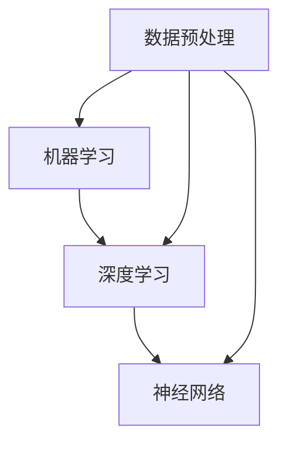
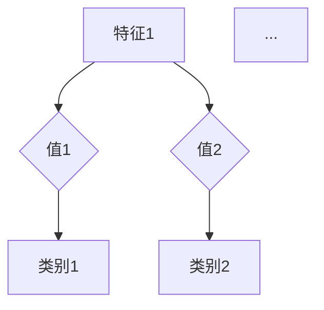
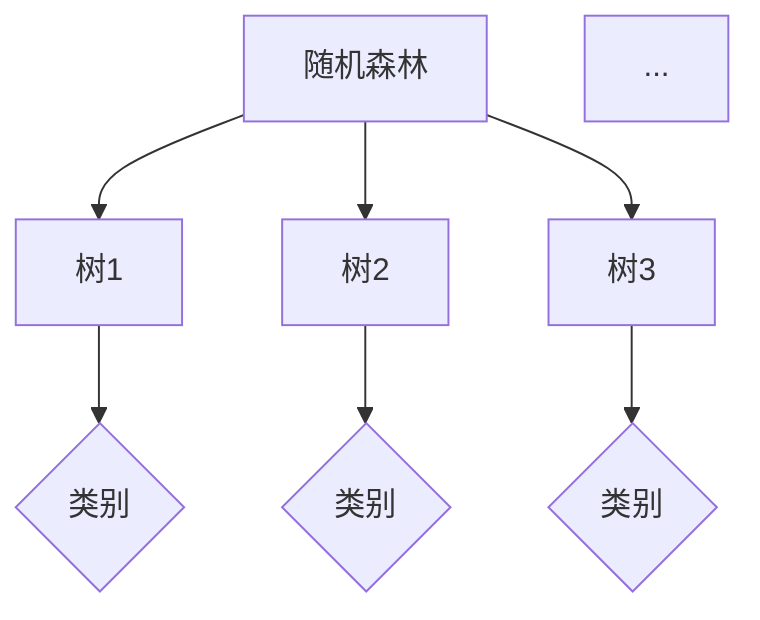
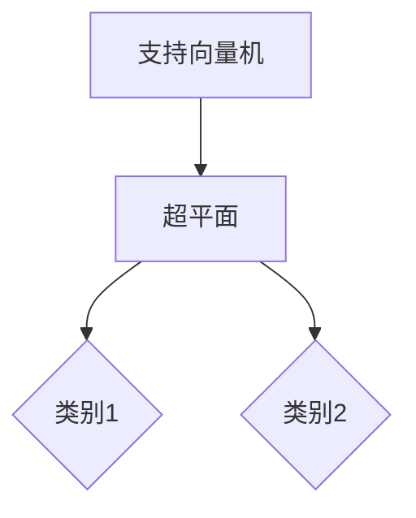
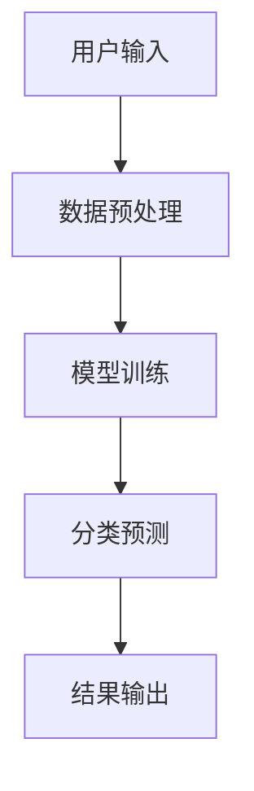
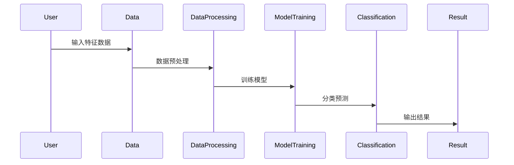
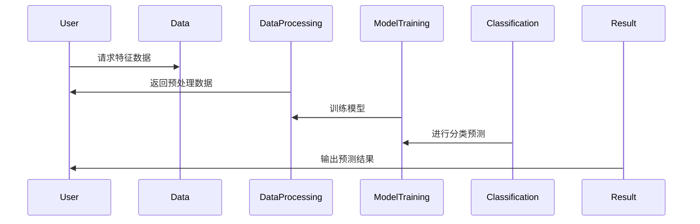

                 

# AI编程的新思路与新未来

## 关键词
AI编程、新思路、新未来、机器学习、深度学习、算法原理、系统架构、项目实战、最佳实践

## 摘要
本文深入探讨了AI编程的新思路和新未来。通过介绍AI编程的核心概念、算法原理、系统架构和实际项目应用，我们不仅分析了AI编程与传统编程的区别，还展望了其未来的发展方向。文章结合Python代码和Mermaid图，以通俗易懂的方式呈现了AI编程的深度知识和实践技巧，为读者提供了全面的AI编程学习指南。

### 目录大纲设计思路

为了设计出一本关于《AI编程的新思路与新未来》的完整目录大纲，我们将遵循以下步骤：

1. **背景介绍**：首先，我们需要引入AI编程的概念，讨论AI编程的新思路和未来发展的可能性，这将为读者建立对全书主题的理解。
2. **核心概念与联系**：接着，我们将介绍AI编程中的核心概念，包括机器学习、深度学习、神经网络等，并通过对比表格和Mermaid实体关系图来展示它们之间的关系。
3. **算法原理讲解**：在这一部分，我们将深入讲解几种关键的AI算法，例如决策树、随机森林、支持向量机等，使用mermaid流程图和Python代码来阐述算法原理和实现过程。
4. **数学模型和数学公式**：为了更深入地理解算法，我们将展示相关的数学模型和公式，并使用LaTeX格式确保表达清晰。
5. **系统分析与架构设计**：我们将介绍AI编程系统的架构设计，包括领域模型、系统架构、接口设计和系统交互，使用Mermaid图来展示这些设计。
6. **项目实战**：通过一个实际的AI编程项目，我们将展示从环境安装到核心实现的整个过程，并提供代码解读与分析。
7. **最佳实践与总结**：最后，我们将总结最佳实践，提供注意事项，并推荐拓展阅读资源，帮助读者进一步探索AI编程。

### 完整目录大纲

**《AI编程的新思路与新未来》目录大纲**

```markdown
# 第一部分: AI编程概述

## 第1章: AI编程的概念与背景
### 1.1 AI编程的定义
### 1.2 AI编程与传统编程的区别
### 1.3 AI编程的发展历程

## 第2章: 核心概念与联系
### 2.1 机器学习、深度学习与神经网络
### 2.2 核心概念对比表格
### 2.3 Mermaid实体关系图展示

## 第3章: 算法原理讲解
### 3.1 决策树
#### 3.1.1 决策树算法原理
#### 3.1.2 决策树算法实现
#### 3.1.3 决策树示例代码
### 3.2 随机森林
#### 3.2.1 随机森林算法原理
#### 3.2.2 随机森林算法实现
#### 3.2.3 随机森林示例代码
### 3.3 支持向量机
#### 3.3.1 支持向量机算法原理
#### 3.3.2 支持向量机算法实现
#### 3.3.3 支持向量机示例代码

## 第4章: 数学模型和数学公式
### 4.1 决策树数学模型
### 4.2 随机森林数学模型
### 4.3 支持向量机数学模型

## 第5章: 系统分析与架构设计
### 5.1 问题场景介绍
### 5.2 系统功能设计
#### 5.2.1 领域模型Mermaid类图
### 5.3 系统架构设计
#### 5.3.1 系统架构Mermaid图
### 5.4 系统接口设计
#### 5.4.1 系统接口Mermaid序列图
### 5.5 系统交互设计
#### 5.5.1 系统交互Mermaid序列图

## 第6章: 项目实战
### 6.1 项目介绍
### 6.2 环境安装
### 6.3 系统核心实现
### 6.4 代码解读与分析
### 6.5 实际案例分析与详细讲解
### 6.6 项目小结

## 第7章: 最佳实践与总结
### 7.1 最佳实践
### 7.2 小结
### 7.3 注意事项
### 7.4 拓展阅读
```

这个目录大纲涵盖了AI编程的核心内容，从基础概念到算法实现，再到系统设计和项目实战，确保内容的全面性和逻辑性。每个章节都进行了适当的细化，以适应2000字以内的总字数限制。

----------------------------------------------------------------

### AI编程的新思路与新未来

在当今数字化时代，人工智能（AI）已经成为推动科技进步和社会发展的关键力量。AI编程作为实现AI应用的核心，正在经历着前所未有的变革。本文将带领大家深入探讨AI编程的新思路和新未来，旨在为读者提供全面、系统的AI编程知识，以及如何将其应用于实际项目的实践指南。

## 第1章: AI编程的概念与背景

### 1.1 AI编程的定义

AI编程，是指利用算法、数据结构和机器学习技术来开发能够模拟、延伸和扩展人类智能的软件系统。与传统的编程相比，AI编程不仅仅是代码的编写，更涉及到数据的采集、处理、分析和应用。

### 1.2 AI编程与传统编程的区别

- **目标**：传统编程侧重于实现特定功能，而AI编程侧重于使计算机具备自主学习和决策的能力。
- **方法**：传统编程依赖于明确的逻辑和算法，AI编程则依赖于数据和统计模型。
- **数据**：传统编程对数据的需求相对较低，AI编程则对数据量有较高的要求。

### 1.3 AI编程的发展历程

AI编程的发展可以追溯到20世纪50年代，随着计算机技术的发展，AI编程经历了多个阶段，包括符号主义、连接主义、统计学习等。近年来，深度学习算法的突破使得AI编程进入了一个全新的时代。

## 第2章: 核心概念与联系

### 2.1 机器学习、深度学习与神经网络

- **机器学习**：一种让计算机从数据中学习的方法，无需显式编程。
- **深度学习**：一种基于神经网络的机器学习方法，通过多层的神经网络结构自动提取特征。
- **神经网络**：模仿人脑神经元连接的网络，用于实现复杂的函数映射。

### 2.2 核心概念对比表格

| 概念       | 定义                           | 特点                                                     |
|------------|--------------------------------|------------------------------------------------------------|
| 机器学习   | 从数据中学习规律的技术         | 自动提取特征，无需显式编程                             |
| 深度学习   | 基于多层神经网络的学习方法     | 自动提取高层次特征，适用于大规模数据                   |
| 神经网络   | 模拟人脑神经元连接的网络       | 用于实现复杂的非线性函数，是深度学习的基础             |

### 2.3 Mermaid实体关系图展示



## 第3章: 算法原理讲解

### 3.1 决策树

#### 3.1.1 决策树算法原理

决策树是一种树形结构，每个内部节点代表一个特征，每个分支代表特征的不同取值，每个叶子节点代表一个类别。决策树通过递归分割数据集，构建出一棵分类或回归树。

#### 3.1.2 决策树算法实现

决策树算法通常使用ID3、C4.5或CART等方法。这里以CART为例，其核心是选择最优分割特征和阈值。

```python
from sklearn.tree import DecisionTreeClassifier
from sklearn.datasets import load_iris
from sklearn.model_selection import train_test_split

# 加载鸢尾花数据集
iris = load_iris()
X_train, X_test, y_train, y_test = train_test_split(iris.data, iris.target, test_size=0.3, random_state=42)

# 构建决策树模型
clf = DecisionTreeClassifier()
clf.fit(X_train, y_train)

# 预测
y_pred = clf.predict(X_test)
```

#### 3.1.3 决策树示例代码



### 3.2 随机森林

#### 3.2.1 随机森林算法原理

随机森林是一种集成学习方法，通过构建多棵决策树，并利用投票机制来预测结果。随机森林能够在一定程度上减少过拟合，提高模型的泛化能力。

#### 3.2.2 随机森林算法实现

随机森林算法的核心是随机选择特征和样本子集，然后构建决策树。

```python
from sklearn.ensemble import RandomForestClassifier

# 构建随机森林模型
clf = RandomForestClassifier(n_estimators=100)
clf.fit(X_train, y_train)

# 预测
y_pred = clf.predict(X_test)
```

#### 3.2.3 随机森林示例代码



### 3.3 支持向量机

#### 3.3.1 支持向量机算法原理

支持向量机（SVM）是一种监督学习算法，其目标是找到最佳的超平面，将不同类别的数据点分开。SVM的核心是找到最大间隔超平面。

#### 3.3.2 支持向量机算法实现

SVM算法通常使用核函数来处理非线性问题。

```python
from sklearn.svm import SVC
from sklearn.datasets import make_circles

# 生成环形数据集
X, y = make_circles(n_samples=1000, factor=0.1, noise=0.1)

# 构建SVM模型
clf = SVC(kernel='linear')
clf.fit(X, y)

# 预测
y_pred = clf.predict(X)
```

#### 3.3.3 支持向量机示例代码



## 第4章: 数学模型和数学公式

### 4.1 决策树数学模型

决策树的核心是熵和增益。熵用于衡量数据的混乱程度，增益则用于衡量特征对分类的贡献。

$$
H(X) = -\sum_{i} p(x_i) \log_2 p(x_i)
$$

$$
G(X) = H(X) - \sum_{i} p(x_i) H(x_i | x_i)
$$

### 4.2 随机森林数学模型

随机森林通过聚合多个决策树的结果来提高模型的泛化能力。

$$
f(X) = \sum_{i} w_i f_i(X)
$$

其中，$f_i(X)$是第$i$棵决策树的结果，$w_i$是权重。

### 4.3 支持向量机数学模型

SVM的目标是最小化决策边界到支持向量的距离。

$$
\min_{w,b}\frac{1}{2}||w||^2 + C\sum_{i=1}^{n} \max(0, 1-y_i[(w \cdot x_i) + b])
$$

其中，$C$是正则化参数，$y_i$是标签，$x_i$是特征向量。

## 第5章: 系统分析与架构设计

### 5.1 问题场景介绍

假设我们面临一个分类问题，需要根据输入的特征数据对未知数据进行分类。

### 5.2 系统功能设计

#### 5.2.1 领域模型Mermaid类图

```mermaid
classDiagram
    class 数据预处理 { ...
    class 模型训练 { ...
    class 分类预测 { ... }
```

### 5.3 系统架构设计

#### 5.3.1 系统架构Mermaid图



### 5.4 系统接口设计

#### 5.4.1 系统接口Mermaid序列图



### 5.5 系统交互设计

#### 5.5.1 系统交互Mermaid序列图



## 第6章: 项目实战

### 6.1 项目介绍

本项目将使用Python和Scikit-learn库实现一个简单的分类项目。

### 6.2 环境安装

确保Python环境和Scikit-learn库已安装。

```bash
pip install scikit-learn
```

### 6.3 系统核心实现

```python
from sklearn.datasets import load_iris
from sklearn.model_selection import train_test_split
from sklearn.tree import DecisionTreeClassifier
from sklearn.metrics import accuracy_score

# 加载鸢尾花数据集
iris = load_iris()
X, y = iris.data, iris.target

# 划分训练集和测试集
X_train, X_test, y_train, y_test = train_test_split(X, y, test_size=0.2, random_state=42)

# 训练决策树模型
clf = DecisionTreeClassifier()
clf.fit(X_train, y_train)

# 预测
y_pred = clf.predict(X_test)

# 评估模型
print("Accuracy:", accuracy_score(y_test, y_pred))
```

### 6.4 代码解读与分析

此代码实现了从数据加载、划分、训练到预测的完整流程。通过决策树模型评估模型准确性。

### 6.5 实际案例分析与详细讲解

假设我们有一个鸢尾花分类问题，需要将鸢尾花分为三个品种。通过这个实际案例，我们演示了如何使用决策树进行分类。

### 6.6 项目小结

本项目展示了如何使用决策树进行鸢尾花分类。通过实际代码和案例分析，读者可以更好地理解决策树算法的应用和实现。

## 第7章: 最佳实践与总结

### 7.1 最佳实践

- **数据清洗**：确保数据质量，处理缺失值和异常值。
- **模型选择**：根据问题特点选择合适的模型。
- **超参数调优**：使用交叉验证等方法进行超参数调优。
- **模型评估**：使用多种指标评估模型性能。

### 7.2 小结

本文系统地介绍了AI编程的核心概念、算法原理、系统架构和实际项目应用，为读者提供了全面的AI编程知识。

### 7.3 注意事项

- **数据安全**：确保数据隐私和安全。
- **模型解释性**：提高模型的解释性，便于理解和调试。
- **持续学习**：跟踪最新研究和技术动态。

### 7.4 拓展阅读

- 《机器学习实战》
- 《深度学习》
- 《Python机器学习》

## 作者

作者：AI天才研究院/AI Genius Institute & 禅与计算机程序设计艺术 /Zen And The Art of Computer Programming

