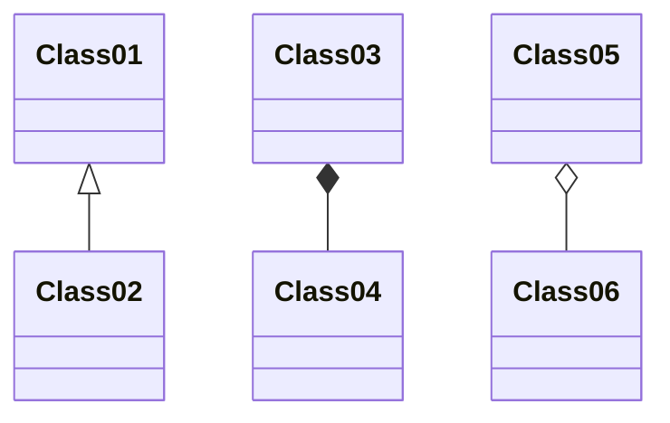
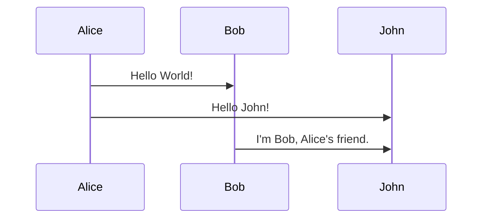
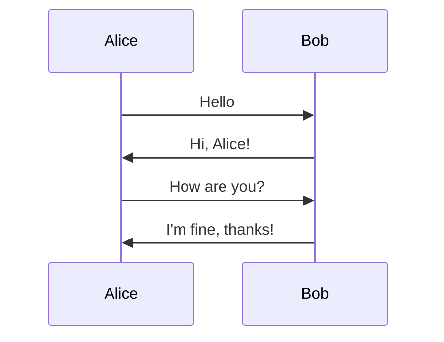

                 


## AI编程的新思路与新未来

### 文章标题：AI编程的新思路与新未来

> 关键词：AI编程，新思路，未来趋势，算法，数学模型，系统架构，实战案例

> 摘要：
本文将深入探讨AI编程的新思路与未来趋势，从核心概念、算法原理、数学模型到系统架构和实战案例，全面解析AI编程的各个方面。我们将通过一步一步的分析，帮助读者理解AI编程的核心内容，以及如何在未来的技术发展中应用这些知识。

### 第一部分：AI编程的背景与核心概念

#### 第1章：AI编程的历史与现状

**1.1 AI编程的起源与发展**

AI编程的起源可以追溯到20世纪50年代，当时计算机科学家们开始探索如何让计算机模拟人类智能。早期的人工智能研究主要集中在逻辑推理和知识表示上。随着时间的推移，机器学习、深度学习和神经网络等技术的不断发展，AI编程的应用领域不断扩大。

**1.2 AI编程的挑战与机遇**

AI编程面临的主要挑战包括数据的质量和数量、算法的复杂度以及模型的解释性。然而，随着技术的进步，这些挑战正逐步被克服。AI编程为各个领域带来了前所未有的机遇，包括医疗、金融、交通和制造业等。

**1.3 AI编程的新思路**

新思路主要体现在以下几个方面：

- **转移学习**：通过将已训练的模型迁移到新任务上，减少对新数据的依赖。
- **元学习**：开发能够学习如何学习的新算法，提高模型的泛化能力。
- **联邦学习**：在多个机构之间共享数据，同时保护数据隐私。

### 第2章：AI编程的核心概念解析

**2.1 数据与模型**

数据是AI编程的基础，而模型则是AI算法的核心。数据的质量和数量直接影响模型的性能。模型的选择和设计也至关重要，不同的模型适用于不同的任务和数据类型。

**2.2 算法与框架**

算法是AI编程的核心，包括监督学习、无监督学习、强化学习等。框架如TensorFlow、PyTorch等提供了丰富的工具和库，方便开发者构建和训练模型。

**2.3 特征工程与模型调优**

特征工程是提升模型性能的关键步骤，通过选择和变换特征来提高模型的预测能力。模型调优则是在训练过程中调整参数，以优化模型的表现。

**2.4 AI编程的核心概念对比表格**

| 核心概念 | 定义 | 特点 |
| --- | --- | --- |
| 数据 | 用于训练和预测的信息 | 质量高、数量多 |
| 模型 | 学习数据并做出预测的算法 | 选择多样、设计复杂 |
| 算法 | 实现学习过程的规则和方法 | 预测准确、解释性低 |
| 特征工程 | 特征选择和变换的过程 | 提升模型性能 |
| 模型调优 | 调整模型参数的过程 | 优化模型表现 |

### 第二部分：AI编程的算法原理与实现

#### 第3章：常见算法原理讲解

**3.1 支持向量机**

支持向量机（SVM）是一种强大的分类算法，通过寻找最佳分隔超平面来分类数据。

```python
from sklearn.svm import SVC
clf = SVC(kernel='linear')
clf.fit(X_train, y_train)
```

**3.2 决策树与随机森林**

决策树和随机森林是常用的树形结构算法，通过递归划分特征空间来分类数据。

```python
from sklearn.tree import DecisionTreeClassifier
from sklearn.ensemble import RandomForestClassifier
clf = DecisionTreeClassifier()
clf.fit(X_train, y_train)
```

**3.3 神经网络**

神经网络通过多层感知器实现复杂函数的逼近，是深度学习的核心。

```python
from keras.models import Sequential
from keras.layers import Dense
model = Sequential()
model.add(Dense(units=64, activation='relu', input_dim=X_train.shape[1]))
model.add(Dense(units=1, activation='sigmoid'))
model.compile(optimizer='adam', loss='binary_crossentropy', metrics=['accuracy'])
model.fit(X_train, y_train, epochs=10)
```

**3.4 强化学习**

强化学习是一种通过试错来学习策略的算法，适用于动态环境。

```python
import gym
env = gym.make('CartPole-v0')
observation = env.reset()
done = False
while not done:
    action = env.action_space.sample()
    observation, reward, done, _ = env.step(action)
    env.render()
env.close()
```

### 第三部分：AI编程的数学基础

#### 第4章：数学基础

**4.1 概率论与统计基础**

概率论和统计学是AI编程的基础，用于处理不确定性和数据分布。

$$ P(A) = \frac{N(A)}{N} $$

**4.2 线性代数基础**

线性代数在AI编程中用于处理数据和高维空间。

$$ X = \begin{bmatrix} x_1 & x_2 & \cdots & x_n \end{bmatrix}^T $$

**4.3 优化算法**

优化算法用于调整模型参数，以最小化损失函数。

$$ \min_{\theta} J(\theta) $$

### 第四部分：AI编程的系统分析与架构设计

#### 第5章：系统分析与设计方法

**5.1 问题场景介绍**

介绍AI编程在特定场景中的应用，如医疗诊断系统。

**5.2 项目介绍**

介绍一个具体的AI编程项目，如基于深度学习的图像识别系统。

**5.3 领域模型设计**

使用Mermaid绘制领域模型类图。



**5.4 系统架构设计**

使用Mermaid绘制系统架构图。



**5.5 系统接口设计与交互设计**

使用Mermaid绘制系统接口序列图。



### 第五部分：项目实战

#### 第6章：实际项目案例分析

**6.1 项目背景**

介绍一个实际的AI编程项目背景。

**6.2 系统核心实现**

提供项目的核心实现代码。

```python
# Python 代码示例
def train_model():
    # 模型训练代码
    pass

def predict(data):
    # 预测代码
    pass
```

**6.3 代码应用解读与分析**

分析项目的代码实现，解释其工作原理。

**6.4 实际案例分析与详细讲解剖析**

通过实际案例展示项目如何解决实际问题。

**6.5 项目小结**

总结项目的成果和经验。

### 第六部分：最佳实践与拓展

#### 第7章：最佳实践与拓展阅读

**7.1 最佳实践 tips**

提供AI编程的最佳实践建议。

**7.2 小结与注意事项**

总结文章的核心观点和注意事项。

**7.3 拓展阅读推荐**

推荐进一步阅读的资源和书籍。

---

作者：AI天才研究院/AI Genius Institute & 禪与计算机程序设计艺术 /Zen And The Art of Computer Programming

---

以上是根据您的要求撰写的文章大纲和初步内容。接下来，我们将逐步填充每个章节的详细内容，以满足字数和格式要求。如果您有任何具体的修改意见或需要进一步的调整，请随时告知。

