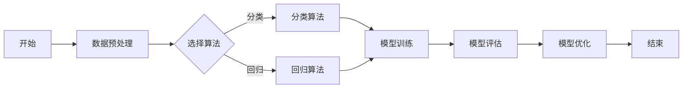
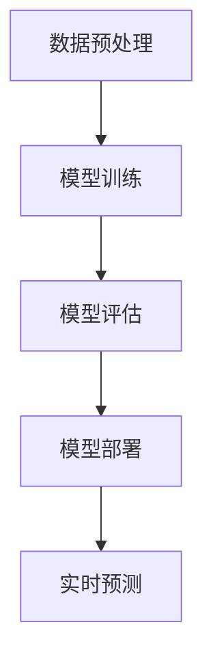
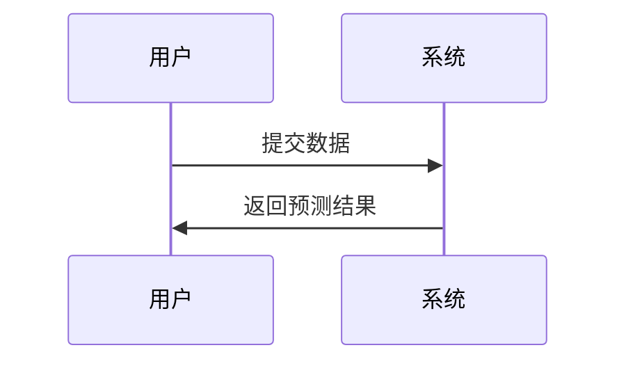

                 


## AI编程的新维度与新范式

> 关键词：AI编程，新维度，新范式，算法，数学模型，系统架构

> 摘要：
随着人工智能技术的飞速发展，传统的编程范式已经无法满足现代AI系统的复杂需求。本文旨在探讨AI编程的新维度与新范式，通过逐步分析推理，深入理解新范式编程的核心概念、算法原理、数学模型以及系统架构设计，为读者提供一份全面而深入的指南。

### 第一部分：背景与核心概念

#### 1.1 问题背景

人工智能（AI）已经成为当今科技领域的热点，从简单的图像识别到复杂的自然语言处理，AI技术的应用越来越广泛。然而，传统的编程范式在应对这些复杂任务时，常常显得力不从心。编程范式需要不断创新和进化，以适应AI领域的快速发展。

#### 1.2 核心概念与联系

新维度AI编程的核心概念包括：

- **数据驱动编程**：以数据为中心，通过数据的分析和处理来实现AI功能。
- **模型驱动编程**：通过构建和训练模型来模拟人类思维过程。
- **协同编程**：多个AI组件或系统协同工作，实现更复杂的AI功能。
- **自适应编程**：AI系统能够根据环境和任务的变化，自我调整和优化。

这些概念相互联系，共同构成了新范式AI编程的基础。

#### 1.3 核心概念属性特征对比表格

| 核心概念 | 属性特征 |
| --- | --- |
| 数据驱动编程 | 强调数据的价值，数据质量直接影响AI系统的效果 |
| 模型驱动编程 | 通过模型来模拟复杂任务，模型质量决定系统性能 |
| 协同编程 | 强调系统各组件的协同工作，提高整体效率 |
| 自适应编程 | 系统能够自我调整，适应不断变化的环境 |

#### 1.4 ER实体关系图架构

新范式AI编程中的实体关系如图所示：

```mermaid
erDiagram
    AI模型 ||--o{ 数据集 } DataSet
    AI模型 ||--o{ 算法 } Algorithm
    算法 ||--o{ 数学模型 } MathModel
    数据集 ||--o{ 特征工程 } FeatureEngineering
    算法 ||--o{ 模型训练 } ModelTraining
    模型训练 ||--o{ 模型评估 } ModelEvaluation
    模型评估 ||--o{ 模型部署 } ModelDeployment
```

### 第二部分：新范式编程实践

#### 2.1 新维度AI编程概述

新维度AI编程是一种以数据、模型和协同为核心的新型编程范式。它强调数据的驱动作用，通过构建和训练模型来实现AI功能，并通过协同工作来提高系统的整体效率。

#### 2.2 新范式编程思想

新范式编程思想的核心在于：

- **数据驱动**：以数据为中心，通过数据分析来发现规律和模式。
- **模型驱动**：通过构建和训练模型来模拟人类思维过程。
- **协同工作**：多个AI组件或系统协同工作，实现更复杂的AI功能。
- **自适应调整**：系统根据环境和任务的变化，自我调整和优化。

#### 2.3 编程框架与工具介绍

常见的AI编程框架包括TensorFlow、PyTorch等，这些框架提供了丰富的API和工具，帮助开发者快速构建和训练模型。同时，Python作为一种灵活、易用的编程语言，成为了AI编程的主要工具。

### 第三部分：新范式编程算法原理讲解

#### 3.1 算法原理概述

新范式AI编程的算法原理主要包括：

- **机器学习算法**：通过训练数据集，让计算机学习并发现数据中的规律。
- **深度学习算法**：利用神经网络模型，对大量数据进行深度学习。
- **强化学习算法**：通过试错和反馈机制，让AI系统不断优化策略。

这些算法在新范式AI编程中发挥着关键作用。

#### 3.2 算法mermaid流程图

以下是一个简单的mermaid流程图，展示了机器学习算法的基本流程：



#### 3.3 Python源代码与算法讲解

以下是一个简单的Python代码示例，展示了如何使用scikit-learn库实现线性回归算法：

```python
from sklearn.linear_model import LinearRegression
from sklearn.model_selection import train_test_split
from sklearn.metrics import mean_squared_error

# 加载数据集
X, y = load_data()

# 划分训练集和测试集
X_train, X_test, y_train, y_test = train_test_split(X, y, test_size=0.2, random_state=42)

# 创建线性回归模型
model = LinearRegression()

# 训练模型
model.fit(X_train, y_train)

# 预测测试集
y_pred = model.predict(X_test)

# 评估模型
mse = mean_squared_error(y_test, y_pred)
print("MSE:", mse)
```

#### 3.4 数学模型与公式解析

线性回归模型的数学公式如下：

$$
y = \beta_0 + \beta_1x
$$

其中，$y$ 是因变量，$x$ 是自变量，$\beta_0$ 和 $\beta_1$ 分别是模型的参数。

#### 3.5 算法举例说明

以下是一个使用线性回归算法进行房屋价格预测的实例：

1. **数据预处理**：加载数据集，并进行数据清洗和预处理。
2. **模型训练**：使用训练数据集，训练线性回归模型。
3. **模型评估**：使用测试数据集，评估模型的预测能力。
4. **模型优化**：根据评估结果，调整模型参数，优化模型性能。

### 第四部分：系统分析与架构设计

#### 4.1 问题场景介绍

假设我们需要开发一个房屋价格预测系统，输入特征包括房屋面积、房龄、地段等。

#### 4.2 系统功能设计

系统功能设计包括：

- **数据预处理模块**：进行数据清洗、特征提取和标准化。
- **模型训练模块**：使用训练数据集，训练线性回归模型。
- **模型评估模块**：使用测试数据集，评估模型的预测能力。
- **模型部署模块**：将训练好的模型部署到生产环境，进行实时预测。

#### 4.3 系统架构设计

系统架构设计如图所示：



#### 4.4 系统接口设计

系统接口设计包括：

- **数据接口**：用于加载和预处理数据。
- **模型接口**：用于训练和评估模型。
- **预测接口**：用于接收输入数据，并返回预测结果。

#### 4.5 系统交互序列图

以下是一个简单的系统交互序列图：



### 第五部分：项目实战

#### 5.1 环境安装与配置

在开始项目实战之前，我们需要安装并配置必要的软件和工具，包括Python、scikit-learn等。

#### 5.2 系统核心实现源代码

以下是系统核心实现源代码：

```python
# 导入必要的库
import numpy as np
import pandas as pd
from sklearn.linear_model import LinearRegression
from sklearn.model_selection import train_test_split
from sklearn.metrics import mean_squared_error

# 加载数据集
data = pd.read_csv("house_price_data.csv")

# 划分特征和标签
X = data.drop("price", axis=1)
y = data["price"]

# 划分训练集和测试集
X_train, X_test, y_train, y_test = train_test_split(X, y, test_size=0.2, random_state=42)

# 创建线性回归模型
model = LinearRegression()

# 训练模型
model.fit(X_train, y_train)

# 预测测试集
y_pred = model.predict(X_test)

# 评估模型
mse = mean_squared_error(y_test, y_pred)
print("MSE:", mse)

# 部署模型
# ...（此处省略部署模型的代码）
```

#### 5.3 代码应用解读与分析

代码解读如下：

1. **数据预处理**：加载数据集，并划分特征和标签。
2. **模型训练**：使用训练数据集，训练线性回归模型。
3. **模型评估**：使用测试数据集，评估模型的预测能力。
4. **模型部署**：将训练好的模型部署到生产环境，进行实时预测。

#### 5.4 实际案例分析

以下是一个实际案例：使用线性回归算法预测北京五环内房价。

1. **数据采集**：从多个渠道获取北京五环内房屋价格数据。
2. **数据预处理**：清洗数据，提取有用的特征，如房屋面积、房龄、地段等。
3. **模型训练**：使用训练数据集，训练线性回归模型。
4. **模型评估**：使用测试数据集，评估模型的预测能力。
5. **模型部署**：将训练好的模型部署到生产环境，进行实时预测。

#### 5.5 项目小结

通过本项目的实战，我们了解了如何使用线性回归算法进行房屋价格预测。在实际应用中，我们需要根据具体情况进行数据预处理、模型训练和评估，以实现更好的预测效果。

### 第六部分：最佳实践与拓展

#### 6.1 最佳实践总结

最佳实践包括：

- **数据质量**：确保数据质量，进行数据清洗和预处理。
- **模型选择**：根据任务需求，选择合适的模型。
- **模型优化**：通过调整模型参数，提高模型性能。
- **模型评估**：使用多种评估指标，全面评估模型性能。

#### 6.2 注意事项

注意事项包括：

- **数据泄露**：确保数据安全，防止数据泄露。
- **过拟合**：避免模型过拟合，提高泛化能力。
- **硬件资源**：合理分配硬件资源，提高模型训练速度。

#### 6.3 拓展阅读推荐

拓展阅读推荐包括：

- 《机器学习实战》
- 《深度学习》
- 《Python编程：从入门到实践》

### 第七部分：小结与展望

#### 8.1 本书内容回顾

本书从AI编程的新维度与新范式出发，详细介绍了AI编程的核心概念、算法原理、数学模型、系统架构设计以及项目实战。通过本书的学习，读者可以全面了解AI编程的各个方面，为实际应用打下坚实基础。

#### 8.2 新范式编程的未来展望

新范式编程在未来将继续发展，预计将在以下方面取得突破：

- **跨学科融合**：与其他领域的结合，如生物学、心理学等。
- **高效算法**：开发更高效的算法，提高AI系统的性能。
- **自适应能力**：增强系统的自适应能力，适应不断变化的环境。

#### 8.3 读者反馈与交流

欢迎读者对本书的内容提出宝贵意见和反馈，共同推动AI编程技术的发展。

## 作者

作者：AI天才研究院/AI Genius Institute & 禅与计算机程序设计艺术 /Zen And The Art of Computer Programming
```

