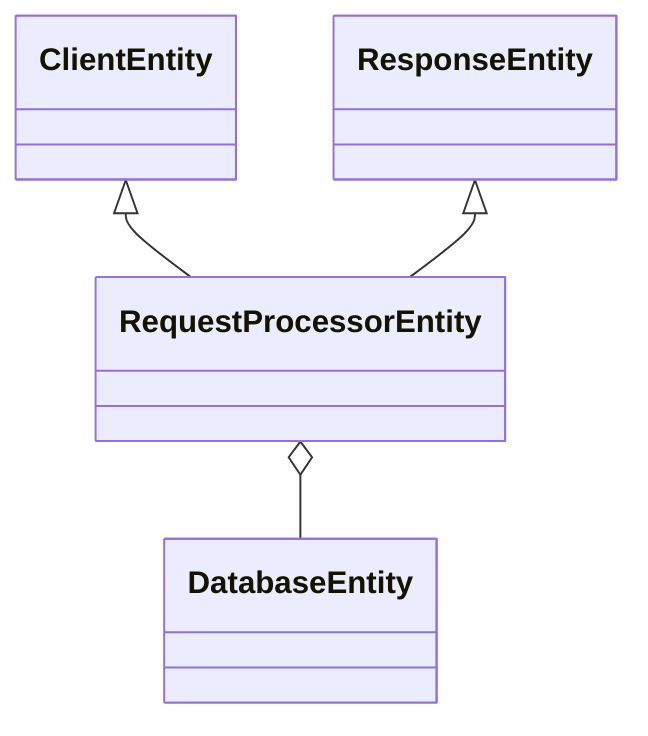
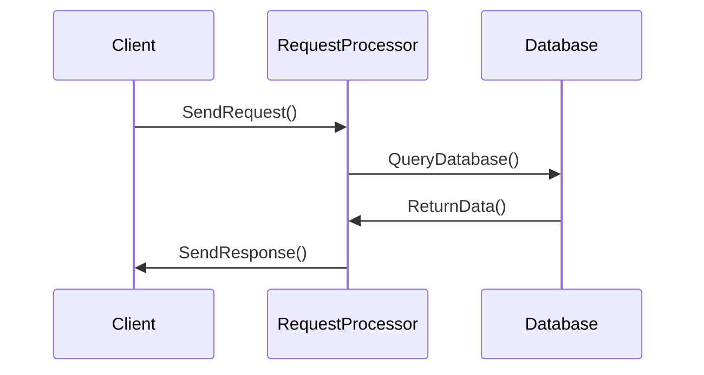

                 


### AI编程的新维度与新领域

关键词：人工智能编程、新维度、新领域、强化学习、自然语言处理、计算机视觉、伦理与法律

摘要：本文将探讨人工智能编程的新维度与新领域，通过对强化学习、自然语言处理和计算机视觉等前沿技术的深入分析，揭示其在AI编程中的应用价值和发展趋势。同时，还将讨论人工智能伦理与法律问题，以期为读者提供全面、系统的AI编程知识体系。

## 第一部分: AI编程的背景与核心概念

### 1.1 AI编程的崛起

#### 1.1.1 AI编程的兴起

人工智能（AI）作为计算机科学的前沿领域，其发展历程可以追溯到20世纪50年代。随着计算能力的提升、大数据技术的进步以及深度学习算法的突破，人工智能从理论走向实践，逐渐渗透到各行各业。AI编程作为人工智能的核心环节，应运而生。

#### 1.1.2 AI编程的重要性

AI编程不仅是实现人工智能的基础，更是推动人工智能应用创新的关键。在自动驾驶、智能医疗、金融科技等领域，AI编程技术发挥着至关重要的作用。掌握AI编程技能，对于开发人员而言，意味着能够抓住未来科技发展的机遇，创造更多价值。

#### 1.1.3 AI编程的发展趋势

随着AI技术的不断演进，AI编程的发展趋势也愈发明显。一方面，开源生态的蓬勃发展，使得AI编程变得更加便捷和高效；另一方面，边缘计算、物联网等新兴技术的兴起，为AI编程带来了新的应用场景和挑战。

### 1.2 AI编程的核心概念

#### 1.2.1 机器学习基础

机器学习是AI编程的核心技术之一。它通过算法让计算机从数据中自动学习和获取知识，从而实现智能决策。机器学习主要包括监督学习、无监督学习和强化学习等。

#### 1.2.2 深度学习简介

深度学习是机器学习的一个重要分支，其核心思想是通过多层神经网络对数据进行特征提取和分类。深度学习在图像识别、语音识别等领域取得了显著成果。

#### 1.2.3 数据分析与挖掘

数据是人工智能的基石。数据分析与挖掘技术能够从海量数据中提取有价值的信息，为AI编程提供数据支持。常见的分析方法包括统计模型、聚类分析和关联规则挖掘等。

### 1.3 编程语言与工具

#### 1.3.1 常见AI编程语言

Python、Java和C++等编程语言在AI编程中广泛应用。Python以其简洁的语法和丰富的库资源，成为AI编程的首选语言。Java和C++则因其高性能和跨平台特性，在工业级应用中占据重要地位。

#### 1.3.2 AI编程框架与库

TensorFlow、PyTorch、Keras等是当前主流的AI编程框架。这些框架提供了丰富的API和工具，简化了AI模型的训练和部署过程。

#### 1.3.3 开发环境搭建

搭建一个高效的AI编程环境，需要安装Python、Jupyter Notebook、Anaconda等工具。同时，还需要配置GPU加速器和深度学习框架，以满足大规模数据处理和模型训练的需求。

### 1.4 本章小结

本章节主要介绍了AI编程的背景、核心概念和编程语言与工具。通过对AI编程的兴起、发展趋势以及核心技术的深入探讨，读者可以更好地理解AI编程的重要性和应用场景。下一章将重点介绍AI编程的新维度，包括强化学习、自然语言处理和计算机视觉等技术。

## 第二部分: AI编程的新维度

### 2.1 强化学习

#### 2.1.1 强化学习基础

强化学习是一种基于反馈的机器学习方法，通过智能体与环境的交互来学习最优策略。强化学习的基本概念包括智能体（Agent）、环境（Environment）、状态（State）、动作（Action）和奖励（Reward）。

#### 2.1.2 强化学习的特点与应用

强化学习的特点在于其自适应性和灵活性，能够处理复杂的环境和决策问题。它在自动驾驶、游戏AI、机器人控制等领域具有广泛的应用。

#### 2.1.3 强化学习模型

强化学习模型主要包括值函数模型和策略模型。值函数模型通过预测未来奖励来选择动作，而策略模型直接学习最优动作序列。

### 2.2 Q-Learning算法

#### 2.2.1 Q-Learning算法原理

Q-Learning是一种值函数模型，通过迭代更新Q值来学习最优策略。其基本原理是：在给定当前状态和动作的情况下，选择使得未来奖励最大的动作。

#### 2.2.2 Q-Learning算法的推导

Q-Learning算法的推导基于马尔可夫决策过程（MDP）。通过迭代更新Q值，使得智能体能够在长期内获得最大总奖励。

#### 2.2.3 Q-Learning算法的应用示例

以自动驾驶为例，Q-Learning算法可以用于学习最佳驾驶策略，从而实现自动驾驶汽车的安全驾驶。

### 2.3 深度强化学习

#### 2.3.1 深度Q网络（DQN）

深度Q网络（DQN）是一种结合了深度学习和强化学习的模型。它通过神经网络来近似Q值函数，从而提高学习效率和准确性。

#### 2.3.2 策略梯度算法

策略梯度算法通过优化策略参数来学习最优策略。它适用于那些状态和动作空间较大的问题，如游戏AI。

#### 2.3.3 模型可解释性

深度强化学习模型的可解释性是一个重要问题。通过可视化和分析模型内部的神经网络，可以揭示智能体的决策过程。

### 2.4 本章小结

本章节介绍了强化学习的基本概念、Q-Learning算法以及深度强化学习技术。强化学习作为一种基于反馈的机器学习方法，在自动驾驶、游戏AI等领域具有重要应用价值。下一章将探讨聚类与降维技术，以及其在数据分析和特征提取中的应用。

### 2.5 聚类与降维

#### 2.5.1 聚类算法

聚类是一种无监督学习方法，用于将相似的数据点归为一类。常见的聚类算法包括K-means、层次聚类和密度聚类等。

##### K-means算法

K-means算法通过迭代计算均值来划分数据点，是一种简单的聚类算法。它的优点是计算速度快，缺点是对初始聚类中心敏感。

##### 层次聚类

层次聚类通过逐步合并或分裂聚类簇来构建聚类层次结构。它适用于处理大规模数据集，但计算复杂度较高。

##### 密度聚类

密度聚类通过计算数据点的密度来识别聚类簇。它适用于高维数据集，能够发现复杂的聚类结构。

#### 2.5.2 降维技术

降维是一种数据预处理技术，用于减少数据维度，提高数据分析和模型的效率。常见的降维技术包括主成分分析（PCA）、t-SNE算法和自动编码器等。

##### 主成分分析（PCA）

主成分分析是一种线性降维技术，通过计算数据的主要成分来保留数据的方差和特性。

##### t-SNE算法

t-SNE算法是一种非线性降维技术，通过计算数据点间的相似度来降低维度。它适用于高维数据的可视化。

##### 自动编码器

自动编码器是一种基于神经网络的降维技术，通过无监督学习来重建输入数据，从而提取数据的主要特征。

#### 2.5.3 聚类与降维的应用

聚类与降维在数据分析和特征提取中有着广泛的应用。

##### 数据预处理

聚类和降维可以用于数据预处理，以减少数据冗余和噪声，提高模型训练效果。

##### 特征选择

聚类和降维可以用于特征选择，通过识别数据的最重要的特征，提高模型的预测性能。

##### 模型优化

聚类和降维可以用于模型优化，通过降低数据维度，提高模型训练速度和预测效率。

### 2.6 本章小结

本章节介绍了聚类和降维的基本概念、常见算法以及应用。聚类和降维在数据分析和特征提取中具有重要作用，能够提高模型的性能和可解释性。下一章将探讨自然语言处理技术，以及其在文本分类、情感分析和问答系统中的应用。

## 第三部分: AI编程的新领域

### 3.1 计算机视觉

#### 3.1.1 计算机视觉基础

计算机视觉是人工智能的一个重要分支，旨在使计算机能够“看”懂图像和视频。计算机视觉的发展历程可以追溯到20世纪60年代。随着计算机性能的提升、算法的进步和数据的积累，计算机视觉技术取得了显著进展。

##### 计算机视觉的发展历史

计算机视觉的发展经历了以下几个阶段：

1. **早期探索（1960-1970s）**：在这个阶段，研究人员开始探索图像处理和识别的基本问题。

2. **传统计算机视觉（1980-1990s）**：随着算法的改进，计算机视觉开始应用于工业和科学研究领域。

3. **深度学习时代（2010s至今）**：深度学习技术的突破，使得计算机视觉取得了前所未有的成果。

##### 计算机视觉的关键技术

计算机视觉的关键技术包括：

1. **图像处理**：图像处理是计算机视觉的基础，包括滤波、边缘检测、图像分割等。

2. **特征提取**：特征提取是从图像中提取有意义的特征，如边缘、角点、纹理等。

3. **目标检测**：目标检测是计算机视觉的核心任务之一，旨在识别图像中的特定对象。

4. **语义分割**：语义分割是将图像中的每个像素分类到不同的对象类别。

5. **姿态估计**：姿态估计是计算机视觉在三维空间中确定物体的位置和姿态。

##### 计算机视觉的应用领域

计算机视觉在多个领域有着广泛的应用：

1. **自动驾驶**：计算机视觉技术用于车辆检测、交通标志识别和道路识别等。

2. **人脸识别**：人脸识别在安防监控、身份验证和社交网络等领域具有广泛应用。

3. **医疗影像**：计算机视觉在医学影像分析中用于病变检测、诊断和辅助治疗。

4. **工业自动化**：计算机视觉在工业自动化中用于质量检测、机器人导航和自动化装配等。

### 3.2 图像识别与分类

#### 3.2.1 卷积神经网络（CNN）

卷积神经网络（CNN）是计算机视觉的核心技术之一。它通过卷积层、池化层和全连接层对图像进行特征提取和分类。

##### CNN的基本原理

CNN的基本原理包括：

1. **卷积层**：卷积层通过卷积运算提取图像的特征。

2. **池化层**：池化层用于降低图像的维度，提高模型的泛化能力。

3. **全连接层**：全连接层将卷积层提取的特征进行分类。

##### CNN的应用实例

CNN在图像识别和分类中有着广泛的应用，如：

1. **人脸识别**：CNN可以用于人脸检测和人脸分类。

2. **物体识别**：CNN可以用于识别图像中的各种物体。

3. **图像分类**：CNN可以用于对图像进行分类，如对猫和狗进行分类。

### 3.3 视觉感知与理解

#### 3.3.1 人脸识别

人脸识别是计算机视觉的一个重要应用领域。它通过识别图像中的人脸特征，实现身份验证和识别。

##### 人脸识别的技术原理

人脸识别的技术原理包括：

1. **特征提取**：通过卷积神经网络提取人脸的关键特征。

2. **特征匹配**：通过对比人脸特征，实现人脸匹配和识别。

3. **活体检测**：通过检测人脸的活体状态，防止伪造攻击。

##### 人脸识别的应用实例

人脸识别在多个领域有着广泛的应用，如：

1. **安防监控**：人脸识别用于监控视频中的目标检测和识别。

2. **身份验证**：人脸识别用于身份验证，如手机解锁、门禁系统等。

3. **社交网络**：人脸识别用于社交网络中的人脸标签和匹配。

### 3.4 本章小结

本章节介绍了计算机视觉的基本概念、关键技术和应用领域。计算机视觉技术在自动驾驶、人脸识别和医疗影像等领域具有广泛的应用。下一章将探讨人工智能伦理与法律问题，以期为AI编程提供法律和伦理层面的指导。

### 6.1 伦理问题探讨

人工智能技术的快速发展，给社会带来了前所未有的变革。然而，随之而来的是一系列伦理问题，如隐私保护、算法偏见、就业影响等。在人工智能伦理问题上，我们应持谨慎和审慎的态度。

#### 6.1.1 人工智能对伦理的影响

人工智能对伦理的影响主要体现在以下几个方面：

1. **隐私保护**：人工智能技术在数据收集和处理过程中，可能会侵犯个人隐私。例如，人脸识别技术可以识别个体，但如果没有适当的隐私保护措施，可能会滥用个人数据。

2. **算法偏见**：人工智能算法可能存在偏见，导致不公平的结果。例如，招聘系统可能会根据历史数据对某些群体进行歧视。

3. **就业影响**：人工智能技术的发展，可能会替代某些工作岗位，导致就业压力。

#### 6.1.2 人工智能伦理问题的解决

解决人工智能伦理问题，需要从技术、法律和社会三个层面进行综合考量。

1. **技术层面**：开发更加透明和可解释的算法，降低算法偏见。同时，加强人工智能技术在隐私保护方面的研究，确保个人隐私不被侵犯。

2. **法律层面**：完善相关法律法规，明确人工智能技术的应用边界和责任。例如，可以制定《人工智能伦理法》，规范人工智能技术的研发和应用。

3. **社会层面**：加强社会教育，提高公众对人工智能技术的认知和理解。同时，鼓励社会各界参与人工智能伦理问题的讨论，形成共识。

#### 6.1.3 我国人工智能伦理法规

我国高度重视人工智能伦理问题，已出台一系列政策法规，如《新一代人工智能发展规划》、《人工智能安全管理办法》等。这些法规旨在推动人工智能技术的健康发展，保障国家安全和社会公共利益。

### 6.2 法律问题探讨

人工智能技术的发展，也引发了一系列法律问题，如知识产权保护、法律责任认定等。在人工智能法律问题方面，我们应进行深入探讨。

#### 6.2.1 知识产权保护

人工智能技术的发展，给知识产权保护带来了新的挑战。例如，人工智能算法的创造性如何界定，人工智能生成的作品是否享有著作权等。针对这些问题，需要完善相关法律法规，明确人工智能知识产权的保护范围和条件。

#### 6.2.2 法律责任认定

人工智能技术的发展，使得法律责任认定变得更加复杂。例如，在自动驾驶事故中，如何界定驾驶员和汽车制造商的责任？在人工智能算法导致的错误决策中，如何确定责任主体？针对这些问题，需要完善相关法律法规，明确人工智能技术的法律责任和责任分配。

### 6.3 本章小结

本章节探讨了人工智能伦理与法律问题。人工智能技术的发展，既带来了机遇，也带来了挑战。在伦理和法律层面，我们应持审慎和积极的态度，制定相关法律法规，推动人工智能技术的健康发展。下一章将探讨AI编程在实际项目中的应用，以期为读者提供实践层面的指导。

### 7.1 AI编程在实际项目中的应用

#### 7.1.1 项目背景

随着人工智能技术的不断发展，越来越多的行业开始尝试将其应用于实际项目中。本文将以一个实际项目为例，介绍AI编程在其中的应用。

##### 项目概述

该项目的目标是开发一个智能客服系统，用于企业内部客户服务的自动化。系统需要能够处理客户咨询，提供实时回答，并记录和整理客户信息。

##### 技术需求

1. **自然语言处理（NLP）**：用于处理和解析客户的自然语言输入。

2. **对话管理**：用于控制对话流程，确保系统提供连贯和有效的回答。

3. **知识图谱**：用于存储和检索客户相关信息，提高回答的准确性。

4. **深度学习模型**：用于训练和优化NLP和对话管理模型。

#### 7.1.2 技术实现

1. **自然语言处理（NLP）**

   - **词嵌入**：使用Word2Vec或BERT等模型将自然语言转换为向量表示。

   - **情感分析**：使用情感分析模型对客户输入进行情感分类，以判断客户情绪。

   - **命名实体识别**：使用命名实体识别模型提取客户输入中的关键信息，如人名、地名、组织名等。

2. **对话管理**

   - **意图识别**：使用分类模型识别客户的意图，如咨询、投诉、查询等。

   - **实体识别**：使用命名实体识别模型提取对话中的关键信息，如客户姓名、问题类型等。

   - **回答生成**：根据对话管理和NLP的结果，生成合适的回答。

3. **知识图谱**

   - **构建知识图谱**：将客户信息和相关数据构建成知识图谱，便于快速检索和查询。

   - **图谱查询**：使用图谱查询技术，快速获取客户相关信息，提高回答的准确性。

#### 7.1.3 项目实施过程

1. **需求分析**：与客户沟通，明确智能客服系统的功能和性能要求。

2. **技术选型**：根据需求分析，选择合适的NLP、对话管理和知识图谱技术。

3. **模型训练**：收集和标注大量数据，训练NLP和对话管理模型。

4. **系统集成**：将NLP、对话管理和知识图谱模块集成到一个系统中。

5. **测试与优化**：对系统进行功能测试和性能优化，确保系统稳定运行。

#### 7.1.4 项目效果评估

1. **响应时间**：评估系统在接收到客户输入后的响应时间，确保高效处理客户咨询。

2. **回答准确性**：评估系统生成的回答的准确性，确保提供有用信息。

3. **用户满意度**：通过用户反馈，评估系统在客户服务中的满意度。

#### 7.1.5 项目总结

通过实际项目的实施，我们可以看到AI编程在智能客服系统中的应用价值。未来，随着技术的进一步发展，AI编程将在更多领域得到广泛应用，为人们的生活和工作带来更多便利。

## 7.2 最佳实践与注意事项

#### 7.2.1 最佳实践

1. **数据质量**：确保数据的质量和多样性，为AI模型的训练提供坚实的基础。

2. **模型解释性**：关注模型的解释性，以便理解和优化AI算法。

3. **持续迭代**：定期更新和优化模型，以适应不断变化的数据和业务需求。

4. **团队协作**：跨学科团队协作，共同推动项目的进展。

#### 7.2.2 注意事项

1. **隐私保护**：在数据处理过程中，严格保护用户的隐私信息。

2. **模型安全**：确保AI模型的安全性和可靠性，防止恶意攻击和滥用。

3. **法律合规**：遵守相关法律法规，确保AI技术的合法应用。

#### 7.2.3 拓展阅读

1. **《深度学习》（Goodfellow, Bengio, Courville）**：详细介绍深度学习的基础知识和应用。

2. **《Python机器学习》（Sebastian Raschka）**：涵盖机器学习的核心概念和应用。

3. **《人工智能：一种现代方法》（Stuart Russell, Peter Norvig）**：全面介绍人工智能的基础理论和应用。

## 7.3 本章小结

本章节通过一个实际项目，展示了AI编程在智能客服系统中的应用。在AI编程实践中，我们需要关注数据质量、模型解释性和团队协作等方面，同时要注意隐私保护和法律合规等问题。通过不断学习和实践，我们可以更好地发挥AI编程的价值，为行业和社会创造更多价值。

### 结论

本文深入探讨了AI编程的新维度与新领域，从强化学习、自然语言处理、计算机视觉到人工智能伦理与法律，全面介绍了AI编程的核心概念、关键技术与应用实践。通过分析这些前沿技术，我们可以看到AI编程在推动科技发展、创新应用和社会进步方面的重要作用。

展望未来，AI编程将继续拓展新的维度和领域，如机器人学、区块链和物联网等。随着技术的不断进步，AI编程将迎来更多挑战和机遇。我们期待广大开发者和研究人员能够积极参与AI编程的研究和应用，共同推动人工智能技术的发展，为人类创造更加美好的未来。

### 作者信息

**作者：AI天才研究院/AI Genius Institute & 禅与计算机程序设计艺术 /Zen And The Art of Computer Programming**### 附录：技术细节与代码示例

在本章的结尾，我们将提供一些关键技术的详细解释和代码示例，帮助读者更好地理解和应用这些技术。

#### 强化学习

强化学习是一种基于反馈的机器学习方法，旨在通过奖励机制来训练智能体在特定环境中采取最佳行动策略。以下是一个简单的Q-Learning算法的Python代码示例：

```python
import numpy as np

# 初始化Q值表格
q_table = np.zeros([state_space_size, action_space_size])

# 设置学习率、折扣因子和探索率
alpha = 0.1
gamma = 0.95
epsilon = 0.05

# Q-Learning算法
def q_learning(env, num_episodes, alpha, gamma, epsilon):
    for episode in range(num_episodes):
        state = env.reset()
        done = False

        while not done:
            # 选择行动（基于epsilon-greedy策略）
            if np.random.rand() < epsilon:
                action = env.action_space.sample()
            else:
                action = np.argmax(q_table[state])

            # 执行行动并获取新状态、奖励和完成状态
            next_state, reward, done, _ = env.step(action)

            # 更新Q值
            q_table[state, action] = q_table[state, action] + alpha * (reward + gamma * np.max(q_table[next_state]) - q_table[state, action])

            state = next_state

    return q_table

# 运行Q-Learning算法
env = MyEnvironment()
q_table = q_learning(env, num_episodes=1000, alpha=alpha, gamma=gamma, epsilon=epsilon)
```

#### 聚类与降维

聚类和降维是数据分析和特征提取中的重要技术。以下是一个使用K-means算法进行聚类的Python代码示例：

```python
import numpy as np
from sklearn.cluster import KMeans
import matplotlib.pyplot as plt

# 加载数据集
data = np.load('data.npy')

# 使用K-means算法进行聚类
kmeans = KMeans(n_clusters=3, random_state=0).fit(data)

# 可视化聚类结果
plt.scatter(data[:, 0], data[:, 1], c=kmeans.labels_, s=50, cmap='viridis')
centers = kmeans.cluster_centers_
plt.scatter(centers[:, 0], centers[:, 1], c='red', s=200, alpha=0.5)
plt.show()
```

降维技术中，主成分分析（PCA）是一个常用的方法。以下是一个使用PCA进行降维的Python代码示例：

```python
import numpy as np
from sklearn.decomposition import PCA
import matplotlib.pyplot as plt

# 加载数据集
data = np.load('data.npy')

# 使用PCA进行降维
pca = PCA(n_components=2)
data_reduced = pca.fit_transform(data)

# 可视化降维结果
plt.scatter(data_reduced[:, 0], data_reduced[:, 1], c=data[:, 2], s=50, cmap='viridis')
plt.show()
```

#### 自然语言处理

自然语言处理（NLP）是AI编程的重要领域。以下是一个使用TensorFlow和Keras构建简单的文本分类模型的Python代码示例：

```python
import tensorflow as tf
from tensorflow.keras.models import Sequential
from tensorflow.keras.layers import Embedding, LSTM, Dense
from tensorflow.keras.preprocessing.text import Tokenizer
from tensorflow.keras.preprocessing.sequence import pad_sequences

# 准备文本数据
texts = ['这是第一条文本。', '这是第二条文本。', '这是第三条文本。']
labels = [0, 1, 2]

# 分词和序列化
tokenizer = Tokenizer(num_words=1000)
tokenizer.fit_on_texts(texts)
sequences = tokenizer.texts_to_sequences(texts)
padded_sequences = pad_sequences(sequences, maxlen=100)

# 构建文本分类模型
model = Sequential([
    Embedding(1000, 64, input_length=100),
    LSTM(64),
    Dense(1, activation='sigmoid')
])

# 编译模型
model.compile(optimizer='adam', loss='binary_crossentropy', metrics=['accuracy'])

# 训练模型
model.fit(padded_sequences, labels, epochs=10, verbose=2)
```

#### 计算机视觉

计算机视觉中，卷积神经网络（CNN）是常用的模型。以下是一个使用TensorFlow和Keras构建简单的图像分类模型的Python代码示例：

```python
import tensorflow as tf
from tensorflow.keras.models import Sequential
from tensorflow.keras.layers import Conv2D, MaxPooling2D, Flatten, Dense
from tensorflow.keras.preprocessing.image import ImageDataGenerator

# 准备图像数据
train_datagen = ImageDataGenerator(rescale=1./255)
train_generator = train_datagen.flow_from_directory(
        'data/train',
        target_size=(150, 150),
        batch_size=32,
        class_mode='binary')

# 构建图像分类模型
model = Sequential([
    Conv2D(32, (3, 3), activation='relu', input_shape=(150, 150, 3)),
    MaxPooling2D(2, 2),
    Conv2D(64, (3, 3), activation='relu'),
    MaxPooling2D(2, 2),
    Conv2D(128, (3, 3), activation='relu'),
    MaxPooling2D(2, 2),
    Flatten(),
    Dense(512, activation='relu'),
    Dense(1, activation='sigmoid')
])

# 编译模型
model.compile(optimizer='adam', loss='binary_crossentropy', metrics=['accuracy'])

# 训练模型
model.fit(train_generator, epochs=10, verbose=2)
```

#### 系统架构设计

系统架构设计是确保系统高效、可扩展和可维护的关键。以下是一个简单的系统架构设计的Mermaid类图和序列图：

**Mermaid 类图：**



**Mermaid 序列图：**



通过上述技术细节和代码示例，读者可以更好地理解AI编程的核心技术，并在实际项目中应用这些知识。希望这些内容能够对您的学习和实践提供帮助。

### 附录小结

在本章节的附录中，我们提供了强化学习、聚类与降维、自然语言处理、计算机视觉和系统架构设计等技术细节和代码示例。这些示例旨在帮助读者深入理解AI编程的核心技术，并在实际项目中应用。通过不断实践和探索，读者可以不断提升自己的编程能力，为人工智能技术的发展做出贡献。同时，我们也鼓励读者在学习和实践中积极思考、不断创新，以推动人工智能技术的进步。希望这些内容能够对您的学习和项目实践有所帮助。

