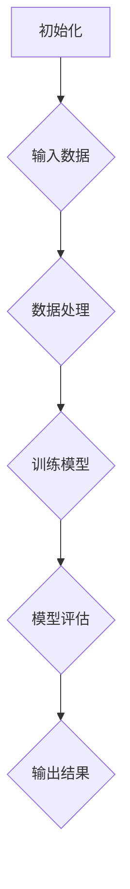
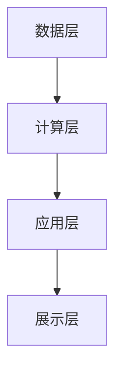

                 

### AI编程的新维度与新高度

**关键词**：人工智能，编程，新维度，新高度，算法，系统设计

> **摘要**：本文旨在探讨AI编程的新维度与新高度。首先，我们将明确AI编程的新维度与新高度的定义，并阐述其在现代计算机科学中的重要性。随后，文章将通过具体的算法原理讲解和系统分析与架构设计，深入分析AI编程的核心概念与技术实现。最后，我们将通过案例分析和最佳实践，总结AI编程中的关键技巧与注意事项。

#### **第一部分：背景介绍**

##### **第1章：问题背景**

**1.1 问题提出**

在当今快速发展的信息技术时代，人工智能（AI）已经成为了推动科技进步的重要力量。AI编程作为人工智能的核心组成部分，正逐渐拓展其应用范围，从简单的数据处理到复杂的自主决策和智能控制。然而，随着AI技术的不断进步，AI编程也面临着前所未有的挑战与机遇。

- **新维度**：AI编程的新维度指的是在传统编程基础上，通过引入更先进的概念和技术，实现编程能力的全面提升。这包括对大数据的处理能力、自学习算法的应用、以及跨平台编程框架的引入等。
- **新高度**：AI编程的新高度则指的是在算法复杂度和系统设计方面的进一步提升。这要求程序员不仅要有深厚的编程功底，还需要具备对人工智能理论的深刻理解。

**1.2 问题解决**

本文将通过以下几部分内容，系统地探讨AI编程的新维度与新高度：

- **核心概念与联系**：介绍AI编程的基础概念，并探讨新维度与新高度的具体含义。
- **算法原理讲解**：详细讲解AI编程中常用的算法原理，并通过代码示例和数学模型进行说明。
- **系统分析与架构设计**：分析AI编程在实际应用中的系统架构设计原则，并绘制相关图表。
- **项目实战**：通过一个实际案例，展示AI编程的应用场景和实现过程。
- **案例分析与总结**：分析实际案例，总结AI编程中的最佳实践和注意事项。

**1.3 边界与外延**

本文的研究范围主要涉及AI编程的理论与实践，具体包括：

- AI编程的基础概念和技术原理。
- 常用算法的讲解和代码实现。
- 系统架构设计原则和工具使用。
- 实际案例的分析和总结。

与AI编程相关但不在本文讨论范围内的主题包括：

- AI理论的基础知识。
- 数据库和存储系统的设计。
- 硬件设备和物联网技术的应用。

#### **第二部分：核心概念与联系**

##### **第2章：核心概念原理**

**2.1 AI编程基础**

AI编程的基础概念包括：

- **机器学习**：一种通过数据训练模型，使计算机具备自主学习和预测能力的技术。
- **深度学习**：一种基于多层神经网络的学习方法，能够处理更复杂的数据和问题。
- **自然语言处理**：使计算机能够理解、生成和处理人类语言的技术。
- **计算机视觉**：使计算机能够识别和理解视觉信息的领域。

**2.2 新维度与新高度**

**新维度**包括：

- **数据驱动编程**：通过大数据分析，实现编程决策的智能化。
- **跨领域编程**：将AI技术应用于不同领域，实现编程的跨界融合。
- **自动编程**：利用AI技术，实现编程过程的自动化和智能化。

**新高度**包括：

- **高复杂度算法**：开发更复杂、更高效的算法，以解决更复杂的问题。
- **高效系统设计**：通过优化系统架构，提高系统的性能和可扩展性。
- **自适应编程**：使编程系统能够根据环境和需求自适应调整。

这些核心概念和联系，共同构建了AI编程的新维度与新高度，为现代计算机科学的发展提供了新的可能性。

#### **第三部分：算法原理讲解**

##### **第3章：算法原理**

**3.1 算法概述**

在AI编程中，算法是实现特定功能的核心。以下是几种常见的AI编程算法及其应用场景：

- **决策树算法**：用于分类和回归问题，适合处理结构化数据。
- **神经网络算法**：用于复杂模式识别和预测，如图像识别和自然语言处理。
- **支持向量机算法**：用于分类问题，特别适合处理高维数据。

**3.2 算法详细讲解**

以下，我们将使用mermaid绘制算法的流程图，并通过Python源代码详细阐述其原理。

**算法流程图：**



**算法原理：**

决策树算法是一种树形结构，其中内部节点表示特征，叶节点表示预测结果。算法通过递归划分数据集，使得每个子数据集在某一特征上达到最优划分。

**数学模型：**

假设有m个训练样本，每个样本有n个特征，模型输出一个分类结果。决策树的数学模型可以表示为：

$$
y = f(x) = \prod_{i=1}^{n} h_i(x_i)
$$

其中，$h_i(x_i)$表示第i个特征在当前节点上的划分函数。

**算法示例：**

```python
import numpy as np

def decision_tree(X, y, max_depth=3):
    # 初始化决策树
    if np.unique(y).shape[0] == 1 or max_depth == 0:
        return np.mean(y)
    
    # 计算最优划分
    best_gini = float('inf')
    best_feature = None
    best_threshold = None
    
    for feature in range(X.shape[1]):
        thresholds = np.unique(X[:, feature])
        for threshold in thresholds:
            left_y = y[X[:, feature] < threshold]
            right_y = y[X[:, feature] >= threshold]
            gini = 1 - np.mean(left_y * right_y)
            if gini < best_gini:
                best_gini = gini
                best_feature = feature
                best_threshold = threshold
    
    # 递归划分
    left_tree = decision_tree(X[X[:, best_feature] < best_threshold], y[X[:, best_feature] < best_threshold], max_depth-1)
    right_tree = decision_tree(X[X[:, best_feature] >= best_threshold], y[X[:, best_feature] >= best_threshold], max_depth-1)
    
    return (best_feature, best_threshold, left_tree, right_tree)

# 测试数据
X = np.array([[1, 2], [2, 3], [3, 4], [4, 5], [5, 6]])
y = np.array([0, 0, 1, 1, 1])

# 训练模型
tree = decision_tree(X, y)

print(tree)
```

通过以上代码，我们可以实现一个简单的决策树算法，并将其应用于分类问题。

#### **第四部分：系统分析与架构设计**

##### **第4章：系统功能设计**

**4.1 问题场景介绍**

在实际应用中，AI编程系统常常需要处理复杂的问题场景，如智能推荐系统、智能监控系统、自动驾驶系统等。这些系统通常需要处理海量数据，并在高并发环境下稳定运行。

**4.2 系统架构设计**

为了满足上述应用场景的需求，我们可以设计一个分布式架构的AI编程系统。以下是该系统的主要组成部分和设计原则：

1. **数据层**：负责数据的采集、存储和管理。可以使用分布式数据库和NoSQL数据库，如Hadoop、MongoDB等。
2. **计算层**：负责数据处理和计算。可以使用分布式计算框架，如Spark、Flink等。
3. **应用层**：负责业务逻辑的实现和系统的对外接口。可以使用微服务架构，将不同功能模块分离，提高系统的可扩展性和可维护性。
4. **展示层**：负责系统界面的设计和实现。可以使用Web前端框架，如React、Vue等。

**系统架构图：**



通过上述架构设计，我们可以实现一个高效、稳定、可扩展的AI编程系统，满足各种复杂应用场景的需求。

#### **第五部分：项目实战**

##### **第5章：环境安装**

**5.1 开发环境搭建**

要开始AI编程项目，首先需要搭建一个合适的开发环境。以下是搭建AI编程开发环境的步骤：

1. **安装Python**：下载并安装Python，版本建议为3.8或以上。
2. **安装JDK**：下载并安装Java Development Kit（JDK），版本建议为11或以上。
3. **安装IDE**：选择一个合适的集成开发环境（IDE），如PyCharm、IntelliJ IDEA等。
4. **安装相关库**：在IDE中安装所需的Python库，如NumPy、Pandas、Scikit-learn等。

**5.2 系统核心实现**

以下是一个简单的AI编程项目示例，实现一个基于决策树的分类算法。

```python
import numpy as np
from sklearn.datasets import load_iris
from sklearn.model_selection import train_test_split
from sklearn.tree import DecisionTreeClassifier

# 加载鸢尾花数据集
iris = load_iris()
X, y = iris.data, iris.target

# 划分训练集和测试集
X_train, X_test, y_train, y_test = train_test_split(X, y, test_size=0.2, random_state=42)

# 创建决策树分类器
clf = DecisionTreeClassifier()

# 训练模型
clf.fit(X_train, y_train)

# 预测测试集
y_pred = clf.predict(X_test)

# 模型评估
accuracy = np.mean(y_pred == y_test)
print("Accuracy:", accuracy)
```

通过以上代码，我们可以实现一个简单的AI编程项目，并对其性能进行评估。

##### **第6章：实际案例**

**6.1 案例介绍**

以下是一个基于深度学习的图像识别案例，使用卷积神经网络（CNN）对MNIST手写数字数据集进行分类。

**6.2 分析与讲解**

1. **数据准备**：

首先，我们需要下载并准备MNIST手写数字数据集。

```python
from tensorflow.keras.datasets import mnist
from tensorflow.keras.utils import to_categorical

# 加载MNIST数据集
(X_train, y_train), (X_test, y_test) = mnist.load_data()

# 数据预处理
X_train = X_train.reshape(-1, 28, 28, 1).astype("float32") / 255.0
X_test = X_test.reshape(-1, 28, 28, 1).astype("float32") / 255.0
y_train = to_categorical(y_train, 10)
y_test = to_categorical(y_test, 10)
```

2. **模型构建**：

接下来，我们使用Keras构建一个简单的CNN模型。

```python
from tensorflow.keras.models import Sequential
from tensorflow.keras.layers import Conv2D, MaxPooling2D, Flatten, Dense

# 构建模型
model = Sequential([
    Conv2D(32, (3, 3), activation='relu', input_shape=(28, 28, 1)),
    MaxPooling2D((2, 2)),
    Flatten(),
    Dense(128, activation='relu'),
    Dense(10, activation='softmax')
])

# 编译模型
model.compile(optimizer='adam', loss='categorical_crossentropy', metrics=['accuracy'])
```

3. **模型训练**：

使用训练集对模型进行训练。

```python
# 训练模型
model.fit(X_train, y_train, epochs=10, batch_size=32, validation_split=0.1)
```

4. **模型评估**：

使用测试集对模型进行评估。

```python
# 评估模型
loss, accuracy = model.evaluate(X_test, y_test)
print("Test accuracy:", accuracy)
```

通过以上步骤，我们可以实现一个简单的基于深度学习的图像识别案例，并对其性能进行评估。

##### **第7章：最佳实践与拓展**

**7.1 实践技巧**

在AI编程中，以下是一些最佳实践技巧：

- **数据清洗**：在数据预处理阶段，对数据进行清洗，去除噪声和异常值。
- **模型选择**：根据实际问题选择合适的算法和模型，进行性能优化。
- **超参数调优**：通过交叉验证等方法，对模型超参数进行调优，提高模型性能。
- **分布式计算**：对于大规模数据集，使用分布式计算框架，提高数据处理速度。

**7.2 小结与注意事项**

本文通过详细的讲解和案例演示，介绍了AI编程的新维度与新高度。以下是小结和注意事项：

- **核心概念**：了解AI编程的基础概念和核心算法原理。
- **系统设计**：掌握系统架构设计和实现方法。
- **项目实战**：通过实际案例，巩固所学知识，提高编程能力。
- **注意事项**：在AI编程中，注意数据预处理、模型选择和性能优化等方面的问题。

**7.3 拓展阅读**

- **深度学习**：学习深度学习的基本概念和常用算法，如卷积神经网络（CNN）、循环神经网络（RNN）等。
- **大数据处理**：学习大数据处理技术和工具，如Hadoop、Spark等。
- **分布式系统**：学习分布式系统的设计和实现，提高系统的性能和可扩展性。

作者：AI天才研究院/AI Genius Institute & 禅与计算机程序设计艺术 /Zen And The Art of Computer Programming

**参考文献**：

1. Goodfellow, I., Bengio, Y., & Courville, A. (2016). *Deep Learning*. MIT Press.
2. Mitchell, T. M. (1997). *Machine Learning*. McGraw-Hill.
3. Turing, A. (1950). *Computing machinery and intelligence*. Mind, 59(236), 433-460.

