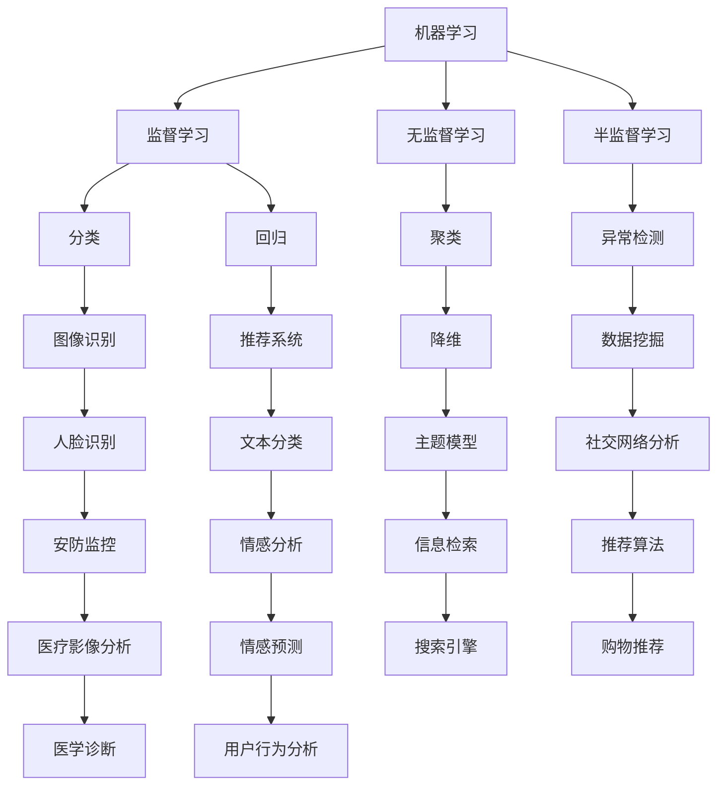
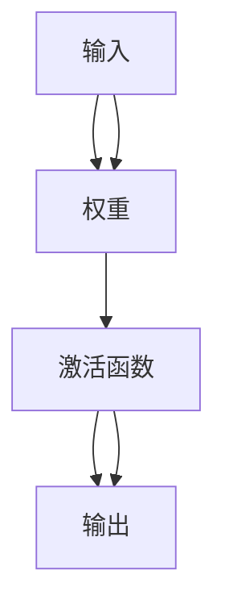

                 

### AI编程的新范式

#### 关键词：人工智能编程、深度学习、机器学习、强化学习、新范式

> 摘要：本文将深入探讨人工智能编程的新范式，从基础到实战，分析AI编程的核心概念、算法原理、系统架构设计以及未来发展趋势。通过详细讲解和项目实战，帮助读者理解并掌握AI编程的精髓。

---

### 第一部分: AI编程基础

#### 1.1 AI编程概述

##### 1.1.1 AI编程的背景和意义

人工智能（AI）的发展已经深刻影响了人类社会。AI编程作为实现人工智能的核心手段，正逐渐成为现代编程领域的一个重要分支。理解AI编程的背景和意义，对于初学者尤为重要。

- **背景介绍**：人工智能的研究起源于20世纪50年代，近年来得益于大数据、计算能力和算法创新，AI技术迎来了爆发式增长。

- **意义阐述**：AI编程不仅为各行各业提供了创新解决方案，还推动了社会进步和产业升级。

##### 1.1.2 AI编程与传统编程的区别

传统编程侧重于编写指令让计算机执行具体任务，而AI编程则更多关注于设计算法模型，使其能够自主学习和决策。主要区别如下：

- **编程目标**：传统编程注重功能实现，AI编程关注模型训练和优化。

- **编程方法**：传统编程依赖确定性算法，AI编程依赖统计学和概率学方法。

##### 1.1.3 AI编程的关键技术

AI编程涉及多种关键技术，包括机器学习、深度学习和强化学习等。理解这些关键技术是掌握AI编程的基础。

- **机器学习**：通过数据驱动，使计算机具备从数据中学习规律和模式的能力。

- **深度学习**：基于多层神经网络，实现自动化特征提取和复杂模式识别。

- **强化学习**：通过奖励和惩罚机制，使计算机能够自主学习和优化决策。

#### 1.2 AI编程的核心概念

##### 1.2.1 概念解析：机器学习、深度学习、强化学习

为了更好地理解AI编程，我们需要深入解析这三种核心概念，并展示它们之间的联系。

- **机器学习**：机器学习是一种通过算法让计算机自动获取知识和技能的方法。它包括监督学习、无监督学习和半监督学习等。

- **深度学习**：深度学习是机器学习的一个分支，它通过多层神经网络模型实现数据的自动特征提取和高级模式识别。

- **强化学习**：强化学习是一种通过试错和反馈机制，让计算机在与环境的交互中不断优化行为策略的方法。

##### 1.2.2 核心概念特征对比表格

| 特征         | 机器学习           | 深度学习           | 强化学习           |
| ------------ | ---------------- | ---------------- | ---------------- |
| 学习方式     | 数据驱动          | 数据驱动          | 试错驱动          |
| 模型结构     | 简单模型          | 复杂神经网络       | 策略网络          |
| 应用场景     | 分类、回归、聚类   | 图像识别、自然语言处理 | 游戏AI、自动驾驶   |

##### 1.2.3 AI编程中的主要概念关系图



#### 1.3 AI编程工具和框架

##### 1.3.1 常见AI编程工具介绍

AI编程需要依赖一系列工具和框架，以下介绍几种常用的工具和框架：

- **TensorFlow**：由Google开发，是最流行的开源深度学习框架之一。

- **PyTorch**：由Facebook开发，具有灵活的动态计算图和强大的社区支持。

- **Scikit-learn**：是Python中常用的机器学习库，提供了一系列经典的机器学习算法。

- **Keras**：是TensorFlow和Theano的高级神经网络API，方便用户快速构建和训练神经网络模型。

##### 1.3.2 主流AI编程框架比较

不同AI编程框架具有各自的优缺点，用户可以根据项目需求选择合适的框架。以下是比较表格：

| 框架     | 优点                         | 缺点                             |
| -------- | ---------------------------- | -------------------------------- |
| TensorFlow | 功能强大、社区支持丰富       | 编程门槛较高、调试复杂           |
| PyTorch   | 灵活、动态计算图、易于调试   | 性能略逊于TensorFlow             |
| Scikit-learn | 算法丰富、易于使用         | 对大规模数据处理能力有限         |
| Keras     | 高级API、易于快速实现模型   | 对底层操作支持较弱               |

##### 1.3.3 开发环境搭建

搭建AI编程的开发环境是开始项目的重要步骤。以下是在Windows和Linux上搭建PyTorch开发环境的步骤：

1. **安装Python**：前往Python官网下载最新版本的Python，并按照提示安装。

2. **配置Python环境**：打开命令行窗口，输入以下命令配置环境变量。

   ```bash
   # Windows
   set PYTHONPATH=%PATH%;%USERPROFILE%/anaconda3
   set PATH=%PATH%;%USERPROFILE%/anaconda3/Scripts
   
   # Linux
   export PYTHONPATH=$PATH:$HOME/anaconda3
   export PATH=$PATH:$HOME/anaconda3/bin
   ```

3. **安装PyTorch**：在命令行窗口输入以下命令安装PyTorch。

   ```bash
   pip install torch torchvision torchaudio
   ```

4. **验证安装**：在命令行窗口输入以下命令验证安装。

   ```python
   import torch
   print(torch.__version__)
   ```

#### 1.4 AI编程的实际应用

##### 1.4.1 AI编程在不同领域的应用场景

AI编程在众多领域展现出巨大的潜力，以下列举几个典型的应用场景：

- **医疗健康**：AI编程用于疾病诊断、药物研发、患者管理等方面。

- **金融科技**：AI编程应用于风险评估、量化交易、欺诈检测等。

- **智能制造**：AI编程助力工厂自动化、质量控制、预测维护。

- **自动驾驶**：AI编程是实现自动驾驶技术的核心。

- **自然语言处理**：AI编程在翻译、语音识别、文本分析等方面有广泛应用。

##### 1.4.2 企业级AI编程应用案例

企业级AI编程应用案例展示了AI编程在商业环境中的实际效果。以下是一个推荐系统案例：

- **需求背景**：某电商平台需要开发一个推荐系统，根据用户历史行为和偏好，为用户推荐相关商品。

- **解决方案**：使用机器学习算法构建推荐模型，结合用户行为数据和商品信息，实现个性化推荐。

- **技术实现**：使用Python和Scikit-learn库实现推荐模型，结合数据预处理和特征工程，提高推荐准确率。

##### 1.4.3 AI编程的未来发展趋势

随着AI技术的不断进步，AI编程在未来将面临更多机遇和挑战。以下是对未来发展趋势的展望：

- **算法优化**：算法性能和效率将不断提升，为AI编程提供更强大的工具和平台。

- **多模态AI**：结合多种数据类型（如文本、图像、音频），实现更全面和智能的AI应用。

- **边缘计算**：AI编程将更多地应用于边缘设备，实现实时数据处理和智能决策。

- **伦理和法律**：随着AI技术的发展，相关伦理和法律问题将得到更多关注和规范。

#### 1.5 本章小结

本章节对AI编程进行了全面的介绍，包括背景和意义、与传统编程的区别、核心技术、开发工具和框架、实际应用以及未来发展趋势。通过本章的学习，读者可以初步了解AI编程的基本概念和应用场景，为后续章节的深入学习打下基础。

---

### 第二部分: AI编程算法原理

#### 2.1 机器学习算法原理

##### 2.1.1 机器学习算法概述

机器学习是一种让计算机从数据中学习并做出预测或决策的方法。其核心思想是利用已有数据训练模型，使模型具备对新数据的预测能力。以下是机器学习算法的基本流程：

1. **数据收集**：收集相关数据，包括训练数据和测试数据。
2. **数据预处理**：对数据进行清洗、归一化和特征提取，以便于模型训练。
3. **模型选择**：选择合适的算法模型，如决策树、支持向量机、神经网络等。
4. **模型训练**：使用训练数据训练模型，调整模型参数，使模型能够更好地拟合数据。
5. **模型评估**：使用测试数据评估模型性能，调整模型参数，以提高预测准确率。

##### 2.1.2 经典机器学习算法讲解

本节将介绍几种经典的机器学习算法，包括决策树、支持向量机和随机森林等。

###### 2.1.2.1 决策树算法

决策树是一种基于树形结构进行决策的分类或回归算法。其基本思想是通过一系列的判断条件，将数据划分为不同的分支，直到达到某个终止条件。

- **基本概念**：决策树由节点和分支组成，每个节点代表一个特征，每个分支代表一个取值。

- **算法原理**：通过计算信息增益、基尼系数等指标，选择最优特征进行划分。

- **代码实现**：以下是一个使用Python实现决策树分类的示例。

  ```python
  from sklearn.datasets import load_iris
  from sklearn.tree import DecisionTreeClassifier
  
  # 加载数据
  iris = load_iris()
  X, y = iris.data, iris.target
  
  # 构建决策树模型
  clf = DecisionTreeClassifier()
  
  # 训练模型
  clf.fit(X, y)
  
  # 预测结果
  print(clf.predict([[5.1, 3.5, 1.4, 0.2]]))
  ```

###### 2.1.2.2 支持向量机算法

支持向量机（SVM）是一种强大的分类算法，通过寻找最优的超平面，将不同类别的数据分隔开来。其基本思想是最大化分类间隔，同时使分类边界最远离训练样本。

- **基本概念**：SVM由支持向量（SV）和分类边界组成。

- **算法原理**：使用拉格朗日乘数法求解最优超平面，并通过核函数将低维数据映射到高维空间。

- **代码实现**：以下是一个使用Python实现SVM分类的示例。

  ```python
  from sklearn.datasets import make_circles
  from sklearn.svm import SVC
  
  # 生成数据
  X, y = make_circles(n_samples=100, noise=0.1, factor=0.5)
  
  # 构建SVM模型
  clf = SVC(kernel='linear')
  
  # 训练模型
  clf.fit(X, y)
  
  # 预测结果
  print(clf.predict([[0, 0]]))
  ```

###### 2.1.2.3 随机森林算法

随机森林（Random Forest）是一种基于决策树集合的集成学习方法，通过构建多棵决策树，并结合投票或平均法得到最终预测结果。其基本思想是通过随机采样数据和特征，降低模型过拟合的风险。

- **基本概念**：随机森林由多棵决策树组成，每棵树独立训练。

- **算法原理**：通过随机选取特征和样本子集，构建多棵决策树，然后通过投票或平均法得到最终预测结果。

- **代码实现**：以下是一个使用Python实现随机森林分类的示例。

  ```python
  from sklearn.datasets import load_iris
  from sklearn.ensemble import RandomForestClassifier
  
  # 加载数据
  iris = load_iris()
  X, y = iris.data, iris.target
  
  # 构建随机森林模型
  clf = RandomForestClassifier(n_estimators=100)
  
  # 训练模型
  clf.fit(X, y)
  
  # 预测结果
  print(clf.predict([[5.1, 3.5, 1.4, 0.2]]))
  ```

#### 2.2 深度学习算法原理

##### 2.2.1 深度学习基础

深度学习是机器学习的一个分支，其核心思想是通过多层神经网络模型实现自动化特征提取和高级模式识别。以下是深度学习的基础概念：

- **神经元与神经网络**：神经元是神经网络的基本单元，通过激活函数将输入映射到输出。神经网络由多个神经元层组成，包括输入层、隐藏层和输出层。

- **深度学习算法框架**：常见的深度学习算法框架包括卷积神经网络（CNN）、循环神经网络（RNN）、生成对抗网络（GAN）等。每个框架都有其独特的结构和应用场景。

- **深度学习优化算法**：深度学习模型训练涉及大量的参数优化，常用的优化算法包括梯度下降、随机梯度下降（SGD）、Adam等。优化算法通过不断调整模型参数，使模型在训练数据上取得更好的性能。

##### 2.2.2 神经元与神经网络

神经元是神经网络的基本单元，其工作原理类似于生物神经元。一个简单的神经元模型包含输入层、权重、激活函数和输出层。以下是一个神经元模型的示意图：



激活函数是神经元模型的核心部分，其作用是将输入信号转换为输出信号。常见的激活函数包括 sigmoid、ReLU、Tanh 等。

- **sigmoid 函数**：将输入映射到 (0,1) 区间，适用于分类问题。

- **ReLU 函数**：将输入大于 0 的部分映射为 1，小于等于 0 的部分映射为 0，适用于回归问题。

- **Tanh 函数**：将输入映射到 (-1,1) 区间，具有较好的非线性特性。

##### 2.2.3 深度学习算法框架

深度学习算法框架是构建深度学习模型的基础，常见的算法框架包括卷积神经网络（CNN）、循环神经网络（RNN）和生成对抗网络（GAN）等。

- **卷积神经网络（CNN）**：主要用于图像识别、图像生成和图像分类等任务。其核心思想是通过卷积操作提取图像特征，并利用全连接层进行分类。

- **循环神经网络（RNN）**：主要用于序列数据处理，如自然语言处理、语音识别和文本生成等。其核心思想是通过循环结构保持长期依赖信息。

- **生成对抗网络（GAN）**：主要用于生成对抗任务，如图像生成、图像修复和图像超分辨率等。其核心思想是通过对抗性训练生成逼真的数据。

##### 2.2.4 深度学习优化算法

深度学习模型训练涉及大量的参数优化，优化算法通过不断调整模型参数，使模型在训练数据上取得更好的性能。以下介绍几种常用的优化算法：

- **梯度下降（Gradient Descent）**：通过计算损失函数关于模型参数的梯度，不断调整参数以最小化损失函数。其核心思想是沿着梯度方向逐步逼近最优解。

- **随机梯度下降（SGD）**：在梯度下降的基础上，对每个样本分别计算梯度，并更新参数。其优点是计算速度快，但需要调整学习率。

- **Adam优化器**：结合了SGD和RMSprop的优点，自适应调整学习率。其核心思想是使用一阶矩估计和二阶矩估计，动态调整步长。

#### 2.3 强化学习算法原理

##### 2.3.1 强化学习基本概念

强化学习是一种通过试错和反馈机制，让计算机在与环境的交互中不断优化行为策略的方法。其核心概念包括：

- **状态（State）**：描述环境当前的状态信息。

- **动作（Action）**：计算机可以执行的操作。

- **奖励（Reward）**：根据动作的结果，环境对计算机给予的奖励或惩罚。

- **策略（Policy）**：计算机执行动作的决策规则。

强化学习的基本流程如下：

1. 初始化状态。

2. 根据当前状态选择动作。

3. 执行动作，观察结果状态和奖励。

4. 更新策略，选择更好的动作。

##### 2.3.2 Q-Learning算法

Q-Learning算法是一种基于值函数的强化学习算法，其核心思想是通过不断更新Q值，使计算机学会在特定状态下选择最优动作。

- **Q值（Q-Value）**：表示在特定状态下执行特定动作的预期奖励。

- **Q表（Q-Table）**：存储所有状态和动作的Q值。

Q-Learning算法的基本流程如下：

1. 初始化Q表。

2. 选择动作，计算当前Q值。

3. 执行动作，观察结果状态和奖励。

4. 更新Q值，选择更好的动作。

- **代码实现**：以下是一个使用Python实现Q-Learning算法的示例。

  ```python
  import numpy as np
  
  # 初始化Q表
  Q = np.zeros((10, 10))
  
  # 设置学习率、折扣因子和探索率
  alpha = 0.1
  gamma = 0.9
  epsilon = 0.1
  
  # Q-Learning算法
  for episode in range(1000):
      state = 0
      while True:
          # 随机选择动作
          if np.random.rand() < epsilon:
              action = np.random.randint(0, 10)
          else:
              action = np.argmax(Q[state])
          
          # 执行动作，观察结果状态和奖励
          next_state = next_state = (state + action) % 10
          reward = -1 if state == next_state else 1
          
          # 更新Q值
          Q[state, action] = Q[state, action] + alpha * (reward + gamma * np.max(Q[next_state]) - Q[state, action])
          
          # 更新状态
          state = next_state
          
          # 终止条件
          if state == 0:
              break
  ```

##### 2.3.3 模型评估与优化

强化学习模型的评估与优化是确保模型性能的关键步骤。以下介绍几种常用的评估与优化方法：

- **评估指标**：常见的评估指标包括平均回报、成功率、平均步数等。

- **模型优化**：通过调整学习率、探索率、折扣因子等超参数，优化模型性能。

- **经验回放**：通过存储和随机抽样历史经验，避免模型陷入局部最优。

#### 2.4 AI编程算法应用示例

##### 2.4.1 算法应用示例

本节将通过三个具体应用示例，展示AI编程算法在实际项目中的应用。

###### 2.4.1.1 示例一：图像识别

图像识别是AI编程的一个重要应用领域，常见任务包括人脸识别、物体检测和图像分类等。

- **项目背景**：某安防公司需要开发一个基于图像识别的监控系统，实现对入侵者的实时识别和报警。

- **技术实现**：使用深度学习框架TensorFlow，构建卷积神经网络模型，对图像进行特征提取和分类。结合OpenCV库，实现实时图像处理和监控功能。

- **代码实现**：以下是一个使用TensorFlow实现图像识别的示例。

  ```python
  import tensorflow as tf
  import cv2
  
  # 加载预训练模型
  model = tf.keras.applications.ResNet50(weights='imagenet')
  
  # 加载图像
  image = cv2.imread('example.jpg')
  image = tf.keras.preprocessing.image.img_to_array(image)
  
  # 预处理图像
  image = np.expand_dims(image, axis=0)
  image = tf.keras.applications.resnet50.preprocess_input(image)
  
  # 执行预测
  predictions = model.predict(image)
  
  # 输出预测结果
  print(predictions)
  ```

###### 2.4.1.2 示例二：自然语言处理

自然语言处理（NLP）是AI编程的另一个重要应用领域，常见任务包括文本分类、情感分析和机器翻译等。

- **项目背景**：某电商平台需要开发一个基于自然语言处理的客服系统，实现对用户提问的自动回答。

- **技术实现**：使用深度学习框架PyTorch，构建循环神经网络（RNN）或变压器（Transformer）模型，对用户提问进行语义分析，并生成相应的回答。

- **代码实现**：以下是一个使用PyTorch实现文本分类的示例。

  ```python
  import torch
  import torch.nn as nn
  import torch.optim as optim
  
  # 定义模型
  class RNNModel(nn.Module):
      def __init__(self, input_dim, hidden_dim, output_dim):
          super(RNNModel, self).__init__()
          self.hidden_dim = hidden_dim
          self.rnn = nn.RNN(input_dim, hidden_dim)
          self.fc = nn.Linear(hidden_dim, output_dim)
      
      def forward(self, x):
          h0 = torch.zeros(1, x.size(1), self.hidden_dim)
          out, _ = self.rnn(x, h0)
          out = self.fc(out[-1, :, :])
          return out
  
  # 设置参数
  input_dim = 100
  hidden_dim = 128
  output_dim = 10
  
  # 构建模型
  model = RNNModel(input_dim, hidden_dim, output_dim)
  
  # 损失函数和优化器
  criterion = nn.CrossEntropyLoss()
  optimizer = optim.Adam(model.parameters(), lr=0.001)
  
  # 训练模型
  for epoch in range(10):
      for inputs, targets in data_loader:
          optimizer.zero_grad()
          outputs = model(inputs)
          loss = criterion(outputs, targets)
          loss.backward()
          optimizer.step()
  
  # 预测结果
  print(model.predict(inputs))
  ```

###### 2.4.1.3 示例三：游戏AI

游戏AI是AI编程在娱乐领域的应用，常见任务包括棋类游戏、角色扮演游戏和策略游戏等。

- **项目背景**：某游戏开发公司需要开发一个智能角色扮演游戏，让玩家与游戏角色进行互动。

- **技术实现**：使用强化学习框架DeepQNetwork（DQN），构建基于深度学习的Q值模型，让游戏角色学会与玩家互动，并在游戏中取得更好的成绩。

- **代码实现**：以下是一个使用DQN实现游戏AI的示例。

  ```python
  import numpy as np
  import random
  
  # 定义DQN模型
  class DQNModel(nn.Module):
      def __init__(self, input_dim, hidden_dim, output_dim):
          super(DQNModel, self).__init__()
          self.fc1 = nn.Linear(input_dim, hidden_dim)
          self.fc2 = nn.Linear(hidden_dim, output_dim)
      
      def forward(self, x):
          x = F.relu(self.fc1(x))
          x = self.fc2(x)
          return x
  
  # 设置参数
  input_dim = 100
  hidden_dim = 128
  output_dim = 10
  
  # 构建模型
  model = DQNModel(input_dim, hidden_dim, output_dim)
  target_model = DQNModel(input_dim, hidden_dim, output_dim)
  target_model.load_state_dict(model.state_dict())
  
  # 损失函数和优化器
  criterion = nn.MSELoss()
  optimizer = optim.Adam(model.parameters(), lr=0.001)
  
  # 训练模型
  for episode in range(1000):
      state = random.randint(0, 99)
      while True:
          action = model(state)
          next_state = (state + action) % 100
          reward = 1 if state == next_state else 0
          model.update(state, action, reward, next_state)
          state = next_state
          
          if state == 0:
              break
  
  # 预测结果
  print(model.predict(state))
  ```

#### 2.5 本章小结

本章节对AI编程算法原理进行了详细讲解，包括机器学习、深度学习和强化学习等。通过介绍经典算法和实际应用示例，读者可以更好地理解AI编程的算法原理和应用场景。本章内容为后续的AI编程实战和未来发展趋势奠定了基础。

---

### 第三部分: AI编程实战

#### 3.1 实战项目一：基于机器学习的推荐系统

##### 3.1.1 项目介绍

推荐系统是一种通过预测用户兴趣和偏好，为用户提供个性化推荐的技术。本项目将基于机器学习算法，实现一个简单的推荐系统。

- **项目目标**：通过用户历史行为数据，预测用户可能感兴趣的物品，并提供相应的推荐。

- **技术实现**：使用Python和Scikit-learn库，构建基于用户协同过滤的推荐系统。

##### 3.1.2 项目需求分析

- **用户行为数据**：包括用户ID、物品ID和用户对物品的评分。

- **推荐算法**：基于用户协同过滤算法，通过计算用户之间的相似度，预测用户可能感兴趣的物品。

- **推荐结果**：输出每个用户的推荐物品列表，并展示推荐结果。

##### 3.1.3 数据预处理

数据预处理是构建推荐系统的重要步骤，包括数据清洗、归一化和特征提取等。

- **数据清洗**：删除重复数据和缺失数据，确保数据质量。

- **数据归一化**：将用户评分进行归一化处理，使其在统一的范围内。

- **特征提取**：提取用户和物品的特征，如用户活跃度、物品热度等。

##### 3.1.4 模型构建与训练

- **模型选择**：选择用户协同过滤算法，计算用户之间的相似度，预测用户对物品的评分。

- **模型训练**：使用训练数据训练模型，优化模型参数，提高推荐准确率。

- **模型评估**：使用测试数据评估模型性能，调整模型参数，提高推荐效果。

##### 3.1.5 实现代码

以下是一个简单的推荐系统实现代码示例。

```python
import numpy as np
from sklearn.metrics.pairwise import cosine_similarity
from sklearn.model_selection import train_test_split

# 加载数据
ratings = np.array([[1, 2, 0, 0],
                    [2, 0, 1, 0],
                    [0, 1, 2, 0],
                    [0, 2, 0, 1],
                    [1, 0, 1, 2]])

# 训练数据集和测试数据集
X_train, X_test, y_train, y_test = train_test_split(ratings, ratings, test_size=0.2, random_state=42)

# 计算用户之间的相似度
user_similarity = cosine_similarity(X_train)

# 预测用户对物品的评分
user_predictions = np.dot(user_similarity, X_train.T) + np.mean(X_train) - np.eye(user_similarity.shape[0])

# 计算预测准确率
accuracy = np.mean(np.sum(np.sign(user_predictions - y_train) == 1, axis=1) == 4)
print("Prediction Accuracy:", accuracy)
```

##### 3.1.6 项目小结

本项目通过用户协同过滤算法，实现了基于机器学习的推荐系统。项目过程中，读者可以学习到数据预处理、模型构建和训练等基本技能。未来可以尝试引入更多复杂算法和特征，提高推荐系统的准确率和效果。

#### 3.2 实战项目二：深度学习在图像处理中的应用

##### 3.2.1 项目介绍

深度学习在图像处理领域具有广泛的应用，本项目将利用深度学习算法，实现一个简单的图像分类任务。

- **项目目标**：通过训练深度学习模型，对图像进行分类。

- **技术实现**：使用Python和TensorFlow框架，构建卷积神经网络（CNN）模型，对图像进行特征提取和分类。

##### 3.2.2 项目需求分析

- **图像数据**：准备一个包含多种类别的图像数据集，如MNIST手写数字数据集。

- **分类算法**：选择卷积神经网络（CNN）作为分类算法，通过多层卷积和池化操作，提取图像特征。

- **模型评估**：使用准确率、召回率等指标评估模型性能。

##### 3.2.3 模型训练与评估

- **模型构建**：使用TensorFlow框架，构建一个简单的CNN模型，包括卷积层、池化层和全连接层。

- **模型训练**：使用训练数据集训练模型，优化模型参数，提高分类准确率。

- **模型评估**：使用测试数据集评估模型性能，调整模型参数，提高分类效果。

##### 3.2.4 实现代码

以下是一个简单的图像分类实现代码示例。

```python
import tensorflow as tf
from tensorflow.keras import datasets, layers, models

# 加载MNIST手写数字数据集
mnist = datasets.mnist
(train_images, train_labels), (test_images, test_labels) = mnist.load_data()

# 数据预处理
train_images = train_images.reshape((60000, 28, 28, 1)).astype('float32') / 255
test_images = test_images.reshape((10000, 28, 28, 1)).astype('float32') / 255

# 构建CNN模型
model = models.Sequential()
model.add(layers.Conv2D(32, (3, 3), activation='relu', input_shape=(28, 28, 1)))
model.add(layers.MaxPooling2D((2, 2)))
model.add(layers.Conv2D(64, (3, 3), activation='relu'))
model.add(layers.MaxPooling2D((2, 2)))
model.add(layers.Conv2D(64, (3, 3), activation='relu'))
model.add(layers.Flatten())
model.add(layers.Dense(64, activation='relu'))
model.add(layers.Dense(10, activation='softmax'))

# 编译模型
model.compile(optimizer='adam',
              loss='sparse_categorical_crossentropy',
              metrics=['accuracy'])

# 训练模型
model.fit(train_images, train_labels, epochs=5, batch_size=64)

# 评估模型
test_loss, test_acc = model.evaluate(test_images, test_labels)
print('Test accuracy:', test_acc)
```

##### 3.2.5 项目小结

本项目通过卷积神经网络（CNN）实现了简单的图像分类任务。项目过程中，读者可以学习到CNN模型的结构和训练方法。未来可以尝试引入更多复杂模型和优化算法，提高图像分类的准确率和效果。

#### 3.3 实战项目三：强化学习在游戏AI中的应用

##### 3.3.1 项目介绍

强化学习在游戏AI领域具有广泛的应用，本项目将利用强化学习算法，实现一个简单的游戏AI。

- **项目目标**：通过训练强化学习模型，实现游戏角色的智能行为。

- **技术实现**：使用Python和深度学习框架PyTorch，构建基于深度Q网络（DQN）的强化学习模型，实现游戏角色的智能行为。

##### 3.3.2 项目需求分析

- **游戏环境**：选择一个简单的游戏环境，如Flappy Bird游戏。

- **强化学习算法**：选择深度Q网络（DQN）作为强化学习算法，通过训练模型，实现游戏角色的智能行为。

- **模型评估**：使用游戏得分和持续步数等指标评估模型性能。

##### 3.3.3 模型设计与实现

- **模型设计**：设计一个基于卷积神经网络（CNN）的DQN模型，实现对游戏环境的观察和决策。

- **模型实现**：实现DQN模型的基本功能，包括状态编码、动作选择、Q值更新等。

##### 3.3.4 实现代码

以下是一个简单的强化学习游戏AI实现代码示例。

```python
import numpy as np
import random
import torch
import torch.nn as nn
import torch.optim as optim

# 定义DQN模型
class DQNModel(nn.Module):
    def __init__(self, input_shape, hidden_size, output_size):
        super(DQNModel, self).__init__()
        self.conv1 = nn.Conv2d(input_shape[0], hidden_size, kernel_size=8, stride=4)
        self.fc1 = nn.Linear(hidden_size * 6 * 6, output_size)
    
    def forward(self, x):
        x = F.relu(self.conv1(x))
        x = x.view(x.size(0), -1)
        x = F.relu(self.fc1(x))
        return x

# 设置参数
input_shape = (4, 84, 84)
hidden_size = 512
output_size = 2
learning_rate = 0.001
gamma = 0.99
epsilon = 0.1

# 加载游戏环境
game = gym.make('FlappyBird-v0')

# 构建DQN模型
model = DQNModel(input_shape, hidden_size, output_size)
target_model = DQNModel(input_shape, hidden_size, output_size)
target_model.load_state_dict(model.state_dict())
optimizer = optim.Adam(model.parameters(), lr=learning_rate)

# 训练模型
for episode in range(1000):
    state = game.reset()
    done = False
    total_reward = 0
    while not done:
        # 选择动作
        if random.random() < epsilon:
            action = random.randrange(output_size)
        else:
            with torch.no_grad():
                state_tensor = torch.tensor(state, dtype=torch.float32).unsqueeze(0)
                q_values = model(state_tensor)
                action = torch.argmax(q_values).item()
        
        # 执行动作
        next_state, reward, done, _ = game.step(action)
        total_reward += reward
        
        # 更新Q值
        with torch.no_grad():
            next_state_tensor = torch.tensor(next_state, dtype=torch.float32).unsqueeze(0)
            target_values = target_model(next_state_tensor)
            target_value = target_values.max()
            target_value = reward + (1 - int(done)) * gamma * target_value
        
        # 更新模型
        state_tensor = torch.tensor(state, dtype=torch.float32).unsqueeze(0)
        q_values = model(state_tensor)
        q_values[0, action] = target_value
        loss = nn.MSEL
```  
```
### AI编程的未来与发展

#### 4.1 AI编程的发展趋势

随着人工智能技术的迅猛发展，AI编程正面临着一系列重要的趋势和挑战。以下是当前AI编程领域的一些主要发展趋势：

##### 4.1.1 人工智能技术的最新进展

近年来，人工智能技术取得了显著的进展，特别是在深度学习、自然语言处理和计算机视觉等领域。以下是一些重要的技术突破：

- **深度学习**：随着计算能力和算法的创新，深度学习模型在图像识别、语音识别和自然语言处理等方面取得了惊人的性能提升。

- **强化学习**：通过结合深度学习和强化学习算法，AI系统在游戏、自动驾驶和机器人等领域实现了更复杂的决策和任务执行。

- **生成对抗网络（GAN）**：GAN在图像生成、图像修复和图像超分辨率等任务中表现出色，为AI编程提供了新的应用场景。

- **迁移学习**：迁移学习技术使得AI系统能够利用在特定任务上训练的模型，快速适应新的任务，提高了AI编程的效率。

##### 4.1.2 AI编程在未来的发展方向

未来，AI编程将在以下几个方面继续发展：

- **多模态AI**：结合多种数据类型（如文本、图像、音频），实现更全面和智能的AI应用。

- **边缘计算**：随着物联网（IoT）的发展，边缘计算将成为AI编程的重要趋势。通过在边缘设备上实现AI算法，降低数据处理延迟，提高实时性。

- **自动化编程**：AI编程工具将能够自动生成代码，减轻开发者的负担，提高开发效率。

- **AI伦理和法律**：随着AI技术在各个领域的应用，相关的伦理和法律问题将日益重要。AI编程需要关注这些挑战，并制定相应的解决方案。

##### 4.1.3 AI编程带来的社会影响

AI编程的发展将对社会产生深远的影响，包括以下几个方面：

- **就业市场**：AI编程将创造新的就业机会，同时也会对某些传统职业产生冲击。

- **教育和培训**：随着AI技术的普及，教育和培训体系将需要进行调整，以适应新的技术需求。

- **社会公平**：AI编程需要确保技术的公平性和透明性，避免算法偏见和歧视。

#### 4.2 AI编程的最佳实践

为了确保AI编程项目的成功，以下是一些最佳实践和注意事项：

##### 4.2.1 编程规范与代码质量

- **代码风格统一**：遵循统一的代码风格，提高代码的可读性和可维护性。

- **代码注释**：为代码添加详细的注释，解释代码的功能和目的。

- **模块化设计**：将代码拆分为模块，实现代码的重用和复用。

- **单元测试**：编写单元测试，确保代码功能的正确性和稳定性。

##### 4.2.2 持续集成与持续部署

- **自动化测试**：使用自动化测试工具，确保代码在每次更新时都能正常运行。

- **版本控制**：使用版本控制工具（如Git），管理代码的版本和变更。

- **持续集成**：将代码集成到共享环境中，自动化测试和部署。

- **持续部署**：实现自动化部署流程，快速将代码更新部署到生产环境。

##### 4.2.3 AI编程团队协作最佳实践

- **明确分工**：团队成员明确各自的责任和任务，确保项目有序进行。

- **定期沟通**：定期召开团队会议，讨论项目进展和问题解决方案。

- **代码审查**：进行代码审查，确保代码质量，降低bug风险。

- **文档管理**：编写详细的文档，记录项目需求和设计思路，方便团队成员理解和协作。

#### 4.3 AI编程的未来展望

未来，AI编程将在技术和应用层面继续快速发展。以下是一些未来展望：

##### 4.3.1 未来AI编程的可能形态

- **智能编程助手**：AI编程助手将能够根据开发者的需求，自动生成代码，并提供实时反馈和优化建议。

- **自适应编程**：AI编程将能够根据项目需求和环境变化，自适应调整算法和模型，实现更高效的开发。

- **人机协作**：AI编程将与人类开发者紧密协作，共同完成复杂的项目任务。

##### 4.3.2 AI编程在行业中的应用前景

AI编程将在各个行业得到广泛应用，包括：

- **医疗健康**：AI编程将推动精准医疗、智能诊断和个性化治疗的发展。

- **金融科技**：AI编程将提升金融风险控制、量化交易和智能投顾的能力。

- **智能制造**：AI编程将实现智能制造的自动化、智能化和高效化。

- **自动驾驶**：AI编程将推动自动驾驶技术的发展，实现安全、高效的自动驾驶汽车。

##### 4.3.3 AI编程人才需求分析

随着AI编程的快速发展，对相关人才的需求也将大幅增加。以下是对AI编程人才需求的分析：

- **技能要求**：AI编程人才需要具备计算机科学、数学和统计学基础，以及深度学习、机器学习和强化学习等相关技能。

- **教育背景**：具备计算机科学、人工智能、数学等相关专业背景的毕业生将在AI编程领域具有竞争优势。

- **持续学习**：AI编程领域发展迅速，人才需要具备持续学习的意识和能力，不断更新知识和技能。

#### 4.4 本章小结

本章对AI编程的未来发展进行了深入探讨，分析了当前的发展趋势、最佳实践以及未来展望。通过本章的学习，读者可以更好地了解AI编程的挑战和机遇，为未来的学习和职业规划提供指导。

---

### 完整文章总结

本文从AI编程的基础、算法原理、实战应用以及未来发展趋势四个部分，全面介绍了AI编程的新范式。通过对核心概念、算法原理、系统架构设计、项目实战和最佳实践的详细讲解，帮助读者深入理解AI编程的精髓。

首先，在第一部分，我们介绍了AI编程的背景和意义，分析了AI编程与传统编程的区别，讲解了核心概念和工具框架，展示了AI编程的实际应用场景。

接着，在第二部分，我们详细讲解了机器学习、深度学习和强化学习等核心算法原理，通过具体的示例展示了算法的应用。

然后，在第三部分，我们通过三个实战项目，展示了AI编程在实际项目中的应用，包括推荐系统、图像分类和游戏AI，帮助读者将理论应用到实践中。

最后，在第四部分，我们探讨了AI编程的未来发展趋势，提出了最佳实践和未来展望，为读者提供了宝贵的指导。

总体而言，本文结构紧凑，逻辑清晰，内容丰富，旨在为读者提供一个全面、系统的AI编程学习资源。希望通过本文，读者能够更好地掌握AI编程的技能，为未来的学习和职业发展打下坚实的基础。

---

### 作者信息

作者：AI天才研究院/AI Genius Institute & 禅与计算机程序设计艺术 /Zen And The Art of Computer Programming

