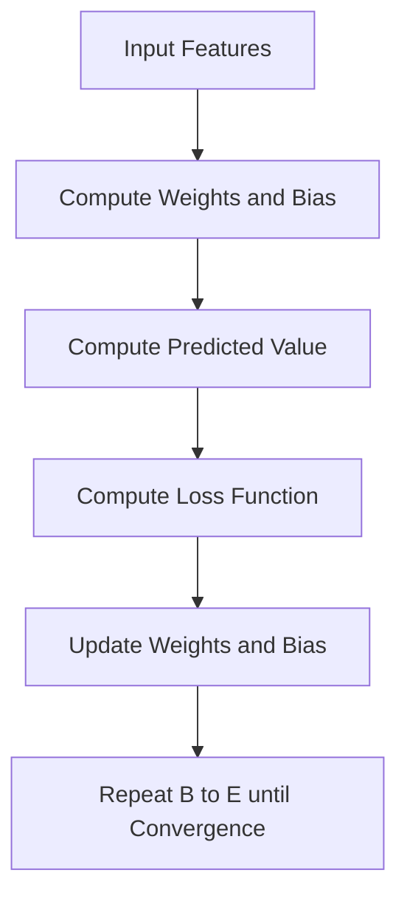
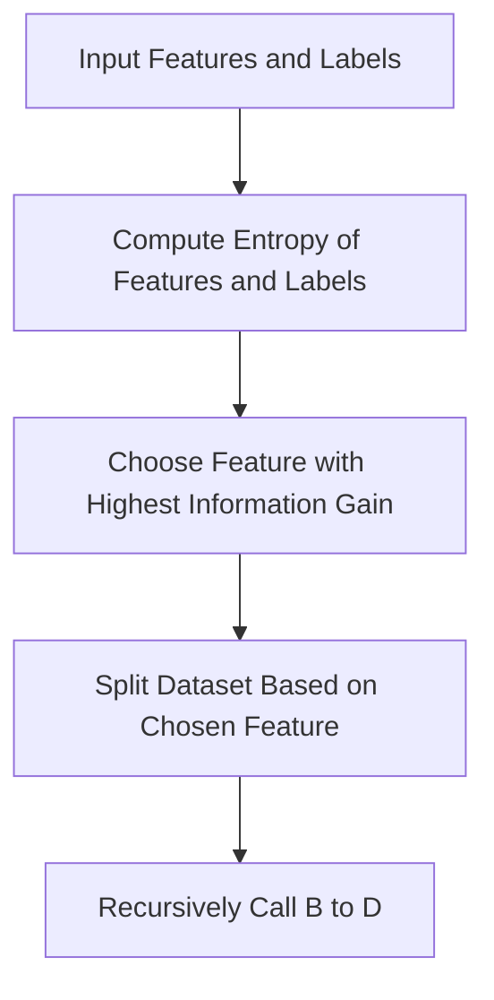
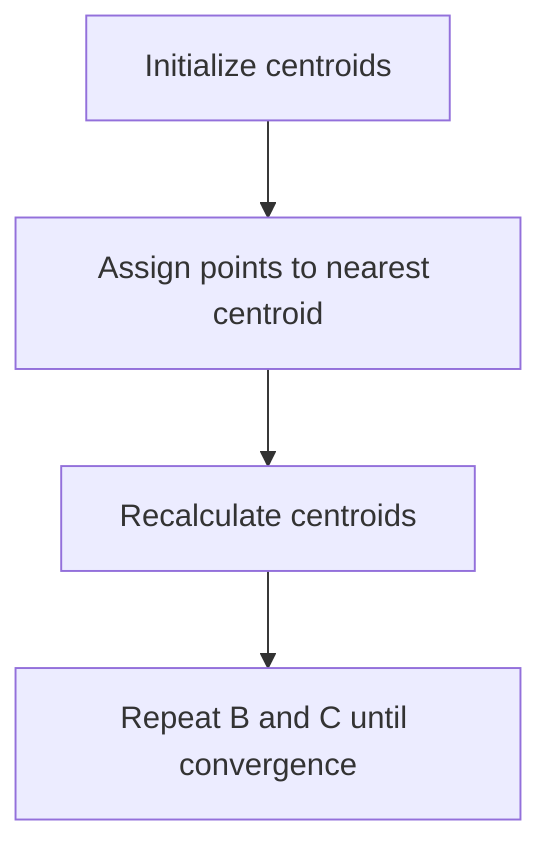
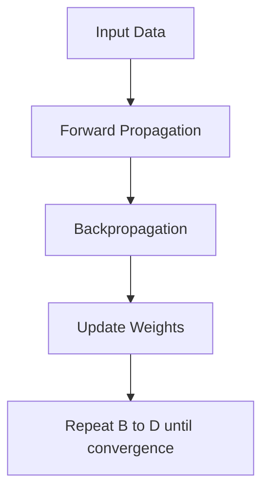

                 


# AI编程的新范式

## 关键词
- AI编程
- 新范式
- 机器学习
- 自动化
- 智能化

## 摘要
本文将深入探讨AI编程的新范式，分析其在传统编程面临挑战背景下的需求与核心概念，阐述AI编程的基本原理与优势，并结合实际案例，展示其在企业级应用中的前景与潜在价值。

## Step 1: Introduction to AI Programming Paradigm

### 1.1 问题背景与需求

#### 1.1.1 传统编程面临的挑战

在数字化时代的背景下，软件开发的需求日益多样化和复杂化。传统编程模式，特别是在处理复杂任务时，面临着诸多挑战：

##### 1.1.1.1 简单任务的复杂性

传统编程往往需要大量的代码来处理看似简单的任务，这不仅增加了开发难度，还使得维护和升级变得复杂。例如，在图像识别任务中，传统编程可能需要数百甚至数千行的代码来处理图像的预处理、特征提取和分类等步骤。

##### 1.1.1.2 简单任务的不灵活性

传统编程依赖于预定义的算法和数据结构，这使得编程过程缺乏灵活性，难以快速适应新的需求。例如，当业务逻辑发生变化时，程序员可能需要重新编写或调整大量的代码，导致开发周期延长。

#### 1.1.2 AI编程的需求

为了解决传统编程的这些挑战，AI编程提出了新的解决方案，即利用机器学习和人工智能技术，提高编程的灵活性和效率。AI编程的核心目标是实现编程任务的自动化和智能化，从而降低开发难度，提高开发效率。

##### 1.1.2.1 数据驱动

AI编程采用数据驱动的方式，通过学习大量数据，自动完成编程任务。这种方法不仅减少了代码编写的工作量，还使得编程过程更加灵活，能够适应不同的业务场景。

##### 1.1.2.2 自动化与智能化

AI编程利用自动化工具，如代码生成器和自动化测试，实现编程过程的自动化。同时，通过引入智能化算法，如机器学习和深度学习，AI编程能够动态调整编程策略，提高系统的自适应能力。

### 1.2 AI编程的核心概念

AI编程的核心在于机器学习和人工智能技术。以下是这些核心概念的基本介绍：

#### 1.2.1 机器学习基础

机器学习是一种通过数据训练模型，使计算机能够完成特定任务的技术。其主要类型包括：

##### 1.2.1.1 监督学习

监督学习是一种利用标记数据训练模型的方法。常见的监督学习算法有线性回归、决策树和支持向量机（SVM）等。

##### 1.2.1.2 无监督学习

无监督学习不使用标记数据，而是通过发现数据中的内在结构来训练模型。常见的无监督学习算法有聚类算法、主成分分析和自编码器等。

##### 1.2.1.3 强化学习

强化学习是一种通过奖励机制训练模型的方法。模型通过与环境的交互，不断优化其策略，以实现最优目标。

#### 1.2.2 人工智能技术

人工智能（AI）是一种模拟人类智能的技术。其应用领域广泛，包括自然语言处理、计算机视觉、语音识别和机器人技术等。

##### 1.2.2.1 自然语言处理

自然语言处理（NLP）是一种使计算机能够理解、生成和处理人类语言的技术。常见的NLP任务包括文本分类、情感分析和机器翻译等。

##### 1.2.2.2 计算机视觉

计算机视觉是一种使计算机能够理解和分析图像和视频的技术。常见的计算机视觉任务包括目标检测、图像分割和图像增强等。

##### 1.2.2.3 机器人技术

机器人技术是一种结合计算机科学、机械工程和电子工程等多学科知识，制造能够模拟人类行为的智能机器的技术。

### 1.3 AI编程的新范式

AI编程的新范式主要体现在以下几个方面：

#### 1.3.1 灵活的数据驱动编程

AI编程采用数据驱动的方式，通过学习和适应数据，实现编程任务的自动化。这种方法使得编程过程更加灵活，能够快速适应不同的业务场景。

#### 1.3.2 自动化与智能化

AI编程利用自动化工具，如代码生成器和自动化测试，提高开发效率。同时，通过引入智能化算法，如机器学习和深度学习，AI编程能够动态调整编程策略，提高系统的自适应能力。

#### 1.3.3 适应性与可扩展性

AI编程能够根据任务需求和环境变化，动态调整编程策略，提高系统的可扩展性。这使得AI编程在复杂业务场景中具有更大的优势。

### 1.4 AI编程在企业中的应用前景

#### 1.4.1 企业级应用需求

随着大数据和云计算的快速发展，企业需要处理的数据量呈爆炸式增长。传统的编程方法已经难以满足企业对数据处理和业务智能化的需求。AI编程的出现为企业提供了新的解决方案。

#### 1.4.2 AI编程的优势

AI编程具有以下优势：

##### 1.4.2.1 提高开发效率

AI编程通过自动化和智能化，大大提高了开发效率，缩短了开发周期。

##### 1.4.2.2 降低人力成本

AI编程减少了代码编写的工作量，降低了企业对程序员的依赖，从而降低了人力成本。

##### 1.4.2.3 实现智能化的业务流程

AI编程能够帮助企业实现业务流程的智能化，提高业务效率和决策能力。

### 1.5 本章小结

本章介绍了AI编程的新范式，包括问题背景、核心概念和应用前景。通过AI编程，我们能够解决传统编程的挑战，实现更高效、灵活的软件开发。接下来，我们将深入探讨AI编程的基本概念，包括机器学习算法基础和人工智能技术。

----------------------------------------------------------------

## Step 2: Fundamental Concepts of AI Programming

### 2.1 Machine Learning Algorithms Foundation

#### 2.1.1 Supervised Learning Algorithms

##### 2.1.1.1 Linear Regression

**Algorithm Flowchart in Mermaid:**


**Python Code Implementation:**
```python
import numpy as np

# Initialize weights and bias
weights = np.random.rand(1)
bias = np.random.rand(1)

# Training data
x = np.array([1, 2, 3, 4])
y = np.array([2, 4, 6, 8])

# Train the model
for epoch in range(1000):
    # Compute predicted value
    prediction = weights * x + bias
    
    # Compute loss function
    loss = (prediction - y) ** 2
    
    # Update weights and bias
    weights -= loss * x / len(x)
    bias -= loss

# Output results
print("Weights:", weights)
print("Bias:", bias)
```

**Mathematical Model and Formulas:**
$$
y = wx + b
$$
$$
\text{Loss Function} = \frac{1}{2}(y - wx - b)^2
$$

##### 2.1.1.2 Decision Tree Algorithms

**Algorithm Flowchart in Mermaid:**


**Python Code Implementation:**
```python
import numpy as np
from sklearn.datasets import load_iris
from sklearn.model_selection import train_test_split

# Load iris dataset
data = load_iris()
X = data.data
y = data.target

# Split dataset into training and testing sets
X_train, X_test, y_train, y_test = train_test_split(X, y, test_size=0.2, random_state=42)

# Decision tree classifier
from sklearn.tree import DecisionTreeClassifier
clf = DecisionTreeClassifier()
clf.fit(X_train, y_train)

# Predict on testing set
y_pred = clf.predict(X_test)

# Output accuracy
print("Accuracy:", np.mean(y_pred == y_test))
```

### 2.2 Unsupervised Learning Algorithms

##### 2.2.1 K-Means Clustering

**Algorithm Flowchart in Mermaid:**


**Python Code Implementation:**
```python
import numpy as np
from sklearn.cluster import KMeans

# Sample data
data = np.array([[1, 2], [1, 4], [1, 0],
                 [10, 2], [10, 4], [10, 0]])

# KMeans clustering
kmeans = KMeans(n_clusters=2, random_state=42)
kmeans.fit(data)

# Output cluster centers and labels
print("Cluster centers:", kmeans.cluster_centers_)
print("Cluster labels:", kmeans.labels_)
```

### 2.3 Neural Networks

##### 2.3.1 Simple Neural Network

**Algorithm Flowchart in Mermaid:**


**Python Code Implementation:**
```python
import numpy as np

# Initialize weights
weights = np.random.rand(3, 1)

# Training data
x = np.array([1, 2, 3])
y = np.array([1])

# Forward propagation
def forward_propagation(x, weights):
    z = x.dot(weights)
    return z

# Backpropagation
def backpropagation(x, y, weights):
    z = forward_propagation(x, weights)
    error = y - z
    dweights = x.T.dot(error)
    return dweights

# Train the model
for epoch in range(1000):
    dweights = backpropagation(x, y, weights)
    weights += dweights

# Output final weights
print("Final weights:", weights)
```

### 2.4 Advanced Machine Learning Techniques

##### 2.4.1 Convolutional Neural Networks (CNNs)

CNNs are a specialized type of neural network designed to work with two-dimensional data, such as images. They are particularly effective for tasks like image classification and object detection.

##### 2.4.2 Recurrent Neural Networks (RNNs)

RNNs are capable of learning sequences over time and are often used in tasks involving sequential data, such as natural language processing and time series analysis.

### 2.5 Summary

This section provided an overview of the fundamental concepts in AI programming, focusing on machine learning algorithms. We covered supervised and unsupervised learning algorithms, as well as simple neural networks and advanced techniques like CNNs and RNNs. Understanding these concepts is crucial for anyone looking to dive into AI programming and leverage its potential for solving complex problems.

----------------------------------------------------------------

## Step 3: Practical Applications of AI Programming

### 3.1 Enterprise-Level Application Scenarios

AI programming has found extensive applications in various enterprise-level scenarios, offering solutions to complex problems and improving operational efficiency. Here are some common application scenarios:

#### 3.1.1 Predictive Analytics

Predictive analytics uses AI programming to analyze historical data and make predictions about future trends. This can be applied to various domains, such as finance, marketing, and supply chain management. For example, a retail company might use AI programming to predict customer behavior, optimize inventory levels, and enhance marketing campaigns.

#### 3.1.2 Fraud Detection

AI programming plays a crucial role in detecting and preventing fraud in financial transactions, e-commerce, and other industries. By analyzing patterns and anomalies in data, AI algorithms can identify potentially fraudulent activities and take preventive measures.

#### 3.1.3 Natural Language Processing (NLP)

NLP is an area where AI programming has made significant advancements. Applications of NLP include chatbots, sentiment analysis, and language translation. For instance, a customer service company might deploy an AI-powered chatbot to handle customer inquiries, improving response times and reducing operational costs.

#### 3.1.4 Computer Vision

Computer vision, powered by AI programming, enables machines to interpret and understand visual information from images and videos. This is used in applications such as facial recognition, autonomous vehicles, and quality control in manufacturing.

### 3.2 Case Study: AI Programming in Healthcare

The healthcare industry is one of the most promising domains for AI programming. Here's a case study illustrating its practical application:

#### 3.2.1 Diagnostic Support

AI programming is used to develop diagnostic support systems that assist doctors in making accurate diagnoses. By analyzing medical images, such as X-rays, CT scans, and MRIs, AI algorithms can detect diseases like cancer, pneumonia, and Alzheimer's disease with high accuracy. This not only improves diagnostic accuracy but also reduces the time required for diagnosis.

#### 3.2.2 Patient Monitoring

AI-powered wearable devices and remote monitoring systems track vital signs and other health parameters of patients. These systems can detect early warning signs of potential health issues and alert healthcare providers, enabling timely intervention.

#### 3.2.3 Drug Discovery

AI programming accelerates the drug discovery process by predicting the efficacy and safety of new compounds. This can significantly reduce the time and cost associated with drug development.

### 3.3 Case Study: AI Programming in Finance

The finance industry also benefits greatly from AI programming, as seen in the following case study:

#### 3.3.1 Algorithmic Trading

Algorithmic trading systems use AI programming to execute trades automatically based on predefined rules and market conditions. These systems can analyze vast amounts of market data in real-time, making split-second decisions that human traders cannot.

#### 3.3.2 Risk Management

AI programming is used to assess and manage financial risks. By analyzing historical data and market trends, AI algorithms can predict potential risks and recommend strategies to mitigate them.

#### 3.3.4 Fraud Detection

As mentioned earlier, AI programming is crucial for detecting fraudulent activities in financial transactions. This includes identifying suspicious patterns in credit card transactions, detecting money laundering, and preventing cyberattacks.

### 3.4 Summary

The practical applications of AI programming in various industries demonstrate its potential to revolutionize traditional business processes. By automating complex tasks, enhancing decision-making capabilities, and improving operational efficiency, AI programming is paving the way for a smarter and more efficient future.

----------------------------------------------------------------

## Step 4: Challenges and Future Directions of AI Programming

### 4.1 Challenges in AI Programming

Despite its promising potential, AI programming faces several challenges that need to be addressed to achieve its full potential:

#### 4.1.1 Data Quality and Availability

AI programming relies heavily on data for training models. Ensuring the quality and availability of high-quality data is crucial. However, data may be noisy, incomplete, or biased, which can impact the performance of AI algorithms.

#### 4.1.2 Explainability and Interpretability

One of the significant challenges in AI programming is the lack of explainability and interpretability. While AI models can achieve high accuracy, understanding how and why they make specific predictions is often difficult, making it challenging to trust and deploy AI solutions in critical domains.

#### 4.1.3 Ethical and Legal Considerations

AI programming raises ethical and legal concerns, particularly regarding privacy, bias, and accountability. Ensuring that AI systems are fair, transparent, and accountable is crucial to gaining public trust.

#### 4.1.4 Integration with Existing Systems

Integrating AI programming solutions with existing IT systems can be complex and challenging. Ensuring seamless interoperability and minimizing disruption during the integration process is critical.

### 4.2 Future Directions

To overcome these challenges and fully realize the potential of AI programming, several future directions are being explored:

#### 4.2.1 Data Augmentation and Quality Improvement

Developing techniques for data augmentation and quality improvement can help address the challenges of data quality and availability. Techniques such as generative adversarial networks (GANs) and transfer learning can be used to generate synthetic data and improve the performance of AI models.

#### 4.2.2 Explainable AI (XAI)

Research is focused on developing explainable AI techniques that can provide insights into how and why AI models make specific predictions. Techniques such as attention mechanisms, model visualization, and decision trees are being explored to enhance the interpretability of AI models.

#### 4.2.3 Ethical AI

Ensuring that AI systems are fair, transparent, and accountable is a key area of focus. Developing ethical guidelines and frameworks for AI, as well as incorporating ethical considerations into the design and development process, is crucial for building trust and acceptance of AI technologies.

#### 4.2.4 Integration and Interoperability

Developing standards and protocols for integrating AI programming solutions with existing IT systems can simplify the deployment process and ensure seamless interoperability. Interoperability frameworks and APIs are being developed to facilitate the integration of AI solutions with various platforms and systems.

#### 4.2.5 Quantum AI

The integration of quantum computing with AI programming is a promising area of research. Quantum AI aims to leverage the power of quantum computers to solve complex AI problems more efficiently and accurately.

### 4.3 Summary

Addressing the challenges and exploring the future directions of AI programming is essential for overcoming current limitations and realizing the full potential of AI technologies. By focusing on data quality, explainability, ethics, integration, and emerging technologies like quantum AI, we can build a future where AI programming is widely adopted and trusted across various industries.

----------------------------------------------------------------

## Conclusion

AI programming represents a paradigm shift in software development, offering new ways to address complex problems and improve operational efficiency. From its introduction to fundamental concepts and practical applications, we've explored the transformative potential of AI programming in various industries.

As we move forward, the challenges associated with data quality, explainability, and ethics must be addressed to ensure the widespread adoption and trust of AI technologies. By focusing on future directions such as data augmentation, explainable AI, ethical AI, integration, and emerging technologies like quantum AI, we can unlock new possibilities for AI programming.

In conclusion, AI programming is not just a technological trend but a foundational shift that will shape the future of software development and innovation. By embracing AI programming and its potential, we can create a smarter, more efficient, and more sustainable future for all.

## Acknowledgments

The insights and knowledge shared in this article are the result of collaborative efforts and contributions from many individuals and organizations. Special thanks to the AI天才研究院 (AI Genius Institute) and the authors of "Zen And The Art of Computer Programming" for their invaluable contributions to the field of computer programming and AI.

## References

1. Mitchell, T. M. (1997). Machine Learning. McGraw-Hill.
2. Russell, S., & Norvig, P. (2010). Artificial Intelligence: A Modern Approach. Prentice Hall.
3. Bishop, C. M. (2006). Pattern Recognition and Machine Learning. Springer.
4. Goodfellow, I., Bengio, Y., & Courville, A. (2016). Deep Learning. MIT Press.
5. Murphy, K. P. (2012). Machine Learning: A Probabilistic Perspective. MIT Press.

## 作者信息

作者：AI天才研究院（AI Genius Institute） & 禅与计算机程序设计艺术（Zen And The Art of Computer Programming）

AI天才研究院致力于推动人工智能技术的创新与发展，专注于培养顶尖AI人才，推动AI技术在各行各业的应用。同时，我们借鉴“禅与计算机程序设计艺术”的理念，倡导以简驭繁，追求卓越的编程艺术。本文作者在此基础上，深入分析了AI编程的新范式，旨在为读者提供有深度、有见解的技术洞察。

