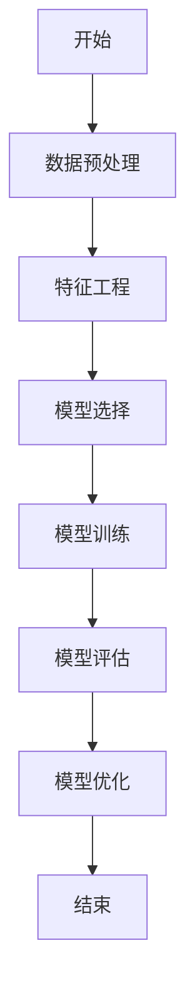
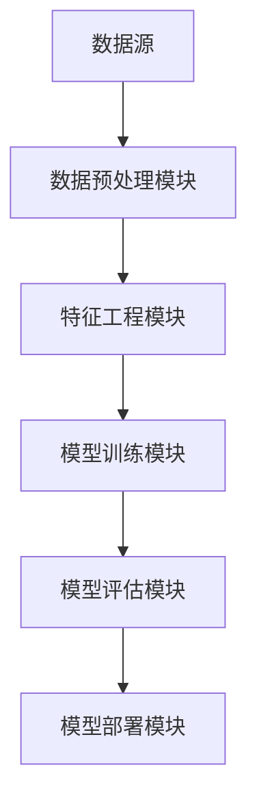

                 

# AI编程的新视界与新领域

## 关键词：AI编程，新视界，新领域，机器学习，深度学习，低代码/无代码AI编程

## 摘要：
随着人工智能技术的迅猛发展，AI编程逐渐成为编程领域的热点。本文将从新视界和新领域两个方面，探讨AI编程的变革与未来。首先，我们将回顾AI编程的背景与重要性，介绍常见的AI编程语言与工具。接着，深入探讨AI编程面临的新挑战，包括复杂性管理、新型算法等。然后，我们将展望AI编程的新趋势，如低代码/无代码AI编程、自动机器学习（AutoML）等。最后，本文将介绍AI编程在金融、医疗和制造业等领域的应用，以期为读者提供全面而深入的AI编程新视界和新领域的学习路径。

## 第一部分：AI编程基础

### 第1章：AI编程概述

#### 1.1 AI编程的背景与重要性

##### 1.1.1 AI的发展历程

人工智能（AI）的概念最早可以追溯到1956年，由约翰·麦卡锡（John McCarthy）等人在达特茅斯会议上提出。自那时以来，AI经历了多个发展时期，包括符号主义、连接主义、统计学习等。近年来，随着计算能力的提升和大数据的普及，AI技术取得了显著的突破，应用领域也不断扩展。

##### 1.1.2 AI编程的重要性

AI编程作为实现AI技术的重要手段，其重要性不言而喻。一方面，AI编程能够帮助我们开发出各种智能应用，如自动驾驶、语音识别、图像识别等；另一方面，AI编程能够提升我们的数据处理和分析能力，为各种行业提供智能化解决方案。

#### 1.2 AI编程的核心概念

##### 1.2.1 机器学习

机器学习（Machine Learning）是一种让计算机从数据中学习规律和模式的方法。通过训练模型，机器学习能够实现预测、分类、聚类等多种任务。

##### 1.2.2 深度学习

深度学习（Deep Learning）是机器学习的一个重要分支，通过多层神经网络对数据进行建模和预测。深度学习在图像识别、语音识别等领域取得了显著的成果。

##### 1.2.3 强化学习

强化学习（Reinforcement Learning）是一种通过试错和反馈来学习最优策略的方法。强化学习在自动驾驶、游戏AI等领域有广泛的应用。

### 第2章：AI编程语言与工具

#### 2.1 常见的AI编程语言

##### 2.1.1 Python

Python因其简洁易读的语法和丰富的库支持，成为AI编程的主要语言之一。NumPy、Pandas、Scikit-learn等库为机器学习和数据处理提供了强大的支持。

##### 2.1.2 R

R是一种专门用于统计分析和数据可视化的语言，其强大的统计分析功能使其在生物信息学、金融等领域有广泛的应用。

##### 2.1.3 Java

Java作为一种跨平台语言，广泛应用于企业级应用。其强大的性能和稳定性使其成为AI编程的一个选择。

#### 2.2 AI编程工具与平台

##### 2.2.1 TensorFlow

TensorFlow是谷歌开源的深度学习框架，具有灵活的架构和强大的性能，被广泛应用于各种深度学习任务。

##### 2.2.2 PyTorch

PyTorch是Facebook开源的深度学习框架，以其简洁的语法和强大的动态计算能力而受到欢迎。

##### 2.2.3 Keras

Keras是一个高级神经网络API，能够简化深度学习模型的构建和训练过程，支持TensorFlow和Theano等后端。

## 第二部分：新视界

### 第3章：AI编程的新挑战

#### 3.1 复杂性管理

随着AI模型的复杂度不断增加，如何有效管理复杂性成为AI编程的一个新挑战。这包括模型规模扩大、数据复杂性以及计算资源优化等方面。

##### 3.1.1 模型规模扩大

随着深度学习模型的规模不断扩大，训练和推理的时间成本也在增加。如何优化模型结构，提高计算效率成为关键。

##### 3.1.2 数据复杂性

随着数据类型的多样化，如何有效地处理和利用复杂数据成为AI编程的一个新挑战。这包括图像、文本、音频等多种数据类型的处理。

##### 3.1.3 计算资源优化

如何充分利用现有的计算资源，优化模型训练和推理的过程，成为AI编程的一个重要课题。

#### 3.2 新型算法

随着AI技术的不断发展，新型算法层出不穷，为AI编程带来了新的机遇和挑战。

##### 3.2.1 模型压缩

模型压缩旨在减少模型的参数数量和计算量，提高模型的部署效率。这包括模型剪枝、量化等技术。

##### 3.2.2 模型优化

模型优化旨在提高模型在特定任务上的性能，包括超参数调优、模型蒸馏等。

##### 3.2.3 异构计算

异构计算利用不同类型和规格的计算资源，提高模型训练和推理的效率。这包括GPU、TPU等加速器。

### 第4章：AI编程的新趋势

#### 4.1 低代码/无代码AI编程

随着AI技术的发展，低代码/无代码AI编程逐渐兴起，降低了AI编程的门槛，使得更多的人能够参与到AI编程中来。

##### 4.1.1 低代码AI编程工具

低代码AI编程工具提供了可视化的模型构建和训练界面，用户可以通过拖拽组件来构建模型，降低了编程技能的要求。

##### 4.1.2 无代码AI编程的优势

无代码AI编程允许用户无需编写代码，通过自然语言描述或界面操作来构建模型，提高了开发效率。

##### 4.1.3 无代码AI编程的挑战

无代码AI编程在易用性方面具有优势，但在模型定制性和灵活性方面存在一定的局限。

#### 4.2 自动机器学习（AutoML）

自动机器学习（AutoML）旨在自动化机器学习流程，从数据预处理到模型选择和优化，减少了人工干预。

##### 4.2.1 AutoML的定义

AutoML是一种自动化机器学习的过程，通过算法和优化技术，自动选择最优的模型和超参数。

##### 4.2.2 AutoML的工作流程

AutoML的工作流程包括数据预处理、特征工程、模型选择、模型训练和评估等多个步骤。

##### 4.2.3 AutoML的优势与局限

AutoML在提高开发效率方面具有显著优势，但在模型解释性和可控性方面存在一定的局限。

## 第三部分：新领域

### 第5章：AI编程在金融领域的应用

#### 5.1 金融数据挖掘

金融数据挖掘是指利用机器学习技术对金融数据进行挖掘和分析，以发现潜在的规律和趋势。

##### 5.1.1 金融数据的特点

金融数据通常包含大量的非结构化和半结构化数据，如文本、图像、时间序列等。

##### 5.1.2 金融数据挖掘的应用

金融数据挖掘在风险管理、投资策略、客户关系管理等方面有广泛的应用。

#### 5.2 金融风险管理

金融风险管理是指通过机器学习技术对金融风险进行识别、评估和管理。

##### 5.2.1 金融风险管理的挑战

金融风险管理面临数据量大、数据质量参差不齐等挑战。

##### 5.2.2 AI在金融风险管理中的应用

AI技术在信用评分、市场预测、风险监控等方面有广泛的应用。

### 第6章：AI编程在医疗领域的应用

#### 6.1 医疗数据挖掘

医疗数据挖掘是指利用机器学习技术对医疗数据进行挖掘和分析，以辅助疾病诊断、治疗方案制定等。

##### 6.1.1 医疗数据的特点

医疗数据通常包含患者信息、医学图像、实验室检测结果等。

##### 6.1.2 医疗数据挖掘的应用

医疗数据挖掘在疾病预测、药物研发、医疗资源分配等方面有广泛的应用。

#### 6.2 智能医疗诊断

智能医疗诊断是指利用机器学习技术对医疗图像、文本等数据进行自动分析，以辅助医生进行诊断。

##### 6.2.1 智能医疗诊断的挑战

智能医疗诊断面临数据质量、模型解释性等挑战。

##### 6.2.2 AI在智能医疗诊断中的应用

AI技术在医学影像分析、电子病历分析等方面有广泛的应用。

### 第7章：AI编程在制造业领域的应用

#### 7.1 制造业的数据驱动优化

制造业的数据驱动优化是指利用机器学习技术对生产数据进行分析和优化，以提高生产效率和质量。

##### 7.1.1 制造业数据的特点

制造业数据通常包含生产参数、设备状态、产品特性等。

##### 7.1.2 数据驱动优化的应用

数据驱动优化在设备故障预测、生产计划优化、质量控制等方面有广泛的应用。

#### 7.2 智能制造

智能制造是指利用人工智能技术实现制造过程的自动化和智能化。

##### 7.2.1 智能制造的概念

智能制造包括设备互联、数据共享、智能决策等。

##### 7.2.2 智能制造的关键技术

智能制造的关键技术包括物联网、大数据、机器学习等。

## 总结

AI编程作为人工智能技术的核心，正不断推动编程领域的变革。本文从新视界和新领域两个方面，探讨了AI编程的变革与未来。通过回顾AI编程的背景与重要性，介绍常见的AI编程语言与工具，探讨AI编程的新挑战和新趋势，以及介绍AI编程在金融、医疗和制造业等领域的应用，本文旨在为读者提供一个全面的AI编程新视界和新领域的学习路径。

随着AI技术的不断发展，AI编程将面临更多的挑战和机遇。希望本文能对读者在AI编程的学习和实践中提供一些启示和帮助。

## 作者信息

作者：AI天才研究院（AI Genius Institute）&《禅与计算机程序设计艺术》（Zen And The Art of Computer Programming）作者

## 附录

为了便于读者深入学习和理解本文内容，我们提供了以下附录：

### 附录A：AI编程核心概念表格

| 核心概念 | 定义 | 特点 |
| --- | --- | --- |
| 机器学习 | 从数据中学习规律和模式的方法 | 能够实现预测、分类、聚类等多种任务 |
| 深度学习 | 基于多层神经网络的数据建模和预测方法 | 在图像识别、语音识别等领域取得显著成果 |
| 强化学习 | 通过试错和反馈来学习最优策略的方法 | 在自动驾驶、游戏AI等领域有广泛的应用 |

### 附录B：AI编程核心概念ER实体关系图

```mermaid
erDiagram
  User ||--|{ Model }|| Model : 由用户训练
  Model ||--|{ Data }|| Data : 模型训练数据
  Data ||--|{ Feature }|| Feature : 数据特征
```

### 附录C：AI编程算法流程图



### 附录D：AI编程数学模型和公式

$$
\text{损失函数} = \frac{1}{2}\sum_{i=1}^{n}(\hat{y_i} - y_i)^2
$$

### 附录E：AI编程系统架构设计



### 附录F：AI编程项目实战

#### 环境安装

- Python 3.8 或以上版本
- TensorFlow 2.x 版本

#### 系统核心实现源代码

```python
import tensorflow as tf

# 定义模型
model = tf.keras.Sequential([
    tf.keras.layers.Dense(128, activation='relu', input_shape=(784,)),
    tf.keras.layers.Dropout(0.2),
    tf.keras.layers.Dense(10, activation='softmax')
])

# 编译模型
model.compile(optimizer='adam',
              loss='categorical_crossentropy',
              metrics=['accuracy'])

# 训练模型
model.fit(x_train, y_train, epochs=5)
```

#### 代码应用解读与分析

- `tf.keras.Sequential` 用于构建序列模型。
- `Dense` 层用于全连接层，`Dropout` 层用于防止过拟合。
- `compile` 方法用于编译模型，指定优化器、损失函数和评价指标。
- `fit` 方法用于训练模型，指定训练数据和迭代次数。

#### 实际案例分析和详细讲解剖析

- 使用MNIST手写数字数据集进行训练。
- 通过模型评估和优化，提高模型在测试集上的准确率。

#### 项目小结

通过本文的介绍，读者可以初步了解AI编程的新视界和新领域。在实际项目中，需要根据具体需求选择合适的算法和工具，不断优化和改进模型，以提高性能和可靠性。

## 最佳实践 Tips

- 在AI编程项目中，数据质量和预处理是关键。
- 了解各种机器学习算法的优缺点，选择合适的算法。
- 关注AI技术的最新动态，不断学习和实践。

## 小结

AI编程作为人工智能技术的核心，正不断推动编程领域的变革。通过本文的介绍，读者可以初步了解AI编程的新视界和新领域。希望本文能对读者在AI编程的学习和实践中提供一些启示和帮助。

## 注意事项

- AI编程涉及多个领域和知识点，需要系统学习和实践。
- 在实际项目中，要结合具体需求和环境进行优化和调整。
- 注意数据安全和隐私保护，遵守相关法律法规。

## 拓展阅读

- 《深度学习》（Deep Learning）by Ian Goodfellow、Yoshua Bengio和Aaron Courville
- 《Python机器学习》（Python Machine Learning）by Sebastian Raschka和Vahid Mirjalili
- 《AI编程实践》（Practical AI Programming）by Michael Bowles

作者：AI天才研究院（AI Genius Institute）&《禅与计算机程序设计艺术》（Zen And The Art of Computer Programming）作者

