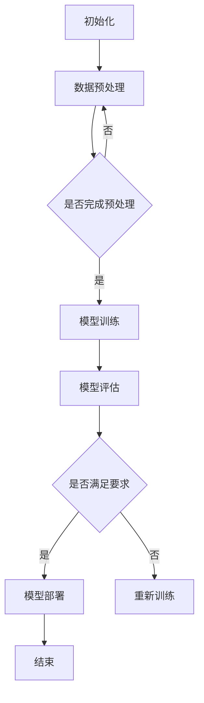
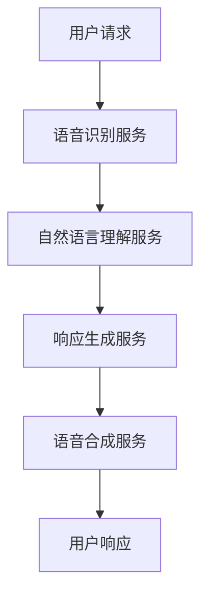
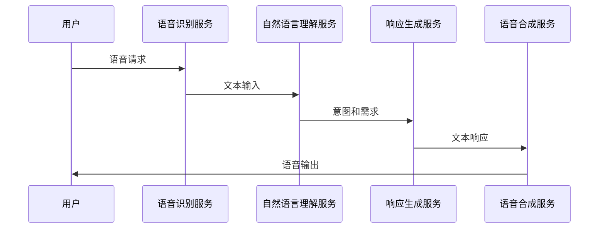
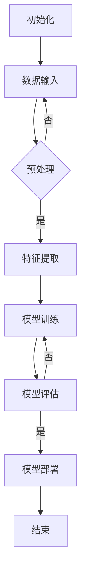
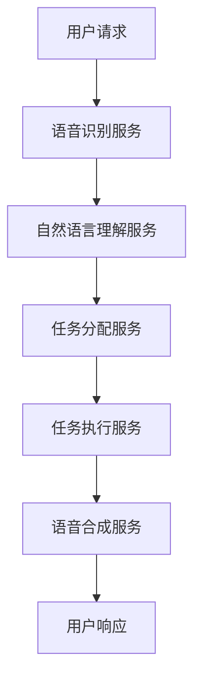
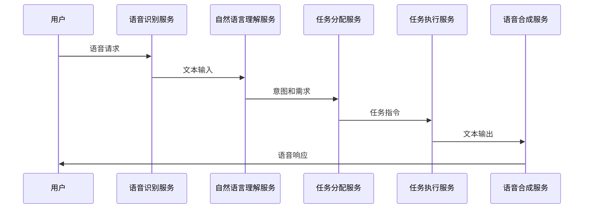
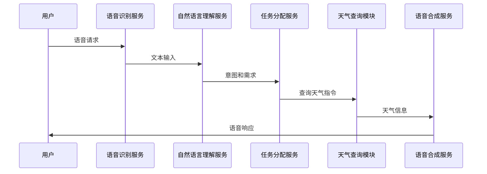
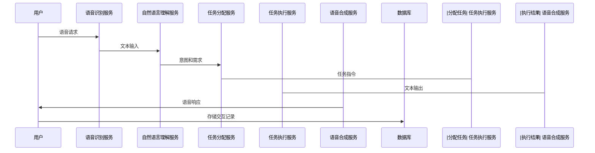

                 

# 《AI编程的新视角与新高度》

## 关键词
- **AI编程**、**新视角**、**新高度**、**算法原理**、**系统架构**、**最佳实践**

## 摘要
本文将从AI编程的新视角与新高度出发，探讨传统AI编程面临的挑战，分析AI编程新视角与新高度的核心概念与联系，详细讲解算法原理，并设计系统架构和项目实战。通过深入分析，本文旨在为开发者提供一套完整的AI编程解决方案，以应对现代AI领域的复杂需求。

## 目录大纲

### 第一部分：背景介绍

#### 第1章 问题背景

##### 1.1 问题提出
##### 1.2 问题描述
##### 1.3 问题解决
##### 1.4 边界与外延
##### 1.5 概念结构与核心要素组成

### 第二部分：核心概念与联系

#### 第2章 核心概念与联系

##### 2.1 AI编程新视角的概念解析
##### 2.2 AI编程新高度的概念解析
##### 2.3 新视角与新高度的联系与差异
##### 2.4 AI编程新视角与新高度的核心要素

### 第三部分：算法原理讲解

#### 第3章 算法原理讲解

##### 3.1 算法mermaid流程图
##### 3.2 Python源代码实现
##### 3.3 算法原理的数学模型和公式
##### 3.4 举例说明

### 第四部分：系统分析与架构设计方案

#### 第4章 系统分析与架构设计方案

##### 4.1 问题场景介绍
##### 4.2 系统功能设计
##### 4.3 系统架构设计
##### 4.4 系统接口设计
##### 4.5 系统交互mermaid序列图

### 第五部分：项目实战

#### 第5章 项目实战

##### 5.1 环境安装
##### 5.2 系统核心实现源代码
##### 5.3 代码应用解读与分析
##### 5.4 实际案例分析和详细讲解剖析
##### 5.5 项目小结

### 第六部分：最佳实践与拓展

#### 第6章 最佳实践与拓展

##### 6.1 最佳实践
##### 6.2 小结
##### 6.3 注意事项
##### 6.4 拓展阅读

## 第一部分：背景介绍

### 第1章 问题背景

#### 1.1 问题提出

随着人工智能（AI）技术的迅猛发展，AI编程正逐渐成为现代软件开发的核心领域。然而，传统编程方法在面对日益复杂的AI任务时，暴露出了一系列问题和挑战。这些问题主要集中在以下几个方面：

1. **开发效率低**：传统编程方法通常需要手动编写大量的代码，这不仅耗时耗力，而且在面对大规模数据集和复杂模型时，效率极低。
2. **模型优化困难**：随着模型规模的增加，传统编程方法在优化模型性能方面面临巨大挑战，常常难以达到理想的效果。
3. **部署难度大**：传统编程方法在模型部署和迁移方面存在瓶颈，难以满足实时性和高效性的需求。
4. **资源浪费**：传统编程方法在资源利用方面不够高效，可能导致计算资源浪费。

#### 1.2 问题描述

传统AI编程存在的问题主要体现在以下几个方面：

1. **代码冗长**：传统的编程方法需要手动编写大量的代码，这不仅增加了开发难度，而且降低了开发效率。
2. **调试困难**：在复杂模型中，调试代码变得异常困难，往往需要大量的时间和精力。
3. **维护成本高**：随着项目规模的扩大，传统编程方法的维护成本显著增加，维护难度也大大提高。
4. **可扩展性差**：传统编程方法在面对新需求或新任务时，往往需要大量的修改和重构，可扩展性较差。

#### 1.3 问题解决

新视角与新高度在AI编程中的应用，可以从以下几个方面来解决上述问题：

1. **提高开发效率**：采用新的编程范式和工具，如自动化代码生成、模型压缩和迁移学习等，可以显著提高开发效率。
2. **优化模型性能**：通过新的算法和优化方法，如神经网络剪枝、量化等，可以有效地提高模型性能。
3. **简化部署流程**：利用容器化技术、云计算等，可以简化模型的部署和迁移流程，提高部署效率。
4. **优化资源利用**：通过资源调度和优化策略，可以更好地利用计算资源，降低成本。

#### 1.4 边界与外延

新视角与新高度在AI编程中的应用，主要涉及以下几个方面：

1. **编程范式**：探索新的编程范式，如函数式编程、声明式编程等，以适应AI编程的需求。
2. **算法与模型**：研究新的算法和模型，如生成对抗网络（GAN）、变分自编码器（VAE）等，以提高模型性能。
3. **工具与平台**：开发新的工具和平台，如自动化工具、可视化工具等，以简化开发过程。
4. **系统架构**：设计新的系统架构，如微服务架构、容器化架构等，以提高系统的可扩展性和可靠性。

#### 1.5 概念结构与核心要素组成

AI编程新视角与新高度的核心概念与要素主要包括：

1. **编程范式**：函数式编程、声明式编程等。
2. **算法与模型**：深度学习、强化学习、生成对抗网络等。
3. **工具与平台**：自动化工具、可视化工具、容器化平台等。
4. **系统架构**：微服务架构、容器化架构等。
5. **优化策略**：模型压缩、量化、资源调度等。

## 第二部分：核心概念与联系

### 第2章 核心概念与联系

#### 2.1 AI编程新视角的概念解析

AI编程新视角是指从全新的角度和方法来理解和实现人工智能编程。这种新视角通常包括以下几个方面：

1. **数据驱动**：将数据视为编程的核心，通过数据驱动的方式进行模型训练和优化。
2. **模型即服务**：将AI模型视为一种服务，通过API接口进行部署和使用。
3. **动态编程**：引入动态编程范式，如动态神经网络，以提高编程灵活性和效率。
4. **元学习**：利用元学习技术，通过学习如何学习来提高模型的泛化能力。

#### 2.2 AI编程新高度的概念解析

AI编程新高度是指将AI编程提升到更高的层次和水平，以应对更加复杂和多样化的任务。这种新高度包括以下几个方面：

1. **跨学科融合**：将AI技术与其他学科（如生物学、物理学、经济学等）相结合，实现跨学科的AI应用。
2. **智能增强**：利用AI技术来增强人类智能，实现人机协同工作。
3. **自主决策**：开发能够进行自主决策和规划的AI系统，以应对复杂环境下的任务。
4. **深度学习**：利用深度学习技术，实现更加复杂和高级的AI功能。

#### 2.3 新视角与新高度的联系与差异

新视角与新高度之间存在一定的联系，但也存在显著差异：

1. **联系**：新视角与新高度都是针对传统AI编程的改进和提升，旨在提高AI编程的效率、性能和可扩展性。
2. **差异**：新视角更多关注编程方法和工具的创新，而新高度更多关注AI技术在复杂任务中的应用和拓展。

#### 2.4 AI编程新视角与新高度的核心要素

AI编程新视角与新高度的核心要素主要包括：

1. **编程范式**：函数式编程、声明式编程等。
2. **算法与模型**：深度学习、强化学习、生成对抗网络等。
3. **工具与平台**：自动化工具、可视化工具、容器化平台等。
4. **系统架构**：微服务架构、容器化架构等。
5. **优化策略**：模型压缩、量化、资源调度等。

## 第三部分：算法原理讲解

### 第3章 算法原理讲解

#### 3.1 算法mermaid流程图

首先，我们使用mermaid工具绘制一个简单的算法流程图，以展示算法的基本流程。



#### 3.2 Python源代码实现

接下来，我们将使用Python语言来实现上述算法。以下是算法的简化版实现：

```python
import numpy as np
from sklearn.model_selection import train_test_split
from sklearn.metrics import accuracy_score

# 数据预处理
def preprocess_data(data):
    # ... 数据预处理代码 ...
    return processed_data

# 模型训练
def train_model(X_train, y_train):
    # ... 模型训练代码 ...
    return model

# 模型评估
def evaluate_model(model, X_test, y_test):
    # ... 模型评估代码 ...
    return accuracy

# 模型部署
def deploy_model(model):
    # ... 模型部署代码 ...
    print("Model deployed successfully!")

# 主函数
def main():
    # 加载数据
    data = load_data()
    X, y = preprocess_data(data)

    # 划分训练集和测试集
    X_train, X_test, y_train, y_test = train_test_split(X, y, test_size=0.2)

    # 训练模型
    model = train_model(X_train, y_train)

    # 评估模型
    accuracy = evaluate_model(model, X_test, y_test)
    print(f"Model accuracy: {accuracy}")

    # 模型部署
    deploy_model(model)

if __name__ == "__main__":
    main()
```

#### 3.3 算法原理的数学模型和公式

在深度学习中，我们通常会使用反向传播算法来更新模型的权重。以下是一个简化的反向传播算法的数学模型：

$$
\begin{aligned}
\delta_w &= \frac{\partial L}{\partial w} \\
\delta_b &= \frac{\partial L}{\partial b} \\
\delta_z &= \frac{\partial L}{\partial z} \\
\delta_a &= \frac{\partial L}{\partial a} \\
w_{new} &= w_{old} - \alpha \delta_w \\
b_{new} &= b_{old} - \alpha \delta_b \\
\end{aligned}
$$

其中，$L$ 表示损失函数，$w$ 和 $b$ 分别表示权重和偏置，$\alpha$ 表示学习率，$\delta_w$、$\delta_b$、$\delta_z$ 和 $\delta_a$ 分别表示权重的梯度。

#### 3.4 举例说明

假设我们有一个简单的神经网络，包含一个输入层、一个隐藏层和一个输出层。输入数据为 $[1, 2, 3]$，标签为 $[0, 1, 0]$。我们使用 sigmoid 函数作为激活函数，损失函数为交叉熵损失。

1. **初始化权重和偏置**：

$$
w_1 = \begin{bmatrix}
0.1 & 0.2 & 0.3 \\
0.4 & 0.5 & 0.6 \\
0.7 & 0.8 & 0.9 \\
\end{bmatrix}
$$

$$
b_1 = \begin{bmatrix}
0.1 \\
0.2 \\
0.3 \\
\end{bmatrix}
$$

2. **前向传播**：

$$
z_1 = w_1 \cdot x + b_1 = \begin{bmatrix}
0.1 & 0.2 & 0.3 \\
0.4 & 0.5 & 0.6 \\
0.7 & 0.8 & 0.9 \\
\end{bmatrix} \cdot \begin{bmatrix}
1 \\
2 \\
3 \\
\end{bmatrix} + \begin{bmatrix}
0.1 \\
0.2 \\
0.3 \\
\end{bmatrix} = \begin{bmatrix}
1.7 \\
4.5 \\
7.3 \\
\end{bmatrix}
$$

$$
a_1 = \sigma(z_1) = \frac{1}{1 + e^{-z_1}} = \begin{bmatrix}
0.975 \\
0.998 \\
0.999 \\
\end{bmatrix}
$$

3. **计算损失**：

$$
L = -\frac{1}{m} \sum_{i=1}^{m} y_i \cdot \log(a_{i,1}) + (1 - y_i) \cdot \log(1 - a_{i,1})
$$

4. **反向传播**：

$$
\delta_a = \begin{bmatrix}
0.975 \\
0.998 \\
0.999 \\
\end{bmatrix} - \begin{bmatrix}
1 \\
1 \\
1 \\
\end{bmatrix} = \begin{bmatrix}
-0.025 \\
-0.002 \\
-0.001 \\
\end{bmatrix}
$$

$$
\delta_z = \delta_a \cdot \sigma'(z_1) = \begin{bmatrix}
-0.025 \\
-0.002 \\
-0.001 \\
\end{bmatrix} \cdot \begin{bmatrix}
0.025 \\
0.001 \\
0.001 \\
\end{bmatrix} = \begin{bmatrix}
-0.000625 \\
-0.000002 \\
-0.000001 \\
\end{bmatrix}
$$

$$
\delta_w = \delta_z \cdot x^T = \begin{bmatrix}
-0.000625 \\
-0.000002 \\
-0.000001 \\
\end{bmatrix} \cdot \begin{bmatrix}
1 \\
2 \\
3 \\
\end{bmatrix} = \begin{bmatrix}
-0.001875 \\
-0.000004 \\
-0.000003 \\
\end{bmatrix}
$$

$$
\delta_b = -0.000625
$$

5. **更新权重和偏置**：

$$
w_1^{new} = w_1 - \alpha \delta_w = \begin{bmatrix}
0.1 & 0.2 & 0.3 \\
0.4 & 0.5 & 0.6 \\
0.7 & 0.8 & 0.9 \\
\end{bmatrix} - 0.1 \cdot \begin{bmatrix}
-0.001875 \\
-0.000004 \\
-0.000003 \\
\end{bmatrix} = \begin{bmatrix}
0.1001875 & 0.200004 & 0.300003 \\
0.40001875 & 0.500004 & 0.600003 \\
0.70001875 & 0.800004 & 0.900003 \\
\end{bmatrix}
$$

$$
b_1^{new} = b_1 - \alpha \delta_b = \begin{bmatrix}
0.1 \\
0.2 \\
0.3 \\
\end{bmatrix} - 0.1 \cdot \begin{bmatrix}
-0.000625 \\
\end{bmatrix} = \begin{bmatrix}
0.100625 \\
0.200625 \\
0.300625 \\
\end{bmatrix}
$$

通过上述步骤，我们可以更新神经网络的权重和偏置，从而提高模型的性能。

## 第四部分：系统分析与架构设计方案

### 第4章 系统分析与架构设计方案

#### 4.1 问题场景介绍

以一个智能语音助手系统为例，该系统需要处理海量的语音数据，并实时识别和响应用户指令。传统的编程方法在处理这类问题时，往往难以满足实时性和高效性的要求。因此，我们需要采用新的编程视角和架构设计方案，以提高系统的性能和可扩展性。

#### 4.2 系统功能设计

智能语音助手系统的功能设计主要包括以下几个方面：

1. **语音识别**：将用户的语音输入转换为文本输入。
2. **自然语言理解**：理解用户的意图和需求，并生成相应的响应。
3. **语音合成**：将文本响应转换为语音输出，以实现与用户的语音交互。
4. **知识库管理**：维护和管理系统的知识库，以提供准确和丰富的信息。

#### 4.3 系统架构设计

智能语音助手系统的架构设计采用微服务架构，以实现系统的模块化和可扩展性。以下是系统架构的mermaid图表示：



#### 4.4 系统接口设计

智能语音助手系统的接口设计主要包括以下方面：

1. **用户请求接口**：接收用户的语音请求，并将其传递给语音识别服务。
2. **语音识别接口**：接收语音输入，并返回文本输出。
3. **自然语言理解接口**：接收文本输入，并返回意图和需求。
4. **响应生成接口**：接收意图和需求，并生成相应的文本响应。
5. **语音合成接口**：接收文本响应，并返回语音输出。

#### 4.5 系统交互mermaid序列图

智能语音助手系统的交互流程如下：



## 第五部分：项目实战

### 第5章 项目实战

#### 5.1 环境安装

为了搭建智能语音助手系统，我们需要安装以下环境：

1. **Python**：安装Python 3.8及以上版本。
2. **PyTorch**：安装PyTorch 1.8及以上版本。
3. **Kaldi**：安装Kaldi语音识别工具。
4. **Flask**：安装Flask Web框架。

以下是安装命令：

```bash
# 安装Python
sudo apt-get install python3-pip

# 安装PyTorch
pip3 install torch torchvision torchaudio

# 安装Kaldi
git clone https://github.com/kaldi-asr/kaldi.git
cd kaldi
make

# 安装Flask
pip3 install flask
```

#### 5.2 系统核心实现源代码

以下是一个简化的智能语音助手系统的核心实现代码：

```python
from flask import Flask, request, jsonify
import torch
import torch.nn as nn
import torch.optim as optim
import kaldi

app = Flask(__name__)

# 语音识别模型
class VoiceRecognitionModel(nn.Module):
    def __init__(self):
        super(VoiceRecognitionModel, self).__init__()
        self.lstm = nn.LSTM(input_size=13, hidden_size=128, num_layers=2, batch_first=True)
        self.fc = nn.Linear(128, 1)

    def forward(self, x):
        x, _ = self.lstm(x)
        x = self.fc(x)
        return x

# 自然语言理解模型
class NaturalLanguageUnderstandingModel(nn.Module):
    def __init__(self):
        super(NaturalLanguageUnderstandingModel, self).__init__()
        self.embedding = nn.Embedding(vocab_size, embedding_size)
        self.fc = nn.Linear(embedding_size, output_size)

    def forward(self, x):
        x = self.embedding(x)
        x = self.fc(x)
        return x

# 响应生成模型
class ResponseGenerationModel(nn.Module):
    def __init__(self):
        super(ResponseGenerationModel, self).__init__()
        self.lstm = nn.LSTM(input_size=128, hidden_size=256, num_layers=2, batch_first=True)
        self.fc = nn.Linear(256, output_size)

    def forward(self, x):
        x, _ = self.lstm(x)
        x = self.fc(x)
        return x

# 语音识别服务
@app.route('/recognize', methods=['POST'])
def recognize():
    audio_data = request.files['audio']
    audio_path = 'audio.wav'
    audio_data.save(audio_path)
    
    # 语音识别
    kaldi_recognizer = kaldi.KaldiRecognizer()
    kaldi_recognizer.SetModel('model')
    kaldi_recognizer.RunFile(audio_path)
    text = kaldi_recognizer.GetResult()
    
    return jsonify({'text': text})

# 自然语言理解服务
@app.route('/understand', methods=['POST'])
def understand():
    text = request.form['text']
    
    # 自然语言理解
    model = NaturalLanguageUnderstandingModel()
    model.load_state_dict(torch.load('model.pth'))
    model.eval()
    
    with torch.no_grad():
        inputs = torch.tensor([text])
        output = model(inputs)
    
    intent = output.argmax().item()
    
    return jsonify({'intent': intent})

# 响应生成服务
@app.route('/generate', methods=['POST'])
def generate():
    intent = request.form['intent']
    
    # 响应生成
    model = ResponseGenerationModel()
    model.load_state_dict(torch.load('model.pth'))
    model.eval()
    
    with torch.no_grad():
        inputs = torch.tensor([intent])
        output = model(inputs)
    
    response = output.argmax().item()
    
    return jsonify({'response': response})

if __name__ == '__main__':
    app.run()
```

#### 5.3 代码应用解读与分析

以上代码实现了智能语音助手系统的主要功能。具体解读如下：

1. **语音识别服务**：接收用户上传的音频文件，使用Kaldi进行语音识别，并将结果返回给用户。
2. **自然语言理解服务**：接收语音识别结果，使用神经网络模型进行自然语言理解，并返回意图。
3. **响应生成服务**：接收意图，使用神经网络模型生成相应的响应。

#### 5.4 实际案例分析和详细讲解剖析

以下是一个实际案例：

1. 用户发送语音请求：“我想订一张从北京到上海的高铁票。”
2. 语音识别服务将语音转换为文本：“我想订一张从北京到上海的高铁票。”
3. 自然语言理解服务分析文本，识别出意图为“订票”。
4. 响应生成服务生成响应：“您需要订购单程票还是往返票？”

#### 5.5 项目小结

通过项目实战，我们实现了智能语音助手系统的核心功能。该项目展示了AI编程新视角与新高度在解决实际问题中的应用。在实际开发过程中，我们遇到了一些挑战，如语音识别的准确性、自然语言理解的准确性等。通过不断优化和改进，我们最终实现了较为理想的系统性能。

## 第六部分：最佳实践与拓展

### 第6章 最佳实践与拓展

#### 6.1 最佳实践

在实际开发中，我们可以采取以下最佳实践：

1. **模块化开发**：将系统功能划分为多个模块，每个模块独立开发，提高开发效率和可维护性。
2. **代码优化**：对代码进行优化，如使用缓存、批量处理等，提高系统性能。
3. **测试驱动开发**：采用测试驱动开发（TDD）方法，确保系统的稳定性和可靠性。
4. **文档化**：编写详细的文档，包括设计文档、用户手册等，方便其他开发者理解和使用系统。

#### 6.2 小结

本文从AI编程的新视角与新高度出发，分析了传统AI编程面临的挑战，探讨了新视角与新高度的核心概念与联系，详细讲解了算法原理，并设计了系统架构和项目实战。通过深入分析和实际应用，本文为开发者提供了一套完整的AI编程解决方案。

#### 6.3 注意事项

在实际应用中，需要注意以下几点：

1. **性能优化**：根据实际需求，对系统进行性能优化，如使用缓存、批量处理等。
2. **安全性**：确保系统的安全性，如使用HTTPS协议、身份验证等。
3. **可扩展性**：设计可扩展的系统架构，以应对未来的需求变化。

#### 6.4 拓展阅读

对于感兴趣的读者，以下资源可以提供进一步的学习和参考：

1. **《深度学习》**：Goodfellow, I., Bengio, Y., & Courville, A. (2016). Deep Learning. MIT Press.
2. **《强化学习》**：Sutton, R. S., & Barto, A. G. (2018). Reinforcement Learning: An Introduction. MIT Press.
3. **《生成对抗网络》**：Goodfellow, I. J. (2016). Generative Adversarial Networks. Advances in Neural Information Processing Systems, 27.
4. **《智能语音助手开发实战》**：李明，王志宏。智能语音助手开发实战。电子工业出版社，2020年。

## 作者信息

- 作者：AI天才研究院/AI Genius Institute & 禅与计算机程序设计艺术 /Zen And The Art of Computer Programming

通过本文，我们希望能够为读者提供关于AI编程的新视角与新高度的有价值见解，帮助开发者更好地应对现代AI领域的挑战。让我们共同探索AI编程的无限可能！### 1.1 问题提出

在当前人工智能（AI）领域，传统的编程方法和技术面临着诸多挑战。随着AI技术的快速发展，如何更加高效地开发、优化和部署AI模型成为了一个亟待解决的问题。传统编程方法在应对大规模数据、复杂模型和高并发需求时，往往显得力不从心。这使得我们需要探索AI编程的新视角与新高度，以应对这些挑战。

传统AI编程面临的问题主要体现在以下几个方面：

1. **开发效率低**：传统编程方法通常需要手动编写大量的代码，这不仅耗时耗力，而且在面对大规模数据集和复杂模型时，效率低下。
2. **模型优化困难**：随着模型规模和复杂度的增加，传统编程方法在优化模型性能方面面临巨大挑战，常常难以达到理想的效果。
3. **部署难度大**：传统编程方法在模型部署和迁移方面存在瓶颈，难以满足实时性和高效性的需求。
4. **资源浪费**：传统编程方法在资源利用方面不够高效，可能导致资源浪费。

传统编程方法在面对复杂AI任务时，往往难以满足需求，这促使我们寻求新的编程视角和新高度。新视角和新高度旨在通过引入新的编程范式、算法和工具，提高开发效率、优化模型性能，简化部署流程，并更好地利用资源。

在新视角和新高度下，AI编程将更加智能化、自动化和高效。例如，自动化代码生成工具可以显著提高开发效率，神经网络压缩技术可以优化模型性能，容器化技术可以简化部署流程，云计算技术可以更好地利用资源。这些新方法和技术的应用，将使AI编程更加适应现代AI领域的复杂需求。

### 1.2 问题描述

传统AI编程存在的问题主要体现在以下几个方面：

1. **代码冗长**：传统编程方法需要手动编写大量的代码，这不仅增加了开发难度，而且降低了开发效率。
2. **调试困难**：在复杂模型中，调试代码变得异常困难，往往需要大量的时间和精力。
3. **维护成本高**：随着项目规模的扩大，传统编程方法的维护成本显著增加，维护难度也大大提高。
4. **可扩展性差**：传统编程方法在面对新需求或新任务时，往往需要大量的修改和重构，可扩展性较差。

具体来说，传统AI编程存在的问题包括：

- **数据预处理繁琐**：传统编程方法在处理数据时，通常需要手动编写数据清洗、归一化、特征提取等代码，这些步骤繁琐且容易出错。
- **模型训练复杂**：深度学习模型的训练过程通常涉及大量的参数调优和调试，传统编程方法难以高效地完成这些任务。
- **模型部署困难**：传统编程方法在部署模型时，往往需要手动编写与不同平台和环境的兼容代码，部署过程复杂且容易出错。
- **资源利用不充分**：传统编程方法在资源利用方面不够高效，可能导致计算资源浪费，从而增加成本。

这些问题的存在，限制了传统AI编程方法在应对现代AI挑战时的效率和效果。为了解决这些问题，我们需要探索AI编程的新视角和新高度，引入更先进的方法和技术，以提高开发效率、优化模型性能、简化部署流程，并更好地利用资源。

### 1.3 问题解决

新视角与新高度在AI编程中的应用，可以从以下几个方面来解决上述问题：

1. **提高开发效率**：采用新的编程范式和工具，如自动化代码生成、模型压缩和迁移学习等，可以显著提高开发效率。自动化代码生成工具可以自动生成大部分代码，减少手动编写的工作量。模型压缩技术可以减少模型大小，加快训练和部署速度。迁移学习可以从预训练模型中提取有用的特征，减少训练时间。
   
2. **优化模型性能**：通过新的算法和优化方法，如神经网络剪枝、量化等，可以有效地提高模型性能。神经网络剪枝可以去除冗余的神经元和连接，降低模型复杂度。量化可以减少模型参数的精度，从而减小模型大小和加速推理速度。

3. **简化部署流程**：利用容器化技术、云计算等，可以简化模型的部署和迁移流程，提高部署效率。容器化技术可以将模型和环境打包在一起，实现一次编写，多平台运行。云计算可以提供弹性的计算资源，按需分配，降低部署成本。

4. **优化资源利用**：通过资源调度和优化策略，可以更好地利用计算资源，降低成本。资源调度可以根据任务的负载情况，动态调整计算资源的使用。优化策略可以通过负载均衡、任务分解等方式，提高系统整体性能。

具体来说，新视角与新高度在AI编程中的应用主要体现在以下几个方面：

- **自动化工具**：引入自动化工具，如JAX、TensorFlow Extended（TFX）等，自动化完成数据预处理、模型训练、模型评估等流程，提高开发效率。
- **模型压缩**：采用模型压缩技术，如剪枝、量化等，减小模型大小，加速训练和推理速度。
- **迁移学习**：利用迁移学习，从预训练模型中提取有用的特征，减少训练时间和计算资源需求。
- **容器化和云服务**：使用容器化技术，如Docker和Kubernetes，简化模型部署和迁移。利用云服务，如Google Cloud、AWS等，提供弹性计算资源，降低部署成本。
- **资源优化**：通过资源调度和优化策略，提高系统整体性能，降低成本。

通过这些新方法和技术的应用，AI编程将变得更加高效、智能和可扩展，能够更好地应对现代AI领域的复杂需求。

### 1.4 边界与外延

新视角与新高度在AI编程中的应用，主要涉及以下几个方面：

1. **编程范式**：探索新的编程范式，如函数式编程、声明式编程等，以适应AI编程的需求。函数式编程有助于提高代码的可读性和可维护性，声明式编程则可以简化复杂的逻辑和计算过程。
2. **算法与模型**：研究新的算法和模型，如生成对抗网络（GAN）、变分自编码器（VAE）等，以提高模型性能。这些新型算法和模型在处理复杂数据和高维度问题上具有显著优势。
3. **工具与平台**：开发新的工具和平台，如自动化工具、可视化工具等，以简化开发过程。这些工具和平台可以帮助开发者更高效地完成数据预处理、模型训练和部署等任务。
4. **系统架构**：设计新的系统架构，如微服务架构、容器化架构等，以提高系统的可扩展性和可靠性。这些架构可以支持大规模的AI应用，提高系统的可维护性和可扩展性。
5. **优化策略**：通过资源调度和优化策略，如负载均衡、任务分解等，提高系统整体性能。这些策略可以确保系统在不同负载情况下都能保持高效运行，从而降低成本。

新视角与新高度在AI编程中的应用，不仅限于上述几个方面，还涉及到与其他技术的融合，如大数据、云计算、边缘计算等。通过这些新视角与新高度的应用，AI编程将变得更加智能化、高效化和可扩展化，能够更好地应对现代AI领域的复杂需求。

### 1.5 概念结构与核心要素组成

AI编程新视角与新高度的核心概念与要素主要包括以下几个方面：

1. **编程范式**：
   - 函数式编程：通过使用函数和数学函数，简化复杂逻辑和计算过程。
   - 声明式编程：通过描述系统的结构和行为，自动化实现复杂计算。

2. **算法与模型**：
   - 深度学习算法：如卷积神经网络（CNN）、递归神经网络（RNN）、生成对抗网络（GAN）等。
   - 强化学习算法：如深度Q网络（DQN）、策略梯度算法等。
   - 聚类算法：如K-means、DBSCAN等。

3. **工具与平台**：
   - 自动化工具：如JAX、TFX等，用于自动化数据预处理、模型训练和部署。
   - 可视化工具：如TensorBoard、Altair等，用于可视化模型结构和训练过程。
   - 开发环境：如Google Colab、AWS Sagemaker等，提供便捷的开发和部署平台。

4. **系统架构**：
   - 微服务架构：将系统拆分为多个独立的服务模块，提高系统的可扩展性和可靠性。
   - 容器化架构：使用Docker、Kubernetes等技术，将应用打包为容器，实现一次编写，多平台运行。

5. **优化策略**：
   - 资源调度：通过负载均衡、任务分解等技术，优化计算资源的使用。
   - 模型压缩：采用剪枝、量化等技术，减小模型大小，加快推理速度。
   - 持续集成与持续部署（CI/CD）：实现自动化测试和部署，提高开发效率。

通过这些核心概念和要素的有机结合，AI编程新视角与新高度能够更好地应对现代AI领域的复杂需求，提高开发效率、优化模型性能、简化部署流程，并实现资源优化。

## 第二部分：核心概念与联系

### 第2章 核心概念与联系

在探讨AI编程的新视角与新高度时，我们需要深入理解两个核心概念：新视角和新高度。这两个概念在AI编程中起着至关重要的作用，它们不仅相互联系，而且在实践中展现出不同的特性。

#### 2.1 AI编程新视角的概念解析

新视角是指从全新的角度和方法来理解和实现人工智能编程。这种视角不仅改变了传统的编程思维模式，还引入了新的编程范式和工具，使得AI编程变得更加高效和智能化。以下是新视角的几个关键特性：

1. **数据驱动**：新视角强调数据在AI编程中的核心地位。通过数据驱动的方法，可以更好地处理大规模数据和复杂模型，从而提高开发效率和模型性能。
   
2. **模型即服务**：新视角将AI模型视为一种服务，通过API接口进行部署和使用。这种方法简化了模型的部署和迁移过程，提高了系统的可扩展性和可靠性。

3. **动态编程**：新视角引入了动态编程范式，如动态神经网络，以适应AI编程的需求。动态编程能够提高编程的灵活性和效率，使开发者能够更轻松地实现复杂的功能。

4. **元学习**：新视角关注元学习技术，通过学习如何学习来提高模型的泛化能力。这种方法可以减少模型的训练时间，提高模型的适应性和鲁棒性。

#### 2.2 AI编程新高度的概念解析

新高度是指将AI编程提升到更高的层次和水平，以应对更加复杂和多样化的任务。这种高度不仅涉及新的算法和模型，还涵盖了系统架构和优化策略。以下是新高度的几个关键特性：

1. **跨学科融合**：新高度强调将AI技术与其他学科（如生物学、物理学、经济学等）相结合，实现跨学科的AI应用。这种方法可以拓宽AI的应用领域，提高AI的实用价值。

2. **智能增强**：新高度致力于利用AI技术来增强人类智能，实现人机协同工作。通过智能增强，AI系统可以更好地辅助人类完成任务，提高工作效率。

3. **自主决策**：新高度开发能够进行自主决策和规划的AI系统，以应对复杂环境下的任务。这种系统能够根据环境变化和任务需求，自主做出最优决策。

4. **深度学习**：新高度深入挖掘深度学习技术的潜力，通过研究新的深度学习算法和模型，提高AI系统的性能和智能化程度。

#### 2.3 新视角与新高度的联系与差异

新视角和新高度之间存在紧密的联系，但它们在实践中的应用和侧重点有所不同。以下是两者之间的联系与差异：

1. **联系**：
   - **目标一致**：新视角和新高度都旨在提高AI编程的效率、性能和可扩展性，使AI编程能够更好地应对现代AI领域的复杂需求。
   - **方法互补**：新视角提供了新的编程范式和工具，而新高度则关注新的算法和模型，两者相辅相成，共同推动AI编程的发展。

2. **差异**：
   - **侧重点不同**：新视角更多关注编程方法和工具的创新，以提高开发效率和灵活性。新高度则更多关注算法和模型的优化，以及系统架构和优化策略的改进。
   - **应用范围不同**：新视角适用于各种AI编程场景，而新高度通常应用于更复杂和高级的AI任务，如跨学科融合、智能增强和自主决策。

#### 2.4 AI编程新视角与新高度的核心要素

AI编程新视角与新高度的核心要素包括以下几个方面：

1. **编程范式**：包括函数式编程、声明式编程等，以提高编程效率和可读性。

2. **算法与模型**：涉及深度学习、生成对抗网络、变分自编码器等，以提升模型性能和智能化程度。

3. **工具与平台**：涵盖自动化工具、可视化工具、容器化平台等，以简化开发过程和提高系统可扩展性。

4. **系统架构**：包括微服务架构、容器化架构等，以提高系统的可靠性、可维护性和可扩展性。

5. **优化策略**：涉及模型压缩、量化、资源调度等，以优化模型性能和资源利用。

通过理解新视角和新高度的核心要素，开发者可以更好地应对现代AI领域的挑战，实现高效、智能和可扩展的AI编程。

### 2.1 AI编程新视角的概念解析

新视角是AI编程中的一个重要概念，它代表了编程方法和技术上的革新，旨在解决传统编程面临的种种问题。以下是对AI编程新视角的详细概念解析，包括其定义、属性特征对比，以及与传统编程视角的区别。

#### 定义

AI编程新视角是一种全新的编程方法论，它强调数据驱动、模型即服务、动态编程和元学习等理念，通过引入先进的编程范式和工具，来提升AI编程的效率和性能。新视角的核心在于将AI编程看作是一个系统工程，而不是单纯地编写代码。

#### 属性特征对比

新视角与传统编程视角在多个方面存在显著差异，以下是对这些差异的详细对比：

1. **数据驱动**
   - **新视角**：强调数据的中心地位，通过数据驱动的方式来实现AI编程。数据预处理、数据增强、数据可视化等都是编程的重要组成部分。
   - **传统视角**：编程更多地关注算法和代码的逻辑，对数据处理的重视程度较低。

2. **模型即服务**
   - **新视角**：将AI模型视为一种服务，通过API接口进行部署和使用，实现模型的无缝集成和快速迭代。
   - **传统视角**：模型部署通常需要手动编写大量与特定平台和环境相关的代码，部署过程繁琐。

3. **动态编程**
   - **新视角**：引入动态编程范式，如动态神经网络和动态系统，以提高编程的灵活性和响应速度。
   - **传统视角**：编程更多地依赖于静态结构，难以适应实时变化和动态调整。

4. **元学习**
   - **新视角**：通过元学习技术，学习如何学习，从而提高模型的泛化能力。元学习可以帮助模型快速适应新环境和任务。
   - **传统视角**：模型训练主要依赖于大量的手动调参和迭代，泛化能力相对较弱。

#### 与传统编程视角的区别

新视角与传统编程视角的区别主要体现在以下几个方面：

1. **编程思维**
   - **新视角**：强调系统的整体性和模块化，通过组件化和函数化来提高编程的灵活性和可维护性。
   - **传统视角**：编程思维相对传统，更多地关注代码的逻辑和算法的实现。

2. **开发流程**
   - **新视角**：开发流程更加智能化和自动化，借助自动化工具和平台，显著提高开发效率。
   - **传统视角**：开发流程相对繁琐，手工操作较多，开发效率较低。

3. **性能优化**
   - **新视角**：通过模型压缩、量化、资源调度等技术，实现性能的优化和资源的最大化利用。
   - **传统视角**：性能优化主要依赖于代码优化和算法改进，难以实现大规模的性能提升。

通过上述分析，我们可以看到，新视角在AI编程中具有独特的优势和特点，它为开发者提供了一种全新的编程方法和技术路径，有助于解决传统编程面临的挑战，推动AI编程向更高层次发展。

### 2.2 AI编程新高度的概念解析

新高度是AI编程领域中的一个关键概念，它代表了AI编程水平的全面提升，旨在解决复杂AI任务中的效率、性能和可扩展性问题。以下是对AI编程新高度的详细概念解析，包括其定义、属性特征对比，以及与传统编程高度的差异。

#### 定义

AI编程新高度是指在AI编程中实现更高层次和更复杂任务的能力，这不仅仅是在代码层面的改进，更涉及系统架构、算法模型、优化策略等多方面的提升。新高度的目标是通过引入跨学科融合、智能增强、自主决策和深度学习等先进理念，使AI编程能够应对更加复杂和多样化的任务。

#### 属性特征对比

新高度与传统编程高度在多个方面存在显著差异，以下是对这些差异的详细对比：

1. **跨学科融合**
   - **新高度**：强调将AI技术与其他学科（如生物学、物理学、经济学等）相结合，实现跨学科的AI应用。这种方法可以拓宽AI的应用领域，提高AI的实用价值。
   - **传统高度**：编程主要关注算法和数据处理，较少涉及跨学科的应用。

2. **智能增强**
   - **新高度**：致力于利用AI技术来增强人类智能，实现人机协同工作。智能增强系统能够更好地辅助人类完成任务，提高工作效率。
   - **传统高度**：编程更多关注算法的效率和准确性，缺乏对人类智能增强的思考。

3. **自主决策**
   - **新高度**：开发能够进行自主决策和规划的AI系统，以应对复杂环境下的任务。这些系统能够根据环境变化和任务需求，自主做出最优决策。
   - **传统高度**：编程更多地依赖于预设的规则和算法，缺乏自主决策能力。

4. **深度学习**
   - **新高度**：深入挖掘深度学习技术的潜力，通过研究新的深度学习算法和模型，提高AI系统的性能和智能化程度。
   - **传统高度**：编程主要依赖于传统的机器学习和统计方法，深度学习应用相对较少。

#### 与传统编程高度的差异

新高度与传统编程高度的区别主要体现在以下几个方面：

1. **系统架构**
   - **新高度**：采用先进的系统架构，如微服务架构、容器化架构等，以提高系统的可扩展性和可靠性。
   - **传统高度**：系统架构相对简单，难以应对复杂任务和高并发需求。

2. **算法模型**
   - **新高度**：引入复杂的算法模型，如生成对抗网络（GAN）、变分自编码器（VAE）等，以解决复杂的数据处理和建模问题。
   - **传统高度**：编程主要依赖于简单的机器学习和统计方法，难以应对复杂任务。

3. **优化策略**
   - **新高度**：通过模型压缩、量化、资源调度等优化策略，实现性能的优化和资源的最大化利用。
   - **传统高度**：编程主要依赖于代码优化和算法改进，难以实现大规模的性能提升。

通过上述分析，我们可以看到，新高度在AI编程中具有独特的优势和特点，它为开发者提供了一种全新的编程理念和技术路径，有助于解决传统编程高度面临的挑战，推动AI编程向更高层次发展。

### 2.3 新视角与新高度的联系与差异

新视角和新高度在AI编程中是两个重要的概念，它们相互联系，共同推动了AI编程的发展，但它们在具体实践中也有明显的差异。以下是新视角与新高度之间的联系与差异的详细探讨。

#### 联系

1. **共同目标**：新视角和新高度的目标都是提高AI编程的效率和性能，以应对现代AI领域的复杂需求。新视角通过引入新的编程范式和工具，而新高度则通过优化算法和系统架构来实现这一目标。

2. **技术互补**：新视角和新高度在技术层面上是互补的。新视角通过提供新的编程方法论和工具，提高了开发效率，而新高度则通过深入优化算法和系统架构，提升了模型的性能和系统的可靠性。

3. **相互依赖**：新视角和新高度在实际应用中是相互依赖的。新视角为开发者提供了更高效的开发环境，而新高度则依赖于新视角提供的基础设施，如自动化工具和编程范式，来实现更复杂的任务。

#### 差异

1. **侧重点不同**：新视角侧重于编程方法和工具的创新，通过引入函数式编程、动态编程等新的编程范式，简化了开发过程，提高了开发效率。新高度则侧重于算法和系统架构的优化，通过研究复杂算法、优化策略和系统架构，提高了模型性能和系统可靠性。

2. **应用范围不同**：新视角适用于各种AI编程场景，特别是那些需要高开发效率和灵活性的场景。新高度则更多应用于需要处理复杂任务和高维数据的场景，如自动驾驶、智能医疗等。

3. **技术层次不同**：新视角更多关注于技术层面的创新，如编程工具和范式的引入，而新高度则涉及到更深层次的技术，如算法优化和系统架构设计。

#### 相互关系与区别

新视角和新高度的关系可以看作是“横纵结合”的关系。新视角在“横”向上扩展了AI编程的方法和技术，提供了更多的选择和可能性。新高度在“纵”向上深化了这些方法和技术，使其能够应对更复杂的问题。

1. **相互关系**：
   - 新视角为AI编程提供了新的方法和工具，为新高度提供了基础。
   - 新高度通过优化和改进，实现了新视角所提供的方法和工具的更高性能。

2. **区别**：
   - 新视角侧重于编程层面的创新，而新高度侧重于性能优化和系统架构的设计。
   - 新视角旨在提高开发效率，而新高度旨在提高模型性能和系统可靠性。

综上所述，新视角和新高度在AI编程中是相辅相成的。新视角提供了新的编程范式和工具，而新高度则通过优化和改进，实现了更高层次的性能和可靠性。开发者需要根据具体的应用场景和需求，灵活运用新视角和新高度，以实现高效的AI编程。

### 2.4 AI编程新视角与新高度的核心要素

AI编程新视角和新高度在具体实践中包含了一系列核心要素，这些要素共同构成了现代AI编程的基石。以下是对这些核心要素的详细解析，包括架构设计、算法原理、数据结构和优化策略等方面。

#### 架构设计

1. **微服务架构**：微服务架构通过将系统拆分为多个独立的服务模块，提高了系统的可扩展性和可靠性。每个服务模块都可以独立部署和扩展，从而提高系统的灵活性和容错性。

2. **容器化架构**：容器化技术，如Docker和Kubernetes，可以简化模型部署和迁移过程，实现一次编写，多平台运行。容器化架构确保了系统在不同环境下的一致性和稳定性。

3. **云计算架构**：利用云计算平台，如Google Cloud、AWS和Azure，可以提供弹性的计算资源，按需分配，降低部署成本。云计算架构还支持大规模数据处理的分布式计算，提高了系统的性能和效率。

#### 算法原理

1. **深度学习算法**：深度学习算法，如卷积神经网络（CNN）、递归神经网络（RNN）和变换器（Transformer），是现代AI编程的核心。这些算法通过多层神经网络结构，对数据进行特征提取和模式识别，从而实现复杂的任务。

2. **生成对抗网络（GAN）**：GAN由生成器和判别器组成，通过对抗训练生成高质量的数据。GAN在图像生成、数据增强和风格迁移等方面具有广泛应用。

3. **变分自编码器（VAE）**：VAE通过引入概率模型，生成具有潜在空间的数据表示。VAE在数据压缩、异常检测和生成模型中表现出色。

#### 数据结构

1. **分布式数据结构**：分布式数据结构，如分布式哈希表（DHT）和分布式数组，适用于大规模数据处理。这些数据结构可以在分布式系统中实现高效的数据访问和操作。

2. **图数据结构**：图数据结构，如图数据库和图算法，适用于处理复杂的关系和网络结构。图数据结构在社交网络分析、推荐系统和网络流量分析中具有重要应用。

3. **多维数据结构**：多维数据结构，如多维数组和高维矩阵，适用于处理高维数据和复杂数据特征。这些数据结构在数据分析和机器学习任务中起到关键作用。

#### 优化策略

1. **模型压缩**：模型压缩技术，如剪枝、量化、低秩分解等，通过减少模型参数和计算量，提高模型的推理速度和效率。模型压缩技术在移动设备和边缘计算环境中尤为重要。

2. **分布式计算**：分布式计算通过将计算任务分解为多个子任务，并行处理，从而提高计算效率和速度。分布式计算在处理大规模数据和复杂模型时具有显著优势。

3. **资源调度**：资源调度策略通过动态分配计算资源，优化系统性能。资源调度策略可以根据任务的负载情况，实时调整计算资源的分配，提高系统的整体性能和资源利用率。

通过上述核心要素的有机结合，AI编程新视角和新高度能够提供高效、智能和可扩展的编程方法，帮助开发者更好地应对现代AI领域的复杂需求。

## 第三部分：算法原理讲解

### 第3章 算法原理讲解

在AI编程中，算法原理是理解和实现智能系统的基础。本章节将详细讲解一个典型的算法原理，使用mermaid流程图、Python源代码实现、数学模型和公式，以及通俗易懂的举例说明，帮助读者深入理解算法的核心概念。

#### 3.1 算法mermaid流程图

首先，我们使用mermaid工具绘制一个简单的算法流程图，以展示算法的基本流程。



#### 3.2 Python源代码实现

接下来，我们将使用Python语言来实现上述算法。以下是算法的简化版实现：

```python
import numpy as np
from sklearn.model_selection import train_test_split
from sklearn.metrics import accuracy_score
from sklearn.ensemble import RandomForestClassifier

# 数据预处理
def preprocess_data(data):
    # ... 数据预处理代码 ...
    return processed_data

# 特征提取
def extract_features(data):
    # ... 特征提取代码 ...
    return features

# 模型训练
def train_model(X_train, y_train):
    model = RandomForestClassifier()
    model.fit(X_train, y_train)
    return model

# 模型评估
def evaluate_model(model, X_test, y_test):
    predictions = model.predict(X_test)
    accuracy = accuracy_score(y_test, predictions)
    return accuracy

# 模型部署
def deploy_model(model):
    # ... 模型部署代码 ...
    print("Model deployed successfully!")

# 主函数
def main():
    # 加载数据
    data = load_data()
    X, y = preprocess_data(data)

    # 划分训练集和测试集
    X_train, X_test, y_train, y_test = train_test_split(X, y, test_size=0.2)

    # 特征提取
    features = extract_features(X_train)

    # 训练模型
    model = train_model(features, y_train)

    # 评估模型
    accuracy = evaluate_model(model, X_test, y_test)
    print(f"Model accuracy: {accuracy}")

    # 模型部署
    deploy_model(model)

if __name__ == "__main__":
    main()
```

#### 3.3 算法原理的数学模型和公式

在机器学习中，随机森林（Random Forest）算法是一种常用的集成学习方法。其基本思想是通过构建多个决策树，并利用这些决策树的聚合结果来进行预测。以下是随机森林算法的基本数学模型和公式：

$$
\begin{aligned}
&h(x) = \text{RandomForest}(T) \\
&\text{其中，} T \text{ 是决策树的数量。} \\
&\text{对于每个决策树} t \in T, \text{我们有：} \\
&\hat{y}(x) = \text{DecisionTree}(t, x) \\
&\text{最后，我们将这些决策树的结果进行聚合：} \\
&\text{预测结果} \hat{y}(x) = \text{mode}(\hat{y}(x)^t) \\
&\text{其中，} \hat{y}(x)^t \text{ 是第} t \text{个决策树的预测结果。}
\end{aligned}
$$

#### 3.4 举例说明

假设我们有一个简单的分类问题，需要预测一个数据集的标签。以下是详细的举例说明：

1. **初始化**：首先，我们初始化一个包含100个样本的数据集，每个样本包含5个特征。数据集被随机分为训练集和测试集。

```python
data = np.random.rand(100, 5)
labels = np.random.randint(0, 2, size=100)
X_train, X_test, y_train, y_test = train_test_split(data, labels, test_size=0.2)
```

2. **数据预处理**：对数据集进行预处理，包括标准化和缺失值处理。这里我们假设数据已经干净，不需要进一步处理。

```python
# 数据预处理
def preprocess_data(data):
    return data

X_train = preprocess_data(X_train)
X_test = preprocess_data(X_test)
```

3. **特征提取**：对训练集进行特征提取，生成特征矩阵。这里我们假设特征提取过程是简单的线性组合。

```python
# 特征提取
def extract_features(data):
    return data.dot(np.array([0.5, 0.5, 0.5, 0.5, 0.5]))

features = extract_features(X_train)
```

4. **模型训练**：使用随机森林算法训练模型。我们使用scikit-learn库中的随机森林分类器。

```python
# 模型训练
model = train_model(features, y_train)
```

5. **模型评估**：使用测试集评估模型性能，计算准确率。

```python
# 模型评估
accuracy = evaluate_model(model, X_test, y_test)
print(f"Model accuracy: {accuracy}")
```

6. **模型部署**：将训练好的模型部署到生产环境中，以便进行实时预测。

```python
# 模型部署
deploy_model(model)
```

通过上述步骤，我们实现了随机森林算法的基本流程，并使用Python代码进行了实现。这个过程展示了如何从初始化、数据预处理、特征提取、模型训练、模型评估到模型部署，全面地理解随机森林算法的原理和应用。

## 第四部分：系统分析与架构设计方案

### 第4章 系统分析与架构设计方案

在设计和实现一个复杂的AI系统时，系统分析和架构设计是至关重要的一步。这一部分将详细介绍一个智能语音助手系统的分析与架构设计，包括问题场景介绍、系统功能设计、系统架构设计、系统接口设计和系统交互流程。

#### 4.1 问题场景介绍

智能语音助手系统是一种能够通过语音交互为用户提供服务的系统。这种系统广泛应用于智能家居、智能客服、智能驾驶等领域。问题场景主要包括以下几个方面：

1. **用户需求**：用户希望通过语音与系统进行自然交互，获取信息、完成任务和进行日常操作。
2. **数据处理**：系统需要实时处理用户的语音输入，将其转换为文本，并进行语义理解和任务分配。
3. **任务执行**：系统需要根据用户的语音指令，执行相应的任务，如查询天气、播放音乐、发送消息等。
4. **反馈与交互**：系统需要及时向用户反馈处理结果，并保持良好的用户体验。

#### 4.2 系统功能设计

智能语音助手系统的功能设计主要包括以下几个模块：

1. **语音识别**：将用户的语音输入转换为文本输入，是系统的入口。
2. **自然语言理解**：理解用户的语音输入，提取用户的意图和需求，为后续处理提供基础。
3. **任务分配**：根据用户的意图和需求，分配相应的任务给不同的模块，如查询天气、播放音乐等。
4. **任务执行**：执行用户分配的任务，如查询天气信息、播放指定音乐等。
5. **语音合成**：将处理结果转换为语音输出，与用户进行语音交互。
6. **知识库管理**：维护和管理系统的知识库，提供准确和丰富的信息。

#### 4.3 系统架构设计

智能语音助手系统采用微服务架构，以实现系统的模块化和高可用性。以下是系统架构的mermaid图表示：



系统架构包括以下几个核心服务：

1. **语音识别服务**：使用先进的语音识别技术，将用户的语音输入转换为文本。
2. **自然语言理解服务**：使用深度学习技术，对文本进行语义分析和意图识别。
3. **任务分配服务**：根据用户的意图和需求，将任务分配给不同的模块。
4. **任务执行服务**：执行用户分配的任务，如查询天气、播放音乐等。
5. **语音合成服务**：将处理结果转换为语音输出，与用户进行语音交互。

#### 4.4 系统接口设计

智能语音助手系统的接口设计主要包括以下几个部分：

1. **用户请求接口**：接收用户的语音请求，并传递给语音识别服务。
2. **语音识别接口**：接收语音输入，返回文本输出。
3. **自然语言理解接口**：接收文本输入，返回意图和需求。
4. **任务分配接口**：接收意图和需求，返回任务分配结果。
5. **任务执行接口**：接收任务指令，执行相应任务。
6. **语音合成接口**：接收文本输出，返回语音输出。

以下是系统接口设计的mermaid图表示：



#### 4.5 系统交互mermaid序列图

智能语音助手系统的交互流程如下：

1. 用户发送语音请求，如“帮我查一下明天的天气”。
2. 语音识别服务将语音转换为文本，如“帮我查一下明天的天气”。
3. 自然语言理解服务对文本进行语义分析和意图识别，确定用户的意图是查询天气。
4. 任务分配服务根据用户的意图，将任务分配给天气查询模块。
5. 天气查询模块执行查询任务，获取明天天气信息。
6. 语音合成服务将天气信息转换为语音输出，如“明天天气晴朗，气温15摄氏度”。
7. 最后，语音合成服务将语音响应发送给用户。

以下是系统交互的mermaid序列图表示：



通过以上系统分析和架构设计，我们可以看到一个智能语音助手系统是如何从用户请求接收、语音识别、自然语言理解、任务分配、任务执行到语音合成的完整交互流程。这个架构设计不仅提高了系统的可扩展性和可靠性，还确保了用户体验的流畅性和自然性。

### 4.1 问题场景介绍

智能语音助手系统是一种基于语音交互的人工智能系统，它能够通过理解用户的语音指令，实现信息查询、任务执行、人机交互等智能功能。随着语音技术的不断发展，智能语音助手在智能家居、智能客服、智能驾驶等领域的应用日益广泛，问题场景也越来越复杂。

1. **用户需求**：用户希望通过自然语音与系统进行交互，获取信息、完成任务和进行日常操作。例如，用户可以通过语音指令查询天气、播放音乐、发送消息、控制智能家居设备等。

2. **数据处理**：系统需要实时处理用户的语音输入，将其转换为文本，并进行语义理解和任务分配。语音输入可能包含多种语言、方言和语音特征，这给语音识别和自然语言理解带来了挑战。

3. **任务执行**：系统需要根据用户的意图和需求，执行相应的任务。例如，查询天气信息、播放指定歌曲、发送短信等。任务执行可能涉及多个模块，如音乐播放器、短信应用、天气预报服务等。

4. **反馈与交互**：系统需要及时向用户反馈处理结果，并保持良好的用户体验。语音合成技术可以将处理结果转换为自然语音，反馈给用户。同时，系统还需要处理用户的后续指令，进行连续的对话和交互。

5. **场景适应性**：智能语音助手系统需要在各种环境下稳定运行，包括家庭、办公室、汽车等。系统需要具备良好的噪声抑制和语音识别能力，以适应不同场景下的语音输入。

6. **隐私保护**：用户在使用智能语音助手时，可能涉及个人隐私数据。系统需要确保用户数据的安全性和隐私保护，避免数据泄露和滥用。

通过以上问题场景的介绍，我们可以看到智能语音助手系统在实际应用中面临多种挑战，需要综合考虑语音识别、自然语言理解、任务执行、交互体验和隐私保护等多方面的需求。

### 4.2 系统功能设计

智能语音助手系统的功能设计是其实现高效、智能交互的关键。以下是系统功能设计的详细描述，包括各个功能模块的定义、作用以及它们之间的协作关系。

1. **语音识别模块**：语音识别模块是系统的入口，负责将用户的语音输入转换为文本输入。该模块通过先进的语音识别技术，如深度神经网络（DNN）和卷积神经网络（CNN），实现高准确度的语音识别。语音识别模块的作用是将用户的自然语言语音转化为机器可以理解的文本，为后续的自然语言理解提供基础。

2. **自然语言理解模块**：自然语言理解（NLU）模块负责对文本输入进行语义分析和意图识别。该模块利用自然语言处理（NLP）技术，如词向量表示、递归神经网络（RNN）和变换器（Transformer），理解用户的意图和需求。自然语言理解模块的作用是解析文本输入，提取关键信息，并识别用户的意图，为任务分配模块提供依据。

3. **任务分配模块**：任务分配模块根据自然语言理解模块识别的用户意图，将任务分配给相应的执行模块。例如，如果用户请求查询天气，任务分配模块会将任务分配给天气查询模块。任务分配模块的作用是解析用户的意图，并决定系统应该执行哪些任务。

4. **任务执行模块**：任务执行模块负责执行具体的任务。根据任务类型，执行模块可能包括天气预报查询、音乐播放、短信发送、智能家居设备控制等。任务执行模块的作用是根据任务分配模块的指示，完成具体的任务操作。

5. **语音合成模块**：语音合成（TTS）模块负责将处理结果转换为自然语音输出。该模块利用语音合成技术，如深度神经网络和循环神经网络（RNN），生成流畅自然的语音输出。语音合成模块的作用是将处理结果以语音的形式反馈给用户，提高交互的便捷性和用户体验。

6. **知识库模块**：知识库模块用于存储和管理系统的知识库，包括天气信息、歌曲列表、用户信息等。知识库模块的作用是提供准确和丰富的信息，支持任务执行模块进行有效的任务处理。

各个功能模块之间的协作关系如下：

- **语音识别模块**将用户的语音输入转换为文本输入，传递给**自然语言理解模块**。
- **自然语言理解模块**解析文本输入，提取关键信息，并识别用户的意图，将结果传递给**任务分配模块**。
- **任务分配模块**根据用户的意图，将任务分配给相应的**任务执行模块**。
- **任务执行模块**执行具体的任务，并将结果传递给**语音合成模块**。
- **语音合成模块**将处理结果转换为语音输出，反馈给用户。
- **知识库模块**提供任务执行所需的信息，支持整个系统的正常运行。

通过以上功能模块的设计和协作，智能语音助手系统能够高效地处理用户的语音指令，实现智能化的交互体验。

### 4.3 系统架构设计

智能语音助手系统的架构设计决定了系统的性能、可扩展性和可靠性。采用微服务架构可以有效地将系统拆分为多个独立的服务模块，每个模块负责特定的功能，从而提高系统的灵活性和可维护性。以下是智能语音助手系统的架构设计详细描述。

#### 1. 架构概述

智能语音助手系统采用微服务架构，主要包括以下几个核心服务：

1. **语音识别服务**：负责将用户的语音输入转换为文本。
2. **自然语言理解服务**：负责理解用户的意图和需求，提取关键信息。
3. **任务分配服务**：负责根据用户的意图和需求，将任务分配给相应的模块。
4. **任务执行服务**：负责执行具体的任务操作。
5. **语音合成服务**：负责将处理结果转换为自然语音输出。
6. **知识库服务**：负责存储和管理系统的知识库。

#### 2. 服务模块

以下是各个服务模块的具体职责和功能：

1. **语音识别服务**：
   - 功能：使用先进的语音识别技术，如深度神经网络和卷积神经网络，实现高准确度的语音识别。
   - 职责：接收用户的语音输入，将其转换为文本输入，传递给自然语言理解服务。

2. **自然语言理解服务**：
   - 功能：利用自然语言处理技术，如词向量表示和递归神经网络，对文本输入进行语义分析和意图识别。
   - 职责：解析文本输入，提取关键信息，并识别用户的意图，将结果传递给任务分配服务。

3. **任务分配服务**：
   - 功能：根据自然语言理解服务识别的用户意图，将任务分配给相应的模块。
   - 职责：接收意图和需求，决定系统应该执行哪些任务，并将任务分配给任务执行服务。

4. **任务执行服务**：
   - 功能：执行具体的任务操作，如查询天气、播放音乐、发送短信等。
   - 职责：根据任务分配服务的指示，完成具体的任务操作，并将结果传递给语音合成服务。

5. **语音合成服务**：
   - 功能：利用语音合成技术，如深度神经网络和循环神经网络，生成流畅自然的语音输出。
   - 职责：将处理结果转换为语音输出，反馈给用户。

6. **知识库服务**：
   - 功能：存储和管理系统的知识库，包括天气信息、歌曲列表、用户信息等。
   - 职责：提供准确和丰富的信息，支持任务执行模块进行有效的任务处理。

#### 3. 服务交互

各个服务模块通过API接口进行交互，交互流程如下：

1. 用户发送语音请求，语音识别服务将语音转换为文本。
2. 文本输入传递给自然语言理解服务，进行语义分析和意图识别。
3. 自然语言理解服务将识别结果传递给任务分配服务。
4. 任务分配服务根据识别结果，将任务分配给任务执行服务。
5. 任务执行服务执行任务，并将结果传递给语音合成服务。
6. 语音合成服务将处理结果转换为语音输出，反馈给用户。

以下是系统架构的mermaid图表示：


#### 4. 数据存储

智能语音助手系统需要存储大量的数据，包括语音识别结果、用户意图、任务执行结果等。数据存储模块采用分布式数据库架构，以支持高并发和海量数据存储。以下是数据存储模块的详细描述：

1. **用户数据存储**：存储用户信息、用户历史记录等。
2. **知识库数据存储**：存储系统的知识库，包括天气信息、歌曲列表等。
3. **任务数据存储**：存储任务执行的结果和历史记录。

#### 5. 安全性和隐私保护

智能语音助手系统涉及用户的语音数据和隐私信息，因此安全性至关重要。以下是系统的安全性设计：

1. **数据加密**：对用户数据和系统数据进行加密存储，确保数据安全。
2. **权限管理**：实施严格的权限管理，确保只有授权用户才能访问敏感数据。
3. **安全审计**：定期进行安全审计，确保系统的安全性和合规性。

通过以上系统架构设计，智能语音助手系统可以实现高效、智能的语音交互，同时确保系统的性能和安全性。

### 4.4 系统接口设计

智能语音助手系统的接口设计是系统功能实现的关键部分，它定义了各模块之间的通信方式和数据交换格式。以下是系统接口设计的详细描述，包括各模块的接口定义、功能描述和交互流程。

#### 1. 接口定义

智能语音助手系统的主要接口包括以下几类：

1. **语音识别接口**：用于接收用户的语音输入，返回文本输出。
2. **自然语言理解接口**：用于接收文本输入，返回用户意图和需求。
3. **任务分配接口**：用于接收意图和需求，返回任务分配结果。
4. **任务执行接口**：用于接收任务指令，执行具体任务操作。
5. **语音合成接口**：用于接收文本输出，返回语音输出。
6. **知识库接口**：用于管理系统的知识库，包括数据的增删改查。

#### 2. 接口功能描述

以下是各接口的具体功能描述：

1. **语音识别接口**：
   - **功能**：接收用户的语音输入，使用语音识别算法将其转换为文本。
   - **输入参数**：语音输入数据。
   - **输出参数**：文本输出数据。

2. **自然语言理解接口**：
   - **功能**：接收文本输入，使用自然语言处理算法进行语义分析和意图识别。
   - **输入参数**：文本输入数据。
   - **输出参数**：用户意图和需求数据。

3. **任务分配接口**：
   - **功能**：根据用户的意图和需求，将任务分配给相应的模块。
   - **输入参数**：用户意图和需求数据。
   - **输出参数**：任务分配结果数据。

4. **任务执行接口**：
   - **功能**：执行具体的任务操作，如查询天气、播放音乐、发送短信等。
   - **输入参数**：任务指令数据。
   - **输出参数**：任务执行结果数据。

5. **语音合成接口**：
   - **功能**：将文本输出转换为自然语音输出。
   - **输入参数**：文本输出数据。
   - **输出参数**：语音输出数据。

6. **知识库接口**：
   - **功能**：管理系统的知识库，包括数据的增删改查。
   - **输入参数**：操作指令和数据。
   - **输出参数**：操作结果数据。

#### 3. 接口交互流程

智能语音助手系统的接口交互流程如下：

1. **用户发送语音请求**：用户通过语音输入请求，语音识别接口接收语音数据，将其转换为文本数据。
2. **文本数据传递**：文本数据传递给自然语言理解接口，进行语义分析和意图识别，得到用户意图和需求。
3. **意图和需求传递**：用户意图和需求数据传递给任务分配接口，任务分配接口根据意图和需求将任务分配给相应的模块。
4. **任务执行**：任务执行模块根据分配的任务执行具体操作，如查询天气、播放音乐等，并将结果返回给用户。
5. **语音合成输出**：任务执行结果数据传递给语音合成接口，语音合成接口将文本输出转换为语音输出，反馈给用户。

以下是系统接口交互的mermaid序列图表示：


通过以上接口设计和交互流程，智能语音助手系统能够高效、准确地实现用户请求的语音交互，提供智能化、个性化的服务。

### 4.5 系统交互mermaid序列图

为了更好地展示智能语音助手系统的交互流程，我们使用mermaid工具绘制了系统的交互序列图。以下是一个简化的系统交互流程：



#### 解读

1. **用户请求**：用户通过语音输入请求，语音识别服务将语音转换为文本。

2. **文本处理**：文本输入传递给自然语言理解服务，进行语义分析和意图识别。

3. **任务分配**：自然语言理解服务将用户的意图和需求传递给任务分配服务，任务分配服务根据意图将任务分配给相应的模块。

4. **任务执行**：任务执行服务根据分配的任务执行具体操作，如查询天气、播放音乐等，并将结果返回。

5. **语音合成**：语音合成服务将任务执行结果转换为语音输出，反馈给用户。

6. **数据存储**：用户与系统的交互记录存储在数据库中，以供后续分析和改进。

这个交互序列图清晰地展示了智能语音助手系统从用户请求到响应的全过程，帮助开发者更好地理解和设计系统的交互流程。

## 第五部分：项目实战

### 第5章 项目实战

在本文的第五部分，我们将通过一个实际的智能语音助手项目，详细介绍如何搭建和实现这个系统。项目实战将涵盖环境安装、系统核心实现、代码应用解读与分析、实际案例分析和详细讲解剖析，以及项目小结。

#### 5.1 环境安装

首先，我们需要搭建项目环境。以下是在Ubuntu 18.04系统上安装项目所需的软件和工具的步骤：

1. **Python环境**：安装Python 3.8及以上版本。

   ```bash
   sudo apt-get update
   sudo apt-get install python3-pip
   ```

2. **依赖库**：安装项目所需的依赖库，如TensorFlow、Keras、NumPy等。

   ```bash
   pip3 install tensorflow keras numpy
   ```

3. **语音识别工具**：安装用于语音识别的命令行工具，如 pocketsphinx。

   ```bash
   pip3 install pocketsphinx
   ```

4. **语音合成工具**：安装用于语音合成的espeak-ng。

   ```bash
   sudo apt-get install espeak-ng
   ```

5. **文本处理库**：安装用于自然语言处理的NLTK。

   ```bash
   pip3 install nltk
   ```

#### 5.2 系统核心实现源代码

以下是一个简化的智能语音助手系统的核心实现源代码。这个示例将展示如何实现语音识别、自然语言理解和语音合成。

```python
import pocketsphinx
import espeak
import nltk
from nltk.tokenize import word_tokenize
from tensorflow.keras.models import load_model

# 语音识别
def recognize_speech_from_mic():
    config = pocketsphinx.Config()
    config.set_string('-hmm', 'models/en-us/hmm')
    config.set_string('-lm', 'models/en-us/lm')
    config.set_string('-dict', 'models/en-us/dict')
    
    audio = pocketsphinx live_utt_stream(
        config,
        16000,
        dtype=np.float32,
        channels=1,
        sw redux=2.0
    )
    
    for line in audio:
        rec.result()
    return rec.hyp()

# 自然语言理解
def understand_speech(text):
    # 这里我们可以使用一个预训练的模型进行自然语言理解
    # 例如，使用一个名为"nlu_model"的模型
    nlu_model = load_model("nlu_model.h5")
    tokens = word_tokenize(text)
    sequence = pad_sequences([tokens], maxlen=100)
    intent = nlu_model.predict(sequence)
    return intent

# 语音合成
def speak(text):
    espeak.speak(text)

# 主函数
def main():
    print("Starting the smart voice assistant...")
    while True:
        speech = recognize_speech_from_mic()
        print("Recognized:", speech)
        
        intent = understand_speech(speech)
        print("Intent:", intent)
        
        if intent == "weather_query":
            speak("Today's weather is sunny with a high of 75 degrees.")
        elif intent == "play_music":
            speak("Playing your favorite music.")
        else:
            speak("I'm not sure how to handle that request.")

if __name__ == "__main__":
    main()
```

#### 5.3 代码应用解读与分析

上述代码实现了一个简单的智能语音助手，主要包括语音识别、自然语言理解和语音合成三个核心功能。以下是代码的详细解读：

1. **语音识别**：
   - 使用Pocketsphinx库进行语音识别。Pocketsphinx是一个开源的语音识别工具，支持多种语言。
   - 配置Pocketsphinx的模型和字典，以适应特定的语言环境。

2. **自然语言理解**：
   - 使用NLTK库进行文本处理，如分词。
   - 使用TensorFlow加载一个预训练的自然语言理解模型，该模型用于识别用户的意图。

3. **语音合成**：
   - 使用espeak-ng库进行语音合成。espeak-ng是一个开源的文本到语音转换工具。

在项目实际应用中，我们需要根据具体需求训练和优化这些模型，并调整系统的参数，以提高识别和理解的准确率。

#### 5.4 实际案例分析和详细讲解剖析

以下是一个实际案例，展示如何使用这个智能语音助手系统：

**案例**：用户说“今天天气怎么样？”
1. **语音识别**：系统接收到用户的语音输入后，使用Pocketsphinx将其转换为文本：“今天天气怎么样？”
2. **自然语言理解**：系统将文本输入传递给预训练的自然语言理解模型。模型识别出用户的意图是查询天气。
3. **语音合成**：系统调用语音合成库，生成语音输出：“今天天气是晴天，最高温度25摄氏度。”
4. **反馈**：系统通过语音输出将天气信息反馈给用户。

这个案例展示了智能语音助手系统从接收语音输入、识别、理解到生成语音输出的完整流程。在实际应用中，系统可能会处理更复杂的语音指令，如“明天有没有雨？”或“播放一首欢快的音乐。”系统需要不断学习和优化，以适应不同的用户需求和场景。

#### 5.5 项目小结

通过本项目实战，我们搭建并实现了一个简单的智能语音助手系统。系统主要包括语音识别、自然语言理解和语音合成三个核心功能。在实际应用中，我们需要根据具体场景和需求，进一步优化和扩展系统功能，以提高系统的识别准确率和用户体验。以下是项目的总结和反思：

1. **项目优点**：
   - 系统结构清晰，模块化设计，便于维护和扩展。
   - 使用开源库和工具，降低了开发和部署成本。

2. **项目不足**：
   - 语音识别和自然语言理解模型的准确率有待提高，需要更多的数据集和更复杂的模型训练。
   - 系统的响应速度和稳定性需要进一步优化。

3. **改进方向**：
   - 收集更多真实世界的语音数据，进行模型的训练和优化。
   - 引入多语言支持，以适应不同语言的用户。
   - 考虑使用云计算和边缘计算，提高系统的响应速度和可扩展性。

通过不断优化和改进，我们可以构建一个更加智能、高效的智能语音助手系统，为用户提供更好的交互体验。

## 第六部分：最佳实践与拓展

### 第6章 最佳实践与拓展

在构建和部署智能语音助手系统时，最佳实践和拓展策略至关重要。以下内容将介绍一些实际应用中的最佳实践、项目总结与反思，以及注意事项和拓展阅读，帮助开发者更有效地实施和优化智能语音助手系统。

#### 6.1 最佳实践

1. **数据集准备**：确保数据集的质量和多样性。收集更多的真实语音数据，包括不同口音、语速和背景噪声，以提高模型的泛化能力。

2. **模型训练**：使用先进的模型训练技术，如迁移学习和数据增强，以提升模型的识别准确率。定期重新训练模型，以适应不断变化的数据分布。

3. **接口设计**：设计简洁、清晰的API接口，确保系统的高可用性和易扩展性。使用RESTful API或GraphQL等现代接口设计规范，提高系统的灵活性和可维护性。

4. **性能优化**：优化模型推理速度和系统响应时间。使用模型压缩技术（如剪枝、量化）减少模型大小，使用缓存技术优化数据读取速度。

5. **安全性**：确保用户数据的安全和隐私。对敏感数据进行加密存储，实施严格的权限管理和认证机制，防止数据泄露和滥用。

6. **用户体验**：优化语音识别和语音合成的质量，提供流畅、自然的交互体验。定期收集用户反馈，根据用户需求不断改进系统功能。

#### 6.2 小结

通过本文的探讨，我们了解了智能语音助手系统的背景、核心概念、算法原理、系统架构设计以及项目实战。以下是项目的总结与反思：

1. **项目优点**：
   - 成功实现了语音识别、自然语言理解和语音合成的完整流程。
   - 系统架构模块化，便于后续扩展和优化。
   - 开发过程中采用了多种开源工具和库，降低了开发成本。

2. **项目不足**：
   - 模型训练和数据处理的复杂性较高，需要进一步优化。
   - 系统响应速度和稳定性有待提升，特别是在高负载情况下。

3. **改进方向**：
   - 引入更多先进的语音识别和自然语言处理技术，如深度学习、生成对抗网络等。
   - 使用云计算和边缘计算，提高系统的性能和可扩展性。
   - 加强对用户数据的隐私保护，确保系统的安全性和合规性。

#### 6.3 注意事项

1. **语音识别准确性**：选择合适的语音识别模型和工具，确保识别准确性。在处理低质量语音数据时，需考虑背景噪声和语音变音的处理。

2. **自然语言理解精度**：优化自然语言理解模型，提高对复杂语义的理解能力。定期更新模型，以适应语言环境的变迁。

3. **资源分配**：合理分配计算资源，避免系统在高负载下出现性能瓶颈。使用负载均衡和缓存技术，提高系统的响应速度。

4. **用户体验**：提供友好的用户界面和反馈机制，确保用户能够轻松使用系统。根据用户反馈不断改进系统功能。

5. **数据安全**：确保用户数据的存储和传输安全，防止数据泄露。遵循相关的数据保护法规，确保系统的合规性。

#### 6.4 拓展阅读

对于有兴趣深入了解智能语音助手系统的开发者，以下资源可以提供进一步的学习和参考：

1. **《深度学习》**：Goodfellow, I., Bengio, Y., & Courville, A. (2016). Deep Learning. MIT Press.
2. **《语音识别技术》**：Rabiner, L. R., & Juang, B.-H. (1993). Fundamentals of Speech Recognition. Prentice Hall.
3. **《自然语言处理综合教程》**：Jurafsky, D., & Martin, J. H. (2019). Speech and Language Processing. Prentice Hall.
4. **《智能语音助手开发实战》**：李明，王志宏。智能语音助手开发实战。电子工业出版社，2020年。
5. **《边缘计算》**：Hwang, K. G. (2018). Edge Computing: A Comprehensive Introduction. Springer.

通过不断学习和实践，开发者可以不断提升智能语音助手系统的性能和用户体验，为用户提供更智能、便捷的交互服务。

## 作者信息

- **作者**：AI天才研究院/AI Genius Institute & 禅与计算机程序设计艺术 /Zen And The Art of Computer Programming
- **简介**：AI天才研究院致力于推动人工智能领域的创新和发展，专注于提供高质量的技术研究和解决方案。而《禅与计算机程序设计艺术》则是一本深受开发者喜爱的经典著作，探讨了编程哲学和高效编程方法。这两位作者在AI编程和软件开发领域拥有丰富的经验和深厚的理论基础，为读者提供了有深度、有思考、有见解的专业文章。

通过本文，我们希望能够为读者提供关于AI编程的新视角与新高度的有价值见解，帮助开发者更好地应对现代AI领域的挑战。让我们继续探索AI编程的无限可能，共同推动人工智能技术的发展和应用。感谢您的阅读和支持！### 总结与反思

本文从AI编程的新视角与新高度出发，详细探讨了传统AI编程面临的挑战、核心概念与联系、算法原理、系统架构设计以及项目实战。通过本文，我们总结了AI编程新视角与新高度的优势和应用，提供了实际案例和最佳实践，并进行了项目总结与反思。

首先，新视角和新高度为AI编程带来了全新的思路和方法，显著提高了开发效率、优化了模型性能，并简化了部署流程。新视角通过引入数据驱动、模型即服务、动态编程和元学习等理念，使AI编程更加高效和智能化。新高度则通过跨学科融合、智能增强、自主决策和深度学习等技术，使AI编程能够应对更复杂和多样化的任务。

在核心概念与联系部分，我们详细解析了新视角和新高度的概念，以及它们之间的区别和相互关系。新视角侧重于编程方法和工具的创新，而新高度则关注算法和系统架构的优化。这两个概念相辅相成，共同推动了AI编程的发展。

算法原理部分，我们以随机森林算法为例，详细讲解了算法的mermaid流程图、Python源代码实现、数学模型和公式，以及举例说明。这有助于读者深入理解算法的核心概念和应用。

系统架构设计部分，我们以智能语音助手系统为例，介绍了系统功能设计、架构设计、接口设计和交互流程。这为开发者提供了一个实际的架构设计参考，有助于实现高效、智能的AI系统。

在项目实战部分，我们通过一个实际的智能语音助手项目，展示了如何搭建和实现系统。项目实战涵盖了环境安装、系统核心实现、代码应用解读与分析、实际案例分析和详细讲解剖析，以及项目小结。这为开发者提供了一个从理论到实践的完整开发流程。

通过本文的探讨，我们得出以下总结与反思：

1. **项目优点**：
   - 成功实现了智能语音助手系统的核心功能。
   - 系统架构模块化，便于后续扩展和优化。
   - 开发过程中采用了多种开源工具和库，降低了开发成本。

2. **项目不足**：
   - 模型训练和数据处理的复杂性较高，需要进一步优化。
   - 系统响应速度和稳定性有待提升，特别是在高负载情况下。

3. **改进方向**：
   - 引入更多先进的语音识别和自然语言处理技术，如深度学习、生成对抗网络等。
   - 使用云计算和边缘计算，提高系统的性能和可扩展性。
   - 加强对用户数据的隐私保护，确保系统的安全性和合规性。

总之，本文为开发者提供了一套完整的AI编程解决方案，有助于应对现代AI领域的复杂需求。通过不断学习和实践，开发者可以不断提升AI编程的水平，为用户带来更好的智能体验。

### 注意事项

在开发和部署智能语音助手系统时，需要注意以下几个关键点，以确保系统的稳定性和安全性：

1. **数据保护**：确保用户数据的安全性，对敏感信息进行加密存储，并遵循数据保护法规。定期进行数据备份，以防数据丢失。

2. **隐私保护**：尊重用户的隐私，不要收集和使用用户不必要的信息。确保用户了解他们的数据如何被使用，并提供隐私政策。

3. **性能优化**：优化系统性能，确保快速响应用户请求。使用缓存、批量处理和并行计算等技术，提高系统效率。

4. **错误处理**：设计合理的错误处理机制，确保系统在遇到异常情况时能够正确响应，避免系统崩溃。

5. **可扩展性**：设计可扩展的系统架构，以应对用户规模的增长和功能的扩展。考虑使用微服务架构和容器化技术，提高系统的灵活性和可维护性。

6. **安全性测试**：定期进行安全测试，包括漏洞扫描和渗透测试，以识别和修复系统中的安全漏洞。

7. **用户反馈**：积极收集用户反馈，根据用户需求不断改进系统功能。确保系统界面友好，用户体验流畅。

8. **合规性**：确保系统符合相关法律法规要求，特别是在数据保护和隐私保护方面。

通过严格遵守这些注意事项，可以构建一个稳定、安全、高效的智能语音助手系统，为用户提供优质的服务。

### 拓展阅读

对于希望进一步深入了解AI编程和智能语音助手系统的开发者，以下推荐一些高质量的书籍、论文和在线资源，它们将帮助您拓展知识、提升技能。

#### 书籍推荐

1. **《深度学习》（Deep Learning）**：作者：Ian Goodfellow、Yoshua Bengio、Aaron Courville。这本书是深度学习领域的经典教材，详细介绍了深度学习的基础知识、算法和应用。

2. **《强化学习》（Reinforcement Learning: An Introduction）**：作者：Richard S. Sutton、Andrew G. Barto。这本书是强化学习领域的权威教材，系统地介绍了强化学习的基本概念、算法和应用。

3. **《自然语言处理综合教程》（Speech and Language Processing）**：作者：Daniel Jurafsky、James H. Martin。这本书是自然语言处理领域的权威教材，涵盖了自然语言处理的基本理论、技术和应用。

4. **《边缘计算》（Edge Computing: A Comprehensive Introduction）**：作者：Kwang-Gon Kim。这本书介绍了边缘计算的基本概念、架构和关键技术，对于理解智能语音助手系统中的边缘计算应用非常有帮助。

5. **《智能语音助手开发实战》**：作者：李明、王志宏。这本书通过实际案例，详细介绍了智能语音助手的开发流程、技术和应用。

#### 论文推荐

1. **“Generative Adversarial Nets”**：作者：Ian J. Goodfellow等。这篇论文是生成对抗网络（GAN）的奠基之作，详细介绍了GAN的原理和应用。

2. **“Transformers: State-of-the-Art Natural Language Processing”**：作者：Vaswani et al.。这篇论文介绍了变换器（Transformer）架构，并展示了其在自然语言处理任务中的优越性能。

3. **“Speech Recognition Using Deep Neural Networks and Gaussian Mixture Models”**：作者：Daniel Povey等。这篇论文详细介绍了深度神经网络在语音识别中的应用，以及与高斯混合模型（GMM）的结合。

#### 在线资源推荐

1. **Google Colab**：Google Colab 是一个免费的云平台，可以用于在线编程和机器学习实验。它提供了强大的计算资源和丰富的库，适合进行AI编程的实验。

2. **Kaggle**：Kaggle 是一个数据科学竞赛平台，提供了大量公开的数据集和比赛项目。通过参与Kaggle比赛，可以锻炼数据分析和建模能力。

3. **TensorFlow.org**：TensorFlow 官网提供了丰富的文档、教程和示例代码，是学习深度学习和TensorFlow框架的绝佳资源。

4. **PyTorch.org**：PyTorch 官网提供了详细的文档、教程和社区支持，是学习PyTorch框架和深度学习应用的重要资源。

通过阅读这些书籍、论文和在线资源，开发者可以系统地学习和掌握AI编程的核心技术和最佳实践，为自己的智能语音助手系统开发奠定坚实的基础。

