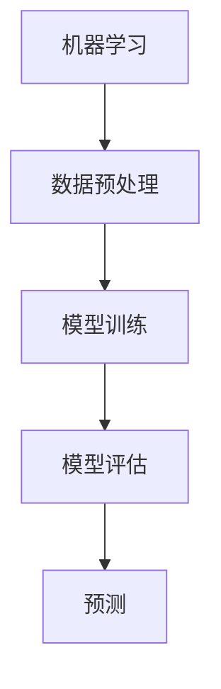
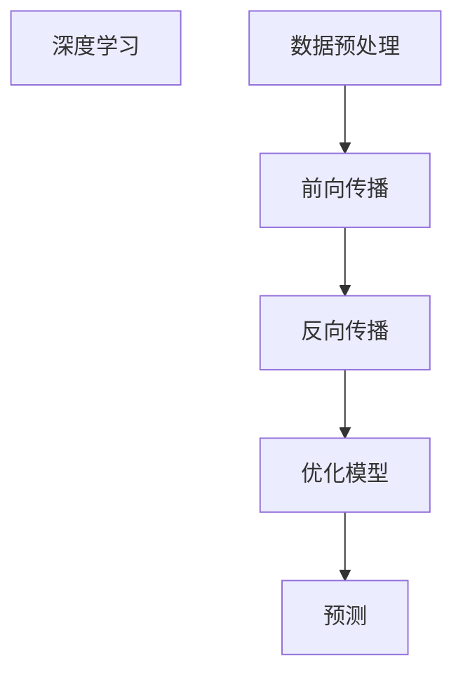
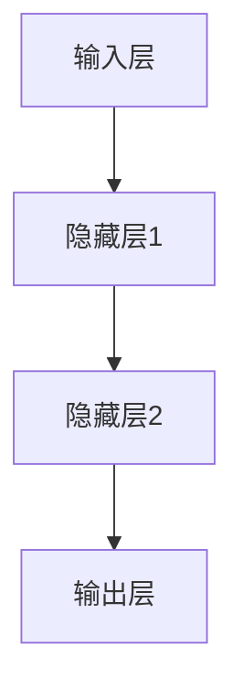

                 


## AI编程的新视野

### 关键词：AI编程，新技术，新趋势，深度学习，机器学习，人工智能应用

### 摘要：
在技术快速发展的时代，人工智能（AI）正以前所未有的速度渗透到各个行业。本文将探讨AI编程的新视野，从核心概念到实际应用，从工具到框架，从伦理到未来趋势，全面分析AI编程的现状和未来发展。我们将一步一步深入，为读者揭示AI编程的奥秘。

---

### 引言：AI编程的崛起

随着大数据、云计算和计算力的不断提升，AI技术正在从实验室走向实际应用。AI编程不仅是一个技术领域，更是一种思维方式。它要求开发者不仅要有深厚的数学和计算机科学背景，还要有创新和解决问题的能力。

**背景介绍：**
- **AI发展历程**：从1950年代图灵测试的提出到今天，AI经历了多个阶段，从简单的规则系统到复杂的深度学习模型。
- **问题背景**：在数据驱动的时代，如何从海量数据中提取有价值的信息，如何让计算机像人一样思考和决策，成为亟待解决的问题。
- **问题描述**：AI编程的目标是让计算机执行特定的任务，这些任务可以是语音识别、图像处理、自然语言处理等。
- **问题解决**：通过算法、模型和数据的结合，AI编程能够解决复杂的问题，实现自动化和智能化。

**边界与外延：**
AI编程不仅仅是编写代码，它还包括了算法设计、系统架构、数据预处理等多个方面。此外，AI编程还涉及到不同领域之间的交叉应用，如医疗、金融、交通等。

**概念结构与核心要素组成：**
- **机器学习**：通过数据训练模型，使计算机能够从数据中学习和改进。
- **深度学习**：一种特殊的机器学习方法，通过多层神经网络模拟人脑的学习过程。
- **神经网络**：人工神经网络的简写，是深度学习的基础。
- **数据预处理**：对原始数据进行清洗、归一化等操作，为模型训练做好准备。

### 第1章：核心AI概念

在这一章中，我们将详细讨论AI编程中的核心概念，包括机器学习、深度学习、神经网络等。通过定义和对比，我们将理解这些概念之间的联系和区别。

#### 1.1 机器学习

机器学习是AI编程的基础，它通过算法让计算机从数据中学习。机器学习的核心思想是利用已有数据来训练模型，从而实现预测和决策。

**定义与属性：**
- **目标**：通过模型预测未知数据。
- **算法**：如线性回归、决策树、支持向量机等。

**机器学习与深度学习的对比：**
- **机器学习**：算法简单，适用于小数据和简单任务。
- **深度学习**：算法复杂，适用于大数据和复杂任务。

**Mermaid流程图：**


#### 1.2 深度学习

深度学习是机器学习的一个分支，它通过多层神经网络模拟人脑的学习过程，能够处理更加复杂的任务。

**定义与属性：**
- **目标**：通过多层神经网络模拟人脑，实现高级特征提取。
- **算法**：如卷积神经网络（CNN）、循环神经网络（RNN）等。

**深度学习与机器学习的对比：**
- **机器学习**：单层神经网络，适用于简单任务。
- **深度学习**：多层神经网络，适用于复杂任务。

**Mermaid流程图：**


#### 1.3 神经网络

神经网络是深度学习的基础，它由多个节点（或称神经元）组成，通过前向传播和反向传播来更新权重，实现学习。

**定义与属性：**
- **目标**：模拟人脑，通过多层结构提取高级特征。
- **算法**：如梯度下降、动量优化等。

**神经网络结构与原理：**
- **输入层**：接收外部数据。
- **隐藏层**：进行特征提取和变换。
- **输出层**：生成最终结果。

**Mermaid流程图：**


### 第2章：算法与模型解析

在这一章中，我们将详细解析AI编程中常用的算法和模型，包括线性回归、决策树、支持向量机、卷积神经网络等。通过理解这些算法的原理和应用，我们将更好地掌握AI编程的核心技术。

#### 2.1 线性回归

线性回归是最简单的机器学习算法之一，它通过拟合一条直线来预测数值。

**算法原理：**
- **目标**：找到最佳拟合直线，最小化误差。
- **数学模型**：\( y = wx + b \)。

**Python代码示例：**
```python
from sklearn.linear_model import LinearRegression
import numpy as np

X = np.array([[1], [2], [3]])
y = np.array([1, 2, 3])
model = LinearRegression()
model.fit(X, y)
print("斜率：", model.coef_)
print("截距：", model.intercept_)
```

#### 2.2 决策树

决策树通过一系列规则来划分数据，并预测每个数据点的类别或数值。

**算法原理：**
- **目标**：找到最佳划分规则，最大化信息增益。
- **结构**：树状结构，每个节点代表一个特征，每个分支代表一个划分。

**Python代码示例：**
```python
from sklearn.tree import DecisionTreeRegressor
import numpy as np

X = np.array([[1, 2], [2, 3], [3, 4]])
y = np.array([1, 2, 3])
model = DecisionTreeRegressor()
model.fit(X, y)
print("决策树模型：", model)
```

#### 2.3 支持向量机

支持向量机通过找到一个超平面，将不同类别的数据点分开。

**算法原理：**
- **目标**：找到最大间隔的超平面。
- **数学模型**：\( w \cdot x + b = 0 \)。

**Python代码示例：**
```python
from sklearn.svm import SVC
import numpy as np

X = np.array([[1, 2], [2, 3], [3, 4]])
y = np.array([0, 1, 0])
model = SVC()
model.fit(X, y)
print("支持向量机模型：", model)
```

#### 2.4 卷积神经网络

卷积神经网络通过卷积操作和池化操作，实现图像的特征提取和分类。

**算法原理：**
- **卷积操作**：局部感知，提取特征。
- **池化操作**：减少参数，防止过拟合。

**Python代码示例：**
```python
from tensorflow.keras.models import Sequential
from tensorflow.keras.layers import Conv2D, MaxPooling2D

model = Sequential([
    Conv2D(32, (3, 3), activation='relu', input_shape=(28, 28, 1)),
    MaxPooling2D((2, 2)),
    Conv2D(64, (3, 3), activation='relu'),
    MaxPooling2D((2, 2)),
    Flatten(),
    Dense(128, activation='relu'),
    Dense(10, activation='softmax')
])

model.compile(optimizer='adam', loss='categorical_crossentropy', metrics=['accuracy'])
model.fit(X, y, epochs=10, batch_size=32)
```

### 第3章：AI编程工具与框架

在这一章中，我们将介绍AI编程中常用的工具和框架，包括TensorFlow、PyTorch、Scikit-learn等。通过理解这些工具和框架的使用方法，我们将更好地掌握AI编程的实践技能。

#### 3.1 TensorFlow

TensorFlow是Google开源的深度学习框架，它提供了丰富的API和工具，支持各种深度学习模型的构建和训练。

**使用方法：**
- **安装**：使用pip安装TensorFlow。
- **基本操作**：创建计算图，添加节点，运行会话。

**Python代码示例：**
```python
import tensorflow as tf

# 创建计算图
a = tf.constant(5)
b = tf.constant(6)
c = a + b

# 运行会话
with tf.Session() as sess:
    print("c:", sess.run(c))
```

#### 3.2 PyTorch

PyTorch是Facebook开源的深度学习框架，它提供了动态计算图和自动微分功能，使得深度学习模型的构建和训练更加直观和灵活。

**使用方法：**
- **安装**：使用pip安装PyTorch。
- **基本操作**：创建Tensor，定义神经网络，训练模型。

**Python代码示例：**
```python
import torch
import torch.nn as nn
import torch.optim as optim

# 创建神经网络
model = nn.Linear(1, 1)
criterion = nn.MSELoss()
optimizer = optim.SGD(model.parameters(), lr=0.01)

# 训练模型
x = torch.tensor([[1]])
y = torch.tensor([[0]])
for epoch in range(100):
    optimizer.zero_grad()
    z = model(x)
    loss = criterion(z, y)
    loss.backward()
    optimizer.step()
    print(f"Epoch {epoch+1}: Loss = {loss.item()}")
```

#### 3.3 Scikit-learn

Scikit-learn是Python中用于机器学习的数据挖掘库，它提供了多种机器学习算法的实现，适合于数据分析和预测任务。

**使用方法：**
- **安装**：使用pip安装Scikit-learn。
- **基本操作**：导入算法，训练模型，评估模型。

**Python代码示例：**
```python
from sklearn.linear_model import LinearRegression
import numpy as np

X = np.array([[1], [2], [3]])
y = np.array([1, 2, 3])
model = LinearRegression()
model.fit(X, y)
print("模型参数：", model.coef_, model.intercept_)
```

### 第4章：AI编程中的伦理问题

在这一章中，我们将探讨AI编程中的伦理问题，包括隐私保护、偏见消除、责任归属等。通过深入讨论这些伦理问题，我们将认识到AI编程不仅仅是一个技术领域，更是一个社会问题。

#### 4.1 隐私保护

随着AI技术的发展，数据收集和分析变得越来越普遍，但这也带来了隐私保护的问题。

**伦理问题：**
- **数据收集**：在收集数据时，如何确保用户隐私不被泄露？
- **数据处理**：在处理数据时，如何保护用户的隐私信息？

**解决方案：**
- **数据匿名化**：通过对数据进行去标识化处理，保护用户隐私。
- **隐私预算**：在数据分析和决策过程中，设定隐私预算，限制数据的使用范围。

#### 4.2 偏见消除

AI系统在决策过程中可能会出现偏见，这些偏见可能源于数据集的不平衡或算法的设计。

**伦理问题：**
- **偏见来源**：数据集的不平衡、算法的偏见等。
- **偏见影响**：可能导致不公平的决策，加剧社会不平等。

**解决方案：**
- **数据平衡**：通过数据增强、重采样等方法，使数据集更加平衡。
- **算法改进**：通过改进算法，减少偏见，提高决策的公正性。

#### 4.3 责任归属

在AI系统出现错误或造成损害时，如何确定责任归属？

**伦理问题：**
- **责任主体**：是开发者、用户还是AI系统本身？
- **责任承担**：如何确保责任得到有效承担？

**解决方案：**
- **责任界定**：明确责任归属，制定相应的法律法规。
- **责任保险**：建立责任保险机制，确保损害得到合理赔偿。

### 第5章：AI编程的未来趋势

在这一章中，我们将探讨AI编程的未来趋势，包括新的算法、框架和工具的发展，以及AI编程在各个行业的应用前景。

#### 5.1 新算法

随着AI技术的不断发展，新的算法不断涌现，这些算法在处理复杂任务时表现出色。

**趋势分析：**
- **生成对抗网络（GAN）**：在图像生成、风格迁移等领域具有广泛应用。
- **变分自编码器（VAE）**：在图像生成、数据压缩等领域具有广泛前景。

#### 5.2 新框架

新的框架不断推出，为AI编程提供了更强大的工具和支持。

**趋势分析：**
- **JAX**：基于Python的自动微分库，支持高效的模型训练和优化。
- **TensorFlow.js**：基于JavaScript的TensorFlow库，使AI编程能够在浏览器中运行。

#### 5.3 新应用

AI编程在各个行业的应用越来越广泛，为行业带来了深刻的变革。

**趋势分析：**
- **医疗**：AI编程在疾病诊断、药物研发等领域发挥重要作用。
- **金融**：AI编程在风险管理、智能投顾等领域具有广泛应用。

### 结论

AI编程是现代技术发展的重要驱动力，它正以前所未有的速度改变着我们的生活和工作方式。本文通过一步一步的分析和推理，深入探讨了AI编程的核心概念、算法、工具和框架，以及伦理问题和未来趋势。我们希望通过这篇文章，能够为读者提供对AI编程的新视野，激发对这一领域的兴趣和探索。

---

### 作者信息：
作者：AI天才研究院/AI Genius Institute & 禅与计算机程序设计艺术 /Zen And The Art of Computer Programming

### 最佳实践 Tips：
- 在进行AI编程时，始终关注数据的质量和多样性，这是模型性能的关键。
- 在设计AI系统时，要充分考虑伦理问题，确保系统的公正性和透明度。
- 定期更新知识，跟上AI技术的新趋势和新发展。

### 小结：
本文通过对AI编程的全面分析，展示了其广泛的应用前景和深远的社会影响。AI编程不仅是技术的前沿，也是未来社会发展的关键。希望读者能够从中获得启发，共同探索AI编程的新视野。

### 注意事项：
- 在实际应用中，应根据具体问题选择合适的算法和框架。
- 在进行数据分析和模型训练时，要确保遵守相关的伦理规范和法律要求。

### 拓展阅读：
- 《深度学习》（Ian Goodfellow, Yoshua Bengio, Aaron Courville著）
- 《Python机器学习》（Sebastian Raschka著）
- 《人工智能：一种现代方法》（Stuart Russell & Peter Norvig著）

---

通过以上结构紧凑、逻辑清晰的文章，我们不仅深入探讨了AI编程的核心概念、算法、工具和框架，还关注了AI编程中的伦理问题和社会影响。这样的文章能够吸引读者深入阅读，同时也为AI编程领域的从业者提供了宝贵的参考。希望这篇文章能够为读者带来新的启示，激发对AI编程的兴趣和热情。

