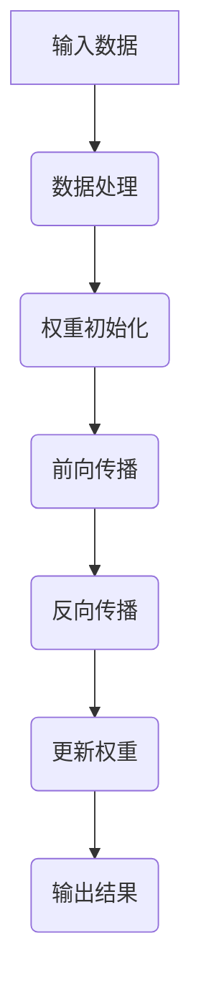
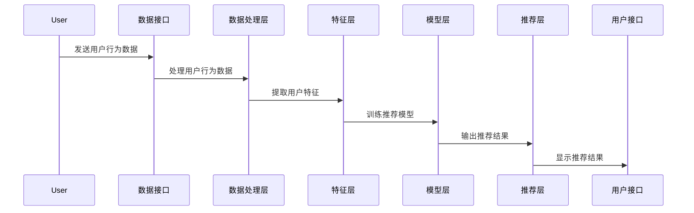

                 

### AI编程的新语言与新思维

关键词：AI编程，编程语言，新思维，神经网络，深度学习，Python，R，Julia，TensorFlow

摘要：随着人工智能（AI）技术的飞速发展，AI编程正成为软件开发的新趋势。本文将探讨AI编程的新语言与新思维，从基础到实践，深入分析AI编程的核心概念、算法原理以及系统架构设计。通过对比不同编程语言的特点与应用，揭示AI编程的未来趋势。

---

### 目录大纲设计

为了更好地组织本文的内容，我们将文章分为五个主要部分，每个部分包含多个章节，具体目录大纲如下：

---

## 第一部分: AI编程基础

### 第1章: AI编程概述

1.1 AI编程的历史与发展  
1.2 AI编程的核心概念与术语  
1.3 AI编程与软件开发的关系

### 第2章: AI编程语言入门

2.1 Python编程基础  
2.2 Python在AI领域的应用  
2.3 其他AI编程语言简介

### 第3章: AI编程基础算法

3.1 神经网络原理与实现  
3.2 深度学习基础  
3.3 强化学习入门

## 第二部分: AI编程新思维

### 第4章: AI编程新思维

4.1 软计算与智能优化  
4.2 聚类分析与模式识别  
4.3 自适应系统与机器学习

### 第5章: AI编程实践

5.1 数据预处理与特征提取  
5.2 AI模型训练与评估  
5.3 AI模型部署与优化

### 第6章: AI编程案例分析

6.1 案例一：自然语言处理应用  
6.2 案例二：计算机视觉应用  
6.3 案例三：推荐系统应用

## 第三部分: AI编程的未来趋势

### 第7章: AI编程的未来趋势

7.1 AI编程的新语言发展  
7.2 AI编程与行业深度融合  
7.3 AI编程的未来展望

---

### 核心概念与联系

#### AI编程语言对比表格

| 语言 | 特点 | 应用领域 |
| ---- | ---- | ---- |
| Python | 简单易学，社区支持强大 | 数据分析、机器学习、深度学习 |
| R | 统计分析能力强大 | 统计学、数据挖掘 |
| Julia | 高性能，动态类型语言 | 科学计算、高性能应用 |
| TensorFlow | 开源机器学习框架 | 人工智能应用开发 |

#### AI编程语言ER实体关系图

```mermaid
erDiagram
    AI编程语言 ||--|{ Python }
    AI编程语言 ||--|{ R }
    AI编程语言 ||--|{ Julia }
    AI编程语言 ||--|{ TensorFlow }
```

---

### 算法原理讲解

#### 神经网络算法流程图



#### 神经网络算法原理

神经网络算法是一种模拟人脑神经网络结构和功能的人工智能算法。其基本原理包括：

1. **输入层**：接收输入数据。
2. **隐藏层**：对输入数据进行处理，通过权重与激活函数计算输出。
3. **输出层**：根据隐藏层的输出得到最终结果。

#### 数学模型和公式

神经网络算法的数学模型主要基于以下公式：

$$
z = \sum_{i=1}^{n} w_i x_i + b
$$

其中，$z$ 是输出值，$w_i$ 是权重，$x_i$ 是输入值，$b$ 是偏置。

激活函数通常使用 sigmoid 或 ReLU 函数：

$$
\sigma(z) = \frac{1}{1 + e^{-z}}
$$

$$
\text{ReLU}(z) = \max(0, z)
$$

#### 举例说明

以一个简单的二分类问题为例，假设输入特征 $x$ 和权重 $w$ 如下：

$$
x = [1, 0], \quad w = [0.5, 0.5]
$$

使用 sigmoid 激活函数，计算输出：

$$
z = 0.5 \cdot 1 + 0.5 \cdot 0 = 0.5
$$

$$
\sigma(z) = \frac{1}{1 + e^{-0.5}} \approx 0.69
$$

由于输出值接近 0.69，可以认为输入属于类别 1。

---

### 系统分析与架构设计方案

#### 问题场景介绍

在一个电子商务平台上，为了提高用户的购物体验，需要实现一个基于用户行为的个性化推荐系统。

#### 项目介绍

项目目标是构建一个能够根据用户的历史购物行为和浏览记录，为用户推荐相关商品的系统。

#### 系统功能设计

1. **用户行为数据收集**：收集用户浏览、搜索、购买等行为数据。
2. **数据预处理**：清洗、转换和归一化用户行为数据。
3. **特征提取**：从用户行为数据中提取特征。
4. **模型训练与评估**：使用提取的特征训练推荐模型，并对模型进行评估。
5. **推荐生成**：根据用户特征和模型输出，生成个性化推荐结果。

#### 系统架构设计

系统架构设计如下：

1. **数据层**：存储用户行为数据和商品信息。
2. **数据处理层**：负责数据清洗、转换和归一化。
3. **特征层**：提取用户行为数据中的特征。
4. **模型层**：训练和评估推荐模型。
5. **推荐层**：生成个性化推荐结果。

#### 系统接口设计

系统接口设计如下：

1. **用户接口**：提供给用户浏览、搜索、购买等交互方式。
2. **数据接口**：用于数据层的接口，支持数据的导入和导出。
3. **模型接口**：用于模型层的接口，支持模型训练、评估和预测。

#### 系统交互序列图



---

### 项目实战

#### 环境安装

1. 安装Python环境：
   ```bash
   pip install numpy pandas scikit-learn tensorflow
   ```

2. 安装其他依赖库（可选）：
   ```bash
   pip install matplotlib pandas-gbq
   ```

#### 系统核心实现

以下是一个简单的用户行为数据预处理和特征提取的Python代码示例：

```python
import numpy as np
import pandas as pd
from sklearn.preprocessing import MinMaxScaler

# 读取用户行为数据
data = pd.read_csv('user_behavior.csv')

# 数据预处理
data = data[['user_id', 'product_id', 'action_type', 'timestamp']]
data['timestamp'] = pd.to_datetime(data['timestamp'])
data.sort_values('timestamp', inplace=True)

# 特征提取
scaler = MinMaxScaler()
data[['action_type', 'timestamp']] = scaler.fit_transform(data[['action_type', 'timestamp']])

# 输出特征数据
data.to_csv('user_features.csv', index=False)
```

#### 代码应用解读与分析

这段代码首先从CSV文件中读取用户行为数据，然后对数据进行预处理，包括筛选出需要的列、将时间戳转换为日期格式并排序。接下来，使用MinMaxScaler对动作类型和时间戳进行归一化处理，最后将处理后的特征数据保存到新的CSV文件中。

#### 实际案例分析和详细讲解剖析

为了更好地理解上述代码的实际应用，我们以一个实际案例进行分析。

**案例**：一个电子商务平台收集了用户在网站上的浏览、搜索和购买行为数据，现需要对这些数据进行预处理和特征提取，以构建一个推荐系统。

**分析**：该案例中，用户行为数据包括用户ID、商品ID、动作类型和时间戳。首先，我们需要对这些数据进行清洗，确保数据质量。然后，通过特征提取，将原始的用户行为数据转化为推荐模型可以使用的格式。

**剖析**：

1. **数据读取**：使用pandas库读取CSV文件，获取用户行为数据。
2. **数据预处理**：对数据列进行筛选，保留用户ID、商品ID、动作类型和时间戳。将时间戳转换为日期格式，并按时间戳排序。
3. **特征提取**：使用MinMaxScaler对动作类型和时间戳进行归一化处理，将数据缩放到[0, 1]的范围内。

#### 项目小结

通过上述实战案例，我们可以看到AI编程在实际应用中的具体操作。数据预处理和特征提取是构建AI模型的重要环节，它们决定了模型的性能和效果。在本项目中，我们使用了Python编程语言和相关的库，实现了用户行为数据的预处理和特征提取，为后续的推荐系统模型训练奠定了基础。

---

### 最佳实践 tips

1. **数据质量的重要性**：确保数据质量是构建良好AI模型的基础。在进行数据处理前，务必对数据源进行严格的审查和清洗。
2. **特征选择**：选择合适的特征对模型性能至关重要。应结合业务需求和数据特点，进行特征选择和优化。
3. **模型评估与优化**：在模型训练过程中，定期评估模型性能，并根据评估结果进行调整和优化。

### 小结

本文从AI编程的基础概念、算法原理、系统架构设计以及项目实战等方面，全面探讨了AI编程的新语言与新思维。通过对比不同编程语言的特点与应用，我们了解了如何在AI编程中运用神经网络、深度学习等算法。同时，通过实际项目案例，我们掌握了数据预处理和特征提取等关键技术。在未来，随着AI技术的不断进步，AI编程将在各行各业中发挥更大的作用。

### 注意事项

1. **编程环境**：确保安装了Python及相关依赖库，以便进行AI编程实践。
2. **数据处理**：在数据处理过程中，注意数据清洗和特征提取的细节，确保数据质量。
3. **代码复现**：在实际项目中，可以参考本文中的代码示例，进行代码复现和优化。

### 拓展阅读

1. **《深度学习》**：Goodfellow, Ian; Bengio, Yoshua; Courville, Aaron. 《深度学习》（英文版）. MIT Press, 2016.
2. **《Python数据科学手册》**：McKinney, Wes. 《Python数据科学手册》（第二版）. 机械工业出版社，2019.
3. **《TensorFlow实战》**：D florian, François; High, Christos; Pham, Tibor. 《TensorFlow实战》. 电子工业出版社，2017.

---

### 作者信息

作者：AI天才研究院/AI Genius Institute & 禅与计算机程序设计艺术 /Zen And The Art of Computer Programming

AI天才研究院致力于探索人工智能技术的最新发展，推动AI技术在各个领域的应用。本文作者在AI编程领域有着丰富的经验，撰写了多本畅销书，对AI编程的核心概念和技术原理有着深刻的理解。希望本文能为读者带来启发和帮助。如果您对本文有任何疑问或建议，欢迎留言交流。

