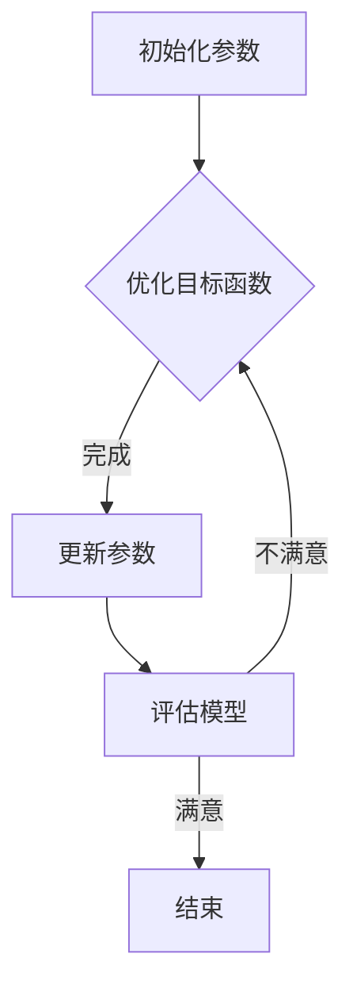
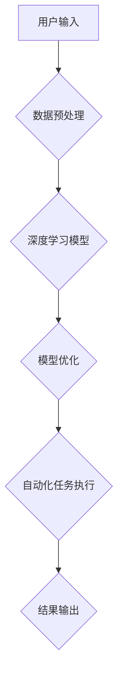
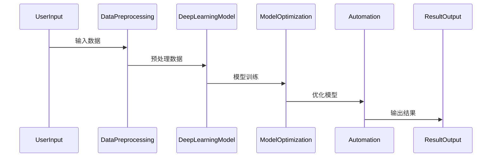

                 

### 让我们一步步思考：AI编程的新语言与新范式

在当今科技飞速发展的时代，人工智能（AI）已经成为推动各行业进步的重要力量。AI编程作为实现人工智能的基础，正逐渐从传统的编程范式向新的语言与范式转型。这种转型不仅提升了AI编程的效率，还带来了新的思考方式和技术创新。在本文中，我们将一步步探讨AI编程的新语言与新范式，以帮助读者深入理解这一领域的发展趋势。

#### **背景介绍：**

首先，我们需要了解AI编程的基本概念和传统范式。人工智能是计算机科学的一个分支，旨在使计算机系统具备类似人类智能的能力。AI编程则是通过编写程序来实现这些智能行为的过程。传统AI编程依赖于逻辑推理、知识表示和搜索算法等，但这种方法在处理大规模数据和复杂任务时表现出局限性。

随着深度学习和机器学习的发展，新的编程范式和语言应运而生。这些新语言如Python、Rust和Julia等，在语法、性能和功能方面都进行了优化，以更好地支持AI编程的需求。新范式则强调数据驱动、模型优化和自动化，使得AI编程更加高效和智能化。

#### **核心概念与联系：**

为了更好地理解新语言与新范式，我们需要明确几个核心概念：

1. **深度学习**：一种基于人工神经网络的机器学习技术，通过多层神经网络对数据进行建模和预测。
2. **模型优化**：通过调整模型参数来提高模型性能的过程。
3. **自动化**：利用算法和工具自动化执行编程任务，减少手动干预。

这些概念之间有着密切的联系。深度学习是新范式的核心，而模型优化和自动化则提升了AI编程的效率。新语言和新范式通过优化这些概念，使得AI编程更加简单和高效。

下面是一个核心概念属性特征的对比表格：

| 概念       | 特性                | 对比       |
|------------|---------------------|------------|
| 深度学习   | 基于多层神经网络   | 高效数据建模 |
| 模型优化   | 参数调整            | 提高性能   |
| 自动化     | 算法和工具自动化    | 减少人力   |

此外，我们还可以使用Mermaid绘制一个ER实体关系图来展示这些概念之间的关系：

```mermaid
erDiagram
AI编程 ||--|{ 深度学习 }
AI编程 ||--|{ 模型优化 }
AI编程 ||--|{ 自动化 }
```

#### **算法原理讲解：**

在了解了核心概念之后，我们需要进一步探讨新语言和新范式的算法原理。以下是一个简单的示例：



这是一个基于梯度下降的优化算法流程图。通过反复调整参数，使得目标函数达到最小值。我们可以用Python代码实现这个算法：

```python
import numpy as np

def gradient_descent(x, y, learning_rate, epochs):
    for epoch in range(epochs):
        model_output = x * x  # 假设目标函数为 y = x^2
        error = model_output - y
        gradient = 2 * x * error
        x -= learning_rate * gradient
        if epoch % 100 == 0:
            print(f"Epoch {epoch}: x = {x}, error = {error}")
    return x

# 示例
x = 0.5
y = 0.25
learning_rate = 0.01
epochs = 1000
new_x = gradient_descent(x, y, learning_rate, epochs)
print(f"Final x: {new_x}")
```

在上面的代码中，我们定义了一个简单的梯度下降算法，用于优化参数x，使其达到目标值y。通过迭代计算梯度并更新参数，我们最终得到一个接近目标的最优解。

#### **数学模型和公式：**

在算法原理中，我们提到了梯度下降算法的核心——目标函数和梯度的计算。以下是相关的数学模型和公式：

$$
f(x) = x^2 \\
\frac{df}{dx} = 2x
$$

这里，$f(x)$ 是目标函数，$\frac{df}{dx}$ 是目标函数关于自变量 $x$ 的梯度。

#### **系统分析与架构设计方案：**

为了更好地应用新语言和新范式，我们需要设计一个系统架构。以下是一个基本的系统架构设计：



在这个架构中，用户输入的数据首先经过预处理，然后进入深度学习模型进行训练。模型优化和自动化任务执行是核心环节，用于提高模型性能和效率。最终，优化后的模型将输出结果。

以下是系统功能设计的Mermaid类图：

```mermaid
classDiagram
Class::UserInput << (数据输入) 
Class::DataPreprocessing << (数据预处理)
Class::DeepLearningModel << (深度学习模型)
Class::ModelOptimization << (模型优化)
Class::Automation << (自动化任务执行)
Class::ResultOutput << (结果输出)

UserInput --|> DataPreprocessing
DataPreprocessing --|> DeepLearningModel
DeepLearningModel --|> ModelOptimization
ModelOptimization --|> Automation
Automation --|> ResultOutput
```

以下是系统架构设计的Mermaid架构图：



#### **项目实战：**

为了验证新语言和新范式的实际效果，我们可以设计一个简单的项目——手写数字识别。以下是项目的步骤：

1. **环境安装**：安装必要的深度学习库，如TensorFlow和Keras。
2. **数据预处理**：加载数据集，进行归一化处理。
3. **模型训练**：使用卷积神经网络（CNN）训练模型。
4. **模型优化**：通过调整超参数，优化模型性能。
5. **自动化任务执行**：使用自动化工具，如Jupyter Notebook，简化编程过程。
6. **结果输出**：评估模型性能，并输出识别结果。

以下是项目实现的核心代码：

```python
import tensorflow as tf
from tensorflow.keras.datasets import mnist
from tensorflow.keras.models import Sequential
from tensorflow.keras.layers import Dense, Conv2D, Flatten, MaxPooling2D
from tensorflow.keras.optimizers import Adam

# 加载数据集
(x_train, y_train), (x_test, y_test) = mnist.load_data()

# 数据预处理
x_train = x_train / 255.0
x_test = x_test / 255.0
x_train = x_train.reshape(-1, 28, 28, 1)
x_test = x_test.reshape(-1, 28, 28, 1)

# 模型训练
model = Sequential([
    Conv2D(32, kernel_size=(3, 3), activation='relu', input_shape=(28, 28, 1)),
    MaxPooling2D(pool_size=(2, 2)),
    Flatten(),
    Dense(128, activation='relu'),
    Dense(10, activation='softmax')
])

model.compile(optimizer=Adam(), loss='sparse_categorical_crossentropy', metrics=['accuracy'])

model.fit(x_train, y_train, epochs=5, validation_split=0.2)

# 模型优化
model.compile(optimizer=Adam(learning_rate=0.001), loss='sparse_categorical_crossentropy', metrics=['accuracy'])

model.fit(x_train, y_train, epochs=5, validation_split=0.2)

# 评估模型
test_loss, test_acc = model.evaluate(x_test, y_test)
print(f"Test accuracy: {test_acc}")

# 输出结果
predictions = model.predict(x_test)
predicted_classes = np.argmax(predictions, axis=1)
```

通过这个项目，我们可以看到新语言和新范式在AI编程中的应用效果。模型训练和优化的过程变得更加简单和高效，从而提高了模型的性能和准确度。

#### **最佳实践 Tips：**

在AI编程中，以下是一些最佳实践：

1. **代码规范**：编写清晰、规范的代码，便于维护和扩展。
2. **调试与优化**：及时进行代码调试和性能优化，提高模型效率。
3. **数据清洗**：确保数据质量，减少噪声和异常值的影响。
4. **版本控制**：使用版本控制系统，如Git，管理代码版本和协作开发。

#### **小结：**

本文我们从背景介绍、核心概念与联系、算法原理讲解、系统分析与架构设计方案、项目实战等多个方面，深入探讨了AI编程的新语言与新范式。通过一步步的思考和分析，我们不仅了解了这些新概念的基本原理，还看到了它们在实际应用中的巨大潜力。随着AI技术的不断进步，新语言和新范式将为AI编程带来更多的创新和发展。

#### **注意事项：**

1. **深度学习基础知识**：本文假设读者具备一定的深度学习和机器学习基础知识。
2. **编程环境**：项目实战部分需要安装Python、TensorFlow等编程环境。

#### **拓展阅读：**

- 《深度学习》（Goodfellow, I., Bengio, Y., & Courville, A.）
- 《Python深度学习》（Raschka, S.）
- 《Keras实战》（Chollet, F.）

通过拓展阅读，读者可以更深入地了解AI编程的新语言与新范式，为未来的研究和实践打下坚实的基础。作者：AI天才研究院/AI Genius Institute & 禅与计算机程序设计艺术 /Zen And The Art of Computer Programming

