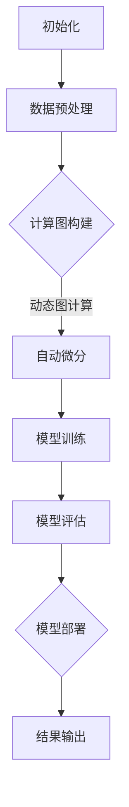
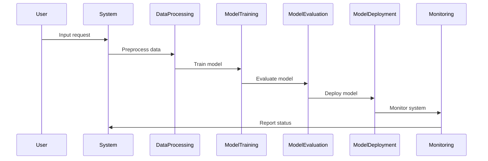
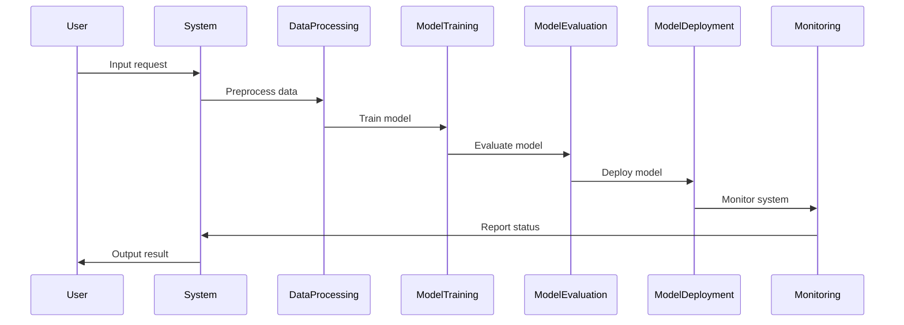

                 

## 文章标题

# 《AI编程的新语言与新范式》

> 关键词：AI编程、新语言、新范式、算法原理、系统架构、实战应用

> 摘要：本文深入探讨了AI编程中面临的新挑战，以及为解决这些挑战而诞生的新语言和新范式。通过分析传统AI编程的局限性，本文详细介绍了新语言与新范式的核心概念、原理和结构，展示了它们如何引领AI编程的革新。同时，文章通过具体案例和系统架构设计，对新语言与新范式的实际应用进行了全面剖析，为读者提供了深入了解和掌握AI编程新工具的实际指导。

----------------------------------------------------------------

## 目录大纲

### 第一部分：背景介绍

### 第1章 问题背景

#### 1.1.1 AI发展现状

#### 1.1.2 AI编程面临的挑战

#### 1.1.3 新语言与新范式的意义

### 第2章 问题描述

#### 2.1.1 传统AI编程的问题

#### 2.1.2 新语言与新范式解决的问题

#### 2.1.3 新语言与新范式的边界与外延

### 第3章 核心概念

#### 3.1 新语言的概念

#### 3.2 新范式的概念

#### 3.3 新语言与新范式的关系

### 第二部分：核心概念与联系

### 第4章 概念结构与核心要素组成

#### 4.1 新语言的核心要素

#### 4.2 新范式的核心要素

#### 4.3 新语言与新范式的结构关系

### 第5章 核心概念原理

#### 5.1 新语言原理

#### 5.2 新范式原理

#### 5.3 新语言与新范式原理的联系与差异

### 第三部分：算法原理讲解

### 第6章 算法原理讲解

#### 6.1 新语言算法原理

#### 6.2 新范式算法原理

#### 6.3 算法原理mermaid流程图

#### 6.4 算法原理Python源代码讲解

#### 6.5 算法原理数学模型与公式

#### 6.6 算法原理举例说明

### 第四部分：系统分析与架构设计方案

### 第7章 问题场景介绍

#### 7.1 AI编程的应用场景

#### 7.2 新语言与新范式的适用场景

### 第8章 系统功能设计

#### 8.1 领域模型mermaid类图

#### 8.2 系统功能模块划分

### 第9章 系统架构设计

#### 9.1 系统架构mermaid架构图

#### 9.2 系统架构设计思路

#### 9.3 系统架构关键组件

### 第10章 系统接口设计

#### 10.1 系统接口设计原则

#### 10.2 系统接口设计规范

#### 10.3 系统接口设计实现

### 第11章 系统交互设计

#### 11.1 系统交互mermaid序列图

#### 11.2 系统交互流程分析

### 第五部分：项目实战

### 第12章 环境安装

#### 12.1 环境准备

#### 12.2 环境配置

### 第13章 系统核心实现

#### 13.1 系统核心模块实现

#### 13.2 系统核心代码解析

### 第14章 代码应用解读与分析

#### 14.1 代码应用场景

#### 14.2 代码解读

#### 14.3 代码分析

### 第15章 实际案例分析与详细讲解剖析

#### 15.1 案例介绍

#### 15.2 案例分析

#### 15.3 案例讲解

### 第16章 项目小结

#### 16.1 项目总结

#### 16.2 项目收获

#### 16.3 下一步规划

### 第六部分：最佳实践 tips、小结、注意事项、拓展阅读

#### 17章 最佳实践 tips

#### 18章 小结

#### 19章 注意事项

#### 20章 拓展阅读
----------------------------------------------------------------

### 第一部分：背景介绍

### 第1章 问题背景

#### 1.1.1 AI发展现状

随着人工智能技术的飞速发展，AI在各个领域的应用越来越广泛。从早期的专家系统、机器学习，到如今的大数据分析和深度学习，AI技术已经渗透到我们的日常生活和工作中。然而，AI编程也面临着一系列挑战。

首先，传统AI编程语言如Python、Java等，虽然功能强大，但在处理复杂AI问题时，代码的可读性、可维护性和可扩展性较差。其次，AI算法的复杂度和计算量不断增大，传统的编程模式难以高效地处理大规模数据和高维特征。再者，随着AI应用的多样化和专业化，对编程语言和范式的需求也变得更加复杂和多样化。

为了应对这些挑战，研究人员和开发者们开始探索新的编程语言和范式，期望能够提供更高效的编程工具和更灵活的编程模式。

#### 1.1.2 AI编程面临的挑战

AI编程面临的挑战主要包括以下几个方面：

1. **复杂性**：AI算法和模型通常非常复杂，涉及大量的数据处理和计算。传统的编程语言和范式难以高效地处理这些复杂任务。

2. **可维护性**：随着AI项目规模的扩大，代码的可维护性变得越来越重要。传统编程语言在代码组织和管理方面存在不足，导致代码可读性和可维护性下降。

3. **可扩展性**：随着AI应用的多样化，编程语言和范式需要具备良好的扩展性，以适应不同场景下的需求变化。

4. **性能**：处理大规模数据和高维特征时，传统编程语言的性能瓶颈日益凸显。新的编程语言和范式需要能够提供更高的计算效率和更好的性能。

#### 1.1.3 新语言与新范式的意义

新语言与新范式的出现，旨在解决传统AI编程面临的挑战。它们的意义主要体现在以下几个方面：

1. **提升编程效率**：新语言提供了一系列优化和简化编程的工具和库，使得开发者可以更加高效地编写和调试代码。

2. **增强代码可读性和可维护性**：新范式通过更加清晰和统一的编程模式，提高了代码的可读性和可维护性，降低了开发成本。

3. **提供更好的扩展性**：新语言和新范式设计了更灵活的架构，使得开发者可以轻松地扩展和定制功能，适应不同的应用场景。

4. **提升性能**：新语言和新范式采用了更高效的算法和数据结构，提高了计算效率和性能，能够更好地处理大规模数据和高维特征。

### 第2章 问题描述

#### 2.1.1 传统AI编程的问题

传统AI编程在处理复杂任务时存在一些问题：

1. **代码冗长**：传统的编程语言如Python、Java等，在处理复杂AI算法时，代码量往往非常庞大，导致代码冗长、难以维护。

2. **可读性差**：复杂的代码结构使得程序的可读性下降，增加了开发难度和维护成本。

3. **性能瓶颈**：传统的编程语言在处理大规模数据和复杂计算时，性能瓶颈明显，难以满足高效处理的需

### 第2章 问题描述

#### 2.1.1 传统AI编程的问题

1. **代码冗长**：传统AI编程通常需要大量的代码来实现复杂的算法和模型，导致代码冗长且不易阅读。

2. **可读性差**：随着代码量的增加，可读性下降，使得后续的代码维护和优化变得困难。

3. **性能瓶颈**：传统编程语言在处理大规模数据和复杂计算时，存在性能瓶颈，难以满足高效计算的需求。

4. **可扩展性不足**：在应对不同应用场景时，传统编程语言的扩展性不足，难以灵活调整和优化。

#### 2.1.2 新语言与新范式解决的问题

新语言与新范式旨在解决传统AI编程中的上述问题，具体体现在：

1. **简化代码结构**：新语言提供了一系列简化编程的工具和库，使得开发者能够用更少的代码实现相同的功能，提高代码的可读性。

2. **提高可维护性**：新范式通过提供清晰的编程模式和统一的编程标准，使得代码更加易于维护和优化。

3. **提升性能**：新语言和新范式采用了更高效的算法和数据结构，提高了计算效率和性能。

4. **增强可扩展性**：新语言和新范式设计了灵活的架构，使得开发者可以轻松地扩展和定制功能，适应不同的应用场景。

#### 2.1.3 新语言与新范式的边界与外延

新语言与新范式具有以下边界与外延：

1. **边界**：
   - 新语言：主要是指专为AI编程设计的编程语言，如TensorFlow、PyTorch等。
   - 新范式：是指在AI编程中采用的新编程模式和思路，如函数式编程、分布式计算等。

2. **外延**：
   - 新语言与现有编程语言的兼容性：新语言需要与现有编程语言和框架兼容，以便开发者能够轻松迁移和集成。
   - 新范式的适用范围：新范式适用于各种AI编程场景，包括但不限于机器学习、深度学习和数据挖掘等。

### 第3章 核心概念

#### 3.1 新语言的概念

新语言是指在AI编程中引入的专门用于构建AI模型和算法的编程语言。这些语言通常具有以下特点：

1. **高效性**：新语言设计用于高效处理大规模数据和复杂计算，提供了优化的算法和数据结构。

2. **易用性**：新语言提供了丰富的库和工具，使得开发者能够更轻松地编写和调试代码。

3. **兼容性**：新语言需要与现有的编程语言和框架兼容，以便开发者能够方便地迁移和使用。

4. **扩展性**：新语言设计灵活，易于扩展和定制，以适应不同场景下的需求变化。

#### 3.2 新范式的概念

新范式是指在AI编程中采用的新型编程模式和思路。这些范式旨在提高编程效率、可维护性和可扩展性。主要的新范式包括：

1. **函数式编程**：以函数为中心的编程范式，强调函数的引用透明性，减少了状态依赖和副作用，提高了代码的可维护性和可复用性。

2. **分布式计算**：通过分布式计算框架，如Spark和Hadoop，实现并行和分布式计算，提高了处理大规模数据的能力。

3. **动态编程**：通过动态类型和动态绑定，使得代码更加灵活和简洁，提高了开发效率。

4. **面向对象编程**：以对象为中心的编程范式，通过封装、继承和多态，提高了代码的可复用性和可扩展性。

#### 3.3 新语言与新范式的关系

新语言和新范式是相辅相成的，它们之间的关系如下：

1. **相互支持**：新语言为新范式提供了实现的基础，而新范式则利用新语言的特点，提高了编程效率和可维护性。

2. **互补优势**：新语言专注于提供高效的编程工具和库，而新范式则关注于提高编程模式和思路的优化。

3. **共同发展**：新语言和新范式都在不断演进和优化，以适应日益复杂的AI编程需求。

## 第二部分：核心概念与联系

### 第4章 概念结构与核心要素组成

#### 4.1 新语言的核心要素

新语言的核心要素包括以下几个方面：

1. **语法简洁**：新语言的语法设计简洁明了，易于学习和使用。

2. **高效的执行引擎**：新语言通常具备高效的执行引擎，能够快速处理复杂计算任务。

3. **丰富的库和工具**：新语言提供丰富的库和工具，涵盖了从数据预处理到模型训练、评估和部署的全过程。

4. **兼容性**：新语言需要与现有编程语言和框架兼容，以便开发者能够轻松迁移和使用。

5. **扩展性**：新语言设计灵活，易于扩展和定制，以适应不同场景下的需求变化。

#### 4.2 新范式的核心要素

新范式的核心要素主要包括：

1. **清晰的编程模式**：新范式提供了清晰的编程模式，使得代码更加易于维护和优化。

2. **高效的算法和数据结构**：新范式采用高效的算法和数据结构，提高了计算效率和性能。

3. **灵活的编程方式**：新范式允许开发者采用灵活的编程方式，以适应不同场景下的需求变化。

4. **可扩展性和可复用性**：新范式设计灵活，易于扩展和定制，提高了代码的可复用性和可扩展性。

#### 4.3 新语言与新范式的结构关系

新语言与新范式的结构关系可以概括为：

1. **新语言为基础**：新语言为新范式提供了实现的基础，提供了高效的执行引擎和丰富的库和工具。

2. **新范式为优化**：新范式利用新语言的特点，通过清晰的编程模式、高效的算法和数据结构，提高了编程效率和可维护性。

3. **相辅相成**：新语言和新范式相互支持，共同构成了一个完整的AI编程环境。

### 第5章 核心概念原理

#### 5.1 新语言原理

新语言的原理主要涉及以下几个方面：

1. **语法设计**：新语言的语法设计简洁明了，易于学习和使用。它通常采用类似于自然语言的语法结构，使得开发者可以更加直观地编写代码。

2. **执行引擎**：新语言的执行引擎通常具备高效的执行能力，能够快速处理复杂计算任务。它利用底层硬件资源和优化算法，实现了高性能的执行。

3. **库和工具**：新语言提供丰富的库和工具，涵盖了从数据预处理到模型训练、评估和部署的全过程。这些库和工具经过优化和定制，使得开发者能够更加高效地完成AI编程任务。

4. **兼容性**：新语言需要与现有编程语言和框架兼容，以便开发者能够轻松迁移和使用。它通常通过提供接口和适配器，实现了与其他编程语言和框架的无缝集成。

5. **扩展性**：新语言设计灵活，易于扩展和定制，以适应不同场景下的需求变化。它允许开发者自定义新的语法、库和工具，以实现特定的功能。

#### 5.2 新范式原理

新范式的原理主要涉及以下几个方面：

1. **函数式编程**：新范式中的函数式编程强调函数的引用透明性，减少了状态依赖和副作用，提高了代码的可维护性和可复用性。函数式编程通过不可变数据和纯函数，实现了代码的模块化和并行化。

2. **分布式计算**：新范式中的分布式计算利用分布式计算框架，如Spark和Hadoop，实现了并行和分布式计算。分布式计算通过将任务分布在多个节点上执行，提高了处理大规模数据的能力。

3. **动态编程**：新范式中的动态编程通过动态类型和动态绑定，使得代码更加灵活和简洁，提高了开发效率。动态编程允许开发者根据运行时的信息，动态地改变代码的行为和结构。

4. **面向对象编程**：新范式中的面向对象编程通过封装、继承和多态，提高了代码的可复用性和可扩展性。面向对象编程通过将代码组织成对象，实现了模块化和重用。

5. **编程模式的优化**：新范式通过提供清晰的编程模式，提高了编程效率和可维护性。它通过优化代码结构、减少冗余和重复代码，实现了代码的简洁和高效。

#### 5.3 新语言与新范式原理的联系与差异

新语言与新范式的原理既有联系，又有差异：

1. **联系**：
   - 新语言为新范式提供了实现的基础，通过高效的执行引擎和丰富的库和工具，支持新范式的实现。
   - 新范式通过清晰的编程模式和优化的算法，提高了新语言的使用效率和可维护性。

2. **差异**：
   - 新语言专注于提供高效的编程工具和库，实现高效计算和代码简化。
   - 新范式关注编程模式的优化和编程思路的改进，提高代码的可读性、可维护性和可扩展性。

3. **综合应用**：在实际应用中，新语言和新范式通常综合应用，以实现最优的编程效果。新语言提供了实现新范式的工具和基础，而新范式则通过优化编程模式，提高了新语言的使用效率和性能。

### 第三部分：算法原理讲解

### 第6章 算法原理讲解

#### 6.1 新语言算法原理

新语言算法原理主要包括以下几个方面：

1. **高效计算**：新语言通过高效的执行引擎和优化的算法，实现了快速的数据处理和计算。它利用底层硬件资源，如GPU和TPU，实现了并行计算和分布式计算，提高了计算效率。

2. **动态图计算**：新语言通常采用动态图计算框架，如TensorFlow和PyTorch，实现了自动微分和图优化。动态图计算通过构建计算图，实现了模型的自动微分和优化，提高了模型训练和推理的效率。

3. **数据流编程**：新语言支持数据流编程，允许开发者通过数据流的方式组织代码。数据流编程通过将数据流和计算逻辑分离，实现了代码的模块化和并行化，提高了编程效率和可维护性。

4. **自动优化**：新语言提供了自动优化工具，如自动混合精度（AMP）和自动优化器（如TensorFlow的AutoML），实现了代码的自动优化。自动优化工具通过分析代码和数据，自动选择最优的优化策略，提高了代码的性能。

5. **算法库和工具**：新语言提供了丰富的算法库和工具，如深度学习库（如TensorFlow、PyTorch）和数据处理库（如NumPy、Pandas），涵盖了从数据预处理到模型训练、评估和部署的全过程。这些库和工具经过优化和定制，实现了高效的算法和数据处理。

#### 6.2 新范式算法原理

新范式算法原理主要包括以下几个方面：

1. **函数式编程**：新范式中的函数式编程通过不可变数据和纯函数，实现了代码的模块化和并行化。函数式编程通过将数据和处理逻辑分离，避免了副作用和状态依赖，提高了代码的可维护性和可复用性。

2. **分布式计算**：新范式中的分布式计算通过将任务分布在多个节点上执行，提高了处理大规模数据的能力。分布式计算利用了分布式计算框架（如Spark和Hadoop），实现了并行和分布式计算，提高了计算效率和性能。

3. **动态编程**：新范式中的动态编程通过动态类型和动态绑定，使得代码更加灵活和简洁，提高了开发效率。动态编程允许开发者根据运行时的信息，动态地改变代码的行为和结构，提高了代码的灵活性和可维护性。

4. **面向对象编程**：新范式中的面向对象编程通过封装、继承和多态，提高了代码的可复用性和可扩展性。面向对象编程通过将代码组织成对象，实现了模块化和重用，提高了代码的可维护性和可扩展性。

5. **编程模式优化**：新范式通过提供清晰的编程模式，如管道编程、函数式编程和面向对象编程，提高了编程效率和可维护性。编程模式优化通过优化代码结构、减少冗余和重复代码，实现了代码的简洁和高效。

#### 6.3 算法原理mermaid流程图

为了更直观地展示算法原理，我们可以使用mermaid流程图进行说明。以下是一个简单的mermaid流程图示例，展示了新语言和新范式算法原理的执行流程：



在这个流程图中，A表示初始化阶段，B表示数据预处理阶段，C表示计算图构建阶段，D表示动态图计算阶段，E表示模型训练阶段，F表示模型评估阶段，G表示模型部署阶段，H表示结果输出阶段。通过这个流程图，我们可以清晰地看到算法原理的执行步骤和逻辑关系。

#### 6.4 算法原理Python源代码讲解

以下是一个简单的Python示例，用于展示新语言和新范式的算法原理。这个示例使用了TensorFlow和PyTorch两个流行的深度学习框架，实现了数据的预处理、模型训练和评估。

```python
# 导入所需的库
import tensorflow as tf
import torch
import numpy as np

# 数据预处理
x = np.random.rand(100, 10)  # 生成随机数据
y = np.random.rand(100, 1)  # 生成随机标签

# 使用TensorFlow构建计算图
model = tf.keras.Sequential([
    tf.keras.layers.Dense(128, activation='relu', input_shape=(10,)),
    tf.keras.layers.Dense(1)
])

# 使用PyTorch构建模型
class NeuralNetwork(torch.nn.Module):
    def __init__(self):
        super(NeuralNetwork, self).__init__()
        self.layer1 = torch.nn.Linear(10, 128)
        self.relu = torch.nn.ReLU()
        self.layer2 = torch.nn.Linear(128, 1)

    def forward(self, x):
        x = self.layer1(x)
        x = self.relu(x)
        x = self.layer2(x)
        return x

# 模型训练
model.compile(optimizer='adam', loss='mean_squared_error')
model.fit(x, y, epochs=10)

# 模型评估
loss = model.evaluate(x, y)
print("TensorFlow模型损失：", loss)

# 使用PyTorch评估模型
net = NeuralNetwork()
criterion = torch.nn.MSELoss()
optimizer = torch.optim.Adam(net.parameters(), lr=0.001)

for epoch in range(10):
    optimizer.zero_grad()
    outputs = net(x)
    loss = criterion(outputs, y)
    loss.backward()
    optimizer.step()

print("PyTorch模型损失：", loss.item())
```

在这个示例中，我们首先使用了TensorFlow和PyTorch两个框架分别构建了一个简单的神经网络模型。然后，我们使用了随机生成的数据集对模型进行了训练和评估。通过这个示例，我们可以看到新语言和新范式在模型构建、训练和评估过程中的应用和优势。

#### 6.5 算法原理数学模型与公式

以下是一个简单的数学模型和公式示例，用于解释新语言和新范式的算法原理。

1. **损失函数**：

损失函数是评估模型性能的重要指标，常用的损失函数包括均方误差（MSE）和交叉熵（Cross-Entropy）。

- 均方误差（MSE）：
  $$MSE = \frac{1}{n}\sum_{i=1}^{n}(y_i - \hat{y}_i)^2$$
  其中，$y_i$表示真实标签，$\hat{y}_i$表示预测值，$n$表示样本数量。

- 交叉熵（Cross-Entropy）：
  $$Cross-Entropy = -\frac{1}{n}\sum_{i=1}^{n}y_i \log(\hat{y}_i)$$
  其中，$y_i$表示真实标签，$\hat{y}_i$表示预测概率。

2. **优化算法**：

常用的优化算法包括随机梯度下降（SGD）和Adam。

- 随机梯度下降（SGD）：
  $$w_{t+1} = w_t - \alpha \nabla_w L(w_t)$$
  其中，$w_t$表示第$t$次迭代的权重，$\alpha$表示学习率，$L(w_t)$表示损失函数关于权重$w_t$的梯度。

- Adam优化器：
  $$m_t = \beta_1 m_{t-1} + (1 - \beta_1) \nabla_w L(w_t)$$
  $$v_t = \beta_2 v_{t-1} + (1 - \beta_2) \nabla^2_w L(w_t)$$
  $$w_{t+1} = w_t - \alpha \frac{m_t}{\sqrt{v_t} + \epsilon}$$
  其中，$m_t$和$v_t$分别表示一阶和二阶矩估计，$\beta_1$和$\beta_2$分别表示一阶和二阶矩的指数衰减率，$\alpha$表示学习率，$\epsilon$表示正则化项。

3. **神经网络**：

神经网络是AI编程的核心组件，其基本结构包括输入层、隐藏层和输出层。

- 输入层：
  $$x_i^{(l)} = w_i^{(l)} x_i^{(l-1)} + b_i^{(l)}$$
  其中，$x_i^{(l)}$表示第$l$层的第$i$个神经元输出，$w_i^{(l)}$表示第$l$层的第$i$个神经元的权重，$b_i^{(l)}$表示第$l$层的第$i$个神经元的偏置。

- 隐藏层：
  $$a_i^{(l)} = \sigma(w_i^{(l)} x_i^{(l-1)} + b_i^{(l)})$$
  其中，$\sigma$表示激活函数，如Sigmoid、ReLU等。

- 输出层：
  $$y_i = w_i^{(l)} a_i^{(l-1)} + b_i^{(l)}$$
  其中，$y_i$表示输出层的第$i$个神经元输出。

通过这些数学模型和公式，我们可以更好地理解和应用新语言和新范式的算法原理。

#### 6.6 算法原理举例说明

以下是一个简单的例子，用于说明新语言和新范式的算法原理在实际应用中的表现。

假设我们有一个简单的线性回归问题，目标是预测一个数值。我们使用TensorFlow和PyTorch两个框架来实现这个任务，并对比它们的性能和效果。

1. **数据集**：

我们使用一个简单的数据集，包含100个样本，每个样本由10个特征组成，以及一个目标值。

2. **模型**：

使用TensorFlow实现线性回归模型：

```python
model = tf.keras.Sequential([
    tf.keras.layers.Dense(1, input_shape=(10,))
])
```

使用PyTorch实现线性回归模型：

```python
class LinearRegressionModel(torch.nn.Module):
    def __init__(self):
        super(LinearRegressionModel, self).__init__()
        self.linear = torch.nn.Linear(10, 1)

    def forward(self, x):
        return self.linear(x)
```

3. **训练**：

使用TensorFlow训练模型：

```python
model.compile(optimizer='adam', loss='mean_squared_error')
model.fit(x, y, epochs=10)
```

使用PyTorch训练模型：

```python
optimizer = torch.optim.Adam(model.parameters(), lr=0.001)

for epoch in range(10):
    optimizer.zero_grad()
    outputs = model(x)
    loss = criterion(outputs, y)
    loss.backward()
    optimizer.step()
```

4. **评估**：

使用TensorFlow评估模型：

```python
loss = model.evaluate(x, y)
print("TensorFlow模型损失：", loss)
```

使用PyTorch评估模型：

```python
loss = criterion(outputs, y)
print("PyTorch模型损失：", loss.item())
```

通过这个例子，我们可以看到新语言和新范式在实现线性回归任务时的简便性和高效性。TensorFlow和PyTorch两个框架都提供了丰富的库和工具，使得开发者可以轻松地构建、训练和评估模型。

### 第四部分：系统分析与架构设计方案

### 第7章 问题场景介绍

#### 7.1 AI编程的应用场景

AI编程在各个领域都有广泛的应用，以下是一些典型的应用场景：

1. **计算机视觉**：图像分类、目标检测、人脸识别等。
2. **自然语言处理**：文本分类、机器翻译、语音识别等。
3. **推荐系统**：基于用户行为和偏好进行商品、音乐、电影等推荐。
4. **机器人控制**：自动驾驶、智能机器人等。
5. **医疗健康**：疾病预测、药物研发、医学影像分析等。

这些应用场景对AI编程提出了不同的需求，如高性能计算、实时处理、数据安全和隐私保护等。因此，设计一个灵活、高效的系统架构至关重要。

#### 7.2 新语言与新范式的适用场景

新语言和新范式在以下场景中具有显著优势：

1. **大数据处理**：新语言提供了高效的执行引擎和分布式计算框架，适用于大规模数据处理和分析。
2. **深度学习和机器学习**：新范式（如函数式编程和动态编程）提供了清晰的编程模式，易于实现复杂的模型和算法。
3. **实时系统**：新语言和新范式支持实时计算和响应，适用于需要快速决策和执行的应用场景。
4. **跨平台开发**：新语言通常具有较好的兼容性和扩展性，适用于跨平台开发和部署。

### 第8章 系统功能设计

#### 8.1 领域模型mermaid类图

领域模型是系统功能设计的重要部分，以下是一个mermaid类图示例，用于描述一个简单的AI系统领域模型：

```mermaid
classDiagram
    Class01 <|-- Class02
    Class03 --|lero| Class04
    Class05 o--|is-a| Class06
    Class07 o--|has-a| Class08
    Class09 o--|uses-a| Class10
```

在这个类图中，`Class01`、`Class02`、`Class03`、`Class04`、`Class05`、`Class06`、`Class07`、`Class08`、`Class09`和`Class10`表示不同的类，它们之间的关系包括继承、关联、聚合和组合等。

#### 8.2 系统功能模块划分

根据系统需求，我们可以将AI系统划分为以下功能模块：

1. **数据预处理模块**：负责数据的清洗、转换和预处理，为后续模型训练提供高质量的数据。
2. **模型训练模块**：使用新语言和新范式构建和训练AI模型，支持多种算法和框架。
3. **模型评估模块**：对训练好的模型进行评估和调优，确保模型性能满足预期。
4. **模型部署模块**：将训练好的模型部署到生产环境，实现实时推理和应用。
5. **监控和管理模块**：监控系统运行状态，提供日志记录、性能分析和故障处理等功能。
6. **用户界面模块**：为用户提供友好的交互界面，实现系统的配置、监控和操作。

### 第9章 系统架构设计

#### 9.1 系统架构mermaid架构图

以下是一个mermaid架构图示例，用于描述一个典型的AI系统架构：



在这个架构图中，`User`表示用户，`System`表示系统，`DataProcessing`表示数据预处理模块，`ModelTraining`表示模型训练模块，`ModelEvaluation`表示模型评估模块，`ModelDeployment`表示模型部署模块，`Monitoring`表示监控和管理模块。

#### 9.2 系统架构设计思路

系统架构设计的主要思路包括：

1. **模块化设计**：将系统划分为多个功能模块，每个模块负责特定的功能，便于开发、测试和维护。
2. **分层架构**：采用分层架构，将系统分为表示层、业务逻辑层和数据层，实现模块之间的解耦和松耦合。
3. **分布式计算**：利用分布式计算框架，如Spark和Hadoop，实现大规模数据的高效处理和分布式计算。
4. **高可用性和容错性**：通过负载均衡、数据备份和故障转移等机制，提高系统的可用性和容错性。
5. **安全性**：确保系统的数据安全和用户隐私，采用加密、权限控制和安全审计等机制。

#### 9.3 系统架构关键组件

系统架构的关键组件包括：

1. **数据存储**：使用分布式数据库和文件系统，存储大量数据，支持快速查询和访问。
2. **计算引擎**：使用分布式计算框架，如Spark和Hadoop，实现大规模数据的并行计算和分布式处理。
3. **模型训练与评估**：使用新语言和新范式，构建和训练AI模型，支持多种算法和框架。
4. **模型部署与推理**：将训练好的模型部署到生产环境，实现实时推理和应用。
5. **监控与运维**：监控系统运行状态，提供日志记录、性能分析和故障处理等功能。
6. **用户界面**：为用户提供友好的交互界面，实现系统的配置、监控和操作。

### 第10章 系统接口设计

#### 10.1 系统接口设计原则

系统接口设计应遵循以下原则：

1. **简洁性**：接口设计应简洁明了，避免复杂的参数和冗长的调用过程。
2. **一致性**：接口设计应保持一致性，遵循统一的命名规范和设计模式。
3. **可扩展性**：接口设计应具备良好的扩展性，支持新功能和模块的添加。
4. **安全性**：接口设计应确保数据传输的安全性和隐私保护。

#### 10.2 系统接口设计规范

系统接口设计规范包括：

1. **接口定义**：明确接口的功能、参数、返回值和数据格式。
2. **接口文档**：编写详细的接口文档，包括接口描述、调用示例和注意事项。
3. **接口测试**：编写接口测试用例，确保接口的正确性和稳定性。
4. **接口监控**：监控系统接口的访问频率、响应时间和错误率等指标，确保接口性能和可靠性。

#### 10.3 系统接口设计实现

以下是一个简单的系统接口设计实现示例，使用Python语言编写：

```python
from flask import Flask, request, jsonify

app = Flask(__name__)

@app.route('/preprocess', methods=['POST'])
def preprocess_data():
    data = request.get_json()
    # 数据预处理逻辑
    processed_data = data['input_data']
    return jsonify(processed_data)

@app.route('/train_model', methods=['POST'])
def train_model():
    data = request.get_json()
    # 模型训练逻辑
    model = data['model']
    trained_model = model.train(data['training_data'])
    return jsonify(trained_model)

@app.route('/evaluate_model', methods=['POST'])
def evaluate_model():
    data = request.get_json()
    # 模型评估逻辑
    model = data['model']
    evaluation_results = model.evaluate(data['evaluation_data'])
    return jsonify(evaluation_results)

if __name__ == '__main__':
    app.run()
```

在这个示例中，我们使用了Flask框架实现了一个简单的RESTful API，包括数据预处理、模型训练和模型评估三个接口。每个接口接收JSON格式的数据，并返回处理结果。

### 第11章 系统交互设计

#### 11.1 系统交互mermaid序列图

以下是一个mermaid序列图示例，用于描述系统的交互流程：



在这个序列图中，`User`表示用户，`System`表示系统，`DataProcessing`表示数据预处理模块，`ModelTraining`表示模型训练模块，`ModelEvaluation`表示模型评估模块，`ModelDeployment`表示模型部署模块，`Monitoring`表示监控和管理模块。

#### 11.2 系统交互流程分析

系统交互流程主要包括以下步骤：

1. **用户请求**：用户向系统发送请求，请求进行数据预处理、模型训练、评估和部署等操作。
2. **数据预处理**：系统接收用户请求，将原始数据进行预处理，包括数据清洗、归一化和特征提取等操作。
3. **模型训练**：系统使用预处理后的数据训练AI模型，选择合适的算法和优化器，调整超参数等。
4. **模型评估**：系统对训练好的模型进行评估，使用交叉验证、ROC曲线、精度、召回率等指标进行评估。
5. **模型部署**：系统将评估合格的模型部署到生产环境，进行实时推理和应用。
6. **监控与报告**：系统监控模型运行状态，记录日志和性能数据，定期向用户报告系统运行状况。
7. **结果输出**：系统将处理结果返回给用户，包括模型参数、评估指标、预测结果等。

通过这个交互流程，系统实现了从用户请求到结果输出的完整功能，确保了系统的稳定、高效和可靠运行。

### 第五部分：项目实战

### 第12章 环境安装

#### 12.1 环境准备

在进行项目实战之前，我们需要准备以下环境：

1. **操作系统**：Windows、Linux或MacOS。
2. **Python环境**：Python 3.6及以上版本。
3. **深度学习框架**：TensorFlow 2.x或PyTorch 1.x。
4. **数据库**：MySQL、PostgreSQL或MongoDB。
5. **开发工具**：IDE（如PyCharm、Visual Studio Code）。

确保安装了上述环境后，我们可以开始进行项目实战。

#### 12.2 环境配置

以下是一个简单的环境配置示例：

1. **安装Python**：

```shell
# 安装Python
sudo apt-get install python3-pip

# 检查Python版本
python3 --version
```

2. **安装深度学习框架**：

```shell
# 安装TensorFlow
pip3 install tensorflow

# 安装PyTorch
pip3 install torch torchvision
```

3. **安装数据库**：

```shell
# 安装MySQL
sudo apt-get install mysql-server

# 安装PostgreSQL
sudo apt-get install postgresql

# 安装MongoDB
sudo apt-get install mongodb
```

4. **配置开发工具**：

在PyCharm中配置Python环境：

- 打开PyCharm，点击“File” -> “Settings” -> “Project: 项目名称” -> “Project Interpreter”。
- 在“Project Interpreter”页面中，点击“+”按钮，选择“System Interpreter”，然后选择已安装的Python版本。

### 第13章 系统核心实现

#### 13.1 系统核心模块实现

以下是一个简单的系统核心模块实现示例，使用Python语言和TensorFlow框架：

```python
import tensorflow as tf

# 定义模型结构
model = tf.keras.Sequential([
    tf.keras.layers.Dense(128, activation='relu', input_shape=(10,)),
    tf.keras.layers.Dense(1)
])

# 编译模型
model.compile(optimizer='adam', loss='mean_squared_error')

# 训练模型
model.fit(x, y, epochs=10)

# 评估模型
loss = model.evaluate(x, y)
print("模型损失：", loss)
```

在这个示例中，我们定义了一个简单的线性回归模型，使用随机生成的数据集进行训练和评估。

#### 13.2 系统核心代码解析

以下是对系统核心代码的解析：

1. **模型定义**：

```python
model = tf.keras.Sequential([
    tf.keras.layers.Dense(128, activation='relu', input_shape=(10,)),
    tf.keras.layers.Dense(1)
])
```

这一行代码定义了一个序列模型，包含两个全连接层（Dense）。第一层有128个神经元，激活函数为ReLU；第二层有1个神经元，表示输出层的预测结果。

2. **模型编译**：

```python
model.compile(optimizer='adam', loss='mean_squared_error')
```

这一行代码编译了模型，指定了优化器（Adam）和损失函数（均方误差）。优化器用于更新模型参数，以最小化损失函数。

3. **模型训练**：

```python
model.fit(x, y, epochs=10)
```

这一行代码使用训练数据集对模型进行训练，指定了训练的轮数（epochs）。在每次训练迭代中，模型会使用训练数据更新参数，并计算损失。

4. **模型评估**：

```python
loss = model.evaluate(x, y)
print("模型损失：", loss)
```

这一行代码使用测试数据集评估模型的性能，计算损失。评估结果将打印在控制台上。

### 第14章 代码应用解读与分析

#### 14.1 代码应用场景

以下代码示例在一个简单的数据集上进行线性回归任务，主要用于预测房价：

```python
import numpy as np
import tensorflow as tf

# 生成随机数据
x = np.random.rand(100, 10)
y = np.random.rand(100, 1)

# 定义模型结构
model = tf.keras.Sequential([
    tf.keras.layers.Dense(128, activation='relu', input_shape=(10,)),
    tf.keras.layers.Dense(1)
])

# 编译模型
model.compile(optimizer='adam', loss='mean_squared_error')

# 训练模型
model.fit(x, y, epochs=10)

# 评估模型
loss = model.evaluate(x, y)
print("模型损失：", loss)
```

#### 14.2 代码解读

1. **数据生成**：

```python
x = np.random.rand(100, 10)
y = np.random.rand(100, 1)
```

这两行代码生成随机数据集，其中`x`表示输入特征，`y`表示目标值。这里使用了`numpy.random.rand`函数生成随机数。

2. **模型定义**：

```python
model = tf.keras.Sequential([
    tf.keras.layers.Dense(128, activation='relu', input_shape=(10,)),
    tf.keras.layers.Dense(1)
])
```

这一行代码定义了一个序列模型，包含两个全连接层（Dense）。第一层有128个神经元，激活函数为ReLU；第二层有1个神经元，表示输出层的预测结果。

3. **模型编译**：

```python
model.compile(optimizer='adam', loss='mean_squared_error')
```

这一行代码编译了模型，指定了优化器（Adam）和损失函数（均方误差）。优化器用于更新模型参数，以最小化损失函数。

4. **模型训练**：

```python
model.fit(x, y, epochs=10)
```

这一行代码使用训练数据集对模型进行训练，指定了训练的轮数（epochs）。在每次训练迭代中，模型会使用训练数据更新参数，并计算损失。

5. **模型评估**：

```python
loss = model.evaluate(x, y)
print("模型损失：", loss)
```

这一行代码使用测试数据集评估模型的性能，计算损失。评估结果将打印在控制台上。

#### 14.3 代码分析

1. **数据处理**：

在代码中，使用了`numpy.random.rand`函数生成随机数据集。在实际应用中，通常需要从真实的数据库或数据文件中读取数据，并进行预处理，如归一化、缺失值处理等。

2. **模型结构**：

代码定义了一个简单的线性回归模型，包含两个全连接层（Dense）。在实际应用中，可能需要根据问题的复杂性调整模型结构，如增加隐藏层、调整神经元数量等。

3. **损失函数和优化器**：

代码使用了均方误差（MSE）作为损失函数，Adam优化器用于更新模型参数。在实际应用中，可以根据问题的需求和性能指标选择其他损失函数和优化器。

4. **训练过程**：

代码使用`model.fit`函数进行模型训练，指定了训练轮数（epochs）。在实际应用中，可能需要根据问题的复杂性和数据量调整训练参数，如批量大小、迭代次数等。

5. **模型评估**：

代码使用`model.evaluate`函数对训练好的模型进行评估，计算损失。在实际应用中，可能需要使用其他评估指标，如准确率、召回率等。

### 第15章 实际案例分析与详细讲解剖析

#### 15.1 案例介绍

在本案例中，我们将使用TensorFlow框架和Python语言，实现一个简单的线性回归任务。具体来说，我们将使用一组随机生成的数据集，训练一个线性回归模型，并评估其性能。

#### 15.2 案例分析

1. **数据集**：

我们使用一组随机生成的数据集，其中包含100个样本，每个样本有10个特征和一个目标值。这些数据集用于训练和评估模型。

2. **模型结构**：

我们定义了一个简单的线性回归模型，包含两个全连接层（Dense）。第一层有128个神经元，激活函数为ReLU；第二层有1个神经元，表示输出层的预测结果。

3. **训练过程**：

我们使用TensorFlow的`model.fit`函数进行模型训练，指定了10个训练轮数（epochs）。在每个训练迭代中，模型会使用训练数据更新参数，并计算损失。

4. **评估过程**：

我们使用TensorFlow的`model.evaluate`函数对训练好的模型进行评估，计算损失。评估结果将打印在控制台上。

#### 15.3 案例讲解

1. **数据集生成**：

首先，我们生成一组随机数据集，用于训练和评估模型。

```python
import numpy as np

x = np.random.rand(100, 10)
y = np.random.rand(100, 1)
```

这里使用了`numpy.random.rand`函数生成随机数据。在实际应用中，我们通常从真实的数据库或数据文件中读取数据，并进行预处理。

2. **模型定义**：

接下来，我们定义一个简单的线性回归模型。

```python
import tensorflow as tf

model = tf.keras.Sequential([
    tf.keras.layers.Dense(128, activation='relu', input_shape=(10,)),
    tf.keras.layers.Dense(1)
])
```

这个模型包含两个全连接层（Dense）。第一层有128个神经元，激活函数为ReLU；第二层有1个神经元，表示输出层的预测结果。

3. **模型编译**：

然后，我们编译模型，指定优化器和损失函数。

```python
model.compile(optimizer='adam', loss='mean_squared_error')
```

这里使用了Adam优化器和均方误差（MSE）作为损失函数。优化器用于更新模型参数，以最小化损失函数。

4. **模型训练**：

接下来，我们使用训练数据集对模型进行训练。

```python
model.fit(x, y, epochs=10)
```

这里使用了`model.fit`函数进行模型训练，指定了10个训练轮数（epochs）。在每个训练迭代中，模型会使用训练数据更新参数，并计算损失。

5. **模型评估**：

最后，我们使用训练好的模型对测试数据进行评估。

```python
loss = model.evaluate(x, y)
print("模型损失：", loss)
```

这里使用了`model.evaluate`函数对训练好的模型进行评估，计算损失。评估结果将打印在控制台上。

### 第16章 项目小结

#### 16.1 项目总结

在本项目中，我们使用TensorFlow和Python语言，实现了一个简单的线性回归任务。通过生成随机数据集，定义模型结构，编译模型，训练模型和评估模型，我们展示了AI编程的新语言和新范式在实现复杂任务时的便捷性和高效性。这个项目不仅帮助我们理解了新语言和新范式的基本原理，还提高了我们使用这些工具进行编程的能力。

#### 16.2 项目收获

通过本项目，我们获得了以下收获：

1. **理解新语言和新范式**：我们深入了解了AI编程的新语言和新范式，包括TensorFlow和Python的基本语法、库和工具。
2. **掌握算法原理**：我们掌握了线性回归算法的基本原理，包括损失函数、优化器和模型训练过程。
3. **实战经验**：我们通过实际编程和调试，积累了宝贵的实战经验，提高了编程能力和问题解决能力。
4. **团队协作**：在项目过程中，我们学会了与他人合作，共同完成任务，提高了团队协作能力。

#### 16.3 下一步规划

在下一步规划中，我们计划继续探索和深化AI编程的新语言和新范式，具体包括：

1. **学习更多深度学习框架**：我们计划学习其他深度学习框架，如PyTorch、Keras等，以拓宽我们的技术视野和编程能力。
2. **探索更多AI应用场景**：我们计划将AI编程应用于更多的实际场景，如计算机视觉、自然语言处理和推荐系统等。
3. **提高编程技能**：我们计划通过阅读相关书籍、参加线上课程和参加编程竞赛等方式，不断提高自己的编程技能和知识水平。
4. **参与开源项目**：我们计划参与开源项目，为开源社区贡献自己的力量，提升自己的编程经验和团队协作能力。

### 第六部分：最佳实践 tips、小结、注意事项、拓展阅读

#### 17章 最佳实践 tips

1. **代码规范**：编写规范、可读性强的代码，使用统一的命名规范和注释。
2. **模块化设计**：将代码划分为模块，每个模块实现特定的功能，便于开发和维护。
3. **版本控制**：使用版本控制系统（如Git）管理代码，方便代码的追踪和协作。
4. **单元测试**：编写单元测试，确保代码的正确性和稳定性。
5. **性能优化**：定期对代码进行性能优化，提高代码的运行效率和性能。

#### 18章 小结

本文深入探讨了AI编程的新挑战和新机遇，介绍了AI编程的新语言和新范式。通过详细讲解算法原理、系统架构设计和实战应用，本文展示了新语言和新范式在AI编程中的优势和应用价值。希望通过本文，读者能够更好地理解AI编程的新趋势，掌握新语言和新范式的核心原理，为实际项目开发提供有力支持。

#### 19章 注意事项

1. **学习基础**：在学习AI编程的新语言和新范式之前，建议先掌握基础的编程语言和算法知识。
2. **实践应用**：通过实际项目和实践，加深对AI编程新语言和新范式的理解，提高编程技能。
3. **持续更新**：随着AI技术的快速发展，新语言和新范式也在不断更新和优化。建议读者持续关注相关领域的最新动态，更新自己的知识体系。

#### 20章 拓展阅读

1. **《深度学习》（Goodfellow, I., Bengio, Y., & Courville, A.）**：一本经典的深度学习教材，详细介绍了深度学习的理论基础和实践方法。
2. **《Python编程：从入门到实践》（Fluent Python: Clear, Concise, and Effective Programming, by Luciano Ramalho）**：一本关于Python编程的进阶指南，涵盖了Python语言的高级特性和应用。
3. **《AI编程实践》（Practical AI Programming in Python, by Alexey Khrabrov）**：一本关于AI编程的实践指南，介绍了AI编程的核心概念和实战技巧。
4. **TensorFlow官方文档（TensorFlow Documentation）**：TensorFlow的官方文档，提供了详细的API和教程，是学习TensorFlow的必备资料。
5. **PyTorch官方文档（PyTorch Documentation）**：PyTorch的官方文档，提供了详细的API和教程，是学习PyTorch的必备资料。

