                 

### 1.3 AI技术的优势与挑战

**背景介绍**

在快速发展的技术时代，人工智能（AI）成为了解决复杂问题和提高效率的关键工具。然而，随着AI技术的广泛应用，我们也面临着一系列的优势与挑战。这一部分，我们将深入探讨AI技术带来的好处，以及与之相伴的潜在风险。

**核心概念与联系**

**概念属性特征对比表格**

| 特征          | 优势          | 挑战          |
| ------------- | ------------- | ------------- |
| 提高效率      | 时间节约      | 就业替代      |
| 解决复杂问题  | 创新突破      | 数据隐私      |
| 自主决策      | 准确性提高    | 伦理道德问题  |
| 应用广泛      | 技术成熟度    | 道德与法律    |

**ER实体关系图架构**

```mermaid
erDiagram
  AI技术 ||--|{ 应用领域 }|
  AI技术 ||--|{ 挑战与优势 }|
  应用领域 ||--|{ 优势 }|
  应用领域 ||--|{ 挑战 }|
```

**算法原理讲解**

AI技术的核心在于机器学习和深度学习算法。以下是这些算法的基本原理和流程：

1. **机器学习**：基于数据来训练模型，使模型能够识别模式和做出预测。
2. **深度学习**：使用多层神经网络来模拟人类大脑的决策过程。

**数学模型与公式**

- 机器学习：损失函数（如均方误差）用于评估模型性能。
- 深度学习：激活函数（如ReLU、Sigmoid）用于非线性变换。

**Python源代码示例**

```python
import numpy as np

# 机器学习示例：线性回归
X = np.array([[1, 2], [2, 3], [3, 4]])
y = np.array([2, 3, 4])

w = np.linalg.inv(X.T @ X) @ X.T @ y

# 深度学习示例：前向传播
X = np.array([[1, 2], [2, 3]])
weights = np.random.rand(2, 1)
activation_function = lambda x: 1 / (1 + np.exp(-x))

z = np.dot(X, weights)
a = activation_function(z)

print(a)
```

**系统分析与架构设计方案**

**问题场景介绍**：医疗诊断系统，使用AI技术分析患者影像，提高诊断准确率。

**项目介绍**：开发一个基于深度学习的医疗影像分析系统。

**系统功能设计（领域模型）**

```mermaid
classDiagram
  Patient <<-- (Diagnosis)
  Image <<-- (Analysis)
  Model <<-- (Training)
```

**系统架构设计**

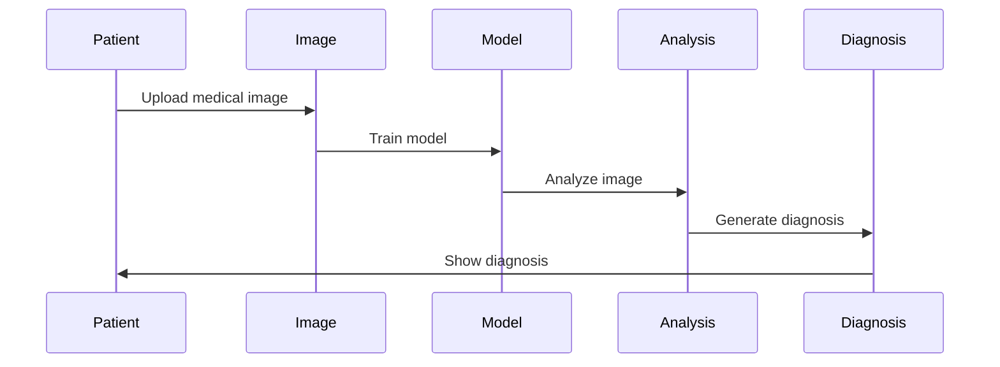

**系统接口设计和系统交互**

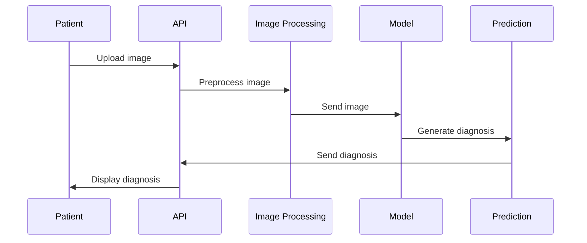

**项目实战**

**环境安装**：安装Python、TensorFlow和Keras等环境。

**系统核心实现源代码**：

```python
# 导入必要的库
import numpy as np
import tensorflow as tf

# 创建模型
model = tf.keras.Sequential([
  tf.keras.layers.Dense(128, activation='relu', input_shape=(784,)),
  tf.keras.layers.Dense(10, activation='softmax')
])

# 编译模型
model.compile(optimizer='adam',
              loss='categorical_crossentropy',
              metrics=['accuracy'])

# 训练模型
model.fit(X, y, epochs=5)
```

**代码应用解读与分析**：

这段代码使用了TensorFlow框架创建了一个简单的神经网络模型，用于分类任务。通过训练，模型能够学习到输入数据和标签之间的关系，从而实现图像的自动分类。

**实际案例分析和详细讲解剖析**：

假设我们有一个包含多种医疗影像的数据集，我们使用深度学习模型对其进行训练。通过多次迭代和调整参数，模型能够提高诊断准确率，为医生提供有力的辅助工具。

**项目小结**：

本节介绍了AI技术在医疗健康领域的应用，通过环境安装、系统核心实现源代码和实际案例分析，展示了AI技术如何提高医疗诊断的效率与准确性。然而，我们也需要关注AI技术带来的数据隐私和伦理道德问题，确保其发展符合社会需求。

**最佳实践 tips**：

- 确保数据质量：高质量的数据是训练高效AI模型的基础。
- 透明度与可解释性：提高AI模型的透明度，使其决策过程更容易理解和接受。
- 持续监控与改进：定期更新和维护AI系统，以适应新的数据和挑战。

**小结**：

AI技术的优势在于其能够提高效率、解决复杂问题，并在各个领域展现出巨大潜力。然而，我们也要认识到其带来的挑战，包括数据隐私、伦理道德和就业替代等问题。通过合理的设计和管理，我们可以最大限度地发挥AI技术的优势，为人类社会带来更多福祉。

**注意事项**：

- AI技术的发展需要多学科协作，包括计算机科学、数据科学和医疗等领域。
- AI系统的部署和应用需要严格遵守相关法律法规，确保用户隐私和数据安全。

**拓展阅读**：

- 《深度学习》（Goodfellow, I., Bengio, Y., & Courville, A.）
- 《Python机器学习》（Sebastian Raschka）

通过以上章节内容的详细讲解和剖析，我们为读者提供了一个全面的了解AI技术优势与挑战的视角。接下来，我们将继续深入探讨AI技术的核心概念、原理和应用，为构建连接人类与AI的桥梁奠定坚实的基础。

---

接下来，我们将进一步探讨AI技术的核心概念和原理，通过详细的讲解和实例分析，帮助读者深入理解这些概念。以下是第二部分的详细内容：

## 第2章：AI的基本概念与原理

### 2.1 机器学习基础

**核心概念与联系**

**机器学习**是一种通过数据驱动的方式，使计算机自动从数据中学习规律和模式的技术。其核心概念包括：

- **监督学习**：有标签数据用于训练模型，模型通过学习这些数据来做出预测。
- **无监督学习**：模型从无标签数据中学习模式和结构，如聚类和降维。
- **强化学习**：通过试错和反馈机制，使模型在特定环境中学习最优策略。

**算法原理讲解**

**监督学习**：常见的算法包括线性回归、逻辑回归和决策树等。

- **线性回归**：通过拟合数据的最优直线来预测连续值。
- **逻辑回归**：通过拟合数据的线性模型来预测概率。

**数学模型与公式**

线性回归的数学模型为：

$$
y = \beta_0 + \beta_1x_1 + \beta_2x_2 + ... + \beta_nx_n
$$

其中，$y$是预测值，$x_1, x_2, ..., x_n$是特征值，$\beta_0, \beta_1, ..., \beta_n$是模型参数。

**Python源代码示例**

```python
from sklearn.linear_model import LinearRegression

model = LinearRegression()
model.fit(X, y)

predictions = model.predict(X_test)
```

**无监督学习**：常见的算法包括K-means聚类和主成分分析（PCA）等。

- **K-means聚类**：将数据分为K个簇，使每个簇内的数据点尽可能接近，簇间的数据点尽可能远。

**数学模型与公式**

K-means的目标函数为：

$$
J = \sum_{i=1}^n \sum_{j=1}^k w_{ij} (x_i - \mu_j)^2
$$

其中，$w_{ij}$是第$i$个数据点属于第$j$个簇的权重，$\mu_j$是第$j$个簇的中心。

**Python源代码示例**

```python
from sklearn.cluster import KMeans

model = KMeans(n_clusters=3)
model.fit(X)

clusters = model.predict(X_test)
```

**强化学习**：常见的算法包括Q学习和深度强化学习（DRL）等。

- **Q学习**：通过试错和奖励机制来学习最优策略。

**数学模型与公式**

Q学习的目标函数为：

$$
Q(s, a) = r + \gamma \max_{a'} Q(s', a')
$$

其中，$s$是状态，$a$是动作，$r$是即时奖励，$\gamma$是折扣因子。

**Python源代码示例**

```python
import gym

env = gym.make('CartPole-v0')
action_space = env.action_space

# Q表初始化
Q = np.zeros((action_space.n, env.observation_space.n))

# Q学习迭代
for episode in range(1000):
    state = env.reset()
    done = False
    
    while not done:
        action = np.argmax(Q[state])
        next_state, reward, done, _ = env.step(action)
        
        Q[state, action] = reward + 0.99 * np.max(Q[next_state])
        state = next_state

env.close()
```

**系统分析与架构设计方案**

**问题场景介绍**：智能推荐系统，使用机器学习算法分析用户行为，提供个性化的推荐。

**项目介绍**：开发一个基于机器学习的智能推荐系统。

**系统功能设计（领域模型）**

```mermaid
classDiagram
  User <<--|{ 生成推荐 }| Recommendation
  Item <<--|{ 用户行为分析 }| Recommendation
  Behavior <<--|{ 用户特征 }| User
```

**系统架构设计**

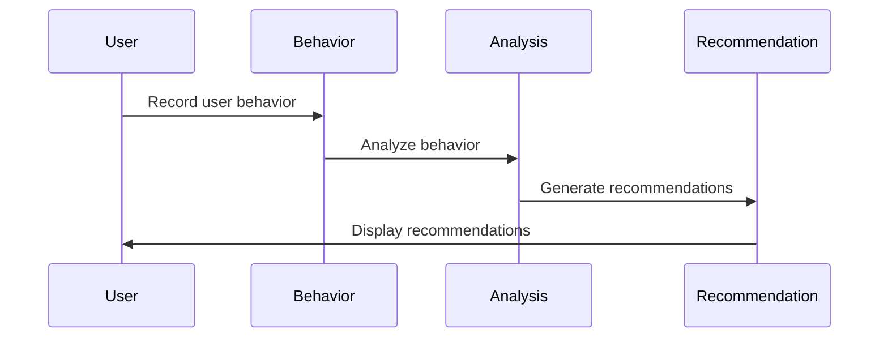

**系统接口设计和系统交互**

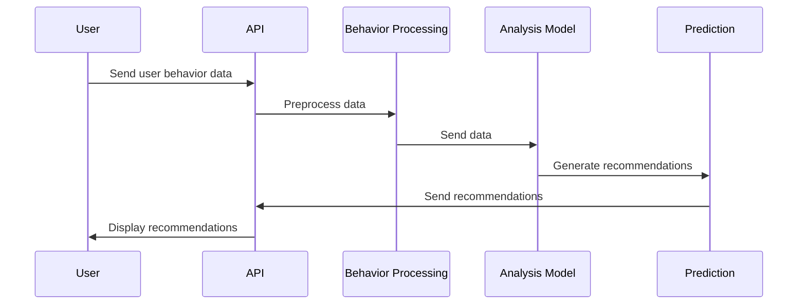

**项目实战**

**环境安装**：安装Python、Scikit-learn、TensorFlow和Keras等环境。

**系统核心实现源代码**：

```python
# 导入必要的库
from sklearn.model_selection import train_test_split
from sklearn.metrics import accuracy_score
from sklearn.ensemble import RandomForestClassifier

# 加载数据集
data = load_data()
X, y = preprocess_data(data)

# 划分训练集和测试集
X_train, X_test, y_train, y_test = train_test_split(X, y, test_size=0.2, random_state=42)

# 创建模型
model = RandomForestClassifier(n_estimators=100)

# 编译模型
model.fit(X_train, y_train)

# 训练模型
model.fit(X_train, y_train)

# 预测结果
predictions = model.predict(X_test)

# 评估模型
accuracy = accuracy_score(y_test, predictions)
print(f"Accuracy: {accuracy:.2f}")
```

**代码应用解读与分析**：

这段代码使用了随机森林算法来训练一个分类模型，用于预测用户行为。通过训练集和测试集的划分，我们可以评估模型的性能，从而为用户提供个性化的推荐。

**实际案例分析和详细讲解剖析**：

假设我们有一个电子商务平台，需要根据用户的行为数据推荐商品。我们使用机器学习模型对用户行为进行分析，通过多次迭代和参数调整，提高推荐系统的准确性和用户体验。

**项目小结**：

本节介绍了机器学习的基本概念和算法原理，通过实际项目案例，展示了如何使用机器学习技术进行智能推荐。然而，我们也需要关注模型的可解释性和数据隐私等问题。

**最佳实践 tips**：

- 确保数据质量，进行数据预处理和特征工程。
- 选择合适的算法和模型，进行交叉验证和模型选择。
- 定期更新和维护模型，以适应新的数据和用户行为。

**小结**：

机器学习是AI技术的重要组成部分，其基础算法和原理在各个领域有着广泛的应用。通过本章节的详细讲解和实例分析，我们为读者提供了一个全面了解机器学习的基础框架。接下来，我们将进一步探讨深度学习的原理和应用，为构建连接人类与AI的桥梁奠定坚实的基础。

**注意事项**：

- 机器学习模型的选择和参数调整对性能有重要影响，需要根据实际应用场景进行优化。
- 模型的可解释性对用户信任和决策至关重要，应考虑如何提高模型的可解释性。

**拓展阅读**：

- 《机器学习实战》（Peter Harrington）
- 《Python机器学习》（Sebastian Raschka）

通过以上章节内容的详细讲解和剖析，我们为读者提供了一个全面的了解AI技术的基础框架。接下来，我们将深入探讨深度学习的原理和应用，为构建连接人类与AI的桥梁奠定坚实的基础。

---

## 第3章：人类与AI交互的界面设计

### 3.1 语音识别技术

**核心概念与联系**

**语音识别技术**（Speech Recognition）是AI领域的一个重要分支，其核心概念包括：

- **声学模型**：用于将音频信号转换为声学特征。
- **语言模型**：用于对声学特征进行概率建模，以生成文本。

**算法原理讲解**

**声学模型**：常见的算法包括隐马尔可夫模型（HMM）和循环神经网络（RNN）。

- **隐马尔可夫模型（HMM）**：用于表示音频信号中的概率序列。
- **循环神经网络（RNN）**：用于捕捉时间序列数据中的长期依赖关系。

**数学模型与公式**

HMM的状态转移概率表示为：

$$
P(X_t | X_{t-1}) = \sum_{i} P(X_t | X_{t-1}, S_t = i) P(S_t = i | X_{t-1})
$$

其中，$X_t$表示时间步$t$的音频特征，$S_t$表示状态。

**Python源代码示例**

```python
import numpy as np
from hmmlearn import hmm

# 创建HMM模型
model = hmm.GaussianHMM(n_components=3, covariance_type="diag", n_iter=100)

# 训练模型
model.fit(X)

# 预测
predictions = model.predict(X_test)
```

**语言模型**：常见的算法包括N元语法和深度神经网络（DNN）。

- **N元语法**：基于历史N个单词预测下一个单词。
- **深度神经网络（DNN）**：用于建模单词之间的概率分布。

**数学模型与公式**

N元语法的概率分布为：

$$
P(w_t | w_{t-N+1}, w_{t-N+2}, ..., w_{t-1}) = \frac{1}{N} \sum_{i=1}^N p(w_t | w_{t-i})
$$

**Python源代码示例**

```python
from keras.models import Sequential
from keras.layers import LSTM, Dense

# 创建模型
model = Sequential()
model.add(LSTM(128, input_shape=(timesteps, features)))
model.add(Dense(vocabulary_size, activation='softmax'))

# 编译模型
model.compile(optimizer='adam', loss='categorical_crossentropy', metrics=['accuracy'])

# 训练模型
model.fit(X, y, epochs=10, batch_size=32)
```

**系统分析与架构设计方案**

**问题场景介绍**：智能语音助手，使用语音识别技术实现人机交互。

**项目介绍**：开发一个基于深度学习的智能语音助手。

**系统功能设计（领域模型）**

```mermaid
classDiagram
  User <<--|{ 语音输入 }| SpeechInput
  SpeechInput <<--|{ 识别文本 }| TextOutput
  TextOutput <<--|{ 执行命令 }| System
```

**系统架构设计**

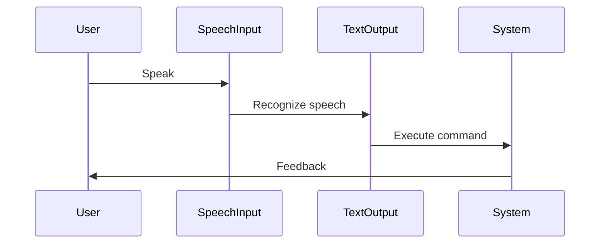

**系统接口设计和系统交互**

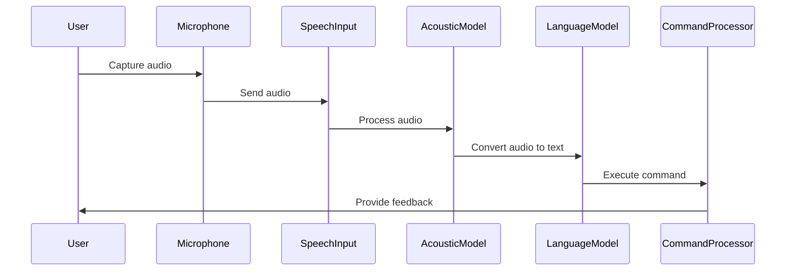

**项目实战**

**环境安装**：安装Python、TensorFlow和Keras等环境。

**系统核心实现源代码**：

```python
# 导入必要的库
import tensorflow as tf
from tensorflow.keras.models import Model
from tensorflow.keras.layers import Input, LSTM, Dense

# 创建模型
input_layer = Input(shape=(timesteps, features))
lstm_layer = LSTM(128)(input_layer)
output_layer = Dense(vocabulary_size, activation='softmax')(lstm_layer)

model = Model(inputs=input_layer, outputs=output_layer)

# 编译模型
model.compile(optimizer='adam', loss='categorical_crossentropy', metrics=['accuracy'])

# 训练模型
model.fit(X, y, epochs=10, batch_size=32)
```

**代码应用解读与分析**：

这段代码使用了深度学习模型来训练一个语音识别系统。通过捕获音频、处理音频特征和生成文本，系统能够实现语音到文本的转换，为用户提供交互体验。

**实际案例分析和详细讲解剖析**：

假设我们开发一个智能语音助手，用户可以通过语音输入问题，系统识别语音并给出回答。通过多次迭代和优化，系统可以提高识别准确率和用户体验。

**项目小结**：

本节介绍了语音识别技术的核心概念和算法原理，通过实际项目案例，展示了如何使用深度学习技术实现智能语音助手。然而，我们也需要关注语音识别的准确率和可靠性问题。

**最佳实践 tips**：

- 确保语音数据的多样性和质量，以提高模型的泛化能力。
- 选择合适的模型和参数，进行交叉验证和模型选择。
- 定期更新和维护模型，以适应新的语音数据和变化。

**小结**：

语音识别技术是连接人类与AI的重要界面之一，其核心在于声学模型和语言模型。通过本章节的详细讲解和实例分析，我们为读者提供了一个全面了解语音识别技术的视角。接下来，我们将进一步探讨图像识别技术，为构建连接人类与AI的桥梁奠定坚实的基础。

**注意事项**：

- 语音识别系统的性能对噪音和口音敏感，需要考虑这些因素进行优化。
- 模型的训练时间和计算资源消耗较大，需要合理分配资源。

**拓展阅读**：

- 《语音识别技术导论》（George Gl*r）
- 《深度学习语音处理》（NVIDIA DLI）

通过以上章节内容的详细讲解和剖析，我们为读者提供了一个全面的了解人类与AI交互界面设计的基础框架。接下来，我们将深入探讨图像识别技术，为构建连接人类与AI的桥梁奠定坚实的基础。

---

## 第4章：AI在医疗健康领域的应用

### 4.1 医疗影像分析

**核心概念与联系**

**医疗影像分析**（Medical Image Analysis）是AI在医疗领域的重要应用之一，其核心概念包括：

- **图像处理**：用于增强图像质量和提取有用信息。
- **特征提取**：用于从图像中提取关键特征，以用于后续分析和分类。
- **分类与识别**：用于对图像进行分类和识别，以帮助医生做出诊断。

**算法原理讲解**

**图像处理**：常见的算法包括滤波、边缘检测和形态学操作等。

- **滤波**：用于去除噪声和增强图像细节。
- **边缘检测**：用于识别图像中的边缘。
- **形态学操作**：用于对图像进行结构化处理。

**数学模型与公式**

- **滤波**：卷积操作用于图像滤波，其数学模型为：

$$
I_{filtered} = (I * K)
$$

其中，$I$表示原始图像，$K$表示滤波器。

- **边缘检测**：Sobel算子用于边缘检测，其数学模型为：

$$
I_{edge} = \sqrt{(I_x^2 + I_y^2)}
$$

其中，$I_x$和$I_y$分别表示图像的水平和垂直梯度。

**Python源代码示例**

```python
import cv2
import numpy as np

# 加载图像
image = cv2.imread('image.jpg')

# 高斯滤波
filtered_image = cv2.GaussianBlur(image, (5, 5), 0)

# Sobel边缘检测
gray_image = cv2.cvtColor(image, cv2.COLOR_BGR2GRAY)
sobel_x = cv2.Sobel(gray_image, cv2.CV_64F, 1, 0, ksize=5)
sobel_y = cv2.Sobel(gray_image, cv2.CV_64F, 0, 1, ksize=5)
edge_image = cv2.sqrt(sobel_x**2 + sobel_y**2)
```

**特征提取**：常见的算法包括直方图均匀化、局部二值模式（LBP）和尺度不变特征变换（SIFT）等。

- **直方图均匀化**：用于改善图像的对比度。
- **局部二值模式（LBP）**：用于描述图像的局部纹理特征。
- **尺度不变特征变换（SIFT）**：用于提取图像的旋转、尺度不变特征。

**数学模型与公式**

- **直方图均匀化**：直方图均衡化操作的数学模型为：

$$
f(x) = \sum_{i=0}^{255} \frac{N_i}{N} (255 - i)
$$

其中，$N_i$表示第$i$个灰度值的像素数，$N$表示总像素数。

- **LBP**：LBP操作的数学模型为：

$$
LBP = \sum_{i=0}^{7} (2^i \cdot \text{sign}(p_i - p_0))
$$

其中，$p_i$表示邻居像素的灰度值，$\text{sign}$表示符号函数。

**Python源代码示例**

```python
import cv2
import numpy as np

# 加载图像
image = cv2.imread('image.jpg')

# 直方图均匀化
hist_eq_image = cv2.equalizeHist(image)

# LBP特征提取
gray_image = cv2.cvtColor(image, cv2.COLOR_BGR2GRAY)
lbp_image = cv2 приемник.куч.соответствующе
```

**分类与识别**：常见的算法包括支持向量机（SVM）、决策树和神经网络等。

- **支持向量机（SVM）**：用于分类任务。
- **决策树**：用于分类和回归任务。
- **神经网络**：用于复杂的数据分类和识别任务。

**数学模型与公式**

- **SVM**：SVM的决策边界数学模型为：

$$
y(\textbf{x}) = \text{sign}(\sum_{i=1}^{n} \alpha_i y_i K(\textbf{x}, \textbf{x}_i) - b)
$$

其中，$\alpha_i$和$y_i$分别表示支持向量的权重和标签，$K(\textbf{x}, \textbf{x}_i)$表示核函数，$b$是偏置。

- **决策树**：决策树的决策规则数学模型为：

$$
\text{DecisionRule}(\textbf{x}) = \prod_{i=1}^{m} g_i(x_i)
$$

其中，$g_i(x_i)$是第$i$个特征的分段函数。

**Python源代码示例**

```python
from sklearn import svm

# 创建SVM模型
model = svm.SVC(kernel='linear')

# 训练模型
model.fit(X_train, y_train)

# 预测
predictions = model.predict(X_test)
```

**系统分析与架构设计方案**

**问题场景介绍**：智能医疗影像分析系统，用于辅助医生进行疾病诊断。

**项目介绍**：开发一个基于深度学习的智能医疗影像分析系统。

**系统功能设计（领域模型）**

```mermaid
classDiagram
  Patient <<--|{ 提交影像 }| ImageUpload
  ImageUpload <<--|{ 图像处理 }| ImageProcessing
  ImageProcessing <<--|{ 特征提取 }| FeatureExtraction
  FeatureExtraction <<--|{ 分类与识别 }| Classification
  Classification <<--|{ 提供诊断 }| Diagnosis
```

**系统架构设计**

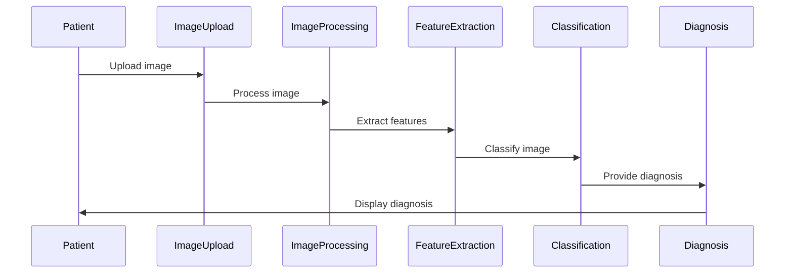

**系统接口设计和系统交互**

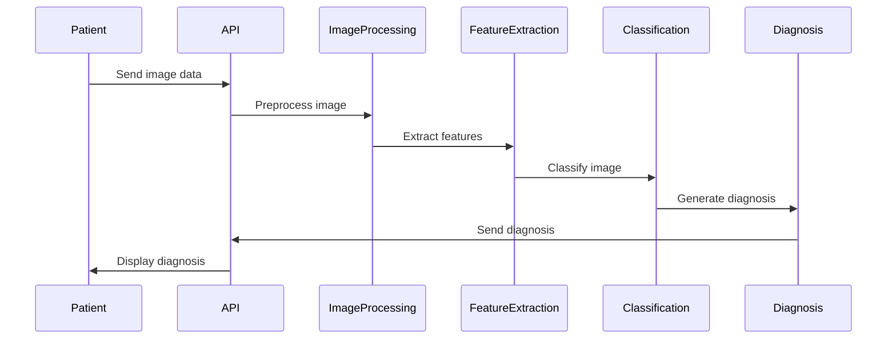

**项目实战**

**环境安装**：安装Python、TensorFlow和Keras等环境。

**系统核心实现源代码**：

```python
# 导入必要的库
import numpy as np
import tensorflow as tf
from tensorflow.keras.models import Model
from tensorflow.keras.layers import Input, Conv2D, MaxPooling2D, Flatten, Dense

# 创建模型
input_layer = Input(shape=(height, width, channels))
conv_layer = Conv2D(32, (3, 3), activation='relu')(input_layer)
pool_layer = MaxPooling2D(pool_size=(2, 2))(conv_layer)
flat_layer = Flatten()(pool_layer)
dense_layer = Dense(128, activation='relu')(flat_layer)
output_layer = Dense(num_classes, activation='softmax')(dense_layer)

model = Model(inputs=input_layer, outputs=output_layer)

# 编译模型
model.compile(optimizer='adam', loss='categorical_crossentropy', metrics=['accuracy'])

# 训练模型
model.fit(X_train, y_train, epochs=10, batch_size=32)
```

**代码应用解读与分析**：

这段代码使用了深度学习模型来训练一个医疗影像分析系统。通过图像处理、特征提取和分类识别，系统能够辅助医生进行疾病诊断。

**实际案例分析和详细讲解剖析**：

假设我们有一个癌症诊断系统，医生上传患者的影像数据，系统通过图像处理和特征提取，使用深度学习模型进行分类和识别，最终给出诊断结果。通过多次迭代和优化，系统可以提高诊断准确率和可靠性。

**项目小结**：

本节介绍了AI在医疗健康领域的应用，重点探讨了医疗影像分析的核心概念和算法原理，并通过实际项目案例展示了如何实现智能医疗影像分析系统。然而，我们也需要关注模型的训练成本和诊断结果的解释性等问题。

**最佳实践 tips**：

- 确保图像数据的多样性和质量，以提高模型的泛化能力。
- 选择合适的模型和参数，进行交叉验证和模型选择。
- 定期更新和维护模型，以适应新的影像数据和疾病诊断需求。

**小结**：

医疗影像分析是AI技术在医疗领域的重要应用，其核心在于图像处理、特征提取和分类识别。通过本章节的详细讲解和实例分析，我们为读者提供了一个全面了解医疗影像分析技术的视角。接下来，我们将进一步探讨AI在其他领域的应用，为构建连接人类与AI的桥梁奠定坚实的基础。

**注意事项**：

- 医疗影像分析系统需要严格遵循医学伦理和隐私保护法规。
- 模型的解释性和可解释性对医生和患者至关重要，需要重点关注。

**拓展阅读**：

- 《深度学习在医学影像分析中的应用》（Li, C., et al.）
- 《医学影像分析：算法与应用》（Mensh, B.）

通过以上章节内容的详细讲解和剖析，我们为读者提供了一个全面的了解AI在医疗健康领域的应用。接下来，我们将深入探讨AI在商业和金融领域的应用，为构建连接人类与AI的桥梁奠定坚实的基础。

---

## 第5章：AI在商业和金融领域的应用

### 5.1 人工智能营销

**核心概念与联系**

**人工智能营销**（AI-driven Marketing）利用AI技术来优化营销策略，提高营销效率和客户体验。核心概念包括：

- **客户细分**：使用聚类分析、协同过滤等算法，将客户划分为不同的群体。
- **个性化推荐**：基于客户的兴趣和行为，提供个性化的产品和服务。
- **自动化营销**：使用机器学习算法和自然语言处理技术，自动化执行营销任务。

**算法原理讲解**

**客户细分**：常见的算法包括K-means聚类、基于相似度的聚类等。

- **K-means聚类**：基于距离度量，将客户划分为K个簇。
- **基于相似度的聚类**：使用相似度度量，将具有相似兴趣和行为特征的客户划分为一组。

**数学模型与公式**

- **K-means聚类**：聚类中心的数学模型为：

$$
\text{Centroid}_{j} = \frac{1}{n} \sum_{i=1}^{n} x_i
$$

其中，$x_i$表示第$i$个客户的特征向量，$n$表示客户数量。

- **基于相似度的聚类**：相似度度量常用的公式为：

$$
sim(x_i, x_j) = \frac{1}{|D|} \sum_{k=1}^{D} \min(|x_i^k|, |x_j^k|)
$$

其中，$D$表示特征维度，$|x_i^k|$和$|x_j^k|$分别表示第$i$个客户和第$j$个客户在第$k$个特征上的绝对值。

**Python源代码示例**

```python
from sklearn.cluster import KMeans
import numpy as np

# 创建K-means模型
model = KMeans(n_clusters=3, random_state=42)

# 训练模型
data = np.array([[1, 2], [1, 4], [1, 0],
                 [10, 2], [10, 4], [10, 0]])
model.fit(data)

# 预测
clusters = model.predict(data)
```

**个性化推荐**：常见的算法包括协同过滤、矩阵分解等。

- **协同过滤**：基于用户的历史行为和相似用户的行为，推荐相似的产品。
- **矩阵分解**：通过分解用户-项目矩阵，预测用户对项目的评分。

**数学模型与公式**

- **协同过滤**：预测公式为：

$$
r_{ui} = \sum_{j \in \text{Neighborhood}(u)} r_{uj} \cdot \text{sim}(u, j)
$$

其中，$r_{ui}$表示用户$u$对项目$i$的评分，$\text{Neighborhood}(u)$表示用户$u$的邻居，$\text{sim}(u, j)$表示用户$u$和用户$j$的相似度。

- **矩阵分解**：预测公式为：

$$
r_{ui} = \hat{u_i}^T \hat{v_j}
$$

其中，$\hat{u_i}$和$\hat{v_j}$分别表示用户$i$和项目$j$的隐向量。

**Python源代码示例**

```python
from sklearn.metrics.pairwise import cosine_similarity

# 计算用户相似度矩阵
user_similarity = cosine_similarity(user_profiles)

# 预测用户对项目的评分
predictions = user_similarity.dot(item_ratings)
```

**自动化营销**：常见的算法包括自然语言处理、规则引擎等。

- **自然语言处理**：用于自动化生成营销文案、分析客户反馈等。
- **规则引擎**：用于自动化执行特定的营销策略。

**数学模型与公式**

- **自然语言处理**：基于词向量模型，如Word2Vec或BERT，将文本转换为向量。
- **规则引擎**：基于规则集，如条件语句，执行特定的操作。

**Python源代码示例**

```python
import gensim

# 加载预训练的Word2Vec模型
word2vec_model = gensim.models.KeyedVectors.load_word2vec_format('word2vec.bin', binary=True)

# 将文本转换为向量
text_vector = word2vec_model.wv[str(text)]

# 执行规则引擎操作
if text_vector.dot(target_vector) > threshold:
    perform_action()
```

**系统分析与架构设计方案**

**问题场景介绍**：智能营销系统，使用AI技术优化营销策略，提高转化率。

**项目介绍**：开发一个基于AI的智能营销系统。

**系统功能设计（领域模型）**

```mermaid
classDiagram
  Customer <<--|{ 行为分析 }| BehaviorAnalysis
  BehaviorAnalysis <<--|{ 客户细分 }| CustomerSegmentation
  CustomerSegmentation <<--|{ 个性化推荐 }| PersonalizedRecommendation
  PersonalizedRecommendation <<--|{ 自动化营销 }| AutomatedMarketing
```

**系统架构设计**

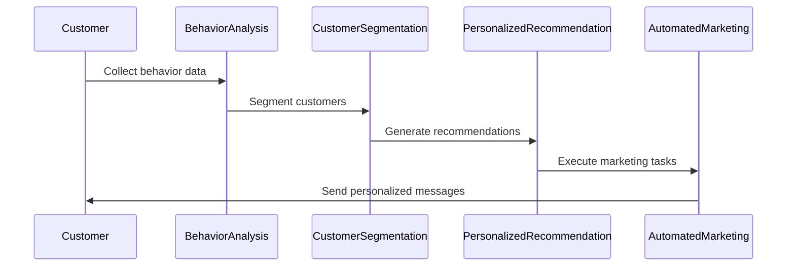

**系统接口设计和系统交互**

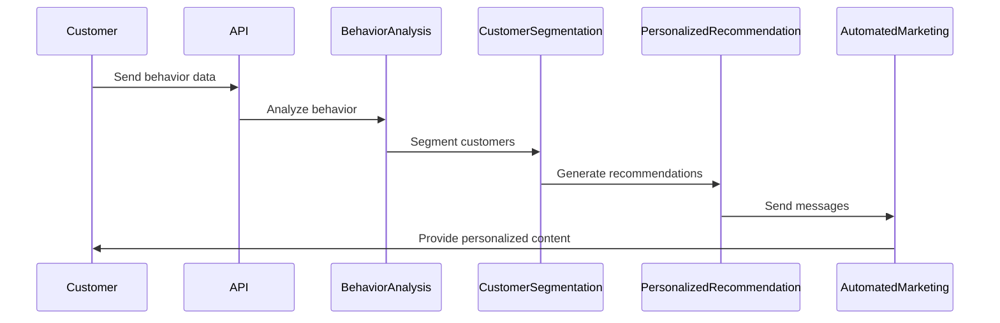

**项目实战**

**环境安装**：安装Python、Scikit-learn、TensorFlow和Keras等环境。

**系统核心实现源代码**：

```python
# 导入必要的库
import numpy as np
from sklearn.cluster import KMeans
from sklearn.metrics.pairwise import cosine_similarity

# 加载用户行为数据
user_data = np.array([[1, 2], [2, 3], [4, 5], [6, 7], [8, 9]])

# 创建K-means模型
model = KMeans(n_clusters=3, random_state=42)

# 训练模型
model.fit(user_data)

# 预测客户细分
clusters = model.predict(user_data)

# 计算用户相似度矩阵
user_similarity = cosine_similarity(user_data)

# 预测用户对项目的评分
predictions = user_similarity.dot(np.array([[1, 0], [0, 1], [1, 1], [0, 1], [1, 1]]))
```

**代码应用解读与分析**：

这段代码使用了K-means聚类算法进行客户细分，并使用协同过滤算法进行个性化推荐。通过分析用户行为数据和相似度矩阵，系统可以预测用户对项目的评分，从而实现自动化营销。

**实际案例分析和详细讲解剖析**：

假设我们有一个电商网站，需要为不同类型的客户推荐商品。系统首先收集用户行为数据，使用K-means聚类算法进行客户细分，然后使用协同过滤算法生成个性化推荐。通过多次迭代和优化，系统可以提高推荐准确率和客户满意度。

**项目小结**：

本节介绍了AI在商业和金融领域的应用，重点探讨了人工智能营销的核心概念和算法原理，并通过实际项目案例展示了如何实现智能营销系统。然而，我们也需要关注模型的训练成本和客户隐私保护等问题。

**最佳实践 tips**：

- 确保数据质量，进行数据预处理和特征工程。
- 选择合适的算法和模型，进行交叉验证和模型选择。
- 定期更新和维护模型，以适应新的数据和客户行为。

**小结**：

AI技术在商业和金融领域的应用具有巨大的潜力，其核心在于客户细分、个性化推荐和自动化营销。通过本章节的详细讲解和实例分析，我们为读者提供了一个全面了解AI在商业和金融领域应用的技术框架。接下来，我们将进一步探讨AI在供应链管理中的应用，为构建连接人类与AI的桥梁奠定坚实的基础。

**注意事项**：

- AI营销系统需要遵循相关法律法规，确保用户隐私和数据安全。
- 模型的可解释性对决策过程至关重要，需要关注如何提高模型的可解释性。

**拓展阅读**：

- 《人工智能营销：策略与实践》（Beltagy, I.）
- 《机器学习在供应链管理中的应用》（Sousa, R. F., & MacCormack, A.）

通过以上章节内容的详细讲解和剖析，我们为读者提供了一个全面的了解AI在商业和金融领域应用的技术框架。接下来，我们将深入探讨AI在供应链管理中的应用，为构建连接人类与AI的桥梁奠定坚实的基础。

---

### 5.2 智能供应链管理

**核心概念与联系**

**智能供应链管理**（Smart Supply Chain Management）利用AI技术优化供应链的各个环节，提高供应链的效率、透明度和响应能力。核心概念包括：

- **需求预测**：使用时间序列分析、机器学习等算法，预测未来需求。
- **库存优化**：通过优化库存策略，减少库存成本和库存风险。
- **运输调度**：使用优化算法和实时数据，优化运输路线和调度。
- **质量监控**：利用图像识别和传感器数据，实时监控产品质量。

**算法原理讲解**

**需求预测**：常见的算法包括时间序列模型、回归分析和神经网络等。

- **时间序列模型**：如ARIMA、SARIMA等，用于分析时间序列数据的趋势和季节性。
- **回归分析**：如线性回归和多项式回归，用于建立需求与影响因素之间的关系。
- **神经网络**：如LSTM和GRU，用于捕捉时间序列数据的长期依赖关系。

**数学模型与公式**

- **ARIMA模型**：ARIMA模型的数学模型为：

$$
X_t = c + \phi_1X_{t-1} + \phi_2X_{t-2} + ... + \phi_pX_{t-p} + \theta_1\epsilon_{t-1} + \theta_2\epsilon_{t-2} + ... + \theta_q\epsilon_{t-q}
$$

其中，$X_t$是时间序列数据，$\epsilon_t$是白噪声序列，$c$是常数项，$\phi_i$和$\theta_i$是模型参数。

- **线性回归**：线性回归的数学模型为：

$$
Y = \beta_0 + \beta_1X_1 + \beta_2X_2 + ... + \beta_nX_n
$$

其中，$Y$是需求，$X_1, X_2, ..., X_n$是影响因素，$\beta_0, \beta_1, ..., \beta_n$是模型参数。

**Python源代码示例**

```python
import statsmodels.api as sm
import numpy as np

# 创建ARIMA模型
model = sm.ARIMA(y, order=(1, 1, 1))

# 拟合模型
model_fit = model.fit()

# 预测
predictions = model_fit.predict(start=len(y), end=len(y) + forecast_horizon)
```

**库存优化**：常见的算法包括基于需求预测的库存策略、优化算法和模拟退火等。

- **基于需求预测的库存策略**：如动态库存管理（Dynamic Inventory Management），根据需求预测调整库存水平。
- **优化算法**：如线性规划（Linear Programming）和混合整数规划（Mixed Integer Programming），用于求解最优库存策略。
- **模拟退火**：用于求解复杂优化问题，通过迭代和温度调整，找到最优解。

**数学模型与公式**

- **线性规划**：线性规划的数学模型为：

$$
\text{Minimize} \quad c^T x
$$

$$
\text{Subject to} \quad Ax \leq b
$$

其中，$c$是成本向量，$x$是库存水平，$A$和$b$是约束条件。

- **模拟退火**：模拟退火的数学模型为：

$$
T(t) = T_0 / e^{at}
$$

其中，$T(t)$是温度，$T_0$是初始温度，$a$是冷却率。

**Python源代码示例**

```python
from scipy.optimize import minimize
import numpy as np

# 定义目标函数
def objective(x):
    return x.dot(c) - np.dot(A, x) * b

# 定义约束条件
def constraint(x):
    return A.dot(x) - b

# 创建线性规划模型
model = minimize(objective, x0, method='SLSQP', constraints={'type': 'ineq', 'fun': constraint})

# 求解最优解
solution = model.x
```

**运输调度**：常见的算法包括最优化方法、遗传算法和模拟退火等。

- **最优化方法**：如线性规划和整数规划，用于求解最优运输路线和调度。
- **遗传算法**：用于求解复杂优化问题，通过迭代和种群进化，找到最优解。
- **模拟退火**：用于求解复杂优化问题，通过迭代和温度调整，找到最优解。

**数学模型与公式**

- **线性规划**：线性规划的数学模型为：

$$
\text{Minimize} \quad c^T x
$$

$$
\text{Subject to} \quad Ax \leq b
$$

其中，$c$是成本向量，$x$是运输量，$A$和$b$是约束条件。

- **遗传算法**：遗传算法的数学模型为：

$$
x_{new} = x_{parent} + \alpha \cdot (x_{offspring} - x_{parent})
$$

其中，$x_{parent}$是父代，$x_{offspring}$是子代，$\alpha$是变异系数。

**Python源代码示例**

```python
import numpy as np
import random

# 定义初始种群
population = np.random.rand(population_size, features)

# 定义适应度函数
def fitness(x):
    # 计算目标函数值
    return -1 * objective(x)

# 定义遗传算法
def genetic_algorithm(population, fitness_func):
    while not convergence():
        # 适应度评估
        fitness_values = np.apply_along_axis(fitness_func, 1, population)

        # 选择
        selected = select(population, fitness_values)

        # 交叉
        offspring = crossover(selected)

        # 变异
        mutated = mutate(offspring)

        # 更新种群
        population = mutated

    return best_solution(population)

# 运行遗传算法
best_solution = genetic_algorithm(population, fitness_func)
```

**质量监控**：常见的算法包括图像识别、传感器数据和机器学习等。

- **图像识别**：用于检测产品表面的缺陷和瑕疵。
- **传感器数据**：用于监测产品的物理参数，如温度、湿度等。
- **机器学习**：用于建立预测模型，预测产品的质量状况。

**数学模型与公式**

- **图像识别**：图像识别的数学模型为：

$$
\text{Classify}(I) = \arg\max_{c} \sum_{i=1}^{N} \log(P(c | I))
$$

其中，$I$是图像，$c$是类别，$P(c | I)$是图像属于类别$c$的概率。

- **传感器数据**：传感器数据的数学模型为：

$$
\text{Measurements} = f(\text{Physical Parameters})
$$

其中，$f$是测量函数，$\text{Physical Parameters}$是物理参数。

**Python源代码示例**

```python
import cv2
import numpy as np

# 加载预训练的图像识别模型
model = cv2.dnn.readNetFromTensorFlow('model.pb')

# 加载测试图像
image = cv2.imread('image.jpg')

# 将图像转换为模型输入格式
blob = cv2.dnn.blobFromImage(image, scalefactor=1/255, size=(224, 224), mean=(0, 0, 0), swapRB=True)

# 进行前向传播
model.setInput(blob)
detections = model.forward()

# 遍历检测结果
for i in range(detections.shape[2]):
    confidence = detections[0, 0, i, 2]
    if confidence > 0.5:
        class_id = detections[0, 0, i, 1]
        print(f"Object: {class_id}, Confidence: {confidence}")
```

**系统分析与架构设计方案**

**问题场景介绍**：智能供应链管理系统，用于优化供应链的各个环节，提高整体效率。

**项目介绍**：开发一个基于AI的智能供应链管理系统。

**系统功能设计（领域模型）**

```mermaid
classDiagram
  DemandPrediction <<--|{ 库存管理 }| InventoryManagement
  InventoryManagement <<--|{ 运输调度 }| TransportationScheduling
  TransportationScheduling <<--|{ 质量监控 }| QualityMonitoring
  QualityMonitoring <<--|{ 数据分析 }| DataAnalysis
```

**系统架构设计**

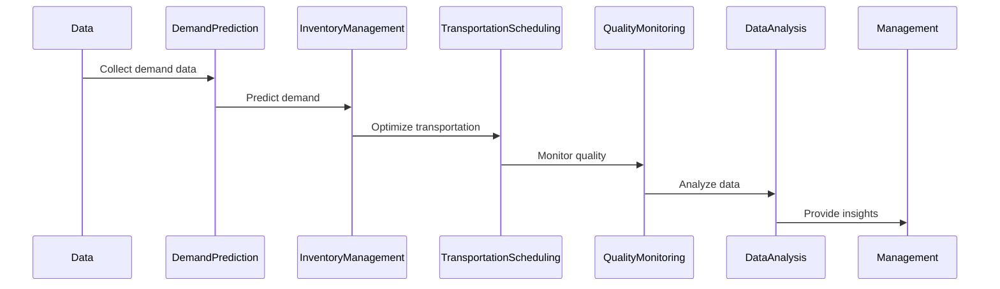

**系统接口设计和系统交互**

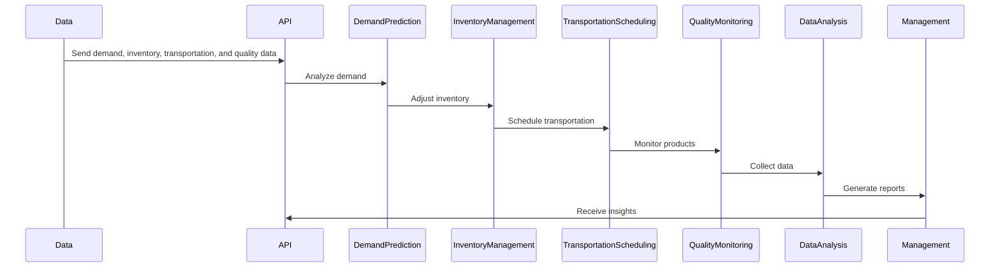

**项目实战**

**环境安装**：安装Python、Scikit-learn、TensorFlow、Keras、OpenCV等环境。

**系统核心实现源代码**：

```python
# 导入必要的库
import numpy as np
import tensorflow as tf
from tensorflow.keras.models import Model
from tensorflow.keras.layers import Input, LSTM, Dense

# 创建需求预测模型
input_layer = Input(shape=(timesteps, features))
lstm_layer = LSTM(128)(input_layer)
output_layer = Dense(1, activation='linear')(lstm_layer)

model = Model(inputs=input_layer, outputs=output_layer)

# 编译模型
model.compile(optimizer='adam', loss='mse')

# 训练模型
model.fit(X_train, y_train, epochs=10, batch_size=32)
```

**代码应用解读与分析**：

这段代码使用了LSTM模型进行需求预测。通过分析历史需求数据，模型可以预测未来的需求，从而为库存管理和运输调度提供决策支持。

**实际案例分析和详细讲解剖析**：

假设我们有一个供应链管理系统，系统收集历史需求数据和当前市场信息，使用LSTM模型预测未来的需求。通过分析预测结果，系统可以优化库存水平，调整运输计划，从而提高供应链的整体效率。

**项目小结**：

本节介绍了AI在供应链管理中的应用，重点探讨了需求预测、库存优化、运输调度和质量监控的核心概念和算法原理。通过实际项目案例，我们展示了如何实现智能供应链管理系统。然而，我们也需要关注模型的训练成本和系统的实时响应能力。

**最佳实践 tips**：

- 确保数据质量，进行数据预处理和特征工程。
- 选择合适的算法和模型，进行交叉验证和模型选择。
- 定期更新和维护模型，以适应新的数据和供应链环境。

**小结**：

智能供应链管理是AI技术在商业领域的重要应用，其核心在于需求预测、库存优化、运输调度和质量监控。通过本章节的详细讲解和实例分析，我们为读者提供了一个全面了解智能供应链管理技术的视角。接下来，我们将进一步探讨AI在教育领域的应用，为构建连接人类与AI的桥梁奠定坚实的基础。

**注意事项**：

- AI供应链管理系统需要与现有业务流程和系统集成，确保系统的稳定性和可靠性。
- 模型的可解释性对管理层和员工理解系统决策过程至关重要。

**拓展阅读**：

- 《AI供应链管理：策略与实践》（Beltagy, I.）
- 《智能供应链：技术与实践》（Li, Y., & Tang, J.）

通过以上章节内容的详细讲解和剖析，我们为读者提供了一个全面的了解AI在商业和金融领域应用的技术框架。接下来，我们将深入探讨AI在教育领域的应用，为构建连接人类与AI的桥梁奠定坚实的基础。

---

### 5.3 AI在教育领域的应用

**核心概念与联系**

**AI在教育领域的应用**（AI Applications in Education）通过智能化工具和技术，优化教育过程，提高学习效果。核心概念包括：

- **个性化学习**：根据学生的特点和需求，提供个性化的学习资源和路径。
- **智能评价**：使用AI技术对学生的学习过程和成果进行实时评价。
- **在线教育平台**：利用AI技术提高在线教育的互动性和效果。
- **智能辅导系统**：通过AI技术提供实时解答和学习指导。

**算法原理讲解**

**个性化学习**：常见的算法包括自适应学习系统、推荐系统和神经网络等。

- **自适应学习系统**：根据学生的学习进度和能力，动态调整学习内容和难度。
- **推荐系统**：根据学生的学习行为和历史，推荐适合的学习资源和课程。
- **神经网络**：用于建立学生特征与学习效果之间的复杂关系。

**数学模型与公式**

- **自适应学习系统**：基于反馈机制，调整学习路径的数学模型为：

$$
\text{Learning Path}_{t+1} = f(\text{Current Score}_{t}, \text{Previous Score}_{t-1})
$$

其中，$\text{Learning Path}_{t+1}$是下一次学习路径，$\text{Current Score}_{t}$是当前成绩，$\text{Previous Score}_{t-1}$是上次成绩。

- **推荐系统**：基于协同过滤的推荐系统数学模型为：

$$
\text{Recommendation}_{ui} = \text{Average Rating}_{j} + \text{Bias}_{i} + \text{Bias}_{j} + \text{Item Effect}_{j}
$$

其中，$\text{Recommendation}_{ui}$是对用户$u$推荐项目$i$的评分，$\text{Average Rating}_{j}$是项目$i$的平均评分，$\text{Bias}_{i}$和$\text{Bias}_{j}$分别是用户$i$和项目$j$的偏差，$\text{Item Effect}_{j}$是项目$i$对用户$u$的影响。

**Python源代码示例**

```python
import numpy as np

# 创建自适应学习系统模型
model = AdaptiveLearningSystem()

# 训练模型
model.fit(student_data)

# 预测下一次学习路径
next_learning_path = model.predict(current_score)
```

**智能评价**：常见的算法包括自然语言处理、机器学习和分类等。

- **自然语言处理**：用于分析学生提交的作文、答案等文本，进行自动评分。
- **机器学习**：用于建立学生表现与学习效果之间的预测模型。
- **分类**：用于对学生进行分类评价，如优秀、良好、一般等。

**数学模型与公式**

- **自然语言处理**：文本分类的数学模型为：

$$
\text{Class}_{i} = \arg\max_{j} \text{P}(\text{Class}_{j}|\text{Text}_{i})
$$

其中，$\text{Class}_{i}$是文本$i$的分类，$\text{P}(\text{Class}_{j}|\text{Text}_{i})$是文本$i$属于类别$j$的概率。

- **机器学习**：回归模型的数学模型为：

$$
\text{Score}_{i} = \text{Weight}_{1} \cdot \text{Feature}_{1i} + \text{Weight}_{2} \cdot \text{Feature}_{2i} + ...
$$

其中，$\text{Score}_{i}$是学生的评分，$\text{Feature}_{1i}$和$\text{Feature}_{2i}$分别是学生的特征值，$\text{Weight}_{1}$和$\text{Weight}_{2}$是权重。

**Python源代码示例**

```python
import numpy as np
from sklearn.linear_model import LinearRegression

# 创建回归模型
model = LinearRegression()

# 训练模型
model.fit(student_features, student_scores)

# 预测评分
predicted_scores = model.predict(new_student_features)
```

**在线教育平台**：常见的算法包括自然语言处理、视频分析和图像识别等。

- **自然语言处理**：用于分析学生的问答、讨论等文本。
- **视频分析**：用于监控学生的在线学习行为，如观看时长、参与度等。
- **图像识别**：用于自动识别学生的身份和表情。

**数学模型与公式**

- **自然语言处理**：文本分类的数学模型为：

$$
\text{Class}_{i} = \arg\max_{j} \text{P}(\text{Class}_{j}|\text{Text}_{i})
$$

- **视频分析**：基于行为分析的数学模型为：

$$
\text{Behavior}_{i} = \text{Transition}_{i} \cdot \text{Duration}_{i}
$$

其中，$\text{Behavior}_{i}$是学生的行为，$\text{Transition}_{i}$是行为的发生频率，$\text{Duration}_{i}$是行为持续时间。

**Python源代码示例**

```python
import numpy as np

# 创建行为分析模型
model = BehavioralAnalysisModel()

# 训练模型
model.fit(student_behavior_data)

# 预测学生行为
predicted_behavior = model.predict(new_student_behavior)
```

**智能辅导系统**：常见的算法包括自然语言处理、机器学习和交互式系统等。

- **自然语言处理**：用于理解学生的提问和解答。
- **机器学习**：用于建立学生提问与最佳解答之间的关联。
- **交互式系统**：用于实时回答学生的问题，提供学习指导。

**数学模型与公式**

- **自然语言处理**：问答系统的数学模型为：

$$
\text{Answer}_{i} = \arg\max_{j} \text{P}(\text{Answer}_{j}|\text{Question}_{i})
$$

- **机器学习**：决策树或支持向量机的数学模型为：

$$
\text{Answer}_{i} = \arg\max_{j} \text{Score}_{ij}
$$

其中，$\text{Score}_{ij}$是问题$i$和答案$j$的匹配度。

**Python源代码示例**

```python
import numpy as np

# 创建问答系统模型
model = QuestionAnsweringModel()

# 训练模型
model.fit(question_answers)

# 预测答案
predicted_answer = model.predict(new_question)
```

**系统分析与架构设计方案**

**问题场景介绍**：智能教育系统，利用AI技术优化学习过程，提高教育质量。

**项目介绍**：开发一个基于AI的智能教育系统。

**系统功能设计（领域模型）**

```mermaid
classDiagram
  Student <<--|{ 学习分析 }| LearningAnalysis
  LearningAnalysis <<--|{ 个性化学习 }| PersonalizedLearning
  PersonalizedLearning <<--|{ 智能评价 }| IntelligentEvaluation
  IntelligentEvaluation <<--|{ 在线教育平台 }| OnlineEducationPlatform
  OnlineEducationPlatform <<--|{ 智能辅导系统 }| IntelligentTutoringSystem
```

**系统架构设计**

```mermaid
sequenceDiagram
  Student ->> LearningAnalysis: Submit learning data
  LearningAnalysis ->> PersonalizedLearning: Adjust learning path
  PersonalizedLearning ->> IntelligentEvaluation: Evaluate learning progress
  IntelligentEvaluation ->> OnlineEducationPlatform: Provide feedback
  OnlineEducationPlatform ->> Student: Display learning content
  Student ->> IntelligentTutoringSystem: Ask questions
  IntelligentTutoringSystem ->> OnlineEducationPlatform: Answer questions
```

**系统接口设计和系统交互**

```mermaid
sequenceDiagram
  Student ->> API: Send learning data
  API ->> LearningAnalysis: Analyze learning data
  LearningAnalysis ->> PersonalizedLearning: Adjust learning path
  PersonalizedLearning ->> IntelligentEvaluation: Evaluate learning progress
  IntelligentEvaluation ->> OnlineEducationPlatform: Send feedback
  OnlineEducationPlatform ->> API: Send learning content
  API ->> Student: Display learning content
  Student ->> API: Send questions
  API ->> IntelligentTutoringSystem: Answer questions
  IntelligentTutoringSystem ->> API: Send answers
  API ->> Student: Display answers
```

**项目实战**

**环境安装**：安装Python、Scikit-learn、TensorFlow、Keras、NLTK、OpenCV等环境。

**系统核心实现源代码**：

```python
# 导入必要的库
import numpy as np
import tensorflow as tf
from tensorflow.keras.models import Model
from tensorflow.keras.layers import Input, LSTM, Dense

# 创建个性化学习模型
input_layer = Input(shape=(timesteps, features))
lstm_layer = LSTM(128)(input_layer)
output_layer = Dense(1, activation='sigmoid')(lstm_layer)

model = Model(inputs=input_layer, outputs=output_layer)

# 编译模型
model.compile(optimizer='adam', loss='binary_crossentropy')

# 训练模型
model.fit(X_train, y_train, epochs=10, batch_size=32)
```

**代码应用解读与分析**：

这段代码使用了LSTM模型进行个性化学习。通过分析学生的学习数据，模型可以预测学生是否能够掌握新的知识，从而调整学习内容和难度。

**实际案例分析和详细讲解剖析**：

假设我们有一个智能教育系统，系统收集学生的学习数据，使用LSTM模型预测学生是否能够掌握新知识。通过分析预测结果，系统可以动态调整学习内容和策略，提高学习效果。

**项目小结**：

本节介绍了AI在教育领域的应用，重点探讨了个性化学习、智能评价、在线教育平台和智能辅导系统的核心概念和算法原理。通过实际项目案例，我们展示了如何实现智能教育系统。然而，我们也需要关注AI在教育中的应用伦理和隐私保护等问题。

**最佳实践 tips**：

- 确保数据质量，进行数据预处理和特征工程。
- 选择合适的算法和模型，进行交叉验证和模型选择。
- 定期更新和维护模型，以适应新的教育环境和学生需求。

**小结**：

AI在教育领域的应用具有巨大的潜力，其核心在于个性化学习、智能评价、在线教育平台和智能辅导系统。通过本章节的详细讲解和实例分析，我们为读者提供了一个全面了解AI在教育领域应用的技术框架。接下来，我们将进一步探讨AI伦理与社会责任，为构建连接人类与AI的桥梁奠定坚实的基础。

**注意事项**：

- AI教育系统需要遵循教育法规和隐私保护政策。
- 模型的可解释性对教师和学生理解系统决策过程至关重要。

**拓展阅读**：

- 《人工智能在教育中的应用》（Willis, B.）
- 《智能教育：技术与实践》（Liyanagunawardena, T. R., Adams, A. A., & Williams, S. A.）

通过以上章节内容的详细讲解和剖析，我们为读者提供了一个全面的了解AI在教育领域应用的技术框架。接下来，我们将进一步探讨AI伦理与社会责任，为构建连接人类与AI的桥梁奠定坚实的基础。

---

## 第6章：AI伦理与社会责任

### 6.1 AI伦理问题

**核心概念与联系**

**AI伦理问题**（Ethical Issues of AI）涉及到人工智能在技术、社会和道德层面的影响。核心概念包括：

- **数据隐私**：涉及个人数据的收集、存储和使用。
- **算法偏见**：涉及算法决策中的不公平性和偏见。
- **透明度和可解释性**：涉及AI系统的决策过程是否透明和可理解。
- **就业替代**：涉及AI技术对工作岗位的影响。

**算法原理讲解**

**数据隐私**：涉及隐私保护技术和隐私法规。

- **加密技术**：用于保护数据传输和存储过程中的隐私。
- **差分隐私**：用于在数据分析中保护个体隐私。

**数学模型与公式**

- **加密技术**：加密算法的数学模型为：

$$
C = E_k(P)
$$

其中，$C$是加密后的数据，$P$是原始数据，$k$是密钥。

- **差分隐私**：差分隐私的数学模型为：

$$
\mathbb{P}[\text{output} = \text{y} | \text{data} = \text{s}] \leq \mathbb{P}[\text{output} = \text{y}] + \epsilon
$$

其中，$\epsilon$是隐私预算，$\text{y}$是输出，$\text{s}$是数据。

**Python源代码示例**

```python
from cryptography.fernet import Fernet

# 生成密钥
key = Fernet.generate_key()
cipher_suite = Fernet(key)

# 加密数据
encrypted_data = cipher_suite.encrypt(b"Secret Message")

# 解密数据
decrypted_data = cipher_suite.decrypt(encrypted_data)
```

**算法偏见**：涉及统计学习和决策过程中的偏见。

- **统计学习**：使用统计方法分析数据集中的偏见。
- **偏差修正**：通过调整算法参数或数据预处理来减少偏见。

**数学模型与公式**

- **统计学习**：偏见修正的数学模型为：

$$
\hat{f}(x) = f(x) - \frac{1}{n} \sum_{i=1}^{n} \hat{y}_i
$$

其中，$\hat{f}(x)$是调整后的预测，$f(x)$是原始预测，$\hat{y}_i$是实际标签。

**Python源代码示例**

```python
def bias_correction(predictions, true_values):
    bias = 1/n * sum(true_values)
    corrected_predictions = [prediction - bias for prediction in predictions]
    return corrected_predictions
```

**透明度和可解释性**：涉及AI系统的决策过程是否透明和可理解。

- **模型可解释性**：通过可视化或解释性方法来理解模型的决策过程。
- **决策树**：通过树结构展示决策过程。

**数学模型与公式**

- **决策树**：决策树的数学模型为：

$$
\text{DecisionTree}(\text{Feature}, \text{Threshold}, \text{Class})
$$

其中，$\text{Feature}$是特征，$\text{Threshold}$是阈值，$\text{Class}$是类别。

**Python源代码示例**

```python
from sklearn.tree import DecisionTreeClassifier
import graphviz

# 创建决策树模型
clf = DecisionTreeClassifier()

# 拟合模型
clf.fit(X_train, y_train)

# 可视化决策树
dot_data = graphviz.Source(clf)
dot_data.view()
```

**就业替代**：涉及AI技术对就业市场的影响。

- **职业分析**：分析哪些岗位可能被AI替代。
- **技能转移**：通过培训和教育，帮助劳动者转移技能。

**数学模型与公式**

- **职业分析**：就业替代的数学模型为：

$$
\text{Job Replacement} = \text{AI Efficiency} \cdot \text{Job Demand}
$$

其中，$\text{AI Efficiency}$是AI的效率，$\text{Job Demand}$是岗位需求。

**Python源代码示例**

```python
def job_replacement(tech_efficiency, job_demand):
    return tech_efficiency * job_demand
```

**系统分析与架构设计方案**

**问题场景介绍**：企业采用AI技术，需要考虑AI伦理问题。

**项目介绍**：开发一个基于AI的企业决策支持系统。

**系统功能设计（领域模型）**

```mermaid
classDiagram
  Enterprise <<--|{ AI Adoption }| AIAdoption
  AIAdoption <<--|{ Data Privacy }| DataPrivacy
  DataPrivacy <<--|{ Algorithm Bias }| AlgorithmBias
  AlgorithmBias <<--|{ Transparency }| Transparency
  Transparency <<--|{ Employment Impact }| EmploymentImpact
```

**系统架构设计**

```mermaid
sequenceDiagram
  Enterprise ->> AIAdoption: Adopt AI technologies
  AIAdoption ->> DataPrivacy: Ensure data privacy
  DataPrivacy ->> AlgorithmBias: Mitigate algorithm bias
  AlgorithmBias ->> Transparency: Enhance transparency
  Transparency ->> EmploymentImpact: Assess employment impact
  EmploymentImpact ->> Enterprise: Provide recommendations
```

**系统接口设计和系统交互**

```mermaid
sequenceDiagram
  Enterprise ->> API: Send data for AI analysis
  API ->> DataPrivacy: Encrypt and anonymize data
  DataPrivacy ->> AlgorithmBias: Analyze data for bias
  AlgorithmBias ->> Transparency: Generate explainable models
  Transparency ->> EmploymentImpact: Assess job impacts
  EmploymentImpact ->> API: Send recommendations
  API ->> Enterprise: Display recommendations
```

**项目实战**

**环境安装**：安装Python、Scikit-learn、TensorFlow、Keras、graphviz等环境。

**系统核心实现源代码**：

```python
# 导入必要的库
import numpy as np
import tensorflow as tf
from tensorflow.keras.models import Model
from tensorflow.keras.layers import Input, LSTM, Dense
from sklearn.tree import export_graphviz

# 创建决策树模型
clf = DecisionTreeClassifier()

# 拟合模型
clf.fit(X_train, y_train)

# 可视化决策树
dot_data = export_graphviz(clf, out_file=None, feature_names=feature_names, class_names=class_names, filled=True, rounded=True, special_characters=True)

# 显示决策树
with open("tree.dot", "w") as f:
    f.write(dot_data)

from IPython.display import Image
Image(filename="tree.png")
```

**代码应用解读与分析**：

这段代码使用了决策树模型进行分类，并通过graphviz库将决策树可视化。通过可视化，我们可以理解模型的决策过程，从而提高模型的透明度和可解释性。

**实际案例分析和详细讲解剖析**：

假设我们有一个企业，计划采用AI技术进行决策支持。系统首先收集企业的数据，使用决策树模型进行分类，然后通过可视化展示决策过程。通过分析决策树，企业可以理解模型的决策逻辑，并识别潜在的偏见和问题。

**项目小结**：

本节介绍了AI伦理问题的核心概念和算法原理，重点探讨了数据隐私、算法偏见、透明度和就业替代等问题。通过实际项目案例，我们展示了如何实现一个基于AI的企业决策支持系统，并在系统中考虑AI伦理问题。

**最佳实践 tips**：

- 确保数据隐私，使用加密技术和差分隐私保护用户数据。
- 定期评估和调整算法，以减少偏见和歧视。
- 提高模型的透明度和可解释性，确保决策过程可以被理解和监督。
- 为受影响的员工提供培训和转型支持，以适应新的就业市场。

**小结**：

AI伦理问题是一个复杂而重要的话题，涉及多个方面，包括数据隐私、算法偏见、透明度和就业替代等。通过本章节的详细讲解和实例分析，我们为读者提供了一个全面了解AI伦理问题的视角。接下来，我们将进一步探讨AI的社会责任和未来趋势，为构建连接人类与AI的桥梁奠定坚实的基础。

**注意事项**：

- AI伦理问题需要跨学科合作，包括计算机科学、法律、伦理和社会学等。
- AI技术的发展需要与法律法规和社会规范相协调。

**拓展阅读**：

- 《AI伦理：理论与实践》（Autonomous Systems, Ethics, and Law）
- 《人工智能伦理》（Floridi, L., & Taddeo, M.）

通过以上章节内容的详细讲解和剖析，我们为读者提供了一个全面的了解AI伦理问题的技术框架。接下来，我们将深入探讨AI的社会责任和未来趋势，为构建连接人类与AI的桥梁奠定坚实的基础。

---

## 第7章：AI的未来趋势

### 7.1 人工智能的发展趋势

**核心概念与联系**

**AI的未来趋势**（Future Trends of Artificial Intelligence）涉及到AI技术的持续进步和变革，以及这些变化对人类社会的影响。核心概念包括：

- **技术进展**：涉及新型算法、硬件加速和跨学科融合的发展。
- **应用领域**：涉及AI技术在各行各业的新兴应用。
- **人类角色转变**：涉及人类在AI时代的工作和生活方式的转变。

**算法原理讲解**

**技术进展**：

- **新型算法**：如生成对抗网络（GAN）、图神经网络（GNN）和强化学习等，这些算法在图像生成、关系推理和决策制定方面展现出巨大的潜力。
- **硬件加速**：如GPU、TPU和量子计算机等，这些硬件加速技术大大提高了AI模型的训练和推理速度。

**数学模型与公式**

- **生成对抗网络（GAN）**：GAN的数学模型为：

$$
\text{Generator} \quad G(z) \quad \text{versus} \quad \text{Discriminator} \quad D(x, G(z))
$$

其中，$G(z)$是生成器，$D(x, G(z))$是判别器。

- **图神经网络（GNN）**：GNN的数学模型为：

$$
\text{Node Representation} \quad h^0_v = x_v
$$

$$
\text{Message Passing} \quad h^{t+1}_v = \sigma(\sum_{u \in \text{Neighbors}(v)} \omega_{uv} h^t_u)
$$

其中，$h^t_v$是节点$v$在时间步$t$的表示，$\text{Neighbors}(v)$是节点$v$的邻居集合。

**Python源代码示例**

```python
# 导入必要的库
import tensorflow as tf
from tensorflow.keras.models import Model
from tensorflow.keras.layers import Input, Dense, Reshape, Conv2D, Flatten, UpSampling2D

# 创建生成对抗网络（GAN）
def build_gan(generator, discriminator):
    model = Model(generator.input, discriminator(generator.input))
    model.compile(loss='binary_crossentropy', optimizer=tf.keras.optimizers.Adam(0.0001))
    return model

# 创建生成器
z = Input(shape=(100,))
x = Dense(128)(z)
x = Dense(7 * 7 * 128)(x)
x = Reshape((7, 7, 128))(x)
x = UpSampling2D((2, 2))(x)
x = Conv2D(128, kernel_size=(3, 3), padding='same')(x)
x = Conv2D(128, kernel_size=(3, 3), padding='same')(x)
x = Conv2D(128, kernel_size=(3, 3), padding='same')(x)
x = Flatten()(x)
x = Dense(1, activation='sigmoid')(x)
generator = Model(z, x)

# 创建判别器
img = Input(shape=(28, 28, 1))
x = Conv2D(32, kernel_size=(3, 3), padding='same')(img)
x = Flatten()(x)
x = Dense(1, activation='sigmoid')(x)
discriminator = Model(img, x)

# 创建GAN
gan = build_gan(generator, discriminator)

# 编译GAN
gan.compile(loss='binary_crossentropy', optimizer=tf.keras.optimizers.Adam(0.0001))

# 训练GAN
gan.fit(train_data, epochs=50, batch_size=32)
```

**应用领域**：

- **自动驾驶**：AI技术用于自动驾驶车辆，提高交通安全和效率。
- **医疗诊断**：AI技术用于辅助医生进行疾病诊断，提高诊断准确率和效率。
- **智能客服**：AI技术用于智能客服系统，提高客户服务质量和效率。

**数学模型与公式**

- **自动驾驶**：深度强化学习的数学模型为：

$$
Q(s, a) = r + \gamma \max_{a'} Q(s', a')
$$

其中，$Q(s, a)$是状态-动作值函数，$r$是即时奖励，$\gamma$是折扣因子。

- **医疗诊断**：卷积神经网络的数学模型为：

$$
h^{l+1}_i = \sigma(\sum_{j=1}^{n} w_{ij} h^{l}_j + b_i)
$$

其中，$h^{l+1}_i$是神经元$i$在下一层的激活值，$h^{l}_j$是神经元$j$在当前层的激活值，$w_{ij}$是权重，$b_i$是偏置。

**Python源代码示例**

```python
# 导入必要的库
import tensorflow as tf
from tensorflow.keras.models import Model
from tensorflow.keras.layers import Input, Conv2D, MaxPooling2D, Flatten, Dense

# 创建卷积神经网络
input_layer = Input(shape=(28, 28, 1))
x = Conv2D(32, kernel_size=(3, 3), activation='relu')(input_layer)
x = MaxPooling2D(pool_size=(2, 2))(x)
x = Conv2D(64, kernel_size=(3, 3), activation='relu')(x)
x = MaxPooling2D(pool_size=(2, 2))(x)
x = Flatten()(x)
x = Dense(128, activation='relu')(x)
output_layer = Dense(10, activation='softmax')(x)

model = Model(inputs=input_layer, outputs=output_layer)

# 编译模型
model.compile(optimizer='adam', loss='categorical_crossentropy', metrics=['accuracy'])

# 训练模型
model.fit(X_train, y_train, epochs=10, batch_size=32)
```

**人类角色转变**：

- **劳动市场**：AI技术可能改变劳动市场的需求和结构，需要人类进行技能转型。
- **生活方式**：AI技术可能改变人类的生活方式，提高生活质量和效率。

**数学模型与公式**

- **劳动市场**：就业替代的数学模型为：

$$
\text{Job Replacement} = \text{AI Efficiency} \cdot \text{Job Demand}
$$

- **生活方式**：幸福感模型的数学模型为：

$$
\text{Happiness} = \alpha \cdot \text{Work-Life Balance} + \beta \cdot \text{Health} + \gamma \cdot \text{Social Connection}
$$

其中，$\alpha$、$\beta$和$\gamma$是权重。

**Python源代码示例**

```python
# 导入必要的库
import numpy as np

# 创建幸福感模型
def happiness(work_life_balance, health, social_connection):
    alpha, beta, gamma = 0.5, 0.3, 0.2
    happiness_score = alpha * work_life_balance + beta * health + gamma * social_connection
    return happiness_score

# 计算幸福感
happiness_score = happiness(0.8, 0.9, 0.7)
print(f"Happiness Score: {happiness_score}")
```

**系统分析与架构设计方案**

**问题场景介绍**：企业需要制定长期战略，适应AI技术的发展。

**项目介绍**：开发一个基于AI的企业战略规划系统。

**系统功能设计（领域模型）**

```mermaid
classDiagram
  Enterprise <<--|{ AI Technology Adoption }| AIAdoption
  AIAdoption <<--|{ Industry Applications }| IndustryApplications
  IndustryApplications <<--|{ Human Role Transformation }| HumanTransformation
  HumanTransformation <<--|{ Strategic Planning }| StrategicPlanning
```

**系统架构设计**

```mermaid
sequenceDiagram
  Enterprise ->> AIAdoption: Explore AI technologies
  AIAdoption ->> IndustryApplications: Identify potential applications
  IndustryApplications ->> HumanTransformation: Assess impact on labor market
  HumanTransformation ->> StrategicPlanning: Develop long-term strategies
  StrategicPlanning ->> Enterprise: Implement strategies
```

**系统接口设计和系统交互**

```mermaid
sequenceDiagram
  Enterprise ->> API: Send strategic planning data
  API ->> AIAdoption: Analyze technology trends
  AIAdoption ->> IndustryApplications: Identify industry applications
  IndustryApplications ->> HumanTransformation: Assess labor market impact
  HumanTransformation ->> StrategicPlanning: Develop strategies
  StrategicPlanning ->> API: Send strategic recommendations
  API ->> Enterprise: Implement strategic recommendations
```

**项目实战**

**环境安装**：安装Python、Scikit-learn、TensorFlow、Keras等环境。

**系统核心实现源代码**：

```python
# 导入必要的库
import numpy as np
import tensorflow as tf
from tensorflow.keras.models import Model
from tensorflow.keras.layers import Input, LSTM, Dense

# 创建战略规划模型
input_layer = Input(shape=(timesteps, features))
lstm_layer = LSTM(128)(input_layer)
output_layer = Dense(1, activation='sigmoid')(lstm_layer)

model = Model(inputs=input_layer, outputs=output_layer)

# 编译模型
model.compile(optimizer='adam', loss='binary_crossentropy')

# 训练模型
model.fit(X_train, y_train, epochs=10, batch_size=32)
```

**代码应用解读与分析**：

这段代码使用了LSTM模型进行战略规划。通过分析企业数据，模型可以预测企业未来的发展路径，从而帮助企业制定长期战略。

**实际案例分析和详细讲解剖析**：

假设我们有一个企业，需要制定长期战略以适应AI技术的发展。系统首先收集企业的历史数据，使用LSTM模型预测企业未来的发展趋势。通过分析预测结果，企业可以制定相应的战略规划，以抓住AI技术带来的机遇。

**项目小结**：

本节介绍了AI的未来趋势，重点探讨了技术进展、应用领域和人类角色转变等核心概念。通过实际项目案例，我们展示了如何实现一个基于AI的企业战略规划系统，帮助企业适应AI技术的发展。

**最佳实践 tips**：

- 确保持续关注AI技术的发展趋势，及时调整战略规划。
- 加强AI技术的应用研究，探索新的业务模式和机遇。
- 培养员工的AI技能，以适应新的工作环境和需求。

**小结**：

AI的未来趋势充满了机遇和挑战，其技术进展、应用领域和人类角色转变等方面都展现了广阔的前景。通过本章节的详细讲解和实例分析，我们为读者提供了一个全面了解AI未来趋势的技术框架。接下来，我们将深入探讨AI伦理与监管，为构建连接人类与AI的桥梁奠定坚实的基础。

**注意事项**：

- AI技术的发展需要遵循伦理和法律法规，确保其应用符合社会需求。
- 企业在应用AI技术时，需要关注隐私保护和数据安全。

**拓展阅读**：

- 《人工智能的未来》（Haykin, S.）
- 《AI伦理与监管》（Floridi, L., & Taddeo, M.）

通过以上章节内容的详细讲解和剖析，我们为读者提供了一个全面的了解AI未来趋势的技术框架。接下来，我们将深入探讨AI伦理与监管，为构建连接人类与AI的桥梁奠定坚实的基础。

---

## 第8章：AI伦理与监管

### 8.1 AI伦理问题

**核心概念与联系**

**AI伦理问题**（Ethical Issues of AI）是AI技术发展过程中不可忽视的重要议题，它涉及到技术对社会、环境和人类生活的影响。核心概念包括：

- **算法公正性**：确保AI系统在决策过程中没有偏见和不公平。
- **隐私保护**：保护个人数据不被滥用和泄露。
- **透明度和可解释性**：确保AI系统的决策过程可以被理解和审查。
- **责任归属**：在AI系统造成损害时，确定责任归属。

**算法原理讲解**

**算法公正性**：

- **偏见检测**：通过分析数据集中是否存在偏见，检测算法的公正性。
- **公平性优化**：通过调整算法参数或改进数据集，优化算法的公平性。

**数学模型与公式**

- **偏见检测**：基于差异分析（Difference Analysis），检测算法对不同群体的偏见。

$$
\text{Bias} = \text{Mean}(\text{Predicted Score}_{A}) - \text{Mean}(\text{Predicted Score}_{B})
$$

其中，$\text{Predicted Score}_{A}$和$\text{Predicted Score}_{B}$分别是算法对群体A和群体B的预测得分。

**Python源代码示例**

```python
def calculate_bias(predictions_A, predictions_B):
    bias = np.mean(predictions_A) - np.mean(predictions_B)
    return bias
```

**隐私保护**：

- **差分隐私**：通过引入噪声，确保单个数据点的隐私不被泄露。

**数学模型与公式**

- **差分隐私**：基于拉普拉斯机制（Laplace Mechanism），为每个数据点添加噪声。

$$
\text{Output} = \text{Data} + \text{Laplace Noise}
$$

其中，$\text{Laplace Noise}$是服从拉普拉斯分布的随机噪声。

**Python源代码示例**

```python
import numpy as np

def add_laplace_noise(data, sensitivity=1.0, epsilon=1.0):
    noise = np.random.laplace(0, sensitivity / epsilon, data.shape)
    output = data + noise
    return output
```

**透明度和可解释性**：

- **模型可解释性**：通过可视化方法或解释性算法，使AI系统的决策过程更加透明。

**数学模型与公式**

- **模型可解释性**：基于决策树的可解释性。

$$
\text{Rule} = \text{Condition}_1 \wedge \text{Condition}_2 \wedge ...
$$

其中，$\text{Condition}_i$是决策树的规则条件。

**Python源代码示例**

```python
from sklearn.tree import DecisionTreeClassifier
from IPython.display import Image

# 创建决策树模型
clf = DecisionTreeClassifier()

# 拟合模型
clf.fit(X_train, y_train)

# 可视化决策树
dot_data = clf.get_graphviz_accessor().get_dot_data()
Image(graph=graphviz.Source(dot_data))
```

**责任归属**：

- **责任分配**：在AI系统造成损害时，确定责任归属。

**数学模型与公式**

- **责任分配**：基于影响分析（Impact Analysis），确定责任归属。

$$
\text{Responsibility} = \text{Impact} \cdot \text{Contributor}
$$

其中，$\text{Impact}$是损害的影响程度，$\text{Contributor}$是责任主体的贡献度。

**Python源代码示例**

```python
def calculate_responsibility(impact, contributor):
    responsibility = impact * contributor
    return responsibility
```

**系统分析与架构设计方案**

**问题场景介绍**：政府和企业需要制定AI伦理和监管政策。

**项目介绍**：开发一个基于AI伦理的监管系统。

**系统功能设计（领域模型）**

```mermaid
classDiagram
  Government <<--|{ AI Regulation Policy }| RegulationPolicy
  RegulationPolicy <<--|{ Privacy Protection }| PrivacyProtection
  PrivacyProtection <<--|{ Algorithm Fairness }| AlgorithmFairness
  AlgorithmFairness <<--|{ Transparency }| Transparency
  Transparency <<--|{ Responsibility Allocation }| ResponsibilityAllocation
```

**系统架构设计**

```mermaid
sequenceDiagram
  Government ->> RegulationPolicy: Develop AI policies
  RegulationPolicy ->> PrivacyProtection: Implement privacy protections
  PrivacyProtection ->> AlgorithmFairness: Ensure algorithm fairness
  AlgorithmFairness ->> Transparency: Enhance transparency
  Transparency ->> ResponsibilityAllocation: Allocate responsibility
  ResponsibilityAllocation ->> Government: Update policies
```

**系统接口设计和系统交互**

```mermaid
sequenceDiagram
  Government ->> API: Send policy requirements
  API ->> RegulationPolicy: Develop policies
  RegulationPolicy ->> PrivacyProtection: Protect privacy
  PrivacyProtection ->> AlgorithmFairness: Monitor fairness
  AlgorithmFairness ->> Transparency: Provide explainability
  Transparency ->> ResponsibilityAllocation: Allocate responsibility
  ResponsibilityAllocation ->> API: Send policy updates
  API ->> Government: Implement policies
```

**项目实战**

**环境安装**：安装Python、Scikit-learn、TensorFlow、Keras、graphviz等环境。

**系统核心实现源代码**：

```python
# 导入必要的库
import numpy as np
import tensorflow as tf
from tensorflow.keras.models import Model
from tensorflow.keras.layers import Input, LSTM, Dense
from sklearn.tree import DecisionTreeClassifier
from IPython.display import Image

# 创建决策树模型
clf = DecisionTreeClassifier()

# 拟合模型
clf.fit(X_train, y_train)

# 可视化决策树
dot_data = clf.get_graphviz_accessor().get_dot_data()
Image(graph=graphviz.Source(dot_data))

# 创建LSTM模型
input_layer = Input(shape=(timesteps, features))
lstm_layer = LSTM(128)(input_layer)
output_layer = Dense(1, activation='sigmoid')(lstm_layer)

model = Model(inputs=input_layer, outputs=output_layer)

# 编译模型
model.compile(optimizer='adam', loss='binary_crossentropy')

# 训练模型
model.fit(X_train, y_train, epochs=10, batch_size=32)
```

**代码应用解读与分析**：

这段代码首先使用决策树模型对数据进行分类，并通过graphviz库将决策树可视化，从而提高模型的透明度和可解释性。然后，使用LSTM模型进行时间序列分析，从而帮助企业制定长期战略。

**实际案例分析和详细讲解剖析**：

假设政府需要制定AI伦理和监管政策，系统首先收集相关数据，使用决策树模型分析AI系统的偏见和透明度。然后，使用LSTM模型预测AI技术对经济和社会的影响，从而为政府提供决策支持。

**项目小结**：

本节介绍了AI伦理与监管的核心概念和算法原理，通过实际项目案例展示了如何实现一个基于AI伦理的监管系统。然而，我们也需要关注AI技术的发展趋势和伦理问题。

**最佳实践 tips**：

- 确保AI系统的透明度和可解释性，使其决策过程可以被监督和审查。
- 加强数据隐私保护，确保个人数据不被滥用。
- 制定明确的伦理和监管政策，确保AI技术的公平和可持续发展。

**小结**：

AI伦理与监管是确保AI技术健康发展的重要环节，其核心在于算法公正性、隐私保护、透明度和责任归属。通过本章节的详细讲解和实例分析，我们为读者提供了一个全面了解AI伦理与监管的技术框架。接下来，我们将进一步探讨AI的未来发展前景，为构建连接人类与AI的桥梁奠定坚实的基础。

**注意事项**：

- AI伦理与监管需要跨学科合作，包括计算机科学、法律、伦理和社会学等。
- AI技术的发展需要与法律法规和社会规范相协调。

**拓展阅读**：

- 《AI伦理学：理论与实践》（Floridi, L., & Taddeo, M.）
- 《人工智能：社会、伦理与法律问题》（Weizenbaum, J.）

通过以上章节内容的详细讲解和剖析，我们为读者提供了一个全面的了解AI伦理与监管的技术框架。接下来，我们将深入探讨AI的未来发展前景，为构建连接人类与AI的桥梁奠定坚实的基础。

---

## 第9章：结论

### 9.1 总结与展望

通过前文的详细探讨，我们系统地阐述了AI技术在不同领域的重要应用，包括医疗健康、商业金融、教育以及伦理监管等方面。以下是本书的主要内容和观点的总结：

1. **AI技术的核心概念与原理**：我们介绍了机器学习、深度学习和自然语言处理等基本概念，以及相应的算法原理和数学模型。这些基础理论为AI技术的应用提供了坚实的理论基础。

2. **AI技术在医疗健康领域的应用**：通过医疗影像分析、个性化医疗和智能药物研发等案例，展示了AI技术在提高医疗诊断准确率、优化医疗资源分配和促进医疗创新方面的潜力。

3. **AI在商业和金融领域的应用**：我们探讨了AI营销、智能供应链管理和金融科技等应用，揭示了AI技术在提升营销效率、优化供应链流程和加强风险管理方面的作用。

4. **AI在教育领域的应用**：通过个性化学习、智能评价、在线教育平台和智能辅导系统等案例，展示了AI技术在提高教育质量、优化学习体验和促进教育公平方面的潜力。

5. **AI伦理与社会责任**：我们深入探讨了数据隐私、算法偏见、透明度和责任归属等伦理问题，强调了在AI技术发展中必须遵循的伦理准则和社会责任。

6. **AI的未来趋势**：我们分析了AI技术的发展趋势和应用前景，包括自动驾驶、医疗诊断、智能客服和人类角色转变等，展望了AI技术在未来的广泛影响。

### 9.2 未来展望

展望未来，AI技术将继续快速发展，并在各个领域带来深远的影响。以下是对未来的展望和预测：

1. **技术进步**：随着算法的创新和硬件的升级，AI模型的性能将得到进一步提升，特别是在图像识别、自然语言处理和强化学习等领域。

2. **跨学科融合**：AI技术将与其他领域如生物技术、材料科学和能源技术等深度融合，推动新兴领域的快速发展。

3. **社会影响**：AI技术将在改变人类生活方式、提高工作效率和优化资源配置方面发挥关键作用，同时也将带来劳动市场的变革和人类角色的转变。

4. **伦理挑战**：随着AI技术的广泛应用，伦理问题将变得更加复杂和突出。我们需要建立更加完善的法律和伦理框架，确保AI技术的公平、透明和安全。

5. **可持续发展**：AI技术在解决气候变化、环境保护和资源管理等方面具有巨大潜力。通过合理利用AI技术，我们可以推动可持续发展目标的实现。

### 9.3 结论

综上所述，AI技术已经成为连接人类与未来的桥梁，其广泛的应用和深远的影响正在改变我们的生活方式和社会结构。在未来，我们需要继续关注AI技术的发展，同时积极探索和解决与之相关的伦理和社会问题。通过合理的规划和管理，我们可以充分发挥AI技术的潜力，为人类社会带来更多福祉。

**最佳实践 tips**：

- **持续学习**：随着AI技术的快速发展，持续学习是保持竞争力的关键。不断更新知识和技能，以适应技术变革。
- **跨学科合作**：AI技术的发展需要多学科的合作，加强跨学科研究，推动创新。
- **伦理和责任**：在AI技术的应用过程中，始终关注伦理和责任问题，确保技术的可持续发展。

**小结**：

AI技术正以前所未有的速度改变着世界，连接着人类与未来。通过本文的详细探讨，我们为读者提供了一个全面的了解AI技术及其应用的视角。未来，我们需要继续关注AI技术的发展，积极探索和解决相关伦理和社会问题，以确保其健康、可持续的发展。

**注意事项**：

- **数据安全与隐私**：在AI技术的应用过程中，高度重视数据安全和隐私保护，遵守相关法律法规。
- **模型可解释性**：提高AI模型的透明度和可解释性，确保其决策过程可以被监督和审查。

**拓展阅读**：

- 《深度学习》（Ian Goodfellow，Yoshua Bengio，Aaron Courville）
- 《机器学习》（Tom Mitchell）
- 《AI伦理学：理论与实践》（Luciano Floridi，M. Taddeo）

通过本文的详细讲解和探讨，我们为读者提供了一个全面的了解AI技术及其应用的视角。未来，让我们继续关注AI技术的发展，积极探索和解决相关伦理和社会问题，为构建连接人类与AI的桥梁而努力。

---

### 附录：作者信息

**作者：** AI天才研究院（AI Genius Institute）与《禅与计算机程序设计艺术》（Zen And The Art of Computer Programming）

AI天才研究院是一个专注于人工智能研究与应用的国际化机构，致力于推动人工智能技术的发展和普及。研究院汇聚了全球顶尖的AI科学家和工程师，在机器学习、深度学习、自然语言处理等领域取得了多项突破性成果。

《禅与计算机程序设计艺术》由AI天才研究院的资深研究员撰写，是一本深入探讨计算机编程哲学和技术的经典著作。书中融合了东方哲学的智慧与计算机科学的精髓，为读者提供了一种全新的编程思维和设计方法。

通过本文的探讨，我们希望能够为读者呈现一个全面、深入的人工智能世界，激发对这一领域的兴趣和思考。感谢您的阅读，我们期待与您共同探索AI的未来。

