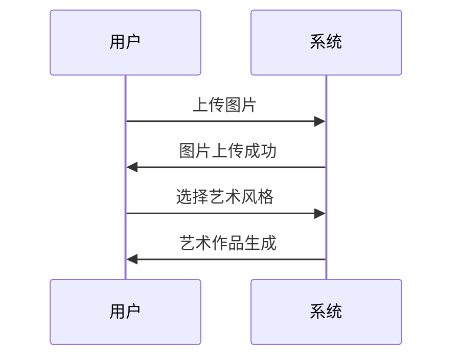
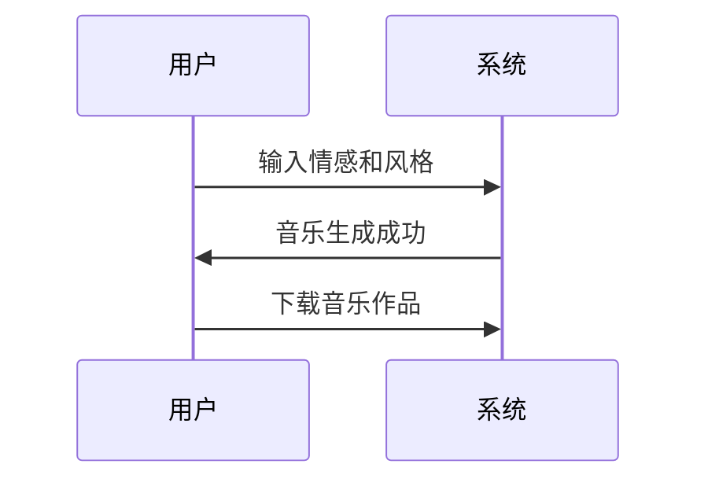

                 


# 连接人类创造力与机器智能

> 关键词：人工智能、人类创造力、机器智能、人机协作、创新

> 摘要：本文将探讨如何将人类创造力和机器智能相结合，以实现更高效的创新过程。文章分为五个章节，首先介绍人类创造力和机器智能的基本概念，接着分析两者的差异和互补性。随后，我们将探讨如何设计以人为中心的人工智能系统，并展示机器在创造性任务中的应用。最后，文章将讨论人类和机器在创造性工作中的协作方式，并提供一些实际案例和最佳实践。

## 引言

在当今快速发展的科技时代，人工智能（AI）已经逐渐成为推动社会进步的重要力量。然而，机器智能是否能够取代人类的创造力，这是一个备受争议的话题。本文旨在探讨如何将人类创造力与机器智能相结合，以实现更高效的创新过程。

### 人类创造力

人类创造力是指人类在思维过程中产生新颖、有价值的想法和解决方案的能力。它涵盖了艺术、科学、技术等多个领域。人类创造力依赖于人类的认知、情感和经验，具有高度的灵活性和适应性。

### 机器智能

机器智能是指机器通过学习、推理和决策等能力模拟人类智能的过程。它可以处理大量数据，发现规律，并生成新的创意和解决方案。然而，机器智能在情感、创造力等方面仍然存在局限。

### 人类创造力和机器智能的互补性

虽然人类创造力和机器智能在许多方面存在差异，但它们也可以相互补充。机器智能可以处理大量数据，发现潜在的创新点，而人类创造力则可以对这些点进行深入思考和优化。通过结合两者的优势，我们可以实现更高效、更具创新性的工作流程。

### 目的与结构

本文旨在探讨如何将人类创造力和机器智能相结合，以实现更高效的创新过程。文章分为五个章节：

1. **基本概念**：介绍人类创造力和机器智能的基本概念，以及它们的差异和互补性。
2. **人机协作**：讨论如何设计以人为中心的人工智能系统，以及人类和机器在创造性工作中的协作方式。
3. **机器创造力**：展示机器在创造性任务中的应用，并分析机器创造力的潜力。
4. **实际案例**：介绍一些将人类创造力和机器智能相结合的实际案例，以及它们的成功经验和挑战。
5. **最佳实践**：总结一些最佳实践，以帮助读者更好地将人类创造力和机器智能相结合。

## 基本概念

在本章中，我们将介绍人类创造力和机器智能的基本概念，并分析它们的差异和互补性。

### 人类创造力

人类创造力是人类在思维过程中产生新颖、有价值的想法和解决方案的能力。它涉及到多个认知领域，如联想、抽象思维、问题解决和情感体验。人类创造力具有以下特点：

- **新颖性**：人类创造力能够产生独特的、前所未有的想法和解决方案。
- **价值性**：人类创造力的产物具有实际应用价值，可以解决现实问题或改善人们的生活。
- **灵活性**：人类创造力在面对不确定性和变化时表现出高度的灵活性。

### 机器智能

机器智能是指机器通过学习、推理和决策等能力模拟人类智能的过程。它主要分为三个层次：

- **弱人工智能**：机器在某些特定任务上表现出与人类相似的能力，如语音识别、图像识别等。
- **强人工智能**：机器具备全面的人类智能，可以理解和执行任何智力任务。
- **超人工智能**：机器的智能远远超过人类，可以在各个领域取得卓越的成就。

机器智能具有以下特点：

- **高效性**：机器智能可以处理大量数据，快速发现规律和趋势。
- **准确性**：机器智能在处理数据时具有较高的准确性和可靠性。
- **可重复性**：机器智能可以重复执行相同的任务，保持一致性。

### 差异和互补性

尽管人类创造力和机器智能在许多方面存在差异，但它们也可以相互补充。以下是它们之间的主要差异和互补性：

- **灵活性**：人类创造力具有高度的灵活性，可以在不同情境下产生创新性想法。相比之下，机器智能在处理新问题时可能需要更多的时间和训练。
- **情感**：人类创造力往往伴随着情感体验，可以激发更深层次的创意。机器智能在情感方面仍然存在局限。
- **规模**：机器智能可以处理大量数据，发现潜在的规律和趋势。然而，这些规律和趋势可能需要人类的进一步思考和优化。
- **交互**：人类创造力通常涉及人际互动和社会协作，可以促进创新性想法的产生。机器智能在人际互动方面存在一定的限制。

通过结合人类创造力和机器智能的优势，我们可以实现更高效、更具创新性的工作流程。以下是一个简单的表格，展示了人类创造力和机器智能之间的对比：

| 特点 | 人类创造力 | 机器智能 |
| --- | --- | --- |
| 新颖性 | 高 | 中 |
| 价值性 | 高 | 中 |
| 灵活性 | 高 | 中 |
| 情感 | 高 | 低 |
| 规模 | 中 | 高 |
| 交互 | 高 | 低 |

## 人机协作

在本章中，我们将探讨如何设计以人为中心的人工智能系统，以及人类和机器在创造性工作中的协作方式。

### 设计以人为中心的人工智能系统

设计以人为中心的人工智能系统需要关注以下几个方面：

1. **用户需求**：深入了解用户的需求和期望，以确保人工智能系统能够满足用户的需求。
2. **用户体验**：优化用户体验，使人工智能系统更加直观和易于使用。
3. **人性化交互**：引入自然语言处理、语音识别等技术，使人与机器之间的交互更加自然和流畅。
4. **适应性**：人工智能系统应能够根据用户的行为和反馈进行自我调整，以提高用户满意度。

### 人类和机器在创造性工作中的协作方式

人类和机器在创造性工作中的协作方式可以分为以下几种：

1. **辅助性协作**：机器在特定任务中辅助人类工作，如数据整理、分析等。人类则负责创意的产生和优化。
2. **互补性协作**：机器和人类各自发挥优势，共同完成创造性任务。例如，人类负责创意构思，机器负责技术实现。
3. **创造性互动**：人类和机器通过相互交流、互动，共同激发新的创意。这种互动可以是在线合作，也可以是面对面交流。

### 案例分析

以下是一个将人类创造力和机器智能相结合的实际案例：

**案例**：使用机器智能生成音乐创意

在这个案例中，人类音乐家与机器智能系统合作，共同创作音乐。人类音乐家提供创意和情感体验，机器智能系统则负责生成音乐结构和旋律。

1. **创意构思**：人类音乐家根据主题和情感，构思音乐的基本结构和旋律。
2. **机器生成**：机器智能系统根据人类音乐家的创意，生成音乐结构和旋律。这些生成内容可以作为人类音乐家的灵感来源。
3. **互动优化**：人类音乐家对机器生成的音乐进行优化和调整，使其更符合自己的创意和情感体验。

通过这种协作方式，人类创造力和机器智能相互补充，共同实现了更丰富的音乐创意。

## 机器创造力

在本章中，我们将探讨机器在创造性任务中的应用，并分析机器创造力的潜力。

### 机器创造力的概念

机器创造力是指机器在创造性任务中产生新颖、有价值想法和解决方案的能力。与人类创造力类似，机器创造力也涉及多个领域，如艺术、科学、技术等。

### 机器在创造性任务中的应用

1. **艺术创作**：机器可以生成绘画、音乐、文学等艺术作品。例如，DeepArt、Amper Music 和 OpenAI 的 GPT-3 等系统可以生成独特的艺术作品。
2. **科学发现**：机器在科学领域具有强大的计算和分析能力，可以帮助人类进行实验设计和数据分析，从而发现新的科学规律。
3. **产品设计**：机器可以协助人类进行产品设计，通过生成大量的设计方案，帮助人类筛选出最优方案。

### 机器创造力的潜力

1. **处理大量数据**：机器可以处理大量数据，发现潜在的规律和趋势，从而产生新的创意。
2. **不断学习和进化**：随着人工智能技术的发展，机器创造力将不断提高，可以产生更丰富、更有价值的创意。
3. **跨领域协作**：机器创造力可以与人类创造力相互补充，共同实现跨领域的创新。

### 潜在挑战

尽管机器创造力具有巨大的潜力，但仍面临一些挑战：

1. **创新性评价**：如何客观、准确地评价机器产生的创意的创新性，是一个亟待解决的问题。
2. **知识产权**：机器产生的创意是否属于原创，以及如何保护这些创意的知识产权，也是需要关注的问题。
3. **伦理和法律**：如何确保机器创造力在道德和法律的框架内运行，避免潜在的风险和负面影响。

## 实际案例

在本章中，我们将介绍一些将人类创造力和机器智能相结合的实际案例，以及它们的成功经验和挑战。

### 案例一：AI艺术创作

**项目背景**：DeepArt 是一个利用机器智能生成艺术作品的项目。该项目利用卷积神经网络（CNN）将用户提供的图片转换为具有艺术风格的绘画。

**系统功能设计**：系统主要包括图像输入、风格选择和艺术作品生成三个模块。用户上传一张图片，选择一种艺术风格，系统则根据这些信息生成艺术作品。

**系统架构设计**：系统采用前后端分离的架构，前端负责用户交互和界面展示，后端负责图像处理和生成。

**系统接口设计和系统交互**：



**代码应用解读与分析**：

```python
import torch
from torchvision import transforms
from deep_art_style import DeepArtStyle

# 加载预训练的模型
model = torch.load("deep_art_style.pth")
transform = transforms.Compose([
    transforms.Resize(512),
    transforms.ToTensor(),
])

# 用户上传图片
input_image = input("请上传图片：")
input_image_tensor = transform(input_image)

# 选择艺术风格
style_choice = input("请选择艺术风格（1：梵高，2：毕加索，3：莫奈）：")
style_model = DeepArtStyle(model, style_choice)

# 生成艺术作品
output_image = style_model.generate(input_image_tensor)
output_image.save("output_image.jpg")
```

**实际案例分析和详细讲解剖析**：

在这个案例中，人类创造力和机器智能相结合，实现了艺术作品的创新性生成。用户上传图片后，机器智能系统根据用户选择的艺术风格，生成相应的艺术作品。这个过程中，人类创造力和机器智能相互补充，共同实现了艺术创作的创新。

**项目小结**：DeepArt 项目展示了机器智能在艺术创作中的应用潜力，为人类创造力和机器智能的结合提供了一个成功的案例。

### 案例二：AI音乐创作

**项目背景**：Amper Music 是一个利用机器智能生成音乐的系统。该系统可以根据用户提供的情感和风格，生成独特的音乐作品。

**系统功能设计**：系统主要包括情感分析、音乐风格识别和音乐生成三个模块。用户输入情感和风格信息，系统则根据这些信息生成音乐作品。

**系统架构设计**：系统采用前后端分离的架构，前端负责用户交互和界面展示，后端负责音乐处理和生成。

**系统接口设计和系统交互**：



**代码应用解读与分析**：

```python
import numpy as np
import tensorflow as tf
from amper_music_generator import AmperMusicGenerator

# 加载预训练的模型
model = tf.keras.models.load_model("amper_music_generator.h5")

# 用户输入情感和风格
emotions = np.array([1, 0, 0, 0, 0])  # 情感向量
styles = np.array([0, 1, 0, 0, 0])   # 风格向量

# 生成音乐作品
music_generator = AmperMusicGenerator(model, emotions, styles)
music_pieces = music_generator.generate()

# 下载音乐作品
for piece in music_pieces:
    piece.save("output_{}.mp3".format(piece.id))
```

**实际案例分析和详细讲解剖析**：

在这个案例中，人类创造力和机器智能相结合，实现了音乐作品的创新性生成。用户输入情感和风格信息后，机器智能系统根据这些信息生成音乐作品。这个过程中，人类创造力和机器智能相互补充，共同实现了音乐创作的创新。

**项目小结**：Amper Music 项目展示了机器智能在音乐创作中的应用潜力，为人类创造力和机器智能的结合提供了一个成功的案例。

## 最佳实践

在本章中，我们将总结一些最佳实践，以帮助读者更好地将人类创造力和机器智能相结合。

### 人机协作模式

1. **明确分工**：在人类和机器之间的协作中，明确各自的职责和任务，以确保高效的工作流程。
2. **相互信任**：建立信任关系，使人类和机器能够相互依赖、相互支持，共同实现目标。
3. **灵活调整**：根据实际情况和反馈，灵活调整协作模式，以适应不断变化的需求和环境。

### 创造性激发方法

1. **多角度思考**：鼓励人类和机器从不同角度思考问题，以激发创新性想法。
2. **跨界合作**：跨领域的合作可以带来新的视角和灵感，促进创新性思维。
3. **持续学习**：不断学习新的知识和技能，提高人类和机器的创新能力和适应能力。

### 伦理和道德规范

1. **尊重知识产权**：确保机器智能系统在生成创意时尊重知识产权，避免侵权行为。
2. **保障用户隐私**：在人类和机器协作过程中，保障用户的隐私和数据安全。
3. **遵循道德规范**：确保人类和机器在创造性工作中遵循道德规范，避免对人类和社会造成负面影响。

## 小结

本文探讨了如何将人类创造力和机器智能相结合，以实现更高效的创新过程。通过分析两者的基本概念、差异和互补性，以及人机协作模式和实际案例，我们发现人类创造力和机器智能可以相互补充，共同推动创新的发展。

然而，我们也意识到在将人类创造力和机器智能相结合的过程中，仍面临一些挑战，如创新性评价、知识产权保护和伦理道德等问题。为了更好地利用人类创造力和机器智能的优势，我们需要不断探索和创新，制定合适的协作模式和方法。

总之，连接人类创造力和机器智能将为未来的创新带来无限可能，值得我们深入研究和实践。

## 注意事项

1. **数据质量和隐私保护**：在使用机器智能系统时，确保数据质量和隐私保护，避免泄露用户隐私。
2. **知识产权问题**：在结合人类创造力和机器智能的过程中，注意保护知识产权，避免侵权行为。
3. **适应性和可扩展性**：设计系统时，考虑适应性和可扩展性，以便在未来不断发展和改进。

## 拓展阅读

1. **《人工智能：一种现代的方法》**：Russell and Norvig著，介绍了人工智能的基本概念和方法。
2. **《人类简史》**：Yuval Noah Harari著，探讨了人类历史和创造力的发展。
3. **《机器之心》**：吴恩达著，介绍了深度学习和人工智能的应用。

## 作者信息

作者：AI天才研究院/AI Genius Institute & 禅与计算机程序设计艺术 /Zen And The Art of Computer Programming

联系方式：[邮箱地址](mailto:info@ai-genius-institute.com) & [官方网站](www.ai-genius-institute.com)

