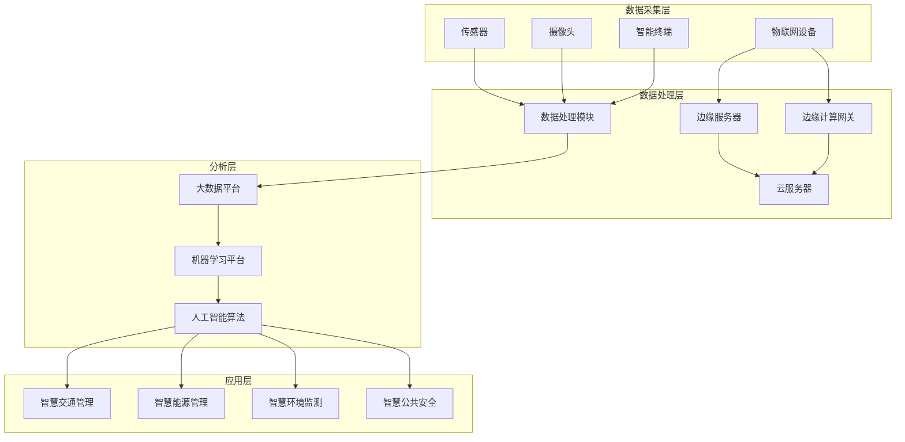

                 

### 引言

---

**关键词：** 数字孪生城市、智慧城市、物联网、大数据分析、人工智能

**摘要：** 本文将深入探讨数字孪生城市的概念、关键技术及其在城市管理系统中的应用，通过逐步分析数字孪生城市的技术架构和实施策略，旨在为读者提供一个全面而深入的视角，了解这一前沿技术如何推动城市管理的智能化和高效化。

---

在当今快速发展的信息时代，城市面临着前所未有的复杂挑战，如交通拥堵、能源消耗、环境污染和应急响应等问题。为了应对这些挑战，数字孪生城市应运而生，成为智慧城市发展的关键驱动力。数字孪生城市通过构建虚拟城市模型，实现对现实城市全要素的实时监测、分析和优化，从而提升城市管理水平和居民生活质量。

本文将分为四个主要部分进行探讨：

1. **第一部分：引言** —— 介绍数字孪生城市的背景、核心概念及其在城市管理系统中的应用。
2. **第二部分：数字孪生城市关键技术** —— 详细讲解城市模型构建方法、大数据处理和分析技术、边缘计算与云计算在数字孪生城市中的应用。
3. **第三部分：数字孪生城市中的大数据分析与处理** —— 讨论大数据在数字孪生城市中的应用场景和案例。
4. **第四部分：数字孪生城市中的边缘计算与云计算** —— 分析边缘计算与云计算对数字孪生城市的重要作用。

通过这一步步的分析和讨论，我们希望读者能够对数字孪生城市有一个全面而深入的理解，并认识到其在未来城市发展中不可替代的地位。

---

### 第一部分：引言

---

#### 第1章：数字孪生城市背景与概念

##### 1.1 数字孪生城市概述

###### 1.1.1 数字孪生城市的定义

数字孪生（Digital Twin）是指通过物理实体在虚拟空间中的镜像，实现对其全生命周期的实时监测、分析和优化的技术。在数字孪生城市（Digital Twin City）的概念下，一个城市的各个方面，如交通、能源、环境、公共安全等，都可以通过其数字孪生模型进行模拟、预测和优化。

数字孪生城市不仅仅是城市的虚拟镜像，它更是一个动态的、实时更新的系统，通过集成物联网（IoT）、大数据分析、人工智能（AI）等前沿技术，实现对现实城市运行状态的实时监控和智能管理。数字孪生城市的核心思想是将物理世界与数字世界相结合，通过数据驱动的方式，实现城市管理的智能化和精细化。

###### 1.1.2 数字孪生城市的重要性

数字孪生城市的重要性体现在多个方面：

1. **提升城市管理效率**：通过数字孪生技术，城市管理者可以实时了解城市运行状态，快速响应突发事件，优化资源配置，提升城市管理效率。
2. **增强城市安全性**：数字孪生城市能够对城市公共安全进行实时监控和预警，有效预防和应对各种突发事件。
3. **促进可持续发展**：数字孪生城市通过优化能源使用、减少污染排放，推动城市绿色发展，实现可持续发展目标。
4. **提高居民生活质量**：数字孪生城市能够提供更加智能、舒适的生活环境，提升居民的幸福感。

###### 1.1.3 数字孪生城市的发展历程

数字孪生城市的发展历程可以追溯到上世纪80年代。当时，工程师们开始尝试通过数字化模型来模拟和优化工业系统的运行。随着计算机技术和互联网的快速发展，数字孪生技术逐渐应用于各个领域，如航空航天、制造业、医疗等。近年来，随着物联网、大数据和人工智能技术的成熟，数字孪生城市逐渐成为智慧城市建设的重要方向。

数字孪生城市的发展历程可以分为三个阶段：

1. **初始阶段**（20世纪80年代-2000年代）：数字孪生技术主要应用于工业领域，通过数字化模型来模拟和优化生产流程。
2. **发展阶段**（2000年代-2010年代）：随着物联网、大数据和云计算技术的发展，数字孪生技术开始应用于城市治理和管理，数字孪生城市概念逐渐形成。
3. **成熟阶段**（2010年代至今）：数字孪生城市逐渐成为智慧城市建设的核心，通过集成多种前沿技术，实现对城市全要素的实时监测和智能管理。

##### 1.2 数字孪生城市的核心概念与联系

###### 1.2.1 数字孪生与虚拟仿真

数字孪生与虚拟仿真（Virtual Simulation）有一定的联系和区别。虚拟仿真主要是在虚拟环境中对现实系统进行模拟和测试，而数字孪生则是通过虚拟模型来实时反映现实系统的状态和变化。数字孪生技术更加注重实时性和动态性，能够实现对现实系统的实时监测和优化。

虚拟仿真通常用于以下场景：

1. **系统设计验证**：在系统设计阶段，通过虚拟仿真来验证系统设计的可行性和性能。
2. **故障预测与排除**：通过虚拟仿真，预测系统可能出现的故障，提前进行排除。
3. **操作培训**：通过虚拟仿真环境进行操作培训，提高操作人员的技能和经验。

数字孪生技术则主要用于以下场景：

1. **实时监测**：通过数字孪生模型，实时监测现实系统的运行状态。
2. **智能优化**：根据数字孪生模型提供的数据，对现实系统进行优化，提升系统的运行效率。
3. **应急响应**：通过数字孪生模型，快速响应突发事件，制定有效的应急措施。

###### 1.2.2 数字孪生与物联网

物联网（Internet of Things，IoT）是数字孪生城市的重要组成部分。物联网通过连接各种物理设备，实现对城市各个方面的实时监测和数据采集。这些数据被传输到数字孪生模型中，用于模拟和分析城市运行状态。

数字孪生与物联网之间的联系主要体现在以下几个方面：

1. **数据采集**：物联网设备用于采集城市中的各种数据，如交通流量、空气质量、能源消耗等。
2. **数据传输**：物联网将采集到的数据实时传输到数字孪生模型中，用于更新和优化模型。
3. **智能联动**：物联网设备可以通过数字孪生模型实现智能联动，自动调整设备运行状态，以优化城市运行。

###### 1.2.3 数字孪生与大数据分析

大数据分析（Big Data Analysis）是数字孪生城市的重要支撑技术。通过大数据分析，可以从海量数据中提取有价值的信息，为城市管理和决策提供支持。

数字孪生与大数据分析之间的联系主要体现在以下几个方面：

1. **数据整合**：大数据分析技术用于整合来自不同来源的数据，如物联网设备、卫星遥感、传感器等，构建全面的城市数据集。
2. **趋势预测**：通过大数据分析，可以预测城市运行中的各种趋势，如交通流量、能源需求等，为城市规划和优化提供依据。
3. **决策支持**：大数据分析结果可以为城市管理者提供科学的决策支持，如交通管理、能源分配等。

###### 1.2.4 数字孪生与人工智能

人工智能（Artificial Intelligence，AI）是数字孪生城市的高级应用。通过人工智能技术，可以实现对数字孪生模型的智能优化和自主决策。

数字孪生与人工智能之间的联系主要体现在以下几个方面：

1. **智能优化**：人工智能技术用于优化数字孪生模型，提升模型的预测精度和决策效率。
2. **自主决策**：通过人工智能技术，数字孪生模型可以实现自主决策，如自动调整交通信号、优化能源分配等。
3. **场景应用**：人工智能技术在数字孪生城市中具有广泛的应用场景，如智能交通管理、智能环境监测、智能应急响应等。

##### 1.3 数字孪生城市的构成与要素

###### 1.3.1 城市模型

城市模型是数字孪生城市的核心组成部分。城市模型通过数字化方式，对现实城市中的各种要素进行建模，如建筑物、道路、交通系统、能源系统等。城市模型可以是2D或3D形式，也可以是动态的或静态的，取决于应用场景和需求。

城市模型构建方法通常包括以下步骤：

1. **数据采集**：通过物联网设备、卫星遥感、传感器等手段，采集城市中各种要素的实时数据。
2. **数据整合**：将采集到的数据整合到一个统一的数据平台中，以便后续分析和处理。
3. **建模**：利用专业软件或编程工具，对采集到的数据进行分析和处理，构建城市模型。
4. **验证与优化**：对构建的城市模型进行验证和优化，确保其准确性和实用性。

城市模型特性主要包括以下几个方面：

1. **实时性**：城市模型能够实时反映现实城市的运行状态。
2. **动态性**：城市模型可以动态调整，以适应城市运行的变化。
3. **完整性**：城市模型涵盖城市中的所有重要要素，如交通、能源、环境等。
4. **可扩展性**：城市模型可以扩展到城市外的区域，如周边城市、区域等。

###### 1.3.2 数据采集与处理

数据采集与处理是数字孪生城市的重要组成部分。数据采集主要通过物联网设备实现，这些设备包括传感器、摄像头、无人机等。数据采集后，需要经过处理和分析，才能为城市模型提供有效的支持。

数据采集与处理流程通常包括以下步骤：

1. **数据采集**：通过物联网设备，实时采集城市中的各种数据。
2. **数据传输**：将采集到的数据传输到数据处理平台，如云计算平台、边缘计算平台等。
3. **数据预处理**：对采集到的数据进行分析和处理，去除噪声和异常值。
4. **数据存储**：将处理后的数据存储到数据库中，以便后续分析和查询。
5. **数据分析**：利用大数据分析技术，对存储的数据进行分析和挖掘，提取有价值的信息。

数据采集与处理的关键技术包括：

1. **传感器技术**：传感器是数据采集的核心设备，其性能和精度直接影响数据的质量。
2. **物联网协议**：物联网协议用于数据传输，如MQTT、CoAP等。
3. **数据处理算法**：数据处理算法用于对采集到的数据进行分析和处理，如数据滤波、数据聚类等。
4. **数据存储技术**：数据存储技术用于存储和管理大量的数据，如Hadoop、Spark等。

###### 1.3.3 边缘计算与云计算

边缘计算（Edge Computing）和云计算（Cloud Computing）是数字孪生城市的重要技术支撑。边缘计算主要用于处理靠近数据源的数据，降低数据传输延迟，提高系统的实时性。云计算则主要用于存储和管理大量的数据，提供强大的计算和存储能力。

边缘计算与云计算在数字孪生城市中的应用主要包括以下几个方面：

1. **数据传输**：边缘计算用于实时处理和传输数据，减少数据传输的延迟和带宽消耗。
2. **数据处理**：边缘计算和云计算协同工作，实现对海量数据的实时处理和分析。
3. **数据存储**：云计算提供强大的存储能力，用于存储和处理海量数据。
4. **资源共享**：边缘计算和云计算可以共享资源，如计算能力、存储能力等，提高系统的资源利用效率。

边缘计算的优势与挑战包括：

1. **优势**：
   - **降低延迟**：边缘计算可以将数据处理和计算靠近数据源，降低数据传输延迟。
   - **节省带宽**：边缘计算可以减少数据传输的带宽消耗，提高网络传输效率。
   - **实时性**：边缘计算可以提供实时数据处理和响应，满足实时性要求较高的应用场景。

2. **挑战**：
   - **计算资源有限**：边缘设备的计算资源和存储资源有限，可能无法满足复杂计算需求。
   - **可靠性**：边缘设备的可靠性可能低于云计算中心，需要保证数据的安全性和可靠性。
   - **维护成本**：边缘设备的维护成本较高，需要定期进行维护和升级。

云计算在数字孪生城市中的应用主要包括以下几个方面：

1. **数据处理**：云计算可以提供强大的计算和存储能力，用于处理和分析海量数据。
2. **数据存储**：云计算提供大规模的数据存储方案，用于存储和处理数据。
3. **资源调度**：云计算可以根据需求动态调整计算和存储资源，提高资源利用效率。
4. **数据安全**：云计算提供可靠的数据安全机制，如数据加密、访问控制等，确保数据的安全性和隐私。

云计算的优势与挑战包括：

1. **优势**：
   - **计算能力强大**：云计算提供强大的计算能力，可以处理复杂的数据分析和机器学习任务。
   - **存储容量大**：云计算提供大规模的数据存储方案，可以存储和处理海量数据。
   - **灵活性**：云计算可以根据需求动态调整资源，提供灵活的资源配置。

2. **挑战**：
   - **数据安全**：云计算面临数据安全和隐私保护的问题，需要采取有效的安全措施。
   - **网络依赖性**：云计算依赖于网络连接，网络故障可能导致服务中断。
   - **维护成本**：云计算中心的建设和维护成本较高，需要投入大量资金和人力资源。

##### 1.4 数字孪生城市的应用领域

###### 1.4.1 智慧城市建设

智慧城市是数字孪生城市的主要应用领域之一。通过数字孪生技术，智慧城市可以实现城市管理的智能化和精细化，提升城市运行效率和质量。智慧城市建设主要包括以下几个方面：

1. **智慧交通**：通过数字孪生技术，实现交通流量监测、交通信号优化、停车管理等功能，提高交通运行效率。
2. **智慧能源**：通过数字孪生技术，实现能源消耗监测、能源分配优化、能源效率提升等功能，降低能源消耗和成本。
3. **智慧环境**：通过数字孪生技术，实现环境质量监测、污染源监控、环境灾害预警等功能，保护生态环境。

###### 1.4.2 应急管理

应急管理是数字孪生城市的另一个重要应用领域。通过数字孪生技术，可以实现突发事件监测、预警、应急响应等功能，提升城市应急管理水平。应急管理主要包括以下几个方面：

1. **灾害预警**：通过数字孪生技术，实现地震、台风、洪水等灾害的实时监测和预警，提前采取预防措施。
2. **应急响应**：通过数字孪生技术，实现应急资源的调度和管理，快速响应突发事件，减少损失。
3. **灾后重建**：通过数字孪生技术，实现对灾后重建的模拟和优化，提高重建效率和质量。

###### 1.4.3 绿色低碳发展

绿色低碳发展是数字孪生城市的另一个重要应用领域。通过数字孪生技术，可以实现能源节约、污染减排、生态保护等功能，推动城市绿色发展。绿色低碳发展主要包括以下几个方面：

1. **绿色建筑**：通过数字孪生技术，实现绿色建筑的监测、优化和管理，提高建筑能源利用效率。
2. **能源效率提升**：通过数字孪生技术，实现能源消耗监测、能源分配优化、能源浪费减少等功能，提高能源利用效率。
3. **生态保护**：通过数字孪生技术，实现生态环境监测、污染源监控、生态灾害预警等功能，保护生态环境。

##### 1.5 数字孪生城市的挑战与机遇

###### 1.5.1 技术挑战

数字孪生城市面临多种技术挑战，主要包括以下几个方面：

1. **数据质量**：数字孪生城市依赖于大量实时、准确的数据，数据质量直接影响到数字孪生模型的精度和可靠性。需要解决数据采集、传输、存储、处理等环节中的数据质量问题。
2. **算法优化**：数字孪生城市的算法需要高效、准确，以应对复杂的数据分析和优化任务。需要不断优化和改进算法，提高算法的精度和效率。
3. **计算能力**：数字孪生城市需要强大的计算能力，以支持海量数据的实时处理和分析。需要提高计算硬件和软件的性能，提高系统的计算能力。
4. **网络安全**：数字孪生城市的数据安全和隐私保护是一个重要挑战。需要采取有效的安全措施，确保数据的安全性和隐私。

###### 1.5.2 政策法规

数字孪生城市的发展需要相应的政策法规支持，主要包括以下几个方面：

1. **数据隐私**：数字孪生城市涉及大量个人数据，需要制定严格的数据隐私保护政策，确保个人数据的隐私和安全。
2. **数据安全**：数字孪生城市需要确保数据的安全性和完整性，防止数据泄露和篡改。需要制定数据安全标准和管理规范。
3. **知识产权**：数字孪生城市中涉及到的数据、算法、技术等需要得到知识产权保护，鼓励技术创新和发展。

###### 1.5.3 市场前景

数字孪生城市具有广阔的市场前景，主要包括以下几个方面：

1. **投资热点**：数字孪生城市是智慧城市建设的重要方向，吸引了大量投资。投资热点包括数据采集设备、数据处理平台、数字孪生软件等。
2. **产业布局**：数字孪生城市涉及到多个产业，如物联网、大数据、人工智能、基础设施建设等。需要加强产业布局，形成产业链和生态系统。
3. **应用推广**：数字孪生技术在各个领域的应用不断拓展，如智慧交通、智慧能源、智慧环境等。需要加大应用推广力度，提升数字孪生城市的普及率。

##### 1.6 本章小结

本章介绍了数字孪生城市的背景、核心概念、技术架构和应用领域，通过逐步分析数字孪生城市的各个方面，为读者提供了一个全面而深入的了解。数字孪生城市作为智慧城市建设的重要方向，具有广阔的市场前景和重要的战略意义。在接下来的章节中，我们将进一步探讨数字孪生城市的核心技术，如城市模型构建方法、大数据处理和分析技术、边缘计算与云计算的应用等，为读者提供更详细的技术解读和实践指导。

---

### 第二部分：数字孪生城市关键技术

---

#### 第2章：城市模型构建方法

本章将重点探讨数字孪生城市中的城市模型构建方法。城市模型是数字孪生城市的基础，它通过数字化方式对现实城市中的各个要素进行建模，为数字孪生城市的实时监测、分析和优化提供支持。

##### 2.1 城市模型构建基本原理

城市模型构建的基本原理主要包括数据采集、数据处理、模型构建和模型验证等步骤。

###### 2.1.1 城市模型构建流程

城市模型构建流程可以分为以下几个阶段：

1. **需求分析**：明确数字孪生城市的需求，包括建模目标、数据来源、模型精度等。
2. **数据采集**：通过物联网设备、卫星遥感、传感器等手段，采集城市中的各种数据，如交通流量、空气质量、能源消耗等。
3. **数据处理**：对采集到的数据进行预处理，包括数据清洗、数据集成、数据归一化等，以确保数据的质量和一致性。
4. **模型构建**：利用专业软件或编程工具，根据需求分析的结果，构建城市模型。模型可以是2D或3D形式，也可以是静态的或动态的。
5. **模型验证**：通过对比模型预测结果和实际观测数据，验证城市模型的精度和可靠性。根据验证结果，对模型进行调整和优化。

###### 2.1.2 城市模型构建工具

在城市模型构建过程中，常用的工具包括以下几种：

1. **GIS软件**：GIS（地理信息系统）软件用于构建和可视化城市地理信息模型。常用的GIS软件有ArcGIS、QGIS等。
2. **BIM软件**：BIM（建筑信息模型）软件用于构建和可视化建筑信息模型。常用的BIM软件有Autodesk Revit、Bentley Systems等。
3. **CAD软件**：CAD（计算机辅助设计）软件用于构建和可视化城市基础设施模型。常用的CAD软件有AutoCAD、SolidWorks等。
4. **仿真软件**：仿真软件用于模拟和优化城市运行状态。常用的仿真软件有Simul8、AnyLogic等。
5. **编程工具**：编程工具用于构建和优化城市模型，如Python、MATLAB等。

##### 2.2 城市地理信息系统（GIS）应用

城市地理信息系统（GIS）是数字孪生城市的重要组成部分，它通过地理空间数据，对城市中的各种要素进行建模和可视化。

###### 2.2.1 GIS在数字孪生城市中的作用

GIS在数字孪生城市中的作用主要体现在以下几个方面：

1. **数据整合**：GIS可以整合来自不同来源的地理空间数据，如卫星遥感数据、传感器数据、公共数据等，构建统一的城市数据集。
2. **空间分析**：GIS可以进行空间分析，如缓冲区分析、叠加分析、路径分析等，帮助城市管理者更好地理解和利用地理空间数据。
3. **可视化**：GIS可以将复杂的地理空间数据以直观的方式展示出来，帮助城市管理者更好地了解城市状况和决策。
4. **模拟和预测**：GIS可以模拟城市运行状态，预测未来的城市发展趋势，为城市规划和优化提供支持。

###### 2.2.2 GIS应用案例

以下是一些GIS在数字孪生城市中的应用案例：

1. **智慧交通管理**：通过GIS技术，可以实现交通流量监测、交通信号优化、停车管理等功能，提高交通运行效率。
2. **智慧环境监测**：通过GIS技术，可以实时监测空气质量、水质、噪音等环境指标，预测环境污染趋势，为环保决策提供支持。
3. **灾害预警与应急响应**：通过GIS技术，可以实现地震、台风、洪水等灾害的实时监测和预警，制定有效的应急措施，减少灾害损失。
4. **城市规划与设计**：通过GIS技术，可以模拟城市规划方案，预测城市未来发展的趋势，优化城市规划，提高城市环境质量。

##### 2.3 建筑信息模型（BIM）在数字孪生城市中的应用

建筑信息模型（BIM）是一种基于三维数字模型的技术，它通过整合建筑的设计、施工、运营等全生命周期数据，实现对建筑全要素的数字化管理和优化。

###### 2.3.1 BIM的核心概念

BIM的核心概念主要包括以下几个方面：

1. **三维建模**：BIM通过三维数字模型，对建筑的全要素进行建模，包括结构、设备、装饰等。
2. **数据集成**：BIM将建筑的设计、施工、运营等全生命周期数据集成到一个数字模型中，实现数据的统一管理和共享。
3. **协同工作**：BIM通过协同工作平台，实现项目各参与方的信息共享和协同工作，提高项目效率和质量。
4. **数据驱动**：BIM通过数据驱动的方式，实现建筑的全生命周期管理，如设计优化、施工进度管理、运营维护管理等。

###### 2.3.2 BIM在数字孪生城市中的应用

BIM在数字孪生城市中的应用主要体现在以下几个方面：

1. **建筑信息管理**：通过BIM技术，可以实现对建筑的全生命周期信息管理，包括设计、施工、运营等环节。
2. **智慧城市建设**：通过BIM技术，可以模拟和优化城市中的建筑物，提高城市运行效率和质量。
3. **应急响应**：通过BIM技术，可以实现建筑应急信息的快速查询和传递，提高应急响应效率。
4. **建筑能耗管理**：通过BIM技术，可以实时监测和优化建筑能耗，降低能源消耗。

##### 2.4 物联网（IoT）技术在数字孪生城市中的应用

物联网（IoT）技术是数字孪生城市的重要组成部分，它通过连接各种物理设备，实现对城市中的各种要素进行实时监测和管理。

###### 2.4.1 物联网设备的数据采集

物联网设备的数据采集是实现数字孪生城市的关键。常用的物联网设备包括传感器、摄像头、无人机、智能终端等。这些设备可以采集各种数据，如交通流量、空气质量、能源消耗、环境参数等。数据采集后，需要通过物联网协议（如MQTT、CoAP等）传输到数据处理平台，进行进一步处理和分析。

###### 2.4.2 物联网数据的应用

物联网数据在数字孪生城市中的应用主要体现在以下几个方面：

1. **实时监测**：通过物联网数据，可以实时监测城市的各种要素，如交通流量、环境质量、能源消耗等。
2. **智能决策**：通过物联网数据，可以基于实时监测结果，进行智能决策，如交通信号优化、能源分配优化等。
3. **预测分析**：通过物联网数据，可以进行预测分析，如交通流量预测、环境质量预测等，为城市规划和优化提供支持。
4. **应急响应**：通过物联网数据，可以快速响应突发事件，如交通拥堵、环境污染等，制定有效的应急措施。

##### 2.5 人工智能（AI）在数字孪生城市中的应用

人工智能（AI）技术是数字孪生城市的高级应用，它通过数据驱动的方式，实现对城市运行状态的智能分析和优化。

###### 2.5.1 AI在数字孪生城市中的关键作用

AI在数字孪生城市中的关键作用主要包括以下几个方面：

1. **数据挖掘与分析**：通过AI技术，可以从海量数据中提取有价值的信息，为城市管理和决策提供支持。
2. **智能预测与优化**：通过AI技术，可以基于实时数据，进行智能预测和优化，如交通流量预测、能源消耗优化等。
3. **智能决策与控制**：通过AI技术，可以实现智能决策和自主控制，如智能交通信号控制、智能能源管理等。
4. **智能应急响应**：通过AI技术，可以快速响应突发事件，制定有效的应急措施，如交通管制、紧急救援等。

###### 2.5.2 AI应用案例

以下是一些AI在数字孪生城市中的应用案例：

1. **智能交通管理**：通过AI技术，可以实现交通流量监测、交通信号优化、停车管理等功能，提高交通运行效率。
2. **智能环境监测**：通过AI技术，可以实时监测环境质量，预测污染趋势，制定环保措施。
3. **智能能源管理**：通过AI技术，可以实现能源消耗监测、能源分配优化、能源浪费减少等功能，降低能源消耗和成本。
4. **智能公共安全**：通过AI技术，可以实时监测公共安全，预警突发事件，提高城市安全管理水平。

##### 2.6 本章小结

本章介绍了数字孪生城市中的城市模型构建方法，包括GIS、BIM、IoT和AI等技术的应用。通过逐步分析这些技术的原理和应用，为读者提供了一个全面而深入的了解。数字孪生城市作为智慧城市建设的重要方向，其城市模型构建方法将不断发展和完善，为城市管理和决策提供更强有力的支持。

---

### 第3章：数字孪生城市中的大数据分析与处理

#### 3.1 大数据概述

大数据（Big Data）是指数据量巨大、类型繁多、价值密度低的数据集合。大数据技术通过对海量数据的采集、存储、处理和分析，从数据中提取有价值的信息，为业务决策和优化提供支持。大数据技术已经成为数字孪生城市的重要组成部分，为城市管理和决策提供强有力的技术支持。

###### 3.1.1 大数据的定义与特点

大数据的定义可以从数据量、数据类型和数据价值三个方面来理解：

1. **数据量**：大数据通常指的是数据量超过传统数据处理能力的规模。具体来说，大数据的量级通常用“PB”（拍字节，即1PB=1亿GB）来衡量。
2. **数据类型**：大数据不仅包括结构化数据（如数据库中的记录），还包括半结构化数据（如日志文件、XML文档）和非结构化数据（如文本、图片、视频等）。
3. **数据价值**：大数据的价值密度低，即数据中包含的有价值信息相对较少。因此，大数据技术更注重从海量数据中挖掘有价值的信息。

大数据的特点主要包括以下几个方面：

1. **数据量巨大**：大数据的量级远超传统数据处理能力，需要采用分布式计算和存储技术。
2. **数据类型多样**：大数据不仅包括结构化数据，还包括半结构化数据和非结构化数据，需要采用多样化的数据处理技术。
3. **处理速度快**：大数据的处理速度要求高，需要实时或近实时地处理海量数据，以支持业务决策和优化。
4. **价值密度低**：大数据中包含的有价值信息相对较少，需要采用高效的数据挖掘和分析技术。

###### 3.1.2 大数据技术在数字孪生城市中的应用

大数据技术在数字孪生城市中的应用主要体现在以下几个方面：

1. **数据采集**：大数据技术用于采集城市中的各种数据，如交通流量、空气质量、能源消耗、环境质量等。这些数据为数字孪生城市模型提供基础数据支持。
2. **数据处理**：大数据技术用于处理和清洗采集到的数据，去除噪声和异常值，确保数据的质量和一致性。
3. **数据存储**：大数据技术采用分布式存储技术，如Hadoop、Spark等，存储和管理海量数据，为数字孪生城市模型提供数据存储支持。
4. **数据分析**：大数据技术用于对城市数据进行分析和挖掘，提取有价值的信息，如交通流量预测、环境质量评估、能源消耗优化等，为城市管理和决策提供支持。
5. **数据可视化**：大数据技术用于将分析结果以直观的方式展示出来，帮助城市管理者更好地了解城市状况和决策。

#### 3.2 数据采集与存储

数据采集与存储是大数据技术的重要组成部分，直接影响到数字孪生城市的运行效率和数据质量。

###### 3.2.1 数据采集方法

数据采集方法主要包括以下几种：

1. **物联网设备**：物联网设备（IoT）是数据采集的主要手段。通过传感器、摄像头、智能终端等物联网设备，实时采集城市中的各种数据，如交通流量、空气质量、能源消耗、环境质量等。
2. **卫星遥感**：卫星遥感技术通过卫星传感器，实时监测城市中的各种环境参数，如空气质量、水温、土壤湿度等。
3. **地面监测设备**：地面监测设备（如气象站、环保监测站等）用于监测城市中的环境质量、气象条件等。
4. **社会数据**：社会数据（如社交媒体、交通卡数据、公共数据等）可以通过API接口、爬虫等技术进行采集，用于补充城市数据。

数据采集过程中需要注意以下几个方面：

1. **数据质量**：确保采集到的数据准确、完整、一致，避免数据噪声和异常值。
2. **数据隐私**：在采集和处理数据时，需要保护个人隐私，遵守相关法律法规。
3. **实时性**：对于实时性要求较高的数据，如交通流量、环境质量等，需要采用实时数据采集技术。

###### 3.2.2 数据存储方案

数据存储方案需要考虑以下因素：

1. **数据量**：大数据量级需要采用分布式存储技术，如Hadoop、Spark等，以支持海量数据的存储和管理。
2. **数据类型**：不同类型的数据（如结构化数据、半结构化数据、非结构化数据）需要采用不同的存储技术。
3. **数据安全**：数据存储需要保证数据的安全性，防止数据泄露、篡改等。
4. **数据备份与恢复**：数据存储方案需要具备数据备份与恢复功能，确保数据的安全性和可靠性。

常见的数据存储方案包括：

1. **关系型数据库**：如MySQL、Oracle等，适用于结构化数据存储和管理。
2. **非关系型数据库**：如MongoDB、Cassandra等，适用于半结构化数据和非结构化数据存储。
3. **分布式文件系统**：如Hadoop Distributed File System（HDFS），适用于大规模数据存储和管理。
4. **数据湖**：数据湖（Data Lake）是一种分布式存储架构，适用于存储和管理大规模数据，包括结构化、半结构化和非结构化数据。

#### 3.3 数据处理与分析

数据处理与分析是大数据技术在数字孪生城市中的关键环节，通过对海量数据进行处理和分析，提取有价值的信息，为城市管理和决策提供支持。

###### 3.3.1 数据清洗与预处理

数据清洗与预处理是数据处理与分析的基础，主要包括以下几个方面：

1. **数据去重**：去除重复的数据记录，确保数据的唯一性。
2. **数据格式转换**：将不同格式的数据转换为统一的格式，便于后续处理。
3. **数据缺失值处理**：对缺失的数据进行填补或删除，确保数据完整性。
4. **数据异常值处理**：检测和去除异常值，确保数据质量。

数据清洗与预处理的方法包括：

1. **基于统计的方法**：如均值填补、中位数填补等，适用于数据缺失值处理。
2. **基于规则的方法**：如阈值过滤、逻辑判断等，适用于异常值处理。
3. **基于机器学习的方法**：如聚类分析、异常检测等，适用于复杂的数据清洗与预处理。

###### 3.3.2 数据分析技术

数据分析技术主要包括以下几种：

1. **描述性分析**：通过对数据的统计分析，描述数据的分布、趋势等。
2. **诊断性分析**：通过对比历史数据和当前数据，发现数据中的异常现象。
3. **预测性分析**：通过数据挖掘和机器学习技术，预测未来的数据趋势和变化。
4. **相关性分析**：通过分析数据之间的相关性，发现数据之间的内在联系。

数据分析技术的应用场景包括：

1. **智慧交通管理**：通过数据分析，预测交通流量变化，优化交通信号，提高交通运行效率。
2. **智慧能源管理**：通过数据分析，预测能源消耗变化，优化能源分配，提高能源利用效率。
3. **智慧环境监测**：通过数据分析，预测环境质量变化，优化环保措施，改善环境质量。

数据分析工具包括：

1. **SQL查询**：用于查询和分析结构化数据，如MySQL、PostgreSQL等。
2. **Python数据分析库**：如Pandas、NumPy、SciPy等，用于数据清洗、预处理和统计分析。
3. **大数据分析平台**：如Hadoop、Spark等，用于大规模数据处理和分析。
4. **机器学习框架**：如scikit-learn、TensorFlow、Keras等，用于构建和训练机器学习模型。

###### 3.3.3 数据可视化

数据可视化是将数据分析结果以图形、图表等形式直观展示出来的技术，有助于城市管理者更好地理解和利用数据。

数据可视化的作用包括：

1. **数据展示**：将数据分析结果以图形、图表等形式展示，便于城市管理者直观了解数据。
2. **数据探索**：通过交互式数据可视化，帮助城市管理者探索数据中的潜在规律和趋势。
3. **决策支持**：通过可视化结果，为城市管理和决策提供直观的依据。

常见的数据可视化工具包括：

1. **Tableau**：一款功能强大的数据可视化工具，支持多种数据源和丰富的可视化图表。
2. **Power BI**：一款由Microsoft开发的数据可视化工具，与Excel等办公软件紧密结合。
3. **Matplotlib**：Python中的数据可视化库，支持多种图表类型和自定义样式。
4. **Plotly**：一款基于JavaScript的数据可视化库，支持交互式图表和丰富的可视化效果。

#### 3.4 大数据分析案例

大数据分析在数字孪生城市中具有广泛的应用，以下是一些具体的应用案例：

1. **智慧交通管理**
   - **案例背景**：城市交通拥堵是城市面临的主要问题之一，影响居民生活质量和城市运行效率。
   - **案例分析**：通过大数据分析，可以实时监测交通流量，预测交通拥堵趋势，优化交通信号，提高交通运行效率。
   - **具体措施**：
     - **数据采集**：通过交通传感器、摄像头等设备，实时采集交通流量数据。
     - **数据处理**：对采集到的数据进行清洗和预处理，提取有价值的信息。
     - **数据分析**：利用机器学习算法，分析交通流量数据，预测交通拥堵趋势。
     - **可视化展示**：通过数据可视化工具，实时展示交通流量和拥堵状况。

2. **智慧环境监测**
   - **案例背景**：城市环境质量对居民生活和城市可持续发展具有重要影响。
   - **案例分析**：通过大数据分析，可以实时监测空气质量、水质等环境指标，预测环境污染趋势，制定环保措施。
   - **具体措施**：
     - **数据采集**：通过空气传感器、水质传感器等设备，实时采集环境数据。
     - **数据处理**：对采集到的数据进行清洗和预处理，提取有价值的信息。
     - **数据分析**：利用大数据分析技术，分析环境数据，预测环境污染趋势。
     - **可视化展示**：通过数据可视化工具，实时展示环境质量状况和污染趋势。

3. **智慧能源管理**
   - **案例背景**：能源消耗是城市运行的重要成本之一，提高能源利用效率对城市可持续发展具有重要意义。
   - **案例分析**：通过大数据分析，可以实时监测能源消耗，预测能源需求，优化能源分配，降低能源消耗和成本。
   - **具体措施**：
     - **数据采集**：通过能源传感器、智能电表等设备，实时采集能源消耗数据。
     - **数据处理**：对采集到的数据进行清洗和预处理，提取有价值的信息。
     - **数据分析**：利用大数据分析技术，分析能源消耗数据，预测能源需求。
     - **可视化展示**：通过数据可视化工具，实时展示能源消耗状况和优化建议。

#### 3.5 本章小结

本章介绍了大数据技术在数字孪生城市中的应用，包括数据采集与存储、数据处理与分析、数据可视化等方面。通过具体案例，展示了大数据分析在智慧交通管理、智慧环境监测、智慧能源管理等方面的应用。大数据分析为数字孪生城市提供了强大的技术支持，有助于提升城市运行效率和质量，推动城市智能化和可持续发展。

---

### 第4章：数字孪生城市中的边缘计算与云计算

边缘计算和云计算是数字孪生城市中至关重要的一对技术，它们分别在不同的层面支持数字孪生城市的高效运行和实时分析。边缘计算通过在靠近数据源的地方进行数据处理，减少了数据传输的延迟，提高了系统的实时性；而云计算则提供了强大的计算和存储能力，支持大规模数据的处理和分析。本章将深入探讨这两种技术的基本概念、应用场景、优势与挑战，以及它们在数字孪生城市中的具体作用。

#### 4.1 边缘计算概述

边缘计算（Edge Computing）是一种分布式计算架构，它将计算、存储、应用程序和服务从集中的云数据中心转移到网络的边缘。在数字孪生城市中，边缘计算通过在物联网（IoT）设备附近进行数据预处理和分析，减少了数据传输的延迟，提高了系统的响应速度。

###### 4.1.1 边缘计算的定义与作用

边缘计算的定义可以从以下几个方面来理解：

1. **定义**：边缘计算是指在靠近数据源（如物联网设备、智能终端）的地方进行数据处理、存储和分析的分布式计算架构。
2. **作用**：边缘计算的作用主要包括：
   - **减少数据传输延迟**：通过在边缘设备上进行数据处理，减少了数据传输到云中心的时间，提高了系统的实时性。
   - **节省带宽**：边缘计算将数据处理分散到边缘设备，减少了需要传输到云中心的数据量，节省了网络带宽。
   - **提高系统可靠性**：边缘计算通过分布式架构提高了系统的容错性和可靠性。
   - **增强数据隐私**：在边缘设备上进行数据处理，减少了数据在传输过程中的泄露风险。

###### 4.1.2 边缘计算的优势与挑战

边缘计算的优势包括：

1. **实时性**：边缘计算可以实时处理和响应数据，适用于对实时性要求较高的应用场景，如智能交通、智能医疗等。
2. **节省带宽**：边缘计算通过在边缘设备上进行数据处理，减少了需要传输到云中心的数据量，节省了网络带宽。
3. **降低延迟**：边缘计算通过在数据源附近进行数据处理，减少了数据传输的延迟，提高了系统的响应速度。
4. **数据本地化**：边缘计算将数据存储和计算分散到边缘设备，有助于保护数据隐私和增强数据安全性。

边缘计算面临的挑战包括：

1. **计算资源有限**：边缘设备的计算资源和存储资源有限，可能无法满足复杂计算需求。
2. **可靠性问题**：边缘设备的可靠性可能低于云计算中心，需要采取有效的措施保障数据的安全性和可靠性。
3. **维护成本**：边缘设备的维护成本较高，需要定期进行维护和升级。
4. **网络稳定性**：边缘计算依赖于网络连接，网络故障可能导致服务中断。

#### 4.2 云计算在数字孪生城市中的应用

云计算（Cloud Computing）是一种基于互联网的计算服务模式，它提供了强大的计算和存储能力，支持大规模数据的处理和分析。在数字孪生城市中，云计算通过提供灵活的计算和存储资源，支持数据密集型应用和复杂的分析任务。

###### 4.2.1 云计算的定义与作用

云计算的定义可以从以下几个方面来理解：

1. **定义**：云计算是一种通过互联网提供计算资源（如服务器、存储、数据库、应用程序等）的服务模式。
2. **作用**：云计算的作用主要包括：
   - **强大的计算和存储能力**：云计算提供了弹性可扩展的计算和存储资源，可以满足大规模数据处理和分析的需求。
   - **灵活性**：云计算可以根据需求动态调整计算和存储资源，提供了高度的灵活性。
   - **成本效益**：云计算采用按需计费模式，降低了企业IT基础设施的投入和运营成本。
   - **数据安全**：云计算服务提供商通常提供可靠的数据安全机制，如数据加密、访问控制等。

###### 4.2.2 云计算的优势与挑战

云计算的优势包括：

1. **计算和存储资源强大**：云计算提供了弹性可扩展的计算和存储资源，可以轻松处理大规模数据。
2. **灵活性**：云计算可以根据需求动态调整资源，提供了高度的灵活性。
3. **成本效益**：云计算采用按需计费模式，降低了企业IT基础设施的投入和运营成本。
4. **数据安全**：云计算服务提供商通常提供可靠的数据安全机制，如数据加密、访问控制等。

云计算面临的挑战包括：

1. **数据安全与隐私**：云计算面临数据安全和隐私保护的问题，需要采取有效的安全措施。
2. **网络依赖性**：云计算依赖于网络连接，网络故障可能导致服务中断。
3. **维护成本**：云计算中心的建设和维护成本较高，需要投入大量资金和人力资源。

#### 4.3 边缘计算与云计算的协同作用

边缘计算和云计算在数字孪生城市中可以协同作用，形成一种混合计算架构，以满足不同场景的需求。

1. **实时性需求**：对于实时性要求较高的应用场景，如智能交通、智能医疗等，边缘计算可以实时处理数据，提高系统的响应速度。
2. **大规模数据处理**：对于需要处理大规模数据的场景，如智慧能源管理、环境监测等，云计算提供了强大的计算和存储能力。
3. **数据安全与隐私**：在处理敏感数据时，边缘计算可以确保数据在本地处理，降低数据泄露风险。
4. **资源优化**：通过混合计算架构，可以根据需求动态调整计算和存储资源，实现资源优化。

#### 4.4 具体应用场景

以下是一些边缘计算和云计算在数字孪生城市中的具体应用场景：

1. **智能交通管理**：
   - **边缘计算**：通过边缘计算设备，实时处理交通流量数据，优化交通信号。
   - **云计算**：利用云计算平台，进行大规模交通数据分析，预测交通拥堵趋势。

2. **智慧能源管理**：
   - **边缘计算**：通过边缘计算设备，实时监测能源消耗，优化能源分配。
   - **云计算**：利用云计算平台，进行能源数据分析，优化能源使用效率。

3. **环境监测**：
   - **边缘计算**：通过边缘计算设备，实时监测空气质量、水质等环境指标。
   - **云计算**：利用云计算平台，进行环境数据分析，预测污染趋势，制定环保措施。

4. **智能城市管理**：
   - **边缘计算**：通过边缘计算设备，实时监测城市管理中的各种数据，如公共安全、基础设施状况等。
   - **云计算**：利用云计算平台，进行城市管理数据分析和决策支持。

#### 4.5 本章小结

本章介绍了边缘计算和云计算的基本概念、应用场景、优势与挑战，以及它们在数字孪生城市中的协同作用。边缘计算和云计算作为数字孪生城市的关键技术，通过协同作用，实现了实时数据分析和大规模数据处理，为数字孪生城市提供了强大的技术支撑。在未来的发展中，边缘计算和云计算将继续融合，推动数字孪生城市的智能化和可持续发展。

---

### 第三部分：项目实战

#### 第5章：数字孪生城市项目实战

在本章中，我们将通过一个实际的数字孪生城市项目，详细介绍项目背景、系统架构设计、核心实现代码及代码分析，并结合实际案例进行深入剖析。

##### 5.1 项目背景

随着城市化进程的加快，城市规模不断扩大，城市基础设施和公共服务系统面临越来越大的压力。为了提高城市管理效率、优化资源配置、提升居民生活质量，某城市决定启动一个数字孪生城市项目。项目目标是构建一个全面的数字孪生城市模型，实现对城市交通、能源、环境、公共安全等各个方面的实时监测、分析和优化。

##### 5.2 系统架构设计

数字孪生城市项目的系统架构设计是项目成功的关键。系统架构设计包括以下几个层次：

###### 5.2.1 领域模型设计

领域模型设计用于定义数字孪生城市中的核心实体和关系。以下是数字孪生城市项目的领域模型：

```mermaid
classDiagram
    CityModel <|-- TrafficModel
    CityModel <|-- EnergyModel
    CityModel <|-- EnvironmentModel
    CityModel <|-- PublicSafetyModel

    TrafficModel {
        -> Vehicle
        -> Road
        -> TrafficSignal
    }

    EnergyModel {
        -> PowerStation
        -> Transformer
        -> Consumer
    }

    EnvironmentModel {
        -> AirQualitySensor
        -> WaterQualitySensor
        -> PollutionMonitor
    }

    PublicSafetyModel {
        -> EmergencyStation
        -> SurveillanceCamera
        -> FireAlarm
    }

    CityModel {
        +String cityName
        +TrafficModel traffic
        +EnergyModel energy
        +EnvironmentModel environment
        +PublicSafetyModel publicSafety
    }
```

领域模型中的类图描述了数字孪生城市项目的核心实体及其关系，如城市模型（CityModel）与交通模型（TrafficModel）、能源模型（EnergyModel）、环境模型（EnvironmentModel）和公共安全模型（PublicSafetyModel）之间的关联。

###### 5.2.2 系统架构设计

数字孪生城市项目的系统架构设计采用分层架构，包括数据采集层、数据处理层、分析层和应用层。

1. **数据采集层**：负责从城市各个领域（交通、能源、环境、公共安全等）收集数据。数据采集层包括传感器、摄像头、智能终端等物联网设备。

2. **数据处理层**：负责对采集到的数据进行清洗、转换和存储。数据处理层包括边缘计算设备和云计算平台，如边缘服务器、边缘计算网关和云服务器。

3. **分析层**：负责对处理后的数据进行分析和挖掘，生成有价值的信息。分析层包括大数据分析平台、机器学习平台和人工智能算法。

4. **应用层**：负责将分析结果应用到实际场景中，如智慧交通管理、智慧能源管理、智慧环境监测和智慧公共安全等。

以下是数字孪生城市项目的系统架构图：



##### 5.3 核心实现代码

数字孪生城市项目的核心实现代码主要包括数据采集、数据处理和分析等模块。以下是核心实现代码的Python示例：

```python
import numpy as np
import pandas as pd
from sklearn.ensemble import RandomForestRegressor
from sklearn.model_selection import train_test_split
from sklearn.metrics import mean_squared_error

# 数据采集模块
class DataCollector:
    def __init__(self, sensor_data, camera_data, terminal_data):
        self.sensor_data = sensor_data
        self.camera_data = camera_data
        self-terminal_data = terminal_data
    
    def collect_data(self):
        # 从传感器、摄像头和智能终端收集数据
        sensor_data = self.sensor_data.get_data()
        camera_data = self.camera_data.get_data()
        terminal_data = self-terminal_data.get_data()
        
        # 合并数据
        data = pd.DataFrame({'sensor': sensor_data, 'camera': camera_data, 'terminal': terminal_data})
        
        return data

# 数据处理模块
class DataProcessor:
    def __init__(self, data):
        self.data = data
    
    def preprocess_data(self):
        # 数据预处理
        self.data = self.data.fillna(0)
        self.data = self.data.sort_values(by='timestamp')
        
        return self.data

    def split_data(self):
        # 数据分割
        train_data, test_data = train_test_split(self.data, test_size=0.2, random_state=42)
        
        return train_data, test_data

# 数据分析模块
class DataAnalyzer:
    def __init__(self, train_data):
        self.train_data = train_data
    
    def train_model(self):
        # 训练模型
        X = self.train_data.drop('target', axis=1)
        y = self.train_data['target']
        
        model = RandomForestRegressor(n_estimators=100, random_state=42)
        model.fit(X, y)
        
        return model

    def predict(self, test_data, model):
        # 预测
        X = test_data.drop('target', axis=1)
        y_pred = model.predict(X)
        
        return y_pred

    def evaluate_model(self, test_data, y_pred):
        # 模型评估
        mse = mean_squared_error(test_data['target'], y_pred)
        print("Mean Squared Error:", mse)
```

##### 5.4 代码分析

以下是核心实现代码的详细分析：

###### 数据采集模块

数据采集模块主要负责从传感器、摄像头和智能终端收集数据。代码中使用了一个`DataCollector`类，该类的初始化方法接收传感器、摄像头和智能终端的数据采集对象。`collect_data`方法用于从这些采集对象中获取数据，并进行合并。

```python
class DataCollector:
    def __init__(self, sensor_data, camera_data, terminal_data):
        self.sensor_data = sensor_data
        self.camera_data = camera_data
        self-terminal_data = terminal_data
    
    def collect_data(self):
        sensor_data = self.sensor_data.get_data()
        camera_data = self.camera_data.get_data()
        terminal_data = self-terminal_data.get_data()
        
        data = pd.DataFrame({'sensor': sensor_data, 'camera': camera_data, 'terminal': terminal_data})
        
        return data
```

###### 数据处理模块

数据处理模块负责对采集到的数据进行预处理和分割。代码中使用了一个`DataProcessor`类，该类的初始化方法接收预处理后的数据。`preprocess_data`方法用于填充缺失值、排序数据等预处理操作。`split_data`方法用于将数据分割为训练集和测试集。

```python
class DataProcessor:
    def __init__(self, data):
        self.data = data
    
    def preprocess_data(self):
        self.data = self.data.fillna(0)
        self.data = self.data.sort_values(by='timestamp')
        
        return self.data

    def split_data(self):
        train_data, test_data = train_test_split(self.data, test_size=0.2, random_state=42)
        
        return train_data, test_data
```

###### 数据分析模块

数据分析模块负责训练模型、预测和评估模型。代码中使用了一个`DataAnalyzer`类，该类的初始化方法接收训练数据。`train_model`方法用于训练随机森林回归模型。`predict`方法用于使用训练好的模型进行预测。`evaluate_model`方法用于评估模型性能。

```python
class DataAnalyzer:
    def __init__(self, train_data):
        self.train_data = train_data
    
    def train_model(self):
        X = self.train_data.drop('target', axis=1)
        y = self.train_data['target']
        
        model = RandomForestRegressor(n_estimators=100, random_state=42)
        model.fit(X, y)
        
        return model

    def predict(self, test_data, model):
        X = test_data.drop('target', axis=1)
        y_pred = model.predict(X)
        
        return y_pred

    def evaluate_model(self, test_data, y_pred):
        mse = mean_squared_error(test_data['target'], y_pred)
        print("Mean Squared Error:", mse)
```

##### 5.5 实际案例剖析

为了更具体地展示数字孪生城市项目的应用，我们以智慧交通管理为例进行实际案例剖析。

**案例背景**：某城市交通拥堵问题严重，影响居民出行和生活质量。数字孪生城市项目通过构建交通模型，实现对交通流量、交通事故、交通信号等数据的实时监测和分析，旨在优化交通管理，缓解交通拥堵。

**具体步骤**：

1. **数据采集**：通过安装在主要道路的传感器和摄像头，实时采集交通流量、交通事故和交通信号数据。

2. **数据处理**：对采集到的数据进行清洗、转换和存储，构建交通数据集。

3. **数据分析**：利用机器学习算法，对交通数据进行分析，识别交通拥堵趋势和交通事故风险。

4. **决策支持**：根据分析结果，为交通管理者提供优化交通信号、调整交通流向等决策建议。

5. **效果评估**：通过对比分析前后的交通状况，评估数字孪生城市项目在缓解交通拥堵方面的效果。

**案例分析**：

1. **交通流量分析**：通过分析交通流量数据，识别拥堵路段和时间，为交通信号优化提供依据。

2. **交通事故预测**：利用历史交通事故数据和实时交通数据，预测交通事故风险，提前采取预防措施。

3. **交通信号优化**：根据实时交通流量数据，动态调整交通信号，提高交通通行效率。

4. **效果评估**：通过对比分析前后的交通状况，发现数字孪生城市项目在缓解交通拥堵方面的显著效果。

**案例总结**：数字孪生城市项目通过构建交通模型，实现对交通流量、交通事故、交通信号等数据的实时监测和分析，为交通管理者提供了科学的决策支持，有效缓解了交通拥堵问题，提升了城市交通管理效率。

##### 5.6 项目小结

通过本项目实战，我们深入了解了数字孪生城市项目的系统架构设计、核心实现代码及实际应用案例。本项目以智慧交通管理为切入点，展示了数字孪生城市技术在缓解交通拥堵、提升交通管理效率方面的应用价值。在未来的发展中，数字孪生城市技术将不断成熟和拓展，为城市管理带来更多创新和变革。

---

### 第四部分：最佳实践与总结

#### 第6章：数字孪生城市最佳实践与总结

##### 6.1 最佳实践

在数字孪生城市项目中，为了确保项目的成功实施，以下最佳实践值得注意：

1. **数据质量管理**：数据是数字孪生城市项目的核心，数据质量直接影响模型的精度和可靠性。在项目实施过程中，应严格管理数据采集、传输、存储和处理过程，确保数据的一致性、完整性和准确性。

2. **技术选型**：根据项目需求和场景，选择合适的技术和工具。例如，在数据采集阶段，选择适用于场景的传感器和物联网设备；在数据处理和分析阶段，选择高效的数据处理和分析工具。

3. **协同合作**：数字孪生城市项目涉及多个部门和领域，需要各方的协同合作。建立有效的沟通和协作机制，确保项目进度和质量。

4. **安全性保障**：数字孪生城市项目涉及大量敏感数据，如个人隐私、企业商业秘密等。在项目实施过程中，应采取有效的安全措施，确保数据的安全性和隐私。

5. **持续优化**：数字孪生城市项目是一个持续迭代和优化的过程。在项目实施过程中，应不断收集用户反馈和项目数据，对模型和算法进行优化和调整，提升系统的性能和用户体验。

##### 6.2 小结

数字孪生城市作为智慧城市建设的重要方向，具有广阔的应用前景和重要的战略意义。通过本文的探讨，我们了解了数字孪生城市的核心概念、关键技术、应用场景和项目实践，并对数字孪生城市的技术挑战和未来发展趋势有了更深入的认识。

数字孪生城市通过构建虚拟城市模型，实现对现实城市全要素的实时监测、分析和优化，为城市管理和决策提供了强有力的技术支持。在未来的发展中，数字孪生城市将不断融合物联网、大数据、人工智能等前沿技术，推动城市智能化和可持续发展。

#### 作者信息：

作者：AI天才研究院/AI Genius Institute & 禅与计算机程序设计艺术 /Zen And The Art of Computer Programming

