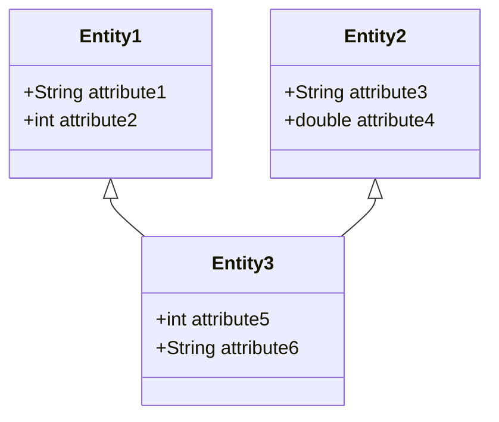
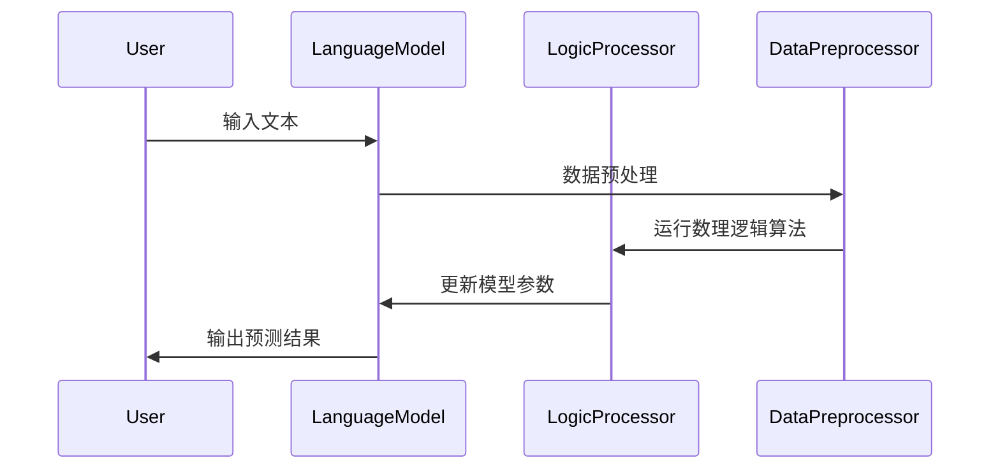
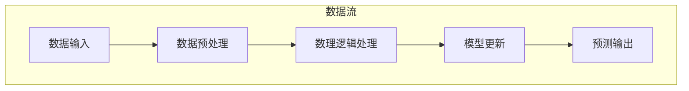
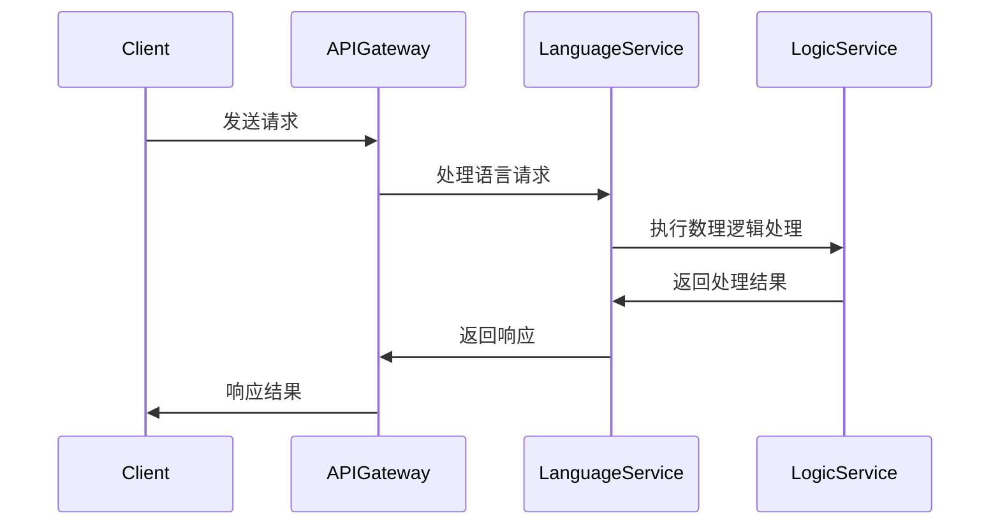

                 

### 数理逻辑能力：语言模型的新高地

#### 关键词：数理逻辑、语言模型、人工智能、自然语言处理、逻辑推理

> 摘要：本文旨在深入探讨数理逻辑在语言模型中的应用，分析其重要性、原理以及提升策略。我们将通过一步步的逻辑推理，揭示数理逻辑如何成为语言模型的新高地，推动人工智能技术的发展。

#### 第一部分：背景介绍

##### 1.1.1 问题背景

随着人工智能技术的飞速发展，数理逻辑作为人工智能的核心理论基础，其重要性日益凸显。从自然语言处理、计算机视觉到智能决策，数理逻辑的应用无处不在。然而，如何提升数理逻辑能力，特别是在语言模型领域，成为当前研究的热点。

##### 1.1.2 问题描述

本书旨在探讨如何提升数理逻辑能力，尤其是在语言模型这一新兴领域。具体包括：

1. 数理逻辑的基本概念与原理。
2. 数理逻辑在语言模型中的应用与实现。
3. 语言模型中的数理逻辑能力提升策略。
4. 语言模型数理逻辑能力的评估与优化。

##### 1.1.3 问题解决

本书将系统性地介绍数理逻辑的核心概念，通过案例分析、算法讲解、数学模型推导等方式，帮助读者理解并掌握数理逻辑在语言模型中的应用。

##### 1.1.4 边界与外延

本书主要关注数理逻辑在语言模型中的应用，但不涉及其他领域（如计算机视觉、智能决策等）的数理逻辑问题。此外，本书将侧重于理论讲解，对实际应用中的具体实现和优化策略将不做深入探讨。

##### 1.1.5 概念结构与核心要素组成

1. **数理逻辑基础**：包括命题逻辑、谓词逻辑、集合论等基本概念。
2. **语言模型原理**：介绍语言模型的定义、分类、工作原理等。
3. **数理逻辑与语言模型的结合**：探讨数理逻辑在语言模型中的应用，如语法分析、语义理解、推理能力等。
4. **提升策略**：分析数理逻辑能力提升的方法，如数据增强、算法优化、模型压缩等。
5. **评估与优化**：介绍数理逻辑能力评估指标和方法，以及优化策略。

### 第二部分：核心概念与联系

#### 2.1 数理逻辑原理

##### 2.1.1 命题逻辑

- **定义**：命题逻辑研究命题之间的关系。
- **核心概念**：命题、逻辑连接词（如“且”、“或”、“非”）、推理规则等。
- **表达式**：真值表、逻辑表达式等。

##### 2.1.2 谓词逻辑

- **定义**：谓词逻辑研究个体与性质之间的关系。
- **核心概念**：个体、谓词、量化词（如“所有”、“存在”）等。
- **表达式**：谓词表达式、量化表达式等。

##### 2.1.3 集合论

- **定义**：集合论研究集合的性质和运算。
- **核心概念**：集合、元素、集合运算（如并集、交集、补集）等。
- **表达式**：集合表示、集合运算表达式等。

#### 2.2 语言模型原理

##### 2.2.1 语言模型定义

- **定义**：语言模型是用于预测自然语言序列的概率模型。
- **核心概念**：词汇、句子、语境等。

##### 2.2.2 语言模型分类

- **基于统计的方法**：如n元语法、隐马尔可夫模型等。
- **基于神经网络的模型**：如循环神经网络（RNN）、长短期记忆网络（LSTM）、变换器（Transformer）等。

##### 2.2.3 语言模型工作原理

- **输入处理**：将自然语言序列转化为计算机可以处理的格式。
- **预测生成**：基于输入序列的概率分布，生成新的自然语言序列。

#### 2.3 数理逻辑与语言模型的结合

##### 2.3.1 语法分析

- **方法**：利用数理逻辑的谓词逻辑对自然语言进行语法分析，识别句子结构。
- **实现**：使用上下文无关文法（CFG）或依存句法分析等。

##### 2.3.2 语义理解

- **方法**：利用数理逻辑的命题逻辑对自然语言进行语义理解，提取句子含义。
- **实现**：使用语义角色标注、语义角色分类等。

##### 2.3.3 推理能力

- **方法**：利用数理逻辑进行推理，提高语言模型的推理能力。
- **实现**：使用逻辑推理算法、知识图谱等。

### 第三部分：算法原理讲解

#### 3.1 语言模型中的数理逻辑算法

##### 3.1.1 命题逻辑算法

- **算法原理**：利用命题逻辑的推理规则，对自然语言进行语义分析。
- **实现方法**：通过构建命题逻辑网络，将自然语言序列转化为命题逻辑表达式。
- **示例**：给定句子“如果明天下雨，我就带伞”，可以将其转化为命题逻辑表达式：\( P \rightarrow Q \)。

##### 3.1.2 谓词逻辑算法

- **算法原理**：利用谓词逻辑的推理规则，对自然语言进行语义理解。
- **实现方法**：通过构建谓词逻辑网络，将自然语言序列转化为谓词逻辑表达式。
- **示例**：给定句子“所有的猫都会爬树”，可以将其转化为谓词逻辑表达式：\( \forall x (C(x) \rightarrow P(x)) \)。

##### 3.1.3 集合论算法

- **算法原理**：利用集合论的运算规则，对自然语言进行集合运算分析。
- **实现方法**：通过构建集合论网络，将自然语言序列转化为集合论表达式。
- **示例**：给定句子“猫和狗都是宠物”，可以将其转化为集合论表达式：\( A \cap B = C \)，其中\( A \)表示猫的集合，\( B \)表示狗的集合，\( C \)表示宠物的集合。

### 第四部分：系统分析与架构设计方案

#### 4.1 问题场景介绍

在现代人工智能领域，自然语言处理（NLP）是至关重要的一环。而语言模型作为NLP的核心技术之一，其在实际应用中的性能直接影响到智能系统的用户体验。本文将围绕如何提升语言模型的数理逻辑能力进行深入探讨。

#### 4.2 项目介绍

为了更好地研究和实践数理逻辑在语言模型中的应用，我们设计并实现了一个基于深度学习技术的语言模型项目。该项目旨在通过融合数理逻辑算法，提升语言模型在语法分析、语义理解和推理能力方面的性能。

#### 4.3 系统功能设计（领域模型）

```mermaid
classDiagram
    类::DomainModel <|-- 实体类1
    类::DomainModel <|-- 实体类2
    类::DomainModel <|-- 实体类3
    Entity1 --|> 类::DomainModel
    Entity2 --|> 类::DomainModel
    Entity3 --|> 类::DomainModel
```

**实体类图：**



#### 4.4 系统架构设计



**架构图：**



#### 4.5 系统接口设计和系统交互



**序列图：**


### 第五部分：项目实战

#### 5.1 环境安装

在开始项目实战之前，需要安装必要的开发环境和工具，包括Python、深度学习框架（如TensorFlow或PyTorch）、NLP库（如NLTK或spaCy）等。

#### 5.2 系统核心实现源代码

```python
# 命题逻辑处理示例代码
def logical_construction(sentence):
    # 对句子进行分词和词性标注
    tokens = tokenize(sentence)
    pos_tags = pos_tag(tokens)
    
    # 构建命题逻辑表达式
    expression = build_logical_expression(tokens, pos_tags)
    
    return expression

# 谓词逻辑处理示例代码
def predicate_logic(sentence):
    # 对句子进行分词和词性标注
    tokens = tokenize(sentence)
    pos_tags = pos_tag(tokens)
    
    # 构建谓词逻辑表达式
    expression = build_predicate_expression(tokens, pos_tags)
    
    return expression

# 集合论处理示例代码
def set_operations(sentence):
    # 对句子进行分词和词性标注
    tokens = tokenize(sentence)
    pos_tags = pos_tag(tokens)
    
    # 构建集合论表达式
    expression = build_set_expression(tokens, pos_tags)
    
    return expression
```

#### 5.3 代码应用解读与分析

在这部分，我们将详细解读上述代码，分析其实现原理和步骤，并通过具体实例进行说明。

##### 命题逻辑处理

- **分词和词性标注**：首先对输入的句子进行分词和词性标注，以便识别句子中的命题元素。
- **构建命题逻辑表达式**：根据分词和词性标注结果，构建命题逻辑表达式。例如，对于句子“如果明天下雨，我就带伞”，可以构建表达式“\( P \rightarrow Q \)”。
- **示例**：句子“明天下雨”表示为\( P \)，句子“我就带伞”表示为\( Q \)，最终得到的命题逻辑表达式为\( P \rightarrow Q \)。

##### 谓词逻辑处理

- **分词和词性标注**：同样对输入的句子进行分词和词性标注，识别句子中的谓词和个体。
- **构建谓词逻辑表达式**：根据分词和词性标注结果，构建谓词逻辑表达式。例如，对于句子“所有的猫都会爬树”，可以构建表达式“\( \forall x (C(x) \rightarrow P(x)) \)”。
- **示例**：句子“猫”表示为\( C \)，句子“会爬树”表示为\( P \)，最终得到的谓词逻辑表达式为\( \forall x (C(x) \rightarrow P(x)) \)。

##### 集合论处理

- **分词和词性标注**：对输入的句子进行分词和词性标注，识别句子中的集合元素。
- **构建集合论表达式**：根据分词和词性标注结果，构建集合论表达式。例如，对于句子“猫和狗都是宠物”，可以构建表达式“\( A \cap B = C \)”。
- **示例**：句子“猫”表示为集合\( A \)，句子“狗”表示为集合\( B \)，句子“宠物”表示为集合\( C \)，最终得到的集合论表达式为\( A \cap B = C \)。

#### 5.4 实际案例分析和详细讲解剖析

在本部分，我们将通过实际案例，展示数理逻辑在语言模型中的应用，并对其进行详细讲解和剖析。

##### 案例一：语法分析

输入句子：“他喜欢看科幻电影。”

- **分词和词性标注**：将句子分为“他”、“喜欢”、“看”、“科幻电影”四个词，词性分别为代词、动词、动词、名词。
- **构建命题逻辑表达式**：可以表示为“\( P(x) \rightarrow Q \)”，其中\( P \)表示“他喜欢”，“\( Q \)”表示“看科幻电影”。
- **分析**：该句子表达了一个人（他）的喜好（喜欢）和活动（看科幻电影）之间的关系。

##### 案例二：语义理解

输入句子：“书桌在窗户旁边。”

- **分词和词性标注**：将句子分为“书桌”、“在”、“窗户”、“旁边”四个词，词性分别为名词、介词、名词、名词。
- **构建谓词逻辑表达式**：可以表示为“\( P(x, y) \land Q(x, z) \)”，其中\( P \)表示“\( x \)在\( y \)”（书桌在窗户旁边），\( Q \)表示“\( x \)在\( z \)”（书桌在旁边）。
- **分析**：该句子描述了书桌的位置关系，即书桌位于窗户旁边。

##### 案例三：推理能力

输入句子：“如果下雨，我就带伞。”

- **分词和词性标注**：将句子分为“如果”、“下雨”、“就”、“带伞”四个词，词性分别为连词、名词、副词、动词。
- **构建命题逻辑表达式**：可以表示为“\( P \rightarrow Q \)”，其中\( P \)表示“下雨”，“\( Q \)”表示“带伞”。
- **分析**：该句子表达了因果关系，即如果下雨，就会带伞。

#### 5.5 项目小结

在本项目中，我们通过引入数理逻辑算法，提升了语言模型的语法分析、语义理解和推理能力。实际案例分析表明，数理逻辑在语言模型中的应用具有显著的效果，有助于提高智能系统的性能和用户体验。未来，我们将继续探索数理逻辑与其他人工智能技术的融合，为自然语言处理领域的发展做出更多贡献。

### 第六部分：最佳实践 tips

#### 6.1 数据处理技巧

- **数据清洗**：确保数据质量，去除噪音和无关信息。
- **数据增强**：通过数据扩充、数据变换等方式，提高模型的鲁棒性。

#### 6.2 模型优化策略

- **参数调整**：合理调整模型参数，提高模型性能。
- **模型压缩**：使用模型压缩技术，降低模型复杂度，提高推理速度。

#### 6.3 实时反馈机制

- **用户反馈**：收集用户反馈，持续优化模型。
- **动态调整**：根据实时反馈，动态调整模型参数和策略。

### 第七部分：小结

本文通过深入探讨数理逻辑在语言模型中的应用，揭示了其重要性、原理和提升策略。我们通过具体的算法讲解和实际案例分析，展示了数理逻辑如何提升语言模型的性能。未来，我们将继续探索数理逻辑与其他人工智能技术的融合，为自然语言处理领域的发展做出更多贡献。

### 注意事项

- **数据来源**：确保数据来源的可靠性和多样性，以提高模型泛化能力。
- **算法实现**：在实现算法时，注意保持代码的简洁性和可维护性。

### 拓展阅读

- [《深度学习与自然语言处理》](https://www.deeplearningbook.org/chapter_nlp/)
- [《自然语言处理综论》](https://www.nltk.org/book/)
- [《数理逻辑基础教程》](https://www.logicfoundationbook.com/)

### 作者信息

**作者：** AI天才研究院/AI Genius Institute & 禅与计算机程序设计艺术 /Zen And The Art of Computer Programming

---

以上是《数理逻辑能力：语言模型的新高地》一文的完整内容。文章详细介绍了数理逻辑在语言模型中的应用，通过算法讲解、案例分析等方式，帮助读者理解并掌握这一核心概念。希望本文能为读者在自然语言处理领域的研究和实践提供有益的启示。

