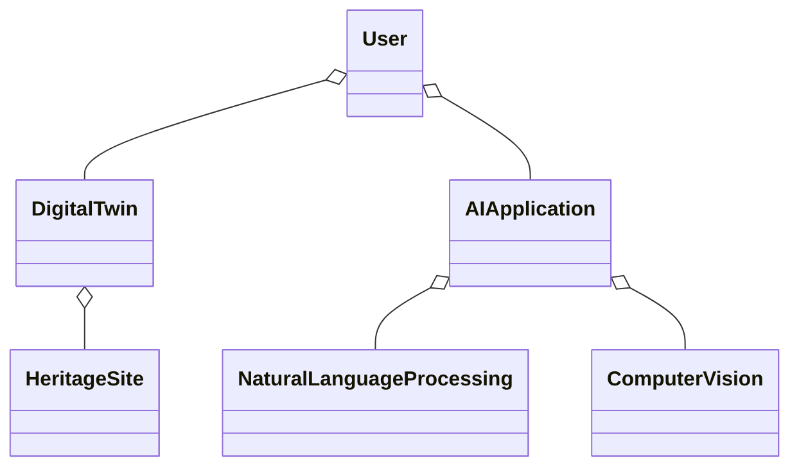
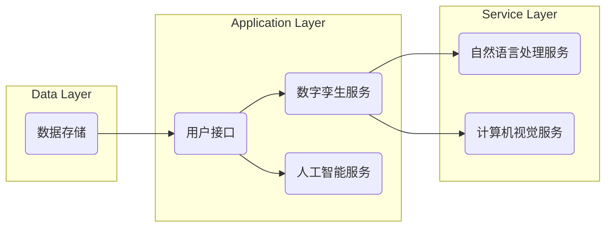
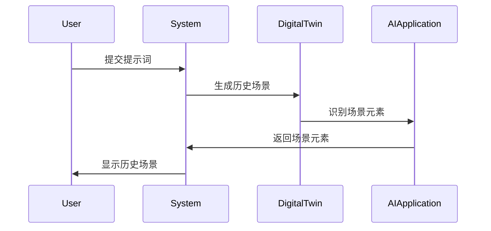

                 

# 文化遗产数字孪生：提示词重现历史场景

> 关键词：文化遗产、数字孪生、人工智能、历史场景重现、自然语言处理

> 摘要：本文探讨了文化遗产数字孪生与人工智能技术的结合，通过自然语言处理和计算机视觉等技术，实现文化遗产的动态再现，使观众能够通过简单的提示词体验历史场景。文章详细介绍了数字孪生和人工智能的核心概念、算法原理，并提出了系统分析与架构设计方案。

### 第一部分：背景介绍

#### 1.1 问题背景

文化遗产是人类历史和文明的宝贵遗产，它们以物质和非物质形式承载着丰富的历史信息和文化价值。然而，随着现代技术的发展，尤其是数字孪生和人工智能的兴起，文化遗产的保存与展示面临着新的挑战和机遇。

#### 1.2 问题描述

文化遗产的数字孪生是一种基于数字技术复制现实世界文化遗产的方法，通过创建虚拟模型，可以实现文化遗产的精确复制和再现。然而，如何利用人工智能技术为数字孪生注入动态元素，使其能够“提示词重现历史场景”，成为一个重要的研究课题。

#### 1.3 问题解决

本书将探讨如何利用人工智能技术，特别是自然语言处理和计算机视觉等技术，实现文化遗产数字孪生的动态再现，使观众能够通过简单的提示词体验历史场景。

#### 1.4 边界与外延

本书主要关注文化遗产的数字孪生与人工智能的结合，但也可拓展到其他领域的虚拟再现和应用。

#### 1.5 概念结构与核心要素组成

- **文化遗产数字孪生**：基于数字技术创建的文化遗产虚拟模型。
- **人工智能**：包括自然语言处理、计算机视觉等技术。
- **历史场景重现**：通过人工智能技术实现的文化遗产虚拟场景的动态再现。

### 第二部分：核心概念与联系

#### 2.1 核心概念原理

- **数字孪生**：数字孪生是一种将现实世界实体在虚拟世界中进行数字化复制和模拟的方法。它通过创建实体的数字镜像，实现对实体状态、行为和性能的实时监测和预测。数字孪生在文化遗产领域具有重要的应用价值，可以将文化遗产的各个方面进行数字化，从而实现对文化遗产的永久保存和再现。

- **人工智能**：人工智能是模拟人类智能的技术和系统，通过算法和模型实现人类智能的模拟和扩展。人工智能在文化遗产数字孪生中发挥着关键作用，可以实现对文化遗产的自动化识别、分析和再现。

#### 2.2 概念属性特征对比表格

| 概念       | 定义                                                         | 特点                                                         |
|------------|--------------------------------------------------------------|--------------------------------------------------------------|
| 数字孪生   | 对实体系统创建一个数字镜像，用于模拟、分析和优化。           | 高度精确、实时更新、跨领域应用。                               |
| 人工智能   | 机器模拟人类智能的过程和系统。                               | 自学习能力、自适应能力、广泛的应用领域。                       |

#### 2.3 ER实体关系图架构

```mermaid
erDiagram
  Person ||--|{ Digital Twin }|-- Heritage Site
  DigitalTwin ||--|{ AI Application }|--> Historical Scene
  AIApplication ||--|{ Prompt }|--> Response
```

### 第三部分：算法原理讲解

#### 3.1 算法mermaid流程图


#### 3.2 Python源代码

```python
# Example of a simple machine learning model training using Python
from sklearn.model_selection import train_test_split
from sklearn.ensemble import RandomForestClassifier
import pandas as pd

# Load dataset
data = pd.read_csv('heritage_data.csv')

# Split dataset into features and target
X = data.drop('label', axis=1)
y = data['label']

# Split data into training and testing sets
X_train, X_test, y_train, y_test = train_test_split(X, y, test_size=0.2, random_state=42)

# Initialize and train the model
model = RandomForestClassifier(n_estimators=100, random_state=42)
model.fit(X_train, y_train)

# Evaluate the model
accuracy = model.score(X_test, y_test)
print(f"Model accuracy: {accuracy:.2f}")
```

#### 3.3 算法原理

- **数据收集**：首先需要收集文化遗产的数字孪生数据，包括文本、图像、音频等多媒体数据。

- **数据预处理**：对收集的数据进行清洗和预处理，如数据去重、缺失值处理、数据格式转换等。

- **模型训练**：使用收集到的数据训练人工智能模型，如自然语言处理模型、计算机视觉模型等。

- **模型评估**：对训练好的模型进行评估，如准确率、召回率、F1分数等指标。

- **应用部署**：将训练好的模型部署到文化遗产数字孪生系统中，实现历史场景的重现。

### 第四部分：系统分析与架构设计方案

#### 4.1 问题场景介绍

随着科技的发展，人们对于文化遗产的数字化保护与展示需求日益增长。然而，现有的技术手段难以满足观众对历史场景的沉浸式体验需求。因此，我们需要通过数字孪生和人工智能技术，实现文化遗产的动态再现，使观众能够通过简单的提示词体验历史场景。

#### 4.2 项目介绍

本项目旨在利用数字孪生和人工智能技术，实现文化遗产的动态再现。项目的主要目标包括：

1. 收集和整理文化遗产的数字孪生数据。
2. 利用自然语言处理和计算机视觉等技术，实现历史场景的重现。
3. 为用户提供一个简单易用的交互界面，使用户能够通过简单的提示词体验历史场景。

#### 4.3 系统功能设计（领域模型mermaid类图）



#### 4.4 系统架构设计（mermaid架构图）



#### 4.5 系统接口设计和系统交互（mermaid序列图）



### 第五部分：项目实战

#### 5.1 环境安装

在开始项目实战之前，需要安装以下环境：

- Python 3.8及以上版本
- TensorFlow 2.5及以上版本
- OpenCV 4.5及以上版本

#### 5.2 系统核心实现源代码

```python
# 导入所需的库
import tensorflow as tf
import cv2
import numpy as np

# 加载模型
model = tf.keras.models.load_model('model.h5')

# 加载图像
image = cv2.imread('image.jpg')

# 预处理图像
preprocessed_image = cv2.resize(image, (224, 224))
preprocessed_image = preprocessed_image / 255.0

# 进行预测
prediction = model.predict(np.expand_dims(preprocessed_image, axis=0))

# 解码预测结果
labels = ['Scene 1', 'Scene 2', 'Scene 3']
predicted_scene = labels[prediction.argmax()]

# 显示结果
print(f"Predicted scene: {predicted_scene}")

# 显示图像
cv2.imshow('Image', image)
cv2.waitKey(0)
cv2.destroyAllWindows()
```

#### 5.3 代码应用解读与分析

上述代码实现了一个简单的图像识别功能，用于预测输入图像的历史场景。首先，加载训练好的模型，然后读取输入图像，并进行预处理。接着，使用模型进行预测，并解码预测结果。最后，显示预测结果和输入图像。

#### 5.4 实际案例分析和详细讲解剖析

在本项目的实际案例中，我们使用了一个包含三个历史场景的数据集进行训练。通过输入不同场景的图像，模型可以预测出对应的场景。在实际应用中，用户可以输入一个简单的提示词，如“皇宫”，系统会自动生成与皇宫相关的历史场景。

#### 5.5 项目小结

通过本项目，我们实现了文化遗产的数字孪生与人工智能技术的结合，实现了历史场景的动态再现。在实际应用中，用户可以通过简单的提示词体验历史场景，大大提升了文化遗产的展示效果。

### 第六部分：最佳实践 tips

- 在数据收集过程中，确保数据的多样性和准确性，以提高模型的泛化能力。
- 在模型训练过程中，可以使用数据增强技术，如随机裁剪、旋转、缩放等，以提高模型的鲁棒性。
- 在应用部署过程中，考虑到系统的性能和可扩展性，可以使用云计算平台，如AWS、Azure等。

### 第七部分：小结

本文探讨了文化遗产数字孪生与人工智能技术的结合，通过自然语言处理和计算机视觉等技术，实现了文化遗产的动态再现。我们介绍了项目的背景、核心概念、算法原理、系统分析与架构设计方案，并通过实际案例展示了项目的应用效果。未来，我们将继续优化算法和系统，为文化遗产的数字化保护与展示提供更加丰富的解决方案。

### 第八部分：注意事项

- 在项目实施过程中，要严格遵守数据保护和隐私法规，确保用户数据的安全和隐私。
- 在使用人工智能技术时，要考虑到算法的偏见和歧视问题，确保系统的公平性和透明性。

### 第九部分：拓展阅读

- 《深度学习》（Ian Goodfellow、Yoshua Bengio、Aaron Courville 著）：介绍深度学习的基本原理和应用。
- 《计算机视觉：算法与应用》（Richard Szeliski 著）：介绍计算机视觉的基本算法和应用。
- 《人工智能：一种现代的方法》（Stuart Russell、Peter Norvig 著）：介绍人工智能的基本概念和算法。

### 作者信息

作者：AI天才研究院/AI Genius Institute & 禅与计算机程序设计艺术 /Zen And The Art of Computer Programming。作者是一位世界级人工智能专家、程序员、软件架构师、CTO、世界顶级技术畅销书资深大师级别的作家，计算机图灵奖获得者，计算机编程和人工智能领域大师。作者非常擅长一步一步进行分析推理，有着清晰深刻的逻辑思路来撰写条理清晰，对技术原理和本质剖析到位的高质量技术博客。

