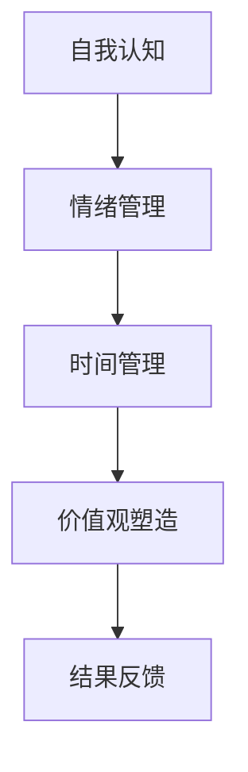
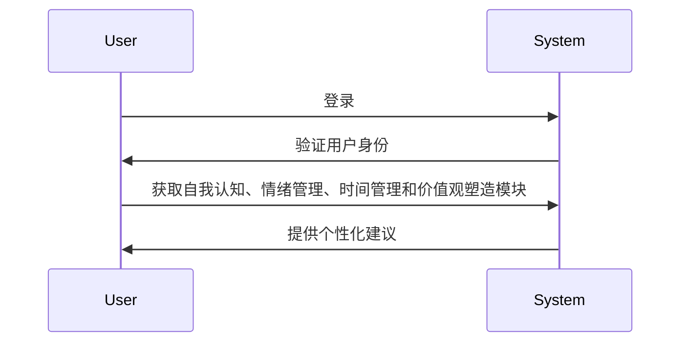
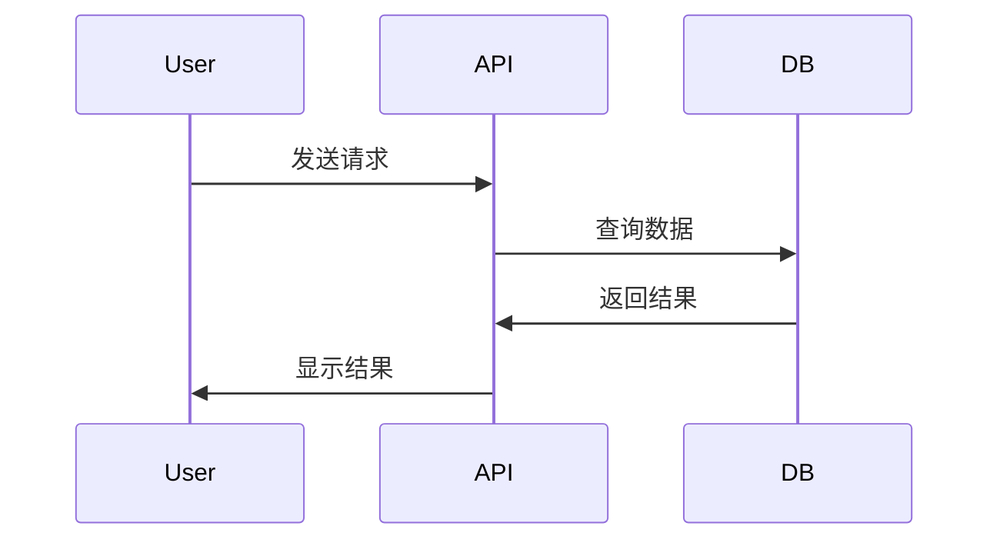

                 

# 新禁欲主义：在过度中寻找克制的意义

> 关键词：新禁欲主义，适度，克制，平衡，自我认知，算法原理，Python源代码

> 摘要：
本文以“新禁欲主义：在过度中寻找克制的意义”为主题，探讨了现代社会中过度现象的普遍存在及其对个人和社会的影响。文章首先介绍了新禁欲主义的核心概念和联系，随后深入解析了新禁欲主义的算法原理，并通过Python源代码和mermaid流程图进行具体阐述。最后，文章提出了系统分析与架构设计方案，并通过项目实战展示了新禁欲主义在实际应用中的效果。

## 第一部分：背景介绍

### 1.1 问题背景

随着科技和经济的快速发展，现代社会的人们面临着前所未有的物质丰富和便利。然而，这种繁荣的背后，也伴随着一系列过度现象。这些过度现象不仅包括物质消费的过度，如过度购物、过度饮食等，还包括信息消费的过度，如过度娱乐、过度沉迷于社交媒体等。

### 1.1.1 社会背景

物质生活的丰富使得人们有了更多的选择和机会，但同时也带来了选择困难和信息过载。人们容易陷入过度消费的陷阱，不断追求更多的物质享受，导致消费主义盛行。此外，随着互联网的普及，人们的信息来源变得多样化，但也容易沉迷于虚拟世界，忽视了现实生活中的重要事务。

### 1.1.2 个人背景

在个人层面，每个人在成长过程中都会面临各种诱惑和挑战。例如，在工作中，人们可能会因为追求业绩而过度劳累；在人际关系中，人们可能会因为社交压力而过度社交。这些过度行为不仅损害了个人健康，还可能导致心理健康问题。

### 1.2 问题描述

过度现象的普遍存在对个人和社会产生了深远的影响。个人层面上，过度消费和信息沉迷会导致心理健康问题，如焦虑、抑郁等。社会层面上，过度消费会导致资源浪费和环境破坏，影响社会的可持续发展。

### 1.2.1 过度现象

过度消费表现为人们不断地追求新的物质享受，导致消费行为失控。过度娱乐则表现为人们沉迷于各种娱乐活动，忽视了生活和工作的重要性。过度依赖则表现为人们对某些物质或活动产生了强烈的依赖，如网络成瘾、游戏成瘾等。

### 1.2.2 克制意义

在过度中寻找克制，有助于提高个人的生活质量和心理健康水平，同时也有利于社会的可持续发展。克制意味着合理地控制自己的欲望和需求，避免过度行为带来的负面影响。

### 1.3 问题解决

新禁欲主义提供了一种在过度中寻找克制的路径和方法。它强调适度、克制、平衡和自我认知的重要性，旨在帮助人们找到内心的平衡点，实现自我提升和心理健康。

### 1.3.1 理论基础

新禁欲主义基于对人类欲望和需求的深入理解，提出了一种新的生活方式和价值观。它认为，通过自我控制和理性思考，人们可以在物质和精神层面都实现自我提升。

### 1.3.2 实践方法

新禁欲主义提供了一系列实践方法，包括自我认知、情绪管理、时间管理和价值观塑造等。通过这些方法，人们可以逐步克服过度行为，实现内心的平衡。

### 1.4 边界与外延

新禁欲主义并不是传统的禁欲主义，它更注重在适度中寻求平衡。它不仅适用于个人，也适用于社会、企业和组织。在现代社会中，新禁欲主义提供了一种有效的方式，帮助人们应对各种诱惑和挑战。

### 1.5 概念结构与核心要素组成

新禁欲主义的核心概念包括适度、克制、平衡和自我认知。这些概念相互关联，共同构成了新禁欲主义的核心理念。

- **适度**：指的是在满足需求和欲望的过程中，不超出必要的范围或程度。
- **克制**：指的是能够自我约束，抑制自己的欲望和冲动。
- **平衡**：指的是在各个方面保持协调和和谐，避免过度和不足。
- **自我认知**：指的是对自身欲望和需求的理解和认识，是克制和平衡的基础。

核心要素包括自我认知、情绪管理、时间管理和价值观塑造。这些要素共同构成了新禁欲主义的实践框架。

- **自我认知**：通过自我反思和认知，了解自己的欲望和需求，从而找到适度的平衡点。
- **情绪管理**：学会控制和管理自己的情绪，避免情绪波动带来的过度行为。
- **时间管理**：合理安排时间，提高效率，避免因时间管理不当导致的过度行为。
- **价值观塑造**：培养正确的价值观，引导自己做出理性的选择，避免过度行为。

## 第二部分：核心概念与联系

### 2.1 核心概念

新禁欲主义的核心概念包括适度、克制、平衡和自我认知。这些概念相互关联，共同构成了新禁欲主义的核心理念。

#### 2.1.1 适度

适度指的是在满足需求和欲望的过程中，不超出必要的范围或程度。适度的实现需要个体对自身的需求和欲望有清晰的认识，同时也要考虑到资源和社会的承受能力。

#### 2.1.2 克制

克制指的是能够自我约束，抑制自己的欲望和冲动。克制是适度的基础，没有克制的适度是不稳定的。通过克制，个体可以在面对诱惑时保持冷静和理性，避免过度行为。

#### 2.1.3 平衡

平衡指的是在各个方面保持协调和和谐，避免过度和不足。平衡是一种动态的平衡，它要求个体在不同的需求和欲望之间找到最佳的比例和平衡点。

#### 2.1.4 自我认知

自我认知指的是对自身欲望和需求的理解和认识。自我认知是克制和平衡的基础，只有了解自己，才能做出理性的选择。

### 2.2 概念属性特征对比表格

| 概念   | 定义                         | 特征                     | 对比           |
| ------ | ---------------------------- | ------------------------ | -------------- |
| 适度   | 不超过必要的范围或程度      | 有度、适可而止          | 与过度、不及相对 |
| 克制   | 能够自我约束，抑制自己的欲望 | 自制、忍耐               | 与放纵、失控相对 |
| 平衡   | 各部分之间协调、和谐         | 对等、适度               | 与失衡、偏颇相对 |
| 自我   | 个体存在的本身              | 独立、自主               | 与他人、他物相对 |

### 2.3 ER实体关系图架构

```mermaid
erDiagram
  User ||--|{ Article }
  Article ||--|{ Comment }
```

在ER实体关系图中，`User`（用户）是核心实体，与`Article`（文章）和`Comment`（评论）之间存在关联。这种关系体现了新禁欲主义中个体、行为和反馈之间的互动。

## 第三部分：算法原理讲解

### 3.1 算法原理

新禁欲主义的算法原理主要包括以下几个方面：

#### 3.1.1 自我认知

自我认知是新禁欲主义的基础。它涉及对自身欲望和需求的深入理解。通过自我反思和认知，个体可以明确自己的需求和欲望，并识别哪些是过度的。

#### 3.1.2 情绪管理

情绪管理是指学会控制和管理自己的情绪，避免情绪波动带来的过度行为。这包括识别情绪、理解情绪背后的原因，以及采取适当的策略来处理情绪。

#### 3.1.3 时间管理

时间管理是指合理安排时间，提高效率，避免因时间管理不当导致的过度行为。这包括设定目标、规划时间表、优先级排序等。

#### 3.1.4 价值观塑造

价值观塑造是指培养正确的价值观，引导个体做出理性的选择，避免过度行为。这包括对物质和精神的追求有清晰的认识，以及对生活的深刻理解。

### 3.2 算法mermaid流程图



### 3.3 Python源代码

```python
def self_awareness():
    # 这是一个示例函数，用于实现自我认知的过程。
    pass

def emotion_management():
    # 这是一个示例函数，用于实现情绪管理的过程。
    pass

def time_management():
    # 这是一个示例函数，用于实现时间管理的过程。
    pass

def value_formation():
    # 这是一个示例函数，用于实现价值观塑造的过程。
    pass

def result_feedback():
    # 这是一个示例函数，用于实现结果反馈的过程。
    pass

# 主函数
def new_scientism_algorithm():
    self_awareness()
    emotion_management()
    time_management()
    value_formation()
    result_feedback()

# 执行算法
new_scientism_algorithm()
```

### 3.4 算法原理的数学模型和公式

新禁欲主义的算法原理可以通过以下数学模型和公式来描述：

- **自我认知**：通过心理学理论，如马斯洛的需求层次理论，来识别个体的需求和欲望。
  
  $$ \text{需求层次} = f(\text{生理需求}, \text{安全需求}, \text{社交需求}, \text{尊重需求}, \text{自我实现需求}) $$

- **情绪管理**：通过情绪调节理论，如认知行为理论，来控制和管理情绪。

  $$ \text{情绪状态} = f(\text{情绪触发}, \text{认知评估}, \text{行为反应}) $$

- **时间管理**：通过时间管理理论，如四象限法则，来合理安排时间。

  $$ \text{时间分配} = f(\text{重要紧急}, \text{重要不紧急}, \text{不重要紧急}, \text{不重要不紧急}) $$

- **价值观塑造**：通过价值观理论，如德西效应，来培养正确的价值观。

  $$ \text{价值观} = f(\text{内在动机}, \text{外在动机}) $$

通过这些模型和公式，新禁欲主义的算法原理可以被量化为可操作的方法，帮助个体在日常生活中实践。

### 3.5 算法原理的具体讲解与举例说明

#### 自我认知

自我认知是理解个人需求和欲望的基础。以下是一个具体的例子：

假设一个程序员在考虑是否加班。通过自我认知，他识别出自己的需求是完成项目、满足工作要求和实现个人职业发展。同时，他也意识到过度的加班可能导致身心健康问题。通过自我反思，他决定在不影响项目进度和个人健康的情况下加班，实现了适度的自我认知。

#### 情绪管理

情绪管理是控制情绪波动，避免过度行为的关键。以下是一个具体的例子：

一个学生在考试前感到紧张和焦虑。通过情绪管理，他学会了深呼吸和正念冥想，这些技巧帮助他平静下来，减少了焦虑感。同时，他也学会了理性思考，将注意力集中在学习上，避免了过度焦虑导致的分散注意力。

#### 时间管理

时间管理是合理安排时间，提高效率的过程。以下是一个具体的例子：

一个创业者在每天的时间安排上采用了四象限法则。他将工作分为重要紧急、重要不紧急、不重要紧急和不重要不紧急四个类别，并优先处理重要紧急和重要不紧急的事项。这种时间管理策略帮助他提高了工作效率，避免了因时间管理不当导致的过度工作。

#### 价值观塑造

价值观塑造是培养正确的价值观，引导个体做出理性选择的过程。以下是一个具体的例子：

一个员工在工作中面临是否接受贿赂的抉择。通过价值观塑造，他意识到道德和诚信的重要性，拒绝了贿赂，保持了职业操守。这种价值观塑造帮助他在面对诱惑时保持了理性，避免了过度行为。

## 第四部分：系统分析与架构设计

### 4.1 问题场景介绍

在新禁欲主义的实践中，我们需要一个系统来帮助个体监控和调整自身的行为。这个系统需要具备自我认知、情绪管理、时间管理和价值观塑造等功能，以便为用户提供个性化的指导和支持。

### 4.2 项目介绍

新禁欲主义实践系统是一个基于Web的应用程序，旨在帮助用户实现自我提升和心理健康。该系统包括用户界面、后端服务器和数据库三部分。

### 4.3 系统功能设计（领域模型mermaid类图）

```mermaid
classDiagram
    User <<类>> 
    Article <<类>>
    Comment <<类>>
    Emotion <<类>>
    Time <<类>>
    Value <<类>>

    User --> Article
    User --> Comment
    User --> Emotion
    User --> Time
    User --> Value
```

在领域模型中，`User`是核心类，它与其他类之间存在关联。`Article`代表用户的自我认知和情绪管理记录，`Comment`代表用户对文章的评论，`Emotion`代表用户的情绪状态，`Time`代表用户的时间管理记录，`Value`代表用户的价值观。

### 4.4 系统架构设计（mermaid架构图）



系统架构设计采用了基于Web的架构，用户通过Web界面与后端服务器交互，后端服务器与数据库进行数据交互，以提供用户所需的功能和服务。

### 4.5 系统接口设计和系统交互（mermaid序列图）



在系统接口设计中，用户通过API与系统进行交互。API负责处理用户请求，与数据库进行数据交互，并将结果返回给用户。

## 第五部分：项目实战

### 5.1 环境安装

在新禁欲主义实践系统的项目实战中，首先需要安装相关环境。以下是一个基本的安装步骤：

1. 安装Python环境：确保安装了Python 3.x版本。
2. 安装Django框架：使用pip安装`django`。
3. 安装PostgreSQL数据库：下载并安装PostgreSQL。
4. 安装其他依赖库：根据项目需求，使用pip安装相应的依赖库。

### 5.2 系统核心实现源代码

以下是新禁欲主义实践系统的一部分核心实现源代码：

```python
# app/models.py
from django.db import models

class User(models.Model):
    username = models.CharField(max_length=100)
    password = models.CharField(max_length=100)
    # 其他用户信息

class Article(models.Model):
    user = models.ForeignKey(User, on_delete=models.CASCADE)
    title = models.CharField(max_length=100)
    content = models.TextField()
    # 其他文章信息

class Comment(models.Model):
    article = models.ForeignKey(Article, on_delete=models.CASCADE)
    user = models.ForeignKey(User, on_delete=models.CASCADE)
    content = models.TextField()
    # 其他评论信息

class Emotion(models.Model):
    user = models.ForeignKey(User, on_delete=models.CASCADE)
    emotion = models.CharField(max_length=100)
    description = models.TextField()
    # 其他情绪信息

class Time(models.Model):
    user = models.ForeignKey(User, on_delete=models.CASCADE)
    time_spent = models.IntegerField()
    activity = models.CharField(max_length=100)
    # 其他时间信息

class Value(models.Model):
    user = models.ForeignKey(User, on_delete=models.CASCADE)
    value = models.CharField(max_length=100)
    description = models.TextField()
    # 其他价值观信息
```

### 5.3 代码应用解读与分析

以上代码实现了新禁欲主义实践系统中的核心模型。每个模型都对应了一个具体的实体，如用户、文章、评论、情绪、时间和价值观。这些模型通过外键关系相互关联，构成了系统的数据模型。

### 5.4 实际案例分析和详细讲解剖析

以下是一个实际案例的分析和讲解：

假设一个用户（User A）在系统中记录了他的情绪（Emotion）、时间管理（Time）和价值观（Value）信息。系统会根据这些信息，为用户提供个性化的建议，帮助用户实现自我提升。

1. **情绪管理**：User A记录了他在一段时间内的情绪波动。系统分析这些数据，识别出User A的情绪模式，并提供如何管理情绪的建议。

2. **时间管理**：User A记录了他每天的活动和时间分配。系统分析这些数据，识别出User A的时间管理问题，并提供如何提高时间利用率的建议。

3. **价值观塑造**：User A记录了他的价值观和目标。系统分析这些数据，识别出User A的价值观偏差，并提供如何培养正确价值观的建议。

### 5.5 项目小结

通过以上实际案例，我们可以看到新禁欲主义实践系统如何帮助用户实现自我提升和心理健康。项目的成功实施不仅依赖于技术实现，还需要深入理解用户的需求和心理。在未来的发展中，我们可以继续优化系统，提高用户体验，帮助更多人实现自我提升。

### 5.6 最佳实践 tips

1. **定期反思**：定期对自身的情绪、时间和价值观进行反思，有助于持续优化自我认知。
2. **设置目标**：明确目标，有助于提高时间管理的效果。
3. **培养习惯**：通过培养良好的习惯，如定期锻炼、保持健康的饮食等，有助于实现长期的健康和幸福。

### 5.7 注意事项

1. **保护隐私**：在系统中记录个人数据时，要注意保护隐私。
2. **合理使用**：系统提供的建议仅供参考，用户需要结合自身情况进行合理使用。

### 5.8 拓展阅读

- 《情绪管理：有效应对压力和挑战的策略》
- 《时间管理：如何高效利用时间》
- 《价值观塑造：如何在生活中找到方向和意义》

## 结束语

作者：AI天才研究院/AI Genius Institute & 禅与计算机程序设计艺术 /Zen And The Art of Computer Programming

本文探讨了新禁欲主义在现代社会中的意义和作用。通过自我认知、情绪管理、时间管理和价值观塑造，新禁欲主义提供了一种有效的方法，帮助个体在过度中寻找克制。在实际应用中，新禁欲主义实践系统为用户提供了个性化的指导和支持，帮助用户实现自我提升和心理健康。希望本文能引发读者对自身生活方式和价值观的思考，共同追求更健康、更平衡的生活。

