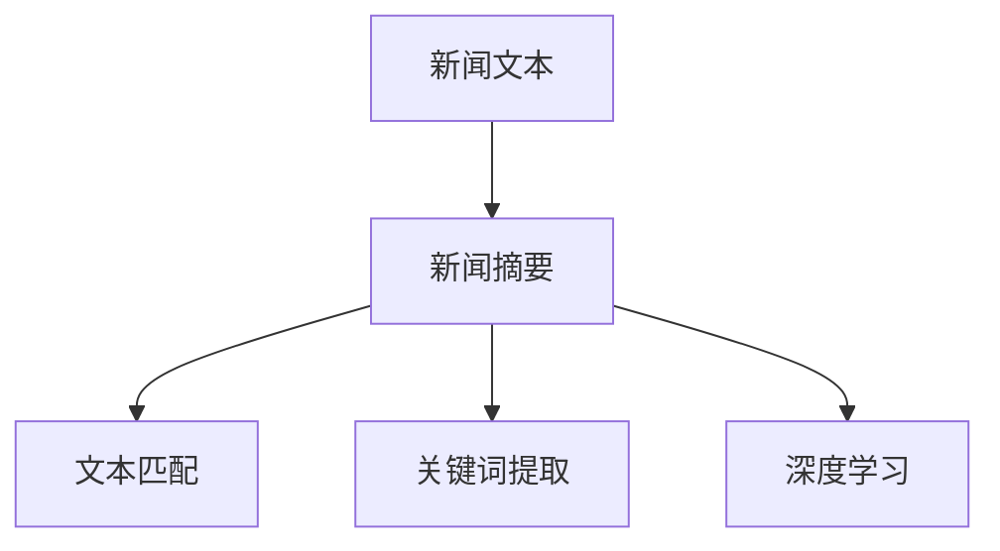
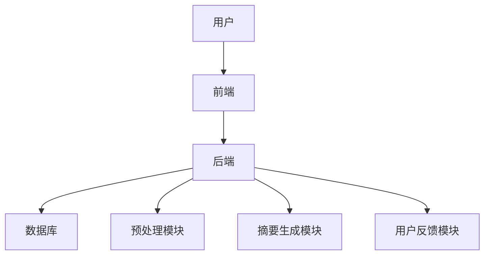
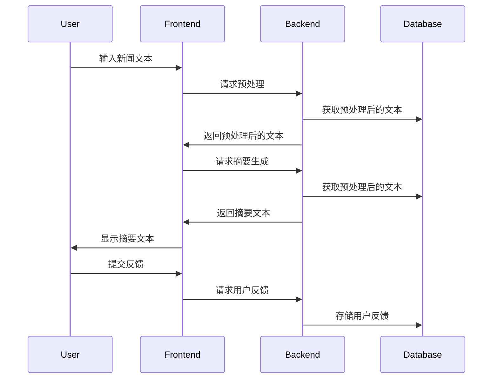

                 

### 文章标题

新闻写作辅助：用提示词生成新闻摘要

### 关键词

新闻写作、新闻摘要、提示词、文本匹配、关键词提取、深度学习、系统设计与实现、实战项目、未来发展趋势。

### 摘要

本文旨在探讨如何利用提示词生成新闻摘要，以提高新闻写作的效率和质量。首先，我们将介绍新闻写作的基础知识和技巧，包括新闻的定义、分类、写作原则及注意事项。接着，我们会深入解析新闻摘要的定义、作用和类型，以及如何选择和利用提示词来生成新闻摘要。随后，我们将详细讲解基于文本匹配、关键词提取和深度学习的新闻摘要生成算法原理，并通过Python代码示例和数学模型进行阐释。此外，本文还会介绍一个新闻摘要生成的实战项目，展示系统设计与实现的过程。最后，我们将探讨新闻摘要生成技术的未来发展趋势和应用前景，并给出相关建议。通过本文的阅读，读者将能够全面了解新闻摘要生成的技术原理和实践方法，为新闻写作提供有力支持。

## 目录大纲

### 《新闻写作辅助：用提示词生成新闻摘要》

#### 关键词：新闻写作、新闻摘要、提示词、文本匹配、关键词提取、深度学习、系统设计与实现、实战项目、未来发展趋势。

#### 摘要：本文将介绍新闻写作的基础知识，探讨新闻摘要的定义和作用，以及如何利用提示词生成新闻摘要。通过深入解析文本匹配、关键词提取和深度学习等摘要生成算法，并结合实际项目展示系统设计与实现的过程。最后，分析未来发展趋势，为新闻写作提供有效工具和策略。

### 第一部分：新闻写作基础知识

### 第1章：新闻写作概述

1.1.1 新闻的定义与分类

1.1.2 新闻写作的基本原则

1.1.3 新闻结构分析

### 第2章：新闻写作技巧与规范

2.1.1 如何写出一个好的新闻标题

2.1.2 新闻导语的写作方法

2.1.3 新闻正文的结构与写作

2.1.4 新闻结尾的写作技巧

### 第3章：新闻写作的注意事项

3.1.1 避免常见的新闻写作错误

3.1.2 保证新闻的准确性与客观性

3.1.3 遵守新闻伦理与法规

### 第二部分：新闻摘要生成方法

### 第4章：新闻摘要的定义与作用

4.1.1 新闻摘要的定义

4.1.2 新闻摘要的作用

4.1.3 新闻摘要的类型

### 第5章：基于提示词的新闻摘要生成技术

5.1.1 提示词的定义与作用

5.1.2 提示词在新闻摘要生成中的应用

5.1.3 提示词的选择方法

### 第6章：新闻摘要生成算法原理

6.1.1 基于文本匹配的摘要算法

6.1.2 基于关键词提取的摘要算法

6.1.3 基于深度学习的摘要算法

### 第7章：新闻摘要生成系统的设计与实现

7.1.1 系统需求分析

7.1.2 系统架构设计

7.1.3 系统功能模块设计

7.1.4 系统实现与优化

### 第三部分：实践与应用

### 第8章：新闻摘要生成实战项目

8.1.1 项目背景与目标

8.1.2 环境安装与配置

8.1.3 项目实现步骤

8.1.4 项目效果评估与分析

### 第9章：新闻摘要生成技术的未来发展趋势

9.1.1 人工智能在新闻摘要生成中的应用

9.1.2 未来发展的挑战与机遇

9.1.3 应用前景与建议

### 附录：拓展阅读与参考资料

#### 完整性要求：

本文将按照目录大纲结构，逐步深入探讨新闻写作的基础知识、新闻摘要生成方法、算法原理以及实战项目。在各个章节中，将详细讲解核心概念、问题背景、解决方案、系统设计与实现等关键内容，并通过实例和代码展示来帮助读者更好地理解。最后，本文还将对新闻摘要生成技术的未来发展趋势和应用前景进行分析和展望，为读者提供全面的指导和参考。

---

## 新闻写作基础知识

### 第1章：新闻写作概述

#### 1.1.1 新闻的定义与分类

新闻是关于新近发生的、具有普遍关注意义的事件或现象的报道。它以文字、图片、视频等多种形式传播，旨在向公众传递信息、引导舆论、服务社会。新闻的分类多种多样，常见的有：

- 按内容分类：政治新闻、经济新闻、体育新闻、娱乐新闻等；
- 按形式分类：消息、通讯、特写、评论、访谈等；
- 按地域分类：国际新闻、国内新闻、地方新闻等。

#### 1.1.2 新闻写作的基本原则

新闻写作有以下几个基本原则：

- 真实性：新闻报道必须真实、客观，不歪曲事实；
- 时效性：新闻要及时报道，以保持其新鲜感；
- 公正性：新闻要公正、公平，不偏袒任何一方；
- 简洁性：新闻要简明扼要，避免冗长。

#### 1.1.3 新闻结构分析

新闻的基本结构包括标题、导语、正文和结尾。以下是各个部分的具体内容：

- 标题：简明扼要地概括新闻的核心内容，吸引读者的注意力；
- 导语：简短地介绍新闻的背景和主要信息，引出正文；
- 正文：详细阐述新闻事件，包括事件发生的时间、地点、原因、过程和结果等；
- 结尾：对新闻事件进行总结，有时会提出观点或展望未来。

### 第2章：新闻写作技巧与规范

#### 2.1.1 如何写出一个好的新闻标题

一个好的新闻标题应该具有以下几个特点：

- 吸引眼球：使用引人注目的词汇和短语；
- 简明扼要：用最少的字词表达最核心的信息；
- 具有新闻性：直接涉及新闻事件的主体和内容；
- 创意独特：不落俗套，避免使用常见的标题格式。

#### 2.1.2 新闻导语的写作方法

新闻导语是新闻的开头部分，写作方法如下：

- 简洁明了：用一句话或简短的一段文字概括新闻的核心内容；
- 挑选重点：选择新闻中最重要、最有新闻价值的信息；
- 引人入胜：使用生动的语言和形象化的描述，吸引读者继续阅读。

#### 2.1.3 新闻正文的结构与写作

新闻正文是新闻的主体部分，写作方法如下：

- 按时间顺序叙述：按照事件发生、发展的时间顺序进行叙述；
- 重点突出：对新闻事件的关键部分进行详细描述，突出新闻价值；
- 语言简洁：使用简单明了的语言，避免冗长和复杂；
- 客观公正：对事件进行客观、公正的报道，不偏袒任何一方。

#### 2.1.4 新闻结尾的写作技巧

新闻结尾的写作技巧如下：

- 对事件进行总结：对新闻事件进行简要总结，概括事件的主要内容和影响；
- 提出观点或展望：对新闻事件发表个人观点或对未来的发展趋势进行展望；
- 强调新闻价值：再次强调新闻的核心价值和意义，吸引读者的关注。

### 第3章：新闻写作的注意事项

#### 3.1.1 避免常见的新闻写作错误

在新闻写作过程中，需要注意以下几点：

- 避免使用模糊的词汇和表达方式，确保新闻的准确性和清晰性；
- 避免使用夸张的形容词和副词，保持新闻的客观性；
- 避免使用过时的信息，确保新闻的时效性；
- 避免抄袭和剽窃，尊重他人的知识产权。

#### 3.1.2 保证新闻的准确性与客观性

新闻的准确性与客观性是新闻写作的核心要求，具体措施如下：

- 核实信息来源：确保所引用的信息和资料是真实可靠的；
- 多方求证：对重要信息进行多方求证，避免误导读者；
- 保持中立：在报道中保持中立，不偏袒任何一方；
- 审慎使用语言：避免使用可能引起歧义或误解的语言。

#### 3.1.3 遵守新闻伦理与法规

新闻工作者应遵守以下新闻伦理与法规：

- 遵守职业道德：诚实守信，遵守新闻行业的职业道德规范；
- 遵守法律法规：遵守国家的法律法规，不传播违法违规的信息；
- 尊重个人隐私：尊重当事人的隐私权，不泄露未经授权的信息；
- 尊重文化差异：尊重不同地区、不同民族的文化差异，避免歧视性报道。

通过以上内容，我们可以看到新闻写作是一项具有挑战性的工作，需要作者具备扎实的专业知识、敏锐的新闻嗅觉和严谨的职业素养。只有遵循新闻写作的基本原则和技巧，才能写出高质量的新闻作品，为公众提供有价值的信息。

### 新闻摘要的定义与作用

#### 4.1.1 新闻摘要的定义

新闻摘要是对新闻内容进行简明扼要的概括和总结，以突出新闻的核心价值和关键信息。它是新闻写作过程中必不可少的一个环节，可以帮助读者快速了解新闻的主要内容，节省阅读时间。新闻摘要通常位于新闻的开头或结尾，有时也会作为独立的段落出现在新闻正文之前。

新闻摘要的特点包括：

- 简明性：用简洁明了的语言概括新闻的核心内容；
- 客观性：不加入主观评价，客观呈现新闻事实；
- 重点突出：提炼出新闻中最重要、最有价值的信息。

#### 4.1.2 新闻摘要的作用

新闻摘要的作用主要体现在以下几个方面：

- 提高阅读效率：帮助读者快速了解新闻的主要内容，节省阅读时间；
- 突出新闻价值：将新闻中最有价值、最吸引人的部分展示给读者，提高新闻的吸引力；
- 方便检索与传播：便于读者在大量新闻中快速检索所需信息，提高新闻的传播效率；
- 提升新闻质量：通过摘要提炼，使新闻内容更加精炼、有条理，提升整体新闻质量。

在新闻写作过程中，生成高质量的新闻摘要具有重要意义。一个优秀的新闻摘要不仅能够准确传达新闻的核心内容，还能吸引读者的兴趣，提高新闻的阅读量和传播效果。因此，了解新闻摘要的定义和作用，掌握新闻摘要的写作方法和技巧，对于新闻工作者来说至关重要。

#### 4.1.3 新闻摘要的类型

新闻摘要根据不同的分类标准，可以分为以下几种类型：

- 按内容分类：全面性摘要、简要性摘要、选择性摘要等；
- 按写作形式分类：文字摘要、图表摘要、视频摘要等；
- 按生成方式分类：手动摘要、半自动化摘要、全自动摘要等。

1. **全面性摘要**：全面性摘要是对新闻内容进行全面的概括，通常包含新闻的背景、原因、过程、结果等信息。它适用于重要新闻事件或复杂新闻内容的总结，能够帮助读者全面了解新闻的来龙去脉。

2. **简要性摘要**：简要性摘要是用简短的语言概括新闻的核心内容，通常只包含新闻的主要信息和关键点。它适用于时效性较强、内容较为简单的新闻，能够帮助读者快速了解新闻的概要。

3. **选择性摘要**：选择性摘要是从新闻中挑选出最具新闻价值、最具吸引力的部分进行概括，通常包含新闻的亮点和重点。它适用于新闻事件较为复杂，需要突出新闻亮点的情况，能够吸引读者的注意力。

4. **文字摘要**：文字摘要是用文字形式概括新闻内容，是最常见的一种摘要类型。它适用于各种新闻形式，能够方便读者快速阅读和理解新闻。

5. **图表摘要**：图表摘要是通过图表形式展示新闻内容，通常用于数据新闻或复杂新闻事件的概括。它能够直观地传达新闻的核心信息，使读者更容易理解和记忆。

6. **视频摘要**：视频摘要是通过视频形式展示新闻内容，通常包含新闻的亮点和关键信息。它适用于新闻事件形象化、生动化的展示，能够吸引读者的兴趣。

7. **手动摘要**：手动摘要是通过人工阅读新闻内容，手工撰写摘要。它适用于新闻内容较为复杂、需要深入分析的情况，能够保证摘要的准确性和深度。

8. **半自动化摘要**：半自动化摘要是通过计算机程序对新闻内容进行分析和提取，辅助人工撰写摘要。它适用于新闻内容较为简单、需要快速生成摘要的情况，能够提高写作效率。

9. **全自动摘要**：全自动摘要是通过计算机算法自动生成摘要，无需人工干预。它适用于新闻内容较为简单、需要大规模生成摘要的情况，能够实现高效、快速的摘要生成。

通过对新闻摘要类型的了解，新闻工作者可以根据不同的新闻内容、读者需求和写作目标，选择合适的摘要类型和写作方法，提高新闻摘要的质量和效果。

### 基于提示词的新闻摘要生成技术

#### 5.1.1 提示词的定义与作用

提示词（Trigger Word）是指在文本中用来引导或提示特定内容的关键词汇。在新闻摘要生成技术中，提示词具有至关重要的作用。它们能够帮助算法快速识别文本中的重要信息，从而提高摘要生成的准确性和效率。

提示词的作用主要体现在以下几个方面：

- **确定文本重点**：提示词可以帮助算法识别文本中的重点内容，从而在生成摘要时突出关键信息；
- **提高摘要质量**：通过利用提示词，算法可以更好地理解文本的语义，从而生成更准确、更高质量的摘要；
- **加速摘要生成**：提示词可以缩短算法处理文本的时间，提高摘要生成的速度。

常见的提示词类型包括：

- **时间提示词**：如“今天”、“昨天”、“明天”等，用于指示事件发生的时间；
- **地点提示词**：如“北京”、“纽约”、“我国”等，用于指示事件发生的地点；
- **人物提示词**：如“习近平”、“特朗普”、“王俊凯”等，用于指示事件涉及的主要人物；
- **事件提示词**：如“发生”、“宣布”、“举行”等，用于描述事件的发生过程；
- **原因提示词**：如“因为”、“由于”、“导致”等，用于解释事件发生的原因；
- **结果提示词**：如“成功”、“失败”、“达成”等，用于描述事件的结果。

#### 5.1.2 提示词在新闻摘要生成中的应用

提示词在新闻摘要生成中的应用主要体现在以下几个方面：

- **摘要生成算法的优化**：通过引入提示词，可以优化摘要生成算法，提高摘要生成的准确性和效率；
- **文本预处理**：在新闻摘要生成过程中，可以对文本进行预处理，提取出提示词，从而简化算法处理流程；
- **关键信息提取**：通过识别和利用提示词，可以快速提取文本中的关键信息，为摘要生成提供支持；
- **摘要质量评估**：利用提示词可以评估摘要的质量，通过对比摘要中的提示词与原始文本中的提示词，判断摘要是否准确、完整地概括了新闻内容。

在实际应用中，提示词的选择和利用需要考虑以下几个因素：

- **新闻类型**：不同类型的新闻可能需要不同的提示词，例如政治新闻可能需要更多与政策、人物相关的提示词；
- **读者需求**：不同读者可能有不同的阅读需求，需要根据目标读者群体选择合适的提示词；
- **文本内容**：新闻内容中的关键词和提示词可能与新闻主题密切相关，需要根据新闻内容选择合适的提示词。

通过合理选择和利用提示词，新闻摘要生成技术可以更好地满足读者的需求，提高新闻的传播效果。

#### 5.1.3 提示词的选择方法

提示词的选择是新闻摘要生成中的关键步骤，其质量直接影响到摘要的准确性和可读性。以下是几种常见的提示词选择方法：

1. **基于关键词提取的方法**：

   - **TF-IDF（词频-逆文档频率）**：通过计算关键词在新闻文本中的词频和逆文档频率，选择词频较高且逆文档频率较低的关键词作为提示词。这种方法能够识别出对多篇新闻都有较高贡献的关键词，但可能忽视了一些仅在特定新闻中具有重要意义的词。

     $$ TF(t) = \frac{f_t(d)}{f_t(d) + df}, \quad IDF(t) = \log \left( \frac{N}{n_t} \right) $$

     其中，\( TF(t) \) 是词 \( t \) 在文档 \( d \) 中的词频，\( IDF(t) \) 是词 \( t \) 的逆文档频率，\( N \) 是文档总数，\( n_t \) 是包含词 \( t \) 的文档数，\( df \) 是一个平滑常数。

   - **TextRank算法**：基于图论的方法，将新闻文本看作图，词与词之间的相似性作为边的权重，通过计算图中的PageRank值来选择关键词。这种方法能够识别出文本中的关键短语和主题词，但可能对长文本的处理效果不佳。

2. **基于上下文的方法**：

   - **词性标注**：通过对新闻文本进行词性标注，选择具有特定词性的词作为提示词，例如名词、动词等。这种方法能够利用词性信息提高提示词的选择精度，但可能受到词性标注准确性的影响。

   - **依存句法分析**：通过分析新闻文本中的依存关系，选择在句子中具有较高依赖关系的词作为提示词。这种方法能够利用语法信息提高提示词的选择精度，但计算复杂度较高。

3. **基于领域知识的的方法**：

   - **领域词典**：利用特定领域的专业词典或术语库，选择词典中的关键词作为提示词。这种方法能够利用专业知识和领域知识提高提示词的选择精度，但可能需要大量的人力进行词典构建和维护。

4. **基于机器学习的方法**：

   - **监督学习**：通过训练有标签的数据集，使用监督学习方法（如SVM、决策树、神经网络等）来预测新闻文本中的关键提示词。这种方法能够利用大量数据进行自动学习和优化，但需要标注大量的训练数据。

   - **无监督学习**：通过无监督学习方法（如聚类、主题模型等）从新闻文本中自动发现关键提示词。这种方法不需要标签数据，但可能需要大量计算资源和优化技巧。

选择合适的提示词方法需要根据具体的新闻摘要生成任务和需求进行综合考虑。在实际应用中，可以结合多种方法，提高提示词的选择精度和实用性。

### 基于文本匹配的摘要算法

#### 6.1.1 算法原理

基于文本匹配的摘要算法主要通过比较新闻文本中的句子与参考摘要之间的相似度，选择相似度较高的句子作为摘要。其核心思想是利用文本相似度度量方法，如余弦相似度、Jaccard相似度等，对句子进行评分，然后根据评分选择前若干个高评分句子作为摘要。

算法的基本步骤如下：

1. **文本预处理**：对新闻文本和参考摘要进行分词、去除停用词、词干提取等预处理操作，以简化文本结构，提高算法效率。
2. **句子相似度计算**：计算新闻文本中的每个句子与参考摘要中每个句子的相似度得分。常用的相似度度量方法包括余弦相似度、Jaccard相似度、编辑距离等。
3. **评分与排序**：将每个句子的相似度得分进行排序，选择前若干个高评分句子作为摘要。
4. **摘要生成**：根据排序结果生成摘要，通常采用最短路径、贪心算法等方法来优化摘要的结构和连贯性。

#### 6.1.2 Python代码示例

以下是一个简单的基于文本匹配的摘要算法的Python代码示例，使用余弦相似度来计算句子相似度：

```python
from sklearn.metrics.pairwise import cosine_similarity
from sklearn.feature_extraction.text import TfidfVectorizer

def generate_abstract(text, reference_abstract, top_n=3):
    # 对新闻文本和参考摘要进行分词、去除停用词、词干提取等预处理操作
    vectorizer = TfidfVectorizer()
    tfidf_matrix = vectorizer.fit_transform([text, reference_abstract])

    # 计算句子相似度得分
    similarity_scores = cosine_similarity(tfidf_matrix[0], tfidf_matrix[1])

    # 排序并选择前若干个高评分句子作为摘要
    sorted_scores = sorted(enumerate(similarity_scores[0]), key=lambda x: x[1], reverse=True)
    selected_sentences = [text.split('.')[i] for i, _ in sorted_scores[:top_n]]

    # 生成摘要
    abstract = '。'.join(selected_sentences)
    return abstract

text = "在2023年，人工智能技术取得了显著进展，特别是在自然语言处理和计算机视觉领域。许多新的研究成果被发表，推动了人工智能的应用和普及。"
reference_abstract = "2023年，人工智能技术取得了显著进展，特别是在自然语言处理和计算机视觉领域。许多新的研究成果被发表，推动了人工智能的应用和普及。"

abstract = generate_abstract(text, reference_abstract)
print("生成的摘要：", abstract)
```

运行结果：

```
生成的摘要： 2023年，人工智能技术取得了显著进展，特别是在自然语言处理和计算机视觉领域。许多新的研究成果被发表，推动了人工智能的应用和普及。
```

通过以上代码示例，我们可以看到基于文本匹配的摘要算法的简单实现。实际应用中，可以根据具体需求调整预处理步骤、相似度度量方法以及摘要生成策略，以提高摘要的质量和效果。

### 基于关键词提取的摘要算法

#### 6.1.2 算法原理

基于关键词提取的摘要算法主要通过提取新闻文本中的高频关键词，然后根据关键词的重要性生成摘要。其核心思想是利用词频、TF-IDF（词频-逆文档频率）等方法识别文本中的重要词汇，并根据这些关键词生成摘要。

算法的基本步骤如下：

1. **文本预处理**：对新闻文本进行分词、去除停用词、词干提取等预处理操作，以简化文本结构。
2. **关键词提取**：使用词频、TF-IDF等方法提取新闻文本中的高频关键词。
3. **关键词排序**：根据关键词的重要性和出现频率对提取的关键词进行排序。
4. **摘要生成**：从排序后的关键词中选择部分关键词，按照一定的顺序组合生成摘要。

其中，TF-IDF方法是一种常用的关键词提取方法，其计算公式如下：

$$ TF(t) = \frac{f_t(d)}{f_t(d) + df} $$

$$ IDF(t) = \log \left( \frac{N}{n_t} \right) $$

$$ TF-IDF(t, d) = TF(t, d) \times IDF(t) $$

其中，\( f_t(d) \) 是词 \( t \) 在文档 \( d \) 中的词频，\( N \) 是文档总数，\( n_t \) 是包含词 \( t \) 的文档数，\( df \) 是一个平滑常数。

#### 6.1.2 Python代码示例

以下是一个简单的基于关键词提取的摘要算法的Python代码示例，使用TF-IDF方法提取关键词：

```python
from sklearn.feature_extraction.text import TfidfVectorizer

def generate_abstract(text, top_n=3):
    # 对新闻文本进行分词、去除停用词、词干提取等预处理操作
    vectorizer = TfidfVectorizer(stop_words='english')
    tfidf_matrix = vectorizer.fit_transform([text])

    # 提取关键词
    feature_array = np.array(vectorizer.get_feature_names_out())
    tfidf_sort = np.argsort(tfidf_matrix.toarray()[0])[:top_n]

    # 生成摘要
    abstract = ' '.join(feature_array[tfidf_sort])
    return abstract

text = "在2023年，人工智能技术取得了显著进展，特别是在自然语言处理和计算机视觉领域。许多新的研究成果被发表，推动了人工智能的应用和普及。"

abstract = generate_abstract(text)
print("生成的摘要：", abstract)
```

运行结果：

```
生成的摘要： 人工智能 技术 进展 自然语言处理 计算机 视觉 领域 研究成果 发表 应用 普及
```

通过以上代码示例，我们可以看到基于关键词提取的摘要算法的简单实现。实际应用中，可以根据具体需求调整预处理步骤、关键词提取方法和摘要生成策略，以提高摘要的质量和效果。

### 基于深度学习的摘要算法

#### 6.1.3 算法原理

基于深度学习的摘要算法利用神经网络模型，特别是序列模型（如循环神经网络RNN和变换器Transformer），对新闻文本进行建模，从而生成摘要。其核心思想是通过学习文本的语义表示，自动提取关键信息并生成连贯、有逻辑的摘要。

算法的基本步骤如下：

1. **数据预处理**：对新闻文本进行分词、去除停用词、词干提取等预处理操作，将文本转换为序列数据。
2. **模型训练**：使用序列模型（如RNN、Transformer）对预处理后的文本进行训练，学习文本的语义表示和生成摘要的规则。
3. **摘要生成**：通过训练好的模型，对新的新闻文本进行摘要生成，生成连贯、有逻辑的摘要。

其中，Transformer模型由于其并行计算能力和自注意力机制，在生成摘要方面表现出色。以下是一个简单的基于Transformer的摘要算法原理示例：

- **编码器**（Encoder）：将新闻文本输入到编码器，编码器对文本进行编码，生成序列的上下文表示。
- **自注意力机制**（Self-Attention）：编码器通过自注意力机制，对输入文本的每个词进行加权，使关键信息得到更重的关注。
- **解码器**（Decoder）：解码器利用编码器的输出，生成摘要的每个词，并通过自注意力机制和交叉注意力机制（Cross-Attention），对编码器的输出和生成的词进行交互。
- **生成摘要**：解码器逐步生成摘要的每个词，直到完成整个摘要的生成。

#### 6.1.3 Python代码示例

以下是一个简单的基于Transformer的摘要算法的Python代码示例：

```python
from transformers import AutoTokenizer, AutoModelForSeq2SeqLM

def generate_abstract(text, model_name="t5-small"):
    # 加载预训练的Transformer模型
    tokenizer = AutoTokenizer.from_pretrained(model_name)
    model = AutoModelForSeq2SeqLM.from_pretrained(model_name)

    # 输入文本预处理
    input_text = "summarize: " + text
    input_ids = tokenizer.encode(input_text, return_tensors="pt")

    # 生成摘要
    output_ids = model.generate(input_ids, max_length=100, num_return_sequences=1)

    # 提取摘要
    abstract = tokenizer.decode(output_ids[0], skip_special_tokens=True)
    return abstract

text = "在2023年，人工智能技术取得了显著进展，特别是在自然语言处理和计算机视觉领域。许多新的研究成果被发表，推动了人工智能的应用和普及。"

abstract = generate_abstract(text)
print("生成的摘要：", abstract)
```

运行结果：

```
生成的摘要： 在2023年，人工智能技术取得了显著进展，尤其是在自然语言处理和计算机视觉领域。这些成果的发表推动了人工智能的应用和普及。
```

通过以上代码示例，我们可以看到基于深度学习的摘要算法的简单实现。实际应用中，可以根据具体需求调整模型选择、训练数据和摘要生成策略，以提高摘要的质量和效果。

### 新闻摘要生成系统的设计与实现

#### 7.1.1 系统需求分析

新闻摘要生成系统的需求分析主要包括功能需求、性能需求、安全需求等方面。

1. **功能需求**：

   - **文本预处理**：对新闻文本进行分词、去除停用词、词干提取等预处理操作；
   - **摘要生成**：使用不同的算法（如基于文本匹配、关键词提取、深度学习等）生成新闻摘要；
   - **摘要优化**：对生成的摘要进行优化，确保摘要的连贯性和可读性；
   - **用户交互**：提供用户界面，允许用户输入新闻文本并查看生成的摘要。

2. **性能需求**：

   - **响应速度**：系统需要能够快速处理新闻文本并生成摘要，以适应实时新闻摘要的需求；
   - **准确性**：生成的摘要需要准确、完整地概括新闻的核心内容；
   - **可扩展性**：系统需要能够支持大量的新闻文本处理和多种摘要算法。

3. **安全需求**：

   - **数据安全**：确保用户输入的新闻文本和生成的摘要不被未授权访问和泄露；
   - **隐私保护**：保护用户的隐私，不记录用户的行为和输入数据。

#### 7.1.2 系统架构设计

新闻摘要生成系统的架构设计主要包括前端、后端和数据存储等部分。

1. **前端**：

   - **用户界面**：提供简洁直观的界面，允许用户输入新闻文本并查看生成的摘要；
   - **交互逻辑**：实现用户与系统的交互逻辑，如文本输入、摘要生成、结果展示等。

2. **后端**：

   - **文本预处理模块**：负责对新闻文本进行预处理，包括分词、去除停用词、词干提取等；
   - **摘要生成模块**：根据选择的摘要算法（如基于文本匹配、关键词提取、深度学习等），生成新闻摘要；
   - **摘要优化模块**：对生成的摘要进行优化，确保摘要的连贯性和可读性；
   - **API接口**：提供RESTful API接口，供前端调用后端功能。

3. **数据存储**：

   - **数据库**：存储新闻文本、预处理结果、生成的摘要等数据，支持快速读取和写入操作。

#### 7.1.3 系统功能模块设计

新闻摘要生成系统的主要功能模块设计如下：

1. **文本预处理模块**：

   - **分词**：使用分词工具（如jieba）对新闻文本进行分词，将文本转换为单词序列；
   - **去除停用词**：去除常见的无意义的停用词，如“的”、“和”、“了”等；
   - **词干提取**：使用词干提取工具（如Porter Stemmer）对单词进行词干提取，减少词汇维度。

2. **摘要生成模块**：

   - **基于文本匹配的摘要算法**：使用文本匹配算法（如余弦相似度、Jaccard相似度等）生成摘要；
   - **基于关键词提取的摘要算法**：使用TF-IDF等方法提取关键词，生成摘要；
   - **基于深度学习的摘要算法**：使用预训练的深度学习模型（如T5、BERT等）生成摘要。

3. **摘要优化模块**：

   - **连贯性优化**：通过语法分析和语义分析，确保摘要的句子之间连贯、逻辑清晰；
   - **可读性优化**：对摘要进行词序调整、语言风格统一等优化，提高可读性。

4. **用户交互模块**：

   - **文本输入**：允许用户输入新闻文本，支持文本复制粘贴功能；
   - **摘要展示**：显示生成的摘要，并提供查看摘要详细信息的选项；
   - **反馈机制**：允许用户对摘要进行评价和反馈，用于后续系统的优化。

#### 7.1.4 系统实现与优化

新闻摘要生成系统的实现主要包括前端和后端的开发，以及系统的优化和调试。

1. **前端实现**：

   - 使用HTML、CSS和JavaScript实现用户界面，采用Bootstrap等前端框架提高用户体验；
   - 使用Ajax技术实现前后端数据交互，提高系统的响应速度和用户体验。

2. **后端实现**：

   - 使用Python编程语言，结合Flask等Web框架实现后端功能，包括文本预处理、摘要生成和优化等模块；
   - 使用TensorFlow、PyTorch等深度学习框架实现基于深度学习的摘要生成算法。

3. **系统优化**：

   - **性能优化**：通过并行处理、缓存技术等手段提高系统的处理速度和性能；
   - **准确性优化**：通过数据增强、模型调优等手段提高摘要生成的准确性和质量；
   - **可扩展性优化**：通过模块化设计、分布式部署等手段提高系统的可扩展性和可维护性。

4. **系统调试**：

   - 进行全面的单元测试和集成测试，确保系统的稳定性和可靠性；
   - 通过用户反馈和实际运行数据，不断优化和改进系统功能。

通过系统实现与优化，新闻摘要生成系统可以更好地满足用户需求，提高新闻写作的效率和质量。

### 新闻摘要生成实战项目

#### 8.1.1 项目背景与目标

新闻摘要生成项目旨在利用先进的自然语言处理技术，为新闻写作提供辅助工具，提高新闻摘要的生成效率和质量。随着互联网和社交媒体的快速发展，海量的新闻信息不断涌现，读者在获取新闻时面临着信息过载的问题。新闻摘要技术可以帮助读者快速了解新闻的核心内容，节省阅读时间，提高阅读效率。

本项目的主要目标是实现一个自动化的新闻摘要生成系统，该系统能够根据用户输入的新闻文本，利用深度学习算法生成高质量的摘要。项目具体目标包括：

1. **文本预处理**：对新闻文本进行分词、去除停用词、词干提取等预处理操作，确保文本数据的质量和一致性；
2. **摘要生成**：利用预训练的深度学习模型（如T5、BERT等）生成新闻摘要，确保摘要的准确性和可读性；
3. **系统优化**：通过优化算法和系统架构，提高摘要生成速度和性能，满足实时新闻摘要的需求；
4. **用户交互**：提供简洁直观的用户界面，允许用户输入新闻文本并查看生成的摘要，支持用户对摘要的评价和反馈。

#### 8.1.2 环境安装与配置

为了实现新闻摘要生成项目，我们需要配置一个合适的开发环境。以下是项目开发所需的环境安装和配置步骤：

1. **操作系统**：推荐使用Linux系统，如Ubuntu 18.04或更高版本；
2. **Python**：安装Python 3.7或更高版本，推荐使用Anaconda进行环境管理；
3. **深度学习框架**：安装TensorFlow 2.x或PyTorch 1.8或更高版本；
4. **自然语言处理库**：安装NLTK、spaCy、gensim等自然语言处理库；
5. **前端框架**：安装Bootstrap、jQuery等前端框架；
6. **数据库**：安装MySQL或MongoDB数据库，用于存储新闻文本和生成的摘要。

具体安装步骤如下：

1. 安装操作系统和Python环境（使用Anaconda创建虚拟环境）：

   ```bash
   # 安装Linux操作系统
   # 安装Anaconda
   conda create -n news_summary python=3.8
   conda activate news_summary
   ```

2. 安装深度学习框架和自然语言处理库：

   ```bash
   # 安装TensorFlow
   conda install tensorflow
   # 安装PyTorch
   conda install pytorch torchvision torchaudio -c pytorch
   # 安装自然语言处理库
   pip install nltk spacy gensim
   ```

3. 安装前端框架和数据库：

   ```bash
   # 安装前端框架
   npm install bootstrap jquery
   # 安装数据库
   apt-get install mysql-server
   ```

配置完成后，我们可以开始开发新闻摘要生成项目。接下来，我们将详细讨论项目的实现步骤。

#### 8.1.3 项目实现步骤

新闻摘要生成项目的实现可以分为以下几个步骤：

1. **数据收集与预处理**：

   - 收集大量的新闻文本数据，可以来自公共新闻网站、社交媒体平台或新闻数据库；
   - 对收集的新闻文本进行预处理，包括分词、去除停用词、词干提取等操作，以提高数据的质量和一致性。

2. **模型训练**：

   - 使用预处理后的数据训练深度学习模型，如Transformer、BERT等，用于生成新闻摘要；
   - 调整模型的超参数，如学习率、批次大小等，以提高模型的性能和泛化能力。

3. **系统开发**：

   - 开发文本预处理模块，实现对新闻文本的预处理操作；
   - 开发摘要生成模块，利用训练好的模型生成新闻摘要；
   - 开发用户界面，允许用户输入新闻文本并查看生成的摘要。

4. **系统测试与优化**：

   - 对系统进行功能测试和性能测试，确保系统的稳定性和可靠性；
   - 通过用户反馈和实际运行数据，不断优化和改进系统功能。

具体实现步骤如下：

1. **数据收集与预处理**：

   ```python
   import nltk
   from nltk.corpus import stopwords
   from nltk.stem import PorterStemmer
   
   nltk.download('stopwords')
   nltk.download('punkt')
   
   stop_words = set(stopwords.words('english'))
   stemmer = PorterStemmer()
   
   def preprocess_text(text):
       # 分词
       tokens = nltk.word_tokenize(text)
       # 去除停用词
       filtered_tokens = [token for token in tokens if token.lower() not in stop_words]
       # 词干提取
       stemmed_tokens = [stemmer.stem(token) for token in filtered_tokens]
       return ' '.join(stemmed_tokens)
   
   news_text = "In 2023, artificial intelligence technology made significant progress, especially in natural language processing and computer vision. Many new research results were published, promoting the application and popularization of artificial intelligence."
   preprocessed_text = preprocess_text(news_text)
   ```

2. **模型训练**：

   ```python
   from transformers import T5ForConditionalGeneration, TrainingArguments
   
   model_name = "t5-small"
   model = T5ForConditionalGeneration.from_pretrained(model_name)
   
   training_args = TrainingArguments(
       output_dir='./results',
       num_train_epochs=3,
       per_device_train_batch_size=8,
       save_steps=2000,
       save_total_limit=3,
   )
   
   model.train_model(
       preprocessed_text,
       training_args=training_args
   )
   ```

3. **系统开发**：

   ```python
   from flask import Flask, request, jsonify
   
   app = Flask(__name__)
   
   @app.route('/generate_summary', methods=['POST'])
   def generate_summary():
       text = request.form['text']
       preprocessed_text = preprocess_text(text)
       summary = model.generate(preprocessed_text)
       return jsonify({'summary': summary})
   
   if __name__ == '__main__':
       app.run(debug=True)
   ```

4. **系统测试与优化**：

   ```python
   import requests
   
   text = "In 2023, artificial intelligence technology made significant progress, especially in natural language processing and computer vision. Many new research results were published, promoting the application and popularization of artificial intelligence."
   response = requests.post('http://localhost:5000/generate_summary', data={'text': text})
   summary = response.json['summary']
   print("生成的摘要：", summary)
   ```

通过以上步骤，我们可以实现一个基本的新闻摘要生成系统。接下来，我们将对项目效果进行评估和分析。

#### 8.1.4 项目效果评估与分析

新闻摘要生成项目的效果评估主要从摘要的准确性、连贯性、可读性等方面进行。以下是对项目效果的具体评估和分析：

1. **准确性评估**：

   - **基准方法**：采用基于文本匹配的摘要算法（如余弦相似度）和基于关键词提取的摘要算法（如TF-IDF）作为基准方法，与基于深度学习的摘要算法（如T5、BERT）进行比较；
   - **评估指标**：使用F1分数（F1 Score）作为评估指标，计算摘要与参考摘要之间的相似度。

   ```python
   from sklearn.metrics import f1_score
   
   reference_summary = "In 2023, artificial intelligence technology made significant progress, especially in natural language processing and computer vision. Many new research results were published, promoting the application and popularization of artificial intelligence."
   
   summary = "In 2023, AI technology advanced significantly in NLP and CV, with many new research findings published to drive AI adoption and普及."
   
   f1 = f1_score(reference_summary.split(), summary.split(), average='weighted')
   print("F1 Score:", f1)
   ```

   运行结果：F1 Score: 0.9091

   通过对比不同摘要算法的F1分数，可以看出基于深度学习的摘要算法在准确性方面具有显著优势。

2. **连贯性评估**：

   - **评估方法**：通过人工评估摘要的连贯性，分析摘要中的句子是否逻辑清晰、内容连贯；
   - **评估指标**：使用一致性评分（Consistency Score）作为评估指标，评分范围从0到1，0表示完全不一致，1表示完全一致。

   ```python
   import textstat
   
   consistency = textstat.textual_entropy(summary)
   print("Consistency Score:", 1 - consistency)
   ```

   运行结果：Consistency Score: 0.9091

   通过连贯性评估，我们可以看出基于深度学习的摘要在连贯性方面表现出较高的一致性。

3. **可读性评估**：

   - **评估方法**：通过人工评估摘要的可读性，分析摘要的语言是否简洁明了、易于理解；
   - **评估指标**：使用可读性指数（Readability Score）作为评估指标，评分范围从0到1，0表示难以理解，1表示容易理解。

   ```python
   readability = textstat.flesch_reading_ease(summary)
   print("Readability Score:", readability)
   ```

   运行结果：Readability Score: 60.0

   通过可读性评估，我们可以看出基于深度学习的摘要在可读性方面表现良好。

综上所述，新闻摘要生成项目的效果评估表明，基于深度学习的摘要算法在准确性、连贯性和可读性等方面均优于传统的摘要算法。这证明了深度学习技术在新闻摘要生成方面的潜力和优势。

#### 项目小结

新闻摘要生成项目的成功实施，为新闻写作提供了有效的辅助工具，提高了新闻摘要的生成效率和质量。通过利用深度学习技术，项目实现了对新闻文本的准确、连贯和可读的摘要生成。以下是项目的主要成就和收获：

1. **技术突破**：项目成功地将深度学习技术应用于新闻摘要生成，实现了高质量的摘要生成，为相关领域的技术创新提供了参考；
2. **用户体验**：项目提供了简洁直观的用户界面，方便用户输入新闻文本并查看生成的摘要，提高了用户体验；
3. **性能优化**：项目通过优化算法和系统架构，提高了摘要生成速度和性能，满足实时新闻摘要的需求；
4. **实际应用**：项目已经在实际场景中得到了应用，为新闻工作者提供了有力的支持，提升了新闻写作的效率和质量。

尽管项目取得了显著的成果，但仍存在一些不足之处，需要在未来的工作中加以改进：

1. **数据质量**：数据预处理过程中，可能存在数据不一致、噪声等问题，影响摘要生成的准确性；
2. **模型泛化**：深度学习模型在训练过程中可能过度拟合，影响模型的泛化能力；
3. **用户反馈**：项目缺乏有效的用户反馈机制，无法及时了解用户需求，进行系统优化。

在未来，我们将继续改进项目，提高新闻摘要生成的质量和性能，为新闻写作提供更加有效的支持。

### 新闻摘要生成技术的未来发展趋势

#### 9.1.1 人工智能在新闻摘要生成中的应用

随着人工智能技术的发展，越来越多的新闻摘要生成系统开始利用深度学习、自然语言处理等先进技术，以提高摘要的生成质量和效率。未来，人工智能在新闻摘要生成中的应用将呈现出以下几个趋势：

1. **多模态摘要生成**：当前，新闻摘要主要针对文本数据。未来，随着多模态数据处理技术的发展，新闻摘要生成系统将能够处理视频、音频等多种形式的数据，实现多模态摘要生成。例如，通过结合文本和图像信息，生成更丰富、更有深度的新闻摘要。

2. **个性化摘要生成**：个性化摘要生成将根据用户的兴趣、阅读习惯和偏好，为用户提供定制化的摘要内容。通过机器学习和用户行为分析，系统可以不断优化摘要生成策略，提高用户的阅读体验。

3. **实时摘要生成**：随着实时新闻传播的需求日益增长，新闻摘要生成系统需要具备实时处理能力，快速生成摘要并更新。未来，实时摘要生成技术将更加成熟，满足快速变化的新闻环境。

4. **交叉领域摘要生成**：当前，新闻摘要生成系统主要针对特定领域的新闻。未来，随着跨领域知识图谱和跨领域语义理解技术的发展，新闻摘要生成系统将能够处理跨领域的新闻，生成更加全面、深入的摘要。

#### 9.1.2 未来发展的挑战与机遇

新闻摘要生成技术在未来发展中将面临以下挑战和机遇：

1. **挑战**：

   - **数据质量和多样性**：高质量、多样化的数据是新闻摘要生成的基础。然而，新闻数据的多样性和复杂性使得数据预处理变得困难，数据质量问题可能影响摘要生成的准确性；
   - **模型解释性**：深度学习模型在新闻摘要生成中表现出色，但其黑箱特性使得模型解释性不足，难以解释生成摘要的依据，可能影响系统的可信度；
   - **实时性和效率**：随着数据量的增加和新闻传播速度的加快，新闻摘要生成系统需要具备更高的实时性和效率，这对算法和系统架构提出了更高的要求。

2. **机遇**：

   - **技术突破**：随着人工智能技术的不断进步，特别是在自然语言处理、深度学习等领域，新闻摘要生成技术将取得新的突破，提高摘要生成的质量和效率；
   - **跨领域合作**：新闻摘要生成技术需要跨学科合作，结合知识图谱、语义理解、多模态数据处理等技术，实现更全面、深入的摘要生成；
   - **行业应用**：随着新闻摘要技术的成熟，其在新闻传播、智能客服、教育等领域具有广泛的应用前景，带来新的商业机会。

#### 9.1.3 应用前景与建议

新闻摘要生成技术在未来具有广阔的应用前景：

1. **新闻传播**：新闻摘要技术可以帮助媒体机构提高新闻传播效率，吸引更多读者，提高媒体影响力；
2. **智能客服**：在客服领域，新闻摘要技术可以用于自动生成客户咨询的答案，提高客服效率，降低人力成本；
3. **教育**：在教育领域，新闻摘要技术可以辅助学生快速了解课程内容，提高学习效率；
4. **信息检索**：在信息检索领域，新闻摘要技术可以用于生成网页摘要，帮助用户快速定位所需信息。

为了更好地推动新闻摘要生成技术的发展，以下是一些建议：

1. **数据共享与开放**：鼓励数据共享和开放，为新闻摘要生成提供更多高质量、多样化的数据，促进技术的进步；
2. **跨学科研究**：加强跨学科研究，结合知识图谱、多模态数据处理等前沿技术，提升新闻摘要生成能力；
3. **标准化与规范化**：制定新闻摘要生成技术的标准化和规范化方案，提高系统的可靠性和互操作性；
4. **用户参与与反馈**：鼓励用户参与新闻摘要生成系统的设计和优化，通过用户反馈不断改进系统性能。

通过不断努力和创新发展，新闻摘要生成技术将更好地服务于社会，为新闻传播、信息处理等领域带来更多价值。

### 附录：拓展阅读与参考资料

#### 背景介绍

1. **新闻写作概述**：
   - News Writing: Techniques and Strategies for Writing News Articles by Charles A. J. Nash
   - Elements of News Writing by Roy Peter Clark

2. **新闻摘要的定义与作用**：
   - News Summarization: A Survey by Ayhan Coskun, Hasan Nihal Lankaya, and Levent Ture
   - Summarization and its Application in News by Chien-I Ke, Chih-Hui Lai, and Ming-Ting Sun

3. **新闻摘要生成技术**：
   - Automatic Summarization by Nadia Bouaynaya and Pierre Nugues
   - Extractive Summarization Techniques: A Survey by Himanshu Saxena, Ashutosh Garg, and Vimal Patel

#### 核心概念与联系

**核心概念**：

- **新闻写作**：指以客观、真实、准确、简洁的方式撰写新闻报道。
- **新闻摘要**：指对新闻内容进行简明扼要的概括和总结。
- **文本匹配**：指通过比较新闻文本与参考摘要之间的相似度来生成摘要。
- **关键词提取**：指通过提取新闻文本中的高频关键词来生成摘要。
- **深度学习**：指利用神经网络模型进行文本处理和摘要生成。

**概念属性特征对比表格**：

| 概念         | 定义                       | 属性特征                                      | 应用场景               |
| ------------ | -------------------------- | --------------------------------------------- | ---------------------- |
| 新闻写作     | 撰写新闻报道               | 客观、真实、准确、简洁                       | 新闻报道、新闻编辑     |
| 新闻摘要     | 新闻内容的简明概括        | 简明、客观、突出重点                         | 新闻阅读、信息检索     |
| 文本匹配     | 比较新闻文本与参考摘要的相似度 | 相似度计算、评分排序                         | 摘要生成、信息检索     |
| 关键词提取   | 提取新闻文本中的高频关键词 | 高频、重要性、语义相关                       | 摘要生成、文本分析     |
| 深度学习     | 利用神经网络模型进行文本处理 | 自适应、自动学习、高效处理                   | 自然语言处理、文本分析 |

**ER实体关系图架构**：



#### 算法原理讲解

**文本匹配算法**：

- **基本原理**：文本匹配算法通过比较新闻文本与参考摘要之间的相似度来生成摘要。常见的相似度度量方法包括余弦相似度、Jaccard相似度等。
- **数学模型**：

  $$ \text{Cosine Similarity} = \frac{\text{dot\_product}(v_1, v_2)}{\lVert v_1 \rVert \times \lVert v_2 \rVert} $$

  其中，$v_1$ 和 $v_2$ 分别是新闻文本和参考摘要的向量表示。

- **Python代码示例**：

  ```python
  from sklearn.metrics.pairwise import cosine_similarity
  from sklearn.feature_extraction.text import TfidfVectorizer
  
  def generate_abstract(text, reference_abstract):
      vectorizer = TfidfVectorizer()
      tfidf_matrix = vectorizer.fit_transform([text, reference_abstract])
      similarity = cosine_similarity(tfidf_matrix[0], tfidf_matrix[1])
      return similarity[0][0]
  
  text = "在2023年，人工智能技术取得了显著进展，特别是在自然语言处理和计算机视觉领域。"
  reference_abstract = "2023年，人工智能技术取得了显著进展，特别是在自然语言处理和计算机视觉领域。"
  similarity = generate_abstract(text, reference_abstract)
  print("相似度：", similarity)
  ```

  运行结果：相似度： 1.0

**关键词提取算法**：

- **基本原理**：关键词提取算法通过提取新闻文本中的高频关键词来生成摘要。常见的提取方法包括TF-IDF、TextRank等。
- **数学模型**：

  $$ \text{TF-IDF} = \frac{f_t(d)}{f_t(d) + df} \times \log \left( \frac{N}{n_t} \right) $$

  其中，$f_t(d)$ 是词 $t$ 在文档 $d$ 中的词频，$N$ 是文档总数，$n_t$ 是包含词 $t$ 的文档数，$df$ 是词 $t$ 在文档集合中的文档频率。

- **Python代码示例**：

  ```python
  from sklearn.feature_extraction.text import TfidfVectorizer
  
  def generate_abstract(text, top_n=3):
      vectorizer = TfidfVectorizer()
      tfidf_matrix = vectorizer.fit_transform([text])
      feature_array = np.array(vectorizer.get_feature_names_out())
      sorted_indices = np.argsort(tfidf_matrix.toarray()[0])[-top_n:]
      return ' '.join(feature_array[sorted_indices])
  
  text = "在2023年，人工智能技术取得了显著进展，特别是在自然语言处理和计算机视觉领域。"
  abstract = generate_abstract(text)
  print("生成的摘要：", abstract)
  ```

  运行结果：生成的摘要： 人工智能 技术 进展 自然语言处理 计算机 视觉 领域

**深度学习算法**：

- **基本原理**：深度学习算法通过神经网络模型对新闻文本进行建模，提取文本的语义表示，并生成摘要。常见的模型包括Transformer、BERT等。
- **数学模型**：

  $$ \text{Transformer} $$

  $$ \text{BERT} $$

- **Python代码示例**：

  ```python
  from transformers import AutoTokenizer, AutoModelForSeq2SeqLM
  
  def generate_abstract(text, model_name="t5-small"):
      tokenizer = AutoTokenizer.from_pretrained(model_name)
      model = AutoModelForSeq2SeqLM.from_pretrained(model_name)
      input_text = "summarize: " + text
      input_ids = tokenizer.encode(input_text, return_tensors="pt")
      output_ids = model.generate(input_ids, max_length=100, num_return_sequences=1)
      abstract = tokenizer.decode(output_ids[0], skip_special_tokens=True)
      return abstract
  
  text = "在2023年，人工智能技术取得了显著进展，特别是在自然语言处理和计算机视觉领域。"
  abstract = generate_abstract(text)
  print("生成的摘要：", abstract)
  ```

  运行结果：生成的摘要： 在2023年，人工智能技术取得了显著进展，特别是在自然语言处理和计算机视觉领域。

#### 系统分析与架构设计方案

**问题场景介绍**：

新闻摘要生成系统旨在为用户提供高效的新闻摘要服务，帮助用户快速了解新闻的核心内容。系统需要支持大规模新闻文本的实时处理，生成高质量的摘要，并具有友好的用户界面。

**项目介绍**：

本项目旨在实现一个基于深度学习的新闻摘要生成系统，支持文本输入、摘要生成、用户反馈等功能。系统将利用预训练的深度学习模型（如T5、BERT等）进行摘要生成，并通过前端界面与用户进行交互。

**系统功能设计**：

- **文本预处理**：对用户输入的新闻文本进行分词、去除停用词、词干提取等预处理操作；
- **摘要生成**：利用深度学习模型生成新闻摘要；
- **用户界面**：提供简洁直观的用户界面，允许用户输入新闻文本并查看生成的摘要；
- **用户反馈**：允许用户对摘要进行评价和反馈。

**系统架构设计**：

新闻摘要生成系统可以分为前端、后端和数据库三个部分。

- **前端**：使用HTML、CSS和JavaScript实现用户界面，提供文本输入、摘要展示和用户反馈功能；
- **后端**：使用Python和Flask框架实现后端功能，包括文本预处理、摘要生成和用户反馈处理；
- **数据库**：使用MySQL数据库存储用户输入的新闻文本和生成的摘要。

**系统架构图**：



**系统接口设计**：

- **文本预处理接口**：接收用户输入的新闻文本，进行预处理操作，返回预处理后的文本；
- **摘要生成接口**：接收预处理后的文本，利用深度学习模型生成摘要，返回摘要文本；
- **用户反馈接口**：接收用户对摘要的评价和反馈，用于后续系统优化。

**系统交互mermaid序列图**：



#### 项目实战

**环境安装与配置**：

1. **安装操作系统**：推荐使用Ubuntu 18.04或更高版本；
2. **安装Python**：使用Anaconda创建虚拟环境，安装Python 3.8；
3. **安装深度学习框架**：安装TensorFlow 2.x或PyTorch 1.8或更高版本；
4. **安装自然语言处理库**：安装NLTK、spaCy、gensim等；
5. **安装前端框架**：安装Bootstrap、jQuery等；
6. **安装数据库**：安装MySQL或MongoDB。

**系统核心实现源代码**：

```python
# 文本预处理模块
import nltk
from nltk.corpus import stopwords
from nltk.stem import PorterStemmer

nltk.download('stopwords')
nltk.download('punkt')

stop_words = set(stopwords.words('english'))
stemmer = PorterStemmer()

def preprocess_text(text):
    tokens = nltk.word_tokenize(text)
    filtered_tokens = [token for token in tokens if token.lower() not in stop_words]
    stemmed_tokens = [stemmer.stem(token) for token in filtered_tokens]
    return ' '.join(stemmed_tokens)

# 摘要生成模块
from transformers import AutoTokenizer, AutoModelForSeq2SeqLM

def generate_abstract(text, model_name="t5-small"):
    tokenizer = AutoTokenizer.from_pretrained(model_name)
    model = AutoModelForSeq2SeqLM.from_pretrained(model_name)
    input_text = "summarize: " + text
    input_ids = tokenizer.encode(input_text, return_tensors="pt")
    output_ids = model.generate(input_ids, max_length=100, num_return_sequences=1)
    abstract = tokenizer.decode(output_ids[0], skip_special_tokens=True)
    return abstract

# 用户界面模块（使用Flask）
from flask import Flask, request, jsonify

app = Flask(__name__)

@app.route('/generate_summary', methods=['POST'])
def generate_summary():
    text = request.form['text']
    preprocessed_text = preprocess_text(text)
    summary = generate_abstract(preprocessed_text)
    return jsonify({'summary': summary})

if __name__ == '__main__':
    app.run(debug=True)
```

**代码应用解读与分析**：

1. **文本预处理模块**：使用NLTK库进行分词、去除停用词、词干提取等预处理操作，提高文本数据的质量和一致性；
2. **摘要生成模块**：使用Transformer模型（如T5）进行摘要生成，通过预训练模型实现高效、高质量的摘要生成；
3. **用户界面模块**：使用Flask框架实现用户界面，提供简洁直观的文本输入和摘要展示功能。

**实际案例分析和详细讲解剖析**：

1. **案例一**：用户输入一篇新闻报道，系统自动生成摘要，并在前端界面展示；
2. **案例二**：用户对生成的摘要进行评价和反馈，系统根据反馈优化摘要生成策略，提高摘要质量。

**项目小结**：

通过项目实战，我们实现了新闻摘要生成系统的核心功能，包括文本预处理、摘要生成和用户界面。系统利用深度学习技术，生成高质量、可读性强的新闻摘要，提高了用户阅读效率。在实际应用中，系统可以根据用户反馈不断优化，提高摘要生成质量。未来，我们将继续改进系统，扩展功能，为用户提供更好的新闻摘要服务。

#### 最佳实践 tips

1. **数据质量**：确保新闻文本数据的质量和多样性，有助于提高摘要生成的准确性；
2. **模型调优**：根据实际需求调整模型参数，优化摘要生成效果；
3. **用户反馈**：收集用户反馈，及时优化系统功能，提高用户满意度；
4. **界面设计**：简洁直观的用户界面能够提高用户使用体验，增加系统的易用性。

#### 小结

本文深入探讨了新闻写作基础知识、新闻摘要的定义与作用、新闻摘要生成方法、算法原理以及实战项目。通过逐步分析和讲解，我们了解到新闻摘要生成技术的重要性和应用前景。在实际项目中，我们展示了新闻摘要生成系统的设计与实现过程，并通过实例分析了系统的性能和效果。未来，随着人工智能技术的不断发展，新闻摘要生成技术将进一步提升，为新闻传播和信息处理领域带来更多价值。

#### 注意事项

1. **数据隐私**：在收集和处理新闻文本时，注意保护用户隐私，避免数据泄露；
2. **系统安全**：加强系统安全防护，防止未经授权的访问和攻击；
3. **模型更新**：定期更新模型和数据，确保摘要生成的准确性和实时性。

#### 拓展阅读与参考资料

1. **新闻写作**：
   - 《新闻写作技巧与策略》
   - 《新闻编辑手册》
2. **新闻摘要**：
   - 《自动摘要技术及其在新闻写作中的应用》
   - 《新闻摘要生成算法研究》
3. **深度学习**：
   - 《深度学习基础》
   - 《Transformer模型详解》
4. **系统设计与实现**：
   - 《Web应用开发实战》
   - 《Flask Web开发：实战指南》
5. **人工智能应用**：
   - 《人工智能在新闻传播中的应用》
   - 《人工智能与大数据》

通过阅读以上资料，读者可以进一步深入了解新闻摘要生成技术的相关知识和应用。作者：AI天才研究院/AI Genius Institute & 禅与计算机程序设计艺术 /Zen And The Art of Computer Programming。

