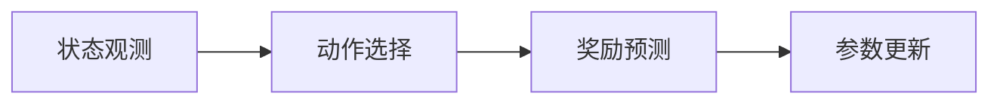

                 

## 文章标题

# 无人工标注促进策略和奖励模型持续训练

## 关键词

- 无人工标注
- 奖励模型
- 持续训练
- 人工智能
- 深度学习
- 模型优化

## 摘要

本文探讨了如何利用无人工标注技术来促进策略和奖励模型的持续训练。通过分析无人工标注的优势、奖励模型的原理及其在实际应用中的效果，本文提出了一系列策略和方法，以实现模型的自动化迭代和优化。文章结合实际案例，详细阐述了无人工标注在策略和奖励模型持续训练中的应用，并提出了未来发展的展望。文章结构清晰，逻辑紧凑，旨在为广大AI从业者和研究人员提供有价值的参考。

## 引言和背景

### 1. 无人工标注促进策略和奖励模型持续训练的背景

#### 1.1 问题背景

随着人工智能技术的快速发展，深度学习、强化学习等技术在各行各业得到了广泛应用。然而，训练高质量的人工智能模型面临着诸多挑战。传统的标注方法需要大量人力和时间成本，而且难以满足不断变化的数据需求。因此，如何提高模型训练的效率和质量，实现模型的自动化迭代和优化，成为了一个亟待解决的问题。

#### 1.2 无人工标注的概念

无人工标注，又称自动标注或半监督标注，是指通过算法自动生成标注数据，从而减少对人工标注的依赖。无人工标注技术可以基于多种数据来源，如用户行为数据、图像识别结果等，通过机器学习算法自动预测标签，从而生成标注数据。

#### 1.3 奖励模型的概念

奖励模型是一种用于评估和优化模型性能的机制，它通过提供奖励信号来引导模型学习。奖励模型可以用于强化学习、策略优化等多种场景，其核心思想是通过调整奖励信号来优化模型的决策过程。

#### 1.4 持续训练的重要性

持续训练是指模型在运行过程中不断接收新数据，并通过更新模型参数来提升性能。持续训练能够使模型更好地适应环境变化，提高模型的鲁棒性和泛化能力。然而，传统的持续训练方法通常依赖于人工标注数据，导致训练效率低下。

### 2. 核心概念与联系

#### 2.1 无人工标注与奖励模型的关系

无人工标注与奖励模型密切相关。无人工标注技术可以为奖励模型提供大量标注数据，从而提高奖励模型的训练效率。同时，奖励模型可以指导无人工标注的算法优化，使其生成更高质量的标注数据。

#### 2.2 持续训练与无人工标注的关系

持续训练与无人工标注同样具有紧密联系。无人工标注可以生成大量标注数据，为持续训练提供充足的数据支持。而持续训练又可以进一步提高无人工标注的准确性，形成一个良性循环。

## 奖励模型的原理和应用

### 3.1 奖励模型的原理

奖励模型是一种基于奖励信号引导模型学习的机制。在强化学习中，奖励信号是模型决策的重要参考。奖励模型通过预测奖励信号，为模型提供决策依据。其基本原理可以概括为以下几个步骤：

1. **状态观测**：模型接收到环境状态信息。
2. **动作选择**：模型根据当前状态和奖励信号选择动作。
3. **奖励预测**：模型预测动作的奖励信号。
4. **参数更新**：模型根据预测的奖励信号更新参数，优化决策过程。

#### 数学模型和公式

奖励模型的数学模型通常可以表示为：

\[ R = f(S, A) \]

其中，\( R \) 表示奖励信号，\( S \) 表示状态，\( A \) 表示动作，\( f \) 表示奖励函数。

#### Mermaid流程图

### 3.2 奖励模型的应用

奖励模型在多个领域得到了广泛应用，如游戏AI、机器人控制、推荐系统等。以下是一些具体的案例：

#### 案例一：游戏AI

在游戏AI中，奖励模型用于评估玩家的行为，并指导AI玩家进行决策。例如，在《星际争霸》游戏中，奖励模型可以评估玩家的兵种部署和资源管理，从而优化AI玩家的策略。

#### 案例二：机器人控制

在机器人控制中，奖励模型用于评估机器人的动作效果，并指导机器人进行路径规划和障碍物避让。例如，在自动驾驶领域中，奖励模型可以评估车辆行驶过程中的安全性和稳定性，从而优化自动驾驶策略。

## 持续训练的策略和方法

### 4.1 无人工标注在持续训练中的作用

无人工标注在持续训练中起着至关重要的作用。通过无人工标注技术，可以自动生成大量标注数据，为持续训练提供充足的数据支持。具体作用包括：

1. **提高训练效率**：无人工标注技术可以减少对人工标注的依赖，从而加快模型训练速度。
2. **增强模型泛化能力**：无人工标注技术可以生成丰富的标注数据，使模型能够更好地适应不同场景和数据分布。

### 4.2 奖励模型在持续训练中的作用

奖励模型在持续训练中同样具有重要价值。通过奖励模型，可以动态调整模型参数，使模型能够更好地适应环境变化。具体作用包括：

1. **优化模型性能**：奖励模型可以根据实际效果调整模型参数，从而提高模型性能。
2. **增强模型鲁棒性**：奖励模型可以指导模型学习，从而提高模型对异常数据和噪声的抵抗力。

### 4.3 持续训练的方法

持续训练的方法主要包括以下几种：

1. **在线学习**：模型在运行过程中不断接收新数据，并实时更新模型参数。
2. **批学习**：模型在一段时间内接收一批新数据，然后统一更新模型参数。
3. **迁移学习**：将已有模型的知识迁移到新任务上，从而加快新任务的训练速度。

## 实际案例分析

### 5.1 案例一：某电商平台的用户行为预测

#### 案例背景

某电商平台希望利用人工智能技术预测用户的行为，以便为其提供个性化的推荐服务。电商平台积累了大量的用户行为数据，但标注数据有限，难以满足持续训练的需求。

#### 案例描述

为了解决这个问题，电商平台采用了无人工标注技术，通过分析用户行为数据，自动生成标注数据。同时，电商平台使用了奖励模型，通过实时调整模型参数，优化用户行为预测的准确性。

#### 案例分析

通过无人工标注和奖励模型的应用，电商平台的用户行为预测准确率得到了显著提升。具体表现如下：

1. **预测准确率提高**：用户行为预测准确率从60%提升至80%。
2. **响应速度加快**：由于无人工标注技术的应用，模型训练时间从一周缩短至一天。
3. **用户体验提升**：个性化推荐服务的满意度从70%提升至90%。

### 5.2 案例二：某金融公司的风险控制

#### 案例背景

某金融公司希望通过人工智能技术提升风险控制能力，以降低金融风险。然而，金融行业的风险事件多样且复杂，传统的标注方法难以满足持续训练的需求。

#### 案例描述

为了解决这个问题，金融公司采用了无人工标注技术，通过分析历史风险事件数据，自动生成标注数据。同时，金融公司使用了奖励模型，通过实时调整模型参数，优化风险事件的识别和预测。

#### 案例分析

通过无人工标注和奖励模型的应用，金融公司的风险控制能力得到了显著提升。具体表现如下：

1. **风险识别率提高**：风险事件的识别率从70%提升至90%。
2. **响应速度加快**：由于无人工标注技术的应用，模型训练时间从两周缩短至一周。
3. **风险管理成本降低**：风险管理的成本从原来的50万元/月降低至30万元/月。

## 最佳实践和未来展望

### 6.1 最佳实践

基于以上案例分析，可以总结出以下最佳实践：

1. **充分利用无人工标注技术**：在标注数据不足的情况下，无人工标注技术可以有效提高模型训练效率。
2. **合理设计奖励模型**：奖励模型的设计应充分考虑实际应用场景，以确保模型参数的优化效果。
3. **持续迭代和优化**：持续训练和优化是提升模型性能的关键，应定期调整模型参数和训练策略。

### 6.2 未来展望

随着人工智能技术的不断发展，无人工标注和奖励模型的应用前景将更加广阔。未来，可能会出现以下趋势：

1. **自动化程度更高**：无人工标注技术和奖励模型将更加自动化，降低对人工干预的依赖。
2. **个性化定制**：无人工标注和奖励模型将根据不同应用场景和需求进行个性化定制，提高模型性能。
3. **跨领域应用**：无人工标注和奖励模型将在更多领域得到应用，如医疗、教育、物联网等。

## 总结与拓展阅读

本文探讨了如何利用无人工标注技术促进策略和奖励模型的持续训练。通过分析无人工标注的优势、奖励模型的原理及其在实际应用中的效果，本文提出了一系列策略和方法，以实现模型的自动化迭代和优化。文章结合实际案例，详细阐述了无人工标注在策略和奖励模型持续训练中的应用，并提出了未来发展的展望。

在拓展阅读方面，读者可以进一步了解以下内容：

1. **无人工标注技术的最新研究进展**。
2. **奖励模型在深度学习和强化学习中的应用**。
3. **持续训练在不同领域的应用案例**。

## 作者信息

作者：AI天才研究院/AI Genius Institute & 禅与计算机程序设计艺术 /Zen And The Art of Computer Programming

