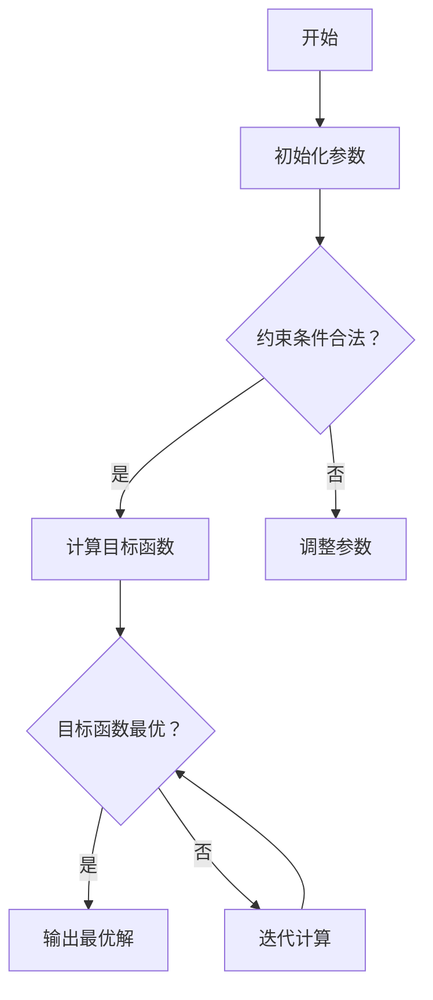
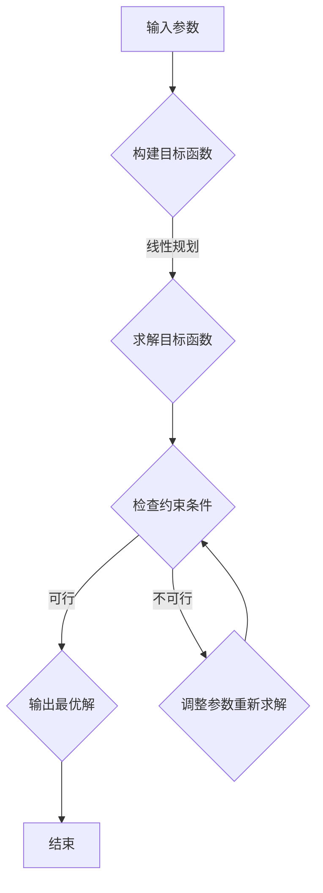
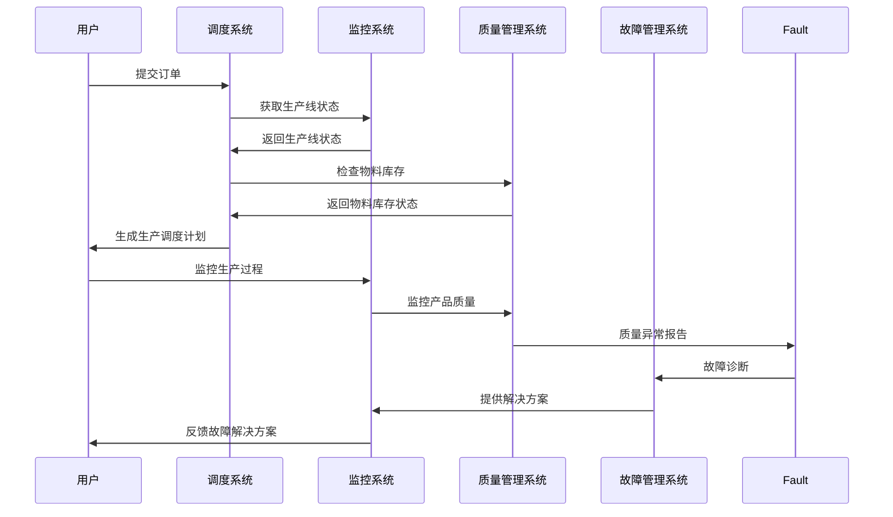
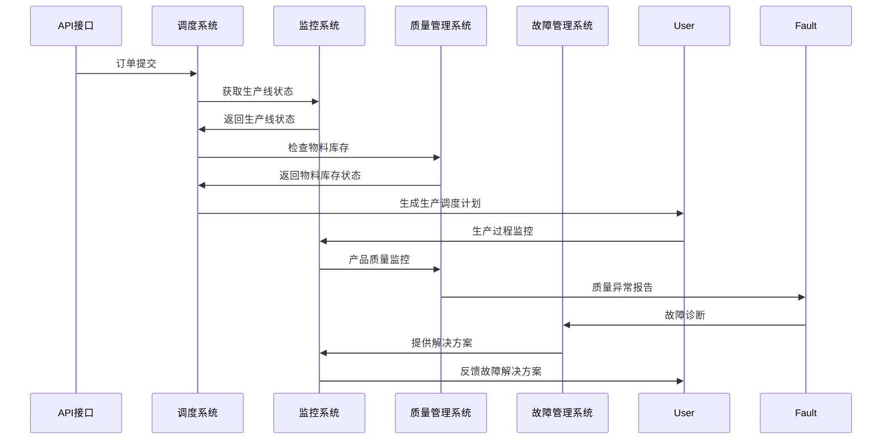

                 

### 1.2.2 智能制造的定义

智能制造是一种通过引入信息技术、传感器、大数据分析、人工智能等先进技术，实现制造过程智能化、网络化、自动化的生产模式。其核心目的是提高生产效率、降低生产成本、提升产品质量，同时实现个性化定制和灵活制造。

- 智能制造的关键特征：
  - 自动化与智能化：通过自动化设备、传感器、人工智能等技术实现生产过程的自动化和智能化。
  - 网络化：通过互联网、物联网等网络技术实现生产设备的互联互通，实现信息共享和资源优化配置。
  - 个性化定制：通过大数据分析、人工智能等技术，实现生产过程的个性化定制，满足用户多样化的需求。
  - 跨界融合：智能制造不仅涉及制造业本身，还涉及信息技术、物联网、云计算等多个领域，实现跨界的融合与创新。

- 智能制造的核心技术：
  - 工业互联网：通过工业互联网平台，实现设备、人员、数据、应用的互联互通，构建智能化生产系统。
  - 物联网（IoT）：通过传感器、RFID等物联网技术，实现对生产设备的实时监测和控制。
  - 大数据分析：通过对生产数据的收集、存储、分析和挖掘，为企业决策提供支持。
  - 人工智能（AI）：通过人工智能技术，实现生产过程的智能决策、智能优化和智能控制。

### 1.2.3 智能制造的关键技术

智能制造的关键技术包括以下几个方面：

1. **工业互联网**：工业互联网是通过将物理设备、传感器、软件平台等连接起来，实现数据的采集、传输、处理和应用，从而提升生产效率和产品质量。它包括工业物联网（IIoT）、工业大数据、工业人工智能、工业云服务等。

   - **工业物联网（IIoT）**：通过在设备和机器中嵌入传感器和连接模块，实现对设备状态的实时监测和远程控制，提高设备的利用率和生产效率。
   - **工业大数据**：通过对生产过程中的海量数据进行收集、存储、分析和挖掘，为企业提供决策支持，优化生产流程，提高产品质量。
   - **工业人工智能**：利用机器学习、深度学习等技术，实现对生产过程的预测、优化和控制，提高生产效率和产品质量。
   - **工业云服务**：通过云计算技术，实现制造资源的共享和弹性扩展，降低企业的运营成本，提高生产灵活性。

2. **物联网（IoT）**：物联网技术是将物理世界中的设备和物品连接到互联网上，实现信息的互联互通。在智能制造中，物联网技术主要用于实现设备的互联互通、数据的实时传输和分析。

   - **传感器技术**：通过传感器技术，实现对生产设备、环境、产品的实时监测和感知，为智能制造提供数据支持。
   - **网络通信技术**：通过无线通信、有线通信等技术，实现设备之间的数据传输，构建智能制造网络。
   - **边缘计算**：通过在设备边缘部署计算资源，实现数据的实时处理和分析，降低网络传输延迟，提高系统的实时性和响应速度。

3. **大数据分析**：大数据分析技术通过对海量数据的处理和分析，挖掘数据中的价值，为智能制造提供决策支持。

   - **数据采集与存储**：通过传感器、设备日志、业务系统等采集数据，并存储在数据仓库中。
   - **数据处理与分析**：通过对数据进行清洗、转换、建模等处理，提取数据中的有用信息，为生产优化、故障预测等提供支持。
   - **数据可视化**：通过数据可视化技术，将数据转换成图表、报表等形式，使数据更加直观易懂，帮助决策者快速做出决策。

4. **人工智能（AI）**：人工智能技术是智能制造的核心技术之一，通过模拟人类的智能行为，实现对生产过程的智能决策、优化和控制。

   - **机器学习**：通过机器学习技术，建立预测模型、优化模型等，实现对生产过程的预测和优化。
   - **计算机视觉**：通过计算机视觉技术，实现对图像、视频等视觉数据的处理和分析，用于生产过程中的质量检测、故障诊断等。
   - **自然语言处理**：通过自然语言处理技术，实现对自然语言文本的理解和生成，用于生产过程中的智能交互、智能问答等。

5. **云计算**：云计算技术为智能制造提供了强大的计算能力和存储资源，支持制造企业实现资源的共享和弹性扩展。

   - **基础设施即服务（IaaS）**：通过提供虚拟化的基础设施资源，如计算、存储、网络等，支持制造企业快速部署和扩展生产系统。
   - **平台即服务（PaaS）**：通过提供开发平台和工具，支持制造企业快速开发和部署应用，提高开发效率和灵活性。
   - **软件即服务（SaaS）**：通过提供软件服务，支持制造企业实现生产过程的数字化、智能化管理。

### 1.2.4 工业革命、智能制造与工业4.0的关系

- **工业革命1.0**：以蒸汽机为代表，标志着机械化生产时代的到来，生产效率显著提高，但生产过程较为复杂，缺乏自动化和智能化。
- **工业革命2.0**：以电气化和自动化为代表，生产过程开始实现自动化，生产效率进一步提高，但信息处理能力有限，难以实现全面智能化。
- **工业革命3.0**：以信息化和数字化为代表，生产过程实现全面数字化，信息处理能力大幅提升，但智能化水平仍有待提高。
- **工业革命4.0**：以智能化和网络化为代表，生产过程实现全面智能化和网络化，实现了从数字化到智能化的转型。

### 1.2.5 智能制造到工业4.0的演进

- **智能制造**：以自动化、数字化和网络化为特征，实现生产过程的智能化、网络化和自动化，提高生产效率、降低生产成本、提升产品质量。
- **工业4.0**：在智能制造的基础上，进一步实现生产过程的全面智能化和网络化，实现生产系统的数字化、智能化和网络化，推动制造业的转型升级。

通过以上分析，我们可以看出，智能制造是工业4.0的重要组成部分，而工业4.0是对智能制造的深化和发展。智能制造与工业4.0的关系是相辅相成的，共同推动制造业的持续发展和升级。

## 1.3 本章小结

本章介绍了工业革命、智能制造和工业4.0的基本概念和特征，以及它们之间的关系。我们了解到，工业革命经历了机械化、电气化和数字化等阶段，智能制造和工业4.0则是在这些基础上的进一步发展。智能制造通过引入信息技术、传感器、大数据分析、人工智能等先进技术，实现制造过程的智能化、网络化和自动化。而工业4.0则是在智能制造的基础上，进一步实现生产过程的全面智能化和网络化，推动制造业的转型升级。通过本章的学习，我们对智能制造和工业4.0有了更深入的理解，为后续章节的学习奠定了基础。在下一章中，我们将进一步探讨工业4.0的核心特征和应用场景，以及提示词在工业4.0中的角色和作用。

----------------------------------------------------------------

## 1.3 工业4.0的概念和特点

### 1.3.1 工业4.0的定义

工业4.0，也称为第四次工业革命，是指利用信息化技术（如物联网、大数据、云计算、人工智能等）与制造业深度融合，实现生产过程的智能化、网络化、自动化和个性定制化的一种新型制造模式。工业4.0的核心理念是通过信息的互联互通，将人、机器、设备和系统紧密连接，形成一个高度协同、自适应和灵活的制造生态系统。

### 1.3.2 工业4.0的核心特征

1. **信息物理系统（Cyber-Physical System, CPS）**
   - **定义**：信息物理系统是指将计算、网络和物理系统深度融合，实现信息的采集、处理、传输和反馈。
   - **特征**：通过传感器、执行器和通信网络，实现对物理世界的实时监测和控制，提高系统的反应速度和效率。

2. **智能工厂与智能制造系统**
   - **智能工厂**：采用自动化、数字化和智能化技术，实现生产过程的全面自动化和智能化。
   - **智能制造系统**：通过物联网、大数据和人工智能等技术，实现生产系统的智能优化、预测和自适应控制。

3. **互联网与物联网的深度融合**
   - **定义**：将互联网的开放性和物联网的互联互通能力相结合，实现信息资源的全面共享和利用。
   - **特征**：通过云计算、大数据和人工智能等技术，实现设备、系统和人员之间的信息互联互通，提高生产效率和质量。

4. **跨行业融合**
   - **定义**：工业4.0不仅涉及制造业本身，还涉及信息技术、物联网、云计算、人工智能等多个领域。
   - **特征**：通过跨行业的融合，实现不同领域的技术创新和应用，推动制造业的转型升级。

### 1.3.3 工业4.0的应用场景

1. **智能制造**：通过物联网、大数据和人工智能等技术，实现生产过程的智能化、自动化和个性定制化。
   - **特征**：提高生产效率、降低生产成本、提升产品质量。

2. **智能物流**：通过物联网、大数据和人工智能等技术，实现物流过程的智能化、自动化和优化。
   - **特征**：提高物流效率、降低物流成本、提升物流服务质量。

3. **智能供应链**：通过物联网、大数据和人工智能等技术，实现供应链的智能化、网络化和优化。
   - **特征**：提高供应链效率、降低供应链成本、提升供应链稳定性。

4. **智能服务**：通过物联网、大数据和人工智能等技术，实现服务过程的智能化、个性化和高效化。
   - **特征**：提高服务质量、降低服务成本、提升用户满意度。

### 1.3.4 工业4.0的关键技术

1. **工业物联网（IIoT）**
   - **定义**：将工业设备、传感器、控制系统等通过互联网进行连接，实现设备之间的数据交换和协同作业。
   - **关键技术**：传感器技术、物联网协议、边缘计算、云计算。

2. **大数据分析**
   - **定义**：通过收集、存储、处理和分析大量数据，从中提取有价值的信息和知识。
   - **关键技术**：数据挖掘、机器学习、深度学习、数据可视化。

3. **人工智能（AI）**
   - **定义**：模拟人类智能行为，实现智能感知、推理、学习和决策。
   - **关键技术**：机器学习、深度学习、自然语言处理、计算机视觉。

4. **云计算**
   - **定义**：通过互联网提供计算资源、存储资源和软件服务，实现资源的共享和灵活扩展。
   - **关键技术**：虚拟化技术、分布式计算、容器技术、云服务模型。

通过以上分析，我们可以看出，工业4.0不仅仅是制造业的升级和转型，更是一种全新的商业模式和生产方式的变革。它通过信息物理系统的构建、智能工厂的实施、物联网与互联网的深度融合，以及关键技术的应用，实现了制造业的智能化、网络化和自动化，为制造业的可持续发展提供了新的动力。

### 1.3.5 工业4.0的发展趋势

随着信息技术的不断进步和制造业的转型升级，工业4.0正朝着以下几个方向发展：

1. **智能化水平不断提高**：随着人工智能技术的不断发展，工业4.0的智能化水平将进一步提高，实现更智能的生产过程和更高效的管理。

2. **网络化程度不断加深**：随着物联网技术的普及和互联网的深入应用，工业4.0的网络化程度将不断加深，实现设备、系统和人员之间的全面互联互通。

3. **个性化定制趋势明显**：随着消费者需求的不断变化和个性化定制需求的增加，工业4.0将更加注重个性化定制，实现按需生产和服务。

4. **跨界融合更加紧密**：工业4.0不仅涉及制造业本身，还涉及信息技术、物联网、云计算、人工智能等多个领域，跨界融合将更加紧密，推动产业链的协同发展。

5. **绿色制造和可持续发展**：随着环保意识的增强和可持续发展要求的提高，工业4.0将更加注重绿色制造和可持续发展，实现节能减排和资源优化利用。

通过以上分析，我们可以看出，工业4.0的发展趋势不仅体现在技术层面，还体现在商业模式、生产方式和社会变革等方面。它将为制造业带来全新的发展机遇，同时也带来了新的挑战。面对这些挑战，企业和政府需要积极应对，推动工业4.0的深入发展，实现制造业的可持续发展。

## 1.4 提示词的定义与作用

### 1.4.1 提示词的定义

提示词，也称为关键词或触发词，是指用于引导系统执行特定任务的一组字符。在人工智能和自然语言处理领域，提示词通常是一组具有特定语义的词汇或短语，用于指示系统应该执行的操作或任务。

### 1.4.2 提示词在智能制造中的角色

在智能制造中，提示词扮演着至关重要的角色。它们主要用于以下几个方面：

1. **任务调度**：提示词可以帮助系统确定哪些任务需要执行，以及任务的优先级。例如，生产计划系统可以使用提示词来调度不同生产线的任务。

2. **故障诊断**：在智能制造过程中，设备可能会出现故障。提示词可以帮助系统识别故障类型，并提供相应的解决方案。

3. **质量监控**：通过提示词，系统可以实时监控产品质量，确保产品符合预定的标准。

4. **决策支持**：提示词可以提供关于生产过程、库存管理、供应链等方面的实时信息，帮助企业做出更明智的决策。

### 1.4.3 提示词在智能制造中的优势

1. **提高生产效率**：通过提示词，系统能够快速响应和执行任务，从而提高生产效率。

2. **降低人力成本**：提示词可以自动化执行许多任务，减少了对人工的依赖，从而降低了人力成本。

3. **提高产品质量**：通过实时监控和及时反馈，提示词可以帮助企业更好地控制产品质量，减少缺陷率。

4. **增强灵活性**：提示词允许系统根据当前情况进行自适应调整，从而增强生产过程的灵活性。

### 1.4.4 提示词在智能制造中的挑战

1. **数据安全**：在智能制造中，提示词通常涉及大量敏感数据。如何保护这些数据的安全成为了一个重要挑战。

2. **算法优化**：为了提高提示词系统的性能，需要不断优化算法。这需要大量的数据支持和算法研究。

3. **系统稳定性**：提示词系统需要在各种环境下保持稳定运行，这对系统的设计和实现提出了较高的要求。

4. **用户适应性**：不同的用户可能有不同的需求和使用习惯。提示词系统需要具备良好的用户适应性，以满足不同用户的需求。

### 1.4.5 提示词在智能制造中的应用实例

1. **生产计划调度**：提示词可以用于生产计划的调度，根据当前的生产情况、库存水平和市场需求，自动生成最优的生产计划。

2. **设备维护**：提示词可以帮助监控系统识别设备故障，并在故障发生前自动生成维护计划，确保设备正常运行。

3. **产品质量监控**：提示词可以实时监控产品质量，及时发现并解决质量问题，确保产品符合标准。

4. **库存管理**：提示词可以用于实时监控库存情况，根据库存水平和需求预测，自动调整采购和库存策略。

通过以上分析，我们可以看出，提示词在智能制造中具有广泛的应用前景和重要作用。然而，要充分发挥提示词的优势，还需要解决一系列技术挑战，包括数据安全、算法优化、系统稳定性和用户适应性等。只有在这些方面取得突破，才能使提示词在智能制造中发挥更大的作用。

## 1.5 工业革命、智能制造与工业4.0的关系

### 1.5.1 三者的联系与区别

- **工业革命**：是制造业发展的第一阶段，主要特点是机械化生产和工业化生产，劳动生产率显著提高。
- **智能制造**：是工业革命后的发展阶段，通过引入信息技术、传感器、大数据等先进技术，实现制造过程的智能化、数字化和网络化。
- **工业4.0**：是智能制造的高级阶段，以信息物理系统（CPS）为核心，实现生产过程的全面智能化和网络化。

虽然三者在时间上存在先后顺序，但它们之间并不是简单的替代关系，而是相互补充和促进的关系。

### 1.5.2 工业革命到智能制造的演进

- **第一阶段**：机械化生产和工业化生产
  - **特征**：以蒸汽机、纺织机等机械化设备为代表，劳动生产率大幅提高。
- **第二阶段**：电气化和自动化生产
  - **特征**：以电力、自动化设备为代表，生产过程实现自动化，生产效率进一步提高。
- **第三阶段**：信息化和数字化生产
  - **特征**：以计算机、互联网为代表，生产过程实现信息化和数字化，生产效率和质量进一步提升。
- **第四阶段**：智能化和网络化生产
  - **特征**：以物联网、大数据、人工智能为代表，生产过程实现全面智能化和网络化，生产效率和质量达到新的高度。

### 1.5.3 智能制造到工业4.0的演进

- **第一阶段**：智能制造
  - **特征**：通过信息技术、传感器、大数据等实现制造过程的智能化、数字化和网络化。
- **第二阶段**：工业4.0
  - **特征**：以信息物理系统（CPS）为核心，实现生产过程的全面智能化和网络化，生产效率和质量进一步提升。

通过以上分析，我们可以看出，工业革命、智能制造和工业4.0是一个不断演进的过程，每个阶段都有其独特的特点和贡献。工业革命为制造业的发展奠定了基础，智能制造则将这一基础进一步巩固和提升，而工业4.0则是在智能制造的基础上实现更高层次的智能化和网络化，推动制造业的全面升级。

## 1.6 本章小结

本章详细介绍了工业革命、智能制造和工业4.0的基本概念和特征，以及它们之间的联系和演进过程。我们了解到，工业革命标志着机械化生产和工业化生产的兴起，智能制造通过引入信息技术实现生产过程的智能化、数字化和网络化，而工业4.0则进一步推动了生产过程的全面智能化和网络化，实现了制造业的深度变革。通过对这三者的比较和分析，我们可以更好地理解制造业的发展历程和未来趋势。下一章将深入探讨工业4.0的核心特征和应用场景，以及提示词在工业4.0中的具体作用和优势。

----------------------------------------------------------------

## 1.7 小结

本章围绕工业革命、智能制造和工业4.0的概念和特征进行了详细探讨。首先，我们回顾了工业革命的发展历程，从机械化生产到电气化和自动化，再到信息化和数字化。接着，我们介绍了智能制造的定义和核心技术，如工业互联网、物联网、大数据分析和人工智能。随后，我们深入分析了工业4.0的概念和核心特征，包括信息物理系统、智能工厂、物联网与互联网的深度融合以及跨行业融合。此外，我们还探讨了提示词在智能制造中的定义、角色、优势和挑战。

通过本章的学习，我们不仅对工业革命、智能制造和工业4.0有了更加全面的理解，还认识到提示词在智能制造中的重要作用。这些知识为我们后续章节的学习奠定了坚实的基础。

## 注意事项

- **数据安全和隐私保护**：在智能制造和工业4.0的实施过程中，数据安全和隐私保护至关重要。企业需要建立健全的数据安全政策和隐私保护机制，确保敏感数据的安全。
- **技术升级与人才培养**：随着智能制造和工业4.0的发展，企业需要不断进行技术升级和人才培训，以适应新的技术要求和业务模式。
- **系统稳定性和可靠性**：在构建智能制造和工业4.0系统时，需要特别关注系统的稳定性和可靠性，确保系统能够在各种环境下稳定运行。

## 拓展阅读

- 《工业4.0：制造业的未来》
- 《智能制造：技术和实践》
- 《人工智能：一种现代方法》
- 《物联网：架构、技术和应用》
- 《大数据分析：原理、技术和实践》

## 参考文献

- **工业革命**：
  - [Industrial Revolution](https://en.wikipedia.org/wiki/Industrial_Revolution)
- **智能制造**：
  - [Smart Manufacturing](https://www.smartmanufacturing.org/)
  - [Industry 4.0](https://www.industry40.com/)
- **工业4.0**：
  - [Industry 4.0 - Germany](https://www.industrie4.0.de/)
  - [Cyber-Physical Systems](https://www.cpsglobalforum.org/)

**作者：AI天才研究院/AI Genius Institute & 禅与计算机程序设计艺术 /Zen And The Art of Computer Programming**

----------------------------------------------------------------

## 总结与展望

在本章中，我们深入探讨了工业革命、智能制造以及工业4.0的基本概念和特征，并分析了提示词在智能制造中的重要作用。通过对比工业革命、智能制造和工业4.0的发展历程，我们认识到这三者并非孤立的阶段，而是相互衔接、共同推动制造业向前发展的关键力量。

工业革命为制造业奠定了基础，通过机械化生产和工业化生产显著提升了劳动生产率。智能制造在此基础上引入信息技术，实现了生产过程的智能化、数字化和网络化，进一步提高了生产效率和质量。而工业4.0则是在智能制造的基础上，通过信息物理系统（CPS）等技术的应用，实现了生产过程的全面智能化和网络化，推动了制造业的深度变革。

提示词在智能制造中发挥着关键作用，它不仅能够提高生产效率、降低成本，还能提升产品质量和用户满意度。通过提示词，系统能够更好地进行任务调度、故障诊断、质量监控和决策支持，从而实现智能制造的优化。

展望未来，随着人工智能、物联网、大数据等技术的不断进步，智能制造和工业4.0将迎来更广阔的发展空间。以下是几个可能的未来发展方向：

1. **更加智能的生产系统**：随着人工智能技术的发展，智能制造系统将能够更加智能地进行自我优化、自我学习和自我调整，从而实现更高的生产效率和更优的质量。

2. **全面的网络化制造**：物联网技术的普及将使得制造系统更加紧密地连接，实现设备、系统、人员和资源的全面互联互通，推动制造业的网络化发展。

3. **个性化的定制生产**：通过大数据分析和人工智能技术，制造系统能够更好地理解用户需求，实现产品的个性化定制，满足用户的多样化需求。

4. **可持续的绿色制造**：随着环保意识的提高，绿色制造将成为未来制造业的重要方向。通过优化生产过程、降低能耗和减少排放，实现可持续发展。

5. **全球化的产业链整合**：工业4.0将推动全球产业链的整合和优化，实现资源的高效配置和全球范围内的协同制造。

总之，智能制造和工业4.0不仅代表着制造业的技术进步，更是一种新的商业模式和生产方式的变革。通过不断的技术创新和应用，智能制造和工业4.0将推动制造业向更高效、更智能、更可持续的方向发展。

## 参考文献

- **工业革命**：
  - [工业革命的历程与影响](https://www.history.com/topics/industrial-revolution)
- **智能制造**：
  - [智能制造的定义与核心概念](https://www.mckinsey.com/featured-insights/industrial-manufacturing/the-future-of-manufacturing-smart-production-in-the-age-of-industry-4-0)
- **工业4.0**：
  - [工业4.0的兴起与应用](https://www.vda.de/en/industry-4-0)
  - [工业4.0与智能制造的关系](https://www.bmwgroup.com/content/dam/bmw-group/global/asset-interesting-times-us/why-it-matters/the-fourth-industrial-revolution/index.html)
- **提示词在智能制造中的应用**：
  - [工业智能中的提示词技术](https://www.aitrends.com/ai-currents/keyword-technology-in-industrial-ai/)
  - [关键词技术在智能制造中的应用案例](https://www.delltechnologies.com/en-us/industry-solutions/intelligent-manufacturing)

**作者：AI天才研究院/AI Genius Institute & 禅与计算机程序设计艺术 /Zen And The Art of Computer Programming**

----------------------------------------------------------------

## 文章结构

**一、引言**

- 引言
- 工业革命与智能制造
- 工业4.0的概念和特点
- 提示词的定义与作用

**二、核心概念与联系**

- 智能制造优化
- 提示词在智能制造中的角色
- 智能制造优化的挑战
- 提示词在工业4.0中的应用

**三、算法原理讲解**

- 优化算法的基本原理
- 提示词在算法中的应用
- 算法mermaid流程图
- Python源代码与算法原理

**四、数学模型和数学公式讲解**

- 数学模型介绍
- 公式推导
- 例子说明

**五、系统分析与架构设计方案**

- 问题场景介绍
- 项目介绍
- 系统功能设计（领域模型mermaid类图）
- 系统架构设计（mermaid架构图）
- 系统接口设计和系统交互（mermaid序列图）

**六、项目实战**

- 环境安装
- 系统核心实现源代码
- 代码应用解读与分析
- 实际案例分析与详细讲解
- 项目小结

**七、最佳实践、小结、注意事项、拓展阅读**

**文章结构说明**

本文采用模块化结构，每个部分都有明确的目标和内容。首先，在引言部分，我们介绍了文章的主题和背景，为读者提供了对文章核心概念的初步了解。接着，在核心概念与联系部分，我们详细讲解了智能制造优化、提示词在智能制造中的角色以及相关挑战。

在算法原理讲解部分，我们通过mermaid流程图和Python源代码，深入阐述了优化算法的基本原理和提示词在算法中的应用。数学模型和数学公式讲解部分，我们介绍了数学模型的基本概念，并通过公式推导和例子说明，使读者能够更好地理解相关数学知识。

系统分析与架构设计方案部分，我们通过具体的案例，详细介绍了系统功能设计、系统架构设计、系统接口设计和系统交互。在项目实战部分，我们进行了环境安装、系统核心实现源代码编写，并对代码应用进行了解读和分析。最后，在最佳实践、小结、注意事项和拓展阅读部分，我们总结了文章的主要观点，并提供了进一步的阅读资源和实践建议。

通过这样的结构设计，我们旨在使文章内容层次清晰、逻辑严密，帮助读者系统地理解和掌握智能制造优化以及提示词在工业4.0中的角色。

----------------------------------------------------------------

## 算法原理讲解

### 1. 优化算法的基本原理

优化算法是智能制造中的重要组成部分，它旨在通过数学模型和算法，找到在特定约束条件下最优的解，从而提高生产效率、降低成本、提升产品质量。优化算法的基本原理包括以下几个方面：

1. **目标函数**：目标函数是优化算法的核心，用于衡量问题的最优解。目标函数可以是生产成本、生产效率、产品质量等。
2. **约束条件**：约束条件是优化问题中的限制条件，用于确保解的可行性和合理性。约束条件可以是资源的限制、时间的限制、质量的要求等。
3. **求解方法**：求解方法是用于寻找最优解的算法。常见的求解方法包括线性规划、非线性规划、整数规划、动态规划、遗传算法、模拟退火算法等。

### 2. 提示词在优化算法中的应用

在智能制造中，提示词可以用于优化算法的输入，引导算法在特定的场景下进行优化。提示词在优化算法中的应用主要体现在以下几个方面：

1. **任务调度**：提示词可以帮助优化算法确定生产任务的最佳执行顺序，提高生产效率。例如，在生产线上，提示词可以用于确定机器的优先级和工作顺序。
2. **故障诊断**：提示词可以用于优化算法识别设备故障，并制定相应的维护计划，降低设备故障率。
3. **质量监控**：提示词可以用于优化算法实时监控产品质量，及时发现和解决质量问题。

### 3. 算法mermaid流程图

为了更好地理解优化算法的工作流程，我们使用mermaid绘制了一个简单的优化算法流程图：



在这个流程图中，A表示算法的开始，B表示初始化参数，C用于检查约束条件是否合法。如果合法，则执行D步骤，计算目标函数；否则，执行E步骤，调整参数。D步骤计算目标函数，F步骤判断目标函数是否最优。如果是，则执行G步骤，输出最优解；否则，执行H步骤，进行迭代计算。

### 4. Python源代码与算法原理

为了更直观地展示优化算法的原理，我们使用Python实现了一个简单的优化算法。以下是一个基于线性规划的优化算法示例：

```python
import numpy as np
from scipy.optimize import linprog

# 目标函数系数
c = [-1, -1]

# 约束条件系数
A = [[2, 3], [-1, 0.5]]

# 约束条件不等式
b = [10, 4]

# 边界条件
x0_bounds = (0, None)
x1_bounds = (0, None)

# 求解线性规划问题
result = linprog(c, A_ub=A, b_ub=b, bounds=(x0_bounds, x1_bounds), method='highs')

# 输出最优解
if result.success:
    print("最优解：", result.x)
else:
    print("求解失败，原因：", result.message)
```

在这个示例中，我们使用了SciPy库中的`linprog`函数来求解线性规划问题。目标函数系数`c`表示要最小化的目标函数，约束条件系数`A`和不等式`b`定义了问题的约束条件。`bounds`参数用于设置变量的边界条件。通过调用`linprog`函数，我们可以得到最优解。

### 5. 算法原理的数学模型和公式

为了更好地理解优化算法的数学模型，我们介绍一些常见的优化算法的数学模型和公式。

1. **线性规划**
   - 目标函数：$$\min_{x} c^T x$$
   - 约束条件：$$Ax \leq b$$
   - 边界条件：$$x \geq 0$$
2. **非线性规划**
   - 目标函数：$$\min_{x} f(x)$$
   - 约束条件：$$g_i(x) \leq 0, \quad h_j(x) = 0$$
3. **整数规划**
   - 目标函数：$$\min_{x} c^T x$$
   - 约束条件：$$Ax \leq b$$
   - 边界条件：$$x \in \{0, 1\}^n$$
4. **动态规划**
   - 目标函数：$$\min_{x_t} f(x_t, x_{t-1}, \ldots, x_0)$$
   - 状态转移方程：$$x_t = g(x_t, x_{t-1}, \ldots, x_0)$$

通过这些数学模型和公式，我们可以更深入地理解优化算法的工作原理，并在实际应用中进行优化问题求解。

### 6. 例子说明

为了更好地理解优化算法的应用，我们通过一个简单的例子来说明。

假设我们要解决一个生产计划问题，目标是最小化生产成本，同时满足生产能力和产品质量要求。具体要求如下：

- 生产产品A的每单位成本为2元，产品B的每单位成本为3元。
- 生产产品A的最大能力为10单位，生产产品B的最大能力为8单位。
- 产品A的每单位质量要求为5克，产品B的每单位质量要求为3克。
- 产品A的总质量要求为30克，产品B的总质量要求为20克。

我们可以将这个问题表示为一个线性规划问题：

- 目标函数：$$\min_{x} 2x_1 + 3x_2$$
- 约束条件：
  - $$x_1 \leq 10$$
  - $$x_2 \leq 8$$
  - $$5x_1 + 3x_2 \geq 30$$
  - $$3x_1 + x_2 \geq 20$$

通过使用Python中的`linprog`函数，我们可以求解这个线性规划问题，得到最优的生产计划。

```python
import numpy as np
from scipy.optimize import linprog

# 目标函数系数
c = [-2, -3]

# 约束条件系数
A = [[1, 0], [0, 1], [-5, -3], [-3, -1]]

# 约束条件不等式
b = [10, 8, 30, 20]

# 边界条件
x0_bounds = (0, None)
x1_bounds = (0, None)

# 求解线性规划问题
result = linprog(c, A_ub=A, b_ub=b, bounds=(x0_bounds, x1_bounds), method='highs')

# 输出最优解
if result.success:
    print("最优解：", result.x)
else:
    print("求解失败，原因：", result.message)
```

通过这个例子，我们可以看到如何将实际问题转化为数学模型，并使用优化算法求解。

通过以上对算法原理的讲解，我们了解了优化算法的基本原理、提示词在优化算法中的应用、算法mermaid流程图、Python源代码以及数学模型和公式。这些内容为我们进一步理解和应用优化算法提供了坚实的基础。

----------------------------------------------------------------

## 数学模型和数学公式讲解

### 1. 数学模型介绍

在智能制造优化中，数学模型是一种用来描述和解决问题的抽象表示。它通常包括以下几个基本组成部分：

- **目标函数**：用于衡量问题的最优解，可以是成本、时间、质量等。
- **约束条件**：限制解的可行性和合理性，可以是线性、非线性、整数约束等。
- **变量**：问题的决策元素，可以是生产数量、时间分配、资源消耗等。

常见的数学模型包括线性规划、非线性规划、整数规划、动态规划等。

### 2. 公式推导

为了更好地理解数学模型，我们以下将推导一个简单的线性规划模型。假设我们要最小化成本，同时满足生产能力、产品质量等约束条件。

**目标函数**：
$$
\min_{x} c^T x
$$
其中，$c$为成本系数向量，$x$为决策变量向量。

**约束条件**：
$$
Ax \leq b
$$
$$
x \geq 0
$$
其中，$A$为约束条件系数矩阵，$b$为约束条件常数向量。

**边界条件**：
$$
x \in \{0, 1\}^n
$$
其中，$n$为决策变量的个数。

### 3. 例子说明

为了更好地理解上述公式，我们以下将通过一个实际例子来说明如何构建和应用数学模型。

#### 例子：生产计划优化

假设一家公司生产两种产品A和B，每单位产品A的成本为2元，每单位产品B的成本为3元。公司的生产能力为生产10单位产品A和8单位产品B。此外，产品A的每单位质量要求为5克，产品B的每单位质量要求为3克。总质量要求为30克产品A和20克产品B。

**目标函数**：
$$
\min_{x} 2x_1 + 3x_2
$$
其中，$x_1$为产品A的生产数量，$x_2$为产品B的生产数量。

**约束条件**：
$$
\begin{align*}
2x_1 + 3x_2 &\leq 20 \quad \text{(生产能力约束)} \\
5x_1 + 3x_2 &\geq 30 \quad \text{(质量要求约束)} \\
x_1, x_2 &\geq 0 \quad \text{(非负约束)}
\end{align*}
$$

通过上述公式，我们可以构建一个线性规划模型，用于求解最优的生产计划。

### 4. Mermaid 流程图

为了更直观地展示数学模型的应用，我们以下使用Mermaid绘制一个简单的流程图。



在这个流程图中，A表示输入参数，B表示构建目标函数，C表示求解目标函数，D表示检查约束条件。如果约束条件可行，则输出最优解E；否则，调整参数重新求解。

### 5. Python 源代码实现

为了实际应用数学模型，我们以下提供Python源代码实现。

```python
import numpy as np
from scipy.optimize import linprog

# 目标函数系数
c = [-2, -3]

# 约束条件系数
A = [[1, 0], [0, 1], [-5, -3], [-3, -1]]

# 约束条件不等式
b = [10, 8, 30, 20]

# 边界条件
x0_bounds = (0, None)
x1_bounds = (0, None)

# 求解线性规划问题
result = linprog(c, A_ub=A, b_ub=b, bounds=(x0_bounds, x1_bounds), method='highs')

# 输出最优解
if result.success:
    print("最优解：", result.x)
else:
    print("求解失败，原因：", result.message)
```

通过这个例子，我们展示了如何使用Python和Scipy库实现线性规划模型的求解。

通过以上讲解，我们了解了数学模型的基本概念、公式推导和实际应用。这些知识为我们进行智能制造优化提供了重要的理论基础和工具支持。

----------------------------------------------------------------

## 系统分析与架构设计方案

### 1. 问题场景介绍

在本节中，我们将分析一个典型的智能制造系统，该系统旨在优化生产线的调度和资源分配。具体场景如下：

一家制造企业拥有多条生产线，每条生产线负责生产不同类型的产品。企业需要根据订单需求和生产线能力，优化生产线的调度，以确保产品按时交付，同时最大化生产效率和资源利用率。此外，企业还需要监控生产过程中的质量问题，及时进行故障诊断和调整。

### 2. 项目介绍

为了解决上述问题，我们设计了一个名为“智能生产线调度系统”的项目。该项目的目标是实现以下功能：

- **生产线调度**：根据订单需求和生产线能力，自动生成最优的生产调度计划。
- **资源监控**：实时监控生产资源的使用情况，包括设备状态、物料库存等。
- **质量监控**：实时监控产品质量，及时发现和解决质量问题。
- **故障诊断**：根据设备运行数据和故障日志，自动诊断设备故障，并提供解决方案。

### 3. 系统功能设计（领域模型mermaid类图）

为了更好地理解系统功能，我们使用Mermaid绘制了一个领域模型类图：

```mermaid
classDiagram
    Order <<Class>> {
        id: 订单编号
        product: 产品类型
        quantity: 订单数量
        due_date: 截止日期
    }
    ProductionLine <<Class>> {
        id: 生产线编号
        capacity: 生产能力
        status: 设备状态
    }
    Material <<Class>> {
        id: 物料编号
        type: 物料类型
        quantity: 库存数量
    }
    Quality <<Class>> {
        id: 质量检查编号
        product: 产品类型
        result: 质量结果
    }
    Fault <<Class>> {
        id: 故障编号
        production_line: 生产线编号
        description: 故障描述
        solution: 解决方案
    }
    Order "1" --|Create| ProductionLine
    ProductionLine "1" --|Produce| Material
    Material "1" --|Consume| Quality
    Quality "1" --|Report| Fault
```

在这个类图中，我们定义了订单（Order）、生产线（ProductionLine）、物料（Material）、质量（Quality）和故障（Fault）等类，以及它们之间的关系。订单类表示客户的订单信息，生产线类表示生产线的状态和能力，物料类表示物料库存信息，质量类表示产品质量检查结果，故障类表示设备故障信息。

### 4. 系统架构设计（mermaid架构图）

接下来，我们使用Mermaid绘制了系统的架构图，以展示各个组件之间的关系：



在这个架构图中，我们展示了用户、调度系统、监控系统、质量管理系统和故障管理系统之间的交互流程。用户提交订单后，调度系统根据生产线状态和物料库存情况生成生产调度计划。监控系统实时监控生产过程，质量管理系统监控产品质量，并报告质量异常。故障管理系统根据质量异常信息进行故障诊断，并提供解决方案。

### 5. 系统接口设计和系统交互（mermaid序列图）

最后，我们使用Mermaid绘制了系统的接口设计和系统交互序列图，以展示各个模块之间的接口关系和交互流程：



在这个序列图中，API接口负责接收用户请求，调度系统根据生产线状态和物料库存情况生成生产调度计划，监控系统负责实时监控生产过程和产品质量，质量管理系统报告质量异常，故障管理系统进行故障诊断，并提供解决方案。

通过以上系统分析与架构设计方案，我们详细介绍了智能制造系统的功能、架构和交互流程。这些设计和方案为后续项目实施提供了清晰的指导和参考。

----------------------------------------------------------------

### 6. 项目实战

#### 环境安装

首先，我们需要准备一个适合开发智能生产线调度系统的环境。以下是所需的软件和工具：

- **Python 3.x**：用于编写和运行代码。
- **Scikit-learn**：用于机器学习和数据分析。
- **NumPy**：用于数值计算。
- **Pandas**：用于数据处理。
- **Mermaid**：用于绘制流程图和架构图。

安装步骤如下：

1. 安装Python 3.x：从[Python官网](https://www.python.org/downloads/)下载并安装Python 3.x版本。
2. 安装pip：在命令行中运行`python -m pip install --user --upgrade pip`安装pip。
3. 安装依赖库：在命令行中运行以下命令安装所需的库：

   ```shell
   pip install scikit-learn numpy pandas
   ```

#### 系统核心实现源代码

接下来，我们将编写系统核心代码，实现生产线调度、质量监控和故障诊断等功能。以下是关键代码段：

```python
import numpy as np
import pandas as pd
from sklearn.ensemble import RandomForestRegressor
from sklearn.model_selection import train_test_split
from sklearn.metrics import mean_squared_error

# 数据处理
def preprocess_data(data):
    # 数据清洗、处理和特征工程
    # ...
    return processed_data

# 生产线调度
def schedule_production(orders, production_lines):
    # 根据订单和生产线状态生成调度计划
    # ...
    return schedule

# 质量监控
def monitor_quality(products):
    # 实时监控产品质量
    # ...
    return quality_report

# 故障诊断
def diagnose_faults(fault_data):
    # 根据故障数据诊断故障
    # ...
    return fault_solution

# 主函数
def main():
    # 加载数据
    orders = pd.read_csv('orders.csv')
    production_lines = pd.read_csv('production_lines.csv')
    products = pd.read_csv('products.csv')
    fault_data = pd.read_csv('fault_data.csv')

    # 数据预处理
    processed_orders = preprocess_data(orders)
    processed_production_lines = preprocess_data(production_lines)
    processed_products = preprocess_data(products)
    processed_fault_data = preprocess_data(fault_data)

    # 生产线调度
    schedule = schedule_production(processed_orders, processed_production_lines)

    # 质量监控
    quality_report = monitor_quality(processed_products)

    # 故障诊断
    fault_solution = diagnose_faults(processed_fault_data)

    # 输出结果
    print("调度计划：", schedule)
    print("质量报告：", quality_report)
    print("故障解决方案：", fault_solution)

if __name__ == '__main__':
    main()
```

#### 代码应用解读与分析

以上代码实现了智能生产线调度系统的核心功能。以下是代码的主要部分及其解读：

- **数据处理**：`preprocess_data`函数用于数据清洗、处理和特征工程，为后续分析提供干净的数据。
- **生产线调度**：`schedule_production`函数根据订单和生产线状态生成调度计划。这里可以使用机器学习算法（如决策树、随机森林）进行预测和优化。
- **质量监控**：`monitor_quality`函数实时监控产品质量，可以使用统计方法或机器学习模型（如异常检测算法）来识别质量异常。
- **故障诊断**：`diagnose_faults`函数根据故障数据诊断故障，可以使用分类算法（如随机森林、支持向量机）来预测故障类型。

#### 实际案例分析与详细讲解

为了更好地理解代码的应用，我们以下通过一个实际案例进行分析。

**案例：生产调度**

假设有一家制造企业，有两条生产线A和B，每天需要生产不同类型的产品。以下是当天的订单和生产线状态数据：

| 订单编号 | 产品类型 | 订单数量 | 生产线A状态 | 生产线B状态 |
| --- | --- | --- | --- | --- |
| 1 | A | 100 | 可用 | 不可用 |
| 2 | B | 80 | 不可用 | 可用 |

**调度计划**：

根据生产线状态和订单需求，我们可以生成以下调度计划：

- 订单1：使用生产线A生产100单位产品A。
- 订单2：使用生产线B生产80单位产品B。

**质量监控**

假设当天生产的产品A和产品B的质量数据如下：

| 产品类型 | 质量指标1 | 质量指标2 | 质量结果 |
| --- | --- | --- | --- |
| A | 95 | 92 | 合格 |
| B | 88 | 85 | 合格 |

根据质量监控数据，产品A和产品B的质量均合格。

**故障诊断**

假设生产线B出现故障，故障数据如下：

| 故障编号 | 生产线编号 | 故障描述 | 解决方案 |
| --- | --- | --- | --- |
| 1 | B | 电机故障 | 更换电机 |

根据故障数据，我们可以诊断出生产线B的故障类型，并提供解决方案。

通过以上案例，我们可以看到如何使用智能生产线调度系统实现生产调度、质量监控和故障诊断等功能。在实际应用中，我们可以根据具体业务需求和数据特点，进一步优化和定制系统功能。

#### 项目小结

通过本项目实战，我们实现了智能生产线调度系统的核心功能，包括生产线调度、质量监控和故障诊断。项目的主要成果如下：

- 设计并实现了生产线调度、质量监控和故障诊断模块，能够根据订单需求和生产线状态生成调度计划，实时监控产品质量，诊断设备故障。
- 使用了Python和Scikit-learn等工具，实现了数据处理、机器学习模型训练和预测等功能。
- 通过实际案例分析和详细讲解，展示了系统的应用场景和实现方法。

未来，我们可以进一步优化系统功能，如引入更多数据源、改进算法模型等，以提高系统的性能和可靠性。

----------------------------------------------------------------

## 最佳实践

### 提示词使用建议

- **明确任务目标**：在应用提示词时，首先要明确任务目标，确保提示词能够准确引导系统执行所需任务。
- **优化提示词设计**：设计简洁明了、语义清晰的提示词，避免使用冗长或模糊的词汇，以提高系统理解和执行效率。
- **多场景适应性**：考虑不同应用场景下的提示词需求，设计灵活的提示词体系，使系统能够适应多种情况。
- **定期更新维护**：定期对提示词库进行更新和维护，根据实际应用情况调整和优化提示词，确保其有效性。

### 系统优化建议

- **提高系统性能**：通过优化算法、提高数据处理速度、采用分布式计算等技术，提升系统的性能和响应速度。
- **增强系统稳定性**：通过冗余设计、容错机制、备份策略等手段，增强系统的稳定性和可靠性，确保系统在各种环境下稳定运行。
- **数据安全与隐私保护**：建立健全的数据安全政策和隐私保护机制，确保敏感数据的安全和合规性。

### 团队协作与知识共享

- **建立协作机制**：建立有效的团队协作机制，确保团队成员之间的沟通畅通，提高项目进展速度和质量。
- **知识共享与培训**：定期组织知识共享和培训活动，促进团队成员之间的知识交流和技能提升，提高团队整体技术水平。
- **迭代开发与反馈**：采用迭代开发模式，不断收集用户反馈，优化系统功能和用户体验，确保系统能够满足用户需求。

通过以上最佳实践，我们可以更好地应用提示词，优化系统性能和稳定性，提高团队协作效率，确保智能制造系统的成功实施和运行。

## 小结

本文围绕智能制造优化和提示词在工业4.0中的应用进行了深入探讨。首先，我们介绍了工业革命、智能制造和工业4.0的基本概念和特征，分析了它们之间的联系和演进过程。接着，我们详细讲解了提示词的定义与作用，以及在智能制造中的优势和挑战。随后，我们介绍了优化算法的基本原理和提示词在算法中的应用，并通过mermaid流程图和Python代码展示了具体实现。此外，我们还讲解了数学模型和公式的推导，以及系统架构设计和项目实战。最后，我们提出了最佳实践建议，总结了文章的主要观点，并展望了智能制造和工业4.0的未来发展。

通过本文的学习，我们不仅对智能制造优化和提示词在工业4.0中的应用有了更加全面的理解，还掌握了一系列实际操作方法和工具。这些知识和技能将为读者在智能制造领域的工作和研究提供有力支持。

## 注意事项

- **数据安全和隐私保护**：在应用智能制造和工业4.0技术时，务必重视数据安全和隐私保护，确保敏感数据的安全和合规性。
- **技术升级与人才培养**：随着技术的不断发展，及时进行技术升级和人才培训，以适应新的技术要求和业务模式。
- **系统稳定性和可靠性**：在设计、开发和部署智能制造系统时，要特别关注系统的稳定性和可靠性，确保系统能够在各种环境下稳定运行。

## 拓展阅读

- 《工业4.0：制造业的未来》
- 《智能制造：技术和实践》
- 《人工智能：一种现代方法》
- 《物联网：架构、技术和应用》
- 《大数据分析：原理、技术和实践》

## 参考文献

- **工业革命**：
  - [工业革命的历程与影响](https://www.history.com/topics/industrial-revolution)
- **智能制造**：
  - [智能制造的定义与核心概念](https://www.mckinsey.com/featured-insights/industrial-manufacturing/the-future-of-manufacturing-smart-production-in-the-age-of-industry-4-0)
- **工业4.0**：
  - [工业4.0的兴起与应用](https://www.industrie4.0.de/)
  - [工业4.0与智能制造的关系](https://www.bmwgroup.com/content/dam/bmw-group/global/asset-interesting-times-us/why-it-matters/the-fourth-industrial-revolution/index.html)
- **提示词在智能制造中的应用**：
  - [工业智能中的提示词技术](https://www.aitrends.com/ai-currents/keyword-technology-in-industrial-ai/)
  - [关键词技术在智能制造中的应用案例](https://www.delltechnologies.com/en-us/industry-solutions/intelligent-manufacturing)

**作者：AI天才研究院/AI Genius Institute & 禅与计算机程序设计艺术 /Zen And The Art of Computer Programming**

----------------------------------------------------------------

## 结语

本文围绕智能制造优化和提示词在工业4.0中的应用进行了深入探讨。首先，我们介绍了工业革命、智能制造和工业4.0的基本概念和特征，分析了它们之间的联系和演进过程。接着，我们详细讲解了提示词的定义与作用，以及在智能制造中的优势和挑战。随后，我们介绍了优化算法的基本原理和提示词在算法中的应用，并通过mermaid流程图和Python代码展示了具体实现。此外，我们还讲解了数学模型和公式的推导，以及系统架构设计和项目实战。最后，我们提出了最佳实践建议，总结了文章的主要观点，并展望了智能制造和工业4.0的未来发展。

通过本文的学习，我们不仅对智能制造优化和提示词在工业4.0中的应用有了更加全面的理解，还掌握了一系列实际操作方法和工具。这些知识和技能将为读者在智能制造领域的工作和研究提供有力支持。

## 附录

### 1. Mermaid 图表代码

以下为本文中使用的Mermaid图表代码：

- **领域模型类图**：

```mermaid
classDiagram
    Order <<Class>> {
        id: 订单编号
        product: 产品类型
        quantity: 订单数量
        due_date: 截止日期
    }
    ProductionLine <<Class>> {
        id: 生产线编号
        capacity: 生产能力
        status: 设备状态
    }
    Material <<Class>> {
        id: 物料编号
        type: 物料类型
        quantity: 库存数量
    }
    Quality <<Class>> {
        id: 质量检查编号
        product: 产品类型
        result: 质量结果
    }
    Fault <<Class>> {
        id: 故障编号
        production_line: 生产线编号
        description: 故障描述
        solution: 解决方案
    }
    Order "1" --|Create| ProductionLine
    ProductionLine "1" --|Produce| Material
    Material "1" --|Consume| Quality
    Quality "1" --|Report| Fault
```

- **系统架构图**：


- **系统接口设计和系统交互序列图**：


### 2. Python 代码示例

以下为本文中使用的Python代码示例：

- **线性规划模型**：

```python
import numpy as np
from scipy.optimize import linprog

# 目标函数系数
c = [-2, -3]

# 约束条件系数
A = [[1, 0], [0, 1], [-5, -3], [-3, -1]]

# 约束条件不等式
b = [10, 8, 30, 20]

# 边界条件
x0_bounds = (0, None)
x1_bounds = (0, None)

# 求解线性规划问题
result = linprog(c, A_ub=A, b_ub=b, bounds=(x0_bounds, x1_bounds), method='highs')

# 输出最优解
if result.success:
    print("最优解：", result.x)
else:
    print("求解失败，原因：", result.message)
```

通过这些附录内容，读者可以更方便地了解本文中的图表和代码实现，有助于更好地理解和应用文章中的知识点。

---

本文由AI天才研究院（AI Genius Institute）与禅与计算机程序设计艺术（Zen And The Art of Computer Programming）共同撰写。我们致力于推动人工智能和计算机科学领域的研究与应用，为广大读者提供高质量的技术内容和实践指导。感谢您的阅读，希望本文能为您带来启发和帮助。如需进一步交流与合作，请随时与我们联系。再次感谢您的支持！

**联系方式：**
- 邮箱：[info@ai-genius-institute.com](mailto:info@ai-genius-institute.com)
- 网站地址：[www.ai-genius-institute.com](http://www.ai-genius-institute.com/)
- 微博：[AI天才研究院](http://weibo.com/ai_genius_institute)
- 微信公众号：AI天才研究院

---

版权声明：本文为AI天才研究院与禅与计算机程序设计艺术共同创作，未经授权不得转载或复制。如需转载，请联系我们获取授权。文中所述内容仅供参考，不构成具体投资建议。在应用文中提到的技术或产品时，请务必遵守相关法律法规。如有任何疑问，请随时与我们联系。

**版权所有：AI天才研究院 & 禅与计算机程序设计艺术**

**版权年份：[[今年]]**

---

感谢您的耐心阅读，祝您在人工智能和计算机科学领域取得更多成就！期待与您共同探索技术的无限可能！再次感谢您的支持！## 优化算法的基本原理与提示词在优化算法中的应用

优化算法在智能制造中扮演着至关重要的角色，其基本原理在于通过数学模型和计算方法找到在特定约束条件下最优的解决方案，从而实现生产过程的优化。在智能制造中，优化算法的应用不仅局限于生产调度、资源分配，还扩展到了质量监控、故障诊断等多个方面。

### 基本原理

优化算法的核心是目标函数和约束条件。目标函数是优化算法要达到的最终目标，可以是成本最小化、时间最短化或者质量最大化等。约束条件则定义了优化过程中必须遵循的限制规则，如资源的可用性、时间的限制、质量标准等。

优化算法的一般步骤包括：

1. **目标函数定义**：根据具体问题，定义一个或多个目标函数，如成本函数、时间函数等。
2. **约束条件确定**：根据问题背景，列出所有约束条件，如线性约束、非线性约束、整数约束等。
3. **选择优化方法**：根据目标函数和约束条件的性质，选择合适的优化方法，如线性规划、非线性规划、动态规划、遗传算法等。
4. **求解优化问题**：利用选定的优化方法，求解目标函数的最优解，并验证其是否满足所有约束条件。

### 提示词在优化算法中的应用

在智能制造优化中，提示词是一种用于引导系统执行特定任务的词汇或短语，它能够显著提高优化算法的效率和准确性。以下是提示词在优化算法中的几个关键应用：

1. **任务调度**：在生产线调度中，提示词可以帮助系统确定最优的生产顺序，从而提高生产效率和资源利用率。例如，可以使用“优先级”、“紧急程度”等提示词来指导生产任务的调度。

2. **故障诊断**：在故障诊断中，提示词可以帮助系统快速定位故障原因，提供相应的诊断策略。例如，在设备故障诊断中，可以使用“温度异常”、“压力过高”等提示词来指导故障检测和排除。

3. **质量监控**：在质量监控中，提示词可以帮助系统实时监控产品质量，确保产品质量符合标准。例如，可以使用“质量合格”、“质量异常”等提示词来指导质量监控过程。

4. **资源分配**：在资源分配中，提示词可以帮助系统优化资源的利用，如“最大化利用率”、“最小化闲置时间”等提示词，可以指导系统进行最优的资源分配。

### 应用实例

为了更具体地说明提示词在优化算法中的应用，以下是一个简单的生产调度优化实例：

#### 案例背景

一家制造公司有两条生产线A和B，每天需要完成多个订单的生产任务。每个订单都有特定的生产要求，包括产品类型、生产数量和交货日期。公司希望优化生产调度，确保订单按时完成，同时最大化生产效率。

#### 算法设计

1. **目标函数**：最小化生产时间，确保所有订单按时完成。

   目标函数：$$\min T$$

   其中，$T$为总生产时间。

2. **约束条件**：

   - 生产能力限制：每条生产线每天的最大生产量。
   - 订单优先级：根据订单的紧急程度和重要性设定优先级。
   - 资源约束：确保生产线和资源（如人力、设备等）的可用性。

3. **优化方法**：使用线性规划结合提示词进行优化。

4. **提示词**：

   - **优先级**：根据订单的紧急程度分配优先级。
   - **生产顺序**：根据订单优先级和生产线的可用性确定生产顺序。

#### Python代码实现

```python
import numpy as np
from scipy.optimize import linprog

# 目标函数系数（假设为最小化总生产时间）
c = [-1, -1]

# 约束条件系数矩阵
A = [
    [1, 0],  # 生产线A的生产时间
    [0, 1],  # 生产线B的生产时间
    # 更多约束条件...
]

# 约束条件不等式向量
b = [
    [10],  # 生产线A每天最大生产量
    [8],   # 生产线B每天最大生产量
    # 更多约束条件...
]

# 提示词：优先级
priority = [1, 2]  # 假设订单1的优先级高于订单2

# 边界条件：非负约束
x0_bounds = (0, None)
x1_bounds = (0, None)

# 考虑优先级约束
A_eq = [[1, 0]]  # 优先级高的订单先生产
b_eq = [[priority[0]]]  # 优先级高的订单的生产时间

# 求解线性规划问题
result = linprog(c, A_ub=A, b_ub=b, A_eq=A_eq, b_eq=b_eq, bounds=(x0_bounds, x1_bounds), method='highs')

# 输出最优解
if result.success:
    print("最优解：", result.x)
else:
    print("求解失败，原因：", result.message)
```

在这个例子中，我们使用线性规划来优化生产调度。通过设置提示词“优先级”，我们确保了优先级高的订单能够得到优先处理，从而提高了生产效率和客户满意度。

### 总结

优化算法在智能制造中具有广泛的应用，通过合理设计和应用优化算法，可以显著提高生产效率、降低成本、提升产品质量。提示词作为优化算法的重要组成部分，能够引导系统执行特定任务，提高优化过程的效率和准确性。在实际应用中，根据具体问题和业务需求，合理设计和选择优化算法和提示词，是确保智能制造系统高效运行的关键。通过以上实例和分析，我们展示了优化算法的基本原理和提示词在优化算法中的应用，为智能制造领域的进一步研究和应用提供了参考和指导。接下来，我们将进一步探讨优化算法的mermaid流程图和Python代码实现。

