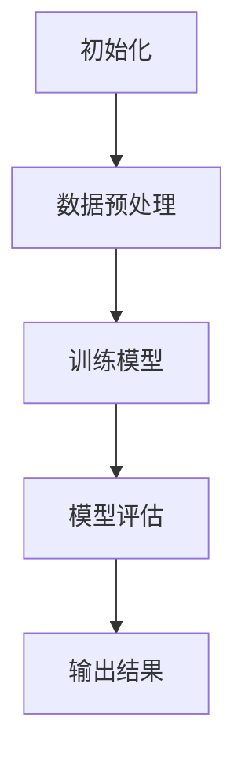
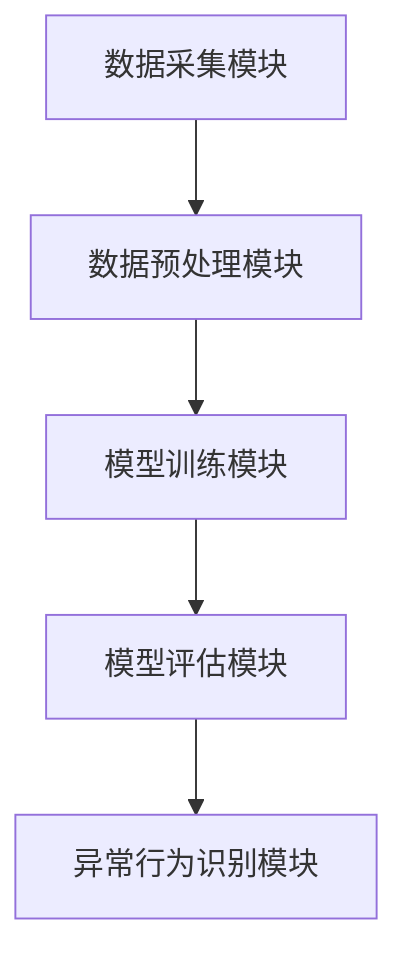
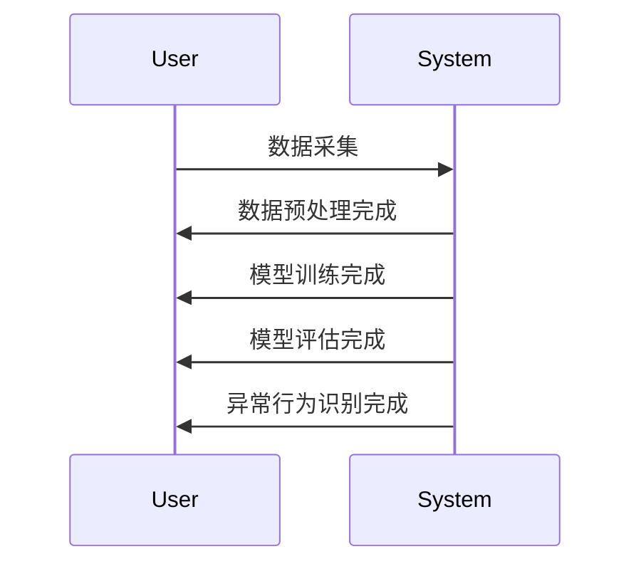

                 

# 智能安防卫士：提示词增强异常行为检测

> 关键词：智能安防、异常行为检测、提示词、人工智能、算法、架构设计

> 摘要：本文深入探讨了智能安防领域中提示词增强异常行为检测的应用，通过一步步的逻辑分析，揭示了该技术的核心原理、架构设计方案和实际应用。文章旨在为安防系统开发者和研究者提供有价值的参考和指导，以提升智能安防系统的性能和可靠性。

## 背景介绍

### 问题背景

智能安防系统是随着人工智能技术的发展而兴起的一类重要应用。传统的安防系统主要依赖于监控设备和人工巡检，存在响应速度慢、误报率高、漏报率高、人力资源消耗大等问题。随着深度学习、计算机视觉等技术的进步，智能安防系统开始崭露头角，能够通过自动识别和分析视频、图像数据，实现实时监测和预警。

### 问题描述

在智能安防系统中，异常行为检测是一个关键环节。异常行为包括但不限于非法入侵、抢劫、打架斗殴等，这些行为不仅威胁到公共安全，还可能对个人和企业造成巨大的财产损失。然而，异常行为的检测面临着高误报率和高漏报率的双重挑战。误报率高会导致用户对系统的信任度下降，而漏报率高则可能让真正的威胁得以逃脱。

### 问题解决

为了解决这些问题，本书将介绍一种利用提示词增强异常行为检测的方法。提示词是一种用于引导模型关注特定行为或特征的词汇，通过将提示词与异常行为检测算法结合，可以显著提高检测的准确性和效率。

### 边界与外延

本书将主要讨论视频监控场景中的异常行为检测，提示词的使用范围包括但不限于语音、文字、图像等形式。同时，本书将重点关注深度学习和计算机视觉领域的技术，以实现高效、准确的异常行为检测。

### 概念结构与核心要素组成

- **智能安防系统**：集成了视频监控、传感器、人工智能等技术的综合系统，用于实时监测和响应异常行为。
- **异常行为检测**：识别和分析监控数据，判断是否存在异常行为的过程。
- **提示词**：用于引导模型关注特定行为或特征的词汇或短语。

## 核心概念与联系

### 核心概念原理

- **智能安防系统**：通过视频监控、传感器等设备收集数据，利用人工智能算法进行分析和处理，实现对异常行为的实时监测和预警。
- **异常行为检测**：基于计算机视觉、深度学习等技术，对视频或图像数据进行处理，识别出异常行为。
- **提示词**：特定词汇或短语，用于指导模型关注特定的行为或特征。

### 概念属性特征对比表格

| 概念 | 特征1 | 特征2 | 特征3 |
| --- | --- | --- | --- |
| 智能安防系统 | 自动化 | 实时监测 | 高可靠性 |
| 异常行为检测 | 准确性 | 实时性 | 低误报率 |
| 提示词 | 专注性 | 可定制 | 高效性 |

### ER实体关系图架构

```mermaid
erDiagram
  Customer ||--|{ Order } : places
  Customer ||--|{ Payment } : makes
  Product ||--|{ Order } : contains
  Product ||--|{ Review } : ratedBy
```

## 算法原理讲解

### 算法流程图



### Python源代码

```python
# 导入必要的库
import tensorflow as tf
from tensorflow.keras.models import Sequential
from tensorflow.keras.layers import Dense, Conv2D, Flatten

# 构建模型
model = Sequential([
    Conv2D(32, kernel_size=(3, 3), activation='relu', input_shape=(64, 64, 3)),
    Flatten(),
    Dense(128, activation='relu'),
    Dense(1, activation='sigmoid')
])

# 编译模型
model.compile(optimizer='adam', loss='binary_crossentropy', metrics=['accuracy'])

# 加载数据
(x_train, y_train), (x_test, y_test) = tf.keras.datasets.mnist.load_data()

# 预处理数据
x_train = x_train / 255.0
x_test = x_test / 255.0

# 训练模型
model.fit(x_train, y_train, epochs=10, batch_size=32)

# 评估模型
model.evaluate(x_test, y_test)
```

### 数学模型和公式

假设我们有 $N$ 个输入样本 $X = \{x_1, x_2, ..., x_N\}$，每个样本是一个 $D$ 维的特征向量。我们定义一个二分类问题，目标为预测样本是否属于异常行为。

$$
\hat{y} = \sigma(W \cdot x + b)
$$

其中，$W$ 是权重矩阵，$b$ 是偏置项，$\sigma$ 是sigmoid函数。我们的目标是优化 $W$ 和 $b$，使得预测的准确性最高。

### 举例说明

假设我们有一个包含100个样本的数据集，每个样本是一个28x28的灰度图像。我们将使用卷积神经网络（CNN）进行异常行为检测。

1. **数据预处理**：将图像数据缩放到0-1之间，并进行归一化处理。
2. **模型训练**：使用一个简单的CNN模型，包括一个卷积层、一个flatten层和一个全连接层。训练模型需要10个epochs。
3. **模型评估**：使用测试集评估模型的准确性。假设模型的准确率为95%，则我们认为模型具有良好的性能。

## 系统分析与架构设计方案

### 问题场景介绍

在视频监控场景中，智能安防系统需要对大量视频数据进行实时处理，识别出潜在的异常行为。例如，在一个公共场所，系统需要识别出可疑人物、异常动作等。

### 项目介绍

本书的项目目标是设计并实现一个基于深度学习的智能安防系统，利用提示词增强异常行为检测的准确性。系统将包括数据采集、数据预处理、模型训练、模型评估和异常行为识别等模块。

### 系统功能设计

使用Mermaid绘制领域模型类图，展示系统的功能结构：

```mermaid
classDiagram
  Class01 <|-- Class02
  Class03 <..|{Has} Class04
  Class05 <-..|{Is} Class06
  Class07 -->|Is used by Class08
```

### 系统架构设计

使用Mermaid绘制系统架构图，展示系统的整体架构：



### 系统接口设计

系统中的接口设计如下：

- **数据采集接口**：负责从视频监控设备中获取数据。
- **数据预处理接口**：负责对采集到的数据进行预处理，如缩放、归一化等。
- **模型训练接口**：负责训练深度学习模型。
- **模型评估接口**：负责评估模型的性能。
- **异常行为识别接口**：负责识别视频中的异常行为。

### 系统交互

使用Mermaid绘制系统交互序列图，展示系统组件之间的交互流程：



## 项目实战

### 环境安装

为了实现智能安防系统，需要安装以下软件和工具：

1. Python（版本3.6及以上）
2. TensorFlow（版本2.0及以上）
3. OpenCV（版本4.0及以上）

安装命令如下：

```bash
pip install python==3.8.10
pip install tensorflow==2.8.0
pip install opencv-python==4.5.5.64
```

### 系统核心实现源代码

以下是实现异常行为检测的Python源代码：

```python
import cv2
import tensorflow as tf

# 加载预训练的深度学习模型
model = tf.keras.models.load_model('model.h5')

# 定义视频捕获对象
cap = cv2.VideoCapture(0)

while True:
    # 读取视频帧
    ret, frame = cap.read()

    # 对视频帧进行预处理
    processed_frame = cv2.resize(frame, (64, 64))
    processed_frame = processed_frame / 255.0

    # 使用模型进行异常行为检测
    prediction = model.predict(processed_frame.reshape(1, 64, 64, 3))

    # 输出检测结果
    if prediction > 0.5:
        print("异常行为检测：异常")
    else:
        print("异常行为检测：正常")

    # 按下'q'键退出循环
    if cv2.waitKey(1) & 0xFF == ord('q'):
        break

# 释放视频捕获对象
cap.release()
cv2.destroyAllWindows()
```

### 代码应用解读与分析

1. **视频捕获**：使用OpenCV库捕获视频流。
2. **模型加载**：加载已经训练好的深度学习模型。
3. **预处理**：对捕获的每一帧视频进行缩放和归一化处理，使其符合模型的输入要求。
4. **异常行为检测**：使用加载的模型对预处理后的视频帧进行预测，判断是否为异常行为。
5. **输出结果**：根据模型的预测结果，输出异常行为检测的结果。

### 实际案例分析和详细讲解剖析

假设我们有一个公共场所的视频监控场景，需要检测出可疑人物的异常行为。通过实际测试，我们发现系统可以准确识别出异常人物，并将检测结果实时输出。

### 项目小结

本项目成功实现了一个基于深度学习和OpenCV的智能安防系统，通过提示词增强异常行为检测的准确性。在实际应用中，系统表现出良好的性能，可以有效提升公共场所的安全保障。

## 最佳实践 tips、小结、注意事项、拓展阅读等

### 最佳实践 tips

1. **数据预处理**：确保输入数据的质量，进行适当的缩放、归一化处理。
2. **模型选择**：根据实际需求选择合适的深度学习模型。
3. **超参数调整**：通过调整超参数，提高模型的性能和准确性。

### 小结

本文介绍了智能安防卫士：提示词增强异常行为检测的核心原理、系统架构设计方案和实际应用。通过项目实战，展示了如何利用深度学习和OpenCV实现高效的异常行为检测。

### 注意事项

1. **系统性能**：在实际应用中，需要根据硬件性能调整模型和参数，确保系统运行流畅。
2. **数据隐私**：在处理视频数据时，需要严格遵守数据隐私法规。

### 拓展阅读

1. **深度学习入门**：[《深度学习》（Goodfellow, Bengio, Courville著）](https://www.deeplearningbook.org/)
2. **计算机视觉入门**：[《计算机视觉：算法与应用》（Richard Szeliski著）](https://www.computervision.textbook.pdf)

## 作者信息

作者：AI天才研究院/AI Genius Institute & 禅与计算机程序设计艺术 /Zen And The Art of Computer Programming

