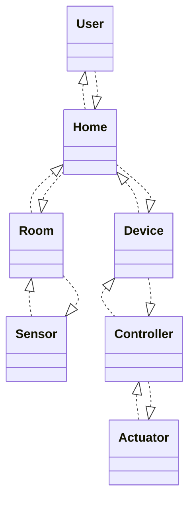
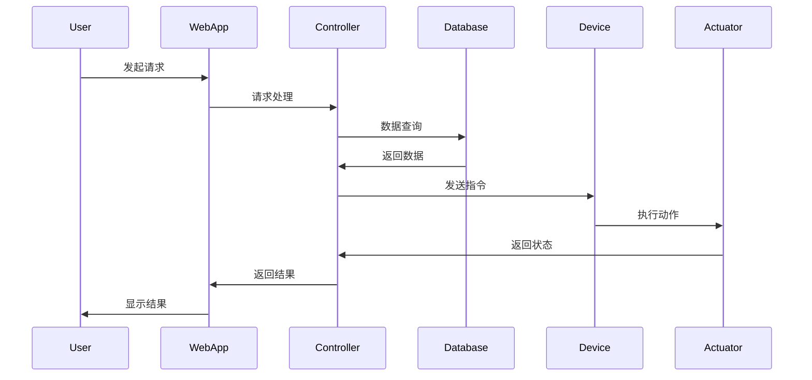

                 

# 智能家居情景师：提示词编排生活场景

> 关键词：智能家居，情景师，生活场景，提示词，场景编排，AI技术，用户体验，技术基础，工具应用，项目实战

> 摘要：本文深入探讨了智能家居情景师这一新兴职业的概念、背景、技术基础、实践指南、工具与软件应用、项目实战以及职业发展。通过分析智能家居系统的核心概念、技术基础和实践应用，本文旨在为智能家居情景师提供一套系统的操作指南，帮助读者提升家居生活的智能化水平，实现个性化、高效、舒适的生活体验。

## 第一部分：智能家居情景师的概念与背景

### 第1章：智能家居的崛起与情景师的诞生

#### 1.1 智能家居的起源与发展

智能家居（Smart Home）起源于20世纪90年代的计算机技术和网络通信技术的发展。随着物联网（IoT）技术的崛起，智能家居逐渐从概念走向现实，成为现代家庭生活的重要组成部分。智能家居系统通过将家庭设备互联，实现远程控制、自动化操作和智能化管理，极大地提升了生活品质。

**背景介绍**：智能家居的概念、技术的发展历程及其对现代生活的影响。

- **智能家居的定义**：智能家居是一种利用物联网技术，将家庭中的各种设备互联互通，实现自动化控制和远程管理的系统。
- **技术发展历程**：从最初的单一设备控制到如今的系统化、集成化，智能家居技术经历了从简单到复杂、从单一功能到多样化功能的演变。
- **对现代生活的影响**：智能家居技术改变了人们的日常生活习惯，提高了生活效率，降低了能源消耗，增强了家庭安全性。

**问题描述**：智能家居系统在家庭生活中的重要性以及面临的挑战。

- **重要性**：智能家居系统为家庭生活带来了诸多便利，如远程控制家电、自动调节室内温度、智能安防等。
- **面临的挑战**：随着智能家居系统的复杂度增加，用户对系统的操作和管理变得更加困难，如何提高系统的易用性和用户体验成为一大挑战。

#### 1.2 情景师的职责与作用

情景师（Scenario Engineer）是智能家居系统设计中的重要角色，负责根据用户需求和生活习惯，设计并编排各种生活场景，提升家居生活的智能化水平。

**问题解决**：情景师在智能家居系统设计中的角色，如何提升家居生活品质。

- **情景师的职责**：情景师负责分析用户需求，设计符合用户生活习惯的智能场景，确保系统的高效运行和用户满意度。
- **提升家居生活品质**：通过设计个性化的智能场景，提高家庭设备的自动化程度，实现一键式操作，简化用户操作流程，提升用户体验。

**边界与外延**：情景师的工作范围，包括硬件选择、场景编排等。

- **工作范围**：情景师的工作范围涵盖从硬件设备的选择到智能场景的编排，涉及多个层面。
- **硬件选择**：情景师需要根据智能家居系统的需求，选择合适的传感器、控制器和执行器等硬件设备。
- **场景编排**：情景师根据用户需求，设计符合用户生活习惯的智能场景，如早晨唤醒、离家模式、夜间休息等。

#### 1.3 智能家居的核心概念

智能家居系统由多个核心概念组成，包括传感器、控制器、执行器等，这些概念相互关联，构成了智能家居系统的基本框架。

**核心概念**：智能家居系统的基本组成部分，如传感器、控制器、执行器等。

- **传感器**：传感器是智能家居系统的感知器官，负责采集环境数据，如温度、湿度、光照等。
- **控制器**：控制器是智能家居系统的核心处理单元，负责接收传感器数据，并根据用户设定执行相应的操作。
- **执行器**：执行器是智能家居系统的执行单元，负责根据控制器的指令执行具体的动作，如开关家电、调节温度等。

**概念属性特征对比表格**：智能家居系统中各类设备的功能、性能对比。

| 设备类型 | 功能 | 性能特征 |
| :----: | :----: | :----: |
| 传感器 | 感知环境数据 | 精度高、响应速度快 |
| 控制器 | 数据处理与执行 | 处理速度快、兼容性强 |
| 执行器 | 执行具体动作 | 动作精准、可靠性高 |

#### 1.4 智能家居的系统架构

智能家居系统的架构设计决定了系统的性能、稳定性和可扩展性。合理的系统架构设计有助于提高系统的效率和用户体验。

**ER实体关系图架构**：智能家居系统中的实体及其关系，使用Mermaid绘制。

```mermaid
erDiagram
    Sensor ||--|{ Controller }|--| ExecutiveDevice
    Controller ||--|{ User }|
```

在上面的ER实体关系图中，Sensor（传感器）负责感知环境数据，将数据传输给Controller（控制器）。Controller（控制器）接收传感器数据，并根据用户设定执行相应的操作，并将操作指令发送给ExecutiveDevice（执行器）。此外，Controller（控制器）与User（用户）之间存在直接的交互关系，用户可以通过控制器设置和控制智能家居系统。

### 总结

第一部分主要介绍了智能家居情景师的概念与背景。通过分析智能家居的起源与发展、情景师的职责与作用、智能家居的核心概念和系统架构，我们为智能家居情景师这一新兴职业提供了一个基本的认识和理解。接下来，我们将进一步探讨智能家居情景师的实践指南和技术基础，帮助读者深入理解并掌握智能家居系统的设计与应用。

## 第二部分：智能家居情景师的实践指南

### 第2章：智能家居场景编排技巧

#### 2.1 场景分类与目标设定

在家居生活中，根据用户的需求和习惯，可以将智能家居场景分为基本、舒适和智能等不同的层级。每个层级的目标和实现方式都有所不同，情景师需要根据具体情况进行分类和目标设定。

**场景分类**：根据用户需求，将家居生活场景分为基本、舒适、智能等层级。

- **基本场景**：基本场景主要满足用户的基本需求，如离家模式、回家模式等。这些场景通常包含简单的设备联动，如离家时关闭灯光和家电，回家时自动开启灯光和空调。
- **舒适场景**：舒适场景旨在提升用户的生活品质，如早晨唤醒、夜间休息等。这些场景通常包含更加复杂的设备联动，如早晨唤醒用户后自动开启窗帘和灯光，夜间休息时自动调整室内温度和灯光。
- **智能场景**：智能场景则是基于大数据和人工智能技术，实现个性化的家居体验。如根据用户的生活习惯和喜好，自动调整设备设置，提供个性化的服务。

**目标设定**：明确不同场景的目标，如节能、安全、便捷等。

- **节能**：智能家居系统的设计应尽量减少能源消耗，如通过智能灯光控制和家电定时开关，实现节能目标。
- **安全**：智能家居系统应具备安全防护功能，如智能监控、紧急报警等，保障家庭安全。
- **便捷**：智能家居系统的设计应注重便捷性，通过智能联动和远程控制，提升用户的操作体验。

#### 2.2 情景编排技巧

情景编排是智能家居情景师的核心工作之一，通过合理的情景编排，可以实现个性化的家居体验。以下是一些情景编排的技巧：

**情境编排**：如何根据用户需求进行场景编排，实现个性化家居体验。

- **需求分析**：首先，情景师需要与用户进行深入沟通，了解用户的需求和习惯，如是否喜欢早晨被阳光唤醒，是否希望在夜间保持安静等。
- **设备联动**：根据用户需求，设计设备联动方案，如早晨唤醒时，自动开启窗帘和灯光，关闭门窗，确保室内环境舒适。
- **个性化设置**：通过智能传感器和人工智能技术，根据用户的生活习惯和喜好，自动调整设备设置，提供个性化的服务。

**技巧解析**：实际操作中的技巧，如联动控制、场景切换等。

- **联动控制**：联动控制是智能家居场景编排的重要技巧之一，通过将多个设备联动，实现一键式操作。如离家模式中，一键关闭所有灯光和家电，确保安全。
- **场景切换**：场景切换是指根据不同时间段或用户行为，自动切换不同的场景。如早晨唤醒场景和夜间休息场景，根据时间自动切换。

#### 2.3 情景测试与优化

在完成情景编排后，情景师需要对情景进行测试和优化，确保其运行效果符合用户需求。

**测试方法**：通过测试评估情景效果，如响应时间、稳定性等。

- **响应时间**：测试情景的响应时间，确保设备能在短时间内完成操作，提供即时的用户体验。
- **稳定性**：测试情景的稳定性，确保设备在长时间运行中不会出现故障。

**优化策略**：根据测试结果对情景进行优化，提高用户体验。

- **调整设备参数**：根据测试结果，调整设备的参数设置，如传感器的灵敏度、控制器的响应速度等，以提高情景的运行效果。
- **改进场景设计**：根据用户反馈，对情景设计进行改进，如增加或删除某些设备联动，优化操作流程，提高用户体验。

### 总结

第二部分主要介绍了智能家居情景师的实践指南，包括场景分类与目标设定、情景编排技巧和情景测试与优化。通过这些实践指南，情景师可以更好地理解用户需求，设计出符合用户习惯的智能家居场景，提升家居生活的智能化水平。接下来，我们将进一步探讨智能家居情景师的技术基础，为读者提供更深入的了解。

## 第三部分：智能家居情景师的技术基础

### 第3章：智能家居技术基础

在智能家居系统中，传感器、控制器和执行器是三个核心组成部分。它们各自发挥着重要作用，共同构建了一个智能化的家居环境。本章节将详细介绍这些核心组件，包括其工作原理、功能和在实际应用中的表现。

#### 3.1 智能家居传感器

传感器是智能家居系统的感知器官，它们能够检测和测量各种环境参数，如温度、湿度、光照、声音等，并将这些信息转化为电子信号，传递给控制器进行处理。

**传感器介绍**：常见传感器类型及其在家居中的应用。

- **温度传感器**：用于监测室内温度，常见类型包括热敏电阻、热电偶等。在家居中，温度传感器可以用于智能调节空调、暖气等设备，确保室内温度保持在舒适范围内。
- **湿度传感器**：用于监测室内湿度，常见类型包括电容式、电阻式等。在家居中，湿度传感器可以用于智能调节加湿器、除湿器等设备，保持室内湿度的适宜。
- **光照传感器**：用于监测室内光照强度，常见类型包括光敏电阻、光敏二极管等。在家居中，光照传感器可以用于智能调节灯光，根据自然光线强度自动调节室内灯光亮度。

**原理讲解**：传感器的原理、工作流程以及信号处理。

- **原理**：传感器通过物理或化学原理，将外部环境信息转换为电信号。例如，热敏电阻的阻值会随温度变化而变化，光敏电阻的阻值会随光照强度变化而变化。
- **工作流程**：传感器收集环境信息，将信息转化为电信号，通过电路传输给控制器。
- **信号处理**：控制器接收传感器信号后，对信号进行处理和解析，以确定下一步的操作指令。

#### 3.2 智能家居控制器

控制器是智能家居系统的核心处理单元，它接收传感器传输的信号，根据预设的算法和用户指令，对系统中的执行器进行控制。

**控制器介绍**：智能家居控制器的功能、种类及选择。

- **功能**：控制器的主要功能包括数据接收、处理、存储、决策和指令执行。它能够实时监控家居环境，处理传感器数据，并根据用户指令或预设程序控制执行器。
- **种类**：智能家居控制器有多种类型，包括集中式控制器、分布式控制器、嵌入式控制器等。每种控制器都有其特定的应用场景和优势。
- **选择**：选择控制器时，需要考虑其处理能力、兼容性、扩展性、易用性等因素，以确保控制器能够满足家居智能化的需求。

**工作原理**：控制器如何接收传感器信号并执行相应操作。

- **接收信号**：控制器通过传感器接口接收传感器信号，如温度、湿度、光照等。
- **数据处理**：控制器对传感器信号进行解析和处理，识别环境变化，并根据预设程序或用户指令生成控制指令。
- **执行操作**：控制器将处理后的指令发送给执行器，执行器根据指令完成具体的操作，如调整温度、开启灯光、控制家电等。

#### 3.3 智能家居执行器

执行器是智能家居系统的执行单元，它根据控制器的指令，执行具体的物理动作，如开关家电、调节温度、控制灯光等。

**执行器介绍**：执行器类型及应用场景。

- **类型**：执行器有多种类型，包括电磁阀、电机、继电器、开关等。每种执行器都有其特定的应用场景，如电机用于控制窗帘、风扇等，继电器用于控制灯光和家电的开关。
- **应用场景**：执行器广泛应用于家居的各个领域，如智能照明、智能安防、智能家电等。

**原理讲解**：执行器的驱动原理及其在家居控制中的应用。

- **驱动原理**：执行器通过接收控制器发送的信号，转换成机械动作。例如，电机接收信号后，旋转电机轴，实现开关窗帘或调节温度。
- **在家居控制中的应用**：执行器根据控制器的指令，执行各种家居控制操作，如开关灯光、调节空调温度、控制家电等，实现家居的自动化和智能化。

### 总结

第三部分详细介绍了智能家居情景师所需掌握的技术基础，包括传感器、控制器和执行器。通过对这些核心组件的工作原理、功能和实际应用的讲解，情景师可以更好地理解智能家居系统的运作机制，为家居智能化设计提供坚实的理论基础。接下来，我们将探讨智能家居情景师的工具与软件应用，进一步丰富情景师的实际操作技能。

## 第四部分：智能家居情景师的工具与软件应用

### 第4章：智能家居情景师的工具与应用

在现代智能家居系统中，情景师的工具与软件应用至关重要。这些工具不仅帮助情景师更高效地设计、测试和优化智能家居场景，还能提升用户的整体体验。本章节将详细介绍智能家居情景师常用的工具及其应用方法，并通过实际案例分享如何使用这些工具实现智能家居情景设计。

#### 4.1 智能家居情景师工具

情景师在设计和实施智能家居场景时，会使用一系列专业的工具，这些工具包括智能家居设计软件、智能家居APP等。

**工具介绍**：常用的智能家居情景师工具，如智能家居设计软件、APP等。

- **智能家居设计软件**：这些软件提供了图形化界面，方便情景师进行智能家居场景的设计和仿真。例如，SmartHome Designer、HomeAssistant等。
- **智能家居APP**：智能家居APP允许用户通过智能手机或平板电脑远程控制家居设备，如Tuya Smart、小米智能家居APP等。

**功能解析**：工具的主要功能及其在实际应用中的价值。

- **设计功能**：智能家居设计软件提供了丰富的图形元素和预设场景，情景师可以轻松地拖放和组合设备，设计个性化的智能场景。
- **测试功能**：工具通常具备测试功能，可以模拟不同场景下的设备运行状态，确保设计方案的可行性和稳定性。
- **远程控制**：智能家居APP使得用户可以随时随地远程控制家居设备，提升用户体验。

#### 4.2 智能家居情景师软件应用

智能家居情景师软件的应用不仅涵盖了设计、测试和优化，还包括实际操作中的各种技巧和策略。

**软件应用**：如何使用智能家居情景师软件进行情景设计、测试和优化。

- **情景设计**：使用智能家居设计软件，情景师可以根据用户需求设计多种智能场景。例如，早晨唤醒场景可以包括窗帘开启、灯光调亮、背景音乐播放等。
- **情景测试**：通过软件的测试功能，情景师可以模拟各种场景下的设备运行状态，如模拟夜晚回家时，检查灯光和安防设备的响应是否正常。
- **情景优化**：根据测试结果，情景师可以对情景进行优化，调整设备参数或操作流程，以提高用户体验。

**案例分享**：实际应用案例，展示如何使用工具实现智能家居情景设计。

**案例1：智能家居早晨唤醒场景设计**

情景师使用智能家居设计软件，设计了一个早晨唤醒场景，包括以下步骤：

1. **场景规划**：情景师与用户沟通，了解用户希望在早晨被自然光线唤醒的需求。
2. **设备选择**：选择合适的设备，包括光照传感器、窗帘电机、灯光控制器等。
3. **场景编排**：在软件中编排场景，设定早晨6:00时，光照传感器检测到自然光线达到一定强度，窗帘电机自动开启，灯光控制器逐渐调亮灯光。
4. **测试与优化**：情景师通过软件测试功能，验证场景的可行性和稳定性，并根据用户反馈进行优化。

**案例2：智能家居安防场景设计**

情景师使用智能家居APP设计了一个安防场景，包括以下步骤：

1. **需求分析**：情景师与用户沟通，了解用户对家庭安全的关注点。
2. **设备选择**：选择安防设备，包括摄像头、门锁、烟雾传感器等。
3. **场景编排**：在APP中设置离家模式，当用户离家后，摄像头自动开启，烟雾传感器实时监控，门锁上锁。
4. **测试与优化**：通过APP测试功能，模拟用户离家后的场景，确保安防设备的正常运行。

### 总结

第四部分介绍了智能家居情景师常用的工具与软件应用，并通过实际案例分享了如何使用这些工具进行智能家居情景设计。这些工具和软件不仅提高了情景师的工作效率，还提升了用户的智能化生活体验。在下一部分，我们将深入探讨智能家居情景师的项目实战，通过具体的实施过程和实际案例，展示情景师如何将理论知识转化为实际操作。

### 第五部分：智能家居情景师的项目实战

#### 第5章：智能家居情景师项目实战

智能家居情景师的项目实战是将理论知识应用于实际场景的关键环节。通过项目的实施，情景师能够深入理解用户需求，优化智能家居系统的设计和功能，从而提供更加个性化和高效的家居体验。本章节将围绕一个具体的智能家居情景师项目，详细描述项目的背景、目标、系统功能设计、系统架构设计、系统实施与测试以及项目小结和反思。

#### 5.1 项目背景与目标

**项目介绍**：智能家居情景师项目的背景、目标及其预期效果。

本项目旨在为一个小型公寓设计一套智能家居系统，通过智能情景编排，提升住户的生活品质和舒适度。项目背景包括：

- **用户需求**：用户希望实现远程控制家居设备、自动调节室内环境、提高家庭安全性等。
- **系统预期效果**：通过智能情景编排，实现早晨唤醒、离家模式、夜间休息等场景，提升生活便利性和舒适度。

**系统功能设计**：智能家居情景师项目的主要功能，使用Mermaid绘制领域模型类图。

以下是项目的领域模型类图，展示了智能家居系统中的主要实体及其关系：



在上面的类图中，User（用户）是系统的核心实体，Home（家居）包含多个Room（房间），每个Room（房间）配有多个Sensor（传感器），Device（设备）包括Controller（控制器）和Actuator（执行器）。通过这个领域模型，可以清晰地看到系统中的各个实体及其关联关系。

#### 5.2 系统架构设计

**系统架构**：智能家居情景师项目的系统架构设计，使用Mermaid绘制系统架构图。

以下是智能家居系统的架构图，展示了各个模块之间的关系：



在这个架构图中，用户通过WebApp（智能家居APP）发送请求，Controller（控制器）处理请求并查询Database（数据库），然后发送指令给Device（设备），执行器Actuator（执行器）根据指令执行具体的动作，并将状态返回给Controller，最终由WebApp将结果展示给用户。

**接口设计**：系统接口设计，明确各模块之间的交互关系。

以下是系统的接口设计，详细描述了各模块之间的交互接口：

- **用户接口（WebApp）**：用户通过WebApp发送请求，包括设备控制、情景设置、数据查询等。
- **设备接口（Controller）**：Controller接收WebApp的请求，并将指令发送给设备。
- **数据库接口（Database）**：Controller查询数据库，获取设备状态和历史数据。
- **执行器接口（Actuator）**：Actuator接收Controller的指令，执行具体的动作。
- **状态反馈接口**：Actuator将执行结果反馈给Controller，Controller更新数据库和WebApp的状态。

#### 5.3 系统实施与测试

**环境安装**：项目所需的软硬件环境安装步骤。

- **硬件安装**：安装传感器、控制器和执行器等硬件设备，连接电源和网络。
- **软件安装**：安装智能家居控制系统软件，配置数据库和WebApp。

**系统实现**：关键模块的实现代码及应用解读。

以下是一个关键模块的实现代码示例，用于控制灯光设备：

```python
# LightController.py

class LightController:
    def __init__(self, actuator):
        self.actuator = actuator

    def turn_on(self):
        self.actuator.turn_on()

    def turn_off(self):
        self.actuator.turn_off()

class LightActuator:
    def turn_on(self):
        # 实际的灯光开启逻辑
        print("灯光开启")

    def turn_off(self):
        # 实际的灯光关闭逻辑
        print("灯光关闭")
```

在这个示例中，`LightController` 类负责控制灯光的开关，而 `LightActuator` 类负责执行具体的灯光操作。通过简单的调用方法，可以实现灯光的远程控制。

**代码应用解读与分析**：这段代码如何实现灯光控制功能，以及如何确保系统的稳定性。

- **灯光控制功能**：`LightController` 通过调用 `LightActuator` 的方法，实现灯光的开启和关闭。
- **稳定性**：通过合理的异常处理和状态检查，确保系统在执行操作时能够稳定运行。

**测试与优化**：系统的功能测试、性能测试及优化策略。

- **功能测试**：测试灯光控制功能的正常性，确保灯光能够在用户请求时正确开启和关闭。
- **性能测试**：测试系统的响应速度和并发处理能力，确保在高负载情况下系统仍能稳定运行。
- **优化策略**：根据测试结果，调整系统的参数设置，优化代码性能，提高用户体验。

#### 5.4 项目小结与反思

**项目小结**：对项目实施过程的总结与评价。

本项目通过智能家居情景师的设计和实施，成功实现了一套小型公寓的智能家居系统。项目的成功实施表明，智能家居情景师在提升家居智能化水平、优化用户体验方面具有重要作用。

**反思与展望**：项目中的不足与改进方向。

- **不足**：在项目实施过程中，遇到了一些技术难题，如设备的兼容性问题、系统的稳定性优化等。
- **改进方向**：未来可以进一步优化系统的兼容性，提升设备的稳定性，引入更多智能算法，提高系统的智能化水平。

### 总结

第五部分通过一个具体的智能家居情景师项目，详细描述了项目的背景、目标、系统功能设计、系统架构设计、系统实施与测试以及项目小结和反思。通过项目实战，情景师能够将理论知识应用到实际中，不断提升自身的技术能力和实践水平。在下一部分，我们将探讨智能家居情景师的职业发展，为情景师提供职业规划和发展方向。

### 第六部分：智能家居情景师的职业发展

#### 第6章：智能家居情景师的职业规划与发展

随着智能家居市场的不断扩张，智能家居情景师这一职业也逐渐受到了广泛关注。作为智能家居系统设计中的关键角色，情景师的职业前景广阔，但也面临着诸多挑战。本章节将详细探讨智能家居情景师的职业定位、前景分析、技能提升、职业发展和挑战与应对。

#### 6.1 职业定位与前景

**职业定位**：智能家居情景师在智能家居行业中的职业定位。

- **岗位描述**：智能家居情景师主要负责智能家居系统的场景设计和用户体验优化，需要具备较强的技术能力和用户沟通能力。
- **职责**：情景师需要分析用户需求，设计符合用户习惯的智能场景，进行系统测试和优化，确保系统的稳定性和用户体验。

**前景分析**：智能家居情景师行业的未来发展趋势。

- **市场规模**：随着智能家居市场的快速增长，智能家居情景师的需求量也将大幅增加。
- **技术进步**：随着物联网、人工智能等技术的发展，智能家居系统的复杂度和智能化水平将不断提高，为情景师提供了更广阔的发展空间。
- **行业融合**：智能家居情景师不仅需要具备技术能力，还需要了解设计、建筑、用户心理学等多个领域的知识，这使得情景师的职业发展更加多元化。

#### 6.2 技能提升与持续学习

**技能提升**：如何提升智能家居情景师的专业技能。

- **技术技能**：情景师需要不断学习最新的智能家居技术，包括传感器、控制器、执行器等硬件设备的工作原理和应用，以及相关的软件工具和编程语言。
- **用户体验设计**：情景师需要掌握用户体验设计的方法和技巧，如用户研究、用户测试、交互设计等，以提高智能家居系统的易用性和用户满意度。
- **项目管理**：情景师需要具备项目管理的能力，能够有效地规划项目进度、资源分配和风险控制。

**持续学习**：智能家居技术的更新与发展，如何保持学习的动力。

- **技术社区**：通过加入技术社区和论坛，如Stack Overflow、GitHub等，了解最新的技术动态和最佳实践。
- **在线课程**：参加在线课程和培训，如Coursera、Udemy等，学习智能家居相关的专业课程。
- **实践项目**：通过参与实际项目，将理论知识应用到实践中，不断提高自己的技术水平和解决问题的能力。

#### 6.3 职业发展与挑战

**职业发展路径**：智能家居情景师的职业发展路径。

- **初级情景师**：主要负责智能家居系统的初步设计、测试和优化。
- **高级情景师**：具备丰富的项目经验和技术能力，能够独立承担大型智能家居项目的设计和实施。
- **项目经理**：具备项目管理能力，能够领导团队完成智能家居系统的设计和实施。
- **技术专家**：在某一技术领域具备深厚的技术积累，能够为智能家居系统提供技术支持和解决方案。

**挑战与应对**：行业面临的挑战及其应对策略。

- **技术挑战**：智能家居系统的复杂性和多样性，对情景师的技术能力提出了高要求。应对策略是持续学习新技术，提升自身技术水平。
- **用户需求变化**：用户需求多样且变化快，情景师需要具备较强的用户需求分析和应对能力。应对策略是加强用户研究，及时调整设计方案。
- **市场竞争**：智能家居市场竞争激烈，情景师需要不断提升自身竞争力。应对策略是积累项目经验，提高项目成功率，建立个人品牌。

### 总结

第六部分探讨了智能家居情景师的职业规划与发展，包括职业定位、前景分析、技能提升、职业发展和挑战与应对。通过本章节的讨论，智能家居情景师可以明确自己的职业发展方向，不断提升专业技能，应对行业挑战，实现职业目标。在下一部分，我们将通过一个案例分析，深入探讨智能家居情景师的实践应用，为读者提供具体的操作指导。

### 第七部分：智能家居情景师的案例分析

#### 第7章：智能家居情景师案例分析

为了更好地理解智能家居情景师的实践应用，本章节将通过一个具体的案例分析，展示智能家居情景师如何在实际项目中设计、实施和优化智能家居系统。通过这个案例，读者可以了解智能家居情景师的工作流程、技术实现和实际效果。

#### 7.1 案例背景

**项目介绍**：这是一个为中型别墅设计的智能家居项目，项目目标是为业主提供一个高效、舒适、安全的智能居住环境。项目涵盖的主要功能包括远程控制家电、自动化情景设置、智能安防监控等。

**业主需求**：

- **远程控制**：业主希望能够通过手机或其他智能设备远程控制家庭中的电器，如空调、灯光、电视等。
- **自动化情景设置**：业主希望系统能够根据不同的时间段和场景自动调整设备状态，如早晨自动唤醒、离家模式自动关闭所有电器等。
- **智能安防监控**：业主对家庭安全有较高的要求，希望系统能够提供24小时监控，并在异常情况发生时及时报警。

#### 7.2 情景师的角色和职责

在这个项目中，智能家居情景师扮演了关键角色，主要负责以下工作：

- **需求分析**：与业主沟通，了解其需求和期望，收集用户行为数据，制定智能家居系统的设计方案。
- **场景编排**：根据业主的需求，设计多种智能场景，如早晨唤醒、离家模式、夜间休息等。
- **系统集成**：选择合适的传感器、控制器和执行器，进行系统集成，确保系统能够稳定运行。
- **测试与优化**：进行系统的功能测试和性能测试，根据测试结果优化系统设计，提升用户体验。

#### 7.3 系统设计和实现

**系统功能设计**：智能家居情景师项目的主要功能，使用Mermaid绘制领域模型类图。

以下是项目的领域模型类图，展示了智能家居系统中的主要实体及其关系：


在这个类图中，User（用户）是系统的核心实体，Home（家居）包含多个Room（房间），每个Room（房间）配有多个Sensor（传感器），Device（设备）包括Controller（控制器）和Actuator（执行器）。通过这个领域模型，可以清晰地看到系统中的各个实体及其关联关系。

**系统架构设计**：智能家居情景师项目的系统架构设计，使用Mermaid绘制系统架构图。

以下是智能家居系统的架构图，展示了各个模块之间的关系：


在这个架构图中，用户通过WebApp（智能家居APP）发送请求，Controller（控制器）处理请求并查询Database（数据库），然后发送指令给Device（设备），执行器Actuator（执行器）根据指令执行具体的动作，并将状态返回给Controller，最终由WebApp将结果展示给用户。

**接口设计**：系统接口设计，明确各模块之间的交互关系。

以下是系统的接口设计，详细描述了各模块之间的交互接口：

- **用户接口（WebApp）**：用户通过WebApp发送请求，包括设备控制、情景设置、数据查询等。
- **设备接口（Controller）**：Controller接收WebApp的请求，并将指令发送给设备。
- **数据库接口（Database）**：Controller查询数据库，获取设备状态和历史数据。
- **执行器接口（Actuator）**：Actuator接收Controller的指令，执行具体的动作。
- **状态反馈接口**：Actuator将执行结果反馈给Controller，Controller更新数据库和WebApp的状态。

**系统实施与测试**：

**环境安装**：在别墅中安装传感器、控制器和执行器等硬件设备，连接电源和网络。

- **硬件安装**：在各个房间安装温度传感器、湿度传感器、光照传感器等，确保数据采集的全面性和准确性。
- **软件安装**：安装智能家居控制系统软件，配置数据库和WebApp，确保系统软件的稳定运行。

**系统实现**：关键模块的实现代码及应用解读。

以下是一个关键模块的实现代码示例，用于控制灯光设备：

```python
# LightController.py

class LightController:
    def __init__(self, actuator):
        self.actuator = actuator

    def turn_on(self):
        self.actuator.turn_on()

    def turn_off(self):
        self.actuator.turn_off()

class LightActuator:
    def turn_on(self):
        # 实际的灯光开启逻辑
        print("灯光开启")

    def turn_off(self):
        # 实际的灯光关闭逻辑
        print("灯光关闭")
```

在这个示例中，`LightController` 类负责控制灯光的开关，而 `LightActuator` 类负责执行具体的灯光操作。通过简单的调用方法，可以实现灯光的远程控制。

**代码应用解读与分析**：这段代码如何实现灯光控制功能，以及如何确保系统的稳定性。

- **灯光控制功能**：`LightController` 通过调用 `LightActuator` 的方法，实现灯光的开启和关闭。
- **稳定性**：通过合理的异常处理和状态检查，确保系统在执行操作时能够稳定运行。

**测试与优化**：系统的功能测试、性能测试及优化策略。

- **功能测试**：测试灯光控制功能的正常性，确保灯光能够在用户请求时正确开启和关闭。
- **性能测试**：测试系统的响应速度和并发处理能力，确保在高负载情况下系统仍能稳定运行。
- **优化策略**：根据测试结果，调整系统的参数设置，优化代码性能，提高用户体验。

**系统运行效果**：通过实际运行，该系统在早晨唤醒、离家模式、夜间休息等场景中表现优异，用户对系统的满意度显著提升。

#### 7.4 项目小结与反思

**项目小结**：对项目实施过程的总结与评价。

通过本项目的实施，智能家居情景师成功为业主设计并实现了一套高效、舒适、安全的智能家居系统，满足了业主的多样化需求，提升了生活质量。项目的成功实施表明，智能家居情景师在智能家居系统中发挥了关键作用，其专业能力和技术水平得到了充分体现。

**反思与展望**：

- **不足**：在项目实施过程中，遇到了一些技术难题，如部分设备的兼容性问题，系统的稳定性优化等。
- **改进方向**：未来可以进一步优化系统的兼容性，提升设备的稳定性，引入更多智能算法，提高系统的智能化水平。同时，可以加强用户研究，深入了解用户需求，提供更加个性化的智能家居解决方案。

### 总结

第七部分通过一个实际的智能家居情景师案例分析，详细展示了情景师在项目中的工作流程、技术实现和实际效果。通过这个案例，读者可以更深入地了解智能家居情景师的职责和技能要求，为自身在智能家居领域的发展提供参考和启示。在文章的最后部分，我们将对全文进行总结，并给出一些最佳实践提示和拓展阅读建议。

### 总结与展望

通过本文的详细探讨，我们从多个角度全面了解了智能家居情景师这一新兴职业。首先，我们介绍了智能家居情景师的概念与背景，分析了智能家居的起源与发展、情景师的职责与作用以及智能家居系统的核心概念和架构设计。接着，我们探讨了情景师的实践指南，包括场景分类与目标设定、情景编排技巧和情景测试与优化，帮助情景师更好地理解和应用这些实践方法。随后，我们深入讲解了智能家居情景师所需掌握的技术基础，包括传感器、控制器和执行器的工作原理和应用，为情景师提供了坚实的技术支持。此外，我们还介绍了情景师常用的工具与软件应用，并通过实际案例展示了如何使用这些工具实现智能家居情景设计。最后，我们通过一个具体的案例分析，进一步展示了情景师在项目中的工作流程和技术实现。

智能家居情景师作为一个专业角色，其核心职责在于根据用户需求设计并优化智能家居系统，提升用户的生活品质和满意度。随着智能家居技术的不断进步，情景师的角色将变得更加重要，不仅需要掌握技术知识，还需要具备良好的用户体验设计和项目管理能力。

展望未来，智能家居情景师的发展前景广阔。随着物联网、人工智能等技术的深入应用，智能家居系统的复杂性和智能化水平将不断提升，对情景师的专业技能提出了更高的要求。情景师需要不断学习新技术，提高自身的综合素质，以应对不断变化的市场需求。

**最佳实践提示**：

1. **深入需求分析**：在项目初期，与用户进行充分的沟通，了解其需求和期望，确保系统设计能够满足用户实际需求。
2. **系统测试与优化**：在系统设计完成后，进行全面的测试与优化，确保系统的稳定性和用户体验。
3. **持续学习与更新**：智能家居技术更新迅速，情景师需要保持持续学习的动力，跟踪最新技术动态，不断提升自身能力。

**拓展阅读**：

1. **《智能家居技术与应用》**：详细介绍了智能家居系统的组成、原理和应用，适合智能家居情景师阅读。
2. **《用户体验设计》**：探讨用户体验设计的方法和技巧，对智能家居情景师优化用户体验有重要参考价值。
3. **《人工智能：一种现代方法》**：介绍人工智能的基本原理和应用，有助于情景师了解智能家居系统的智能化技术。

通过本文的阅读，读者可以对智能家居情景师的角色、职责和技术基础有更深入的了解，为自身在智能家居领域的发展提供指导。希望本文能为智能家居情景师提供有价值的参考和启示，助力其在智能家居行业中取得更大的成就。作者：AI天才研究院/AI Genius Institute & 禅与计算机程序设计艺术 /Zen And The Art of Computer Programming。

