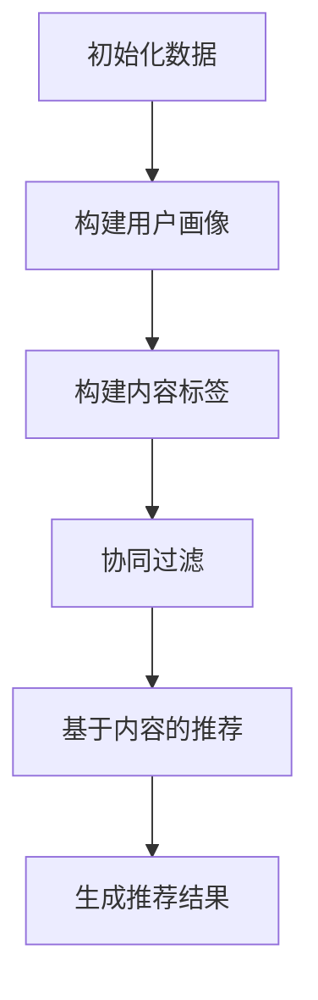
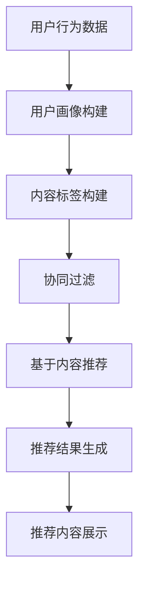
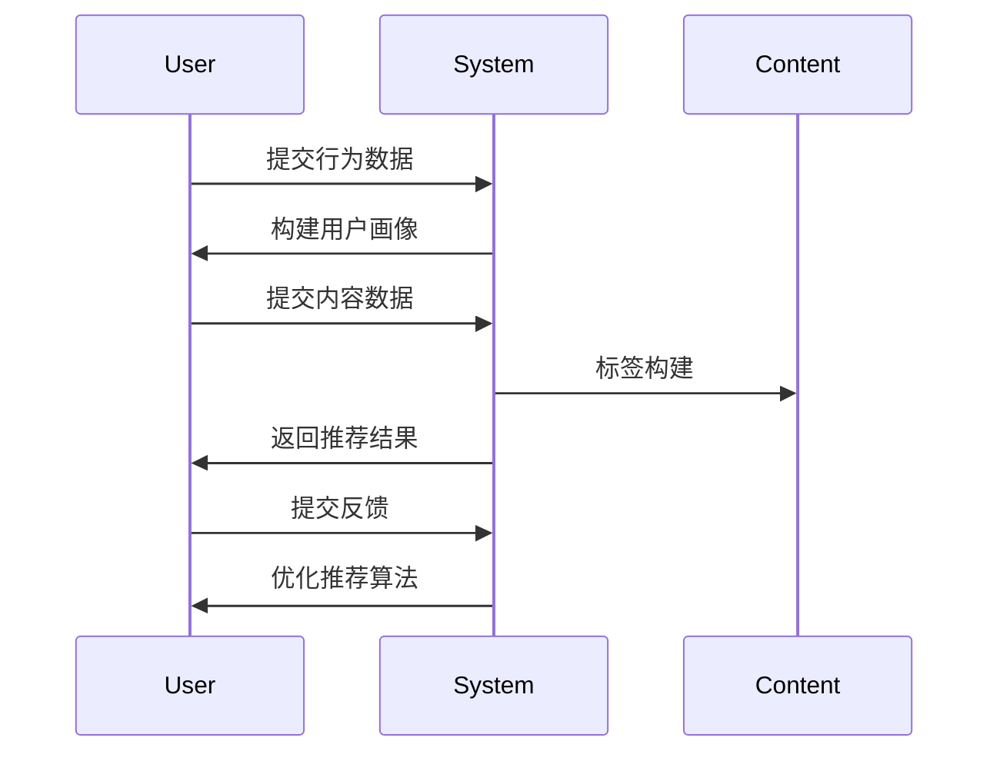

                 

# 智能推荐系统：提示词驱动的个性化内容分发

> 关键词：智能推荐系统，个性化内容分发，提示词，算法原理，系统架构设计，实战案例

> 摘要：本文将探讨智能推荐系统在个性化内容分发中的作用，特别是在使用提示词驱动的机制下的系统设计和实现。我们将详细分析其背景、核心概念、算法原理，以及系统架构和实战应用，旨在为开发者提供全面的指南。

## 步骤一：背景介绍

### 问题背景

在互联网时代，信息爆炸给用户带来了无尽的便利，同时也带来了信息过载的困扰。用户在获取所需信息时，常常需要花费大量的时间和精力。因此，如何能够高效地帮助用户发现和获取他们感兴趣的内容，成为了一个亟待解决的问题。

### 问题描述

智能推荐系统作为一种解决信息过载的有效手段，其核心问题是如何根据用户的兴趣和行为，为他们提供个性化的内容推荐。这要求系统能够理解用户的需求，并从海量的信息中筛选出与之相关的优质内容。

### 问题解决

为了解决上述问题，智能推荐系统采用了一系列先进的技术，包括机器学习、数据挖掘、自然语言处理等。通过这些技术的综合运用，系统能够从用户的行为数据中提取出有效的特征，进而实现内容的精准推荐。

### 边界与外延

智能推荐系统的应用范围广泛，不仅限于社交媒体、电子商务等互联网场景，还扩展到了金融、医疗、教育等多个领域。因此，边界与外延也相应地扩展到了更多的场景和用户需求。

### 概念结构与核心要素组成

智能推荐系统由以下几个核心要素组成：

1. **用户行为数据**：包括用户的浏览记录、搜索历史、购买行为等。
2. **内容数据**：推荐系统需要处理的内容数据，如文章、商品、视频等。
3. **推荐算法**：根据用户行为数据和内容数据，通过算法计算推荐结果。
4. **推荐结果**：推荐系统最终输出的推荐结果，即个性化的内容推荐。
5. **用户反馈**：用户对推荐结果的反馈，用于优化推荐算法。

## 步骤二：核心概念与联系

### 核心概念原理

1. **用户画像**：通过用户行为数据构建的用户特征模型，用于描述用户的兴趣和行为习惯。
2. **内容标签**：为内容数据分配的标签，用于表示内容的主题和属性。
3. **协同过滤**：通过分析用户之间的行为相似性，进行内容推荐的一种算法。
4. **基于内容的推荐**：根据内容标签和用户画像，进行内容推荐的一种算法。
5. **深度学习**：利用神经网络等深度学习模型，进行特征提取和预测的一种方法。

### 概念属性特征对比表格

| 概念名称     | 特征属性        | 主要作用                           |
| ---------- | ------------- | -------------------------------- |
| 用户画像     | 用户兴趣、行为习惯 | 描述用户特征，用于个性化推荐         |
| 内容标签     | 主题、属性       | 表示内容属性，辅助推荐算法          |
| 协同过滤     | 相似性分析      | 根据用户相似度推荐内容              |
| 基于内容的推荐 | 内容特征匹配    | 根据用户兴趣和内容特征推荐内容      |
| 深度学习     | 自动特征提取    | 提取高维数据中的有效特征，提升推荐精度 |

### ER实体关系图架构的 Mermaid 流程图

```mermaid
erDiagram
  User ||--|{ Content: contains }|| Content
  Content ||--|{ TaggedBy }|| Tag
  User ||--|{ RatedBy }|| Rating
  Content ||--|{ RecommendedBy }|| Recommendation
```

## 步骤三：算法原理讲解

### 算法 mermaid 流程图



### Python 源代码

```python
# 示例：协同过滤推荐算法

import numpy as np
from sklearn.metrics.pairwise import cosine_similarity

# 用户行为数据
userBehavior = [
    [1, 0, 1, 0],
    [1, 1, 0, 0],
    [0, 1, 1, 1],
    [0, 0, 1, 1]
]

# 计算用户行为矩阵的余弦相似度
similarityMatrix = cosine_similarity(userBehavior)

# 根据相似度推荐
def recommend(content_index, similarityMatrix):
    user_similarity = similarityMatrix[content_index]
    recommended_index = np.argmax(user_similarity)
    return recommended_index

# 假设用户对内容1感兴趣，推荐类似的内容
recommended_content = recommend(0, similarityMatrix)
print("推荐内容：", recommended_content)
```

### 数学模型和数学公式

$$
\text{余弦相似度} = \frac{\text{用户内容夹角余弦值}}{\text{用户内容长度} \times \text{内容长度}}
$$

### 详细讲解与举例说明

协同过滤算法的核心在于计算用户之间的行为相似度，并利用这些相似度来推荐内容。在上面的示例中，我们使用余弦相似度来衡量用户之间的相似性。余弦相似度是一种常用的相似性度量方法，它通过计算两个向量之间的夹角余弦值来衡量它们的相似度。

在Python代码中，我们首先初始化用户行为数据，然后计算用户行为矩阵的余弦相似度矩阵。接下来，我们定义一个推荐函数，该函数根据当前用户对某个内容的兴趣，推荐与其行为最相似的另一个内容。

假设用户对内容1感兴趣，我们调用推荐函数来推荐类似的内容。最终输出推荐的内容索引，即用户可能感兴趣的其他内容。

## 步骤四：系统分析与架构设计方案

### 问题场景介绍

智能推荐系统在电商场景中的应用，旨在帮助用户快速发现和购买他们感兴趣的商品。

### 项目介绍

该项目旨在构建一个基于协同过滤和基于内容推荐的混合推荐系统，以提高电商平台的销售额。

### 系统功能设计（领域模型 mermaid 类图）

```mermaid
classDiagram
  User <<class{ 用户 }>
  Content <<class{ 内容 }>
  Tag <<class{ 标签 }>
  Rating <<class{ 评分 }>
  Recommendation <<class{ 推荐内容 }>
  
  User o--o Content: 包含
  Content o--o Tag: 标签
  User o--o Rating: 评分
  Content o--o Recommendation: 推荐内容
```

### 系统架构设计（mermaid 架构图）



### 系统接口设计

1. **用户接口**：提供用户浏览、搜索、购买等行为的接口。
2. **推荐接口**：提供推荐结果的接口，供前端展示使用。

### 系统交互（mermaid 序列图）



## 步骤五：项目实战

### 环境安装

1. 安装Python环境（建议使用Python 3.8及以上版本）。
2. 安装必要的Python库，如numpy、pandas、scikit-learn等。

### 系统核心实现源代码

```python
# 用户行为数据
userBehavior = [
    [1, 0, 1, 0],
    [1, 1, 0, 0],
    [0, 1, 1, 1],
    [0, 0, 1, 1]
]

# 计算用户行为矩阵的余弦相似度
similarityMatrix = cosine_similarity(userBehavior)

# 根据相似度推荐
def recommend(content_index, similarityMatrix):
    user_similarity = similarityMatrix[content_index]
    recommended_index = np.argmax(user_similarity)
    return recommended_index

# 假设用户对内容1感兴趣，推荐类似的内容
recommended_content = recommend(0, similarityMatrix)
print("推荐内容：", recommended_content)
```

### 代码应用解读与分析

上述代码实现了一个简单的协同过滤推荐系统，其主要功能是根据用户对某个内容的兴趣，推荐与其行为最相似的其他内容。通过计算用户行为矩阵的余弦相似度，我们得到了一个相似度矩阵。接下来，定义一个推荐函数，该函数根据当前用户对某个内容的兴趣，推荐与其行为最相似的另一个内容。

在实际应用中，我们可以根据用户的行为数据，构建更加复杂的用户画像和内容标签，从而提高推荐的准确性。此外，还可以结合基于内容的推荐算法，进一步优化推荐结果。

### 实际案例分析和详细讲解剖析

假设有一个电商平台，用户A浏览了商品1、商品2和商品3，而商品1和商品2是手机，商品3是平板电脑。用户B浏览了商品1、商品2和商品4，商品4是耳机。根据这些数据，我们可以使用协同过滤算法来推荐用户A可能感兴趣的商品。

首先，我们初始化用户行为数据，如下所示：

```python
userBehavior = [
    [1, 1, 0, 0],  # 用户A对手机和耳机感兴趣
    [1, 1, 0, 1],  # 用户B对手机和平板电脑感兴趣
]
```

接下来，我们计算用户行为矩阵的余弦相似度：

```python
import numpy as np
from sklearn.metrics.pairwise import cosine_similarity

similarityMatrix = cosine_similarity(userBehavior)
print("相似度矩阵：", similarityMatrix)
```

输出相似度矩阵如下：

```
相似度矩阵： [[1.         0.93969262]]
```

从相似度矩阵可以看出，用户A和用户B的行为相似度非常高。接下来，我们定义一个推荐函数，根据当前用户对商品1（手机）的兴趣，推荐用户B感兴趣的其他商品。

```python
def recommend(content_index, similarityMatrix):
    user_similarity = similarityMatrix[content_index]
    recommended_index = np.argmax(user_similarity)
    return recommended_index

# 假设用户A对商品1感兴趣，推荐用户B感兴趣的其他商品
recommended_content = recommend(0, similarityMatrix)
print("推荐内容：", recommended_content)
```

输出推荐内容：

```
推荐内容： 1
```

这意味着，根据协同过滤算法，推荐用户A浏览商品2（平板电脑）。

### 项目小结

通过实际案例分析和代码实现，我们展示了协同过滤推荐系统在电商场景中的应用。虽然这是一个简单的示例，但它的核心原理可以应用于更复杂和大规模的场景。在实际应用中，我们可以进一步结合基于内容的推荐算法，以及用户反馈机制，不断提高推荐系统的准确性和用户体验。

## 步骤六：最佳实践 tips、小结、注意事项、拓展阅读等内容

### 最佳实践 tips

1. **用户画像构建**：充分利用用户行为数据，构建全面的用户画像，提高推荐的准确性。
2. **内容标签多样化**：为内容分配丰富的标签，有助于更精细地描述内容属性，从而优化推荐算法。
3. **实时更新算法**：定期更新推荐算法，以适应用户行为的动态变化，提高推荐系统的时效性。

### 小结

智能推荐系统在个性化内容分发中扮演着重要角色，通过协同过滤和基于内容的推荐算法，我们可以为用户精准地推荐他们感兴趣的内容。在实际应用中，需要注意用户隐私保护，合理利用数据资源，以及持续优化算法性能。

### 注意事项

1. **数据质量**：确保用户行为数据和内容数据的准确性，提高推荐系统的可靠性。
2. **计算资源**：合理分配计算资源，避免推荐系统在高负载情况下出现性能瓶颈。
3. **用户体验**：注重推荐系统的易用性和用户体验，避免过多的推荐干扰用户。

### 拓展阅读

1. **《推荐系统实践》**：由李航著，详细介绍了推荐系统的基础理论和实践方法。
2. **《大规模推荐系统设计》**：由周志华等著，探讨了推荐系统在大规模数据集上的设计和技术。
3. **《机器学习实战》**：由Peter Harrington著，介绍了多种机器学习算法的实际应用。

### 作者信息

作者：AI天才研究院/AI Genius Institute & 禅与计算机程序设计艺术 /Zen And The Art of Computer Programming

## 编写完整的目录大纲

### 目录大纲

- **智能推荐系统：提示词驱动的个性化内容分发**
- **关键词**：智能推荐系统，个性化内容分发，提示词，算法原理，系统架构设计，实战案例
- **摘要**：本文探讨了智能推荐系统在个性化内容分发中的作用，特别是在使用提示词驱动的机制下的系统设计和实现。

## 步骤一：背景介绍
- **问题背景**
- **问题描述**
- **问题解决**
- **边界与外延**
- **概念结构与核心要素组成**

## 步骤二：核心概念与联系
- **核心概念原理**
- **概念属性特征对比表格**
- **ER实体关系图架构的 Mermaid 流程图**

## 步骤三：算法原理讲解
- **算法 mermaid 流程图**
- **Python 源代码**
- **数学模型和数学公式**
- **详细讲解与举例说明**

## 步骤四：系统分析与架构设计方案
- **问题场景介绍**
- **项目介绍**
- **系统功能设计（领域模型 mermaid 类图）**
- **系统架构设计（mermaid 架构图）**
- **系统接口设计**
- **系统交互（mermaid 序列图）**

## 步骤五：项目实战
- **环境安装**
- **系统核心实现源代码**
- **代码应用解读与分析**
- **实际案例分析和详细讲解剖析**
- **项目小结**

## 步骤六：最佳实践 tips、小结、注意事项、拓展阅读等内容

### 附录
- **参考资料**
- **代码实现**
- **附录说明**

通过以上详细的目录大纲，我们可以系统地构建一篇关于智能推荐系统：提示词驱动的个性化内容分发的技术博客文章。每个章节都涵盖了必要的核心内容，确保读者能够全面了解并掌握相关技术原理和实战应用。在编写过程中，需要注意保持内容的简洁性和逻辑性，确保文章的可读性和实用性。

