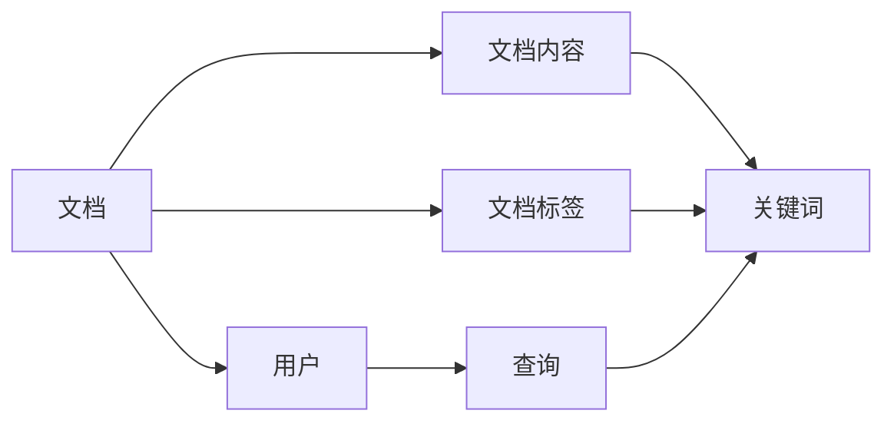

                 

### Introduction to the Book

# 《智能文档管理：提示词驱动的信息检索系统》

## Keywords

- 智能文档管理
- 提示词驱动
- 信息检索系统
- 人工智能
- 自然语言处理

## Abstract

本文探讨了智能文档管理的概念、原理和实现方法，重点介绍了提示词驱动的信息检索系统。通过分析智能文档管理中的核心概念，如文档管理、人工智能和自然语言处理，本文详细阐述了提示词驱动的信息检索系统的原理和架构。此外，本文还介绍了系统的应用场景，并提供了实践案例，以帮助读者更好地理解和应用这一技术。

## 1.1 问题描述与核心概念

### 1.1.1 问题背景

随着数字化信息时代的到来，文档管理成为企业和个人面临的重要问题。信息量的爆炸式增长使得传统的文档管理方法越来越难以满足高效、精准的信息检索需求。特别是在大数据和云计算时代，如何有效地管理和利用海量的文档数据成为亟待解决的问题。

### 1.1.2 问题描述

传统的文档管理方法主要依赖于手动分类和检索，存在以下问题：

- **分类效率低**：手动分类需要大量人力和时间，效率低下。
- **检索精度低**：传统的关键字搜索方法难以精确匹配用户的检索需求，导致检索结果不准确。
- **用户体验差**：用户在查找特定文档时，往往需要多次尝试和调整检索关键词，用户体验较差。

### 1.1.3 问题解决

为了解决上述问题，提出了一种基于提示词驱动的信息检索系统。该系统利用人工智能和自然语言处理技术，实现对大量文档的智能分类、标注和检索。通过提示词的构建和检索算法的设计，用户可以快速、精准地查找所需文档，提高工作效率和用户体验。

### 1.1.4 边界与外延

本系统的设计重点在于提示词的构建与检索算法的实现，同时考虑文档的安全性、隐私保护及易用性。在边界与外延方面，系统需要支持多种文档格式，如文本、图片、音频和视频等，同时具备良好的扩展性，以适应不断变化的需求。

### 1.1.5 概念结构与核心要素组成

智能文档管理系统的概念结构包括以下几个核心要素：

- **文档**：系统管理的对象，包括文本、图片、音频和视频等。
- **提示词**：用于检索文档的关键词或短语，是系统的核心要素之一。
- **信息检索**：根据提示词从文档数据库中查找相关信息的过程。
- **人工智能**：系统采用的技术手段，包括自然语言处理、机器学习等。
- **自然语言处理**：对文档内容进行分析和处理的技术，用于提取关键词和语义信息。

### 1.1.6 智能文档管理的核心概念与联系

#### 1.1.6.1 概念原理

智能文档管理涉及自然语言处理、机器学习、信息检索等技术，其核心在于利用算法对文档内容进行分析和分类，从而实现快速、准确的检索。具体来说，智能文档管理系统的工作流程如下：

1. **数据采集**：从各种来源收集文档数据。
2. **预处理**：对文档进行清洗、格式化等预处理步骤。
3. **文本分析**：利用自然语言处理技术提取文档的关键词和主题。
4. **索引构建**：构建基于关键词和主题的索引。
5. **查询处理**：根据用户的提示词进行检索，返回相关文档。

#### 1.1.6.2 概念属性特征对比

| 概念       | 特征                              |
|------------|-----------------------------------|
| 文档管理   | 组织、存储、检索、共享             |
| 人工智能   | 自动化、学习、预测、决策           |
| 信息检索   | 关键词匹配、查询优化、结果排序     |
| 提示词驱动 | 高效、精准、用户友好               |

#### 1.1.6.3 ER实体关系图

#### 1.1.6.4 智能文档管理的基本原理

智能文档管理系统的基本原理包括：

- **数据采集**：从各种来源收集文档数据。
- **预处理**：对文档进行清洗、格式化等预处理步骤。
- **文本分析**：利用自然语言处理技术提取文档的关键词和主题。
- **索引构建**：构建基于关键词和主题的索引。
- **查询处理**：根据用户的提示词进行检索，返回相关文档。

#### 1.1.6.5 系统架构设计

智能文档管理系统的架构包括：

- **数据层**：存储和管理文档数据。
- **处理层**：负责文档的预处理、分析和索引构建。
- **接口层**：提供用户界面和API，用于用户查询和系统操作。

#### 1.1.6.6 智能文档管理系统的应用场景

智能文档管理系统适用于：

- 企业文档管理：自动分类和检索内部文档，提高工作效率。
- 个人文档管理：方便地查找和管理个人文件。
- 法律、金融等领域：快速检索相关法规和案例。

### 1.2 本章小结

本章介绍了智能文档管理系统的核心概念、基本原理、架构设计和应用场景，为后续章节的深入讨论奠定了基础。在接下来的章节中，我们将进一步探讨智能文档管理系统的设计、实现和应用，帮助读者全面了解并掌握这一技术。

