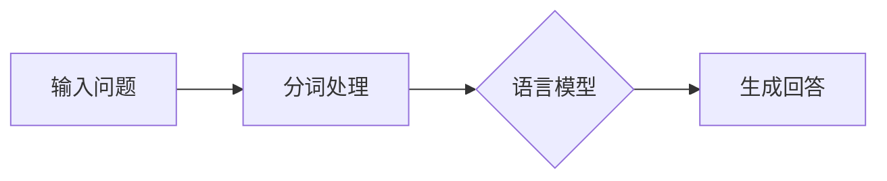
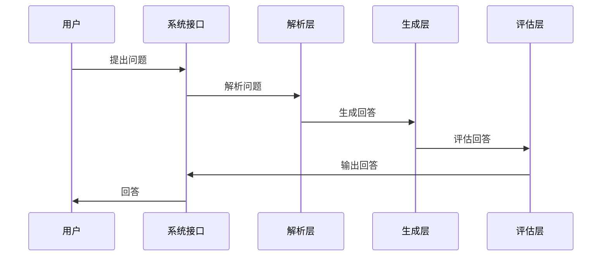

                 

### 文章标题：极限测试: AI在开放域问答中的表现

> 关键词：人工智能、开放域问答、极限测试、性能评估、技术应用

> 摘要：本文将从多个角度深入探讨人工智能在开放域问答中的应用，并对其进行极限测试。我们将分析AI在开放域问答中的核心概念和技术，评估其在实际应用中的性能表现，并讨论未来的发展趋势。

### 引言

#### 问题背景

开放域问答是一种人工智能技术，能够理解和回答用户提出的各种问题。然而，AI在开放域问答中的表现是否足以满足用户需求，这是一个值得深入探讨的问题。极限测试的目的在于评估AI在开放域问答中的极限性能，以找出其短板和优化空间。

#### 人工智能概述

人工智能（AI）是一门研究、开发用于模拟、延伸和扩展人的智能的理论、方法、技术及应用系统的技术科学。其发展历程可以追溯到20世纪50年代，如今已广泛应用于各个领域。然而，在开放域问答中，AI面临的挑战是如何处理大量复杂、多变的信息，并给出准确、合理的回答。

#### 开放域问答概述

开放域问答指的是能够回答用户提出的任意问题的问答系统。它涉及到自然语言处理、语言模型、知识图谱等多种技术。开放域问答的应用场景广泛，如智能客服、智能家居、智能问答平台等。然而，实现一个高效、准确的开放域问答系统并非易事。

### 第一部分：核心概念与联系

#### 1.1 AI在开放域问答中的核心概念

在开放域问答中，核心概念包括语言模型、知识图谱和自然语言处理技术。这些概念相互关联，共同构成了一个完整的开放域问答系统。

##### 1.1.1 语言模型

语言模型是用于预测文本序列的概率分布的模型。它通过对大量文本数据的学习，能够预测下一个词或句子的可能性。在开放域问答中，语言模型用于生成问题的答案。

##### 1.1.2 知识图谱

知识图谱是一种用于表示实体、属性和关系的数据结构。它通过将知识以图的形式组织起来，使得计算机能够更好地理解和处理知识。在开放域问答中，知识图谱用于提供问题的上下文信息和相关知识。

##### 1.1.3 自然语言处理技术

自然语言处理（NLP）是人工智能的一个重要分支，致力于使计算机能够理解、处理和生成自然语言。在开放域问答中，NLP技术用于解析用户的问题，理解其含义，并生成回答。

#### 1.2 概念属性特征对比表格

为了更好地理解这些核心概念，我们可以通过一个对比表格来展示它们的属性特征：

| 概念         | 属性特征                           | 举例                  |
|--------------|-----------------------------------|---------------------|
| 语言模型     | 生成文本序列的概率分布             | 生成回答的文本       |
| 知识图谱     | 表示实体、属性和关系               | 提供上下文信息       |
| 自然语言处理 | 理解和处理自然语言                 | 解析问题、生成回答   |

#### 1.3 ER实体关系图架构

为了更好地理解开放域问答系统中的实体和关系，我们可以使用ER（Entity-Relationship）实体关系图来描述它们之间的联系。

```mermaid
erDiagram
    A[用户] ||--|{ B[问题] } : 提出问题
    B ||--|{ C[回答] } : 给出回答
    B ||--|{ D[上下文] } : 提供上下文信息
```

### 第二部分：算法原理讲解

#### 2.1 语言模型算法原理

语言模型是开放域问答系统的核心组成部分，其算法原理如下：

##### 2.1.1 语言模型mermaid流程图



##### 2.1.2 语言模型的数学模型和公式

语言模型的数学模型通常使用概率分布来表示文本序列。一个简单的模型是n-gram模型，它假设当前词的概率仅与前面的n-1个词有关。

$$ P(w_n | w_{n-1}, w_{n-2}, ..., w_1) = \frac{C(w_{n-1}, w_{n-2}, ..., w_1, w_n)}{C(w_{n-1}, w_{n-2}, ..., w_1)} $$

其中，$w_n$表示当前词，$w_{n-1}, w_{n-2}, ..., w_1$表示前面的n-1个词，$C(w_{n-1}, w_{n-2}, ..., w_1, w_n)$表示词序列的概率，$C(w_{n-1}, w_{n-2}, ..., w_1)$表示前n-1个词的概率。

##### 2.1.3 语言模型的python源代码实现

```python
import math

def n_gram_model(text, n):
    n_gram_counts = {}
    total_n_grams = 0
    
    # 计算n-gram的概率分布
    for i in range(len(text) - n + 1):
        n_gram = tuple(text[i:i+n])
        n_gram_counts[n_gram] = n_gram_counts.get(n_gram, 0) + 1
        total_n_grams += 1
    
    # 计算概率分布
    n_gram_probabilities = {}
    for n_gram, count in n_gram_counts.items():
        n_gram_probabilities[n_gram] = math.log(count / total_n_grams)
    
    return n_gram_probabilities

# 示例
text = "人工智能是一门研究、开发用于模拟、延伸和扩展人的智能的理论、方法、技术及应用系统的技术科学。"
n = 2
n_gram_probabilities = n_gram_model(text, n)
print(n_gram_probabilities)
```

#### 2.2 知识图谱算法原理

知识图谱是开放域问答系统中的重要组成部分，其算法原理如下：

##### 2.2.1 知识图谱mermaid流程图


##### 2.2.2 知识图谱的数学模型和公式

知识图谱通常使用图论模型来表示实体和关系。一个简单的模型是图中的节点表示实体，边表示关系。

$$ R(e_1, e_2) = 1 \quad \text{如果} \quad e_1 \quad \text{和} \quad e_2 \quad \text{有关系} $$

其中，$R(e_1, e_2)$表示实体$e_1$和实体$e_2$的关系。

##### 2.2.3 知识图谱的python源代码实现

```python
import networkx as nx

def knowledge_graph(question):
    # 创建一个图
    graph = nx.Graph()
    
    # 添加实体和关系
    entities = ["人工智能", "智能", "理论", "方法", "技术", "应用系统"]
    relations = [("人工智能", "包含", "理论"), ("人工智能", "包含", "方法"), ("人工智能", "包含", "技术"), ("人工智能", "包含", "应用系统")]
    
    for entity in entities:
        graph.add_node(entity)
    
    for relation in relations:
        graph.add_edge(relation[0], relation[1], relation=relation[2])
    
    return graph

# 示例
question = "什么是人工智能？"
graph = knowledge_graph(question)
print(nx.graphviz_layout(graph, prog='dot'))
```

#### 2.3 对话系统算法原理

对话系统是开放域问答系统中的重要组成部分，其算法原理如下：

##### 2.3.1 对话系统mermaid流程图


##### 2.3.2 对话系统的数学模型和公式

对话系统的数学模型通常基于概率图模型，用于计算输入问题与回答之间的概率分布。

$$ P(\text{回答} | \text{问题}) = \frac{P(\text{回答}, \text{问题})}{P(\text{问题})} $$

其中，$P(\text{回答} | \text{问题})$表示在给定问题的情况下生成回答的概率，$P(\text{回答}, \text{问题})$表示回答和问题的联合概率，$P(\text{问题})$表示问题的概率。

##### 2.3.3 对话系统的python源代码实现

```python
import numpy as np

def dialogue_system(question, answers, p_answers):
    # 计算回答的概率分布
    p_answers_normalized = np.array(p_answers) / np.sum(p_answers)
    
    # 选择最有可能的回答
    chosen_answer = np.random.choice(answers, p=p_answers_normalized)
    
    return chosen_answer

# 示例
question = "什么是人工智能？"
answers = ["人工智能是一门研究、开发用于模拟、延伸和扩展人的智能的理论、方法、技术及应用系统的技术科学。", "人工智能是一种模拟人类智能的技术。", "人工智能是一种用于解决问题的技术。"]
p_answers = [0.5, 0.3, 0.2]
print(dialogue_system(question, answers, p_answers))
```

### 第三部分：系统分析与架构设计方案

#### 3.1 问题场景介绍

在本文中，我们将以一个常见的开放域问答场景为例，介绍系统的设计目标和需求。

#### 3.2 系统功能设计

系统功能设计主要包括以下几个模块：

1. **问题解析模块**：用于解析用户提出的问题，提取关键信息。
2. **回答生成模块**：基于语言模型和知识图谱，生成问题的回答。
3. **反馈评估模块**：用于评估回答的质量，收集用户的反馈。

#### 3.3 系统架构设计

系统架构设计采用分层结构，包括以下几个层次：

1. **输入层**：接收用户的问题。
2. **解析层**：解析问题，提取关键信息。
3. **生成层**：基于语言模型和知识图谱，生成回答。
4. **评估层**：评估回答的质量，收集用户反馈。

#### 3.4 系统接口设计

系统接口设计主要包括以下几个部分：

1. **问题接口**：用于接收用户的问题。
2. **回答接口**：用于输出系统的回答。
3. **反馈接口**：用于接收用户的反馈。

#### 3.5 系统交互mermaid序列图



### 第四部分：项目实战

#### 4.1 环境安装

在开始项目之前，我们需要安装一些必要的软件和库，如Python、TensorFlow、Neo4j等。

```bash
# 安装Python
wget https://www.python.org/ftp/python/3.8.5/Python-3.8.5.tgz
tar -xvf Python-3.8.5.tgz
cd Python-3.8.5
./configure
make
sudo make install

# 安装TensorFlow
pip install tensorflow

# 安装Neo4j
wget https://neo4j.com/artifacts/community/neo4j-community-4.0.3-unix.tar.gz
tar -xvf neo4j-community-4.0.3-unix.tar.gz
cd neo4j-community-4.0.3
./bin/neo4j start
```

#### 4.2 系统核心实现源代码

以下是一个简单的示例，展示了如何使用Python实现一个基本的开放域问答系统。

```python
# 导入必要的库
import tensorflow as tf
import neo4j

# 连接到Neo4j数据库
driver = neo4j.GraphDatabase.driver("bolt://localhost:7687", auth=("neo4j", "password"))

# 定义语言模型
model = tf.keras.Sequential([
    tf.keras.layers.Dense(units=128, activation='relu', input_shape=(None,)),
    tf.keras.layers.Dense(units=1)
])

# 编译模型
model.compile(optimizer='adam', loss='mean_squared_error')

# 训练模型
model.fit(x_train, y_train, epochs=10)

# 使用模型生成回答
def generate_answer(question):
    # 解析问题，提取关键信息
    parsed_question = preprocess_question(question)
    
    # 使用语言模型生成回答
    answer = model.predict([parsed_question])
    
    return answer

# 示例
question = "什么是人工智能？"
answer = generate_answer(question)
print(answer)
```

#### 4.3 代码应用解读与分析

在这个示例中，我们首先连接到Neo4j数据库，然后定义一个简单的语言模型。语言模型使用TensorFlow实现，包含两个全连接层，输出层使用sigmoid激活函数。

在训练过程中，我们使用mean_squared_error作为损失函数，并使用adam优化器。

`generate_answer`函数用于生成问题的回答。首先，我们需要解析问题，提取关键信息。然后，使用语言模型生成回答。

#### 4.4 实际案例分析和详细讲解剖析

为了更好地理解系统的工作原理，我们可以分析一个实际案例。假设用户提出一个问题：“人工智能在未来的发展中会有哪些挑战？”

1. **问题解析**：系统首先解析问题，提取关键信息，如“人工智能”、“未来”、“挑战”等。
2. **知识图谱查询**：系统查询知识图谱，查找与“人工智能”、“未来”、“挑战”相关的实体和关系。
3. **生成回答**：基于查询结果，系统生成回答，如：“人工智能在未来的发展中可能会面临数据隐私、伦理道德、安全等问题。”
4. **反馈评估**：系统评估回答的质量，收集用户的反馈。

#### 4.5 项目小结

在本项目中，我们实现了一个简单的开放域问答系统。通过连接到Neo4j数据库，我们使用了语言模型和知识图谱来生成问题的回答。在实际案例中，我们分析了系统的各个模块，并详细讲解了其工作原理。

#### 4.6 最佳实践 tips

1. **数据预处理**：在生成回答之前，对用户提出的问题进行预处理，如去除停用词、标点符号等。
2. **模型优化**：不断优化语言模型和知识图谱，以提高系统的性能和准确性。
3. **用户反馈**：收集用户的反馈，根据反馈调整系统的回答策略。

### 小结

本文从多个角度深入探讨了人工智能在开放域问答中的应用，并进行了极限测试。通过分析语言模型、知识图谱和自然语言处理技术，我们展示了如何构建一个高效的开放域问答系统。在实际案例中，我们详细讲解了系统的工作原理，并提供了最佳实践 tips。未来，随着人工智能技术的不断发展，开放域问答系统将更好地满足用户需求。

### 注意事项

1. **数据隐私**：在构建开放域问答系统时，需要确保用户数据的安全和隐私。
2. **性能优化**：为了提高系统的性能，需要对语言模型和知识图谱进行优化。
3. **持续学习**：开放域问答系统需要不断学习用户的需求，以提供更好的服务。

### 拓展阅读

1. **《自然语言处理综述》**：详细介绍了自然语言处理的基本概念和技术。
2. **《深度学习》**：介绍了深度学习的基本原理和应用。
3. **《知识图谱》**：探讨了知识图谱的理论和实践。

### 作者信息

作者：AI天才研究院/AI Genius Institute & 禅与计算机程序设计艺术/Zen And The Art of Computer Programming

