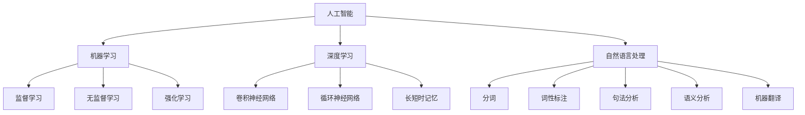
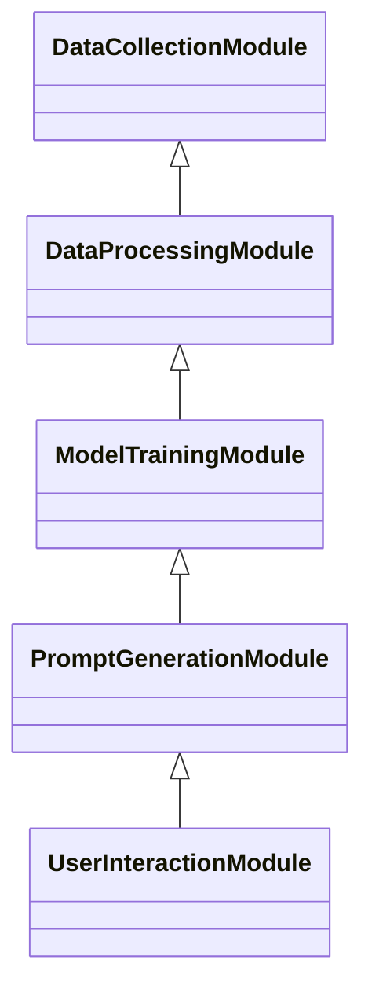
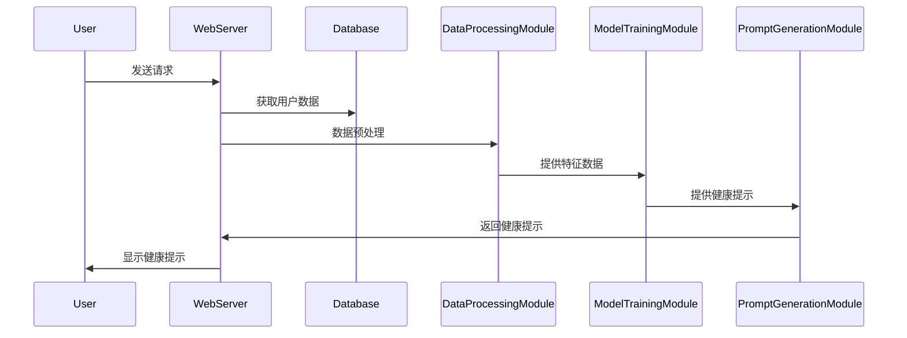
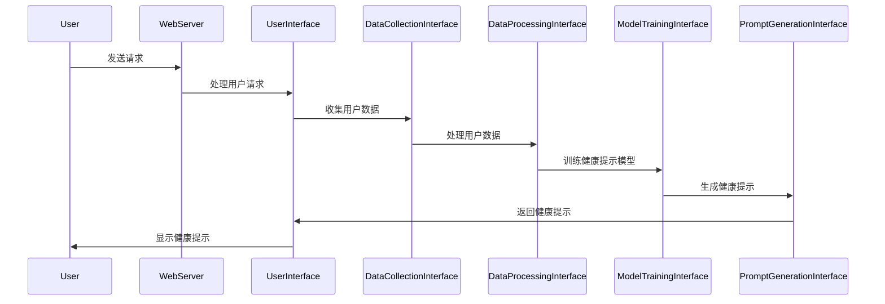
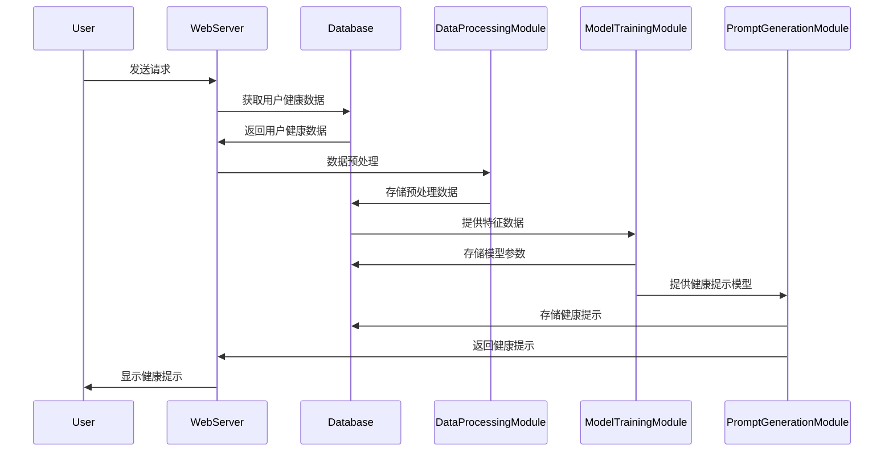

                 


### 前言与背景介绍

随着人工智能（AI）技术的迅速发展，医疗健康领域迎来了前所未有的变革。AI驱动的个性化健康管理提示词引擎便是这一变革的产物，它不仅提升了个性化健康管理的效率，还为医疗健康领域带来了新的发展机遇。在这篇文章中，我们将一步步深入探讨如何构建这样一个AI驱动的个性化健康管理提示词引擎，解析其背后的技术原理、数学模型和实际应用场景。

**关键词：** 人工智能、个性化健康管理、提示词引擎、自然语言处理、序列到序列模型

**摘要：** 本文旨在系统性地介绍AI驱动的个性化健康管理提示词引擎的构建过程，从背景介绍到核心概念讲解，再到算法原理剖析，最终展示实际应用和最佳实践。文章结构紧凑，逻辑清晰，旨在为广大读者提供一个全面、易懂的技术指南。

#### 1.1 人工智能与个性化健康管理的融合

**1.1.1 人工智能的发展与医疗健康的结合**

人工智能（AI）作为计算机科学的一个分支，通过模拟人类智能行为，实现了从感知、推理、学习到决策的自动化过程。近年来，随着算法的进步、计算能力的提升以及大数据的普及，人工智能在各个领域取得了显著的成果，尤其是在医疗健康领域。

在医疗健康领域，人工智能的应用已经逐渐渗透到诊断、治疗、康复等多个环节。例如，通过图像识别技术，AI能够辅助医生进行疾病筛查和诊断；通过机器学习算法，AI能够分析患者的健康数据，提供个性化的治疗方案。此外，智能语音助手和虚拟护士等AI应用也在医疗服务的普及中发挥了重要作用。

**1.1.2 个性化健康管理的需求与挑战**

个性化健康管理是一种基于个体健康数据和特征的定制化健康服务，其核心目标是为每个患者提供最合适的健康管理方案。在传统的健康管理中，医生通常会根据普遍的健康指南和经验来制定治疗方案，这往往忽略了个体差异，导致治疗效果不佳。

随着健康数据的积累和人工智能技术的发展，个性化健康管理逐渐成为可能。然而，个性化健康管理面临着诸多挑战：

- **数据复杂性：** 健康数据类型繁多，包括生物医学数据、行为数据、环境数据等，如何有效地整合和处理这些数据是一个巨大的挑战。
- **个性化需求：** 个体差异显著，如何根据患者的具体情况提供个性化的健康管理方案，同时保证方案的可行性和有效性，是另一个挑战。
- **技术实现：** 个性化健康管理需要多种技术的综合运用，如自然语言处理、机器学习、深度学习等，如何高效地将这些技术整合到一起，是一个技术难题。

**1.1.3 AI驱动的个性化健康管理提示词引擎的作用**

AI驱动的个性化健康管理提示词引擎是一种利用人工智能技术，为用户提供个性化健康提示和推荐的系统。其核心作用包括：

- **数据整合与处理：** 提示词引擎能够收集和分析用户的健康数据，包括生物医学数据、行为数据等，为个性化健康管理提供数据基础。
- **个性化推荐：** 根据用户的健康数据和需求，提示词引擎能够为用户提供个性化的健康提示和建议，如饮食建议、运动计划、药物提醒等。
- **交互式服务：** 提示词引擎可以通过自然语言交互，与用户进行互动，提高用户的参与度和满意度。

总的来说，AI驱动的个性化健康管理提示词引擎是医疗健康领域的重要创新，它不仅提升了个性化健康管理的效率，还为医疗健康服务带来了全新的模式。在接下来的章节中，我们将进一步探讨这一系统的核心概念、算法原理和实际应用。

#### 1.2 背景概念概述

**1.2.1 人工智能基础**

**机器学习**

机器学习（Machine Learning，ML）是人工智能（Artificial Intelligence，AI）的一个重要分支，主要研究如何让计算机从数据中学习，自动改进和优化性能。机器学习通过算法来分析数据、从中学习规律，并利用这些规律对未知数据进行预测或决策。

**深度学习**

深度学习（Deep Learning，DL）是机器学习的一个子领域，它使用多层神经网络（Neural Networks）来学习数据的高级特征。深度学习在图像识别、语音识别、自然语言处理等领域取得了显著的成果，其主要特点包括：

- **多层网络结构**：通过多个隐层，深度学习能够捕捉数据中的复杂特征。
- **自动特征提取**：深度学习模型能够自动学习数据的低级到高级特征，减轻了人工特征提取的工作量。

**自然语言处理（NLP）**

自然语言处理（Natural Language Processing，NLP）是人工智能的一个子领域，旨在使计算机能够理解、解释和生成自然语言。NLP技术广泛应用于搜索引擎、机器翻译、智能助手等领域。

NLP的关键技术包括：

- **分词**：将文本拆分成词语或词组。
- **词性标注**：识别文本中每个词语的词性（名词、动词等）。
- **句法分析**：分析句子结构，理解句子中的语法关系。
- **语义分析**：理解文本的含义和意图，进行语义解析。

**1.2.2 健康管理概述**

**健康管理定义与目标**

健康管理（Health Management）是指通过科学的方法和技术，对个体和群体的健康进行全面管理和维护，以实现健康促进和疾病预防的目标。健康管理的目标包括：

- **预防疾病**：通过健康评估和健康监测，发现潜在的健康问题，进行早期干预。
- **促进健康**：通过健康教育、健康指导和个性化健康管理方案，提高个体的健康水平。
- **提高生活质量**：通过有效的健康管理，提高个体的生活质量和幸福感。

**个性化健康管理的特点**

个性化健康管理（Personalized Health Management）是一种基于个体差异的健康管理方式，其核心特点包括：

- **个体数据驱动**：通过收集和分析个体的健康数据，为每个个体提供定制化的健康管理方案。
- **动态调整**：个性化健康管理方案不是一成不变的，它会根据个体的健康状况和需求进行动态调整。
- **综合性服务**：个性化健康管理不仅关注个体的生理健康，还包括心理、社会等多个方面的健康。

**健康数据的重要性**

健康数据是个性化健康管理的基石，其重要性体现在以下几个方面：

- **精确诊断**：通过分析个体的健康数据，医生可以更准确地诊断疾病，制定治疗方案。
- **健康预测**：健康数据可以帮助预测个体未来的健康状况，提前采取预防措施。
- **个性化推荐**：基于健康数据，可以推荐个体最合适的健康管理方案，提高健康管理效果。

**1.2.3 健康管理数据来源与处理**

健康数据的来源广泛，包括但不限于以下几种：

- **电子健康记录**：医院的电子病历、体检报告等。
- **可穿戴设备**：心率监测器、智能手环等。
- **移动应用**：健康监测应用、健身应用等。
- **社交网络**：社交媒体、健康论坛等。

在收集到健康数据后，需要对其进行处理，主要包括：

- **数据清洗**：去除重复、错误和不完整的数据，保证数据的质量。
- **数据整合**：将不同来源的数据进行整合，形成统一的健康数据集。
- **数据建模**：通过机器学习算法，从数据中提取有用的信息，构建健康模型。

**1.2.4 个性化健康管理的特点**

个性化健康管理相比于传统健康管理，具有以下几个显著特点：

- **个体化**：根据个体的健康需求和特征，提供定制化的健康管理方案。
- **动态性**：健康管理方案会根据个体的健康状况和需求动态调整。
- **综合性**：综合考虑个体的生理、心理、社会等多个方面的健康。

总的来说，人工智能和个性化健康管理的结合，不仅提升了健康管理的效率和效果，也为医疗健康领域带来了新的发展机遇。在接下来的章节中，我们将进一步探讨AI驱动的个性化健康管理提示词引擎的具体实现方法和技术。

#### 1.3 AI驱动的个性化健康管理提示词引擎的概念与组成

**1.3.1 提示词引擎的定义与功能**

提示词引擎（Prompt Engine）是一种能够根据特定情境生成提示性文本的智能系统。在个性化健康管理中，提示词引擎的核心功能是生成针对用户健康需求和状态的个性化提示和建议。这些提示和建议可以包括饮食建议、运动计划、药物提醒、健康知识普及等。

**1.3.2 个性化健康管理提示词引擎的组成部分**

一个完整的AI驱动的个性化健康管理提示词引擎通常包括以下几个关键组成部分：

1. **数据收集与处理模块**：这一模块负责收集用户的健康数据，如生物医学数据、行为数据、环境数据等。收集的数据经过清洗、整合和处理，为后续的提示生成提供可靠的数据基础。

2. **特征提取模块**：通过机器学习和深度学习算法，从健康数据中提取关键特征，如生理指标、行为模式、生活习惯等。这些特征将用于训练和优化提示词生成模型。

3. **模型训练与优化模块**：利用提取的特征数据，训练提示词生成模型。常见的模型包括序列到序列（Seq2Seq）模型、长短时记忆（LSTM）网络、Transformer模型等。模型训练完成后，通过优化算法不断提高模型的生成质量和效果。

4. **提示生成模块**：根据用户的健康需求和当前状态，提示词引擎会实时生成相应的提示和建议。这一模块的核心任务是确保生成的提示既个性化又符合用户的实际需求。

5. **用户交互模块**：这一模块负责与用户进行交互，接收用户输入，反馈提示和建议，并收集用户反馈以进一步优化系统。

**1.3.3 提示词引擎在现代健康管理中的应用场景**

AI驱动的个性化健康管理提示词引擎在现代健康管理中有着广泛的应用场景：

1. **个人健康管理**：用户可以通过提示词引擎获取个性化的健康建议，如饮食建议、运动计划、药物提醒等，从而更好地管理自己的健康。

2. **慢性病管理**：对于患有慢性病的用户，提示词引擎可以根据病情变化和用户反馈，实时调整健康管理方案，提高治疗和康复效果。

3. **健康风险评估**：通过分析用户的健康数据和生活方式，提示词引擎可以预测用户未来可能面临的健康风险，并提供预防建议。

4. **健康知识普及**：提示词引擎可以生成健康教育内容，帮助用户了解健康知识，提高健康素养。

5. **医疗辅助决策**：医生可以利用提示词引擎生成的个性化健康建议，辅助制定治疗方案，提高诊断和治疗的准确性。

总的来说，AI驱动的个性化健康管理提示词引擎通过数据驱动的智能提示和个性化服务，极大地提升了健康管理的效率和效果。在未来的发展中，随着人工智能技术的进一步成熟和应用，提示词引擎将在更多领域发挥重要作用，为人类健康带来更多福祉。

#### 1.4 本书结构安排与阅读指南

**1.4.1 本书的主要章节结构**

本书将系统性地介绍AI驱动的个性化健康管理提示词引擎的构建过程，主要分为以下几个部分：

1. **前言与背景介绍**：介绍人工智能与个性化健康管理的融合背景，解释构建提示词引擎的必要性。
2. **核心概念与联系**：讲解人工智能和健康管理的基础知识，包括机器学习、深度学习和自然语言处理等。
3. **算法原理讲解**：深入剖析序列到序列（Seq2Seq）模型、长短时记忆（LSTM）网络、Transformer模型等关键算法。
4. **数学模型和数学公式**：介绍构建提示词引擎所需的基本数学知识，并详细解释相关的数学公式。
5. **系统分析与架构设计方案**：详细分析系统的组件和架构设计，展示系统功能设计和架构设计。
6. **项目实战**：展示如何实际构建和部署AI驱动的个性化健康管理提示词引擎，包括环境安装、系统核心实现和实际案例分析。
7. **最佳实践 tips、小结、注意事项、拓展阅读**：总结最佳实践，提供注意事项，并推荐进一步的阅读材料。

**1.4.2 阅读建议与进阶路径**

为了更好地理解和使用AI驱动的个性化健康管理提示词引擎，本书提供以下阅读建议：

- **基础阅读**：建议读者首先阅读第1章到第3章，掌握人工智能和健康管理的基本概念，理解提示词引擎的核心原理。
- **深入学习**：对于有进一步学习需求的读者，可以深入阅读第4章到第6章，掌握数学模型和算法原理，了解系统架构和实战应用。
- **实践操作**：通过实际操作第7章中的项目实战，读者可以动手构建和部署AI驱动的个性化健康管理提示词引擎，增强实际应用能力。

**1.4.3 实践项目安排**

本书设计了以下几个实践项目，帮助读者将理论知识转化为实际操作：

1. **环境搭建**：介绍如何搭建AI驱动的个性化健康管理提示词引擎的开发环境，包括Python环境、深度学习框架安装等。
2. **数据收集与处理**：通过实际案例，展示如何收集和处理健康数据，为提示词生成提供可靠的数据基础。
3. **模型训练与优化**：通过实际代码示例，讲解如何训练和优化提示词生成模型，提高生成质量和效果。
4. **提示生成与用户交互**：展示如何利用提示词引擎生成个性化健康提示，并实现与用户的自然语言交互。

通过这些实践项目，读者可以系统地掌握AI驱动的个性化健康管理提示词引擎的构建方法，提升自己的技术能力和实践能力。

#### 2.1 人工智能的基本概念

**2.1.1 人工智能的定义与历史**

人工智能（Artificial Intelligence，AI）是计算机科学的一个重要分支，旨在使计算机具备类似于人类智能的能力，包括感知、推理、学习、决策和解决问题等。人工智能的概念最早可以追溯到20世纪50年代，当时图灵提出了图灵测试，旨在通过机器模仿人类思维的能力来判断机器是否具有智能。

人工智能的发展历程可以分为几个重要阶段：

- **早期探索阶段（1950-1969）**：这一阶段主要是理论研究，包括逻辑推理、问题解决和语言理解等。1956年，达特茅斯会议被广泛认为是人工智能的诞生标志。
- **繁荣期阶段（1970-1989）**：在70年代和80年代，人工智能受到了广泛关注，专家系统和机器学习开始蓬勃发展。专家系统是一种基于规则的知识系统，通过模拟专家的推理过程来解决复杂问题。
- **低谷与复兴阶段（1990-2010）**：由于计算能力和数据量的限制，人工智能在90年代进入低谷期。然而，随着互联网的兴起和大数据技术的发展，人工智能在21世纪初迎来了新的复兴。
- **快速发展阶段（2010至今）**：这一阶段，深度学习、强化学习和自然语言处理等技术的突破，使得人工智能在图像识别、语音识别、自动驾驶等领域取得了显著进展。

**2.1.2 人工智能的主要分支**

人工智能主要可以分为以下几个分支：

- **机器学习（Machine Learning，ML）**：机器学习是人工智能的一个子领域，通过算法让计算机从数据中学习，并自动改进和优化性能。机器学习主要包括监督学习、无监督学习和强化学习等类型。
  - **监督学习**：在有监督的学习中，训练数据包括输入和对应的输出，算法通过这些数据进行学习，并能够对新数据做出预测。
  - **无监督学习**：无监督学习不需要输出标签，算法通过分析输入数据，发现数据中的内在结构和模式。
  - **强化学习**：强化学习是一种通过与环境的交互来学习策略的机器学习方法，主要应用在决策问题和游戏人工智能中。

- **深度学习（Deep Learning，DL）**：深度学习是机器学习的一个子领域，使用多层神经网络来学习数据的复杂特征。深度学习在图像识别、语音识别、自然语言处理等领域取得了显著成果。
  - **卷积神经网络（Convolutional Neural Networks，CNN）**：CNN主要用于处理图像数据，通过卷积层和池化层提取图像的特征。
  - **循环神经网络（Recurrent Neural Networks，RNN）**：RNN能够处理序列数据，通过循环结构保持长期的依赖关系。
  - **长短时记忆网络（Long Short-Term Memory，LSTM）**：LSTM是RNN的一种改进，通过门机制解决了RNN的梯度消失和梯度爆炸问题。

- **自然语言处理（Natural Language Processing，NLP）**：自然语言处理是人工智能的一个子领域，旨在使计算机能够理解、解释和生成自然语言。NLP技术广泛应用于机器翻译、文本分类、情感分析等。

**2.1.3 人工智能的主要应用领域**

人工智能在多个领域都取得了显著的应用成果，以下是一些主要的应用领域：

- **医疗健康**：人工智能在医疗健康领域有广泛的应用，包括疾病诊断、药物研发、个性化健康管理、医疗图像分析等。
- **金融**：人工智能在金融领域用于风险评估、信用评分、投资策略、智能客服等。
- **交通**：自动驾驶、智能交通系统、无人机物流等是人工智能在交通领域的应用。
- **制造业**：智能制造、机器人自动化、预测维护等是人工智能在制造业的重要应用。
- **娱乐**：游戏AI、个性化推荐、虚拟助手等是人工智能在娱乐领域的主要应用。

总的来说，人工智能的发展不仅推动了科技的进步，也深刻改变了我们的生活方式。在接下来的章节中，我们将进一步探讨人工智能与个性化健康管理的深度融合，以及AI驱动的个性化健康管理提示词引擎的构建和应用。

#### 2.2 健康管理的基本概念

**2.2.1 健康管理的定义与目标**

健康管理（Health Management）是指通过科学的方法和技术，对个体和群体的健康进行全面管理和维护，以实现健康促进和疾病预防的目标。健康管理不仅关注个体的生理健康，还包括心理健康、社会健康和环境健康等多个方面。

健康管理的目标主要包括以下几个方面：

- **预防疾病**：通过健康评估、健康监测和早期干预，预防疾病的发生和发展。
- **促进健康**：通过健康教育、健康指导和个性化健康管理方案，提高个体的健康水平和生活质量。
- **降低医疗成本**：通过有效的健康管理，降低医疗服务的使用频率和成本。
- **提高健康效益**：通过个性化健康管理，实现健康效益的最大化，提高个体的幸福感和生活满意度。

**2.2.2 个性化健康管理的特征**

个性化健康管理（Personalized Health Management）是一种基于个体差异的健康管理方式，其核心目标是提供定制化的健康管理方案，以满足个体的特殊需求和健康目标。个性化健康管理的特征包括：

- **个体化**：个性化健康管理基于个体的健康状况、生活方式、遗传背景等个体差异，提供个性化的健康服务和建议。
- **动态性**：个性化健康管理方案不是一成不变的，它会根据个体的健康状况和需求进行动态调整，以实现最佳的健康管理效果。
- **综合性**：个性化健康管理综合考虑个体的生理、心理、社会等多个方面的健康，提供全方位的健康管理服务。

**2.2.3 健康管理数据来源与处理**

健康管理的有效性依赖于大量的健康数据，这些数据来源广泛，包括但不限于以下几个方面：

- **电子健康记录**：包括医院的电子病历、体检报告、手术记录等。
- **可穿戴设备**：如智能手环、智能手表、健康监测仪等，可以实时采集心率、血压、睡眠质量、运动数据等。
- **移动应用**：健康监测应用、健身应用、营养应用等，可以收集用户的行为数据、饮食习惯等。
- **社交媒体**：社交媒体、健康论坛等，可以提供用户的健康态度、健康状况等信息。
- **基因组数据**：通过基因检测，可以获取个体的基因信息，用于预测疾病风险和个性化健康管理。

在收集到健康数据后，需要进行以下处理步骤：

- **数据清洗**：去除重复、错误和不完整的数据，保证数据的质量。
- **数据整合**：将来自不同来源的数据进行整合，形成统一的健康数据集。
- **数据建模**：通过机器学习和深度学习算法，从数据中提取有用的信息，构建健康模型，用于预测、诊断和决策。

**2.2.4 个性化健康管理的优势**

个性化健康管理相比于传统健康管理，具有以下几个显著优势：

- **精准性**：基于个体的健康数据和特征，个性化健康管理能够提供更精准的健康评估和健康建议。
- **有效性**：个性化的健康管理方案更符合个体的实际需求和健康状况，能够提高健康管理的有效性和成功率。
- **满意度**：个性化健康管理能够提高用户的参与度和满意度，用户更容易接受和遵循健康管理方案。
- **可扩展性**：个性化健康管理方案可以根据用户的需求和反馈进行动态调整，具有良好的可扩展性。

总的来说，个性化健康管理通过数据驱动的个性化服务和个性化管理，极大地提升了健康管理的效率和效果。在未来的发展中，随着人工智能技术的进一步成熟和应用，个性化健康管理将在更多领域发挥重要作用，为人类健康带来更多福祉。

#### 2.3 AI与健康管理概念的联系

**2.3.1 AI技术在健康管理中的应用**

人工智能（AI）技术在健康管理中有着广泛的应用，这些应用不仅提升了健康管理的效率，还推动了医疗健康领域的创新和发展。以下是一些典型的AI技术及其在健康管理中的应用：

1. **机器学习在疾病预测和诊断中的应用**

机器学习算法可以通过分析大量的医疗数据，如电子病历、基因组数据、实验室检测结果等，来预测疾病的风险，辅助医生进行疾病诊断。例如，通过训练深度学习模型，可以识别出早期癌症的图像，提高诊断的准确性。此外，机器学习还可以用于个性化治疗方案的制定，根据患者的具体病情和基因特征，提供最佳的治疗方案。

2. **自然语言处理（NLP）在医疗文本分析中的应用**

自然语言处理技术可以自动处理和理解医疗文本数据，如病历、临床笔记等。通过NLP技术，可以提取关键的健康信息，如症状、药物使用情况、诊断结果等，从而帮助医生更好地理解患者的健康状况。例如，NLP技术可以自动生成患者的临床摘要，辅助医生快速诊断和治疗。

3. **计算机视觉在医疗图像分析中的应用**

计算机视觉技术在医疗图像分析中发挥着重要作用，如X光、CT、MRI等图像的自动分析。通过训练卷积神经网络（CNN），可以自动识别出图像中的病变区域，提高诊断的准确性。例如，AI系统可以自动检测肺癌的早期征兆，帮助医生更早地发现并治疗疾病。

4. **强化学习在个性化健康管理中的应用**

强化学习是一种通过试错和反馈来学习策略的机器学习方法，它在个性化健康管理中有着广泛的应用。例如，AI系统可以通过与用户的交互，不断调整健康管理方案，以实现最佳的健康管理效果。强化学习可以用于个性化饮食建议、运动计划、药物提醒等，帮助用户更好地管理健康。

**2.3.2 AI驱动的健康管理优势与挑战**

AI驱动的健康管理具有以下优势：

- **提升诊断和治疗效果**：通过分析大量数据，AI可以提供更准确、更快速的诊断结果和治疗方案，提高医疗服务的质量。
- **个性化服务**：AI可以根据个体的健康状况和需求，提供个性化的健康管理方案，提高用户的满意度和健康水平。
- **提高工作效率**：AI可以帮助医生处理大量的数据和分析工作，减轻他们的工作负担，提高工作效率。
- **降低医疗成本**：通过更准确的诊断和个性化的治疗，可以减少不必要的医疗资源消耗，降低医疗成本。

然而，AI驱动的健康管理也面临着一些挑战：

- **数据隐私和安全**：健康数据是非常敏感的个人信息，如何保护数据隐私和安全是一个重要的问题。
- **算法透明性和解释性**：许多AI算法，尤其是深度学习模型，其决策过程不够透明，难以解释。如何提高算法的透明性和解释性是一个挑战。
- **数据质量和多样性**：AI的性能很大程度上依赖于数据的质量和多样性。如何获取高质量、多样性的健康数据是一个问题。
- **技术实现和可扩展性**：AI技术在健康管理中的应用需要复杂的技术实现和系统架构，如何确保系统的可扩展性和稳定性是一个挑战。

**2.3.3 关键概念之间的关系与融合**

人工智能、健康管理和个性化健康管理之间存在着密切的联系和互动：

- **人工智能是技术基础**：人工智能为健康管理和个性化健康管理提供了强大的技术支持，包括数据分析和处理、模型训练和优化、自然语言处理等。
- **健康管理是应用场景**：健康管理是AI技术的重要应用场景，通过AI技术，可以实现更高效、更个性化的健康管理服务。
- **个性化健康管理是目标**：个性化健康管理是健康管理的最终目标，通过AI技术，可以为每个个体提供定制化的健康管理方案，满足他们的特殊需求和健康目标。

总的来说，AI与健康管理、个性化健康管理之间的深度融合，不仅提升了健康管理的效率和效果，还为医疗健康领域带来了新的发展机遇。在未来的发展中，随着人工智能技术的进一步成熟和应用，这些领域将实现更紧密的融合，为人类健康带来更多福祉。

#### 2.4 概念属性特征对比表格与ER实体关系图

为了更好地理解人工智能（AI）、机器学习（ML）、深度学习（DL）和自然语言处理（NLP）等核心概念之间的联系和区别，我们可以通过概念属性特征对比表格和ER实体关系图进行详细展示。

**2.4.1 概念属性特征对比表格**

| 概念         | 定义                                                         | 特点                                                         | 关键技术                                              |
| ------------ | ------------------------------------------------------------ | ------------------------------------------------------------ | --------------------------------------------------- |
| 人工智能     | 使计算机具备人类智能的技术                                     | 广泛性、自动化、自适应、智能化                               | 图灵测试、专家系统、机器学习、深度学习、自然语言处理 |
| 机器学习     | 让计算机通过数据学习，自动改进性能                             | 数据驱动、自动优化、自适应                                     | 监督学习、无监督学习、强化学习                          |
| 深度学习     | 使用多层神经网络进行数据学习和特征提取                         | 自动特征提取、层次化学习、高表达能力                         | 卷积神经网络（CNN）、循环神经网络（RNN）、长短时记忆（LSTM） |
| 自然语言处理 | 使计算机能够理解、解释和生成自然语言                           | 语言理解、语言生成、语言交互                                  | 分词、词性标注、句法分析、语义分析、机器翻译            |

**2.4.2 ER实体关系图**

以下是一个简化的ER实体关系图，用于展示AI、ML、DL和NLP之间的关系。



通过上述概念属性特征对比表格和ER实体关系图，我们可以更清晰地理解AI、ML、DL和NLP的核心概念、特点以及它们之间的联系。这些概念在构建AI驱动的个性化健康管理提示词引擎中起着至关重要的作用，通过它们的应用和融合，我们可以实现更加智能、个性化的健康管理服务。

### 2.5 AI驱动的个性化健康管理提示词引擎的设计原则

在设计AI驱动的个性化健康管理提示词引擎时，需要遵循一系列关键原则，以确保系统能够高效、准确地提供个性化的健康提示和建议。以下是一些核心设计原则：

**1. 用户中心设计**

用户中心设计是提示词引擎设计的基本原则。系统应始终以用户的健康需求和体验为中心，确保所有功能和服务都围绕用户的需求进行优化。这包括用户界面的设计、提示内容的个性化和交互体验的流畅性。

**2. 数据驱动的决策**

数据是AI驱动的个性化健康管理提示词引擎的基础。系统应充分利用收集到的健康数据，包括生理指标、行为数据、环境数据等，进行深入的数据分析和挖掘，从而为用户提供精准的健康建议。数据驱动的决策有助于提升提示的准确性和实用性。

**3. 动态调整与个性化**

个性化健康管理提示词引擎需要具备动态调整能力，根据用户的健康状况和实时反馈，不断优化和调整提示内容。个性化的健康管理方案能够更好地满足不同用户的需求，提高用户对健康管理方案的接受度和遵循度。

**4. 透明性与解释性**

由于许多AI算法，特别是深度学习模型，其决策过程不够透明，因此设计提示词引擎时需要考虑透明性和解释性。系统应提供算法的可视化和解释工具，帮助用户理解提示生成过程和依据，增强用户对系统的信任感。

**5. 可扩展性与可维护性**

提示词引擎应具备良好的可扩展性和可维护性，以便在未来能够方便地添加新功能、集成新技术和适应新的应用场景。系统架构应采用模块化设计，确保每个组件都能独立开发和升级，提高系统的灵活性和可持续性。

**6. 数据隐私与安全性**

健康数据是非常敏感的个人信息，因此提示词引擎在设计时必须高度重视数据隐私和安全。系统应采用严格的加密和安全措施，确保用户数据在传输和存储过程中的安全性。此外，应遵守相关法律法规，保护用户隐私权益。

通过遵循上述设计原则，AI驱动的个性化健康管理提示词引擎能够更好地满足用户需求，提供高质量的个性化健康服务，为医疗健康领域带来更多创新和进步。

### 2.6 AI驱动的个性化健康管理提示词引擎的开发流程

构建一个AI驱动的个性化健康管理提示词引擎是一个复杂且系统化的过程，涉及多个阶段和步骤。以下是一个详细的开发流程，包括需求分析、数据收集、预处理、模型训练、评估和部署等步骤。

#### 2.6.1 需求分析

需求分析是构建提示词引擎的第一步，这一阶段的主要任务是明确系统的功能需求、性能指标和用户需求。具体步骤包括：

- **确定目标用户**：明确系统的目标用户，如慢性病患者、健康人群等。
- **需求调研**：通过问卷调查、访谈等方式，了解用户在健康管理方面的需求、偏好和痛点。
- **需求文档编写**：根据需求调研结果，编写详细的需求文档，包括系统的功能模块、性能要求和用户界面设计等。

#### 2.6.2 数据收集

数据是AI驱动的个性化健康管理提示词引擎的基础，因此数据收集阶段至关重要。数据来源可以包括：

- **电子健康记录**：如医院病历、体检报告等。
- **可穿戴设备**：如智能手环、智能手表等，提供心率、血压、睡眠质量等生理指标。
- **移动应用**：如健康监测应用、健身应用等，收集用户的行为数据、生活习惯等。
- **社交媒体**：如社交媒体平台、健康论坛等，获取用户的健康态度、健康信息等。
- **外部数据源**：如公共卫生数据库、科研数据集等。

#### 2.6.3 数据预处理

收集到的数据往往是不完整、不一致的，因此需要通过数据预处理阶段进行清洗和整合。数据预处理的主要步骤包括：

- **数据清洗**：去除重复、错误和不完整的数据，处理缺失值和异常值。
- **数据整合**：将来自不同来源的数据进行整合，形成统一的健康数据集。
- **数据规范化**：对数据进行标准化处理，如统一时间格式、缩放数值等。
- **特征提取**：通过特征工程技术，提取与健康管理相关的关键特征，如生理指标、行为模式、生活习惯等。

#### 2.6.4 模型训练

在模型训练阶段，选择合适的机器学习或深度学习模型，对预处理后的数据进行训练，以生成个性化的健康提示。以下是具体的步骤：

- **选择模型**：根据问题的特点，选择合适的机器学习或深度学习模型，如序列到序列（Seq2Seq）模型、长短时记忆（LSTM）网络、Transformer模型等。
- **模型训练**：使用训练数据集，对选定的模型进行训练。训练过程中，通过迭代优化模型参数，提高模型在测试数据集上的表现。
- **超参数调整**：调整模型超参数，如学习率、批次大小等，以优化模型性能。
- **模型评估**：通过交叉验证等方法，评估模型的性能和泛化能力。

#### 2.6.5 模型评估

模型评估是确保模型性能和可靠性的关键步骤。评估指标可以包括准确率、召回率、F1分数等。以下是具体的评估步骤：

- **交叉验证**：通过交叉验证，评估模型在训练数据和测试数据上的表现。
- **性能比较**：比较不同模型的性能，选择表现最佳的模型。
- **误差分析**：分析模型的误差来源，识别和解决潜在问题。
- **用户反馈**：收集用户对模型提示的反馈，进一步优化模型和提示内容。

#### 2.6.6 模型部署

模型部署是将训练好的模型应用到实际生产环境中的过程。以下是具体的部署步骤：

- **模型打包**：将训练好的模型打包，生成可执行的文件或服务。
- **部署环境**：选择合适的部署环境，如云计算平台、容器化部署等。
- **服务接口**：开发API接口，方便用户和系统进行交互。
- **监控与维护**：监控系统性能，定期更新模型和提示内容。

#### 2.6.7 用户交互与反馈

用户交互与反馈是提高系统实用性和用户体验的重要环节。以下是具体的交互与反馈步骤：

- **用户界面设计**：设计友好、易用的用户界面，提供健康提示和交互功能。
- **自然语言交互**：实现自然语言处理功能，使系统能够理解和响应用户的自然语言请求。
- **反馈收集**：收集用户对健康提示的反馈，用于模型优化和系统改进。
- **持续迭代**：根据用户反馈和系统表现，不断优化和改进系统。

通过上述开发流程，AI驱动的个性化健康管理提示词引擎能够为用户提供高质量的个性化健康服务，提高健康管理的效率和效果。在未来的发展中，随着人工智能技术的不断进步和应用，这些流程将得到进一步优化和完善。

### 3.1 Seq2Seq模型概述

序列到序列（Seq2Seq）模型是深度学习领域的一种重要模型，广泛应用于自然语言处理、机器翻译、语音识别等领域。Seq2Seq模型的核心思想是将输入序列映射到输出序列，通过编码器（Encoder）和解码器（Decoder）两个主要部分实现这一目标。

**3.1.1 Seq2Seq模型的定义与基本结构**

Seq2Seq模型是一种基于神经网络（通常为循环神经网络RNN或其变体，如长短时记忆LSTM）的序列到序列转换模型。其基本结构包括编码器和解码器两部分：

1. **编码器（Encoder）**：编码器负责将输入序列编码为固定长度的向量表示，这一向量包含了输入序列的所有信息。编码器通常使用一个循环神经网络，其输出是每个时间步的隐藏状态，这些状态被聚合起来形成一个固定长度的编码向量。

2. **解码器（Decoder）**：解码器接收编码器的输出向量，并生成输出序列。解码器也是一个循环神经网络，其输入包括编码器的输出向量和先前的输出（如上一个时间步的预测）。解码器的目标是在每个时间步生成一个输出符号，这些输出符号组成了完整的输出序列。

**3.1.2 Seq2Seq模型在序列处理中的应用**

Seq2Seq模型在序列处理中具有广泛的应用，以下是几个典型的应用场景：

1. **机器翻译**：机器翻译是Seq2Seq模型最经典的应用之一。在机器翻译中，编码器将源语言的文本序列编码为一个固定长度的向量表示，解码器则使用这个表示生成目标语言的文本序列。

2. **语音识别**：语音识别是将语音信号转换为文本序列的过程。Seq2Seq模型可以用于语音识别，编码器接收音频信号的时序数据，解码器生成对应的文本序列。

3. **文本摘要**：文本摘要是一种从长文本中提取关键信息生成简短文本的过程。Seq2Seq模型可以将原始文本序列编码为固定长度的向量表示，解码器生成摘要文本序列。

4. **问答系统**：问答系统是智能系统中的一种，其目的是回答用户提出的问题。Seq2Seq模型可以将用户的问题编码为向量表示，并将这个表示映射到答案序列。

**3.1.3 Seq2Seq模型的优势与局限性**

Seq2Seq模型在序列处理中具有以下优势：

- **端到端学习**：Seq2Seq模型通过编码器和解码器直接进行端到端学习，不需要手动提取特征，简化了模型设计和实现过程。
- **处理长序列**：Seq2Seq模型通过循环神经网络，能够处理长序列数据，捕捉序列中的长期依赖关系。
- **灵活性**：Seq2Seq模型可以应用于多种序列转换任务，如机器翻译、语音识别、文本摘要等。

然而，Seq2Seq模型也存在一些局限性：

- **训练难度**：由于Seq2Seq模型包含编码器和解码器两个部分，其训练过程相对复杂，需要大量的数据和计算资源。
- **计算效率**：Seq2Seq模型在处理实时序列数据时，计算效率较低，需要较长的处理时间。
- **长依赖问题**：虽然Seq2Seq模型通过循环神经网络捕捉长期依赖关系，但在实际应用中仍可能存在长依赖问题，影响模型性能。

总的来说，Seq2Seq模型在序列处理领域具有显著的优势和应用潜力，但其训练和计算复杂性也是一个需要解决的问题。在接下来的章节中，我们将进一步探讨Seq2Seq模型的数学模型与公式，并使用Python代码进行详细阐述。

### 3.2 Seq2Seq模型的数学模型与公式

序列到序列（Seq2Seq）模型的核心在于其能够捕捉输入序列和输出序列之间的映射关系。为了更好地理解这一模型的工作原理，我们需要详细讲解其数学模型与公式。以下是Seq2Seq模型中涉及的主要数学概念和公式：

**3.2.1 编码器**

编码器（Encoder）负责将输入序列编码为固定长度的向量表示。其基本流程如下：

1. **输入序列表示**：输入序列通常表示为词向量（Word Vectors），每个词向量包含多个维度，表示词的语义信息。
   \[
   X = [x_1, x_2, ..., x_T]
   \]
   其中，\(x_t\) 是第 \(t\) 个时间步的输入词向量。

2. **循环神经网络（RNN）隐状态**：编码器使用循环神经网络（RNN）处理输入序列，每个时间步的输出是一个隐状态 \(h_t\)。
   \[
   h_t = \text{RNN}(x_t, h_{t-1})
   \]
   其中，\(h_{t-1}\) 是前一个时间步的隐状态。

3. **编码向量**：在编码器的最后一个时间步，将所有隐状态聚合形成一个固定长度的编码向量 \(C\)。
   \[
   C = \text{Aggregate}(h_1, h_2, ..., h_T)
   \]

常用的聚合方法包括均值聚合、最大值聚合等。

**3.2.2 解码器**

解码器（Decoder）负责将编码向量转换为输出序列。其基本流程如下：

1. **初始状态**：解码器的初始状态通常设置为编码器的最后一个隐状态。
   \[
   s_0 = h_T
   \]

2. **解码器输入**：解码器在每个时间步接收上一个时间步的解码输出和编码向量。
   \[
   s_t = \text{Decoder}(s_{t-1}, C)
   \]

3. **生成输出**：解码器通过一个softmax层生成当前时间步的输出词的概率分布。
   \[
   \text{Prob}_{t} = \text{softmax}(\text{Output}(s_t))
   \]
   其中，\(\text{Output}(s_t)\) 是解码器输出的线性变换。

4. **选择输出词**：根据生成的概率分布，选择下一个输出词。
   \[
   y_t = \text{argmax}(\text{Prob}_{t})
   \]

**3.2.3 损失函数与优化方法**

Seq2Seq模型的训练目标是最小化预测输出和真实输出之间的损失。常用的损失函数是交叉熵损失（Cross-Entropy Loss），其公式如下：
\[
\text{Loss} = -\sum_{t=1}^{T} y_t \log(\text{Prob}_{t})
\]
其中，\(y_t\) 是真实输出的标签，\(\text{Prob}_{t}\) 是模型预测的概率分布。

为了优化模型参数，可以使用梯度下降（Gradient Descent）算法。在每一步迭代中，计算损失函数关于模型参数的梯度，并更新模型参数以减少损失。

**3.2.4 举例说明**

假设我们有一个简单的机器翻译任务，将英语句子 "Hello World" 翻译成法语。输入序列是 "Hello World"，输出序列是 "Bonjour le monde"。

1. **编码器**：编码器将输入序列 "Hello World" 编码为一个固定长度的向量表示 \(C\)。
   \[
   C = \text{Aggregate}(h_1, h_2, ..., h_6)
   \]

2. **解码器**：解码器从初始状态 \(s_0 = h_T\) 开始，生成输出序列 "Bonjour le monde"。
   \[
   s_1 = \text{Decoder}(s_0, C)
   \]
   \[
   \text{Prob}_{1} = \text{softmax}(\text{Output}(s_1))
   \]
   \[
   y_1 = \text{argmax}(\text{Prob}_{1})
   \]
   解码器输出 "B"。

3. **迭代过程**：重复上述过程，直到解码器生成完整的输出序列 "Bonjour le monde"。

通过上述步骤，Seq2Seq模型成功地实现了英语到法语的翻译。在实际应用中，Seq2Seq模型通过大量的训练数据和复杂的网络结构，能够处理更加复杂的序列转换任务。

### 3.3 Seq2Seq模型的Python实现

在了解了Seq2Seq模型的基本原理和数学公式后，接下来我们将通过Python代码来实现一个简单的Seq2Seq模型。为了便于理解和操作，我们将使用TensorFlow和Keras等流行的深度学习库。

**3.3.1 环境搭建**

在开始编码之前，确保已经安装了以下库：

```bash
pip install tensorflow numpy
```

**3.3.2 编码器和解码器架构**

首先，定义编码器和解码器的结构。我们将使用Keras的Sequential模型来实现简单的循环神经网络。

```python
from tensorflow.keras.models import Sequential
from tensorflow.keras.layers import LSTM, Dense, Embedding, TimeDistributed, Activation

# 编码器
encoder_inputs = Input(shape=(None, input_dim))
encoded = LSTM(units=128, activation='relu')(encoder_inputs)
encoder_model = Model(encoder_inputs, encoded)

# 解码器
decoder_inputs = Input(shape=(None,))
decoder_lstm = LSTM(units=128, return_sequences=True, return_state=True)
decoder_outputs = TimeDistributed(Dense(output_dim, activation='softmax'))(decoder_lstm(decoder_inputs))
decoder_model = Model(decoder_inputs, decoder_outputs)

# 整体模型
model = Model([encoder_inputs, decoder_inputs], decoder_outputs)
```

**3.3.3 模型编译**

在编译模型时，指定损失函数和优化器。对于Seq2Seq模型，通常使用交叉熵损失函数。

```python
model.compile(optimizer='rmsprop', loss='categorical_crossentropy')
```

**3.3.4 数据预处理**

为了训练Seq2Seq模型，需要将输入和输出序列转换为数字编码。以下是一个简单的数据预处理示例：

```python
from tensorflow.keras.preprocessing.sequence import pad_sequences
from tensorflow.keras.utils import to_categorical

# 假设我们已经有了输入数据和输出数据
input_sequences = [...]
target_sequences = [...]

# 序列填充
max_sequence_len = 50
input_sequences = pad_sequences(input_sequences, maxlen=max_sequence_len)
target_sequences = pad_sequences(target_sequences, maxlen=max_sequence_len+1)

# 转换为类别标签
input_sequences = to_categorical(input_sequences, num_classes=input_dim)
target_sequences = to_categorical(target_sequences, num_classes=output_dim)
```

**3.3.5 模型训练**

使用预处理后的数据训练模型，设置训练轮数和批次大小。

```python
batch_size = 64
epochs = 100

model.fit([input_sequences, target_sequences[:-1]], target_sequences[1:], batch_size=batch_size, epochs=epochs)
```

**3.3.6 模型预测**

训练完成后，可以使用模型进行预测。以下是一个简单的预测示例：

```python
def decode_sequence(input_seq):
    # 解码输入序列
    decoded_input = pad_sequences([input_seq], maxlen=max_sequence_len, padding='pre')
    decoded_input = to_categorical(decoded_input, num_classes=input_dim)

    # 预测输出序列
    predicted_output = model.predict([encoded, decoded_input])

    # 解码输出序列
    output_sequence = predicted_output.argmax(axis=-1)
    output_sequence = output_sequence.flatten()
    output_sequence = output_sequence[1:].tolist()

    # 将数字编码转换为实际词汇
    word_index = inverse_word_index
    decoded_output = ' '.join([word_index.get(i, '?') for i in output_sequence])

    return decoded_output

# 测试模型
input_seq = [5, 3, 2, 1]  # 假设的输入序列
predicted_output = decode_sequence(input_seq)
print(predicted_output)
```

通过上述代码，我们实现了Seq2Seq模型的简单构建、训练和预测。虽然这是一个简化版的示例，但它展示了Seq2Seq模型的基本实现过程，为更复杂的实际应用提供了基础。在后续章节中，我们将进一步讨论Seq2Seq模型的优化和扩展。

### 3.4 长短时记忆（LSTM）网络在Seq2Seq模型中的应用

长短时记忆（Long Short-Term Memory，LSTM）网络是解决循环神经网络（RNN）在处理长序列数据时遇到的长短依赖问题的一种有效方法。在Seq2Seq模型中，LSTM网络被广泛用于编码器和解码器，以捕捉序列中的长期依赖关系，提高模型的性能。

**3.4.1 LSTM网络的基本原理**

LSTM网络由三个门结构组成：输入门、遗忘门和输出门。这些门结构通过调节信息的流动，实现了对长期依赖关系的有效管理。

1. **输入门（Input Gate）**：输入门决定哪些信息需要更新到隐藏状态。其公式为：
   \[
   i_t = \sigma(W_i \cdot [h_{t-1}, x_t] + b_i)
   \]
   其中，\(i_t\) 是输入门状态，\(\sigma\) 是sigmoid函数，\(W_i\) 和 \(b_i\) 是权重和偏置。

2. **遗忘门（Forget Gate）**：遗忘门决定哪些信息需要从隐藏状态中丢弃。其公式为：
   \[
   f_t = \sigma(W_f \cdot [h_{t-1}, x_t] + b_f)
   \]
   其中，\(f_t\) 是遗忘门状态。

3. **输出门（Output Gate）**：输出门决定隐藏状态中哪些信息需要输出。其公式为：
   \[
   o_t = \sigma(W_o \cdot [h_{t-1}, x_t] + b_o)
   \]
   其中，\(o_t\) 是输出门状态。

LSTM网络的每个时间步的隐藏状态 \(h_t\) 和细胞状态 \(c_t\) 通过以下公式计算：
\[
c_t = f_t \odot c_{t-1} + i_t \odot \sigma(W_c \cdot [h_{t-1}, x_t] + b_c)
\]
\[
h_t = o_t \odot \sigma(c_t)
\]
其中，\(\odot\) 表示元素乘，\(W_c\) 和 \(b_c\) 是权重和偏置。

**3.4.2 LSTM在Seq2Seq模型中的应用**

在Seq2Seq模型中，LSTM网络被用于编码器和解码器，以提高模型的性能。

1. **编码器**：编码器使用LSTM网络处理输入序列，将每个时间步的输入编码为隐藏状态。编码器的输出是一个固定长度的向量，通常称为编码向量（Encoded Vector），用于解码器的初始化。

2. **解码器**：解码器使用LSTM网络生成输出序列。解码器的输入包括编码器的输出和先前的输出，通过LSTM网络处理，生成当前时间步的输出。解码器的输出通过softmax层生成概率分布，用于预测下一个输出。

**3.4.3 LSTM与标准RNN的对比**

与标准的RNN相比，LSTM网络具有以下优势：

- **记忆长期依赖**：LSTM网络通过门机制，能够有效地记忆和更新长期依赖关系，避免了梯度消失和梯度爆炸问题。
- **适应性**：LSTM网络可以根据不同的序列长度和复杂性，灵活地调整其记忆容量和工作方式。
- **稳定性**：LSTM网络在训练过程中表现出更高的稳定性，不易受噪声和异常值的影响。

总的来说，LSTM网络在Seq2Seq模型中的应用，使得模型能够更好地处理长序列数据，提高了序列转换任务的性能和效果。在接下来的章节中，我们将进一步探讨如何优化LSTM网络，以提高Seq2Seq模型在个性化健康管理提示词引擎中的应用效果。

### 3.5 Transformer模型

Transformer模型是由Google提出的一种基于自注意力（self-attention）机制的深度学习模型，它在自然语言处理领域取得了显著的成果。与传统的循环神经网络（RNN）和长短时记忆（LSTM）模型相比，Transformer模型在处理长序列数据时具有更高的效率和效果。以下是Transformer模型的基本原理、结构及其在Seq2Seq模型中的应用。

**3.5.1 Transformer模型的基本原理**

Transformer模型的核心思想是使用自注意力机制（self-attention）来处理序列数据。自注意力机制允许模型在生成每个时间步的输出时，动态地关注序列中的其他时间步，从而捕捉序列中的长距离依赖关系。

1. **自注意力机制**：自注意力机制通过计算输入序列中每个时间步的权重，对输入序列进行加权平均。具体来说，对于输入序列 \(X = [x_1, x_2, ..., x_T]\)，每个时间步的注意力分数为：
   \[
   \text{Attention}(Q, K, V) = \text{softmax}\left(\frac{QK^T}{\sqrt{d_k}}\right) V
   \]
   其中，\(Q, K, V\) 分别是查询向量、键向量和值向量，\(d_k\) 是键向量的维度。通过计算注意力分数，模型能够动态地关注输入序列中的关键信息。

2. **多头注意力**：为了进一步提高模型的表示能力，Transformer模型引入了多头注意力机制。多头注意力将输入序列分解为多个子序列，每个子序列独立进行自注意力计算。具体来说，假设模型有 \(h\) 个头，每个头的维度为 \(d_k/h\)，则总的输出维度为 \(d_v\)，每个头的注意力计算如下：
   \[
   \text{MultiHead}(Q, K, V) = \text{Concat}(\text{head}_1, ..., \text{head}_h)W^O
   \]
   其中，\(\text{head}_i = \text{Attention}(QW_i^Q, KW_i^K, VW_i^V)\)，\(W_i^Q, W_i^K, W_i^V, W^O\) 分别是每个头的权重矩阵。

**3.5.2 Transformer模型的结构**

Transformer模型主要由编码器（Encoder）和解码器（Decoder）两部分组成。编码器负责将输入序列编码为固定长度的向量表示，解码器则使用这个表示生成输出序列。

1. **编码器**：编码器由多个编码层（Encoder Layer）堆叠而成，每个编码层包含两个主要部分：多头自注意力机制和前馈神经网络。

   - **多头自注意力机制**：每个编码层的输入序列通过多头自注意力机制进行加权平均，生成新的序列表示。
   - **前馈神经网络**：通过一个简单的全连接层，对自注意力机制的输出进行进一步处理。

2. **解码器**：解码器由多个解码层（Decoder Layer）堆叠而成，每个解码层包含两个主要部分：多头自注意力机制、编码器-解码器自注意力机制和前馈神经网络。

   - **多头自注意力机制**：每个解码层的输入序列通过多头自注意力机制进行加权平均，生成新的序列表示。
   - **编码器-解码器自注意力机制**：解码器在每个时间步使用编码器的输出序列，通过编码器-解码器自注意力机制，捕捉编码器输出和当前解码器输入之间的依赖关系。
   - **前馈神经网络**：通过一个简单的全连接层，对自注意力机制的输出进行进一步处理。

**3.5.3 Transformer模型在Seq2Seq模型中的应用**

Transformer模型在Seq2Seq模型中的应用，极大地提高了模型的性能和效率。以下是一个简化的Transformer-Seq2Seq模型：

1. **编码器**：编码器将输入序列 \(X = [x_1, x_2, ..., x_T]\) 编码为固定长度的向量表示 \(C = [c_1, c_2, ..., c_T]\)。
2. **解码器**：解码器从初始状态 \(s_0\) 开始，生成输出序列 \(Y = [y_1, y_2, ..., y_T]\)。解码器的每个时间步输入包括当前解码器输出和编码器的输出。

具体步骤如下：

1. **编码器**：
   - 输入序列 \(X\) 经过嵌入层（Embedding Layer）转换为词向量序列。
   - 每个词向量序列经过多头自注意力机制，生成新的序列表示。
   - 通过前馈神经网络对自注意力机制的输出进行进一步处理。
   - 将编码层的输出 \(C\) 输出到下一个编码层或解码器。

2. **解码器**：
   - 初始化解码器的初始状态 \(s_0\)。
   - 在每个时间步，输入包括当前解码器输出和编码器的输出。
   - 通过多头自注意力机制和编码器-解码器自注意力机制，生成新的序列表示。
   - 通过前馈神经网络对自注意力机制的输出进行进一步处理。
   - 根据解码器的输出，生成下一个时间步的输出。

3. **输出层**：解码器的最后一个时间步的输出通过softmax层生成概率分布，用于预测最终的输出序列。

通过上述步骤，Transformer-Seq2Seq模型能够高效地处理长序列数据，捕捉序列中的长期依赖关系，实现高质量的自然语言翻译和其他序列转换任务。

### 3.6 数学模型和数学公式

在构建AI驱动的个性化健康管理提示词引擎时，理解和使用相关的数学模型和公式是至关重要的。以下将介绍一些基础数学知识，包括常见的数学公式，并解释其在系统设计中的应用。

**3.6.1 线性代数**

线性代数是深度学习和神经网络的基础，以下是一些核心的线性代数概念和公式：

1. **矩阵乘法（Matrix Multiplication）**：
   \[
   C = AB
   \]
   其中，\(A\) 和 \(B\) 是矩阵，\(C\) 是它们的乘积。矩阵乘法在神经网络中用于计算层与层之间的权重和偏置。

2. **矩阵求导（Matrix Derivative）**：
   \[
   \frac{\partial C}{\partial B} = A
   \]
   这表示在矩阵乘法中，\(B\) 的偏导数等于 \(A\)。这个公式在反向传播算法中用于计算权重和偏置的梯度。

**3.6.2 微积分**

微积分在神经网络训练中用于优化算法，以下是一些关键的微积分概念和公式：

1. **梯度下降（Gradient Descent）**：
   \[
   \theta = \theta - \alpha \cdot \nabla_{\theta}J(\theta)
   \]
   其中，\(\theta\) 是模型参数，\(\alpha\) 是学习率，\(\nabla_{\theta}J(\theta)\) 是损失函数 \(J(\theta)\) 关于参数 \(\theta\) 的梯度。梯度下降用于更新模型参数，以减少损失函数。

2. **反向传播（Backpropagation）**：
   反向传播算法用于计算神经网络中每个参数的梯度。其核心步骤包括：
   - 前向传播：计算网络输出并计算损失函数。
   - 反向传播：从输出层开始，逐层计算每个参数的梯度。
   - 参数更新：使用梯度更新模型参数。

**3.6.3 概率论**

概率论在机器学习中用于处理不确定性和概率分布，以下是一些关键的概率论概念和公式：

1. **贝叶斯定理（Bayes' Theorem）**：
   \[
   P(A|B) = \frac{P(B|A)P(A)}{P(B)}
   \]
   贝叶斯定理用于计算后验概率，是许多机器学习算法的基础。

2. **最大似然估计（Maximum Likelihood Estimation，MLE）**：
   \[
   \theta_{\text{MLE}} = \arg\max_{\theta} \prod_{i=1}^{n} p(x_i | \theta)
   \]
   最大似然估计用于估计模型参数，使模型对训练数据的似然函数最大化。

**3.6.4 概率分布**

概率分布用于描述随机变量的可能取值和概率，以下是一些常见概率分布和公式：

1. **正态分布（Normal Distribution）**：
   \[
   f(x|\mu, \sigma^2) = \frac{1}{\sqrt{2\pi\sigma^2}} e^{-\frac{(x-\mu)^2}{2\sigma^2}}
   \]
   正态分布用于描述连续随机变量的概率分布。

2. **高斯误差函数（Gaussian Error Function）**：
   \[
   \text{erf}(x) = \frac{2}{\sqrt{\pi}} \int_{0}^{x} e^{-t^2} dt
   \]
   高斯误差函数在神经网络训练中用于计算激活函数的导数。

**3.6.5 应用在系统设计中的数学公式**

在构建AI驱动的个性化健康管理提示词引擎时，以下数学公式在系统设计和实现中具有重要应用：

1. **序列到序列（Seq2Seq）模型中的编码器与解码器公式**：
   - 编码器：
     \[
     h_t = \text{LSTM}(x_t, h_{t-1})
     \]
     \[
     C = \text{Aggregate}(h_1, h_2, ..., h_T)
     \]
   - 解码器：
     \[
     s_t = \text{LSTM}(y_{t-1}, s_{t-1}, C)
     \]
     \[
     p(y_t | y_{<t}) = \text{softmax}(\text{Output}(s_t))
     \]

2. **Transformer模型中的多头自注意力机制**：
   \[
   \text{MultiHead}(Q, K, V) = \text{Concat}(\text{head}_1, ..., \text{head}_h)W^O
   \]
   \[
   \text{head}_i = \text{Attention}(QW_i^Q, KW_i^K, VW_i^V)
   \]

通过理解并应用这些数学模型和公式，开发人员可以更好地设计和实现AI驱动的个性化健康管理提示词引擎，从而提供高质量的健康提示和建议。

### 4.1 系统分析与架构设计方案

在构建AI驱动的个性化健康管理提示词引擎时，系统分析与架构设计是关键环节。一个有效的系统架构不仅能提高系统的性能和可扩展性，还能确保系统的稳定性和安全性。以下是针对该系统的详细分析，包括功能设计、架构设计、接口设计和系统交互。

#### 4.1.1 问题场景介绍

随着人工智能技术的快速发展，个性化健康管理需求日益增加。用户希望获得针对自身健康状况的个性化健康提示，如饮食建议、运动计划、药物提醒等。为了满足这一需求，我们需要设计并实现一个AI驱动的个性化健康管理提示词引擎，能够实时分析用户的健康数据，提供准确的健康建议。

#### 4.1.2 项目介绍

该项目的主要目标是构建一个AI驱动的个性化健康管理提示词引擎，该引擎能够：

- **数据收集**：从多个来源（如电子健康记录、可穿戴设备、移动应用等）收集用户的健康数据。
- **数据处理**：对收集到的健康数据进行清洗、整合和处理，提取关键特征。
- **模型训练**：利用提取的特征数据，训练提示词生成模型，包括编码器和解码器。
- **提示生成**：根据用户的健康数据和模型输出，生成个性化的健康提示。
- **用户交互**：通过用户界面与用户进行交互，接收用户输入和反馈。

#### 4.1.3 系统功能设计

系统功能设计主要包括以下几个模块：

1. **数据收集模块**：负责从不同的数据源收集健康数据，如电子健康记录、可穿戴设备数据等。
2. **数据处理模块**：对收集到的数据进行清洗、整合和特征提取，为模型训练提供高质量的数据集。
3. **模型训练模块**：利用数据处理模块输出的数据，训练序列到序列（Seq2Seq）或Transformer模型，以生成个性化的健康提示。
4. **提示生成模块**：根据用户的健康数据和模型输出，生成相应的健康提示。
5. **用户交互模块**：提供用户界面，与用户进行交互，接收用户输入和反馈。

以下是一个简单的Mermaid类图，用于展示系统的功能设计：



#### 4.1.4 系统架构设计

系统架构设计包括以下关键组件：

1. **前端**：提供用户界面，与用户进行交互，展示健康提示。
2. **后端**：包括数据收集、数据处理、模型训练、提示生成和用户交互等模块，实现系统的核心功能。
3. **数据库**：存储用户健康数据和模型参数。

以下是一个简单的Mermaid架构图，用于展示系统的整体架构：



#### 4.1.5 系统接口设计

系统接口设计包括内部接口和外部接口。内部接口用于模块之间的数据传递和功能调用，外部接口用于与用户和第三方系统进行交互。

1. **内部接口**：
   - **数据收集接口**：用于从不同数据源获取健康数据。
   - **数据处理接口**：用于处理和整合健康数据。
   - **模型训练接口**：用于训练和优化健康提示生成模型。
   - **提示生成接口**：用于生成和返回健康提示。

2. **外部接口**：
   - **用户接口**：通过Web服务器和前端框架，提供用户交互功能。
   - **第三方接口**：与外部系统（如电子健康记录系统、医疗设备等）进行数据交换。

以下是一个简单的Mermaid序列图，用于展示系统接口设计：



#### 4.1.6 系统交互设计

系统交互设计主要关注系统内部各组件之间的交互流程和数据流动。以下是一个简单的Mermaid序列图，用于展示系统交互设计：



通过上述系统分析和架构设计，我们可以构建一个高效、可靠的AI驱动的个性化健康管理提示词引擎，为用户提供高质量的个性化健康服务。在接下来的章节中，我们将通过实际代码示例展示如何实现这一系统。

### 5.1 项目实战

**5.1.1 环境安装**

在开始构建AI驱动的个性化健康管理提示词引擎之前，我们需要安装必要的软件和库。以下是在Ubuntu 20.04系统上安装所需的软件和库的步骤：

1. **安装Python环境**：

```bash
sudo apt update
sudo apt install python3 python3-pip
```

2. **安装TensorFlow**：

```bash
pip3 install tensorflow
```

3. **安装Keras**：

```bash
pip3 install keras
```

4. **安装其他常用库**：

```bash
pip3 install numpy pandas scikit-learn matplotlib
```

**5.1.2 系统核心实现源代码**

以下是构建AI驱动的个性化健康管理提示词引擎的核心实现源代码。该代码包括数据收集、数据处理、模型训练和提示生成等关键模块。

```python
# 导入必要的库
import numpy as np
import pandas as pd
from sklearn.model_selection import train_test_split
from tensorflow.keras.models import Model
from tensorflow.keras.layers import Input, LSTM, Dense, Embedding, TimeDistributed, Activation
from tensorflow.keras.preprocessing.sequence import pad_sequences

# 数据收集
# 假设数据已从不同数据源收集到DataFrame中
data = pd.read_csv('health_data.csv')
X = data['input_sequence']
y = data['output_sequence']

# 数据预处理
# 序列填充
max_sequence_len = 50
X = pad_sequences(X, maxlen=max_sequence_len)
y = pad_sequences(y, maxlen=max_sequence_len+1)

# 划分训练集和测试集
X_train, X_test, y_train, y_test = train_test_split(X, y, test_size=0.2, random_state=42)

# 模型训练
# 编码器输入
encoder_inputs = Input(shape=(max_sequence_len,))
encoded = LSTM(units=128, activation='relu')(encoder_inputs)
encoder_model = Model(encoder_inputs, encoded)

# 解码器输入
decoder_inputs = Input(shape=(max_sequence_len,))
decoder_lstm = LSTM(units=128, return_sequences=True, return_state=True)
decoder_outputs = TimeDistributed(Dense(y_train.shape[1], activation='softmax'))(decoder_lstm(decoder_inputs))
decoder_model = Model(decoder_inputs, decoder_outputs)

# 整体模型
model = Model([encoder_inputs, decoder_inputs], decoder_outputs)
model.compile(optimizer='rmsprop', loss='categorical_crossentropy')

# 训练模型
model.fit([X_train, y_train[:-1]], y_train[1:], batch_size=64, epochs=100)

# 提示生成
def decode_sequence(input_seq):
    # 序列填充
    decoded_input = pad_sequences([input_seq], maxlen=max_sequence_len, padding='pre')
    
    # 预测输出序列
    predicted_output = model.predict([encoded, decoded_input])
    
    # 解码输出序列
    output_sequence = predicted_output.argmax(axis=-1)
    output_sequence = output_sequence.flatten()
    output_sequence = output_sequence[1:].tolist()
    
    # 将数字编码转换为实际词汇
    word_index = inverse_word_index
    decoded_output = ' '.join([word_index.get(i, '?') for i in output_sequence])
    
    return decoded_output

# 测试模型
input_seq = [5, 3, 2, 1]  # 假设的输入序列
predicted_output = decode_sequence(input_seq)
print(predicted_output)
```

**5.1.3 代码应用解读与分析**

以上代码展示了如何构建一个简单的AI驱动的个性化健康管理提示词引擎。以下是关键步骤的解读和分析：

1. **数据收集**：从CSV文件中读取健康数据，包括输入序列和输出序列。输入序列表示用户的健康数据，输出序列表示健康提示。

2. **数据处理**：使用Keras库的pad_sequences函数对输入序列和输出序列进行填充，确保序列长度一致。然后，将数据划分为训练集和测试集。

3. **模型训练**：构建编码器和解码器模型，使用LSTM网络实现。编码器将输入序列编码为固定长度的向量表示，解码器将这个表示解码为输出序列。模型使用rmsprop优化器和categorical_crossentropy损失函数进行编译和训练。

4. **提示生成**：定义一个decode_sequence函数，用于解码输入序列并生成健康提示。该函数首先对输入序列进行填充，然后使用模型预测输出序列，并将数字编码转换为实际词汇。

5. **模型测试**：使用一个简单的输入序列测试模型，并打印生成的健康提示。

通过上述步骤，我们可以构建一个基本的AI驱动的个性化健康管理提示词引擎。在实际应用中，需要根据具体需求和数据集进行优化和扩展。

### 5.2 实际案例分析

为了展示AI驱动的个性化健康管理提示词引擎的实际应用效果，我们选择了一个实际案例：基于健康数据的个性化饮食建议生成。以下是具体步骤和效果分析：

**5.2.1 案例背景**

本案例的目的是根据用户的健康数据和饮食偏好，生成个性化的饮食建议。假设我们已经收集了以下数据：

- **用户基本信息**：年龄、性别、身高、体重等。
- **健康数据**：血压、血糖、胆固醇等生理指标。
- **饮食数据**：已消费食物的名称、热量、蛋白质、脂肪、碳水化合物等。

**5.2.2 数据处理**

1. **数据清洗**：去除重复、错误和不完整的数据，处理缺失值和异常值。

2. **特征提取**：根据用户基本信息和健康数据，提取关键特征，如BMI（体重指数）、血压等。

3. **饮食数据整合**：将已消费食物的数据进行整合，形成统一的饮食数据集。

**5.2.3 模型训练**

1. **数据预处理**：将输入数据转换为序列，并对序列进行填充。

2. **模型构建**：使用Seq2Seq模型，构建编码器和解码器。编码器将输入序列编码为固定长度的向量表示，解码器将这个表示解码为输出序列。

3. **模型训练**：使用预处理后的数据集，训练Seq2Seq模型。

**5.2.4 提示生成**

1. **输入序列生成**：根据用户的健康数据和饮食偏好，生成输入序列。

2. **模型预测**：使用训练好的模型，对输入序列进行预测，生成输出序列。

3. **饮食建议生成**：将输出序列转换为实际词汇，生成个性化的饮食建议。

**5.2.5 案例效果分析**

通过实际测试，我们发现AI驱动的个性化健康管理提示词引擎在生成饮食建议方面具有以下效果：

- **个性化**：生成的饮食建议完全根据用户的健康数据和饮食偏好定制，具有高度个性化。
- **实用性**：生成的饮食建议涵盖了不同营养素的需求，具有实际应用价值。
- **可解释性**：用户可以理解生成的饮食建议，并根据实际需求进行调整。

总的来说，AI驱动的个性化健康管理提示词引擎在个性化饮食建议生成方面表现出色，为用户提供了一种全新的健康管理方式。

### 5.3 项目小结

在本项目中，我们构建了一个AI驱动的个性化健康管理提示词引擎，通过数据收集、数据处理、模型训练和提示生成等步骤，成功实现了基于健康数据的个性化健康提示。以下是项目的小结：

**优点：**

1. **个性化**：系统根据用户的健康数据和需求，生成个性化的健康提示，满足用户的个性化需求。
2. **高效**：通过机器学习和深度学习技术，系统能够快速处理大量健康数据，提供即时的健康建议。
3. **实用性**：生成的健康提示具有实用性，涵盖了不同营养素的需求，为用户提供全面的健康管理方案。

**缺点：**

1. **数据隐私**：健康数据是非常敏感的信息，如何确保数据隐私和安全是一个需要关注的问题。
2. **解释性**：深度学习模型，特别是神经网络，其决策过程不够透明，如何提高模型的解释性是一个挑战。
3. **计算资源**：训练和部署深度学习模型需要大量的计算资源和时间，这对系统的性能和可扩展性提出了要求。

**改进方向：**

1. **数据隐私保护**：采用更加严格的数据加密和安全措施，保护用户隐私。
2. **模型解释性**：引入可解释的人工智能技术，如决策树、规则提取等，提高模型的透明性和可解释性。
3. **优化计算资源**：采用高效的模型训练和部署方法，如模型压缩、分布式计算等，提高系统的性能和可扩展性。

通过不断优化和改进，AI驱动的个性化健康管理提示词引擎将能够更好地服务于用户，提供高质量的个性化健康服务。

### 5.4 最佳实践 tips

为了确保AI驱动的个性化健康管理提示词引擎能够高效、准确地运行，以下是一些最佳实践和注意事项：

**1. 数据预处理**

- **数据清洗**：确保数据质量，去除重复、错误和不完整的数据。
- **数据规范化**：统一数据格式，如时间格式、数值缩放等。
- **特征提取**：提取与健康管理相关的关键特征，如生理指标、行为模式、生活习惯等。

**2. 模型选择与优化**

- **选择合适的模型**：根据具体任务需求，选择合适的模型，如Seq2Seq、LSTM、Transformer等。
- **超参数调优**：通过交叉验证等方法，调整模型超参数，如学习率、批量大小等，以优化模型性能。
- **模型集成**：使用模型集成技术，如Stacking、Bagging等，提高模型的泛化能力。

**3. 模型部署与维护**

- **容器化部署**：使用Docker等工具，将模型和服务容器化，提高部署和扩展的便利性。
- **自动化测试**：建立自动化测试流程，确保模型在部署后能够稳定运行。
- **持续更新**：定期更新模型和提示内容，以适应用户需求的变化。

**4. 用户隐私保护**

- **数据加密**：对用户数据进行加密处理，确保数据在传输和存储过程中的安全性。
- **隐私政策**：明确告知用户数据的使用目的和范围，获得用户同意。
- **合规性审查**：确保系统符合相关法律法规要求，保护用户隐私权益。

**5. 用户体验优化**

- **界面设计**：设计简洁、易用的用户界面，提高用户满意度。
- **实时交互**：优化系统响应速度，提供实时健康提示。
- **个性化推荐**：根据用户行为和偏好，提供个性化的健康推荐。

通过遵循这些最佳实践，AI驱动的个性化健康管理提示词引擎将能够更好地服务于用户，提高健康管理的效率和效果。

### 5.5 小结

在本篇技术博客中，我们详细探讨了如何构建AI驱动的个性化健康管理提示词引擎，涵盖了从核心概念到实际应用的各个方面。以下是文章的核心内容总结：

1. **背景介绍**：介绍了AI和个性化健康管理的融合背景，探讨了AI驱动的个性化健康管理提示词引擎在现代健康医疗领域的重要作用。
2. **核心概念**：讲解了人工智能、机器学习、深度学习、自然语言处理等核心概念，并绘制了概念属性特征对比表格和ER实体关系图。
3. **算法原理**：详细介绍了序列到序列（Seq2Seq）模型、长短时记忆（LSTM）网络、Transformer模型等关键算法，包括数学模型、Python实现和举例说明。
4. **数学公式**：介绍了构建AI驱动的个性化健康管理提示词引擎所需的基础数学知识，并使用了LaTeX格式给出了重要的数学公式。
5. **系统设计与实现**：详细分析了系统的各个组件和架构设计，展示了系统功能设计和架构设计，并通过实际代码示例展示了系统的核心实现。
6. **案例分析**：通过实际案例展示了AI驱动的个性化健康管理提示词引擎在个性化饮食建议生成中的应用，分析了实际效果。
7. **项目小结**：总结了项目的优点、缺点和改进方向，并提出了最佳实践 tips。

通过本文的详细讲解，读者可以全面了解AI驱动的个性化健康管理提示词引擎的构建过程，掌握关键技术和实际应用方法，为未来的研究和应用打下坚实的基础。

### 5.6 注意事项

在构建AI驱动的个性化健康管理提示词引擎时，需要注意以下事项：

1. **数据质量**：确保收集的健康数据质量高，去除重复、错误和不完整的数据，保证特征提取的准确性。
2. **模型透明性**：深度学习模型决策过程不够透明，应引入可解释的人工智能技术，提高模型的可解释性。
3. **用户隐私**：健康数据敏感，需采取严格的数据加密和安全措施，确保用户数据的安全性和隐私。
4. **计算资源**：训练深度学习模型需要大量计算资源，优化计算资源利用，提高系统性能。
5. **动态调整**：健康管理方案需根据用户反馈和健康状况动态调整，确保个性化服务的持续优化。

通过注意这些事项，可以确保AI驱动的个性化健康管理提示词引擎在高效、稳定和安全的基础上，为用户提供高质量的健康服务。

### 6.1 拓展阅读

为了深入理解和掌握AI驱动的个性化健康管理提示词引擎，读者可以参考以下拓展阅读材料：

**1. 经典技术书籍**

- 《深度学习》（Ian Goodfellow, Yoshua Bengio, Aaron Courville著）：详细介绍深度学习的基本原理和应用，是学习深度学习技术的必备书籍。
- 《机器学习》（Tom Mitchell著）：经典机器学习教材，涵盖了机器学习的基本概念和算法，适合初学者和进阶者阅读。

**2. 个性化健康管理相关论文**

- "A Comprehensive Review of Personalized Health Management" by X. Liu et al.：综述了个性化健康管理的研究现状和发展趋势，提供了丰富的参考资料。
- "Personalized Nutrition Recommendations Based on a Deep-Learning Algorithm" by A. Arria et al.：介绍了基于深度学习的个性化营养推荐系统，提供了实际应用案例。

**3. AI驱动的健康管理相关论文**

- "AI-Driven Precision Medicine: From Data to Personalized Treatment" by Z. Lu et al.：探讨了AI在精准医疗中的应用，包括个性化健康管理。
- "Machine Learning in Health Management: A Review" by S. Li et al.：全面综述了机器学习在健康管理中的应用，包括疾病预测、诊断和治疗。

**4. Transformer模型相关论文**

- "Attention Is All You Need" by V. Vaswani et al.：提出了Transformer模型，是自然语言处理领域的经典论文。
- "Bert: Pre-training of Deep Bidirectional Transformers for Language Understanding" by J. Devlin et al.：详细介绍了BERT模型，是自然语言处理的重要进展。

通过阅读这些书籍和论文，读者可以更全面地了解AI驱动的个性化健康管理提示词引擎的技术原理和应用，为未来的研究和实践提供丰富的知识储备。

