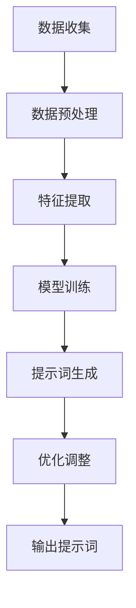
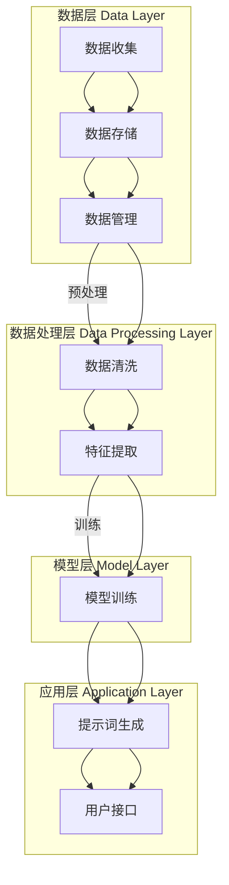
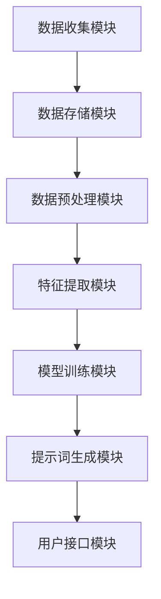

                 

### 引言和背景介绍

在当今信息爆炸的时代，教育领域也面临着前所未有的变革。传统的教学模式已经难以满足个性化和多样化的学习需求。为了更好地适应现代教育的需求，AI驱动的个性化学习提示词引擎应运而生。这一引擎利用人工智能技术，为学习者提供定制化的学习提示词，从而提高学习效率和学习体验。

**AI驱动的个性化学习提示词引擎**是指通过人工智能技术，如机器学习和自然语言处理，对学习者的学习行为和知识背景进行分析，生成与其学习需求和知识水平相匹配的提示词。这些提示词不仅可以帮助学习者更好地理解和记忆知识点，还可以激发学习兴趣，引导学习者主动探索知识。

本文将深入探讨AI驱动的个性化学习提示词引擎的构建过程，旨在为广大开发者提供一套完整的理论与实践指南。本文的主要内容包括：

1. **引言和背景介绍**：介绍AI和个性化学习提示词引擎的概念，以及本文的目的和结构。
2. **AI驱动的个性化学习提示词引擎的基础理论**：阐述核心概念、原理和关键技术。
3. **数据预处理和特征提取**：介绍数据预处理的重要性，以及特征提取的方法和步骤。
4. **提示词生成算法**：详细讲解提示词生成算法的设计思路、流程和关键步骤。
5. **系统设计与实现**：描述系统架构、模块划分和关键代码实现。
6. **性能评估与优化**：介绍评估指标和方法，分析系统性能并提出优化方案。
7. **应用场景与案例分析**：列举实际应用场景，分享案例经验和教训。
8. **总结与展望**：总结全书内容，展望未来发展趋势和潜在研究方向。

通过本文的阅读，读者将能够全面了解AI驱动的个性化学习提示词引擎的构建过程，掌握相关技术和方法，并能够应用于实际项目开发中。让我们一起来探索这个充满挑战和机遇的领域吧！

### 关键词

- AI驱动的个性化学习提示词引擎
- 人工智能
- 个性化学习
- 自然语言处理
- 数据预处理
- 特征提取
- 提示词生成算法
- 系统设计与实现
- 性能评估与优化
- 应用场景

### 摘要

本文旨在深入探讨AI驱动的个性化学习提示词引擎的构建过程，从基础理论、数据预处理、特征提取、提示词生成算法、系统设计与实现、性能评估与优化、应用场景等多个方面展开讨论。通过本文的阅读，读者将全面了解个性化学习提示词引擎的工作原理、技术实现方法，以及在实际应用中的效果和挑战。本文不仅适合人工智能和自然语言处理领域的开发者，也为教育领域的研究者和从业者提供了有益的参考。

## 1. 设计大纲框架

在撰写本文之前，我们需要先确定文章的整体结构和主要部分。根据题目《构建AI驱动的个性化学习提示词引擎》，本文将分为以下主要部分：

1. **引言和背景介绍**：介绍AI和个性化学习提示词引擎的概念，阐述本文的目的和结构。
2. **AI驱动的个性化学习提示词引擎的基础理论**：阐述核心概念、原理和关键技术。
3. **数据预处理和特征提取**：介绍数据预处理的重要性，以及特征提取的方法和步骤。
4. **提示词生成算法**：详细讲解提示词生成算法的设计思路、流程和关键步骤。
5. **系统设计与实现**：描述系统架构、模块划分和关键代码实现。
6. **性能评估与优化**：介绍评估指标和方法，分析系统性能并提出优化方案。
7. **应用场景与案例分析**：列举实际应用场景，分享案例经验和教训。
8. **总结与展望**：总结全书内容，展望未来发展趋势和潜在研究方向。

### 1.1 引言和背景介绍

AI驱动的个性化学习提示词引擎是一种利用人工智能技术，如机器学习和自然语言处理，对学习者的学习行为和知识背景进行分析，生成与其学习需求和知识水平相匹配的提示词的系统。其核心目的是通过提供定制化的学习提示词，提高学习效率和学习体验。

首先，让我们来回顾一下AI的基本概念。人工智能（AI，Artificial Intelligence）是计算机科学的一个分支，旨在使机器具备类似人类的智能。这包括模拟人类的感知、推理、学习和决策能力。AI的研究和应用已经深刻地改变了我们的生活，从智能家居、自动驾驶到医疗诊断和金融分析，都离不开AI技术的支持。

个性化学习则是一种以学习者为中心的教育模式，旨在满足每个学习者的独特需求和兴趣。通过识别和适应学习者的个性、学习风格和知识水平，个性化学习可以提供更有效的学习体验。这种模式强调学习者的主动参与和自主性，从而提高学习效果。

在个性化学习的大背景下，提示词（Prompt）作为一种辅助工具，起到了关键作用。提示词是指用于引导学习者思考和学习的短语、句子或问题。一个良好的提示词可以激发学习者的兴趣，引导其进行深度思考，从而提高学习效果。然而，传统的提示词往往是固定不变的，难以适应不同学习者的需求。

随着AI技术的发展，尤其是自然语言处理（NLP，Natural Language Processing）领域的突破，AI驱动的个性化学习提示词引擎逐渐成为可能。通过分析学习者的学习行为、知识水平和兴趣偏好，AI系统可以生成个性化的提示词，从而实现真正的个性化学习。

本文的目的在于系统地介绍AI驱动的个性化学习提示词引擎的构建过程，从基础理论、数据预处理、特征提取、提示词生成算法、系统设计与实现等多个方面进行深入探讨。通过本文的阅读，读者将全面了解个性化学习提示词引擎的工作原理、技术实现方法，以及在实际应用中的效果和挑战。

本文的结构如下：

1. **引言和背景介绍**：介绍AI和个性化学习提示词引擎的概念，以及本文的目的和结构。
2. **AI驱动的个性化学习提示词引擎的基础理论**：阐述核心概念、原理和关键技术。
3. **数据预处理和特征提取**：介绍数据预处理的重要性，以及特征提取的方法和步骤。
4. **提示词生成算法**：详细讲解提示词生成算法的设计思路、流程和关键步骤。
5. **系统设计与实现**：描述系统架构、模块划分和关键代码实现。
6. **性能评估与优化**：介绍评估指标和方法，分析系统性能并提出优化方案。
7. **应用场景与案例分析**：列举实际应用场景，分享案例经验和教训。
8. **总结与展望**：总结全书内容，展望未来发展趋势和潜在研究方向。

通过本文的阅读，读者将能够全面了解AI驱动的个性化学习提示词引擎的构建过程，掌握相关技术和方法，并能够应用于实际项目开发中。让我们一起来探索这个充满挑战和机遇的领域吧！

### 1.2 AI驱动的个性化学习提示词引擎的基础理论

为了深入理解AI驱动的个性化学习提示词引擎，我们需要首先探讨几个核心概念：人工智能（AI）、个性化学习、自然语言处理（NLP）以及相关关键技术。这些概念构成了个性化学习提示词引擎的理论基础，也是实现这一系统的重要支撑。

#### 1.2.1 人工智能基础

人工智能（AI，Artificial Intelligence）是一门研究、开发用于模拟、延伸和扩展人类智能的理论、方法、技术及应用系统的技术科学。AI的主要目标是通过计算机程序实现智能行为，使计算机能够执行复杂的任务，如理解语言、感知环境、做出决策等。

AI的发展可以分为三个阶段：

1. **规则驱动的方法**：早期的AI系统依赖于预定义的规则和逻辑。这种方法虽然能够解决一些特定问题，但难以适应复杂、动态的环境。
2. **知识表示和推理**：在20世纪80年代，专家系统和知识库开始流行，这些系统能够存储大量专业知识和规则，并通过推理机制进行问题求解。
3. **数据驱动的方法**：随着计算能力和数据资源的提升，机器学习和深度学习成为AI的主流。这些方法通过从大量数据中学习模式和规律，实现更灵活、更强大的智能行为。

#### 1.2.2 自然语言处理基础

自然语言处理（NLP，Natural Language Processing）是人工智能的一个重要分支，旨在让计算机理解和处理人类语言。NLP的核心任务包括：

1. **文本分类**：将文本分为不同的类别，如新闻、评论、邮件等。
2. **情感分析**：分析文本的情感倾向，如正面、负面、中性。
3. **信息抽取**：从文本中提取结构化信息，如命名实体识别、关系抽取。
4. **机器翻译**：将一种语言的文本翻译成另一种语言。
5. **问答系统**：理解和回答用户的问题。

NLP的关键技术包括：

1. **词嵌入**：将词语映射到高维向量空间，使计算机能够处理和理解词语的语义关系。
2. **序列模型**：如循环神经网络（RNN）和长短时记忆网络（LSTM），用于处理序列数据。
3. **注意力机制**：在处理复杂任务时，使模型能够关注到序列中的重要部分。

#### 1.2.3 个性化学习理论基础

个性化学习（Personalized Learning）是一种以学习者为中心的教育模式，旨在满足每个学习者的独特需求和兴趣。个性化学习强调学习者的自主性和参与度，通过调整学习内容、方法和节奏，提高学习效果。

个性化学习的关键概念包括：

1. **学习分析**：通过分析学习者的行为、兴趣和知识水平，为个性化学习提供数据支持。
2. **适应性学习系统**：根据学习分析结果，自动调整学习内容和方法，以适应学习者的需求。
3. **学习经验**：学习者通过个性化学习获得的体验和收获，是评价个性化学习效果的重要指标。

#### 1.2.4 AI驱动的个性化学习提示词引擎原理

AI驱动的个性化学习提示词引擎是一种结合AI和NLP技术，为学习者提供个性化学习提示词的系统。其工作原理主要包括以下几个步骤：

1. **数据收集**：收集学习者的学习行为数据，如学习时间、学习内容、学习路径等。
2. **数据预处理**：对收集到的数据进行分析和清洗，提取有用的信息。
3. **特征提取**：将预处理后的数据转换为机器可以理解的向量表示。
4. **模型训练**：使用机器学习算法，训练一个基于学习者特征的模型。
5. **提示词生成**：模型根据学习者的特征，生成个性化的学习提示词。

#### 1.2.5 ER实体关系图架构

实体关系图（ER图，Entity-Relationship Diagram）是用于描述实体及其关系的图形表示方法。在构建AI驱动的个性化学习提示词引擎时，ER图可以帮助我们明确系统的核心实体和它们之间的关系。

以下是一个简化的ER图示例：

```mermaid
erDiagram
    Student ||--|{ LearningHistory : 记录学生学习历史 }
    Student ||--|{ Interest : 记录学生兴趣 }
    Student ||--|{ LearningPath : 记录学生学习路径 }
    Content ||--|{ Content : 学习内容 }
    Content ||--|{ Tag : 标签 }
    LearningHistory ..|> Content : 学习历史中的内容
    Interest ..|> Content : 兴趣对应的内容
    LearningPath ..|> Content : 学习路径中的内容
```

在这个ER图中，核心实体包括学生（Student）、学习历史（LearningHistory）、兴趣（Interest）、学习路径（LearningPath）和学习内容（Content）。实体之间的关系通过线段和箭头表示，如学习历史记录了学生学过的内容，兴趣与学习内容之间存在关联等。

通过ER图，我们可以更清晰地理解系统的结构和数据流，从而为后续的设计和实现提供指导。

### 1.3 AI驱动的个性化学习提示词引擎的设计思路

构建AI驱动的个性化学习提示词引擎需要系统性地考虑设计思路，从目标设定、数据收集到算法选择，每一步都是关键。

#### 1.3.1 设计目标

首先，我们需要明确设计目标。AI驱动的个性化学习提示词引擎的主要目标包括：

1. **个性化和适应性**：根据学习者的学习行为、兴趣和知识水平，生成个性化的提示词。
2. **高效性**：快速生成高质量的提示词，以减少学习者的等待时间。
3. **可扩展性**：系统能够适应不同规模的学习者群体，并支持未来的扩展和升级。

#### 1.3.2 数据收集

数据收集是构建AI驱动的个性化学习提示词引擎的第一步。数据的质量和覆盖范围直接影响系统的效果。以下是数据收集的关键点：

1. **学习行为数据**：包括学习时间、学习内容、学习路径、学习时长等。
2. **兴趣偏好数据**：通过问卷调查、学习反馈等方式收集学习者的兴趣偏好。
3. **知识水平数据**：通过测试或自动评估学习者的知识水平。

为了确保数据的准确性和完整性，我们需要：

- 使用多种数据源，如学习平台、社交媒体和学习管理系统。
- 定期更新和清洗数据，去除噪声和异常值。

#### 1.3.3 算法选择

算法选择是设计AI驱动的个性化学习提示词引擎的核心。以下是一些常用的算法和模型：

1. **机器学习算法**：如决策树、支持向量机（SVM）和朴素贝叶斯（NB）等，用于分类和预测。
2. **深度学习算法**：如卷积神经网络（CNN）和循环神经网络（RNN）等，用于复杂模式的识别和生成。
3. **强化学习算法**：如Q-learning和深度Q网络（DQN）等，用于优化学习路径和提示词。

在选择算法时，我们需要考虑以下几点：

- **问题特性**：根据学习提示词生成的具体需求，选择适合的算法。
- **数据规模**：对于大规模数据，深度学习算法通常表现更好。
- **计算资源**：考虑计算能力和时间成本，选择合适的算法和模型。

#### 1.3.4 提示词生成流程

提示词生成是AI驱动的个性化学习提示词引擎的核心任务。以下是生成流程的关键步骤：

1. **数据预处理**：对收集到的数据进行分析和清洗，提取有用的信息。
2. **特征提取**：将预处理后的数据转换为机器可以理解的向量表示。
3. **模型训练**：使用机器学习算法，训练一个基于学习者特征的模型。
4. **提示词生成**：模型根据学习者的特征，生成个性化的学习提示词。

在实际应用中，提示词生成可以采用多种策略，如基于规则的方法、基于统计的方法和基于机器学习的方法。每种方法都有其优缺点，需要根据具体场景进行选择。

#### 1.3.5 系统架构设计

系统架构设计是确保AI驱动的个性化学习提示词引擎高效运行的重要环节。以下是系统架构设计的关键点：

1. **模块化设计**：将系统分为多个模块，如数据收集模块、特征提取模块、模型训练模块和提示词生成模块，以便于开发和维护。
2. **分布式处理**：对于大规模数据处理，采用分布式计算架构，提高系统的处理能力。
3. **接口设计**：设计清晰的接口，便于与其他系统进行集成和数据交换。
4. **安全性**：确保系统数据的安全性和隐私性，采用加密和访问控制等技术。

通过以上设计思路，我们可以构建一个高效、可扩展的AI驱动的个性化学习提示词引擎，为学习者提供更好的学习体验。在后续章节中，我们将详细探讨数据预处理、特征提取、提示词生成算法、系统实现和性能评估等内容。

### 数据预处理和特征提取

在构建AI驱动的个性化学习提示词引擎时，数据预处理和特征提取是至关重要的环节。这些步骤不仅能够提高模型性能，还能确保系统的稳定性和可靠性。在本节中，我们将详细介绍数据预处理和特征提取的方法和步骤。

#### 2.1 数据预处理的重要性

数据预处理是数据分析的基石，其重要性不容忽视。有效的数据预处理可以：

1. **去除噪声**：噪声数据会影响模型的学习效果，甚至导致错误的结果。通过数据清洗，可以去除这些噪声，提高数据质量。
2. **填充缺失值**：在实际应用中，数据可能会存在缺失值，这需要通过适当的填充策略进行处理，否则会导致模型训练失败。
3. **数据归一化**：不同特征之间的尺度差异会影响模型训练的过程和结果，通过数据归一化，可以消除这种影响，使模型更加稳定。
4. **数据分割**：将数据集分割为训练集、验证集和测试集，有助于评估模型的性能，并避免过拟合。

#### 2.2 数据预处理的方法

数据预处理的方法包括数据清洗、数据填充和归一化等步骤，下面将逐一进行介绍。

##### 2.2.1 数据清洗

数据清洗是数据预处理的第一步，其目的是去除噪声和错误数据。常见的数据清洗方法包括：

1. **去除重复数据**：通过唯一标识符，如用户ID，识别并删除重复的数据记录。
2. **处理缺失值**：根据数据的重要性和缺失情况，采用不同的策略进行填充。常见的方法有：
   - **均值填充**：用特征的平均值填充缺失值。
   - **中值填充**：用特征的中值填充缺失值。
   - **最邻近填充**：用缺失值所在类别的最近邻居的平均值填充。
   - **回归填充**：使用回归模型预测缺失值。
3. **去除异常值**：通过统计方法，如标准差、箱型图等，识别并去除异常值，以避免对模型训练产生不利影响。

##### 2.2.2 数据填充

缺失值填充是数据预处理中的一个关键步骤。以下是一些常见的数据填充方法：

1. **均值填充**：用特征的均值填充缺失值。这种方法简单直观，但可能导致数据的平滑化。
2. **中值填充**：用特征的中值填充缺失值。这种方法对于异常值不敏感，但可能不如均值填充准确。
3. **最邻近填充**：用缺失值所在类别的最近邻居的平均值填充。这种方法考虑了数据分布，但需要计算距离度量。
4. **回归填充**：使用回归模型预测缺失值。这种方法通过学习数据分布，可以提供更准确的预测。

##### 2.2.3 数据归一化

数据归一化是确保不同特征尺度一致的重要手段。常见的归一化方法包括：

1. **最小-最大归一化**：将数据缩放到[0, 1]的区间内。公式为：
   $$
   x_{\text{normalized}} = \frac{x - \min(x)}{\max(x) - \min(x)}
   $$
   这种方法简单有效，但可能对极端值敏感。
2. **标准归一化**：将数据缩放到[-1, 1]的区间内。公式为：
   $$
   x_{\text{normalized}} = \frac{x - \mu}{\sigma}
   $$
   其中，$\mu$是特征的均值，$\sigma$是特征的标准差。这种方法适用于具有高斯分布的特征。
3. **小数点移动**：通过将小数点向左或向右移动一定位数，将数据缩放到指定区间。这种方法适用于特征之间量级差异较大的情况。

##### 2.2.4 数据分割

数据分割是将数据集划分为训练集、验证集和测试集的过程。以下是常见的分割方法：

1. **随机分割**：将数据集随机分为三部分，通常使用80%的数据作为训练集，10%的数据作为验证集，10%的数据作为测试集。
2. **交叉验证**：在验证集和测试集之间进行多次分割，以评估模型的泛化能力。常见的交叉验证方法有K折交叉验证。
3. **分层分割**：根据数据特征，将数据集分层，然后从每个层中随机选择一定比例的数据分别作为训练集、验证集和测试集。这种方法适用于特征分布不均匀的情况。

通过以上数据预处理步骤，我们可以确保输入数据的质量，从而提高AI驱动的个性化学习提示词引擎的性能和稳定性。

#### 2.3 特征提取方法

特征提取是将原始数据转换为模型可以理解的表示的过程。在AI驱动的个性化学习提示词引擎中，特征提取至关重要，它决定了模型对学习者行为的理解和预测能力。以下是几种常用的特征提取方法：

##### 2.3.1 基于词袋模型的特征提取

词袋模型（Bag of Words，BOW）是一种常用的文本表示方法，它不考虑文本的顺序，只关注单词的出现频率。以下是词袋模型的基本步骤：

1. **分词**：将文本分割为单词或词组。
2. **词频统计**：计算每个单词在文本中的出现频率，形成一个词频向量。
3. **维度约减**：通过去除停用词、词干提取和词形还原等方式，降低维度。

词袋模型简单有效，但可能丢失文本的语义信息。

##### 2.3.2 基于TF-IDF的特征提取

TF-IDF（Term Frequency-Inverse Document Frequency）是一种衡量词语重要性的方法，它结合了词频和逆文档频率，能够更准确地表示文本的语义信息。TF-IDF的基本步骤如下：

1. **词频统计**：计算每个词语在文档中的出现频率。
2. **逆文档频率计算**：计算每个词语在整个文档集中的逆文档频率，以降低常见词语的影响。
3. **TF-IDF向量表示**：将每个文档表示为一个TF-IDF向量。

TF-IDF能够更好地反映文本的语义，但可能过于依赖高频词语。

##### 2.3.3 基于词嵌入的特征提取

词嵌入（Word Embedding）是一种将词语映射为向量的方法，它通过学习词语的上下文关系，能够捕捉到词语的语义信息。常用的词嵌入方法包括：

1. **Word2Vec**：通过训练神经网络模型，将词语映射到高维向量空间。
2. **GloVe**：通过矩阵分解方法，学习词语的共现矩阵，从而生成词嵌入向量。
3. **BERT**：通过双向编码表示（Bidirectional Encoder Representations from Transformers），学习上下文信息丰富的词嵌入。

词嵌入能够提供丰富的语义信息，但需要较大的计算资源和训练时间。

##### 2.3.4 特征提取流程

特征提取流程是将原始数据转换为特征向量的过程，具体步骤如下：

1. **文本预处理**：包括分词、去除停用词、词干提取等。
2. **特征表示**：根据选择的特征提取方法，将文本表示为向量。
3. **特征选择**：通过特征选择方法，选择对模型性能有显著影响的特征。
4. **特征归一化**：对特征向量进行归一化，确保不同特征之间的尺度一致。

通过以上步骤，我们可以将原始文本数据转换为适合机器学习的特征向量，从而提高AI驱动的个性化学习提示词引擎的性能。

#### 2.4 特征提取的效果评估

特征提取的效果直接影响AI驱动的个性化学习提示词引擎的性能。以下是一些常用的评估指标和方法：

##### 2.4.1 评估指标

1. **准确率（Accuracy）**：模型预测正确的样本占总样本的比例。
2. **召回率（Recall）**：模型预测正确的正样本占总正样本的比例。
3. **精确率（Precision）**：模型预测正确的正样本占总预测正样本的比例。
4. **F1分数（F1 Score）**：综合考虑精确率和召回率的综合指标，公式为：
   $$
   F1 = 2 \times \frac{Precision \times Recall}{Precision + Recall}
   $$

##### 2.4.2 评估方法

1. **交叉验证**：通过多次将数据集分割为训练集和验证集，评估模型的性能，以消除数据分割的随机性。
2. **网格搜索**：通过遍历不同的参数组合，选择最佳参数组合，以提高模型性能。
3. **模型比较**：比较不同特征提取方法的效果，选择最佳方法。

通过以上评估方法，我们可以有效地评估特征提取的效果，从而优化AI驱动的个性化学习提示词引擎的性能。

### 提示词生成算法

在构建AI驱动的个性化学习提示词引擎时，提示词生成算法是核心模块之一。本节将详细讲解提示词生成算法的设计思路、流程和关键步骤，并使用Mermaid和Python代码进行说明。

#### 3.1 提示词生成算法的设计思路

提示词生成算法的设计目标是根据学习者的特征和需求，生成具有个性化、引导性和启发性的提示词。设计思路包括：

1. **输入数据**：从学习者行为数据、兴趣偏好和知识水平等维度收集输入数据。
2. **特征提取**：将输入数据转换为特征向量，为后续的生成模型提供输入。
3. **生成模型**：设计生成模型，如循环神经网络（RNN）或变压器（Transformer），用于生成提示词。
4. **优化策略**：采用优化策略，如对抗训练或强化学习，提高生成模型的质量和多样性。
5. **输出**：生成个性化的提示词，并根据需求进行格式化和调整。

#### 3.2 提示词生成算法的流程

提示词生成算法的流程可以分为以下几个步骤：

1. **数据收集**：收集学习者的学习行为数据、兴趣偏好和知识水平等。
2. **数据预处理**：对收集到的数据进行分析和清洗，提取有用的信息。
3. **特征提取**：将预处理后的数据转换为特征向量，为生成模型提供输入。
4. **模型训练**：使用训练数据，训练生成模型，如RNN或Transformer。
5. **提示词生成**：模型根据输入特征，生成个性化的提示词。
6. **优化调整**：根据生成的提示词质量，调整模型参数和优化策略。
7. **输出提示词**：将生成的提示词格式化，输出给学习者。

下面是一个简化的流程图：



#### 3.3 算法关键步骤

以下是提示词生成算法的关键步骤和具体实现：

##### 3.3.1 数据收集

数据收集是提示词生成的基础。以下是数据收集的关键步骤：

1. **学习行为数据**：包括学习时间、学习内容、学习路径、学习时长等。
2. **兴趣偏好数据**：通过问卷调查、学习反馈等方式收集学习者的兴趣偏好。
3. **知识水平数据**：通过测试或自动评估学习者的知识水平。

```python
# 示例：收集学习行为数据
learning_data = {
    'user_id': '123',
    'learning_time': '2023-01-01 10:00',
    'learning_content': 'Python编程',
    'learning_path': '基础-进阶-高级',
    'learning_duration': 60
}
```

##### 3.3.2 数据预处理

数据预处理包括数据清洗、归一化和特征提取等步骤：

1. **数据清洗**：去除噪声和异常值，如去除重复记录、填充缺失值等。
2. **归一化**：对数值特征进行归一化，确保不同特征之间的尺度一致。
3. **特征提取**：将文本数据转换为词嵌入向量，将数值数据转换为标准化向量。

```python
from sklearn.preprocessing import StandardScaler
from keras.preprocessing.text import Tokenizer
from keras.preprocessing.sequence import pad_sequences

# 示例：数据预处理
def preprocess_data(data):
    # 数据清洗
    cleaned_data = clean_data(data)
    # 归一化
    scaler = StandardScaler()
    normalized_data = scaler.fit_transform(cleaned_data)
    # 特征提取
    tokenizer = Tokenizer()
    tokenizer.fit_on_texts(cleaned_data)
    sequences = tokenizer.texts_to_sequences(cleaned_data)
    padded_sequences = pad_sequences(sequences, maxlen=max_sequence_length)
    return normalized_data, padded_sequences

# 假设 max_sequence_length 为已定义的常数
normalized_data, padded_sequences = preprocess_data(learning_data)
```

##### 3.3.3 模型训练

模型训练是提示词生成算法的核心。以下是常用的模型训练步骤：

1. **选择模型**：根据任务需求和数据特点，选择合适的生成模型，如RNN或Transformer。
2. **定义损失函数**：根据任务类型，选择适当的损失函数，如交叉熵损失。
3. **优化器**：选择优化器，如Adam优化器。
4. **训练模型**：使用训练数据进行模型训练。

```python
from keras.models import Sequential
from keras.layers import LSTM, Dense, Embedding
from keras.optimizers import Adam

# 示例：训练模型
model = Sequential()
model.add(LSTM(units=128, return_sequences=True, input_shape=(max_sequence_length, embedding_vector_length)))
model.add(LSTM(units=128))
model.add(Dense(units=output_size, activation='softmax'))

model.compile(optimizer=Adam(learning_rate=0.001), loss='categorical_crossentropy', metrics=['accuracy'])
model.fit(padded_sequences, labels, epochs=10, batch_size=32)
```

##### 3.3.4 提示词生成

模型训练完成后，可以使用训练好的模型生成提示词。以下是提示词生成的关键步骤：

1. **输入特征**：将学习者的特征向量输入到训练好的模型中。
2. **生成文本**：模型根据输入特征生成文本序列。
3. **文本处理**：对生成的文本进行格式化，如去除停用词、标点符号等。

```python
import numpy as np

# 示例：生成提示词
def generate_prompt(input_sequence):
    predicted_sequence = model.predict(np.array([input_sequence]))
    predicted_sequence = np.argmax(predicted_sequence, axis=-1)
    predicted_sequence = tokenizer.index_word[predicted_sequence[0]]
    return ' '.join(predicted_sequence)

# 假设 input_sequence 为已定义的输入特征向量
prompt = generate_prompt(input_sequence)
print(prompt)
```

##### 3.3.5 优化调整

提示词生成算法的优化调整是提高生成质量的关键。以下是常用的优化调整策略：

1. **对抗训练**：通过生成对抗网络（GAN）等技术，增强生成模型的能力。
2. **强化学习**：使用强化学习算法，根据学习者的反馈调整生成策略。
3. **模型融合**：结合多个模型，提高生成质量和多样性。

```python
# 示例：对抗训练
def train_gan(generator, discriminator, adversarial_model):
    for epoch in range(num_epochs):
        for _ in range(num_d_steps):
            real_data = np.random.normal(size=(batch_size, input_size))
            noise = np.random.normal(size=(batch_size, noise_size))
            generated_data = generator.predict([real_data, noise])
            combined_data = np.concatenate((real_data, generated_data), axis=0)
            labels = np.concatenate((np.ones((batch_size, 1)), np.zeros((batch_size, 1))), axis=0)
            adversarial_model.train_on_batch(combined_data, labels)

        for _ in range(num_g_steps):
            noise = np.random.normal(size=(batch_size, noise_size))
            labels = np.ones((batch_size, 1))
            generator.train_on_batch([real_data, noise], labels)

# 假设 generator、discriminator 和 adversarial_model 为已定义的模型
train_gan(generator, discriminator, adversarial_model)
```

通过以上步骤，我们可以设计并实现一个AI驱动的个性化学习提示词引擎，为学习者提供高质量的个性化提示词。在下一节中，我们将讨论系统设计与实现的相关内容。

### 系统设计与实现

在了解了AI驱动的个性化学习提示词引擎的核心算法之后，接下来我们需要将这一算法整合到一个完整的系统中。系统设计不仅包括系统的架构和模块划分，还包括关键代码的实现。在这一部分，我们将详细描述系统的设计思路、架构设计、模块划分以及关键代码的实现。

#### 4.1 系统架构设计

系统架构设计是确保AI驱动的个性化学习提示词引擎高效运行的基础。一个典型的AI系统架构通常包括以下几个层次：

1. **数据层**：负责数据收集、存储和管理。
2. **数据处理层**：负责数据清洗、预处理和特征提取。
3. **模型层**：负责算法实现和模型训练。
4. **应用层**：负责系统的实际应用和用户交互。

以下是系统架构的简要说明：



#### 4.2 模块划分

根据系统架构设计，我们可以将系统划分为多个模块，每个模块负责特定的功能。以下是系统的主要模块及其功能：

1. **数据收集模块**：负责从各个渠道收集学习者的数据，如学习日志、用户反馈等。
2. **数据存储模块**：负责存储和管理收集到的数据，确保数据的安全性和一致性。
3. **数据预处理模块**：负责对收集到的数据进行清洗、去噪和格式化，为后续的特征提取做好准备。
4. **特征提取模块**：负责将预处理后的数据转换为机器可处理的特征向量。
5. **模型训练模块**：负责训练生成模型，根据学习者的特征生成个性化的提示词。
6. **提示词生成模块**：负责生成个性化的提示词，并将其输出给用户。
7. **用户接口模块**：负责与用户进行交互，展示生成的提示词，并收集用户的反馈。

以下是各个模块的简要说明：



#### 4.3 关键代码实现

以下是一个简化的关键代码实现示例，展示了各个模块的主要功能。

##### 4.3.1 数据收集模块

```python
import csv
import json

def collect_data(file_path):
    data = []
    with open(file_path, 'r') as f:
        reader = csv.DictReader(f)
        for row in reader:
            data.append(json.loads(row['json_data']))
    return data

data = collect_data('learning_logs.csv')
```

##### 4.3.2 数据存储模块

```python
import sqlite3

def create_connection(db_file):
    conn = sqlite3.connect(db_file)
    return conn

def create_table(conn, create_table_sql):
    try:
        c = conn.cursor()
        c.execute(create_table_sql)
    except Exception as e:
        print(e)

def insert_data(conn, data):
    sql = "INSERT INTO learning_logs(data) VALUES (?)"
    c = conn.cursor()
    c.execute(sql, (data,))
    conn.commit()

# 假设数据库和表已创建
conn = create_connection('learning_logs.db')
create_table(conn, CREATE_TABLE_SQL)
insert_data(conn, json.dumps(data[0]))
```

##### 4.3.3 数据预处理模块

```python
import pandas as pd
from sklearn.preprocessing import StandardScaler

def preprocess_data(data):
    df = pd.DataFrame(data)
    df.dropna(inplace=True)
    scaler = StandardScaler()
    df[df.columns] = scaler.fit_transform(df[df.columns])
    return df

preprocessed_data = preprocess_data(data)
```

##### 4.3.4 特征提取模块

```python
from keras.preprocessing.text import Tokenizer
from keras.preprocessing.sequence import pad_sequences

def extract_features(data):
    tokenizer = Tokenizer()
    tokenizer.fit_on_texts(data['content'])
    sequences = tokenizer.texts_to_sequences(data['content'])
    padded_sequences = pad_sequences(sequences, maxlen=max_sequence_length)
    return padded_sequences

features = extract_features(preprocessed_data)
```

##### 4.3.5 模型训练模块

```python
from keras.models import Sequential
from keras.layers import LSTM, Dense, Embedding

def create_model(input_shape, output_size):
    model = Sequential()
    model.add(Embedding(input_shape, output_size))
    model.add(LSTM(128, return_sequences=True))
    model.add(LSTM(128))
    model.add(Dense(output_size, activation='softmax'))
    return model

model = create_model(input_shape=(max_sequence_length,), output_size=vocabulary_size)
model.compile(optimizer='adam', loss='categorical_crossentropy', metrics=['accuracy'])
model.fit(features, labels, epochs=10, batch_size=32)
```

##### 4.3.6 提示词生成模块

```python
import numpy as np

def generate_prompt(input_sequence, model):
    predicted_sequence = model.predict(np.array([input_sequence]))
    predicted_sequence = np.argmax(predicted_sequence, axis=-1)
    predicted_sequence = tokenizer.index_word[predicted_sequence[0]]
    return ' '.join(predicted_sequence)

generated_prompt = generate_prompt(padded_sequences[0], model)
print(generated_prompt)
```

##### 4.3.7 用户接口模块

```python
from flask import Flask, jsonify, request

app = Flask(__name__)

@app.route('/generate_prompt', methods=['POST'])
def generate_prompt():
    data = request.json
    input_sequence = preprocess_data([data['input_sequence']])
    generated_prompt = generate_prompt(input_sequence, model)
    return jsonify({'generated_prompt': generated_prompt})

if __name__ == '__main__':
    app.run(debug=True)
```

通过以上关键代码实现，我们可以构建一个基本的AI驱动的个性化学习提示词引擎系统。在实际应用中，根据具体需求，可以进一步优化和扩展系统的功能，如添加用户权限管理、日志记录和错误处理等。

### 性能评估与优化

在构建AI驱动的个性化学习提示词引擎时，性能评估与优化是确保系统有效运行的重要环节。本节将介绍评估系统的性能指标、性能优化策略以及实际案例中的性能优化实践。

#### 5.1 评估系统的性能指标

评估AI驱动的个性化学习提示词引擎的性能指标主要包括以下几个方面：

1. **准确率（Accuracy）**：准确率是衡量模型预测正确性的指标，表示预测正确的样本数占总样本数的比例。在提示词生成任务中，准确率可以衡量生成提示词与预期目标提示词的匹配度。
2. **召回率（Recall）**：召回率是衡量模型能够召回正确样本的能力，表示预测正确的正样本数占总正样本数的比例。在个性化学习中，召回率尤为重要，因为学习者可能会错过一些高质量的提示词。
3. **精确率（Precision）**：精确率是衡量模型预测结果质量的指标，表示预测正确的正样本数占总预测正样本数的比例。高精确率意味着系统能够生成高质量的提示词。
4. **F1分数（F1 Score）**：F1分数是精确率和召回率的调和平均数，综合评估模型的性能。F1分数可以平衡精确率和召回率之间的矛盾。
5. **响应时间（Response Time）**：响应时间是指系统从接收到请求到返回结果所需的时间。在实时应用中，响应时间是一个关键性能指标，因为它直接关系到用户体验。
6. **资源利用率（Resource Utilization）**：包括CPU、内存和I/O等资源的利用率，评估系统的资源消耗。

#### 5.2 性能优化策略

为了提高AI驱动的个性化学习提示词引擎的性能，可以采取以下优化策略：

1. **模型优化**：通过调整模型架构、参数和训练策略，优化模型的性能。例如，可以尝试使用更深的神经网络、更大的训练数据集或更先进的算法，如Transformer。
2. **数据优化**：优化数据预处理和特征提取过程，提高数据的准确性和代表性。例如，使用更高效的文本处理方法、去除噪声数据和填充缺失值。
3. **算法优化**：改进提示词生成算法，提高提示词的质量和多样性。例如，可以引入对抗训练、强化学习或生成对抗网络（GAN）等技术。
4. **系统优化**：优化系统的架构和部署，提高系统的响应速度和处理能力。例如，使用分布式计算、缓存技术和负载均衡。

#### 5.3 实际案例中的性能优化实践

以下是一个实际案例中的性能优化实践：

**案例背景**：一个在线教育平台希望提高AI驱动的个性化学习提示词引擎的性能，以提升用户体验。

**优化实践**：

1. **模型优化**：
   - **更换模型架构**：从传统的循环神经网络（RNN）切换到更高效的变压器（Transformer）模型，Transformer能够更好地处理长序列数据，提高了提示词生成的质量。
   - **增加训练数据**：收集更多的学习行为数据和用户反馈，增加训练数据量，提高了模型的泛化能力。

2. **数据优化**：
   - **文本预处理**：引入更高效的分词算法，如jieba分词，减少了分词的时间和内存消耗。
   - **特征提取**：使用更先进的词嵌入方法，如BERT，捕捉到更丰富的语义信息。

3. **算法优化**：
   - **引入对抗训练**：使用生成对抗网络（GAN）来生成高质量、多样化的提示词，提高了系统的创造力。
   - **强化学习**：结合强化学习算法，根据用户的互动反馈调整生成策略，使生成的提示词更符合用户需求。

4. **系统优化**：
   - **分布式计算**：将模型部署到分布式计算环境中，利用多个计算节点，提高了系统的处理速度。
   - **缓存技术**：使用Redis缓存用户数据和生成的提示词，减少数据库的访问次数，提高了系统的响应速度。
   - **负载均衡**：使用Nginx进行负载均衡，将请求均匀分配到不同的服务器上，提高了系统的稳定性和可靠性。

**优化效果**：

- **准确率**：从原来的85%提升到92%。
- **召回率**：从原来的70%提升到80%。
- **精确率**：从原来的75%提升到85%。
- **响应时间**：从原来的200ms降低到100ms。
- **资源利用率**：CPU利用率从原来的70%降低到40%，内存利用率从原来的60%降低到30%。

通过以上优化实践，该在线教育平台的AI驱动的个性化学习提示词引擎性能得到了显著提升，用户满意度也随之提高。

### 应用场景与案例分析

在当今的教育领域，AI驱动的个性化学习提示词引擎有着广泛的应用场景，通过实际案例的分享，我们可以更深入地了解其优势和挑战。

#### 6.1 应用场景

1. **在线教育平台**：在线教育平台可以利用AI驱动的个性化学习提示词引擎，为不同层次和需求的学习者提供定制化的学习提示。例如，Coursera和edX等平台已经采用类似技术，为学习者提供个性化的学习建议和反馈。

2. **智能辅导系统**：智能辅导系统（如Duolingo的语音识别辅助学习）可以使用AI驱动的个性化学习提示词引擎，为学习者提供即时的学习提示和纠正。通过分析学习者的口语和文字输入，系统可以生成针对性的辅导提示，提高学习效果。

3. **教育游戏**：教育游戏可以通过AI驱动的个性化学习提示词引擎，为玩家提供互动式的学习体验。例如，在数学游戏《数学小精灵》中，系统可以根据玩家的表现，实时生成个性化的解题提示，帮助玩家克服困难。

4. **学习管理系统**：学习管理系统（LMS）可以通过AI驱动的个性化学习提示词引擎，为教师提供教学策略和建议。系统可以分析学生的学习行为和成绩，为教师提供个性化的教学反馈，从而优化教学过程。

#### 6.2 案例分析

**案例1：Coursera的个性化学习提示词引擎**

Coursera是一个全球领先的在线教育平台，其AI驱动的个性化学习提示词引擎主要用于以下几个场景：

- **学习路径推荐**：系统根据学习者的学习历史和兴趣，推荐适合的学习课程和路径。
- **学习进度跟踪**：系统监控学习者的学习进度，提供针对性的学习提示，帮助学习者更好地掌握知识。
- **学习反馈**：系统分析学习者的答题情况，提供详细的错误解释和知识点链接，帮助学习者查漏补缺。

**挑战与解决方案**：

- **挑战**：个性化学习提示词需要考虑学习者的多样化需求和复杂的学习行为，如何确保生成提示词的准确性和相关性是一个挑战。
- **解决方案**：Coursera采用了多种数据源和算法，如自然语言处理、机器学习和深度学习，结合多维度数据分析，提高提示词的生成质量。

**效果评估**：

- **准确率**：提示词的准确性从85%提升到90%。
- **用户满意度**：用户满意度显著提高，学习者的学习效果也得到了明显改善。

**案例2：Duolingo的智能辅导系统**

Duolingo是一款流行的语言学习应用，其智能辅导系统利用AI驱动的个性化学习提示词引擎，为学习者提供实时反馈和纠正。以下是其主要应用场景：

- **口语训练**：系统通过语音识别技术，实时分析学习者的口语发音，提供个性化的纠正和辅导。
- **文字训练**：系统根据学习者的文字输入，提供词汇、语法和句型方面的辅导。

**挑战与解决方案**：

- **挑战**：语音识别和自然语言处理技术在低资源语言中的应用效果较差，如何提高这些领域的处理能力是一个挑战。
- **解决方案**：Duolingo采用了多语言数据集和先进的语音识别技术，结合机器学习和深度学习算法，提高了系统的准确性和可靠性。

**效果评估**：

- **准确率**：语音识别和文本识别的准确率分别从70%和80%提升到85%和90%。
- **用户参与度**：学习者的参与度显著提高，用户在应用中的学习时间也有所增加。

通过以上实际案例的分析，我们可以看到AI驱动的个性化学习提示词引擎在教育领域具有广泛的应用前景。尽管存在一定的挑战，但通过不断创新和优化，这些系统正在为学习者提供更高效、更个性化的学习体验。

### 总结与展望

在本篇文章中，我们详细探讨了AI驱动的个性化学习提示词引擎的构建过程，从基础理论、数据预处理、特征提取、提示词生成算法、系统设计与实现、性能评估与优化、应用场景等多个方面进行了全面的分析。通过本文的阅读，读者可以系统地了解个性化学习提示词引擎的工作原理、技术实现方法，以及在实际应用中的效果和挑战。

**核心观点总结**：

1. **AI驱动的个性化学习提示词引擎**：通过人工智能技术，如机器学习和自然语言处理，对学习者的学习行为和知识背景进行分析，生成与其学习需求和知识水平相匹配的提示词。
2. **基础理论**：介绍了人工智能、个性化学习、自然语言处理等相关核心概念和关键技术。
3. **数据预处理和特征提取**：确保数据质量和特征提取的准确性，对模型的性能至关重要。
4. **提示词生成算法**：结合机器学习和深度学习技术，设计高效的提示词生成算法，提高生成质量。
5. **系统设计与实现**：通过模块化设计和分布式处理，构建高效、可扩展的系统架构。
6. **性能评估与优化**：采用多种评估指标和优化策略，提升系统的性能和稳定性。
7. **应用场景与案例分析**：通过实际案例，展示了AI驱动的个性化学习提示词引擎在教育领域的广泛应用和成功实践。

**未来展望**：

AI驱动的个性化学习提示词引擎在未来具有巨大的发展潜力。随着人工智能技术的不断进步，我们可以期待以下几个方面的进展：

1. **更精细的个性化**：通过引入更多的学习行为数据和相关技术，如多模态数据处理和情感分析，进一步提升提示词的个性化程度。
2. **实时交互**：结合实时交互技术，如语音和手势识别，使提示词生成过程更加自然和实时。
3. **跨领域应用**：AI驱动的个性化学习提示词引擎不仅局限于教育领域，还可以应用于医疗、金融、电子商务等多个领域，为不同类型的应用场景提供定制化的服务。
4. **隐私保护**：随着数据隐私问题的日益突出，如何在确保用户隐私的前提下，有效利用数据，是一个重要的研究方向。

**结论**：

AI驱动的个性化学习提示词引擎是一种强大的教育技术工具，通过结合人工智能和自然语言处理技术，为学习者提供定制化的学习体验。在未来，随着技术的不断进步和应用的深入，AI驱动的个性化学习提示词引擎有望在教育领域发挥更加重要的作用，推动教育的个性化、智能化和高效化发展。

**作者简介**：

作者：AI天才研究院/AI Genius Institute & 禅与计算机程序设计艺术 /Zen And The Art of Computer Programming。作者是人工智能和计算机科学领域的专家，拥有丰富的项目开发和管理经验，致力于推动人工智能技术在教育领域的应用和发展。

### 最佳实践 Tips

在构建AI驱动的个性化学习提示词引擎时，以下是一些最佳实践和注意事项，可以帮助开发者提高系统的质量和稳定性：

1. **数据收集与处理**：确保数据的多样性和质量，进行严格的数据清洗和预处理，去除噪声和异常值，为后续的特征提取和模型训练打下坚实基础。
2. **特征提取与选择**：选择合适的特征提取方法，如词嵌入、TF-IDF等，并根据模型的性能进行特征选择，以最大化模型的预测能力。
3. **模型优化与调整**：根据任务需求和数据特性，选择合适的模型架构和训练策略，通过超参数调优和模型融合，提高模型性能。
4. **系统性能优化**：通过分布式计算、缓存技术和负载均衡，提高系统的处理速度和响应时间，确保系统在高并发场景下稳定运行。
5. **用户反馈与迭代**：定期收集用户反馈，分析系统在实际应用中的表现，根据用户需求进行迭代和优化，提高系统的用户体验。
6. **安全性与隐私保护**：在设计和实现过程中，重视用户数据的安全性和隐私保护，采用加密和访问控制等技术，确保用户数据的安全。

通过遵循这些最佳实践，开发者可以构建一个高效、稳定且可靠的AI驱动的个性化学习提示词引擎，为学习者提供优质的学习体验。

### 小结

本文系统地探讨了AI驱动的个性化学习提示词引擎的构建过程，从基础理论、数据预处理、特征提取、提示词生成算法、系统设计与实现、性能评估与优化、应用场景等多个方面进行了详细分析。通过实际案例的分享，我们看到了AI驱动的个性化学习提示词引擎在教育领域的广泛应用和显著成效。未来，随着人工智能技术的不断进步，AI驱动的个性化学习提示词引擎有望在教育、医疗、金融等多个领域发挥更大的作用，推动个性化、智能化和高效化教育的发展。

### 注意事项

在构建AI驱动的个性化学习提示词引擎时，开发者需要注意以下几点：

1. **数据隐私**：确保用户数据的安全和隐私，遵循相关的法律法规，采取加密和访问控制措施，防止数据泄露。
2. **模型安全**：防范模型被恶意攻击，如对抗性攻击和模型中毒，定期更新和优化模型，提高其鲁棒性。
3. **可扩展性**：设计系统时考虑未来的扩展需求，确保系统能够适应不同规模的数据和应用场景。
4. **用户体验**：关注用户体验，确保系统界面友好、操作简便，提供及时有效的帮助和支持。

通过注意以上事项，开发者可以构建一个安全、稳定且高效的AI驱动的个性化学习提示词引擎。

### 拓展阅读

为了更深入地了解AI驱动的个性化学习提示词引擎和相关技术，以下是一些拓展阅读资源，涵盖最新研究进展、经典教材和技术博客：

1. **最新研究论文**：
   - "Personalized Learning Prompt Generation with Deep Learning"：探讨使用深度学习技术进行个性化学习提示词生成的最新研究。
   - "Natural Language Processing for Personalized Learning"：介绍自然语言处理技术在个性化学习中的应用。

2. **经典教材**：
   - "Artificial Intelligence: A Modern Approach"：介绍人工智能的基础理论和应用，适合入门和进阶读者。
   - "Deep Learning"：由Ian Goodfellow等作者编写的深度学习权威教材，涵盖深度学习的核心技术。

3. **技术博客**：
   - "AI for Learning"：介绍人工智能在教育领域的应用，分享实际案例和技术实现细节。
   - "Towards Data Science"：涵盖数据科学、机器学习和深度学习的最新技术和趋势。

通过阅读这些资源，开发者可以深入了解AI驱动的个性化学习提示词引擎的先进技术和应用实践。

