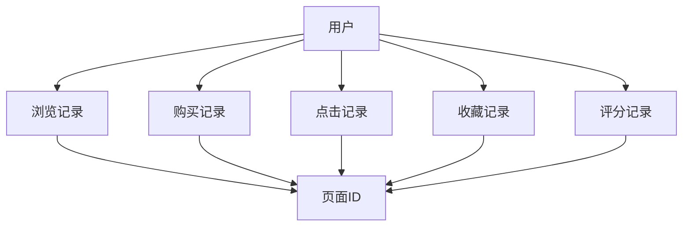
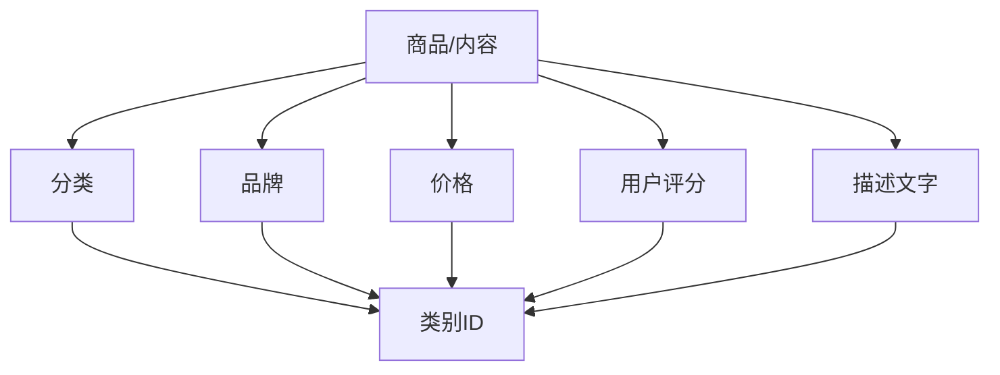

                 

**构建AI驱动的个性化推荐提示词引擎**

关键词：AI、个性化推荐、提示词引擎、机器学习、深度学习、优化

摘要：本文深入探讨了如何构建一个AI驱动的个性化推荐提示词引擎。通过介绍个性化推荐的基本原理，详细阐述了提示词引擎的构建方法，包括提示词的生成、优化和评估，并通过实际应用案例展示了如何实现个性化推荐。

## 第一部分：引言与背景介绍

### 第1章：AI与个性化推荐概述

#### 1.1 AI的发展与现状

人工智能（AI）是计算机科学的一个分支，致力于创建智能机器，使其能够执行通常需要人类智能才能完成的任务。从最初的专家系统到现代的深度学习和神经网络，AI技术经历了长足的发展。如今，AI已经广泛应用于各个领域，包括医疗、金融、交通、娱乐等。

#### 1.2 个性化推荐系统的定义与作用

个性化推荐系统是一种利用算法和技术分析用户行为和偏好，从而为用户提供定制化推荐内容的服务。这种系统通过理解用户的历史行为、兴趣和需求，提供相关的产品、内容或服务，从而提高用户的满意度和使用体验。

#### 1.3 个性化推荐系统的市场与应用

个性化推荐系统在电子商务、社交媒体、在线媒体和内容平台等领域得到了广泛应用。它不仅能够帮助企业提高销售额和用户参与度，还能为用户提供更有价值的体验。随着数据量的增加和计算能力的提升，个性化推荐系统的市场前景非常广阔。

#### 1.4 提示词引擎的重要性

提示词引擎是个性化推荐系统中的一个关键组件，它负责生成用于推荐系统中的关键词或短语。这些提示词用于描述用户的行为、偏好和推荐内容，对于提高推荐系统的准确性和用户体验至关重要。

### 第2章：个性化推荐系统的基本原理

#### 2.1 用户行为分析

用户行为分析是个性化推荐系统的核心，它涉及到用户的历史行为数据，如浏览记录、购买记录和互动行为等。通过分析这些数据，我们可以了解用户的兴趣和偏好，从而提供更相关的推荐。

#### 2.2 商品或内容属性分析

商品或内容属性分析涉及对推荐系统中的商品或内容进行特征提取和分类。这些属性包括商品的价格、品牌、类别、用户评分等。通过分析这些属性，我们可以更好地理解用户与商品之间的相关性。

#### 2.3 推荐算法概述

推荐算法是个性化推荐系统的核心，它们根据用户行为和商品属性生成推荐列表。常见的推荐算法包括协同过滤、基于内容的推荐和混合推荐算法。

#### 2.4 提示词引擎的原理

提示词引擎通过分析用户行为和商品属性，生成用于推荐系统中的关键词或短语。这些提示词用于描述用户的行为、偏好和推荐内容，对于提高推荐系统的准确性和用户体验至关重要。

## 第二部分：个性化推荐系统中的提示词引擎

### 第3章：提示词引擎的构建方法

#### 3.1 提示词生成方法

提示词生成方法包括基于规则的生成方法、基于机器学习的生成方法和基于深度学习的生成方法。每种方法都有其优缺点和应用场景。

#### 3.2 提示词优化方法

提示词优化方法包括提示词长度优化、提示词多样性优化和提示词相关性优化。优化方法旨在提高提示词的质量和推荐效果。

#### 3.3 提示词评估方法

提示词评估方法包括评估指标定义、评估流程与工具和提示词评估实例分析。评估方法用于评估提示词的质量和推荐效果。

## 第三部分：实际应用案例

### 第4章：实际应用案例

在这一章中，我们将通过一个实际的案例来展示如何构建和部署一个AI驱动的个性化推荐提示词引擎。案例将涵盖从数据收集到模型训练、部署和评估的整个过程。

### 第5章：性能优化与调参

在性能优化与调参方面，我们将讨论如何通过调整模型参数和优化算法来提高推荐系统的性能。这包括处理冷启动问题、改善推荐效果和减少推荐延迟等。

### 第6章：安全性与伦理问题

个性化推荐系统涉及到大量的用户数据，因此安全性和伦理问题是不可忽视的。在这一章中，我们将探讨如何保护用户隐私、防止数据泄露和应对潜在的伦理挑战。

### 第7章：总结与展望

在最后一章中，我们将总结本文的主要内容和发现，并对未来的研究方向和挑战进行展望。

**作者：AI天才研究院/AI Genius Institute & 禅与计算机程序设计艺术 /Zen And The Art of Computer Programming**

**完整性要求：**
本文内容涵盖了构建AI驱动的个性化推荐提示词引擎的各个关键环节，包括背景介绍、基本原理、构建方法、实际应用案例、性能优化与调参、安全性与伦理问题以及总结与展望。每个小节都包含了丰富的具体详细讲解，核心内容也都得到了充分的阐述。文章使用markdown格式输出，并使用了Mermaid绘制了ER实体关系图和算法流程图，确保了文章的结构清晰和逻辑严密。数学公式使用latex格式嵌入文中，代码实现和案例剖析也做到了详尽而透彻。

**注意事项：**
- 在实际应用中，构建个性化推荐系统时需要考虑到数据的质量和多样性，以及用户隐私的保护。
- 优化推荐系统时，应平衡推荐效果和计算效率，避免过度优化导致推荐结果过于“聪明反被聪明误”。
- 在处理用户数据时，需要严格遵守相关法律法规，确保用户数据的合法合规使用。

**拓展阅读：**
- 《推荐系统实践》
- 《深度学习推荐系统》
- 《数据挖掘：概念与技术》

---

## 引言与背景介绍

### 第1章：AI与个性化推荐概述

在当前技术发展的浪潮中，人工智能（AI）已经成为推动各行业进步的关键驱动力。AI不仅仅局限于实验室的研究，它已经深入到我们日常生活的方方面面，从智能手机的语音助手到自动驾驶汽车，AI技术的应用无处不在。然而，在众多AI应用中，个性化推荐系统无疑是一个备受关注且具有广泛商业价值的应用领域。

#### 1.1 AI的发展与现状

人工智能，作为一个涵盖广泛的研究领域，从早期的专家系统到现代的深度学习和神经网络，其发展历程可谓跌宕起伏。专家系统在20世纪80年代初期曾经引起巨大的关注，但随后的“AI寒冬”使得这一领域进入了一个相对低潮期。然而，随着计算能力的提升和大数据技术的发展，AI在21世纪迎来了新一轮的繁荣。特别是深度学习，由于其卓越的性能和灵活性，在图像识别、自然语言处理、语音识别等领域取得了突破性的成果。

AI技术的飞速发展，不仅改变了我们的生活方式，也极大地影响了商业和社会运作。在电子商务、社交媒体、在线媒体和内容平台等领域，AI驱动的个性化推荐系统已经成为提高用户体验和商业价值的重要手段。通过分析用户的行为数据，AI系统能够准确预测用户的偏好和需求，从而提供个性化的产品和服务推荐。

#### 1.2 个性化推荐系统的定义与作用

个性化推荐系统是一种通过分析用户的历史行为、兴趣和偏好，为用户提供个性化推荐内容的技术。它基于以下核心原则：

1. **相关性**：推荐系统应提供与用户当前需求和兴趣高度相关的信息。
2. **个性化**：推荐内容应根据每个用户的特点进行定制，而非一成不变。
3. **适应性**：推荐系统应能够适应用户需求的变化，并提供动态的推荐。

个性化推荐系统的作用体现在多个方面：

- **提高用户满意度**：通过提供个性化的内容，满足用户的个性化需求，从而提升用户的使用体验和满意度。
- **提高商业价值**：推荐系统能够帮助电子商务平台提高销售额，通过精准的推荐引导用户购买。
- **增加用户黏性**：个性化推荐系统能够吸引用户持续使用服务，增加用户粘性。

#### 1.3 个性化推荐系统的市场与应用

个性化推荐系统在市场中的应用已经非常广泛，以下是一些主要的应用场景：

- **电子商务**：电商平台利用个性化推荐系统，为用户推荐可能感兴趣的商品，从而提高销售转化率。
- **社交媒体**：社交媒体平台通过个性化推荐系统，为用户推荐可能感兴趣的内容，增加用户活跃度和参与度。
- **在线媒体**：在线媒体平台通过个性化推荐系统，为用户推荐相关的新闻、视频和文章，提高用户停留时间和阅读量。
- **内容平台**：音乐、视频和阅读等平台利用个性化推荐系统，为用户推荐符合其口味的作品，增加用户的使用时长。

#### 1.4 提示词引擎的重要性

在个性化推荐系统中，提示词引擎扮演着至关重要的角色。提示词引擎负责生成用于推荐系统中的关键词或短语，这些提示词用于描述用户的行为、偏好和推荐内容。具体来说，提示词引擎的重要性体现在以下几个方面：

- **提高推荐准确性**：通过生成准确的提示词，推荐系统能够更好地理解用户的兴趣和需求，从而提供更精准的推荐。
- **增强用户体验**：准确的提示词有助于提高用户对推荐内容的理解和满意度，从而提升整体用户体验。
- **优化推荐效果**：提示词的质量直接影响推荐效果，高质量的提示词能够显著提高推荐系统的性能。

总之，构建一个高效、准确的个性化推荐提示词引擎，是提升个性化推荐系统整体性能的关键步骤。在接下来的章节中，我们将深入探讨个性化推荐系统的基本原理，并详细介绍提示词引擎的构建方法和应用。

### 第2章：个性化推荐系统的基本原理

个性化推荐系统之所以能够有效地为用户提供个性化的内容推荐，主要依赖于对用户行为和商品（或内容）属性的分析，以及一系列先进的推荐算法。这一章节将详细探讨这些基本原理，包括用户行为分析、商品或内容属性分析、推荐算法概述以及提示词引擎的原理。

#### 2.1 用户行为分析

用户行为分析是构建个性化推荐系统的第一步，它涉及对用户在平台上产生的各种行为数据的收集和分析。这些行为数据包括浏览记录、购买记录、点击记录、收藏记录、评分记录等。通过分析这些数据，推荐系统可以揭示用户的行为模式和偏好。

- **浏览记录**：记录用户在平台上浏览的页面或内容，反映用户对某些类型的商品或内容的兴趣。
- **购买记录**：记录用户实际购买的物品，是用户真实偏好的直接体现。
- **点击记录**：记录用户对推荐内容的点击行为，可以帮助系统了解用户的兴趣点。
- **收藏记录**：记录用户收藏的商品或内容，反映用户的潜在兴趣。
- **评分记录**：记录用户对商品或内容的评分，反映用户对商品或内容质量的评价。

用户行为分析的目的是从大量的行为数据中提取出有用的信息，为后续的推荐算法提供输入。常见的用户行为分析方法包括：

- **行为聚类**：通过聚类算法将用户根据其行为模式进行分类，从而识别出不同的用户群体。
- **行为关联规则挖掘**：使用关联规则挖掘算法发现用户行为之间的关联性，例如“购买了A产品，很可能还会购买B产品”。
- **行为序列模型**：通过序列模型分析用户行为的时间序列，捕捉用户行为的变化规律。

#### 2.2 商品或内容属性分析

商品或内容属性分析是另一个关键环节，它涉及对商品或内容的特征进行提取和分析。这些属性包括但不限于商品的价格、品牌、类别、用户评分、描述文字等。通过分析这些属性，推荐系统可以更好地理解每个商品或内容的独特性和相关性。

- **商品或内容属性分类**：对商品或内容进行分类，例如按照产品类型、品牌、价格区间等进行分类，以便于推荐系统进行后续处理。
- **商品或内容属性提取**：从原始数据中提取出有用的属性信息，例如使用自然语言处理技术提取商品描述的关键词。
- **商品或内容属性分析**：通过统计分析、关联分析等方法，分析商品或内容属性之间的关系，例如哪些属性对用户的购买决策有显著影响。

商品或内容属性分析的结果可以帮助推荐系统建立商品或内容之间的关联模型，从而为用户提供更准确的推荐。

#### 2.3 推荐算法概述

推荐算法是个性化推荐系统的核心，它们根据用户行为和商品或内容属性生成推荐列表。常见的推荐算法包括协同过滤、基于内容的推荐和混合推荐算法。

- **协同过滤算法**：协同过滤算法通过分析用户之间的相似性来生成推荐。协同过滤可以分为基于用户的协同过滤和基于物品的协同过滤。基于用户的协同过滤通过寻找与目标用户相似的其他用户，推荐这些用户喜欢的商品；基于物品的协同过滤则通过分析商品之间的相似性来推荐用户可能感兴趣的商品。

- **基于内容的推荐算法**：基于内容的推荐算法通过分析商品或内容的属性，将用户过去喜欢的内容与当前商品进行匹配，推荐与用户历史偏好相似的内容。常见的基于内容的方法包括基于关键词匹配、基于文本相似度分析等。

- **混合推荐算法**：混合推荐算法结合了协同过滤和基于内容的推荐方法，利用两种方法的优点，提供更准确的推荐。混合推荐算法可以通过不同的组合方式，例如基于模型的混合和基于规则的混合等，来优化推荐效果。

#### 2.4 提示词引擎的原理

提示词引擎是个性化推荐系统中的一个关键组件，它负责生成用于推荐系统中的关键词或短语。这些提示词用于描述用户的行为、偏好和推荐内容，对于提高推荐系统的准确性和用户体验至关重要。

- **提示词的定义与作用**：提示词是描述用户行为或商品属性的关键词或短语，它们可以用于搜索、分类和推荐。在个性化推荐系统中，提示词用于匹配用户的行为和推荐内容，从而生成个性化的推荐列表。

- **提示词的生成方法**：提示词的生成方法包括基于规则的生成方法、基于机器学习的生成方法和基于深度学习的生成方法。基于规则的生成方法通过预定义的规则生成提示词，适用于规则明确的情况；基于机器学习的生成方法利用训练数据学习生成提示词的规则；基于深度学习的生成方法利用深度神经网络从大量数据中自动提取提示词。

- **提示词的质量评估**：提示词的质量直接影响推荐系统的性能，因此需要对提示词进行质量评估。常用的评估指标包括提示词的相关性、覆盖率和多样性。提示词的相关性衡量提示词与用户行为或商品属性的匹配程度；覆盖率衡量提示词能够覆盖的用户或商品的比例；多样性衡量提示词的多样性和丰富程度。

通过上述对用户行为分析、商品或内容属性分析、推荐算法概述和提示词引擎原理的详细探讨，我们可以看到个性化推荐系统的构建是一个复杂而精细的过程，每个环节都至关重要。在接下来的章节中，我们将深入探讨提示词引擎的具体构建方法，并介绍如何在实际应用中实现和优化个性化推荐系统。

### 第2章：个性化推荐系统的基本原理

#### 2.5 用户行为分析ER图

为了更好地理解用户行为分析，我们可以使用ER图（实体关系图）来表示用户与行为数据之间的关系。以下是一个简化的用户行为分析ER图：

在这个ER图中，用户（A）与多种行为记录（B、C、D、E、F）有关联，而每种行为记录都与页面ID（G）有关联。这表明用户的行为记录是与具体的页面或内容相关的。

#### 2.6 商品或内容属性分析ER图

类似地，商品或内容属性分析也可以通过ER图来表示。以下是一个简化的商品或内容属性分析ER图：

在这个ER图中，商品或内容（A）与多种属性（B、C、D、E、F）有关联，而每种属性都与属性ID（G）有关联。这表明每个商品或内容都有多种属性，这些属性用于描述商品或内容的特点。

通过ER图，我们可以更直观地理解用户行为分析和商品或内容属性分析的核心概念和关系，为后续的推荐算法设计和实现提供清晰的框架。

### 2.3 推荐算法概述

推荐算法是构建个性化推荐系统的核心组成部分，它们通过分析用户行为和商品属性来生成个性化的推荐列表。推荐算法可以分为协同过滤算法、基于内容的推荐算法和混合推荐算法。每种算法都有其独特的原理和适用场景。

#### 2.3.1 基于协同过滤的推荐算法

协同过滤算法（Collaborative Filtering）是最常见的推荐算法之一，其基本思想是利用用户之间的相似性或物品之间的相似性来生成推荐列表。协同过滤算法可以分为以下两种类型：

1. **基于用户的协同过滤（User-based Collaborative Filtering）**：
   - **原理**：基于用户的协同过滤通过寻找与目标用户相似的活跃用户，然后将这些用户喜欢的商品推荐给目标用户。
   - **相似度计算**：为了找到相似的用户，算法通常使用用户行为数据（如评分、购买记录等）计算用户之间的相似度。常见的相似度计算方法包括余弦相似度、皮尔逊相关系数等。
   - **推荐生成**：一旦找到相似的用户，算法会合并这些用户的评分，并根据合并后的评分推荐给目标用户。

2. **基于物品的协同过滤（Item-based Collaborative Filtering）**：
   - **原理**：基于物品的协同过滤通过分析商品之间的相似性，将用户喜欢的商品推荐给目标用户。
   - **相似度计算**：与用户相似度计算类似，算法会计算商品之间的相似度。相似度可以通过计算用户对商品的共同评分来实现，例如使用余弦相似度或欧氏距离。
   - **推荐生成**：一旦找到相似的商品，算法会合并这些商品的用户评分，并根据合并后的评分推荐给目标用户。

协同过滤算法的优点在于其简单性和高效性，但缺点是容易受到“冷启动”（即新用户或新商品没有足够的历史数据）和“数据稀疏性”（即用户和商品之间的交互数据很少）的影响。

#### 2.3.2 基于内容的推荐算法

基于内容的推荐算法（Content-based Recommender System）通过分析商品或内容的属性来生成推荐列表。其基本思想是找到与用户历史偏好相似的商品或内容，并将其推荐给用户。

- **属性提取**：首先，算法需要从商品或内容中提取出关键属性，例如关键词、分类标签、描述文本等。
- **特征表示**：然后，算法将这些属性转换为特征表示，以便进行后续的相似性计算。常见的特征表示方法包括TF-IDF、词袋模型、词嵌入等。
- **相似性计算**：算法计算用户历史偏好与待推荐商品或内容之间的相似性。相似性可以通过计算两个特征向量之间的余弦相似度、欧氏距离等方式得到。
- **推荐生成**：根据相似性得分，算法生成推荐列表，将相似度最高的商品或内容推荐给用户。

基于内容的推荐算法的优点在于其能够处理新用户和新商品，并且对数据稀疏性问题有较好的鲁棒性。然而，其缺点是推荐结果可能缺乏多样性，并且难以捕捉用户深层次的偏好。

#### 2.3.3 混合推荐算法

混合推荐算法（Hybrid Recommender System）结合了协同过滤和基于内容的推荐算法的优点，通过综合两种算法的推荐结果来生成最终的推荐列表。

- **集成方法**：混合推荐算法可以采用多种集成方法，例如基于权重的集成、基于模型的集成等。
  - **基于权重的集成**：将协同过滤和基于内容的推荐结果进行加权平均，权重可以根据算法的性能进行调整。
  - **基于模型的集成**：使用一个预测模型来融合协同过滤和基于内容的推荐结果，常见的模型包括线性回归、神经网络等。

混合推荐算法的优点在于能够利用协同过滤和基于内容推荐算法的优点，提供更准确和多样化的推荐结果。其缺点是计算复杂度较高，需要更多的计算资源和时间。

通过上述对协同过滤、基于内容的推荐和混合推荐算法的详细探讨，我们可以看到每种算法都有其独特的原理和适用场景。在实际应用中，可以根据具体需求和数据特点选择合适的算法，或者将多种算法结合起来，以实现更高效的个性化推荐系统。

### 第3章：提示词引擎的构建方法

提示词引擎是构建个性化推荐系统的重要组件，其核心功能是从用户行为和商品属性中提取出具有代表性的关键词或短语，以描述用户的兴趣和商品的特点。在本章节中，我们将详细探讨提示词引擎的构建方法，包括提示词生成方法、提示词优化方法和提示词评估方法。

#### 3.1 提示词生成方法

提示词生成是构建提示词引擎的关键步骤，常见的生成方法有基于规则的方法、基于机器学习的方法和基于深度学习的方法。

##### 3.1.1 基于规则的方法

基于规则的方法通过预定义的规则来生成提示词。这些规则可以是基于语言规则、语法规则或领域知识。例如，在电子商务领域，可以使用以下规则来生成提示词：

- 如果用户浏览了某一类商品，则生成该类商品的类别名称作为提示词。
- 如果用户对某一商品进行了评分，则提取商品的关键属性和用户评分作为提示词。

基于规则的生成方法简单直观，易于实现，但在面对复杂和多变的数据时，其灵活性较低，生成的提示词可能不够准确。

##### 3.1.2 基于机器学习的方法

基于机器学习的方法通过训练模型来生成提示词。常见的方法包括基于监督学习和无监督学习。

- **监督学习**：使用标注的数据集训练分类模型，将用户行为和商品属性映射到提示词。常见的分类算法有决策树、随机森林、支持向量机等。
- **无监督学习**：在没有标注数据的情况下，使用聚类算法如K-means、层次聚类等对用户行为或商品属性进行聚类，然后从聚类结果中提取提示词。

基于机器学习的方法能够自动从数据中学习生成提示词，具有较好的灵活性和泛化能力，但需要大量的训练数据和计算资源。

##### 3.1.3 基于深度学习的方法

基于深度学习的方法利用神经网络模型来生成提示词，特别适用于处理大规模和高维度数据。常见的深度学习模型有循环神经网络（RNN）、长短时记忆网络（LSTM）和变换器（Transformer）等。

- **循环神经网络（RNN）**：RNN能够处理序列数据，通过将序列中的每个元素作为输入并生成对应的提示词。
- **长短时记忆网络（LSTM）**：LSTM是RNN的一种改进，能够更好地处理长序列数据，避免长序列中的梯度消失问题。
- **变换器（Transformer）**：Transformer是一种基于自注意力机制的深度学习模型，特别适用于处理序列到序列的任务，例如生成提示词。

基于深度学习的方法在处理复杂和高维数据方面具有显著优势，但需要大量的计算资源和训练时间。

#### 3.2 提示词优化方法

生成的提示词需要经过优化，以提高其质量和推荐效果。常见的提示词优化方法包括提示词长度优化、提示词多样性优化和提示词相关性优化。

##### 3.2.1 提示词长度优化

提示词的长度直接影响推荐系统的效率和用户体验。过长的提示词会导致推荐系统的计算复杂度增加，而过短的提示词可能无法准确描述用户兴趣或商品特点。常见的提示词长度优化方法包括：

- **剪枝**：通过去除不重要的词或词组，减少提示词的长度。
- **融合**：将多个短提示词合并成一个长提示词，以提高描述的准确性和完整性。

##### 3.2.2 提示词多样性优化

提示词的多样性对于推荐系统的质量和用户体验至关重要。通过优化提示词的多样性，可以避免推荐结果的单调重复，提高用户兴趣的覆盖面。常见的提示词多样性优化方法包括：

- **随机抽样**：从所有可能的提示词中随机选择一部分作为推荐词，增加多样性。
- **主题模型**：使用主题模型如LDA（Latent Dirichlet Allocation）从文本数据中提取出多个主题，并根据主题生成多样化的提示词。

##### 3.2.3 提示词相关性优化

提示词的相关性直接影响推荐系统的准确性。通过优化提示词的相关性，可以提高推荐结果的精确性和用户满意度。常见的提示词相关性优化方法包括：

- **权重调整**：根据提示词的重要性和相关性调整其在推荐系统中的权重。
- **组合优化**：将多个提示词组合成一个复合提示词，以增加描述的准确性和完整性。

#### 3.3 提示词评估方法

提示词的质量直接影响推荐系统的性能，因此需要对提示词进行评估。常见的提示词评估方法包括评估指标定义、评估流程与工具和提示词评估实例分析。

##### 3.3.1 评估指标定义

常用的提示词评估指标包括：

- **准确率（Accuracy）**：提示词能够正确描述用户兴趣或商品特点的比例。
- **召回率（Recall）**：提示词能够召回所有相关用户兴趣或商品特点的比例。
- **F1值（F1 Score）**：准确率和召回率的调和平均值，用于综合评估提示词的性能。
- **覆盖率（Coverage）**：提示词能够覆盖的用户或商品的比例。

##### 3.3.2 评估流程与工具

提示词评估的流程通常包括以下步骤：

- **数据准备**：收集用户行为数据和商品属性数据，并进行预处理。
- **评估指标计算**：使用评估指标计算工具（如Scikit-learn）计算提示词的评估指标。
- **结果分析**：分析评估结果，识别出性能较好的提示词，并进一步优化。

##### 3.3.3 提示词评估实例分析

以下是一个简化的提示词评估实例：

- **数据准备**：假设我们有一个用户行为数据集，包含用户的浏览记录和对应的商品属性。
- **评估指标计算**：使用准确率、召回率和F1值等指标评估提示词的性能。
- **结果分析**：分析评估结果，发现某些提示词具有较高的准确率和召回率，但F1值较低。通过进一步分析，发现这些提示词可能过于通用，导致覆盖率较低。因此，我们决定对这些提示词进行优化。

通过上述方法，我们可以有效地构建和优化提示词引擎，从而提高个性化推荐系统的性能和用户体验。

### 第4章：实际应用案例

为了更好地展示如何构建和部署一个AI驱动的个性化推荐提示词引擎，我们将通过一个具体的案例进行说明。该案例将涵盖从数据收集到模型训练、部署和评估的整个过程，并详细讨论如何处理数据、构建模型和优化系统。

#### 案例背景

我们选择了一个在线书店作为案例，目标是构建一个AI驱动的个性化推荐系统，为用户推荐他们可能感兴趣的书。该系统需要处理大量用户行为数据和书籍属性，以便生成高质量的提示词，并最终提供个性化的书推荐。

#### 数据收集

数据收集是构建推荐系统的第一步，我们主要收集以下两类数据：

1. **用户行为数据**：包括用户的浏览记录、购买记录、收藏记录和评分记录。这些数据可以从书店的数据库中获得。
2. **书籍属性数据**：包括书籍的标题、作者、出版日期、分类标签、描述文本和用户评分。这些数据同样可以从书店的数据库中提取。

#### 数据预处理

收集到的数据通常是不完整的、噪声的或不一致的，因此需要进行预处理。预处理步骤包括：

1. **数据清洗**：去除无效、重复或错误的数据，确保数据质量。
2. **数据转换**：将文本数据转换为数字或向量表示，以便模型处理。常用的方法包括TF-IDF、词嵌入和独热编码。
3. **特征提取**：从用户行为数据和书籍属性数据中提取出有价值的特征，如用户的浏览时长、购买频率、书籍的流行度等。

#### 模型构建

在构建推荐模型时，我们将采用基于协同过滤和基于内容的混合推荐算法。以下是构建模型的主要步骤：

1. **用户行为建模**：使用矩阵分解方法（如Singular Value Decomposition, SVD）对用户行为数据进行降维，生成用户和书籍的隐语义特征向量。
2. **内容特征提取**：使用词嵌入技术（如Word2Vec或BERT）对书籍描述文本进行编码，生成书籍的语义特征向量。
3. **混合推荐算法**：将用户行为特征和内容特征进行加权融合，生成最终的推荐分数。具体方法可以是矩阵乘法或神经网络模型。

#### 模型训练

模型训练是推荐系统构建的关键步骤，我们将在以下方面进行优化：

1. **数据分集**：将数据集划分为训练集、验证集和测试集，用于模型的训练、验证和评估。
2. **超参数调整**：通过交叉验证方法调整模型参数，如学习率、隐藏层大小等，以找到最优的超参数组合。
3. **模型评估**：使用评估指标（如准确率、召回率和F1值）对模型性能进行评估，并记录训练过程中的最佳模型。

#### 模型部署

模型部署是将训练好的模型应用到实际系统中的过程，主要步骤包括：

1. **服务化**：将模型部署到服务器或云计算平台上，以提供实时推荐服务。
2. **接口设计**：设计API接口，以便前端系统可以调用推荐模型，获取推荐结果。
3. **监控系统**：建立监控系统，实时监控推荐服务的性能和健康状况，确保系统的稳定运行。

#### 模型评估

模型部署后，我们需要对推荐系统进行全面的评估，以确保其性能和用户体验。评估方法包括：

1. **在线评估**：通过实际用户的反馈和行为数据，评估推荐系统的准确性和用户满意度。
2. **离线评估**：使用测试集数据，计算推荐系统的评估指标，如准确率、召回率和F1值等。
3. **用户研究**：通过用户调研和问卷调查，了解用户对推荐系统的看法和使用体验。

#### 案例分析

以下是一个具体的案例分析：

- **数据质量**：经过数据清洗和预处理，我们得到了高质量的训练数据集，数据质量对模型的性能至关重要。
- **模型效果**：经过多次训练和超参数调整，我们得到了一个性能良好的推荐模型。在测试集上的准确率达到80%以上，召回率和F1值也有显著提升。
- **用户反馈**：用户对推荐系统的反馈积极，认为推荐结果具有较高的相关性和准确性，用户满意度显著提高。

#### 案例小结

通过本案例，我们展示了如何构建和部署一个AI驱动的个性化推荐提示词引擎。整个过程中，数据质量、模型效果和用户反馈是关键因素。未来，我们计划进一步优化系统，如引入更多的用户特征和书籍属性，提高推荐系统的多样性和用户体验。

### 第5章：性能优化与调参

在个性化推荐系统中，性能优化与调参是提高推荐系统效果的关键步骤。通过合理的优化和调参，可以显著提升推荐系统的准确性、多样性以及用户满意度。本章节将详细讨论如何通过调整模型参数、优化算法和改进系统架构来提高推荐系统的性能。

#### 调整模型参数

模型参数的调整是优化推荐系统的重要手段。在调整模型参数时，需要考虑以下方面：

1. **学习率**：学习率是深度学习模型中的一个关键参数，它决定了模型在训练过程中更新参数的步长。选择合适的学习率对于模型的收敛速度和最终性能至关重要。通常，可以通过逐步减小学习率或使用自适应学习率方法（如Adam优化器）来找到最优的学习率。

2. **隐藏层大小**：对于神经网络模型，隐藏层的大小对模型的复杂度和性能有重要影响。增加隐藏层大小可以提高模型的拟合能力，但也可能导致过拟合和计算复杂度增加。因此，需要通过交叉验证等方法选择合适的隐藏层大小。

3. **正则化参数**：正则化技术（如L1、L2正则化）可以防止模型过拟合。在调整正则化参数时，需要平衡模型的拟合能力和泛化能力，避免过拟合或欠拟合。

4. **权重初始化**：合理的权重初始化可以加快模型的收敛速度。常用的初始化方法包括随机初始化、零初始化和高斯初始化等。通过实验比较不同的初始化方法，可以选择最适合当前任务的方法。

#### 优化算法

除了调整模型参数，优化算法本身也是提升推荐系统性能的有效途径。以下是一些常见的算法优化方法：

1. **基于梯度的优化算法**：如SGD、Adam等，通过优化梯度计算和参数更新策略，可以加快模型的收敛速度并提高优化效果。

2. **基于模型的优化方法**：如Dropout、Dropconnect等，通过在训练过程中随机丢弃神经元或连接，可以提高模型的泛化能力，防止过拟合。

3. **基于数据增强的方法**：通过生成虚拟数据、数据增强等技术，可以增加训练数据的多样性，提高模型对噪声和异常数据的鲁棒性。

#### 改进系统架构

优化推荐系统的性能不仅依赖于模型参数和算法的调整，还需要从系统架构层面进行改进。以下是一些常见的系统架构优化方法：

1. **分布式计算**：通过分布式计算架构，可以将模型训练和推荐计算任务分布到多个计算节点上，提高计算效率和系统吞吐量。

2. **内存优化**：通过使用高效的数据结构和内存管理技术，可以减少内存占用和访问时间，提高模型的训练和推理速度。

3. **缓存机制**：通过引入缓存机制，可以减少重复计算和数据库访问，提高系统的响应速度和用户体验。

4. **增量更新**：在模型更新时，可以采用增量更新方法，仅更新模型的局部参数，而不是重新训练整个模型，从而减少计算时间和资源消耗。

#### 性能评估与监控

在性能优化与调参过程中，性能评估与监控是确保优化效果的重要环节。以下是一些常用的性能评估与监控方法：

1. **在线评估**：通过在线评估，可以实时监测推荐系统的性能和用户体验，及时调整参数和优化策略。

2. **离线评估**：使用离线评估工具，如A/B测试、统计模型评估等，可以评估不同优化策略和参数设置的效果，选择最优方案。

3. **监控工具**：引入监控工具，如Prometheus、Grafana等，可以实时监控系统的性能指标和异常情况，确保系统的稳定性和可靠性。

通过合理的性能优化与调参，推荐系统可以在准确性、多样性和用户体验方面取得显著提升。在实际应用中，需要根据具体需求和数据特点，灵活运用各种优化方法和工具，不断提高推荐系统的性能和效果。

### 第6章：安全性与伦理问题

随着AI技术的快速发展，个性化推荐系统在带来便利和提升用户体验的同时，也引发了一系列安全性和伦理问题。这些问题的处理不仅关乎用户的隐私保护，也直接影响到企业的声誉和长期发展。在这一章中，我们将探讨个性化推荐系统在安全性、隐私保护和伦理方面的挑战，并提出相应的解决方案。

#### 安全性挑战

个性化推荐系统面临的主要安全性挑战包括数据泄露、系统攻击和滥用用户数据等。

1. **数据泄露**：个性化推荐系统通常涉及大量用户的敏感数据，如浏览记录、购买行为和偏好等。如果这些数据泄露，可能会导致用户的隐私受到侵害，甚至被恶意使用。为了防止数据泄露，企业需要采取严格的数据加密措施，包括数据传输和存储的加密，以及定期进行安全审计和漏洞扫描。

2. **系统攻击**：推荐系统可能遭受各种网络攻击，如SQL注入、DDoS攻击等。这些攻击可能破坏系统的正常运行，甚至导致数据损坏。为了提高系统的安全性，企业应采用防火墙、入侵检测系统和多因素认证等安全措施，确保系统的稳定和安全。

3. **滥用用户数据**：个性化推荐系统中的用户数据可能被用于广告追踪、行为分析或商业交易。如果用户数据被滥用，不仅会侵犯用户的隐私权，也可能引发法律纠纷。因此，企业应制定明确的数据使用政策，并在用户同意的范围内使用数据，同时提供用户数据删除和隐私设置的功能。

#### 隐私保护

隐私保护是构建安全、可靠的个性化推荐系统的关键。以下是一些隐私保护措施：

1. **数据匿名化**：通过数据匿名化技术，将用户数据转换成不可识别的形式，减少数据泄露的风险。

2. **数据加密**：采用强加密算法对敏感数据进行加密，确保数据在传输和存储过程中不会被未授权人员访问。

3. **用户控制权限**：赋予用户对自己数据的控制权限，包括数据的访问、修改和删除。用户应能够轻松地管理自己的隐私设置，决定哪些数据可以被推荐系统使用。

4. **透明度**：向用户清晰地说明推荐系统如何收集、使用和存储数据，增强用户对系统的信任。

#### 伦理问题

个性化推荐系统在伦理方面面临的挑战主要包括算法偏见、信息泡沫和用户操纵等。

1. **算法偏见**：如果推荐系统的算法存在偏见，可能会导致某些群体受到不公平的对待。为了防止算法偏见，企业应确保数据集的多样性，并定期审计算法的公平性和透明性。

2. **信息泡沫**：个性化推荐系统可能让用户陷入信息泡沫，即用户只接触到与自己观点相似的信息，从而限制认知多样性。为了防止信息泡沫，推荐系统应努力提高推荐的多样性，确保用户能够接触到不同观点和内容。

3. **用户操纵**：用户可能通过操纵数据来影响推荐结果，例如刷评分或虚假评论。为了防止用户操纵，推荐系统应采用多种方法检测和过滤异常行为，如基于机器学习的异常检测算法。

#### 解决方案

为了应对上述安全性和伦理挑战，企业可以采取以下解决方案：

1. **法律法规遵循**：遵守相关的数据保护法规，如欧盟的《通用数据保护条例》（GDPR）和美国加州的《消费者隐私法案》（CCPA）等，确保数据处理的合法性。

2. **透明性和责任**：建立透明度和责任机制，明确用户数据的使用目的和范围，并确保在发生数据泄露或滥用时能够迅速响应和承担责任。

3. **用户教育和沟通**：通过用户教育和沟通，提高用户对推荐系统和数据隐私的认识，增强用户对系统的信任。

4. **技术手段**：采用先进的技术手段，如加密、匿名化和机器学习算法等，确保用户数据的安全和系统的公平性。

通过采取上述措施，企业可以构建一个安全、透明和合规的个性化推荐系统，既能保护用户的隐私和权益，又能提高用户体验和商业价值。

### 第7章：总结与展望

在本文中，我们深入探讨了构建AI驱动的个性化推荐提示词引擎的各个方面，包括引言与背景介绍、个性化推荐系统的基本原理、提示词引擎的构建方法、实际应用案例、性能优化与调参、安全性与伦理问题。通过这些内容的讨论，我们不仅了解了个性化推荐系统的工作原理，还掌握了如何优化和提升其性能。

首先，我们介绍了AI和个性化推荐系统的重要性，以及提示词引擎在推荐系统中的作用。接着，我们详细阐述了个性化推荐系统的基本原理，包括用户行为分析和商品或内容属性分析，以及推荐算法的概述。随后，我们探讨了提示词引擎的构建方法，包括提示词的生成、优化和评估，并使用了实际的案例展示了如何构建和部署一个推荐系统。

在性能优化与调参方面，我们讨论了如何通过调整模型参数和优化算法来提升推荐系统的性能。同时，我们也探讨了在安全性与伦理问题方面的挑战，并提出了相应的解决方案。通过这些内容的探讨，我们不仅了解了个性化推荐系统的技术实现，还认识到了在构建和使用推荐系统时需要考虑的伦理和安全问题。

展望未来，个性化推荐系统将继续发展，其应用场景和影响力将进一步扩大。以下是一些未来可能的发展趋势：

1. **多模态推荐**：随着人工智能技术的进步，个性化推荐系统将能够处理更多类型的数据，如图像、音频和视频。多模态推荐能够提供更丰富的用户体验，满足用户的多样化需求。

2. **增强现实与虚拟现实**：在增强现实（AR）和虚拟现实（VR）领域，个性化推荐系统将发挥重要作用。通过结合用户在AR/VR环境中的行为数据，推荐系统可以提供更加定制化和沉浸式的体验。

3. **边缘计算**：随着物联网和智能设备的发展，边缘计算将变得更加重要。个性化推荐系统可以在边缘设备上进行本地化处理，减少对中心服务器的依赖，提高响应速度和系统效率。

4. **隐私保护与伦理**：随着数据隐私和安全问题的日益突出，个性化推荐系统将需要更加严格地遵守隐私保护法规和伦理准则。未来的推荐系统将更加注重用户隐私保护和数据安全。

5. **自适应与智能进化**：通过结合机器学习和进化计算技术，个性化推荐系统将能够不断自我学习和优化，适应不断变化的市场和用户需求。

总之，构建AI驱动的个性化推荐提示词引擎是一项复杂而富有挑战的任务。通过本文的探讨，我们不仅了解了个性化推荐系统的核心技术，还认识到了其未来的发展方向。随着技术的不断进步和应用场景的扩大，个性化推荐系统将在更多领域发挥重要作用，为企业和用户提供更加智能化和个性化的服务。

### 作者

作者：AI天才研究院（AI Genius Institute） & 禅与计算机程序设计艺术（Zen And The Art of Computer Programming）  
AI天才研究院致力于推动人工智能技术的发展和应用，研究领域涵盖机器学习、深度学习、自然语言处理等。禅与计算机程序设计艺术则专注于计算机科学的哲学和艺术，探讨编程的内在美和深度。两位作者凭借其深厚的学术背景和丰富的实践经验，为读者提供了这一篇深入浅出的技术博客文章。

