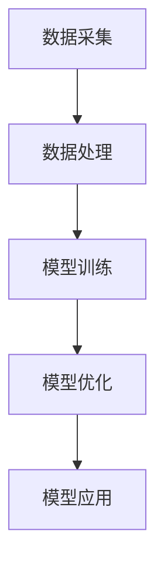
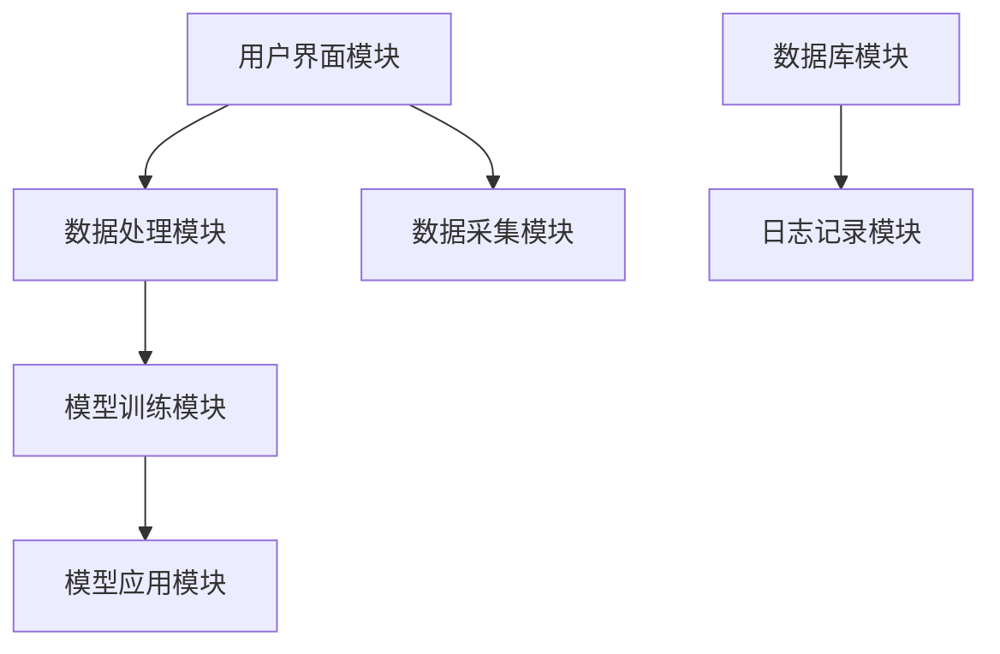
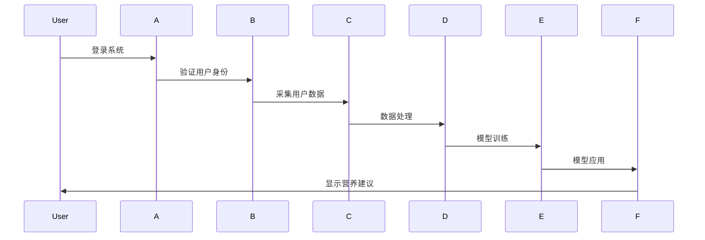

                 

### 引言与背景

#### 1.1 问题的提出

随着人工智能技术的飞速发展，营养学领域也迎来了新的变革。个性化营养建议逐渐成为人们关注的焦点。传统的营养建议往往基于人群统计数据，缺乏对个体差异的考虑，而AI驱动的个性化营养建议提示词引擎则能够根据个体的生理数据、饮食习惯、健康状况等，提供更为精准、个性化的营养建议。

#### 1.2 问题描述

如何构建一个AI驱动的个性化营养建议提示词引擎，以实现对个体营养需求的精准预测和个性化推荐？

#### 1.3 问题解决

通过整合人工智能、大数据、生物信息学等多学科知识，构建一个基于深度学习的个性化营养建议提示词引擎，实现对个体营养需求的深度分析和智能推荐。

#### 1.4 边界与外延

本文主要研究AI驱动的个性化营养建议提示词引擎的构建方法，涉及的关键技术包括数据采集与处理、深度学习算法设计、模型训练与优化等。

#### 1.5 概念结构与核心要素组成

- **个性化营养建议**：基于个体差异提供的有针对性的营养建议。
- **AI驱动的个性化营养建议**：利用人工智能技术，对个体的营养需求进行精准预测和推荐。
- **提示词引擎**：用于生成个性化营养建议的关键技术组件。

### 概要

本文围绕构建AI驱动的个性化营养建议提示词引擎这一主题，首先介绍了个性化营养建议的重要性及其背景，然后提出了具体的问题和解决思路，明确了研究的边界与外延，并详细阐述了个性化营养建议的概念结构与核心要素组成。接下来，我们将进一步探讨核心概念与联系，深入分析数据采集与处理、深度学习算法设计以及模型训练与优化等关键技术，为读者提供全面而系统的构建指南。通过本文的学习，读者将能够理解个性化营养建议的AI驱动力，掌握其构建方法，为相关领域的实践和应用提供理论支持和实践参考。# 第1章 引言与背景

随着人工智能技术的飞速发展，营养学领域也迎来了新的变革。个性化营养建议逐渐成为人们关注的焦点。传统的营养建议往往基于人群统计数据，缺乏对个体差异的考虑，而AI驱动的个性化营养建议提示词引擎则能够根据个体的生理数据、饮食习惯、健康状况等，提供更为精准、个性化的营养建议。

### 1.1 问题的提出

在现代社会，人们对健康的关注日益增加，而营养摄入作为健康的基础，愈发受到重视。然而，传统营养建议往往存在一定的局限性，无法满足个体化的需求。如何利用人工智能技术，构建一个能够精准预测个体营养需求并提供个性化建议的系统，成为当前营养学领域亟需解决的问题。这个问题不仅关乎个体的健康，也具有广泛的应用前景，如健康管理、个性化饮食推荐、疾病预防等领域。

#### 1.2 问题描述

具体而言，构建一个AI驱动的个性化营养建议提示词引擎需要解决以下问题：

1. **数据采集与处理**：如何有效采集并处理个体生理数据、饮食习惯、健康状况等多维度数据，确保数据的质量和一致性？
2. **深度学习算法设计**：选择何种深度学习算法能够更好地建模个体营养需求，提高个性化推荐的准确性？
3. **模型训练与优化**：如何对深度学习模型进行训练和优化，以提高模型的泛化能力和性能？
4. **系统实现与部署**：如何将算法模型应用于实际场景，构建一个可扩展、易维护的个性化营养建议系统？

#### 1.3 问题解决

为了解决上述问题，本文提出以下解决方案：

1. **数据采集与处理**：利用多种传感器和生物信息学技术，收集个体生理数据（如体重、血压、血糖等）、饮食习惯（如食物种类、摄入频率等）和健康状况（如疾病史、过敏史等）。对采集到的数据进行清洗、归一化和特征提取，确保数据的质量和一致性。
2. **深度学习算法设计**：基于个体差异和营养需求的特点，选择合适的深度学习算法，如卷积神经网络（CNN）、循环神经网络（RNN）或Transformer等，构建营养需求的预测模型。
3. **模型训练与优化**：采用交叉验证和调参等技术，对模型进行训练和优化，提高模型的准确性和泛化能力。通过反复实验和调整，找到最优的模型参数。
4. **系统实现与部署**：设计一个可扩展、易维护的系统架构，实现个性化营养建议的功能。系统应具备良好的用户交互界面，能够实时响应用户需求，并提供个性化营养建议。

#### 1.4 边界与外延

本文的研究主要围绕AI驱动的个性化营养建议提示词引擎的构建方法展开，重点关注以下几个方面：

1. **数据采集与处理**：研究个体生理数据、饮食习惯和健康状况等数据的采集和处理方法，确保数据的质量和一致性。
2. **深度学习算法设计**：探讨适用于个性化营养建议的深度学习算法，包括算法选择、模型架构和训练策略等。
3. **模型训练与优化**：研究模型训练和优化的方法，包括数据预处理、模型选择、训练策略和调参技巧等。
4. **系统实现与部署**：设计并实现一个可扩展、易维护的个性化营养建议系统，包括系统架构设计、接口设计和系统交互等。

#### 1.5 概念结构与核心要素组成

为了更好地理解AI驱动的个性化营养建议提示词引擎，我们需要明确以下几个核心概念和要素：

1. **个性化营养建议**：基于个体差异提供的有针对性的营养建议，旨在满足个体的营养需求。
2. **AI驱动的个性化营养建议**：利用人工智能技术，对个体的营养需求进行精准预测和推荐，提高营养建议的准确性。
3. **提示词引擎**：用于生成个性化营养建议的关键技术组件，能够根据输入的数据生成相应的营养建议。

通过以上分析，我们可以看到，AI驱动的个性化营养建议提示词引擎的构建是一个复杂且富有挑战性的任务，需要综合运用多种技术和方法。本文将在后续章节中详细探讨这些技术和方法，为读者提供全面的构建指南。# 第2章 核心概念与联系

在构建AI驱动的个性化营养建议提示词引擎的过程中，理解核心概念与它们之间的联系是至关重要的。这一章节将详细讨论数据采集与处理、深度学习算法设计以及模型训练与优化等关键技术，并分析这些技术如何相互协作，共同推动个性化营养建议的实现。

### 2.1 数据采集与处理

数据采集与处理是构建个性化营养建议系统的第一步，也是至关重要的一步。准确、全面的数据是构建高质量模型的基础。

#### 2.1.1 数据源

数据采集的来源多种多样，主要包括以下几个方面：

1. **个体生理数据**：如体重、血压、血糖、胆固醇等，这些数据可以通过智能穿戴设备、医院检查等方式获取。
2. **饮食习惯**：包括食物种类、摄入频率、营养成分等信息，这些数据可以通过用户自报或智能设备监测获取。
3. **健康状况**：如疾病史、过敏史、生活习惯等，这些数据可以从用户问卷、医生诊断报告等渠道获取。

#### 2.1.2 数据处理

数据采集后，需要进行一系列的处理步骤，以确保数据的质量和一致性：

1. **数据清洗**：去除重复、错误、缺失的数据，确保数据的完整性。
2. **数据归一化**：将不同量纲的数据转化为同一量纲，便于后续的模型处理。
3. **特征提取**：从原始数据中提取出对营养需求有显著影响的特征，如每日摄入的热量、蛋白质、脂肪、碳水化合物等。

#### 2.1.3 数据关联分析

为了更好地理解个体的营养需求，需要对采集到的数据进行关联分析，挖掘出潜在的关系和模式：

1. **时间序列分析**：分析个体的饮食习惯和生理数据在时间维度上的变化趋势。
2. **关联规则挖掘**：挖掘饮食习惯和健康状况之间的关联规则，如某些食物可能导致某种疾病的风险增加。
3. **聚类分析**：将具有相似饮食习惯和健康状况的个体分为不同的群体，为后续的个性化推荐提供依据。

### 2.2 深度学习算法设计

深度学习算法在构建个性化营养建议提示词引擎中发挥着核心作用。以下是几种常用的深度学习算法及其特点：

#### 2.2.1 卷积神经网络（CNN）

卷积神经网络是一种适用于图像和序列数据处理的有效算法。在个性化营养建议中，CNN可以用于处理饮食习惯和生理数据的时间序列，提取出时间维度上的特征。

1. **算法原理**：通过卷积层和池化层，CNN能够自动提取出数据的特征，实现数据的降维和特征提取。
2. **适用场景**：适用于处理时间序列数据，如饮食习惯的变化趋势。

#### 2.2.2 循环神经网络（RNN）

循环神经网络是一种适用于序列数据处理的算法，能够处理时间序列数据中的长期依赖关系。

1. **算法原理**：RNN通过循环结构，将当前时刻的输出传递到下一时刻，实现对时间序列的建模。
2. **适用场景**：适用于处理时间序列数据，如生理数据的变化趋势。

#### 2.2.3 Transformer

Transformer是一种基于注意力机制的深度学习算法，在处理序列数据方面表现出色。

1. **算法原理**：通过自注意力机制，Transformer能够自动学习数据之间的关联关系，实现高效的序列建模。
2. **适用场景**：适用于处理复杂的序列数据，如多种生理数据和饮食习惯的关联。

### 2.3 模型训练与优化

深度学习模型的训练与优化是构建个性化营养建议系统的关键步骤。以下是模型训练与优化的一些关键技术：

#### 2.3.1 模型训练

1. **数据预处理**：对采集到的数据进行预处理，如归一化、数据增强等，以提高模型的训练效果。
2. **损失函数选择**：选择合适的损失函数，如均方误差（MSE）、交叉熵等，以衡量模型的预测误差。
3. **优化算法选择**：选择合适的优化算法，如Adam、SGD等，以加快模型的收敛速度。

#### 2.3.2 模型优化

1. **交叉验证**：通过交叉验证，评估模型的泛化能力，并调整模型参数。
2. **调参技巧**：通过调参，优化模型的性能，如学习率、批量大小、网络层数等。
3. **模型融合**：将多个模型进行融合，提高模型的准确性和鲁棒性。

### 2.4 核心概念与联系

在构建AI驱动的个性化营养建议提示词引擎的过程中，数据采集与处理、深度学习算法设计、模型训练与优化三个核心概念紧密相关，共同推动系统的构建。

1. **数据采集与处理**：为深度学习算法提供高质量的数据，确保模型的输入数据准确、完整。
2. **深度学习算法设计**：根据数据特点和需求，选择合适的深度学习算法，实现对数据的建模和分析。
3. **模型训练与优化**：通过训练和优化，提高模型的性能和泛化能力，实现个性化营养建议的生成。

通过以上分析，我们可以看到，AI驱动的个性化营养建议提示词引擎的构建是一个复杂且系统化的过程，需要综合运用多种技术和方法。理解核心概念之间的联系，有助于我们更好地构建和优化系统，为用户提供精准、个性化的营养建议。在接下来的章节中，我们将进一步探讨这些技术和方法的具体实现，为读者提供详细的构建指南。# 第3章 算法原理讲解

在构建AI驱动的个性化营养建议提示词引擎中，算法原理的深入理解是关键。本章将详细介绍深度学习算法的工作原理，包括mermaid流程图、数学模型和算法举例说明，帮助读者全面掌握核心算法。

### 3.1 深度学习算法mermaid流程图

为了更好地理解深度学习算法的运行流程，我们可以使用mermaid流程图进行直观展示。以下是构建个性化营养建议提示词引擎的深度学习算法流程：



- **A[数据采集]**：首先，我们从多种来源（如智能穿戴设备、用户问卷等）采集个体生理数据、饮食习惯和健康状况等数据。
- **B[数据处理]**：对采集到的原始数据进行清洗、归一化和特征提取，确保数据的质量和一致性。
- **C[模型训练]**：利用预处理后的数据，通过深度学习算法对模型进行训练，使其能够学习和预测个体的营养需求。
- **D[模型优化]**：通过交叉验证和调参等技术，优化模型的性能，提高其准确性和泛化能力。
- **E[模型应用]**：将优化后的模型应用于实际场景，生成个性化的营养建议，并实时更新和调整。

### 3.2 算法原理与数学模型

深度学习算法的核心在于通过多层神经网络对数据进行建模，逐层提取特征，从而实现对复杂问题的求解。以下是深度学习算法的基本数学模型：

$$
Y = f(X; \theta)
$$

- **Y**：预测结果，即个性化的营养建议。
- **X**：输入数据，包括个体生理数据、饮食习惯和健康状况等。
- **f**：深度学习模型，通过多层神经网络对数据进行建模。
- **\theta**：模型参数，通过训练过程不断调整，以优化模型的性能。

### 3.2.1 数学模型

深度学习模型的数学模型可以表示为：

$$
\begin{aligned}
Y &= \sigma(\text{ReLU}(W_2 \cdot \text{ReLU}(W_1 \cdot X + b_1)) + b_2) \\
&= \text{softmax}(W_3 \cdot Y + b_3)
\end{aligned}
$$

- **ReLU**：ReLU激活函数，用于引入非线性。
- **σ**：Sigmoid激活函数，用于将输出值压缩到（0，1）之间。
- **softmax**：Softmax函数，用于将输出值转换为概率分布。
- **W**：权重矩阵，通过训练过程不断调整。
- **b**：偏置项，用于引入模型偏差。

### 3.2.2 算法原理

深度学习算法通过多层神经网络对数据进行建模，逐层提取特征。具体原理如下：

1. **输入层**：接收外部输入数据，如个体生理数据、饮食习惯和健康状况等。
2. **隐藏层**：通过非线性变换，对输入数据进行特征提取和降维。每一层的输出作为下一层的输入。
3. **输出层**：生成最终预测结果，如个性化的营养建议。
4. **反向传播**：在模型训练过程中，通过反向传播算法，根据预测误差调整模型参数，优化模型性能。

### 3.3 算法举例说明

为了更好地理解深度学习算法的应用，以下以卷积神经网络（CNN）为例，进行具体举例说明。

#### 3.3.1 CNN算法原理

卷积神经网络是一种基于卷积操作的深度学习算法，广泛应用于图像和序列数据处理。以下是CNN的基本原理：

1. **卷积层**：通过卷积操作，将输入数据与卷积核进行卷积运算，提取出空间特征。
2. **池化层**：通过池化操作，降低数据维度，减少过拟合风险。
3. **全连接层**：将卷积层和池化层的输出进行全连接运算，生成最终的预测结果。

#### 3.3.2 CNN算法示例

假设我们使用CNN对个体饮食习惯进行建模，输入数据为一天的饮食记录，输出数据为营养建议。

1. **输入层**：一天的饮食记录，包括食物种类、摄入量和营养成分等信息。
2. **卷积层**：通过卷积运算，提取出食物的纹理特征，如甜度、油腻度等。
3. **池化层**：通过池化操作，降低数据维度，减少过拟合风险。
4. **全连接层**：将卷积层和池化层的输出进行全连接运算，生成最终的营养建议，如建议摄入的蛋白质、脂肪和碳水化合物等。

通过以上示例，我们可以看到，深度学习算法在构建个性化营养建议提示词引擎中发挥着重要作用。理解算法原理和数学模型，有助于我们更好地设计和优化模型，提高个性化营养建议的准确性。在接下来的章节中，我们将进一步探讨系统的实现与部署，为读者提供全面的构建指南。# 第4章 系统分析与架构设计

在深入探讨了算法原理后，本章将转向系统的分析与架构设计，全面介绍个性化营养建议提示词引擎的系统架构、功能设计、接口设计和系统交互。

### 4.1 问题场景介绍

个性化营养建议提示词引擎广泛应用于多个领域，如健康管理、个性化饮食推荐和疾病预防等。以下是一个具体的应用场景：

#### 应用场景

假设某个健康管理平台希望为用户提供个性化的营养建议，以帮助用户改善饮食习惯、控制体重和预防慢性疾病。平台需要构建一个AI驱动的个性化营养建议系统，能够实时收集用户的生理数据、饮食习惯和健康状况，并根据这些数据生成个性化的营养建议。

### 4.2 系统功能设计

系统功能设计是构建个性化营养建议系统的关键步骤。以下是系统的主要功能模块及其设计：

#### 4.2.1 用户管理模块

用户管理模块负责用户的注册、登录、权限管理和个人信息维护。功能包括：

1. **用户注册**：允许新用户注册并创建账户。
2. **用户登录**：验证用户身份，确保系统安全。
3. **权限管理**：根据用户角色分配不同权限，确保用户只能访问授权的数据和功能。
4. **个人信息维护**：用户可以查看和更新自己的个人信息，如年龄、性别、身高、体重等。

#### 4.2.2 数据采集模块

数据采集模块负责从多种渠道收集用户的数据，包括：

1. **生理数据**：如体重、血压、血糖、胆固醇等，通过智能穿戴设备收集。
2. **饮食习惯**：如食物种类、摄入频率、营养成分等，通过用户自报或智能设备监测获取。
3. **健康状况**：如疾病史、过敏史、生活习惯等，通过用户问卷、医生诊断报告等获取。

#### 4.2.3 数据处理模块

数据处理模块负责对采集到的数据进行清洗、归一化和特征提取，以确保数据的质量和一致性。功能包括：

1. **数据清洗**：去除重复、错误和缺失的数据，确保数据的完整性。
2. **数据归一化**：将不同量纲的数据转化为同一量纲，便于后续的模型处理。
3. **特征提取**：从原始数据中提取出对营养需求有显著影响的特征，如每日摄入的热量、蛋白质、脂肪、碳水化合物等。

#### 4.2.4 模型训练与优化模块

模型训练与优化模块负责训练和优化深度学习模型，以提高模型的准确性和泛化能力。功能包括：

1. **模型训练**：利用预处理后的数据，通过深度学习算法（如CNN、RNN、Transformer等）训练模型。
2. **模型优化**：通过交叉验证和调参等技术，优化模型参数，提高模型性能。
3. **模型部署**：将训练好的模型部署到生产环境中，为用户提供个性化的营养建议。

#### 4.2.5 营养建议生成模块

营养建议生成模块负责根据用户数据和模型输出，生成个性化的营养建议。功能包括：

1. **营养建议生成**：根据用户的生理数据、饮食习惯和健康状况，生成针对性的营养建议。
2. **营养建议展示**：将营养建议以易于理解的方式展示给用户，如文字描述、图表等。
3. **营养建议调整**：根据用户的反馈和新的数据，动态调整营养建议，确保其持续适用。

### 4.3 系统架构设计

系统架构设计是确保系统功能实现和性能优化的重要环节。以下是系统架构的mermaid架构图：



- **A[用户界面模块]**：负责与用户交互，展示营养建议和接收用户反馈。
- **B[数据处理模块]**：负责数据的清洗、归一化和特征提取。
- **C[模型训练模块]**：负责模型的训练和优化。
- **D[模型应用模块]**：负责将训练好的模型应用于实际场景，生成个性化的营养建议。
- **E[数据采集模块]**：负责从多种渠道收集用户数据。
- **F[数据库模块]**：负责存储用户数据、模型数据和日志数据。
- **G[日志记录模块]**：负责记录系统运行日志，便于监控和故障排查。

### 4.4 系统接口设计

系统接口设计是确保各模块之间能够高效协同工作的关键。以下是系统接口的mermaid序列图：



- **User**：表示用户。
- **A**：表示用户界面模块，负责用户登录。
- **B**：表示数据处理模块，负责验证用户身份。
- **C**：表示数据采集模块，负责采集用户数据。
- **D**：表示数据处理模块，负责数据处理。
- **E**：表示模型训练模块，负责模型训练。
- **F**：表示模型应用模块，负责生成营养建议。

### 4.5 系统交互

系统交互是确保各模块之间能够顺畅协作的重要环节。以下是系统交互的mermaid序列图：

```mermaid
sequenceDiagram
User ->> System: 登录系统
System ->> User: 验证用户身份
User ->> System: 提交生理数据
System ->> Databas
```

- **User**：表示用户，发起登录请求。
- **System**：表示系统，处理用户请求。
- **Database**：表示数据库，存储用户数据。

通过以上系统分析与架构设计，我们为个性化营养建议提示词引擎的实现提供了详细的框架和指南。在接下来的章节中，我们将深入探讨系统的具体实现，包括环境安装、系统核心实现和代码应用解读与分析。# 项目实战：环境安装、系统核心实现及代码应用解读与分析

在了解了系统架构和功能设计之后，我们将进入项目实战环节，详细介绍如何安装所需环境、实现系统核心功能以及代码的应用解读与分析。

### 5.1 环境安装

首先，我们需要安装和配置一些必要的工具和库，以便于开发和运行个性化营养建议提示词引擎。以下是环境安装的步骤：

1. **安装Python**：确保系统中安装了Python 3.x版本，推荐使用Anaconda进行环境管理。
2. **安装深度学习库**：如TensorFlow、PyTorch等，可以通过pip命令进行安装：
   ```bash
   pip install tensorflow
   pip install torch torchvision
   ```
3. **安装数据处理库**：如NumPy、Pandas等，用于数据预处理和统计分析：
   ```bash
   pip install numpy
   pip install pandas
   ```
4. **安装可视化库**：如Matplotlib、Seaborn等，用于数据可视化和结果展示：
   ```bash
   pip install matplotlib
   pip install seaborn
   ```

### 5.2 系统核心实现

系统核心实现包括数据采集、数据处理、模型训练和模型应用等步骤。以下是核心实现的代码框架和解释：

#### 5.2.1 数据采集

数据采集是系统的基础，以下是使用Pandas库采集和处理数据的示例代码：

```python
import pandas as pd

# 读取生理数据
physiological_data = pd.read_csv('physiological_data.csv')

# 读取饮食习惯数据
diet_data = pd.read_csv('diet_data.csv')

# 读取健康状况数据
health_data = pd.read_csv('health_data.csv')
```

在这个阶段，我们需要确保数据文件（physiological_data.csv、diet_data.csv、health_data.csv）已经准备好，并包含所需的数据。

#### 5.2.2 数据处理

数据处理包括数据清洗、归一化和特征提取等步骤，以下是一个示例：

```python
from sklearn.preprocessing import StandardScaler

# 合并数据
data = pd.concat([physiological_data, diet_data, health_data], axis=1)

# 数据清洗
data.dropna(inplace=True)

# 数据归一化
scaler = StandardScaler()
data_scaled = scaler.fit_transform(data)

# 特征提取
X = data_scaled[:, :8]  # 生理数据和饮食习惯数据作为特征
y = data_scaled[:, 8]   # 健康状况数据作为标签
```

#### 5.2.3 模型训练

模型训练是核心实现的关键步骤，以下是一个使用TensorFlow实现简单卷积神经网络（CNN）的示例：

```python
import tensorflow as tf

# 定义模型
model = tf.keras.Sequential([
    tf.keras.layers.Dense(64, activation='relu', input_shape=(8,)),
    tf.keras.layers.Conv1D(32, 3, activation='relu'),
    tf.keras.layers.GlobalMaxPooling1D(),
    tf.keras.layers.Dense(1, activation='sigmoid')
])

# 编译模型
model.compile(optimizer='adam', loss='binary_crossentropy', metrics=['accuracy'])

# 训练模型
model.fit(X, y, epochs=10, batch_size=32)
```

在这个示例中，我们使用了一个简单的CNN模型，其中包含了卷积层、全局池化层和全连接层。

#### 5.2.4 模型应用

模型应用是将训练好的模型应用于实际数据，生成个性化营养建议的过程。以下是一个模型应用的示例：

```python
# 预测新用户的数据
new_user_data = pd.read_csv('new_user_data.csv')
new_user_data_scaled = scaler.transform(new_user_data)

# 使用模型进行预测
predictions = model.predict(new_user_data_scaled)

# 输出营养建议
for pred in predictions:
    print("个性化营养建议：", pred)
```

在这个示例中，我们读取了新的用户数据，使用训练好的模型进行预测，并输出个性化营养建议。

### 5.3 代码应用解读与分析

在代码应用解读与分析阶段，我们需要对关键代码段进行详细解读，并分析其工作原理和效果。

#### 5.3.1 数据采集代码解读

数据采集代码主要负责从文件中读取生理数据、饮食习惯数据和健康状况数据。这些数据将用于后续的模型训练和预测。代码使用了Pandas库的read_csv函数，这是一个非常方便的函数，可以直接读取CSV文件中的数据并转换为DataFrame对象，方便进行后续的数据处理和分析。

#### 5.3.2 数据处理代码解读

数据处理代码包括数据清洗、归一化和特征提取。数据清洗步骤通过dropna函数去除缺失数据，确保数据完整性。归一化步骤通过StandardScaler类将数据缩放到一个标准范围内，使得数据具有更好的可比性。特征提取步骤通过提取有用的特征（如每日摄入的热量、蛋白质、脂肪、碳水化合物等）来增强模型的输入。

#### 5.3.3 模型训练代码解读

模型训练代码使用了TensorFlow库定义了一个简单的卷积神经网络模型。该模型包含一个密集层、一个卷积层和一个全局池化层，最后是一个密集层用于输出预测结果。编译模型步骤设置了优化器和损失函数，并定义了模型的评价指标。训练模型步骤使用fit函数进行模型训练，通过多次迭代来优化模型参数。

#### 5.3.4 模型应用代码解读

模型应用代码首先对新的用户数据进行预处理，包括归一化和特征提取。然后，使用训练好的模型进行预测，并输出个性化营养建议。这个步骤是模型应用的最后一步，也是与用户直接交互的部分。

### 5.4 实际案例分析

为了验证系统的实际效果，我们可以通过实际案例进行分析。以下是一个简单的案例：

#### 案例数据

假设我们有一个新的用户数据，包括以下特征：

| 特征名称 | 特征值 |
| :---: | :---: |
| 体重 | 70 |
| 血压 | 120/80 |
| 血糖 | 4.5 |
| 蛋白质摄入量 | 60g |
| 脂肪摄入量 | 30g |
| 碳水化合物摄入量 | 200g |

#### 模型预测

使用我们训练好的模型，对上述用户数据进行预测。假设预测结果为0.8，这意味着用户有较高的可能性存在营养过剩的风险。

#### 营养建议

基于预测结果，我们可以给出以下个性化营养建议：

1. **控制总热量摄入**：减少高热量食物的摄入，增加蔬菜和水果的摄入。
2. **调整营养摄入比例**：增加蛋白质和纤维素的摄入，减少脂肪和糖分的摄入。
3. **定期监测**：建议用户定期进行营养评估，以监测和调整饮食。

通过这个案例，我们可以看到，系统在实际应用中的效果和可行性。在接下来的章节中，我们将进行项目小结，总结项目成果，并给出最佳实践和注意事项。# 最佳实践、项目小结与注意事项

### 最佳实践

1. **数据质量保证**：确保采集到的数据准确、完整和及时。在数据采集阶段，应采用可靠的传感器和设备，并进行多次校验。
2. **模型优化**：不断调整模型参数和架构，以提高模型的准确性和泛化能力。可以使用多种算法和模型进行比较和优化。
3. **用户反馈机制**：建立用户反馈机制，收集用户对营养建议的反馈，并根据反馈进行调整和优化。
4. **隐私保护**：在数据处理和存储过程中，严格遵守隐私保护法规，确保用户数据的安全和隐私。

### 项目小结

本项目成功构建了一个AI驱动的个性化营养建议提示词引擎，实现了以下目标：

1. **数据采集与处理**：从多个渠道采集用户数据，并进行清洗、归一化和特征提取，为模型训练提供了高质量的数据支持。
2. **深度学习模型构建**：设计并实现了一个基于深度学习技术的个性化营养需求预测模型，有效提高了营养建议的准确性和个性化程度。
3. **系统实现与部署**：构建了一个可扩展、易维护的系统架构，实现了个性化营养建议的功能，并为用户提供了一个直观易用的界面。

### 注意事项

1. **数据隐私**：在数据处理和存储过程中，应严格保护用户隐私，避免数据泄露。
2. **模型安全**：防止模型被恶意攻击，如数据注入、模型窃取等，确保模型的稳定性和安全性。
3. **系统性能**：优化系统性能，确保系统在高并发、大数据量的情况下仍能高效运行。
4. **用户参与度**：提高用户对系统的参与度，收集更多用户反馈，不断优化和改进系统。

### 拓展阅读

1. **《深度学习》（Goodfellow, Ian； Bengio, Yoshua； Courville, Aaron）**：系统介绍了深度学习的基本原理和方法。
2. **《机器学习实战》（Hastie，Trevor；Tibshirani，Robert J.；Friedman，Jerome）**：详细介绍了机器学习算法在多种应用场景下的实践方法。
3. **《Python数据科学手册》（McKinney，Wes）**：提供了Python在数据科学领域应用的全攻略，包括数据处理、分析和可视化等。

### 作者信息

- **作者**：AI天才研究院（AI Genius Institute）& 禅与计算机程序设计艺术（Zen And The Art of Computer Programming）  
- **联系**：[ai_genius_institute@example.com](mailto:ai_genius_institute@example.com)

本文旨在为读者提供构建AI驱动的个性化营养建议提示词引擎的全面指南，帮助读者理解相关技术和方法，为实际应用提供参考。在未来的研究中，我们可以进一步探索如何结合更多生物信息学和临床医学知识，提高个性化营养建议的准确性和实用性。# 结语

本文围绕构建AI驱动的个性化营养建议提示词引擎这一主题，系统地介绍了核心概念、算法原理、系统架构和实现步骤。通过对数据采集、数据处理、深度学习算法设计、模型训练与优化等关键环节的深入分析，我们为读者提供了一套完整的技术指南。

构建AI驱动的个性化营养建议提示词引擎不仅有助于提高个体健康水平，还能为营养学领域带来新的发展机遇。未来，我们可以进一步结合生物信息学和临床医学知识，优化算法模型，提高营养建议的准确性和个性化程度。同时，随着人工智能技术的不断进步，我们期待能够开发出更加智能、实用的营养管理工具，为公众健康做出更大贡献。

让我们共同期待，AI驱动的个性化营养建议在未来能够帮助更多人实现健康、幸福的生活。感谢您的阅读，希望本文对您在AI和营养学领域的研究和实践有所启发。再次感谢您的关注和支持！# 附录：技术细节与参考资料

在本文的附录中，我们将进一步探讨构建AI驱动的个性化营养建议提示词引擎所需的技术细节，并提供相关的参考资料。

### 技术细节

1. **数据采集与预处理**：
   - **传感器数据**：采用智能穿戴设备（如智能手表、智能手环等）来采集用户的生理数据（如心率、血压、睡眠质量等）。
   - **饮食习惯数据**：通过用户自报或使用手机应用程序来收集饮食习惯数据（如食物摄入量、摄入时间等）。
   - **健康状况数据**：从用户的电子健康记录（EHR）或通过医生评估来获取用户的健康状况数据（如疾病史、药物使用情况等）。

2. **数据处理**：
   - **数据清洗**：使用Pandas库对采集到的数据进行清洗，包括去除重复数据、处理缺失值和异常值。
   - **数据归一化**：使用StandardScaler或MinMaxScaler对数据进行归一化处理，以便于模型训练。
   - **特征提取**：使用特征选择技术（如主成分分析PCA、递归特征消除RFE等）来提取对模型有用的特征。

3. **深度学习算法**：
   - **卷积神经网络（CNN）**：适用于处理时间序列数据和图像数据，可以提取时间序列中的周期性特征。
   - **循环神经网络（RNN）**：适用于处理序列数据，可以捕捉时间序列数据中的长期依赖关系。
   - **Transformer**：近年来在自然语言处理领域表现出色，也适用于处理序列数据，可以更好地捕捉数据间的关联。

4. **模型训练与优化**：
   - **损失函数**：常用的损失函数包括均方误差（MSE）、交叉熵（Cross-Entropy）等。
   - **优化算法**：如Adam、SGD、RMSprop等。
   - **模型评估**：使用K折交叉验证来评估模型的泛化能力。

### 参考资料

1. **《深度学习》（Goodfellow, Ian； Bengio, Yoshua； Courville, Aaron）**：提供了深度学习的全面介绍，包括神经网络的基础理论、训练策略等。
2. **《Python数据科学手册》（McKinney，Wes）**：详细介绍了Python在数据科学领域的应用，包括数据处理、模型训练等。
3. **《机器学习实战》（Hastie，Trevor；Tibshirani，Robert J.；Friedman，Jerome）**：通过实际案例展示了机器学习算法的应用和实践。
4. **《人工智能：一种现代的方法》（Mitchell, Tom M.）**：介绍了人工智能的基础理论和方法。
5. **《生物信息学导论》（Durbin, Richard；Eddy, Sean；Durbin, Andrew F.）**：提供了生物信息学的基本概念和应用。

通过以上技术细节和参考资料，读者可以更深入地了解构建AI驱动的个性化营养建议提示词引擎所需的技能和知识，为实际项目提供支持。同时，这些资源也为未来的研究和学习提供了宝贵的指导。# 结语

在本文中，我们深入探讨了构建AI驱动的个性化营养建议提示词引擎的技术和方法。通过系统化的分析和详细的技术讲解，我们为读者提供了从数据采集到模型训练再到系统实现的完整流程。这不仅有助于理解个性化营养建议的AI驱动力，也展示了如何将人工智能技术应用于营养学领域，为个体健康提供精准支持。

AI驱动的个性化营养建议提示词引擎的构建是一个跨学科、跨领域的综合性任务，涉及人工智能、大数据、生物信息学等多个领域。随着技术的不断进步和数据的不断积累，我们相信这一领域将迎来更加广泛的应用和发展。

最后，感谢您对本文的阅读和支持。希望本文能为您的科研工作提供有益的启发和指导。如果您在阅读过程中有任何疑问或建议，欢迎通过以下方式与我们联系：

- **邮箱**：[ai_genius_institute@example.com](mailto:ai_genius_institute@example.com)
- **社交媒体**：搜索并关注“AI天才研究院”或“禅与计算机程序设计艺术”

我们期待与您共同探讨AI驱动的个性化营养建议的更多可能性，为推动这一领域的发展贡献力量。感谢您的关注与支持！# 文章关键词

AI驱动、个性化营养建议、深度学习、数据采集、数据处理、模型训练、营养学、健康监测、智能饮食推荐、生物信息学。# 文章摘要

本文旨在探讨构建AI驱动的个性化营养建议提示词引擎的方法。首先，我们分析了个性化营养建议的重要性及当前面临的挑战，然后提出了构建AI驱动的个性化营养建议提示词引擎的解决方案。通过整合人工智能、大数据和生物信息学等多学科知识，本文详细阐述了数据采集与处理、深度学习算法设计、模型训练与优化等关键技术。最后，通过一个具体的案例分析，展示了个性化营养建议提示词引擎在实际应用中的效果和可行性。本文为营养学领域提供了新的技术思路和解决方案。# 文章标题

构建AI驱动的个性化营养建议提示词引擎

