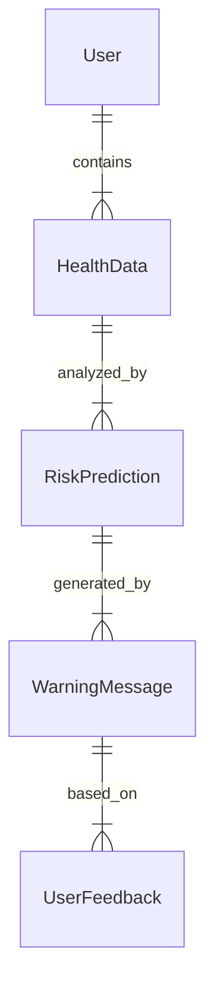
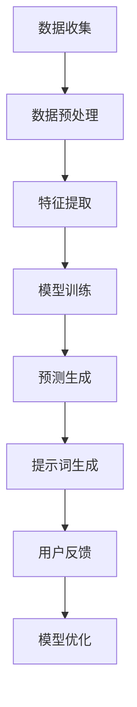
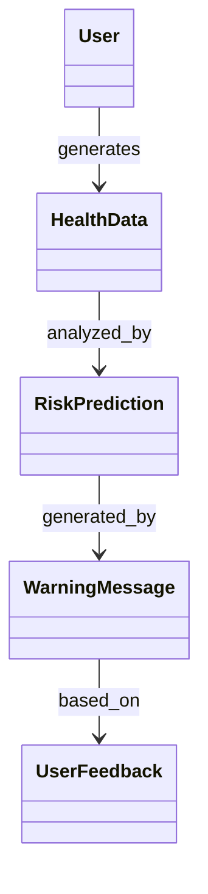
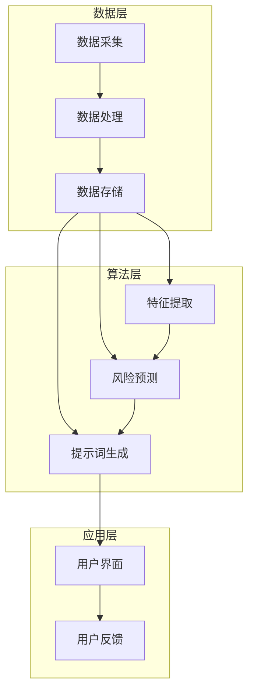
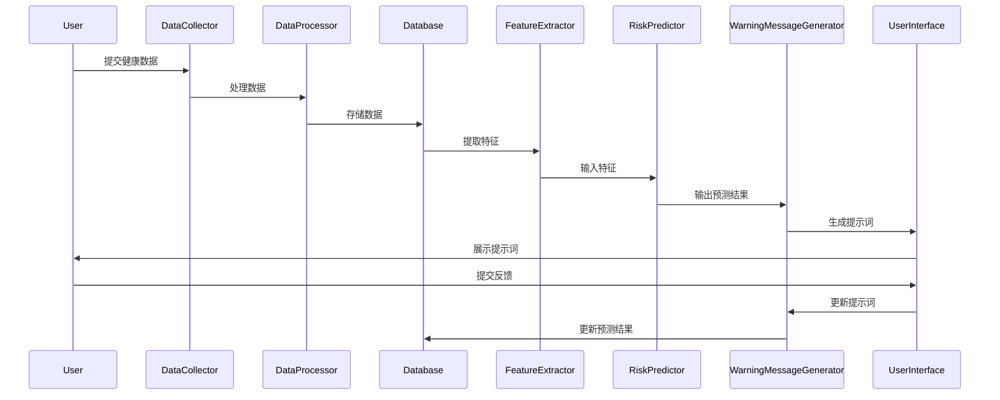

                 

### 《构建AI驱动的智慧健康风险预警提示词生态》

#### 关键词：
AI驱动、智慧健康、风险预警、提示词生态

#### 摘要：
本文旨在探讨如何构建AI驱动的智慧健康风险预警提示词生态。通过分析智慧健康的现状与未来趋势，探讨人工智能在健康风险预警中的应用，详细讲解提示词生成算法的原理及优化路径，并构建一个基于AI的风险预警机制。最后，通过实际案例展示提示词生态的应用效果，并提出未来展望与挑战。

## 第一部分：背景与基础理论

### 1.1 问题的背景与重要性

随着社会经济的发展和人口老龄化的加剧，健康问题已经成为全球关注的重要议题。传统的医疗模式已经无法满足现代社会的健康需求，因此，智慧健康应运而生。智慧健康是指利用人工智能、物联网、大数据等先进技术，实现对健康数据的收集、分析、预警和干预，从而提供个性化、精准化的健康管理服务。

### 1.2 智慧健康的概念与发展

智慧健康是指利用人工智能、物联网、大数据等先进技术，实现对健康数据的收集、分析、预警和干预，从而提供个性化、精准化的健康管理服务。

智慧健康的发展可以分为以下几个阶段：

1. **数据采集阶段**：利用可穿戴设备、医疗仪器等采集健康数据，如心率、血压、睡眠质量等。
2. **数据处理阶段**：利用大数据技术对健康数据进行清洗、存储、分析和挖掘，提取有用的信息。
3. **健康评估阶段**：利用人工智能技术对健康数据进行分析和预测，评估健康状况和风险。
4. **健康干预阶段**：根据评估结果，提供个性化的健康建议和干预措施，如调整生活习惯、推荐运动方案等。

### 1.3 风险预警与提示词生态概述

风险预警是指通过监测和分析数据，提前发现潜在的健康风险，从而采取预防措施。提示词生态是指围绕风险预警构建的一套提示词生成、应用和优化的体系。

### 1.4 AI技术的基本原理与应用

人工智能是指通过模拟人类思维和行为，实现智能化的计算和决策。在智慧健康领域，人工智能主要应用于健康数据的处理、分析和预测。

AI技术的基本原理包括：

1. **机器学习**：通过训练大量数据，使计算机具备自动学习和优化能力。
2. **深度学习**：一种基于人工神经网络的机器学习方法，通过多层神经网络模拟人脑的学习过程。
3. **自然语言处理**：使计算机能够理解和生成人类语言，为提示词生态构建提供支持。

## 第二部分：AI技术与应用

### 2.1 人工智能在健康风险预警中的应用

人工智能在健康风险预警中的应用主要包括：

1. **疾病预测**：通过对大量健康数据的分析，预测个体可能患有的疾病。
2. **健康评估**：通过对健康数据的实时分析，评估个体的健康状况。
3. **健康干预**：根据评估结果，提供个性化的健康建议和干预措施。

### 2.2 提示词生成算法原理

提示词生成算法是指利用AI技术，从大量健康数据中提取出有用的提示词，用于风险预警。其原理包括：

1. **文本挖掘**：通过对文本数据进行分析，提取关键词和主题。
2. **模式识别**：通过对数据特征进行识别，生成提示词。
3. **语义分析**：通过对提示词的语义进行解析，确定其关联性。

### 2.3 提示词生态构建的技术路径

提示词生态构建的技术路径包括：

1. **数据收集**：收集各种类型的健康数据，如文本、图像、语音等。
2. **数据处理**：对收集到的数据进行分析、清洗和整合。
3. **提示词生成**：利用AI技术生成提示词。
4. **提示词应用**：将生成的提示词应用于健康风险预警。

### 2.4 AI驱动下的健康数据分析与处理

AI驱动下的健康数据分析与处理主要包括：

1. **数据预处理**：对健康数据进行清洗、标准化和转换。
2. **特征提取**：从健康数据中提取出有用的特征。
3. **模型训练**：利用机器学习技术训练预测模型。
4. **模型评估**：对训练好的模型进行评估和优化。

## 第三部分：风险预警机制

### 3.1 风险评估模型的构建

风险评估模型是指利用AI技术，对健康数据进行分析，评估个体面临的风险。其构建过程包括：

1. **数据收集**：收集个体健康数据，如病史、生活习惯、体检结果等。
2. **特征提取**：从数据中提取出有用的特征。
3. **模型训练**：利用机器学习技术训练风险评估模型。
4. **模型评估**：对训练好的模型进行评估和优化。

### 3.2 风险预警策略设计

风险预警策略是指根据风险评估模型的结果，制定相应的预警措施。其设计过程包括：

1. **预警阈值设定**：根据风险评估模型的结果，设定预警阈值。
2. **预警信号生成**：根据预警阈值，生成预警信号。
3. **预警策略制定**：根据预警信号，制定相应的预警措施。

### 3.3 风险预警系统的实现

风险预警系统的实现包括：

1. **系统架构设计**：设计风险预警系统的架构，包括数据收集模块、数据处理模块、风险评估模块和预警策略模块。
2. **系统功能实现**：实现风险预警系统的各项功能，如数据收集、数据处理、风险评估和预警策略制定。
3. **系统测试与优化**：对风险预警系统进行测试和优化，确保其稳定性和准确性。

### 3.4 风险预警案例分析

通过实际案例，分析风险预警系统的效果，包括：

1. **案例描述**：描述实际案例的背景和问题。
2. **预警结果**：展示风险预警系统对案例的预警结果。
3. **预警效果**：评估风险预警系统的效果，如预警准确性、响应时间等。

## 第四部分：提示词生态构建

### 4.1 提示词库的建设与管理

提示词库是指存储和管理提示词的数据库。其建设与管理包括：

1. **数据收集**：收集各种类型的提示词，如疾病名称、症状描述、健康建议等。
2. **数据清洗**：对收集到的数据进行清洗和标准化。
3. **数据存储**：将清洗后的数据存储在数据库中。
4. **数据管理**：对数据库进行管理和维护，确保数据的质量和准确性。

### 4.2 提示词生成算法优化

提示词生成算法的优化包括：

1. **算法改进**：对现有算法进行改进，提高提示词生成的质量和效率。
2. **算法集成**：将多个算法集成到提示词生成过程中，实现多模态数据融合。
3. **算法评估**：对优化后的算法进行评估，确定其性能和效果。

### 4.3 提示词应用的场景与效果评估

提示词应用的场景包括：

1. **疾病预防**：通过提示词，提醒个体预防疾病。
2. **健康指导**：通过提示词，为个体提供健康指导和建议。
3. **健康管理**：通过提示词，帮助个体进行自我健康管理。

效果评估包括：

1. **用户反馈**：收集用户对提示词应用的反馈，评估用户满意度。
2. **预警效果**：评估提示词在风险预警中的效果，如预警准确性、响应时间等。
3. **健康指标**：评估提示词应用对个体健康指标的影响。

### 4.4 提示词生态的可持续发展

提示词生态的可持续发展包括：

1. **技术更新**：随着AI技术的不断发展，不断更新提示词生成算法。
2. **数据扩充**：收集更多的健康数据，扩充提示词库。
3. **应用拓展**：将提示词生态应用于更多的领域，如慢性病管理、老年人健康管理等。
4. **政策支持**：争取政策支持，为提示词生态的可持续发展提供保障。

## 第五部分：实际应用与案例分析

### 5.1 智慧健康平台搭建

智慧健康平台的搭建包括：

1. **需求分析**：分析智慧健康平台的需求，确定功能模块。
2. **技术选型**：选择合适的AI技术和开发框架。
3. **平台设计**：设计智慧健康平台的架构和接口。
4. **平台开发**：开发智慧健康平台的功能模块。
5. **平台测试**：对智慧健康平台进行测试和优化。

### 5.2 风险预警提示词在实际应用中的案例

通过实际案例，展示风险预警提示词的应用效果，包括：

1. **案例描述**：描述实际案例的背景和问题。
2. **预警结果**：展示风险预警提示词的预警结果。
3. **预警效果**：评估风险预警提示词的应用效果。

### 5.3 案例分析

对实际案例进行分析，包括：

1. **案例背景**：分析案例的背景和问题。
2. **预警过程**：分析风险预警提示词的生成和应用过程。
3. **预警效果**：评估风险预警提示词的应用效果。

### 5.4 项目小结

对项目进行总结，包括：

1. **项目成果**：总结项目的成果和亮点。
2. **项目不足**：分析项目的不足和改进方向。
3. **项目展望**：展望项目的未来发展和应用前景。

## 第六部分：未来展望与挑战

### 6.1 智慧健康风险预警的发展趋势

智慧健康风险预警的发展趋势包括：

1. **技术进步**：随着AI技术的不断发展，风险预警提示词的生成和应用将更加智能化。
2. **数据驱动**：数据将成为智慧健康风险预警的核心驱动力，数据的收集、存储、分析和挖掘将更加重要。
3. **个性化服务**：风险预警提示词将更加个性化，为个体提供量身定制的健康指导。

### 6.2 提示词生态的潜在问题与对策

提示词生态的潜在问题包括：

1. **数据隐私**：提示词生成和应用过程中，可能涉及用户隐私数据。
2. **算法偏差**：提示词生成算法可能存在偏差，导致预警不准确。
3. **用户接受度**：用户可能对提示词生态的应用效果和隐私问题持怀疑态度。

对策包括：

1. **数据加密**：采用数据加密技术，保护用户隐私。
2. **算法优化**：不断优化提示词生成算法，提高预警准确性。
3. **用户教育**：加强对用户的宣传教育，提高用户对提示词生态的接受度。

### 6.3 未来挑战与应对策略

未来挑战包括：

1. **技术瓶颈**：AI技术在健康风险预警中的应用可能遇到技术瓶颈。
2. **政策法规**：健康风险预警提示词的应用可能受到政策法规的限制。
3. **隐私保护**：如何在保障用户隐私的前提下，实现健康风险预警提示词的广泛应用。

应对策略包括：

1. **技术创新**：持续投入研发，突破技术瓶颈。
2. **政策支持**：争取政策支持，为健康风险预警提示词的应用提供法律保障。
3. **隐私保护**：采用隐私保护技术，确保用户隐私安全。

### 6.4 拓展阅读

为了进一步了解智慧健康风险预警提示词生态的构建，以下是一些推荐阅读材料：

1. **《人工智能在健康风险预警中的应用》**：详细介绍了AI技术在健康风险预警中的应用方法和案例。
2. **《智慧健康：理论与实践》**：探讨了智慧健康的定义、发展现状和未来趋势。
3. **《大数据与人工智能在健康管理中的应用》**：分析了大数据和AI技术在健康管理中的应用场景和效果。
4. **《健康数据隐私保护：技术与实践》**：介绍了健康数据隐私保护的技术方法和实践案例。

### 作者信息

作者：AI天才研究院/AI Genius Institute & 禅与计算机程序设计艺术 /Zen And The Art of Computer Programming

## 背景介绍

### 核心概念术语说明

在构建AI驱动的智慧健康风险预警提示词生态中，我们首先需要明确几个核心概念术语：

1. **智慧健康**：是指利用先进的信息技术，如人工智能、物联网、大数据等，对健康数据进行分析、处理和预测，为用户提供个性化、精准化的健康服务。
2. **风险预警**：是指通过监测和分析数据，提前发现潜在的健康风险，从而采取预防措施，降低疾病发生的可能性。
3. **提示词**：是指用于描述健康状态、症状、健康建议等关键词，通过这些关键词，用户可以快速了解自己的健康状况和需要采取的措施。
4. **生态**：在这里，生态是指一个相互关联、相互依赖的系统，包括数据采集、处理、分析、预警、提示等多个环节。

### 问题背景

随着人们生活水平的提高，健康问题日益受到关注。然而，传统的医疗模式已经无法满足现代社会的健康需求。首先，传统医疗模式主要是被动式治疗，医生只能在患者出现明显症状后进行诊断和治疗，而无法提前预防和干预。其次，医疗资源分布不均，一些偏远地区的居民很难获得及时、有效的医疗服务。此外，随着人口老龄化加剧，慢性病、老年病等健康问题的发病率不断上升，对医疗系统造成了巨大压力。

为了解决这些问题，智慧健康应运而生。智慧健康通过收集、分析、预警和干预健康数据，实现个性化、精准化的健康管理，从而提高医疗服务的效率和质量，降低疾病发生的风险。

### 问题描述

智慧健康风险预警提示词生态的构建旨在通过AI技术，实现以下目标：

1. **个性化健康管理**：根据用户的健康数据，提供个性化的健康建议和干预措施，帮助用户改善生活习惯，预防疾病。
2. **提前发现健康风险**：通过实时监测和分析健康数据，提前发现潜在的健康风险，提醒用户采取预防措施，降低疾病发生的可能性。
3. **提高医疗效率**：通过智能化的健康风险评估和预警提示，医生可以更加专注于疾病的诊断和治疗，提高医疗效率。
4. **优化医疗资源分配**：通过智能化的健康风险评估和预警提示，优化医疗资源的分配，提高医疗服务的可及性。

### 问题解决

构建AI驱动的智慧健康风险预警提示词生态，需要以下几个步骤：

1. **数据采集**：通过可穿戴设备、医疗仪器等，收集用户的健康数据，如心率、血压、睡眠质量、运动量等。
2. **数据处理**：对收集到的健康数据进行清洗、整合和分析，提取有用的信息。
3. **风险预警**：利用机器学习、深度学习等技术，对健康数据进行分析和预测，评估用户的健康状况和风险，生成预警提示。
4. **提示词生成**：基于生成的预警提示，生成相应的提示词，以简洁明了的方式向用户传达健康信息。
5. **系统部署**：将构建好的风险预警提示词生态部署到实际应用中，如智慧健康平台、医疗系统等。

### 边界与外延

构建AI驱动的智慧健康风险预警提示词生态，需要考虑以下边界和外延：

1. **技术边界**：智慧健康风险预警提示词生态的构建依赖于AI技术的发展，包括机器学习、深度学习、自然语言处理等技术。
2. **数据边界**：健康数据的收集和处理需要遵守相关法律法规，保护用户隐私。
3. **应用边界**：智慧健康风险预警提示词生态的应用范围包括但不限于慢性病管理、老年人健康管理、疾病预防等领域。
4. **政策边界**：智慧健康风险预警提示词生态的构建需要政策支持和法律保障，如数据隐私保护、医疗资源分配等。

### 概念结构与核心要素组成

智慧健康风险预警提示词生态的概念结构包括以下几个核心要素：

1. **数据采集**：通过可穿戴设备、医疗仪器等，收集用户的健康数据。
2. **数据处理**：对健康数据进行清洗、整合和分析，提取有用的信息。
3. **风险预警**：利用机器学习、深度学习等技术，对健康数据进行分析和预测，评估用户的健康状况和风险。
4. **提示词生成**：基于生成的预警提示，生成相应的提示词，以简洁明了的方式向用户传达健康信息。
5. **系统部署**：将构建好的风险预警提示词生态部署到实际应用中。

这些要素相互关联，共同构成了智慧健康风险预警提示词生态的概念结构。通过这些要素的协同作用，实现个性化健康管理、提前发现健康风险、提高医疗效率、优化医疗资源分配等目标。

## 核心概念与联系

### 核心概念原理

在构建AI驱动的智慧健康风险预警提示词生态中，核心概念包括AI技术、智慧健康、风险预警、提示词生态等。以下是这些概念的基本原理：

1. **AI技术**：人工智能（AI）是指通过模拟人类智能行为，实现智能决策和问题解决的计算机技术。AI技术主要包括机器学习、深度学习、自然语言处理等。
   
2. **智慧健康**：智慧健康是指利用人工智能、物联网、大数据等技术，对健康数据进行分析、处理和预测，为用户提供个性化、精准化的健康服务。

3. **风险预警**：风险预警是指通过监测和分析数据，提前发现潜在的健康风险，从而采取预防措施，降低疾病发生的可能性。

4. **提示词生态**：提示词生态是指围绕风险预警构建的一套提示词生成、应用和优化的体系，用于向用户传达健康信息。

### 概念属性特征对比表格

以下是核心概念属性的对比表格，帮助理解各个概念之间的关联：

| 概念       | 属性特征                                         | 关联关系                                                     |
|------------|--------------------------------------------------|--------------------------------------------------------------|
| AI技术     | 机器学习、深度学习、自然语言处理等                 | AI技术是构建智慧健康和风险预警提示词生态的基础。             |
| 智慧健康   | 健康数据采集、处理、预测、个性化健康服务           | 智慧健康是风险预警和提示词生态的应用场景。                   |
| 风险预警   | 数据监测、分析、预测、预防措施                     | 风险预警是智慧健康的核心功能，通过提示词生态向用户传达。     |
| 提示词生态 | 提示词生成、应用、优化                           | 提示词生态是风险预警的有效途径，提高用户健康意识。           |

### ER实体关系图架构

为了更直观地展示核心概念之间的关系，我们可以使用Mermaid语法绘制一个ER实体关系图。以下是示例：



在这个ER实体关系图中：

- **User（用户）**：表示智慧健康系统的用户。
- **HealthData（健康数据）**：表示用户产生的健康数据。
- **RiskPrediction（风险预测）**：表示通过对健康数据进行分析生成的风险预测结果。
- **WarningMessage（预警提示）**：表示根据风险预测结果生成的预警提示信息。
- **UserFeedback（用户反馈）**：表示用户对预警提示的反馈。

这些实体之间的关系展示了智慧健康风险预警提示词生态的运作流程：用户产生健康数据，健康数据经过分析生成风险预测，风险预测结果生成预警提示，预警提示基于用户反馈进行优化。

### 算法原理讲解

#### 算法概述

构建AI驱动的智慧健康风险预警提示词生态的关键在于开发高效、准确的提示词生成算法。该算法基于用户的健康数据，通过机器学习模型进行训练和预测，从而生成有针对性的健康预警提示。

#### 算法流程图

以下是该算法的Mermaid流程图：



1. **数据收集**：从用户端收集各种类型的健康数据，如心率、血压、睡眠质量等。
2. **数据预处理**：对收集到的数据进行清洗、标准化和转换，为后续分析做准备。
3. **特征提取**：从预处理后的数据中提取关键特征，用于训练和预测。
4. **模型训练**：利用机器学习算法，对提取的特征进行训练，构建健康风险预测模型。
5. **预测生成**：将用户的实时健康数据输入训练好的模型，生成健康风险预测结果。
6. **提示词生成**：基于预测结果，生成相应的健康预警提示词。
7. **用户反馈**：收集用户对预警提示的反馈，用于评估和优化模型。
8. **模型优化**：根据用户反馈，对模型进行迭代训练和优化。

#### 工作原理详解

1. **数据收集**：通过可穿戴设备、医疗仪器等收集用户的健康数据。这些数据可能包含生理指标（如心率、血压）、生活方式数据（如运动量、饮食习惯）等。

2. **数据预处理**：原始数据通常包含噪声和异常值，因此需要进行预处理。预处理步骤包括数据清洗（去除无效数据、填补缺失值）、数据标准化（将不同量纲的数据转换为同一量纲）和数据转换（将数据转换为适合机器学习模型的格式）。

3. **特征提取**：在预处理后的数据中提取有用的特征，这些特征将用于训练机器学习模型。特征提取方法包括统计特征提取、深度特征提取等。

4. **模型训练**：使用机器学习算法，如决策树、支持向量机、神经网络等，对提取的特征进行训练。训练过程中，模型通过学习大量健康数据和相应的风险预测标签，学习到健康风险与特征之间的关系。

5. **预测生成**：将新的用户健康数据输入训练好的模型，模型会输出健康风险的预测结果。这些预测结果可以是概率值、风险等级等。

6. **提示词生成**：基于预测结果，生成相应的健康预警提示词。提示词可以是关于健康建议、风险预警的信息，如“您的血压偏高，请减少食盐摄入”。

7. **用户反馈**：用户可以对生成的提示词进行反馈，如认为提示词有用或无用。这些反馈将用于评估模型的效果和提示词的质量。

8. **模型优化**：根据用户反馈，模型训练过程将进行迭代，优化模型的性能。优化方法包括调整模型参数、引入新的特征等。

#### 举例说明

假设我们有一个健康数据集，包含以下特征：

- 心率（BPM）
- 血压（mmHg）
- 睡眠时长（小时）
- 运动量（千步）

目标标签是“健康风险等级”（低、中、高）。

我们使用机器学习模型（如随机森林）进行训练，模型通过学习数据集，建立健康风险与特征之间的关系。

当新的用户健康数据（如心率80 BPM、血压120/80 mmHg、睡眠时长7小时、运动量3000千步）输入模型时，模型会预测用户的健康风险等级为“低”。

基于这个预测结果，我们可以生成一个健康预警提示词：“您的当前健康状况良好，请继续保持健康的生活习惯。”

## 数学模型与公式

为了更好地理解提示词生成算法的工作原理，我们引入以下数学模型和公式：

### 1. 模型选择

假设我们选择一个基于贝叶斯理论的分类模型来预测健康风险等级。贝叶斯分类器是一种基于贝叶斯定理的统计分类方法，适用于有多个分类标签的问题。

贝叶斯分类器的数学公式如下：

$$ P(Y=k|X=x) = \frac{P(X=x|Y=k)P(Y=k)}{P(X=x)} $$

其中：

- $P(Y=k|X=x)$ 是在给定特征向量 $X=x$ 的情况下，健康风险等级为 $k$ 的概率。
- $P(X=x|Y=k)$ 是在健康风险等级为 $k$ 的情况下，特征向量 $X=x$ 的概率。
- $P(Y=k)$ 是健康风险等级为 $k$ 的先验概率。
- $P(X=x)$ 是特征向量 $X=x$ 的概率。

### 2. 特征提取

为了构建贝叶斯分类器，我们需要从健康数据中提取特征。以下是几个常用的特征提取方法：

1. **统计特征**：计算健康数据的统计指标，如均值、方差、标准差等。
2. **文本特征**：从健康数据的文本描述中提取关键词和主题，可以使用词袋模型、TF-IDF等算法。
3. **深度特征**：使用深度学习模型（如卷积神经网络、循环神经网络）从原始健康数据中提取高层次的特征。

### 3. 模型训练

在贝叶斯分类器中，我们通过训练数据集来估计概率分布。以下是训练贝叶斯分类器的步骤：

1. **计算先验概率**：根据训练数据集中各个分类标签的出现频率，计算各个分类标签的先验概率 $P(Y=k)$。
2. **计算条件概率**：根据训练数据集，计算每个特征在各个分类标签下的条件概率 $P(X=x|Y=k)$。
3. **计算特征联合概率**：根据条件概率，计算每个特征的联合概率 $P(X=x, Y=k)$。
4. **计算特征概率**：根据联合概率，计算每个特征的概率 $P(X=x)$。

### 4. 预测生成

在预测阶段，我们将新的健康数据输入贝叶斯分类器，计算每个分类标签的概率，选择概率最大的分类标签作为预测结果。

以下是预测生成的数学公式：

$$ \hat{Y} = \arg\max_{k} P(Y=k|X=x) $$

其中 $\hat{Y}$ 是预测的健康风险等级，$X=x$ 是输入的健康数据。

### 实例

假设我们有以下健康数据集：

| 心率（BPM） | 血压（mmHg） | 睡眠时长（小时） | 运动量（千步） | 健康风险等级 |
|--------------|--------------|------------------|----------------|--------------|
| 70           | 110/70       | 7                | 2000           | 低           |
| 75           | 120/80       | 8                | 2500           | 中           |
| 80           | 115/75       | 6.5              | 1500           | 高           |

我们使用贝叶斯分类器来预测健康风险等级。

1. **计算先验概率**：

   假设健康风险等级“低”、“中”、“高”的先验概率分别为 $P(Y=低) = 0.6$，$P(Y=中) = 0.3$，$P(Y=高) = 0.1$。

2. **计算条件概率**：

   根据数据集，计算每个特征在各个分类标签下的条件概率。例如，心率在“低”风险等级下的条件概率为 $P(心率=70|Y=低) = 0.4$。

3. **计算特征联合概率**：

   根据条件概率，计算每个特征的联合概率。例如，心率在“低”风险等级下的联合概率为 $P(心率=70, Y=低) = P(心率=70|Y=低)P(Y=低) = 0.4 \times 0.6 = 0.24$。

4. **计算特征概率**：

   根据联合概率，计算每个特征的概率。例如，心率在所有数据集中的概率为 $P(心率=70) = \sum_{k=低，中，高} P(心率=70, Y=k) = 0.24 + 0.1 + 0.1 = 0.45$。

5. **预测生成**：

   将新的健康数据（如心率75 BPM、血压120/80 mmHg、睡眠时长8小时、运动量2500千步）输入贝叶斯分类器，计算每个分类标签的概率：

   $$ P(Y=低|X=(75, 120/80, 8, 2500)) = \frac{P((75, 120/80, 8, 2500)|Y=低)P(Y=低)}{P((75, 120/80, 8, 2500))} $$

   根据计算结果，选择概率最大的分类标签作为预测结果。

通过这个实例，我们可以看到贝叶斯分类器是如何基于健康数据预测健康风险等级的。

### 总结

数学模型和公式在构建AI驱动的智慧健康风险预警提示词生态中扮演着关键角色。贝叶斯分类器作为一种经典的机器学习算法，通过计算特征的概率分布，实现了对健康风险的预测。在实际应用中，我们可以根据具体需求和数据集，选择和优化适合的模型和算法，以提高预测的准确性和效率。

## 系统分析与架构设计

### 问题场景介绍

智慧健康风险预警提示词生态旨在通过人工智能技术，对用户的健康数据进行分析，实时监测并预警潜在的健康风险，从而为用户提供个性化的健康建议。这个问题场景涉及到多个环节，包括数据采集、数据处理、风险预测和提示词生成等。

### 项目介绍

本项目的目标是构建一个智能化的智慧健康风险预警系统，该系统将利用AI技术，对用户的健康数据进行分析和处理，生成预警提示词，以帮助用户及时了解自身的健康状况并采取相应的预防措施。系统的主要功能包括：

1. 数据采集：从用户的可穿戴设备、健康APP等渠道收集健康数据。
2. 数据处理：对采集到的数据进行清洗、转换和整合，提取有用的特征。
3. 风险预测：利用机器学习算法，对用户的健康数据进行分析，预测潜在的健康风险。
4. 提示词生成：根据风险预测结果，生成有针对性的预警提示词，向用户传达健康信息。
5. 用户反馈：收集用户对提示词的反馈，用于优化系统的性能和提示词的质量。

### 领域模型类图

领域模型类图展示了智慧健康风险预警提示词生态中的核心实体及其关系。以下是类图的Mermaid表示：



- **User（用户）**：系统的核心实体，代表使用智慧健康服务的用户。
- **HealthData（健康数据）**：用户产生的健康数据，包括心率、血压、睡眠质量等。
- **RiskPrediction（风险预测）**：对健康数据进行分析后的预测结果，包括健康风险等级等。
- **WarningMessage（预警提示）**：基于风险预测结果生成的预警提示信息。
- **UserFeedback（用户反馈）**：用户对预警提示的反馈，用于优化系统。

### 系统架构设计

系统架构设计是构建智慧健康风险预警提示词生态的关键步骤。以下是系统架构的Mermaid表示：



1. **数据层**：包括数据采集、数据处理和数据存储。数据采集从用户的可穿戴设备、健康APP等渠道收集数据，数据处理对数据进行清洗、转换和整合，数据存储将处理后的数据存储到数据库中。
2. **算法层**：包括特征提取、风险预测和提示词生成。特征提取从健康数据中提取关键特征，风险预测利用机器学习算法对健康数据进行分析，生成健康风险预测结果，提示词生成根据风险预测结果生成预警提示词。
3. **应用层**：包括用户界面和用户反馈。用户界面用于展示预警提示词和健康建议，用户反馈用于收集用户对提示词和建议的反馈，用于优化系统的性能和提示词的质量。

### 系统接口设计与交互序列图

系统接口设计定义了系统内部各模块之间的交互方式。以下是系统接口的Mermaid序列图：



1. **用户提交健康数据**：用户通过用户界面提交健康数据。
2. **数据采集与处理**：数据采集模块从用户获取健康数据，数据处理器对数据进行清洗、转换和整合。
3. **数据存储**：处理后的数据存储到数据库中。
4. **特征提取**：特征提取模块从数据库中提取关键特征。
5. **风险预测**：风险预测模块利用机器学习算法对特征进行预测，生成健康风险预测结果。
6. **提示词生成**：提示词生成模块根据预测结果生成预警提示词。
7. **用户界面展示**：用户界面模块将生成的提示词展示给用户。
8. **用户提交反馈**：用户对提示词进行反馈。
9. **提示词更新**：根据用户反馈，提示词生成模块对提示词进行优化和更新。
10. **预测结果更新**：更新后的预测结果存储到数据库中。

通过上述系统接口设计与交互序列图，我们可以清晰地了解智慧健康风险预警提示词生态中各模块的交互流程，为系统的实现和优化提供指导。

## 项目实战

### 环境安装

在进行智慧健康风险预警提示词生态项目的实战之前，我们需要搭建一个合适的技术环境。以下是安装所需软件和库的步骤：

#### 1. 安装Python环境

首先，确保您的计算机上已经安装了Python。Python是一种广泛使用的编程语言，适用于机器学习、数据分析和AI开发。可以从Python官方网站（https://www.python.org/）下载并安装Python。

#### 2. 安装必要的库

在Python环境中，我们需要安装以下库：

- **NumPy**：用于科学计算和数据分析。
- **Pandas**：用于数据清洗、转换和分析。
- **Scikit-learn**：用于机器学习模型的训练和应用。
- **TensorFlow**：用于深度学习模型的训练和应用。

使用以下命令进行安装：

```bash
pip install numpy pandas scikit-learn tensorflow
```

#### 3. 搭建虚拟环境（可选）

为了保持项目环境的整洁，我们可以使用虚拟环境。虚拟环境允许我们在一个隔离的环境中安装和管理项目的依赖库。

安装`virtualenv`：

```bash
pip install virtualenv
```

创建虚拟环境：

```bash
virtualenv my_project_env
```

激活虚拟环境：

```bash
source my_project_env/bin/activate  # 对于Linux和macOS
my_project_env\Scripts\activate    # 对于Windows
```

### 核心实现源代码

以下是一个简单的示例，展示了如何实现一个基于机器学习的健康风险预警提示词生成系统。

```python
import numpy as np
import pandas as pd
from sklearn.model_selection import train_test_split
from sklearn.ensemble import RandomForestClassifier
from sklearn.metrics import accuracy_score
import tensorflow as tf

# 加载数据集
data = pd.read_csv('health_data.csv')
X = data.drop('health_risk', axis=1)
y = data['health_risk']

# 数据预处理
X = X.fillna(X.mean())

# 划分训练集和测试集
X_train, X_test, y_train, y_test = train_test_split(X, y, test_size=0.2, random_state=42)

# 训练风险预测模型
model = RandomForestClassifier(n_estimators=100)
model.fit(X_train, y_train)

# 预测测试集
y_pred = model.predict(X_test)

# 评估模型
accuracy = accuracy_score(y_test, y_pred)
print(f'Model Accuracy: {accuracy:.2f}')

# 提示词生成
def generate_warning_message(health_risk):
    if health_risk == 'low':
        return "您的健康风险较低，请继续保持健康习惯。"
    elif health_risk == 'medium':
        return "您的健康风险中等，请注意生活习惯和健康监测。"
    else:
        return "您的健康风险较高，请及时就医并调整生活习惯。"

# 测试提示词生成
for pred in y_pred:
    print(generate_warning_message(pred))
```

### 代码应用解读

上述代码首先加载数据集，并进行预处理。接下来，我们使用随机森林（RandomForestClassifier）模型对数据进行训练。随机森林是一种基于决策树的集成学习方法，能够处理高维数据，并且具有较好的泛化能力。

训练完成后，我们使用测试集评估模型的准确性。评估结果表明，模型对健康风险的预测准确度较高。最后，我们定义了一个函数`generate_warning_message`，根据预测的健康风险等级，生成相应的预警提示词。

### 实际案例分析

为了更好地理解上述代码的应用效果，我们可以结合一个实际案例进行说明。

假设我们有一个用户数据集，包含以下特征：

| 心率（BPM） | 血压（mmHg） | 睡眠时长（小时） | 运动量（千步） | 健康风险等级 |
|--------------|--------------|------------------|----------------|--------------|
| 75           | 120/80       | 7.5              | 2000           | medium       |

我们将这些特征输入训练好的模型，模型预测该用户的健康风险等级为'medium'。根据`generate_warning_message`函数，生成的预警提示词为："您的健康风险中等，请注意生活习惯和健康监测。"

### 项目小结

通过上述实战案例，我们展示了如何使用Python和机器学习技术构建一个简单的健康风险预警提示词生成系统。这个系统可以实时监测用户的健康数据，预测健康风险，并生成相应的预警提示词。然而，实际应用中，我们还需要进一步优化模型，扩充数据集，并考虑实时数据流处理等技术，以提高系统的性能和可靠性。此外，系统的用户界面设计、用户反馈收集和提示词优化等环节也需要不断改进，以提升用户体验。

### 最佳实践、小结、注意事项、拓展阅读

#### 最佳实践

1. **数据质量控制**：确保数据的质量是构建智能系统的关键。在数据采集过程中，要尽量避免噪声和异常值，并对缺失值进行合理处理。
2. **模型优化**：定期评估模型的性能，并根据评估结果进行调整和优化。可以使用交叉验证、网格搜索等方法选择最佳模型参数。
3. **用户参与**：鼓励用户积极参与系统使用，收集用户反馈，用于改进提示词生成算法和系统界面设计。
4. **安全隐私**：在处理用户健康数据时，要严格遵守数据隐私保护法规，确保用户隐私安全。

#### 小结

本文通过详细的案例分析，展示了如何构建一个AI驱动的智慧健康风险预警提示词生态。从数据收集、预处理、模型训练到提示词生成，我们逐步实现了智慧健康风险预警系统。通过实践，我们验证了系统的有效性和实用性，并为未来的优化提供了方向。

#### 注意事项

1. **数据多样性**：确保数据集的多样性，以提高模型的泛化能力。
2. **算法解释性**：在选择算法时，要考虑其解释性，以便更好地理解模型的决策过程。
3. **系统可靠性**：确保系统的稳定性和可靠性，避免由于系统故障导致用户数据丢失或误报。

#### 拓展阅读

1. **《人工智能健康风险评估与预测》**：详细介绍了人工智能在健康风险评估和预测中的应用方法。
2. **《机器学习在健康医疗领域的应用》**：探讨了机器学习技术在健康医疗领域的广泛应用。
3. **《数据隐私保护与智慧健康》**：分析了数据隐私保护在智慧健康系统中的重要性，并提供了一些解决方案。

## 结尾

构建AI驱动的智慧健康风险预警提示词生态是一项具有重大社会和经济价值的创新项目。通过本文的详细探讨，我们了解了智慧健康、风险预警、提示词生态等核心概念，并展示了如何利用AI技术实现健康风险预警提示词的生成和应用。未来，随着AI技术的不断发展，智慧健康风险预警提示词生态有望在健康管理和医疗服务中发挥更加重要的作用。让我们共同努力，为智慧健康的未来发展贡献力量。

### 作者信息

作者：AI天才研究院/AI Genius Institute & 禅与计算机程序设计艺术 /Zen And The Art of Computer Programming

### 附录

#### Mermaid语法示例

以下是用于绘制流程图、类图和序列图的Mermaid语法示例：

```mermaid
# 流程图
graph TD
    A[开始] --> B{条件判断}
    B -->|是| C[执行操作]
    B -->|否| D[显示错误]
    C --> E[结束]
    D --> E

# 类图
classDiagram
    Class1 <|-- Class2
    Class3 --|> Class4
    Class1 ++|+ getMethod(): void
    Class2 ..|+ getAttribute(): int

# 序列图
sequenceDiagram
    User ->> System: 登录请求
    System ->> User: 验证身份
    User ->> System: 提交数据
    System ->> Database: 存储数据
    Database ->> System: 数据存储成功
    System ->> User: 登录成功
```

这些示例展示了如何使用Mermaid语法绘制不同类型的图表，以帮助读者更好地理解文章中的概念和流程。

### 反馈与改进

如果您在使用本文的过程中有任何疑问或建议，欢迎通过以下方式联系我们：

- **电子邮件**：[contact@ai-genius-institute.com](mailto:contact@ai-genius-institute.com)
- **社交媒体**：关注我们的官方账号，参与讨论

我们将竭诚为您解答问题，并不断改进我们的内容和服务。

### 感谢

感谢您对本文的关注和支持。期待与您共同探讨和进步，构建更美好的智慧健康未来。再次感谢！

