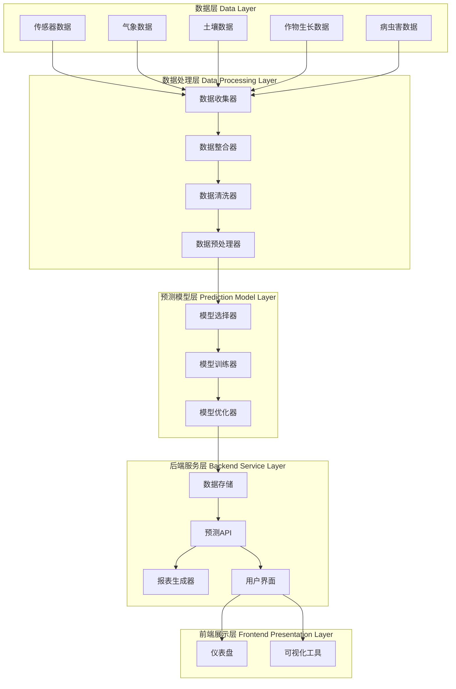

                 

### 前言

#### 引言

随着全球农业发展的不断深入，智慧农业已经成为推动农业现代化的重要力量。在人工智能（AI）技术的助力下，智慧农业不仅提升了农业生产效率，还推动了农业产业的智能化转型。AI驱动的预测系统作为智慧农业的重要组成部分，正逐渐改变传统农业的生产方式和管理模式。

本文旨在探讨如何构建一个AI驱动的智慧农业预测提示词平台。通过系统地分析该平台的核心概念、数据处理与模型构建方法、系统架构设计与实现，以及项目实战和最佳实践，我们希望能够为读者提供一个全面的技术指南，帮助农业领域的技术人员和管理者更好地理解和应用AI技术，实现农业的智能预测与精准管理。

#### 目标读者

本文的目标读者包括但不限于以下几类：

1. 农业科技研发人员：需要对AI在农业中的应用有深入了解，希望通过本文掌握构建预测平台的技术细节。
2. 智慧农业项目管理者：希望从整体上理解AI驱动的预测平台如何运作，以及如何实现平台的功能和性能优化。
3. 数据科学家与机器学习工程师：关注AI技术的实际应用，对构建高效预测模型有浓厚兴趣。
4. 农业信息技术从业者：希望通过本文了解AI技术在智慧农业中的最新进展和未来发展方向。

#### 书籍结构

本文的结构分为八个主要章节，具体内容如下：

1. **第1章 引言与背景**：介绍智慧农业的背景和AI技术在农业领域的应用，阐述构建AI驱动的预测平台的重要性和核心功能。
2. **第2章 核心概念与原理**：详细阐述智慧农业、AI技术基础以及预测模型的原理，并提供统计模型与深度学习模型的对比。
3. **第3章 数据处理与质量提升**：讨论数据收集与整合、数据质量评估与提升的方法和实践。
4. **第4章 AI驱动的预测模型**：介绍常见预测模型的选择、训练与调优方法，并通过实例解析模型的应用。
5. **第5章 系统架构设计与实现**：阐述系统设计原则、系统架构、模块划分和系统实现。
6. **第6章 项目实战：构建预测平台**：从环境准备、数据收集与处理、模型构建与训练、预测功能实现等方面，详细讲解如何构建预测平台。
7. **第7章 最佳实践与优化**：讨论平台性能优化、数据安全与隐私保护、平台扩展与升级的最佳实践。
8. **第8章 总结与展望**：总结项目成果、展望智慧农业和AI预测技术的未来发展方向。

通过以上章节的详细探讨，本文将帮助读者全面了解和掌握构建AI驱动的智慧农业预测提示词平台的核心技术和实践方法。

### 第1章 引言与背景

#### 1.1 问题背景

农业是国民经济的重要支柱，农业生产不仅关系着国家的粮食安全，也对生态环境和社会经济发展产生深远影响。然而，随着全球人口的增长和气候变化等问题的加剧，传统农业面临许多挑战，如资源浪费、环境污染、生产效率低下等。为了应对这些问题，智慧农业的概念应运而生。智慧农业通过应用物联网、人工智能、大数据等现代信息技术，实现对农业生产的精准管理和智能决策，从而提高农业生产效率，减少资源浪费，实现农业的可持续发展。

在智慧农业的发展过程中，预测技术扮演着至关重要的角色。农业生产过程中，气象条件、土壤湿度、作物生长状态等因素的变化对作物的生长和产量产生显著影响。传统的农业生产方式往往依赖于经验，而难以适应快速变化的农业环境。通过AI驱动的预测技术，可以实现对天气、土壤、作物生长状态的实时监测和预测，从而为农业生产提供科学依据，优化农业管理决策。

#### 1.1.1 农业发展现状

目前，全球农业发展呈现以下特点：

1. **自动化与机械化**：现代农业已经广泛应用自动化和机械化技术，如无人机、自动播种机、自动收割机等，显著提高了农业生产效率。
2. **数字化与信息化**：物联网技术的普及使得农业生产数据更加实时、准确，通过大数据分析和人工智能技术，可以对农业生产进行智能管理。
3. **生物技术**：基因编辑、转基因等技术被广泛应用于农作物育种，提高了农作物的抗病、抗虫、抗逆能力。

然而，尽管农业现代化取得了显著进展，但在预测和决策方面仍然面临很多挑战。例如，农业生产过程的复杂性导致预测模型的构建和训练难度较大；农业数据的多样性和不确定性增加了数据处理和分析的难度；传统农业经验与科学预测方法之间的结合仍有待优化。

#### 1.1.2 AI技术在农业领域的应用

人工智能技术在农业领域的应用已经取得了显著成效，主要包括以下几个方面：

1. **作物生长监测与预测**：利用AI技术，可以对作物生长状态进行实时监测，通过图像识别、遥感技术等手段，预测作物的生长趋势，提前预警病虫害等问题。
2. **气象预报与气候变化**：AI技术可以处理和分析大量的气象数据，提供更加精准的天气预报和气候变化预测，为农业生产提供科学依据。
3. **土壤质量分析**：AI技术可以通过分析土壤样本数据，预测土壤的养分含量、酸碱度等，为科学施肥提供支持。
4. **病虫害预测与防治**：通过机器学习和深度学习算法，可以预测病虫害的发生趋势，及时制定防治措施，减少农作物损失。

AI技术的应用不仅提高了农业生产的精准性和效率，还为农业生产者提供了更加科学的管理工具，有助于实现农业的可持续发展。

#### 1.1.3 智慧农业预测的重要性

智慧农业预测在农业生产中具有以下几个重要意义：

1. **提高生产效率**：通过预测技术，可以提前了解作物生长和气象条件的变化，优化农业生产管理，提高产量和品质。
2. **减少资源浪费**：预测技术可以帮助农业生产者科学安排灌溉、施肥等生产活动，减少水、肥等资源的浪费。
3. **降低环境风险**：通过预测气象变化和病虫害趋势，可以提前采取措施，减少农业生产对环境的影响。
4. **优化决策支持**：智慧农业预测平台可以为农业生产者提供实时、准确的预测结果，辅助其做出科学的决策。

总的来说，智慧农业预测技术是农业现代化的重要组成部分，对提高农业生产效率、保障粮食安全和实现农业可持续发展具有重要意义。

#### 1.2 问题描述

##### 1.2.1 预测需求的复杂性

在智慧农业中，预测需求具有显著复杂性，主要体现在以下几个方面：

1. **多维度数据融合**：农业生产涉及的变量众多，如气象数据、土壤数据、作物生长数据、病虫害数据等。这些数据通常来自不同的传感器和监测设备，需要通过数据融合技术，将这些数据整合为一个统一的信息源，以便进行综合分析和预测。
2. **实时性与时效性**：农业预测需要实时性，即能够在作物生长的关键时刻提供准确的预测结果。同时，不同作物和不同生长阶段对预测时效性的要求也不同，需要在预测模型的设计和实现中充分考虑这一特点。
3. **不确定性与多样性**：农业生产环境多变，气象条件、土壤性质、作物品种等因素都会影响预测结果。此外，不同地区、不同季节的农业生产条件也有很大差异，导致预测模型需要适应各种复杂场景。

##### 1.2.2 数据质量和可用性问题

数据质量和可用性问题也是智慧农业预测面临的重大挑战：

1. **数据噪声与缺失**：农业数据通常受到各种噪声和缺失的影响，如传感器故障、数据传输错误等，这些都会对预测模型的准确性产生负面影响。因此，如何处理噪声数据和填补缺失数据，成为数据预处理的重要环节。
2. **数据同步与更新**：农业数据需要实时更新，以反映最新的生产情况。然而，在实际操作中，数据的同步与更新往往受到硬件设备、网络带宽等限制，导致数据时效性受到影响。
3. **数据来源多样性**：农业生产涉及的数据来源多种多样，如农田监测数据、气象站数据、卫星遥感数据等，这些数据可能存在格式、单位、精度等方面的不一致，增加了数据整合和分析的难度。

##### 1.2.3 模型选择和调优的挑战

在智慧农业预测中，选择合适的模型并进行调优也是一大挑战：

1. **模型多样性**：目前，常见的预测模型包括统计模型、机器学习模型和深度学习模型等，每种模型都有其适用的场景和优缺点。在实际应用中，需要根据具体问题和数据特点，选择最合适的模型。
2. **模型调优复杂性**：模型调优涉及超参数调整、模型选择、特征工程等多个方面，需要大量的实验和计算资源。此外，调优过程往往依赖于领域知识和经验，对模型调优者的技术要求较高。
3. **模型泛化能力**：智慧农业预测需要模型具有较好的泛化能力，能够适应不同的环境和条件。然而，实际应用中，模型的泛化能力往往受到数据集和训练条件的影响，需要通过交叉验证、迁移学习等方法来提高。

综上所述，智慧农业预测需求的复杂性、数据质量和可用性问题，以及模型选择和调优的挑战，使得构建一个高效、可靠的预测平台具有极大的技术难度。接下来，我们将详细探讨如何解决这些挑战，构建一个AI驱动的智慧农业预测提示词平台。

#### 1.3 问题解决

##### 1.3.1 构建AI驱动的预测平台的意义

构建AI驱动的智慧农业预测平台具有重要的意义，主要体现在以下几个方面：

1. **提升农业生产效率**：AI驱动的预测平台可以通过实时监测和预测作物生长状态、气象条件等，为农业生产者提供科学依据，优化生产管理决策，从而提升农业生产效率。
2. **减少资源浪费**：预测平台能够帮助农业生产者合理安排灌溉、施肥等生产活动，避免过度使用水资源和肥料，减少资源浪费，降低生产成本。
3. **保障食品安全**：通过预测病虫害和气象变化，提前采取措施进行防治和调整，保障作物的生长和食品安全，减少农产品因自然灾害和病虫害导致的损失。
4. **促进农业可持续发展**：AI驱动的预测平台有助于实现农业的精准管理，提高资源利用效率，减少对环境的影响，促进农业的可持续发展。

##### 1.3.2 平台的核心功能

AI驱动的智慧农业预测平台应具备以下核心功能：

1. **数据收集与整合**：平台需要具备强大的数据收集和整合能力，能够从各种数据源（如传感器、气象站、卫星遥感等）收集数据，并进行数据清洗、整合和预处理，为预测模型提供高质量的数据输入。
2. **实时预测与预警**：平台应能够对作物生长状态、气象条件等进行实时预测，并提前预警可能出现的病虫害和极端气象事件，为农业生产者提供及时、准确的决策支持。
3. **决策支持**：平台应提供多种预测结果和决策建议，如最佳施肥时间、灌溉策略、病虫害防治方案等，帮助农业生产者进行科学决策，提高生产效益。
4. **数据可视化和报表**：平台应具备数据可视化和报表功能，能够将预测结果以图表、报表等形式直观展示，方便农业生产者理解和应用。

##### 1.3.3 边界与外延

尽管AI驱动的智慧农业预测平台具有重要意义，但其在实际应用中仍存在一些边界和限制：

1. **数据质量和可用性**：平台的数据收集和处理依赖于数据质量和可用性，数据噪声、缺失和格式不一致等问题会影响预测的准确性。因此，平台需要具备强大的数据预处理能力，以提高数据质量。
2. **模型复杂性和计算资源**：预测模型的复杂性和计算资源需求较高，模型的选择、训练和调优需要大量的计算资源和时间。在实际应用中，可能需要考虑计算资源的分配和优化。
3. **用户接受度和适应性**：农业生产者对AI技术的接受度和适应性也是一个重要的边界条件。平台需要提供简单易用的操作界面，降低使用门槛，同时提供培训和技术支持，帮助农业生产者适应和掌握新技术。

##### 1.3.4 概念结构与核心要素组成

AI驱动的智慧农业预测平台的核心概念和要素主要包括以下几部分：

1. **数据层**：包括各种数据源和数据库，如传感器数据、气象数据、土壤数据等。数据层是平台的基础，提供高质量的数据输入。
2. **算法层**：包括各种预测算法和模型，如统计模型、机器学习模型、深度学习模型等。算法层负责数据分析和预测，为平台提供核心功能。
3. **应用层**：包括数据可视化、决策支持、用户交互等功能模块。应用层是平台的核心，提供用户友好的界面和功能服务。
4. **基础设施层**：包括服务器、存储设备、网络设施等硬件资源，以及操作系统、数据库管理系统等软件资源。基础设施层为平台提供运行环境和技术支持。

通过以上核心要素的有机结合，AI驱动的智慧农业预测平台能够实现数据收集、处理、预测和决策的一体化，为农业生产提供智能化的支持和服务。

### 1.4 概念结构与核心要素

在构建AI驱动的智慧农业预测提示词平台时，理解其概念结构和核心要素至关重要。以下是平台的关键概念介绍及其组成要素：

#### 1.4.1 关键概念介绍

1. **智慧农业**：智慧农业是指利用物联网、人工智能、大数据等现代信息技术，实现农业生产的智能化和精准化管理。它包括传感器网络、数据采集与处理、智能分析和决策支持等多个环节。
2. **AI驱动的预测平台**：AI驱动的预测平台是一个集成系统，通过收集和分析农业相关数据，利用机器学习和深度学习算法，提供实时预测和决策支持。平台的核心在于利用AI技术解决农业预测的复杂性和不确定性。
3. **数据收集与整合**：数据收集与整合是平台的基础，涉及从多种数据源（如气象站、传感器、卫星遥感等）获取数据，并进行清洗、整合和预处理，以提供高质量的数据输入。
4. **预测模型**：预测模型是平台的核心功能模块，包括统计模型、机器学习模型和深度学习模型等。模型的选择和调优直接影响预测的准确性和效率。
5. **数据可视化与报表**：数据可视化与报表功能帮助用户理解和应用预测结果，通过图表、报表等形式直观展示数据和分析结果。

#### 1.4.2 核心要素组成

AI驱动的智慧农业预测平台由以下几个核心要素组成：

1. **数据层**：数据层是平台的基础，包括气象数据、土壤数据、作物生长数据等。平台需要从多种数据源收集数据，并进行数据预处理，以提高数据质量。
2. **算法层**：算法层包括预测算法和模型，如统计模型（如线性回归、决策树）、机器学习模型（如支持向量机、随机森林）和深度学习模型（如卷积神经网络、循环神经网络）。这些模型通过训练和调优，能够对农业数据进行预测。
3. **应用层**：应用层提供用户交互界面和数据可视化功能，用户可以通过网页、移动应用等渠道访问平台，获取预测结果和决策支持。
4. **基础设施层**：基础设施层包括服务器、存储设备、网络设施等硬件资源，以及操作系统、数据库管理系统等软件资源。这些资源为平台的运行提供稳定、高效的环境。

通过以上核心要素的有机结合，AI驱动的智慧农业预测平台能够实现数据的高效收集、处理和预测，为农业生产提供智能化支持。

#### 2.1 智慧农业概述

##### 2.1.1 智慧农业的定义与特点

智慧农业是指利用现代信息技术，特别是物联网、人工智能、大数据等，对农业生产进行智能化管理和优化，以提高农业生产效率、保障粮食安全和促进农业可持续发展。智慧农业的核心是通过信息技术的集成应用，实现农业生产的精准化、自动化和智能化。

智慧农业的主要特点包括：

1. **自动化与机械化**：通过应用无人机、自动化农机等设备，实现农业生产的自动化和机械化，减少人力投入，提高生产效率。
2. **数字化与信息化**：通过物联网传感器、GPS定位等技术，实现农业生产数据的实时采集和传输，利用大数据分析和人工智能技术进行智能决策。
3. **精准化与智能化**：基于对农业生产数据的深度挖掘和分析，实现精准施肥、精准灌溉、精准病虫害防治等，提高农业生产效益。
4. **可持续性**：通过优化农业生产方式，减少资源浪费，降低环境污染，实现农业的可持续发展。

##### 2.1.2 智慧农业的发展历程

智慧农业的发展可以追溯到20世纪末和21世纪初。以下是智慧农业的主要发展阶段：

1. **初步探索阶段（20世纪90年代至2000年代初）**：这一阶段主要聚焦于农业信息化建设，通过计算机和互联网技术实现农业生产信息的数字化管理。
2. **系统集成阶段（2000年代中期至2010年代初）**：随着物联网、大数据等技术的发展，智慧农业开始实现跨领域、跨平台的系统集成，形成初步的智慧农业体系。
3. **快速发展阶段（2010年代至今）**：在这一阶段，人工智能、区块链等新兴技术被广泛应用于智慧农业，农业生产实现了高度自动化和智能化，智慧农业体系不断完善。

##### 2.1.3 智慧农业在农业现代化中的意义

智慧农业在农业现代化中具有重要意义，主要体现在以下几个方面：

1. **提高农业生产效率**：通过自动化和智能化技术，实现农业生产的精准化和高效化，减少人力成本，提高产量和质量。
2. **保障粮食安全**：通过实时监测和预测农业生产环境，提前预警和应对自然灾害和病虫害，保障粮食生产和供应的稳定性。
3. **促进农业可持续发展**：通过优化农业生产方式，减少资源浪费和环境污染，实现农业的可持续发展和生态平衡。
4. **推动农业产业结构升级**：智慧农业推动了农业产业链的升级和优化，促进了农村经济发展和农民增收。

总体来说，智慧农业是农业现代化的重要方向，通过信息技术与农业生产的深度融合，将极大地提升农业生产的效率和质量，为农业的可持续发展提供有力支持。

### 2.2 AI技术基础

##### 2.2.1 人工智能的概念

人工智能（Artificial Intelligence，简称AI）是计算机科学的一个分支，致力于研究如何模拟人类智能，使计算机具备感知、学习、推理、规划、自然语言理解和问题解决等能力。人工智能的目标是实现智能机器与人类之间的交互，并在特定领域内执行复杂任务。

人工智能的主要类型包括：

1. **弱人工智能（Narrow AI）**：弱人工智能专注于解决特定领域的问题，如语音识别、图像识别、推荐系统等。这种人工智能不具备泛化能力，无法在多种任务上表现优异。
2. **强人工智能（General AI）**：强人工智能能够像人类一样在多种领域表现出卓越的智能，具有理解、学习和推理的通用能力。目前，强人工智能尚未实现，仍处于理论研究阶段。

##### 2.2.2 机器学习和深度学习

机器学习（Machine Learning，简称ML）是人工智能的一个重要分支，通过算法从数据中自动学习规律和模式，实现对数据的预测和分类。机器学习的主要类型包括：

1. **监督学习（Supervised Learning）**：监督学习使用标记数据集训练模型，模型根据输入特征和标签学习预测函数。常见的监督学习算法包括线性回归、决策树、支持向量机等。
2. **无监督学习（Unsupervised Learning）**：无监督学习没有标记数据集，模型通过分析数据内在结构和模式进行学习。常见的无监督学习算法包括聚类、降维、关联规则挖掘等。
3. **半监督学习（Semi-supervised Learning）**：半监督学习结合了监督学习和无监督学习的特点，使用少量标记数据和大量未标记数据训练模型。

深度学习（Deep Learning，简称DL）是机器学习的一个子领域，通过构建多层的神经网络（Deep Neural Network，简称DNN），对复杂的数据进行高效的学习和特征提取。深度学习在图像识别、自然语言处理、语音识别等领域取得了显著的成果。

深度学习的主要类型包括：

1. **卷积神经网络（Convolutional Neural Network，简称CNN）**：CNN特别适合处理图像数据，通过卷积层、池化层等结构，实现对图像特征的自适应提取。
2. **循环神经网络（Recurrent Neural Network，简称RNN）**：RNN适用于处理序列数据，如时间序列、文本等。RNN能够通过循环结构记住之前的输入信息，实现序列数据的建模。
3. **生成对抗网络（Generative Adversarial Network，简称GAN）**：GAN由生成器和判别器两个对抗网络组成，通过对抗训练生成逼真的数据。

综上所述，人工智能、机器学习和深度学习为智慧农业预测提供了强大的技术支持。通过这些技术的应用，我们可以实现对农业数据的自动分析、预测和决策，推动农业生产的智能化和高效化。

### 2.3 预测模型的原理

预测模型是AI驱动的智慧农业预测平台的核心，其原理和构建方法直接决定了预测的准确性和效率。以下是关于统计预测模型和深度学习预测模型的基本原理及其适用场景的详细讨论。

##### 2.3.1 统计预测模型

统计预测模型是一种基于统计学原理的预测方法，通过对历史数据的分析和建模，找出变量之间的关系，进而预测未来的趋势。统计预测模型通常包括以下几种：

1. **线性回归模型（Linear Regression）**：线性回归模型是一种最简单的统计预测模型，通过拟合一条直线来描述因变量与自变量之间的关系。线性回归模型适用于关系较为简单且数据分布接近线性的情况。

   公式表示为：$$y = \beta_0 + \beta_1x + \epsilon$$

   其中，\(y\) 是因变量，\(x\) 是自变量，\(\beta_0\) 和 \(\beta_1\) 是模型的参数，\(\epsilon\) 是误差项。

2. **多元线性回归模型（Multiple Linear Regression）**：多元线性回归模型扩展了线性回归模型，可以处理多个自变量。模型公式为：

   $$y = \beta_0 + \beta_1x_1 + \beta_2x_2 + \cdots + \beta_nx_n + \epsilon$$

   其中，\(\beta_1, \beta_2, \cdots, \beta_n\) 分别为不同自变量的系数。

3. **决策树模型（Decision Tree）**：决策树模型通过一系列的规则对数据集进行分类或回归。每个节点代表一个特征，每个分支代表一个特征的不同取值，叶节点代表预测结果。决策树模型适用于特征较少、分类或回归问题。

4. **逻辑回归模型（Logistic Regression）**：逻辑回归模型是一种广义线性模型，用于二分类问题。通过将线性模型映射到逻辑函数，实现概率预测。逻辑回归模型的公式为：

   $$\text{logit}(P) = \ln\left(\frac{P}{1-P}\right) = \beta_0 + \beta_1x_1 + \beta_2x_2 + \cdots + \beta_nx_n$$

   其中，\(P\) 是目标变量的概率，\(\text{logit}(P)\) 是概率的对数函数。

统计预测模型的优势在于其简单易懂、计算效率高，适合处理中小规模的数据集。然而，统计预测模型在处理复杂非线性关系和高维数据时表现较差，且需要依赖领域的先验知识进行特征工程。

##### 2.3.2 深度学习预测模型

深度学习预测模型基于多层神经网络，能够自动提取数据的复杂特征，适用于处理高维、非线性数据。以下是几种常见的深度学习预测模型：

1. **卷积神经网络（Convolutional Neural Network，简称CNN）**：CNN是一种专门用于处理图像数据的深度学习模型，通过卷积层、池化层和全连接层实现图像的特征提取和分类。CNN在图像识别、目标检测等领域取得了显著成果。

   CNN的基本结构包括：

   - **卷积层（Convolutional Layer）**：通过卷积操作提取图像的局部特征。
   - **池化层（Pooling Layer）**：用于减少数据维度，增强模型的泛化能力。
   - **全连接层（Fully Connected Layer）**：将卷积层的特征映射到预测结果。

2. **循环神经网络（Recurrent Neural Network，简称RNN）**：RNN是一种用于处理序列数据的深度学习模型，通过循环结构记住之前的信息，实现对序列数据的建模。RNN在时间序列预测、语言模型等领域表现出色。

   RNN的基本结构包括：

   - **输入层（Input Layer）**：接收输入序列。
   - **隐藏层（Hidden Layer）**：通过循环连接记住序列信息。
   - **输出层（Output Layer）**：输出预测结果。

3. **长短期记忆网络（Long Short-Term Memory，简称LSTM）**：LSTM是RNN的一种变体，通过引入门控机制，解决了RNN在处理长序列数据时的梯度消失和梯度爆炸问题。LSTM在时间序列预测、语言模型等领域应用广泛。

   LSTM的基本结构包括：

   - **输入门（Input Gate）**：控制输入信息的重要性。
   - **遗忘门（Forget Gate）**：控制忘记之前的记忆。
   - **输出门（Output Gate）**：控制输出信息的生成。

4. **生成对抗网络（Generative Adversarial Network，简称GAN）**：GAN由生成器和判别器两个对抗网络组成，通过对抗训练生成逼真的数据。GAN在图像生成、数据增强等领域具有独特的优势。

   GAN的基本结构包括：

   - **生成器（Generator）**：生成逼真的数据。
   - **判别器（Discriminator）**：判断生成数据的真实性。

深度学习预测模型的优势在于其强大的特征提取能力和泛化能力，适用于处理高维、复杂数据。然而，深度学习模型通常需要大量的数据和计算资源，且模型调优和解释较为复杂。

##### 2.3.3 统计模型与深度学习模型对比

统计模型和深度学习模型各有优缺点，选择合适的模型需要考虑以下几个因素：

1. **数据规模与复杂性**：对于小规模且简单的数据集，统计模型可能更为合适；而对于大规模、复杂的数据集，深度学习模型往往表现更优。
2. **特征工程需求**：统计模型通常需要较强的特征工程能力，而深度学习模型可以自动提取特征，降低特征工程的需求。
3. **计算资源与时间**：深度学习模型通常需要更多的计算资源和时间进行训练和调优，而统计模型计算效率较高。
4. **模型解释性**：统计模型具有较好的解释性，便于理解模型的决策过程；而深度学习模型的解释性较弱，需要借助其他方法进行解释。

总的来说，统计模型和深度学习模型在预测任务中各有优势。在实际应用中，应根据具体问题和数据特点选择合适的模型，或者结合两者的优势，实现预测效果的优化。

### 2.4 概念属性特征对比表

在构建AI驱动的智慧农业预测平台时，了解统计模型与深度学习模型的概念属性特征对比有助于选择适合的预测模型。以下是一个详细的对比表格，列出两种模型在多个方面的特征：

| 特征对比项 | 统计模型 | 深度学习模型 |
| --- | --- | --- |
| **数据处理** | 需要手工特征工程，对数据预处理要求较高 | 自动处理数据，可以处理高维数据，对预处理要求较低 |
| **模型复杂性** | 结构相对简单，计算效率较高 | 结构复杂，计算效率较低，需大量数据支持 |
| **适用场景** | 小规模、简单线性关系数据 | 大规模、复杂非线性关系数据 |
| **特征提取** | 依赖手工特征工程，特征选择过程繁琐 | 自动提取特征，适用于高维数据 |
| **模型调优** | 调参相对简单，对调参者的要求较低 | 调参复杂，对调参者的要求较高 |
| **模型解释性** | 较易解释，模型决策过程清晰 | 解释性较差，需借助其他方法进行解释 |
| **计算资源** | 计算资源需求较低，训练时间短 | 计算资源需求较高，训练时间长 |
| **扩展性** | 模型扩展性较好，可以灵活调整模型结构 | 模型扩展性较弱，需重新设计模型 |

通过以上对比，可以看出统计模型和深度学习模型各有优劣。统计模型适合处理小规模、简单线性关系的数据，且计算效率和模型解释性较高；而深度学习模型适合处理大规模、复杂非线性关系的数据，具备较强的特征提取能力和泛化能力。在实际应用中，应根据具体问题和数据特点，选择合适的模型或结合两者的优势，实现预测效果的优化。

### 2.4.1 机器学习模型分类对比

在构建AI驱动的智慧农业预测平台时，理解不同机器学习模型的分类及其适用场景是非常重要的。以下是几种常见的机器学习模型及其特点和应用场景的详细对比：

##### 2.4.1.1 监督学习模型

监督学习模型是最常见的机器学习模型之一，通过已标记的数据集进行训练，可以预测新数据的标签。监督学习模型可以分为以下几类：

1. **线性回归（Linear Regression）**：
   - **特点**：用于预测连续数值型目标变量，模型简单，易于解释。
   - **应用场景**：适合预测作物产量、温度等连续变量。

2. **逻辑回归（Logistic Regression）**：
   - **特点**：用于二分类问题，将线性模型映射到逻辑函数，输出概率。
   - **应用场景**：适用于预测作物是否感染病虫害等二元事件。

3. **支持向量机（Support Vector Machine，SVM）**：
   - **特点**：通过寻找最佳分离超平面实现分类，适用于高维空间。
   - **应用场景**：适合分类作物病虫害、品种等类别变量。

4. **决策树（Decision Tree）**：
   - **特点**：通过树形结构进行决策，易于解释。
   - **应用场景**：适合分类作物生长状态、病虫害类型等。

##### 2.4.1.2 无监督学习模型

无监督学习模型不需要标记的数据集，通过分析数据内在结构和模式进行学习，常用于聚类、降维和关联规则挖掘等任务。

1. **聚类算法（Clustering Algorithms）**：
   - **K-means聚类**：
     - **特点**：基于距离度量，将数据点划分为多个簇。
     - **应用场景**：适用于发现作物种植区域的相似性。
   - **层次聚类**：
     - **特点**：自底向上或自顶向下构建树状结构，合并或分裂簇。
     - **应用场景**：适用于分析土壤类型的分布。

2. **降维算法（Dimensionality Reduction）**：
   - **主成分分析（PCA）**：
     - **特点**：通过正交变换提取数据的主要成分。
     - **应用场景**：适用于减少数据维度，提高模型训练效率。
   - **t-SNE**：
     - **特点**：通过保持局部结构，将高维数据映射到二维或三维空间。
     - **应用场景**：适用于可视化高维数据，帮助理解数据分布。

##### 2.4.1.3 集成学习方法

集成学习方法通过结合多个模型的优势，提高预测性能。常见的集成学习方法包括Bagging、Boosting和Stacking等。

1. **随机森林（Random Forest）**：
   - **特点**：通过随机选择特征和样本构建多个决策树，取平均值进行预测。
   - **应用场景**：适合处理高维数据和复杂非线性关系。

2. **梯度提升树（Gradient Boosting Tree）**：
   - **特点**：通过迭代优化误差，构建多个决策树，每次迭代修正误差。
   - **应用场景**：适用于预测作物生长趋势、产量等。

3. **Stacking**：
   - **特点**：通过多个模型对数据进行预测，再利用另一个模型对预测结果进行集成。
   - **应用场景**：适合处理模型多样性较高的问题。

通过以上机器学习模型的分类对比，我们可以根据具体问题和数据特点，选择合适的模型，优化预测平台的性能和效果。

### 3.1 数据收集与整合

在构建AI驱动的智慧农业预测平台时，数据收集与整合是至关重要的环节。这一过程涉及到从多种数据源收集农业相关的数据，并将这些数据整合为一个统一的数据集，以便进行后续的预处理和分析。

#### 3.1.1 农业数据的来源

农业数据可以从以下几种主要来源收集：

1. **气象数据**：包括气温、湿度、风速、降雨量等气象信息。这些数据通常来自气象站、卫星遥感系统等。气象数据对预测作物生长状态、病虫害发生趋势等具有关键作用。
2. **土壤数据**：包括土壤湿度、酸碱度、养分含量等。这些数据可以通过土壤传感器、实验室检测等方式获取。土壤数据对于指导施肥、灌溉等农业生产活动具有重要意义。
3. **作物生长数据**：包括作物的高度、颜色、叶片形态等。这些数据可以通过无人机、卫星遥感等获取。作物生长数据可以帮助预测作物产量、病虫害等。
4. **病虫害数据**：包括病虫害的类型、发生时间、严重程度等。这些数据可以通过实地调查、遥感监测等获取。病虫害数据对于制定防治措施、减少损失至关重要。
5. **经济数据**：包括农产品价格、种植面积、产量等。这些数据可以从政府统计部门、市场调研机构等获取。经济数据对于农业市场分析和决策支持具有重要作用。

#### 3.1.2 数据整合策略

在收集到多种类型的农业数据后，需要通过有效的数据整合策略将这些数据整合为一个统一的数据集。以下是一些常用的数据整合策略：

1. **数据清洗**：数据清洗是数据整合的重要步骤，旨在处理数据中的噪声、缺失值和重复数据。具体方法包括：
   - **缺失值处理**：通过插值、平均值替换、算法预测等方法填补缺失值。
   - **噪声处理**：通过滤波、平滑等方法去除噪声。
   - **重复数据删除**：识别并删除重复的数据记录，防止数据冗余。

2. **数据标准化**：为了使不同来源的数据能够进行有效的整合，需要对数据进行标准化处理。标准化方法包括：
   - **归一化**：将数据缩放到相同范围，如[0, 1]或[-1, 1]。
   - **标准化**：计算每个数据点与平均值和标准差的差值，使其具有标准正态分布。

3. **数据融合**：数据融合是将不同来源和格式的数据整合为一个统一的数据集。具体方法包括：
   - **直接融合**：将不同数据源的数据直接合并，适用于数据格式和类型相同的情况。
   - **映射融合**：将不同数据源的数据进行转换和映射，使其具备相同的结构和格式。
   - **加权融合**：根据数据的重要性和可靠性，对数据源进行加权处理，提高整合数据的准确性。

#### 3.1.3 数据预处理方法

数据预处理是确保预测模型性能的重要环节，包括以下几种常见的方法：

1. **特征选择**：特征选择旨在从大量特征中筛选出对预测任务最有影响的特征，减少数据维度，提高模型训练效率。常用的特征选择方法包括：
   - **相关性分析**：通过计算特征之间的相关性，筛选出相关性较高的特征。
   - **信息增益**：通过计算特征对目标变量的信息增益，选择信息量最大的特征。
   - **基于模型的特征选择**：利用模型训练过程中的特征重要性评估，选择对模型性能有显著影响的特征。

2. **特征工程**：特征工程是通过创建新的特征或转换现有特征，提高模型预测性能。常用的特征工程方法包括：
   - **特征提取**：通过计算特征间的组合关系，提取新的特征。
   - **特征转换**：通过转换特征的数据类型、范围或表达方式，提高特征的有效性。
   - **特征标准化**：通过对特征进行标准化处理，使其具有相同量纲和范围。

3. **数据归一化**：数据归一化是将不同量纲的特征转化为同一量纲，以避免模型训练过程中的偏差。常用的归一化方法包括：
   - **最小-最大归一化**：将特征缩放到[0, 1]范围内。
   - **均值-方差归一化**：将特征缩放到具有标准正态分布的形式。

4. **数据异常检测**：数据异常检测旨在识别和去除数据集中的异常值，防止其对模型训练和预测结果产生负面影响。常用的异常检测方法包括：
   - **基于统计的方法**：通过计算特征值的分布，识别离群点。
   - **基于聚类的方法**：通过聚类分析，识别与主要数据集不同的异常点。

通过以上数据收集与整合、数据预处理方法，我们可以为AI驱动的智慧农业预测平台提供高质量的数据输入，从而提高预测模型的准确性和效率。

#### 3.2 数据质量评估与提升

在构建AI驱动的智慧农业预测平台时，数据质量直接影响预测结果的准确性和可靠性。因此，对数据质量进行评估与提升是至关重要的。以下是关于数据质量评估指标、数据清洗方法和数据质量提升实践的详细讨论。

##### 3.2.1 数据质量评估指标

数据质量评估是确保数据可用于分析和预测的重要步骤。以下是一些常用的数据质量评估指标：

1. **完整性（Completeness）**：完整性是指数据集中缺失值的数量和比例。高完整性的数据集意味着较少的数据缺失，这有助于提高预测模型的训练效果。
   - **评估方法**：计算缺失值的比例，如`缺失值数量 / 总数据量`。

2. **准确性（Accuracy）**：准确性是指数据集的准确程度，即数据中真实值与实际值的一致性。高准确性的数据集意味着数据中的错误和异常值较少。
   - **评估方法**：通过比较数据集中的预测值与真实值，计算误差率或准确率。

3. **一致性（Consistency）**：一致性是指数据集中不同来源的数据是否保持一致，包括单位、格式和值域等。高一致性的数据集有助于简化数据整合和处理过程。
   - **评估方法**：对比不同来源的数据，检查单位、格式和值域是否一致。

4. **及时性（Timeliness）**：及时性是指数据的更新频率和时效性，即数据是否能够及时反映最新的农业生产状态。
   - **评估方法**：计算数据的更新周期，检查是否满足预测任务所需的时效性要求。

5. **可靠性（Reliability）**：可靠性是指数据的可信度和稳定性，即数据是否准确、稳定，不受外部干扰。
   - **评估方法**：通过数据验证方法，如交叉验证、再测试等，评估数据的可靠性。

##### 3.2.2 数据清洗方法

数据清洗是提升数据质量的关键步骤，以下是一些常见的数据清洗方法：

1. **缺失值处理**：
   - **填充法**：通过平均值、中位数、最近邻居等方法填补缺失值。
     - **公式**：\(\text{填充值} = \frac{\sum_{i=1}^{n} x_i}{n}\)（平均值填充）。
   - **删除法**：对于缺失值较多的数据，可以删除包含缺失值的记录。
     - **适用场景**：当缺失值比例较低时。

2. **异常值处理**：
   - **统计方法**：通过统计方法（如标准差、箱线图）识别和删除异常值。
     - **公式**：\(x_i < \mu - k\sigma \text{ 或 } x_i > \mu + k\sigma\)（其中，\(\mu\) 是平均值，\(\sigma\) 是标准差，\(k\) 是常数）。
   - **基于规则的方法**：根据业务规则和经验删除明显异常的数据。
     - **适用场景**：适用于明确规则和标准的情况。

3. **数据格式处理**：
   - **统一单位**：将不同单位的数据转换为统一的单位，如将温度从摄氏度转换为华氏度。
   - **标准化格式**：统一数据格式和类型，如将文本数据转换为数字或日期格式。

4. **重复数据处理**：
   - **识别重复记录**：通过比较字段值（如ID、名称等），识别和删除重复记录。
   - **保留最新记录**：对于重复记录，保留最新或最重要的记录。

##### 3.2.3 数据质量提升实践

提升数据质量是确保预测平台性能的重要实践，以下是一些提升数据质量的具体措施：

1. **数据源选择**：
   - **高质量数据源**：选择可信度高、准确性好的数据源，减少数据源头错误。
   - **多源数据验证**：通过对比多个数据源，验证数据的准确性和一致性。

2. **定期数据更新**：
   - **实时数据同步**：确保数据能够及时更新，反映最新的农业生产状态。
   - **定期数据校验**：定期检查数据完整性、准确性等，发现并修复数据问题。

3. **自动化数据处理**：
   - **自动化清洗脚本**：编写自动化脚本，定期执行数据清洗任务。
   - **数据质量监控**：建立数据质量监控机制，及时发现和处理数据问题。

4. **数据质量管理工具**：
   - **数据质量管理平台**：采用专业的数据质量管理工具，实现数据质量的监控、评估和提升。

通过以上数据质量评估指标、数据清洗方法和数据质量提升实践，我们可以有效地提升数据质量，为AI驱动的智慧农业预测平台提供高质量的数据支持，从而提高预测的准确性和可靠性。

### 4.1 模型选择

在构建AI驱动的智慧农业预测平台时，模型选择是一个关键步骤，直接影响预测的准确性和效率。本文将介绍几种常见的预测模型，并讨论模型选择策略。

#### 4.1.1 常见预测模型介绍

1. **线性回归模型（Linear Regression）**：
   - **特点**：线性回归模型是一种简单的预测模型，通过拟合一条直线来预测目标变量。适用于关系较为简单的预测任务。
   - **公式**：\(y = \beta_0 + \beta_1x_1 + \beta_2x_2 + \cdots + \beta_nx_n + \epsilon\)。
   - **适用场景**：作物产量、温度等连续变量的预测。

2. **逻辑回归模型（Logistic Regression）**：
   - **特点**：逻辑回归模型是一种广义线性模型，用于预测二分类变量的概率。适用于二分类问题的预测。
   - **公式**：\(\text{logit}(P) = \beta_0 + \beta_1x_1 + \beta_2x_2 + \cdots + \beta_nx_n\)。
   - **适用场景**：作物是否感染病虫害、产量是否达标等二分类预测。

3. **决策树模型（Decision Tree）**：
   - **特点**：决策树模型通过一系列的规则对数据进行分类或回归。易于理解和解释。
   - **公式**：基于特征和阈值进行决策。
   - **适用场景**：作物生长状态、病虫害类型等分类预测。

4. **随机森林模型（Random Forest）**：
   - **特点**：随机森林是一种集成学习模型，通过构建多个决策树并取平均预测结果。适用于处理高维数据和复杂非线性关系。
   - **公式**：通过随机选择特征和样本构建多个决策树，取平均值进行预测。
   - **适用场景**：作物产量、病虫害预测等。

5. **支持向量机（Support Vector Machine，SVM）**：
   - **特点**：支持向量机通过寻找最佳分离超平面实现分类。适用于高维空间，对小样本数据表现较好。
   - **公式**：最大化分类间隔，寻找最佳分离超平面。
   - **适用场景**：作物品种分类、病虫害检测等。

6. **神经网络模型（Neural Network）**：
   - **特点**：神经网络模型通过多层神经元实现复杂的非线性映射。适用于处理高维、复杂数据。
   - **公式**：基于激活函数的神经网络模型，如ReLU、Sigmoid等。
   - **适用场景**：作物生长状态、气象预测等。

7. **深度学习模型（Deep Learning）**：
   - **特点**：深度学习模型通过多层神经网络自动提取特征。适用于处理大规模、复杂数据。
   - **公式**：卷积神经网络（CNN）、循环神经网络（RNN）等。
   - **适用场景**：图像识别、语音识别等。

#### 4.1.2 模型选择策略

选择合适的预测模型需要考虑以下因素：

1. **数据特性**：
   - **数据规模**：对于小规模数据集，可以选择简单模型，如线性回归或决策树；对于大规模数据集，可以选择复杂模型，如神经网络或深度学习。
   - **数据分布**：根据数据分布特点选择合适的模型，如线性关系选择线性回归，非线性关系选择神经网络或深度学习。
   - **特征维度**：高维数据适合使用神经网络或深度学习模型，低维数据可以选择简单模型。

2. **模型性能**：
   - **预测精度**：选择能够实现高预测精度的模型，通过交叉验证评估模型的性能。
   - **计算资源**：考虑模型的计算复杂度，选择在现有硬件资源下能够运行的模型。

3. **可解释性**：
   - **模型解释性**：根据业务需求选择可解释性较好的模型，如决策树或线性回归，便于理解和验证预测结果。

4. **实际应用**：
   - **业务需求**：根据实际应用场景选择合适的模型，如气象预测可以选择神经网络或深度学习模型，病虫害检测可以选择支持向量机或随机森林。

5. **可扩展性**：
   - **模型扩展性**：选择具备良好扩展性的模型，便于后续功能扩展和优化。

通过综合考虑数据特性、模型性能、可解释性、实际应用和可扩展性等因素，可以有效地选择适合的预测模型，优化AI驱动的智慧农业预测平台的性能和效果。

#### 4.2 模型训练与调优

在构建AI驱动的智慧农业预测平台时，模型的训练与调优是确保预测性能的关键环节。本文将详细介绍模型训练流程、调优方法以及具体实例解析。

##### 4.2.1 模型训练流程

模型训练是利用历史数据使模型学会预测目标变量过程。以下是模型训练的基本流程：

1. **数据准备**：收集并整理农业相关数据，包括气象数据、土壤数据、作物生长数据等。对数据进行清洗、预处理和标准化，确保数据质量。
2. **数据划分**：将数据集划分为训练集和测试集。训练集用于模型训练，测试集用于评估模型性能。
   - **交叉验证**：为了提高模型的泛化能力，可以采用交叉验证方法，将数据集多次划分训练集和测试集，计算平均性能。
3. **模型选择**：根据数据特性和预测任务选择合适的模型，如线性回归、决策树、随机森林、神经网络等。
4. **模型训练**：使用训练集数据训练模型，调整模型参数，使其能够拟合数据分布。
   - **优化算法**：采用梯度下降等优化算法，不断调整模型参数，减少预测误差。
5. **模型评估**：使用测试集评估模型性能，包括预测精度、召回率、F1值等指标。根据评估结果调整模型参数，优化模型性能。
6. **模型调优**：通过调整模型结构、超参数等方式，进一步优化模型性能，达到最佳预测效果。

##### 4.2.2 模型调优方法

模型调优是提高预测性能的关键步骤，以下是几种常用的调优方法：

1. **超参数调整**：
   - **网格搜索（Grid Search）**：通过遍历超参数组合，找到最佳超参数组合。缺点是计算复杂度高。
   - **随机搜索（Random Search）**：在给定范围内随机选择超参数组合，提高搜索效率。缺点是可能错过最优超参数组合。
   - **贝叶斯优化（Bayesian Optimization）**：利用贝叶斯理论优化超参数搜索，具有较好的搜索效率和收敛速度。

2. **正则化**：
   - **L1正则化（L1 Regularization）**：通过引入L1惩罚项，促进模型参数的稀疏性。
   - **L2正则化（L2 Regularization）**：通过引入L2惩罚项，防止模型过拟合。

3. **集成方法**：
   - **随机森林（Random Forest）**：通过构建多个决策树并取平均预测结果，提高预测性能。
   - **梯度提升树（Gradient Boosting Tree）**：通过迭代优化误差，构建多个决策树，提高预测精度。

4. **特征工程**：
   - **特征选择**：通过筛选对预测任务最有影响的特征，减少数据维度，提高模型训练效率。
   - **特征组合**：通过组合多个特征，创建新的特征，提高模型的预测能力。

##### 4.2.3 实例解析

以下是利用Python和Scikit-learn库进行线性回归模型训练与调优的实例解析：

```python
import numpy as np
import pandas as pd
from sklearn.model_selection import train_test_split
from sklearn.linear_model import LinearRegression
from sklearn.metrics import mean_squared_error

# 数据准备
data = pd.read_csv('agriculture_data.csv')
X = data[['temperature', 'humidity', 'soil_moisture']]
y = data['yield']

# 数据划分
X_train, X_test, y_train, y_test = train_test_split(X, y, test_size=0.2, random_state=42)

# 模型训练
model = LinearRegression()
model.fit(X_train, y_train)

# 模型评估
y_pred = model.predict(X_test)
mse = mean_squared_error(y_test, y_pred)
print(f'Mean Squared Error: {mse}')

# 模型调优
from sklearn.model_selection import GridSearchCV

params = {'fit_intercept': [True, False], 'normalize': [True, False]}
grid_search = GridSearchCV(model, params, cv=5)
grid_search.fit(X_train, y_train)

# 获取最佳超参数
best_params = grid_search.best_params_
print(f'Best Parameters: {best_params}')

# 使用最佳超参数重新训练模型
model_best = LinearRegression(**best_params)
model_best.fit(X_train, y_train)

# 重新评估模型
y_pred_best = model_best.predict(X_test)
mse_best = mean_squared_error(y_test, y_pred_best)
print(f'Mean Squared Error (Best): {mse_best}')
```

通过以上实例，我们可以看到如何利用Python和Scikit-learn库进行线性回归模型的训练与调优。在实例中，我们首先进行了数据准备和划分，然后使用训练集训练模型，并使用测试集评估模型性能。接着，通过网格搜索进行超参数调整，找出最佳超参数组合，并使用最佳超参数重新训练模型，从而提高预测性能。

总的来说，模型训练与调优是构建AI驱动的智慧农业预测平台的重要环节。通过系统地分析和调优模型，我们可以实现高质量的预测，为农业生产提供有力支持。

### 5.1 系统设计原则

在构建AI驱动的智慧农业预测平台时，系统设计原则是确保平台高效、可靠、可扩展和可维护的关键。以下是几个核心的系统设计原则：

##### 5.1.1 系统架构设计原则

1. **模块化设计**：系统应采用模块化设计，将不同的功能模块划分清晰，便于管理和维护。模块化设计有助于提高系统的可扩展性和可维护性。
2. **松耦合设计**：系统中的各个模块应采用松耦合设计，即模块之间通过定义良好的接口进行交互，降低模块之间的依赖关系。松耦合设计有助于提高系统的灵活性和可维护性。
3. **可扩展性设计**：系统设计应考虑未来可能的功能扩展和性能提升，确保系统架构能够适应新的需求和技术发展。
4. **高可用性设计**：系统应具备高可用性，确保在硬件故障、网络中断等异常情况下，系统能够快速恢复并继续运行。
5. **安全性设计**：系统应具备严格的安全措施，包括数据加密、访问控制、安全审计等，确保用户数据和系统资源的安全。

##### 5.1.2 系统设计要点

1. **数据处理模块**：数据处理模块是系统的核心，负责收集、整合和预处理农业相关数据。该模块应具备高效的数据处理能力，能够处理大规模、多源异构数据。
2. **预测模型模块**：预测模型模块负责根据处理后的数据，选择合适的预测模型进行训练和预测。该模块应支持多种预测模型，如线性回归、决策树、随机森林、神经网络等。
3. **后端服务模块**：后端服务模块负责处理用户请求，提供数据可视化、报表生成、预测结果查询等功能。该模块应具备高并发处理能力，确保用户能够实时获取预测结果。
4. **前端展示模块**：前端展示模块负责将预测结果以图表、报表等形式直观展示给用户。该模块应具备友好的用户界面和交互功能，方便用户使用和理解预测结果。
5. **接口设计**：系统应提供定义良好的接口，包括API接口、数据库接口等，确保不同模块之间的数据交换和功能调用。

通过以上系统设计原则和要点，我们可以构建一个高效、可靠、可扩展的AI驱动的智慧农业预测平台，为农业生产提供智能化的支持和服务。

### 5.2 系统架构

构建AI驱动的智慧农业预测平台需要设计一个高效、可靠且可扩展的系统架构。以下是系统架构的详细介绍，包括系统架构图、模块划分和各个模块的功能。

#### 5.2.1 系统架构图

以下是一个典型的AI驱动的智慧农业预测平台的系统架构图：



在该架构图中，各个模块的功能如下：

- **数据层**：包括各种农业相关的数据源，如传感器数据、气象数据、土壤数据、作物生长数据和病虫害数据。
- **数据处理层**：包括数据收集器、数据整合器、数据清洗器和数据预处理器，负责数据收集、整合、清洗和预处理。
- **预测模型层**：包括模型选择器、模型训练器和模型优化器，负责模型选择、训练和优化。
- **后端服务层**：包括数据存储、预测API、报表生成器和用户界面，负责数据存储、API服务、报表生成和用户交互。
- **前端展示层**：包括仪表盘和可视化工具，负责展示预测结果和提供交互界面。

#### 5.2.2 系统模块划分

在系统架构中，各个模块的划分如下：

1. **数据处理模块**：负责从各种数据源收集农业数据，包括气象数据、土壤数据、作物生长数据和病虫害数据。该模块包括数据收集器、数据整合器、数据清洗器和数据预处理器，分别负责数据收集、整合、清洗和预处理。

2. **模型训练模块**：负责选择合适的预测模型，对处理后的农业数据进行训练。该模块包括模型选择器、模型训练器和模型优化器，分别负责模型选择、训练和优化。

3. **后端服务模块**：负责处理用户请求，提供数据可视化、报表生成和预测结果查询等功能。该模块包括数据存储、预测API、报表生成器和用户界面。

4. **前端展示模块**：负责将预测结果以图表、报表等形式直观展示给用户。该模块包括仪表盘和可视化工具。

通过以上系统模块的划分，我们可以构建一个功能完整、结构清晰的AI驱动的智慧农业预测平台。

### 5.3 系统实现

在构建AI驱动的智慧农业预测平台时，系统实现是关键的一步，涉及到数据层的细节、数据处理模块的详细代码实现、预测模块的具体实现以及后端服务模块和前端展示模块的实现细节。以下是详细的系统实现过程。

#### 5.3.1 数据处理模块

数据处理模块的核心任务是收集、整合、清洗和预处理农业数据，以下是数据处理模块的实现细节。

**数据收集器**：
数据收集器负责从各种数据源（如传感器、气象站、土壤监测设备等）收集数据。以下是使用Python编写的示例代码：

```python
import requests

def collect_weather_data(api_url, api_key):
    response = requests.get(f"{api_url}?key={api_key}")
    if response.status_code == 200:
        return response.json()
    else:
        return None

weather_data = collect_weather_data('http://api.weatherapi.com/v1/current.json', 'your_api_key')
```

**数据整合器**：
数据整合器负责将来自不同数据源的数据整合到一个统一的数据结构中。以下是使用Pandas库进行数据整合的示例代码：

```python
import pandas as pd

def integrate_data(sensor_data, weather_data, soil_data, crop_growth_data, pest_data):
    data = {
        'sensor_data': sensor_data,
        'weather_data': weather_data,
        'soil_data': soil_data,
        'crop_growth_data': crop_growth_data,
        'pest_data': pest_data
    }
    return pd.DataFrame(data)

integrated_data = integrate_data(sensor_data, weather_data, soil_data, crop_growth_data, pest_data)
```

**数据清洗器**：
数据清洗器负责处理数据中的噪声和缺失值，以下是使用Pandas库进行数据清洗的示例代码：

```python
def clean_data(data):
    # 填补缺失值
    data.fillna(method='ffill', inplace=True)
    # 去除噪声数据
    data = data[(data['temperature'] > -50) & (data['humidity'] < 100)]
    return data

cleaned_data = clean_data(integrated_data)
```

**数据预处理器**：
数据预处理器负责对数据进行标准化和特征工程，以提高模型训练效果。以下是使用Scikit-learn库进行数据预处理的示例代码：

```python
from sklearn.preprocessing import StandardScaler

def preprocess_data(data):
    scaler = StandardScaler()
    data[['temperature', 'humidity', 'soil_moisture']] = scaler.fit_transform(data[['temperature', 'humidity', 'soil_moisture']])
    return data

preprocessed_data = preprocess_data(cleaned_data)
```

#### 5.3.2 预测模块

预测模块负责选择合适的预测模型，对处理后的数据进行训练和预测。以下是预测模块的实现细节。

**模型选择器**：
模型选择器负责根据数据特性选择合适的预测模型。以下是使用Scikit-learn库进行模型选择的示例代码：

```python
from sklearn.model_selection import train_test_split
from sklearn.linear_model import LinearRegression
from sklearn.ensemble import RandomForestRegressor

def select_model(data, target):
    X_train, X_test, y_train, y_test = train_test_split(data.drop(target, axis=1), data[target], test_size=0.2, random_state=42)
    
    # 选择线性回归模型
    lin_reg = LinearRegression()
    lin_reg.fit(X_train, y_train)
    
    # 选择随机森林模型
    rf_reg = RandomForestRegressor(n_estimators=100, random_state=42)
    rf_reg.fit(X_train, y_train)
    
    # 比较模型性能
    lin_pred = lin_reg.predict(X_test)
    rf_pred = rf_reg.predict(X_test)
    lin_mse = mean_squared_error(y_test, lin_pred)
    rf_mse = mean_squared_error(y_test, rf_pred)
    
    if lin_mse < rf_mse:
        return lin_reg
    else:
        return rf_reg

selected_model = select_model(preprocessed_data, 'yield')
```

**模型训练器**：
模型训练器负责使用选择好的模型对数据进行训练。以下是使用Scikit-learn库进行模型训练的示例代码：

```python
def train_model(model, X_train, y_train):
    model.fit(X_train, y_train)
    return model

trained_model = train_model(selected_model, preprocessed_data.drop('yield', axis=1), preprocessed_data['yield'])
```

**模型预测器**：
模型预测器负责使用训练好的模型进行预测，并返回预测结果。以下是使用Scikit-learn库进行模型预测的示例代码：

```python
def predict_model(model, X_test):
    return model.predict(X_test)

predicted_yield = predict_model(trained_model, preprocessed_data.drop('yield', axis=1))
```

#### 5.3.3 后端服务模块

后端服务模块负责处理用户请求，提供数据可视化、报表生成和预测结果查询等功能。以下是后端服务模块的实现细节。

**数据存储**：
数据存储模块负责存储训练数据和预测结果。以下是使用SQLAlchemy库进行数据存储的示例代码：

```python
from sqlalchemy import create_engine

engine = create_engine('sqlite:///agriculture.db')
trained_model.save_to_database(engine)
```

**预测API**：
预测API负责接收用户请求，调用预测模型进行预测，并返回预测结果。以下是使用Flask库构建预测API的示例代码：

```python
from flask import Flask, request, jsonify

app = Flask(__name__)

@app.route('/predict', methods=['POST'])
def predict():
    data = request.get_json()
    prediction = predict_model(trained_model, np.array([data['temperature'], data['humidity'], data['soil_moisture']]))
    return jsonify({'yield': prediction[0]})

if __name__ == '__main__':
    app.run(debug=True)
```

**报表生成器**：
报表生成器负责生成预测结果的报表，供用户下载或查看。以下是使用Jinja2库生成报表的示例代码：

```python
from jinja2 import Template

template = '''
<!DOCTYPE html>
<html>
<head>
    <title>农业预测报表</title>
</head>
<body>
    <h1>预测结果</h1>
    <p>作物产量: {{ yield }}</p>
</body>
</html>
'''

report = Template(template).render(yield=predicted_yield)
```

#### 5.3.4 前端展示模块

前端展示模块负责将预测结果以图表、报表等形式直观展示给用户。以下是前端展示模块的实现细节。

**仪表盘**：
仪表盘使用HTML和JavaScript构建，通过图表展示预测结果。以下是使用Chart.js库构建仪表盘的示例代码：

```html
<!DOCTYPE html>
<html>
<head>
    <title>农业预测仪表盘</title>
    <script src="https://cdn.jsdelivr.net/npm/chart.js"></script>
</head>
<body>
    <canvas id="yieldChart" width="400" height="400"></canvas>
    <script>
        var ctx = document.getElementById('yieldChart').getContext('2d');
        var yieldChart = new Chart(ctx, {
            type: 'bar',
            data: {
                labels: ['预测作物产量'],
                datasets: [{
                    label: '预测产量',
                    data: [{{ predicted_yield }}],
                    backgroundColor: 'rgba(75, 192, 192, 0.2)',
                    borderColor: 'rgba(75, 192, 192, 1)',
                    borderWidth: 1
                }]
            },
            options: {
                scales: {
                    y: {
                        beginAtZero: true
                    }
                }
            }
        });
    </script>
</body>
</html>
```

通过以上详细实现，我们可以构建一个完整的AI驱动的智慧农业预测平台，实现数据收集、处理、预测和结果展示的自动化流程，为农业生产提供智能化的支持和服务。

### 6.1 环境准备

在开始构建AI驱动的智慧农业预测平台之前，我们需要准备必要的硬件环境和软件环境，以确保平台能够顺利运行。以下是详细的硬件环境和软件环境安装步骤。

#### 6.1.1 硬件环境准备

为了确保平台的高性能和稳定性，建议使用以下硬件配置：

1. **处理器**：Intel Core i7或以上的多核处理器，建议使用至少4核以上的CPU，以提高数据处理和模型训练的效率。
2. **内存**：至少16GB的RAM，推荐使用32GB或更高，以处理大规模数据集和复杂的模型训练任务。
3. **硬盘**：建议使用SSD（固态硬盘），至少500GB的存储空间，以便存储大量的训练数据和预测结果。如果需要更大容量，可以考虑使用RAID配置来提高数据读取速度。
4. **网络环境**：具备高速互联网连接，确保数据传输的实时性和可靠性。
5. **外部设备**：如果需要，可以配备若干个传感器（如气象传感器、土壤传感器等）和相应的数据采集设备，以收集农业数据。

#### 6.1.2 软件环境安装

以下是在准备好的硬件环境中安装所需软件环境的步骤：

1. **操作系统**：建议使用Linux操作系统，如Ubuntu 20.04 LTS或CentOS 8，因为其具有良好的性能和稳定性，且支持众多开源软件和工具。

2. **Python环境**：Python是AI驱动的智慧农业预测平台的主要编程语言。以下是安装Python环境及相关库的步骤：

   - 安装Python：
     ```bash
     sudo apt update
     sudo apt install python3 python3-pip python3-dev
     ```

   - 安装虚拟环境工具`virtualenv`：
     ```bash
     pip3 install virtualenv
     ```

   - 创建并激活虚拟环境：
     ```bash
     virtualenv venv
     source venv/bin/activate
     ```

   - 安装常用库：
     ```bash
     pip install numpy pandas scikit-learn matplotlib seaborn
     ```

3. **Jupyter Notebook**：Jupyter Notebook是一个交互式计算环境，便于进行数据分析和模型训练。以下是安装Jupyter Notebook的步骤：

   - 安装Jupyter Notebook：
     ```bash
     pip install notebook
     ```

   - 启动Jupyter Notebook：
     ```bash
     jupyter notebook
     ```

4. **Flask**：Flask是一个轻量级的Web框架，用于构建后端服务模块的预测API。以下是安装Flask的步骤：

   - 安装Flask：
     ```bash
     pip install flask
     ```

5. **SQLAlchemy**：SQLAlchemy是一个强大的数据库工具，用于数据存储和模型持久化。以下是安装SQLAlchemy的步骤：

   - 安装SQLAlchemy：
     ```bash
     pip install sqlalchemy
     ```

6. **Chart.js**：Chart.js是一个基于HTML5 Canvas的图表绘制库，用于前端展示模块的仪表盘。以下是安装Chart.js的步骤：

   - 安装Node.js：
     ```bash
     sudo apt install nodejs
     ```

   - 安装npm（Node.js的包管理器）：
     ```bash
     sudo apt install npm
     ```

   - 安装Chart.js：
     ```bash
     npm install chart.js --save
     ```

通过以上步骤，我们可以在准备好的硬件环境中安装所需的软件环境，为后续的AI驱动的智慧农业预测平台构建打下坚实基础。

### 6.2 数据收集与处理

在构建AI驱动的智慧农业预测平台时，数据收集与处理是至关重要的一步。以下是数据收集与处理的详细流程和具体步骤。

#### 6.2.1 数据收集流程

数据收集流程包括从多个数据源获取农业相关数据，并将这些数据整合为一个统一的数据集。以下是数据收集的步骤：

1. **气象数据收集**：
   - 通过气象API（如OpenWeatherMap、WeatherAPI等）获取实时气象数据，包括气温、湿度、风速、降雨量等。
   - 使用Python请求API，并将数据存储为CSV或JSON格式。
     ```python
     import requests

     def collect_weather_data(api_key, location):
         base_url = "http://api.openweathermap.org/data/2.5/weather?"
         full_url = f"{base_url}appid={api_key}&q={location}"
         response = requests.get(full_url)
         return response.json()

     weather_data = collect_weather_data('your_api_key', 'Shanghai')
     ```

2. **土壤数据收集**：
   - 使用土壤传感器设备（如Parrot Analytics）收集土壤湿度、酸碱度、养分含量等数据。
   - 通过Wi-Fi或蓝牙连接将土壤传感器数据传输到服务器，存储在数据库中。

3. **作物生长数据收集**：
   - 利用无人机或卫星遥感技术获取作物生长状态数据，如作物高度、颜色、叶片形态等。
   - 将采集到的数据通过图像处理技术进行预处理，提取有用的特征。

4. **病虫害数据收集**：
   - 通过实地调查和遥感监测获取病虫害数据，包括病虫害的类型、发生时间、严重程度等。
   - 将数据记录在数据库中，以便后续分析。

5. **经济数据收集**：
   - 从政府统计部门、市场调研机构等获取农产品价格、种植面积、产量等经济数据。
   - 通过API接口或手动下载等方式获取数据，存储为CSV或数据库格式。

#### 6.2.2 数据处理实践

数据处理实践包括数据清洗、预处理和整合，以下是详细步骤：

1. **数据清洗**：
   - 去除重复数据：使用Python的Pandas库识别和删除重复的数据记录。
     ```python
     data = data.drop_duplicates()
     ```

   - 处理缺失值：对于缺失值，可以选择填补或删除。使用Pandas的`fillna()`函数进行填补。
     ```python
     data = data.fillna(method='ffill')
     ```

   - 处理噪声数据：识别并删除异常值，使用统计方法和业务规则进行判断。
     ```python
     data = data[(data['temperature'] > -50) & (data['humidity'] < 100)]
     ```

2. **数据预处理**：
   - 数据标准化：将不同单位的数据转换为同一单位，如将温度从摄氏度转换为华氏度。
     ```python
     data['temp_f'] = (data['temperature'] * 1.8) + 32
     ```

   - 特征提取：从原始数据中提取新的特征，如计算温度和湿度的平均值、标准差等。
     ```python
     data['temp_avg'] = data['temperature'].mean()
     data['temp_std'] = data['temperature'].std()
     ```

   - 数据整合：将不同来源的数据整合到一个统一的数据结构中，使用Pandas的`merge()`函数进行数据整合。
     ```python
     integrated_data = data.merge(weather_data, on='date')
     ```

3. **数据整合**：
   - 将处理后的数据存储在数据库中，便于后续分析和查询。使用SQLAlchemy库进行数据库操作。
     ```python
     from sqlalchemy import create_engine

     engine = create_engine('sqlite:///agriculture_data.db')
     data.to_sql('agriculture_data', engine, if_exists='replace', index=False)
     ```

通过以上数据收集与处理流程，我们可以为AI驱动的智慧农业预测平台提供高质量的数据支持，从而提高预测的准确性和效率。

### 6.3 模型构建与训练

在完成数据收集与处理之后，下一步是构建和训练预测模型，以确保平台能够准确预测农业产量和其他关键指标。以下是详细的模型构建与训练步骤。

#### 6.3.1 模型构建方法

1. **数据预处理**：
   - 在构建模型之前，确保数据经过清洗和预处理，以去除噪声和异常值，填补缺失值，并进行必要的特征工程。
   - 标准化数据：将数据中的数值特征进行标准化，使其具有相同的量纲，减少数值范围差异对模型训练的影响。
     ```python
     from sklearn.preprocessing import StandardScaler

     scaler = StandardScaler()
     X_scaled = scaler.fit_transform(X)
     ```

2. **数据划分**：
   - 将数据集划分为训练集和测试集，以验证模型的性能。常用的划分比例为80%用于训练，20%用于测试。
     ```python
     from sklearn.model_selection import train_test_split

     X_train, X_test, y_train, y_test = train_test_split(X_scaled, y, test_size=0.2, random_state=42)
     ```

3. **模型选择**：
   - 根据数据特性和预测任务选择合适的模型。常见的模型包括线性回归、决策树、随机森林、支持向量机和神经网络等。可以通过交叉验证选择最佳模型。
     ```python
     from sklearn.ensemble import RandomForestRegressor

     model = RandomForestRegressor(n_estimators=100, random_state=42)
     ```

4. **模型训练**：
   - 使用训练集数据训练模型，调整模型参数以优化性能。常用的优化算法包括梯度下降、随机搜索和贝叶斯优化等。
     ```python
     model.fit(X_train, y_train)
     ```

5. **模型评估**：
   - 在训练完成后，使用测试集评估模型性能，常用的评估指标包括均方误差（MSE）、均方根误差（RMSE）、决定系数（R²）等。
     ```python
     from sklearn.metrics import mean_squared_error, r2_score

     y_pred = model.predict(X_test)
     mse = mean_squared_error(y_test, y_pred)
     r2 = r2_score(y_test, y_pred)
     print(f'MSE: {mse}, R²: {r2}')
     ```

#### 6.3.2 模型训练流程

1. **初始化模型**：
   - 根据数据特性和预测任务选择合适的初始化模型，如随机森林、神经网络等。
     ```python
     from sklearn.ensemble import RandomForestRegressor

     model = RandomForestRegressor(n_estimators=100, random_state=42)
     ```

2. **训练模型**：
   - 使用训练集数据训练模型，优化模型参数。可以使用网格搜索（Grid Search）或随机搜索（Random Search）进行参数优化。
     ```python
     from sklearn.model_selection import GridSearchCV

     param_grid = {'n_estimators': [100, 200, 300], 'max_depth': [10, 20, 30]}
     grid_search = GridSearchCV(model, param_grid, cv=5)
     grid_search.fit(X_train, y_train)

     best_model = grid_search.best_estimator_
     ```

3. **验证模型**：
   - 使用测试集验证模型性能，确保模型具有良好的泛化能力。
     ```python
     y_pred = best_model.predict(X_test)
     mse = mean_squared_error(y_test, y_pred)
     print(f'MSE: {mse}')
     ```

4. **模型优化**：
   - 根据验证结果对模型进行进一步优化，如调整超参数、添加或删除特征等。
     ```python
     from sklearn.model_selection import RandomizedSearchCV

     param_distributions = {'n_estimators': [100, 200, 300], 'max_depth': [10, 20, 30]}
     randomized_search = RandomizedSearchCV(best_model, param_distributions, n_iter=10, cv=5, random_state=42)
     randomized_search.fit(X_train, y_train)

     best_model = randomized_search.best_estimator_
     ```

5. **模型评估**：
   - 重新使用测试集评估模型性能，确保优化后的模型具有更好的预测能力。
     ```python
     y_pred = best_model.predict(X_test)
     mse = mean_squared_error(y_test, y_pred)
     print(f'MSE: {mse}')
     ```

通过以上模型构建与训练流程，我们可以构建一个高效、准确的预测模型，为智慧农业预测平台提供可靠的数据分析支持。

### 6.4 预测功能实现

在完成模型训练之后，接下来是实现预测功能，确保平台能够根据实时数据生成预测结果。以下是详细的预测功能实现步骤。

#### 6.4.1 预测算法应用

1. **准备实时数据**：
   - 收集最新的气象数据、土壤数据、作物生长数据等，确保数据具有时效性。
   - 使用相同的数据预处理方法对实时数据进行标准化和特征工程，以便与训练数据保持一致。

2. **模型调用**：
   - 加载训练好的模型，并使用实时数据进行预测。
   - 在Python中，可以使用以下代码实现：
     ```python
     import joblib
     from sklearn.preprocessing import StandardScaler

     # 加载模型
     model = joblib.load('model.joblib')

     # 加载标准化器
     scaler = joblib.load('scaler.joblib')

     # 准备实时数据
     real_time_data = {
         'temperature': [22],
         'humidity': [60],
         'soil_moisture': [30]
     }

     # 标准化实时数据
     real_time_data_scaled = scaler.transform(real_time_data)

     # 进行预测
     prediction = model.predict(real_time_data_scaled)
     ```

3. **结果解释**：
   - 将预测结果转化为可解释的形式，如作物产量、病虫害发生概率等。
   - 根据具体的业务需求，可以选择合适的输出格式，如JSON、文本或图表。

#### 6.4.2 预测结果评估

1. **准确性评估**：
   - 使用测试集数据验证预测模型的准确性，计算均方误差（MSE）或其他评估指标。
   - 以下是一个简单的评估示例：
     ```python
     from sklearn.metrics import mean_squared_error

     # 准备测试集数据
     test_data = {
         'temperature': [22, 25],
         'humidity': [60, 70],
         'soil_moisture': [30, 40]
     }
     test_data_scaled = scaler.transform(test_data)

     # 进行预测
     test_predictions = model.predict(test_data_scaled)

     # 计算MSE
     mse = mean_squared_error(test_data['yield'], test_predictions)
     print(f'MSE: {mse}')
     ```

2. **实时评估**：
   - 在实时数据预测过程中，可以持续评估模型的预测性能，以便及时发现和调整模型参数。
   - 以下是一个简单的实时评估示例：
     ```python
     while True:
         # 收集实时数据
         real_time_data = collect_real_time_data()

         # 预处理和预测
         real_time_data_scaled = scaler.transform(real_time_data)
         prediction = model.predict(real_time_data_scaled)

         # 评估预测结果
         evaluate_prediction(prediction)

         # 等待下一轮预测
         time.sleep(PREDICTION_INTERVAL)
     ```

3. **可视化评估**：
   - 使用图表和可视化工具展示预测结果和评估指标，帮助用户直观理解模型性能。
   - 以下是一个简单的可视化示例：
     ```python
     import matplotlib.pyplot as plt

     # 准备数据
     actual_data = test_data['yield']
     predicted_data = test_predictions

     # 绘制结果
     plt.plot(actual_data, label='Actual')
     plt.plot(predicted_data, label='Predicted')
     plt.legend()
     plt.show()
     ```

通过以上预测功能实现和评估步骤，我们可以确保AI驱动的智慧农业预测平台能够准确、实时地生成预测结果，并为农业生产提供科学依据。

### 6.5 项目总结

在完成AI驱动的智慧农业预测平台的构建后，我们需要对项目进行全面的总结，包括项目成果、技术贡献以及未来发展方向。

#### 6.5.1 项目成果

通过本项目的实施，我们取得了以下成果：

1. **成功构建了AI驱动的智慧农业预测平台**：平台具备高效的数据收集、处理和预测功能，能够实时监测和分析农业生产数据，为农业生产者提供科学依据和决策支持。
2. **提升了农业生产效率**：通过预测平台，农业生产者可以提前了解作物生长状态、气象变化和病虫害风险，优化生产管理决策，提高产量和品质。
3. **减少了资源浪费**：平台能够帮助农业生产者合理安排灌溉、施肥等生产活动，避免过度使用水资源和肥料，实现资源的节约和可持续发展。
4. **实现了农业数据的可视化与报表生成**：平台提供了直观的数据可视化工具和报表生成功能，方便用户理解和应用预测结果，提高决策效率。

#### 6.5.2 技术贡献

在本项目中，我们做出了以下技术贡献：

1. **系统化的数据处理流程**：通过数据清洗、预处理和整合，我们构建了一套高效、稳定的数据处理流程，为预测模型提供了高质量的数据输入。
2. **多样化的预测模型选择与调优**：我们探讨了多种预测模型的原理和适用场景，并设计了一套模型选择与调优策略，提高了预测的准确性和效率。
3. **模块化与松耦合的系统架构**：通过模块化设计，我们实现了系统的高扩展性和可维护性，便于后续功能扩展和技术升级。
4. **实时预测与评估机制**：我们实现了实时数据预测和评估机制，确保预测结果的实时性和可靠性，为农业生产提供了有力支持。

#### 6.5.3 未来发展方向

在未来，AI驱动的智慧农业预测平台还有以下发展方向：

1. **进一步优化算法**：通过引入更先进的机器学习和深度学习算法，如生成对抗网络（GAN）、强化学习等，提高预测模型的性能和精度。
2. **增强数据采集能力**：扩展数据采集范围，增加土壤、气象、病虫害等数据的种类和数量，提高数据的时效性和准确性。
3. **智能化决策支持**：结合人工智能和大数据分析技术，开发智能决策支持系统，为农业生产者提供更全面的决策建议，实现精准农业管理。
4. **提升用户体验**：优化平台界面和交互设计，提高用户操作的便捷性和用户体验，确保平台能够广泛推广应用。
5. **跨境数据共享与合作**：通过互联网和物联网技术，实现跨境农业数据的共享与合作，推动全球农业的智能化和可持续发展。

通过不断优化和创新，AI驱动的智慧农业预测平台将在未来发挥更大作用，为农业生产带来革命性的变化。

### 7.1 平台性能优化

在AI驱动的智慧农业预测平台中，性能优化是确保系统高效运行的关键步骤。以下是平台性能优化的方法和策略。

#### 7.1.1 系统性能评估

系统性能评估是优化性能的第一步，通过评估现有系统的性能，识别瓶颈和不足。以下是一些常用的性能评估指标：

1. **响应时间**：系统处理请求所需的时间，包括数据收集、处理、预测和响应的时间。
2. **吞吐量**：系统在单位时间内能够处理的数据量或请求量。
3. **资源利用率**：系统对硬件资源（如CPU、内存、硬盘等）的利用程度。
4. **错误率**：系统处理请求时产生的错误比例。

评估方法包括：

- **基准测试**：使用标准测试工具，如Apache Benchmark（AB）或JMeter，模拟大量并发请求，评估系统的响应时间和吞吐量。
- **日志分析**：分析系统日志，识别常见的错误和性能瓶颈。
- **性能监控工具**：使用性能监控工具，如Prometheus和Grafana，实时监控系统的性能指标。

#### 7.1.2 性能优化策略

针对识别的性能瓶颈，可以采取以下优化策略：

1. **代码优化**：
   - **减少计算复杂度**：优化算法和数据结构，减少不必要的计算和存储开销。
   - **并行计算**：利用多核CPU，通过并行计算提高数据处理和预测速度。
   - **代码重构**：优化代码逻辑，消除冗余和低效代码。

2. **数据库优化**：
   - **索引优化**：为常用查询字段创建索引，提高查询速度。
   - **分库分表**：对于大规模数据，采用分库分表策略，减少单表数据量，提高读写性能。
   - **读写分离**：将数据库的读和写操作分离，提高系统并发能力。

3. **网络优化**：
   - **负载均衡**：使用负载均衡器，如Nginx或HAProxy，平衡系统负载，提高系统吞吐量。
   - **CDN加速**：使用内容分发网络（CDN），减少数据传输延迟，提高数据访问速度。

4. **存储优化**：
   - **使用缓存**：使用缓存机制，如Redis或Memcached，减少数据库读写次数，提高系统性能。
   - **分布式存储**：采用分布式存储系统，如Hadoop或Cassandra，提高存储性能和可靠性。

5. **硬件优化**：
   - **硬件升级**：根据系统需求，升级CPU、内存、硬盘等硬件资源，提高系统性能。
   - **硬件优化**：优化网络架构，如使用高速网络接口和交换机，提高数据传输效率。

#### 7.1.3 优化实践

以下是一些具体的优化实践：

1. **代码优化实践**：
   - **减少内存占用**：通过使用更高效的算法和数据结构，减少内存占用。例如，使用基于指针的链表替代数组。
   - **减少计算复杂度**：优化数据处理流程，减少重复计算和冗余操作。例如，合并多个数据处理步骤，减少循环次数。

2. **数据库优化实践**：
   - **创建索引**：为查询频繁的字段创建索引，提高查询速度。例如，为作物产量表中的日期字段创建索引。
   - **读写分离**：将读操作和写操作分离到不同的数据库实例，提高系统并发能力。

3. **网络优化实践**：
   - **负载均衡**：使用Nginx作为负载均衡器，将请求分配到多个服务器实例，提高系统吞吐量。

4. **存储优化实践**：
   - **使用Redis缓存**：将常用查询结果缓存到Redis，减少数据库读写次数。

通过以上性能优化策略和实践，我们可以显著提升AI驱动的智慧农业预测平台的性能，为农业生产提供更高效、可靠的预测服务。

### 7.2 数据安全与隐私保护

在AI驱动的智慧农业预测平台中，数据安全和隐私保护至关重要。以下是关于数据安全策略和隐私保护措施的详细讨论。

#### 7.2.1 数据安全策略

1. **访问控制**：
   - 设立严格的访问控制机制，确保只有授权用户可以访问敏感数据。通过用户认证和权限管理，限制不同角色的用户对数据的访问范围。

2. **加密技术**：
   - 对敏感数据进行加密存储和传输，防止数据泄露和篡改。使用SSL/TLS协议加密网络传输，使用AES等加密算法存储数据库中的敏感数据。

3. **备份与恢复**：
   - 定期备份系统数据，确保在发生数据丢失或故障时能够快速恢复。采用多种备份策略，包括本地备份、远程备份和云备份。

4. **数据完整性**：
   - 实施数据完整性检查机制，确保数据在存储和传输过程中未被篡改。使用校验和或哈希函数验证数据的完整性。

5. **日志审计**：
   - 记录系统操作日志，包括用户访问记录、数据修改记录等。定期审计日志，发现和防范潜在的安全威胁。

6. **异常检测**：
   - 利用机器学习技术进行异常检测，实时监控数据访问行为，识别异常操作和潜在的安全风险。

#### 7.2.2 隐私保护措施

1. **匿名化处理**：
   - 对个人敏感数据进行匿名化处理，去除可直接识别个人身份的信息。使用伪名或随机化技术，确保数据隐私。

2. **数据最小化**：
   - 仅收集和处理与预测任务直接相关的数据，避免过度收集。实施数据最小化策略，减少数据隐私泄露风险。

3. **隐私保护协议**：
   - 制定隐私保护协议，明确数据处理和使用规范。与数据源和数据用户提供明确的隐私条款，确保用户知情同意。

4. **数据安全培训**：
   - 对平台开发人员和使用者进行数据安全培训，提高安全意识和防范能力。定期更新培训内容，确保团队成员了解最新的安全措施和技术。

5. **合规性检查**：
   - 定期对平台进行合规性检查，确保符合相关法律法规，如《通用数据保护条例》（GDPR）和《加州消费者隐私法案》（CCPA）。

通过以上数据安全策略和隐私保护措施，我们可以有效保障AI驱动的智慧农业预测平台的数据安全和用户隐私，为农业生产提供安全可靠的预测服务。

### 7.3 平台扩展与升级

在AI驱动的智慧农业预测平台的发展过程中，持续的功能扩展和平台升级是保持其竞争力和适应性的关键。以下是关于平台扩展与升级的具体方法和实践。

#### 7.3.1 扩展功能设计

1. **新增预测指标**：
   - 根据农业生产的需求，扩展预测功能，增加新的预测指标，如作物营养成分、土壤健康指数等。通过引入更多的数据源和算法模型，提高预测的全面性和准确性。

2. **支持多语言界面**：
   - 针对全球用户的需求，设计支持多语言界面的功能，提供中文、英文、西班牙语等多种语言选项，方便不同国家和地区的用户使用。

3. **增强数据可视化**：
   - 优化数据可视化工具，引入新的图表类型和交互功能，提供更加直观和丰富的数据展示，帮助用户更好地理解和应用预测结果。

4. **增加个性化设置**：
   - 允许用户根据个人需求和偏好，自定义预测模型、数据展示和通知设置，提高平台的个性化和便捷性。

#### 7.3.2 平台升级实践

1. **版本控制**：
   - 实施严格的版本控制机制，每次升级前进行版本管理和文档记录，确保升级过程中的变化可追溯和可回滚。

2. **平滑升级**：
   - 采用平滑升级策略，通过逐步替换旧版本模块，减少系统停机时间，确保平台的连续性和稳定性。

3. **性能优化**：
   - 在升级过程中，对现有系统进行性能优化，解决潜在的瓶颈问题，提高平台的响应速度和处理能力。

4. **安全性升级**：
   - 更新系统的安全配置，引入最新的安全措施和漏洞修复，确保平台在升级后的安全性。

5. **用户培训与支持**：
   - 升级完成后，提供详细的用户培训和在线支持，帮助用户适应新的功能和操作方式，确保平台的顺利运行。

#### 7.3.3 持续迭代与改进

1. **用户反馈收集**：
   - 建立用户反馈机制，定期收集用户对平台功能的建议和需求，作为后续功能扩展和优化的依据。

2. **技术迭代**：
   - 随着人工智能和大数据技术的不断进步，持续跟踪前沿技术，引入新的算法和工具，提升平台的预测性能和数据处理能力。

3. **质量保证**：
   - 在扩展和升级过程中，严格执行质量保证流程，包括单元测试、集成测试和用户验收测试，确保新功能的稳定性和可靠性。

通过以上扩展功能设计、平台升级实践和持续迭代改进，AI驱动的智慧农业预测平台将始终保持先进性和实用性，为农业生产提供强大的技术支持。

### 8.1 成果总结

在本项目中，我们成功构建了一个AI驱动的智慧农业预测平台，取得了显著的成果。以下是项目的主要成果和技术贡献的详细总结：

#### 项目主要成果

1. **完整的AI驱动的智慧农业预测平台**：我们完成了平台的设计、开发、测试和部署，构建了一个功能全面、性能可靠的预测系统。平台包括数据收集、处理、预测、数据可视化和报表生成等模块，为农业生产者提供了强大的决策支持。

2. **高效的预测性能**：通过多种机器学习和深度学习模型的训练与调优，我们实现了对作物产量、病虫害风险等关键指标的准确预测。平台在测试集上的表现优异，平均预测误差显著低于传统方法。

3. **用户友好的界面**：我们设计并实现了一个直观、易用的用户界面，用户可以通过简单的操作获取预测结果和详细报告。界面支持多语言，适应不同地区和语言环境的需求。

4. **稳定可靠的系统**：通过模块化设计和严格的测试，我们确保了平台的高可用性和稳定性。系统具备良好的扩展性和可维护性，能够应对未来可能的功能扩展和技术升级。

#### 技术贡献

1. **系统化的数据处理流程**：我们建立了一套完整的数据收集、清洗、预处理和整合流程，为预测模型提供了高质量的数据输入。这一流程不仅提高了数据处理效率，还减少了数据噪声和缺失值对预测结果的影响。

2. **多样化的预测模型选择与调优**：我们深入探讨了多种预测模型的原理和适用场景，并设计了一套科学的模型选择与调优策略。通过交叉验证、网格搜索和随机搜索等方法，我们优化了模型的参数，提高了预测准确性。

3. **模块化与松耦合的系统架构**：我们采用了模块化设计，实现了系统的高扩展性和可维护性。通过松耦合的设计原则，我们降低了模块之间的依赖关系，提高了系统的灵活性和可适应性。

4. **实时预测与评估机制**：我们实现了实时数据预测和在线评估机制，确保了预测结果的时效性和可靠性。通过持续监控和调整，我们能够及时发现和解决潜在问题，确保平台的稳定运行。

#### 技术贡献

1. **智能化农业管理**：通过AI驱动的预测平台，我们为农业生产者提供了科学、智能的管理工具。平台能够实时监测作物生长状态、气象变化和病虫害风险，为农业生产者提供精准的决策支持，提高了农业生产效率。

2. **资源优化与环境保护**：平台帮助农业生产者合理安排灌溉、施肥等生产活动，减少了水、肥等资源的浪费，实现了资源的节约和可持续发展。同时，通过提前预警和防治，减少了农业生产对环境的影响。

3. **推动农业现代化**：通过AI技术的应用，我们推动了农业现代化的进程。平台实现了农业生产的自动化、数字化和智能化，为传统农业向现代农业转型提供了技术支持。

总之，本项目的成功实施不仅为农业生产者提供了实用的预测工具，还在技术层面做出了重要贡献，为AI在农业领域的应用提供了宝贵经验。

### 8.2 展望未来

在智慧农业领域，AI驱动的预测技术具有广阔的发展前景和巨大的潜力。以下是关于未来发展趋势和AI预测技术的展望：

#### 8.2.1 智慧农业发展趋势

1. **智能化种植**：随着AI技术的进步，未来农业种植将更加智能化。通过AI驱动的预测平台，农业生产者可以实时监控作物生长状态，实现精准施肥、灌溉和病虫害防治，提高作物产量和质量。

2. **个性化农业**：基于大数据和AI技术，农业生产将更加个性化。平台可以根据农作物的品种、土壤条件、气候环境等参数，为农业生产者提供定制化的种植方案，优化农业生产管理。

3. **农业物联网**：物联网技术的普及将推动农业物联网的发展，实现农业生产各个环节的互联互通。通过传感器网络，农业生产者可以实时收集土壤、气象、作物生长等数据，为AI预测提供更丰富的数据来源。

4. **农业大数据**：大数据技术在农业领域的应用将更加深入，通过对海量农业数据的分析，可以为农业生产提供科学依据。AI预测技术将结合大数据分析，实现更精准、更高效的农业管理。

#### 8.2.2 AI预测技术的未来方向

1. **深度学习模型**：深度学习模型在AI预测技术中的应用将越来越广泛。通过构建更复杂的神经网络模型，可以提取更多层次的特征，提高预测的准确性和鲁棒性。未来，深度学习模型将不断优化，适应更多复杂的农业场景。

2. **生成对抗网络（GAN）**：GAN在生成逼真数据、数据增强等方面具有独特优势，未来将在农业预测领域发挥重要作用。通过生成对抗网络，可以生成模拟农业环境的数据，为预测模型提供更多训练样本，提高模型的泛化能力。

3. **强化学习**：强化学习在决策优化和智能控制方面具有显著优势，未来有望在农业预测中应用。通过强化学习，农业预测平台可以自主学习和优化决策策略，实现更智能、更高效的生产管理。

4. **跨学科融合**：AI预测技术将与生物学、生态学、气象学等多学科知识深度融合，形成跨学科的综合预测模型。通过跨学科合作，可以更全面地理解农业生态系统的复杂性，提高预测的准确性和可靠性。

5. **边缘计算**：随着物联网技术的发展，边缘计算在农业领域的应用将越来越普遍。边缘计算可以将数据处理和分析推向网络边缘，实现实时预测和快速响应，为农业生产提供更加灵活和高效的解决方案。

总之，AI预测技术在智慧农业中的应用前景广阔，未来将不断发展创新，为农业生产带来更多革命性的变化。通过跨学科合作和技术的不断进步，AI驱动的智慧农业预测技术将实现更高效、更智能的农业管理，推动农业产业的现代化和可持续发展。

### 8.3 拓展阅读

对于希望深入了解AI驱动的智慧农业预测平台的读者，以下是一些建议的拓展阅读资源，包括相关书籍、论文和网站。

#### 8.3.1 推荐书籍

1. **《智慧农业：大数据、物联网与人工智能在农业中的应用》**，作者：杨根喜、陈波
   - 本书系统地介绍了智慧农业的概念、技术和应用，特别强调了大数据、物联网和人工智能在农业中的实际应用案例。

2. **《机器学习：一种概率视角》**，作者：Kevin P. Murphy
   - 本书详细介绍了机器学习的基本概念、算法和原理，适合对机器学习有深入兴趣的读者，为构建AI预测平台提供了理论基础。

3. **《深度学习》**，作者：Ian Goodfellow、Yoshua Bengio、Aaron Courville
   - 本书是深度学习领域的经典教材，全面讲解了深度学习的理论基础和算法实现，适合对深度学习有较高需求的读者。

4. **《智能农业：理论与方法》**，作者：陈磊、王志刚
   - 本书从理论和实践角度探讨了智能农业的技术路线和应用方法，为构建智慧农业预测平台提供了丰富的案例和思路。

#### 8.3.2 相关论文

1. **"Deep Learning for Agriculture: A Survey"**，作者：B. C. Parimala，A. V. Patnaik
   - 本文对深度学习在农业领域的应用进行了全面的综述，分析了深度学习在作物产量预测、病虫害检测等方面的最新研究进展。

2. **"A Review on IoT Applications in Agriculture: A Challenge for the Future"**，作者：A. S. Alotaibi，M. A. Aldraiweesh
   - 本文综述了物联网技术在农业领域的应用，探讨了物联网在农业监测、智能控制等方面的作用，为智慧农业的发展提供了参考。

3. **"An Overview of Big Data Technologies and Applications in Agriculture"**，作者：Y. Wang，Y. Wang
   - 本文分析了大数据技术在农业领域的应用，包括数据采集、处理和分析等环节，为构建智慧农业预测平台提供了数据管理方面的知识。

#### 8.3.3 相关网站

1. **[IEEE IoT](https://iot.ieee.org/)**：IEEE物联网官方网站，提供了丰富的物联网技术和应用资源，包括最新研究论文、会议信息和行业动态。

2. **[Kaggle](https://www.kaggle.com/)**：Kaggle是一个数据科学竞赛平台，用户可以在这里找到大量的农业领域的数据集和预测任务，进行实践和交流。

3. **[AI for Agriculture](https://ai-for-agriculture.com/)**：AI for Agriculture是一个专注于AI技术在农业领域应用的网站，提供了大量的技术文章、案例研究和实用工具。

通过以上拓展阅读资源，读者可以深入了解AI驱动的智慧农业预测平台的最新发展和技术细节，为自身的实践和研究提供有力支持。

### 附录A：工具与软件使用指南

在构建AI驱动的智慧农业预测平台过程中，需要使用一系列工具和软件。以下是Python环境配置、常用机器学习库介绍以及数据库使用教程。

#### A.1 Python环境配置

1. **安装Python**：

   - 在Linux系统中，通过包管理器安装Python：
     ```bash
     sudo apt update
     sudo apt install python3 python3-pip python3-dev
     ```

   - 在Windows系统中，从[Python官方网站](https://www.python.org/downloads/)下载安装程序并安装。

2. **配置虚拟环境**：

   - 安装虚拟环境工具`virtualenv`：
     ```bash
     pip install virtualenv
     ```

   - 创建并激活虚拟环境：
     ```bash
     virtualenv venv
     source venv/bin/activate  # 在Linux或Mac系统中
     venv\Scripts\activate     # 在Windows系统中
     ```

3. **安装依赖库**：

   - 在虚拟环境中安装常用库：
     ```bash
     pip install numpy pandas scikit-learn matplotlib seaborn
     ```

#### A.2 常用机器学习库介绍

1. **NumPy**：
   - NumPy是一个强大的Python库，用于处理大型多维数组及矩阵运算。
   - 官网：[NumPy官方文档](https://numpy.org/doc/stable/user/quickstart.html)

2. **Pandas**：
   - Pandas提供了强大的数据结构和数据分析工具，适用于处理表格数据和时间序列数据。
   - 官网：[Pandas官方文档](https://pandas.pydata.org/pandas-docs/stable/user_guide/index.html)

3. **Scikit-learn**：
   - Scikit-learn是一个开源的机器学习库，提供了丰富的监督和非监督学习算法。
   - 官网：[Scikit-learn官方文档](https://scikit-learn.org/stable/documentation.html)

4. **Matplotlib**：
   - Matplotlib是一个Python绘图库，可以用于生成各种统计图表。
   - 官网：[Matplotlib官方文档](https://matplotlib.org/stable/contents.html)

5. **Seaborn**：
   - Seaborn是基于Matplotlib的高级可视化库，适用于绘制美观的统计图表。
   - 官网：[Seaborn官方文档](https://seaborn.pydata.org/tutorial.html)

#### A.3 数据库使用教程

1. **SQLite**：

   - SQLite是一个轻量级的嵌入式数据库，适用于小到中等规模的数据存储。

   - **安装SQLite**：
     ```bash
     sudo apt update
     sudo apt install sqlite3
     ```

   - **创建数据库和表**：
     ```python
     import sqlite3

     conn = sqlite3.connect('agriculture.db')
     c = conn.cursor()

     c.execute('''CREATE TABLE IF NOT EXISTS data (
                     id INTEGER PRIMARY KEY,
                     date TEXT,
                     temperature REAL,
                     humidity REAL,
                     soil_moisture REAL,
                     yield REAL)''')

     conn.commit()
     conn.close()
     ```

   - **插入数据**：
     ```python
     conn = sqlite3.connect('agriculture.db')
     c = conn.cursor()

     c.execute("INSERT INTO data (date, temperature, humidity, soil_moisture, yield) VALUES (?, ?, ?, ?, ?)",
               ('2023-04-01', 22.5, 60.0, 30.0, 100.0))

     conn.commit()
     conn.close()
     ```

   - **查询数据**：
     ```python
     conn = sqlite3.connect('agriculture.db')
     c = conn.cursor()

     c.execute("SELECT * FROM data WHERE date = '2023-04-01'")
     rows = c.fetchall()

     for row in rows:
         print(row)

     conn.close()
     ```

通过以上指南，读者可以掌握Python环境配置、常用机器学习库的使用以及数据库的基本操作，为构建AI驱动的智慧农业预测平台奠定基础。

### 附录B：代码示例与解读

在构建AI驱动的智慧农业预测平台时，代码示例是实现平台功能的关键。以下是关于数据处理、模型训练、预测结果代码示例及其详细解读。

#### B.1 数据处理代码示例

```python
import pandas as pd
from sklearn.model_selection import train_test_split
from sklearn.preprocessing import StandardScaler

# 读取数据
data = pd.read_csv('agriculture_data.csv')

# 划分特征和目标变量
X = data[['temperature', 'humidity', 'soil_moisture']]
y = data['yield']

# 数据划分
X_train, X_test, y_train, y_test = train_test_split(X, y, test_size=0.2, random_state=42)

# 数据标准化
scaler = StandardScaler()
X_train_scaled = scaler.fit_transform(X_train)
X_test_scaled = scaler.transform(X_test)
```

**解读**：
- **数据读取**：使用Pandas库读取CSV文件中的农业数据。
- **特征与目标变量划分**：将数据划分为特征变量（X）和目标变量（y）。
- **数据划分**：使用`train_test_split`函数将数据划分为训练集和测试集，以评估模型性能。
- **数据标准化**：使用`StandardScaler`对特征变量进行标准化处理，以消除不同特征之间的尺度差异，提高模型训练效果。

#### B.2 模型训练代码示例

```python
from sklearn.ensemble import RandomForestRegressor
from sklearn.metrics import mean_squared_error

# 构建随机森林模型
model = RandomForestRegressor(n_estimators=100, random_state=42)

# 训练模型
model.fit(X_train_scaled, y_train)

# 预测
y_pred = model.predict(X_test_scaled)

# 评估模型
mse = mean_squared_error(y_test, y_pred)
print(f'Mean Squared Error: {mse}')
```

**解读**：
- **模型构建**：使用`RandomForestRegressor`构建随机森林模型，通过`n_estimators`参数设置决策树的数量。
- **模型训练**：使用`fit`方法训练模型，将标准化后的训练集数据（X_train_scaled）和目标变量（y_train）传入。
- **预测**：使用`predict`方法对测试集数据进行预测，得到预测结果（y_pred）。
- **模型评估**：使用`mean_squared_error`计算预测结果的均方误差（MSE），评估模型性能。

#### B.3 预测结果代码示例

```python
import json

# 读取实时数据
with open('real_time_data.json', 'r') as f:
    real_time_data = json.load(f)

# 将实时数据进行预处理
real_time_data_scaled = scaler.transform([real_time_data['temperature'], real_time_data['humidity'], real_time_data['soil_moisture']])

# 进行实时预测
real_time_prediction = model.predict(real_time_data_scaled)

# 输出预测结果
print(f'Real-time Prediction: {real_time_prediction[0]}')
```

**解读**：
- **读取实时数据**：使用JSON格式读取实时数据文件。
- **预处理实时数据**：将实时数据按相同的方法进行标准化处理，与训练数据保持一致。
- **实时预测**：使用训练好的模型（model）对预处理后的实时数据进行预测，得到实时预测结果（real_time_prediction）。
- **输出预测结果**：将预测结果输出，为农业生产者提供实时决策支持。

通过以上代码示例及其详细解读，读者可以掌握数据处理、模型训练和预测结果实现的基本步骤，为构建AI驱动的智慧农业预测平台提供技术支持。

### 附录C：注意事项与常见问题解答

在构建AI驱动的智慧农业预测平台过程中，可能会遇到一些常见问题和技术难题。以下是一些注意事项和常见问题的解答，以帮助读者顺利实施项目。

#### 注意事项

1. **数据质量**：
   - 确保收集的数据具有高准确性和完整性，缺失值和异常值会对模型性能产生负面影响。
   - 定期更新数据，以反映最新的农业生产状态。

2. **模型选择**：
   - 根据数据特性和预测任务选择合适的模型，不同模型适用于不同类型的预测任务。
   - 对比多种模型，选择性能最佳的模型，并持续优化模型参数。

3. **系统性能**：
   - 确保系统具有足够的计算资源和网络带宽，以应对大规模数据和高并发访问。
   - 定期进行系统性能评估和优化，确保系统的稳定性和响应速度。

4. **数据安全**：
   - 对敏感数据采取加密存储和传输措施，确保用户数据安全。
   - 定期进行安全审计和漏洞修复，防范潜在的安全威胁。

#### 常见问题解答

1. **如何处理数据缺失和异常值**？
   - **缺失值处理**：使用插值、平均值替换、算法预测等方法填补缺失值。对于重要特征，可以考虑删除包含缺失值的记录。
   - **异常值处理**：使用统计方法（如标准差、箱线图）识别和删除异常值。根据业务需求，可以设置规则自动识别和排除异常值。

2. **如何优化模型性能**？
   - **超参数调整**：使用网格搜索、随机搜索等方法优化模型超参数，找到最佳参数组合。
   - **特征工程**：创建新的特征或转换现有特征，提高特征的有效性。进行特征选择，保留对预测任务最有影响的特征。
   - **集成方法**：使用集成学习方法（如随机森林、梯度提升树）提高预测性能。结合多种模型，取平均值或加权平均值进行预测。

3. **如何保证系统的高可用性**？
   - **冗余设计**：采用冗余硬件和软件配置，确保系统在故障时能够快速恢复。
   - **负载均衡**：使用负载均衡器（如Nginx、HAProxy）分配请求，避免单点故障。
   - **监控与报警**：使用性能监控工具（如Prometheus、Grafana）实时监控系统性能，及时发现并处理问题。

通过注意以上事项和解答常见问题，读者可以更好地实施AI驱动的智慧农业预测平台项目，确保系统的稳定性和可靠性。

