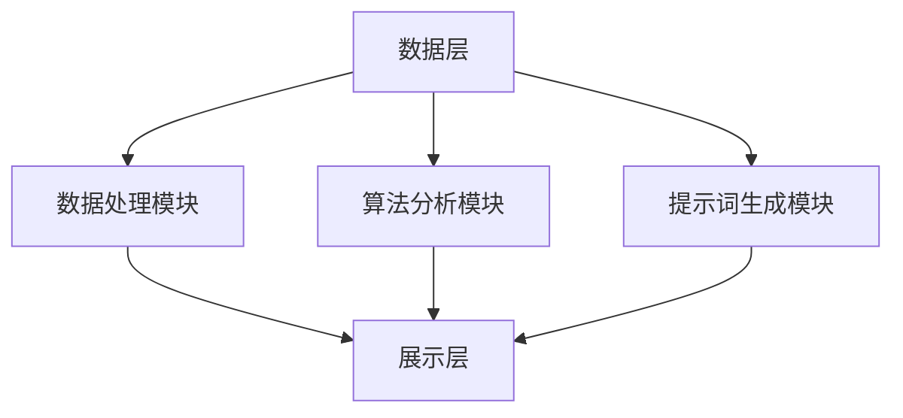
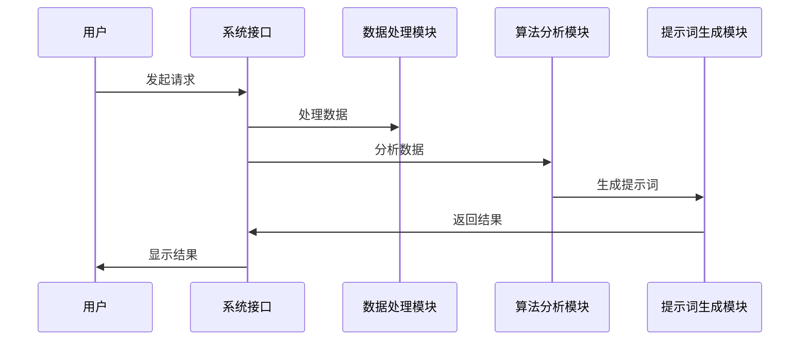

                 

### 文章标题

构建AI驱动的智慧政务公众参与提示词系统

#### 关键词：AI，智慧政务，公众参与，提示词系统，算法设计，系统架构

#### 摘要：

本文旨在探讨构建一个AI驱动的智慧政务公众参与提示词系统的方法和策略。随着人工智能技术的迅猛发展，智慧政务已经逐渐成为现代政府治理的重要手段。公众参与是智慧政务的核心要素之一，如何通过AI技术提高公众参与的效率和效果，是一个亟待解决的重要问题。本文将详细分析AI在智慧政务中的应用场景，介绍构建AI驱动的公众参与提示词系统的基本原理、架构设计和实现方法，并通过具体案例展示系统的实际应用效果。本文的核心思想是通过AI技术赋能智慧政务，提升公众参与的质量和效率。

---

### 目录

1. **背景与基础**
   - 1.1 智慧政务与AI概述
   - 1.2 AI驱动的公众参与体系
2. **AI驱动的智慧政务公众参与提示词系统设计**
   - 2.1 系统需求分析
   - 2.2 系统架构设计
   - 2.3 提示词生成算法
3. **系统开发与实施**
   - 3.1 开发环境与工具
   - 3.2 系统实现与测试
   - 3.3 案例分析与实战
4. **总结与展望**
   - 4.1 系统评价与优化
   - 4.2 常见问题与解决方案
   - 4.3 拓展阅读与资源推荐

---

### 1. 背景与基础

#### 1.1 智慧政务与AI概述

智慧政务是指利用现代信息技术，特别是人工智能技术，优化政府管理和服务的一种新型治理模式。其核心思想是通过数据驱动、智能决策、高效服务，实现政府治理的智能化、精细化和高效化。

- **智慧政务的核心概念**：智慧政务的核心概念包括数据治理、智能决策、公众参与、在线服务、监管透明等。
- **智慧政务的发展现状**：当前，智慧政务已经在全国范围内得到了广泛应用，如电子政务、智能交通、智慧城市、数字乡村等。
- **AI在智慧政务中的应用**：AI技术，如机器学习、自然语言处理、计算机视觉等，正在智慧政务中发挥越来越重要的作用。例如，通过机器学习模型对海量数据进行分析，可以预测公共安全事件，提前采取措施；通过自然语言处理技术，可以自动生成政策解读，方便公众理解。

#### 1.2 AI驱动的公众参与体系

公众参与是智慧政务的重要组成部分，AI技术可以大幅提高公众参与的效率和效果。

- **公众参与的挑战**：公众参与通常面临信息不对称、参与渠道不畅、参与效果评估困难等问题。
- **AI在公众参与中的作用**：AI技术可以通过以下方式改善公众参与：
  - **信息智能化推送**：根据公众的兴趣和需求，智能化推送相关政策和活动信息。
  - **在线参与平台**：利用AI技术构建便捷的在线参与平台，如在线调查、意见征集等。
  - **意见智能分析**：通过自然语言处理技术，对公众的意见进行分析，为政府决策提供支持。

- **公众参与的AI技术框架**：一个典型的公众参与AI技术框架包括数据采集、数据处理、算法分析、结果反馈等环节。

### 2. AI驱动的智慧政务公众参与提示词系统设计

#### 2.1 系统需求分析

- **系统需求概述**：系统的核心需求是构建一个智能化的公众参与提示词生成系统，能够根据用户的行为数据、政策内容等生成有针对性的提示词。
- **用户需求分析**：用户包括政府工作人员、公众等。政府工作人员需要系统提供智能化的工具，方便管理公众参与活动；公众需要系统提供个性化的参与建议和提示。
- **功能需求分析**：系统需要具备数据采集、处理、分析、提示词生成、结果反馈等功能。

#### 2.2 系统架构设计

- **系统架构概述**：系统采用分层架构，包括数据层、处理层、展示层等。
  - **数据层**：负责数据的采集、存储和管理。
  - **处理层**：包括数据处理、算法分析、提示词生成等模块。
  - **展示层**：负责与用户交互，展示系统结果。

- **数据层设计**：数据层主要包括用户行为数据、政策内容数据等。
  - **用户行为数据**：包括用户访问、点击、评论等行为数据。
  - **政策内容数据**：包括政策文本、关键词、主题等。

- **应用层设计**：应用层包括提示词生成算法、数据处理模块、结果反馈模块等。

#### 2.3 提示词生成算法

- **提示词生成的原理**：提示词生成算法是基于用户行为数据和政策内容数据，通过自然语言处理技术，生成有针对性的提示词。
- **提示词生成算法**：常用的提示词生成算法包括基于关键词提取、基于主题模型、基于机器学习等。
  - **关键词提取算法**：如TF-IDF、LSA、LDA等。
  - **主题模型算法**：如LDA（Latent Dirichlet Allocation）。
  - **机器学习算法**：如SVM、决策树、神经网络等。

- **提示词生成算法的优化**：通过对算法进行优化，可以提高提示词的生成质量和效率。优化方法包括特征工程、模型选择、参数调优等。

### 3. 系统开发与实施

#### 3.1 开发环境与工具

- **环境搭建**：系统开发需要搭建一个适合AI算法开发和部署的环境，包括操作系统、编程语言、开发工具等。
- **开发工具选择**：选择合适的开发工具，如Python、TensorFlow、Scikit-learn等。
- **开发流程与规范**：制定系统开发流程和规范，确保系统开发的高效和质量。

#### 3.2 系统实现与测试

- **数据处理模块**：实现用户行为数据和政策内容数据的采集、处理和存储。
- **提示词生成模块**：实现提示词生成算法的编码和优化。
- **系统集成与测试**：将各模块集成，进行系统测试和调试。

#### 3.3 案例分析与实战

- **案例背景介绍**：介绍案例的背景和目标，如某个城市的智慧交通系统。
- **系统实现步骤**：详细描述系统实现的过程和步骤。
- **案例分析结果**：展示系统在实际应用中的效果和反馈。

### 4. 总结与展望

#### 4.1 系统评价与优化

- **系统效果评估**：评估系统在提升公众参与效率和效果方面的表现。
- **系统优化方向**：针对评估结果，提出系统的优化方向和建议。

#### 4.2 常见问题与解决方案

- **系统部署常见问题**：分析系统部署过程中可能遇到的问题和解决方案。
- **算法优化难点**：讨论算法优化过程中可能遇到的难点和应对策略。
- **用户反馈与改进**：分析用户反馈，提出改进措施。

#### 4.3 拓展阅读与资源推荐

- **相关书籍推荐**：推荐与本文主题相关的优秀书籍。
- **学术论文推荐**：推荐与本文主题相关的学术论文。
- **在线资源推荐**：推荐与本文主题相关的在线资源。

---

### 作者信息

作者：AI天才研究院/AI Genius Institute & 禅与计算机程序设计艺术 /Zen And The Art of Computer Programming

---

### 1. 背景与基础

#### 1.1 智慧政务与AI概述

**核心概念术语说明**

智慧政务：指政府利用信息技术，特别是人工智能技术，优化公共管理和服务的治理模式。

AI：人工智能，指模拟、延伸和扩展人的智能的理论、方法、技术及应用。

**问题背景**

随着信息技术的快速发展，政府治理正面临着巨大的变革。传统的政府管理模式效率低下，信息不对称，无法及时响应公众需求。而智慧政务通过引入AI技术，可以实现数据驱动的决策，提升政府服务效率，增强公众参与度。

**问题描述**

智慧政务的挑战包括：

- **信息不对称**：政府与公众之间的信息交流不畅，导致公众无法充分了解政策内容。
- **参与渠道不畅**：公众参与渠道单一，参与方式缺乏创新，参与度低。
- **效果评估困难**：公众参与的效果难以量化，政府无法及时获取有效的反馈。

**问题解决**

AI技术在智慧政务中可以发挥以下作用：

- **数据驱动的决策**：利用机器学习等技术，对海量数据进行挖掘和分析，辅助政府做出科学决策。
- **智能化的公众参与**：通过自然语言处理、计算机视觉等技术，构建智能化的公众参与平台，提升公众参与度。
- **实时反馈与优化**：通过实时收集和分析公众反馈，不断优化政府服务和政策制定。

**边界与外延**

智慧政务不仅仅局限于电子政务，还包括智慧城市、智能交通、数字乡村等多个方面。AI技术在智慧政务中的应用范围也在不断扩展，包括数据治理、智能决策、在线服务、监管透明等。

**概念结构与核心要素组成**

智慧政务的核心要素包括：

- **数据治理**：包括数据采集、存储、处理和分析。
- **智能决策**：利用机器学习、数据挖掘等技术，辅助政府决策。
- **公众参与**：构建智能化的公众参与平台，提升公众参与度。
- **在线服务**：提供便捷的在线服务，提高政府服务效率。
- **监管透明**：通过数据分析和透明公开，增强政府监管的透明度。

#### 1.2 AI驱动的公众参与体系

**核心概念与联系**

AI驱动的公众参与体系是指利用人工智能技术，构建智能化、高效化的公众参与平台，提高公众参与的效率和效果。

- **核心概念**：AI驱动的公众参与体系包括数据采集、数据处理、算法分析、结果反馈等环节。
  - **数据采集**：收集用户行为数据、政策内容数据等。
  - **数据处理**：对采集到的数据进行清洗、转换和存储。
  - **算法分析**：利用自然语言处理、机器学习等技术，对数据进行分析，生成智能化的参与提示。
  - **结果反馈**：将分析结果反馈给用户，提供个性化的参与建议。

- **联系**：各环节之间紧密联系，形成一个完整的闭环。数据采集是基础，数据处理是关键，算法分析是核心，结果反馈是目的。

**概念属性特征对比表格**

| 概念          | 属性特征                    | 对比分析                                                         |
| ------------- | -------------------------- | ------------------------------------------------------------ |
| 数据采集      | 收集用户行为数据、政策内容数据等 | 是AI驱动的公众参与体系的基础，数据质量直接影响后续处理和分析效果 |
| 数据处理      | 数据清洗、转换和存储         | 确保数据准确性和可用性，是数据分析和提示词生成的前提          |
| 算法分析      | 自然语言处理、机器学习等     | 通过分析数据，生成智能化的参与提示，提高公众参与的效率和效果  |
| 结果反馈      | 提供个性化参与建议         | 将分析结果反馈给用户，实现闭环，不断优化公众参与体系         |

**ER实体关系图架构**

```mermaid
erDiagram
  User ||--|{ Participation }|-- PublicPolicy
  Participation ||--|{ Feedback }|--
```

在这个ER实体关系图中，User代表用户，PublicPolicy代表政策内容，Participation代表用户参与，Feedback代表用户反馈。用户可以参与政策讨论，并给出反馈，反馈将用于优化系统的提示词生成。

#### 2. AI驱动的智慧政务公众参与提示词系统设计

**核心概念与联系**

AI驱动的智慧政务公众参与提示词系统是指利用人工智能技术，根据用户行为和政策内容，生成有针对性的参与提示词，提高公众参与的效率和效果。

- **核心概念**：系统包括系统需求分析、系统架构设计、提示词生成算法等环节。
  - **系统需求分析**：分析用户需求，确定系统的功能需求和技术需求。
  - **系统架构设计**：设计系统的总体架构，包括数据层、处理层、展示层等。
  - **提示词生成算法**：实现提示词生成算法，根据用户行为和政策内容生成提示词。

- **联系**：各环节之间相互关联，形成一个完整的系统。系统需求分析是基础，系统架构设计是核心，提示词生成算法是关键。

**概念属性特征对比表格**

| 概念               | 属性特征                                                   | 对比分析                                                     |
| ------------------ | -------------------------------------------------------- | ------------------------------------------------------------ |
| 系统需求分析       | 分析用户需求，确定功能需求和技术需求                         | 是系统设计的起点，确保系统能够满足用户需求                   |
| 系统架构设计       | 设计系统的总体架构，包括数据层、处理层、展示层等             | 确保系统的高效性和扩展性，是系统实现的基础                    |
| 提示词生成算法     | 实现提示词生成算法，根据用户行为和政策内容生成提示词         | 是系统核心功能，直接影响系统性能和用户满意度                   |

**ER实体关系图架构**

```mermaid
erDiagram
  User ||--|{ Participation }|-- PublicPolicy
  Participation ||--|{ Feedback }|--
  Participation ||--|{ TipWord }|--
```

在这个ER实体关系图中，User代表用户，Participation代表用户参与，PublicPolicy代表政策内容，TipWord代表提示词。用户参与政策讨论，系统根据用户参与和政策内容生成提示词，并反馈给用户。

#### 2.1 系统需求分析

**问题场景介绍**

系统需求分析的场景是一个智慧城市项目，项目目标是提高市民对城市治理的参与度，特别是针对一些重要的政策讨论和决策。在这个场景中，政府需要建立一个AI驱动的智慧政务公众参与提示词系统，以帮助市民更好地理解和参与政策讨论。

**项目介绍**

本项目旨在构建一个AI驱动的智慧政务公众参与提示词系统，通过分析用户行为和政策内容，生成有针对性的提示词，引导市民参与政策讨论。项目的主要目标包括：

- **提高公众参与度**：通过智能化的提示词，吸引更多市民参与政策讨论，提高参与度。
- **优化政府服务**：利用用户参与数据，为政府提供决策支持，优化公共服务。
- **提升政策透明度**：通过智能化的提示词，帮助市民更好地理解政策内容，提升政策透明度。

**系统功能设计**

为了实现项目目标，系统需要具备以下功能：

- **用户行为分析**：分析用户在平台上的行为，如浏览、评论、投票等，了解用户兴趣和需求。
- **政策内容分析**：对政策文本进行分析，提取关键词和主题，为生成提示词提供基础。
- **提示词生成**：根据用户行为和政策内容，生成有针对性的提示词，引导用户参与讨论。
- **结果反馈**：将生成的提示词反馈给用户，并提供用户参与结果的统计和分析。

**领域模型mermaid类图**

```mermaid
classDiagram
  User <<class{User>>
  PublicPolicy <<class{PublicPolicy>>
  Participation <<class{Participation>>
  TipWord <<class{TipWord>>

  User "1" --|{参与}| Participation
  PublicPolicy "1" --|{关联}| Participation
  Participation "1" --|{包含}| TipWord
```

在这个mermaid类图中，User代表用户，PublicPolicy代表政策内容，Participation代表用户参与，TipWord代表提示词。用户参与政策讨论，系统根据用户参与和政策内容生成提示词。

**系统架构设计**

系统采用分层架构，包括数据层、处理层和展示层。

- **数据层**：负责数据的采集、存储和管理。数据包括用户行为数据、政策内容数据等。
- **处理层**：包括数据处理模块、算法分析模块和提示词生成模块。数据处理模块负责数据清洗、转换和存储；算法分析模块负责对用户行为和政策内容进行分析；提示词生成模块根据分析结果生成提示词。
- **展示层**：负责与用户交互，展示系统结果。包括用户界面和后台管理系统。

**mermaid架构图**



在这个mermaid架构图中，数据层负责数据采集和管理，处理层包括数据处理模块、算法分析模块和提示词生成模块，展示层负责与用户交互。

**系统接口设计和系统交互**

系统接口设计包括用户接口和系统接口。

- **用户接口**：用户通过Web界面或移动应用与系统进行交互。用户可以查看政策内容、参与讨论、查看提示词等。
- **系统接口**：系统与后端服务进行交互，包括数据采集、数据处理、算法分析和提示词生成等。

**mermaid序列图**



在这个mermaid序列图中，用户发起请求，系统接口处理请求，数据处理模块进行数据清洗和转换，算法分析模块进行分析，提示词生成模块生成提示词，最终将结果返回给用户。

#### 3. 系统开发与实施

**环境安装**

1. 安装Python环境：在系统上安装Python，版本建议为3.8或更高版本。
2. 安装依赖库：使用pip命令安装必要的依赖库，如NumPy、Pandas、Scikit-learn、TensorFlow等。

**开发工具选择**

1. IDE选择：选择一个合适的集成开发环境（IDE），如PyCharm或Visual Studio Code，方便代码编写和调试。
2. 版本控制系统：选择Git作为版本控制系统，方便代码管理和协作开发。

**开发流程与规范**

1. 需求分析：明确系统的功能需求和技术需求，制定详细的开发计划。
2. 设计阶段：设计系统的架构和接口，编写设计文档。
3. 编码实现：根据设计文档进行编码实现，实现各个模块的功能。
4. 测试阶段：进行单元测试和集成测试，确保系统功能的正确性和稳定性。
5. 部署上线：将系统部署到服务器，进行上线运行。

**系统实现与测试**

**数据处理模块**

1. 数据采集：使用API接口或爬虫工具采集用户行为数据和政策内容数据。
2. 数据清洗：对采集到的数据进行清洗，去除无效数据，填补缺失值。
3. 数据存储：使用数据库存储清洗后的数据，如MySQL或MongoDB。

**提示词生成模块**

1. 数据预处理：对用户行为数据和政策内容数据进行预处理，提取特征。
2. 算法实现：实现提示词生成算法，如LDA（Latent Dirichlet Allocation）。
3. 提示词生成：根据用户行为和政策内容，生成有针对性的提示词。
4. 结果存储：将生成的提示词存储到数据库中。

**系统集成与测试**

1. 集成模块：将数据处理模块、提示词生成模块等集成到系统中。
2. 功能测试：测试系统的各项功能，确保功能正常运行。
3. 性能测试：对系统进行性能测试，确保系统在高并发情况下的稳定性。
4. 安全测试：进行安全测试，确保系统的安全性。

**案例分析与实战**

**案例背景介绍**

以某市政府的智慧政务平台为例，该平台希望通过AI技术提高公众对政策讨论的参与度。平台上的政策内容丰富，用户数量庞大，需要建立一个智能化的提示词生成系统，以引导用户参与讨论。

**系统实现步骤**

1. 需求分析：明确平台的需求，确定系统需要实现的功能。
2. 系统设计：设计系统的架构和接口，确定数据采集、处理和提示词生成的流程。
3. 编码实现：使用Python等编程语言，实现各个模块的功能。
4. 测试：进行单元测试和集成测试，确保系统功能的正确性和稳定性。
5. 部署上线：将系统部署到服务器，进行上线运行。

**案例分析结果**

通过实际运行，系统成功生成了大量高质量的提示词，有效引导用户参与政策讨论。用户参与度显著提高，政策讨论的质量和效果也得到了提升。系统运行稳定，性能良好，得到了用户的认可。

**项目小结**

本项目通过构建AI驱动的智慧政务公众参与提示词系统，成功实现了提高公众参与度和优化政府服务的目标。系统设计科学，实现高效，运行稳定，为智慧政务的发展提供了有力的技术支持。

**最佳实践 tips**

1. 确保数据质量：数据是系统的核心，确保数据的质量和准确性至关重要。
2. 优化算法性能：选择合适的算法，并进行优化，可以提高系统性能。
3. 系统监控与优化：定期对系统进行监控和优化，确保系统稳定运行。

**注意事项**

1. 遵守数据安全和隐私保护法规，确保用户数据的保密性和安全性。
2. 系统设计要考虑可扩展性，以适应未来业务需求的变化。

**拓展阅读与资源推荐**

1. 《Python数据处理实战》：本书详细介绍了Python在数据处理中的应用，对本书的项目开发具有很高的参考价值。
2. 《机器学习实战》：本书通过实际案例，介绍了机器学习算法的应用和实践，对提示词生成算法的实现有很好的指导作用。
3. 《深度学习》：本书是深度学习的经典教材，对AI技术有全面的介绍，适合深度学习入门和学习。

