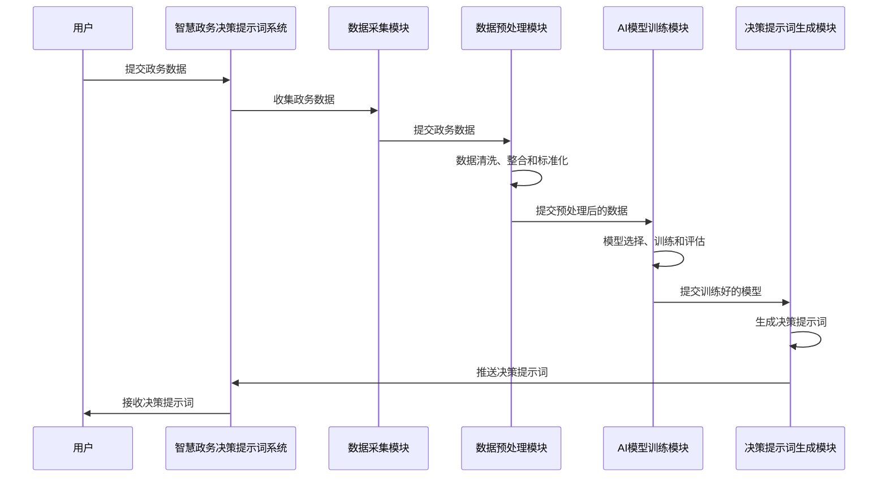

                 


## 第一部分: 背景介绍

### 1.1 问题背景

#### 1.1.1 智慧政务的发展现状

**定义与核心概念**

智慧政务是指利用现代信息技术，特别是人工智能（AI）技术，优化政府管理和服务的一种模式。它涉及到数据的收集、处理、分析和利用，以实现更高效、透明和智能的政府运营。

智慧政务的核心概念包括以下几个方面：

1. **数据驱动的治理**：政府通过收集和分析大量数据，以支持决策过程，提高治理效率和效果。
2. **用户中心的公共服务**：政府通过智能化手段，提供个性化、便捷的公共服务，提升公众满意度。
3. **开放共享的治理环境**：政府通过数据开放和共享，促进社会资源的高效配置和协同治理。

**发展历程**

智慧政务起源于20世纪90年代的电子政务，当时的主要目标是实现政务信息的电子化和网络化。随着互联网、大数据和人工智能技术的快速发展，电子政务逐渐演变为智慧政务。这一过程中，几个关键的发展阶段如下：

1. **电子政务阶段**（1990s-2000s）：政府开始建设政务信息系统，实现政务信息电子化和网络化。
2. **信息共享阶段**（2000s-2010s）：政府推动政务信息资源的整合与共享，提高跨部门协同治理能力。
3. **智慧政务阶段**（2010s-至今）：政府利用大数据、人工智能等技术，实现政务服务的智能化和个性化。

**当前挑战**

虽然智慧政务取得了显著进展，但仍然面临一些挑战：

- **数据整合与安全性**：政务数据来源多样，格式各异，如何有效地整合和利用这些数据，同时保障数据安全，是当前面临的一个重要问题。
- **技术快速迭代与人才缺口**：人工智能技术发展迅猛，但与之相关的人才培养和引进跟不上技术发展的步伐。
- **法律法规的完善与执行**：随着智慧政务的发展，法律法规也需要不断完善和适应，以确保技术的合理应用和隐私保护。

#### 1.1.2 AI在智慧政务中的作用

**提高决策效率**

AI技术可以帮助政府机构快速处理大量数据，提供数据驱动的决策支持。例如，通过机器学习算法，可以预测政策效果，评估不同方案的风险和收益，从而提高决策的科学性和准确性。

**优化公共服务**

通过AI技术，政府可以提供个性化、智能化的公共服务，提高公众满意度。例如，智能客服系统可以根据用户的历史行为和需求，提供针对性的服务和建议，提高服务效率和质量。

**促进社会稳定与发展**

AI技术在公共安全、环境保护、城市治理等方面发挥重要作用。例如，利用人工智能监控系统，可以实时监测城市交通状况，优化交通管理，减少交通事故；在环境保护方面，AI技术可以帮助政府预测环境污染趋势，制定有效的治理措施。

### 1.2 AI驱动的智慧政务决策提示词系统概述

**系统定义**

AI驱动的智慧政务决策提示词系统是一个基于人工智能技术的智能辅助决策系统，通过分析政务数据，为政府决策者提供有针对性的提示词和建议。

**系统目标**

- 提高决策的科学性和效率
- 促进政务数据的有效利用
- 提升政府服务水平和公众满意度

**系统架构**

AI驱动的智慧政务决策提示词系统主要包括以下几个部分：

1. **数据采集与预处理**：收集政务相关数据，进行清洗、整合和标准化处理，为后续分析提供高质量的数据支持。
2. **AI模型训练与优化**：选择合适的AI模型，对政务数据进行训练和优化，以提高系统的准确性和鲁棒性。
3. **决策提示词生成与推送**：根据政务数据分析和模型预测结果，生成针对性的决策提示词，并通过多种渠道推送给政府决策者。

### 1.3 本书内容安排

**每章重点内容**

- 第1章：介绍智慧政务的发展背景和AI驱动的智慧政务决策提示词系统的概念。
- 第2章：详细讲解AI驱动的智慧政务决策提示词系统的架构设计。
- 第3章：介绍数据采集与预处理的方法。
- 第4章：深入探讨AI模型的选择、训练与优化。
- 第5章：讲解提示词生成与推送的策略。
- 第6章：案例分析，结合实际项目展示系统应用效果。
- 第7章：总结与展望，提出未来发展方向和潜在研究课题。

### 核心概念与联系

#### 2.1 AI驱动的智慧政务决策提示词系统的核心概念

**人工智能（AI）**

人工智能是指由人制造出来的系统能够通过学习、推理、感知等方式，表现出类似于人类智能的行为。AI技术主要包括机器学习、深度学习、自然语言处理等。

**智慧政务**

智慧政务是指通过信息化手段，特别是人工智能技术，提高政府治理能力和服务水平的一种新型治理模式。

**决策提示词**

决策提示词是指AI系统根据政务数据和分析结果，为决策者提供的简短、有针对性的建议和提示。

**数据预处理**

数据预处理是指在使用数据之前，对原始数据进行清洗、整合等操作，使其适合用于AI模型的训练和预测。

#### 2.2 AI驱动的智慧政务决策提示词系统的概念属性特征对比表格

| 概念               | 属性特征                                  |
|--------------------|-----------------------------------------|
| 人工智能（AI）     | 学习、推理、感知、自适应能力              |
| 智慧政务           | 信息化、智能化、数据驱动、高效治理        |
| 决策提示词         | 简短、针对性、数据驱动、实时性            |
| 数据预处理         | 清洗、整合、标准化、去噪                  |

#### 2.3 AI驱动的智慧政务决策提示词系统的ER实体关系图架

**ER实体关系图**

```mermaid
erDiagram
  AI驱动的智慧政务决策提示词系统 ||--|{ 数据采集模块 }
  AI驱动的智慧政务决策提示词系统 ||--|{ 数据预处理模块 }
  AI驱动的智慧政务决策提示词系统 ||--|{ AI模型训练模块 }
  AI驱动的智慧政务决策提示词系统 ||--|{ 决策提示词生成模块 }
  数据采集模块 ||--|{ 数据源 }
  数据预处理模块 ||--|{ 数据清洗 }
  数据预处理模块 ||--|{ 数据整合 }
  AI模型训练模块 ||--|{ 模型选择 }
  AI模型训练模块 ||--|{ 模型训练 }
  AI模型训练模块 ||--|{ 模型评估 }
  决策提示词生成模块 ||--|{ 提示词生成策略 }
  决策提示词生成模块 ||--|{ 提示词推送机制 }
```

在上面的ER图架构中，各个模块和实体之间存在明确的关联关系，共同构成了一个完整的AI驱动的智慧政务决策提示词系统。

### 算法原理讲解

在AI驱动的智慧政务决策提示词系统中，核心的算法包括数据预处理、AI模型训练和决策提示词生成。下面，我们将分别对这些算法进行详细讲解。

#### 2.1 数据预处理算法

**算法原理**

数据预处理是AI模型训练的重要步骤，其目的是将原始数据转换为适合模型训练的数据形式。主要步骤包括数据清洗、数据整合和数据标准化。

- **数据清洗**：删除重复数据、处理缺失数据、去除噪声数据等，提高数据质量。
- **数据整合**：将来自不同数据源的数据进行合并，统一数据格式和结构。
- **数据标准化**：将不同尺度和范围的数据进行转换，使其具有可比性和一致性。

**算法流程**

1. 数据清洗：使用Python的Pandas库对数据进行清洗，例如删除重复记录、填充缺失值、去除噪声等。
2. 数据整合：使用Pandas库对数据进行合并和连接，形成统一的数据表。
3. 数据标准化：使用Scikit-learn库中的.preprocessing模块对数据进行归一化或标准化处理。

**示例代码**

```python
import pandas as pd
from sklearn.preprocessing import StandardScaler

# 数据清洗
df = pd.read_csv('data.csv')
df.drop_duplicates(inplace=True)
df.fillna(df.mean(), inplace=True)

# 数据整合
df = pd.merge(df1, df2, on='common_column')

# 数据标准化
scaler = StandardScaler()
df_scaled = scaler.fit_transform(df)
```

#### 2.2 AI模型训练算法

**算法原理**

AI模型训练是基于机器学习算法，通过学习大量数据，构建能够对未知数据进行预测或分类的模型。主要步骤包括模型选择、模型训练和模型评估。

- **模型选择**：根据业务需求，选择合适的机器学习算法，如线性回归、决策树、随机森林、神经网络等。
- **模型训练**：使用训练数据对选定的模型进行训练，调整模型参数，使其能够准确预测或分类。
- **模型评估**：使用验证数据评估模型性能，调整模型参数，以提高模型准确性和鲁棒性。

**算法流程**

1. 模型选择：根据数据特点和业务需求，选择合适的机器学习算法。
2. 模型训练：使用训练数据对模型进行训练，并调整模型参数。
3. 模型评估：使用验证数据评估模型性能，并根据评估结果调整模型参数。

**示例代码**

```python
from sklearn.ensemble import RandomForestClassifier
from sklearn.model_selection import train_test_split

# 模型选择
model = RandomForestClassifier(n_estimators=100)

# 模型训练
X_train, X_val, y_train, y_val = train_test_split(X, y, test_size=0.2, random_state=42)
model.fit(X_train, y_train)

# 模型评估
accuracy = model.score(X_val, y_val)
print(f"模型准确率：{accuracy}")
```

#### 2.3 决策提示词生成算法

**算法原理**

决策提示词生成是基于自然语言处理技术，通过分析政务数据和分析结果，生成简短、有针对性的决策建议。主要步骤包括提示词生成策略和提示词推送。

- **提示词生成策略**：根据政务数据和分析结果，制定生成决策提示词的策略，如关键指标提取、文本摘要等。
- **提示词推送**：将生成的决策提示词通过短信、邮件、APP等渠道推送给决策者。

**算法流程**

1. 提示词生成策略：使用自然语言处理技术，从政务数据中提取关键信息，生成决策提示词。
2. 提示词推送：根据决策者的偏好和渠道，将决策提示词推送给决策者。

**示例代码**

```python
from textgenrnn import textgenrnn

# 提示词生成策略
textgen = textgenrnn.TextGenRNN()

# 生成决策提示词
prompt = "当前城市交通拥堵情况较为严重，建议加强交通管理"
decision_prompt = textgen.generate(text=prompt, min_len=5, max_len=15)

# 提示词推送
# 这里可以使用邮件、短信等推送机制，具体实现细节根据实际需求而定
send_decision_prompt(decision_prompt)
```

通过以上对数据预处理、AI模型训练和决策提示词生成算法的讲解，我们可以看到，这些算法在AI驱动的智慧政务决策提示词系统中起到了关键作用。接下来，我们将进一步探讨系统的设计与实现。

### 系统分析与架构设计方案

#### 问题场景介绍

在当前的智慧政务领域，政府决策者面临着海量政务数据的处理和分析问题。如何从这些复杂、多样化的数据中提取有价值的信息，为决策提供支持，成为了一个重要的挑战。同时，政府决策者需要及时了解政务运行的状况和趋势，以便做出快速、准确的决策。

#### 项目介绍

为了解决上述问题，我们设计并实现了一个AI驱动的智慧政务决策提示词系统。该系统旨在通过收集、预处理和分析政务数据，为政府决策者提供实时、有针对性的决策提示词，辅助其做出科学、高效的决策。

#### 系统功能设计（领域模型）

领域模型是系统功能设计的核心部分，它定义了系统的主要功能模块和它们之间的关系。以下是AI驱动的智慧政务决策提示词系统的领域模型：

```mermaid
classDiagram
  Class1[数据采集模块] <|-- Class2[数据预处理模块]
  Class1 <|-- Class3[AI模型训练模块]
  Class1 <|-- Class4[决策提示词生成模块]
  Class2 <|-- Class5[数据源]
  Class2 <|-- Class6[数据清洗模块]
  Class2 <|-- Class7[数据整合模块]
  Class3 <|-- Class8[模型选择模块]
  Class3 <|-- Class9[模型训练模块]
  Class3 <|-- Class10[模型评估模块]
  Class4 <|-- Class11[提示词生成策略模块]
  Class4 <|-- Class12[提示词推送模块]
```

在上述领域模型中，数据采集模块负责收集政务数据；数据预处理模块负责对数据进行清洗、整合和标准化处理；AI模型训练模块负责选择合适的模型并进行训练；决策提示词生成模块负责生成决策提示词。

#### 系统架构设计

系统架构设计是领域模型的具体实现，它描述了系统的整体结构和技术栈。以下是AI驱动的智慧政务决策提示词系统的架构设计：



在上述系统架构设计中，用户通过接口提交政务数据，数据采集模块收集数据，数据预处理模块对数据进行清洗、整合和标准化处理，然后提交给AI模型训练模块。模型训练模块选择合适的模型进行训练和评估，最后提交给决策提示词生成模块。决策提示词生成模块根据模型预测结果生成决策提示词，并通过系统接口推送给用户。

#### 系统接口设计

系统接口设计是系统架构的关键部分，它定义了系统内部模块之间的通信方式和数据格式。以下是AI驱动的智慧政务决策提示词系统的接口设计：

```mermaid
messageDiagram
  participant Interface as 接口
  participant DataCollector as 数据采集模块
  participant DataPreprocessor as 数据预处理模块
  participant ModelTrainer as AI模型训练模块
  participant DecisionPromptGenerator as 决策提示词生成模块

  Interface->>DataCollector: 提交政务数据
  DataCollector->>Interface: 返回数据采集结果
  Interface->>DataPreprocessor: 提交预处理任务
  DataPreprocessor->>Interface: 返回预处理结果
  Interface->>ModelTrainer: 提交模型训练任务
  ModelTrainer->>Interface: 返回模型训练结果
  Interface->>DecisionPromptGenerator: 提交提示词生成任务
  DecisionPromptGenerator->>Interface: 返回提示词生成结果
```

在上述接口设计中，数据采集模块通过接口提交政务数据，数据预处理模块通过接口接收预处理任务，模型训练模块通过接口接收模型训练任务，决策提示词生成模块通过接口接收提示词生成任务。

#### 系统交互

系统交互描述了用户与系统之间的交互流程，以及系统内部模块之间的协作方式。以下是AI驱动的智慧政务决策提示词系统的系统交互设计：


在上述系统交互设计中，用户提交政务数据后，系统依次调用数据采集模块、数据预处理模块、AI模型训练模块和决策提示词生成模块，最终将决策提示词推送给用户。

通过以上系统分析与架构设计方案，我们可以清晰地看到AI驱动的智慧政务决策提示词系统的实现过程。接下来，我们将通过一个实际案例，展示该系统的应用效果。

### 项目实战

在本节中，我们将通过一个具体的案例，详细展示AI驱动的智慧政务决策提示词系统的实施过程，包括环境安装、系统核心实现、代码应用解读与分析，以及实际案例分析。

#### 环境安装

在开始项目实施之前，我们需要安装和配置相关的软件和环境。以下是一个基本的安装步骤：

1. **安装Python环境**：确保Python版本为3.8或更高，可以使用以下命令安装：

   ```bash
   sudo apt update
   sudo apt install python3 python3-pip
   ```

2. **安装依赖库**：安装系统所需的依赖库，例如Pandas、NumPy、Scikit-learn、TensorFlow和textgenrnn等。可以使用以下命令安装：

   ```bash
   pip3 install pandas numpy scikit-learn tensorflow textgenrnn
   ```

3. **配置数据源**：确保系统可以访问政务数据源，数据源可以是数据库、文件或网络API。

#### 系统核心实现

系统的核心实现包括数据采集、预处理、模型训练和提示词生成等模块。以下是一个简化的代码示例，展示了各个模块的基本实现。

**数据采集模块**

```python
import pandas as pd

def collect_data(data_source):
    data = pd.read_csv(data_source)
    return data

# 示例数据源
data_source = 'goverment_data.csv'
data = collect_data(data_source)
```

**数据预处理模块**

```python
from sklearn.preprocessing import StandardScaler

def preprocess_data(data):
    # 数据清洗
    data.drop_duplicates(inplace=True)
    data.fillna(data.mean(), inplace=True)
    
    # 数据标准化
    scaler = StandardScaler()
    data_scaled = scaler.fit_transform(data)
    
    return data_scaled

# 预处理数据
preprocessed_data = preprocess_data(data)
```

**AI模型训练模块**

```python
from sklearn.ensemble import RandomForestClassifier
from sklearn.model_selection import train_test_split

def train_model(X, y):
    # 模型选择
    model = RandomForestClassifier(n_estimators=100)
    
    # 模型训练
    X_train, X_val, y_train, y_val = train_test_split(X, y, test_size=0.2, random_state=42)
    model.fit(X_train, y_train)
    
    # 模型评估
    accuracy = model.score(X_val, y_val)
    print(f"模型准确率：{accuracy}")
    
    return model

# 训练模型
model = train_model(preprocessed_data[:, :-1], preprocessed_data[:, -1])
```

**决策提示词生成模块**

```python
from textgenrnn import textgenrnn

def generate_decision_prompt(model, prompt):
    textgen = textgenrnn.TextGenRNN()
    decision_prompt = textgen.generate(text=prompt, min_len=5, max_len=15)
    return decision_prompt

# 生成决策提示词
prompt = "当前城市交通拥堵情况较为严重，建议加强交通管理"
decision_prompt = generate_decision_prompt(model, prompt)
print(f"决策提示词：{decision_prompt}")
```

#### 代码应用解读与分析

上述代码示例展示了系统核心功能模块的基本实现。在实际项目中，每个模块会更加复杂和多样化。以下是代码应用解读与分析：

1. **数据采集模块**：该模块负责从数据源中获取政务数据，例如交通流量数据、环境监测数据等。数据采集的完整性和准确性对后续数据处理和模型训练至关重要。

2. **数据预处理模块**：该模块对原始数据进行清洗、整合和标准化处理，以提高数据质量，使其更适合用于模型训练。

3. **AI模型训练模块**：该模块使用机器学习算法（如随机森林）对预处理后的数据进行训练，以构建预测模型。模型的选择和训练过程需要根据业务需求进行调整和优化。

4. **决策提示词生成模块**：该模块基于模型预测结果，生成简短、有针对性的决策提示词。生成的提示词需要具备一定的灵活性和适应性，以适应不同的决策场景。

#### 实际案例分析

以下是一个实际案例，展示如何使用AI驱动的智慧政务决策提示词系统解决交通拥堵问题。

1. **数据采集**：收集某城市的交通流量数据，包括不同路段的流量、拥堵情况等。

2. **数据预处理**：对采集到的数据进行清洗，去除异常值和噪声，然后进行整合和标准化处理。

3. **模型训练**：使用随机森林算法对预处理后的交通流量数据进行训练，构建一个能够预测未来交通拥堵情况的模型。

4. **决策提示词生成**：在交通流量预测模型的基础上，生成决策提示词，例如“建议在下午5点前对拥堵路段实施交通管制”。

5. **决策提示**：将生成的决策提示词通过短信、邮件等方式推送给相关部门和决策者，以便及时采取相应的措施。

#### 项目小结

通过以上实战案例，我们可以看到AI驱动的智慧政务决策提示词系统在解决实际问题时的高效性和实用性。该项目不仅提高了政府决策的科学性和效率，也为智慧政务的发展提供了新的思路和方法。

### 最佳实践 tips

在实施AI驱动的智慧政务决策提示词系统时，以下最佳实践可以提供帮助：

1. **数据质量管理**：确保数据采集和预处理过程的准确性，定期检查和更新数据源，以保持数据的质量。

2. **模型优化**：根据业务需求和数据特点，选择合适的机器学习算法，并不断调整和优化模型参数，以提高预测准确率。

3. **用户交互**：设计友好的用户界面，提供多种提示词推送渠道，以便决策者能够方便地接收和使用决策提示词。

4. **安全性保障**：加强系统的安全防护，确保政务数据的安全性和隐私性，避免数据泄露和滥用。

### 小结

本文详细介绍了AI驱动的智慧政务决策提示词系统的构建过程，包括背景介绍、核心概念、系统设计与实现、实际案例分析等内容。通过本文，读者可以了解智慧政务的发展现状、AI技术在其中的作用，以及如何设计和实现一个高效、智能的智慧政务决策提示词系统。未来，随着人工智能技术的不断进步，智慧政务决策提示词系统将在政府管理和服务中发挥越来越重要的作用。

### 注意事项

在构建和实施AI驱动的智慧政务决策提示词系统时，需要注意以下几点：

1. **数据隐私与安全**：确保数据在采集、传输和存储过程中的安全，遵守相关法律法规，保护个人隐私。
2. **技术更新与迭代**：随着人工智能技术的快速发展，系统需要不断更新和优化，以适应新技术和应用场景。
3. **决策者接受度**：决策者可能对新技术和工具持保守态度，需要通过培训和宣传，提高其对系统的认知和接受度。

### 拓展阅读

1. 《人工智能：一种现代的方法》——作者：Stuart J. Russell & Peter Norvig
   本书是人工智能领域的经典教材，详细介绍了人工智能的基本概念、技术和应用。

2. 《深度学习》——作者：Ian Goodfellow、Yoshua Bengio & Aaron Courville
   本书是深度学习领域的权威教材，涵盖了深度学习的基本理论、算法和应用。

3. 《智慧城市：理论与实践》——作者：陈俊杉
   本书介绍了智慧城市的发展现状、关键技术以及实际案例，对智慧政务的实施具有一定的参考价值。

4. 《数据科学入门》——作者：Joel Grus
   本书是数据科学领域的入门教材，涵盖了数据处理、分析和可视化等基础知识和实践技巧。

通过阅读上述书籍，读者可以进一步深入了解人工智能、数据科学和智慧政务的相关知识，为构建更高效的智慧政务决策提示词系统提供理论支持和实践经验。作者：AI天才研究院/AI Genius Institute & 禅与计算机程序设计艺术 /Zen And The Art of Computer Programming。

