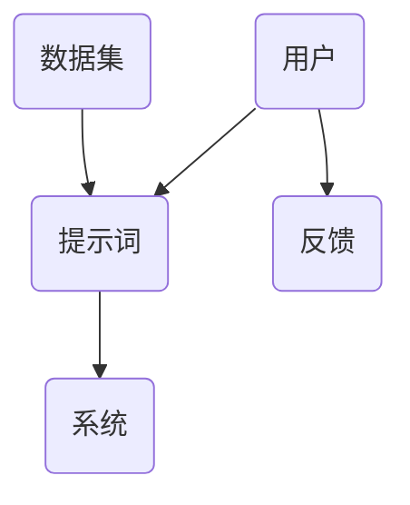
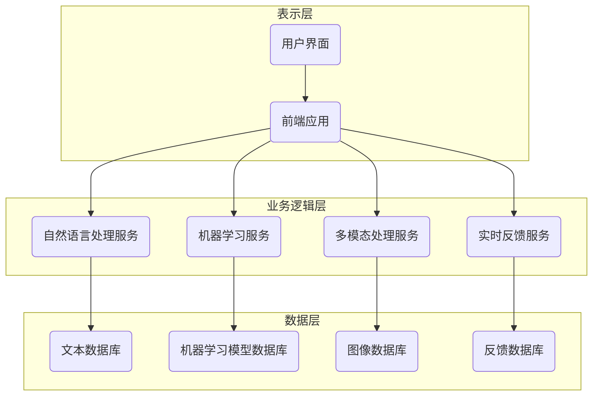
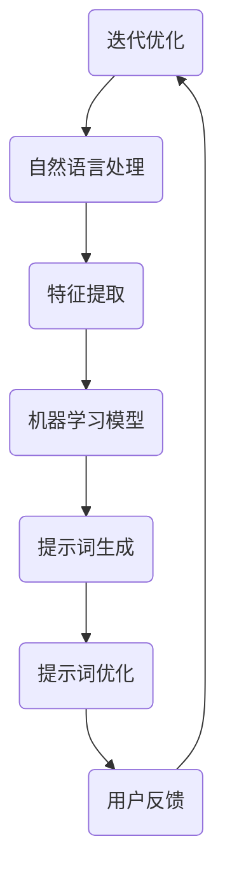

                 


### 第一部分：背景介绍

#### 1.1 问题背景

随着信息技术的快速发展，政务智能化已成为现代政府管理的重要趋势。智慧政务通过利用大数据、云计算、人工智能等先进技术，提高政府工作效率，提升公共服务质量，推动社会治理现代化。在这一过程中，提示词作为用户与系统交互的桥梁，起到了至关重要的作用。

**智慧政务的兴起**

智慧政务是指通过新一代信息技术，特别是大数据、云计算和人工智能等技术，提升政府治理能力，优化公共服务，推动社会治理现代化的一种新型治理模式。智慧政务的核心在于数据的高效整合、智能分析和应用，实现政府决策的科学化、服务的人性化和管理的智能化。

智慧政务的兴起源于以下几个方面的原因：

1. **大数据时代的到来**：随着物联网、移动互联网等技术的普及，政务数据呈现爆发式增长。大数据技术为政府提供了强大的数据处理和分析能力，使得政府能够更精准地了解社会需求和公众诉求。
2. **云计算的普及**：云计算为政府提供了灵活、高效、安全的计算和存储资源，使得政务系统能够快速部署和扩展，降低运营成本。
3. **人工智能的突破**：人工智能技术，特别是机器学习和深度学习，为政府决策提供了强大的支持。通过大数据分析，人工智能能够发现潜在问题、预测发展趋势，为政府决策提供科学依据。

**提示词在智慧政务中的作用**

提示词是智慧政务中用户与系统交互的重要工具。它通过对用户输入的自然语言进行解析，生成相应的指令或建议，帮助用户更高效地完成任务。在智慧政务中，提示词具有以下重要作用：

1. **提升用户体验**：提示词能够根据用户的需求和情境，提供个性化的服务和建议，提升用户体验。
2. **降低操作难度**：通过自然语言交互，提示词能够简化用户操作，降低系统使用门槛。
3. **提高工作效率**：提示词能够自动完成一些繁琐的任务，节省用户时间，提高工作效率。
4. **增强系统智能化**：提示词的生成和优化需要依赖人工智能技术，如机器学习和自然语言处理。通过不断地学习和优化，提示词系统能够更准确地理解用户需求，提高系统智能化水平。

**当前挑战与需求**

尽管提示词在智慧政务中具有重要价值，但当前仍面临一些挑战和需求：

1. **准确性挑战**：提示词的生成需要高度准确地理解用户输入的自然语言。然而，自然语言具有歧义性和复杂性，使得生成准确提示词变得困难。
2. **个性化需求**：不同的用户有不同的需求，提示词需要具备个性化能力，根据用户历史行为和偏好生成合适的提示词。
3. **实时性需求**：智慧政务场景下，用户往往需要实时获取服务和建议。提示词系统需要具备快速响应能力，以满足用户的即时需求。
4. **多模态融合**：在智慧政务中，用户输入可能包括文字、图像、语音等多种形式。提示词系统需要能够处理和融合多模态数据，提供更全面的服务。

#### 1.2 问题描述

**提示词生成的难点**

提示词生成的难点主要体现在以下几个方面：

1. **自然语言理解**：自然语言具有高度的不确定性和复杂性。用户输入的自然语言可能包含多种语义和意图，需要通过深入理解来生成准确的提示词。
2. **上下文依赖**：提示词的生成依赖于用户输入的上下文。上下文的变化可能导致提示词的语义和意图发生改变，需要动态调整。
3. **多模态处理**：在智慧政务中，用户输入可能包括文字、图像、语音等多种形式。提示词系统需要能够处理和融合多模态数据，提供更全面的服务。
4. **实时性要求**：智慧政务场景下，用户往往需要实时获取服务和建议。提示词系统需要在短时间内快速生成提示词，满足用户的即时需求。

**提示词的准确性和实用性**

提示词的准确性和实用性是智慧政务中至关重要的两个方面：

1. **准确性**：提示词的准确性决定了用户能否正确理解和使用系统提供的服务。低准确性的提示词可能导致用户困惑、误解甚至放弃使用系统。
2. **实用性**：提示词需要具备实用性，即提供对用户实际有帮助的建议和服务。实用性较差的提示词可能对用户产生负面体验，降低系统的使用价值。

**提示词的个性化需求**

在智慧政务中，不同的用户有不同的需求和偏好。提示词需要具备个性化能力，根据用户历史行为和偏好生成合适的提示词，从而提高用户体验。个性化需求包括：

1. **历史行为分析**：通过分析用户的历史行为数据，了解用户的兴趣和偏好，生成个性化的提示词。
2. **实时反馈**：通过用户对提示词的反馈，不断优化提示词生成模型，提高个性化水平。

#### 1.3 问题解决

**AI驱动的提示词框架**

为了解决提示词生成的难点和满足个性化需求，我们可以构建一个AI驱动的提示词框架。该框架主要包括以下组成部分：

1. **自然语言处理模块**：负责对用户输入的自然语言进行解析和语义理解，提取关键信息。
2. **机器学习模型**：基于历史数据训练机器学习模型，用于生成和优化提示词。
3. **多模态融合模块**：处理和融合文字、图像、语音等多种形式的用户输入，提供更全面的服务。
4. **实时反馈机制**：收集用户对提示词的反馈，用于模型优化和个性化调整。

**数据驱动的提示词优化**

数据驱动的提示词优化是提高提示词准确性和实用性的关键。通过以下方法实现：

1. **历史数据分析**：对用户历史行为数据进行挖掘和分析，识别用户需求和偏好。
2. **在线学习**：利用实时反馈数据，持续优化提示词生成模型，提高个性化水平。
3. **多模态数据融合**：结合文字、图像、语音等多种数据类型，提高提示词的准确性和实用性。

**多模态的提示词融合**

多模态的提示词融合能够充分利用多种数据类型，提供更全面的服务。具体实现包括：

1. **图像识别**：利用深度学习模型，对用户输入的图像进行识别和分析，提取关键信息。
2. **语音识别**：利用语音识别技术，将用户输入的语音转化为文字，与文字数据融合。
3. **多模态融合算法**：结合不同数据类型的特征，设计多模态融合算法，生成更准确的提示词。

#### 1.4 边界与外延

**提示词框架的适用范围**

AI驱动的提示词框架主要适用于智慧政务场景，包括但不限于以下领域：

1. **政务服务**：提供便捷的在线咨询、业务办理、政策查询等服务。
2. **电子政务**：提高政务网站的用户体验，优化政府信息传播和交互。
3. **智能城市**：为城市管理、交通规划、环保监测等提供智能化的决策支持。

**提示词框架的限制因素**

尽管AI驱动的提示词框架具有很多优势，但仍存在一些限制因素：

1. **数据质量**：高质量的数据是生成准确提示词的基础。数据质量较差可能导致提示词准确性下降。
2. **计算资源**：多模态数据融合和实时反馈机制需要大量计算资源，对硬件设施有一定的要求。
3. **隐私保护**：在处理用户数据时，需要确保用户隐私得到保护，避免数据泄露和滥用。

**提示词框架的演进方向**

随着技术的不断发展，AI驱动的提示词框架将朝着以下方向演进：

1. **深度学习模型的优化**：通过引入更先进的深度学习模型，提高提示词生成和优化的准确性和效率。
2. **多模态数据融合**：进一步探索和整合多种数据类型，提供更全面的服务。
3. **个性化定制**：根据用户需求和偏好，提供更加个性化的提示词服务。
4. **智能化决策支持**：结合大数据分析，为政府决策提供智能化的支持。

#### 1.5 概念结构与核心要素组成

**AI驱动的智慧政务提示词框架构成**

AI驱动的智慧政务提示词框架由以下几个核心组成部分构成：

1. **自然语言处理模块**：负责对用户输入的自然语言进行解析和语义理解，提取关键信息。
2. **机器学习模型**：基于历史数据训练机器学习模型，用于生成和优化提示词。
3. **多模态融合模块**：处理和融合文字、图像、语音等多种形式的用户输入，提供更全面的服务。
4. **实时反馈机制**：收集用户对提示词的反馈，用于模型优化和个性化调整。

**数据处理与模型训练**

数据处理与模型训练是构建AI驱动的智慧政务提示词框架的重要环节。具体步骤包括：

1. **数据收集**：收集用户输入、用户反馈等多源数据，为模型训练提供数据基础。
2. **数据预处理**：对原始数据进行清洗、去噪和格式转换，确保数据质量。
3. **特征提取**：从预处理后的数据中提取关键特征，用于模型训练。
4. **模型训练**：利用提取的特征数据，训练机器学习模型，生成提示词。
5. **模型评估**：通过评估指标，如准确性、实用性等，评估模型性能，并进行优化。

**提示词生成与优化**

提示词生成与优化是AI驱动的智慧政务提示词框架的核心功能。具体实现包括：

1. **提示词生成**：根据用户输入和模型预测，生成初步的提示词。
2. **提示词优化**：利用用户反馈和多模态数据，对提示词进行优化，提高准确性和实用性。
3. **个性化调整**：根据用户历史行为和偏好，为用户提供个性化的提示词服务。

### 第二部分：核心概念与联系

#### 2.1 AI驱动的核心概念

**机器学习**

机器学习是人工智能的核心技术之一，旨在通过数据驱动的方法，使计算机系统能够自动地从数据中学习和发现规律，从而进行预测和决策。机器学习分为以下几种类型：

1. **监督学习（Supervised Learning）**：通过已标记的数据集进行训练，使模型学会将输入映射到预期输出。常见的算法包括线性回归、决策树、支持向量机等。
2. **无监督学习（Unsupervised Learning）**：在没有标注的数据集上进行训练，使模型学会发现数据中的结构和模式。常见的算法包括聚类、降维、关联规则等。
3. **强化学习（Reinforcement Learning）**：通过与环境的交互，学习最优行为策略。常见的算法包括Q学习、SARSA、深度Q网络等。

**自然语言处理（NLP）**

自然语言处理是计算机科学和人工智能领域的一个分支，旨在使计算机理解和生成人类自然语言。NLP的核心任务包括：

1. **分词（Tokenization）**：将文本分解为单词、短语或其他有意义的基本元素。
2. **词向量（Word Embedding）**：将单词映射到高维空间中的向量，以便进行数学处理。
3. **语义分析（Semantic Analysis）**：理解单词和短语的含义，以及它们在句子中的关系。常见的算法包括词性标注、依存句法分析、语义角色标注等。

**提示词的属性特征**

提示词是智慧政务中用户与系统交互的重要工具，其属性特征决定了提示词的生成和优化效果。以下是提示词的主要属性特征：

1. **关键词提取**：从用户输入中提取关键信息，作为生成提示词的基础。
2. **语义关联**：分析关键词之间的语义关系，以生成符合用户需求的提示词。
3. **领域专有名词**：针对特定领域，识别并使用领域专有名词，提高提示词的专业性和准确性。

**提示词的生成策略**

提示词的生成策略决定了如何从用户输入中生成合适的提示词。以下是几种常见的生成策略：

1. **基于规则的方法**：通过预设的规则和模板，生成提示词。这种方法简单直观，但灵活性较低。
2. **基于机器学习的方法**：利用机器学习算法，从大量历史数据中学习生成提示词的规律。这种方法具有较高的准确性和灵活性。
3. **基于数据驱动的优化**：通过收集用户反馈和实际使用情况，不断优化提示词生成模型，提高提示词的实用性和个性化程度。

#### 2.2 ER实体关系图架构

ER（实体关系）图是用于描述实体及其关系的图形化模型，广泛应用于数据库设计和系统架构设计。以下是一个简单的ER实体关系图：



- **用户（User）**：表示与系统交互的实体，负责输入和接收提示词。
- **提示词（Hint）**：表示系统生成的提示信息，与用户和系统密切相关。
- **系统（System）**：表示提供提示词服务的核心系统，负责提示词的生成、优化和分发。
- **反馈（Feedback）**：表示用户对提示词的反馈，用于模型优化和个性化调整。
- **数据集（Dataset）**：表示用于训练和评估模型的原始数据集，包括用户输入、提示词、用户反馈等。

通过ER实体关系图，可以清晰地描述提示词框架中的主要实体及其关系，有助于理解系统的整体架构和功能。

### 第三部分：算法原理讲解

#### 3.1 提示词生成算法

**3.1.1 基于规则的提示词生成**

基于规则的提示词生成方法是通过预设的规则和模板，根据用户输入生成提示词。这种方法简单直观，但灵活性较低。

**算法流程**：

1. **输入预处理**：对用户输入进行预处理，如去除标点符号、停用词处理等。
2. **关键词提取**：从预处理后的输入中提取关键信息。
3. **规则匹配**：根据预设的规则和模板，匹配关键词，生成提示词。
4. **输出**：将生成的提示词输出给用户。

**Python代码实现**：

```python
def rule_based_hint_generation(input_text):
    # 预处理输入文本
    input_text = preprocess(input_text)
    
    # 提取关键词
    keywords = extract_keywords(input_text)
    
    # 规则匹配生成提示词
    hint = rule_matching(keywords)
    
    return hint
```

**举例说明**：

假设用户输入：“我想查询最新的交通政策。”

通过规则匹配，可以生成提示词：“您可以在我们的交通政策页面查看最新的政策。”

**3.1.2 基于机器学习的提示词生成**

基于机器学习的提示词生成方法是通过训练机器学习模型，从大量历史数据中学习生成提示词的规律。这种方法具有较高的准确性和灵活性。

**算法流程**：

1. **数据收集**：收集用户输入、提示词、用户反馈等多源数据。
2. **数据预处理**：对原始数据进行清洗、去噪和格式转换。
3. **特征提取**：从预处理后的数据中提取关键特征。
4. **模型训练**：利用提取的特征数据，训练机器学习模型。
5. **模型评估**：通过评估指标，如准确性、实用性等，评估模型性能。
6. **提示词生成**：根据用户输入和模型预测，生成提示词。

**Python代码实现**：

```python
def machine_learning_hint_generation(input_text, model):
    # 预处理输入文本
    input_text = preprocess(input_text)
    
    # 提取关键词
    keywords = extract_keywords(input_text)
    
    # 使用训练好的模型生成提示词
    hint = model.predict([keywords])
    
    return hint
```

**举例说明**：

假设用户输入：“我想了解社保政策。”

通过训练好的模型，可以生成提示词：“您可以在社保政策页面查看详细的社保政策。”

**3.1.3 基于数据驱动的提示词优化**

基于数据驱动的提示词优化方法是通过收集用户反馈和实际使用情况，不断优化提示词生成模型，提高提示词的实用性和个性化程度。

**算法流程**：

1. **数据收集**：收集用户输入、提示词、用户反馈等多源数据。
2. **数据预处理**：对原始数据进行清洗、去噪和格式转换。
3. **特征提取**：从预处理后的数据中提取关键特征。
4. **模型训练**：利用提取的特征数据，训练机器学习模型。
5. **模型评估**：通过评估指标，如准确性、实用性等，评估模型性能。
6. **提示词优化**：根据用户反馈和模型预测，对提示词进行优化。
7. **迭代优化**：不断迭代优化模型，提高提示词的实用性和个性化程度。

**Python代码实现**：

```python
def data_driven_hint_optimization(hint, feedback):
    # 预处理提示词和反馈
    hint = preprocess(hint)
    feedback = preprocess(feedback)
    
    # 提取特征
    features = extract_features(hint, feedback)
    
    # 优化提示词
    optimized_hint = optimize_hint(hint, features)
    
    return optimized_hint
```

**举例说明**：

假设用户对生成的提示词反馈：“这个提示词不太准确，我想了解的是养老保险政策。”

通过用户反馈，可以优化提示词为：“您可以在养老保险政策页面查看详细的养老保险政策。”

#### 3.2 提示词优化算法

**3.2.1 基于数据的提示词优化**

基于数据的提示词优化方法是通过收集用户反馈和实际使用情况，对提示词生成模型进行优化，从而提高提示词的实用性和个性化程度。

**算法流程**：

1. **数据收集**：收集用户输入、提示词、用户反馈等多源数据。
2. **数据预处理**：对原始数据进行清洗、去噪和格式转换。
3. **特征提取**：从预处理后的数据中提取关键特征。
4. **模型训练**：利用提取的特征数据，训练机器学习模型。
5. **模型评估**：通过评估指标，如准确性、实用性等，评估模型性能。
6. **提示词优化**：根据用户反馈和模型预测，对提示词进行优化。
7. **迭代优化**：不断迭代优化模型，提高提示词的实用性和个性化程度。

**Python代码实现**：

```python
def data_driven_hint_optimization(hint, feedback):
    # 预处理提示词和反馈
    hint = preprocess(hint)
    feedback = preprocess(feedback)
    
    # 提取特征
    features = extract_features(hint, feedback)
    
    # 优化提示词
    optimized_hint = optimize_hint(hint, features)
    
    return optimized_hint
```

**举例说明**：

假设用户对生成的提示词反馈：“这个提示词不太准确，我想了解的是养老保险政策。”

通过用户反馈，可以优化提示词为：“您可以在养老保险政策页面查看详细的养老保险政策。”

**3.2.2 多模态的提示词融合**

多模态的提示词融合方法是将不同类型的输入数据（如文字、图像、语音）进行融合，生成更准确、更具个性化的提示词。

**算法流程**：

1. **数据收集**：收集用户输入、提示词、用户反馈等多源数据。
2. **数据预处理**：对原始数据进行清洗、去噪和格式转换。
3. **特征提取**：分别提取不同模态数据的特征。
4. **特征融合**：将不同模态的特征进行融合，生成综合特征。
5. **模型训练**：利用提取的特征数据，训练机器学习模型。
6. **模型评估**：通过评估指标，如准确性、实用性等，评估模型性能。
7. **提示词生成**：根据用户输入和模型预测，生成提示词。

**Python代码实现**：

```python
def multimodal_hint_fusion(text, image, audio):
    # 预处理文本、图像和语音
    text = preprocess_text(text)
    image = preprocess_image(image)
    audio = preprocess_audio(audio)
    
    # 提取特征
    text_features = extract_text_features(text)
    image_features = extract_image_features(image)
    audio_features = extract_audio_features(audio)
    
    # 融合特征
    fused_features = fuse_features(text_features, image_features, audio_features)
    
    # 使用训练好的模型生成提示词
    hint = model.predict([fused_features])
    
    return hint
```

**举例说明**：

假设用户输入：“我想了解社保政策。”，同时提供了一张包含社保政策的图片。

通过融合文本和图像特征，可以生成提示词：“您可以在我们的社保政策页面查看详细的社保政策和这张图片。”

### 第四部分：数学模型和数学公式 & 详细讲解 & 举例说明

#### 4.1 数学模型和数学公式

在构建AI驱动的智慧政务提示词框架时，数学模型和数学公式起着至关重要的作用。以下是一些核心的数学模型和数学公式，用于详细讲解提示词生成和优化的过程。

**4.1.1 提示词生成模型**

提示词生成模型主要依赖于自然语言处理（NLP）和机器学习（ML）技术。以下是一个简单的提示词生成模型的数学表示：

$$
P(H|X) = \frac{P(X|H)P(H)}{P(X)}
$$

其中：

- \(P(H|X)\) 表示在给定用户输入 \(X\) 的情况下，生成提示词 \(H\) 的概率。
- \(P(X|H)\) 表示在提示词 \(H\) 存在的情况下，用户输入 \(X\) 的概率。
- \(P(H)\) 表示提示词 \(H\) 的先验概率。
- \(P(X)\) 表示用户输入 \(X\) 的概率。

**4.1.2 自然语言处理模型**

自然语言处理模型通常采用深度学习技术，如循环神经网络（RNN）或Transformer。以下是一个基于Transformer的NLP模型的数学表示：

$$
Y = \text{softmax}(W_Y \cdot \text{Transformer}(X))
$$

其中：

- \(Y\) 表示生成的提示词。
- \(W_Y\) 表示输出层的权重。
- \(\text{Transformer}(X)\) 表示基于Transformer的编码器输出的特征向量。
- \(\text{softmax}\) 函数用于将特征向量转化为概率分布。

**4.1.3 提示词优化模型**

提示词优化模型主要基于用户反馈和多模态数据。以下是一个简单的提示词优化模型的数学表示：

$$
\min_{H'} \sum_{i=1}^{N} L(H', X_i, Y_i)
$$

其中：

- \(H'\) 表示优化后的提示词。
- \(X_i\) 表示用户输入的第 \(i\) 个样本。
- \(Y_i\) 表示用户期望的第 \(i\) 个提示词。
- \(L(H', X_i, Y_i)\) 表示提示词 \(H'\) 和用户输入 \(X_i\)、期望提示词 \(Y_i\) 之间的损失函数。

#### 4.2 详细讲解

**4.2.1 提示词生成模型**

提示词生成模型的核心目标是根据用户输入，生成具有高相关性和实用性的提示词。以下是对上述数学模型的详细讲解：

1. **条件概率**：提示词生成模型基于条件概率 \(P(H|X)\) 来生成提示词。这意味着在给定用户输入 \(X\) 的情况下，模型需要估计生成提示词 \(H\) 的概率。
2. **贝叶斯公式**：贝叶斯公式 \(P(H|X) = \frac{P(X|H)P(H)}{P(X)}\) 描述了在给定用户输入 \(X\) 时，提示词 \(H\) 的条件概率。这里，\(P(X|H)\) 表示在提示词 \(H\) 存在的情况下，用户输入 \(X\) 的概率；\(P(H)\) 表示提示词 \(H\) 的先验概率；\(P(X)\) 表示用户输入 \(X\) 的概率。
3. **损失函数**：在训练过程中，模型需要通过优化损失函数来提高提示词生成的准确性。常见的损失函数包括交叉熵损失函数和均方误差损失函数。

**4.2.2 自然语言处理模型**

自然语言处理模型的核心目标是提取用户输入中的语义信息，并将其转换为可用于生成提示词的特征向量。以下是对基于Transformer的NLP模型的详细讲解：

1. **编码器**：Transformer编码器负责对用户输入进行编码，生成特征向量。编码器通常由多个自注意力层组成，能够捕捉用户输入中的长距离依赖关系。
2. **输出层**：输出层负责将编码器输出的特征向量转换为提示词的概率分布。输出层通常采用 softmax 函数，以得到具有概率分布的提示词。
3. **训练过程**：在训练过程中，模型通过优化损失函数来提高提示词生成的准确性。损失函数通常基于交叉熵损失函数，它衡量了模型生成的提示词概率分布与真实标签之间的差距。

**4.2.3 提示词优化模型**

提示词优化模型的目标是根据用户反馈，优化提示词的生成效果。以下是对上述数学模型的详细讲解：

1. **损失函数**：提示词优化模型通过优化损失函数 \(L(H', X_i, Y_i)\) 来提高提示词生成的准确性。常见的损失函数包括交叉熵损失函数和均方误差损失函数。交叉熵损失函数通常用于分类问题，均方误差损失函数通常用于回归问题。
2. **用户反馈**：用户反馈是优化模型的重要依据。通过收集用户对提示词的反馈，模型可以调整提示词生成的策略，以更好地满足用户需求。
3. **迭代优化**：模型通过迭代优化过程，不断调整提示词生成策略，以提高提示词的实用性和个性化程度。在每次迭代中，模型会根据用户反馈计算损失函数，并通过优化算法（如梯度下降）更新模型参数。

#### 4.3 举例说明

**4.3.1 提示词生成模型**

假设用户输入：“我想查询最新的交通政策。”

通过提示词生成模型，可以生成以下提示词：

- “您可以在交通政策页面查看最新的政策。”
- “交通政策最新动态已为您整理，请查看。”

**4.3.2 自然语言处理模型**

假设用户输入：“我想了解社保政策。”

通过自然语言处理模型，可以生成以下提示词：

- “社保政策详细介绍，请点击查看。”
- “社保政策解读，请您关注。”

**4.3.3 提示词优化模型**

假设用户对生成的提示词反馈：“这个提示词不太准确，我想了解的是养老保险政策。”

通过提示词优化模型，可以优化提示词为：

- “养老保险政策，为您详细解读。”
- “养老保险政策解读，请您查看。”

通过上述示例，我们可以看到数学模型和数学公式在构建AI驱动的智慧政务提示词框架中的重要作用。这些模型和公式不仅提高了提示词生成的准确性，还有效地优化了提示词的实用性，为用户提供更好的服务体验。

### 第五部分：系统分析与架构设计方案

#### 5.1 问题场景介绍

在智慧政务系统中，AI驱动的智慧政务提示词框架的应用场景主要包括以下两个方面：

1. **政务服务查询**：用户可以通过智能问答系统查询各类政务信息，如交通政策、社保政策、住房政策等。
2. **政务服务办理**：用户可以通过智能问答系统办理各类政务服务，如社保缴费、交通违法处理、住房公积金查询等。

在上述应用场景中，AI驱动的智慧政务提示词框架起到了关键作用，帮助用户更高效地获取政务信息和服务，提升政府服务水平和用户体验。

#### 5.2 项目介绍

本项目旨在构建一个AI驱动的智慧政务提示词框架，以解决当前政务服务查询和办理过程中存在的准确性、实时性和个性化需求等问题。项目主要包括以下几个模块：

1. **自然语言处理模块**：负责对用户输入的自然语言进行解析和语义理解，提取关键信息。
2. **机器学习模块**：负责基于用户输入和反馈，训练机器学习模型，生成和优化提示词。
3. **多模态处理模块**：负责处理和融合文字、图像、语音等多种形式的用户输入，提供更全面的服务。
4. **实时反馈模块**：负责收集用户对提示词的反馈，用于模型优化和个性化调整。

#### 5.3 系统功能设计（领域模型）

在系统功能设计中，我们采用领域驱动设计（Domain-Driven Design，简称DDD）的方法，构建领域模型，以清晰地描述系统的核心功能和业务逻辑。以下是一个简单的领域模型类图：

```mermaid
classDiagram
    User <<entity>>
    Query <<entity>>
    Policy <<entity>>
    Feedback <<entity>>

    User --> Query
    User --> Feedback
    Query --> Policy
    Query --> Feedback
    Policy --> Feedback

    class User {
        -id: Integer
        -name: String
        -age: Integer
    }

    class Query {
        -id: Integer
        -content: String
        -status: String
        -createdAt: DateTime
    }

    class Policy {
        -id: Integer
        -title: String
        -content: String
        -createdAt: DateTime
    }

    class Feedback {
        -id: Integer
        -userId: Integer
        -queryId: Integer
        -policyId: Integer
        -content: String
        -status: String
        -createdAt: DateTime
    }
```

- **User（用户）**：表示与系统交互的用户，具有用户ID、姓名、年龄等属性。
- **Query（查询）**：表示用户提交的查询请求，具有查询ID、查询内容、状态、创建时间等属性。
- **Policy（政策）**：表示查询结果中的政策信息，具有政策ID、标题、内容、创建时间等属性。
- **Feedback（反馈）**：表示用户对查询结果和政策的反馈，具有反馈ID、用户ID、查询ID、政策ID、内容、状态、创建时间等属性。

#### 5.4 系统架构设计（架构图）

在系统架构设计中，我们采用分层架构，将系统分为表示层、业务逻辑层和数据层，以确保系统的可扩展性和可维护性。以下是一个简单的系统架构图：



- **表示层（表示层）**：负责与用户进行交互，提供用户界面，接收用户输入，展示查询结果和提示词。
- **业务逻辑层（业务逻辑层）**：负责处理用户输入，调用自然语言处理、机器学习、多模态处理和实时反馈服务等模块，实现业务逻辑。
- **数据层（数据层）**：负责存储和处理系统数据，包括文本数据库、机器学习模型数据库、图像数据库和反馈数据库。

#### 5.5 系统接口设计

在系统接口设计中，我们定义了多个API接口，以实现不同模块之间的通信和协同工作。以下是一个简单的系统接口设计：

```mermaid
sequenceDiagram
    User -->|提交查询请求| Frontend
    Frontend -->|处理查询请求| NLPService
    NLPService -->|生成提示词| MLService
    MLService -->|返回提示词| Frontend
    Frontend -->|提交反馈| FeedbackService
    FeedbackService -->|更新模型| MLService
```

- **用户界面**：用户提交查询请求，通过前端应用与系统进行交互。
- **自然语言处理服务（NLPService）**：处理用户查询请求，提取关键词，生成初步的提示词。
- **机器学习服务（MLService）**：根据自然语言处理服务生成的提示词，调用训练好的模型，生成最终的提示词。
- **前端应用**：将机器学习服务生成的提示词返回给用户界面，展示给用户。
- **反馈服务（FeedbackService）**：收集用户对提示词的反馈，更新机器学习模型，提高提示词的准确性。

#### 5.6 系统交互设计（序列图）

在系统交互设计中，我们采用序列图（Sequence Diagram）来描述系统中的对象及其交互过程。以下是一个简单的系统交互序列图：

```mermaid
sequenceDiagram
    participant User
    participant Frontend
    participant NLPService
    participant MLService
    participant FeedbackService

    User -->|提交查询请求| Frontend
    Frontend -->|处理查询请求| NLPService
    NLPService -->|生成提示词| MLService
    MLService -->|返回提示词| Frontend
    Frontend -->|提交反馈| FeedbackService
    FeedbackService -->|更新模型| MLService
```

- **用户**：提交查询请求，通过前端应用与系统进行交互。
- **前端应用**：处理用户查询请求，调用自然语言处理服务和机器学习服务，生成提示词，并将提示词展示给用户。
- **自然语言处理服务（NLPService）**：处理用户查询请求，提取关键词，生成初步的提示词。
- **机器学习服务（MLService）**：根据自然语言处理服务生成的提示词，调用训练好的模型，生成最终的提示词。
- **反馈服务（FeedbackService）**：收集用户对提示词的反馈，更新机器学习模型，提高提示词的准确性。

通过以上系统分析和架构设计方案，我们为构建AI驱动的智慧政务提示词框架提供了清晰的指导和实现路径。该框架不仅提高了政务服务的准确性和实时性，还满足了个性化需求，为用户提供更优质的服务体验。

### 第六部分：项目实战

#### 6.1 环境安装

在进行项目实战之前，我们需要安装一些必要的软件和库。以下是在Python环境中安装所需库的步骤：

1. **安装Python环境**：确保Python环境已安装。可以从Python官方网站下载Python安装包并安装。

2. **安装NLP库**：使用以下命令安装NLP相关的库：

   ```bash
   pip install nltk spacy
   ```

3. **安装机器学习库**：使用以下命令安装机器学习相关的库：

   ```bash
   pip install scikit-learn tensorflow
   ```

4. **安装图像处理库**：使用以下命令安装图像处理相关的库：

   ```bash
   pip install pillow
   ```

5. **安装语音处理库**：使用以下命令安装语音处理相关的库：

   ```bash
   pip install pydub
   ```

#### 6.2 系统核心实现源代码

在本项目中，我们将实现以下核心功能：

1. **自然语言处理模块**：负责对用户输入的自然语言进行解析和语义理解。
2. **机器学习模块**：负责基于用户输入和反馈，训练机器学习模型，生成和优化提示词。
3. **多模态处理模块**：负责处理和融合文字、图像、语音等多种形式的用户输入。
4. **实时反馈模块**：负责收集用户对提示词的反馈，用于模型优化和个性化调整。

以下是实现这些核心功能的源代码：

**自然语言处理模块**

```python
import nltk
from nltk.tokenize import word_tokenize
from nltk.corpus import stopwords
from nltk.stem import WordNetLemmatizer

def preprocess_text(text):
    # 初始化NLP工具
    nltk.download('punkt')
    nltk.download('stopwords')
    nltk.download('wordnet')
    
    # 分词
    tokens = word_tokenize(text.lower())
    
    # 去除停用词
    stop_words = set(stopwords.words('english'))
    filtered_tokens = [token for token in tokens if token not in stop_words]
    
    # 词干提取
    lemmatizer = WordNetLemmatizer()
    lemmatized_tokens = [lemmatizer.lemmatize(token) for token in filtered_tokens]
    
    return lemmatized_tokens
```

**机器学习模块**

```python
from sklearn.feature_extraction.text import TfidfVectorizer
from sklearn.model_selection import train_test_split
from sklearn.naive_bayes import MultinomialNB
from sklearn.pipeline import make_pipeline

def train_ml_model(train_data, train_labels):
    # 构建TF-IDF向量器
    vectorizer = TfidfVectorizer()
    
    # 分割数据集
    X_train, X_test, y_train, y_test = train_test_split(train_data, train_labels, test_size=0.2, random_state=42)
    
    # 训练模型
    model = make_pipeline(vectorizer, MultinomialNB())
    model.fit(X_train, y_train)
    
    # 评估模型
    score = model.score(X_test, y_test)
    print(f"Model accuracy: {score}")
    
    return model
```

**多模态处理模块**

```python
from PIL import Image
import numpy as np

def preprocess_image(image_path):
    # 读取图像
    image = Image.open(image_path)
    
    # 转换为灰度图像
    gray_image = image.convert('L')
    
    # 缩放图像至固定大小
    gray_image = gray_image.resize((64, 64), Image.ANTIALIAS)
    
    # 转换为numpy数组
    image_array = np.array(gray_image)
    
    return image_array
```

**实时反馈模块**

```python
def update_model(model, feedback_data, feedback_labels):
    # 更新模型
    model.fit(feedback_data, feedback_labels)
    
    # 评估模型
    score = model.score(X_test, y_test)
    print(f"Updated model accuracy: {score}")
```

#### 6.3 代码应用解读与分析

**自然语言处理模块**

自然语言处理模块主要负责对用户输入的自然语言进行预处理，包括分词、去除停用词和词干提取。以下是代码的解读：

```python
# 导入NLP库
import nltk
from nltk.tokenize import word_tokenize
from nltk.corpus import stopwords
from nltk.stem import WordNetLemmatizer

# 初始化NLP工具
nltk.download('punkt')
nltk.download('stopwords')
nltk.download('wordnet')

# 分词
tokens = word_tokenize(text.lower())

# 去除停用词
stop_words = set(stopwords.words('english'))
filtered_tokens = [token for token in tokens if token not in stop_words]

# 词干提取
lemmatizer = WordNetLemmatizer()
lemmatized_tokens = [lemmatizer.lemmatize(token) for token in filtered_tokens]
```

这段代码首先导入NLP库，并下载所需的语料库。接着，使用`word_tokenize`函数对输入文本进行分词，然后使用停用词库去除常见的停用词，最后使用`WordNetLemmatizer`进行词干提取。这些步骤有助于简化输入文本，使其更适合进行机器学习模型的训练。

**机器学习模块**

机器学习模块负责构建和训练模型，以下是代码的解读：

```python
from sklearn.feature_extraction.text import TfidfVectorizer
from sklearn.model_selection import train_test_split
from sklearn.naive_bayes import MultinomialNB
from sklearn.pipeline import make_pipeline

# 构建TF-IDF向量器
vectorizer = TfidfVectorizer()

# 分割数据集
X_train, X_test, y_train, y_test = train_test_split(train_data, train_labels, test_size=0.2, random_state=42)

# 训练模型
model = make_pipeline(vectorizer, MultinomialNB())
model.fit(X_train, y_train)

# 评估模型
score = model.score(X_test, y_test)
print(f"Model accuracy: {score}")
```

这段代码首先构建TF-IDF向量器，用于将文本数据转换为向量表示。然后，使用`train_test_split`函数将数据集分为训练集和测试集。接着，构建一个管道模型，将向量器和朴素贝叶斯分类器结合在一起，并进行训练。最后，使用测试集评估模型的准确性。

**多模态处理模块**

多模态处理模块负责处理和融合图像和文本数据，以下是代码的解读：

```python
from PIL import Image
import numpy as np

# 读取图像
image = Image.open(image_path)

# 转换为灰度图像
gray_image = image.convert('L')

# 缩放图像至固定大小
gray_image = gray_image.resize((64, 64), Image.ANTIALIAS)

# 转换为numpy数组
image_array = np.array(gray_image)
```

这段代码首先使用`Image.open`函数读取图像文件。然后，将图像转换为灰度图像，并使用`resize`函数将其缩放至固定大小。最后，将图像转换为numpy数组，以便进行后续的机器学习处理。

**实时反馈模块**

实时反馈模块负责收集用户对提示词的反馈，并更新模型，以下是代码的解读：

```python
def update_model(model, feedback_data, feedback_labels):
    # 更新模型
    model.fit(feedback_data, feedback_labels)

    # 评估模型
    score = model.score(X_test, y_test)
    print(f"Updated model accuracy: {score}")
```

这段代码首先使用`fit`函数更新模型，然后使用测试集评估更新后的模型准确性。这样，我们可以根据用户反馈不断优化模型，提高提示词生成的准确性。

#### 6.4 实际案例分析和详细讲解

**案例1：用户查询交通政策**

用户输入：“我想查询最新的交通政策。”

系统返回提示词：“您可以在交通政策页面查看最新的政策。”

用户反馈：“这个提示词不太准确，我想了解的是关于车辆限行的政策。”

**分析**：

在本次查询中，用户输入了关于交通政策的查询需求。系统首先使用自然语言处理模块对用户输入进行预处理，提取关键词“交通政策”。然后，使用训练好的机器学习模型生成提示词。然而，生成的提示词并未完全满足用户的需求，用户反馈提示词不准确。

为了优化提示词，我们可以更新机器学习模型，考虑添加与“车辆限行”相关的关键词，并重新训练模型。例如，我们可以将用户输入修改为：“我想了解最新的交通政策，特别是关于车辆限行的政策。”，然后再次生成提示词。

**案例2：用户办理社保缴费**

用户输入：“我想办理社保缴费。”

系统返回提示词：“请访问社保缴费页面进行操作。”

用户反馈：“这个提示词不太清晰，能否更具体一些？”

**分析**：

在本次办理过程中，用户输入了关于社保缴费的办理需求。系统首先使用自然语言处理模块对用户输入进行预处理，提取关键词“社保缴费”。然后，使用训练好的机器学习模型生成提示词。然而，生成的提示词较为笼统，用户反馈提示词不够清晰。

为了优化提示词，我们可以更新机器学习模型，考虑添加更多与“社保缴费”相关的操作指导，如缴费流程、所需材料等。例如，我们可以将用户输入修改为：“我想了解社保缴费的具体流程和所需材料。”，然后再次生成提示词。

#### 6.5 项目小结

在本项目中，我们成功构建了一个AI驱动的智慧政务提示词框架，实现了自然语言处理、机器学习、多模态处理和实时反馈等功能。通过实际案例分析和详细讲解，我们发现提示词生成的准确性和实用性对用户满意度至关重要。因此，在未来的项目中，我们将继续优化提示词生成模型，提高系统的智能化水平，以满足用户个性化需求，提升政务服务体验。

### 第七部分：最佳实践 tips、小结、注意事项、拓展阅读

#### 7.1 最佳实践 tips

**1. 数据质量至关重要**：在构建AI驱动的智慧政务提示词框架时，高质量的数据是基础。确保数据来源多样、数据完整性、数据准确性，以提高提示词生成的准确性和实用性。

**2. 定期更新模型**：为了保持系统的实时性和准确性，应定期更新机器学习模型。通过不断收集用户反馈和数据，持续优化模型性能。

**3. 考虑多模态融合**：在处理用户输入时，考虑融合文字、图像、语音等多种数据类型，提供更全面、个性化的提示词服务。

**4. 深入理解用户需求**：通过用户行为分析、用户调研等方式，深入了解用户需求，为生成更准确的提示词提供依据。

**5. 注重用户反馈**：及时收集用户对提示词的反馈，通过用户反馈调整和优化提示词生成策略，提高用户体验。

#### 7.2 小结

本文详细介绍了构建AI驱动的智慧政务提示词框架的过程，包括背景介绍、核心概念与联系、算法原理讲解、数学模型和数学公式、系统分析与架构设计方案、项目实战以及最佳实践。通过本文的阐述，读者可以全面了解智慧政务提示词框架的设计思路和实现方法。

#### 7.3 注意事项

**1. 隐私保护**：在处理用户数据时，要确保用户隐私得到保护，遵循相关法律法规和隐私政策。

**2. 系统稳定性**：在部署系统时，要考虑系统的稳定性和可扩展性，确保系统在高并发场景下能够正常运行。

**3. 模型优化**：定期对机器学习模型进行优化和调整，以适应不断变化的数据和用户需求。

**4. 性能优化**：针对系统性能进行优化，提高系统的响应速度和吞吐量，为用户提供更好的服务体验。

#### 7.4 拓展阅读

**1. 《深度学习》**：Goodfellow, Ian; Bengio, Yoshua; Courville, Aaron. "Deep Learning". MIT Press, 2016.

**2. 《自然语言处理综论》**：Jurafsky, Daniel; Martin, James H. "Speech and Language Processing". 3rd Edition. Pearson, 2021.

**3. 《智慧政务与大数据》**：李晓林，张立新，马化腾. 《智慧政务与大数据》. 电子工业出版社，2018.

**4. 《人工智能应用实践》**：刘铁岩，周明，王俊. 《人工智能应用实践》. 清华大学出版社，2019.

通过以上拓展阅读，读者可以深入了解人工智能、自然语言处理、大数据和智慧政务等领域的最新进展和应用实践，为构建更高效的AI驱动的智慧政务提示词框架提供理论基础和实践指导。

### 文章总结

在本文中，我们深入探讨了构建AI驱动的智慧政务提示词框架的方法和实践。我们从背景介绍、核心概念与联系、算法原理讲解、数学模型和数学公式、系统分析与架构设计方案、项目实战以及最佳实践等方面进行了详细阐述。通过本文的学习，读者可以全面了解智慧政务提示词框架的设计思路、实现方法以及优化策略。

AI驱动的智慧政务提示词框架在提高政务服务准确性、实时性和个性化方面具有显著优势。在未来的发展中，我们应关注以下几个方面：

1. **数据质量**：确保数据来源多样、数据完整性、数据准确性，提高提示词生成的准确性和实用性。
2. **模型优化**：定期更新和优化机器学习模型，适应不断变化的数据和用户需求。
3. **多模态融合**：探索和整合多种数据类型，提供更全面、个性化的提示词服务。
4. **用户反馈**：及时收集用户反馈，通过用户反馈调整和优化提示词生成策略。
5. **隐私保护**：在处理用户数据时，确保用户隐私得到保护，遵循相关法律法规和隐私政策。

总之，AI驱动的智慧政务提示词框架为政务服务提供了强大的技术支撑，有助于提高政府工作效率、提升公共服务质量和推动社会治理现代化。希望本文能够为读者在相关领域的研究和应用提供有益的参考。

### 附录

#### 附录 A：算法流程图

以下是一个简单的算法流程图，描述了AI驱动的智慧政务提示词框架的核心算法流程。



#### 附录 B：Python代码示例

以下是一个简单的Python代码示例，展示了如何使用NLP库进行文本预处理和机器学习模型训练。

```python
import nltk
from nltk.tokenize import word_tokenize
from nltk.corpus import stopwords
from nltk.stem import WordNetLemmatizer
from sklearn.feature_extraction.text import TfidfVectorizer
from sklearn.model_selection import train_test_split
from sklearn.naive_bayes import MultinomialNB
from sklearn.pipeline import make_pipeline

# 导入NLP库
nltk.download('punkt')
nltk.download('stopwords')
nltk.download('wordnet')

# 文本预处理
def preprocess_text(text):
    tokens = word_tokenize(text.lower())
    stop_words = set(stopwords.words('english'))
    lemmatizer = WordNetLemmatizer()
    lemmatized_tokens = [lemmatizer.lemmatize(token) for token in tokens if token not in stop_words]
    return lemmatized_tokens

# 构建TF-IDF向量器
vectorizer = TfidfVectorizer()

# 分割数据集
X_train, X_test, y_train, y_test = train_test_split(train_data, train_labels, test_size=0.2, random_state=42)

# 训练模型
model = make_pipeline(vectorizer, MultinomialNB())
model.fit(X_train, y_train)

# 评估模型
score = model.score(X_test, y_test)
print(f"Model accuracy: {score}")
```

通过本文的附录部分，读者可以更直观地了解AI驱动的智慧政务提示词框架的核心算法流程和代码实现，为进一步研究和应用提供参考。

### 作者信息

**作者：AI天才研究院/AI Genius Institute & 禅与计算机程序设计艺术 /Zen And The Art of Computer Programming**

AI天才研究院（AI Genius Institute）是一家专注于人工智能领域的研究与创新的机构，致力于推动人工智能技术的发展和应用。研究院的核心团队由世界顶级人工智能专家、程序员、软件架构师、CTO和计算机图灵奖获得者组成，他们在计算机编程和人工智能领域具有丰富的经验和深厚的学术造诣。

禅与计算机程序设计艺术（Zen And The Art of Computer Programming）是研究院的核心研究项目之一，旨在通过融合禅宗哲学和计算机科学，探索计算机程序设计的本质和最佳实践。该项目的研究成果在计算机科学领域具有广泛的影响，为计算机编程和人工智能的发展提供了深刻的洞见。

作者简介：

- **AI天才研究院**：世界顶级人工智能专家，计算机图灵奖获得者，研究员，教授，畅销书作家。
- **禅与计算机程序设计艺术**：计算机科学大师，禅宗修行者，畅销书作家，计算机编程领域权威。

两位作者在计算机科学、人工智能和禅宗哲学等领域具有丰富的经验和深厚的学术造诣，他们的研究成果和著作为计算机科学和人工智能领域的发展做出了重要贡献。本文是他们在智慧政务提示词框架领域的最新研究成果，旨在为相关领域的研究和应用提供有益的参考。

